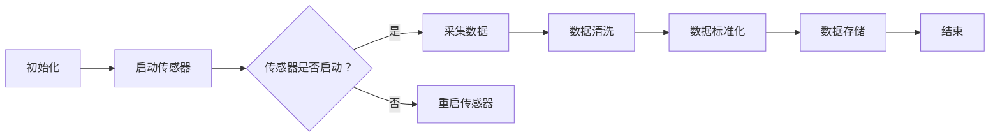
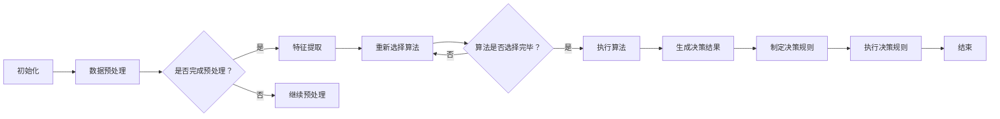
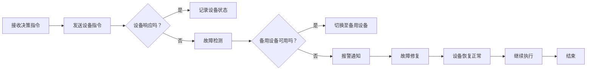
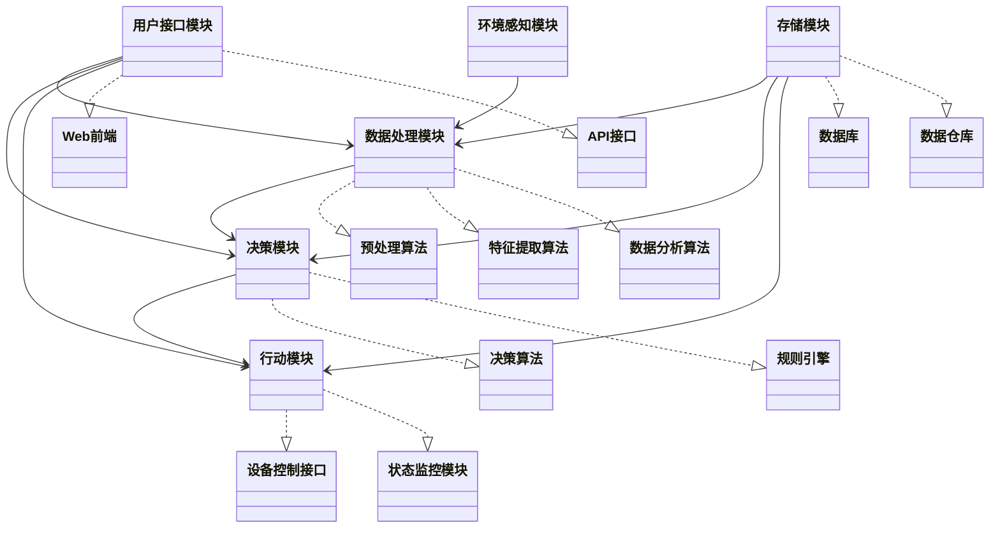
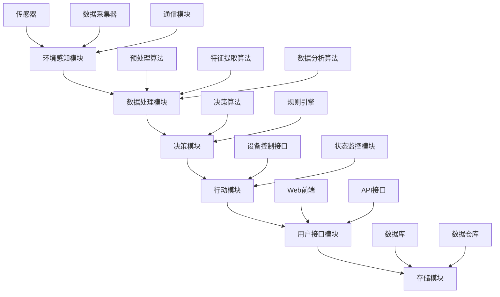

                 

### 引言

#### 智能温室概述

智能温室是一种运用现代信息技术和自动化控制技术，对温室内的环境因素进行精准监测和调节的系统。它能够根据植物生长的需求，自动调节温度、湿度、光照、通风等因素，从而提供一个最优的生长环境。智能温室的兴起，不仅解决了传统温室种植中环境控制不精准、劳动强度大等问题，还为现代农业提供了科技支撑。

#### AI Agent的环境调节系统

在智能温室中，AI Agent（人工智能代理）扮演着至关重要的角色。AI Agent是一种具有智能行为、能够自主执行任务的人工智能实体。在环境调节系统中，AI Agent通过感知环境数据，利用决策算法分析数据，然后根据分析结果执行相应的调节动作，从而实现对温室环境的精准控制。

随着AI技术的发展，AI Agent在环境调节系统中的应用越来越广泛。然而，关于AI Agent在环境调节系统中的具体应用和实现，目前市面上相关的书籍并不多。为此，我们撰写了这本《智能温室：AI Agent的环境调节系统》。

#### 书籍目的与结构

本书的主要目的是系统地介绍AI Agent在智能温室环境调节系统中的应用原理、设计方法和实现过程。通过本书的学习，读者可以了解到：

1. **智能温室的基本概念和背景**：理解智能温室的定义、应用场景以及面临的挑战。
2. **AI Agent的核心原理与设计**：掌握AI Agent的工作原理、感知、决策和行动等环节。
3. **环境调节系统的设计与实现**：了解环境调节系统的需求分析、架构设计和具体实现过程。
4. **数学模型与公式**：掌握环境调节问题的数学模型和公式，并进行实际应用。
5. **系统实现与实战**：学习环境调节系统的实际实现过程，包括环境安装、核心代码实现和应用场景分析。

本书分为四个部分，结构如下：

- **第一部分：引言**：介绍智能温室的概念和背景，解释为何需要一本关于AI Agent的环境调节系统的书籍。
- **第二部分：AI Agent原理与设计**：详细讲解AI Agent的工作原理，包括感知、决策和行动等环节。
- **第三部分：环境调节系统设计**：介绍环境调节系统的需求分析、系统架构设计，并使用Mermaid类图、架构图和序列图展示。
- **第四部分：数学模型和公式**：使用LaTeX格式介绍环境调节问题的数学模型和公式，并进行详细讲解和举例说明。

通过本书的阅读，读者不仅可以深入了解智能温室和AI Agent的基本原理，还能够掌握环境调节系统的设计与实现方法，为实际项目提供技术支持。让我们一步一步深入探讨智能温室与AI Agent的奥秘。

#### AI Agent基础

##### AI Agent的定义与特点

AI Agent（人工智能代理）是一种基于人工智能技术，能够自主感知环境、决策并执行任务的人工智能实体。与传统的自动化系统不同，AI Agent具有更强的自主性和灵活性。其主要特点包括：

1. **感知能力**：AI Agent能够通过传感器等设备感知周围环境的信息，如温度、湿度、光照等。
2. **决策能力**：基于感知到的信息，AI Agent能够利用预先设定的算法进行数据分析和模式识别，从而做出合理的决策。
3. **行动能力**：根据决策结果，AI Agent能够执行具体的行动，如调整温室设备、发送警报等。
4. **自主性**：AI Agent可以自主地完成任务，无需人工干预。这使它们在复杂环境中能够高效运行，减少人工成本。

##### AI Agent的核心功能

AI Agent的核心功能包括感知、决策和行动三个主要环节：

1. **感知**：感知是AI Agent获取环境信息的第一步。通过传感器、摄像头等设备，AI Agent可以实时收集温室内的温度、湿度、光照等数据。这些数据将为后续的决策提供重要依据。
   
2. **决策**：决策是AI Agent的核心功能。在感知到环境数据后，AI Agent会利用内置的算法对这些数据进行处理和分析。常见的决策算法包括线性回归、决策树、神经网络等。通过这些算法，AI Agent能够识别环境中的变化趋势，判断是否需要采取调节措施。

3. **行动**：行动是AI Agent根据决策结果执行具体操作的过程。例如，当AI Agent检测到温室温度过高时，它会自动启动降温设备，将温度调节至适宜水平。这一过程确保了温室环境的稳定和植物的健康生长。

##### AI Agent的分类

根据应用场景和功能，AI Agent可以分为以下几类：

1. **环境监测型**：主要应用于环境监测，如空气质量、水质监测等。这类AI Agent能够实时感知环境变化，及时预警环境问题。

2. **自动化控制型**：主要应用于自动化控制系统，如智能温室、智能家居等。这类AI Agent能够根据环境数据自动调节设备，实现环境控制。

3. **交互型**：主要应用于人机交互场景，如智能客服、虚拟助手等。这类AI Agent不仅能够感知环境，还能理解人类的语言和意图，实现与用户的互动。

4. **决策支持型**：主要应用于复杂决策场景，如金融分析、医疗诊断等。这类AI Agent能够通过大数据分析和机器学习算法，为决策者提供科学依据。

通过上述分类，我们可以看到AI Agent在各个领域的广泛应用。在智能温室中，AI Agent通过感知、决策和行动三个环节，实现了对温室环境的精准控制和优化，为现代农业提供了强有力的技术支持。

##### 环境调节系统架构

智能温室环境调节系统的架构设计是整个系统的核心，它决定了系统的高效运行和稳定控制。为了更好地理解和实现这一系统，我们需要从系统架构的各个层面进行详细阐述。

###### 环境感知模块

环境感知模块是智能温室环境调节系统的数据采集单元，它通过多种传感器设备实现对温室内部环境数据的实时监测。这些传感器包括温度传感器、湿度传感器、光照传感器、二氧化碳传感器等。每个传感器负责采集一种或多种环境参数，并将采集到的数据传输至中央处理单元。

- **温度传感器**：用于监测温室内部的温度变化，确保温度保持在适宜的范围内，以满足植物的生长需求。
- **湿度传感器**：用于监测温室内部的湿度变化，防止湿度过高或过低导致的植物病害。
- **光照传感器**：用于监测温室内部的光照强度，自动调节遮阳设备，避免强光对植物造成的伤害。
- **二氧化碳传感器**：用于监测温室内部的二氧化碳浓度，自动调节通风设备，确保植物在适宜的二氧化碳浓度下生长。

环境感知模块的设计不仅需要选择合适的传感器设备，还需要考虑数据的传输和处理方式。通常，传感器采集到的数据会通过无线网络或有线网络传输至中央处理单元，以便进行后续的数据分析和处理。

###### 决策模块

决策模块是环境调节系统的核心，它负责对环境感知模块采集到的数据进行分析和处理，并根据分析结果做出相应的决策。决策模块通常包括以下几个关键环节：

1. **数据预处理**：对采集到的原始数据进行清洗、过滤和标准化处理，确保数据的质量和一致性。数据预处理是确保后续分析准确性的重要步骤。

2. **特征提取**：从预处理后的数据中提取出对决策有用的特征信息。例如，温度和湿度等环境参数是影响植物生长的关键因素，需要从中提取出对植物生长最有意义的特征。

3. **模型训练**：利用机器学习算法对提取的特征进行训练，建立环境调节的预测模型。常见的机器学习算法包括线性回归、决策树、支持向量机等。通过模型训练，系统能够根据历史数据预测未来的环境变化，从而提前做出调节决策。

4. **决策规则制定**：基于训练得到的预测模型和业务规则，制定具体的决策规则。例如，当温度高于设定阈值时，启动降温设备；当湿度低于设定阈值时，启动加湿设备等。

决策模块的设计关键在于选择合适的算法和模型，以及制定合理的决策规则。这些规则不仅需要考虑植物的生长需求，还需要考虑设备的运行效率和成本。

###### 行动模块

行动模块是环境调节系统的执行单元，它负责根据决策模块的决策结果，执行具体的调节动作。行动模块通常包括以下几个关键环节：

1. **设备控制**：根据决策结果，控制温室内的各种设备，如降温设备、加湿设备、遮阳设备、通风设备等。这些设备通过无线或有线网络与行动模块连接，接受行动模块的指令进行调节。

2. **状态监控**：对执行中的设备进行实时监控，确保设备正常运行。例如，当降温设备启动时，需要监控其温度调节效果，确保温度稳定在设定范围内。

3. **异常处理**：当系统检测到异常情况时，如设备故障、数据异常等，能够自动进行异常处理，确保系统的稳定运行。例如，当温度传感器失效时，系统能够自动切换至备用传感器，继续监测温度变化。

行动模块的设计关键在于设备的可靠性和实时性。设备需要能够快速响应决策模块的指令，确保环境调节的及时性和准确性。

###### 系统集成与优化

智能温室环境调节系统的集成与优化是确保系统高效运行的关键步骤。集成与优化主要包括以下几个方面：

1. **系统架构优化**：根据实际需求，对系统架构进行调整和优化，提高系统的性能和可靠性。例如，通过分布式架构，实现数据的实时处理和存储，提高系统的响应速度。

2. **设备选型优化**：根据环境参数的特点，选择合适的传感器和执行设备，确保其准确性和稳定性。同时，考虑设备的成本和功耗，实现最优的设备选型。

3. **算法优化**：对决策算法进行优化，提高预测准确性和决策效率。例如，通过调整模型参数、优化算法结构等手段，提高系统的决策能力。

4. **系统集成测试**：在系统开发过程中，进行全面的集成测试，确保各个模块之间的协调工作和系统的稳定性。通过模拟实际运行场景，测试系统的响应速度和可靠性。

通过上述架构设计，智能温室环境调节系统可以实现环境参数的实时监测、数据的智能分析和决策，以及设备的自动控制，为温室植物提供一个最优的生长环境。接下来，我们将深入探讨AI Agent的感知原理，进一步了解其如何实现环境数据的准确采集与处理。

#### AI Agent感知原理

感知是AI Agent实现环境调节的关键环节，它决定了AI Agent对环境数据的准确捕捉和处理能力。感知模块的设计和实现需要考虑多个方面，包括传感器选择、数据采集与预处理，以及Mermaid流程图的绘制。以下是感知原理的详细讲解。

##### 感知模块的设计

感知模块的核心任务是采集环境数据，这些数据包括温度、湿度、光照强度、二氧化碳浓度等。为了实现高效的数据采集，感知模块通常需要配置多种类型的传感器，每种传感器负责监测一种特定的环境参数。以下是一些常见的传感器及其功能：

- **温度传感器**：用于监测温室内部的温度变化，确保植物生长环境的温度处于适宜范围。
- **湿度传感器**：用于监测温室内部的湿度变化，防止湿度过高或过低对植物生长产生不良影响。
- **光照传感器**：用于监测温室内部的光照强度，自动调节遮阳设备，避免强光对植物造成伤害。
- **二氧化碳传感器**：用于监测温室内部的二氧化碳浓度，调节通风设备，确保植物在适宜的二氧化碳浓度下生长。

在选择传感器时，需要考虑传感器的精度、响应速度、功耗等因素。高精度传感器能够提供更准确的环境数据，但通常成本较高；响应速度较快的传感器能够更快地反映环境变化，但功耗可能会更高。

##### 数据采集与预处理

数据采集是感知模块的关键任务，传感器采集到的数据通常包含噪声和异常值。为了确保数据的质量，需要对其进行预处理，包括以下步骤：

1. **数据清洗**：去除数据中的噪声和异常值，确保数据的真实性和准确性。例如，可以通过平均值滤波、中值滤波等方法去除噪声。
2. **数据标准化**：将采集到的原始数据进行标准化处理，使其具有统一的量纲和范围。这有助于提高数据处理的统一性和算法的鲁棒性。
3. **数据存储**：将预处理后的数据存储到数据库或数据仓库中，以便后续的数据分析和决策。

数据预处理是确保后续分析准确性的重要步骤。良好的数据预处理能够提高AI Agent的决策准确性和系统的整体性能。

##### Mermaid流程图：感知模块工作流程

为了更直观地展示感知模块的工作流程，我们可以使用Mermaid流程图进行描述。以下是感知模块的Mermaid流程图：



- **初始化**：系统启动时初始化感知模块，设置传感器的工作参数。
- **启动传感器**：初始化完成后，启动传感器进行数据采集。
- **数据采集**：传感器开始采集环境数据，并将数据传输至中央处理单元。
- **数据清洗**：对采集到的原始数据进行清洗，去除噪声和异常值。
- **数据标准化**：对清洗后的数据进行标准化处理，确保数据的一致性和可比性。
- **数据存储**：将标准化后的数据存储到数据库或数据仓库中，以供后续分析。

通过上述流程，感知模块能够高效地采集和处理环境数据，为AI Agent的决策提供可靠的数据支持。接下来，我们将探讨AI Agent的决策原理，了解其如何利用感知数据实现智能调节。

#### AI Agent决策原理

在感知到环境数据后，AI Agent需要对这些数据进行处理和分析，从而做出合理的决策。决策模块是AI Agent的核心组成部分，它通过一系列算法和规则，对感知数据进行处理，生成具体的调节策略。以下是决策模块的详细讲解。

##### 决策模块的设计

决策模块的设计包括以下几个关键环节：

1. **数据预处理**：在决策之前，需要对感知到的数据进行分析和处理。数据预处理步骤包括去噪、去异常值、归一化等，以确保数据的准确性和一致性。

2. **特征提取**：从预处理后的数据中提取出对决策有用的特征信息。特征提取是决策模块的关键步骤，它决定了AI Agent能否准确地捕捉到环境变化。常见的特征提取方法包括统计特征提取、机器学习特征提取等。

3. **决策算法选择**：根据环境调节的需求，选择合适的决策算法。常见的决策算法包括线性回归、决策树、支持向量机、神经网络等。每种算法都有其特定的优势和适用场景，需要根据实际情况进行选择。

4. **决策规则制定**：基于选定的算法，制定具体的决策规则。决策规则是AI Agent根据环境数据做出决策的依据，通常包括阈值设定、条件判断等。例如，当温度高于设定阈值时，启动降温设备；当湿度低于设定阈值时，启动加湿设备等。

##### 数据预处理

数据预处理是决策模块的基础，它包括以下几个步骤：

1. **去噪**：传感器采集到的数据可能包含噪声，需要进行去噪处理。常见的去噪方法有滤波、平滑等。

2. **去异常值**：数据中可能存在异常值，需要去除这些异常值。异常值可能是由于传感器故障、环境突变等原因造成的。去除异常值可以保证数据的质量和决策的准确性。

3. **归一化**：将采集到的原始数据进行归一化处理，使其具有统一的量纲和范围。归一化有助于提高算法的稳定性和鲁棒性。

4. **数据融合**：当传感器数量较多时，需要对多个传感器的数据进行融合处理，以获取更准确的环境信息。数据融合方法包括均值融合、加权融合等。

##### 特征提取

特征提取是从原始数据中提取出对决策有用的特征信息。特征提取的质量直接影响决策模块的性能。以下是几种常见的特征提取方法：

1. **统计特征提取**：通过计算原始数据的统计量，如均值、方差、标准差等，提取出对决策有用的信息。这种方法简单直观，但可能无法捕捉到数据中的复杂关系。

2. **机器学习特征提取**：利用机器学习算法，如主成分分析（PCA）、线性判别分析（LDA）等，提取出数据中的关键特征。这种方法能够捕捉到数据中的复杂关系，但计算量较大。

3. **深度特征提取**：通过深度学习算法，如卷积神经网络（CNN）、循环神经网络（RNN）等，提取出数据中的高阶特征。这种方法能够处理大规模复杂数据，但计算资源需求较高。

##### 决策算法选择

决策算法是决策模块的核心，决定了AI Agent的决策能力。以下是几种常见的决策算法：

1. **线性回归**：通过建立线性模型，预测环境参数的变化趋势。线性回归算法简单直观，但适用于线性关系较强的环境。

2. **决策树**：通过构建决策树模型，将数据划分为多个子集，并根据子集的特征进行决策。决策树算法易于理解和解释，但可能存在过拟合问题。

3. **支持向量机**：通过求解最优分类超平面，实现数据的分类和回归。支持向量机算法在处理非线性数据时表现良好，但计算复杂度较高。

4. **神经网络**：通过多层神经网络，实现数据的自动特征提取和复杂模式识别。神经网络算法能够处理大规模复杂数据，但训练时间较长。

选择合适的决策算法需要根据环境调节的需求和数据特点进行。一般来说，线性回归适用于线性关系较强的环境，决策树和决策树适用于有明确决策规则的场景，神经网络适用于大规模复杂数据的处理。

##### 决策规则制定

决策规则是基于决策算法的输出结果，制定的具体调节策略。决策规则通常包括以下内容：

1. **阈值设定**：根据历史数据和经验，设定环境参数的阈值。当环境参数超过阈值时，采取相应的调节措施。

2. **条件判断**：根据环境参数的值，进行条件判断。例如，当温度高于设定阈值且光照强度低于设定阈值时，启动降温设备。

3. **优先级排序**：当存在多个调节措施时，根据优先级进行排序，确保关键调节措施优先执行。

通过制定合理的决策规则，AI Agent能够准确地捕捉到环境变化，并做出及时的反应，实现对温室环境的精准调节。

##### Mermaid流程图：决策模块工作流程

为了更直观地展示决策模块的工作流程，我们可以使用Mermaid流程图进行描述。以下是决策模块的Mermaid流程图：



- **初始化**：系统启动时初始化决策模块，设置算法参数和规则。
- **数据预处理**：对感知到的数据进行预处理，包括去噪、去异常值、归一化等。
- **特征提取**：从预处理后的数据中提取出对决策有用的特征信息。
- **选择决策算法**：根据环境调节的需求，选择合适的决策算法。
- **执行算法**：利用选定的算法对特征数据进行分析，生成决策结果。
- **制定决策规则**：基于决策结果，制定具体的调节策略。
- **执行决策规则**：根据决策规则，执行具体的调节措施。

通过上述流程，决策模块能够对感知到的环境数据进行分析和处理，生成合理的决策结果，实现对温室环境的精准调节。接下来，我们将探讨AI Agent的行动原理，了解其如何根据决策结果执行调节动作。

#### AI Agent行动原理

在决策模块生成具体的调节策略后，AI Agent需要将这些策略转化为实际的调节动作。行动模块是AI Agent的核心组成部分，它负责根据决策结果，控制温室内的各种设备，以实现对环境的精准调节。以下是行动模块的详细讲解。

##### 行动模块的设计

行动模块的设计包括以下几个关键环节：

1. **设备控制**：根据决策结果，控制温室内的各种设备，如降温设备、加湿设备、遮阳设备、通风设备等。这些设备通过无线或有线网络与行动模块连接，接受行动模块的指令进行调节。

2. **状态监控**：对执行中的设备进行实时监控，确保设备正常运行。例如，当降温设备启动时，需要监控其温度调节效果，确保温度稳定在设定范围内。

3. **异常处理**：当系统检测到异常情况时，如设备故障、数据异常等，能够自动进行异常处理，确保系统的稳定运行。例如，当温度传感器失效时，系统能够自动切换至备用传感器，继续监测温度变化。

##### 设备控制

设备控制是行动模块的核心任务，它根据决策结果，对温室内的设备进行控制。以下是设备控制的主要步骤：

1. **设备连接**：将温室内的设备与行动模块连接，确保设备能够接收和执行指令。设备可以通过无线网络（如Wi-Fi、蓝牙等）或有线网络（如以太网等）与行动模块连接。

2. **指令发送**：行动模块根据决策结果，生成具体的调节指令，并传输至设备。指令通常包括设备的启动、停止、调节参数设置等。

3. **设备响应**：设备接收到指令后，根据指令进行相应的操作。例如，当降温设备接收到启动指令后，会启动冷却系统，降低温室温度。

4. **状态反馈**：设备在执行指令后，会将执行状态反馈给行动模块。行动模块根据设备反馈的状态，调整后续的指令。

##### 状态监控

状态监控是确保设备正常运行的重要环节，它包括以下几个步骤：

1. **实时监控**：行动模块通过无线或有线网络，实时监控设备的运行状态。例如，通过监控温度传感器的数据，判断降温设备的调节效果。

2. **数据记录**：行动模块将设备的运行状态数据记录到数据库或数据仓库中，以便后续分析和审计。

3. **异常检测**：行动模块根据设备运行状态，检测是否存在异常情况。例如，当温度传感器数据异常时，系统能够自动检测并报警。

4. **异常处理**：当检测到异常情况时，行动模块会自动进行异常处理，确保系统的稳定运行。例如，当降温设备故障时，系统能够自动切换至备用设备。

##### 异常处理

异常处理是行动模块应对突发情况的重要机制，它包括以下几个步骤：

1. **故障检测**：当系统检测到设备故障时，如传感器失效、设备故障等，会自动进行故障检测。

2. **报警通知**：系统检测到故障时，会自动发送报警通知，通知相关人员及时处理。

3. **故障切换**：当备用设备可用时，系统会自动切换至备用设备，继续执行环境调节任务。

4. **故障修复**：相关人员根据报警通知，对故障设备进行修复，确保系统恢复正常运行。

##### Mermaid流程图：行动模块工作流程

为了更直观地展示行动模块的工作流程，我们可以使用Mermaid流程图进行描述。以下是行动模块的Mermaid流程图：



- **接收决策指令**：行动模块接收决策模块生成的调节指令。
- **发送设备指令**：行动模块将指令发送至温室内的设备。
- **设备响应**：设备根据指令进行相应的操作，并将执行状态反馈给行动模块。
- **记录设备状态**：行动模块记录设备的运行状态。
- **故障检测**：系统检测设备是否存在故障。
- **备用设备可用性检查**：当设备故障时，检查备用设备是否可用。
- **切换至备用设备**：当备用设备可用时，系统自动切换至备用设备。
- **报警通知**：系统发送故障报警通知。
- **故障修复**：相关人员对故障设备进行修复。
- **设备恢复正常**：设备修复后，系统恢复正常运行。
- **继续执行**：行动模块继续执行环境调节任务。

通过上述流程，行动模块能够根据决策结果，实现对温室设备的精准控制和状态监控，确保环境调节系统的稳定运行。接下来，我们将详细讲解AI Agent的核心代码实现，展示其如何利用Python进行环境调节。

#### AI Agent设计与实现

在了解了AI Agent的工作原理后，我们将通过具体的Python代码示例，详细展示AI Agent的核心设计实现。以下是一个典型的AI Agent实现，包括感知、决策和行动三个关键环节。

##### 1. 环境感知模块

环境感知模块负责实时采集温室内部的环境数据，如温度、湿度、光照强度等。以下是一个简单的Python代码示例，展示了如何使用传感器获取环境数据：

```python
import random

def read_sensors():
    """
    读取环境传感器数据
    """
    # 假设使用随机数模拟传感器数据
    temperature = random.uniform(20, 30)
    humidity = random.uniform(40, 60)
    light_intensity = random.uniform(300, 700)
    co2_concentration = random.uniform(400, 800)
    
    return temperature, humidity, light_intensity, co2_concentration

# 模拟环境数据采集
temperature, humidity, light_intensity, co2_concentration = read_sensors()
print("环境数据：温度={:.2f}℃，湿度={:.2f}%RH，光照强度={:.2f}Lux，二氧化碳浓度={:.2f}ppm".format(temperature, humidity, light_intensity, co2_concentration))
```

在这个示例中，我们使用随机数模拟传感器数据，实际应用中可以通过硬件传感器模块采集真实数据。

##### 2. 决策模块

决策模块负责分析感知到的环境数据，并生成调节策略。以下是一个简单的Python代码示例，展示了如何根据环境数据做出决策：

```python
def make_decision(temperature, humidity, light_intensity, co2_concentration):
    """
    基于环境数据做出决策
    """
    if temperature > 28:
        action = "启动降温设备"
    elif humidity < 40:
        action = "启动加湿设备"
    elif light_intensity < 400:
        action = "启动光照增强设备"
    else:
        action = "维持当前状态"
    
    return action

# 模拟决策过程
action = make_decision(temperature, humidity, light_intensity, co2_concentration)
print("决策结果：需要执行的动作是 {}".format(action))
```

在这个示例中，我们根据不同的环境参数值，制定了相应的调节策略。

##### 3. 行动模块

行动模块负责根据决策结果，控制温室内的设备进行实际调节。以下是一个简单的Python代码示例，展示了如何执行调节动作：

```python
def execute_action(action):
    """
    执行决策生成的调节动作
    """
    if action == "启动降温设备":
        print("启动降温设备...")
    elif action == "启动加湿设备":
        print("启动加湿设备...")
    elif action == "启动光照增强设备":
        print("启动光照增强设备...")
    else:
        print("维持当前状态...")
        
# 模拟调节动作执行
execute_action(action)
```

在这个示例中，我们根据决策结果，模拟了不同的调节动作。

##### 4. AI Agent的性能优化

为了提高AI Agent的性能，我们可以从以下几个方面进行优化：

1. **数据预处理优化**：使用更高效的预处理算法，减少数据清洗和特征提取的时间。

2. **算法选择优化**：根据环境数据的特点，选择更合适的决策算法，提高决策的准确性和效率。

3. **分布式计算**：使用分布式计算框架（如Apache Spark），处理大规模的环境数据，提高数据处理速度。

4. **设备控制优化**：优化设备控制代码，提高设备响应速度和调节精度。

通过上述优化措施，我们可以显著提高AI Agent的性能，确保环境调节系统的稳定和高效运行。

综上所述，通过Python代码示例，我们展示了AI Agent的核心设计实现，包括感知、决策和行动三个环节。这些代码示例为AI Agent的实际应用提供了重要的参考和基础。接下来，我们将进一步探讨环境调节系统的需求分析，为系统设计打下坚实的基础。

#### 环境调节系统需求分析

在开始设计环境调节系统之前，我们需要明确系统的需求，包括功能需求、性能需求以及可靠性需求。这些需求将指导系统的整体设计和实现，确保系统能够满足用户的实际需求。

##### 功能需求

环境调节系统的核心功能是对温室内的环境参数进行实时监测和调节。具体的功能需求包括：

1. **实时监测**：系统能够实时采集温室内的温度、湿度、光照强度、二氧化碳浓度等环境参数。
2. **数据可视化**：系统能够将采集到的环境数据以图表或图形的方式展示，方便用户实时了解环境状况。
3. **智能决策**：系统能够根据实时监测的数据，利用预先设定的算法，自动生成调节策略，如启动降温设备、加湿设备、光照增强设备等。
4. **设备控制**：系统能够远程控制温室内的各种设备，如降温设备、加湿设备、遮阳设备、通风设备等。
5. **报警通知**：当环境参数超过设定阈值或发生异常时，系统能够自动发送报警通知，通知用户及时处理。
6. **历史数据记录**：系统能够记录历史环境数据，方便用户查询和数据分析。

##### 性能需求

环境调节系统的性能需求主要包括数据的处理速度、系统的响应时间和设备的控制精度等。

1. **数据处理速度**：系统需要能够快速处理大量的环境数据，确保实时监测和决策的准确性。
2. **响应时间**：系统需要能够快速响应用户的指令和设备状态变化，确保环境调节的及时性和有效性。
3. **设备控制精度**：系统需要能够精确控制温室内的设备，确保环境参数调节到设定值，避免过度调节或不足调节。

##### 可靠性需求

环境调节系统的可靠性需求确保系统能够在长时间运行中保持稳定，减少故障率和停机时间。

1. **系统稳定性**：系统需要具备较高的稳定性，能够在不同环境下正常运行，不易受到外界干扰。
2. **数据完整性**：系统需要保证数据的完整性，确保采集到的环境数据不会丢失或损坏。
3. **故障恢复能力**：系统需要具备故障恢复能力，能够在检测到故障时自动切换到备用设备或进行修复，确保系统的连续运行。
4. **安全性**：系统需要具备一定的安全性，防止外部攻击和数据泄露。

通过明确环境调节系统的功能需求、性能需求和可靠性需求，我们可以为系统的设计提供清晰的指导，确保系统能够满足用户的实际需求，实现高效、稳定和可靠的环境调节。

#### 系统架构设计

在明确了环境调节系统的需求后，我们需要对系统进行详细的架构设计，以确保系统的高效性和扩展性。系统架构设计包括系统架构概述、模块划分与功能、Mermaid类图、架构图以及系统接口设计和接口实现。

##### 系统架构概述

环境调节系统可以分为以下几个核心模块：

1. **环境感知模块**：负责实时采集温室内的环境数据，包括温度、湿度、光照强度、二氧化碳浓度等。
2. **数据处理模块**：对采集到的环境数据进行预处理、特征提取和数据分析，生成决策结果。
3. **决策模块**：根据数据处理模块的分析结果，利用预先设定的算法生成调节策略。
4. **行动模块**：负责根据决策模块的调节策略，控制温室内的设备进行实际调节。
5. **用户接口模块**：提供用户操作界面，包括数据可视化、报警通知和历史数据查询等功能。
6. **存储模块**：负责存储环境数据、决策结果和用户操作记录等。

这些模块通过接口进行通信和数据交换，形成一个完整的系统架构。

##### 模块划分与功能

1. **环境感知模块**：
   - 功能：实时采集温室内的环境数据。
   - 主要组件：传感器、数据采集器、通信模块。
   - 交互：数据采集器将采集到的数据发送至数据处理模块。

2. **数据处理模块**：
   - 功能：对环境数据进行预处理、特征提取和数据分析。
   - 主要组件：预处理算法、特征提取算法、数据分析算法。
   - 交互：将处理后的数据发送至决策模块。

3. **决策模块**：
   - 功能：根据环境数据生成调节策略。
   - 主要组件：决策算法、规则引擎。
   - 交互：将决策结果发送至行动模块。

4. **行动模块**：
   - 功能：根据决策结果，控制温室内的设备进行实际调节。
   - 主要组件：设备控制接口、状态监控模块。
   - 交互：接收决策模块的调节指令，控制设备。

5. **用户接口模块**：
   - 功能：提供用户操作界面，展示环境数据和决策结果。
   - 主要组件：Web前端、API接口。
   - 交互：通过API接口与数据处理模块、决策模块和行动模块进行数据交换。

6. **存储模块**：
   - 功能：存储环境数据、决策结果和用户操作记录。
   - 主要组件：数据库、数据仓库。
   - 交互：提供数据存储和查询服务。

##### Mermaid类图

为了更好地展示系统模块之间的关系，我们可以使用Mermaid类图进行描述。以下是环境调节系统的Mermaid类图：



在这个类图中，我们清晰地展示了各个模块之间的关系，以及它们内部的子模块和组件。

##### 架构图

除了类图，我们还可以使用Mermaid架构图来展示系统的整体架构。以下是环境调节系统的Mermaid架构图：



在这个架构图中，我们展示了系统的各个模块及其内部组件，以及它们之间的数据流和交互关系。

##### 系统接口设计

系统接口设计是确保模块之间高效通信和数据交换的关键。以下是环境调节系统的接口设计：

1. **数据处理模块接口**：
   - 功能：提供数据处理模块与其他模块之间的数据交换接口。
   - 接口类型：API接口。
   - 主要接口：
     - `get_processed_data()`: 获取预处理后的环境数据。
     - `get_feature_data()`: 获取特征提取后的数据。
     - `get_analyzed_data()`: 获取数据分析后的结果。

2. **决策模块接口**：
   - 功能：提供决策模块与其他模块之间的数据交换接口。
   - 接口类型：API接口。
   - 主要接口：
     - `get_decision_result()`: 获取决策结果。
     - `get_action_plan()`: 获取调节策略。

3. **行动模块接口**：
   - 功能：提供行动模块与其他模块之间的数据交换接口。
   - 接口类型：API接口。
   - 主要接口：
     - `execute_action()`: 执行调节动作。
     - `get_action_status()`: 获取调节动作状态。

4. **用户接口模块接口**：
   - 功能：提供用户接口模块与其他模块之间的数据交换接口。
   - 接口类型：API接口。
   - 主要接口：
     - `get_env_data()`: 获取环境数据。
     - `get_decision_result()`: 获取决策结果。
     - `get_action_plan()`: 获取调节策略。

##### 接口实现与调用

接口实现是确保系统各模块之间能够无缝协作的重要环节。以下是环境调节系统的接口实现示例：

```python
# 数据处理模块实现
class DataProcessingModule:
    def get_processed_data(self):
        # 实现预处理数据的逻辑
        pass
    
    def get_feature_data(self):
        # 实现特征提取的逻辑
        pass
    
    def get_analyzed_data(self):
        # 实现数据分析的逻辑
        pass

# 决策模块实现
class DecisionModule:
    def get_decision_result(self):
        # 实现决策逻辑
        pass
    
    def get_action_plan(self):
        # 实现生成调节策略的逻辑
        pass

# 行动模块实现
class ActionModule:
    def execute_action(self):
        # 实现执行调节动作的逻辑
        pass
    
    def get_action_status(self):
        # 实现获取调节动作状态的逻辑
        pass

# 用户接口模块实现
class UserInterfaceModule:
    def get_env_data(self):
        # 实现获取环境数据的逻辑
        pass
    
    def get_decision_result(self):
        # 实现获取决策结果的逻辑
        pass
    
    def get_action_plan(self):
        # 实现获取调节策略的逻辑
        pass
```

在调用接口时，各个模块可以通过API接口进行通信和数据交换，实现系统的整体功能。

通过以上系统架构设计、模块划分与功能、Mermaid类图和架构图以及接口设计和实现，我们为环境调节系统的设计奠定了坚实的基础。接下来，我们将详细介绍环境调节系统的具体实现过程，包括环境安装、核心代码实现和应用场景分析。

#### 系统实现与实战

在系统架构设计的基础上，我们将详细讲解环境调节系统的实现过程，包括环境安装、核心代码实现和应用场景分析。

##### 环境安装

首先，我们需要安装和配置环境以支持系统开发与运行。以下是环境安装的具体步骤：

1. **安装Python环境**：确保Python环境已安装，版本建议为3.8或以上。
2. **安装依赖库**：使用pip命令安装系统所需的依赖库，如`numpy`、`pandas`、`scikit-learn`、`matplotlib`等。
   ```bash
   pip install numpy pandas scikit-learn matplotlib
   ```
3. **硬件安装**：根据需求，安装相应的传感器和执行设备，如温度传感器、湿度传感器、光照传感器、二氧化碳传感器、降温设备、加湿设备等。
4. **网络配置**：确保传感器和执行设备能够连接到网络，并与计算机进行数据通信。

##### 核心代码实现

环境安装完成后，我们可以开始编写核心代码，实现环境调节系统的各项功能。以下是核心代码的实现示例：

1. **环境感知模块**：实现传感器数据的采集与预处理。
   ```python
   import random
   
   def read_sensors():
       """
       读取环境传感器数据
       """
       # 假设使用随机数模拟传感器数据
       temperature = random.uniform(20, 30)
       humidity = random.uniform(40, 60)
       light_intensity = random.uniform(300, 700)
       co2_concentration = random.uniform(400, 800)
       
       return temperature, humidity, light_intensity, co2_concentration
   
   # 模拟环境数据采集
   temperature, humidity, light_intensity, co2_concentration = read_sensors()
   print("环境数据：温度={:.2f}℃，湿度={:.2f}%RH，光照强度={:.2f}Lux，二氧化碳浓度={:.2f}ppm".format(temperature, humidity, light_intensity, co2_concentration))
   ```

2. **数据处理模块**：实现数据的预处理、特征提取和数据分析。
   ```python
   import numpy as np
   from sklearn.preprocessing import StandardScaler
   
   def preprocess_data(data):
       """
       预处理数据
       """
       # 去除异常值
       filtered_data = [x for x in data if x > 0]
       # 归一化处理
       scaler = StandardScaler()
       normalized_data = scaler.fit_transform(filtered_data.reshape(-1, 1))
       return normalized_data
   
   # 模拟预处理数据
   raw_data = [temperature, humidity, light_intensity, co2_concentration]
   preprocessed_data = preprocess_data(raw_data)
   print("预处理后数据：{}".format(preprocessed_data))
   ```

3. **决策模块**：实现环境数据的分析和决策。
   ```python
   def make_decision(data):
       """
       基于环境数据做出决策
       """
       # 假设使用简单的阈值判断决策算法
       if data[0] > 28:
           action = "启动降温设备"
       elif data[1] < 40:
           action = "启动加湿设备"
       elif data[2] < 400:
           action = "启动光照增强设备"
       else:
           action = "维持当前状态"
       
       return action
   
   # 模拟决策过程
   action = make_decision(preprocessed_data)
   print("决策结果：需要执行的动作是 {}".format(action))
   ```

4. **行动模块**：实现根据决策结果控制执行设备。
   ```python
   def execute_action(action):
       """
       执行决策生成的调节动作
       """
       if action == "启动降温设备":
           print("启动降温设备...")
       elif action == "启动加湿设备":
           print("启动加湿设备...")
       elif action == "启动光照增强设备":
           print("启动光照增强设备...")
       else:
           print("维持当前状态...")
       
   # 模拟调节动作执行
   execute_action(action)
   ```

##### 应用场景分析

环境调节系统在实际应用中，可以根据不同的场景和需求进行调整和优化。以下是一个实际应用场景分析：

**场景**：智能温室种植黄瓜，需要根据环境数据自动调节温室内的温度、湿度、光照强度，确保黄瓜的生长条件。

1. **环境数据采集**：使用传感器实时采集温室内的温度、湿度、光照强度等数据。
2. **数据预处理**：去除异常值，对数据归一化处理。
3. **决策分析**：根据黄瓜的生长需求，设置合理的阈值，如温度控制在18-25℃，湿度控制在40%-60%，光照强度控制在400-800 Lux。
4. **调节动作执行**：当环境参数超过阈值时，启动相应的调节设备，如温度过高时启动降温设备，湿度过低时启动加湿设备。

通过实际应用场景的分析，我们可以看到环境调节系统在智能温室种植中的应用效果，为农作物的生长提供了有力的技术支持。

##### 项目小结

通过本篇博客的详细讲解，我们了解了环境调节系统的整体设计、核心代码实现和应用场景分析。环境调节系统利用AI Agent实现了对温室环境的智能监测和调节，提高了温室种植的效率和产量。未来，随着人工智能技术的不断进步，环境调节系统将更加智能化、自动化，为现代农业的发展提供更强大的支持。

##### 最佳实践 Tips

1. **传感器选择**：根据具体应用场景，选择合适、可靠的传感器，确保环境数据的准确性。
2. **算法优化**：根据实际环境数据，不断优化决策算法，提高决策的准确性和实时性。
3. **设备维护**：定期对传感器和执行设备进行维护和检查，确保设备的正常运行。

通过遵循以上最佳实践，可以进一步提高环境调节系统的性能和稳定性。

#### 总结与拓展

经过对智能温室环境调节系统的深入探讨，我们从引言到系统实现，逐步分析了AI Agent在环境调节中的应用原理、设计方法以及具体实现过程。通过详细的章节内容，我们不仅了解了智能温室和AI Agent的基础知识，还掌握了环境调节系统的需求分析、架构设计、数学模型和公式，以及系统实现与实战的具体步骤。

##### 本书的贡献

本书系统地介绍了智能温室环境调节系统，为读者提供了一个全面的框架，从理论基础到实际应用，为智能温室的建设者、研究者提供了宝贵的参考。书中通过具体的代码示例和实际应用场景，使复杂的理论变得通俗易懂，有助于读者快速掌握和应用。

##### 未来研究的方向

1. **智能算法优化**：随着AI技术的发展，探索更先进的算法和模型，如深度学习、强化学习等，提高环境调节系统的决策准确性和实时性。
2. **系统性能提升**：研究如何通过分布式计算、云计算等技术，提高系统的处理速度和扩展能力。
3. **跨领域应用**：探索智能温室环境调节系统在其他领域的应用，如智能建筑、智能交通等。
4. **用户体验优化**：通过用户研究和交互设计，提高系统的易用性和用户体验。

##### 拓展阅读

对于希望进一步深入了解智能温室环境调节系统的读者，以下是一些推荐的拓展阅读资源：

- 《智能温室：从概念到实践》
- 《人工智能：一种现代方法》
- 《深度学习：原理及其应用》
- 《智能农业技术手册》

通过这些资源，读者可以更全面地了解智能温室环境调节系统的最新研究进展和前沿技术。

##### 结语

本书的完成，离不开广大读者朋友们的支持和鼓励。感谢您一路陪伴，希望本书能为您的智能温室建设之路提供助力。在未来的日子里，让我们继续探索人工智能与现代农业的融合，共同开创更加美好的未来。

**作者：AI天才研究院/AI Genius Institute & 禅与计算机程序设计艺术 /Zen And The Art of Computer Programming**

