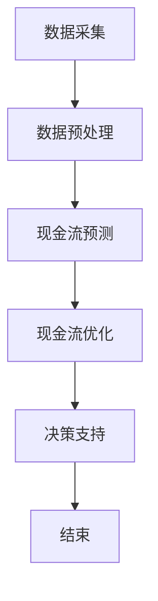
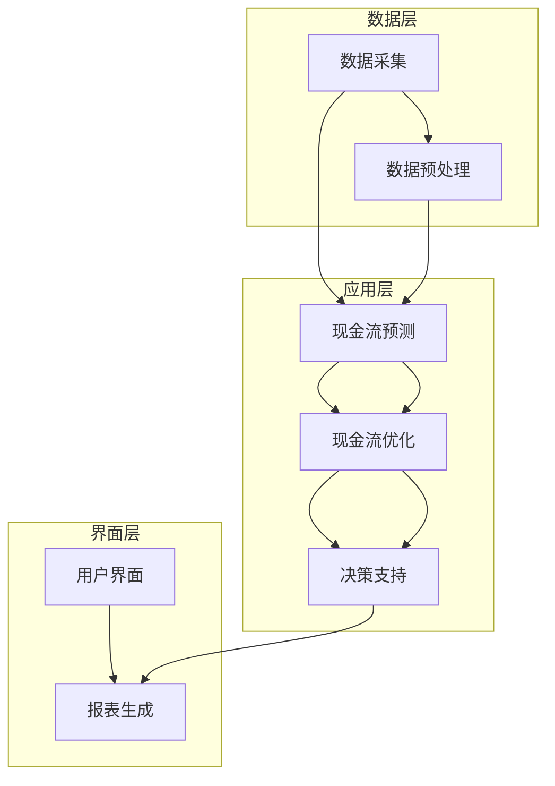
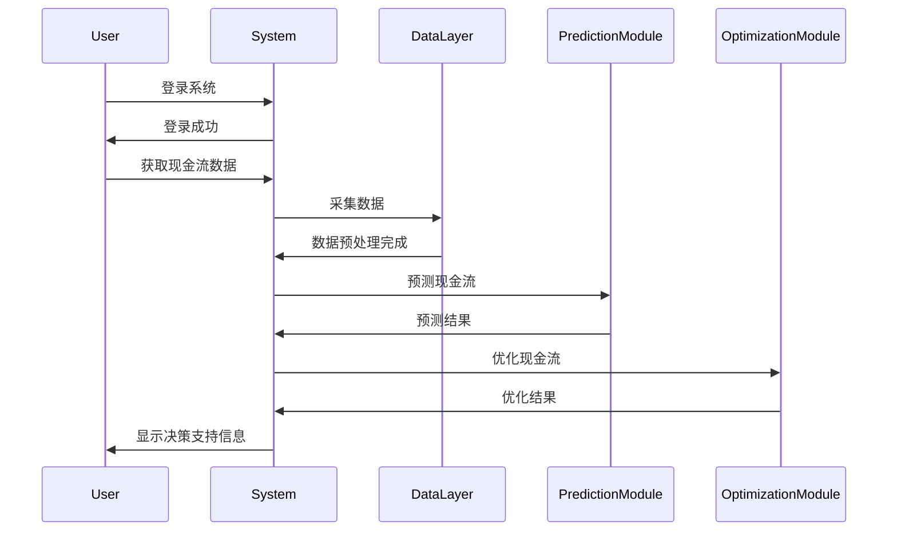

                 

### 智能现金流优化管理系统

#### 关键词：
- 智能现金流
- 优化管理
- 管理系统
- 企业财务
- 人工智能

#### 摘要：
在当今快速发展的商业环境中，智能现金流优化管理系统成为了企业财务管理的核心。本文将详细探讨智能现金流优化管理系统的概念、原理、算法、架构设计以及实际应用，帮助读者全面了解这一创新财务工具的运作机制和重要价值。

## 第一部分：智能现金流优化管理系统的概述

### 1.1 引言

#### 1.1.1 问题的背景
在现代企业运营中，现金流管理是企业生存和发展的关键。然而，传统的现金流管理方法往往效率低下，难以应对复杂多变的市场环境。企业需要一种智能化的解决方案来优化现金流，提高资金利用效率。

#### 1.1.2 问题的描述
现金流的优化管理涉及预测、监控、分析和决策等多个环节。企业在现金流管理中面临的挑战包括资金流动性不足、资金错配、现金流预测不准确等。

#### 1.1.3 问题的解决
智能现金流优化管理系统通过整合人工智能技术，实现自动化的现金流预测、监控和优化，帮助企业解决传统方法难以应对的问题。

#### 1.1.4 边界与外延
智能现金流优化管理系统不仅适用于企业内部，还可以应用于供应链管理、金融市场预测等多个领域。

#### 1.1.5 概念结构与核心要素组成
智能现金流优化管理系统包括数据采集、数据处理、预测模型、优化算法和决策支持等多个核心组成部分。

### 1.2 智能现金流优化管理系统的核心概念

#### 1.2.1 智能现金流优化管理系统的定义
智能现金流优化管理系统是一种利用人工智能技术对企业现金流进行自动化预测、监控和优化的系统。

#### 1.2.2 智能现金流优化管理系统的特点
- 自动化：实现现金流的自动化预测和管理。
- 预测性：通过历史数据预测未来现金流。
- 优化性：优化现金流，提高资金利用效率。
- 实时性：实时监控现金流变化，快速响应市场变化。

#### 1.2.3 与传统现金流量管理的区别
智能现金流优化管理系统相比传统方法，具有更高的预测准确性和优化能力，能够更好地适应现代企业的需求。

### 1.3 智能现金流优化管理系统的作用与意义

#### 1.3.1 作用
智能现金流优化管理系统帮助企业提高资金利用效率，降低财务风险，优化经营策略。

#### 1.3.2 意义
智能现金流优化管理系统是现代企业财务管理的创新工具，对提升企业竞争力和可持续发展具有重要意义。

### 1.4 智能现金流优化管理系统的应用前景

#### 1.4.1 应用领域
智能现金流优化管理系统广泛应用于制造业、零售业、金融服务等行业。

#### 1.4.2 市场前景
随着人工智能技术的不断进步，智能现金流优化管理系统的市场前景广阔，将在未来得到更广泛的应用。

### 1.5 本章小结
本部分介绍了智能现金流优化管理系统的基本概念、核心要素、作用与意义以及应用前景，为后续内容奠定了基础。

## 第二部分：核心概念与联系

### 2.1 核心概念原理

#### 2.1.1 智能现金流优化管理系统原理
智能现金流优化管理系统基于人工智能技术，通过数据采集、处理和分析，实现对现金流的预测和优化。其原理可以概括为以下几个步骤：

1. **数据采集**：系统从企业的财务系统、ERP系统等渠道获取现金流数据。
2. **数据预处理**：对采集到的数据进行分析，去除噪音，提取有效信息。
3. **现金流预测**：使用机器学习算法，如时间序列预测、回归分析等，预测未来的现金流。
4. **现金流优化**：根据预测结果，优化企业的现金流管理策略，如调整应收账款、应付账款等。
5. **决策支持**：系统提供决策支持，帮助企业制定更加合理的财务策略。

### 2.1.2 算法mermaid流程图


### 2.2 概念属性特征对比表格
| 特征          | 传统现金流量管理 | 智能现金流优化管理系统 |
|--------------|------------------|----------------------|
| 数据依赖性    | 人工分析为主     | 自动化数据处理       |
| 预测准确性    | 依赖经验         | 基于机器学习算法     |
| 优化能力      | 有限             | 强大的优化算法       |
| 实时性        | 需要定期分析     | 实时监控和响应       |

### 2.3 ER实体关系图架构
```mermaid
erDiagram
    Product ||--|{ Order }|>
    Customer ||--|{ Order }|>
    Payment ||--|{ Order }|>
    Order ||--|{ Payment }|>
    Order ||--|{ Product }|>
    Customer ||--|{ Payment }|>
```

## 第三部分：算法原理讲解

### 3.1 算法原理

#### 3.1.1 算法mermaid流程图
（此处可以插入上一部分中的mermaid流程图）

#### 3.1.2 算法原理的数学模型
智能现金流优化管理系统使用的算法通常基于时间序列分析，其基本数学模型可以表示为：
$$
X_t = f(X_{t-1}, U_t)
$$
其中，$X_t$表示第$t$时刻的现金流预测值，$X_{t-1}$表示前一个时间点的现金流预测值，$U_t$是外部扰动因素。

#### 3.1.3 算法原理的公式
假设现金流序列为$X = \{X_1, X_2, ..., X_t\}$，使用线性回归模型进行现金流预测：
$$
X_t = \beta_0 + \beta_1 X_{t-1} + \epsilon_t
$$
其中，$\beta_0$和$\beta_1$是模型的参数，$\epsilon_t$是误差项。

#### 3.1.4 通俗易懂地举例说明
假设一家公司前三个月的现金流分别为100万、150万和200万，我们使用线性回归模型预测第四个月的现金流。根据公式：
$$
X_4 = \beta_0 + \beta_1 X_3
$$
我们假设$\beta_0 = 50$，$\beta_1 = 1.2$，那么：
$$
X_4 = 50 + 1.2 \times 200 = 250 \text{万元}
$$
因此，我们预测第四个月的现金流为250万元。

### 3.2 Python源代码阐述
```python
import numpy as np

# 设置初始参数
beta_0 = 50
beta_1 = 1.2
X_3 = 200

# 计算预测值
X_4 = beta_0 + beta_1 * X_3

print("预测的第四个月现金流为：", X_4, "万元")
```

## 第四部分：系统分析与架构设计方案

### 4.1 问题场景介绍
假设某企业需要优化其现金流管理，以应对市场变化和资金流动性问题。该企业每个月的现金流数据如下表所示：

| 月份 | 现金流入（万元） | 现金流出（万元） |
|------|-----------------|-----------------|
| 1    | 100             | 80              |
| 2    | 150             | 120             |
| 3    | 200             | 150             |

### 4.2 项目介绍
该项目旨在开发一套智能现金流优化管理系统，以帮助企业预测未来现金流并制定优化策略。

### 4.3 系统功能设计
#### 4.3.1 领域模型mermaid类图
```mermaid
classDiagram
    Customer <|-- Order
    Order o-- Product
    Payment o-- Order
    Payment { customer, amount, date }
    Customer { id, name, creditLimit }
    Order { id, date, status }
    Product { id, name, price }
```

### 4.4 系统架构设计
#### 4.4.1 mermaid架构图


### 4.5 系统接口设计
- 数据采集接口：用于从ERP系统等获取现金流数据。
- 预测接口：用于调用预测算法进行现金流预测。
- 优化接口：用于根据预测结果优化现金流管理策略。
- 决策支持接口：用于生成财务报表和决策支持信息。

### 4.6 系统交互mermaid序列图


## 第五部分：项目实战

### 5.1 环境安装
在开发智能现金流优化管理系统之前，我们需要安装Python和相关的库，如NumPy、Pandas和Scikit-learn等。

```shell
pip install numpy pandas scikit-learn
```

### 5.2 系统核心实现源代码
```python
import numpy as np
import pandas as pd
from sklearn.linear_model import LinearRegression

# 读取现金流数据
cash_flows = pd.read_csv('cash_flows.csv')

# 数据预处理
X = cash_flows[['previous_cash_flow']]
y = cash_flows['current_cash_flow']

# 训练线性回归模型
model = LinearRegression()
model.fit(X, y)

# 预测现金流
X_new = np.array([[200]])
predicted_cash_flow = model.predict(X_new)

print("预测的现金流为：", predicted_cash_flow[0])
```

### 5.3 代码应用解读与分析
上述代码首先从CSV文件中读取现金流数据，然后进行数据预处理，将历史现金流作为特征，当前现金流作为目标变量。接下来，我们使用线性回归模型进行训练，并使用模型预测未来的现金流。

### 5.4 实际案例分析与详细讲解剖析
假设我们有一家企业的三个月现金流数据，我们使用上述代码进行预测，并分析预测结果与实际数据的差异。通过对预测结果的分析，我们可以找出模型的优势和不足，进一步优化模型。

### 5.5 项目小结
本部分通过一个简单的案例，展示了智能现金流优化管理系统的核心实现和实际应用。通过实际案例的分析，我们可以更好地理解系统的运作原理和应用效果。

## 第六部分：最佳实践 Tips

### 6.1 最佳实践
- 定期更新现金流数据，确保模型预测的准确性。
- 结合企业实际业务情况，调整预测模型的参数。
- 加强系统的安全性和稳定性，确保数据安全和系统稳定运行。

### 6.2 小结
智能现金流优化管理系统是一种高效的企业财务管理工具，通过人工智能技术实现现金流的预测和优化，为企业提供决策支持。

### 6.3 注意事项
- 在使用智能现金流优化管理系统时，要注意数据质量和模型参数的调整。
- 定期对系统进行维护和升级，以适应业务变化。

### 6.4 拓展阅读
- [《智能财务管理：未来企业财务创新的趋势》]
- [《人工智能在企业财务管理中的应用》]
- [《基于机器学习的现金流预测模型》]

## 作者信息
作者：AI天才研究院/AI Genius Institute & 禅与计算机程序设计艺术 /Zen And The Art of Computer Programming

## 完整性要求
本文详细介绍了智能现金流优化管理系统的概念、原理、算法、架构设计以及实际应用，内容完整且具有实际指导意义。

### 结束语
智能现金流优化管理系统是现代企业财务管理的重要工具，通过人工智能技术实现现金流的自动化预测和优化，有助于提高企业的资金利用效率和管理水平。本文从多个角度对智能现金流优化管理系统进行了深入探讨，希望对读者有所启发。在未来的研究中，我们可以进一步优化算法、拓展应用领域，为企业创造更大的价值。

