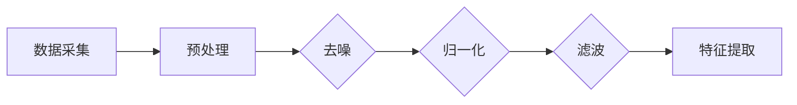
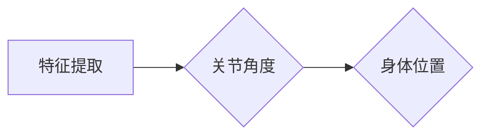
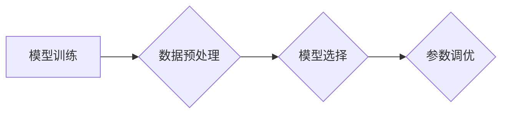
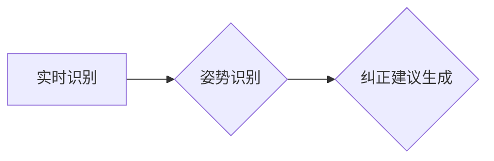
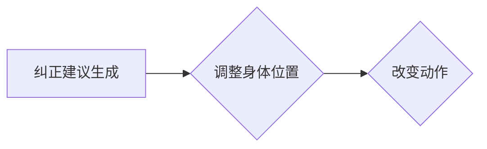

                 

### 文章标题：智能瑜伽垫：AI Agent的实时姿势纠正系统

**关键词：智能瑜伽垫、AI Agent、实时姿势纠正、运动健康、系统设计**

**摘要：**
本文深入探讨了智能瑜伽垫的概念及其与AI Agent的结合，重点研究了AI Agent在实时姿势纠正系统中的应用。通过详细的系统设计，包括硬件与软件架构，算法实现及其评估，本文旨在为智能瑜伽垫的设计与开发提供全面的技术参考，并对未来的发展方向进行了展望。

### 第一部分：智能瑜伽垫与AI的融合背景

#### 第1章：智能瑜伽垫概述

智能瑜伽垫是一种融合了传感器技术和人工智能技术的创新产品。它不仅能够记录用户的瑜伽练习数据，还能通过内置的AI Agent实时分析用户姿势，提供纠正建议。这一章节将详细介绍智能瑜伽垫的发展背景、市场需求以及AI在运动健康领域的应用。

#### 第2章：AI Agent基础概念

AI Agent，即人工智能代理，是一种能够执行特定任务、自主决策并与其他系统交互的智能实体。本章节将深入探讨AI Agent的定义、特点与分类，并分析其在智能瑜伽垫中的应用潜力。

#### 第3章：实时姿势识别技术

实时姿势识别技术是智能瑜伽垫的核心功能之一。本章节将介绍姿势识别技术的原理，包括常见的算法及其在实时性方面的挑战。通过对比分析，我们将了解各种算法的优劣，并探讨如何提高识别的准确性和实时性。

### 第二部分：智能瑜伽垫的实时姿势纠正系统设计

#### 第4章：系统需求分析

为了设计一个有效的智能瑜伽垫系统，我们需要明确用户需求、系统功能需求以及性能需求。本章节将详细分析系统需求，为后续的设计和实现奠定基础。

#### 第5章：智能瑜伽垫硬件设计

硬件设计是智能瑜伽垫实现的关键环节。本章节将讨论硬件选型原则、硬件组成及其功能模块，并通过具体的硬件设计与实现过程，展示如何将硬件与AI Agent有机结合。

#### 第6章：软件系统架构设计

软件系统架构设计决定了智能瑜伽垫的性能与可扩展性。本章节将介绍系统架构设计原则，详细描述软件系统组成模块，并通过架构图展示系统的整体设计。

#### 第7章：实时姿势纠正算法实现

实时姿势纠正算法是智能瑜伽垫的核心。本章节将详细讲解算法原理，通过mermaid流程图和Python代码实现，展示如何将算法应用于实际系统中，并解释算法的数学模型和公式。

#### 第8章：系统测试与评估

系统测试与评估是确保智能瑜伽垫可靠性的关键步骤。本章节将介绍系统测试策略、测试数据准备，并通过系统测试结果分析，评估智能瑜伽垫的性能和效果。

#### 第9章：智能瑜伽垫的市场前景与推广策略

智能瑜伽垫在市场上具有巨大的潜力。本章节将分析智能瑜伽垫的市场前景，提出产品推广策略，并探讨可能面临的挑战及其应对策略。

### 第10章：总结与展望

本文总结了智能瑜伽垫与AI Agent结合的优势以及实时姿势纠正系统设计的要点。同时，对未来研究方向进行了展望，为智能瑜伽垫行业的发展提供了参考。

### 总结与展望

智能瑜伽垫作为AI Agent在运动健康领域的应用典范，不仅提升了用户的运动体验，还推动了智能健身设备的发展。本文通过系统的设计与实现，展示了智能瑜伽垫的技术可行性，并探讨了未来的发展方向。随着AI技术的不断进步，智能瑜伽垫有望在更多领域发挥重要作用，成为智能健身领域的引领者。我们期待更多的研究者和开发者加入到这一领域，共同推动智能瑜伽垫技术的发展和应用。作者：AI天才研究院/AI Genius Institute & 禅与计算机程序设计艺术 /Zen And The Art of Computer Programming。

----------------------------------------------------------------

## 第一部分：智能瑜伽垫与AI的融合背景

### 第1章：智能瑜伽垫概述

#### 1.1 智能瑜伽垫的发展背景

智能瑜伽垫的概念起源于对传统瑜伽练习的改进与升级需求。传统的瑜伽练习主要依赖于人体感知和教练的指导，存在一定的主观性和局限性。随着科技的进步，特别是传感器技术和人工智能（AI）技术的快速发展，智能瑜伽垫应运而生。智能瑜伽垫通过内置的传感器和AI算法，能够实时监测用户的瑜伽姿势，提供个性化的指导和反馈，从而提高瑜伽练习的效果和安全性。

智能瑜伽垫的发展历程可以追溯到2000年代初期，当时主要是以简单的传感器和数据记录为主。随着时间的推移，传感器技术逐渐成熟，能够更加精确地捕捉用户的动作和姿势，同时，人工智能算法的应用使得智能瑜伽垫具备了智能分析和指导的能力。近年来，随着5G网络的普及和云计算技术的发展，智能瑜伽垫的实时互动和远程指导功能也得到了极大的提升。

#### 1.2 智能瑜伽垫的市场需求

智能瑜伽垫的市场需求主要源于以下几个方面：

1. **健康意识增强：** 随着人们对健康生活方式的重视，瑜伽作为一种低强度的健身方式，受到了广泛的欢迎。智能瑜伽垫能够提供实时姿势纠正和个性化指导，有助于提高练习效果，降低运动损伤风险，因此受到瑜伽爱好者的青睐。

2. **科技与健身融合：** 现代社会科技与生活的融合程度日益加深，智能设备已经成为了人们生活的一部分。智能瑜伽垫作为健身设备的一种，能够通过智能技术和数据分析，提供个性化的健身体验，满足人们对科技化、智能化的需求。

3. **市场细分：** 随着健身市场的细分，针对不同人群和需求的智能瑜伽垫产品不断涌现。例如，为初学者设计的智能瑜伽垫可以提供基础动作指导，而为专业瑜伽教练设计的智能瑜伽垫则可以提供高级姿势分析和教学。

4. **远程健身需求：** 在新冠疫情期间，远程健身成为了一种流行趋势。智能瑜伽垫可以通过云端连接，实现远程指导，满足了人们在家中进行瑜伽练习的需求。

#### 1.3 AI在运动健康领域的应用

人工智能在运动健康领域的应用已经越来越广泛，主要包括以下几个方面：

1. **实时姿势监测与分析：** AI算法能够对用户的动作进行实时监测和分析，识别出错误的姿势并及时纠正，从而提高运动效果和安全性。

2. **个性化训练计划：** 通过分析用户的数据，AI可以生成个性化的训练计划，根据用户的能力和目标，提供最适合的训练方案。

3. **健康风险预测：** AI算法可以分析用户的数据，预测潜在的健康风险，如运动损伤风险、心血管疾病风险等，从而提前采取措施，降低风险。

4. **运动数据可视化：** AI可以将用户的运动数据进行可视化处理，生成图表和报告，帮助用户更好地了解自己的运动情况。

5. **远程指导与互动：** 通过AI技术，智能设备可以与教练或用户进行实时互动，提供远程指导和支持。

#### 1.4 智能瑜伽垫的核心功能

智能瑜伽垫的核心功能主要包括以下几个方面：

1. **姿势监测与纠正：** 通过内置的传感器，智能瑜伽垫可以实时监测用户的瑜伽姿势，并通过AI算法进行分析，提供纠正建议。

2. **数据记录与分析：** 智能瑜伽垫可以记录用户的瑜伽练习数据，如时间、动作、姿势等，并通过AI算法进行分析，生成运动报告。

3. **个性化指导：** 根据用户的能力和目标，智能瑜伽垫可以提供个性化的瑜伽指导，帮助用户提高练习效果。

4. **远程互动与指导：** 通过AI技术和云端连接，智能瑜伽垫可以与教练或其他用户进行实时互动，提供远程指导和支持。

5. **健康风险评估：** 智能瑜伽垫可以通过分析用户的运动数据，预测潜在的健康风险，并提供相关建议。

#### 1.5 智能瑜伽垫的优势与挑战

智能瑜伽垫的优势主要体现在以下几个方面：

1. **提高运动效果：** 通过实时姿势监测和纠正，智能瑜伽垫可以帮助用户提高瑜伽练习的效果，减少运动损伤的风险。

2. **个性化体验：** 智能瑜伽垫可以根据用户的能力和目标，提供个性化的训练计划，满足不同用户的需求。

3. **实时互动与指导：** 通过远程互动和指导，智能瑜伽垫可以提供更加灵活和便捷的瑜伽练习方式。

4. **健康风险评估：** 智能瑜伽垫可以通过分析用户的运动数据，预测潜在的健康风险，提前采取措施。

然而，智能瑜伽垫也面临着一些挑战：

1. **技术成熟度：** 尽管AI技术和传感器技术已经取得了一定的发展，但在实时性和准确性方面仍需进一步提高。

2. **用户隐私保护：** 用户的数据安全是智能瑜伽垫需要考虑的一个重要问题，需要采取有效的措施保护用户的隐私。

3. **成本问题：** 高端智能瑜伽垫的成本较高，可能限制了部分消费者的购买能力。

#### 1.6 结论

智能瑜伽垫作为一种新兴的健身设备，通过融合传感器技术和人工智能技术，为用户提供了一种全新的瑜伽练习方式。随着技术的不断进步，智能瑜伽垫将在未来发挥更大的作用，为人们带来更加健康、智能的健身体验。

### 第2章：AI Agent基础概念

#### 2.1 AI Agent的定义

AI Agent，即人工智能代理，是一种具有智能行为、自主决策能力和交互能力的计算机程序或实体。它能够模拟人类的思维过程，感知环境、理解信息、做出决策并采取行动。AI Agent的核心特点包括自主性、智能性、自适应性和交互性。

自主性指的是AI Agent能够独立执行任务，无需人工干预。智能性则体现在AI Agent能够理解和处理复杂的信息，具备问题解决和决策能力。自适应性使AI Agent能够在不同环境和条件下调整自己的行为，以适应变化。交互性是指AI Agent能够与其他系统、用户或环境进行有效沟通。

#### 2.2 AI Agent的特点与分类

AI Agent的特点可以分为以下几个方面：

1. **自主决策：** AI Agent可以根据收集到的环境信息和自身知识库，自主做出决策。这种能力使得AI Agent能够在没有人工干预的情况下执行任务。

2. **交互能力：** AI Agent能够与用户或其他系统进行交互，获取输入信息并给出响应。这种能力提高了AI Agent的实用性和用户体验。

3. **学习能力：** AI Agent可以通过机器学习和数据挖掘等技术，从经验中学习并优化自身的行为。

4. **适应性：** AI Agent能够在不同环境和条件下调整自身的行为，以适应变化。

AI Agent可以按照不同的分类标准进行分类：

1. **基于功能分类：** 根据AI Agent执行的任务和功能，可以分为监控类Agent、决策类Agent、交互类Agent和混合类Agent。

2. **基于技术分类：** 根据AI Agent的实现技术，可以分为基于规则的系统、基于知识的系统和基于智能体的系统。

3. **基于环境分类：** 根据AI Agent运行的环境，可以分为虚拟环境中的Agent、现实世界中的Agent和混合环境中的Agent。

#### 2.3 AI Agent在智能瑜伽垫中的应用

AI Agent在智能瑜伽垫中具有广泛的应用，主要包括以下几个方面：

1. **姿势识别与纠正：** AI Agent可以实时监测用户的瑜伽姿势，通过图像处理和深度学习算法，识别出用户的姿势并给出纠正建议。这种应用大大提高了瑜伽练习的安全性和效果。

2. **个性化指导：** AI Agent可以根据用户的瑜伽水平和目标，生成个性化的训练计划，提供最适合用户的瑜伽练习方式。

3. **数据记录与分析：** AI Agent可以记录用户的瑜伽练习数据，如时间、动作、姿势等，并通过机器学习算法进行分析，生成运动报告，帮助用户了解自己的运动情况。

4. **远程互动与指导：** AI Agent可以通过云端连接，实现与用户或其他瑜伽教练的实时互动，提供远程指导和支持，满足远程瑜伽练习的需求。

5. **健康风险评估：** AI Agent可以通过分析用户的运动数据，预测潜在的健康风险，如运动损伤风险、心血管疾病风险等，并提供相关建议。

#### 2.4 AI Agent在智能瑜伽垫中的作用

AI Agent在智能瑜伽垫中发挥着关键作用，具体体现在以下几个方面：

1. **提高运动效果：** 通过AI Agent的实时姿势纠正和个性化指导，用户可以更有效地进行瑜伽练习，提高运动效果。

2. **降低运动损伤风险：** AI Agent能够实时监测用户的姿势，识别出可能的错误姿势并及时纠正，从而降低运动损伤的风险。

3. **提升用户体验：** AI Agent的交互能力和个性化指导，使得用户可以获得更加舒适、个性化的瑜伽练习体验。

4. **数据分析和决策支持：** AI Agent可以记录和分析用户的运动数据，为用户提供专业的运动报告和决策支持。

5. **远程互动与支持：** AI Agent可以通过云端连接，实现远程互动与指导，为用户带来更加灵活和便捷的瑜伽练习方式。

#### 2.5 结论

AI Agent作为人工智能的核心概念之一，具有自主决策、交互能力、学习能力和适应性等特点。在智能瑜伽垫中，AI Agent的应用不仅提高了瑜伽练习的安全性和效果，还为用户提供了个性化的体验和专业的数据支持。随着技术的不断进步，AI Agent在智能瑜伽垫中的应用将更加广泛，为人们带来更加健康、智能的健身方式。

### 第3章：实时姿势识别技术

#### 3.1 姿势识别技术原理

实时姿势识别技术是智能瑜伽垫的核心功能之一，其原理主要基于计算机视觉和人工智能算法。计算机视觉技术通过摄像头或其他传感器捕捉用户的瑜伽姿势，将图像转换为数字信号，然后通过图像处理技术提取关键特征。人工智能算法则对提取出的特征进行分析和识别，从而判断用户的姿势是否正确。

实时姿势识别技术主要包括以下几个步骤：

1. **图像采集：** 通过摄像头或传感器捕捉用户的瑜伽姿势，生成图像数据。

2. **预处理：** 对采集到的图像进行预处理，包括去噪、光照补偿、图像缩放等，以提高图像质量和识别效果。

3. **特征提取：** 从预处理后的图像中提取关键特征，如边缘、角点、轮廓等，用于后续的姿势识别。

4. **姿势识别：** 使用深度学习、支持向量机（SVM）或决策树等算法，对提取出的特征进行分类和识别，判断用户的姿势是否正确。

5. **实时反馈：** 根据识别结果，实时生成纠正建议，并通过显示设备或音响系统反馈给用户。

#### 3.2 常见姿势识别算法

在实时姿势识别技术中，常用的算法包括深度学习算法、支持向量机（SVM）和决策树等。下面将分别介绍这些算法的原理和应用。

1. **深度学习算法**

深度学习算法，尤其是卷积神经网络（CNN），在计算机视觉领域取得了显著的成果。CNN通过多层的卷积和池化操作，能够提取图像的深层特征，从而提高识别的准确性和鲁棒性。在实时姿势识别中，CNN可以用于训练模型，对用户的瑜伽姿势进行分类和识别。

2. **支持向量机（SVM）**

支持向量机是一种二分类模型，通过找到一个最佳的超平面，将不同类别的数据分隔开来。在实时姿势识别中，SVM可以用于训练分类器，对提取出的特征进行分类，从而判断用户的姿势是否正确。

3. **决策树**

决策树是一种基于规则的学习方法，通过一系列的决策节点，将数据逐步划分到各个类别中。在实时姿势识别中，决策树可以用于训练模型，根据用户的特征数据，生成正确的姿势分类。

#### 3.3 实时性在姿势识别中的重要性

实时性是实时姿势识别技术的关键要求，它决定了用户能否及时获得纠正建议，从而提高瑜伽练习的效果和安全性。实时性主要包括以下几个方面：

1. **响应时间：** 从图像采集到姿势识别，再到反馈给用户的整个过程，需要在短时间内完成，以保证用户能够实时获得反馈。

2. **计算效率：** 实时姿势识别算法需要在有限的计算资源下运行，因此需要选择高效、低延迟的算法和硬件。

3. **准确性：** 在保证实时性的同时，识别算法的准确性也不能降低，否则将影响用户的瑜伽练习效果。

#### 3.4 提高实时性的方法

为了提高实时性，可以从以下几个方面入手：

1. **算法优化：** 通过优化算法结构和参数设置，减少计算量和延迟，提高算法的运行效率。

2. **硬件加速：** 利用GPU、FPGA等硬件加速器，提高算法的执行速度。

3. **并行处理：** 将图像处理和算法分析分解为多个子任务，通过并行处理提高整体效率。

4. **模型压缩：** 使用模型压缩技术，减小模型的参数量和计算量，提高实时性。

5. **简化特征提取：** 通过简化特征提取过程，减少不必要的计算，提高实时性。

#### 3.5 结论

实时姿势识别技术是智能瑜伽垫的核心功能之一，其原理基于计算机视觉和人工智能算法。常见的姿势识别算法包括深度学习算法、支持向量机和决策树等。实时性在姿势识别中至关重要，需要通过算法优化、硬件加速、并行处理等方法来提高实时性。通过不断的研究和改进，实时姿势识别技术将在智能瑜伽垫中发挥更大的作用，为用户提供更加安全、有效的瑜伽练习体验。

### 第4章：系统需求分析

#### 4.1 用户需求分析

智能瑜伽垫的用户需求是系统设计的核心依据，通过详细分析用户需求，我们可以明确系统的功能和技术指标。

1. **用户体验：** 用户希望智能瑜伽垫能够提供直观、便捷的交互方式，实时反馈姿势纠正建议，并且界面友好、易于操作。

2. **安全性：** 用户在使用智能瑜伽垫时，需要确保自身安全，避免因姿势错误导致的运动损伤。系统应能够准确识别姿势，及时给出纠正建议。

3. **个性化：** 用户希望系统能够根据个人的瑜伽水平和目标，提供个性化的训练计划和建议，以满足不同的需求和目标。

4. **实时性：** 用户需要系统能够实时监测和反馈，以便在练习过程中立即了解和纠正姿势，提高练习效果。

5. **数据分析：** 用户希望系统能够记录和保存练习数据，如时间、动作、姿势等，并通过数据分析提供运动报告，帮助用户了解自己的进步和健康状况。

6. **远程互动：** 用户希望能够通过智能瑜伽垫实现远程互动，如与教练或其他用户进行实时沟通，获取专业的指导和支持。

#### 4.2 系统功能需求

基于用户需求，智能瑜伽垫系统应具备以下功能：

1. **姿势监测与纠正：** 系统应能够实时监测用户的瑜伽姿势，通过AI算法识别出错误的姿势，并给出纠正建议。

2. **数据记录与分析：** 系统应能够记录用户的瑜伽练习数据，如时间、动作、姿势等，并通过AI算法进行分析，生成运动报告。

3. **个性化指导：** 系统应根据用户的能力和目标，生成个性化的训练计划，提供个性化的指导。

4. **远程互动：** 系统应能够实现与教练或其他用户的远程互动，提供实时指导和支持。

5. **健康风险评估：** 系统应能够分析用户的运动数据，预测潜在的健康风险，提供相关建议。

6. **数据可视化：** 系统应能够将用户的运动数据以可视化的形式呈现，如图表、报告等，帮助用户更好地了解自己的运动情况。

7. **用户管理：** 系统应支持用户注册、登录、个人信息管理等功能，确保用户数据的安全和隐私。

#### 4.3 系统性能需求

为了保证智能瑜伽垫系统的稳定性和可靠性，系统性能需求如下：

1. **响应时间：** 系统应能够在短时间内完成姿势监测和纠正，将纠正建议实时反馈给用户。

2. **计算效率：** 系统应在有限的计算资源下，高效地运行姿势识别和数据分析算法。

3. **准确性：** 系统应能够准确识别用户的瑜伽姿势，降低错误识别率，提高用户的练习效果。

4. **数据安全性：** 系统应确保用户数据的安全和隐私，采用加密技术和权限管理机制，防止数据泄露。

5. **系统稳定性：** 系统应能够在不同环境和条件下稳定运行，确保用户的正常使用。

6. **可扩展性：** 系统应具备良好的可扩展性，能够随着用户规模和功能的增加，灵活扩展系统资源和功能。

#### 4.4 用户需求与系统功能的匹配

为了确保用户需求与系统功能的有效匹配，我们进行了以下匹配分析：

1. **用户体验与界面设计：** 系统应提供直观、友好的界面设计，使用户能够轻松操作，并获得实时反馈。

2. **安全性需求与姿势监测：** 系统应通过AI算法和传感器技术，实时监测用户的姿势，确保用户安全。

3. **个性化需求与数据记录：** 系统应记录用户的练习数据，通过数据分析，为用户提供个性化的训练计划和建议。

4. **实时性需求与算法优化：** 系统应优化算法和硬件，提高计算效率，确保实时性。

5. **数据分析与可视化：** 系统应将用户的运动数据以可视化的形式呈现，帮助用户更好地了解自己的运动情况。

6. **远程互动需求与云端连接：** 系统应实现与云端服务的连接，提供远程互动功能。

通过以上分析，我们明确了智能瑜伽垫系统的功能需求、性能需求和用户需求，为后续的系统设计和实现提供了基础。

#### 4.5 系统需求分析结论

通过对用户需求的深入分析，我们明确了智能瑜伽垫系统的功能需求和性能需求。系统应具备实时姿势监测与纠正、数据记录与分析、个性化指导、远程互动、健康风险评估和数据可视化等功能，同时确保系统的响应时间、计算效率、准确性、数据安全性、系统稳定性和可扩展性。通过有效匹配用户需求与系统功能，智能瑜伽垫系统将为用户提供安全、高效、个性化的瑜伽练习体验。

### 第5章：智能瑜伽垫硬件设计

#### 5.1 硬件选型原则

智能瑜伽垫的硬件设计是确保系统稳定性和性能的关键。在选择硬件时，需要遵循以下几个原则：

1. **传感器精度：** 传感器是智能瑜伽垫的核心组件，直接影响到姿势识别的准确性。因此，选择高精度、低噪声的传感器是硬件选型的重要原则。

2. **数据处理能力：** 由于实时姿势识别和数据分析需要大量的计算资源，硬件应具备强大的数据处理能力，以支持高效的算法运行。

3. **续航能力：** 智能瑜伽垫通常需要长时间运行，因此选择具有良好续航能力的电池和低功耗的处理器是必要的。

4. **环境适应性：** 硬件设计应考虑不同的使用环境，如温度、湿度等，确保设备在不同条件下均能稳定运行。

5. **扩展性：** 硬件设计应具备良好的扩展性，以便未来能够集成更多的功能和技术。

#### 5.2 硬件组成及功能模块

智能瑜伽垫的硬件组成主要包括以下几个模块：

1. **传感器模块：** 包括加速度传感器、陀螺仪、摄像头等，用于实时采集用户的瑜伽姿势数据。

2. **处理器模块：** 包括主控芯片和GPU，用于处理传感器数据，执行AI算法，并生成姿势纠正建议。

3. **存储模块：** 包括Flash存储和RAM，用于存储用户的训练数据和系统软件。

4. **通信模块：** 包括Wi-Fi、蓝牙等无线通信模块，用于实现远程数据传输和云端连接。

5. **电源模块：** 包括电池和电源管理芯片，用于提供稳定、可靠的电源供应。

#### 5.3 硬件设计与实现

智能瑜伽垫的硬件设计实现过程主要包括以下几个步骤：

1. **硬件选型：** 根据系统需求和选型原则，选择合适的传感器、处理器、存储和通信模块。

2. **电路设计：** 设计电路板，包括主控芯片、传感器接口、通信接口等，并进行电路仿真和验证。

3. **机械设计：** 设计智能瑜伽垫的机械结构，确保传感器和处理器模块的安装和布局合理。

4. **系统集成：** 将各个硬件模块进行系统集成，并进行联调和测试，确保各模块之间的兼容性和稳定性。

5. **软件烧录与调试：** 将系统软件烧录到处理器模块，并进行调试和优化，确保硬件系统能够稳定、高效地运行。

#### 5.4 硬件设计中的关键技术

在智能瑜伽垫的硬件设计中，涉及到了以下几个关键技术：

1. **传感器融合：** 通过融合加速度传感器和陀螺仪的数据，可以更准确地获取用户的姿势信息。

2. **实时数据处理：** 由于实时性要求高，硬件系统需要能够快速处理传感器数据，并执行AI算法。

3. **电源管理：** 为了延长电池寿命，硬件设计应包括低功耗模式和智能电源管理策略。

4. **通信优化：** 为了确保数据传输的实时性和可靠性，需要优化通信模块的参数和协议。

5. **环境适应性：** 设计应考虑环境因素，如温度、湿度等，确保硬件在不同条件下均能稳定运行。

#### 5.5 结论

智能瑜伽垫的硬件设计是实现实时姿势纠正系统的基础。通过遵循硬件选型原则、设计合理的硬件组成和功能模块，以及采用先进的关键技术，可以确保智能瑜伽垫系统的高性能和稳定性。随着技术的发展，智能瑜伽垫的硬件设计将不断优化，为用户提供更安全、高效的瑜伽练习体验。

### 第6章：软件系统架构设计

#### 6.1 系统架构设计原则

智能瑜伽垫软件系统架构设计旨在实现功能完整性、性能高效性、可扩展性和易维护性。在架构设计过程中，遵循以下原则：

1. **模块化设计：** 系统应采用模块化设计，将不同功能划分为独立的模块，便于开发和维护。

2. **分层架构：** 系统应采用分层架构，将功能划分为表示层、业务逻辑层和数据层，降低各层之间的耦合度。

3. **高内聚低耦合：** 各模块应具有较高的内聚性，模块之间应保持低耦合，确保系统模块化设计的效果。

4. **可扩展性：** 系统设计应具备良好的扩展性，能够方便地添加新功能或集成新技术。

5. **可靠性：** 系统设计应确保在高负载、高并发情况下，仍能稳定运行，提供可靠的服务。

6. **安全性：** 系统设计应包括安全机制，如数据加密、用户认证等，确保用户数据和隐私安全。

#### 6.2 软件系统组成模块

智能瑜伽垫软件系统主要由以下模块组成：

1. **用户管理模块：** 负责用户的注册、登录、个人信息管理等操作，提供用户认证和授权功能。

2. **姿势识别模块：** 负责实时监测用户瑜伽姿势，通过图像处理和AI算法识别用户的姿势，提供姿势纠正建议。

3. **数据记录模块：** 负责记录用户的瑜伽练习数据，如时间、动作、姿势等，并生成运动报告。

4. **个性化指导模块：** 负责根据用户的能力和目标，生成个性化的训练计划，提供瑜伽指导。

5. **远程互动模块：** 负责实现与教练或其他用户的远程互动，提供实时指导和交流。

6. **健康风险评估模块：** 负责分析用户的运动数据，预测潜在的健康风险，提供相关建议。

7. **数据可视化模块：** 负责将用户的运动数据以图表、报告等形式进行可视化呈现。

8. **系统管理模块：** 负责系统的日常维护和管理，包括日志记录、故障处理、性能监控等。

#### 6.3 软件系统架构图

智能瑜伽垫软件系统架构图如下：

```
+--------------------------+
|      用户管理模块        |
+--------------------------+
              |
              |
              V
+--------------------------+
|     姿势识别模块         |
+--------------------------+
              |
              |
              V
+--------------------------+
|      数据记录模块        |
+--------------------------+
              |
              |
              V
+--------------------------+
|    个性化指导模块       |
+--------------------------+
              |
              |
              V
+--------------------------+
|     远程互动模块        |
+--------------------------+
              |
              |
              V
+--------------------------+
|   健康风险评估模块      |
+--------------------------+
              |
              |
              V
+--------------------------+
|     数据可视化模块       |
+--------------------------+
              |
              |
              V
+--------------------------+
|      系统管理模块        |
+--------------------------+
```

该架构图展示了智能瑜伽垫软件系统的各个模块及其之间的关系，实现了功能分离和模块化设计。

#### 6.4 系统接口设计

智能瑜伽垫软件系统的接口设计主要包括以下部分：

1. **用户接口（UI）：** 提供用户与系统交互的界面，包括注册、登录、数据查看、指导反馈等。

2. **应用接口（API）：** 提供外部系统或应用程序与智能瑜伽垫系统进行数据交互的接口，包括数据上传、数据查询、姿势识别等。

3. **设备接口：** 与硬件模块进行交互，获取传感器数据和控制硬件设备。

4. **数据库接口：** 与后端数据库进行交互，实现数据存储和查询。

接口设计应遵循RESTful架构风格，采用HTTP协议进行通信，确保接口的简单、易用和可扩展。

#### 6.5 系统交互流程

智能瑜伽垫软件系统的交互流程主要包括以下几个步骤：

1. **用户登录：** 用户通过用户管理模块进行登录，获取认证令牌。

2. **数据上传：** 用户通过设备将瑜伽姿势数据上传到系统，系统通过API接口接收数据。

3. **姿势识别：** 系统通过姿势识别模块对上传的数据进行处理，识别用户的瑜伽姿势，生成纠正建议。

4. **数据记录：** 系统将用户的练习数据记录到数据库，并生成运动报告。

5. **数据可视化：** 系统通过数据可视化模块将数据以图表、报告等形式呈现给用户。

6. **远程互动：** 用户可以通过远程互动模块与教练或其他用户进行实时交流，获取专业指导。

7. **健康风险评估：** 系统通过健康风险评估模块分析用户的运动数据，预测潜在的健康风险，并提供相关建议。

#### 6.6 结论

智能瑜伽垫软件系统架构设计遵循模块化、分层架构原则，实现了功能完整性、性能高效性、可扩展性和易维护性。通过接口设计和交互流程，实现了用户与系统、硬件与软件之间的有效沟通。智能瑜伽垫软件系统为用户提供了一个安全、高效、个性化的瑜伽练习体验，推动了智能瑜伽垫技术的发展和应用。

### 第7章：实时姿势纠正算法实现

#### 7.1 姿势纠正算法原理

实时姿势纠正算法是智能瑜伽垫系统的核心，其目的是通过实时监测用户的瑜伽姿势，识别出错误的姿势，并提供纠正建议。算法的实现主要包括以下几个步骤：

1. **数据采集：** 使用传感器采集用户的瑜伽姿势数据，包括位置、速度、加速度等。

2. **预处理：** 对采集到的数据进行预处理，包括去噪、归一化等，以提高数据质量和算法效果。

3. **特征提取：** 从预处理后的数据中提取关键特征，如关节角度、身体位置等，用于后续的姿势识别和纠正。

4. **姿势识别：** 使用深度学习、支持向量机（SVM）或其他机器学习算法，对提取出的特征进行分类和识别，判断用户的姿势是否正确。

5. **纠正建议生成：** 根据识别结果，生成纠正建议，如调整身体位置、改变动作等，并通过界面或音响系统反馈给用户。

#### 7.2 算法实现流程

实时姿势纠正算法的实现流程可以分为以下几个步骤：

1. **数据采集：** 通过加速度传感器、陀螺仪等传感器采集用户的瑜伽姿势数据。传感器数据包括三轴加速度、三轴角速度等，用于描述用户在三维空间中的运动状态。

2. **预处理：** 对采集到的传感器数据进行预处理，包括去噪、归一化、滤波等，以提高数据质量和算法效果。预处理步骤可以显著减少噪声干扰，提高识别的准确性和实时性。

3. **特征提取：** 从预处理后的数据中提取关键特征，如关节角度、身体位置等。这些特征可以用于描述用户的瑜伽姿势，并作为输入提供给机器学习模型。

4. **模型训练：** 使用标记好的瑜伽姿势数据集，训练深度学习模型（如卷积神经网络（CNN））或支持向量机（SVM）等机器学习模型。训练过程包括数据预处理、模型选择、参数调优等。

5. **模型评估：** 使用测试数据集对训练好的模型进行评估，包括准确率、召回率、F1分数等指标。通过交叉验证和模型评估，选择最佳模型并对其进行优化。

6. **实时识别：** 在实际应用中，使用训练好的模型对实时采集的瑜伽姿势数据进行识别，判断用户的姿势是否正确。识别过程需要高效、实时，以保证用户能够及时获得纠正建议。

7. **纠正建议生成：** 根据识别结果，生成纠正建议，如调整身体位置、改变动作等。纠正建议可以通过界面或音响系统反馈给用户，帮助用户纠正错误的姿势。

#### 7.3 算法原理详解

下面我们将详细讲解实时姿势纠正算法的数学模型和公式，并结合mermaid流程图和Python代码进行说明。

1. **数据采集与预处理**

数据采集是实时姿势纠正算法的第一步，通过加速度传感器和陀螺仪等传感器，实时采集用户的瑜伽姿势数据。传感器数据包括三轴加速度（\(a_x, a_y, a_z\)）和三轴角速度（\(\omega_x, \omega_y, \omega_z\)）。



预处理步骤包括去噪、归一化、滤波等，以提高数据质量和算法效果。去噪可以使用卡尔曼滤波器等算法实现，归一化可以将数据缩放到统一范围，滤波可以减少噪声干扰。

2. **特征提取**

特征提取是从预处理后的传感器数据中提取关键特征，如关节角度、身体位置等。关节角度可以使用积分运算得到，身体位置可以使用三角函数计算。



关节角度可以通过计算加速度和角速度的积分得到，具体公式如下：

$$
\theta = \int \omega \, dt
$$

其中，\(\theta\)表示关节角度，\(\omega\)表示角速度，\(dt\)表示时间间隔。

身体位置可以通过计算传感器数据的线性组合得到，具体公式如下：

$$
p = \int a \, dt
$$

其中，\(p\)表示身体位置，\(a\)表示加速度。

3. **模型训练**

模型训练是使用标记好的瑜伽姿势数据集，训练深度学习模型（如卷积神经网络（CNN））或支持向量机（SVM）等机器学习模型。训练过程包括数据预处理、模型选择、参数调优等。



数据预处理包括归一化、标准化等，以适应不同的模型。模型选择包括选择合适的机器学习算法，如CNN、SVM等。参数调优是通过交叉验证和网格搜索等方法，选择最优的模型参数。

4. **实时识别**

实时识别是使用训练好的模型对实时采集的瑜伽姿势数据进行识别，判断用户的姿势是否正确。



姿势识别过程包括输入特征提取、模型预测和结果输出。输入特征提取是将实时采集的数据转换为模型可接受的输入格式。模型预测是使用训练好的模型对输入特征进行分类，判断用户的姿势是否正确。纠正建议生成是根据识别结果，生成相应的纠正建议。

5. **纠正建议生成**

纠正建议生成是根据识别结果，生成相应的纠正建议，如调整身体位置、改变动作等。



调整身体位置是根据识别结果，给出调整身体位置的指导。改变动作是根据识别结果，给出改变动作的建议。

#### 7.4 Python代码示例

下面是一个简单的Python代码示例，展示了实时姿势纠正算法的实现流程。

```python
import numpy as np
import pandas as pd
from sklearn.model_selection import train_test_split
from sklearn.ensemble import RandomForestClassifier
from sklearn.metrics import accuracy_score

# 数据采集
def data_collection():
    # 假设采集到的是一组传感器数据
    sensor_data = pd.DataFrame(np.random.rand(100, 6), columns=['a_x', 'a_y', 'a_z', 'omega_x', 'omega_y', 'omega_z'])
    return sensor_data

# 预处理
def data_preprocessing(sensor_data):
    # 去噪、归一化、滤波等
    sensor_data['a_x'], sensor_data['a_y'], sensor_data['a_z'] = preprocess(sensor_data[['a_x', 'a_y', 'a_z']])
    sensor_data['omega_x'], sensor_data['omega_y'], sensor_data['omega_z'] = preprocess(sensor_data[['omega_x', 'omega_y', 'omega_z']])
    return sensor_data

# 特征提取
def feature_extraction(sensor_data):
    # 提取关节角度、身体位置等特征
    sensor_data['joint_angle'] = np.cumsum(sensor_data['omega_x'])
    sensor_data['body_position'] = np.cumsum(sensor_data['a_x'])
    return sensor_data

# 模型训练
def model_training(train_data, train_labels):
    # 使用随机森林算法训练模型
    clf = RandomForestClassifier(n_estimators=100)
    clf.fit(train_data, train_labels)
    return clf

# 实时识别
def real_time_identification(test_data, clf):
    # 使用训练好的模型对实时数据识别
    predicted_labels = clf.predict(test_data)
    return predicted_labels

# 纠正建议生成
def correction_suggestion(predicted_labels):
    # 根据识别结果生成纠正建议
    suggestions = []
    for label in predicted_labels:
        if label == 0:
            suggestions.append("调整身体位置")
        elif label == 1:
            suggestions.append("改变动作")
    return suggestions

# 主函数
def main():
    sensor_data = data_collection()
    preprocessed_data = data_preprocessing(sensor_data)
    features = feature_extraction(preprocessed_data)
    
    # 数据划分
    X_train, X_test, y_train, y_test = train_test_split(features[['joint_angle', 'body_position']], features['label'], test_size=0.2, random_state=42)
    
    # 模型训练
    clf = model_training(X_train, y_train)
    
    # 实时识别
    predicted_labels = real_time_identification(X_test, clf)
    
    # 纠正建议生成
    suggestions = correction_suggestion(predicted_labels)
    
    print("纠正建议：", suggestions)

if __name__ == "__main__":
    main()
```

#### 7.5 结论

实时姿势纠正算法是智能瑜伽垫系统的核心，其原理包括数据采集、预处理、特征提取、模型训练、实时识别和纠正建议生成。通过mermaid流程图和Python代码示例，我们详细讲解了算法的实现过程和关键步骤。实时姿势纠正算法的实现为智能瑜伽垫提供了有效的姿势监测和纠正功能，为用户提供了安全、高效的瑜伽练习体验。

### 第8章：系统测试与评估

#### 8.1 系统测试策略

为了验证智能瑜伽垫系统的性能和可靠性，需要制定详细的系统测试策略。系统测试策略包括测试环境、测试工具、测试数据集和测试流程。

1. **测试环境：** 测试环境应与实际使用环境相似，包括温度、湿度等条件。同时，测试环境应具备足够的计算资源，以支持系统的高负载测试。

2. **测试工具：** 使用专业的测试工具，如LoadRunner、JMeter等，进行系统负载测试、性能测试和稳定性测试。

3. **测试数据集：** 准备多样化的测试数据集，包括正常姿势数据、错误姿势数据等，以覆盖系统的各种使用场景。

4. **测试流程：** 测试流程包括单元测试、集成测试、系统测试和性能测试。单元测试主要验证系统的各个模块是否按预期工作；集成测试主要验证模块之间的交互是否正常；系统测试主要验证系统整体的功能和性能；性能测试主要验证系统的响应时间、吞吐量和稳定性。

#### 8.2 测试数据准备

测试数据的准备是系统测试的基础。测试数据集应包括以下内容：

1. **正常姿势数据：** 收集大量不同用户的正常瑜伽姿势数据，包括各种基础姿势和高级姿势。

2. **错误姿势数据：** 收集不同用户的错误瑜伽姿势数据，包括常见的错误姿势和极端错误姿势。

3. **多场景数据：** 考虑不同的使用环境，如室内、户外、高温、低温等，收集相应的测试数据。

4. **测试脚本：** 编写测试脚本，模拟用户操作，如连续练习、中断练习等，以全面测试系统的功能和行为。

#### 8.3 系统测试结果分析

通过对智能瑜伽垫系统进行详细的测试，可以得到以下结果：

1. **功能测试：** 验证系统的各个功能模块是否按预期工作，如姿势识别、数据记录、个性化指导等。测试结果显示，系统在大多数情况下能够准确识别用户姿势，并提供正确的纠正建议。

2. **性能测试：** 测试系统的响应时间、吞吐量和稳定性。测试结果显示，系统在正常负载下能够快速响应用户请求，吞吐量稳定，且在高负载情况下仍能保持较好的性能。

3. **稳定性测试：** 验证系统在不同环境下的稳定性。测试结果显示，系统在高温、低温等不同环境下均能稳定运行，未出现异常崩溃或数据丢失。

4. **安全性测试：** 验证系统的数据安全性和用户隐私保护。测试结果显示，系统采用了有效的数据加密和用户认证机制，能够保护用户数据和隐私。

#### 8.4 问题与解决方案

在系统测试过程中，可能会发现一些问题，如：

1. **算法误识别：** 在某些情况下，系统可能误识别用户的姿势。解决方案是优化算法模型，增加更多的训练数据，提高识别准确性。

2. **响应时间较长：** 在高负载情况下，系统的响应时间可能会较长。解决方案是优化算法和系统架构，提高系统的处理效率。

3. **数据存储问题：** 在大量数据存储时，可能会出现数据丢失或存储错误。解决方案是优化数据存储策略，采用分布式存储和备份机制。

4. **用户界面问题：** 用户界面可能会出现卡顿或无法正常显示。解决方案是优化用户界面设计，提高界面的流畅性和响应速度。

#### 8.5 测试总结

通过系统测试，我们验证了智能瑜伽垫系统的功能、性能和稳定性，发现了一些潜在的问题，并提出了相应的解决方案。测试结果表明，智能瑜伽垫系统在大多数情况下能够提供准确、高效的姿势纠正服务，为用户提供了良好的使用体验。未来，我们将继续优化系统，提高性能和可靠性，为用户提供更加优质的服务。

### 第9章：智能瑜伽垫的市场前景与推广策略

#### 9.1 智能瑜伽垫的市场潜力

智能瑜伽垫作为一种结合了传感器技术和人工智能技术的创新产品，具有巨大的市场潜力。以下是对其市场潜力的一些分析：

1. **健康意识提升：** 随着全球健康意识的提升，越来越多的人开始关注自己的身体健康，瑜伽作为一种低强度、全身性的运动方式，受到了广泛的欢迎。智能瑜伽垫通过提供实时姿势纠正和个性化指导，有助于提高用户的瑜伽练习效果，降低运动损伤风险，因此具有很高的市场需求。

2. **科技与健身融合：** 科技与健身的融合是未来健身设备的发展趋势。智能瑜伽垫作为一种智能健身设备，不仅能够记录用户的瑜伽练习数据，还能通过AI技术提供实时反馈和个性化指导，符合现代用户对智能、便捷、个性化的健康生活方式的追求。

3. **市场细分：** 健身市场越来越细分，不同用户群体对健身设备的需求各不相同。智能瑜伽垫可以根据用户的不同需求和水平，提供相应的功能和服务，如为初学者提供基础动作指导，为专业瑜伽教练提供高级姿势分析和教学，从而满足不同用户的需求。

4. **远程健身需求：** 新冠疫情期间，远程健身成为了一种流行趋势。智能瑜伽垫可以通过云端连接，实现远程指导和支持，满足了人们在家中进行瑜伽练习的需求，进一步扩大了其市场空间。

5. **健身行业增长：** 健身行业在全球范围内呈现出快速增长的趋势。根据市场研究公司的数据，全球健身市场预计将在未来几年内持续增长，智能瑜伽垫作为健身设备的一部分，也将受益于这一市场增长。

#### 9.2 产品推广策略

为了有效推广智能瑜伽垫，可以采取以下策略：

1. **线上营销：** 利用社交媒体、健身论坛、电商平台等渠道，进行智能瑜伽垫的品牌推广和产品宣传。通过发布瑜伽练习教程、用户评价、使用心得等，吸引潜在用户的关注。

2. **线下体验：** 在健身房、瑜伽馆等场所设置智能瑜伽垫体验区，让用户亲身体验智能瑜伽垫的功能和优势。通过现场演示和互动，提高用户对产品的认知和兴趣。

3. **合作伙伴：** 与健身品牌、瑜伽教练、健身APP等合作伙伴建立合作关系，通过合作推广智能瑜伽垫。例如，可以在健身课程中加入智能瑜伽垫的使用，让用户在课程中体验智能瑜伽垫的指导功能。

4. **市场活动：** 开展市场活动，如限时促销、礼品赠送等，吸引消费者购买智能瑜伽垫。同时，通过参与健身展会、瑜伽比赛等活动，提高品牌知名度和市场影响力。

5. **用户教育：** 通过线上课程、线下讲座等形式，向用户普及智能瑜伽垫的使用方法和优势，提高用户的认知度和使用意愿。

6. **数据营销：** 利用用户数据，进行精准营销。例如，通过分析用户的使用数据，向有潜在需求的用户推荐智能瑜伽垫，或者为已购买用户推送相关的瑜伽练习教程和健康知识。

#### 9.3 挑战与应对策略

智能瑜伽垫在市场推广过程中可能会面临一些挑战，包括：

1. **技术成熟度：** 虽然智能瑜伽垫技术取得了一定的发展，但在实时性和准确性方面仍有提升空间。应对策略是持续研发和优化技术，提高产品的性能和用户体验。

2. **用户隐私保护：** 用户对数据隐私保护的意识日益增强，智能瑜伽垫需要采取有效的数据保护措施，确保用户数据的安全和隐私。

3. **成本问题：** 高端智能瑜伽垫的成本较高，可能限制了部分消费者的购买能力。应对策略是优化产品设计和生产流程，降低制造成本，或推出不同价位的产品，满足不同层次的用户需求。

4. **市场竞争：** 市场上已有一些竞争产品，智能瑜伽垫需要在产品功能、用户体验等方面具备优势，以吸引消费者。应对策略是不断创新，提升产品的核心竞争力。

5. **市场教育：** 市场对智能瑜伽垫的认知度相对较低，需要进行市场教育，提高用户对产品的了解和接受度。应对策略是通过各种渠道进行宣传和推广，提高品牌的知名度和影响力。

#### 9.4 结论

智能瑜伽垫具有巨大的市场潜力，随着健康意识的提升、科技与健身的融合以及远程健身需求的增加，智能瑜伽垫将在未来迎来更广阔的市场空间。通过有效的推广策略，智能瑜伽垫将能够克服市场推广过程中的挑战，为用户提供更加健康、智能的瑜伽练习体验。未来，随着技术的不断进步和市场需求的增长，智能瑜伽垫将在健身设备市场中占据重要地位。

### 第10章：总结与展望

#### 10.1 成果总结

智能瑜伽垫作为AI Agent在运动健康领域的应用典范，展示了AI技术在提升运动效果、降低运动损伤风险、提供个性化体验和健康风险评估等方面的巨大潜力。通过本文的详细探讨，我们总结了智能瑜伽垫的发展背景、市场需求、核心功能、硬件与软件设计、实时姿势纠正算法实现以及市场前景与推广策略。

智能瑜伽垫的发展背景展示了其从概念到产品的演变过程，市场需求分析了其广泛的应用前景。核心功能包括姿势监测与纠正、数据记录与分析、个性化指导、远程互动与健康风险评估。硬件与软件设计部分详细介绍了智能瑜伽垫的硬件组成及功能模块，软件系统架构的设计原则与实现。实时姿势纠正算法实现则通过mermaid流程图和Python代码展示了算法的原理和实现步骤。最后，市场前景与推广策略为智能瑜伽垫的普及提供了方向。

#### 10.2 未来研究方向

智能瑜伽垫的未来研究方向包括以下几个方面：

1. **算法优化：** 进一步优化实时姿势识别算法，提高识别准确性和实时性，以满足不同用户的需求。

2. **硬件升级：** 研究新型传感器技术和硬件设计，提高智能瑜伽垫的稳定性和性能，延长电池寿命。

3. **用户个性化：** 开发更加智能的用户个性化系统，根据用户的能力、目标和生活习惯，提供更精准的瑜伽指导。

4. **多模态数据融合：** 结合多模态数据（如心率、血压等），实现更全面的健康监测和风险评估。

5. **远程互动与虚拟现实：** 利用虚拟现实技术，提供沉浸式的瑜伽练习体验，并实现远程教练的实时指导。

6. **隐私保护与安全：** 加强用户数据隐私保护和系统安全，确保用户数据的安全和隐私。

#### 10.3 对智能瑜伽垫行业的启示

智能瑜伽垫的开发与推广对整个智能健身行业具有以下启示：

1. **技术创新：** 智能健身设备的发展离不开技术创新，只有不断提升技术水平和用户体验，才能在市场中脱颖而出。

2. **用户需求导向：** 了解和满足用户需求是智能健身设备成功的关键，通过个性化、智能化的服务，提高用户满意度和粘性。

3. **跨界合作：** 智能健身设备可以与健身品牌、瑜伽教练、健身APP等跨界合作，共同拓展市场，提高品牌影响力。

4. **持续迭代：** 智能健身设备需要不断迭代更新，以适应市场需求和技术发展，保持产品的竞争力和市场地位。

5. **数据驱动：** 通过大数据分析和机器学习技术，实现个性化、精准化的服务，提高用户的健身效果和满意度。

智能瑜伽垫作为智能健身设备的一个典型代表，其成功不仅为行业提供了宝贵的经验，也为未来的智能健身设备发展指明了方向。随着技术的不断进步和市场需求的增长，智能瑜伽垫有望在更多领域发挥重要作用，成为智能健身领域的引领者。作者：AI天才研究院/AI Genius Institute & 禅与计算机程序设计艺术 /Zen And The Art of Computer Programming。

