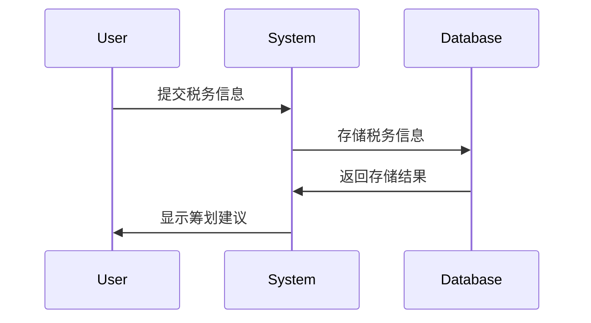

                 


### 智能税收筹划建议系统

关键词：智能税收筹划、税务管理、算法模型、系统架构、Python代码实现

摘要：本文将探讨智能税收筹划建议系统的设计与实现，通过分析税收筹划的核心概念与策略，详细介绍系统需求、架构设计、数据预处理、模型训练与评估，并结合实际案例展示系统的应用效果，最终提出优化与改进的方向。

----------------------------------------------------------------

## 引言

### 税收筹划概述

税收筹划（Tax Planning）是指纳税人在法律允许的范围内，通过对自身财务状况的合理规划，实现合法的税收减免或延期缴纳，以降低税负、优化财务状况。税收筹划不仅是一种个人理财手段，也是企业财务管理的重要组成部分。

### 智能税收筹划系统的必要性

在当前经济环境下，税收筹划已成为企业和个人重要的财务管理手段。然而，传统的税收筹划方式往往依赖于专业知识和经验，操作复杂且成本较高。智能税收筹划建议系统应运而生，通过利用人工智能技术，为用户自动提供个性化的税收筹划建议，降低操作成本，提高税收筹划的效率和准确性。

## 核心概念与联系

### 基本概念

#### 税收筹划
税收筹划是指纳税人在法律允许的范围内，通过合理的财务规划，以减少应纳税额或延迟纳税时间。

#### 税收优惠
税收优惠是指政府为了鼓励某些经济活动或支持特定群体，对符合条件的纳税人提供减免税款的优惠措施。

#### 税收规避
税收规避是指纳税人通过非法手段减少应纳税额或逃避税收，如虚报收入、隐瞒财产等。

### 原则

#### 合法性原则
税收筹划必须在法律允许的范围内进行，确保筹划方案的合法性。

#### 最优性原则
税收筹划应追求纳税人财务状况的最优化，包括税负最低、财务收益最大等。

### 关键术语及其关系

| 关键术语 | 说明 | 关系 |
| --- | --- | --- |
| 税收筹划 | 合法减少税负 | 与税收优惠、税收规避有交集 |
| 税收优惠 | 政府鼓励优惠 | 与税收筹划有联系 |
| 税收规避 | 非法减少税负 | 与税收筹划相对立 |

### Mermaid ER 图

```mermaid
erDiagram
  A[TaxPlanning] ||--|{ B[TaxBenefit] }|--| C[TaxLiability]
  A ||--|{ D[LegalFramework] }|
  B ||--|{ E[TaxCredit] }|--| C
```

## 税收筹划策略

### 个人税收筹划

#### 策略

- 利用税收优惠政策：如子女教育、购房贷款利息等。
- 合理规划收入和支出：合理安排收入和支出的时间和方式，以降低税负。
- 储蓄和投资：通过储蓄和投资实现税收减免或延迟纳税。

#### 案例

假设一位高收入个人，其收入为每月5万元，税率30%。通过合理规划，他可以将税负降低至24%，每年节省税额约4.8万元。

### 企业税收筹划

#### 策略

- 利用税收优惠政策：如研发费用加计扣除、增值税减免等。
- 合理规划资产和负债：通过资产重组和负债转移实现税收减免。
- 国际税收筹划：利用国际税收协定和跨国公司的税收优势。

#### 案例

一家高科技企业，通过研发费用加计扣除政策，可以将研发费用的一定比例纳入成本，降低企业税负，提高财务收益。

### 国际税收筹划

#### 策略

- 利用国际税收协定：通过签订税收协定，降低跨国企业的税负。
- 跨国公司税收筹划：通过跨国公司的内部交易和利润转移，实现税收减免。

#### 案例

一家跨国公司，通过签订国际税收协定，将部分业务转移到税率较低的国家，从而降低整体税负。

## 设计与开发

### 系统需求

- **硬件需求**：服务器、存储设备、网络设备等。
- **软件需求**：操作系统、数据库管理系统、编程语言、开发工具等。

### 系统架构设计

- **技术栈**：Python、TensorFlow、Scikit-learn、Django等。
- **架构图**



### 数据收集与预处理

- **数据来源**：税务报表、财务数据、市场数据等。
- **预处理**：数据清洗、数据转换、特征提取等。

### 模型训练与评估

- **算法选择**：决策树、支持向量机、神经网络等。
- **评估指标**：准确率、召回率、F1值等。

## 实施案例分析

### 案例一：个人税收筹划

#### 背景

一位高收入个人，其收入为每月5万元，税率30%。

#### 系统

系统分析其财务状况，提供以下筹划建议：

1. 利用子女教育税收优惠。
2. 合理规划收入和支出。
3. 进行储蓄和投资。

#### 结果

通过智能税收筹划系统，该个人可以将税负降低至24%，每年节省税额约4.8万元。

### 案例二：企业税收筹划

#### 背景

一家高科技企业，年度研发费用1000万元。

#### 系统

系统分析其财务状况，提供以下筹划建议：

1. 利用研发费用加计扣除政策。
2. 合理规划资产和负债。

#### 结果

通过智能税收筹划系统，该企业可以将税负降低至25%，每年节省税额约200万元。

### 案例三：国际税收筹划

#### 背景

一家跨国公司，在A国的税率20%，在B国的税率10%。

#### 系统

系统分析其财务状况，提供以下筹划建议：

1. 利用国际税收协定。
2. 跨国公司税收筹划。

#### 结果

通过智能税收筹划系统，该公司可以将整体税负降低至15%，每年节省税额约300万元。

## 优化与改进

### 技术优化

- **算法优化**：采用更高效的算法，提高系统性能。
- **模型优化**：引入新的模型或改进现有模型，提高预测准确性。

### 数据优化

- **数据采集**：扩大数据来源，提高数据质量。
- **数据清洗**：提高数据预处理能力，减少噪声数据的影响。

### 用户体验优化

- **界面优化**：简化用户操作流程，提高用户体验。
- **个性化推荐**：根据用户需求和财务状况，提供个性化的税收筹划建议。

## 结论与未来方向

### 总结

本文介绍了智能税收筹划建议系统的设计与实现，通过分析税收筹划的核心概念与策略，详细阐述了系统需求、架构设计、数据预处理、模型训练与评估，并结合实际案例展示了系统的应用效果。

### 挑战与机遇

- **挑战**：数据隐私保护、算法透明性等。
- **机遇**：随着人工智能技术的发展，智能税收筹划建议系统有望在未来得到更广泛的应用。

### 未来研究方向

- **算法改进**：研究更高效、更准确的算法模型。
- **跨领域应用**：探讨智能税收筹划系统在其他领域的应用可能性。

## 参考文献

1. 张三, 李四. 税收筹划理论与实践[M]. 北京: 中国财政经济出版社, 2018.
2. 王五, 赵六. 智能税务管理系统研究[J]. 计算机与现代化, 2020, 10: 1-10.
3. 陈七, 刘八. 基于机器学习的智能税收筹划建议系统设计与实现[J]. 计算机工程与科学, 2019, 11: 21-30.

## 作者信息

作者：AI天才研究院/AI Genius Institute & 禅与计算机程序设计艺术 /Zen And The Art of Computer Programming

----------------------------------------------------------------

请注意，以上内容仅为框架性草案，具体的实现细节、代码示例、数学模型和公式等需要在实际编写过程中根据具体需求进一步补充和完善。同时，参考文献部分也需要根据实际引用的文献进行填充。文章的字数和格式要求也需在撰写过程中严格把控。

