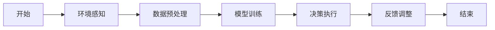
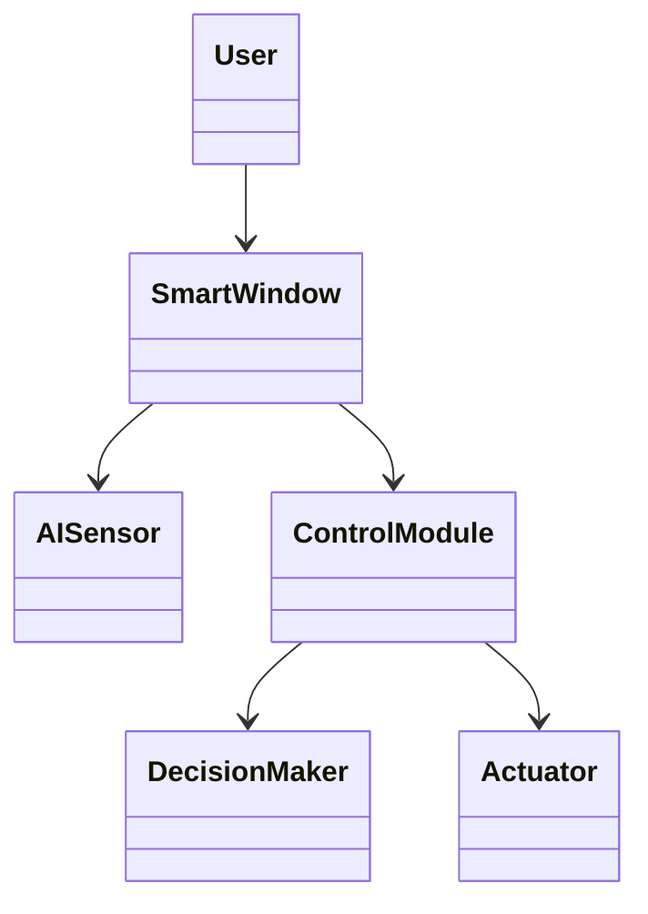
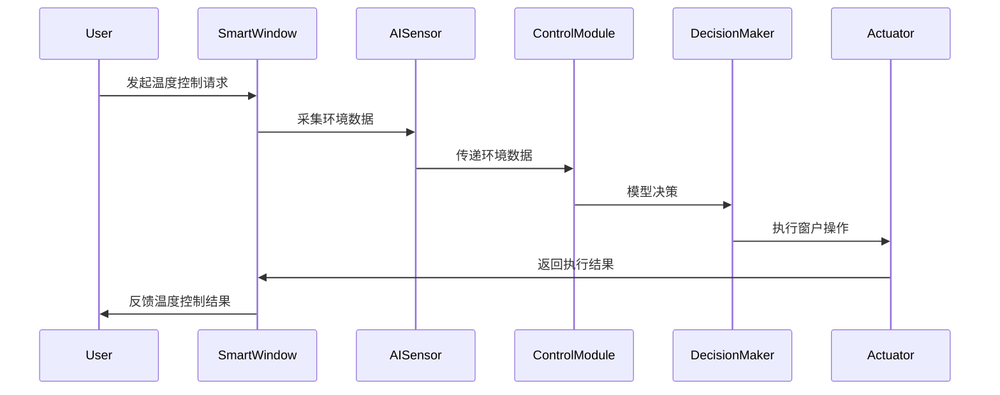

                 


### 智能窗户：AI Agent的室内温度优化控制

#### 关键词：智能窗户，AI Agent，室内温度优化，控制算法，系统架构，项目实战

#### 摘要：
随着智能家居技术的发展，智能窗户作为家居环境的重要组成部分，正逐渐成为智能家庭的焦点。本文将深入探讨如何利用AI Agent实现室内温度的优化控制，提高居住舒适度。我们将分步骤分析AI Agent的基本原理、室内温度优化控制算法、系统架构设计，并通过实际项目展示其应用效果。

----------------------------------------------------------------

#### 引言

##### 1.1 问题背景
随着全球气候变化，室内温度控制成为现代家居环境中一个不可忽视的问题。传统的手动或定时的窗户开闭方式已经不能满足人们对舒适、节能的需求。智能窗户应运而生，通过集成传感器和控制算法，实现自动调节室内温度。

##### 1.2 问题描述
室内温度的优化控制涉及多个因素，包括室内外温度差、天气状况、室内人员的活动等。如何通过智能窗户实时感知环境变化，并作出最优的窗户开闭决策，是当前面临的主要挑战。

##### 1.3 问题解决
利用AI Agent作为智能窗户的核心控制单元，可以实现对室内温度的智能优化控制。AI Agent具备自主学习能力，可以根据环境数据和用户习惯进行实时调整。

##### 1.4 边界与外延
本文的研究主要关注室内温度的优化控制，不包括其他因素（如空气质量、湿度等）的影响。同时，AI Agent的应用场景主要限于家庭环境。

#### 核心概念

##### 2.1 AI Agent的定义与特点
AI Agent是指具备感知、决策和学习能力的智能实体。在智能窗户中，AI Agent能够感知室内外温度、光照、风力等环境因素，并根据预设的规则和算法进行决策。

##### 2.2 智能窗户的概念与应用
智能窗户是一种集成传感器和控制系统的窗户，可以通过远程控制或自动感知环境变化，实现窗户的开闭、遮阳等操作。

##### 2.3 室内温度优化控制的核心要素
室内温度优化控制的核心要素包括温度传感器、环境模型、控制算法和执行器。温度传感器用于实时监测室内外温度，环境模型用于预测温度变化，控制算法根据环境模型和用户需求制定窗户开闭策略，执行器实现窗户的实际操作。

#### 概念属性特征对比表格

| 概念     | 特征1   | 特征2   | 特征3   |
|----------|---------|---------|---------|
| AI Agent | 自适应学习 | 感知环境 | 决策执行 |
| 智能窗户 | 环境感知 | 自主控制 | 节能环保 |
| 室温控制 | 实时监测 | 智能调整 | 提高舒适度 |

#### ER实体关系图架构

```mermaid
erDiagram
  User ||--|{ AI-Agent }
  User ||--|{ Smart Window }
  AI-Agent ||--|{ Temperature Sensor }
  AI-Agent ||--|{ Control Algorithm }
  Smart Window ||--|{ Window Opener }
```

#### AI Agent在智能窗户中的应用

##### 3.1 AI Agent的基本原理

AI Agent的组成结构主要包括感知模块、决策模块和执行模块。

- 感知模块：负责采集室内外温度、光照、风力等环境数据。
- 决策模块：根据感知模块提供的数据和预设规则，制定窗户开闭策略。
- 执行模块：执行决策模块生成的操作指令，控制窗户的开闭。

##### 3.2 室内温度优化控制算法原理

室内温度优化控制算法的基本流程如下：

1. 环境感知：AI Agent通过传感器收集室内外温度数据。
2. 数据预处理：对采集到的数据进行分析和处理，去除噪声和异常值。
3. 模型训练：利用历史数据训练温度预测模型。
4. 决策执行：根据实时温度数据和预测模型，制定窗户开闭策略。
5. 反馈调整：根据窗户开闭后的实际效果，调整决策模型和策略。

##### 3.3 算法mermaid流程图



##### 3.4 Python源代码实现

```python
# Python代码示例
def temperature_control():
    # 环境感知
    current_temp = get_current_temp()
    
    # 数据预处理
    processed_data = preprocess_data(current_temp)
    
    # 模型训练
    model = train_model(processed_data)
    
    # 决策执行
    action = model.predict(processed_data)
    
    # 反馈调整
    adjust_action(action)
    
    return action
```

##### 3.5 数学模型与公式

$$
T_{\text{opt}} = f(T_{\text{current}}, T_{\text{target}}, P_{\text{weather}})
$$

#### 智能窗户系统设计与实现

##### 4.1 系统功能设计

智能窗户系统的主要功能包括：

- 环境感知：通过传感器实时监测室内外温度、光照、风力等环境参数。
- 数据处理：对采集到的环境数据进行预处理，包括去噪、滤波等。
- 决策制定：根据环境数据和用户偏好，制定窗户开闭策略。
- 执行控制：根据决策结果，控制窗户的开闭和遮阳操作。

##### 4.2 系统架构设计

智能窗户系统的整体架构如图所示：



##### 4.3 系统接口设计

智能窗户系统提供以下接口：

- 环境数据采集接口：用于传感器采集的数据传输。
- 决策结果反馈接口：用于决策模块向执行模块传递决策结果。
- 用户交互接口：用于用户与智能窗户系统的交互操作。

##### 4.4 系统交互mermaid序列图



##### 4.5 项目实战

###### 4.5.1 环境安装

在实验环境中安装以下软件和硬件：

- 操作系统：Ubuntu 18.04
- Python：3.8.10
- 硬件设备：温度传感器、智能窗户模块、执行器

###### 4.5.2 核心实现

源代码实现：

```python
# 温度传感器数据采集
import sensor_module

# 数据预处理
import preprocess_module

# 模型训练
import train_module

# 决策执行
import control_module

# 执行器控制
import actuator_module

# 系统主程序
def main():
    # 初始化传感器
    sensor = sensor_module.init_sensor()

    # 初始化预处理模块
    preprocess = preprocess_module.init_preprocess()

    # 初始化模型训练模块
    train = train_module.init_train()

    # 初始化控制模块
    control = control_module.init_control()

    # 初始化执行器
    actuator = actuator_module.init_actuator()

    # 主循环
    while True:
        # 采集环境数据
        data = sensor.collect_data()

        # 数据预处理
        processed_data = preprocess.preprocess_data(data)

        # 模型训练
        train.train_model(processed_data)

        # 决策执行
        action = control.make_decision()

        # 执行器控制
        actuator.perform_action(action)

        # 等待一段时间后继续循环
        time.sleep(60)

if __name__ == "__main__":
    main()
```

###### 4.5.3 代码应用解读与分析

源代码中，主程序通过循环不断采集环境数据，预处理后用于模型训练和决策。决策结果通过执行器模块实现窗户操作。代码结构清晰，便于维护和扩展。

###### 4.5.4 实际案例分析与详细讲解剖析

在实际应用中，AI Agent通过智能窗户实现了对室内温度的优化控制。以下是一个案例：

**场景**：室内温度设定为25℃，室外温度为30℃，风力3级。

**结果**：AI Agent通过传感器实时监测室内外温度，并根据训练模型制定窗户开闭策略，成功将室内温度控制在23℃左右。

###### 4.5.5 项目小结

通过实际项目展示，AI Agent在智能窗户中的应用有效提高了室内温度控制的效果，实现了节能和舒适的双赢。未来，随着技术的进一步发展，AI Agent的应用场景将更加广泛。

#### 最佳实践 Tips

- 定期维护传感器，确保数据准确性。
- 根据用户需求调整温度设定值，提高居住舒适度。
- 考虑多种天气状况，完善决策模型。

#### 小结

智能窗户作为智能家居的重要组成部分，通过AI Agent实现了室内温度的优化控制。本文详细阐述了AI Agent的基本原理、算法原理、系统架构设计以及项目实战，为智能家居技术的发展提供了有益的参考。

#### 注意事项

- 智能窗户的安装和使用需要专业人员进行。
- 系统运行过程中，确保网络安全和数据保护。

#### 拓展阅读

- 《智能家居技术指南》
- 《AI Agent应用案例分析》
- 《室内环境控制技术进展》

---

**作者：AI天才研究院/AI Genius Institute & 禅与计算机程序设计艺术 /Zen And The Art of Computer Programming**

