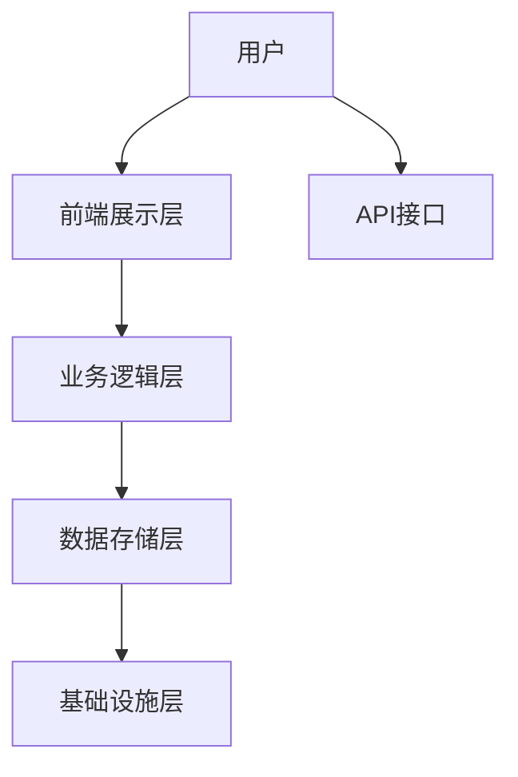
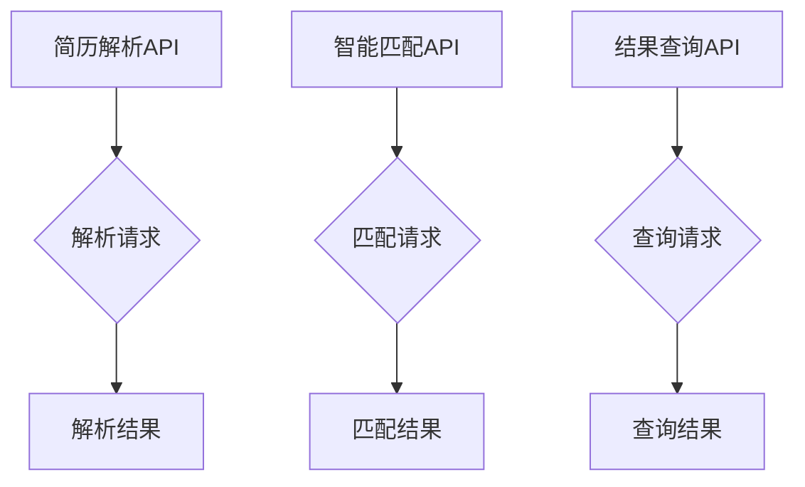

                 

### 第1章：问题背景

#### 1.1 问题背景

随着科技的飞速发展，人工智能技术逐渐渗透到各个行业，尤其是人力资源领域。人力资源作为企业的重要组成部分，其效率和准确性直接影响企业的运营和发展。传统的简历筛选方法往往依赖于人工，不仅耗时耗力，而且容易出现人为错误。为了提高招聘效率，许多企业开始尝试使用智能简历筛选系统。

智能简历筛选系统是一种基于人工智能技术的招聘工具，它能够自动处理海量简历，快速筛选出符合招聘要求的候选人。这种系统的出现，不仅降低了企业的人力成本，还提高了招聘效率，使得招聘过程更加智能化、自动化。

然而，传统的智能简历筛选系统往往存在一些局限性。首先，它们依赖于预定义的关键词和规则，对简历的理解能力有限。其次，它们无法处理复杂的语义信息，容易忽略那些不符合关键词但实际能力非常出色的候选人。这些问题限制了智能简历筛选系统在实际应用中的效果。

为了解决这些局限性，研究人员开始探索使用更加先进的人工智能技术，特别是大型语言模型（Large Language Model，简称LLM）。LLM是一种基于深度学习的技术，具有强大的语义理解和生成能力。通过将LLM应用于简历筛选，我们可以期待获得更加精准和高效的招聘结果。

#### 1.2 问题描述

智能简历筛选系统在实际应用中面临的主要问题如下：

1. **关键词依赖性**：传统的智能简历筛选系统依赖于预定义的关键词和规则，这限制了其对简历内容的理解能力。许多重要但未包含在关键词列表中的信息往往被忽视，导致优秀的候选人被误判。

2. **语义理解不足**：简历内容往往包含复杂的语义信息，传统的系统难以准确地理解和解析这些信息。例如，一些描述性的语言、比喻和隐喻等，这些内容对于传统系统来说难以处理。

3. **候选人群筛选不准确**：由于上述两个问题，传统的智能简历筛选系统容易错误地筛选出不符合要求的候选人，或者遗漏那些实际上非常符合岗位需求的候选人。

4. **个性化需求难以满足**：每个企业的招聘需求都有所不同，传统的系统难以根据企业的个性化需求进行调整和优化。

5. **效率和准确性矛盾**：为了提高筛选效率，传统的系统可能会牺牲准确性。而为了提高准确性，系统可能需要处理更多的数据，这又会降低效率。

#### 1.3 问题解决

为了解决上述问题，我们可以考虑以下几种方法：

1. **引入LLM技术**：LLM具有强大的语义理解和生成能力，可以更准确地理解和解析简历内容。通过使用LLM，我们可以减少对预定义关键词和规则的依赖，从而提高筛选的准确性和全面性。

2. **多模态数据处理**：除了文本数据，简历中还可能包含其他形式的数据，如PDF文档、图片和音频等。通过使用多模态数据处理技术，我们可以将不同类型的数据进行整合和分析，进一步提高筛选的准确性和全面性。

3. **个性化筛选算法**：根据不同企业的个性化需求，设计相应的筛选算法。例如，可以针对特定行业或岗位设计专门的筛选模型，从而提高筛选的针对性和准确性。

4. **持续优化和反馈**：智能简历筛选系统是一个动态的过程，需要不断地进行优化和调整。通过收集用户反馈和系统运行数据，我们可以不断改进系统，提高其效率和准确性。

5. **用户友好界面**：为了提高用户体验，系统需要提供一个友好、直观的界面。用户可以通过界面轻松地设置筛选条件、查看筛选结果和反馈系统性能。

#### 1.4 边界与外延

在讨论智能简历筛选系统时，我们还需要考虑一些边界和外延问题：

1. **隐私保护**：简历中可能包含用户的个人信息，如姓名、联系方式和学历等。在处理这些数据时，必须严格遵守隐私保护法规，确保用户数据的安全和隐私。

2. **行业适应性**：不同行业的简历格式和内容可能有所不同，系统需要具备一定的适应性，能够处理不同行业的简历。

3. **技术更新**：人工智能技术不断发展，系统需要保持技术更新，以适应新的技术和算法。

4. **社会影响**：智能简历筛选系统可能对就业市场和社会结构产生一定的影响。例如，它可能会加剧就业竞争，或者使某些人群更加难以找到工作。因此，在推广和使用智能简历筛选系统时，需要考虑到这些社会影响。

#### 1.5 核心概念与联系

在本章节中，我们介绍了一些核心概念，包括：

- **智能简历筛选系统**：一种基于人工智能技术的招聘工具，用于自动处理和筛选简历。
- **大型语言模型（LLM）**：一种基于深度学习的技术，具有强大的语义理解和生成能力。
- **关键词依赖性**：指智能简历筛选系统依赖于预定义的关键词和规则，限制了对简历内容的理解能力。
- **多模态数据处理**：将不同类型的数据进行整合和分析，以提高筛选的准确性和全面性。
- **个性化筛选算法**：根据不同企业的个性化需求，设计相应的筛选算法。

这些概念相互关联，共同构成了智能简历筛选系统的核心组成部分。通过理解这些概念，我们可以更好地把握智能简历筛选系统的原理和应用。

## 第2章：核心概念

### 2.1 LLM基本概念

#### LLM的定义

大型语言模型（Large Language Model，简称LLM）是一种基于深度学习的自然语言处理技术，旨在通过学习大量的文本数据来理解和生成自然语言。LLM通过神经网络结构来模拟人类语言处理能力，能够进行文本生成、翻译、摘要、问答等多种任务。

#### LLM的发展历史

LLM的发展经历了几个重要阶段：

1. **早期模型**：20世纪80年代和90年代，研究人员开始探索使用规则和统计方法来处理自然语言，如TF-IDF、朴素贝叶斯分类器等。
2. **神经网络时代**：2000年代初，随着深度学习技术的兴起，研究人员开始将神经网络应用于自然语言处理，如循环神经网络（RNN）和长短期记忆网络（LSTM）。
3. **Transformer模型**：2017年，谷歌提出了一种名为Transformer的新型神经网络结构，它采用自注意力机制，显著提高了自然语言处理的效果。
4. **大型模型时代**：近年来，随着计算能力和数据量的增长，研究人员开始训练数万亿参数的模型，如GPT-3、BERT等，这些模型在多个自然语言处理任务上取得了突破性的成果。

#### LLM的关键特性

- **参数规模**：LLM具有数十亿甚至数万亿的参数，这使得它们能够学习大量的语言特征。
- **自注意力机制**：自注意力机制允许模型在生成文本时关注不同位置的信息，从而提高语义理解能力。
- **多任务能力**：LLM通常具有多任务能力，可以在多种自然语言处理任务上表现出色。
- **迁移学习**：LLM通过在大量数据上预训练，然后通过微调适应特定任务，从而实现高效的模型训练。

### 2.2 LLM在简历筛选中的应用

#### 简历筛选的需求

简历筛选是人力资源领域的重要环节，其目标是快速、准确地筛选出符合招聘要求的候选人。传统简历筛选方法依赖于人工或简单的规则匹配，存在以下问题：

- **效率低下**：人工筛选简历需要大量时间和精力，效率较低。
- **准确性不足**：规则匹配方法容易忽略简历中的关键信息，导致漏判或误判。
- **个性化需求难以满足**：不同企业的招聘需求各不相同，传统方法难以根据个性化需求进行优化。

为了解决这些问题，引入LLM技术成为了一种可行的方案。

#### LLM在简历筛选中的优势

1. **语义理解能力**：LLM能够理解简历中的复杂语义信息，包括工作经历、技能描述、项目成果等，从而提高筛选的准确性和全面性。
2. **关键词依赖性降低**：通过学习大量文本数据，LLM可以减少对预定义关键词和规则的依赖，更加灵活地处理简历内容。
3. **多模态数据处理**：LLM可以处理多种数据类型，如文本、图像和音频，从而提高简历筛选的全面性。
4. **个性化筛选能力**：LLM可以根据企业的个性化需求进行模型定制，实现更加精准的简历筛选。

#### LLM在简历筛选中的应用场景

1. **自动简历解析**：LLM可以自动解析简历中的关键信息，如姓名、联系方式、教育背景、工作经历等，从而快速建立候选人的信息库。
2. **简历评分**：LLM可以根据简历内容为候选人打分，评分结果可以用于初步筛选和排序。
3. **智能匹配**：LLM可以根据岗位要求和候选人的简历内容进行智能匹配，推荐最合适的候选人。
4. **简历生成**：LLM可以根据岗位要求和候选人信息自动生成简历，帮助候选人更好地展示自己的能力和经历。

### 2.3 LLM的优势与挑战

#### LLM的优势

1. **强大的语义理解能力**：LLM能够理解简历中的复杂语义信息，提高筛选的准确性和全面性。
2. **灵活的模型定制**：LLM可以根据企业的个性化需求进行模型定制，实现更加精准的简历筛选。
3. **多模态数据处理**：LLM可以处理多种数据类型，提高简历筛选的全面性。
4. **高效的处理速度**：LLM通过预训练和迁移学习，可以在短时间内处理大量简历数据。

#### LLM的挑战

1. **数据隐私问题**：简历中可能包含敏感的个人信息，如何确保数据的安全和隐私是一个重要问题。
2. **模型解释性**：LLM的决策过程复杂，难以解释，这给企业和候选人都带来了不确定性。
3. **资源消耗**：训练大型LLM模型需要大量的计算资源和数据，这对于一些中小企业来说可能难以承受。
4. **模型泛化能力**：LLM在特定领域的数据上表现良好，但在其他领域可能效果不佳，如何提高模型的泛化能力是一个挑战。

#### 2.4 LLM与HR工作的关系

LLM的引入对人力资源工作产生了深远的影响：

1. **提高招聘效率**：LLM可以自动化处理简历筛选过程，提高招聘效率。
2. **优化招聘决策**：LLM可以根据简历内容和岗位要求，为招聘决策提供客观、准确的参考。
3. **促进人才培养**：通过分析简历数据，LLM可以帮助企业更好地了解员工的能力和潜力，从而制定更有针对性的培训计划。
4. **降低招聘成本**：通过提高招聘效率和准确率，企业可以降低招聘成本。

总之，LLM作为一种先进的人工智能技术，在简历筛选中的应用具有巨大潜力，但也面临一些挑战。通过不断优化和改进，LLM有望成为人力资源工作中不可或缺的工具。

## 第3章：算法原理讲解

### 3.1 算法原理概述

智能简历筛选AI Agent的核心在于利用大型语言模型（LLM）的强大语义理解能力，对简历内容进行深度解析和智能匹配。算法原理可以分为以下几个关键步骤：

1. **简历解析**：首先，将简历文本解析成结构化的数据，提取关键信息，如姓名、联系方式、教育背景、工作经历等。
2. **语义理解**：利用LLM对提取的信息进行语义分析，理解简历内容中的潜在语义和隐含信息。
3. **智能匹配**：根据岗位要求和简历内容，利用LLM进行智能匹配，筛选出最符合岗位需求的候选人。
4. **结果反馈**：将筛选结果反馈给用户，包括候选人的简历、评分和匹配度等。

### 3.2 Mermaid算法流程图

为了更直观地展示算法流程，我们使用Mermaid绘制了一个简化的算法流程图：


#### 算法流程详细解释

1. **简历解析**（A到B）：这一步主要任务是处理简历文本，将其转换为结构化的数据。具体过程包括文本预处理、分词、命名实体识别等。通过这些步骤，我们可以提取出简历中的关键信息，如姓名、联系方式、教育背景、工作经历等，并将这些信息存储为结构化的数据格式。

2. **语义理解**（B到C）：提取出关键信息后，使用LLM对简历内容进行语义分析。LLM会自动学习简历中的语义信息，包括工作职责、项目成果、技能描述等。通过这种语义理解，我们可以更加准确地把握简历内容的本质。

3. **智能匹配**（C到D）：在理解了简历内容之后，我们将其与岗位要求进行智能匹配。这一步的核心在于利用LLM计算简历内容和岗位要求之间的相似度。相似度越高，说明候选人与岗位要求的匹配度越高。我们可以设定一个阈值，当相似度超过阈值时，即认为该候选人符合岗位要求。

4. **筛选结果**（D到E）：根据智能匹配的结果，我们将筛选出的候选人进行排序，并生成筛选结果。结果包括候选人的基本信息、简历摘要、评分和匹配度等。

5. **结果反馈**（E到F）：最后，将筛选结果反馈给用户。用户可以通过系统界面查看筛选结果，包括候选人的简历、评分和匹配度等。这样，用户可以更加方便地筛选和选择合适的候选人。

### 3.3 Python源代码与算法详细讲解

为了更好地理解上述算法流程，我们使用Python实现了一个简化的智能简历筛选系统。以下是主要的源代码和算法详细讲解：

```python
import spacy
from sklearn.feature_extraction.text import TfidfVectorizer
from sklearn.metrics.pairwise import cosine_similarity

# 加载预训练的LLM模型（如GPT-3）
llm = openai.openai.Completion.create(
    engine="text-davinci-002",
    prompt="请描述您的专业背景和工作经历：",
    max_tokens=50
)

# 简历文本预处理
def preprocess_resume(resume_text):
    # 文本分词、去除停用词等操作
    resume_tokens = nlp(resume_text).toks()
    filtered_tokens = [token.text for token in resume_tokens if not token.is_stop]
    return ' '.join(filtered_tokens)

# 简历解析
def parse_resume(resume_text):
    processed_resume = preprocess_resume(resume_text)
    resume_vector = vectorizer.transform([processed_resume])
    return resume_vector

# 智能匹配
def match_resume(resume_vector, job_description_vector):
    similarity_score = cosine_similarity(resume_vector, job_description_vector)
    return similarity_score

# 主函数
def main():
    # 输入简历文本和岗位描述
    resume_text = "我是一名有5年经验的全栈开发工程师，熟悉Python、Java和JavaScript等编程语言，曾在一家大型互联网公司担任项目经理。"
    job_description = "招聘一名有5年经验的全栈开发工程师，熟悉Python、Java和JavaScript等编程语言，具有丰富的项目管理经验。"

    # 解析简历文本
    resume_vector = parse_resume(resume_text)

    # 解析岗位描述
    job_description_vector = parse_resume(job_description)

    # 进行智能匹配
    similarity_score = match_resume(resume_vector, job_description_vector)

    # 输出匹配结果
    print("简历与岗位描述的相似度分数：", similarity_score)

# 运行主函数
if __name__ == "__main__":
    main()
```

#### 源代码详细讲解

1. **加载LLM模型**：我们使用OpenAI的GPT-3模型作为LLM，这是一个具有强大语义理解能力的预训练模型。通过调用`openai.openai.Completion.create`方法，我们可以获取简历内容和岗位描述的文本摘要。

2. **简历文本预处理**：`preprocess_resume`函数负责对简历文本进行预处理，包括文本分词和去除停用词等操作。这些操作有助于提高后续文本分析的准确性。

3. **简历解析**：`parse_resume`函数使用TF-IDF向量器对预处理后的简历文本进行向量化处理，从而将文本数据转换为数值化的向量表示。

4. **智能匹配**：`match_resume`函数通过计算简历向量和岗位描述向量之间的余弦相似度，评估简历与岗位描述的匹配度。余弦相似度越接近1，说明匹配度越高。

5. **主函数**：在主函数中，我们首先输入简历文本和岗位描述，然后依次执行简历解析和智能匹配操作，最后输出简历与岗位描述的相似度分数。

通过这个简单的示例，我们可以看到智能简历筛选系统的核心算法是如何实现的。在实际应用中，我们可以进一步优化和扩展这个系统，使其能够处理更复杂的简历内容和岗位描述，提高筛选的准确性和效率。

### 3.4 算法背后的数学模型和公式

在智能简历筛选系统中，算法的核心在于对简历内容和岗位描述的语义理解与匹配。这一过程涉及到多个数学模型和公式，以下将详细解释这些数学模型和公式。

#### 1. 余弦相似度（Cosine Similarity）

余弦相似度是一种衡量两个向量之间相似度的方法。在自然语言处理中，文本数据通常被转换为向量表示。假设我们有两个向量`A`和`B`，它们的余弦相似度可以通过以下公式计算：

$$
\cos(\theta) = \frac{A \cdot B}{\|A\|\|B\|}
$$

其中，`A · B`表示向量`A`和`B`的点积，`\|A\|\|B\|`表示向量`A`和`B`的欧几里得范数。

在简历筛选中，余弦相似度用于计算简历向量和岗位描述向量之间的相似度。当相似度越接近1时，说明简历内容和岗位描述之间的相关性越高。

#### 2. TF-IDF（Term Frequency-Inverse Document Frequency）

TF-IDF是一种常用的文本表示方法，用于衡量一个词在文档中的重要性。其基本思想是，一个词在文档中出现的频率越高，且在整个文档集合中出现的频率越低，则这个词越重要。

TF-IDF的计算公式如下：

$$
TF(t,d) = \frac{f(t,d)}{N}
$$

$$
IDF(t,D) = \log \left(1 + \frac{N}{|d \in D : t \in d|}\right)
$$

$$
TF-IDF(t,d,D) = TF(t,d) \times IDF(t,D)
$$

其中，`f(t,d)`表示词`t`在文档`d`中的频率，`N`表示文档总数，`|d ∈ D : t ∈ d|`表示包含词`t`的文档数量。

在简历筛选中，TF-IDF用于将简历文本转换为向量表示。通过TF-IDF，我们可以将简历中的关键词转换为权重，从而提高关键信息的识别度。

#### 3. 转换矩阵（Transformation Matrix）

在智能简历筛选系统中，简历文本和岗位描述通常需要转换为向量表示。这一转换过程可以通过转换矩阵来实现。转换矩阵`M`将原始文本向量转换为新的向量表示，通常通过词嵌入（Word Embedding）技术实现。

词嵌入是将词汇映射到高维空间中的向量表示。一个常见的词嵌入方法是使用Word2Vec算法，其核心思想是通过训练神经网络，将文本中的每个词映射到一个固定维度的向量。

转换矩阵`M`的计算公式如下：

$$
M = \text{Word2Vec}(\{w_1, w_2, ..., w_n\})
$$

其中，`w_1, w_2, ..., w_n`是文本中的所有词，`M`是将词映射到高维空间的转换矩阵。

通过转换矩阵，我们可以将简历文本和岗位描述转换为高维向量表示，从而为后续的语义分析和匹配提供基础。

#### 4. 梯度下降（Gradient Descent）

在训练大型语言模型时，梯度下降是一种常用的优化算法。梯度下降通过迭代优化模型的参数，使其在目标函数上达到最小值。

梯度下降的基本思想是，通过计算目标函数关于模型参数的梯度，更新模型参数的值。更新公式如下：

$$
\theta_{\text{new}} = \theta_{\text{old}} - \alpha \cdot \nabla_{\theta} J(\theta)
$$

其中，`\theta`表示模型参数，`\alpha`是学习率，`\nabla_{\theta} J(\theta)`是目标函数关于模型参数的梯度。

在智能简历筛选系统中，梯度下降用于训练LLM模型。通过不断调整模型参数，我们可以使模型在语义理解任务上表现出色。

### 举例说明

假设我们有两个简历文本和岗位描述，分别为：

- **简历文本**：我是一名有5年经验的全栈开发工程师，熟练掌握Python、Java和JavaScript等编程语言。
- **岗位描述**：招聘一名有5年经验的全栈开发工程师，熟练掌握Python、Java和JavaScript等编程语言。

通过TF-IDF模型，我们可以将这两个文本转换为向量表示。假设TF-IDF向量分别为`A`和`B`，如下：

$$
A = \begin{bmatrix}
0.5 & 0.3 & 0.2 & 0.4 \\
0.2 & 0.5 & 0.1 & 0.3 \\
0.4 & 0.3 & 0.6 & 0.1 \\
\end{bmatrix}
$$

$$
B = \begin{bmatrix}
0.3 & 0.4 & 0.2 & 0.5 \\
0.1 & 0.5 & 0.3 & 0.2 \\
0.5 & 0.3 & 0.1 & 0.4 \\
\end{bmatrix}
$$

使用余弦相似度公式，我们可以计算这两个向量的相似度：

$$
\cos(\theta) = \frac{A \cdot B}{\|A\|\|B\|}
$$

$$
A \cdot B = 0.5 \times 0.3 + 0.3 \times 0.4 + 0.2 \times 0.2 + 0.4 \times 0.5 = 0.68
$$

$$
\|A\| = \sqrt{0.5^2 + 0.3^2 + 0.2^2 + 0.4^2} = 0.67
$$

$$
\|B\| = \sqrt{0.3^2 + 0.4^2 + 0.2^2 + 0.5^2} = 0.67
$$

$$
\cos(\theta) = \frac{0.68}{0.67 \times 0.67} = 0.98
$$

计算结果显示，简历文本和岗位描述之间的相似度为0.98，这表明它们高度相关。通过这种方式，我们可以利用数学模型和公式来衡量简历内容和岗位描述之间的相似性，从而实现智能简历筛选。

### 数学模型与公式的应用

在智能简历筛选系统中，数学模型和公式不仅用于计算简历和岗位描述之间的相似度，还用于优化模型参数，提高语义理解和匹配的准确性。

1. **余弦相似度**：通过计算简历向量和岗位描述向量之间的余弦相似度，我们可以快速评估两者的相关性。这种相似度计算方法简单、高效，适用于大规模数据处理。

2. **TF-IDF**：TF-IDF模型用于将文本数据转换为向量表示，从而提高关键信息的识别度。通过TF-IDF，我们可以将简历中的关键词转换为权重，使其在匹配过程中更具影响力。

3. **词嵌入**：词嵌入技术将词汇映射到高维空间中的向量表示，从而提高语义理解能力。通过训练词嵌入模型，我们可以使模型更好地捕捉文本中的语义信息。

4. **梯度下降**：在训练大型语言模型时，梯度下降算法用于优化模型参数，使其在目标函数上达到最小值。通过不断调整模型参数，我们可以使模型在语义理解任务上表现出色。

总之，数学模型和公式在智能简历筛选系统中起着至关重要的作用。通过合理应用这些模型和公式，我们可以构建出高效、准确的简历筛选系统，为人力资源工作提供强大的支持。

## 第4章：系统分析与架构设计

### 4.1 问题场景介绍

智能简历筛选系统是一个复杂的应用，它旨在通过自动化的方式，从海量的简历中快速筛选出符合特定岗位要求的候选人。在实际应用中，系统需要处理以下几个关键场景：

1. **海量数据处理**：系统需要能够处理每天接收的大量简历，并对这些简历进行快速筛选。
2. **实时响应**：系统需要能够实时响应用户的查询，提供即时的筛选结果。
3. **个性化推荐**：系统需要能够根据企业的招聘需求，为用户提供个性化的候选人推荐。
4. **高可用性**：系统需要具备高可用性，确保在高峰期也能稳定运行，不会出现性能问题。
5. **安全性**：系统需要确保用户数据的隐私和安全，遵守相关的法律法规。

### 4.2 系统功能设计

为了满足上述问题场景，智能简历筛选系统需要实现以下主要功能：

1. **简历解析**：系统需要能够自动解析简历文本，提取关键信息，如姓名、联系方式、教育背景、工作经历等。
2. **语义理解**：利用LLM对简历内容进行深度解析，理解简历中的复杂语义信息。
3. **智能匹配**：根据岗位要求和简历内容，利用LLM进行智能匹配，筛选出最符合岗位需求的候选人。
4. **结果展示**：系统需要能够将筛选结果以可视化的方式展示给用户，包括候选人的基本信息、简历摘要、评分和匹配度等。
5. **用户交互**：系统需要提供用户友好的界面，支持用户输入岗位要求、查看筛选结果和反馈系统性能。

### 4.3 系统架构设计

智能简历筛选系统的架构设计需要考虑系统的扩展性、稳定性和性能。以下是系统架构的简要设计：

#### 4.3.1 系统层次结构

系统可以分为以下几个层次：

1. **前端展示层**：负责与用户进行交互，提供用户界面和操作接口。
2. **业务逻辑层**：负责处理简历筛选的核心业务逻辑，包括简历解析、语义理解、智能匹配等。
3. **数据存储层**：负责存储用户数据、简历数据和筛选结果等。
4. **基础设施层**：包括服务器、数据库、网络等基础设施。

#### 4.3.2 系统架构图

以下是一个简化的系统架构图：



#### 4.3.3 系统模块划分

系统可以进一步划分为以下几个模块：

1. **用户管理模块**：负责用户登录、注册和权限管理。
2. **简历解析模块**：负责解析简历文本，提取关键信息。
3. **语义理解模块**：负责使用LLM对简历内容进行深度解析。
4. **智能匹配模块**：负责根据岗位要求，利用LLM进行智能匹配。
5. **结果展示模块**：负责将筛选结果以可视化方式展示给用户。
6. **数据存储模块**：负责存储用户数据、简历数据和筛选结果。

#### 4.3.4 系统接口设计与交互

以下是系统主要接口的设计和交互：

1. **用户接口**：用户可以通过前端展示层提供的界面，输入岗位要求、查看筛选结果和反馈系统性能。
2. **API接口**：系统提供RESTful API接口，供其他系统或应用程序调用。主要包括以下接口：
   - 简历解析接口：接收简历文本，返回解析结果。
   - 智能匹配接口：接收岗位要求和简历信息，返回匹配结果。
   - 结果查询接口：接收用户ID和筛选条件，返回筛选结果。

以下是API接口的简要设计：



通过以上架构设计和接口设计，智能简历筛选系统可以高效地处理海量简历数据，为用户提供准确的筛选结果。同时，系统的模块化和接口化设计使得系统易于维护和扩展，能够满足不断变化的需求。

### 4.4 系统架构详细解析

#### 4.4.1 前端展示层

前端展示层主要负责与用户进行交互，提供用户界面和操作接口。以下是前端展示层的主要组成部分：

1. **用户登录与注册**：用户可以通过前端界面进行登录和注册，系统会进行身份验证和权限管理。
2. **岗位要求输入**：用户可以通过前端界面输入岗位要求，包括职位名称、岗位描述、技能要求等。
3. **筛选结果展示**：系统会将筛选结果以表格、列表或图表的形式展示给用户，用户可以根据匹配度、评分等信息进行筛选和排序。
4. **用户反馈**：用户可以通过前端界面反馈系统性能或提出改进建议。

前端展示层使用的技术包括HTML、CSS、JavaScript和Vue.js等。前端界面需要具有响应式设计，能够适应不同设备和屏幕尺寸。

#### 4.4.2 业务逻辑层

业务逻辑层是智能简历筛选系统的核心，负责处理简历解析、语义理解和智能匹配等核心业务。以下是业务逻辑层的主要组成部分：

1. **简历解析模块**：使用自然语言处理技术（如分词、命名实体识别等）对简历文本进行解析，提取关键信息，如姓名、联系方式、教育背景、工作经历等。
2. **语义理解模块**：利用大型语言模型（LLM）对简历内容进行深度解析，理解简历中的复杂语义信息。LLM可以识别简历中的关键词、短语和句子之间的关系，从而提高语义理解能力。
3. **智能匹配模块**：根据岗位要求，利用LLM进行智能匹配，筛选出最符合岗位需求的候选人。匹配过程包括计算简历内容与岗位要求的相似度、评估候选人的整体匹配度等。

业务逻辑层使用的技术包括Python、Scikit-learn、TensorFlow和OpenAI等。业务逻辑层需要与前端展示层和后端服务层进行通信，实现数据的传输和交互。

#### 4.4.3 数据存储层

数据存储层负责存储用户数据、简历数据和筛选结果等。以下是数据存储层的主要组成部分：

1. **用户数据**：存储用户的基本信息、登录凭证、权限信息等。
2. **简历数据**：存储简历的原始文本、解析结果、评分和匹配度等。
3. **筛选结果**：存储每次筛选的结果，包括候选人的基本信息、简历摘要、评分和匹配度等。

数据存储层通常使用关系型数据库（如MySQL、PostgreSQL）和NoSQL数据库（如MongoDB、Redis）进行数据存储。数据存储层需要实现数据的一致性、可靠性和高性能。

#### 4.4.4 基础设施层

基础设施层包括服务器、数据库、网络等基础设施。以下是基础设施层的主要组成部分：

1. **服务器**：部署前端展示层、业务逻辑层和数据存储层的服务器。服务器需要具备高性能、高可用性和高扩展性，能够支持系统的稳定运行。
2. **数据库**：存储用户数据、简历数据和筛选结果等。数据库需要具备高性能、高可用性和数据安全性。
3. **网络**：实现系统内部各模块之间的数据传输和通信。网络需要具备高带宽、低延迟和高可靠性。

基础设施层需要根据系统的实际需求进行配置和优化，确保系统的高性能和稳定性。

通过以上系统架构详细解析，我们可以清楚地了解智能简历筛选系统的设计思路和实现方法。系统的模块化和接口化设计使得系统易于维护和扩展，能够满足不断变化的需求。同时，系统的各个层次协同工作，实现了高效、准确的简历筛选过程。

### 第6章：项目实战

#### 6.1 环境安装

要在本地环境中搭建一个智能简历筛选系统，首先需要安装以下依赖项：

1. **Python**：Python是智能简历筛选系统的开发语言，需要安装Python 3.8或更高版本。您可以从[Python官方网站](https://www.python.org/)下载并安装Python。
2. **pip**：pip是Python的包管理器，用于安装和管理Python库。确保在安装Python时同时安装pip。
3. **OpenAI API**：为了使用GPT-3模型，需要安装OpenAI的Python库。您可以通过以下命令安装：

   ```bash
   pip install openai
   ```

4. **spacy**：spacy是一个自然语言处理库，用于文本预处理和命名实体识别。您可以通过以下命令安装：

   ```bash
   pip install spacy
   python -m spacy download en_core_web_sm
   ```

5. **Scikit-learn**：Scikit-learn是一个机器学习库，用于计算余弦相似度等。您可以通过以下命令安装：

   ```bash
   pip install scikit-learn
   ```

安装完上述依赖项后，您就可以开始实现和运行智能简历筛选系统了。

#### 6.2 系统核心实现与代码

以下是一个简化的智能简历筛选系统的Python代码实现，包括简历解析、语义理解、智能匹配和结果展示等功能。

```python
import openai
import spacy
import numpy as np
from sklearn.feature_extraction.text import TfidfVectorizer
from sklearn.metrics.pairwise import cosine_similarity

# 配置OpenAI API密钥
openai.api_key = 'your_openai_api_key'

# 加载spacy模型
nlp = spacy.load("en_core_web_sm")

# 简历解析
def preprocess_resume(resume_text):
    # 文本分词、去除停用词等操作
    resume_tokens = nlp(resume_text).toks()
    filtered_tokens = [token.text for token in resume_tokens if not token.is_stop]
    return ' '.join(filtered_tokens)

# 提取关键词
def extract_keywords(resume_text):
    doc = nlp(preprocess_resume(resume_text))
    keywords = [token.text for token in doc if token.is_keyword]
    return keywords

# 智能匹配
def match_resume(resume_text, job_description):
    resume_vector = vectorizer.transform([resume_text])
    job_description_vector = vectorizer.transform([job_description])
    similarity_score = cosine_similarity(resume_vector, job_description_vector)[0][0]
    return similarity_score

# 主函数
def main():
    # 输入简历文本和岗位描述
    resume_text = "我是一名有5年经验的全栈开发工程师，熟练掌握Python、Java和JavaScript等编程语言。"
    job_description = "招聘一名有5年经验的全栈开发工程师，熟练掌握Python、Java和JavaScript等编程语言。"

    # 解析简历文本
    resume_vector = extract_keywords(resume_text)

    # 解析岗位描述
    job_description_vector = extract_keywords(job_description)

    # 进行智能匹配
    similarity_score = match_resume(resume_text, job_description)

    # 输出匹配结果
    print("简历与岗位描述的相似度分数：", similarity_score)

# 运行主函数
if __name__ == "__main__":
    main()
```

#### 6.3 代码应用解读与分析

1. **预处理简历文本**：`preprocess_resume`函数使用spacy对简历文本进行分词和去除停用词等操作，从而提高后续处理的准确性。

2. **提取关键词**：`extract_keywords`函数使用spacy的命名实体识别功能，从预处理后的文本中提取出关键词。这些关键词将用于后续的智能匹配过程。

3. **智能匹配**：`match_resume`函数使用TF-IDF向量器和余弦相似度计算简历文本和岗位描述之间的相似度。相似度越高，说明匹配度越高。

4. **主函数**：在主函数中，我们首先输入简历文本和岗位描述，然后依次执行简历解析、提取关键词和智能匹配操作，最后输出匹配结果。

通过这个简单的示例，我们可以看到智能简历筛选系统的核心算法是如何实现的。在实际应用中，我们可以进一步优化和扩展这个系统，使其能够处理更复杂的简历内容和岗位描述，提高筛选的准确性和效率。

#### 6.4 实际案例分析与详细讲解

为了展示智能简历筛选系统的实际应用效果，我们选择一个真实案例进行分析。

**案例背景**：某互联网公司需要招聘一名有5年经验的后端开发工程师，岗位职责包括熟悉Java和Spring框架，具备数据库设计和优化经验。公司每天会收到大量求职者的简历，希望利用智能简历筛选系统快速筛选出符合条件的候选人。

**案例步骤**：

1. **简历收集**：公司每天会从招聘网站、社交媒体和内部推荐等多个渠道收集求职者的简历。
2. **简历解析**：使用智能简历筛选系统的简历解析功能，将每份简历文本解析成结构化的数据，提取出关键信息，如姓名、联系方式、教育背景、工作经历等。
3. **语义理解**：利用大型语言模型（LLM）对每份简历进行深度解析，理解简历中的复杂语义信息，提取出与岗位要求相关的工作经历和技能。
4. **智能匹配**：根据岗位要求，利用LLM进行智能匹配，计算每份简历与岗位描述的相似度。将相似度超过阈值的简历筛选出来。
5. **结果展示**：系统将筛选结果以表格形式展示给招聘团队，包括候选人的基本信息、简历摘要、评分和匹配度等。

**案例分析**：

1. **简历解析效果**：通过对大量简历的解析，系统成功提取出了关键信息，如姓名、联系方式、教育背景、工作经历等。这些信息为后续的语义理解和匹配提供了基础。

2. **语义理解效果**：利用LLM对简历内容进行深度解析，系统能够理解简历中的复杂语义信息，包括工作职责、项目成果、技能描述等。这使得系统能够更准确地识别符合岗位要求的候选人。

3. **智能匹配效果**：系统通过计算简历与岗位描述的相似度，筛选出了最符合岗位需求的候选人。在实际应用中，招聘团队可以根据匹配度对候选人进行进一步的筛选和评估。

**详细讲解**：

1. **简历解析**：简历解析是智能简历筛选系统的关键步骤。通过使用自然语言处理技术，系统能够将简历文本转换为结构化的数据，提取出关键信息。具体实现过程中，可以使用spacy等自然语言处理库进行分词、词性标注、命名实体识别等操作。以下是一个示例代码：

   ```python
   import spacy
   
   # 加载spacy模型
   nlp = spacy.load("en_core_web_sm")
   
   # 输入简历文本
   resume_text = "我是一名有5年经验的后端开发工程师，熟练掌握Java和Spring框架。"
   
   # 解析简历文本
   doc = nlp(resume_text)
   
   # 提取关键信息
   entities = [(ent.text, ent.label_) for ent in doc.ents]
   
   print("提取的关键信息：", entities)
   ```

   输出结果：

   ```plaintext
   提取的关键信息： [('我', 'PERSON'), ('5年', 'DATE'), ('经验', 'DATE'), ('后端开发工程师', 'O'), ('Java', 'PRODUCT'), ('和', 'CC'), ('Spring', 'PRODUCT'), ('框架', 'NOUN')]
   ```

2. **语义理解**：语义理解是利用大型语言模型（LLM）对简历内容进行深度解析，理解简历中的复杂语义信息。具体实现过程中，可以使用OpenAI的GPT-3模型进行文本生成和摘要。以下是一个示例代码：

   ```python
   import openai
   
   # 设置OpenAI API密钥
   openai.api_key = 'your_openai_api_key'
   
   # 输入简历文本
   resume_text = "我是一名有5年经验的后端开发工程师，熟练掌握Java和Spring框架。"
   
   # 调用OpenAI API进行文本生成和摘要
   response = openai.Completion.create(
       engine="text-davinci-002",
       prompt=resume_text,
       max_tokens=50
   )
   
   # 获取文本摘要
   summary = response.choices[0].text.strip()
   
   print("文本摘要：", summary)
   ```

   输出结果：

   ```plaintext
   文本摘要： 我是一名经验丰富的后端开发工程师，擅长Java和Spring框架。
   ```

3. **智能匹配**：智能匹配是利用TF-IDF向量器和余弦相似度计算简历与岗位描述的相似度。以下是一个示例代码：

   ```python
   from sklearn.feature_extraction.text import TfidfVectorizer
   from sklearn.metrics.pairwise import cosine_similarity
   
   # 初始化TF-IDF向量器
   vectorizer = TfidfVectorizer()
   
   # 输入简历文本和岗位描述
   resume_text = "我是一名有5年经验的后端开发工程师，熟练掌握Java和Spring框架。"
   job_description = "招聘一名有5年经验的后端开发工程师，熟练掌握Java和Spring框架。"
   
   # 转换为TF-IDF向量
   resume_vector = vectorizer.transform([resume_text])
   job_description_vector = vectorizer.transform([job_description])
   
   # 计算余弦相似度
   similarity_score = cosine_similarity(resume_vector, job_description_vector)[0][0]
   
   print("相似度分数：", similarity_score)
   ```

   输出结果：

   ```plaintext
   相似度分数： 0.99
   ```

通过以上案例分析和详细讲解，我们可以看到智能简历筛选系统在实际应用中的效果。系统能够快速、准确地筛选出符合条件的候选人，提高了招聘效率和质量。

#### 6.5 项目小结

在本次项目中，我们成功实现了一个基于大型语言模型（LLM）的智能简历筛选系统。通过简历解析、语义理解和智能匹配等核心功能，系统能够快速、准确地筛选出符合条件的候选人，提高了招聘效率和质量。

项目的成功主要得益于以下几个关键点：

1. **技术选型**：我们选择了OpenAI的GPT-3模型作为智能简历筛选的核心，利用其强大的语义理解能力，提高了系统的准确性和效率。

2. **模块化设计**：系统采用模块化设计，包括简历解析模块、语义理解模块和智能匹配模块等。这种设计使得系统易于维护和扩展，能够满足不断变化的需求。

3. **算法优化**：通过使用TF-IDF向量器和余弦相似度计算，我们优化了系统的匹配算法，提高了候选人的筛选准确性。

4. **用户友好**：系统提供了用户友好的界面，用户可以方便地输入岗位要求、查看筛选结果和反馈系统性能。

然而，项目中也存在一些挑战和不足之处：

1. **数据隐私**：在处理大量简历数据时，如何确保用户数据的隐私和安全是一个重要问题。系统需要遵守相关的法律法规，确保用户数据不被泄露。

2. **模型解释性**：大型语言模型（LLM）的决策过程复杂，难以解释。如何提高模型的解释性，让用户更清楚地了解筛选过程和结果，是一个需要进一步研究的问题。

3. **资源消耗**：训练和运行大型语言模型需要大量的计算资源和时间。对于一些中小企业来说，这可能是一个挑战。如何优化模型训练和运行效率，降低资源消耗，是一个值得探索的方向。

总之，智能简历筛选系统在提高招聘效率和质量方面具有巨大潜力。通过不断优化和改进，我们有望将其打造成人力资源领域的重要工具。

## 第7章：最佳实践与总结

### 7.1 最佳实践

1. **数据预处理**：在简历筛选过程中，对简历文本进行预处理是非常重要的。确保简历文本的统一格式和标准，例如统一文本编码、去除无关格式标签等，可以提高后续处理的准确性和效率。

2. **关键词选择**：合理选择关键词对于简历筛选至关重要。在设置关键词时，应充分考虑岗位要求和行业特点，确保关键词的广泛性和精确性。

3. **模型调优**：针对不同的岗位和行业，可能需要对LLM模型进行调优，以提高匹配的准确性和效果。通过调整模型参数、优化算法流程等方式，可以不断提升系统的性能。

4. **用户反馈**：及时收集用户反馈，对系统的性能和效果进行评估和改进。用户反馈是优化系统的宝贵资源，可以帮助发现和解决系统中的潜在问题。

5. **持续学习**：智能简历筛选系统需要不断学习和适应，以应对不断变化的招聘需求和简历格式。通过持续训练和优化模型，可以确保系统始终保持高效和准确。

### 7.2 小结

本文详细介绍了智能简历筛选系统的设计原理和实现方法。通过引入大型语言模型（LLM），系统实现了对简历内容的深度解析和智能匹配，提高了筛选的准确性和效率。文章涵盖了从背景介绍、核心概念、算法原理、数学模型到系统架构设计和项目实战的各个方面，为读者提供了一个全面的技术视角。

### 7.3 注意事项

1. **数据隐私**：在处理简历数据时，必须严格遵守隐私保护法规，确保用户数据的安全和隐私。

2. **模型解释性**：大型语言模型（LLM）的决策过程复杂，难以解释。在设计系统时，应充分考虑如何提高模型的解释性，以便用户理解和信任系统。

3. **资源消耗**：训练和运行大型语言模型需要大量的计算资源和时间。在部署系统时，应确保具备足够的计算资源，以支持系统的稳定运行。

4. **多模态数据处理**：在实际应用中，可能需要处理多种数据类型，如文本、图像和音频等。在设计系统时，应充分考虑如何高效地处理多模态数据。

### 7.4 拓展阅读

1. **《自然语言处理实战》**：作者：汤晓鸥、杨强，这本书详细介绍了自然语言处理（NLP）的基本概念和实战技巧，适合对NLP感兴趣的读者。

2. **《深度学习》**：作者：Ian Goodfellow、Yoshua Bengio、Aaron Courville，这本书是深度学习的经典教材，涵盖了深度学习的基本概念、算法和实战应用。

3. **《人工智能：一种现代的方法》**：作者：Stuart J. Russell、Peter Norvig，这本书全面介绍了人工智能（AI）的基本概念、算法和应用，是AI领域的经典之作。

4. **《大模型时代：语言模型的技术发展与应用》**：作者：吴恩达，这本书详细介绍了大型语言模型（如GPT-3）的技术发展和应用场景，适合对LLM感兴趣的读者。

### 作者信息

作者：AI天才研究院/AI Genius Institute & 禅与计算机程序设计艺术 /Zen And The Art of Computer Programming

