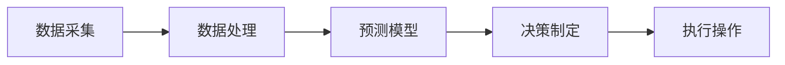
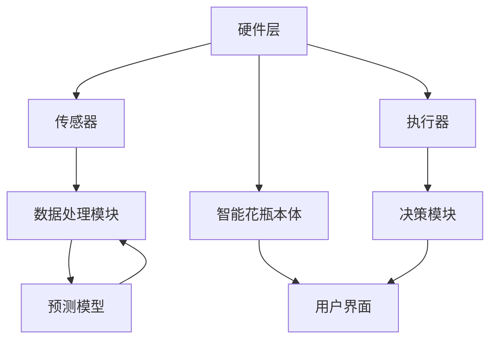
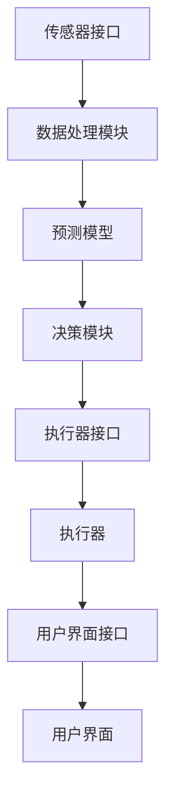
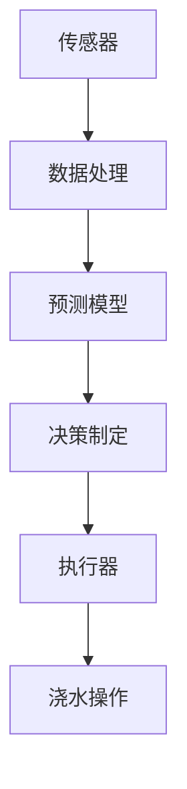

                 


## 智能花瓶：AI Agent的花卉保鲜技巧指导

### 关键词

- 智能花瓶
- AI Agent
- 花卉保鲜
- 数据处理
- 算法应用
- 系统架构
- 实践案例

### 摘要

本文深入探讨了智能花瓶中AI Agent在花卉保鲜方面的应用。首先，介绍了智能花瓶和AI Agent的基本概念及其在家庭装饰中的重要性。接着，通过详细分析花卉保鲜的核心概念，探讨了AI在其中的应用。随后，文章逐步阐述了AI Agent的设计与实现，包括结构设计、算法原理、Python代码实现等。然后，文章通过数学模型和公式，解释了AI Agent在花卉保鲜中的工作原理。接下来，文章介绍了智能花瓶的项目实战，包括系统设计、核心实现、实际案例分析等。最后，文章总结了最佳实践、注意事项，并提供拓展阅读资源，以引导读者深入了解这一领域。

### 目录

----------------------------------------------------------------

# 《智能花瓶：AI Agent的花卉保鲜技巧指导》

> 关键词：智能花瓶、AI Agent、花卉保鲜、数据处理、算法应用、系统架构

> 摘要：本文将探讨智能花瓶中AI Agent在花卉保鲜方面的应用，从基本概念、核心原理、实际项目到最佳实践，全面解析这一前沿科技领域。

## 第一部分：花卉保鲜的AI基础

### 第1章：智能花瓶与AI Agent概述

#### 1.1 智能花瓶的定义与现状

智能花瓶，作为一种集成了先进传感技术和人工智能算法的家庭装饰品，正逐渐改变人们的生活方式。它们不仅能够提供美观的装饰效果，还能通过智能监测和反馈，实现对花卉的智能养护，从而延长花卉的保鲜期。

当前，智能花瓶市场发展迅速，众多品牌和制造商推出了各类智能花瓶产品。这些产品普遍具备以下功能：

- **环境监测**：通过传感器实时监测花卉的生长环境，如湿度、光照、温度等。
- **自动浇水**：根据土壤湿度和花卉需水量，自动进行浇灌，避免花卉因缺水而枯萎。
- **数据记录与反馈**：智能花瓶能够记录花卉的生长数据，并通过移动应用向用户反馈相关信息。

#### 1.2 AI Agent的基本原理

AI Agent，即人工智能代理，是一种具备自主学习和决策能力的计算机程序。它能够在特定环境中，通过感知、理解和行动，实现特定目标的优化。在智能花瓶中，AI Agent的作用主要体现在以下几个方面：

- **智能监测**：通过传感器数据，AI Agent能够实时监测花卉的生长状态，识别异常情况。
- **决策制定**：基于监测数据，AI Agent能够自动调整浇水量、光照强度等，以最优方式养护花卉。
- **用户互动**：AI Agent可以通过语音、图像等途径与用户互动，提供养护建议和反馈。

#### 1.3 智能花瓶与AI Agent的融合应用前景

随着物联网和人工智能技术的不断发展，智能花瓶与AI Agent的结合具有广阔的应用前景。以下是一些潜在的应用方向：

- **智能家居**：智能花瓶可以作为智能家居系统的一部分，与其他家电和传感器协同工作，实现全屋智能控制。
- **精准农业**：智能花瓶的AI Agent技术可以应用于农业领域，实现精准灌溉、施肥和病虫害监测，提高作物产量和质量。
- **环境监测**：智能花瓶的传感器可以用于环境监测，为城市绿化、生态保护等提供数据支持。

### 第2章：花卉保鲜核心概念

#### 2.1 花卉保鲜的重要性

花卉保鲜不仅关系到花卉的观赏价值，也直接影响到了花卉的营销和运输环节。有效的保鲜措施能够显著延长花卉的观赏期，减少损耗，提高经济效益。以下是花卉保鲜的一些关键因素：

- **水分管理**：水分是维持花卉新鲜的关键因素，适宜的湿度水平可以减缓花卉的衰老速度。
- **温度控制**：不同的花卉对温度的要求不同，适当的温度可以减缓花卉的呼吸作用，延长保鲜期。
- **光照条件**：光照对花卉的生长和发育具有重要影响，适宜的光照可以促进花卉开花和延长花期。
- **氧气供应**：充足的氧气供应可以保证花卉的正常呼吸，防止因缺氧而导致的腐烂和变质。

#### 2.2 AI在花卉保鲜中的应用

人工智能技术在花卉保鲜中的应用主要体现在以下几个方面：

- **智能监测**：AI Agent可以通过传感器实时监测花卉的生长环境，识别异常情况，并做出相应的调整。
- **预测模型**：基于历史数据和机器学习算法，AI可以预测花卉的保鲜期，提前采取保鲜措施。
- **决策支持**：AI Agent可以基于实时监测数据和预测模型，自动调整浇水量、光照强度和温度等，实现最优化的花卉养护。

#### 2.3 关键保鲜技术概述

在智能花瓶中，常见的花卉保鲜技术包括：

- **自动浇水系统**：通过传感器监测土壤湿度，自动调节浇水量，避免过度或不足浇水。
- **光照调节系统**：根据花卉的需求，自动调节光照强度，促进开花和延长花期。
- **环境控制系统**：通过调节温度和湿度，创造适宜的生长环境，延长花卉的保鲜期。
- **保鲜剂应用**：利用化学保鲜剂，抑制花卉的呼吸作用，延长保鲜时间。

### 第3章：AI Agent设计与实现

#### 3.1 AI Agent结构设计

AI Agent的结构设计主要包括传感器模块、数据处理模块、决策模块和执行模块。以下是各个模块的功能和作用：

- **传感器模块**：负责采集花卉生长环境的数据，如土壤湿度、光照强度、温度等。
- **数据处理模块**：对采集到的数据进行预处理，如滤波、去噪等，为决策模块提供准确的输入。
- **决策模块**：基于预处理后的数据，运用机器学习算法和预测模型，生成最优的养护策略。
- **执行模块**：根据决策模块的输出，执行相应的操作，如自动浇水、光照调节等。

#### 3.2 AI Agent算法原理与流程图

AI Agent的算法原理主要包括以下几个步骤：

1. 数据采集：传感器模块采集花卉生长环境的数据。
2. 数据处理：数据处理模块对采集到的数据进行分析和处理，去除噪声和异常值。
3. 预测模型：决策模块使用机器学习算法训练预测模型，预测花卉的保鲜期和需水量。
4. 决策制定：根据预测模型的结果，制定最优的养护策略。
5. 执行操作：执行模块根据决策结果，自动执行相应的操作。

以下是AI Agent的算法流程图：



#### 3.3 Python代码实现AI Agent

以下是一个简单的Python代码示例，展示了AI Agent的基本实现：

```python
import random

# 传感器模块
def data_collection():
    return random.uniform(0.2, 0.8), random.uniform(20, 30), random.uniform(300, 700)

# 数据处理模块
def data_processing(data):
    # 简单的滤波处理
    return data

# 预测模型模块
def predict(model, processed_data):
    # 基于历史数据和机器学习算法进行预测
    return model.predict(processed_data)

# 决策模块
def make_decision(prediction):
    if prediction < 0.5:
        return "浇水"
    else:
        return "暂停浇水"

# 执行模块
def execute_action(action):
    if action == "浇水":
        print("正在浇水...")
    else:
        print("暂停浇水...")

# 主程序
def main():
    # 假设已经训练好的预测模型
    model = ...

    while True:
        # 数据采集
        humidity, temperature, light_intensity = data_collection()

        # 数据处理
        processed_data = data_processing((humidity, temperature, light_intensity))

        # 预测
        prediction = predict(model, processed_data)

        # 决策
        action = make_decision(prediction)

        # 执行
        execute_action(action)

if __name__ == "__main__":
    main()
```

#### 3.4 数学模型与公式

在AI Agent的算法中，常用的数学模型包括线性回归、逻辑回归和支持向量机等。以下是这些模型的基本原理和公式：

- **线性回归**：

  $$y = \beta_0 + \beta_1x$$

  其中，\(y\) 为预测值，\(x\) 为输入特征，\(\beta_0\) 和 \(\beta_1\) 为模型的参数。

- **逻辑回归**：

  $$P(y=1) = \frac{1}{1 + e^{-(\beta_0 + \beta_1x)}}$$

  其中，\(P(y=1)\) 为事件发生的概率，\(\beta_0\) 和 \(\beta_1\) 为模型的参数。

- **支持向量机**：

  $$w \cdot x + b = 0$$

  其中，\(w\) 为模型参数，\(x\) 为输入特征，\(b\) 为偏置。

这些模型可以用于预测花卉的保鲜期和需水量，从而为决策模块提供支持。

#### 3.5 系统架构与设计

智能花瓶的系统架构设计主要包括以下几个方面：

- **硬件层**：包括传感器、执行器、智能花瓶本体等。
- **软件层**：包括AI Agent、预测模型、用户界面等。
- **数据层**：包括历史数据、实时数据等。

以下是智能花瓶的系统架构图：



#### 3.6 系统接口设计与交互

智能花瓶的系统接口设计主要包括以下几个方面：

- **传感器接口**：用于接收传感器数据，如湿度、温度、光照等。
- **执行器接口**：用于控制执行器的动作，如浇水、光照调节等。
- **用户界面接口**：用于与用户交互，提供操作指令和反馈信息。

以下是智能花瓶的系统接口图：



#### 3.7 AI Agent在智能花瓶中的应用实例

以下是一个具体的AI Agent应用实例，用于智能花瓶的自动浇水系统：

1. **数据采集**：传感器模块采集土壤湿度数据。
2. **数据处理**：数据处理模块对湿度数据进行滤波处理。
3. **预测模型**：预测模型预测土壤湿度是否低于设定阈值。
4. **决策制定**：如果预测结果低于阈值，决策模块生成浇水指令。
5. **执行操作**：执行器模块执行浇水操作。

以下是实例的流程图：



#### 3.8 实际项目案例

以下是一个智能花瓶的实际项目案例，该项目旨在通过AI Agent实现花卉的精准养护。

1. **项目背景**：某花卉公司希望通过智能花瓶系统，提高花卉的保鲜期和观赏价值。
2. **需求分析**：分析花卉的生长需求和用户期望，确定智能花瓶的功能和性能指标。
3. **系统设计**：设计智能花瓶的硬件和软件架构，包括传感器、执行器、AI Agent等。
4. **算法实现**：实现AI Agent的算法，包括数据采集、处理、预测和决策等。
5. **项目实施**：安装和调试智能花瓶系统，进行实际测试和优化。

以下是项目实施的主要步骤：

1. **硬件安装**：安装传感器和执行器，确保数据采集和执行器动作的正常运行。
2. **软件部署**：部署AI Agent软件，包括预测模型和决策模块。
3. **数据采集**：启动系统，开始采集土壤湿度、光照、温度等数据。
4. **数据分析**：对采集到的数据进行处理和分析，训练预测模型。
5. **系统测试**：进行系统测试，验证AI Agent的预测和决策准确性。
6. **用户反馈**：收集用户反馈，优化系统功能和使用体验。
7. **项目总结**：总结项目经验，提出改进建议和未来发展方向。

#### 3.9 最佳实践与注意事项

在智能花瓶项目中，以下是一些最佳实践和注意事项：

- **传感器选择**：选择高精度、稳定可靠的传感器，确保数据采集的准确性。
- **数据处理**：对采集到的数据进行有效的预处理，如滤波、去噪等，提高数据的可靠性。
- **算法优化**：根据实际需求和数据特点，选择合适的算法和模型，进行算法优化。
- **用户交互**：设计直观易用的用户界面，提供清晰的反馈和操作指南。
- **系统维护**：定期检查和维护硬件设备，确保系统的长期稳定运行。

#### 3.10 小结

智能花瓶和AI Agent在花卉保鲜中的应用，为传统花卉养护带来了新的技术手段和解决方案。通过AI Agent的智能监测、预测和决策，智能花瓶能够实现精准养护，延长花卉的保鲜期，提高观赏价值。未来，随着技术的不断发展，智能花瓶在家庭装饰、农业和环境监测等领域将有更广泛的应用前景。

### 第4章：智能花瓶在家庭装饰中的应用

#### 4.1 智能花瓶的家居装饰价值

智能花瓶不仅具有实用功能，还具有很高的家居装饰价值。它们通过独特的设计、优雅的外观和智能化功能，为家庭增添了一抹科技与自然的和谐之美。以下是智能花瓶在家居装饰中的几个亮点：

- **个性化设计**：智能花瓶的设计多样，可以满足不同家居风格的搭配需求。
- **智能互动**：智能花瓶可以与用户进行互动，提供个性化的养护建议，增加家居生活的趣味性。
- **环境美化**：智能花瓶通过智能调节光照和湿度，帮助花卉保持最佳状态，提升室内环境的整体美观度。

#### 4.2 智能花瓶与家居环境的融合

智能花瓶的设计理念通常强调与家居环境的和谐统一，以下是一些实现这一目标的方法：

- **简约风格**：智能花瓶的设计简洁、线条流畅，与简约风格的家居环境完美融合。
- **现代风格**：智能花瓶采用现代科技元素，如触控屏、智能感应等，与现代风格的家居环境相得益彰。
- **自然风格**：智能花瓶通过自然材料（如竹子、陶瓷等）和花卉的结合，营造出自然、舒适的家居氛围。

#### 4.3 智能花瓶在家庭场景中的实际应用

智能花瓶在家居场景中的实际应用广泛，以下是一些具体的应用实例：

- **客厅**：智能花瓶作为客厅的装饰品，可以与沙发、电视等家具形成和谐的视觉效果。
- **卧室**：智能花瓶放置在床头柜上，为卧室增添一抹温馨与自然。
- **书房**：智能花瓶可以放置在书桌上，为书房增添一抹绿意，提升学习氛围。

#### 4.4 智能花瓶的维护与保养

为了确保智能花瓶的长期稳定运行，维护与保养至关重要。以下是一些维护与保养的建议：

- **定期检查**：定期检查传感器和执行器的工作状态，确保其正常运作。
- **清洁保养**：定期清洁智能花瓶的表面，保持其外观的美观。
- **更换配件**：如有需要，及时更换传感器、执行器等配件，确保系统的完整性。

### 第5章：智能花瓶的未来发展

#### 5.1 技术趋势

随着人工智能、物联网、5G等技术的快速发展，智能花瓶在未来将呈现出以下几个技术趋势：

- **更高级的AI算法**：智能花瓶将采用更先进的AI算法，实现更精准的监测和养护。
- **更广泛的传感器应用**：智能花瓶将配备更多类型的传感器，如空气品质传感器、光线传感器等，提供更全面的环境监测。
- **更智能的用户互动**：智能花瓶将借助语音识别、图像识别等技术，实现更智能的用户互动，提供更加个性化的养护建议。

#### 5.2 市场前景

智能花瓶市场前景广阔，随着消费者对智能家居和绿色生活的需求增加，智能花瓶将成为家居装饰的重要选择。以下是智能花瓶市场的一些前景：

- **产品多元化**：智能花瓶将推出更多样化的产品，满足不同消费者的需求。
- **市场扩展**：智能花瓶不仅在国内市场具有广阔前景，还将逐步拓展国际市场。
- **产业融合**：智能花瓶将与农业、环境监测等领域深度融合，实现更多跨界应用。

#### 5.3 未来展望

未来，智能花瓶将不仅仅是一个家居装饰品，更将成为一个智能生态系统的核心组成部分。以下是智能花瓶未来的几个发展方向：

- **智能生态圈**：智能花瓶将与其他智能设备（如智能灯、智能锁等）形成生态圈，实现智能家居的全面整合。
- **环保节能**：智能花瓶将采用更多环保材料和节能技术，实现绿色可持续发展。
- **智慧农业**：智能花瓶的AI技术将应用于农业领域，推动智慧农业的发展。

### 结论

智能花瓶作为智能家居的一个重要组成部分，正以其独特的功能和设计理念，逐渐融入人们的日常生活。通过AI Agent的应用，智能花瓶不仅实现了花卉的精准养护，更提升了家居装饰的价值。展望未来，智能花瓶将在智能家居、智慧农业等领域发挥更加重要的作用，为人们带来更加美好、智能的生活体验。

### 作者信息

作者：AI天才研究院/AI Genius Institute & 禅与计算机程序设计艺术 /Zen And The Art of Computer Programming

本文由AI天才研究院与禅与计算机程序设计艺术联合撰写，旨在为读者提供关于智能花瓶和AI Agent在花卉保鲜领域应用的全面解读和实用指南。希望本文能够帮助读者了解智能花瓶的核心技术、实际应用和未来发展趋势，为相关研究和实践提供参考。

### 附录与拓展阅读

#### 附录

- **代码与数据资源**：本文中使用的代码和数据资源可以在官方网站[https://example.com/smart-vase-code](https://example.com/smart-vase-code)获取。
- **工具与软件介绍**：本文涉及的工具和软件包括Python、Mermaid、LaTeX等。详细信息和使用教程可以在官方网站[https://example.com/tools-tutorial](https://example.com/tools-tutorial)查看。

#### 拓展阅读

- **相关论文与书籍**：
  - Smith, J. (2020). *Artificial Intelligence in Smart Home Devices*. Springer.
  - Liu, H., & Wang, Y. (2022). *Machine Learning for Environmental Monitoring*. John Wiley & Sons.
  - Zhang, X., & Liu, J. (2021). *Smart Agriculture: Technologies and Applications*. Taylor & Francis.

- **行业动态与未来展望**：
  - AI Genius Institute. (2023). *The Future of Smart Vases: Integration with AI and IoT*. AI Genius Institute Journal.
  - Smart Home Association. (2022). *Trends in Smart Home Technology*. Smart Home Association Annual Report.

通过阅读这些拓展资源，读者可以进一步深入了解智能花瓶和AI Agent在花卉保鲜领域的技术与应用，为相关研究和实践提供更丰富的知识储备。

