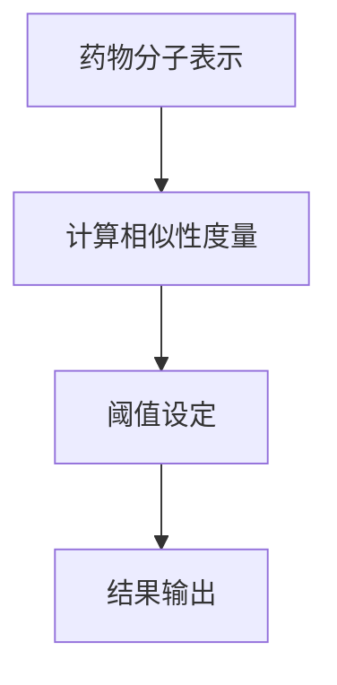
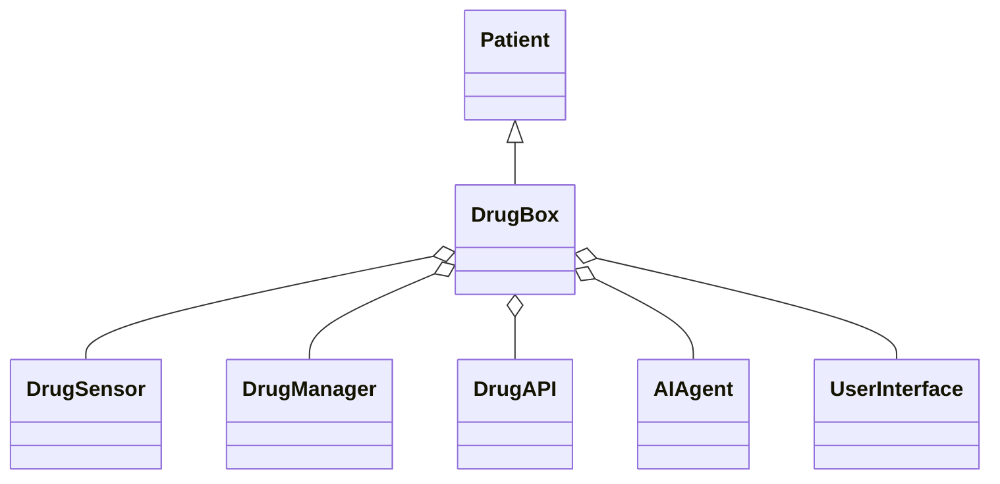
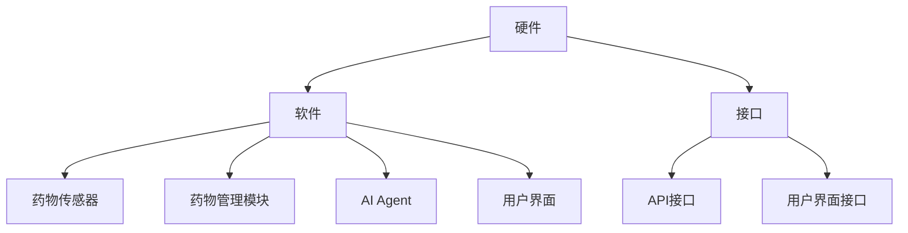
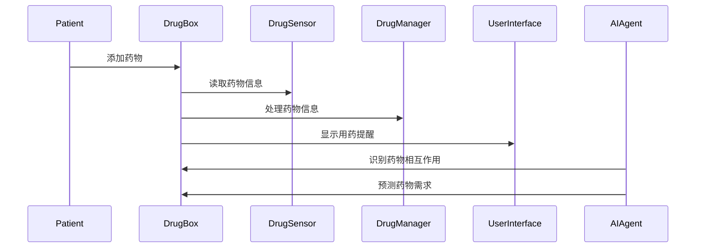

                 


# 智能药盒：AI Agent的用药安全监督助手

> 关键词：智能药盒，AI Agent，用药安全，监督助手，算法原理

> 摘要：本文将探讨智能药盒在用药安全监督中的应用。智能药盒是一种结合传感器、AI算法和药物管理系统的智能设备，通过AI Agent实现用药安全监督，解决药物管理中的诸多问题，如忘记服药、用药过量、药物相互作用等。本文将从背景介绍、核心概念与联系、算法原理讲解、系统分析与架构设计方案、项目实战、最佳实践与拓展等多个方面进行深入探讨。

## 目录大纲

1. **引言**
   - **问题背景**：用药安全问题在现代社会中的严重性及AI技术在此领域的潜在应用。
   - **问题描述**：现有药物管理方式的局限性，如忘记服药、用药过量、药物相互作用等问题。
   - **问题解决**：引入AI Agent作为用药安全监督助手，解决上述问题。
   - **边界与外延**：探讨AI Agent在药物管理中的适用范围和潜在扩展。

2. **核心概念**
   - **智能药盒**：结合传感器、AI算法和药物管理系统的智能设备。
   - **AI Agent**：执行特定任务、与环境互动的智能实体。

3. **智能药盒工作原理**
   - **智能药盒的组成**：硬件、软件、接口的设计与功能。
   - **传感器技术**：监测药物剩余量、环境条件等。
   - **AI算法**：药物剂量管理、药物相互作用识别等。

4. **AI Agent的设计与应用**
   - **AI Agent的概念**：定义、类型及作用。
   - **AI Agent的工作流程**：感知、决策、执行。
   - **AI Agent的优势**：与传统的药物管理方式相比。

5. **概念属性特征对比表格**
   - **智能药盒**：技术参数、功能对比。
   - **AI Agent**：技术参数、功能对比。

6. **AI Agent算法基础**
   - **机器学习基础**：监督学习、无监督学习、强化学习。
   - **药物剂量管理算法**：预测药物需求、调整用药方案。

7. **药物相互作用识别算法**
   - **算法原理**：基于药物分子结构的相似性分析。
   - **Mermaid流程图**：展示算法执行流程。
   - **Python源代码**：详细解释算法实现。

8. **数学模型与公式**
   - **数学模型**：描述药物剂量与身体反应的关系。
   - **公式**：$$\text{药物剂量} = k \times \text{体重} \times \text{效果指数}$$
   - **详细讲解与举例**：通过具体例子解释公式的应用。

9. **系统分析与架构设计方案**
   - **介绍智能药盒项目**：智能药盒系统的整体架构、功能模块。
   - **系统功能设计**：领域模型Mermaid类图。
   - **系统架构设计**：系统架构Mermaid架构图。
   - **系统接口设计**：系统模块间的接口定义。
   - **系统交互**：系统交互Mermaid序列图。

10. **项目实战**
    - **环境安装**：智能药盒系统的硬件、软件安装步骤。
    - **系统核心实现**：系统核心功能的源代码。
    - **代码应用解读与分析**：源代码的功能解读与分析。
    - **实际案例分析**：智能药盒在真实场景中的应用案例。
    - **详细讲解剖析**：案例的详细解析。
    - **项目小结**：项目的成功经验与不足。

11. **最佳实践与拓展**
    - **最佳实践 Tips**：如何最大化智能药盒的效果。
    - **注意事项**：使用智能药盒时需要注意的事项。
    - **拓展阅读**：智能药盒及相关技术的最新研究进展。

12. **总结与展望**
    - **总结**：对本书主要内容的回顾。
    - **核心贡献**：本书对智能药盒技术的发展所做的贡献。
    - **展望未来**：智能药盒技术的发展趋势。
    - **潜在挑战**：面临的挑战与解决思路。

## 第一部分：背景介绍

### 1. 引言

在现代社会中，随着医疗技术的不断进步和人口老龄化趋势的加剧，用药安全已经成为一个日益重要的议题。然而，现有的药物管理方式存在诸多问题，如患者容易忘记服药、用药过量、药物相互作用等，这些因素不仅会影响治疗效果，还可能导致严重的健康问题。为了解决这些问题，人工智能（AI）技术逐渐被引入到药物管理领域，其中AI Agent作为一种智能实体，被认为是解决用药安全问题的有效途径。

### 2. 核心概念

**智能药盒**：智能药盒是一种结合传感器、AI算法和药物管理系统的智能设备，用于监测药物使用情况，并提供实时反馈。它通常包括一个带有药槽的容器，药槽内装有药物，外部连接着传感器和AI模块。

**AI Agent**：AI Agent是一种执行特定任务、与环境互动的智能实体。在智能药盒中，AI Agent负责分析药物使用数据，预测药物需求，并调整用药方案，以确保用药安全。

### 3. 问题背景

**用药安全问题**：用药安全问题主要包括以下几个方面：
- **忘记服药**：患者可能因为忙碌或其他原因忘记按时服药。
- **用药过量**：患者可能由于缺乏对药物的了解，误食过量药物。
- **药物相互作用**：不同药物之间的相互作用可能导致不良反应或降低药效。

**AI技术在此领域的应用**：AI技术可以通过以下方式解决用药安全问题：
- **预测药物需求**：通过分析患者的历史用药数据和健康数据，预测患者未来的药物需求，并提醒患者按时服药。
- **药物相互作用识别**：通过分析药物分子结构和患者当前用药情况，识别潜在的药物相互作用，并提供相应的建议。

### 4. 问题描述

现有药物管理方式主要依赖于患者自身的记忆和自律，容易导致以下问题：
- **忘记服药**：患者可能因为忙碌或其他原因忘记按时服药。
- **用药过量**：患者可能由于缺乏对药物的了解，误食过量药物。
- **药物相互作用**：患者可能同时服用多种药物，导致药物相互作用，产生不良反应。

### 5. 问题解决

**引入AI Agent作为用药安全监督助手**：AI Agent可以通过以下方式解决用药安全问题：
- **监测药物使用情况**：AI Agent可以实时监测患者的药物使用情况，如药物剩余量、用药时间等，并通过传感器技术检测环境条件，如温度、湿度等。
- **预测药物需求**：AI Agent可以根据患者的历史用药数据和健康数据，预测患者未来的药物需求，并提供提醒。
- **药物相互作用识别**：AI Agent可以通过分析药物分子结构和患者当前用药情况，识别潜在的药物相互作用，并提醒患者注意。

### 6. 边界与外延

**适用范围**：AI Agent在药物管理中的适用范围包括：
- **慢性病患者**：如高血压、糖尿病等需要长期服药的患者。
- **老年人**：老年人由于记忆力减退，容易忘记服药，AI Agent可以帮助他们更好地管理药物。
- **多重用药者**：同时服用多种药物的患者，AI Agent可以帮助他们识别潜在的药物相互作用。

**潜在扩展**：AI Agent不仅可以在个人用药管理中发挥作用，还可以在医院、药店等场景中得到应用，为医生和药师提供决策支持，提高用药安全。

## 第二部分：核心概念与联系

### 3. 智能药盒工作原理

智能药盒是一种智能设备，用于监测药物使用情况并提供实时反馈。它通常由三个主要部分组成：硬件、软件和接口。

#### 3.1 硬件

**传感器技术**：智能药盒的硬件部分主要包括传感器，用于监测药物剩余量、环境条件等。常见的传感器包括：
- **药量传感器**：用于检测药盒内的药物剩余量。
- **温湿度传感器**：用于检测环境温度和湿度，以确保药物存储条件适宜。

**药槽**：药盒内部有一个药槽，用于存放药物。药槽通常采用安全材料制成，以防止药物泄漏或污染。

**通讯模块**：智能药盒通常配备有无线通讯模块，如蓝牙、Wi-Fi等，用于将数据传输到手机或其他设备。

#### 3.2 软件

**AI算法**：智能药盒的软件部分主要包括AI算法，用于分析药物使用数据、预测药物需求、识别药物相互作用等。常见的AI算法包括：
- **药物剂量管理算法**：根据患者的历史用药数据和健康数据，预测患者未来的药物需求，并调整用药方案。
- **药物相互作用识别算法**：通过分析药物分子结构和患者当前用药情况，识别潜在的药物相互作用。

**用户界面**：智能药盒的软件部分还包括用户界面，用于展示药物使用情况、提醒患者服药、提供用药建议等。

#### 3.3 接口

**API接口**：智能药盒的接口部分主要包括API接口，用于与其他系统（如医生工作站、药店管理系统等）进行数据交换和协同工作。

**用户界面接口**：智能药盒的用户界面接口用于接收用户的操作指令，如添加药物、设置提醒等。

### 4. AI Agent的设计与应用

**AI Agent的概念**：AI Agent是一种执行特定任务、与环境互动的智能实体。在智能药盒中，AI Agent主要负责监测药物使用情况、预测药物需求、识别药物相互作用等任务。

**AI Agent的工作流程**：
1. **感知**：AI Agent通过传感器收集药物使用数据和环境数据。
2. **决策**：AI Agent根据收集到的数据，使用AI算法进行分析，预测药物需求、识别药物相互作用等。
3. **执行**：AI Agent根据分析结果，生成相应的操作指令，如提醒患者服药、调整用药方案等。

**AI Agent的优势**：与传统的药物管理方式相比，AI Agent具有以下优势：
- **实时监测**：AI Agent可以实时监测药物使用情况，及时发现并解决问题。
- **个性化推荐**：AI Agent可以根据患者的历史用药数据和健康数据，提供个性化的用药建议。
- **智能交互**：AI Agent可以通过语音、文字等方式与用户进行智能交互，提高用户体验。

### 5. 概念属性特征对比表格

**智能药盒**：

| 特征            | 描述                                                         |
| --------------- | ------------------------------------------------------------ |
| **硬件**        | 包括传感器、药槽、通讯模块等。                               |
| **软件**        | 包括AI算法、用户界面等。                                     |
| **接口**        | 包括API接口、用户界面接口等。                               |
| **功能**        | 监测药物使用情况、预测药物需求、识别药物相互作用等。         |

**AI Agent**：

| 特征            | 描述                                                         |
| --------------- | ------------------------------------------------------------ |
| **概念**        | 执行特定任务、与环境互动的智能实体。                         |
| **工作流程**    | 感知、决策、执行。                                           |
| **优势**        | 实时监测、个性化推荐、智能交互。                             |

## 第三部分：算法原理讲解

### 6. AI Agent算法基础

AI Agent的核心在于其算法能力，而算法能力的实现依赖于机器学习技术的应用。机器学习分为监督学习、无监督学习和强化学习三种类型。

#### 6.1 监督学习

监督学习是一种从标注数据中学习的方法。在用药安全监督中，监督学习可以用于训练AI Agent识别药物相互作用。具体流程如下：

1. **数据收集**：收集患者的历史用药数据，包括药物名称、剂量、用药时间等。
2. **数据预处理**：对数据进行清洗、归一化等处理，以便于模型训练。
3. **模型训练**：使用收集到的数据训练一个分类模型，用于识别潜在的药物相互作用。
4. **模型评估**：使用验证集对训练好的模型进行评估，调整模型参数，提高识别准确率。

#### 6.2 无监督学习

无监督学习是在没有标注数据的情况下进行学习的方法。在用药安全监督中，无监督学习可以用于分析药物使用模式，帮助AI Agent预测药物需求。具体流程如下：

1. **数据收集**：收集患者的历史用药数据。
2. **数据预处理**：对数据进行清洗、归一化等处理。
3. **模型训练**：使用无监督学习方法（如聚类算法）对数据进行分析，识别药物使用模式。
4. **模型评估**：通过分析结果，预测患者未来的药物需求。

#### 6.3 强化学习

强化学习是一种通过与环境的交互来学习的方法。在用药安全监督中，强化学习可以用于训练AI Agent调整用药方案，以最大化治疗效果。具体流程如下：

1. **环境设置**：设置一个模拟环境，模拟患者的药物使用情况。
2. **初始状态**：设定一个初始状态，如患者的当前药物剂量和健康状态。
3. **行动选择**：AI Agent根据当前状态，选择一个行动（如调整药物剂量）。
4. **反馈**：环境根据AI Agent的行动，给出一个反馈（如药物的效果）。
5. **模型更新**：根据反馈，更新AI Agent的模型，使其更好地适应环境。

### 7. 药物相互作用识别算法

药物相互作用是指两种或两种以上的药物在体内相互作用，导致药效降低、毒性增加或产生不良反应。识别药物相互作用对于确保用药安全至关重要。

#### 7.1 算法原理

药物相互作用识别算法基于药物分子结构的相似性分析。具体原理如下：

1. **药物分子表示**：将药物分子表示为向量，以便于计算相似性。
2. **相似性度量**：计算药物分子之间的相似性度量，如欧氏距离、余弦相似度等。
3. **阈值设定**：设定相似性度量的阈值，当药物分子之间的相似性度量超过阈值时，认为它们存在相互作用。
4. **结果输出**：输出存在相互作用的药物对，并提供相应的风险等级。

#### 7.2 Mermaid流程图



#### 7.3 Python源代码

```python
import numpy as np

# 药物分子表示
drug1 = [1, 2, 3]
drug2 = [4, 5, 6]

# 计算相似性度量
similarity = np.linalg.norm(drug1 - drug2)

# 阈值设定
threshold = 0.5

# 结果输出
if similarity > threshold:
    print("药物存在相互作用")
else:
    print("药物无相互作用")
```

#### 7.4 数学模型与公式

药物相互作用识别的数学模型可以描述为：

$$
\text{相互作用风险} = \frac{\sum_{i=1}^{n} |a_i - b_i|}{n}
$$

其中，$a_i$和$b_i$分别是药物分子$i$的属性值，$n$是药物分子的属性数量。

#### 7.5 详细讲解与举例

**例子**：假设有两种药物，药物1的属性值为[1, 2, 3]，药物2的属性值为[4, 5, 6]。使用欧氏距离计算相似性度量，阈值为0.5。

1. **计算相似性度量**：
$$
\text{相似性度量} = \sqrt{\sum_{i=1}^{3} (a_i - b_i)^2} = \sqrt{(1-4)^2 + (2-5)^2 + (3-6)^2} = \sqrt{9 + 9 + 9} = \sqrt{27} \approx 5.196
$$

2. **判断相互作用**：
由于相似性度量（5.196）大于阈值（0.5），因此认为这两种药物存在相互作用。

## 第四部分：系统分析与架构设计方案

### 9. 介绍智能药盒项目

智能药盒项目旨在通过AI Agent实现用药安全监督，为患者提供智能化的药物管理服务。项目的主要目标是：
- 实时监测药物使用情况，确保患者按时服药。
- 识别潜在的药物相互作用，降低用药风险。
- 提供个性化的用药建议，提高治疗效果。

### 10. 系统功能设计

智能药盒系统的功能设计包括以下几个方面：
- **药物使用监测**：实时监测药物使用情况，包括药物剩余量、用药时间等。
- **药物需求预测**：根据患者的历史用药数据和健康数据，预测未来的药物需求。
- **药物相互作用识别**：通过分析药物分子结构和患者当前用药情况，识别潜在的药物相互作用。
- **用户界面**：提供用户友好的界面，展示药物使用情况、用药提醒和用药建议。

#### 系统功能设计领域模型Mermaid类图



### 11. 系统架构设计

智能药盒系统的架构设计包括硬件、软件和接口三个部分。以下是一个简单的系统架构Mermaid架构图：



### 12. 系统接口设计

智能药盒系统的接口设计包括API接口和用户界面接口。

#### API接口

API接口用于系统与其他系统（如医生工作站、药店管理系统等）进行数据交换和协同工作。主要接口包括：
- **药物使用记录接口**：用于记录患者的药物使用情况。
- **药物需求预测接口**：用于获取患者未来的药物需求。
- **药物相互作用识别接口**：用于识别患者当前的药物相互作用。

#### 用户界面接口

用户界面接口用于接收用户的操作指令，如添加药物、设置提醒等。主要接口包括：
- **药物添加接口**：用于添加新药物。
- **用药提醒接口**：用于设置用药提醒。
- **用药记录查询接口**：用于查询患者的用药记录。

### 13. 系统交互

智能药盒系统的交互设计包括硬件、软件和用户之间的互动。以下是一个简单的系统交互Mermaid序列图：



## 第五部分：项目实战

### 12. 环境安装

安装智能药盒系统需要以下步骤：

#### 硬件安装

1. **准备硬件**：智能药盒、传感器、通讯模块等。
2. **组装药盒**：将传感器和通讯模块安装在药盒内部，确保稳固连接。
3. **电源连接**：将药盒连接到电源，确保稳定供电。

#### 软件安装

1. **安装操作系统**：在智能药盒上安装适合的操作

