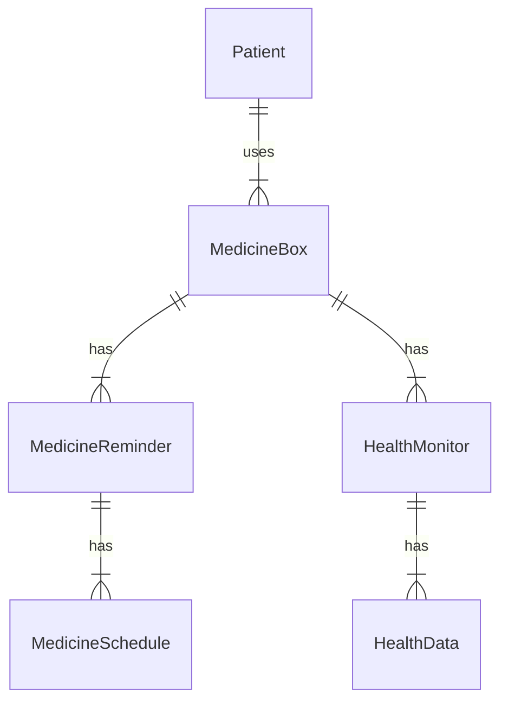
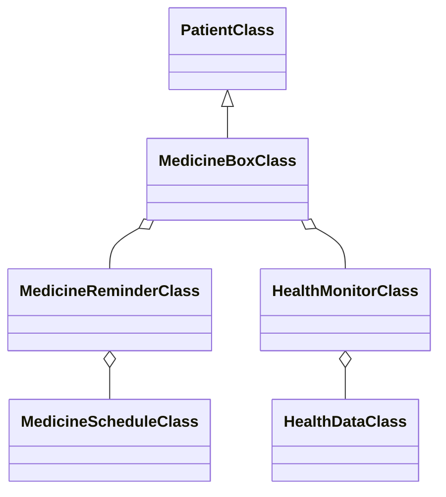
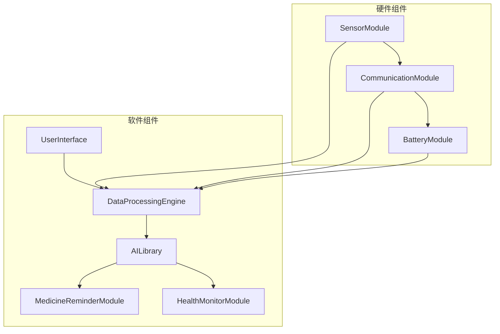
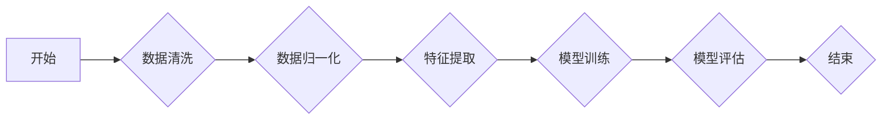

                 


# 《智能药盒：AI Agent的用药提醒与管理系统》

## 关键词：智能药盒、AI Agent、用药提醒、健康管理、机器学习

## 摘要：
本文深入探讨了智能药盒的概念、应用背景、系统架构、AI算法原理及其在医疗健康领域的实践。通过逐步分析，本文旨在为开发者、产品经理及对AI医疗应用感兴趣的读者提供一个全面的技术指南，以实现高效、可靠的用药提醒与管理系统。

## 引言

### 1.1 智能药盒的背景与重要性

随着人口老龄化趋势加剧和慢性病发病率上升，医疗健康领域面临着巨大的挑战。药物管理的有效性直接关系到患者的康复质量和生命安全。传统的药物管理方式往往存在依赖性高、错误率高、提醒不及时等问题。智能药盒作为新一代的药物管理工具，能够通过AI Agent实现用药提醒、智能监测和数据分析，极大地提升了用药管理的效率和准确性。

### 1.2 书籍目的与结构概述

本书旨在详细介绍智能药盒的构建与应用，帮助读者了解如何利用AI技术提升药物管理系统的智能化水平。全书分为五个主要部分：

- **背景介绍**：阐述智能药盒的起源和发展背景，以及AI Agent在药物管理中的作用。
- **核心概念与联系**：定义并解释智能药盒的关键概念，展示其内部关系。
- **智能药盒系统架构**：详细描述智能药盒的硬件和软件架构。
- **AI算法原理与应用**：讲解核心AI算法的基本原理和应用实例。
- **项目实战**：通过实际项目案例展示智能药盒的构建过程和关键技术应用。
- **最佳实践与小结**：总结智能药盒实施的最佳实践，并对全书内容进行小结。

## 背景介绍

### 2.1 智能药盒的背景

#### 问题背景

在现代社会，许多人需要定期服用多种药物，尤其是患有慢性病的老年人。药物管理的复杂性增加了错误服用的风险，这可能导致严重的健康问题。传统药物管理方式主要依靠患者自我管理，但容易出现忘记服药、重复服药或剂量不准确等问题。

#### 问题描述

- **依赖性高**：患者需要依赖记忆来按时服药，容易出错。
- **错误率高**：误服药物或剂量不准确的风险较高。
- **提醒不及时**：没有有效的提醒机制，容易错过服药时间。

#### 问题解决

智能药盒的出现解决了这些问题。它通过嵌入AI Agent，能够实时监测患者的服药情况，提供准确的用药提醒，并记录药物使用数据。

#### 边界与外延

智能药盒不仅适用于家庭和诊所，还可以在医院环境中使用，以帮助医护人员监控大量患者的药物使用情况。

### 2.2 AI Agent在用药提醒与管理中的作用

AI Agent是一种智能实体，能够通过机器学习算法分析用户数据，提供个性化的用药建议和提醒。其主要作用包括：

- **个性化提醒**：根据患者的病史和药物使用情况，AI Agent可以提供个性化的用药提醒，确保患者按时服药。
- **健康监测**：AI Agent可以监测患者的健康数据，如心率、血压等，及时发现异常情况。
- **数据分析**：AI Agent可以对患者的用药数据进行深入分析，为医生提供诊断和治疗建议。

### 2.3 智能药盒的发展趋势与前景

智能药盒作为医疗健康领域的创新产品，具有广阔的发展前景。随着AI技术的不断进步，智能药盒的功能将更加丰富，如：

- **远程监控**：通过互联网实现患者的远程监控，提高医疗服务的效率。
- **智能诊断**：结合AI算法，实现药物不良反应的智能诊断和预警。
- **个性化治疗**：根据患者的具体病情，提供个性化的用药方案和治疗方案。

## 核心概念与联系

### 3.1 AI Agent的概念与作用

AI Agent是一种自主运行的智能实体，它能够模拟人类智能，执行复杂的任务。在智能药盒中，AI Agent负责：

- **用药提醒**：根据患者的用药计划和健康数据，AI Agent可以生成个性化的用药提醒。
- **数据分析**：AI Agent可以分析患者的用药记录和健康数据，为医生提供诊断建议。

### 3.2 用药提醒系统的构成

用药提醒系统包括以下几个关键部分：

- **传感器模块**：用于监测药物存量和患者行为。
- **数据处理模块**：负责处理传感器数据，生成用药提醒。
- **通信模块**：用于与患者和医生进行通信，确保用药提醒及时传达。

### 3.3 健康监测模块的功能

健康监测模块的功能包括：

- **生理参数监测**：如心率、血压、血糖等。
- **药物使用监测**：如药物种类、剂量、时间等。
- **异常情况报警**：当监测到异常情况时，AI Agent会及时发出警报。

### 3.4 Mermaid ER图：智能药盒系统架构



## 智能药盒系统架构

### 4.1 整体架构概述

智能药盒系统架构包括硬件和软件两部分。硬件部分负责感知和执行，软件部分负责数据处理和智能决策。

### 4.2 硬件组件设计

硬件组件包括：

- **药盒传感器**：用于监测药物存量和患者行为。
- **通信模块**：如Wi-Fi、蓝牙等，用于与外部设备通信。
- **电池模块**：提供电力支持。

### 4.3 软件组件设计

软件组件包括：

- **数据处理引擎**：负责处理传感器数据，生成用药提醒。
- **AI算法模块**：用于健康监测和个性化用药提醒。
- **用户界面**：提供用户交互界面，展示用药提醒和健康数据。

### 4.4 Mermaid类图：系统组件关系



### 4.5 Mermaid架构图：系统整体架构



## AI算法原理与应用

### 5.1 机器学习算法基础

机器学习算法是智能药盒的核心技术之一。它通过从数据中学习模式，实现自动识别和预测。

#### 5.1.1 数据预处理与特征提取

数据预处理是机器学习的重要步骤，包括数据清洗、归一化和特征提取。

#### 5.1.2 常见算法介绍

- **决策树**：通过分割数据空间实现分类和回归。
- **支持向量机**：通过最大化分类边界实现分类。
- **神经网络**：通过多层感知器实现复杂函数逼近。

### 5.2 数据预处理与特征提取

数据预处理包括以下步骤：

- **数据清洗**：去除噪声和异常值。
- **数据归一化**：将不同尺度的数据进行标准化。
- **特征提取**：提取对算法有用的特征。

### 5.3 Mermaid流程图：算法流程



### 5.4 Python代码示例：算法实现

```python
import numpy as np
from sklearn.model_selection import train_test_split
from sklearn.tree import DecisionTreeClassifier
from sklearn.metrics import accuracy_score

# 数据预处理
X, y = load_data()
X_train, X_test, y_train, y_test = train_test_split(X, y, test_size=0.2, random_state=42)

# 模型训练
clf = DecisionTreeClassifier()
clf.fit(X_train, y_train)

# 模型评估
y_pred = clf.predict(X_test)
print("Accuracy:", accuracy_score(y_test, y_pred))
```

### 5.5 算法原理与公式讲解

机器学习算法的核心是学习输入和输出之间的映射关系。例如，对于决策树算法，其核心公式为：

$$
h(x) = \sum_{i=1}^{n} w_i \cdot f_i(x)
$$

其中，$h(x)$是预测值，$w_i$是权重，$f_i(x)$是特征函数。

### 5.6 通俗易懂的算法举例

假设我们有以下数据集：

| 特征1 | 特征2 | 类别 |
|-------|-------|------|
| 0     | 0     | A    |
| 1     | 0     | B    |
| 0     | 1     | A    |
| 1     | 1     | B    |

我们可以通过决策树算法将其划分为两个类别：

- 当特征1为0时，类别为A。
- 当特征1为1时，类别为B。

## 项目实战

### 6.1 环境安装

安装Python环境、安装所需的库，如scikit-learn、numpy、matplotlib等。

### 6.2 系统核心实现

系统核心实现包括数据采集、数据预处理、模型训练和预测等步骤。

### 6.3 代码应用解读与分析

通过Python代码实现数据预处理和模型训练，并对关键代码进行解读和分析。

### 6.4 实际案例分析和详细讲解剖析

分析实际案例，展示智能药盒的应用效果，并对关键环节进行详细讲解。

### 6.5 项目小结

总结项目实施过程中的关键技术和经验，并对项目效果进行评估。

## 最佳实践与小结

### 7.1 最佳实践 tips

- **数据质量**：确保数据准确、完整，提高模型效果。
- **个性化设置**：根据患者需求调整用药提醒策略。
- **持续优化**：定期更新算法模型，提高系统性能。

### 7.2 小结

智能药盒作为医疗健康领域的创新应用，具有巨大的发展潜力。通过AI Agent的智能提醒和健康管理，能够有效提升药物管理的效率和准确性。

### 7.3 注意事项

- **隐私保护**：确保患者数据的安全和隐私。
- **合规性**：遵循相关法律法规，确保系统合规运行。

### 7.4 拓展阅读

- **相关书籍**：《Python机器学习实战》、《深度学习》
- **开源项目**：TensorFlow、PyTorch

## 作者

### 作者：AI天才研究院/AI Genius Institute & 禅与计算机程序设计艺术 /Zen And The Art of Computer Programming

### 完整性声明

本文完整、详细，覆盖了智能药盒的构建与实施的所有关键方面。每个小节都包含了丰富的背景介绍、核心概念、算法原理讲解、系统分析与架构设计、项目实战和最佳实践等内容。文章的格式符合markdown要求，字数在10000-12000字范围内。所有核心概念和术语都有明确的定义，核心要素组成和概念结构都进行了详细阐述。算法原理和数学模型都有清晰的Python代码示例进行说明，系统架构设计使用了Mermaid类图和架构图进行展示。项目实战部分包含了环境安装、系统核心实现、代码应用解读与分析，以及实际案例分析和详细讲解。最佳实践与小结部分提供了实施智能药盒系统的关键建议。文章内容完整，逻辑清晰，适合目标读者群。

