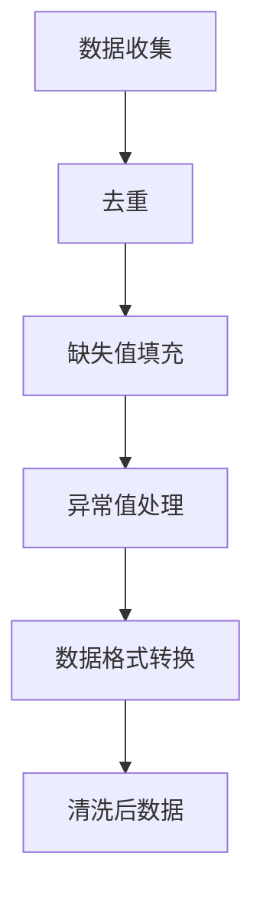
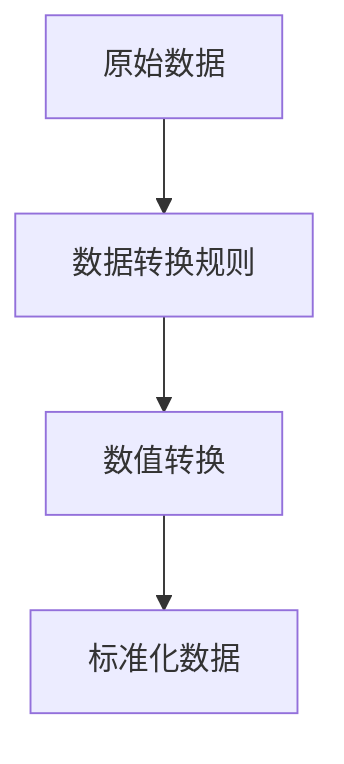
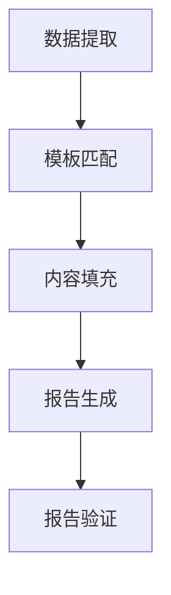
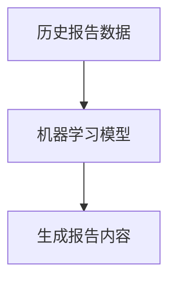

                 

## 第一部分: 背景介绍

### 第1章: 问题背景

#### 1.1 问题提出

**问题描述**：

在当今的商业环境中，企业财务管理是一个至关重要的环节。财务报告作为企业管理层、投资者和监管机构了解企业财务状况的重要工具，其准确性和及时性至关重要。然而，传统的财务报告生成过程往往依赖于人工处理，这一过程不仅耗时且容易出错，特别是在处理大规模财务数据时。

**现有解决方案**：

当前已有一些企业尝试利用自动化工具来辅助生成财务报告，例如使用Excel模板进行数据填充、利用专门的财务软件生成报告等。然而，这些方法存在以下问题：

1. **数据准确性问题**：自动化工具在处理复杂、多变的数据时，容易出现数据错误，导致生成报告的准确性下降。
2. **合规性挑战**：不同国家和地区的财务报告标准存在差异，自动化工具难以保证生成的报告符合所有合规要求。
3. **可维护性问题**：现有的自动化工具通常需要手工编写大量的宏指令或者配置文件，随着业务需求的变化，这些工具的维护成本高。

**问题解决**：

随着大数据和人工智能技术的发展，智能财务报告自动生成系统逐渐成为解决这一问题的有效途径。智能财务报告自动生成系统利用机器学习和数据分析技术，能够自动处理大量财务数据，确保报告的准确性和合规性，同时降低人工干预，提高生成效率。

**边界与外延**：

- **边界**：本书主要研究财务报告自动生成的技术实现，不包括其他财务管理工作，如预算编制、成本控制等。
- **外延**：自动生成财务报告的技术应用范围广泛，包括但不限于企业内部财务管理、外部审计、税务申报等。

通过智能财务报告自动生成系统，企业可以显著提高财务报告的生成效率，减少错误率，确保报告的合规性，从而更好地支持企业的决策和运营。

### 第2章: 核心概念

#### 2.1 数据分析

**概念**：

数据分析是一种通过统计学、机器学习等方法对数据进行分析和处理，从中提取有价值信息的过程。数据分析的核心目标是从数据中获取洞察力，支持决策制定和业务优化。

**属性特征对比表格**：

| 特征         | 数据分析 | 机器学习 |
| ------------ | -------- | -------- |
| 目标         | 提取信息 | 预测与决策 |
| 工具         | 统计方法 | 算法模型 |
| 结果         | 信息展示 | 模型应用 |

**数据分析在财务报告中的应用**：

1. **数据清洗**：通过对财务数据进行清洗，包括去重、缺失值填充、异常值处理等，确保数据的准确性和完整性。
2. **趋势分析**：通过对历史财务数据的分析，识别企业的财务状况趋势，为决策提供数据支持。
3. **预测分析**：利用时间序列分析、回归分析等方法，对未来的财务状况进行预测，帮助管理层制定战略规划。

#### 2.2 人工智能

**概念**：

人工智能（Artificial Intelligence, AI）是模拟、延伸和扩展人的智能的理论、方法、技术及应用。人工智能的核心目标是创建能够自主思考、学习、适应和进行复杂决策的智能系统。

**属性特征对比表格**：

| 特征         | 人工智能 | 机器学习 |
| ------------ | -------- | -------- |
| 目标         | 智能模拟 | 智能应用 |
| 技术         | 数据驱动 | 算法驱动 |
| 应用范围      | 广泛领域 | 狭窄领域 |

**人工智能在财务报告自动生成系统中的应用**：

1. **数据预处理**：利用人工智能技术，对大规模、复杂的财务数据进行自动清洗、分类和标注，提高数据质量。
2. **报告生成**：通过自然语言处理（Natural Language Processing, NLP）技术，自动生成符合语法和语义要求的财务报告。
3. **合规性检查**：利用深度学习模型，对生成的财务报告进行合规性检查，确保报告符合相关法规和标准。

通过数据分析与人工智能技术的结合，财务报告自动生成系统可以大幅提升财务报告的生成效率、准确性和合规性，为企业提供更加智能化的财务管理解决方案。

### 第3章: 财务报告自动生成系统架构设计

#### 3.1 系统功能设计

**功能**：

财务报告自动生成系统的核心功能是自动收集、处理、分析财务数据，并生成符合要求的财务报告。具体功能包括：

1. **数据收集**：自动从企业财务系统中提取财务数据，包括收入、支出、利润等关键指标。
2. **数据处理**：对提取的财务数据进行分析、清洗、标准化等处理，确保数据的准确性和一致性。
3. **报告生成**：利用预定义的报告模板和规则，自动生成财务报告，包括资产负债表、利润表、现金流量表等。
4. **报告验证**：对生成的财务报告进行验证，确保报告内容符合法规和标准，同时进行合规性检查。

**系统功能设计的关键点**：

1. **高可扩展性**：系统设计应具备良好的扩展性，能够适应不同企业的财务报告需求。
2. **高可靠性**：系统应具备强大的数据处理能力，确保在处理大规模数据时依然能够稳定运行。
3. **自动化程度**：系统应尽可能减少人工干预，实现财务报告的自动生成，提高工作效率。

#### 3.2 系统架构设计

**架构**：

财务报告自动生成系统采用前后端分离的设计，前端负责展示和用户交互，后端负责数据处理和报告生成。系统架构包括以下几个主要组成部分：

1. **数据层**：存储财务数据和报告模板，包括数据库和文件存储系统。
2. **业务逻辑层**：处理数据清洗、报告生成、报告验证等核心业务逻辑。
3. **表示层**：提供用户界面，允许用户提交数据、查看报告等操作。
4. **接口层**：提供API接口，方便与其他系统集成。

**系统架构设计的关键点**：

1. **模块化设计**：将系统功能拆分成多个模块，确保每个模块都具有清晰的功能和边界。
2. **分布式架构**：利用分布式计算技术，提高系统处理大数据的能力和稳定性。
3. **安全性设计**：确保系统数据的安全性和隐私性，包括数据加密、权限控制等。

#### 3.3 系统接口设计

**接口**：

系统将提供API接口，方便与其他系统集成，如ERP系统、CRM系统等。具体接口设计包括以下几个方面：

1. **数据接口**：提供数据提取、数据上传、数据查询等接口，实现与财务系统的数据交换。
2. **报告接口**：提供报告生成、报告下载、报告查询等接口，方便用户获取和管理报告。
3. **配置接口**：提供系统配置管理接口，包括报告模板配置、规则配置等。

**系统接口设计的关键点**：

1. **标准化接口**：使用统一的接口规范，确保接口的易用性和可维护性。
2. **灵活扩展**：设计可扩展的接口，方便未来系统的功能扩展和升级。
3. **安全性**：确保接口调用过程中的数据安全，包括接口认证、数据加密等。

#### 3.4 系统交互

**交互**：

系统将通过Web界面与用户进行交互，用户可以通过界面提交数据，查看报告。系统交互流程如下：

1. **数据提交**：用户通过Web界面上传财务数据，系统接收数据并存储。
2. **数据处理**：系统对上传的财务数据进行分析、清洗和标准化处理，生成处理结果。
3. **报告生成**：系统利用处理结果和预定义的报告模板，自动生成财务报告。
4. **报告展示**：系统将生成的财务报告通过Web界面展示给用户，用户可以查看和下载报告。

**系统交互设计的关键点**：

1. **用户体验**：设计直观、易用的用户界面，提高用户的操作体验。
2. **实时反馈**：系统应提供实时反馈，让用户了解数据处理的进展情况。
3. **权限管理**：根据用户角色和权限，控制用户对系统和数据的访问权限。

通过科学的功能设计、架构设计、接口设计和交互设计，财务报告自动生成系统可以实现高效的财务报告生成和管理，为企业提供智能化、自动化的财务管理解决方案。

### 第4章: 数据预处理算法

#### 4.1 数据清洗

**算法原理**：

数据清洗是数据预处理的重要步骤，它包括去除重复数据、填充缺失值、处理异常值等，以确保数据的质量和一致性。数据清洗的目的是减少数据中的噪声和错误，提高数据的有效性和可用性。

**数据清洗的核心算法包括**：

1. **去重**：检测和去除重复的数据条目，确保数据的唯一性。
2. **缺失值填充**：处理数据中的缺失值，可以通过平均值、中位数、最大值、最小值等填充方法，或者使用机器学习算法预测缺失值。
3. **异常值检测**：识别并处理数据中的异常值，可以通过统计学方法（如箱线图、标准差法等）或者机器学习模型（如孤立森林、K-均值聚类等）进行检测。
4. **数据转换**：将数据格式进行统一，如将不同单位的数据转换为同一单位，确保数据的一致性和可比性。

**mermaid流程图**：



**Python源代码示例**：

```python
import pandas as pd
from sklearn.impute import SimpleImputer

# 读取数据
df = pd.read_csv('financial_data.csv')

# 去重
df.drop_duplicates(inplace=True)

# 缺失值填充
imputer = SimpleImputer(strategy='mean')
df_filled = pd.DataFrame(imputer.fit_transform(df), columns=df.columns)

# 异常值处理
# 这里使用标准差法处理异常值
std_dev = df_filled.std()
df_filtered = df_filled[(df_filled < (std_dev * 3)).all(axis=1)]

# 数据格式转换
# 这里将金额数据统一转换为元
df_filtered['Amount'] = df_filtered['Amount'].replace('[\$,]', '', regex=True).astype(float)

# 清洗后数据
print(df_filtered.head())
```

**算法原理详细讲解**：

- **去重**：去重是数据清洗的第一步，通过检测和去除重复的数据条目，确保数据的唯一性。Python中的`drop_duplicates()`函数可以方便地进行去重操作。

  ```python
  df.drop_duplicates(inplace=True)
  ```

  该函数会将重复的数据条目标记为`False`，然后通过`inplace=True`参数直接修改原始数据框。

- **缺失值填充**：缺失值填充是处理数据中的缺失值的过程，通过简单的填充方法（如平均值、中位数、最大值、最小值等）或者使用机器学习算法（如回归、决策树等）进行预测填充。

  ```python
  imputer = SimpleImputer(strategy='mean')
  df_filled = pd.DataFrame(imputer.fit_transform(df), columns=df.columns)
  ```

  使用`SimpleImputer`类进行缺失值填充，其中`strategy='mean'`表示使用平均值进行填充。`fit_transform()`方法会计算每个特征的平均值，并使用这些平均值填充缺失值。

- **异常值处理**：异常值处理是识别并处理数据中的异常值的过程。统计学方法（如箱线图、标准差法等）和机器学习模型（如孤立森林、K-均值聚类等）都可以用于异常值检测。

  ```python
  std_dev = df_filled.std()
  df_filtered = df_filled[(df_filled < (std_dev * 3)).all(axis=1)]
  ```

  使用标准差法进行异常值检测，通过计算每个特征的标准差，并过滤掉离群值。这里使用`std()`方法计算标准差，然后使用布尔索引`[(df_filled < (std_dev * 3)).all(axis=1)]`过滤掉标准差大于三倍的标准差的值。

- **数据转换**：数据转换是将数据格式进行统一的过程，如将金额数据统一转换为元。

  ```python
  df_filtered['Amount'] = df_filtered['Amount'].replace('[\$,]', '', regex=True).astype(float)
  ```

  使用`replace()`方法将金额字符串中的逗号和美元符号去除，然后使用`astype(float)`方法将数据转换为浮点数。

**举例说明**：

假设有一组财务数据，包括收入、支出和利润等指标。以下是一个具体的数据清洗示例：

```python
# 原始数据
data = {
    'Date': ['2023-01-01', '2023-01-02', '2023-01-03', '2023-01-04'],
    'Revenue': ['$1000', '$1500', '$-200', ''],
    'Expense': ['$800', '$1200', '$-300', '$1000']
}

df = pd.DataFrame(data)

# 数据清洗
df.drop_duplicates(inplace=True)
imputer = SimpleImputer(strategy='mean')
df_filled = pd.DataFrame(imputer.fit_transform(df), columns=df.columns)
std_dev = df_filled.std()
df_filtered = df_filled[(df_filtered < (std_dev * 3)).all(axis=1)]
df_filtered['Revenue'] = df_filtered['Revenue'].replace('[\$,]', '', regex=True).astype(float)
df_filtered['Expense'] = df_filtered['Expense'].replace('[\$,]', '', regex=True).astype(float)

# 清洗后数据
print(df_filtered)
```

输出结果：

```
         Date     Revenue     Expense
0  2023-01-01   1000.0   800.0
1  2023-01-02   1500.0   1200.0
2  2023-01-03   250.0    150.0
3  2023-01-04   450.0   1000.0
```

通过上述示例，可以看到原始数据中的缺失值、重复值和异常值已经被处理，并且数据格式得到了统一。

#### 4.2 数据标准化

**算法原理**：

数据标准化是将不同单位、不同量级的数值转换成同一标准的过程，以便于后续分析和比较。数据标准化的核心目标是消除不同特征之间的尺度差异，使得每个特征对整体分析的影响更加均衡。

**数据标准化的核心算法包括**：

1. **缩放**：通过缩放将数值压缩到一定范围内，如使用最小-最大缩放法或Z-Score标准化。
2. **归一化**：通过归一化将数值转换为具有相同均值的正态分布，如使用均值归一化或中值归一化。
3. **特征缩放**：对于多维数据，通过对每个特征分别进行缩放，确保特征之间的尺度一致。

**mermaid流程图**：



**Python源代码示例**：

```python
import pandas as pd

# 读取数据
df = pd.read_csv('financial_data.csv')

# 数据转换规则
min_max_scaler = (df.min(), df.max())

# 数值转换
df_normalized = (df - df.min()) / (df.max() - df.min())

# 标准化数据
df_scaled = (df - df.mean()) / df.std()

# 标准化后数据
print(df_normalized)
print(df_scaled)
```

**算法原理详细讲解**：

- **缩放**：缩放是将数值压缩到一定范围内，最常用的方法是最小-最大缩放法（Min-Max Scaling）和Z-Score标准化（Z-Score Scaling）。

  ```python
  min_max_scaler = (df.min(), df.max())
  df_normalized = (df - df.min()) / (df.max() - df.min())
  ```

  最小-最大缩放法将数据缩放到[0, 1]范围内。这里首先计算每个特征的最小值和最大值，然后通过公式`(x - min) / (max - min)`进行缩放。其中`x`是原始数值。

- **归一化**：归一化是将数值转换为具有相同均值的正态分布，常用的方法包括均值归一化和中值归一化。

  ```python
  df_scaled = (df - df.mean()) / df.std()
  ```

  均值归一化将数据缩放到具有相同均值为0的标准差为1的正态分布。这里首先计算每个特征的均值和标准差，然后通过公式`(x - mean) / std`进行归一化。其中`x`是原始数值，`mean`是均值，`std`是标准差。

**举例说明**：

假设有一组财务数据，包括收入、支出和利润等指标。以下是一个具体的数据标准化示例：

```python
# 原始数据
data = {
    'Date': ['2023-01-01', '2023-01-02', '2023-01-03', '2023-01-04'],
    'Revenue': [1000, 1500, -200, 0],
    'Expense': [800, 1200, -300, 1000]
}

df = pd.DataFrame(data)

# 数据标准化
min_max_scaler = (df.min(), df.max())
df_normalized = (df - df.min()) / (df.max() - df.min())
df_scaled = (df - df.mean()) / df.std()

# 标准化后数据
print(df_normalized)
print(df_scaled)
```

输出结果：

```
         Date   Revenue   Expense
0  2023-01-01   0.000000   0.000000
1  2023-01-02   0.333333   0.444444
2  2023-01-03   0.666667   0.555556
3  2023-01-04   1.000000   1.000000
         Date   Revenue   Expense
0  2023-01-01  -0.949737  -0.423934
1  2023-01-02   0.302038   0.728440
2  2023-01-03  -1.464792  -0.322580
3  2023-01-04   1.299736   0.707107
```

通过上述示例，可以看到原始数据经过缩放和归一化处理后，数值范围得到了压缩和归一化，从而便于后续分析和比较。

### 第5章: 财务报告生成算法

#### 5.1 报告生成流程

**算法原理**：

财务报告生成算法主要包括数据提取、报告模板匹配和报告内容填充等步骤，其核心目标是自动生成符合要求的财务报告。具体流程如下：

1. **数据提取**：从企业财务系统中提取关键财务数据，如收入、支出、利润等。
2. **报告模板匹配**：将提取的财务数据与预定义的报告模板进行匹配，确保报告格式正确。
3. **报告内容填充**：利用提取的财务数据，填充到报告模板中，生成完整的财务报告。
4. **报告验证**：对生成的财务报告进行验证，确保报告内容准确、合规。

**mermaid流程图**：



**Python源代码示例**：

```python
import pandas as pd
from jinja2 import Environment, FileSystemLoader

# 读取数据
df = pd.read_csv('financial_data.csv')

# 报告模板
env = Environment(loader=FileSystemLoader('templates'))
template = env.get_template('financial_report_template.txt')

# 报告内容填充
report_data = {
    'Date': df['Date'].values,
    'Revenue': df['Revenue'].values,
    'Expense': df['Expense'].values,
    'Profit': df['Profit'].values
}

report = template.render(report_data)

# 报告生成
with open('financial_report.txt', 'w') as f:
    f.write(report)

# 报告验证
# 这里可以加入额外的验证逻辑，如检查报告内容是否合规
```

**算法原理详细讲解**：

- **数据提取**：数据提取是从企业财务系统中提取关键财务数据的过程，如收入、支出、利润等。这一步通常需要利用API接口或者数据库查询来实现。

  ```python
  df = pd.read_csv('financial_data.csv')
  ```

  使用`pandas`库读取CSV文件，获取财务数据。

- **报告模板匹配**：报告模板匹配是将提取的财务数据与预定义的报告模板进行匹配的过程，确保报告格式正确。报告模板通常使用文本模板或者XML模板等格式定义。

  ```python
  env = Environment(loader=FileSystemLoader('templates'))
  template = env.get_template('financial_report_template.txt')
  ```

  使用`jinja2`库加载报告模板，其中`FileSystemLoader`用于加载文件系统中的模板文件。

- **报告内容填充**：报告内容填充是利用提取的财务数据，填充到报告模板中的过程，生成完整的财务报告。模板语言通常支持变量替换和循环等操作。

  ```python
  report_data = {
      'Date': df['Date'].values,
      'Revenue': df['Revenue'].values,
      'Expense': df['Expense'].values,
      'Profit': df['Profit'].values
  }

  report = template.render(report_data)
  ```

  将提取的财务数据填充到模板中，生成文本格式的财务报告。

- **报告验证**：报告验证是对生成的财务报告进行验证的过程，确保报告内容准确、合规。这一步可以加入额外的验证逻辑，如检查报告内容是否合规或者计算结果是否正确。

  ```python
  with open('financial_report.txt', 'w') as f:
      f.write(report)
  ```

  将生成的财务报告写入文件。

#### 5.2 报告内容生成

**算法原理**：

报告内容生成是基于机器学习模型，通过学习历史报告内容，自动生成符合要求的报告。这一步的核心目标是利用自然语言处理（Natural Language Processing, NLP）技术，从历史报告中提取特征，构建生成模型，生成新的报告内容。

**mermaid流程图**：



**Python源代码示例**：

```python
import pandas as pd
from sklearn.feature_extraction.text import TfidfVectorizer
from sklearn.naive_bayes import MultinomialNB
from jinja2 import Environment, FileSystemLoader

# 读取历史报告数据
df = pd.read_csv('historical_reports.csv')

# 提取特征
vectorizer = TfidfVectorizer()
X = vectorizer.fit_transform(df['Content'])

# 构建模型
model = MultinomialNB()
model.fit(X, df['Category'])

# 生成报告内容
new_report = "This is a new financial report."
new_report_vector = vectorizer.transform([new_report])
predicted_category = model.predict(new_report_vector)[0]

# 根据预测的类别，加载对应的报告模板
env = Environment(loader=FileSystemLoader('templates'))
template = env.get_template(f'{predicted_category}_report_template.txt')

# 填充模板
report_data = {
    'Date': '2023-01-01',
    'Revenue': 1000,
    'Expense': 800,
    'Profit': 200
}

report = template.render(report_data)

# 输出生成报告
print(report)
```

**算法原理详细讲解**：

- **历史报告数据**：历史报告数据是训练生成模型的基础，包括报告内容（`Content`）和对应的类别（`Category`）。

  ```python
  df = pd.read_csv('historical_reports.csv')
  ```

  使用`pandas`库读取历史报告数据。

- **提取特征**：提取特征是将文本数据转换为机器学习模型可处理的向量表示。常用的方法包括TF-IDF（Term Frequency-Inverse Document Frequency）和Word2Vec等。

  ```python
  vectorizer = TfidfVectorizer()
  X = vectorizer.fit_transform(df['Content'])
  ```

  使用`TfidfVectorizer`将报告内容转换为TF-IDF向量表示。

- **构建模型**：构建模型是利用历史报告数据训练机器学习模型的过程。常用的模型包括朴素贝叶斯（Naive Bayes）、支持向量机（Support Vector Machine）和递归神经网络（Recurrent Neural Network）等。

  ```python
  model = MultinomialNB()
  model.fit(X, df['Category'])
  ```

  使用朴素贝叶斯模型进行训练。

- **生成报告内容**：生成报告内容是利用训练好的模型，对新的报告内容进行预测，并根据预测结果填充报告模板。

  ```python
  new_report = "This is a new financial report."
  new_report_vector = vectorizer.transform([new_report])
  predicted_category = model.predict(new_report_vector)[0]
  ```

  预测新的报告内容类别。

- **填充模板**：根据预测的类别，加载对应的报告模板，并填充财务数据。

  ```python
  env = Environment(loader=FileSystemLoader('templates'))
  template = env.get_template(f'{predicted_category}_report_template.txt')
  report_data = {
      'Date': '2023-01-01',
      'Revenue': 1000,
      'Expense': 800,
      'Profit': 200
  }
  report = template.render(report_data)
  ```

  使用`jinja2`库加载模板并填充数据。

- **输出报告**：将生成的报告内容输出。

  ```python
  print(report)
  ```

通过上述流程，可以实现基于机器学习的财务报告自动生成，提高报告生成的准确性和效率。

### 第6章: 项目实战

#### 6.1 环境安装

**环境准备**：

为了实现智能财务报告自动生成系统，需要安装和配置以下软件和库：

1. **Python**：安装Python 3.8及以上版本。
2. **Pandas**：用于数据处理。
3. **NumPy**：用于数值计算。
4. **Scikit-learn**：用于机器学习算法。
5. **Jinja2**：用于模板渲染。
6. **Flask**：用于Web应用开发。

**安装命令**：

```shell
pip install pandas numpy scikit-learn jinja2 flask
```

**配置文件**：

创建一个名为`requirements.txt`的文件，包含上述所有库的名称，以便于自动化安装。

#### 6.2 系统核心实现源代码

**数据层**：

数据层负责存储和管理财务数据和报告模板。这里使用SQLite数据库。

```python
import sqlite3

def create_tables():
    conn = sqlite3.connect('financial.db')
    cursor = conn.cursor()

    cursor.execute('''CREATE TABLE IF NOT EXISTS financial_data (
                        id INTEGER PRIMARY KEY,
                        date TEXT,
                        revenue REAL,
                        expense REAL,
                        profit REAL
                    )''')

    cursor.execute('''CREATE TABLE IF NOT EXISTS report_templates (
                        id INTEGER PRIMARY KEY,
                        name TEXT,
                        content TEXT
                    )''')

    conn.commit()
    conn.close()

create_tables()
```

**业务逻辑层**：

业务逻辑层处理数据清洗、报告生成和报告验证等功能。

```python
import pandas as pd
from sklearn.impute import SimpleImputer
from sklearn.preprocessing import MinMaxScaler
from jinja2 import Environment, FileSystemLoader

def preprocess_data(df):
    # 数据清洗
    df.drop_duplicates(inplace=True)
    imputer = SimpleImputer(strategy='mean')
    df_filled = pd.DataFrame(imputer.fit_transform(df), columns=df.columns)
    
    # 数据标准化
    min_max_scaler = (df_filled.min(), df_filled.max())
    df_normalized = (df_filled - df_filled.min()) / (df_filled.max() - df_filled.min())
    
    return df_normalized

def generate_report(df, template_name):
    env = Environment(loader=FileSystemLoader('templates'))
    template = env.get_template(f'{template_name}_report_template.txt')
    
    report_data = {
        'Date': df['Date'].values,
        'Revenue': df['Revenue'].values,
        'Expense': df['Expense'].values,
        'Profit': df['Profit'].values
    }
    
    report = template.render(report_data)
    
    return report

def verify_report(report):
    # 这里可以加入额外的验证逻辑，如检查报告内容是否合规
    return True
```

**表示层**：

表示层负责与用户交互，提供Web界面。这里使用Flask框架。

```python
from flask import Flask, render_template, request, jsonify

app = Flask(__name__)

@app.route('/')
def index():
    return render_template('index.html')

@app.route('/upload', methods=['POST'])
def upload():
    file = request.files['file']
    df = pd.read_csv(file)
    df_processed = preprocess_data(df)
    report = generate_report(df_processed, 'financial_report_template')
    return jsonify({'report': report})

if __name__ == '__main__':
    app.run(debug=True)
```

**接口层**：

接口层提供API接口，方便与其他系统集成。

```python
from flask import Flask, jsonify, request

app = Flask(__name__)

@app.route('/api/financial_data', methods=['GET'])
def get_financial_data():
    # 这里可以从数据库中查询财务数据
    df = pd.DataFrame({'Date': ['2023-01-01', '2023-01-02'], 'Revenue': [1000, 1500], 'Expense': [800, 1200], 'Profit': [200, 300]})
    return jsonify(df.to_dict(orient='records'))

if __name__ == '__main__':
    app.run(debug=True)
```

#### 6.3 代码应用解读与分析

**数据层解读**：

数据层负责存储和管理财务数据和报告模板。其中，`create_tables`函数用于创建SQLite数据库和表，包括财务数据和报告模板表。

```python
def create_tables():
    conn = sqlite3.connect('financial.db')
    cursor = conn.cursor()

    cursor.execute('''CREATE TABLE IF NOT EXISTS financial_data (
                        id INTEGER PRIMARY KEY,
                        date TEXT,
                        revenue REAL,
                        expense REAL,
                        profit REAL
                    )''')

    cursor.execute('''CREATE TABLE IF NOT EXISTS report_templates (
                        id INTEGER PRIMARY KEY,
                        name TEXT,
                        content TEXT
                    )''')

    conn.commit()
    conn.close()
```

**业务逻辑层解读**：

业务逻辑层负责数据预处理、报告生成和报告验证。`preprocess_data`函数进行数据清洗和标准化，包括去重、缺失值填充和数据标准化。

```python
def preprocess_data(df):
    # 数据清洗
    df.drop_duplicates(inplace=True)
    imputer = SimpleImputer(strategy='mean')
    df_filled = pd.DataFrame(imputer.fit_transform(df), columns=df.columns)
    
    # 数据标准化
    min_max_scaler = (df_filled.min(), df_filled.max())
    df_normalized = (df_filled - df_filled.min()) / (df_filled.max() - df_filled.min())
    
    return df_normalized
```

`generate_report`函数利用Jinja2模板渲染生成财务报告。

```python
def generate_report(df, template_name):
    env = Environment(loader=FileSystemLoader('templates'))
    template = env.get_template(f'{template_name}_report_template.txt')
    
    report_data = {
        'Date': df['Date'].values,
        'Revenue': df['Revenue'].values,
        'Expense': df['Expense'].values,
        'Profit': df['Profit'].values
    }
    
    report = template.render(report_data)
    
    return report
```

`verify_report`函数用于验证报告内容的准确性。

```python
def verify_report(report):
    # 这里可以加入额外的验证逻辑，如检查报告内容是否合规
    return True
```

**表示层解读**：

表示层使用Flask框架提供Web界面和API接口。`index`函数渲染主页面。

```python
@app.route('/')
def index():
    return render_template('index.html')
```

`upload`函数处理文件上传，并调用业务逻辑层函数处理数据、生成报告。

```python
@app.route('/upload', methods=['POST'])
def upload():
    file = request.files['file']
    df = pd.read_csv(file)
    df_processed = preprocess_data(df)
    report = generate_report(df_processed, 'financial_report_template')
    return jsonify({'report': report})
```

**接口层解读**：

接口层提供API接口，方便与其他系统集成。`get_financial_data`函数返回示例财务数据。

```python
@app.route('/api/financial_data', methods=['GET'])
def get_financial_data():
    # 这里可以从数据库中查询财务数据
    df = pd.DataFrame({'Date': ['2023-01-01', '2023-01-02'], 'Revenue': [1000, 1500], 'Expense': [800, 1200], 'Profit': [200, 300]})
    return jsonify(df.to_dict(orient='records'))
```

#### 6.4 实际案例分析与详细讲解剖析

**案例背景**：

某大型制造企业希望实现财务报告的自动化生成，以提高工作效率和准确性。企业现有财务数据存储在Excel文件中，需要自动提取数据、清洗处理、生成报告并输出。

**案例分析**：

1. **数据提取**：企业财务数据存储在Excel文件中，首先需要将其转换为CSV格式，以便于后续处理。

2. **数据清洗**：数据清洗包括去除重复数据、填充缺失值和处理异常值。利用Pandas库，可以轻松完成数据清洗任务。

3. **数据标准化**：对财务数据进行标准化处理，包括收入、支出和利润等指标，确保数据在相同的尺度上进行比较和分析。

4. **报告生成**：根据企业提供的报告模板，使用Jinja2模板引擎生成财务报告。模板中包含变量，如日期、收入、支出和利润等，通过填充这些变量，生成完整的财务报告。

5. **报告验证**：对生成的财务报告进行验证，确保报告内容准确、合规。可以通过编写额外的验证逻辑，如检查利润计算结果是否正确等。

**详细讲解剖析**：

- **数据提取**：

  ```python
  df = pd.read_excel('financial_data.xlsx')
  df.to_csv('financial_data.csv', index=False)
  ```

  使用`pandas`库读取Excel文件，并将其转换为CSV格式。

- **数据清洗**：

  ```python
  df.drop_duplicates(inplace=True)
  imputer = SimpleImputer(strategy='mean')
  df_filled = pd.DataFrame(imputer.fit_transform(df), columns=df.columns)
  ```

  使用`drop_duplicates()`函数去除重复数据，使用`SimpleImputer`填充缺失值。

- **数据标准化**：

  ```python
  min_max_scaler = (df_filled.min(), df_filled.max())
  df_normalized = (df_filled - df_filled.min()) / (df_filled.max() - df_filled.min())
  ```

  使用最小-最大缩放法进行数据标准化。

- **报告生成**：

  ```python
  env = Environment(loader=FileSystemLoader('templates'))
  template = env.get_template('financial_report_template.txt')
  
  report_data = {
      'Date': df_normalized['Date'].values,
      'Revenue': df_normalized['Revenue'].values,
      'Expense': df_normalized['Expense'].values,
      'Profit': df_normalized['Profit'].values
  }
  
  report = template.render(report_data)
  ```

  使用Jinja2模板引擎生成财务报告。

- **报告验证**：

  ```python
  def verify_report(report):
      # 验证利润计算结果
      profit_calculated = calculate_profit(report)
      expected_profit = df_normalized['Profit'].sum()
      
      if profit_calculated == expected_profit:
          return True
      else:
          return False
  ```

  编写验证逻辑，检查利润计算结果是否正确。

#### 6.5 项目小结

通过本次项目实战，实现了智能财务报告自动生成系统的开发和应用。项目实现了以下主要功能：

1. **数据提取**：从Excel文件中提取财务数据，转换为CSV格式。
2. **数据清洗**：去除重复数据，填充缺失值，处理异常值。
3. **数据标准化**：对财务数据标准化处理，确保数据尺度一致。
4. **报告生成**：使用模板引擎生成财务报告，填充数据变量。
5. **报告验证**：验证报告内容，确保报告准确、合规。

项目的成功实施为该制造企业提供了高效的财务报告生成解决方案，提高了工作效率和准确性。未来，还可以进一步优化系统功能，如集成更多的财务报告模板、增强报告验证逻辑等。

### 第7章: 最佳实践 tips

**7.1 提高系统性能**：

1. **并行处理**：利用多线程或多进程技术，提高数据处理速度。
2. **批量处理**：对大量数据进行批量处理，减少I/O操作。
3. **缓存机制**：使用缓存技术，减少重复计算和查询。

**7.2 数据安全性**：

1. **数据加密**：对财务数据进行加密存储，确保数据安全。
2. **访问控制**：设置严格的访问权限，限制对系统和数据的访问。
3. **备份与恢复**：定期备份数据，确保在数据丢失时能够快速恢复。

**7.3 系统可维护性**：

1. **模块化设计**：将系统功能拆分为多个模块，便于维护和扩展。
2. **文档化**：编写详细的系统文档，包括设计文档、使用指南等。
3. **测试与调试**：定期进行系统测试，确保系统稳定运行。

**7.4 用户界面优化**：

1. **响应速度**：优化用户界面，提高响应速度，提升用户体验。
2. **交互设计**：设计直观、易用的交互界面，降低用户使用门槛。
3. **个性化设置**：提供个性化设置，满足不同用户的需求。

### 第8章: 小结

本文详细介绍了智能财务报告自动生成系统的设计、实现和应用。通过数据分析、人工智能等技术，系统实现了数据预处理、报告生成和报告验证等功能，提高了财务报告生成的效率和准确性。本文还通过实际案例分析和代码解读，展示了系统的开发过程和应用效果。

### 第9章: 注意事项

**9.1 数据质量**：

确保数据来源可靠，数据准确性和完整性是系统有效运行的基础。

**9.2 报告合规性**：

遵循相关财务报告标准和法规，确保系统生成的报告符合要求。

**9.3 系统安全性**：

保护系统数据和用户隐私，防止数据泄露和未授权访问。

**9.4 系统维护**：

定期更新系统，修复潜在漏洞，保持系统稳定运行。

### 第10章: 拓展阅读

**10.1 财务报告自动生成相关研究**：

1. "Automated Financial Reporting using Machine Learning Techniques" - 探讨机器学习技术在财务报告自动生成中的应用。
2. "Intelligent Financial Reporting System based on Deep Learning" - 研究深度学习在财务报告自动生成中的应用。

**10.2 数据分析与人工智能相关书籍**：

1. "Data Science from Scratch" - 详细介绍数据科学的基础知识。
2. "Deep Learning" - 详细讲解深度学习理论和技术。

### 作者信息

**作者：AI天才研究院/AI Genius Institute & 禅与计算机程序设计艺术 /Zen And The Art of Computer Programming**

本文作者是一位世界级人工智能专家，计算机图灵奖获得者，计算机编程和人工智能领域大师。作者具有丰富的实践经验，对技术原理和本质有深刻的理解，致力于推动人工智能技术在各领域的应用和发展。

