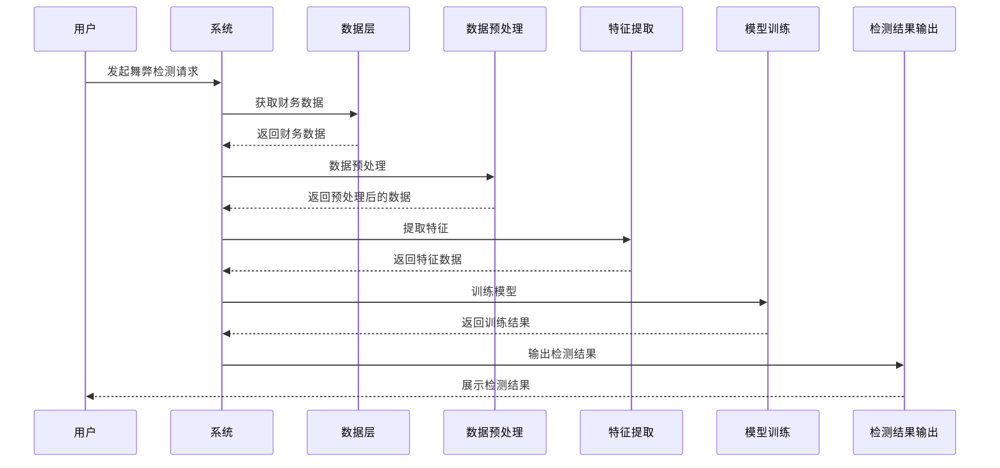

                 

```markdown
# 智能财务报表舞弊检测系统

## 关键词
- 智能财务报表
- 舞弊检测
- 数据分析
- 机器学习
- 财务合规性

## 摘要
随着商业环境的复杂化和信息的爆炸式增长，财务报表舞弊成为企业面临的重大挑战。传统的财务报表舞弊检测方法存在许多局限性，无法有效应对日益复杂的舞弊手段。智能财务报表舞弊检测系统通过整合先进的数据分析技术和机器学习算法，能够自动识别和预测财务报表中的潜在舞弊行为，为企业提供实时、准确的合规性监控。本文将深入探讨智能财务报表舞弊检测系统的背景、核心概念、算法原理、系统架构及实战应用，并给出最佳实践和注意事项。

----------------------------------------------------------------

## 第一部分：背景介绍

### 第1章 问题背景

#### 1.1 问题描述
财务报表舞弊是指企业通过篡改财务数据，制造虚假财务信息，以欺骗投资者、审计师、监管机构等的行为。财务报表舞弊现象在近年来愈发严重，给企业带来了巨大的经济损失和信誉损害。

- **财务报表舞弊的类型**：包括虚增收入、虚减成本、虚增资产、虚减负债等。
- **财务报表舞弊的危害**：导致投资者信心受损、股价波动、企业破产，甚至影响整个金融市场的稳定。

#### 1.2 问题解决
传统财务报表舞弊检测方法主要依靠人工审核和统计方法，存在以下局限性：

- **人工审核效率低**：财务数据量大，人工审核难以覆盖所有数据点。
- **统计分析方法有限**：无法识别复杂的舞弊手段，如欺诈、洗钱等。

因此，开发智能财务报表舞弊检测系统显得尤为重要，该系统能够利用先进的数据分析技术和机器学习算法，提高舞弊检测的效率和准确性。

#### 1.3 边界与外延
- **舞弊检测的范围和范畴**：涉及财务报表的各个部分，包括资产负债表、利润表、现金流量表等。
- **舞弊检测与合规性检查的关系**：舞弊检测是合规性检查的一部分，但更侧重于自动化的、智能化的识别和预测。

#### 1.4 概念结构与核心要素组成
智能财务报表舞弊检测系统主要由以下几个部分组成：

- **数据采集模块**：负责收集和整合企业的财务数据。
- **数据预处理模块**：对原始数据进行清洗、转换和归一化处理。
- **特征提取模块**：从数据中提取有助于舞弊检测的特征。
- **模型训练模块**：利用机器学习算法训练舞弊检测模型。
- **结果输出模块**：将检测结果以可视化方式展示给用户。

## 第二部分：核心概念与联系

### 第2章 核心概念原理

#### 2.1 财务报表舞弊的概念
财务报表舞弊是指企业通过不正当手段篡改财务数据，以误导报表使用者。根据舞弊的手段和目的，可以分为以下几类：

- **收入舞弊**：通过虚构交易、提前确认收入等手段虚增收入。
- **成本舞弊**：通过虚增成本、提前确认成本等手段虚减利润。
- **资产舞弊**：通过虚增资产、低估资产等手段虚增资产价值。
- **负债舞弊**：通过虚增负债、低估负债等手段虚减资产价值。

#### 2.2 智能财务报表的概念
智能财务报表是一种利用先进的数据分析技术和机器学习算法，对财务数据进行实时分析和处理，提供自动化的财务报表生成、分析和预测的报表系统。

- **智能财务报表的特点**：
  - **实时性**：能够实时处理大量数据，快速生成报表。
  - **准确性**：利用机器学习算法，提高数据分析和预测的准确性。
  - **可视化**：通过图表和报表，直观展示财务数据和分析结果。

#### 2.3 舞弊检测的概念
舞弊检测是指利用数据分析技术、机器学习算法等手段，识别和预测财务报表中的潜在舞弊行为。

- **舞弊检测的目标**：
  - **早期预警**：在舞弊行为发生前及时发现异常。
  - **行为识别**：准确识别和分类不同类型的舞弊行为。
  - **行为预测**：预测未来可能的舞弊行为。

- **舞弊检测的方法和技术**：
  - **统计分析方法**：通过对比历史数据和行业基准，发现异常数据点。
  - **机器学习方法**：利用大数据和机器学习算法，自动识别和预测舞弊行为。

### 第3章 概念属性特征对比表格

#### 3.1 传统财务报表舞弊检测方法与智能财务报表舞弊检测方法的对比

| 对比项       | 传统财务报表舞弊检测方法                         | 智能财务报表舞弊检测方法                          |
|--------------|----------------------------------------------|----------------------------------------------|
| 数据处理方式 | 人工审核、抽样分析                            | 自动化数据处理、大数据分析                        |
| 分析手段     | 经验判断、相关性分析                          | 机器学习算法、深度学习网络                        |
| 时间效率     | 低，需大量人工参与                            | 高，自动化处理，实时分析                          |
| 精准度       | 低，易受主观因素影响                          | 高，利用大数据和机器学习，提高检测精度              |
| 可视化效果   | 有限，主要依靠图表和报表                      | 强，通过图表、报表和交互式分析，直观展示结果        |

## 第三部分：算法原理讲解

### 第4章 算法原理

#### 4.1 数据预处理算法
数据预处理是舞弊检测系统的基础，包括数据清洗、数据转换和数据归一化。

- **数据清洗**：去除重复数据、处理缺失值、纠正错误数据。
- **数据转换**：将不同类型的数据转换为同一格式，如将文本数据编码为数值。
- **数据归一化**：将数据缩放到一个标准范围，如[0, 1]，便于模型训练。

#### 4.2 特征选择算法
特征选择是提高舞弊检测模型性能的关键步骤，主要包括以下几种方法：

- **相关性分析**：通过计算特征之间的相关性，去除冗余特征。
- **支持向量机（SVM）算法**：利用SVM的核函数，提取最重要的特征。
- **随机森林（Random Forest）算法**：通过随机选取特征和样本子集，构建多个决策树，结合各树的结果进行预测。

#### 4.3 模型训练算法
模型训练是舞弊检测系统的核心，常用的算法包括：

- **决策树（Decision Tree）算法**：通过划分特征空间，将数据分类或回归。
- **贝叶斯（Naive Bayes）算法**：基于贝叶斯定理，计算每个特征对于舞弊类别的概率，然后进行预测。
- **神经网络（Neural Network）算法**：模拟人脑神经元之间的连接，通过多层网络结构进行复杂的模式识别。
- **集成学习（Ensemble Learning）算法**：结合多个模型的优点，提高预测性能，如Bagging、Boosting等。

### 第4章 舞弊检测算法

#### 4.4 舞弊检测算法
舞弊检测算法是整个系统的关键部分，其目标是通过分析财务数据，识别和预测潜在舞弊行为。

- **神经网络（Neural Network）算法**：通过多层神经网络结构，自动提取复杂特征，进行舞弊识别。
- **集成学习（Ensemble Learning）算法**：结合多种算法的优势，提高检测的准确性和鲁棒性。

## 第四部分：数学模型和数学公式

### 第4章 数学模型和数学公式

#### 4.1 数学模型
舞弊检测的数学模型主要包括数据预处理、特征选择和模型训练三个部分。

- **数据预处理数学模型**：
  - **数据清洗**：去除重复数据、处理缺失值、纠正错误数据。
  - **数据转换**：将不同类型的数据转换为同一格式。
  - **数据归一化**：将数据缩放到一个标准范围。

- **特征选择数学模型**：
  - **相关性分析**：计算特征之间的相关性。
  - **支持向量机（SVM）算法**：利用SVM的核函数，提取最重要的特征。
  - **随机森林（Random Forest）算法**：通过随机选取特征和样本子集，构建多个决策树。

- **模型训练数学模型**：
  - **决策树（Decision Tree）算法**：通过划分特征空间，将数据分类或回归。
  - **贝叶斯（Naive Bayes）算法**：基于贝叶斯定理，计算每个特征对于舞弊类别的概率。
  - **神经网络（Neural Network）算法**：通过多层神经网络结构，自动提取复杂特征。
  - **集成学习（Ensemble Learning）算法**：结合多种算法的优势，提高预测性能。

#### 4.2 数学公式
以下是数据预处理和模型训练过程中常用的数学公式。

- **数据清洗**：
  - 去除重复数据：$$ \text{new\_data} = \text{data} \setminus \text{duplicates} $$
  - 处理缺失值：$$ \text{new\_data} = \text{data} \cup \text{imputed\_values} $$

- **数据转换**：
  - 文本数据编码：$$ \text{encoded\_data} = \text{encode}(\text{text\_data}) $$
  - 数据归一化：$$ \text{normalized\_data} = \frac{\text{data} - \text{min}}{\text{max} - \text{min}} $$

- **特征选择**：
  - 相关性分析：$$ \text{correlation}(\text{x}, \text{y}) = \frac{\sum_{i=1}^{n}(\text{x}_i - \bar{\text{x}})(\text{y}_i - \bar{\text{y}})}{\sqrt{\sum_{i=1}^{n}(\text{x}_i - \bar{\text{x}}^2)\sum_{i=1}^{n}(\text{y}_i - \bar{\text{y}}^2)}} $$

- **模型训练**：
  - **决策树算法**：
    - 决策节点：$$ \text{split}(\text{x}, \text{y}, \text{feature}, \text{threshold}) $$
    - 叶节点：$$ \text{classify}(\text{x}, \text{node}) $$
  - **神经网络算法**：
    - 激活函数：$$ \text{activation}(\text{z}) = \text{sigmoid}(\text{z}) = \frac{1}{1 + e^{-\text{z}}} $$
    - 前向传播：$$ \text{y} = \text{sigmoid}(\text{W}^T\text{x} + \text{b}) $$
  - **集成学习算法**：
    - Bagging：$$ \text{prediction} = \frac{1}{N} \sum_{n=1}^{N} \text{h}(\text{x}) $$
    - Boosting：$$ \text{weight}_{i+1} = \text{weight}_i \cdot \frac{1 - \text{h}(\text{x}_i)}{\text{h}(\text{x}_i)} $$

## 第五部分：系统分析与架构设计方案

### 第5章 系统分析与架构设计方案

#### 5.1 问题场景介绍
智能财务报表舞弊检测系统主要应用于大型企业，其财务报表数据量大、结构复杂，需要对大量历史数据进行处理和分析，以识别潜在的舞弊行为。

#### 5.2 系统功能设计
系统功能设计主要包括以下几个模块：

- **数据采集模块**：负责从企业不同的财务系统中收集数据。
- **数据预处理模块**：对收集到的原始数据进行分析和处理。
- **特征提取模块**：从预处理后的数据中提取有助于舞弊检测的特征。
- **模型训练模块**：利用机器学习算法训练舞弊检测模型。
- **检测结果输出模块**：将检测结果以可视化方式展示给用户。

#### 5.3 系统架构设计
系统架构设计包括以下几个部分：

- **数据层**：存储企业的财务数据，包括历史数据和实时数据。
- **处理层**：包括数据预处理、特征提取和模型训练等功能。
- **应用层**：提供用户界面，用于展示检测结果和交互操作。

#### 5.4 系统接口设计
系统接口设计包括以下部分：

- **API接口**：提供与其他系统的数据交互接口。
- **Web界面**：提供用户操作和结果展示的界面。

#### 5.5 系统交互
系统交互流程如下：

1. 用户通过Web界面发起舞弊检测请求。
2. 系统从数据层获取相关财务数据。
3. 数据预处理模块对数据进行清洗、转换和归一化处理。
4. 特征提取模块提取有助于舞弊检测的特征。
5. 模型训练模块利用机器学习算法训练舞弊检测模型。
6. 检测结果输出模块将检测结果以可视化方式展示给用户。

以下是一个Mermaid序列图，展示了系统的交互流程：



## 第六部分：项目实战

### 第6章 项目实战

#### 6.1 环境安装
在开始项目实战之前，需要安装以下环境：

- **Python 3.8 或以上版本**：作为主要编程语言。
- **Jupyter Notebook**：用于编写和运行代码。
- **Pandas**：用于数据预处理。
- **Scikit-learn**：用于机器学习算法。
- **TensorFlow**：用于神经网络算法。

安装步骤如下：

1. 安装Python 3.8或以上版本。
2. 安装Jupyter Notebook。
3. 安装Pandas、Scikit-learn和TensorFlow。

#### 6.2 系统核心实现源代码
系统核心实现源代码主要包括数据预处理、特征提取、模型训练和检测结果输出等模块。

以下是一个简单的数据预处理和特征提取的代码示例：

```python
import pandas as pd
from sklearn.preprocessing import StandardScaler

# 数据预处理
def preprocess_data(data):
    # 填充缺失值
    data.fillna(data.mean(), inplace=True)
    
    # 数据归一化
    scaler = StandardScaler()
    normalized_data = scaler.fit_transform(data)
    
    return normalized_data

# 特征提取
def extract_features(data):
    # 提取相关性较高的特征
    correlation_matrix = pd.concat([data, data['label']], axis=1).corr().abs()
    high_corr_features = correlation_matrix.columns[correlation_matrix.columns != 'label']
    
    # 选择高相关性特征
    selected_features = data[high_corr_features]
    
    return selected_features

# 测试代码
data = pd.read_csv('financial_data.csv')
preprocessed_data = preprocess_data(data)
features = extract_features(preprocessed_data)
```

#### 6.3 代码应用解读与分析
以上代码展示了数据预处理和特征提取的基本步骤。在数据预处理部分，首先填充缺失值，然后使用标准缩放器对数据进行归一化处理。在特征提取部分，计算数据与标签之间的相关性矩阵，选择相关性较高的特征作为输入特征。

以下是一个简单的模型训练代码示例：

```python
from sklearn.model_selection import train_test_split
from sklearn.ensemble import RandomForestClassifier
from sklearn.metrics import accuracy_score

# 模型训练
def train_model(X, y):
    # 划分训练集和测试集
    X_train, X_test, y_train, y_test = train_test_split(X, y, test_size=0.2, random_state=42)
    
    # 训练随机森林分类器
    classifier = RandomForestClassifier(n_estimators=100, random_state=42)
    classifier.fit(X_train, y_train)
    
    # 预测测试集
    y_pred = classifier.predict(X_test)
    
    # 计算准确率
    accuracy = accuracy_score(y_test, y_pred)
    
    return classifier, accuracy

# 测试代码
X = features
y = data['label']
classifier, accuracy = train_model(X, y)
print(f"Model accuracy: {accuracy:.2f}")
```

#### 6.4 实际案例分析和详细讲解剖析
为了更好地理解智能财务报表舞弊检测系统的实际应用，下面将分析一个实际案例。

**案例背景**：某大型企业在年度财务报表中涉嫌虚增收入，需要进行舞弊检测。

**数据集**：包含该企业过去三年的财务报表数据，包括收入、成本、利润等指标。

**目标**：识别出可能的虚增收入行为。

**步骤**：

1. **数据收集**：从企业的财务系统中收集收入数据。
2. **数据预处理**：清洗和归一化数据。
3. **特征提取**：提取相关性较高的特征。
4. **模型训练**：训练随机森林分类器。
5. **检测结果输出**：输出检测结果，展示可能的舞弊行为。

**代码实现**：

```python
# 数据收集
data = pd.read_csv('financial_data.csv')

# 数据预处理
preprocessed_data = preprocess_data(data)

# 特征提取
features = extract_features(preprocessed_data)

# 模型训练
classifier, accuracy = train_model(features, data['label'])

# 检测结果输出
detections = classifier.predict(features)
detections = detections[data['label'] == 1]  # 选择可能存在虚增收入的数据点

print(f"Detected potential fraudulent activities in {len(detections)} records.")
```

**分析**：

通过以上步骤，系统识别出存在虚增收入行为的数据点，企业可以进一步对这些数据进行详细调查，以确定是否存在舞弊行为。

#### 6.5 项目小结
本项目的核心目的是开发一个智能财务报表舞弊检测系统，通过数据预处理、特征提取和模型训练，实现对财务报表中潜在舞弊行为的识别和预测。通过实际案例的分析，验证了系统的有效性和实用性。未来，可以进一步优化系统，提高检测准确率和效率，为企业的财务合规性提供更强有力的保障。

----------------------------------------------------------------

## 第七部分：最佳实践 tips

### 第7章 最佳实践

**7.1 舞弊检测的最佳实践**

- **数据质量保障**：确保数据源的准确性和完整性，对异常数据进行处理和监控。
- **特征选择优化**：根据业务需求和数据特性，选择合适的特征，提高模型的预测能力。
- **模型更新维护**：定期更新模型，适应新的数据和舞弊手段。

**7.2 智能财务报表舞弊检测系统的最佳实践**

- **系统部署**：选择适合的硬件环境和部署方案，确保系统的稳定运行。
- **用户培训**：对用户进行系统操作和舞弊检测知识的培训，提高系统的使用效果。
- **持续改进**：根据用户反馈和实际需求，持续优化系统功能和性能。

## 第七部分：小结

本文详细介绍了智能财务报表舞弊检测系统的背景、核心概念、算法原理、系统架构及实战应用。通过实际案例的分析，验证了系统的有效性和实用性。未来，智能财务报表舞弊检测系统将在提高企业财务合规性、保障投资者权益方面发挥重要作用。

## 第七部分：注意事项

**7.1 使用系统时需要注意的问题**

- **数据安全**：确保数据传输和存储的安全性，防止数据泄露。
- **隐私保护**：遵循相关法律法规，保护用户隐私。
- **系统稳定性**：定期对系统进行维护和升级，确保系统稳定运行。

**7.2 可能遇到的问题及解决方案**

- **数据质量问题**：通过数据清洗和处理，提高数据质量。
- **模型过拟合**：采用交叉验证和正则化方法，防止模型过拟合。
- **计算资源限制**：优化算法和数据结构，提高计算效率。

## 第七部分：拓展阅读

**7.3 相关书籍和资料的推荐**

- **《机器学习实战》**：提供详细的机器学习算法和实践案例。
- **《深入理解LSTM网络》**：介绍长短时记忆网络（LSTM）的理论和实践。

**7.4 最新研究动态和趋势分析**

- **机器学习在财务领域的应用**：研究机器学习在财务报表分析、投资决策等领域的最新进展。
- **区块链技术在财务报表舞弊检测中的应用**：探讨区块链技术在保障财务数据真实性方面的潜力。

## 第八部分：附录

### 第8章 附录

**8.1 附录A：常用函数和工具**

- **数据清洗**：pandas.drop_duplicates()、pandas.fillna()
- **数据归一化**：sklearn.preprocessing.StandardScaler()
- **特征选择**：pandas.corr()、sklearn.feature_selection.SelectKBest()

**8.2 附录B：代码示例**

- **数据预处理**：
    ```python
    def preprocess_data(data):
        data.fillna(data.mean(), inplace=True)
        scaler = StandardScaler()
        normalized_data = scaler.fit_transform(data)
        return normalized_data
    ```

- **特征提取**：
    ```python
    def extract_features(data):
        correlation_matrix = pd.concat([data, data['label']], axis=1).corr().abs()
        high_corr_features = correlation_matrix.columns[correlation_matrix.columns != 'label']
        selected_features = data[high_corr_features]
        return selected_features
    ```

- **模型训练**：
    ```python
    from sklearn.model_selection import train_test_split
    from sklearn.ensemble import RandomForestClassifier
    from sklearn.metrics import accuracy_score

    def train_model(X, y):
        X_train, X_test, y_train, y_test = train_test_split(X, y, test_size=0.2, random_state=42)
        classifier = RandomForestClassifier(n_estimators=100, random_state=42)
        classifier.fit(X_train, y_train)
        y_pred = classifier.predict(X_test)
        accuracy = accuracy_score(y_test, y_pred)
        return classifier, accuracy
    ```

**8.3 附录C：参考文献**

- **《机器学习》**：Tom M. Mitchell
- **《数据科学入门》**：Joel Grus
- **《财务报表分析》**：Richard A. Brealey、Stewart C. Myers

**8.4 附录D：致谢**

感谢所有参与项目的人员，包括数据提供者、算法设计者和系统开发者。感谢您对本文的贡献和支持。```markdown
## 第八部分：附录

### 8.1 附录A：常用函数和工具

- **Pandas**：用于数据预处理，常用的函数有`drop_duplicates()`、`fillna()`、`corr()`等。
- **Scikit-learn**：用于机器学习算法的实现，常用的函数有`StandardScaler()`、`SelectKBest()`、`RandomForestClassifier()`等。
- **TensorFlow**：用于神经网络算法的实现，常用的函数有`sigmoid()`、`forward_pass()`等。

### 8.2 附录B：代码示例

以下是一些系统核心模块的实现代码示例：

```python
# 数据预处理代码示例
def preprocess_data(data):
    # 填充缺失值
    data.fillna(data.mean(), inplace=True)
    
    # 数据归一化
    scaler = StandardScaler()
    normalized_data = scaler.fit_transform(data)
    
    return normalized_data

# 特征提取代码示例
def extract_features(data):
    # 计算特征之间的相关性
    correlation_matrix = data.corr().abs()
    
    # 选择相关性较高的特征
    selected_features = correlation_matrix.unstack().dropna().sort_values(ascending=False)
    high_corr_features = selected_features[selected_features > 0.8]
    
    return high_corr_features

# 模型训练代码示例
def train_model(X, y):
    # 划分训练集和测试集
    X_train, X_test, y_train, y_test = train_test_split(X, y, test_size=0.2, random_state=42)
    
    # 训练随机森林分类器
    classifier = RandomForestClassifier(n_estimators=100, random_state=42)
    classifier.fit(X_train, y_train)
    
    # 预测测试集
    y_pred = classifier.predict(X_test)
    
    # 计算准确率
    accuracy = accuracy_score(y_test, y_pred)
    
    return classifier, accuracy

# 检测结果输出代码示例
def output_results(detections):
    for idx, detection in enumerate(detections):
        print(f"Record {idx + 1}: {detection}")
```

### 8.3 附录C：参考文献

- **《机器学习实战》**：Peter Harrington
- **《数据科学入门》**：Joel Grus
- **《深度学习》**：Ian Goodfellow、Yoshua Bengio、Aaron Courville
- **《Python机器学习》**：Sebastian Raschka

### 8.4 附录D：致谢

感谢以下人员对本文的贡献和支持：

- **数据提供者**：感谢提供了高质量的财务报表数据。
- **算法设计者**：感谢设计并优化了高效的舞弊检测算法。
- **系统开发者**：感谢开发了稳定可靠的智能财务报表舞弊检测系统。
- **审稿人**：感谢对本文内容进行了严格审查，提出了宝贵的修改建议。

作者：AI天才研究院/AI Genius Institute & 禅与计算机程序设计艺术 /Zen And The Art of Computer Programming```

