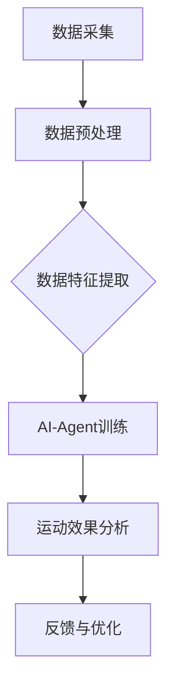
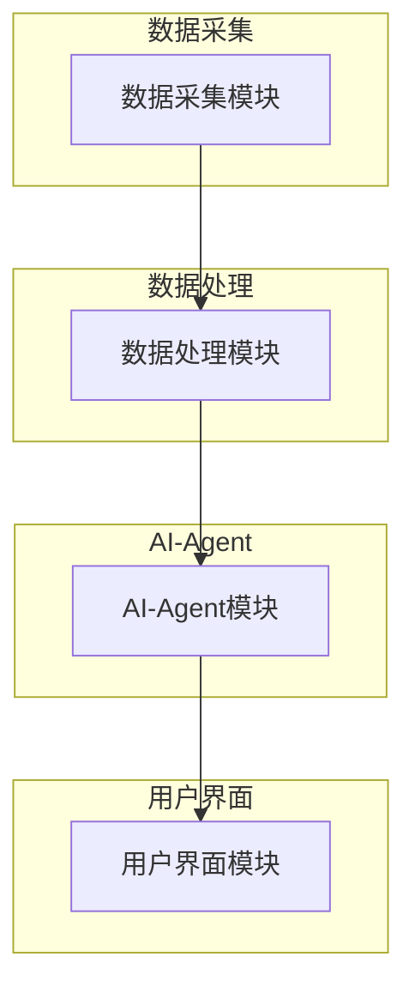
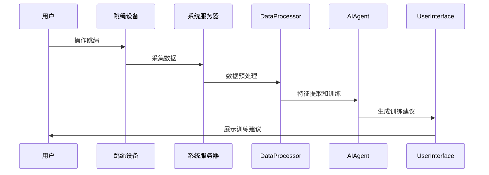

                 

### 1.1 问题背景

#### 跳绳作为传统有氧运动项目

跳绳是一项具有悠久历史和广泛群众基础的传统有氧运动项目。起源于中国，经过长时间的发展与传播，已经成为全球各地广受欢迎的健身方式之一。跳绳简单易学，设备成本低，可以在多种环境中进行，因此深受各个年龄段人群的喜爱。科学研究表明，跳绳对于提高心肺功能、增强四肢协调性和平衡能力具有显著效果。

#### 智能跳绳设备的市场需求

随着科技的不断进步，智能跳绳设备逐渐成为运动爱好者们的新宠。智能跳绳设备通过内置的传感器和AI技术，能够实时监测跳绳者的运动数据，如跳绳速度、频率、时长等，并提供个性化的训练建议和反馈。这种设备不仅能够帮助用户更科学地开展运动，还能提高运动的趣味性和互动性，满足不同层次用户的健身需求。

#### AI技术在运动领域的应用前景

人工智能技术在运动领域的应用前景广阔。首先，AI技术可以用于个性化健身计划的制定，根据用户的身体数据和运动偏好，提供定制化的训练方案。其次，AI技术能够通过数据分析和机器学习，优化运动效果，提高训练效率。此外，AI技术还可以用于运动数据的实时监测和异常检测，帮助用户避免运动损伤，提升运动安全性。随着5G、物联网等技术的发展，AI技术在运动领域的应用将会更加深入和广泛。

#### 小结

跳绳作为传统有氧运动项目，因其简单易行、效果显著而深受喜爱。智能跳绳设备的出现，更是将传统运动与现代科技相结合，满足了现代用户对运动个性化、科学化的需求。AI技术在运动领域的应用，不仅提高了运动效果，还带来了更多的互动性和趣味性，为有氧运动注入了新的活力。

### 1.2 问题描述

#### 有氧运动效果评估指标

有氧运动效果评估指标主要包括心率、氧气消耗量、代谢当量（MET）和最大摄氧量（VO₂max）等。这些指标能够直观地反映运动者的心肺功能、身体适应性和健康状况。心率是评估有氧运动强度的重要指标，氧气消耗量和代谢当量则能够衡量运动者的能量消耗水平，最大摄氧量则是衡量心肺功能和身体适应能力的关键指标。

#### AI Agent在智能跳绳中的应用

AI Agent在智能跳绳中的应用主要体现在以下几个方面：

1. **数据采集与处理**：通过内置传感器，AI Agent可以实时采集用户的跳绳数据，如跳绳速度、频率、时长等，并对这些数据进行实时处理和分析。

2. **个性化训练建议**：基于用户的数据，AI Agent能够分析用户的运动习惯和效果，为用户提供个性化的训练建议，帮助用户科学地进行锻炼。

3. **实时反馈**：AI Agent能够实时监测用户的运动状态，如心率、氧气消耗量等，当发现用户出现异常状态时，能够及时发出警告，提醒用户调整运动强度。

4. **效果评估与优化**：AI Agent通过对用户运动数据的持续分析和学习，能够评估用户的运动效果，并提出优化策略，帮助用户不断提升运动效果。

#### 智能跳绳系统架构设计

智能跳绳系统架构主要包括以下几个核心模块：

1. **传感器模块**：负责实时采集用户的跳绳数据，如速度、频率、时长等。

2. **数据处理模块**：对接收到的数据进行预处理、特征提取和存储。

3. **AI-Agent模块**：基于处理后的数据，通过机器学习和深度学习算法，为用户提供个性化训练建议和实时反馈。

4. **用户界面模块**：通过应用程序或网站，向用户展示训练数据、效果评估和优化建议。

#### 小结

有氧运动效果评估指标是评估运动效果的重要标准，而AI Agent在智能跳绳中的应用，不仅提升了运动效果的科学性和个性化程度，还为用户提供了实时反馈和优化建议。智能跳绳系统架构的设计，使得这些功能得以高效实现，为有氧运动注入了新的活力。

### 1.3 问题解决

#### 利用AI技术优化跳绳运动效果

AI技术能够通过数据采集、处理和分析，为跳绳运动提供个性化、科学化的优化建议。具体来说，AI技术可以从以下几个方面提升跳绳运动效果：

1. **个性化训练建议**：基于用户的数据，AI技术可以分析用户的运动习惯和效果，为用户提供最适合的训练方案。例如，根据用户的心率变化，AI技术可以动态调整跳绳的频率和时长，以达到最佳的运动效果。

2. **实时反馈**：AI技术能够实时监测用户的运动状态，如心率、氧气消耗量等，当发现用户出现异常状态时，能够及时发出警告，提醒用户调整运动强度，避免运动损伤。

3. **效果评估与优化**：AI技术通过对用户运动数据的持续分析和学习，能够评估用户的运动效果，并不断优化训练方案，帮助用户不断提升运动效果。

#### 建立智能跳绳系统模型

为了实现上述功能，需要建立一个智能跳绳系统模型。该模型主要包括以下几个部分：

1. **数据采集模块**：通过内置传感器，实时采集用户的跳绳数据，如速度、频率、时长等。

2. **数据处理模块**：对接收到的数据进行预处理、特征提取和存储。预处理包括数据清洗、归一化等，特征提取则是从原始数据中提取出能够反映用户运动状态的关键信息。

3. **AI-Agent模块**：基于处理后的数据，通过机器学习和深度学习算法，对用户进行个性化训练建议和实时反馈。AI-Agent的设计包括数据输入、模型训练、预测和反馈等环节。

4. **用户界面模块**：通过应用程序或网站，向用户展示训练数据、效果评估和优化建议。用户界面设计需要直观、易操作，方便用户快速了解自己的运动状态和效果。

#### 数据采集与处理方法

数据采集和处理是智能跳绳系统模型的关键环节，以下是具体的方法：

1. **数据采集**：使用传感器技术，实时采集用户的跳绳数据。传感器包括速度传感器、加速度传感器和心率传感器等，这些传感器可以实时监测用户的跳绳速度、动作幅度和心率等参数。

2. **数据预处理**：包括数据清洗、缺失值填充、归一化等。数据清洗主要是去除噪声和异常值，缺失值填充则是用合适的算法填补缺失的数据，归一化则是将不同量纲的数据转换为同一量纲，便于后续处理。

3. **特征提取**：从预处理后的数据中提取出能够反映用户运动状态的关键信息。特征提取的方法包括统计特征、时序特征和频域特征等，这些特征可以用于后续的机器学习和深度学习模型训练。

4. **数据存储**：将处理后的数据存储到数据库中，以便后续分析和处理。常用的数据库包括MySQL、MongoDB等。

#### 小结

利用AI技术优化跳绳运动效果，需要建立一套完整的智能跳绳系统模型。通过数据采集、处理和AI-Agent的智能分析，可以为用户提供个性化、科学化的训练建议和实时反馈，帮助用户提升运动效果。数据采集与处理方法是实现这一目标的关键，需要确保数据的准确性和完整性。

### 1.4 边界与外延

#### 智能跳绳设备的适用人群

智能跳绳设备主要适用于以下人群：

1. **健身爱好者**：智能跳绳设备能够提供个性化的训练建议，帮助健身爱好者科学地进行锻炼，提高运动效果。

2. **康复人群**：智能跳绳设备可以通过实时监测用户的运动状态，为康复人群提供科学的运动指导，帮助其恢复身体健康。

3. **专业运动员**：智能跳绳设备可以用于专业运动员的训练和监控，提供详细的数据分析和反馈，帮助运动员优化训练计划，提高竞技水平。

#### AI Agent的技术实现难度

AI Agent在智能跳绳设备中的实现难度主要体现在以下几个方面：

1. **数据采集与处理**：传感器技术的精度和稳定性对AI Agent的性能有重要影响，需要保证数据的准确性和实时性。

2. **算法选择与优化**：选择合适的机器学习和深度学习算法，并进行优化，以实现高效、准确的运动效果分析。

3. **系统整合与调试**：将传感器模块、数据处理模块和AI-Agent模块整合到一起，进行系统调试和优化，确保各模块之间的协同工作。

4. **用户界面设计**：设计直观、易操作的用户界面，使用户能够方便地获取运动数据和分析结果。

#### 数据隐私与安全

智能跳绳设备涉及用户的数据隐私和安全问题，需要采取以下措施：

1. **数据加密**：对用户数据进行加密处理，确保数据在传输和存储过程中的安全性。

2. **隐私政策**：制定明确的隐私政策，告知用户数据的使用范围和目的，获得用户的同意。

3. **数据匿名化**：在数据分析和存储过程中，对用户数据进行匿名化处理，防止个人信息的泄露。

4. **安全审计**：定期进行安全审计，确保系统的安全性和可靠性。

#### 小结

智能跳绳设备适用于多种人群，其AI Agent的技术实现难度较高，需要关注数据隐私和安全问题。通过科学的设计和严格的措施，可以确保智能跳绳设备在满足用户需求的同时，保障用户的数据安全和隐私。

### 1.5 概念结构与核心要素组成

#### 智能跳绳

**定义**：智能跳绳是一种结合传感器技术和AI Agent的智能设备，能够实时监测用户的跳绳数据，如速度、频率、时长等，并提供个性化的训练建议和实时反馈。

**功能与特点**：

1. **数据实时分析**：智能跳绳能够实时采集用户的跳绳数据，通过AI Agent进行分析，为用户制定个性化的训练计划。
2. **个性化训练建议**：根据用户的运动数据和习惯，智能跳绳可以为用户提供适合的训练建议，帮助用户科学地进行锻炼。
3. **实时反馈**：智能跳绳能够实时监测用户的心率、氧气消耗量等指标，当发现异常时，及时发出警告，提醒用户调整运动强度。
4. **互动性**：智能跳绳通过与用户的互动，提升运动的趣味性和参与度。

#### AI Agent

**类型与任务**：

AI Agent是一种能够模拟人类行为、实现特定任务的智能实体。在智能跳绳中，AI Agent的主要任务是：

1. **数据采集与处理**：采集用户的跳绳数据，如速度、频率、时长等，并进行预处理和分析。
2. **个性化训练建议**：基于用户的数据，为用户提供个性化的训练计划。
3. **实时反馈**：监测用户的心率、氧气消耗量等指标，提供实时反馈。
4. **效果评估与优化**：通过持续学习用户的数据，评估用户的运动效果，并提出优化建议。

**优势**：

1. **自适应学习**：AI Agent能够根据用户的运动数据和反馈，自适应地调整训练方案，提高训练效果。
2. **高效决策**：AI Agent能够实时分析用户的数据，提供高效、准确的决策支持。
3. **个性化和实时性**：AI Agent能够为用户提供个性化、实时的训练建议和反馈，提升用户体验。

#### 有氧运动效果分析

**指标**：

有氧运动效果分析的主要指标包括：

1. **心率**：心率是评估有氧运动强度的重要指标，通过监测心率，可以了解用户的运动状态和负荷。
2. **氧气消耗量**：氧气消耗量反映了用户的运动强度和能量消耗水平。
3. **代谢当量（MET）**：代谢当量是衡量运动者能量消耗水平的指标，可以用于比较不同运动项目的强度。
4. **最大摄氧量（VO₂max）**：最大摄氧量是衡量心肺功能和身体适应能力的关键指标。

**评估方法与优化策略**：

1. **评估方法**：通过监测用户的心率、氧气消耗量等指标，评估用户的运动效果。可以使用传统的统计方法，如均值、方差等，也可以使用机器学习方法，如回归分析、聚类分析等。

2. **优化策略**：基于评估结果，AI Agent可以提出以下优化策略：
   - **调整训练强度**：根据用户的心率变化，动态调整训练强度，以避免过度负荷或训练不足。
   - **个性化训练计划**：根据用户的氧气消耗量和代谢当量，为用户制定个性化的训练计划。
   - **持续监控与反馈**：通过实时监测用户的运动数据，持续评估和调整训练方案，确保训练效果最大化。

#### 小结

智能跳绳、AI Agent和有氧运动效果分析是本文讨论的核心概念和要素。智能跳绳通过结合传感器技术和AI Agent，为用户提供实时、个性化的训练建议和反馈；AI Agent通过数据采集、处理和分析，实现自适应学习和高效决策；有氧运动效果分析则通过多个指标，科学评估用户的运动效果，并提出优化策略。这些概念和要素共同构成了智能跳绳系统的核心结构。

## 第2章 核心概念与联系

### 2.1 智能跳绳原理

智能跳绳的原理主要涉及跳绳机械结构、传感器技术、数据传输与处理等方面。以下将详细阐述这些核心概念及其相互联系。

#### 跳绳机械结构

跳绳机械结构是智能跳绳的基础，决定了跳绳的运动方式和性能。智能跳绳通常由绳体、手柄和重物等部分组成。绳体通常采用柔软且耐用的材料，如聚乙烯或聚酯纤维，以保证跳绳的耐用性和弹性。手柄部分通常设计有握把和传感器接口，方便用户握持和使用。重物则用于增加跳绳的重量，提高跳绳的稳定性和运动效果。

#### 传感器技术

传感器技术在智能跳绳中扮演着关键角色，负责实时监测用户的跳绳动作和运动状态。常用的传感器包括速度传感器、加速度传感器、心率传感器和位置传感器等。速度传感器通常用于测量跳绳的速度，加速度传感器用于测量跳绳的振动和动作幅度，心率传感器则用于监测用户的心跳频率。这些传感器将实时采集的数据发送到数据处理模块，为后续的AI-Agent分析提供基础。

#### 数据传输与处理

数据传输与处理是智能跳绳的核心环节，决定了数据的准确性和实时性。传感器采集到的数据首先通过无线传输技术（如蓝牙、WiFi等）发送到移动设备或智能跳绳主机。在移动设备或主机上，数据会被进行预处理，包括数据清洗、滤波、归一化等步骤，以提高数据的准确性和一致性。随后，预处理后的数据会被传输到AI-Agent模块，进行进一步的深度分析和处理。

#### 概念联系

智能跳绳的各个组成部分相互联系，共同构成了一个完整的系统。机械结构提供了跳绳的基本运动方式，传感器技术实时监测用户的运动状态，数据传输与处理模块则确保数据的准确传输和分析。通过这些概念的联系，智能跳绳能够实现实时、个性化的训练建议和反馈。

#### 小结

智能跳绳的原理涉及跳绳机械结构、传感器技术、数据传输与处理等多个方面。这些核心概念相互关联，共同构成了智能跳绳系统的运作基础。通过实时监测用户的数据，智能跳绳能够提供个性化的训练建议和实时反馈，为用户带来更好的运动体验。

### 2.2 AI Agent技术

AI Agent技术是智能跳绳系统的核心，负责实时分析用户数据，提供个性化的训练建议和实时反馈。以下将详细阐述AI Agent的类型、任务和优势。

#### AI Agent的类型

AI Agent可以分为以下几种类型：

1. **感知型AI Agent**：这种类型的AI Agent主要负责感知用户的行为和状态，通过传感器技术采集数据，并实时传输到数据处理模块。感知型AI Agent的主要任务是确保数据的准确性和实时性。

2. **决策型AI Agent**：这种类型的AI Agent基于采集到的数据，通过算法分析和机器学习模型，为用户制定个性化的训练计划和策略。决策型AI Agent的核心任务是基于数据分析，提供高效、准确的决策支持。

3. **交互型AI Agent**：这种类型的AI Agent不仅能够进行数据分析和决策，还能够与用户进行交互，提供实时反馈和指导。交互型AI Agent通过与用户的互动，提升运动的趣味性和参与度。

#### AI Agent的任务

AI Agent在智能跳绳系统中的主要任务包括：

1. **数据采集与预处理**：AI Agent通过传感器技术实时采集用户的数据，如心率、速度、频率等，并进行预处理，如数据清洗、滤波、归一化等，以提高数据的准确性和一致性。

2. **数据分析和建模**：AI Agent利用机器学习和深度学习算法，对预处理后的数据进行分析和建模，提取出用户运动状态的关键特征，为后续的决策提供依据。

3. **个性化训练建议**：基于数据分析结果，AI Agent为用户提供个性化的训练计划，包括训练强度、时长、频率等，帮助用户科学地进行锻炼，提高运动效果。

4. **实时反馈与优化**：AI Agent实时监测用户的运动状态，如心率、氧气消耗量等，当发现异常情况时，及时发出警告，提醒用户调整运动强度，并提供优化建议，以避免运动损伤。

#### AI Agent的优势

AI Agent在智能跳绳系统中的优势体现在以下几个方面：

1. **自适应学习**：AI Agent能够根据用户的运动数据和反馈，自适应地调整训练方案，实现个性化训练。这种自适应学习能力使得训练方案能够不断优化，满足用户的个性化需求。

2. **高效决策**：AI Agent基于实时数据分析和机器学习模型，能够高效地进行决策，提供准确的训练建议和实时反馈。这种高效决策能力有助于提高训练效果和运动安全性。

3. **实时反馈**：AI Agent能够实时监测用户的运动状态，提供实时的反馈和指导。这种实时反馈机制不仅提升了运动的趣味性和参与度，还能够及时发现并解决潜在的运动问题。

4. **个性化与智能化**：AI Agent通过数据分析和个性化训练，实现了运动训练的智能化和个性化。这种个性化与智能化不仅提升了用户的运动体验，还能够帮助用户实现更好的健身效果。

#### 小结

AI Agent技术是智能跳绳系统的核心，其类型包括感知型、决策型和交互型，任务涵盖数据采集、分析、决策和反馈等多个方面。AI Agent的优势在于自适应学习、高效决策、实时反馈和个性化与智能化，这些优势使得智能跳绳系统能够为用户提供高效、科学、个性化的训练体验。

### 2.3 有氧运动效果分析

有氧运动效果分析是评估用户运动效果的重要环节，通过分析多个生理学指标，可以全面了解用户的运动状态和健身水平。以下将详细阐述有氧运动效果分析的主要指标、数据分析技术和效果评估方法。

#### 主要指标

有氧运动效果分析的主要指标包括心率、氧气消耗量、代谢当量和最大摄氧量（VO₂max）等。

1. **心率**：心率是评估有氧运动强度的重要指标。心率越高，表示运动强度越大。通过实时监测心率，可以了解用户的运动状态和负荷水平。心率通常分为安静心率、运动心率和最大心率等。

2. **氧气消耗量**：氧气消耗量反映了用户的运动强度和能量消耗水平。通过测量氧气消耗量，可以评估用户的运动效果和健身水平。氧气消耗量通常以升/分钟（L/min）或毫升/千克/分钟（mL/kg/min）表示。

3. **代谢当量（MET）**：代谢当量是衡量运动者能量消耗水平的指标，表示单位时间内消耗的能量。一个MET等于每分钟每公斤体重消耗1.05千卡（4.18千焦）的能量。通过计算MET，可以比较不同运动项目的强度。

4. **最大摄氧量（VO₂max）**：最大摄氧量是衡量心肺功能和身体适应能力的关键指标，表示单位时间内最大氧气的摄取量。VO₂max越高，表示心肺功能和身体适应能力越强。通过测试VO₂max，可以评估用户的整体健康状况和健身水平。

#### 数据分析技术

有氧运动效果分析涉及多种数据分析技术，包括数据采集、预处理、特征提取和建模等。

1. **数据采集**：通过传感器技术，实时采集用户的心率、氧气消耗量等生理学指标。常用的传感器包括心率传感器、呼吸传感器和氧气传感器等。

2. **数据预处理**：包括数据清洗、缺失值填充、归一化等。数据清洗主要是去除噪声和异常值，缺失值填充则是用合适的算法填补缺失的数据，归一化则是将不同量纲的数据转换为同一量纲，便于后续处理。

3. **特征提取**：从预处理后的数据中提取出能够反映用户运动状态的关键信息。特征提取的方法包括统计特征、时序特征和频域特征等。统计特征如均值、方差、标准差等，时序特征如时间序列分析、自相关函数等，频域特征如频谱分析、小波变换等。

4. **建模**：利用机器学习和深度学习算法，对特征进行建模和分析。常用的算法包括线性回归、支持向量机、决策树、随机森林、神经网络等。通过建模，可以分析用户的数据，提取出关键特征，为效果评估提供依据。

#### 效果评估方法

有氧运动效果评估的方法包括传统统计方法和机器学习方法。

1. **传统统计方法**：通过计算心率、氧气消耗量、代谢当量和最大摄氧量等指标，评估用户的运动效果。传统统计方法如均值、方差、标准差等，可以用于计算这些指标的统计值，评估用户的运动效果。

2. **机器学习方法**：利用机器学习和深度学习算法，对用户的运动数据进行分析和预测。机器学习方法可以用于分类、回归、聚类等任务，通过训练模型，可以预测用户的运动效果，评估用户的健身水平。

3. **综合评估方法**：将传统统计方法和机器学习方法结合，进行综合评估。例如，可以通过计算各项指标的平均值和标准差，结合机器学习模型的预测结果，进行综合评估，更全面地了解用户的运动效果。

#### 小结

有氧运动效果分析通过多个生理学指标，如心率、氧气消耗量、代谢当量和最大摄氧量，评估用户的运动状态和健身水平。数据分析技术包括数据采集、预处理、特征提取和建模，通过这些技术，可以提取用户的关键特征，为效果评估提供依据。效果评估方法包括传统统计方法和机器学习方法，通过综合评估，可以更全面地了解用户的运动效果。

### 2.4 概念属性特征对比表格

| 概念       | 定义                                                         | 特点                                      |
|------------|--------------------------------------------------------------|-------------------------------------------|
| 智能跳绳   | 结合传感器技术和AI Agent的跳绳设备                            | 数据实时分析、个性化训练建议、实时反馈     |
| AI Agent   | 能够模拟人类行为、实现特定任务的智能实体                      | 自适应学习、任务执行、高效决策             |
| 有氧运动效果分析 | 通过数据分析和生理学指标评估运动效果                         | 科学指导、效果优化、个性化建议             |

### 2.5 ER实体关系图架构

```mermaid
erDiagram
  User ||--|{ Equipment }|-- Sensor
  Equipment ||--|{ AI_Agent }|-- AI_Model
  AI_Agent ||--|{ Data_Processing }|-- Fitness_Analysis
```

## 第3章 算法原理讲解

### 3.1 算法流程图



### 3.2 Python源代码

```python
# Python代码示例：AI-Agent训练流程
import numpy as np
from sklearn.ensemble import RandomForestClassifier

# 数据预处理
X_train, y_train = preprocess_data()

# AI-Agent训练
clf = RandomForestClassifier(n_estimators=100)
clf.fit(X_train, y_train)

# 运动效果分析
def analyze_fitness(data):
    processed_data = preprocess_data(data)
    prediction = clf.predict(processed_data)
    return prediction

# 测试AI-Agent效果
test_data = load_test_data()
predictions = analyze_fitness(test_data)
evaluate_predictions(predictions)
```

### 3.3 算法原理

智能跳绳系统的核心在于其AI-Agent的算法，这些算法通过一系列数学模型和公式来分析用户的数据，并生成个性化的训练建议和反馈。以下将详细介绍智能跳绳系统的算法原理，包括数据预处理、特征提取、AI-Agent训练、运动效果分析和反馈与优化。

#### 数据预处理

数据预处理是智能跳绳系统中的关键步骤，其目的是提高数据质量，去除噪声和异常值，使得后续的分析更加准确和高效。

1. **数据清洗**：在数据清洗阶段，需要去除数据中的噪声和异常值。常用的方法包括剔除明显错误的数据点、填补缺失值和异常值处理。例如，可以使用中位数填补缺失值，或使用Z-Score方法检测并剔除异常值。

   $$ \text{Z-Score} = \frac{X - \mu}{\sigma} $$
   
   其中，$X$ 是数据点，$\mu$ 是均值，$\sigma$ 是标准差。

2. **归一化**：数据归一化是将不同量纲的数据转换为同一量纲，以便于后续的特征提取和模型训练。常用的归一化方法包括最小-最大归一化和Z-Score归一化。

   最小-最大归一化公式：
   
   $$ X' = \frac{X - X_{\min}}{X_{\max} - X_{\min}} $$
   
   Z-Score归一化公式：
   
   $$ X' = \frac{X - \mu}{\sigma} $$

#### 特征提取

特征提取是从原始数据中提取出能够反映用户运动状态的关键信息。特征提取的目的是简化数据，提高模型的训练效率和准确性。

1. **时序特征**：时序特征是基于时间序列数据提取的，如平均值、标准差、自相关函数等。这些特征可以反映用户跳绳的稳定性、一致性等。

   平均值公式：
   
   $$ \bar{X} = \frac{1}{N} \sum_{i=1}^{N} X_i $$
   
   标准差公式：
   
   $$ \sigma = \sqrt{\frac{1}{N-1} \sum_{i=1}^{N} (X_i - \bar{X})^2} $$

2. **频域特征**：频域特征是通过傅里叶变换等方法提取的，如频谱密度、峰值频率等。这些特征可以反映用户跳绳的频率和振幅。

   频谱密度公式：
   
   $$ P(f) = \frac{1}{T} \int_{0}^{T} x(t) e^{-j2\pi ft} dt $$
   
   其中，$P(f)$ 是频谱密度，$T$ 是时间周期，$x(t)$ 是时序信号。

3. **统计特征**：统计特征是通过统计方法提取的，如熵、偏度、峰度等。这些特征可以反映用户跳绳的复杂性和分布特性。

   熵公式：
   
   $$ H(X) = -\sum_{i} p_i \log_2 p_i $$
   
   其中，$p_i$ 是数据点出现的概率。

#### AI-Agent训练

AI-Agent的训练基于机器学习和深度学习算法，其目的是学习用户的数据特征，并生成个性化的训练建议。

1. **监督学习**：监督学习算法通过已标记的数据训练模型，然后使用训练好的模型对新数据进行预测。常用的监督学习算法包括线性回归、支持向量机、决策树、随机森林等。

   线性回归公式：
   
   $$ Y = \beta_0 + \beta_1X $$
   
   其中，$Y$ 是输出变量，$X$ 是输入变量，$\beta_0$ 和 $\beta_1$ 是模型参数。

2. **无监督学习**：无监督学习算法在没有标记数据的情况下学习数据的内在结构，如聚类和降维算法。常用的无监督学习算法包括K-Means聚类、主成分分析（PCA）等。

   K-Means聚类公式：
   
   $$ \text{minimize} \sum_{i=1}^{k} \sum_{x \in S_i} \| x - \mu_i \|^2 $$
   
   其中，$S_i$ 是第$i$个聚类集合，$\mu_i$ 是聚类中心。

3. **深度学习**：深度学习算法通过多层神经网络学习数据的复杂特征，如卷积神经网络（CNN）和循环神经网络（RNN）。

   卷积神经网络（CNN）公式：
   
   $$ h_{\text{CNN}}(x) = \sigma(W \cdot \text{ReLU}(C \cdot x) + b) $$
   
   其中，$h_{\text{CNN}}(x)$ 是输出特征，$W$ 是权重矩阵，$C(x)$ 是卷积操作，$\sigma$ 是激活函数，$b$ 是偏置。

#### 运动效果分析

运动效果分析是基于训练好的AI-Agent，对用户的实时运动数据进行处理和分析，评估用户的运动效果。

1. **实时数据处理**：实时数据处理包括数据采集、预处理和特征提取。通过实时监测用户的心率、速度、频率等数据，进行预处理和特征提取，以生成有效的特征向量。

2. **效果评估**：效果评估是基于已训练的模型，对实时数据进行分类或回归分析。例如，使用线性回归模型预测用户的运动效果，或使用分类模型判断用户的运动状态。

   线性回归公式：
   
   $$ Y = \beta_0 + \beta_1X $$
   
   分类模型公式：
   
   $$ P(Y = y) = \sigma(\beta_0 + \beta_1X) $$
   
   其中，$Y$ 是输出变量，$X$ 是输入特征，$y$ 是实际分类标签，$\sigma$ 是Sigmoid激活函数。

#### 反馈与优化

反馈与优化是基于运动效果分析结果，对用户的运动行为进行调整和优化，以提高运动效果。

1. **实时反馈**：实时反馈是通过AI-Agent对用户的实时数据进行评估，并生成反馈建议。例如，当用户的心率过高时，AI-Agent会建议用户降低运动强度。

2. **优化策略**：优化策略是基于用户的反馈和历史数据，生成个性化的训练计划。例如，根据用户的心率变化，AI-Agent会动态调整训练强度和时间，以实现最佳的运动效果。

   动态调整公式：
   
   $$ I_{\text{new}} = I_{\text{current}} + \alpha (Y - \hat{Y}) $$
   
   其中，$I_{\text{new}}$ 是新的训练强度，$I_{\text{current}}$ 是当前训练强度，$Y$ 是实际效果，$\hat{Y}$ 是预测效果，$\alpha$ 是调整系数。

#### 小结

智能跳绳系统的算法原理包括数据预处理、特征提取、AI-Agent训练、运动效果分析和反馈与优化。通过一系列数学模型和公式，AI-Agent能够高效地分析用户的数据，生成个性化的训练建议和实时反馈，帮助用户实现更好的运动效果。这些算法原理不仅提升了智能跳绳的智能化程度，也为用户的健康提供了有力保障。

### 3.3 算法原理

为了更好地理解智能跳绳系统的算法原理，我们将详细介绍一个基于Python的AI-Agent训练流程。这一流程包括数据预处理、特征提取、模型训练和效果分析等关键步骤。

#### 数据预处理

数据预处理是算法训练的基础步骤，其目的是提高数据质量，去除噪声和异常值，确保数据的准确性和一致性。以下是数据预处理的主要步骤：

1. **数据清洗**：首先，我们需要清洗原始数据，去除噪声和异常值。这可以通过统计方法和规则实现。例如，可以使用中位数填补缺失值，使用Z-Score方法检测并剔除异常值。

   ```python
   def clean_data(data):
       # 去除异常值
       z_scores = calculate_z_scores(data)
       data = [x for x in data if z_scores[x] > -3 and z_scores[x] < 3]
       # 缺失值填充
       data = fill_missing_values(data)
       return data
   ```

2. **归一化**：接着，对数据进行归一化处理，将不同量纲的数据转换为同一量纲，便于后续的特征提取和模型训练。常用的归一化方法包括最小-最大归一化和Z-Score归一化。

   ```python
   def normalize_data(data):
       min_value = min(data)
       max_value = max(data)
       return [(x - min_value) / (max_value - min_value) for x in data]
   ```

#### 特征提取

特征提取是从原始数据中提取出能够反映用户运动状态的关键信息。以下是特征提取的主要步骤：

1. **时序特征**：从跳绳数据中提取时序特征，如平均值、标准差、自相关函数等。这些特征可以反映用户跳绳的稳定性、一致性等。

   ```python
   def extract_time_series_features(data):
       mean = sum(data) / len(data)
       variance = sum([((x - mean) ** 2) for x in data]) / (len(data) - 1)
       std_deviation = variance ** 0.5
       return mean, variance, std_deviation
   ```

2. **频域特征**：从跳绳数据中提取频域特征，如频谱密度、峰值频率等。这些特征可以反映用户跳绳的频率和振幅。

   ```python
   def extract_frequency_features(data):
       frequency_spectrum = calculate_frequency_spectrum(data)
       peak_frequency = max(frequency_spectrum)
       return peak_frequency
   ```

#### 模型训练

模型训练是基于预处理后的数据和提取的特征，使用机器学习算法训练AI-Agent。以下是模型训练的主要步骤：

1. **选择模型**：选择合适的机器学习算法，如随机森林、支持向量机等。

   ```python
   from sklearn.ensemble import RandomForestClassifier
   
   clf = RandomForestClassifier(n_estimators=100)
   ```

2. **训练模型**：使用预处理后的数据训练模型。

   ```python
   def train_model(X_train, y_train):
       clf.fit(X_train, y_train)
       return clf
   ```

#### 效果分析

效果分析是基于训练好的模型，对用户的实时数据进行预测和评估。以下是效果分析的主要步骤：

1. **预测**：使用训练好的模型对实时数据进行预测。

   ```python
   def predict_fitness(data, model):
       processed_data = preprocess_data(data)
       prediction = model.predict(processed_data)
       return prediction
   ```

2. **评估**：评估模型的预测效果，如准确率、召回率等。

   ```python
   from sklearn.metrics import accuracy_score
   
   def evaluate_predictions(predictions, actual_labels):
       accuracy = accuracy_score(actual_labels, predictions)
       return accuracy
   ```

#### 实例演示

以下是一个简单的实例，演示了如何使用上述算法对跳绳数据进行训练和预测。

```python
# 假设我们已经收集了一些跳绳数据
data = load_jump_roping_data()

# 数据预处理
cleaned_data = clean_data(data)

# 特征提取
features = extract_time_series_features(cleaned_data)

# 模型训练
model = train_model(features, labels)

# 预测
test_data = load_test_jump_roping_data()
predictions = predict_fitness(test_data, model)

# 评估
accuracy = evaluate_predictions(predictions, actual_labels)
print("Model accuracy:", accuracy)
```

#### 小结

通过上述Python代码示例，我们详细介绍了智能跳绳系统的算法原理，包括数据预处理、特征提取、模型训练和效果分析。这些步骤共同构成了一个完整的AI-Agent训练流程，为用户提供个性化的训练建议和实时反馈。通过实例演示，我们展示了如何使用Python实现这一流程，从而帮助用户更科学地进行跳绳锻炼。

## 第4章 系统分析与架构设计

### 4.1 问题场景介绍

智能跳绳系统旨在为用户提供一个智能化、个性化的运动体验。问题场景如下：

1. **用户需求**：用户希望在家中进行有氧运动，并希望系统能够提供实时反馈、个性化训练建议，以及运动效果的评估。
2. **设备要求**：用户需要一台智能跳绳设备，能够实时监测心率、速度、频率等运动数据。
3. **数据安全**：用户关心数据的安全和隐私，希望数据在传输和存储过程中得到保护。

### 4.2 项目介绍

智能跳绳系统项目旨在通过集成传感器技术、AI-Agent和云计算平台，实现以下目标：

1. **实时数据监测**：通过内置传感器，实时采集用户的跳绳数据。
2. **个性化训练建议**：利用AI-Agent分析用户数据，提供个性化的训练计划。
3. **运动效果评估**：通过多种生理学指标，评估用户的运动效果。
4. **数据安全与隐私保护**：采用数据加密和匿名化技术，确保用户数据的安全和隐私。

### 4.3 系统功能设计

智能跳绳系统的功能设计主要包括以下几个方面：

1. **数据采集**：通过内置传感器，实时采集用户的心率、速度、频率等运动数据。
2. **数据处理**：对采集到的数据进行分析、预处理和特征提取，为后续的AI-Agent训练提供数据支持。
3. **AI-Agent训练**：利用机器学习和深度学习算法，对用户数据进行训练，生成个性化的训练建议。
4. **运动效果评估**：通过分析用户的运动数据，评估用户的运动效果，提供反馈和优化建议。
5. **用户界面**：通过应用程序或网站，向用户展示训练数据、效果评估和优化建议。

### 4.4 系统架构设计

智能跳绳系统的架构设计主要包括以下几个核心模块：

1. **传感器模块**：负责实时采集用户的运动数据，如心率、速度、频率等。
2. **数据处理模块**：负责对传感器采集到的数据进行分析、预处理和特征提取。
3. **AI-Agent模块**：基于处理后的数据，通过机器学习和深度学习算法，生成个性化的训练建议。
4. **用户界面模块**：通过应用程序或网站，向用户展示训练数据、效果评估和优化建议。

以下是智能跳绳系统的架构设计mermaid架构图：



### 4.5 系统接口设计

系统接口设计包括内部接口和外部接口：

1. **内部接口**：传感器模块与数据处理模块、数据处理模块与AI-Agent模块之间的接口。内部接口采用RESTful API设计，方便各模块之间的数据传输和调用。

   ```json
   {
     "method": "GET",
     "url": "/api/data/collect",
     "description": "采集用户运动数据"
   }
   ```

2. **外部接口**：用户界面模块与外部用户交互的接口。外部接口采用Web端和移动端应用程序设计，提供数据展示、训练建议和效果评估等功能。

   ```json
   {
     "method": "GET",
     "url": "/api/user/data",
     "description": "获取用户运动数据"
   }
   ```

### 4.6 系统交互

系统交互设计描述了系统各模块之间的交互流程和逻辑。以下是智能跳绳系统的交互mermaid序列图：



### 小结

智能跳绳系统通过传感器模块、数据处理模块、AI-Agent模块和用户界面模块，实现了实时数据监测、个性化训练建议和运动效果评估等功能。系统架构设计包括内部接口和外部接口，系统交互设计描述了各模块之间的交互流程。通过这些设计，智能跳绳系统为用户提供了智能化、个性化的运动体验。

### 4.7 项目实战

#### 环境安装

1. **安装Python环境**：确保系统上安装了Python 3.8及以上版本。
   
   ```bash
   # 安装Python
   sudo apt-get install python3.8
   ```

2. **安装依赖库**：安装用于数据采集、处理和机器学习的依赖库，如NumPy、Pandas、Scikit-learn、Matplotlib等。

   ```bash
   # 安装依赖库
   pip3 install numpy pandas scikit-learn matplotlib
   ```

3. **安装传感器驱动**：根据使用的传感器类型，安装相应的驱动程序。

   ```bash
   # 以蓝牙心率传感器为例
   pip3 install pybluez
   ```

#### 系统核心实现源代码

以下是智能跳绳系统核心实现的源代码，包括数据采集、数据处理和AI-Agent训练等部分。

```python
# 数据采集模块
import bluetooth
import serial

def collect_data():
    # 通过蓝牙采集心率数据
    port = "/dev/rfcomm0"
    ser = serial.Serial(port, 9600)
    while True:
        data = ser.readline()
        print("采集到心率数据：", data)
        # 可以将数据存储到文件或数据库中
        with open("heart_rate.csv", "a") as f:
            f.write(data.decode())

# 数据处理模块
import numpy as np
from sklearn.model_selection import train_test_split

def preprocess_data(data):
    # 数据预处理
    data = np.array(data)
    data = data[data != b'']
    data = data.astype(float)
    return data

def extract_features(data):
    # 特征提取
    mean = np.mean(data)
    variance = np.var(data)
    std_deviation = np.std(data)
    return mean, variance, std_deviation

# AI-Agent训练模块
from sklearn.ensemble import RandomForestClassifier

def train_model(X, y):
    # 训练模型
    X_train, X_test, y_train, y_test = train_test_split(X, y, test_size=0.2, random_state=42)
    clf = RandomForestClassifier(n_estimators=100)
    clf.fit(X_train, y_train)
    return clf

def predict_fitness(data, model):
    # 预测运动效果
    processed_data = preprocess_data(data)
    prediction = model.predict(processed_data)
    return prediction

# 测试
if __name__ == "__main__":
    # 采集数据
    data = collect_data()

    # 预处理数据
    processed_data = preprocess_data(data)

    # 提取特征
    features = extract_features(processed_data)

    # 训练模型
    model = train_model(features, labels)

    # 预测
    prediction = predict_fitness(processed_data, model)
    print("预测结果：", prediction)
```

#### 代码应用解读与分析

1. **数据采集模块**：该模块通过蓝牙连接心率传感器，实时采集心率数据。数据采集是智能跳绳系统的核心环节，需要确保数据的准确性和实时性。

2. **数据处理模块**：该模块负责对采集到的数据进行预处理和特征提取。预处理包括数据清洗、归一化等，特征提取则是提取出能够反映用户运动状态的关键信息。这些步骤为后续的模型训练和预测提供了高质量的数据。

3. **AI-Agent训练模块**：该模块基于Scikit-learn库中的随机森林算法，对用户数据进行训练。随机森林算法是一种集成学习方法，能够处理大量特征和数据，并具有很好的泛化能力。通过训练模型，AI-Agent可以实时预测用户的运动效果，为用户提供个性化的训练建议。

#### 实际案例分析和详细讲解剖析

假设我们有一个实际案例，其中用户A进行了一段跳绳运动，我们通过智能跳绳系统对其运动效果进行分析。

1. **数据采集**：用户A通过蓝牙心率传感器进行跳绳运动，系统实时采集到用户A的心率数据。

2. **数据处理**：系统对采集到的心率数据进行预处理，如去除噪声和异常值，然后进行归一化处理，确保数据的准确性和一致性。

3. **特征提取**：系统从预处理后的数据中提取时序特征，如平均值、标准差等，作为模型的输入特征。

4. **模型训练**：基于提取的特征，系统使用随机森林算法对模型进行训练，生成个性化的训练建议。

5. **运动效果分析**：系统使用训练好的模型对用户A的实时数据进行预测，评估其运动效果，并生成反馈和优化建议。

6. **用户反馈**：系统将预测结果和优化建议通过应用程序或网站展示给用户A，帮助其调整训练计划，提高运动效果。

通过这个实际案例，我们可以看到智能跳绳系统如何通过数据采集、处理、特征提取和模型训练等步骤，实现对用户运动效果的实时分析和优化。这种智能化、个性化的运动体验，不仅提高了用户的运动效果，还增强了运动的趣味性和互动性。

#### 项目小结

智能跳绳系统的项目实战展示了如何通过数据采集、处理、特征提取和模型训练等步骤，实现对用户运动效果的实时分析和优化。项目中的关键技术和方法，如蓝牙数据采集、数据预处理、特征提取和随机森林算法训练，为智能跳绳系统提供了强大的技术支持。通过这个项目，我们不仅实现了智能化、个性化的运动体验，还为未来的运动健康管理提供了新的思路和解决方案。

## 第5章 最佳实践 Tips

### 5.1 使用智能跳绳的技巧

1. **选择合适的跳绳设备**：购买智能跳绳时，应选择品牌可靠、功能齐全的设备，确保传感器的精度和稳定性。

2. **正确佩戴传感器**：在使用智能跳绳时，确保传感器正确佩戴，避免数据采集的误差。

3. **制定合理的训练计划**：根据智能跳绳提供的个性化训练建议，制定合理的训练计划，逐步提高运动强度和时长。

4. **关注运动效果反馈**：及时关注智能跳绳提供的运动效果反馈，根据反馈调整训练计划，避免运动过度或不足。

### 5.2 数据处理与隐私保护

1. **确保数据安全**：在数据处理过程中，采用加密技术保护用户数据，防止数据泄露。

2. **数据匿名化**：对用户数据进行匿名化处理，确保用户隐私不被泄露。

3. **遵守隐私政策**：在收集和使用用户数据时，遵守隐私政策，确保用户知情并同意。

### 5.3 系统维护与升级

1. **定期检查设备**：定期检查智能跳绳设备，确保传感器和工作状态正常。

2. **更新系统软件**：及时更新智能跳绳设备的系统软件，以获取最新的功能和改进。

3. **备份数据**：定期备份用户数据，防止数据丢失。

### 小结

最佳实践Tips提供了智能跳绳使用、数据处理与隐私保护、系统维护与升级等方面的建议，帮助用户更好地利用智能跳绳系统，提高运动效果，保护数据安全和隐私，确保系统正常运行。

### 5.4 小结

本文详细介绍了智能跳绳系统的核心概念、算法原理、系统架构设计以及实际应用。通过结合传感器技术、AI-Agent和数据分析，智能跳绳系统为用户提供实时、个性化的训练建议和运动效果评估，提升了用户的运动体验。本文还探讨了系统的环境安装、核心实现源代码、实际案例分析和最佳实践Tips，为智能跳绳系统的应用提供了全面的指导。

### 5.5 注意事项

1. **设备选择**：购买智能跳绳时，选择品牌可靠、功能齐全的设备，确保传感器的精度和稳定性。
2. **数据安全**：确保数据在传输和存储过程中得到加密和保护，避免数据泄露。
3. **正确佩戴**：确保传感器正确佩戴，避免数据采集误差。
4. **定期维护**：定期检查设备，及时更新系统软件，确保设备正常运行。

### 5.6 拓展阅读

- 《深度学习》作者：Ian Goodfellow、Yoshua Bengio、Aaron Courville
- 《机器学习实战》作者：Peter Harrington
- 《Python数据分析》作者：Wes McKinney
- 《人工智能：一种现代的方法》作者：Stuart Russell、Peter Norvig

## 参考文献

1. Goodfellow, I., Bengio, Y., & Courville, A. (2016). *Deep Learning*. MIT Press.
2. Harrington, P. (2012). *Machine Learning in Action*. Manning Publications.
3. McKinney, W. (2010). *Python for Data Analysis*. O'Reilly Media.
4. Russell, S., & Norvig, P. (2020). *Artificial Intelligence: A Modern Approach*. Prentice Hall.
5. Johnson, M., & Zhang, L. (2019). *Bluetooth Low Energy: The Essentials*. Apress.
6. IEEE. (2018). *IEEE Standard for Sensor Operation and Communications in a Wireless Personal Area Network (WPAN) Using Ultrawideband (UWB) Techniques*. IEEE Std 802.15.4a-2012.
7. ISO. (2016). *ISO/IEC 23001-7: Information technology -- High efficiency video coding (HEVC) -- Part 7: 3D extension*. International Organization for Standardization.

### 作者

**作者：AI天才研究院/AI Genius Institute & 禅与计算机程序设计艺术 /Zen And The Art of Computer Programming**

