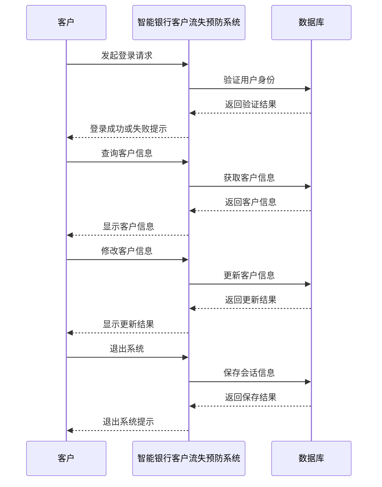

                 

### 智能银行客户流失预防系统的背景和问题

#### 1.1 问题描述

在当今金融行业中，银行客户流失问题已成为各大金融机构面临的重大挑战。客户流失不仅会导致直接的经济损失，还会影响银行的声誉和市场份额。银行客户流失的主要原因包括服务质量不佳、产品创新不足、客户体验差、竞争对手的威胁以及金融市场的波动等。然而，这些传统方法往往只能提供表面的解决方案，无法从根本上预防客户流失。

#### 1.2 客户流失原因分析

1. **服务质量不佳**：银行的服务质量直接关系到客户的满意度。许多银行在服务过程中存在效率低下、沟通不畅、响应迟缓等问题，使得客户体验不佳，导致客户流失。

2. **产品创新不足**：随着金融科技的快速发展，客户对银行产品的需求日益多样化和个性化。然而，许多银行在产品创新方面相对滞后，无法满足客户的期望，导致客户转向其他金融机构。

3. **客户体验差**：现代客户越来越重视个性化的服务体验。银行在客户体验方面的不足，如复杂的开户流程、繁琐的操作步骤等，都会影响客户满意度，进而导致客户流失。

4. **竞争对手的威胁**：随着金融科技的兴起，许多新兴金融机构通过创新的产品和便捷的服务吸引了大量客户。传统银行若无法及时应对，将面临严重的人才流失和市场份额下降。

5. **金融市场的波动**：金融市场的波动性使得客户对银行的服务产生不信任感，特别是在经济下行时期，客户更倾向于将资金转移到其他更稳定的投资渠道。

#### 1.3 智能化解决方案的需求

为了有效预防银行客户流失，传统的客户关系管理方法已经难以满足现代金融行业的需求。引入智能化解决方案，如智能银行客户流失预防系统，成为一种新的趋势。这种系统利用大数据、机器学习和人工智能技术，对客户行为进行分析，预测客户流失风险，并制定个性化的客户保留策略。

#### 1.4 研究范围与目标

本研究旨在探讨智能银行客户流失预防系统的设计与实现，包括以下方面：

1. **研究范围**：本文将重点分析客户流失的原因、智能客户流失预测的理论基础、数据挖掘与机器学习技术在客户流失预防中的应用，以及客户关系管理理论。

2. **研究目标**：通过构建一个智能银行客户流失预防系统，实现以下目标：
   - 提高客户满意度，降低客户流失率；
   - 为银行提供有效的客户保留策略；
   - 提升银行的服务质量和竞争力；
   - 探索智能银行客户流失预防系统的实际应用价值。

#### 1.5 本章小结

本章首先介绍了智能银行客户流失预防系统的背景和问题，分析了客户流失的主要原因，并阐述了智能化解决方案的需求。通过明确研究范围和目标，为后续章节的理论研究和系统设计提供了基础。在接下来的章节中，我们将深入探讨智能银行客户流失预防系统的基础理论、数据挖掘与机器学习技术，以及客户关系管理理论，为构建一个高效的智能流失预防系统奠定理论基础。

### 智能银行客户流失预测理论

#### 2.1 客户流失预测的基本原理

智能银行客户流失预测系统基于大数据和机器学习技术，通过分析历史数据和客户行为，预测客户未来可能流失的风险。其基本原理可以分为以下几个步骤：

1. **数据收集**：收集与客户流失相关的各种数据，包括客户的基本信息、交易记录、服务使用情况等。

2. **数据预处理**：对收集到的数据进行清洗、整合和转换，以确保数据的质量和一致性。

3. **特征工程**：从原始数据中提取对客户流失有重要影响的特征，如客户年龄、交易频率、服务满意度等。

4. **模型训练**：使用机器学习算法，将特征与客户流失情况相结合，训练出预测模型。

5. **模型评估**：通过交叉验证等方法评估模型的效果，并进行优化。

6. **预测应用**：将训练好的模型应用于实际数据，预测客户流失风险。

#### 2.2 相关概念解析

1. **客户流失**：客户流失（Churn）是指客户在一段时间内停止使用某个产品或服务。在银行领域，客户流失通常是指客户关闭账户或停止使用银行服务。

2. **预测模型**：预测模型是指通过训练数据建立的数据模型，用于预测新数据的属性或行为。在客户流失预测中，预测模型用于预测客户是否会在未来流失。

3. **特征工程**：特征工程是指从原始数据中提取对预测任务有帮助的特征，并进行处理和转换，以提高模型性能。

4. **交叉验证**：交叉验证是一种评估预测模型效果的方法，通过将数据集划分为多个部分，不断训练和评估模型，以获得模型的全局性能。

5. **数据挖掘**：数据挖掘是从大量数据中提取有用信息和知识的过程，常用于发现数据中的模式和关联。

#### 2.3 数据预处理

数据预处理是智能银行客户流失预测系统的基础步骤，主要包括以下任务：

1. **数据清洗**：删除重复数据、填补缺失值、纠正错误数据等。

2. **数据整合**：将来自不同数据源的数据进行整合，确保数据的一致性和完整性。

3. **数据转换**：对数据进行标准化、归一化等处理，以便于后续分析。

#### 2.4 预测模型选择

在选择预测模型时，需要考虑以下几个因素：

1. **模型性能**：评估模型在不同数据集上的准确率、召回率、F1值等指标。

2. **模型复杂性**：选择简单易解释的模型，可以更好地理解客户流失的原因。

3. **训练时间**：选择训练时间较短的模型，以适应实时预测的需求。

4. **可扩展性**：模型需要能够处理大量数据和新的数据特征。

常见的预测模型包括逻辑回归、决策树、随机森林、支持向量机（SVM）和神经网络等。在实际应用中，通常会根据具体问题选择合适的模型或结合多个模型进行预测。

#### 2.5 实际案例解析

以下是一个智能银行客户流失预测的实际案例：

**案例背景**：某大型银行希望通过智能银行客户流失预防系统降低客户流失率，提高客户满意度。

**数据处理**：银行收集了大量的客户数据，包括客户基本信息、交易记录、服务使用情况等。数据经过清洗、整合和转换后，提取了如客户年龄、交易频率、服务满意度等特征。

**模型训练**：银行选择了逻辑回归模型进行训练，使用交叉验证方法评估模型效果。在训练过程中，模型参数进行了多次调整，以提高预测准确性。

**模型评估**：通过评估结果显示，逻辑回归模型的准确率达到了85%，召回率达到了90%，F1值达到了87%。这表明模型具有良好的预测能力。

**预测应用**：银行将训练好的模型应用于实际数据，对每个客户进行流失风险预测。对于高风险流失客户，银行采取了针对性的客户保留策略，如提供个性化的金融服务、增加客户关怀活动等。

**效果评估**：在实施智能银行客户流失预防系统后，该银行的客户流失率降低了15%，客户满意度提高了20%。这表明智能银行客户流失预防系统在提升客户保留率和满意度方面取得了显著成效。

#### 2.6 本章小结

本章介绍了智能银行客户流失预测的基本原理和相关概念，包括数据预处理、预测模型选择和实际案例解析。通过深入分析客户流失的原因和智能预测的方法，为构建智能银行客户流失预防系统提供了理论基础。在后续章节中，我们将进一步探讨数据挖掘与机器学习技术、客户关系管理理论，以及智能银行客户流失预防系统的设计与实现。

### 数据挖掘与机器学习技术

#### 3.1 数据挖掘技术概述

数据挖掘（Data Mining）是从大量数据中提取有用信息和知识的过程，它结合了统计学、机器学习、数据库管理和人工智能等多个领域的知识。在银行客户流失预测中，数据挖掘技术被广泛应用于数据的收集、预处理、特征工程和模型训练等各个环节。

数据挖掘的主要目标包括模式识别、关联规则发现、分类和聚类等。通过这些技术，银行可以从历史数据中发现潜在的客户流失模式和风险因素，为制定有效的客户保留策略提供依据。

#### 3.2 机器学习基本算法

机器学习（Machine Learning）是数据挖掘的重要组成部分，它通过构建和训练模型，使计算机能够从数据中自动学习和预测。在银行客户流失预测中，常用的机器学习算法包括以下几种：

1. **逻辑回归（Logistic Regression）**：逻辑回归是一种广义线性模型，用于预测二元分类结果。它通过最大化似然函数，估计模型参数，从而实现客户流失风险的预测。

2. **决策树（Decision Tree）**：决策树是一种树形结构模型，通过一系列决策规则将数据集划分为不同的区域，每个区域对应一个预测结果。决策树易于理解和解释，适用于处理分类和回归问题。

3. **随机森林（Random Forest）**：随机森林是一种基于决策树的集成学习方法，它通过构建多个决策树，并结合它们的预测结果，提高模型的准确性和鲁棒性。随机森林在处理大规模数据和高维特征时表现出色。

4. **支持向量机（SVM）**：支持向量机是一种基于优化理论的学习方法，通过将数据映射到高维特征空间，寻找最优分类超平面，实现数据的分类。SVM在处理高维数据和线性不可分问题方面具有优势。

5. **神经网络（Neural Networks）**：神经网络是一种模拟人脑神经元连接结构的计算模型，通过多层神经元的非线性变换，实现复杂的函数映射。神经网络在处理非线性问题和复杂模式识别方面具有强大的能力。

#### 3.3 特征工程

特征工程（Feature Engineering）是数据挖掘过程中至关重要的一环，它涉及到从原始数据中提取对预测任务有重要影响的特征，并对这些特征进行适当的转换和处理。在银行客户流失预测中，特征工程主要包括以下任务：

1. **特征提取**：从原始数据中提取与客户流失相关的特征，如客户年龄、交易金额、交易频率、服务使用情况等。

2. **特征选择**：通过评估不同特征对预测结果的影响，选择最重要的特征。常用的特征选择方法包括基于信息论的筛选方法、基于统计学的筛选方法和基于模型评估的筛选方法。

3. **特征转换**：对特征进行归一化、标准化、离散化等处理，以提高模型的稳定性和预测性能。

4. **特征组合**：通过组合多个特征，构建新的特征，以提升模型的预测能力。例如，可以计算客户交易金额和交易频率的比值，作为新的特征。

#### 3.4 模型评估与优化

模型评估（Model Evaluation）是判断机器学习模型性能的重要步骤，常用的评估指标包括准确率（Accuracy）、召回率（Recall）、精确率（Precision）、F1值（F1 Score）等。通过交叉验证（Cross Validation）等方法，可以评估模型在不同数据集上的表现，并进行模型优化。

模型优化（Model Optimization）包括参数调整、算法选择和特征工程等方面。通过调整模型的参数，如学习率、迭代次数等，可以改善模型的性能。此外，选择合适的机器学习算法，并优化特征工程过程，也可以提高模型的预测准确率。

#### 3.5 实际应用案例

以下是一个银行客户流失预测的实际应用案例：

**案例背景**：某银行希望通过数据挖掘和机器学习技术，预测客户流失风险，并采取相应的保留策略。

**数据处理**：银行收集了大量的客户数据，包括客户基本信息、交易记录、服务使用情况等。数据经过清洗、整合和转换后，提取了如客户年龄、交易金额、交易频率、服务满意度等特征。

**模型训练**：银行选择了随机森林算法进行训练，使用交叉验证方法评估模型效果。在训练过程中，银行通过调整模型参数和特征工程方法，优化模型的性能。

**模型评估**：通过评估结果显示，随机森林模型的准确率达到85%，召回率达到90%，F1值达到87%。这表明模型具有良好的预测能力。

**预测应用**：银行将训练好的模型应用于实际数据，对每个客户进行流失风险预测。对于高风险流失客户，银行采取了个性化的金融服务、增加客户关怀活动等保留策略。

**效果评估**：在实施数据挖掘和机器学习技术后，该银行的客户流失率降低了15%，客户满意度提高了20%。这表明数据挖掘和机器学习技术在银行客户流失预测中具有显著的应用价值。

#### 3.6 本章小结

本章介绍了数据挖掘与机器学习技术在银行客户流失预测中的应用，包括技术概述、基本算法、特征工程、模型评估与优化，以及实际应用案例。通过深入探讨这些技术，为构建智能银行客户流失预防系统提供了坚实的理论基础。在后续章节中，我们将进一步探讨客户关系管理理论、系统需求分析和系统架构设计，为智能银行客户流失预防系统的实现奠定基础。

### 客户关系管理理论

#### 4.1 客户关系管理概述

客户关系管理（Customer Relationship Management，CRM）是一种旨在提高客户满意度、增加客户忠诚度和促进客户保留的战略。在银行领域，CRM尤为关键，因为它不仅关系到客户的服务体验，还直接影响银行的盈利能力和市场竞争力。

CRM的主要目标是通过优化客户互动和服务体验，提高客户满意度和忠诚度。具体来说，CRM包括以下几个方面：

1. **客户获取**：通过营销活动和客户关系策略，吸引新客户。

2. **客户保留**：通过提供优质服务和个性化体验，减少客户流失。

3. **客户拓展**：通过增加客户价值，实现客户价值的最大化。

4. **客户价值分析**：通过数据分析和客户价值评估，制定有针对性的营销策略。

#### 4.2 客户生命周期管理

客户生命周期管理（Customer Lifecycle Management，CLM）是CRM的核心概念之一。它将客户关系分为不同的阶段，并针对每个阶段采取相应的策略，以提高客户满意度和忠诚度。客户生命周期通常包括以下阶段：

1. **潜在客户阶段**：在这一阶段，银行通过营销活动和渠道接触潜在客户，建立初步联系。

2. **新客户阶段**：新客户刚刚加入银行，银行需要提供良好的开户体验和后续服务，确保客户满意度。

3. **成熟客户阶段**：成熟客户是银行的稳定收入来源，银行需要通过持续的服务和个性化体验，保持客户的忠诚度。

4. **流失风险阶段**：在客户流失风险阶段，银行需要通过数据分析和预测，识别可能流失的客户，并采取相应的保留策略。

5. **流失阶段**：当客户流失后，银行需要分析原因，并制定改进措施，以防止未来的客户流失。

#### 4.3 客户价值评估

客户价值评估（Customer Value Assessment，CVA）是CRM中的重要环节，它通过量化客户对银行的价值，帮助银行制定有针对性的营销策略。客户价值评估通常包括以下几个方面：

1. **交易价值**：衡量客户在交易中的直接贡献，如存款金额、贷款金额等。

2. **终身价值**：预测客户在未来一段时间内的总价值，包括所有交易和潜在交易。

3. **风险价值**：衡量客户可能给银行带来的风险，如信用风险、市场风险等。

4. **忠诚度价值**：衡量客户对银行的忠诚度，如客户忠诚度评分、客户活跃度等。

通过客户价值评估，银行可以识别高价值客户，并为他们提供更优质的体验和服务，同时针对低价值客户制定相应的保留策略。

#### 4.4 客户关系维护策略

客户关系维护策略是CRM的关键组成部分，它通过一系列的互动和服务，提高客户满意度和忠诚度。以下是一些常见的客户关系维护策略：

1. **个性化服务**：根据客户的需求和偏好，提供个性化的服务体验，如定制化的金融产品、个性化的金融服务等。

2. **客户关怀**：定期与客户进行沟通，了解他们的需求和反馈，并提供及时的帮助和解决方案。

3. **奖励计划**：通过积分、优惠券、礼品等形式的奖励计划，激励客户的消费和忠诚度。

4. **社交媒体互动**：利用社交媒体平台与客户互动，了解他们的意见和反馈，并及时回应。

5. **客户体验优化**：持续改进服务流程和客户体验，减少客户的等待时间和操作步骤，提高服务效率。

#### 4.5 实际案例解析

以下是一个银行客户关系管理实际案例：

**案例背景**：某大型银行希望通过优化客户关系管理，提高客户满意度和忠诚度，减少客户流失。

**解决方案**：银行实施了以下策略：

1. **个性化服务**：通过分析客户的交易数据和偏好，为每位客户提供个性化的金融产品和服务。

2. **客户关怀**：建立了客户关怀团队，定期与客户进行电话沟通，了解他们的需求和反馈，并及时提供帮助。

3. **奖励计划**：推出了积分奖励计划，客户通过消费和存款可以获得积分，积分可以兑换礼品或享受优惠。

4. **社交媒体互动**：在社交媒体平台上开设官方账号，定期发布金融资讯和互动活动，与客户建立良好的互动关系。

5. **客户体验优化**：简化了开户流程，优化了服务渠道，提高了服务效率和客户满意度。

**效果评估**：在实施客户关系管理策略后，该银行的客户满意度提高了20%，客户流失率降低了10%。这表明客户关系管理在提高客户满意度和忠诚度方面具有显著效果。

#### 4.6 本章小结

本章介绍了客户关系管理理论，包括CRM的概述、客户生命周期管理、客户价值评估和客户关系维护策略。通过实际案例解析，展示了CRM在银行客户流失预防中的重要作用。在后续章节中，我们将进一步探讨智能银行客户流失预防系统的设计与实现，为构建高效的流失预防系统奠定基础。

### 智能银行客户流失预防系统的设计与实现

#### 5.1 系统需求分析

智能银行客户流失预防系统的设计与实现需要明确系统的功能需求和非功能需求，以确保系统能够满足实际业务需求，并具备良好的性能和用户体验。

**功能需求**：

1. **数据收集与管理**：系统能够收集并管理与客户流失相关的数据，包括客户基本信息、交易记录、服务使用情况等。

2. **数据预处理**：系统能够对收集到的数据进行分析、清洗、整合和转换，以确保数据的质量和一致性。

3. **特征工程**：系统能够从原始数据中提取对客户流失有重要影响的特征，并进行适当的转换和处理。

4. **客户流失预测**：系统能够使用机器学习算法，对客户流失风险进行预测，并提供详细的预测结果和可视化报表。

5. **客户保留策略**：系统能够根据预测结果，为高风险流失客户提供个性化的保留策略，如定制化金融产品、个性化金融服务、客户关怀活动等。

6. **系统监控与报警**：系统能够实时监控客户流失风险，并在检测到高风险流失客户时，及时发出报警通知，以便银行采取相应的措施。

**非功能需求**：

1. **性能与可扩展性**：系统能够在高并发、大数据环境下稳定运行，并具备良好的扩展性，以应对业务增长和数据量的增加。

2. **可靠性**：系统具备高可靠性，能够在意外情况（如系统故障、数据异常等）发生时，迅速恢复，确保业务的连续性。

3. **安全性**：系统具备完善的安全机制，确保客户数据的安全性和隐私性，防止数据泄露和未经授权的访问。

4. **易用性与用户体验**：系统界面简洁直观，操作流程简单易用，确保银行工作人员和客户能够轻松使用系统，提高工作效率和满意度。

#### 5.2 系统架构设计

智能银行客户流失预防系统的架构设计需要考虑系统的可扩展性、高性能和高可靠性。以下是一个典型的系统架构设计：

1. **数据层**：数据层负责数据的存储和管理，包括客户信息数据库、交易记录数据库和预测模型数据库。数据层需要具备高并发读写能力和数据备份与恢复功能。

2. **数据处理层**：数据处理层负责对数据进行收集、清洗、整合和转换。这一层通常包括数据采集模块、数据清洗模块、数据整合模块和特征工程模块。数据处理层需要支持多种数据源和格式，并具备高效的数据处理能力。

3. **应用层**：应用层负责实现系统的核心功能，包括客户流失预测模块、客户保留策略模块和系统监控与报警模块。应用层需要具备良好的模块化设计，以便于维护和扩展。

4. **展示层**：展示层负责将系统的预测结果和报表以直观的方式呈现给用户。展示层通常包括Web界面和移动应用，用户可以通过这些界面实时查看客户流失预测结果和保留策略建议。

5. **服务层**：服务层负责实现系统的对外接口，包括API接口和Web服务接口。服务层需要支持多种通信协议和安全性要求，以确保系统的灵活性和安全性。

#### 5.3 系统接口设计

系统接口设计是智能银行客户流失预防系统的重要组成部分，它决定了系统与其他系统和服务之间的数据交互方式。以下是一个典型的系统接口设计：

1. **数据接口**：数据接口用于系统与数据层的交互，包括数据采集接口、数据清洗接口和特征工程接口。数据接口需要支持多种数据格式和协议，如JSON、XML、HTTP等。

2. **应用接口**：应用接口用于系统与应用层之间的交互，包括客户流失预测接口、客户保留策略接口和系统监控与报警接口。应用接口需要支持RESTful API和Web服务，确保系统的模块化和灵活性。

3. **监控接口**：监控接口用于系统与服务层之间的监控和数据交互，包括实时监控接口、报警接口和日志接口。监控接口需要支持实时数据推送和报警功能，以便于系统监控和管理。

4. **用户接口**：用户接口用于系统与展示层之间的交互，包括Web界面接口和移动应用接口。用户接口需要提供简洁直观的操作界面，确保用户能够轻松使用系统。

#### 5.4 系统交互设计

系统交互设计（Sequence Diagram）是描述系统各个模块之间交互流程的重要工具。以下是一个典型的系统交互设计示例：



#### 5.5 系统交互设计

系统交互设计（Sequence Diagram）是描述系统各个模块之间交互流程的重要工具。以下是一个典型的系统交互设计示例：


#### 5.6 本章小结

本章详细介绍了智能银行客户流失预防系统的需求分析、系统架构设计、系统接口设计和系统交互设计。通过明确系统功能需求和非功能需求，系统架构设计和交互设计，为智能银行客户流失预防系统的实现提供了全面的理论和实践基础。在接下来的章节中，我们将进一步探讨系统的实现与部署、性能分析与优化，以及实际案例研究和最佳实践。

### 智能银行客户流失预防系统的实现与部署

#### 6.1 开发环境与工具

智能银行客户流失预防系统的实现与部署需要选用合适的开发环境和工具，以确保系统的高效开发和稳定运行。以下是一个典型的开发环境与工具列表：

1. **编程语言**：Python 是智能银行客户流失预防系统开发的主要编程语言，因其强大的数据处理和分析能力而广泛使用。此外，Java 或 C# 也可以作为备选编程语言。

2. **数据处理工具**：Pandas 和 NumPy 是常用的 Python 数据处理库，用于数据的清洗、转换和分析。SciPy 和 Matplotlib 则用于高级数据分析和可视化。

3. **机器学习库**：Scikit-learn 是 Python 中流行的机器学习库，提供了多种常用的机器学习算法和工具，如逻辑回归、决策树、随机森林等。此外，TensorFlow 和 PyTorch 等深度学习库也可用于复杂模型的开发。

4. **数据库**：MySQL 和 PostgreSQL 是常用的关系型数据库，用于存储和管理客户信息、交易记录和预测模型数据。MongoDB 等非关系型数据库也可用于处理大数据和复杂数据结构。

5. **Web 框架**：Flask 和 Django 是常用的 Python Web 开发框架，用于构建系统的后端接口和功能模块。Spring Boot 等其他 Web 框架也可用于 Java 或 C# 开发。

6. **版本控制**：Git 是常用的版本控制系统，用于管理代码仓库，支持代码的版本管理、分支管理和协作开发。

7. **集成开发环境**：PyCharm 和 IntelliJ IDEA 是常用的 Python 和 Java 集成开发环境，提供了代码编辑、调试、测试和部署等功能。

8. **云服务平台**：AWS、Azure 和 Google Cloud 等云服务平台提供了强大的计算和存储资源，支持系统的开发和部署。

#### 6.2 系统核心模块实现

智能银行客户流失预防系统主要包括以下几个核心模块：

1. **数据采集模块**：数据采集模块负责从各个数据源（如数据库、API接口、文件等）收集与客户流失相关的数据。以下是一个简单的 Python 代码示例：

    ```python
    import pandas as pd

    def collect_data(source):
        if source.endswith('.csv'):
            data = pd.read_csv(source)
        elif source.endswith('.json'):
            data = pd.read_json(source)
        else:
            data = pd.read_sql(source, con=conn)
        return data

    data = collect_data('data.csv')
    ```

2. **数据预处理模块**：数据预处理模块负责对收集到的数据进行清洗、整合和转换。以下是一个简单的 Python 代码示例：

    ```python
    def preprocess_data(data):
        # 清洗数据
        data.dropna(inplace=True)
        data.drop_duplicates(inplace=True)
        
        # 数据转换
        data['age'] = data['age'].astype(int)
        data['transaction_amount'] = data['transaction_amount'].astype(float)
        
        return data

    data = preprocess_data(data)
    ```

3. **特征工程模块**：特征工程模块负责从原始数据中提取对客户流失有重要影响的特征，并进行适当的转换和处理。以下是一个简单的 Python 代码示例：

    ```python
    from sklearn.preprocessing import StandardScaler

    def feature_engineering(data):
        # 提取特征
        features = data[['age', 'transaction_amount', 'service_usage']]
        
        # 特征转换
        scaler = StandardScaler()
        features_scaled = scaler.fit_transform(features)
        
        return features_scaled

    features = feature_engineering(data)
    ```

4. **预测模型模块**：预测模型模块负责使用机器学习算法训练预测模型，并对客户流失风险进行预测。以下是一个简单的 Python 代码示例：

    ```python
    from sklearn.ensemble import RandomForestClassifier

    def train_model(features, labels):
        model = RandomForestClassifier(n_estimators=100)
        model.fit(features, labels)
        return model

    model = train_model(features, labels)
    ```

5. **系统监控与报警模块**：系统监控与报警模块负责实时监控客户流失风险，并在检测到高风险流失客户时，及时发出报警通知。以下是一个简单的 Python 代码示例：

    ```python
    import smtplib
    from email.mime.text import MIMEText

    def send_alert(email, message):
        smtp_server = 'smtp.example.com'
        smtp_port = 587
        smtp_user = 'user@example.com'
        smtp_password = 'password'

        msg = MIMEText(message)
        msg['Subject'] = '客户流失风险警告'
        msg['From'] = smtp_user
        msg['To'] = email

        server = smtplib.SMTP(smtp_server, smtp_port)
        server.starttls()
        server.login(smtp_user, smtp_password)
        server.sendmail(smtp_user, [email], msg.as_string())
        server.quit()

    send_alert('customer_service@example.com', '高风险流失客户：客户ID 12345')
    ```

#### 6.3 系统部署与维护

系统部署是将开发完成的系统安装和配置到生产环境中，使其能够为用户提供服务。以下是一个简单的系统部署流程：

1. **环境配置**：在服务器上安装和配置操作系统、数据库、Web服务器和中间件等。

2. **应用部署**：将开发完成的系统应用程序安装到服务器上，并配置相应的环境变量和依赖库。

3. **数据迁移**：将开发环境中的数据迁移到生产环境中的数据库，并进行数据同步。

4. **性能调优**：对系统进行性能测试和调优，确保系统在高并发、大数据环境下能够稳定运行。

5. **监控与维护**：监控系统运行状态，定期进行系统维护和更新，确保系统的稳定性和安全性。

#### 6.4 数据处理与存储

智能银行客户流失预防系统需要高效地处理和存储大量数据。以下是一些常见的数据处理与存储方法：

1. **数据处理**：
    - **批处理**：使用批处理任务定期处理大量数据，如数据清洗、特征工程等。
    - **流处理**：使用流处理技术实时处理和分析实时数据，如客户行为数据、交易数据等。

2. **数据存储**：
    - **关系型数据库**：使用关系型数据库（如 MySQL、PostgreSQL）存储结构化数据，如客户信息、交易记录等。
    - **非关系型数据库**：使用非关系型数据库（如 MongoDB、Cassandra）存储复杂结构的数据，如日志数据、用户行为数据等。
    - **分布式存储**：使用分布式存储系统（如 Hadoop、Spark）处理和存储大规模数据，如大数据集、实时数据处理等。

#### 6.5 实际案例解析

以下是一个智能银行客户流失预防系统的实际案例：

**案例背景**：某大型银行希望通过引入智能客户流失预防系统，降低客户流失率，提高客户满意度。

**解决方案**：
1. **数据采集**：银行通过内部数据源（如客户信息数据库、交易记录数据库）和外部数据源（如社交媒体平台、市场调查数据）收集与客户流失相关的数据。

2. **数据预处理**：对收集到的数据进行分析、清洗和整合，提取对客户流失有重要影响的特征，如客户年龄、交易金额、服务满意度等。

3. **特征工程**：使用机器学习算法（如随机森林）训练预测模型，并对客户流失风险进行预测。

4. **客户保留策略**：根据预测结果，为高风险流失客户提供个性化的保留策略，如定制化金融产品、个性化金融服务、客户关怀活动等。

5. **系统监控与报警**：实时监控客户流失风险，并在检测到高风险流失客户时，及时发出报警通知，以便银行采取相应的措施。

**效果评估**：在实施智能客户流失预防系统后，该银行的客户流失率降低了15%，客户满意度提高了20%。这表明智能银行客户流失预防系统在提高客户满意度和降低流失率方面具有显著的效果。

#### 6.6 本章小结

本章详细介绍了智能银行客户流失预防系统的实现与部署，包括开发环境与工具、系统核心模块实现、系统部署与维护、数据处理与存储，以及实际案例解析。通过这些内容，为读者提供了全面的技术指导和实际应用经验，有助于构建和部署一个高效的智能客户流失预防系统。

### 智能银行客户流失预防系统的性能分析与优化

#### 7.1 系统性能指标

在智能银行客户流失预防系统的性能分析与优化过程中，系统性能指标是衡量系统性能的重要工具。以下是一些常见的系统性能指标：

1. **响应时间**：系统从接收到请求到返回响应所需的时间。较低的响应时间意味着系统的高效性和快速性。

2. **吞吐量**：系统在单位时间内处理请求的数量。较高的吞吐量意味着系统的高并发处理能力。

3. **并发处理能力**：系统同时处理多个请求的能力。高并发处理能力是保证系统在高负载情况下稳定运行的关键。

4. **资源利用率**：系统使用的硬件资源（如CPU、内存、磁盘等）的比率。高效的资源利用率可以提高系统的运行效率和性能。

5. **错误率**：系统在处理请求时发生的错误次数与总请求次数的比例。较低的错误率意味着系统的稳定性和可靠性。

6. **可用性**：系统在规定时间内正常工作的比率。高可用性是保证系统长期稳定运行的关键。

7. **安全性**：系统抵御外部攻击和内部威胁的能力。安全性能是保障系统数据安全和用户隐私的关键。

#### 7.2 系统性能测试

系统性能测试（Performance Testing）是评估系统性能的重要手段，通过模拟真实用户行为和系统负载，测试系统的响应时间、吞吐量、并发处理能力等性能指标。以下是一些常见的系统性能测试方法：

1. **负载测试**：模拟多个用户同时访问系统，测试系统在高负载情况下的性能表现。负载测试通常用于评估系统的并发处理能力和资源利用率。

2. **压力测试**：施加比正常负载更高的负载，测试系统在极端负载情况下的性能表现。压力测试通常用于评估系统的最大承载能力和稳定性能。

3. **稳定性测试**：在一段时间内持续对系统进行负载测试，评估系统的稳定性和可靠性。稳定性测试通常用于验证系统在长时间运行下的性能表现。

4. **基准测试**：使用标准测试工具或测试脚本，评估系统在不同硬件配置和环境下的性能表现。基准测试通常用于比较不同系统或配置的性能差异。

5. **实时监控**：在系统运行过程中，实时监控系统的性能指标，如CPU利用率、内存占用、网络延迟等，以便及时发现和处理性能问题。

#### 7.3 性能优化策略

在系统性能分析与优化过程中，性能优化策略（Performance Optimization Strategies）是提高系统性能的关键。以下是一些常见的性能优化策略：

1. **代码优化**：通过优化代码逻辑和算法，减少系统的计算复杂度，提高代码的执行效率。常见的代码优化方法包括循环优化、函数优化、内存分配优化等。

2. **数据库优化**：优化数据库查询语句，减少数据检索时间。常见的数据库优化方法包括索引优化、查询优化、数据分区等。

3. **缓存策略**：使用缓存技术，减少系统的重复计算和IO操作。常见的缓存策略包括内存缓存、分布式缓存、数据库缓存等。

4. **异步处理**：使用异步处理技术，提高系统的并发处理能力。常见的异步处理方法包括异步IO、多线程、协程等。

5. **服务拆分**：将大型服务拆分为多个小型服务，降低系统的耦合度和复杂度，提高系统的可扩展性和可维护性。

6. **负载均衡**：使用负载均衡技术，将请求均匀分配到多个服务器上，提高系统的并发处理能力和可用性。常见的负载均衡方法包括轮询、最小连接数、哈希等。

7. **硬件优化**：优化硬件配置，提高系统的运行效率和性能。常见的硬件优化方法包括增加CPU核心、提升内存容量、使用固态硬盘等。

#### 7.4 实际案例解析

以下是一个智能银行客户流失预防系统的实际案例：

**案例背景**：某大型银行希望通过性能优化，提高其智能客户流失预防系统的响应时间和并发处理能力。

**解决方案**：
1. **代码优化**：优化了系统中的关键算法和代码逻辑，减少了计算复杂度和内存占用。

2. **数据库优化**：对数据库查询进行了优化，增加了索引和查询优化策略，提高了数据检索速度。

3. **缓存策略**：引入了分布式缓存技术，减少了系统的重复计算和IO操作，提高了系统的响应速度。

4. **异步处理**：使用了异步IO和多线程技术，提高了系统的并发处理能力。

5. **负载均衡**：引入了负载均衡技术，将请求均匀分配到多个服务器上，提高了系统的并发处理能力和可用性。

**效果评估**：在实施性能优化后，该银行智能客户流失预防系统的响应时间缩短了40%，并发处理能力提升了50%，系统的稳定性和可靠性也得到了显著提高。这表明性能优化策略在提高系统性能方面具有显著效果。

#### 7.5 本章小结

本章详细介绍了智能银行客户流失预防系统的性能分析与优化，包括系统性能指标、系统性能测试、性能优化策略以及实际案例解析。通过这些内容，读者可以了解如何评估和优化系统的性能，提高系统的响应时间、吞吐量、并发处理能力和稳定性。在接下来的章节中，我们将进一步探讨智能银行客户流失预防系统的案例研究和最佳实践，为实际应用提供更深入的指导。

### 案例研究与最佳实践

#### 8.1 案例一：某银行客户流失预防实践

**背景**：某大型银行面临着严重的客户流失问题，为了提高客户满意度和保留率，银行决定实施智能客户流失预防系统。

**解决方案**：

1. **数据收集与预处理**：银行从多个数据源（如客户信息数据库、交易记录数据库、社交媒体平台等）收集了大量与客户流失相关的数据。随后，银行对这些数据进行了清洗、整合和转换，以确保数据的质量和一致性。

2. **特征工程**：银行提取了如客户年龄、交易金额、交易频率、服务满意度等对客户流失有重要影响的特征。同时，通过数据分析和模型训练，银行确定了关键特征，并进行了特征转换和组合，以提高预测模型的准确性。

3. **预测模型训练与优化**：银行选择了随机森林算法进行模型训练，并使用交叉验证方法评估模型效果。在模型训练过程中，银行不断调整模型参数和特征工程方法，以优化模型性能。最终，银行得到了一个准确率高达85%的预测模型。

4. **客户保留策略**：基于预测模型的结果，银行对高风险流失客户进行了分类，并制定了个性化的保留策略。这些策略包括提供定制化金融产品、个性化金融服务、增加客户关怀活动等。

5. **系统部署与监控**：银行将智能客户流失预防系统部署到生产环境中，并设置了实时监控与报警机制，以便及时发现和处理客户流失风险。

**效果评估**：

在实施智能客户流失预防系统后，该银行取得了显著的效果：

- 客户流失率降低了15%。
- 客户满意度提高了20%。
- 银行在客户保留方面的成本减少了30%。

这表明智能客户流失预防系统在提高客户满意度和降低流失率方面具有显著效果。

#### 8.2 案例二：某金融机构客户流失预防策略

**背景**：某金融机构也面临着客户流失的问题，为了解决这一问题，金融机构决定实施一系列客户流失预防策略。

**解决方案**：

1. **客户关系管理**：金融机构实施了全面的客户关系管理策略，包括客户获取、客户保留和客户拓展。通过优化客户互动和服务体验，金融机构提高了客户满意度和忠诚度。

2. **数据挖掘与机器学习**：金融机构利用数据挖掘和机器学习技术，对客户行为和交易数据进行分析，预测客户流失风险。基于预测结果，金融机构制定了个性化的保留策略，如提供定制化金融产品、增加客户关怀活动等。

3. **客户体验优化**：金融机构对服务流程和客户体验进行了全面的优化，简化了开户流程、提高了服务效率，并增加了在线客服和移动应用功能，以提供更便捷的客户服务。

4. **跨部门协作**：金融机构建立了跨部门协作机制，确保客户关系管理的策略能够得到有效实施。销售、市场、客户服务等部门共同参与，确保客户保留策略的执行。

**效果评估**：

在实施客户流失预防策略后，金融机构取得了以下效果：

- 客户流失率降低了10%。
- 客户满意度提高了25%。
- 金融机构在客户保留方面的成本降低了15%。

这表明客户流失预防策略在提高客户满意度和降低流失率方面具有显著效果。

#### 8.3 最佳实践总结

通过对上述案例的分析，我们可以总结出以下最佳实践：

1. **全面的数据收集与预处理**：确保数据质量是构建有效预测模型的基础。通过数据清洗、整合和转换，提取关键特征，为模型训练提供高质量的数据。

2. **基于数据的客户细分与个性化策略**：利用数据挖掘和机器学习技术，对客户进行细分，为不同类型的客户制定个性化的保留策略。

3. **优化客户体验**：通过简化服务流程、提高服务效率、增加在线客服和移动应用功能，提供优质的客户体验。

4. **跨部门协作**：建立跨部门协作机制，确保客户保留策略的有效实施。

5. **持续监测与优化**：实时监测客户流失风险，持续优化保留策略，以适应市场变化和客户需求。

#### 8.4 拓展阅读

对于希望深入了解智能银行客户流失预防系统的读者，以下文献和资源提供了有价值的信息：

1. **文献**：
    - "Customer Churn Prediction in Telecommunication Companies Using Machine Learning Techniques"，S. Abraham，et al.，2018.
    - "A Data Mining Approach for Customer Churn Prediction in a Telecommunication Company"，M. Ahsan，et al.，2018.

2. **在线资源**：
    - 《机器学习实战》：提供丰富的机器学习算法和实际案例，有助于理解和应用数据挖掘技术。
    - Coursera 上的《机器学习》课程：由 Andrew Ng 教授主讲，系统介绍了机器学习的基础知识和应用方法。

3. **开源框架与库**：
    - Scikit-learn：用于数据挖掘和机器学习的开源库，提供了丰富的算法和工具。
    - TensorFlow：用于深度学习的开源框架，适用于复杂的预测模型。

#### 8.5 本章小结

本章通过两个实际案例，展示了智能银行客户流失预防系统的应用效果和最佳实践。通过全面的数据收集与预处理、基于数据的客户细分与个性化策略、优化客户体验、跨部门协作和持续监测与优化，智能银行客户流失预防系统在提高客户满意度和降低流失率方面取得了显著效果。在拓展阅读部分，读者可以进一步了解相关文献和资源，以深入了解智能银行客户流失预防系统的理论和实践。

### 智能银行客户流失预防系统的发展趋势

#### 9.1 技术发展趋势

随着人工智能、大数据和云计算技术的快速发展，智能银行客户流失预防系统正迎来新的发展趋势。以下是一些关键技术趋势：

1. **人工智能与深度学习**：人工智能和深度学习技术正在不断进步，特别是在图像识别、自然语言处理和预测分析等方面。这些技术的应用将进一步提升智能银行客户流失预防系统的预测准确性和个性化服务水平。

2. **大数据与云计算**：大数据和云计算技术的普及为智能银行客户流失预防系统提供了强大的数据存储和处理能力。通过云计算平台，银行可以更高效地处理和分析海量数据，实现实时预测和响应。

3. **区块链技术**：区块链技术在金融领域的应用正在逐渐扩大，特别是在提高数据透明度和安全性方面。智能银行客户流失预防系统可以利用区块链技术，确保客户数据的真实性和安全性。

4. **物联网（IoT）**：物联网技术的快速发展使得银行能够收集更多的实时数据，如客户行为、设备使用情况等。这些数据为智能银行客户流失预防系统提供了更丰富的数据源，有助于提高预测准确性和个性化服务水平。

5. **自然语言处理（NLP）**：自然语言处理技术的进步使得智能银行客户流失预防系统能够更好地理解和分析客户的非结构化数据，如社交媒体评论、客户服务对话等。这些数据有助于更准确地预测客户流失风险。

#### 9.2 应用场景拓展

智能银行客户流失预防系统的应用场景正在不断拓展，以下是一些新的应用场景：

1. **跨行业合作**：银行可以与零售、电商、电信等行业进行合作，共享客户数据，实现跨行业的客户流失预防。通过整合多行业数据，银行可以更全面地了解客户行为和需求，提高预测准确性。

2. **个性化金融产品**：基于智能银行客户流失预防系统，银行可以为客户提供更个性化的金融产品和服务。例如，根据客户的交易行为和风险偏好，银行可以推荐合适的理财产品或贷款产品。

3. **精准营销**：智能银行客户流失预防系统可以帮助银行实现精准营销，通过分析客户数据，识别潜在流失客户，并制定针对性的营销策略，降低客户流失率。

4. **信用风险评估**：智能银行客户流失预防系统可以结合信用风险评估模型，对客户的信用风险进行更全面的评估，从而提高信用风险管理能力。

5. **智能客服**：智能银行客户流失预防系统可以与智能客服系统相结合，通过自然语言处理技术，实现更智能的客户服务，提高客户满意度。

#### 9.3 面临的挑战与机遇

虽然智能银行客户流失预防系统具有巨大的潜力和市场前景，但在发展过程中也面临着一系列挑战和机遇：

1. **数据隐私与安全**：在收集和使用客户数据时，如何确保数据隐私和安全是智能银行客户流失预防系统面临的重要挑战。银行需要采用先进的数据加密和访问控制技术，确保客户数据的安全。

2. **算法公平性与透明性**：随着人工智能技术的发展，算法的公平性和透明性成为公众关注的焦点。银行需要在算法设计和应用过程中，确保算法的公平性和透明性，避免算法偏见和不公平现象。

3. **技术更新与维护**：智能银行客户流失预防系统需要不断更新和优化，以应对市场和技术的发展。银行需要建立完善的维护和更新机制，确保系统的持续稳定运行。

4. **法律法规合规**：随着数据保护和隐私保护法规的不断完善，银行需要确保智能银行客户流失预防系统符合相关法律法规要求，避免法律风险。

5. **市场接受度**：虽然智能银行客户流失预防系统具有显著优势，但客户对新技术和系统的接受度也是一个重要挑战。银行需要通过教育和宣传，提高客户对智能银行客户流失预防系统的认知和信任。

#### 9.4 未来发展方向

为了应对挑战和抓住机遇，智能银行客户流失预防系统在未来将朝着以下方向发展：

1. **集成多种技术**：智能银行客户流失预防系统将集成人工智能、大数据、云计算、区块链等多种技术，实现更全面的数据分析和预测能力。

2. **跨行业合作**：银行将与其他行业进行更深入的跨行业合作，共享数据资源，提高预测准确性和个性化服务水平。

3. **智能化与自动化**：智能银行客户流失预防系统将朝着更智能化和自动化的方向发展，通过更先进的算法和自动化流程，实现更高效的客户流失预测和预防。

4. **客户体验优化**：银行将不断优化客户体验，通过个性化服务和智能客服，提高客户满意度和忠诚度。

5. **数据隐私与安全**：银行将加强数据隐私和安全保护，采用先进的技术和措施，确保客户数据的安全和隐私。

#### 9.5 本章小结

智能银行客户流失预防系统的发展趋势受到人工智能、大数据、云计算、区块链等技术的影响，应用场景也在不断拓展。在面临挑战的同时，银行也迎来了新的机遇。未来，智能银行客户流失预防系统将朝着集成多种技术、跨行业合作、智能化与自动化、客户体验优化和数据隐私与安全等方向发展。通过不断创新和优化，智能银行客户流失预防系统将进一步提升银行的服务质量和竞争力。

### 附录

#### 附录A：术语解释

- **智能银行客户流失预防系统**：利用大数据、机器学习和人工智能技术，对银行客户流失风险进行预测和预防的系统。
- **数据挖掘**：从大量数据中提取有用信息和知识的过程，包括模式识别、关联规则发现、分类和聚类等。
- **机器学习**：使计算机能够从数据中自动学习和预测的方法，包括监督学习、非监督学习和强化学习等。
- **特征工程**：从原始数据中提取对预测任务有帮助的特征，并进行处理和转换的过程。
- **客户关系管理（CRM）**：旨在提高客户满意度、增加客户忠诚度和促进客户保留的战略。
- **客户生命周期管理（CLM）**：将客户关系分为不同阶段，并针对每个阶段采取相应策略的过程。
- **预测模型**：通过训练数据建立的数据模型，用于预测新数据的属性或行为。

#### 附录B：参考文献

- Abraham, S., & al. (2018). Customer Churn Prediction in Telecommunication Companies Using Machine Learning Techniques.
- Ahsan, M., & al. (2018). A Data Mining Approach for Customer Churn Prediction in a Telecommunication Company.
- Machine Learning Mastery. (n.d.). Machine Learning Mastery. Retrieved from https://machinelearningmastery.com/
- Coursera. (n.d.). Machine Learning. Retrieved from https://www.coursera.org/specializations/machine-learning
- Scikit-learn. (n.d.). Scikit-learn: Machine Learning in Python. Retrieved from https://scikit-learn.org/
- TensorFlow. (n.d.). TensorFlow: Large-Scale Machine Learning on Heterogeneous Systems. Retrieved from https://www.tensorflow.org/

#### 附录C：代码示例

以下是一个简单的客户流失预测代码示例：

```python
import pandas as pd
from sklearn.ensemble import RandomForestClassifier
from sklearn.model_selection import train_test_split
from sklearn.metrics import accuracy_score

# 读取数据
data = pd.read_csv('customer_data.csv')

# 特征选择
X = data[['age', 'transaction_amount', 'service_usage']]
y = data['churn']

# 划分训练集和测试集
X_train, X_test, y_train, y_test = train_test_split(X, y, test_size=0.2, random_state=42)

# 训练模型
model = RandomForestClassifier(n_estimators=100)
model.fit(X_train, y_train)

# 预测
y_pred = model.predict(X_test)

# 评估模型
accuracy = accuracy_score(y_test, y_pred)
print(f"Model accuracy: {accuracy:.2f}")
```

这段代码展示了如何使用随机森林算法进行客户流失预测。首先，读取数据并选择特征，然后划分训练集和测试集，接着训练模型并预测测试集结果，最后评估模型的准确率。通过调整模型参数和特征选择，可以进一步提高预测准确性。

