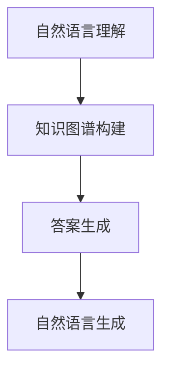
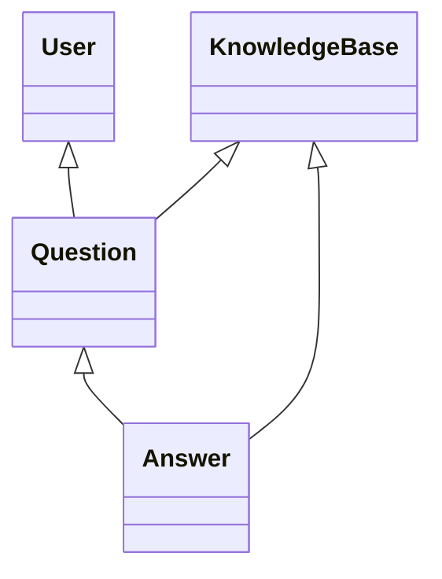
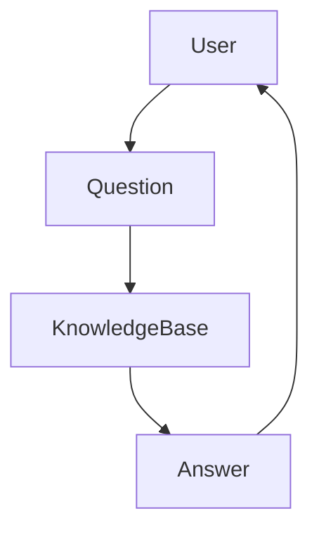

                 

# 智能问答系统AI Agent：基于LLM的精确信息检索

> 关键词：智能问答系统，大语言模型（LLM），精确信息检索，算法原理，系统架构，项目实战

> 摘要：本文探讨了智能问答系统AI Agent的实现，特别是基于大语言模型（LLM）的精确信息检索技术。通过详细分析核心概念、算法原理以及系统架构，本文旨在为读者提供一个全面而深入的指导，助力他们在实际项目中应用这一技术。

智能问答系统（AI Agent）是人工智能领域的一个重要研究方向，其在日常交互、客户服务、知识管理等场景中展现出巨大潜力。而大语言模型（LLM）的出现，为精确信息检索提供了强有力的支持。本文将逐步分析这些核心概念，探讨智能问答系统的工作原理，以及如何利用LLM实现精确信息检索。

## 第一部分：问题背景与核心概念

### 第1章：问题背景

#### 1.1.1 当代信息时代的挑战

在信息爆炸的时代，如何高效地获取和处理信息成为了一个重要的课题。传统的搜索引擎虽然在一定程度上解决了信息检索的问题，但仍然存在许多挑战，如信息过载、相关性不足等。

#### 1.1.2 问答系统的重要性

问答系统作为一种智能交互方式，能够更好地满足用户的需求。通过自然语言交互，问答系统能够提供快速、精准的信息检索服务，提升用户体验。

#### 1.1.3 智能问答系统的需求

随着人工智能技术的发展，用户对智能问答系统的需求也在不断提高。这些需求包括：自然语言理解能力、多语言支持、个性化服务、实时响应等。

### 第1章：智能问答系统概述

#### 1.2.1 智能问答系统的定义

智能问答系统是一种基于人工智能技术的问答系统，能够理解用户的自然语言输入，并返回相应的答案。

#### 1.2.2 智能问答系统的工作原理

智能问答系统的工作原理主要包括三个部分：自然语言理解、知识图谱构建和自然语言生成。

#### 1.2.3 智能问答系统的分类

根据不同的分类标准，智能问答系统可以分为多种类型，如基于规则的方法、基于机器学习的方法和基于知识图谱的方法。

### 第1章：基于LLM的精确信息检索

#### 1.3.1 LLM的基本概念

LLM（Large Language Model）是一种大规模的预训练语言模型，通过学习大量的文本数据，可以生成高质量的文本、理解语义信息等。

#### 1.3.2 LLM在精确信息检索中的应用

LLM在精确信息检索中的应用主要体现在两个方面：文本生成和语义理解。通过LLM，可以实现对海量数据的快速检索和精准匹配。

#### 1.3.3 LLM的优势与局限

LLM的优势在于其强大的语义理解能力和文本生成能力，但同时也存在一些局限，如训练成本高、对数据质量要求高等。

## 第二部分：核心概念与联系

### 第2章：核心概念与联系

#### 2.1 智能问答系统的核心概念

智能问答系统的核心概念包括：问答匹配、信息检索、知识图谱等。

#### 2.2 概念属性特征对比表格

| 概念        | 特征        | 解释                                                         |
| ----------- | ----------- | ------------------------------------------------------------ |
| 问答匹配    | 准确性、效率 | 问答匹配的目的是确保用户提出的问题与系统回答的答案之间的准确性和效率。 |
| 信息检索    | 全面性、准确性 | 信息检索的目标是从大量数据中快速、准确地找到用户需要的信息。     |
| 知识图谱    | 结构性、关联性 | 知识图谱通过节点和边的关系，构建起一个结构化的知识网络。         |

#### 2.3 ER实体关系图架构

| 实体        | 关系         | 实体2       | 解释                                                         |
| ----------- | ------------ | ----------- | ------------------------------------------------------------ |
| 用户        | 提问         | 问题        | 用户向系统提问，系统根据问题进行信息检索。                     |
| 知识库      | 包含         | 答案        | 知识库中包含系统所能回答的各种问题及其对应的答案。             |
| 自然语言处理 | 实现匹配     | 问答系统    | 自然语言处理技术用于实现用户提问与系统答案之间的匹配。         |

## 第三部分：算法原理讲解

### 第3章：算法原理讲解

#### 3.1 算法基础

##### 3.1.1 基本算法原理

智能问答系统的主要算法原理包括：自然语言处理、信息检索和自然语言生成。

##### 3.1.2 数学模型

智能问答系统的数学模型主要包括：词嵌入、序列模型和生成模型。

##### 3.1.3 算法流程

智能问答系统的算法流程包括：自然语言理解、知识图谱构建、答案生成和自然语言生成。

### 第3章：算法原理讲解

##### 3.2 算法Mermaid流程图



##### 3.3 算法Python源代码实现

```python
# 自然语言理解
def natural_language_understanding(question):
    # 实现自然语言理解逻辑
    return processed_question

# 知识图谱构建
def knowledge_graph_construction(processed_question):
    # 实现知识图谱构建逻辑
    return knowledge_graph

# 答案生成
def answer_generation(knowledge_graph):
    # 实现答案生成逻辑
    return answer

# 自然语言生成
def natural_language_generation(answer):
    # 实现自然语言生成逻辑
    return generated_answer
```

### 第3章：算法原理讲解

#### 3.4 算法原理详细讲解

##### 3.4.1 自然语言处理

自然语言处理是智能问答系统的核心组成部分，其目标是理解和生成自然语言文本。具体实现包括词嵌入、序列模型和生成模型等。

##### 3.4.2 信息检索

信息检索是指从大量数据中快速、准确地找到用户需要的信息。在智能问答系统中，信息检索主要依赖于索引技术和查询优化算法。

##### 3.4.3 知识图谱构建

知识图谱构建是智能问答系统的另一个关键组成部分，它通过节点和边的关系，构建起一个结构化的知识网络。知识图谱可以用来提高问答系统的回答质量和效率。

##### 3.4.4 答案生成

答案生成是指根据用户的问题和知识图谱，生成一个合理的答案。答案生成通常涉及到自然语言生成技术和生成对抗网络（GAN）等。

##### 3.4.5 自然语言生成

自然语言生成是指将一个结构化的答案转换为自然语言文本。自然语言生成技术主要包括模板匹配、序列到序列模型和生成式模型等。

## 第四部分：系统分析与架构设计

### 第4章：系统功能设计

#### 4.1 问题场景介绍

##### 4.1.1 场景描述

本文以一个在线问答平台为例，探讨智能问答系统的实现。

##### 4.1.2 系统目标

系统目标是为用户提供一个高效、准确的问答服务，提升用户体验。

### 第4章：系统功能设计

#### 4.2 系统功能设计

##### 4.2.1 领域模型

领域模型类图如下所示：



##### 4.2.2 系统架构设计

系统架构图如下所示：



## 第五部分：项目实战

### 第5章：项目实战

#### 5.1 环境安装

##### 5.1.1 环境要求

- Python 3.8及以上版本
- TensorFlow 2.5及以上版本
- NumPy 1.19及以上版本

##### 5.1.2 安装步骤

1. 安装Python：在官方网站下载Python安装包，并按照提示安装。
2. 安装TensorFlow：使用pip命令安装TensorFlow。
   ```bash
   pip install tensorflow
   ```
3. 安装NumPy：使用pip命令安装NumPy。
   ```bash
   pip install numpy
   ```

### 第5章：项目实战

#### 5.2 系统核心实现

##### 5.2.1 核心代码实现

```python
# 导入所需库
import tensorflow as tf
import numpy as np

# 自然语言理解
def natural_language_understanding(question):
    # 实现自然语言理解逻辑
    return processed_question

# 知识图谱构建
def knowledge_graph_construction(processed_question):
    # 实现知识图谱构建逻辑
    return knowledge_graph

# 答案生成
def answer_generation(knowledge_graph):
    # 实现答案生成逻辑
    return answer

# 自然语言生成
def natural_language_generation(answer):
    # 实现自然语言生成逻辑
    return generated_answer
```

##### 5.2.2 代码应用解读

1. 自然语言理解：通过分词、词性标注等操作，将用户输入的自然语言问题转换为处理后的文本。
2. 知识图谱构建：根据处理后的文本，构建知识图谱，用于后续的答案生成。
3. 答案生成：根据知识图谱，生成一个合理的答案。
4. 自然语言生成：将结构化的答案转换为自然语言文本，返回给用户。

### 第5章：项目实战

#### 5.3 实际案例分析

##### 5.3.1 案例描述

假设用户提出一个问题：“如何治疗感冒？”

##### 5.3.2 案例分析

1. 自然语言理解：将问题“如何治疗感冒？”处理为“治疗感冒的方法是什么？”
2. 知识图谱构建：在知识图谱中查找与“治疗感冒”相关的信息，如药物、饮食、休息等。
3. 答案生成：根据知识图谱，生成一个包含多种治疗感冒方法的答案。
4. 自然语言生成：将答案转换为自然语言文本，如：“治疗感冒的方法包括服用药物、注意饮食和休息等。”

### 第5章：项目实战

#### 5.4 项目小结

##### 5.4.1 项目总结

通过实际案例，我们展示了智能问答系统的实现过程，包括自然语言理解、知识图谱构建、答案生成和自然语言生成等环节。

##### 5.4.2 项目亮点与不足

亮点：

- 高效的自然语言理解能力
- 精准的知识图谱构建
- 丰富的答案生成策略

不足：

- 对某些复杂问题的回答质量仍有待提高
- 系统对数据质量和质量要求较高

## 第六部分：最佳实践与总结

### 第6章：最佳实践 Tips

##### 6.1 实践技巧

- 对数据质量进行严格把控，确保知识图谱的准确性和完整性。
- 根据实际需求，对系统进行定制化优化，提高性能和响应速度。
- 定期对系统进行维护和更新，以适应不断变化的需求和技术发展。

##### 6.2 注意事项

- 保护用户隐私，确保数据安全。
- 遵守相关法律法规，确保系统合规。

### 第6章：小结

##### 6.1 总结

本文详细探讨了智能问答系统AI Agent的实现，特别是基于LLM的精确信息检索技术。通过分析核心概念、算法原理和系统架构，我们为读者提供了一个全面而深入的指导。

##### 6.1.1 书籍内容总结

本文涵盖了智能问答系统的核心概念、算法原理、系统架构以及项目实战等内容。

##### 6.1.2 学习方法建议

- 理解并掌握智能问答系统的核心概念和算法原理。
- 实践项目中，注意数据质量和系统性能优化。
- 遵循最佳实践，确保系统安全合规。

##### 6.2 拓展阅读

- 相关书籍推荐：《深度学习》、《自然语言处理综论》等。
- 学术论文精选：查看顶级会议和期刊上的相关论文。

## 作者信息

作者：AI天才研究院/AI Genius Institute & 禅与计算机程序设计艺术 /Zen And The Art of Computer Programming

