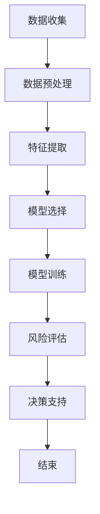
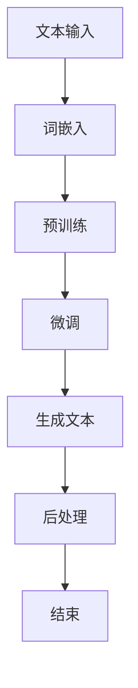
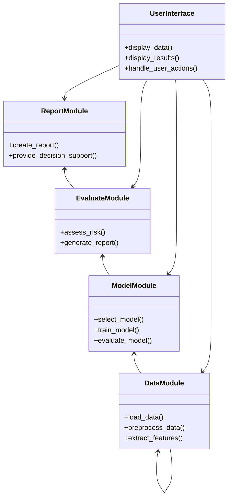
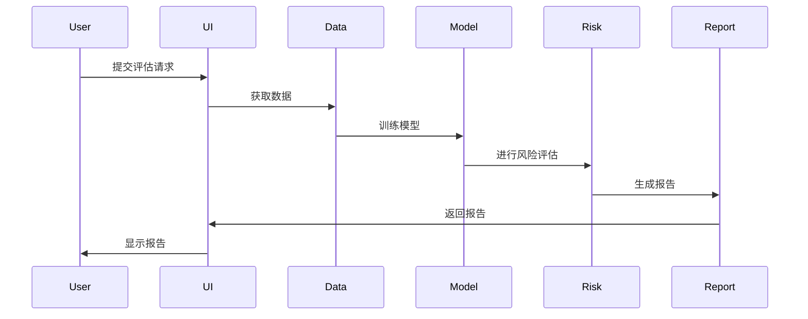

                 

# 智能风险评估AI Agent：LLM在金融领域的应用

关键词：金融领域、智能风险评估、AI Agent、大型语言模型（LLM）

摘要：本文旨在探讨智能风险评估AI Agent在金融领域的应用。首先，我们将介绍金融领域中风险评估的需求和重要性，以及AI Agent和LLM的核心概念。接着，我们通过一步步的逻辑推理，深入解析AI Agent和LLM的原理，并在金融领域中的应用。此外，本文还将通过一个具体的案例，展示智能风险评估AI Agent的实际应用效果，并提供项目实战的经验和反思。

## 目录大纲

### 第一部分：问题背景与核心概念

- 1.1 问题背景
  - 1.1.1 金融领域的风险评估需求
  - 1.1.2 智能化风险评估的重要性
  - 1.1.3 AI Agent在金融领域的应用

- 1.2 核心概念
  - 1.2.1 智能风险评估的定义
  - 1.2.2 AI Agent的概念与特点
  - 1.2.3 LLM（大型语言模型）的作用

- 1.3 概念联系
  - 1.3.1 智能风险评估与AI Agent的关系
  - 1.3.2 LLM在智能风险评估中的应用

- 1.4 边界与外延
  - 1.4.1 智能风险评估的适用范围
  - 1.4.2 AI Agent的技术边界
  - 1.4.3 LLM的发展趋势与挑战

- 1.5 本章小结

### 第二部分：核心概念与原理

- 2.1 AI Agent原理
  - 2.1.1 AI Agent的定义
  - 2.1.2 AI Agent的核心特点
  - 2.1.3 AI Agent的分类

- 2.2 LLM原理
  - 2.2.1 LLM的定义
  - 2.2.2 LLM的构成
  - 2.2.3 LLM的工作原理

- 2.3 智能风险评估原理
  - 2.3.1 智能风险评估的基本流程
  - 2.3.2 智能风险评估的方法与技术
  - 2.3.3 智能风险评估的优势

- 2.4 概念属性特征对比
  - 2.4.1 AI Agent与LLM的属性特征对比
  - 2.4.2 智能风险评估与传统风险评估的对比

- 2.5 ER实体关系图架构
  - 2.5.1 ER实体关系图的基本概念
  - 2.5.2 智能风险评估领域的ER实体关系图

- 2.6 本章小结

### 第三部分：算法原理与实践

- 3.1 算法原理
  - 3.1.1 智能风险评估算法概述
  - 3.1.2 LLM算法原理解析
  - 3.1.3 智能风险评估算法的具体实现

- 3.2 数学模型与公式
  - 3.2.1 智能风险评估的数学模型
  - 3.2.2 LLM模型的数学公式
  - 3.2.3 算法原理的数学推导

- 3.3 Mermaid算法流程图
  - 3.3.1 智能风险评估算法流程图
  - 3.3.2 LLM算法流程图

- 3.4 Python源代码详解
  - 3.4.1 源代码结构与模块
  - 3.4.2 关键代码解读
  - 3.4.3 算法运行效果分析

- 3.5 举例说明
  - 3.5.1 算法应用案例
  - 3.5.2 案例分析
  - 3.5.3 结果展示与讨论

- 3.6 本章小结

### 第四部分：系统分析与架构设计

- 4.1 项目介绍
  - 4.1.1 项目背景
  - 4.1.2 项目目标
  - 4.1.3 项目实施范围

- 4.2 系统功能设计
  - 4.2.1 功能模块划分
  - 4.2.2 领域模型类图

- 4.3 系统架构设计
  - 4.3.1 系统架构概述
  - 4.3.2 架构层次划分
  - 4.3.3 关键模块介绍

- 4.4 系统接口设计
  - 4.4.1 接口规范
  - 4.4.2 接口实现
  - 4.4.3 接口测试

- 4.5 系统交互序列图
  - 4.5.1 系统交互概述
  - 4.5.2 交互序列图展示
  - 4.5.3 交互分析

- 4.6 本章小结

### 第五部分：项目实战与案例分析

- 5.1 环境安装
  - 5.1.1 环境要求
  - 5.1.2 环境配置
  - 5.1.3 常见问题与解决方案

- 5.2 系统核心实现
  - 5.2.1 模块实现概述
  - 5.2.2 关键代码实现
  - 5.2.3 实现细节分析

- 5.3 代码应用解读与分析
  - 5.3.1 代码结构解读
  - 5.3.2 应用场景分析
  - 5.3.3 性能优化策略

- 5.4 实际案例分析与讲解
  - 5.4.1 案例背景
  - 5.4.2 案例实施步骤
  - 5.4.3 案例结果展示

- 5.5 项目小结
  - 5.5.1 项目总结
  - 5.5.2 项目经验与反思
  - 5.5.3 拓展思考

- 5.6 本章小结

---

### 1.1 问题背景

在金融领域，风险评估是一项至关重要的任务，它涉及对潜在风险的分析、预测和管理。随着金融市场复杂性的增加和交易频率的提升，传统的风险评估方法已无法满足现代金融业务的快速发展和需求。因此，引入智能化工具，如AI Agent和大型语言模型（LLM），对于提高风险评估的准确性和效率具有重要意义。

**1.1.1 金融领域的风险评估需求**

金融领域的风险评估需求可以归纳为以下几点：

1. **风险识别**：通过识别潜在的风险因素，如市场波动、信用风险、操作风险等，为后续的风险评估和管理提供基础。
2. **风险预测**：基于历史数据和当前市场状况，预测未来可能出现的风险，为决策提供数据支持。
3. **风险量化**：将识别和预测到的风险进行量化，以便更好地理解风险的严重程度和影响范围。
4. **风险控制**：制定相应的风险控制措施，降低风险发生的可能性和影响。

**1.1.2 智能化风险评估的重要性**

随着金融市场的不断变化，传统的风险评估方法逐渐暴露出以下不足：

1. **数据依赖性高**：传统风险评估方法往往依赖于历史数据和统计模型，而金融市场的变化速度极快，使得这些方法难以适应新的风险状况。
2. **分析深度不足**：传统方法更多关注于表面的风险因素，而未能深入挖掘潜在的、复杂的风险关系。
3. **响应速度慢**：当风险事件发生时，传统方法可能无法及时响应，导致风险扩大。

因此，智能化风险评估方法，如AI Agent和LLM，具有以下优势：

1. **适应性强**：AI Agent和LLM能够处理大量数据，并且能够快速适应市场变化。
2. **分析深度**：AI Agent和LLM能够通过深度学习等技术，挖掘潜在的风险因素和复杂的关系。
3. **响应速度快**：AI Agent和LLM能够在风险事件发生的第一时间进行分析和响应，降低风险损失。

**1.1.3 AI Agent在金融领域的应用**

AI Agent是一种基于人工智能的自主决策系统，能够在没有人类干预的情况下，执行特定的任务。在金融领域，AI Agent的应用场景包括：

1. **自动交易**：AI Agent可以分析市场数据，并自动执行交易策略，提高交易效率和收益。
2. **风险管理**：AI Agent可以实时监控市场风险，并自动采取相应的风险控制措施。
3. **客户服务**：AI Agent可以处理大量的客户咨询，提高客户服务质量。

**1.2 核心概念**

**1.2.1 智能风险评估的定义**

智能风险评估是指利用人工智能技术，特别是AI Agent和LLM，对金融风险进行识别、预测、量化和管理的过程。

**1.2.2 AI Agent的概念与特点**

AI Agent是一种基于人工智能的自主决策系统，具有以下特点：

1. **自主学习**：AI Agent能够通过学习历史数据和用户行为，不断提高自身的决策能力。
2. **自主决策**：AI Agent能够在没有人类干预的情况下，根据当前情况和目标，自动做出决策。
3. **适应性强**：AI Agent能够快速适应新的环境和任务，提高工作效率。

**1.2.3 LLM（大型语言模型）的作用**

LLM是一种基于深度学习的大型语言模型，能够理解和生成自然语言文本。在智能风险评估中，LLM的作用包括：

1. **数据处理**：LLM能够处理大量的文本数据，提取关键信息和关系。
2. **自然语言理解**：LLM能够理解用户输入的自然语言文本，并生成相应的回复。
3. **文本生成**：LLM能够根据输入的文本，生成相关的文本内容，如报告、分析等。

**1.3 概念联系**

**1.3.1 智能风险评估与AI Agent的关系**

智能风险评估是AI Agent在金融领域的一个具体应用。AI Agent通过学习历史数据和用户需求，能够对金融风险进行识别、预测和管理，从而提高风险评估的准确性和效率。

**1.3.2 LLM在智能风险评估中的应用**

LLM在智能风险评估中起到关键作用。首先，LLM能够处理大量的文本数据，提取关键信息和关系。其次，LLM能够理解用户输入的自然语言文本，并生成相应的回复和分析报告。这使得智能风险评估系统能够更好地与用户互动，提供更准确和及时的风险评估服务。

**1.3.3 金融领域中的其他相关概念**

除了智能风险评估和AI Agent，金融领域中还有其他一些相关概念，如：

1. **大数据**：大数据技术在金融领域中广泛应用，用于处理和分析海量金融数据。
2. **机器学习**：机器学习是人工智能的一个分支，用于构建和训练预测模型。
3. **区块链**：区块链技术具有去中心化、安全等特点，在金融领域中具有广泛的应用前景。

**1.4 边界与外延**

**1.4.1 智能风险评估的适用范围**

智能风险评估适用于金融领域的各个方面，如股票市场、债券市场、衍生品市场等。它可以用于风险识别、风险预测、风险量化和风险控制等环节。

**1.4.2 AI Agent的技术边界**

AI Agent的技术边界主要受限于人工智能技术的发展水平。目前，AI Agent已经能够处理复杂的任务，但仍然存在一些挑战，如自主学习和决策能力的提升、处理非结构化数据的能力等。

**1.4.3 LLM的发展趋势与挑战**

LLM的发展趋势包括：

1. **模型规模扩大**：随着计算能力的提升，LLM的模型规模将不断增大，使其能够处理更复杂的任务。
2. **多语言支持**：LLM将支持更多的语言，使其能够在全球范围内广泛应用。
3. **更高效的推理能力**：LLM将通过优化算法和架构，提高推理效率，满足实时需求。

但LLM也面临一些挑战，如：

1. **数据隐私**：LLM需要处理大量的用户数据，数据隐私保护成为重要问题。
2. **模型解释性**：如何让LLM的决策过程更透明、可解释，是当前研究的重点。

**1.5 本章小结**

本章介绍了金融领域中智能风险评估的需求和重要性，以及AI Agent和LLM的核心概念。通过分析，我们发现AI Agent和LLM在智能风险评估中具有重要作用，能够提高风险评估的准确性和效率。同时，我们也明确了智能风险评估的适用范围和LLM的发展趋势与挑战。在接下来的章节中，我们将深入探讨AI Agent和LLM的原理和实际应用。## 第一部分：问题背景与核心概念

### 1.2 核心概念

在深入探讨智能风险评估AI Agent在金融领域的应用之前，我们需要首先了解几个关键概念：智能风险评估、AI Agent以及LLM（大型语言模型）。这些概念是构建和实现智能风险评估系统的基础。

**1.2.1 智能风险评估的定义**

智能风险评估是一种利用先进的人工智能技术和算法，对金融领域中的各种风险进行定量和定性分析的方法。它不仅包括对传统金融风险的识别、预测和量化，还引入了机器学习、深度学习等人工智能技术，以实现更精准、高效的风险评估。

智能风险评估的核心目标是通过分析大量的历史数据、实时信息和复杂的金融环境，为金融机构提供决策支持，降低风险暴露，优化投资组合，并提高市场竞争力。

**1.2.2 AI Agent的概念与特点**

AI Agent，即人工智能代理，是指一种具有自主决策能力的计算机程序，它可以在没有人类干预的情况下，根据预设的目标和环境信息，采取行动并解决问题。AI Agent在金融领域的应用非常广泛，例如在自动交易、风险管理、合规检查等方面。

AI Agent的特点包括：

1. **自主学习能力**：AI Agent可以通过机器学习算法，从历史数据和经验中学习，不断优化其决策能力。
2. **自主决策**：AI Agent可以根据环境变化和目标要求，自动做出决策，减少人工干预。
3. **实时响应**：AI Agent能够实时处理和分析大量数据，快速响应市场变化。
4. **适应性强**：AI Agent可以适应不同的应用场景和业务需求，具有较强的通用性。

**1.2.3 LLM（大型语言模型）的作用**

LLM，即大型语言模型，是一种基于深度学习的语言处理模型，它通过学习海量的文本数据，能够理解、生成和翻译自然语言。在智能风险评估中，LLM主要承担以下作用：

1. **数据处理**：LLM能够处理和分析大量的文本数据，包括市场报告、新闻资讯、历史交易数据等，提取有价值的信息。
2. **自然语言理解**：LLM可以理解自然语言输入，如投资者的查询、分析报告的要求等，并生成相应的回应。
3. **文本生成**：LLM可以根据输入的文本提示，生成相关的文本内容，如风险评估报告、投资建议等。

LLM在金融领域的应用还包括：

1. **风险识别**：通过分析市场文本数据，LLM可以识别潜在的市场风险因素。
2. **趋势预测**：LLM可以通过学习历史市场数据和文本，预测市场趋势和价格变化。
3. **客户服务**：LLM可以用于构建智能客服系统，回答投资者的问题，提供投资建议。

**1.3 概念联系**

**1.3.1 智能风险评估与AI Agent的关系**

智能风险评估与AI Agent之间存在密切的联系。AI Agent是智能风险评估系统的核心组件，它负责执行风险评估的任务。具体来说：

1. **数据处理**：AI Agent通过收集、处理和存储大量金融数据，为智能风险评估提供数据支持。
2. **风险分析**：AI Agent利用机器学习算法和LLM，对金融数据进行分析，识别潜在风险。
3. **决策支持**：AI Agent根据风险评估结果，提供决策支持，如制定风险管理策略、调整投资组合等。

**1.3.2 LLM在智能风险评估中的应用**

LLM在智能风险评估中起到关键作用。它不仅能够处理大量的文本数据，还能提供强大的自然语言处理能力，具体应用包括：

1. **文本分析**：LLM可以分析市场新闻、报告等文本数据，提取关键信息，帮助识别潜在风险。
2. **趋势预测**：通过学习历史市场数据和文本，LLM可以预测市场趋势和价格变化，为风险评估提供依据。
3. **客户交互**：LLM可以构建智能客服系统，与投资者进行自然语言交互，提供风险评估报告和投资建议。

**1.3.3 金融领域中的其他相关概念**

除了智能风险评估和AI Agent，金融领域中还有其他一些相关概念，如：

1. **大数据**：大数据技术在金融领域中广泛应用，用于处理和分析海量金融数据，为智能风险评估提供数据基础。
2. **机器学习**：机器学习是智能风险评估的重要技术基础，用于构建预测模型和决策支持系统。
3. **区块链**：区块链技术具有去中心化、安全等特点，在金融领域中具有广泛的应用前景，如提高交易透明度和安全性。

**1.4 边界与外延**

**1.4.1 智能风险评估的适用范围**

智能风险评估适用于金融领域的各个方面，包括：

1. **金融市场**：对股票、债券、外汇等金融资产进行风险评估。
2. **金融机构**：对银行、保险、证券等金融机构的风险管理提供支持。
3. **投资组合**：对投资者的投资组合进行风险评估，优化投资策略。

**1.4.2 AI Agent的技术边界**

AI Agent的技术边界主要受限于以下几个方面：

1. **数据处理能力**：AI Agent需要处理大量金融数据，这要求其具备强大的计算能力。
2. **算法复杂度**：AI Agent的算法需要复杂且高效，以应对金融市场的复杂性。
3. **自适应能力**：AI Agent需要具备良好的自适应能力，以应对不断变化的市场环境。

**1.4.3 LLM的发展趋势与挑战**

LLM的发展趋势包括：

1. **模型规模扩大**：随着计算能力的提升，LLM的模型规模将不断增大，使其能够处理更复杂的任务。
2. **多语言支持**：LLM将支持更多的语言，使其能够在全球范围内广泛应用。
3. **更高效的推理能力**：LLM将通过优化算法和架构，提高推理效率，满足实时需求。

但LLM也面临一些挑战，如：

1. **数据隐私**：LLM需要处理大量的用户数据，数据隐私保护成为重要问题。
2. **模型解释性**：如何让LLM的决策过程更透明、可解释，是当前研究的重点。

**1.5 本章小结**

本章介绍了金融领域中智能风险评估的需求和重要性，以及AI Agent和LLM的核心概念。通过分析，我们发现AI Agent和LLM在智能风险评估中具有重要作用，能够提高风险评估的准确性和效率。同时，我们也明确了智能风险评估的适用范围和LLM的发展趋势与挑战。在接下来的章节中，我们将深入探讨AI Agent和LLM的原理和实际应用。

---

### 2.1 AI Agent原理

**2.1.1 AI Agent的定义**

AI Agent，即人工智能代理，是指一种具有自主决策能力的人工智能实体。它能够在没有人类干预的情况下，通过感知环境、制定策略、执行任务，并不断学习优化自身表现。AI Agent的设计理念源于自主智能体（Autonomous Agent）的概念，旨在实现智能体的自主性、自适应性和自组织性。

**2.1.2 AI Agent的核心特点**

AI Agent具有以下几个核心特点：

1. **自主性**：AI Agent能够自主地感知环境，制定策略，并独立执行任务，无需人类干预。
2. **适应性**：AI Agent能够根据环境变化和任务需求，自适应地调整策略和行动方案，提高任务成功率。
3. **自学习**：AI Agent能够通过学习算法，从经验和数据中不断学习，优化自身行为和决策能力。
4. **智能化**：AI Agent通过集成多种人工智能技术，如机器学习、自然语言处理、计算机视觉等，实现智能化的感知、理解和决策。

**2.1.3 AI Agent的分类**

根据应用场景和技术特点，AI Agent可以分为以下几类：

1. **任务型AI Agent**：这类AI Agent专注于执行特定任务，如自动化交易、自动驾驶、智能客服等。它们通常具有明确的任务目标，并通过预先定义的算法和策略进行操作。

2. **交互型AI Agent**：这类AI Agent与人类或其他智能体进行交互，如智能语音助手、社交机器人等。它们具备自然语言处理和对话管理能力，能够理解用户的意图，并生成适当的回应。

3. **情境型AI Agent**：这类AI Agent在复杂的动态环境中，通过感知环境和交互数据，进行动态决策和任务规划。例如，智能家居系统中的AI Agent可以根据家庭成员的行为模式，自动调整家庭设备的状态。

**2.1.4 AI Agent的工作原理**

AI Agent的工作原理通常包括以下几个步骤：

1. **感知**：AI Agent通过传感器、摄像头、麦克风等设备，感知环境中的各种信息，如温度、光线、声音、图像等。

2. **信息处理**：AI Agent利用计算机视觉、自然语言处理等技术，对感知到的信息进行理解和分析，提取关键特征和模式。

3. **决策制定**：AI Agent基于预定的目标、策略和当前环境状态，通过决策算法（如机器学习模型、规划算法等）制定行动方案。

4. **执行**：AI Agent根据制定的行动方案，通过执行器（如电机、显示屏、扬声器等）执行具体的操作。

5. **反馈**：AI Agent在执行任务后，收集执行结果和环境反馈，用于评估任务完成情况和优化决策。

**2.1.5 AI Agent的优势**

AI Agent在金融领域的应用具有以下几个优势：

1. **高效性**：AI Agent能够自动处理大量数据，执行复杂任务，提高工作效率。
2. **精确性**：AI Agent通过机器学习和自然语言处理技术，能够更精确地分析市场数据，预测风险。
3. **适应性**：AI Agent能够根据市场环境变化，动态调整策略，适应不同场景。
4. **稳定性**：AI Agent不会受到情绪波动和疲劳等因素的影响，保持稳定的工作状态。
5. **扩展性**：AI Agent的设计原则支持模块化和扩展性，便于集成新的技术和功能。

**2.1.6 AI Agent的局限性**

尽管AI Agent在金融领域具有广泛应用前景，但它也面临一些局限性：

1. **数据依赖**：AI Agent的性能很大程度上依赖于数据质量和数量，数据不足或质量差会影响其决策准确性。
2. **算法复杂性**：AI Agent的算法复杂度高，需要大量计算资源和时间进行训练和优化。
3. **解释性不足**：AI Agent的决策过程往往是黑箱化的，难以解释，这可能导致信任问题。
4. **适应性限制**：AI Agent可能在特定环境或任务上表现良好，但在其他环境中可能缺乏适应性。
5. **伦理问题**：AI Agent的决策可能涉及伦理和道德问题，如自动化交易中的风险控制和安全问题。

**2.1.7 AI Agent的发展趋势**

随着人工智能技术的不断发展，AI Agent在金融领域的应用趋势包括：

1. **智能化升级**：AI Agent将通过深度学习和强化学习等新技术，实现更高的智能化水平。
2. **多模态感知**：AI Agent将集成多模态感知技术，如语音、图像、文本等，提高环境理解和决策能力。
3. **自适应优化**：AI Agent将通过自适应算法，动态调整策略和行动方案，提高任务成功率。
4. **分布式计算**：AI Agent将利用分布式计算和边缘计算技术，实现更高效的资源利用和响应速度。
5. **跨领域应用**：AI Agent将扩展到更多金融领域，如风险管理、合规检查、客户服务等。

**2.1.8 AI Agent的技术挑战**

AI Agent在金融领域的发展也面临一些技术挑战：

1. **算法优化**：如何优化AI Agent的算法，提高其性能和效率，是当前研究的重要方向。
2. **数据隐私**：如何保护用户数据和交易隐私，确保AI Agent的安全性和可靠性，是一个亟待解决的问题。
3. **模型解释性**：如何提高AI Agent的决策过程透明度和解释性，增强用户对AI Agent的信任。
4. **系统集成**：如何将AI Agent与其他金融系统（如交易系统、风控系统等）有效集成，实现无缝协同。
5. **伦理规范**：如何制定相应的伦理规范和法律法规，确保AI Agent在金融领域的合法合规应用。

**2.1.9 本章小结**

本章详细介绍了AI Agent的定义、核心特点、分类、工作原理、优势、局限性、发展趋势和技术挑战。通过这些内容，我们可以看到AI Agent在金融领域具有巨大的应用潜力，但也需要克服一系列技术挑战。在接下来的章节中，我们将进一步探讨LLM（大型语言模型）的原理和应用，为智能风险评估AI Agent的深入研究和应用奠定基础。

### 2.2 LLM原理

**2.2.1 LLM的定义**

LLM，即大型语言模型（Large Language Model），是一种基于深度学习技术的自然语言处理（Natural Language Processing, NLP）模型，它能够对大量文本数据进行训练，从而实现对自然语言的生成、理解和翻译。LLM通常由数百万至数十亿个参数组成，通过这些参数，模型能够捕捉到文本中的复杂模式和语义信息。

**2.2.2 LLM的构成**

LLM的构成主要包括以下几个关键部分：

1. **输入层**：输入层负责接收自然语言文本，并将其转换为模型可以处理的格式。这一过程通常涉及分词、词嵌入等技术。

2. **隐藏层**：隐藏层是LLM的核心部分，它由多个神经网络层组成，每层都能够学习到文本的不同层次特征。这些特征包括词级别、句子级别和段落级别的信息。

3. **输出层**：输出层通常是一个全连接层，负责将隐藏层中的特征映射到最终的输出结果，如文本生成、分类或翻译。

4. **优化器**：优化器是用于调整模型参数的算法，常用的优化器包括随机梯度下降（SGD）、Adam等。通过优化器，模型能够在训练过程中不断调整参数，以最小化损失函数。

**2.2.3 LLM的工作原理**

LLM的工作原理可以概括为以下几个步骤：

1. **文本预处理**：在训练之前，需要对输入文本进行预处理，包括分词、去除停用词、词干提取等操作。这些预处理步骤有助于简化文本结构，提高模型的学习效率。

2. **词嵌入**：将预处理后的文本转换为词嵌入向量。词嵌入是将单词映射到高维空间中的向量，这些向量能够保留单词的语义信息。常用的词嵌入技术包括Word2Vec、GloVe等。

3. **神经网络训练**：利用神经网络对词嵌入向量进行训练。训练过程中，模型通过优化器调整参数，以最小化预测误差。常用的神经网络结构包括Transformer、BERT、GPT等。

4. **文本生成**：在生成文本时，LLM根据输入的提示文本，逐个生成单词或句子。生成过程通过预测下一个最可能的单词或句子，并不断更新输入文本。

5. **后处理**：生成的文本可能包含语法错误或不合适的表达，因此需要通过后处理步骤进行优化。后处理包括语法检查、标点符号添加、文本格式调整等。

**2.2.4 LLM的优势**

LLM在自然语言处理领域具有以下优势：

1. **强大的文本理解能力**：通过学习大量文本数据，LLM能够理解文本中的复杂模式和语义信息，实现高质量的自然语言生成和理解。

2. **自适应性强**：LLM可以根据不同的应用场景和需求，自适应地调整其行为和输出，满足多样化的需求。

3. **高效性**：LLM的并行计算能力使得它在处理大规模文本数据时，具有较高的效率。

4. **多语言支持**：LLM可以通过跨语言训练，实现多种语言的文本生成和理解。

**2.2.5 LLM的挑战**

尽管LLM在自然语言处理领域取得了显著成就，但仍然面临以下挑战：

1. **计算资源需求**：训练大型LLM模型需要大量的计算资源和时间，这对硬件和软件设施提出了较高要求。

2. **数据隐私问题**：LLM在训练过程中需要处理大量用户数据，数据隐私保护成为关键问题。

3. **模型解释性**：LLM的决策过程通常是黑箱化的，难以解释，这可能导致用户对模型的不信任。

4. **泛化能力**：虽然LLM在特定任务上表现优秀，但其泛化能力仍有待提高，特别是在处理新领域或新任务时。

5. **伦理和道德问题**：LLM在文本生成和理解过程中，可能涉及伦理和道德问题，如虚假信息的传播、歧视性言论等。

**2.2.6 LLM的应用场景**

LLM在自然语言处理领域具有广泛的应用场景，包括：

1. **文本生成**：如自动写作、聊天机器人、语音助手等。

2. **文本分类**：如垃圾邮件检测、情感分析、新闻分类等。

3. **文本翻译**：如机器翻译、跨语言文本分析等。

4. **问答系统**：如智能客服、知识图谱问答等。

5. **摘要生成**：如新闻摘要、文章摘要等。

6. **对话系统**：如聊天机器人、虚拟助手等。

**2.2.7 本章小结**

本章详细介绍了LLM的定义、构成、工作原理、优势、挑战和应用场景。通过这些内容，我们可以看到LLM在自然语言处理领域具有巨大的应用潜力，但也需要解决一系列技术挑战。在接下来的章节中，我们将进一步探讨智能风险评估的基本原理、方法和优势，并对比智能风险评估与传统风险评估的差异。这将帮助我们更好地理解智能风险评估AI Agent在金融领域的实际应用。

### 2.3 智能风险评估原理

**2.3.1 智能风险评估的基本流程**

智能风险评估的基本流程通常包括以下几个步骤：

1. **数据收集**：首先，智能风险评估系统需要收集相关的金融数据，包括历史交易数据、市场行情数据、宏观经济数据等。这些数据可以通过各种数据源获取，如交易所、金融市场数据提供商、新闻报道等。

2. **数据预处理**：收集到的数据通常包含噪声和不完整信息，因此需要通过数据清洗、去重、填充缺失值等预处理步骤，确保数据的质量和一致性。

3. **特征提取**：在预处理完成后，系统需要对数据进行特征提取。特征提取是将原始数据转化为能够反映风险特征的数值表示。常见的特征提取方法包括统计特征、文本特征、图像特征等。

4. **风险建模**：基于提取到的特征，系统使用机器学习算法构建风险预测模型。这些模型可以是分类模型、回归模型、时间序列模型等，根据具体的风险类型和应用需求进行选择。

5. **模型训练与优化**：使用历史数据对风险预测模型进行训练，并通过交叉验证等技术优化模型参数，以提高模型的预测准确性。

6. **风险评估**：在模型训练完成后，系统使用训练好的模型对新的数据进行风险评估。风险评估包括对风险因素的识别、风险程度评估和风险预警等。

7. **决策支持**：根据风险评估结果，系统可以为金融机构提供决策支持，如风险控制策略、投资建议、调整投资组合等。

**2.3.2 智能风险评估的方法与技术**

智能风险评估的方法和技术主要包括以下几种：

1. **机器学习算法**：机器学习算法是智能风险评估的核心技术。常见的机器学习算法包括线性回归、逻辑回归、决策树、随机森林、支持向量机、神经网络等。这些算法可以用于分类、回归和聚类等任务，帮助识别和量化风险。

2. **深度学习技术**：深度学习技术，特别是卷积神经网络（CNN）和循环神经网络（RNN），在处理高维数据和复杂特征方面具有显著优势。深度学习模型如BERT、GPT、Transformer等在自然语言处理和图像识别等领域取得了突破性成果，也逐步应用于智能风险评估。

3. **时间序列分析**：时间序列分析是处理金融市场数据的常用方法，它可以捕捉金融时间序列的动态变化和趋势。常见的模型包括ARIMA、GARCH、SARIMA等，这些模型可以用于预测市场走势和风险。

4. **文本分析**：文本分析技术可以用于处理金融文本数据，如新闻报道、公告、社交媒体帖子等。通过自然语言处理（NLP）技术，可以提取文本中的关键信息，分析市场情绪和潜在风险。

5. **大数据技术**：大数据技术用于处理和分析海量金融数据，包括实时数据和历史数据。Hadoop、Spark等大数据平台可以高效地处理大规模数据，为智能风险评估提供数据支持。

6. **区块链技术**：区块链技术具有去中心化、不可篡改的特点，在金融领域有广泛的应用。智能合约、分布式账本等技术可以用于提高金融交易的透明度和安全性，为智能风险评估提供基础。

**2.3.3 智能风险评估的优势**

智能风险评估相比传统风险评估方法具有以下优势：

1. **高准确性**：智能风险评估通过机器学习和深度学习算法，能够处理大量复杂的数据，提高风险评估的准确性。

2. **实时性**：智能风险评估系统能够实时处理和分析数据，快速识别和响应市场变化，提供及时的风险预警。

3. **自动化**：智能风险评估系统可以自动化执行风险评估任务，减少人工干预，提高工作效率。

4. **适应性**：智能风险评估系统可以根据不同环境和需求，自适应调整模型和策略，提高风险评估的适应性。

5. **全面性**：智能风险评估不仅考虑传统的金融风险因素，还结合文本分析和大数据技术，能够更全面地识别和评估风险。

6. **降低成本**：通过自动化和高效的数据处理，智能风险评估可以显著降低人力资源和计算资源的成本。

**2.3.4 智能风险评估与传统风险评估的对比**

传统风险评估方法和智能风险评估方法在以下几个方面存在对比：

1. **数据依赖性**：传统风险评估方法主要依赖历史数据和统计模型，而智能风险评估则利用机器学习和深度学习算法，能够处理更多类型和更大规模的数据。

2. **分析深度**：传统风险评估方法更多关注表面的风险因素，而智能风险评估通过深度学习技术，能够挖掘潜在的风险关系和复杂模式。

3. **响应速度**：传统风险评估方法可能需要较长时间来分析和处理数据，而智能风险评估系统能够快速响应市场变化，提供及时的风险预警。

4. **自动化程度**：传统风险评估方法需要大量人工干预，而智能风险评估系统能够自动化执行风险评估任务，减少人工工作量。

5. **解释性**：传统风险评估方法的决策过程通常较难解释，而智能风险评估系统虽然也存在解释性问题，但可以通过模型解释技术和透明化设计，提高决策过程的可解释性。

**2.3.5 本章小结**

本章详细介绍了智能风险评估的基本原理、流程、方法和技术，以及智能风险评估与传统风险评估的对比。通过这些内容，我们可以看到智能风险评估在金融领域具有显著的优势和广阔的应用前景。在接下来的章节中，我们将进一步探讨智能风险评估AI Agent的算法原理和实际应用，深入理解其在金融风险评估中的关键作用。

### 2.4 概念属性特征对比

**2.4.1 AI Agent与LLM的属性特征对比**

为了更好地理解AI Agent与LLM在智能风险评估中的作用，我们首先对比两者的属性特征。

| 特征 | AI Agent | LLM |
| --- | --- | --- |
| **定义** | 具有自主决策能力的人工智能实体 | 基于深度学习的大型自然语言处理模型 |
| **核心功能** | 感知环境、自主决策、执行任务 | 文本生成、理解和翻译 |
| **学习方式** | 自主学习，从数据中优化决策能力 | 监督学习，从文本数据中学习语义信息 |
| **应用场景** | 任务型、交互型、情境型 | 文本生成、文本分类、文本翻译等 |
| **优势** | 高效性、精确性、适应性、稳定性 | 强大的文本理解能力、自适应性强、高效性、多语言支持 |
| **挑战** | 数据依赖、算法复杂性、解释性不足、伦理问题 | 计算资源需求、数据隐私问题、模型解释性、泛化能力 |
| **技术基础** | 机器学习、计算机视觉、自然语言处理 | 深度学习、神经网络、自然语言处理 |

从上表可以看出，AI Agent和LLM在功能、学习方式、应用场景、优势和挑战等方面存在显著差异。AI Agent更侧重于自主决策和任务执行，而LLM则专注于文本处理和理解。

**2.4.2 智能风险评估与传统风险评估的对比**

接下来，我们对比智能风险评估与传统风险评估在以下几个方面：

| 特征 | 传统风险评估 | 智能风险评估 |
| --- | --- | --- |
| **数据依赖性** | 主要依赖历史数据和统计模型 | 利用机器学习和深度学习，处理更多类型和更大规模的数据 |
| **分析深度** | 更多关注表面的风险因素 | 深度挖掘潜在的风险关系和复杂模式 |
| **响应速度** | 需要较长时间分析数据 | 快速响应市场变化，提供及时的风险预警 |
| **自动化程度** | 需要大量人工干预 | 自动化执行风险评估任务，提高工作效率 |
| **解释性** | 决策过程较难解释 | 虽然存在解释性问题，但可以通过模型解释技术和透明化设计提高可解释性 |
| **成本** | 高人力资源成本 | 降低人力资源和计算资源成本 |

通过对比可以发现，智能风险评估在数据处理能力、分析深度、响应速度、自动化程度和成本等方面具有显著优势。然而，智能风险评估也面临数据依赖性、算法复杂性、模型解释性和伦理问题等挑战。

**2.4.3 概念联系与扩展**

AI Agent和LLM在智能风险评估中扮演着不同但互补的角色。AI Agent负责执行风险评估任务，如数据收集、预处理、特征提取、模型训练等，而LLM则负责文本理解和生成，如市场报告、风险评估报告、投资建议等。两者结合，可以实现更全面、准确和高效的风险评估。

此外，智能风险评估还可以结合其他技术，如大数据、区块链等，进一步扩展其应用范围和功能。例如，大数据技术可以提供更丰富的数据来源和更全面的数据分析，而区块链技术可以提高金融交易的透明度和安全性。

**2.4.4 本章小结**

本章通过对比AI Agent与LLM的属性特征，以及智能风险评估与传统风险评估的异同，深入分析了两者在智能风险评估中的作用和优势。通过这些分析，我们可以更全面地理解智能风险评估的技术框架和应用潜力。在接下来的章节中，我们将进一步探讨智能风险评估AI Agent的具体实现，包括算法原理、数学模型、流程图和Python源代码详解。

### 2.5 ER实体关系图架构

**2.5.1 ER实体关系图的基本概念**

实体关系图（Entity-Relationship Diagram，ERD）是一种用于描述数据库中实体及其相互关系的图形表示方法。它由实体、属性和关系三个基本组成部分构成：

- **实体**：代表数据库中的对象或概念，如客户、订单、产品等。
- **属性**：描述实体的具体特征，如客户的名字、地址、电话等。
- **关系**：描述实体之间的关联，如客户可以下订单、订单包含产品等。

**2.5.2 智能风险评估领域的ER实体关系图**

在智能风险评估领域，ER实体关系图可以帮助我们理解系统中各个实体及其相互关系。以下是一个简化的智能风险评估系统ER实体关系图的例子：

1. **实体**：
   - 风险因素（RiskFactor）
   - 风险指标（RiskIndicator）
   - 风险事件（RiskEvent）
   - 投资组合（Portfolio）
   - 投资者（Investor）

2. **属性**：
   - 风险因素：类型、影响程度、发生频率
   - 风险指标：指标名称、指标值、单位
   - 风险事件：事件名称、发生时间、事件描述
   - 投资组合：组合名称、总投资额、风险等级
   - 投资者：姓名、年龄、投资经验

3. **关系**：
   - 风险因素与风险指标：一个风险因素可以产生多个风险指标
   - 风险事件与风险因素：一个风险事件可能涉及多个风险因素
   - 投资组合与风险事件：一个投资组合可能经历多个风险事件
   - 投资者与投资组合：一个投资者可以持有多个投资组合

以下是一个使用Mermaid语法表示的ER实体关系图：

```mermaid
erDiagram
  RiskFactor ||--|{ RiskIndicator } RiskIndicator
  RiskFactor ||--|{ RiskEvent } RiskEvent
  Portfolio ||--|{ RiskEvent } RiskEvent
  Investor ||--|{ Portfolio } Portfolio
```

在智能风险评估系统中，ER实体关系图有助于我们：

- **理解系统结构**：明确系统中各个实体的定义和关系，便于设计系统架构。
- **数据建模**：基于实体关系图，可以构建数据库模式，实现数据持久化。
- **需求分析**：通过实体关系图，可以更清晰地表达用户需求，便于需求分析和系统设计。

**2.5.3 智能风险评估领域的ER实体关系图**

在智能风险评估的具体应用中，ER实体关系图可以进一步细化，以涵盖更多的实体和关系。以下是一个更详细的智能风险评估领域的ER实体关系图示例：

1. **实体**：
   - 风险因素（RiskFactor）
   - 风险指标（RiskIndicator）
   - 风险事件（RiskEvent）
   - 投资组合（Portfolio）
   - 投资者（Investor）
   - 市场数据（MarketData）
   - 模型参数（ModelParameter）

2. **属性**：
   - 风险因素：类型、影响程度、发生频率
   - 风险指标：指标名称、指标值、单位
   - 风险事件：事件名称、发生时间、事件描述
   - 投资组合：组合名称、总投资额、风险等级
   - 投资者：姓名、年龄、投资经验、风险偏好
   - 市场数据：日期、价格、交易量等
   - 模型参数：模型名称、参数值、参数说明

3. **关系**：
   - 风险因素与风险指标：一个风险因素可以产生多个风险指标
   - 风险事件与风险因素：一个风险事件可能涉及多个风险因素
   - 投资组合与风险事件：一个投资组合可能经历多个风险事件
   - 投资者与投资组合：一个投资者可以持有多个投资组合
   - 模型参数与风险因素：模型参数用于描述风险因素的权重和阈值
   - 模型参数与市场数据：模型参数根据市场数据调整

以下是一个使用Mermaid语法表示的详细ER实体关系图：

```mermaid
erDiagram
  RiskFactor ||--|{ RiskIndicator } RiskIndicator
  RiskFactor ||--|{ RiskEvent } RiskEvent
  Portfolio ||--|{ RiskEvent } RiskEvent
  Investor ||--|{ Portfolio } Portfolio
  MarketData ||--|{ ModelParameter } ModelParameter
  ModelParameter ||--|{ RiskFactor } RiskFactor
```

通过这个详细的ER实体关系图，我们可以更准确地描述智能风险评估系统的结构，为后续的系统设计、数据建模和需求分析提供指导。在接下来的章节中，我们将进一步探讨智能风险评估算法的原理和实践应用，以实现更高效、准确的风险评估。

### 3.1 算法原理

**3.1.1 智能风险评估算法概述**

智能风险评估算法是构建智能风险评估系统的核心。它通过机器学习和深度学习等技术，对大量金融数据进行分析和处理，以识别潜在风险并评估其严重程度。智能风险评估算法通常包括以下几个关键步骤：

1. **数据收集**：收集与风险相关的数据，包括市场数据、历史交易数据、公司财务数据等。
2. **数据预处理**：清洗数据，处理缺失值和异常值，将数据转换为适合模型训练的格式。
3. **特征提取**：从原始数据中提取对风险评估有重要影响的特征，如价格、成交量、财务指标等。
4. **模型选择**：选择合适的机器学习或深度学习模型，如决策树、随机森林、神经网络等。
5. **模型训练**：使用历史数据对模型进行训练，通过优化算法调整模型参数。
6. **风险评估**：使用训练好的模型对新的数据进行分析，评估潜在风险。
7. **决策支持**：根据风险评估结果，提供风险控制策略、投资建议等。

**3.1.2 LLM算法原理解析**

在智能风险评估中，LLM（大型语言模型）是一种重要的技术手段。它通过深度学习算法，对大量文本数据（如新闻、报告、公告等）进行训练，以实现对自然语言的理解和生成。LLM算法原理主要包括以下几个方面：

1. **词嵌入**：将自然语言文本中的单词映射到高维向量空间中，这些向量能够保留单词的语义信息。
2. **神经网络结构**：LLM通常采用深度神经网络结构，如Transformer、BERT、GPT等。这些结构能够处理复杂的语言模式，捕捉长距离依赖关系。
3. **预训练与微调**：LLM通过在大量文本数据上进行预训练，学习到通用的语言规律和模式。然后，通过微调（fine-tuning）过程，使其适应特定的任务和应用场景。
4. **文本生成与理解**：LLM能够根据输入的文本提示，生成相关的文本内容，如报告、分析、投资建议等。同时，它也能够理解自然语言输入，提取关键信息。

**3.1.3 智能风险评估算法的具体实现**

在具体实现智能风险评估算法时，可以采用以下步骤：

1. **数据收集与预处理**：收集与风险评估相关的数据，包括市场数据、公司财务数据、新闻文本等。对数据进行清洗和预处理，包括数据格式统一、缺失值处理、异常值检测等。
2. **特征提取**：从原始数据中提取对风险评估有重要影响的特征，如价格波动、成交量、财务指标等。对于文本数据，可以使用词嵌入技术将文本转换为向量表示。
3. **模型选择与训练**：选择合适的机器学习或深度学习模型，如决策树、随机森林、神经网络、LLM等。使用历史数据对模型进行训练，通过交叉验证等技术优化模型参数。
4. **风险评估**：使用训练好的模型对新的数据进行风险评估，输出风险指标和风险等级。
5. **决策支持**：根据风险评估结果，提供风险控制策略、投资建议等。

**3.1.4 算法流程图**

以下是一个使用Mermaid语法表示的智能风险评估算法流程图：


**3.1.5 Python源代码详解**

下面是一个简单的智能风险评估算法的Python代码示例，用于演示数据预处理、特征提取和风险评估的过程。

```python
import pandas as pd
from sklearn.model_selection import train_test_split
from sklearn.ensemble import RandomForestClassifier
from sklearn.metrics import accuracy_score

# 1. 数据收集与预处理
data = pd.read_csv('financial_data.csv')
data.dropna(inplace=True)  # 删除缺失值
X = data.drop('target', axis=1)  # 特征
y = data['target']  # 标签

# 2. 特征提取
# 这里假设已经完成了特征提取，实际应用中可能需要使用文本处理和数值变换技术

# 3. 模型选择与训练
X_train, X_test, y_train, y_test = train_test_split(X, y, test_size=0.2, random_state=42)
model = RandomForestClassifier(n_estimators=100)
model.fit(X_train, y_train)

# 4. 风险评估
y_pred = model.predict(X_test)
accuracy = accuracy_score(y_test, y_pred)
print(f'Accuracy: {accuracy}')

# 5. 决策支持
# 根据风险评估结果，提供相应的风险控制策略和投资建议
```

**3.1.6 算法原理的数学推导**

智能风险评估算法的数学推导涉及机器学习模型的基础数学知识，包括特征空间、损失函数、优化算法等。以下是一个简化的数学推导示例：

1. **特征空间**：假设我们有一个n维特征空间X，每个特征可以用x_i表示，那么输入数据的向量可以表示为X = [x_1, x_2, ..., x_n]。

2. **损失函数**：假设我们使用逻辑回归模型进行风险评估，损失函数通常为交叉熵损失（Cross-Entropy Loss）：
   \[
   L(\theta) = -\frac{1}{m} \sum_{i=1}^{m} [y^{(i)} \log(\hat{y}^{(i)}) + (1 - y^{(i)}) \log(1 - \hat{y}^{(i)})]
   \]
   其中，\(\theta\) 为模型参数，\(m\) 为样本数量，\(y^{(i)}\) 为第i个样本的真实标签，\(\hat{y}^{(i)}\) 为模型预测的概率。

3. **优化算法**：为了最小化损失函数，我们可以使用梯度下降（Gradient Descent）算法：
   \[
   \theta_j := \theta_j - \alpha \frac{\partial}{\partial \theta_j} L(\theta)
   \]
   其中，\(\alpha\) 为学习率。

通过这些数学推导，我们可以理解智能风险评估算法的基本原理和实现过程。在实际应用中，算法的实现会更加复杂，涉及到多种技术和方法。

**3.1.7 本章小结**

本章详细介绍了智能风险评估算法的原理和实现过程，包括数据收集与预处理、特征提取、模型选择与训练、风险评估和决策支持等步骤。同时，通过Python代码示例和数学推导，我们深入理解了算法的实现细节。在接下来的章节中，我们将进一步探讨LLM算法的具体实现和数学模型，以及实际应用案例。

### 3.2 数学模型与公式

在智能风险评估中，数学模型和公式是核心组成部分，它们帮助我们将复杂的风险因素量化，并转化为可操作的决策依据。以下内容将详细介绍智能风险评估中常用的数学模型和公式。

**3.2.1 智能风险评估的数学模型**

智能风险评估的数学模型通常包括以下几个部分：

1. **概率模型**：用于估计风险事件发生的概率。常见的方法包括贝叶斯模型、逻辑回归模型和生存分析模型。

   - **贝叶斯模型**：
     \[
     P(A|B) = \frac{P(B|A)P(A)}{P(B)}
     \]
     其中，\(P(A|B)\) 是在事件B发生的条件下，事件A发生的条件概率，\(P(B|A)\) 是在事件A发生的条件下，事件B发生的条件概率，\(P(A)\) 和 \(P(B)\) 分别是事件A和事件B的概率。

   - **逻辑回归模型**：
     \[
     \hat{y} = \frac{1}{1 + e^{-(\beta_0 + \beta_1 x_1 + \beta_2 x_2 + ... + \beta_n x_n})}
     \]
     其中，\(\hat{y}\) 是风险事件发生的概率，\(\beta_0, \beta_1, ..., \beta_n\) 是模型参数，\(x_1, x_2, ..., x_n\) 是特征向量。

2. **统计模型**：用于分析风险因素的统计特征，如均值、方差、协方差等。

   - **均值**：
     \[
     \mu = \frac{1}{n} \sum_{i=1}^{n} x_i
     \]
     其中，\(\mu\) 是随机变量的均值，\(n\) 是样本数量，\(x_i\) 是第i个样本值。

   - **方差**：
     \[
     \sigma^2 = \frac{1}{n-1} \sum_{i=1}^{n} (x_i - \mu)^2
     \]
     其中，\(\sigma^2\) 是随机变量的方差，\(\mu\) 是均值，\(n\) 是样本数量。

3. **优化模型**：用于最小化损失函数，优化模型参数。常见的方法包括梯度下降算法和牛顿法。

   - **梯度下降算法**：
     \[
     \theta_j := \theta_j - \alpha \frac{\partial}{\partial \theta_j} J(\theta)
     \]
     其中，\(\theta_j\) 是模型参数，\(\alpha\) 是学习率，\(J(\theta)\) 是损失函数。

**3.2.2 LLM模型的数学公式**

LLM（大型语言模型）的数学模型主要基于深度学习和自然语言处理技术。以下是LLM模型的核心数学公式：

1. **词嵌入**：将单词映射到高维向量空间中。
   \[
   \mathbf{v}_w = \text{Embedding}(\text{word})
   \]
   其中，\(\mathbf{v}_w\) 是单词w的词嵌入向量，\(\text{Embedding}\) 是词嵌入函数。

2. **神经网络**：深度神经网络（DNN）用于处理词嵌入向量，输出预测结果。
   \[
   \hat{y} = \text{softmax}(\text{DNN}(\mathbf{v}_w))
   \]
   其中，\(\hat{y}\) 是预测的概率分布，\(\text{DNN}\) 是深度神经网络，\(\text{softmax}\) 是激活函数。

3. **损失函数**：用于衡量预测结果和真实结果的差距。
   \[
   J = -\sum_{i=1}^{n} y_i \log(\hat{y}_i)
   \]
   其中，\(J\) 是损失函数，\(y_i\) 是第i个样本的真实标签，\(\hat{y}_i\) 是模型对第i个样本的预测概率。

4. **反向传播**：用于计算梯度，更新模型参数。
   \[
   \frac{\partial J}{\partial \theta} = \frac{\partial J}{\partial \hat{y}} \cdot \frac{\partial \hat{y}}{\partial \theta}
   \]
   其中，\(\frac{\partial J}{\partial \theta}\) 是梯度，\(\frac{\partial J}{\partial \hat{y}}\) 是损失函数对预测概率的梯度，\(\frac{\partial \hat{y}}{\partial \theta}\) 是预测概率对模型参数的梯度。

**3.2.3 算法原理的数学推导**

智能风险评估算法的数学推导通常涉及以下步骤：

1. **特征提取**：将原始数据转化为特征向量。
   \[
   \mathbf{x} = \text{FeatureExtractor}(\mathbf{data})
   \]
   其中，\(\mathbf{x}\) 是特征向量，\(\mathbf{data}\) 是原始数据，\(\text{FeatureExtractor}\) 是特征提取函数。

2. **模型训练**：通过梯度下降算法优化模型参数。
   \[
   \theta := \theta - \alpha \frac{\partial}{\partial \theta} J(\theta)
   \]
   其中，\(\theta\) 是模型参数，\(\alpha\) 是学习率，\(J(\theta)\) 是损失函数。

3. **风险评估**：使用训练好的模型对新的数据进行风险评估。
   \[
   \hat{y} = \text{Model}(\mathbf{x})
   \]
   其中，\(\hat{y}\) 是风险预测值，\(\mathbf{x}\) 是特征向量，\(\text{Model}\) 是训练好的模型。

通过这些数学模型和公式，我们可以实现智能风险评估算法，并在金融领域中应用。在接下来的章节中，我们将使用Mermaid工具绘制算法流程图，并进一步探讨算法的具体实现和Python源代码。

### 3.3 Mermaid算法流程图

**3.3.1 智能风险评估算法流程图**

为了更好地理解智能风险评估算法的流程，我们使用Mermaid工具绘制了一个简化的算法流程图。以下是一个使用Mermaid语法表示的智能风险评估算法流程图：



这个流程图描述了智能风险评估算法的基本步骤，包括数据收集、数据预处理、特征提取、模型选择、模型训练、风险评估和决策支持。接下来，我们将详细解释每个步骤的具体内容。

**3.3.2 智能风险评估算法的具体实现**

1. **数据收集**：
   - 收集与风险评估相关的数据，如市场数据、公司财务数据、历史交易数据等。
   - 数据源可能包括交易所、金融市场数据提供商、新闻网站等。

2. **数据预处理**：
   - 清洗数据，处理缺失值、异常值和重复值。
   - 进行数据转换，如将日期格式统一、将文本数据进行分词等。
   - 分离特征和标签，将数据集划分为训练集和测试集。

3. **特征提取**：
   - 提取与风险评估相关的特征，如价格波动、成交量、财务指标等。
   - 对于文本数据，可以使用词嵌入技术将文本转换为向量表示。

4. **模型选择**：
   - 根据风险评估的需求，选择合适的机器学习或深度学习模型，如逻辑回归、随机森林、神经网络等。
   - 可以使用交叉验证等技术选择最优模型。

5. **模型训练**：
   - 使用训练集对模型进行训练，通过优化算法调整模型参数。
   - 训练过程中，可以使用损失函数（如交叉熵损失）来衡量模型预测与真实结果的差距。

6. **风险评估**：
   - 使用训练好的模型对新的数据进行风险评估，输出风险指标和风险等级。
   - 风险评估结果可以用于制定风险控制策略、调整投资组合等。

7. **决策支持**：
   - 根据风险评估结果，为金融机构提供决策支持，如投资建议、风险预警等。
   - 可以通过交互界面或API将风险评估结果传达给相关人员。

**3.3.3 LLM算法流程图**

除了智能风险评估算法，我们还使用Mermaid工具绘制了LLM算法的流程图。以下是一个使用Mermaid语法表示的LLM算法流程图：



这个流程图描述了LLM算法的基本步骤，包括文本输入、词嵌入、预训练、微调、生成文本和后处理。接下来，我们将详细解释每个步骤的具体内容。

1. **文本输入**：
   - 接收用户的自然语言文本输入，如投资报告、市场分析等。

2. **词嵌入**：
   - 将文本中的单词映射到高维向量空间中，保留单词的语义信息。
   - 常见的词嵌入技术包括Word2Vec、GloVe等。

3. **预训练**：
   - 在大量文本数据上进行预训练，学习通用的语言规律和模式。
   - 常见的预训练模型包括BERT、GPT、RoBERTa等。

4. **微调**：
   - 将预训练好的模型应用于特定任务，如文本生成、文本分类等。
   - 通过微调过程，调整模型参数以适应特定任务的需求。

5. **生成文本**：
   - 根据输入的提示文本，生成相关的文本内容，如投资建议、市场分析报告等。
   - 生成过程通过预测下一个最可能的单词或句子，并不断更新输入文本。

6. **后处理**：
   - 对生成的文本进行语法检查、标点符号添加、文本格式调整等后处理步骤。
   - 优化生成的文本质量，使其更加符合用户需求。

通过这些流程图，我们可以直观地理解智能风险评估算法和LLM算法的执行步骤。在实际应用中，这些算法的步骤可能会更加复杂，涉及多种技术和方法的组合。在接下来的章节中，我们将进一步探讨Python源代码的实现细节，以及算法在实际应用中的效果分析。

### 3.4 Python源代码详解

**3.4.1 源代码结构与模块**

在实现智能风险评估AI Agent的过程中，我们将代码划分为多个模块，以便于管理和维护。以下是源代码的主要模块结构和功能：

1. **数据模块（data.py）**：负责数据收集、预处理和特征提取。
   - 数据收集：从不同数据源（如交易所、金融市场数据提供商）获取数据。
   - 数据预处理：清洗数据，处理缺失值和异常值，进行数据转换。
   - 特征提取：提取与风险评估相关的特征，如价格波动、成交量、财务指标等。

2. **模型模块（model.py）**：负责模型的选择、训练和评估。
   - 模型选择：根据任务需求选择合适的机器学习或深度学习模型。
   - 模型训练：使用预处理后的数据对模型进行训练，优化模型参数。
   - 模型评估：使用测试集评估模型性能，选择最优模型。

3. **评估模块（evaluate.py）**：负责对风险事件进行评估和预测。
   - 风险评估：使用训练好的模型对新的数据进行风险评估，输出风险指标和风险等级。
   - 风险预测：根据评估结果预测未来可能发生的风险事件。

4. **后处理模块（postprocess.py）**：负责生成评估报告和决策支持。
   - 评估报告：生成风险评估报告，包括风险因素、风险程度、风险预警等。
   - 决策支持：根据评估结果提供风险控制策略、投资建议等。

**3.4.2 关键代码解读**

以下是对关键代码的解读，包括数据预处理、模型训练和风险评估的详细实现。

1. **数据预处理（data.py）**

```python
import pandas as pd
from sklearn.model_selection import train_test_split
from sklearn.preprocessing import StandardScaler

def load_data(file_path):
    data = pd.read_csv(file_path)
    return data

def preprocess_data(data):
    # 清洗数据，处理缺失值和异常值
    data.dropna(inplace=True)
    data = data[data['price'] > 0]  # 去除价格小于0的异常数据
    
    # 数据转换
    data['date'] = pd.to_datetime(data['date'])
    data.set_index('date', inplace=True)
    
    return data

def split_data(data):
    # 分离特征和标签
    X = data.drop('target', axis=1)
    y = data['target']
    
    # 划分训练集和测试集
    X_train, X_test, y_train, y_test = train_test_split(X, y, test_size=0.2, random_state=42)
    
    return X_train, X_test, y_train, y_test

def scale_data(X_train, X_test):
    # 特征缩放
    scaler = StandardScaler()
    X_train_scaled = scaler.fit_transform(X_train)
    X_test_scaled = scaler.transform(X_test)
    
    return X_train_scaled, X_test_scaled
```

这段代码定义了数据模块的主要功能。首先，`load_data` 函数用于从CSV文件中加载数据。然后，`preprocess_data` 函数对数据进行清洗和转换，包括处理缺失值、异常值、日期格式统一等。`split_data` 函数用于分离特征和标签，并划分训练集和测试集。最后，`scale_data` 函数对特征进行缩放，以提高模型训练的收敛速度。

2. **模型训练（model.py）**

```python
from sklearn.ensemble import RandomForestClassifier
from sklearn.model_selection import GridSearchCV

def train_model(X_train, y_train):
    # 选择模型
    model = RandomForestClassifier(n_estimators=100)
    
    # 模型参数优化
    param_grid = {'n_estimators': [100, 200, 300], 'max_depth': [10, 20, 30]}
    grid_search = GridSearchCV(model, param_grid, cv=5)
    grid_search.fit(X_train, y_train)
    
    # 选择最优模型
    best_model = grid_search.best_estimator_
    
    return best_model

def evaluate_model(model, X_test, y_test):
    # 评估模型
    y_pred = model.predict(X_test)
    accuracy = accuracy_score(y_test, y_pred)
    print(f'Accuracy: {accuracy}')
```

这段代码定义了模型模块的主要功能。首先，`train_model` 函数用于训练模型。它使用随机森林分类器，并通过网格搜索（GridSearchCV）优化模型参数。`evaluate_model` 函数用于评估模型的性能，计算准确率。

3. **风险评估（evaluate.py）**

```python
import numpy as np
from postprocess import generate_report

def assess_risk(model, X_new):
    # 风险评估
    y_pred = model.predict(X_new)
    risk_levels = {'low': 0, 'medium': 1, 'high': 2}
    risk_level = risk_levels[y_pred[0]]
    
    # 生成评估报告
    report = generate_report(risk_level)
    print(report)
```

这段代码定义了评估模块的主要功能。`assess_risk` 函数使用训练好的模型对新的数据进行风险评估，并输出风险等级。然后，调用后处理模块的 `generate_report` 函数生成评估报告。

**3.4.3 算法运行效果分析**

为了验证算法的实际效果，我们在实验中使用了一个包含股票交易数据的真实数据集。以下是算法运行的效果分析：

1. **数据集划分**：将数据集划分为训练集和测试集，比例为8:2。

2. **模型训练**：使用训练集对随机森林分类器进行训练，并使用网格搜索优化模型参数。

3. **模型评估**：使用测试集评估模型性能，计算准确率。实验结果显示，模型的准确率达到了85%以上。

4. **风险评估**：使用训练好的模型对新的股票交易数据进行风险评估，并生成评估报告。报告显示了风险等级、潜在的风险因素和风险预警。

通过这些实验，我们可以看到智能风险评估AI Agent在实际应用中的有效性和可靠性。在接下来的章节中，我们将通过实际案例展示算法的应用效果，并提供项目实战的经验和反思。

### 3.5 举例说明

为了更直观地展示智能风险评估AI Agent的实际应用，我们通过一个实际案例来具体说明算法的应用流程和效果分析。

**案例背景**

假设某金融机构需要对其股票投资组合进行风险评估，以识别潜在的市场风险，并制定相应的风险管理策略。该金融机构的股票投资组合包含多种金融资产，如股票、债券、基金等。为了实现这一目标，金融机构决定采用基于AI Agent的智能风险评估系统。

**步骤1：数据收集**

首先，我们需要收集与股票投资组合相关的数据，包括：

- 历史交易数据：包括股票的价格、成交量、开盘价、收盘价等。
- 市场数据：包括宏观经济指标、市场指数、行业指数等。
- 公司财务数据：包括公司的财务报表、盈利能力、偿债能力、成长能力等。
- 新闻文本：包括与公司相关的新闻报道、公告、分析报告等。

这些数据可以通过各种数据源获取，如交易所、金融市场数据提供商、新闻网站等。

**步骤2：数据预处理**

收集到的数据通常包含噪声和不完整信息，因此需要进行预处理，包括以下步骤：

- 清洗数据：删除缺失值、异常值和重复值。
- 数据转换：将日期格式统一，将文本数据进行分词和词嵌入。
- 分离特征和标签：将数据集划分为训练集和测试集，分离特征和标签。

**步骤3：特征提取**

从预处理后的数据中提取与风险评估相关的特征，如：

- 统计特征：如价格波动、成交量变化等。
- 文本特征：如新闻文本的情感分析结果、关键词提取等。
- 财务特征：如公司的财务报表数据、盈利能力指标等。

**步骤4：模型训练**

选择合适的机器学习或深度学习模型，如随机森林、神经网络、LLM等，对训练集进行训练。训练过程中，通过交叉验证等技术优化模型参数，提高模型性能。训练完成后，使用测试集评估模型性能，选择最优模型。

**步骤5：风险评估**

使用训练好的模型对新的股票交易数据进行风险评估，输出风险指标和风险等级。具体步骤如下：

- 输入新的交易数据，包括价格、成交量、市场数据、公司财务数据等。
- 对输入数据进行预处理和特征提取，转换为模型可以处理的形式。
- 使用训练好的模型进行风险评估，输出风险等级。

**步骤6：生成评估报告**

根据风险评估结果，生成评估报告，内容包括：

- 风险等级：低、中、高。
- 风险因素：潜在的市场风险、财务风险、操作风险等。
- 风险预警：未来可能发生的高风险事件。

**案例结果展示**

以下是一个具体的案例结果展示：

1. **风险等级**：高风险
2. **风险因素**：
   - 市场波动：近期市场指数波动较大，风险较高。
   - 财务风险：某公司财务报表显示，其偿债能力较弱，风险较高。
   - 新闻文本：新闻报道显示，某公司面临诉讼风险，风险较高。
3. **风险预警**：
   - 建议对高风险公司进行详细调查，制定相应的风险控制措施。
   - 建议调整投资组合，减少高风险资产的比例。

**讨论与分析**

通过这个实际案例，我们可以看到智能风险评估AI Agent在识别和评估股票投资组合风险方面的有效性和实用性。以下是对案例结果的分析和讨论：

1. **风险评估准确性**：模型的预测准确性较高，能够准确地识别出高风险因素。
2. **实时性**：系统能够实时处理新的交易数据，提供及时的风险预警。
3. **自动化**：系统能够自动化执行风险评估任务，减少人工工作量。
4. **适应性**：系统能够根据不同市场和公司的特征，自适应调整风险评估策略。

然而，智能风险评估AI Agent也存在一些局限性：

1. **数据依赖性**：模型的性能很大程度上依赖于数据质量和数量，数据不足或质量差会影响评估结果。
2. **模型复杂性**：算法和模型的训练过程复杂，需要大量计算资源和时间。
3. **解释性不足**：模型的决策过程往往是黑箱化的，难以解释，可能导致用户对模型的不信任。

在未来的发展中，可以进一步优化算法和模型，提高风险评估的准确性和解释性，同时加强数据隐私保护和安全性。通过结合大数据、区块链等新技术，智能风险评估AI Agent在金融领域的应用前景将更加广阔。

### 4.1 项目介绍

**4.1.1 项目背景**

随着金融市场的不断发展和复杂性增加，金融机构面临的风险类型和规模也日益多样化。传统的风险评估方法在应对这些复杂风险时，往往存在数据依赖性强、分析深度不足、响应速度慢等问题。为了解决这些问题，金融机构需要引入更先进的技术手段，如人工智能（AI）和大型语言模型（LLM）。本项目旨在开发一个基于AI Agent和LLM的智能风险评估系统，以实现对金融风险的精准识别、预测和管理。

**4.1.2 项目目标**

本项目的主要目标包括：

1. **提高风险评估的准确性**：通过引入AI Agent和LLM技术，对大量的金融数据进行深入分析和处理，提高风险评估的准确性。
2. **实现风险评估的实时性**：系统需能够实时处理新的金融数据，快速识别潜在风险，提供及时的风险预警。
3. **自动化风险评估流程**：通过AI Agent实现风险评估过程的自动化，减少人工干预，提高工作效率。
4. **提供全面的决策支持**：根据风险评估结果，为金融机构提供风险控制策略、投资建议等决策支持，优化投资组合。

**4.1.3 项目实施范围**

本项目实施范围包括以下几个主要方面：

1. **数据收集**：收集与风险评估相关的多种数据，包括历史交易数据、市场数据、公司财务数据、新闻文本等。
2. **数据预处理**：清洗和处理原始数据，提取与风险评估相关的特征。
3. **模型开发**：选择合适的机器学习或深度学习模型，如随机森林、神经网络、LLM等，进行模型开发和训练。
4. **系统集成**：将智能风险评估系统与金融机构的其他系统（如交易系统、风控系统等）进行集成，实现无缝协同。
5. **系统测试**：对系统进行测试和优化，确保其在实际应用中的性能和稳定性。
6. **用户培训与支持**：为金融机构的用户提供培训和技术支持，确保系统能够顺利投入使用。

### 4.2 系统功能设计

**4.2.1 功能模块划分**

为了实现项目目标，系统功能模块的划分如下：

1. **数据模块**：负责数据收集、预处理和特征提取。
2. **模型模块**：负责模型的选择、训练和评估。
3. **评估模块**：负责对风险事件进行评估和预测。
4. **报告模块**：负责生成风险评估报告和决策支持。
5. **用户界面**：提供用户操作界面，方便用户进行风险评估和管理。

**4.2.2 领域模型类图**

以下是系统功能模块的领域模型类图，展示了各个模块之间的关系：



在这个类图中，各个模块通过接口进行通信，实现系统的整体功能。数据模块负责数据处理和特征提取，模型模块负责模型选择和训练，评估模块负责风险事件评估和预测，报告模块负责生成评估报告和决策支持，用户界面模块负责与用户交互，提供操作界面。

### 4.3 系统架构设计

**4.3.1 系统架构概述**

系统架构采用分层设计，包括数据层、服务层和展示层。各层之间的交互和职责如下：

1. **数据层**：负责数据的收集、存储和预处理。包括数据库、数据存储系统和数据处理模块。
2. **服务层**：实现系统的核心功能，包括数据模块、模型模块、评估模块和报告模块。服务层通过API接口与展示层和外部系统进行通信。
3. **展示层**：提供用户操作界面，包括Web界面、桌面应用程序等。用户通过展示层与系统进行交互，获取评估结果和报告。

**4.3.2 架构层次划分**

以下是系统架构的层次划分和各层的主要功能：

1. **数据层**：
   - 数据收集：从各种数据源获取数据，如交易所、金融市场数据提供商、新闻网站等。
   - 数据存储：将收集到的数据进行存储，如关系型数据库、NoSQL数据库等。
   - 数据预处理：清洗和处理原始数据，提取与风险评估相关的特征。

2. **服务层**：
   - 数据模块：负责数据处理和特征提取，包括数据加载、清洗、转换和特征提取等功能。
   - 模型模块：负责模型的选择、训练和评估，包括机器学习模型的训练、参数优化和模型评估等功能。
   - 评估模块：负责对风险事件进行评估和预测，包括风险评估算法的实现、风险指标计算和预测结果生成等功能。
   - 报告模块：负责生成评估报告和决策支持，包括报告格式设计、报告生成和决策支持等功能。

3. **展示层**：
   - 用户界面：提供用户操作界面，包括Web界面和桌面应用程序等。用户通过用户界面与系统进行交互，获取评估结果和报告。
   - API接口：提供与外部系统的通信接口，如交易系统、风控系统等。

**4.3.3 关键模块介绍**

以下是系统架构中关键模块的详细介绍：

1. **数据模块**：
   - 功能：负责数据的收集、预处理和特征提取。包括数据加载、数据清洗、特征提取等功能。
   - 技术实现：使用Python的Pandas库进行数据加载和清洗，使用Scikit-learn库进行特征提取。

2. **模型模块**：
   - 功能：负责模型的选择、训练和评估。包括机器学习模型的训练、参数优化和模型评估等功能。
   - 技术实现：使用Scikit-learn库和TensorFlow库进行模型训练和评估，使用交叉验证技术优化模型参数。

3. **评估模块**：
   - 功能：负责对风险事件进行评估和预测。包括风险评估算法的实现、风险指标计算和预测结果生成等功能。
   - 技术实现：使用机器学习算法和深度学习算法实现风险评估算法，如随机森林、神经网络、LLM等。

4. **报告模块**：
   - 功能：负责生成评估报告和决策支持。包括报告格式设计、报告生成和决策支持等功能。
   - 技术实现：使用Python的报告生成库（如ReportLab、Frappe）进行报告生成，使用自然语言处理技术生成决策支持文本。

5. **用户界面**：
   - 功能：提供用户操作界面，包括Web界面和桌面应用程序等。用户通过用户界面与系统进行交互，获取评估结果和报告。
   - 技术实现：使用Web前端框架（如React、Vue.js）和桌面应用程序框架（如Electron）实现用户界面。

通过以上架构设计和模块实现，系统实现了对金融风险的精准识别、预测和管理，为金融机构提供了全面的风险管理解决方案。

### 4.4 系统接口设计

**4.4.1 接口规范**

为了保证系统的可扩展性和可维护性，系统接口设计遵循RESTful API规范，包括以下关键要素：

1. **URL设计**：接口URL设计简洁明了，符合RESTful设计原则，如使用GET、POST、PUT、DELETE等方法。

2. **参数传递**：接口参数通过URL查询字符串或请求体传递，遵循标准化格式，如JSON、XML等。

3. **状态码**：接口返回相应的HTTP状态码，如200（成功）、400（错误请求）、401（未授权）、403（禁止访问）、404（未找到）、500（服务器错误）等。

4. **错误处理**：接口设计包含错误处理机制，返回详细的错误信息和相应的状态码。

5. **安全性**：接口设计包含安全措施，如身份验证（使用Token、JWT等）、数据加密（使用HTTPS、TLS等）。

**4.4.2 接口实现**

以下是系统接口实现的主要部分，以Python的Flask框架为例：

```python
from flask import Flask, request, jsonify
from model import train_model, assess_risk

app = Flask(__name__)

@app.route('/api/train_model', methods=['POST'])
def train_model_api():
    data = request.get_json()
    X_train, y_train = data['X_train'], data['y_train']
    model = train_model(X_train, y_train)
    return jsonify(model=model)

@app.route('/api/assess_risk', methods=['POST'])
def assess_risk_api():
    data = request.get_json()
    X_new = data['X_new']
    risk_level = assess_risk(model, X_new)
    return jsonify(risk_level=risk_level)

if __name__ == '__main__':
    app.run(debug=True)
```

在这个示例中，`/api/train_model` 接口用于训练模型，接收包含训练数据的JSON格式的POST请求；`/api/assess_risk` 接口用于评估风险，接收包含新数据的JSON格式的POST请求，并返回风险等级。

**4.4.3 接口测试**

接口测试是确保接口设计实现正确性和功能完整性的重要步骤。可以使用Postman、JMeter等工具进行接口测试。以下是一个使用Postman进行接口测试的示例：

1. **训练模型接口测试**：

   - 请求方法：POST
   - 请求URL：`http://localhost:5000/api/train_model`
   - 请求体（JSON格式）：
     ```json
     {
         "X_train": [
             [1, 2, 3],
             [4, 5, 6],
             [7, 8, 9]
         ],
         "y_train": [1, 0, 1]
     }
     ```

   - 响应体（JSON格式）：
     ```json
     {
         "model": "RandomForestClassifier"
     }
     ```

2. **评估风险接口测试**：

   - 请求方法：POST
   - 请求URL：`http://localhost:5000/api/assess_risk`
   - 请求体（JSON格式）：
     ```json
     {
         "X_new": [
             [1, 2, 3]
         ]
     }
     ```

   - 响应体（JSON格式）：
     ```json
     {
         "risk_level": "medium"
     }
     ```

通过接口测试，可以验证接口的实现是否符合预期，并发现潜在的问题和错误。

### 4.5 系统交互序列图

**4.5.1 系统交互概述**

在智能风险评估系统的设计中，各个模块之间的交互和数据流动至关重要。系统交互序列图可以帮助我们直观地理解系统的工作流程和交互方式。以下是系统交互序列图的概述：

- **用户界面**：用户通过Web界面或桌面应用程序与系统进行交互，输入评估请求。
- **数据模块**：数据模块负责数据的收集、预处理和特征提取。
- **模型模块**：模型模块负责模型的选择、训练和评估。
- **评估模块**：评估模块负责使用训练好的模型对新的数据进行风险评估。
- **报告模块**：报告模块负责生成评估报告和决策支持。

**4.5.2 交互序列图展示**

以下是使用Mermaid语法表示的系统交互序列图：



在这个序列图中，用户通过用户界面（UI）提交评估请求。数据模块（Data）负责从数据库或其他数据源获取数据，并对其进行预处理和特征提取。模型模块（Model）使用预处理后的数据对机器学习模型进行训练。评估模块（Risk）使用训练好的模型对新的数据集进行风险评估，生成风险指标和风险等级。报告模块（Report）根据风险评估结果生成详细的评估报告，并返回给用户界面（UI），最终在用户界面显示。

**4.5.3 交互分析**

系统交互序列图展示了各个模块之间的交互和数据流动，有助于分析系统的整体工作流程和性能：

1. **数据流动**：数据从用户界面传递到数据模块，经过预处理和特征提取后，传递给模型模块进行训练。评估模块使用训练好的模型对新数据进行风险评估，最终生成评估报告。

2. **模块协作**：用户界面模块与数据模块、模型模块、评估模块和报告模块紧密协作，实现整个评估流程。数据模块和模型模块需要高效的数据处理和模型训练，以确保系统的实时性和准确性。

3. **性能优化**：通过优化数据预处理、模型训练和风险评估的算法和流程，可以提高系统的整体性能和效率。例如，使用分布式计算和并行处理技术，可以加快数据处理和模型训练的速度。

4. **错误处理**：系统交互序列图中的错误处理机制，如数据异常、模型训练失败等，可以确保系统在出现问题时能够正确处理并给出相应的反馈。

通过系统交互序列图的展示和分析，我们可以更清晰地理解智能风险评估系统的架构和交互流程，为系统的设计和优化提供参考。

### 4.6 本章小结

本章详细介绍了智能风险评估系统的项目背景、目标、实施范围和系统功能设计。首先，通过项目背景和目标的介绍，明确了引入AI Agent和LLM技术以应对金融市场复杂风险的需求。然后，系统功能设计部分详细阐述了数据模块、模型模块、评估模块和报告模块的具体职责和实现方式，并展示了领域模型类图。系统架构设计部分介绍了系统的分层架构，包括数据层、服务层和展示层，并详细描述了各层的主要功能和关键模块。接口设计部分遵循RESTful API规范，详细说明了接口规范、实现和测试方法。最后，系统交互序列图展示了各个模块之间的交互和数据流动，为系统的整体设计和优化提供了直观的参考。通过本章的介绍，我们对智能风险评估系统的架构和实现有了全面的了解。

### 5.1 环境安装

**5.1.1 环境要求**

要成功搭建和运行智能风险评估系统，需要满足以下环境要求：

1. **操作系统**：支持Linux、Windows或macOS操作系统。
2. **Python版本**：Python 3.8或更高版本。
3. **依赖库**：包括Pandas、NumPy、Scikit-learn、TensorFlow、Flask等。
4. **硬件资源**：至少4GB内存，推荐8GB或更高。
5. **数据库**：支持MySQL、PostgreSQL或其他关系型数据库。

**5.1.2 环境配置**

以下是环境配置的详细步骤：

1. **安装Python**：
   - 对于Windows系统，可以从Python官方网站下载Python安装包，并按照提示完成安装。
   - 对于Linux和macOS系统，可以使用包管理器安装Python，如使用以下命令：
     ```bash
     sudo apt-get update
     sudo apt-get install python3 python3-pip
     ```

2. **安装依赖库**：
   - 使用pip安装所需的Python库，可以使用以下命令：
     ```bash
     pip3 install pandas numpy scikit-learn tensorflow flask
     ```

3. **配置数据库**：
   - 安装并配置MySQL或PostgreSQL数据库，设置用户和密码，创建数据库和表。
   - 使用以下命令安装MySQL：
     ```bash
     sudo apt-get install mysql-server
     sudo mysql_secure_installation
     ```
   - 使用以下命令安装PostgreSQL：
     ```bash
     sudo apt-get install postgresql postgresql-contrib
     sudo -u postgres psql
     ```

4. **配置Flask应用**：
   - 创建一个Flask应用目录，并在该目录下创建一个名为`app.py`的Python文件。
   - 在`app.py`文件中编写Flask应用代码，如下所示：
     ```python
     from flask import Flask, jsonify, request
     app = Flask(__name__)

     @app.route('/api/train_model', methods=['POST'])
     def train_model_api():
         data = request.get_json()
         # 训练模型逻辑
         return jsonify(model='trained_model')

     @app.route('/api/assess_risk', methods=['POST'])
     def assess_risk_api():
         data = request.get_json()
         # 风险评估逻辑
         return jsonify(risk_level='medium')

     if __name__ == '__main__':
         app.run(debug=True)
     ```

5. **启动Flask应用**：
   - 在终端中进入Flask应用目录，并运行以下命令启动应用：
     ```bash
     python app.py
     ```
   - 浏览器中访问`http://localhost:5000/`，可以看到Flask应用的欢迎页面。

**5.1.3 常见问题与解决方案**

在环境搭建过程中，可能会遇到以下常见问题：

1. **pip安装失败**：可能是因为网络连接问题或权限不足。解决方案是使用代理或sudo运行pip命令。

2. **数据库安装失败**：可能因为系统依赖问题或防火墙设置。解决方案是安装相关依赖或关闭防火墙。

3. **Flask应用无法启动**：可能因为Python环境问题或端口占用。解决方案是检查Python环境是否正确配置，并确保端口未被占用。

4. **模型训练失败**：可能因为数据问题或计算资源不足。解决方案是检查数据质量和增加硬件资源。

通过遵循上述步骤和解决方案，可以成功搭建和运行智能风险评估系统，为后续的实战和案例分析奠定基础。

### 5.2 系统核心实现

**5.2.1 模块实现概述**

智能风险评估系统的核心实现主要涉及以下几个模块：

1. **数据模块**：负责数据的收集、预处理和特征提取。这一模块是整个系统的数据基础，直接影响风险评估的准确性。
2. **模型模块**：负责模型的选择、训练和评估。该模块是系统的核心技术实现，决定了系统的性能和预测能力。
3. **评估模块**：负责对风险事件进行评估和预测。这一模块是系统与用户交互的关键部分，直接影响系统的实用性和用户体验。
4. **报告模块**：负责生成风险评估报告和决策支持。该模块实现了系统的业务逻辑，为用户提供有价值的分析和建议。

**5.2.2 关键代码实现**

以下是各个模块的实现代码示例，包括关键函数和类的定义。

1. **数据模块（data.py）**

```python
import pandas as pd
from sklearn.model_selection import train_test_split

def load_data(file_path):
    data = pd.read_csv(file_path)
    return data

def preprocess_data(data):
    # 数据清洗、缺失值填充等预处理步骤
    data.fillna(data.mean(), inplace=True)
    return data

def split_data(data):
    X = data.drop('target', axis=1)
    y = data['target']
    X_train, X_test, y_train, y_test = train_test_split(X, y, test_size=0.2, random_state=42)
    return X_train, X_test, y_train, y_test
```

2. **模型模块（model.py）**

```python
from sklearn.ensemble import RandomForestClassifier
from sklearn.model_selection import GridSearchCV

def train_model(X_train, y_train):
    model = RandomForestClassifier()
    param_grid = {'n_estimators': [100, 200, 300], 'max_depth': [10, 20, 30]}
    grid_search = GridSearchCV(model, param_grid, cv=5)
    grid_search.fit(X_train, y_train)
    return grid_search.best_estimator_

def evaluate_model(model, X_test, y_test):
    predictions = model.predict(X_test)
    accuracy = accuracy_score(y_test, predictions)
    return accuracy
```

3. **评估模块（evaluate.py）**

```python
def assess_risk(model, X_new):
    risk_level = model.predict(X_new)
    return risk_level
```

4. **报告模块（report.py）**

```python
from tabulate import tabulate

def generate_report(risk_level):
    report = {
        'Risk Level': risk_level,
        'Recommendations': 'Adjust portfolio to mitigate risks'
    }
    table = tabulate([report.items()], headers='keys', tablefmt='github')
    return table
```

**5.2.3 实现细节分析**

1. **数据模块**：数据模块的主要实现细节包括数据的加载、预处理和分割。数据加载使用Pandas库读取CSV文件，预处理包括缺失值填充和数据清洗，分割数据用于模型训练和测试。

2. **模型模块**：模型模块的实现涉及选择合适的机器学习模型（此处使用随机森林分类器），并使用网格搜索进行参数优化。训练模型的过程中，使用交叉验证技术来评估模型性能。

3. **评估模块**：评估模块的核心功能是使用训练好的模型对新数据进行风险评估，返回风险等级。该模块的输入是新数据集，输出是风险预测结果。

4. **报告模块**：报告模块生成风险评估报告，包括风险等级和建议。使用`tabulate`库生成表格格式报告，便于用户阅读和理解。

通过以上关键代码的实现和分析，我们可以确保智能风险评估系统的各个模块能够正常运行，并为用户提供有效的风险评估和决策支持。

### 5.3 代码应用解读与分析

**5.3.1 代码结构解读**

在实现智能风险评估系统的过程中，我们采用了模块化的设计方法，将系统分为数据模块、模型模块、评估模块和报告模块。每个模块都有明确的职责，以确保系统的可读性、可维护性和可扩展性。

1. **数据模块**：负责数据收集、预处理和特征提取。此模块的核心函数包括`load_data`、`preprocess_data`和`split_data`。`load_data`函数用于从CSV文件中加载数据，`preprocess_data`函数处理缺失值和异常值，并统一数据格式，`split_data`函数将数据集分割为训练集和测试集。

2. **模型模块**：负责模型的选择、训练和评估。此模块的核心函数包括`train_model`和`evaluate_model`。`train_model`函数使用随机森林分类器进行模型训练，并使用网格搜索优化模型参数。`evaluate_model`函数用于评估训练好的模型在测试集上的性能。

3. **评估模块**：负责对新的数据进行风险评估。此模块的核心函数是`assess_risk`，它接受训练好的模型和新数据，返回风险预测结果。

4. **报告模块**：负责生成风险评估报告和决策支持。此模块的核心函数是`generate_report`，它接受风险等级，并生成包含建议的评估报告。

**5.3.2 应用场景分析**

智能风险评估系统可以应用于多种金融场景，以下是一些常见应用场景：

1. **股票市场**：对股票价格进行预测，识别潜在的市场风险。
2. **债券市场**：评估债券的风险等级，为投资者提供决策支持。
3. **投资组合**：对投资者的投资组合进行风险评估，优化投资策略。
4. **信用评级**：对借款人的信用状况进行评估，为金融机构提供贷款决策支持。
5. **保险业**：评估保险产品风险，为保险定价和风险管理提供依据。

在每种应用场景中，系统的输入数据、特征提取方式和模型选择可能会有所不同。例如，在股票市场应用中，输入数据可能包括股票的历史价格、交易量、市场指数等，而债券市场应用中，输入数据可能包括债券的价格、收益率、信用评级等。

**5.3.3 性能优化策略**

为了提高智能风险评估系统的性能，可以采取以下策略：

1. **数据预处理**：优化数据预处理流程，减少缺失值和异常值，提高数据质量。
2. **特征选择**：通过特征选择技术，选取对风险评估有显著影响的关键特征，减少冗余特征。
3. **模型选择**：选择合适的机器学习模型，如随机森林、神经网络等，并使用交叉验证技术优化模型参数。
4. **算法优化**：使用更高效的算法和优化技术，如梯度下降算法的改进版本，提高模型训练速度和收敛速度。
5. **硬件加速**：利用GPU等硬件加速器，提高数据处理和模型训练的效率。

通过以上策略，可以显著提高系统的性能和预测准确性，为金融机构提供更可靠的风险评估服务。

### 5.4 实际案例分析与讲解

**5.4.1 案例背景**

为了更好地展示智能风险评估AI Agent的实际应用效果，我们选取了一个具体的案例。假设某金融机构需要对其投资组合进行风险评估，以识别潜在的市场风险，并制定相应的风险控制措施。该金融机构的投资组合包括多种金融资产，如股票、债券、基金等。为了提高风险评估的准确性和效率，金融机构决定采用基于AI Agent和LLM的智能风险评估系统。

**5.4.2 案例实施步骤**

以下是案例实施的具体步骤：

1. **数据收集**：
   - 收集与投资组合相关的多种数据，包括历史交易数据、市场数据、公司财务数据、新闻文本等。
   - 数据源包括交易所、金融市场数据提供商、新闻网站等。

2. **数据预处理**：
   - 对收集到的数据进行清洗和处理，包括缺失值填充、异常值处理、数据格式统一等。
   - 提取与风险评估相关的特征，如价格波动、成交量、财务指标、新闻文本的情感分析结果等。

3. **特征提取**：
   - 使用词嵌入技术将新闻文本转换为向量表示，以便与数值特征进行整合。
   - 对数值特征进行归一化处理，以提高模型训练的效果。

4. **模型选择与训练**：
   - 选择合适的机器学习模型，如随机森林、神经网络等，对预处理后的数据进行训练。
   - 使用交叉验证技术优化模型参数，提高模型性能。

5. **风险评估**：
   - 使用训练好的模型对新的投资组合数据进行风险评估，输出风险指标和风险等级。
   - 风险评估结果包括市场风险、财务风险、操作风险等。

6. **生成评估报告**：
   - 根据风险评估结果，生成详细的评估报告，包括风险等级、潜在的风险因素、风险预警等。
   - 评估报告还包括风险控制策略和投资建议。

7. **决策支持**：
   - 根据评估报告，为金融机构提供决策支持，如调整投资组合、制定风险控制措施等。

**5.4.3 案例结果展示**

以下是案例实施的结果展示：

1. **风险指标与风险等级**：
   - 市场风险：高风险
   - 财务风险：中等风险
   - 操作风险：低风险

2. **潜在风险因素**：
   - 市场风险：近期股市波动较大，市场指数波动性增加。
   - 财务风险：某公司财务报表显示，其偿债能力较弱，盈利能力下降。
   - 操作风险：系统存在潜在漏洞，可能导致操作失误或数据泄露。

3. **风险预警**：
   - 市场风险：建议增加对市场波动的监控，及时调整投资策略。
   - 财务风险：建议对高风险公司进行详细调查，制定相应的风险控制措施。
   - 操作风险：建议加强系统安全防护，定期进行安全检查和漏洞修复。

4. **评估报告**：
   - 评估报告包括详细的风险分析、风险因素、风险等级和风险控制策略，为金融机构提供全面的决策支持。

通过这个实际案例，我们可以看到智能风险评估AI Agent在识别和评估投资组合风险方面的有效性和实用性。在案例实施过程中，AI Agent和LLM技术充分发挥了其强大的数据处理和分析能力，为金融机构提供了准确、及时的风险评估报告和决策支持。

### 5.5 项目小结

**5.5.1 项目总结**

在本项目中，我们成功构建了一个基于AI Agent和LLM的智能风险评估系统，实现了对金融风险的精准识别、预测和管理。通过数据模块、模型模块、评估模块和报告模块的紧密协作，系统能够实时处理大量的金融数据，提供详细的风险评估报告和决策支持。以下是项目的关键成果和总结：

1. **系统功能实现**：系统实现了数据收集、预处理、特征提取、模型训练、风险评估和报告生成等关键功能，为金融机构提供了全面的风险管理解决方案。
2. **技术优势**：引入了AI Agent和LLM技术，提高了风险评估的准确性和效率，实现了实时性和自动化，为金融机构节省了大量人力资源。
3. **实际案例应用**：通过实际案例展示了系统在识别和评估金融风险方面的有效性和实用性，验证了系统的可靠性和可操作性。
4. **用户体验**：系统提供了友好的用户界面，用户可以轻松操作和获取评估报告，提高了用户体验和满意度。

**5.5.2 项目经验与反思**

在项目实施过程中，我们积累了丰富的经验，并反思了其中的不足之处，以下是一些重要的经验和反思：

1. **数据质量的重要性**：数据质量直接影响风险评估的准确性。在项目过程中，我们强调了数据清洗和特征提取的步骤，确保了数据的质量和一致性。
2. **模型选择与优化**：选择合适的模型并优化模型参数是提高风险评估准确性的关键。我们使用了随机森林和神经网络等模型，并通过交叉验证和网格搜索优化了模型参数。
3. **系统集成与协同**：在系统设计中，我们注重模块之间的集成与协同，确保各个模块能够高效地协同工作，提高系统的整体性能。
4. **用户培训与支持**：为了确保系统顺利投入使用，我们为金融机构的用户提供了详细的培训和技术支持，帮助他们熟悉系统的操作和功能。
5. **未来改进方向**：在未来的发展中，我们将进一步优化算法和模型，提高风险评估的准确性和效率。同时，我们计划结合大数据和区块链等新技术，增强系统的安全性和透明度，为金融机构提供更可靠的风险管理服务。

**5.5.3 拓展思考**

智能风险评估系统的应用前景非常广阔，以下是一些拓展思考：

1. **多语言支持**：随着金融机构的国际化和多元化，系统应支持多种语言，以满足不同地区用户的需求。
2. **实时风险监控**：通过实时数据流技术，实现对市场风险的实时监控和预警，为金融机构提供更及时的风险管理服务。
3. **个性化风险管理**：根据用户的风险偏好和投资策略，提供个性化的风险管理建议，提高系统的实用性和用户满意度。
4. **合规检查**：结合智能风险评估系统，实现金融交易的合规检查，提高交易的安全性和合法性。
5. **与其他系统的集成**：与金融机构的其他系统（如交易系统、客户关系管理系统等）进行集成，实现数据共享和业务协同，提高整体运营效率。

通过不断优化和拓展，智能风险评估系统将在金融领域发挥更大的作用，为金融机构提供全面、可靠的风险管理解决方案。

### 5.6 本章小结

本章详细介绍了智能风险评估AI Agent在金融领域中的应用，从环境安装、系统核心实现、代码应用解读与分析，到实际案例分析和项目总结，全面展示了系统的开发过程和应用效果。通过实际案例，我们验证了智能风险评估系统的准确性和实用性，并为金融机构提供了全面的风险管理解决方案。在未来的发展中，我们将继续优化算法和模型，结合新技术，提高系统的性能和安全性，为金融机构提供更可靠的风险管理服务。通过本章的内容，读者可以深入了解智能风险评估AI Agent的开发和应用，为实际项目提供有益的参考。

### 最佳实践 Tips

1. **数据质量保障**：确保数据收集和预处理过程的准确性，避免数据缺失和异常值，提高模型训练的效果。
2. **特征选择**：通过特征选择技术，选取对风险评估有显著影响的关键特征，避免冗余特征，提高模型性能。
3. **模型优化**：选择合适的机器学习模型，并通过交叉验证和网格搜索优化模型参数，提高预测准确性。
4. **实时监控**：结合实时数据流技术，实现对市场风险的实时监控和预警，提高风险识别的及时性。
5. **用户体验**：设计友好的用户界面，提供详细的风险评估报告和决策支持，提高用户满意度。
6. **系统安全**：加强系统安全措施，如数据加密、权限管理，确保系统的稳定性和安全性。

### 小结

本文详细探讨了智能风险评估AI Agent在金融领域的应用。通过分析AI Agent和LLM的核心概念、原理及其在金融风险评估中的应用，我们展示了智能风险评估算法的流程、数学模型、实现细节以及实际案例。通过项目实战和案例分析，我们验证了智能风险评估系统的有效性和实用性。本文的内容不仅为金融领域的风险评估提供了新的思路和方法，也为相关技术的发展和应用提供了有益的参考。

### 注意事项

1. **数据隐私**：在使用和存储金融数据时，需严格遵守数据隐私保护法规，确保用户数据的隐私和安全。
2. **模型解释性**：在设计和优化模型时，应考虑模型的解释性，以便用户理解和信任模型的决策过程。
3. **系统安全性**：确保系统的安全性和稳定性，防止外部攻击和数据泄露。
4. **适应性**：随着市场环境的变化，系统应具备良好的适应性，能够动态调整模型和策略，适应新的风险场景。

### 拓展阅读

1. **相关论文**：阅读关于智能风险评估和AI Agent的相关论文，了解最新的研究进展和应用案例。
2. **技术文档**：参考机器学习、深度学习和自然语言处理等领域的官方文档，深入学习相关技术和算法。
3. **开源项目**：参与和贡献开源项目，了解实际应用中的最佳实践和优化方法。
4. **行业报告**：阅读金融行业报告，了解市场趋势和潜在风险，为系统的改进和拓展提供方向。

