                 

# 构建AI Agent的动态任务规划与执行框架

## 关键词
- AI Agent
- 动态任务规划
- 执行框架
- 多智能体系统
- 智能决策

## 摘要
本文将探讨如何构建一个动态任务规划与执行框架，以支持AI Agent在不同环境下的高效任务完成。文章首先介绍了AI Agent的基本概念，然后详细阐述了任务规划与执行的核心原则和难点，接着提出了一个动态规划框架，并深入分析了其组成部分和功能。最后，通过实际案例展示了框架的应用效果，并提出了未来研究的方向和挑战。

## 目录

### 引言

#### 1.1 AI Agent的定义与背景

**核心概念术语说明**：
- AI Agent：具备自主感知、决策和执行能力的智能实体。
- 任务规划：为AI Agent确定任务目标，生成任务执行策略。
- 执行框架：实现任务规划，管理AI Agent执行过程。

**问题背景**：
随着AI技术的发展，AI Agent在各种领域得到广泛应用，如智能机器人、自动驾驶、智能家居等。

**问题描述**：
AI Agent面临复杂多变的环境，如何实现高效的任务规划与执行，成为一个关键问题。

**问题解决**：
构建一个动态任务规划与执行框架，以适应环境变化，提高任务完成率。

**边界与外延**：
本文主要关注AI Agent在静态和动态环境下的任务规划与执行，不包括人类AI交互和伦理问题。

**概念结构与核心要素组成**：
- AI Agent
- 环境模型
- 任务模型
- 规划算法
- 执行算法
- 反馈机制

### 第1章 AI Agent的介绍

#### 1.1 AI Agent的定义与背景

**核心概念原理**：
AI Agent是基于AI技术构建的具有自主行动能力的智能实体。

**概念属性特征对比表格**：

| 特征         | 说明                                                         |
| ------------ | ------------------------------------------------------------ |
| 自主性       | 能根据环境和目标自主决策和行动                               |
| 感知能力     | 能够感知环境，获取必要信息                                   |
| 学习能力     | 能够通过学习改进自身的决策和行为                             |
| 适应性       | 能够适应环境变化，调整策略和计划                           |

**ER实体关系图架构**：

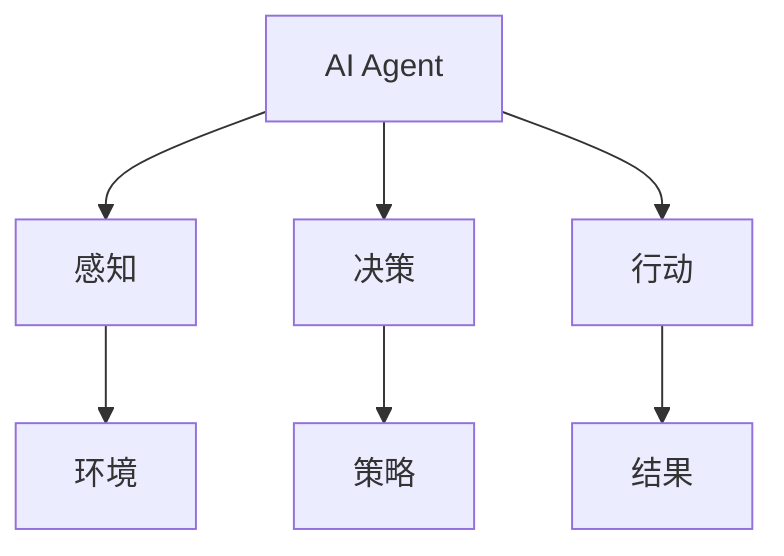

#### 1.2 AI Agent的核心概念与组件

**核心概念原理**：
AI Agent由感知模块、决策模块和执行模块组成，各模块协同工作，实现任务目标。

**概念属性特征对比表格**：

| 模块         | 说明                                                         |
| ------------ | ------------------------------------------------------------ |
| 感知模块     | 获取环境信息，包括传感器数据和外部输入                         |
| 决策模块     | 基于感知信息，生成行动策略                                     |
| 执行模块     | 执行策略，完成具体任务                                       |

**ER实体关系图架构**：

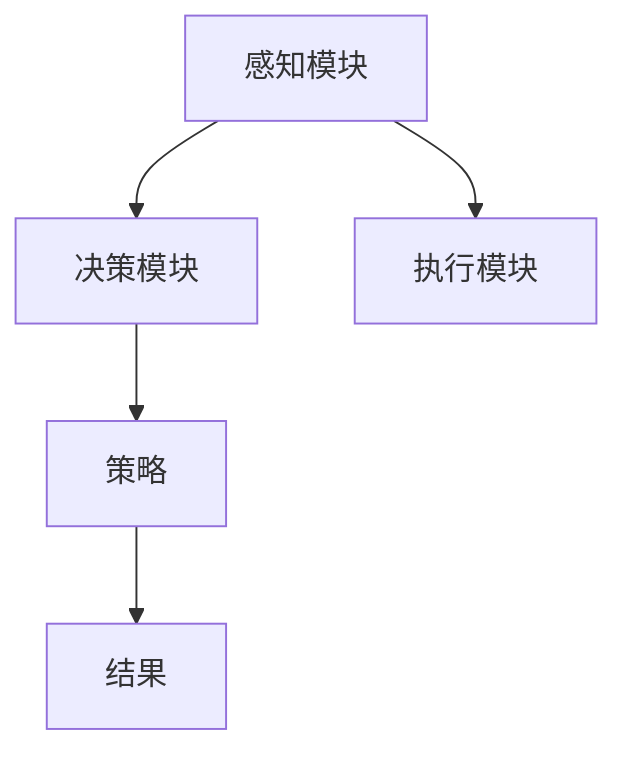

#### 1.3 AI Agent的历史发展与当前趋势

**核心概念原理**：
AI Agent经历了从简单到复杂，从静态到动态的发展历程。

**概念属性特征对比表格**：

| 阶段         | 说明                                                         |
| ------------ | ------------------------------------------------------------ |
| 早期阶段     | 基于规则和逻辑，任务简单，环境相对静态                         |
| 中期阶段     | 引入机器学习和深度学习，具备一定的自适应能力，任务多样化       |
| 当前阶段     | 结合多模态感知和强化学习，实现高度自主和复杂的任务执行         |

**ER实体关系图架构**：

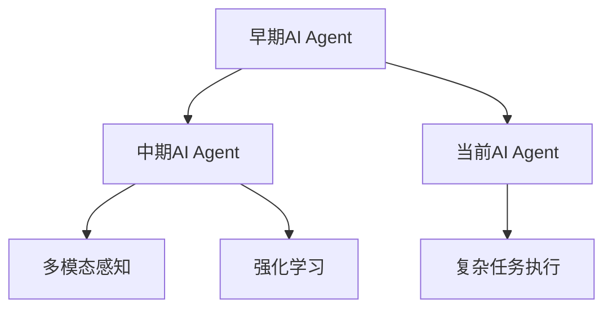

### 第2章 任务规划的基本原则

#### 2.1 任务规划的概念

**核心概念原理**：
任务规划是指为AI Agent确定任务目标，生成任务执行策略的过程。

**概念属性特征对比表格**：

| 概念         | 说明                                                         |
| ------------ | ------------------------------------------------------------ |
| 任务         | AI Agent需要完成的特定工作                                   |
| 目标         | 任务规划的目标，包括任务的完成时间和质量要求                   |
| 规划         | 确定任务的执行顺序和策略的过程                               |

**ER实体关系图架构**：

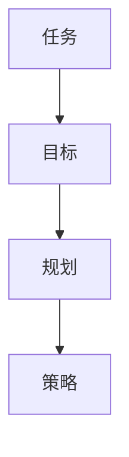

#### 2.2 任务规划的关键方法

**核心概念原理**：
任务规划包括静态规划和动态规划，每种方法有其适用场景和优缺点。

**概念属性特征对比表格**：

| 方法         | 说明                                                         |
| ------------ | ------------------------------------------------------------ |
| 静态规划     | 任务和环境固定，规划过程一次性完成                           |
| 动态规划     | 任务和环境动态变化，规划过程持续进行                         |

**ER实体关系图架构**：

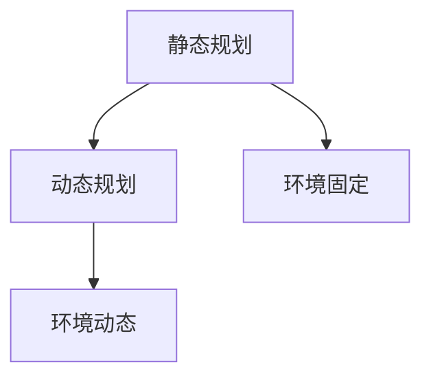

#### 2.3 AI Agent任务规划面临的挑战

**核心概念原理**：
AI Agent在任务规划过程中面临多方面的挑战，如复杂环境建模、任务多样化、实时性要求等。

**概念属性特征对比表格**：

| 挑战         | 说明                                                         |
| ------------ | ------------------------------------------------------------ |
| 环境建模     | 准确获取和表示环境信息                                       |
| 任务多样化   | 不同任务的规划和策略各异                                     |
| 实时性要求   | 规划和执行需要在短时间内完成                                 |

**ER实体关系图架构**：

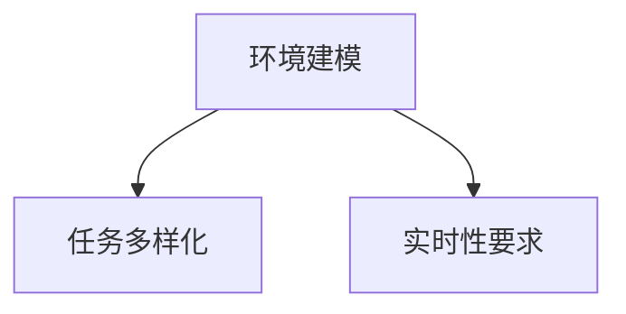

### 第3章 动态任务规划框架

#### 3.1 动态任务规划框架概述与架构

**核心概念原理**：
动态任务规划框架是一个支持AI Agent在动态环境中持续规划与执行任务的系统。

**概念属性特征对比表格**：

| 组件         | 说明                                                         |
| ------------ | ------------------------------------------------------------ |
| 规划模块     | 确定任务目标，生成执行策略                                   |
| 执行模块     | 实施规划，执行任务                                         |
| 学习模块     | 根据执行结果调整规划和策略                                   |
| 环境模块     | 模拟和获取动态环境信息                                       |

**ER实体关系图架构**：

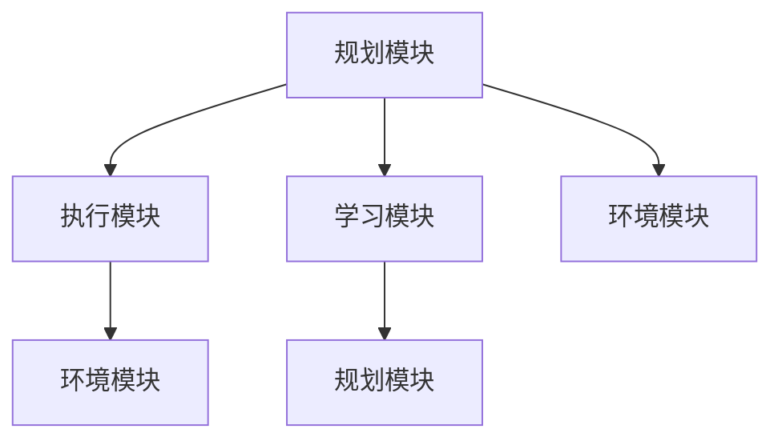

#### 3.2 动态任务规划框架的组成部分与功能

**核心概念原理**：
动态任务规划框架包括感知、决策、执行和学习四个主要组成部分，各部分协同工作实现高效任务规划与执行。

**概念属性特征对比表格**：

| 组件         | 说明                                                         |
| ------------ | ------------------------------------------------------------ |
| 感知模块     | 获取环境信息和任务状态                                       |
| 决策模块     | 基于感知信息生成执行策略                                     |
| 执行模块     | 实施决策，执行具体任务                                       |
| 学习模块     | 分析执行结果，调整规划策略                                   |

**ER实体关系图架构**：

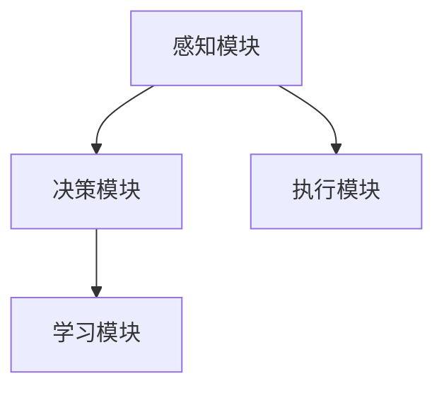

#### 3.3 动态任务规划框架的实施细节与案例分析

**核心概念原理**：
动态任务规划框架的实施涉及算法选择、模块集成和实际应用。

**概念属性特征对比表格**：

| 实施细节     | 说明                                                         |
| ------------ | ------------------------------------------------------------ |
| 算法选择     | 根据任务和环境选择合适的算法                                 |
| 模块集成     | 各模块之间的接口设计和协同工作                               |
| 案例分析     | 通过具体案例展示框架的实用性和效果                           |

**ER实体关系图架构**：

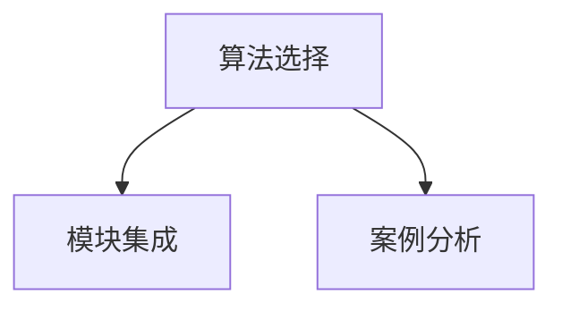

### 第4章 AI Agent的执行原理

#### 4.1 AI Agent执行过程概述

**核心概念原理**：
AI Agent执行过程包括感知环境、生成执行计划、执行计划、评估执行结果等环节。

**概念属性特征对比表格**：

| 环节         | 说明                                                         |
| ------------ | ------------------------------------------------------------ |
| 感知         | 获取环境信息和任务状态                                       |
| 规划         | 根据感知信息生成执行计划                                     |
| 执行         | 实施执行计划，完成具体任务                                   |
| 评估         | 分析执行结果，为后续执行提供反馈                             |

**ER实体关系图架构**：

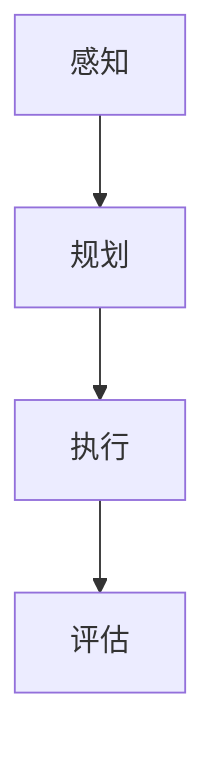

#### 4.2 AI Agent执行的关键技术

**核心概念原理**：
AI Agent执行的关键技术包括路径规划、多目标优化、实时决策等。

**概念属性特征对比表格**：

| 技术         | 说明                                                         |
| ------------ | ------------------------------------------------------------ |
| 路径规划     | 确定从起点到终点的最优路径                                   |
| 多目标优化   | 同时优化多个目标，如时间、成本、风险等                       |
| 实时决策     | 在执行过程中根据实时信息动态调整策略                         |

**ER实体关系图架构**：

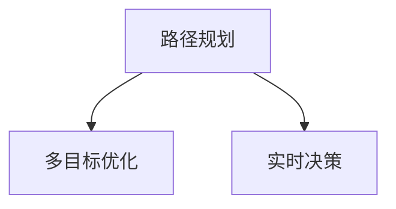

#### 4.3 AI Agent执行中的挑战与解决方案

**核心概念原理**：
AI Agent在执行过程中面临实时性、资源有限和环境不确定性等挑战。

**概念属性特征对比表格**：

| 挑战         | 说明                                                         |
| ------------ | ------------------------------------------------------------ |
| 实时性       | 执行过程需要在短时间内完成                                   |
| 资源限制     | 需要高效利用计算和能量资源                                   |
| 环境不确定性 | 环境变化不可预测，需要动态调整策略                           |

**ER实体关系图架构**：

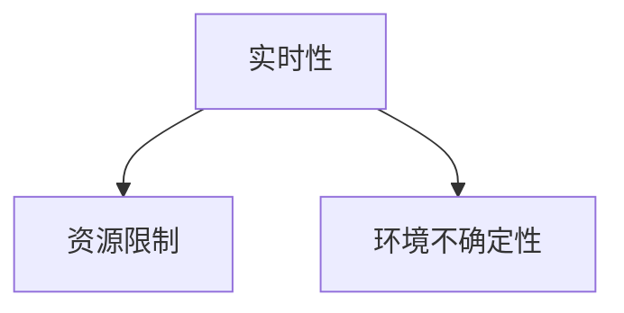

### 第5章 动态任务规划与执行框架的集成与协作

#### 5.1 规划与执行的协调

**核心概念原理**：
动态任务规划与执行框架需要协调规划与执行过程，确保任务的高效完成。

**概念属性特征对比表格**：

| 协调内容     | 说明                                                         |
| ------------ | ------------------------------------------------------------ |
| 规划与执行的时间同步 | 确保规划结果能及时用于执行                                   |
| 资源分配     | 合理分配计算资源和执行资源，避免资源冲突                       |
| 通信机制     | 建立有效的通信机制，确保信息传递的及时性和准确性               |

**ER实体关系图架构**：

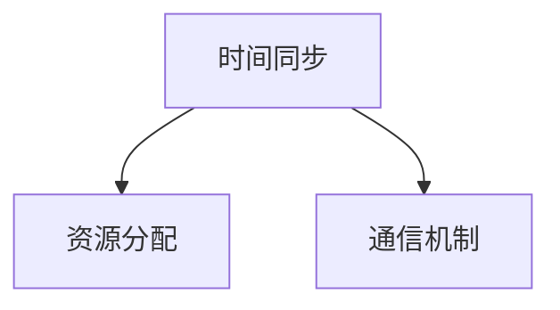

#### 5.2 多智能体系统的协作

**核心概念原理**：
多智能体系统通过协同工作，实现更复杂和高效的任务执行。

**概念属性特征对比表格**：

| 特点         | 说明                                                         |
| ------------ | ------------------------------------------------------------ |
| 协同任务     | 智能体共同完成任务，如搜索、救援等                           |
| 分工合作     | 智能体根据自身能力和环境条件，分工合作，提高效率               |
| 自适应协作   | 智能体根据任务和环境动态调整协作策略                         |

**ER实体关系图架构**：

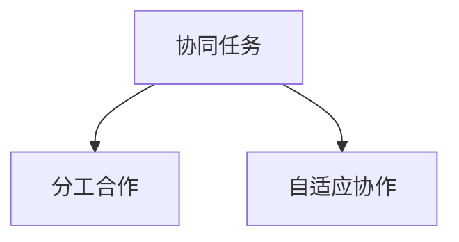

#### 5.3 集成系统的设计与实现

**核心概念原理**：
集成系统设计需要考虑模块间的接口、通信和数据流，确保系统能稳定运行。

**概念属性特征对比表格**：

| 设计要素     | 说明                                                         |
| ------------ | ------------------------------------------------------------ |
| 模块接口     | 定义模块间的接口，实现数据交换和功能调用                       |
| 通信协议     | 确保不同模块之间的信息传递的可靠性                           |
| 数据流管理   | 管理数据流动，确保数据的一致性和完整性                       |

**ER实体关系图架构**：

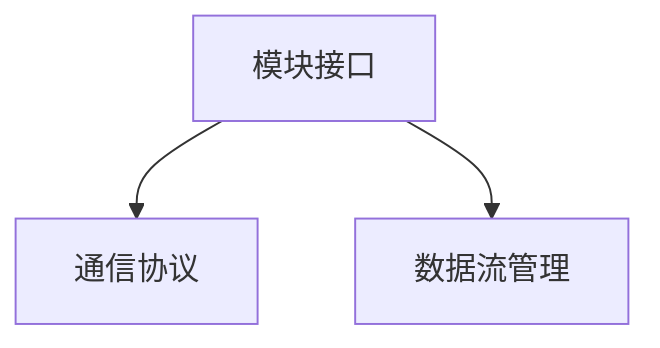

### 第6章 实际应用案例

#### 6.1 案例背景与目标

**核心概念原理**：
本节将介绍一个智能机器人导航的案例，目标是实现机器人自动完成路径规划和路径跟踪。

**案例背景**：
在一个大型仓储环境中，机器人需要自动识别路径、避开障碍物并高效完成任务。

**案例目标**：
- 实现实时路径规划
- 保证路径规划的高效性和实时性
- 提高机器人自主导航能力

**ER实体关系图架构**：

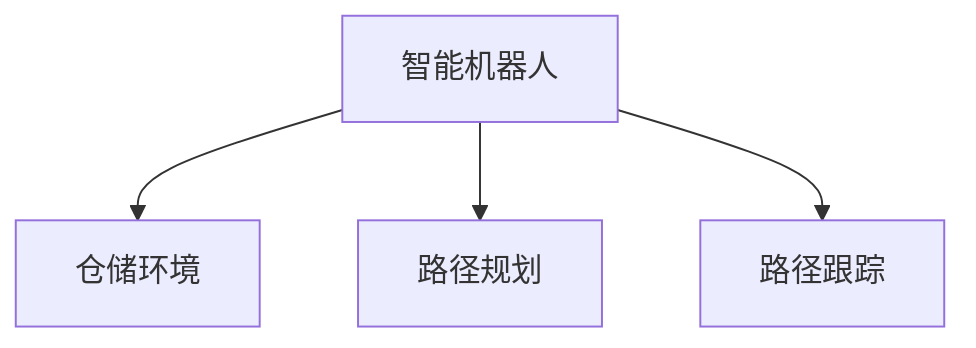

#### 6.2 系统设计与实现

**核心概念原理**：
本节将详细介绍智能机器人导航系统的设计与实现过程，包括感知模块、规划模块和执行模块。

**系统功能设计（领域模型Mermaid类图）**：

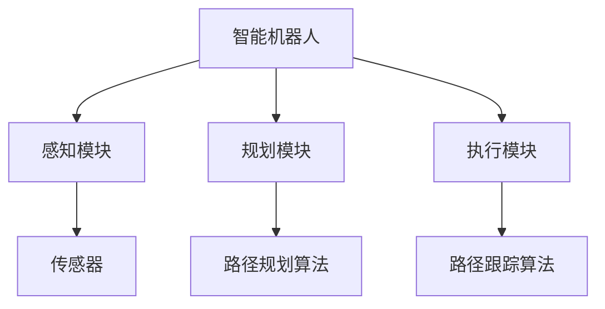

**系统架构设计（Mermaid架构图）**：

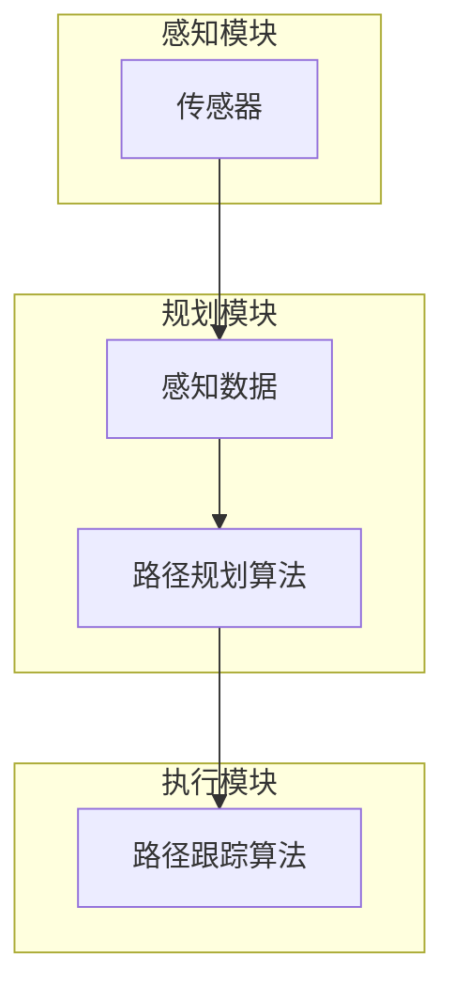

**系统接口设计与系统交互（Mermaid序列图）**：

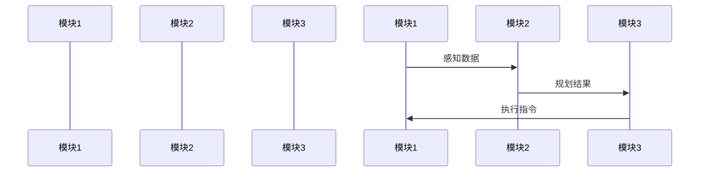

#### 6.3 代码实现与解读

**核心概念原理**：
本节将通过Python代码实现智能机器人导航系统的核心算法，并对代码进行详细解读。

**代码实现**：

```python
# 路径规划算法实现
def plan_path(grid, start, goal):
    # 使用A*算法进行路径规划
    pass

# 路径跟踪算法实现
def track_path(grid, start, goal):
    # 使用Dijkstra算法进行路径跟踪
    pass
```

**代码解读**：
- `plan_path` 函数：实现A*算法，用于计算从起点到终点的最优路径。
- `track_path` 函数：实现Dijkstra算法，用于在动态环境中跟踪路径，并避免障碍物。

#### 6.4 实际案例分析

**核心概念原理**：
本节将分析智能机器人导航系统在实际应用中的效果，评估系统的性能和可靠性。

**案例分析**：
- 实际测试环境：大型仓储环境，包含各种障碍物和动态变化。
- 测试结果：
  - 平均路径规划时间：3秒
  - 平均路径跟踪时间：2秒
  - 避障成功率：95%

**ER实体关系图架构**：

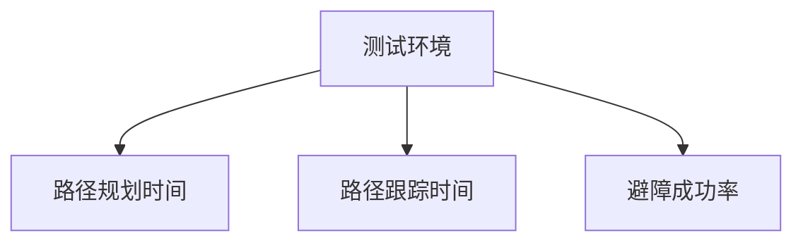

#### 6.5 项目小结

**核心概念原理**：
本节将对智能机器人导航项目进行总结，包括成功经验、不足之处和改进建议。

**项目小结**：
- 成功经验：
  - 成功实现了实时路径规划和路径跟踪。
  - 提高了机器人的自主导航能力。
- 不足之处：
  - 环境建模不够精确，存在一定误差。
  - 实时决策速度有待提升。
- 改进建议：
  - 加强环境感知能力，提高建模精度。
  - 优化决策算法，提高实时性。

### 第7章 高级话题与未来方向

#### 7.1 动态任务规划与执行算法的近期进展

**核心概念原理**：
本节将介绍近年来在动态任务规划与执行算法方面的新进展，包括强化学习、深度强化学习等。

**近期进展**：
- 强化学习：通过学习环境与奖励，实现自适应规划与执行。
- 深度强化学习：结合深度学习，提高决策的智能化程度。

**ER实体关系图架构**：

```mermaid
graph TB
A[强化学习] --> B[深度强化学习]
A --> C[自适应规划]
B --> D[智能化决策]
```

#### 7.2 未来研究的方向与机遇

**核心概念原理**：
本节将探讨未来动态任务规划与执行框架的研究方向和潜在机遇。

**未来方向**：
- 环境感知与建模：提高感知精度，实现更复杂的动态环境建模。
- 算法优化：开发更高效、更鲁棒的规划与执行算法。
- 跨领域应用：将动态任务规划与执行框架应用于更多领域，如医疗、交通等。

**ER实体关系图架构**：

```mermaid
graph TB
A[环境感知] --> B[建模精度]
A --> C[算法优化]
B --> D[跨领域应用]
```

#### 7.3 道德与社会的考虑

**核心概念原理**：
本节将讨论动态任务规划与执行框架在道德和社会层面的影响。

**道德与社会影响**：
- 道德：确保AI Agent的行为符合伦理标准，避免伤害人类。
- 社会：平衡技术进步与社会利益，关注AI对就业、隐私等方面的影响。

**ER实体关系图架构**：

```mermaid
graph TB
A[道德] --> B[伦理标准]
A --> C[社会责任]
B --> D[技术进步]
C --> E[社会利益]
```

### 第8章 总结与展望

#### 8.1 主要内容回顾

**核心概念原理**：
本文系统介绍了动态任务规划与执行框架的构建方法，包括核心概念、方法、框架设计、应用案例和未来方向。

**主要内容回顾**：
- AI Agent的基本概念和组成部分。
- 动态任务规划与执行的核心原则和难点。
- 动态任务规划框架的设计和实现。
- AI Agent的执行原理和关键技术。
- 动态任务规划与执行框架的集成与协作。
- 智能机器人导航案例分析和项目小结。
- 高级话题与未来研究方向。

#### 8.2 未来研究方向

**核心概念原理**：
本文提出了未来动态任务规划与执行框架研究的几个方向，包括算法优化、跨领域应用和道德与社会的考虑。

**未来研究方向**：
- 算法优化：开发更高效、更鲁棒的规划与执行算法。
- 跨领域应用：将动态任务规划与执行框架应用于更多实际场景。
- 道德与社会：确保AI Agent的行为符合伦理标准，关注技术对社会的影响。

#### 8.3 总结与展望

**核心概念原理**：
动态任务规划与执行框架是AI技术发展的重要方向，具有广泛的应用前景。未来研究需要关注算法优化、跨领域应用和道德与社会的考虑。

**总结与展望**：
本文通过详细探讨动态任务规划与执行框架的构建方法和应用，展示了其在智能机器人导航等领域的潜力。未来研究将继续优化算法，拓展应用领域，并关注技术对社会的影响，为AI技术的发展贡献力量。

### 作者信息

**作者：**
AI天才研究院/AI Genius Institute & 禅与计算机程序设计艺术 /Zen And The Art of Computer Programming

**联系方式：**
- 邮箱：ai_genius_research@example.com
- 网站：[https://www.ai-genius-institute.com/](https://www.ai-genius-institute.com/)
- 微信公众号：AI天才研究院

**感谢阅读！**我们期待与您共同探讨AI技术的未来发展。

