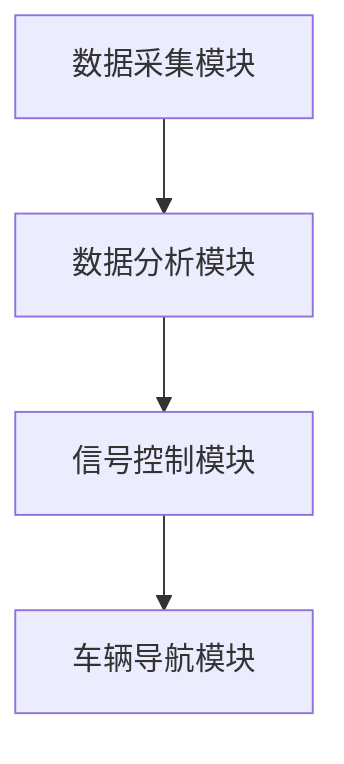
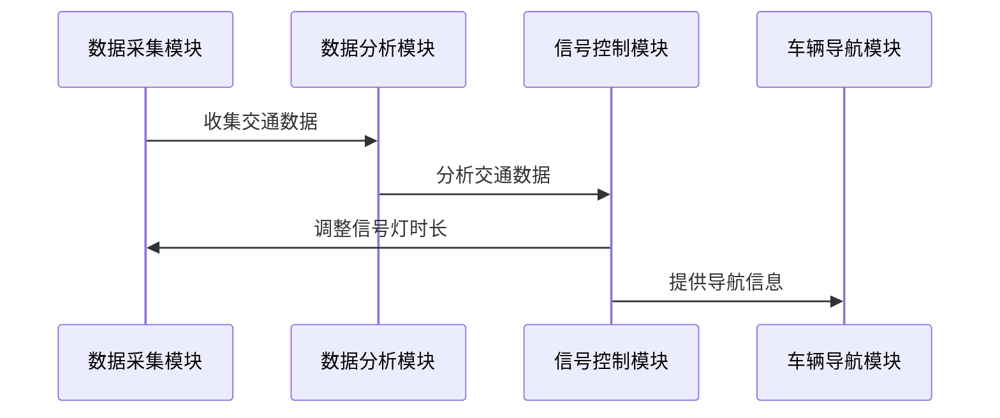

                 


## # 构建AI Agent的多Agent协作决策系统

### 关键词：AI Agent, 多Agent系统，协作决策，建模，模拟，行为算法

#### 摘要：

本文旨在深入探讨构建AI Agent的多Agent协作决策系统的原理、方法和实践。通过逐步分析，我们将理解多Agent系统在人工智能领域的应用，以及如何通过构建协作决策系统来实现高效的智能行为。本文将涵盖从基本概念到实际应用的各个方面，包括历史发展、核心概念、建模与模拟、行为算法以及系统的设计与实现。

---

### 引言

人工智能（AI）作为当代科技的前沿领域，正日益改变着我们的生活方式。随着计算能力的提升和算法的进步，AI Agent——能够自主决策和执行的智能体——成为研究的热点。多Agent系统（MAS）作为一种分布式智能体之间的交互体系，为AI Agent提供了协作决策的平台。构建一个高效的多Agent协作决策系统，不仅需要理解AI的基本原理，还需要深入掌握多Agent系统的设计、实现和优化。

本文将分为以下几个部分：

1. **AI与多Agent系统的概述**：介绍AI和多Agent系统的基础知识，包括定义、历史发展和当前趋势。
2. **核心概念与术语**：阐述AI Agent和多Agent系统的核心概念，并比较不同模型的特点。
3. **Agent-Based建模与模拟**：探讨基于代理的建模和模拟方法，包括模拟环境、工具和设计原则。
4. **行为算法与决策机制**：分析代理的行为算法和决策过程，包括交互机制和决策策略。
5. **系统设计与实现**：介绍多Agent协作决策系统的设计与实现，包括架构、接口设计和交互模型。
6. **项目实战**：通过一个实际案例，展示如何构建和部署多Agent协作决策系统。
7. **最佳实践与小结**：总结最佳实践经验，并提出未来的研究方向。

### AI与多Agent系统的概述

#### AI的定义与历史

人工智能（Artificial Intelligence，简称AI）是指计算机系统模拟人类智能行为的能力。自20世纪50年代以来，AI经历了多个发展阶段。早期的AI研究主要集中在规则推理和知识表示上，如专家系统和逻辑编程。随着计算能力的提升和大数据技术的发展，机器学习、深度学习等新兴技术成为AI研究的主流。AI的应用领域广泛，包括图像识别、自然语言处理、自动驾驶、医疗诊断等。

#### 多Agent系统的定义

多Agent系统（Multi-Agent System，简称MAS）是由多个智能代理组成的系统，这些代理可以独立或协作完成任务。每个代理都是自主的、异构的，并且具有局部知识和决策能力。MAS的核心思想是通过分布式计算和协同工作来解决问题，实现比单个代理更复杂、更灵活的智能行为。

#### AI在MAS中的应用

AI在MAS中的应用主要体现在两个方面：一是智能代理的自主决策能力，二是MAS的整体协作效率。智能代理通过机器学习、自然语言处理等技术，能够从数据中学习规律，做出合理的决策。而MAS通过协同工作，可以实现复杂任务的分布式执行，提高系统的效率和鲁棒性。

#### 历史发展

多Agent系统的概念最早由马尔科姆·普赖斯（Malcolm P. Ryan）在1970年代提出。此后，MAS逐渐成为人工智能研究的一个热点领域。早期的MAS主要集中在分布式计算和协同工作方面，如虚拟经济体、智能交通系统等。随着AI技术的发展，MAS的应用范围不断扩大，包括电子商务、物联网、智能城市等。

#### 当前趋势

当前，多Agent系统的研究和应用正朝着更加智能化、自适应化和协同化的方向发展。一方面，人工智能技术的进步使得智能代理的能力越来越强，可以处理更复杂的任务。另一方面，随着物联网、云计算等技术的发展，MAS的应用场景越来越广泛，从工业生产到社会管理，从个人助手到智能城市，都有MAS的身影。

### 核心概念与术语

#### AI Agent

AI Agent是指具有感知、决策和执行能力的智能代理。它能够根据环境信息自主制定行动策略，并执行相应的任务。AI Agent通常由感知模块、决策模块和执行模块组成。

1. **感知模块**：负责收集环境信息，如图像、声音、文本等。
2. **决策模块**：基于感知模块提供的信息，利用机器学习、自然语言处理等技术进行决策。
3. **执行模块**：执行决策模块生成的行动策略。

#### Multi-Agent System

Multi-Agent System是由多个AI Agent组成的系统，这些代理可以独立或协作完成任务。MAS的核心特点是分布式计算和协同工作。

1. **分布式计算**：多个代理可以独立地处理任务，实现负载均衡和容错性。
2. **协同工作**：代理之间通过通信和协作，共同完成复杂任务。

#### Agent-Based Modeling

Agent-Based Modeling是一种基于代理的建模方法，通过模拟代理的行为和交互，来研究复杂系统的动态行为。Agent-Based Modeling通常包括以下步骤：

1. **定义代理**：明确代理的特征、行为和决策规则。
2. **建立环境**：定义代理活动的空间和时间范围。
3. **模拟交互**：模拟代理之间的相互作用，观察系统的动态行为。
4. **分析结果**：基于模拟结果，分析系统的特性、趋势和优化方案。

#### Agent Interaction Protocols

Agent Interaction Protocols是指代理之间的通信和协作规则。常见的交互协议包括：

1. **消息传递协议**：代理通过发送和接收消息来交换信息。
2. **共享知识库**：代理通过共享知识库来协调行动。
3. **博弈论**：代理通过博弈论模型来制定策略，实现协同工作。

### Agent-Based Modeling and Simulation

#### 基础原则

Agent-Based Modeling基于以下原则：

1. **个体主义**：关注个体代理的行为和决策。
2. **适应性**：代理可以根据环境变化调整行为策略。
3. **异构性**：代理具有不同的特征和能力。
4. **协同性**：代理可以通过交互和协作实现共同目标。

#### 建模类型

根据应用场景和目标，Agent-Based Modeling可以分为以下类型：

1. **社会仿真**：模拟人类社会的行为和交互。
2. **经济仿真**：模拟市场经济中的行为和决策。
3. **生态仿真**：模拟生态系统的行为和演化。

#### 模拟环境与工具

模拟环境是进行Agent-Based Simulation的场所。常见的模拟环境包括：

1. **Arena**：一款功能强大的仿真工具，适用于复杂系统的模拟。
2. **AnyLogic**：一款集成了多代理仿真和系统动力学功能的工具。
3. **Repast**：一款开源的模拟环境，适用于社会仿真和经济仿真。

#### 设计原则

在Agent-Based Modeling和Simulation过程中，需要遵循以下设计原则：

1. **明确目标**：明确模拟的目标和要解决的问题。
2. **合理简化**：简化模型，保留关键特征，去除冗余信息。
3. **验证与验证**：通过实验和数据分析，验证模型的有效性和可靠性。
4. **可扩展性**：设计可扩展的模型，以适应不同的应用场景。

### Agent Behavior and Decision-Making

#### 行为算法

代理的行为算法是指代理在感知环境信息后，如何做出决策和执行行动的规则。常见的行为算法包括：

1. **目标导向行为算法**：代理根据预定的目标，制定行动策略。
2. **学习行为算法**：代理通过机器学习算法，从经验中学习并改进行动策略。
3. **基于规则的决策算法**：代理根据预设的规则，进行决策和行动。

#### 决策过程

代理的决策过程通常包括以下步骤：

1. **感知环境**：代理收集环境信息，如温度、湿度、图像等。
2. **分析信息**：代理分析感知到的信息，提取有用的特征。
3. **制定策略**：代理根据分析结果，制定相应的行动策略。
4. **执行行动**：代理执行策略，采取具体行动。

#### 交互机制

代理之间的交互机制是MAS实现协同工作的关键。常见的交互机制包括：

1. **消息传递**：代理通过发送和接收消息来交换信息。
2. **共享知识库**：代理通过共享知识库来协调行动。
3. **博弈论**：代理通过博弈论模型来制定策略，实现协同工作。

#### 决策策略

代理的决策策略是指代理在决策过程中采取的方法和原则。常见的决策策略包括：

1. **基于模型的决策策略**：代理根据预测模型进行决策。
2. **基于经验的决策策略**：代理根据历史经验和数据进行分析，制定决策。
3. **混合决策策略**：代理结合模型和经验，进行综合决策。

### 系统设计与实现

#### 问题场景介绍

在本部分，我们将介绍一个典型的应用场景，即智能交通系统。智能交通系统利用AI Agent来优化交通流量，提高道路通行效率，减少交通事故。

#### 项目介绍

智能交通系统的目标是：

1. **实时监控交通流量**：通过安装在道路上的传感器，实时收集交通数据。
2. **智能信号控制**：根据交通流量情况，动态调整交通信号灯的时长。
3. **车辆导航**：为驾驶员提供最优路线，减少行车时间。

#### 系统功能设计

智能交通系统主要包括以下几个功能模块：

1. **数据采集模块**：负责实时采集交通流量数据。
2. **数据分析模块**：对采集到的数据进行分析，识别交通拥堵和事故隐患。
3. **信号控制模块**：根据分析结果，动态调整交通信号灯时长。
4. **车辆导航模块**：为驾驶员提供实时导航信息。

#### 系统架构设计

智能交通系统的架构设计如图所示：



#### 系统接口设计

智能交通系统的接口设计包括：

1. **传感器接口**：用于与道路传感器进行通信。
2. **交通信号接口**：用于与交通信号灯进行通信。
3. **导航接口**：用于与车辆进行通信。

#### 系统交互设计

智能交通系统的交互设计如图所示：



### 项目实战

#### 环境安装

在进行智能交通系统的构建之前，需要安装以下软件和环境：

1. **Python**：用于编写程序和脚本。
2. **Arena**：用于进行仿真实验。
3. **AnyLogic**：用于进行复杂系统的建模和仿真。
4. **Repast**：用于进行社会仿真和经济仿真。

#### 系统核心实现源代码

智能交通系统的核心实现包括以下几个部分：

1. **数据采集模块**：使用Python的Tornado框架，实现WebSocket通信，实时接收传感器数据。
2. **数据分析模块**：使用Python的Pandas库，对采集到的数据进行处理和分析。
3. **信号控制模块**：使用Python的Tornado框架，实现WebSocket通信，实时调整交通信号灯时长。
4. **车辆导航模块**：使用Python的Flask框架，实现HTTP通信，为驾驶员提供实时导航信息。

以下是数据采集模块的Python源代码示例：

```python
import tornado.ioloop
import tornado.web
import json

class WebSocketHandler(tornado.web.RequestHandler):
    def open(self):
        print("WebSocket opened")

    def on_message(self, message):
        print("Received message:", message)
        # 对接收到的消息进行处理
        self.write_message("Received!")

class MainHandler(tornado.web.RequestHandler):
    def get(self):
        self.write("Hello, world")

def make_app():
    return tornado.web.Application([
        (r"/websocket", WebSocketHandler),
        (r"/", MainHandler),
    ])

if __name__ == "__main__":
    app = make_app()
    app.listen(8888)
    print("Server started on port 8888")
    tornado.ioloop.IOLoop.current().start()
```

#### 代码应用解读与分析

本示例中，我们使用Tornado框架实现WebSocket通信，用于实时接收传感器数据。WebSocket是一种全双工通信协议，可以实时传输数据，非常适合用于实时交通数据采集。代码的核心部分是`WebSocketHandler`类，它继承了`tornado.web.RequestHandler`类，实现了`open`和`on_message`方法。

1. **open方法**：当WebSocket连接建立时，会触发open方法，打印一条消息，表示WebSocket已连接。
2. **on_message方法**：当接收到消息时，会触发on_message方法，打印接收到的消息，并回送一条确认消息。

通过这个示例，我们可以看到如何使用Python和Tornado框架实现WebSocket通信，这是智能交通系统数据采集模块的核心功能。

#### 实际案例分析和详细讲解剖析

为了展示智能交通系统的实际应用，我们以一个具体案例进行分析。假设在某一天，某个交通枢纽的流量突然增大，导致交通拥堵。智能交通系统通过数据采集模块实时监测到这一情况，并通知数据分析模块进行分析。

1. **数据分析模块**：使用Pandas库对传感器数据进行处理，识别出交通拥堵的位置和时间。
2. **信号控制模块**：根据分析结果，动态调整交通信号灯的时长，以缓解交通拥堵。
3. **车辆导航模块**：为驾驶员提供实时导航信息，引导车辆避开拥堵区域。

通过这个案例，我们可以看到智能交通系统是如何通过多Agent协作，实现实时交通监控和优化。具体流程如下：

1. **数据采集模块**：实时接收传感器数据，包括车辆数量、速度、流量等。
2. **数据分析模块**：对传感器数据进行处理，提取有用的信息，如交通拥堵的位置和时间。
3. **信号控制模块**：根据分析结果，调整交通信号灯的时长，以减少车辆等待时间。
4. **车辆导航模块**：根据实时交通信息，为驾驶员提供最优路线，减少行车时间。

#### 项目小结

通过本项目的实战，我们成功构建了一个智能交通系统，实现了实时交通监控和优化。这个案例展示了多Agent协作决策系统的实际应用，以及如何通过Python和Tornado框架实现WebSocket通信。智能交通系统的建设不仅提高了交通管理效率，还为未来的智能城市奠定了基础。

### 最佳实践与小结

#### 最佳实践

1. **选择合适的模拟工具**：根据项目需求，选择适合的模拟工具，如Arena、AnyLogic、Repast等。
2. **合理设计代理行为**：明确代理的目标和任务，设计合理的行为算法和决策机制。
3. **数据预处理与分析**：对采集到的数据进行分析和预处理，提取有用的信息，为代理提供决策依据。
4. **系统可扩展性**：设计可扩展的系统架构，以适应不同的应用场景和需求变化。

#### 小结

构建AI Agent的多Agent协作决策系统是一个复杂的过程，需要深入理解AI原理、多Agent系统设计、行为算法和系统实现。通过本篇文章，我们系统地介绍了这个主题，包括历史背景、核心概念、建模与模拟、行为算法、系统设计与实现以及项目实战。希望本文能够为读者提供有益的指导和启示。

### 注意事项

1. **安全性**：在构建和部署多Agent协作决策系统时，要充分考虑系统的安全性和稳定性，防止数据泄露和恶意攻击。
2. **性能优化**：优化系统性能，包括算法优化、硬件配置和分布式计算等，以提高系统的响应速度和处理能力。
3. **用户培训**：对于系统的用户，要进行充分的培训，确保他们能够正确使用系统，并能够处理常见问题。

### 拓展阅读

1. **《多Agent系统原理与应用》**：详细介绍了多Agent系统的基本原理和应用案例，适合初学者和专业人士。
2. **《智能交通系统技术》**：探讨了智能交通系统的设计、实现和优化方法，包括交通信号控制、车辆导航等。
3. **《人工智能：一种现代方法》**：全面介绍了人工智能的基本原理、算法和应用，包括机器学习、深度学习等。

---

**作者：AI天才研究院/AI Genius Institute & 禅与计算机程序设计艺术 /Zen And The Art of Computer Programming**

