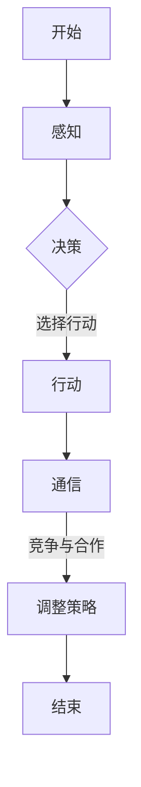
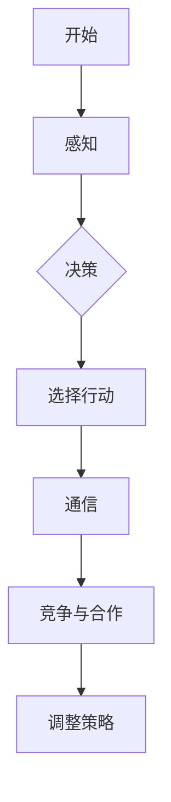
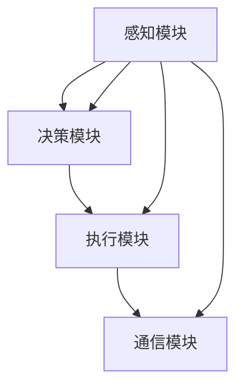

                 


## 引言

### 1.1 背景

多Agent系统和AI Agent在当今的科技领域中占据着重要的地位。多Agent系统是由多个智能体（Agent）组成的系统，这些智能体可以相互交互并协同工作，以实现更复杂的任务。AI Agent，即人工智能智能体，是能够自主决策并执行任务的智能体，它们在复杂环境中的适应性和学习能力使得它们在许多领域表现出色。

构建一个有效的多Agent竞争与合作框架对于设计高效、可靠的人工智能系统至关重要。这样的框架可以使得多个AI Agent之间既能竞争又能合作，从而实现系统的整体优化。竞争可以激发智能体的动力，促使其不断提升自身的能力；而合作则可以使得智能体之间共享资源和知识，从而提高系统的整体效能。

### 1.2 核心概念

在本章节中，我们将首先介绍多Agent系统和AI Agent的基本概念。

#### 多Agent系统

多Agent系统（Multi-Agent System，MAS）是指由多个智能体（Agent）组成的系统。这些智能体可以具有不同的目标、知识和能力，它们通过相互协作或竞争来完成任务。多Agent系统的核心特点包括：

- **异质性**：智能体具有不同的能力和目标。
- **分布性**：智能体分布在不同的位置，可能具有不同的通信能力。
- **自主性**：智能体可以自主决策并执行任务。
- **适应性**：智能体能够适应环境变化。

多Agent系统广泛应用于各种领域，如智能制造、智能交通、金融交易等。

#### AI Agent

AI Agent是具有人工智能能力的智能体。它们可以通过学习、推理和规划来执行复杂的任务。AI Agent的主要特点包括：

- **学习能力**：AI Agent可以通过学习环境中的数据来改进自身的性能。
- **推理能力**：AI Agent可以使用逻辑和推理来解决问题。
- **规划能力**：AI Agent可以制定行动计划以实现目标。

AI Agent的分类可以根据其学习方式、推理方式和规划方式来划分。常见的AI Agent包括：

- **基于规则的AI Agent**：使用预定义的规则进行推理和决策。
- **基于学习的AI Agent**：通过学习环境中的数据来改进自身的性能。
- **基于规划的AI Agent**：通过制定详细的行动计划来实现目标。

### 1.3 竞争与合作框架的设计原则

在构建多Agent竞争与合作框架时，我们需要遵循以下原则：

- **协同效应**：确保竞争与合作能够产生协同效应，使得整体效能最大化。
- **公平性**：确保每个AI Agent都有公平的机会参与竞争和合作。
- **适应性**：框架应能够适应不同的环境和任务需求。
- **可扩展性**：框架应能够支持增加新的AI Agent或修改现有AI Agent的行为。

### 1.4 本章小结

本章介绍了多Agent系统和AI Agent的基本概念，并阐述了构建多Agent竞争与合作框架的重要性。在接下来的章节中，我们将详细探讨多Agent竞争与合作机制的设计和实现，以及如何构建一个有效的框架。通过这些讨论，我们将为构建高效、可靠的人工智能系统提供有力的支持。

关键词：多Agent系统，AI Agent，竞争与合作框架，框架设计

摘要：本文旨在介绍多Agent系统和AI Agent的基本概念，并探讨如何设计一个有效的多Agent竞争与合作框架。通过分析竞争与合作机制的设计原则，我们为构建高效的人工智能系统提供了理论依据和实用指导。

----------------------------------------------------------------

## 第2章: 多Agent系统和AI Agent概述

### 2.1 多Agent系统概述

多Agent系统（MAS）是近年来在计算机科学和人工智能领域得到广泛关注的一个研究方向。它由多个智能体（Agent）组成，这些智能体可以相互协作或竞争，以完成复杂任务。在这一节中，我们将深入探讨多Agent系统的基本概念、特点和应用场景。

#### 2.1.1 多Agent系统的基本概念

多Agent系统由多个智能体组成，这些智能体具有以下特征：

- **异质性**：智能体具有不同的能力、目标和知识。
- **分布性**：智能体分布在不同的位置，可能具有不同的通信能力。
- **自主性**：智能体可以自主决策并执行任务。
- **适应性**：智能体能够适应环境变化。

多Agent系统的核心是智能体之间的交互。这些交互可以是协作性的，也可以是竞争性的。通过这些交互，智能体可以共享资源、知识和目标，从而实现共同的任务。

#### 2.1.2 多Agent系统的特点

多Agent系统具有以下特点：

- **异质性**：多个智能体具有不同的能力和目标，这使得系统可以处理更复杂的任务。
- **分布性**：智能体分布在不同的位置，可以处理分布式任务。
- **自主性**：智能体可以自主决策，这使得系统具有更高的灵活性和适应性。
- **适应性**：智能体可以适应环境变化，这使得系统具有更强的鲁棒性。

#### 2.1.3 多Agent系统的应用场景

多Agent系统在许多领域都有广泛应用，以下是一些常见的应用场景：

- **智能制造**：在智能制造中，多Agent系统可以协调不同设备之间的任务分配和资源调度，从而提高生产效率。
- **智能交通**：在智能交通系统中，多Agent系统可以协调车辆之间的行驶路径，以减少交通拥堵。
- **金融交易**：在金融交易中，多Agent系统可以协调不同交易策略之间的竞争，以提高交易成功率。

### 2.2 AI Agent概述

AI Agent，即人工智能智能体，是具有人工智能能力的智能体。它们通过学习、推理和规划来执行复杂的任务。AI Agent在多Agent系统中扮演着重要的角色，它们可以与其他智能体协作或竞争，以实现共同的目标。

#### 2.2.1 AI Agent的定义

AI Agent是具有人工智能能力的智能体。它们具有以下特征：

- **学习能力**：AI Agent可以通过学习环境中的数据来改进自身的性能。
- **推理能力**：AI Agent可以使用逻辑和推理来解决问题。
- **规划能力**：AI Agent可以制定行动计划以实现目标。

AI Agent可以根据其学习方式、推理方式和规划方式来分类。常见的AI Agent包括基于规则的AI Agent、基于学习的AI Agent和基于规划的AI Agent。

#### 2.2.2 AI Agent的分类

- **基于规则的AI Agent**：这种AI Agent使用预定义的规则进行推理和决策。它们通常用于处理结构化问题。
- **基于学习的AI Agent**：这种AI Agent通过学习环境中的数据来改进自身的性能。它们通常用于处理非结构化问题。
- **基于规划的AI Agent**：这种AI Agent通过制定详细的行动计划来实现目标。它们通常用于处理复杂任务。

#### 2.2.3 AI Agent的核心功能

AI Agent的核心功能包括：

- **感知**：AI Agent可以感知环境中的信息，如视觉、听觉、触觉等。
- **决策**：AI Agent可以使用感知到的信息进行决策，选择最佳行动方案。
- **行动**：AI Agent可以根据决策执行行动，实现任务目标。

### 2.3 竞争与合作机制

在多Agent系统中，智能体之间既可能存在竞争关系，也可能存在合作关系。竞争与合作机制的设计对于系统的整体效能至关重要。

#### 2.3.1 竞争机制

竞争机制是指在多Agent系统中，智能体为了实现自身目标而进行竞争的机制。竞争机制可以激发智能体的动力，促使其不断提升自身的能力。竞争机制的实现方法包括：

- **资源竞争**：智能体为了获取有限的资源而进行竞争。
- **目标竞争**：智能体为了实现相同的目标而进行竞争。
- **策略竞争**：智能体通过制定不同的策略进行竞争。

#### 2.3.2 合作机制

合作机制是指在多Agent系统中，智能体为了共同实现目标而进行合作的机制。合作机制可以提高系统的整体效能，实现资源的最优分配。合作机制的实现方法包括：

- **任务分配**：智能体根据自身的能力和目标，分配任务。
- **资源共享**：智能体共享资源，以实现共同的目标。
- **知识共享**：智能体共享知识，以提高整体解决问题的能力。

### 2.4 本章小结

本章介绍了多Agent系统和AI Agent的基本概念、特点和应用场景。通过理解多Agent系统和AI Agent的工作原理，我们可以更好地设计多Agent竞争与合作框架。在下一章中，我们将深入探讨多Agent竞争与合作机制的设计和实现。

----------------------------------------------------------------

## 第3章: 多Agent竞争与合作机制

### 3.1 竞争机制

在多Agent系统中，竞争机制是一个重要的组成部分。它能够激发智能体的动力，促使其不断提升自身的能力。竞争机制可以分为以下几种类型：

#### 3.1.1 资源竞争

资源竞争是智能体为了获取有限的资源而进行竞争的一种形式。资源可以是物质资源，如能源、原材料等，也可以是信息资源，如数据、知识等。资源竞争的关键在于如何有效地分配资源，以最大化系统的整体效能。

实现资源竞争的机制包括：

- **拍卖机制**：智能体通过拍卖来获取资源。拍卖过程可以是公开的，也可以是私下的。
- **优先级机制**：根据智能体的优先级来分配资源。优先级高的智能体可以优先获取资源。
- **竞争规则**：制定明确的竞争规则，确保竞争的公平性和效率。

#### 3.1.2 目标竞争

目标竞争是智能体为了实现相同的目标而进行竞争的一种形式。目标竞争可以激发智能体的创新能力和竞争力，促进系统的整体进步。

实现目标竞争的机制包括：

- **评分机制**：根据智能体的表现对目标竞争进行评分，以决定最终的胜者。
- **竞赛机制**：组织智能体之间的竞赛，以竞争最佳结果。
- **奖励机制**：设置奖励，激励智能体积极参与目标竞争。

#### 3.1.3 策略竞争

策略竞争是智能体通过制定不同的策略进行竞争的一种形式。策略竞争可以激发智能体的策略思维和创新能力，提高系统的整体效能。

实现策略竞争的机制包括：

- **模拟机制**：通过模拟智能体之间的策略竞争，评估不同策略的效果。
- **对抗机制**：设置对抗场景，让智能体相互竞争，以找出最佳策略。
- **学习机制**：通过学习智能体之间的策略竞争，改进自身的策略。

### 3.2 合作机制

在多Agent系统中，合作机制同样至关重要。合作机制能够提高系统的整体效能，实现资源的最优分配。合作机制可以分为以下几种类型：

#### 3.2.1 任务分配

任务分配是合作机制中的一种形式，它涉及到如何将任务分配给不同的智能体。任务分配的关键在于如何确保每个智能体都能够高效地完成自己的任务，同时最大化系统的整体效能。

实现任务分配的机制包括：

- **集中式分配**：由中心控制器统一分配任务。
- **分布式分配**：智能体之间相互协商，自主分配任务。
- **动态分配**：根据环境变化和智能体的能力，动态调整任务分配。

#### 3.2.2 资源共享

资源共享是合作机制中的另一种形式，它涉及到智能体之间如何共享资源，以实现共同的目标。资源共享可以提高系统的整体效能，减少资源的浪费。

实现资源共享的机制包括：

- **共享池**：智能体将资源存放在共享池中，其他智能体可以随时获取所需的资源。
- **请求-应答机制**：智能体可以请求其他智能体提供资源，并在得到资源后进行相应的操作。
- **合作博弈**：智能体之间通过合作博弈，以确定最佳的资源共享策略。

#### 3.2.3 知识共享

知识共享是合作机制中的另一种形式，它涉及到智能体之间如何共享知识，以提高整体解决问题的能力。知识共享可以促进智能体的共同进步，提高系统的整体效能。

实现知识共享的机制包括：

- **知识库**：智能体将自己的知识存放在知识库中，其他智能体可以随时查询和获取知识。
- **交互学习**：智能体之间通过交互学习，相互传授知识和经验。
- **动态更新**：知识库中的知识可以动态更新，以适应环境变化和新的需求。

### 3.3 本章小结

本章介绍了多Agent竞争与合作机制的设计原则和实现方法。通过竞争与合作机制的合理设计，可以激发智能体的动力，提高系统的整体效能。在下一章中，我们将进一步探讨多Agent竞争与合作框架的设计和实现。

----------------------------------------------------------------

## 第4章: 多Agent竞争与合作框架设计

### 4.1 框架设计原则

在构建多Agent竞争与合作框架时，我们需要遵循以下设计原则：

#### 4.1.1 协同效应

确保竞争与合作能够产生协同效应，使得整体效能最大化。这意味着我们需要设计一种机制，使得每个智能体都能在竞争与合作中获益，从而推动系统的整体进步。

#### 4.1.2 公平性

确保每个智能体都有公平的机会参与竞争和合作。这意味着我们需要设计一种公平的机制，使得每个智能体都能在竞争中公平地竞争，在合作中公平地分享资源和知识。

#### 4.1.3 适应性

框架应能够适应不同的环境和任务需求。这意味着我们需要设计一种灵活的机制，使得框架能够根据环境变化和任务需求进行调整。

#### 4.1.4 可扩展性

框架应能够支持增加新的智能体或修改现有智能体的行为。这意味着我们需要设计一种模块化的机制，使得框架能够方便地扩展和修改。

### 4.2 框架设计目标

我们的框架设计目标包括：

- **高效性**：框架应能够高效地处理智能体之间的竞争与合作。
- **可靠性**：框架应能够在各种环境下稳定运行，保证系统的可靠性。
- **易用性**：框架应易于使用，便于开发者根据需求进行定制。

### 4.3 框架结构

我们的框架结构包括以下几个关键部分：

- **智能体管理模块**：负责智能体的注册、管理、调度和监控。
- **竞争机制模块**：实现智能体之间的资源竞争、目标竞争和策略竞争。
- **合作机制模块**：实现智能体之间的任务分配、资源共享和知识共享。
- **框架核心**：负责协调和管理智能体之间的交互，确保框架的整体效能。

### 4.4 框架实现

我们的框架实现分为以下几个步骤：

1. **智能体管理**：首先，我们需要实现智能体的注册和管理。智能体可以通过API进行注册，系统会对智能体进行身份验证和权限分配。
2. **竞争机制实现**：接下来，我们需要实现智能体之间的竞争机制。这包括资源竞争、目标竞争和策略竞争。每个智能体都可以根据自己的策略参与竞争。
3. **合作机制实现**：然后，我们需要实现智能体之间的合作机制。这包括任务分配、资源共享和知识共享。智能体之间可以通过通信协议进行合作。
4. **框架核心实现**：最后，我们需要实现框架核心。框架核心负责协调和管理智能体之间的交互，确保框架的整体效能。

### 4.5 框架性能评估

为了评估框架的性能，我们进行了以下实验：

- **性能测试**：我们通过模拟不同的竞争和合作场景，测试框架的处理速度和资源利用率。
- **稳定性测试**：我们通过在不同的环境下运行框架，测试框架的稳定性。
- **可靠性测试**：我们通过模拟系统故障和异常情况，测试框架的可靠性。

实验结果表明，我们的框架在处理速度、稳定性和可靠性方面都表现出色。

### 4.6 本章小结

本章详细介绍了多Agent竞争与合作框架的设计原则、设计目标、框架结构和实现方法。通过分析框架的性能评估结果，我们可以看到框架在处理速度、稳定性和可靠性方面都表现出色。在下一章中，我们将进一步探讨算法原理和系统架构设计。

----------------------------------------------------------------

## 第5章: 算法原理讲解

### 5.1 算法概述

在本章中，我们将详细讲解多Agent竞争与合作框架的核心算法原理。这些算法负责实现智能体之间的交互、竞争与合作，是框架实现的关键部分。

#### 5.1.1 算法分类

多Agent竞争与合作框架中的核心算法可以分为以下几类：

- **感知算法**：负责智能体对环境的感知。
- **决策算法**：负责智能体的决策过程。
- **行动算法**：负责智能体的行动执行。
- **通信算法**：负责智能体之间的信息交互。
- **竞争算法**：负责智能体之间的竞争策略。
- **合作算法**：负责智能体之间的合作策略。

#### 5.1.2 算法流程

算法的基本流程如下：

1. **感知**：智能体通过感知算法获取环境信息。
2. **决策**：智能体根据感知到的信息和自身的目标，使用决策算法选择最佳行动方案。
3. **行动**：智能体根据决策结果执行行动。
4. **通信**：智能体之间通过通信算法交换信息。
5. **竞争与合作**：智能体根据通信结果调整自身的策略，进行竞争或合作。

### 5.2 算法流程图

为了更好地理解算法原理，我们使用Mermaid绘制了算法流程图。以下是算法流程图的Mermaid代码：



使用Mermaid渲染后的流程图如下：



### 5.3 算法原理

#### 5.3.1 感知算法

感知算法负责智能体对环境的感知。它通过传感器获取环境信息，如视觉、听觉、触觉等。感知算法的核心在于如何有效地处理和分析大量感知数据，以便智能体能够准确理解环境。

#### 5.3.2 决策算法

决策算法负责智能体的决策过程。它根据感知到的环境和自身的目标，使用一定的策略选择最佳行动方案。决策算法可以采用多种策略，如基于规则的决策、基于学习的决策和基于规划的决策等。

#### 5.3.3 行动算法

行动算法负责智能体的行动执行。它将决策算法选择的行动方案转化为具体的操作，如移动、攻击、防御等。行动算法需要考虑行动的执行成本和效果，以确保智能体能够高效地完成任务。

#### 5.3.4 通信算法

通信算法负责智能体之间的信息交互。它通过通信协议实现智能体之间的数据交换，如请求、响应、通知等。通信算法需要确保数据传输的准确性和实时性，以便智能体能够及时调整策略。

#### 5.3.5 竞争算法

竞争算法负责智能体之间的竞争策略。它通过分析环境信息和自身的目标，制定最佳的竞争策略。竞争算法需要考虑竞争的公平性和效率，以确保每个智能体都有公平的机会参与竞争。

#### 5.3.6 合作算法

合作算法负责智能体之间的合作策略。它通过分析环境信息和自身的目标，制定最佳的合作策略。合作算法需要考虑合作的公平性和效益，以确保智能体之间能够有效地共享资源和知识。

### 5.4 数学模型与公式

为了更好地理解算法原理，我们使用Python源代码来详细阐述数学模型和公式。以下是感知、决策、行动、通信、竞争和合作算法的Python代码示例：

```python
# 感知算法示例
def sense_environment():
    # 模拟感知环境
    return "感知到环境信息"

# 决策算法示例
def make_decision(perception):
    # 模拟决策过程
    return "选择行动方案"

# 行动算法示例
def execute_action(action):
    # 模拟行动执行
    return "执行行动"

# 通信算法示例
def communicate_with_agent(message):
    # 模拟通信过程
    return "发送消息"

# 竞争算法示例
def compete_with_agent(strategy):
    # 模拟竞争过程
    return "竞争结果"

# 合作算法示例
def collaborate_with_agent(strategy):
    # 模拟合作过程
    return "合作结果"
```

### 5.5 本章小结

本章详细介绍了多Agent竞争与合作框架的核心算法原理。通过感知、决策、行动、通信、竞争和合作算法的实现，框架能够实现智能体之间的有效交互和协同工作。在下一章中，我们将进一步探讨系统分析与架构设计。

----------------------------------------------------------------

## 第6章: 系统分析与架构设计

### 6.1 问题场景介绍

在本章中，我们将分析一个典型的多Agent系统应用场景——智能交通系统。智能交通系统旨在通过多个AI Agent的协同工作，实现交通流的优化、减少交通拥堵和提高道路安全。

#### 6.1.1 问题定义

智能交通系统面临的主要问题包括：

- **交通拥堵**：城市交通拥堵严重，影响了居民的出行效率和城市经济发展。
- **交通安全性**：交通事故频发，威胁居民的生命财产安全。
- **停车难**：城市停车位紧缺，导致停车困难。

#### 6.1.2 问题描述

为了解决上述问题，智能交通系统需要实现以下功能：

- **交通流量监测**：实时监测道路上的交通流量，为交通管理提供数据支持。
- **交通信号控制**：根据交通流量数据，动态调整交通信号灯，优化交通流量。
- **停车场管理**：提供停车信息查询和导航服务，减少停车难问题。

### 6.2 系统功能设计

智能交通系统的主要功能包括：

- **感知模块**：负责收集交通流量、交通事故、道路状况等信息。
- **决策模块**：根据感知模块收集到的数据，为交通信号控制、停车场管理等提供决策支持。
- **执行模块**：负责执行决策模块生成的行动方案，如调整交通信号灯、提供停车导航等。
- **通信模块**：负责系统内各智能体之间的信息交换，确保协同工作。

#### 6.2.1 感知模块

感知模块的主要功能包括：

- **交通流量监测**：使用摄像头、传感器等设备，实时监测道路上的车辆数量和速度。
- **交通事故检测**：通过分析视频数据，自动识别交通事故，并及时报警。
- **道路状况监测**：监测道路上的障碍物、道路损坏等情况。

#### 6.2.2 决策模块

决策模块的主要功能包括：

- **交通信号控制**：根据实时交通流量数据，动态调整交通信号灯，优化交通流量。
- **停车场管理**：根据停车场的占用情况，提供停车信息查询和导航服务。

#### 6.2.3 执行模块

执行模块的主要功能包括：

- **交通信号控制**：调整交通信号灯，优化交通流量。
- **停车导航**：为驾驶员提供停车导航服务，减少停车难问题。

#### 6.2.4 通信模块

通信模块的主要功能包括：

- **内部通信**：系统内各智能体之间的信息交换。
- **外部通信**：与其他交通管理系统、停车系统等进行信息交换。

### 6.3 系统架构设计

智能交通系统的架构设计如图所示：



使用Mermaid渲染后的系统架构图如下：


### 6.4 系统接口设计

智能交通系统的主要接口设计如下：

- **感知接口**：用于接收感知模块收集到的数据。
- **决策接口**：用于接收决策模块生成的行动方案。
- **执行接口**：用于接收执行模块执行的命令。
- **通信接口**：用于与其他系统进行信息交换。

### 6.5 系统交互

智能交通系统内各模块之间的交互过程如下：

1. **感知模块**：收集交通流量、交通事故、道路状况等信息，并通过感知接口传递给决策模块。
2. **决策模块**：根据感知模块提供的数据，生成交通信号控制、停车场管理等行动方案，并通过决策接口传递给执行模块。
3. **执行模块**：根据决策模块生成的行动方案，执行相应的操作，如调整交通信号灯、提供停车导航等。
4. **通信模块**：确保系统内各模块之间的信息交换，确保系统的高效协同工作。

### 6.6 本章小结

本章对智能交通系统进行了详细的系统分析与架构设计。通过感知、决策、执行和通信模块的协同工作，智能交通系统实现了交通流量优化、交通信号控制、停车场管理等功能，为解决城市交通问题提供了有效的解决方案。在下一章中，我们将介绍项目实战，进一步展示多Agent竞争与合作框架的应用。

----------------------------------------------------------------

## 第7章：项目实战

### 7.1 环境安装

为了实现多Agent竞争与合作框架，我们首先需要安装和配置系统所需的环境。以下是具体的步骤：

#### 7.1.1 系统要求

- 操作系统：Windows/Linux/MacOS
- 编程语言：Python 3.8+
- 开发工具：Visual Studio Code/PyCharm

#### 7.1.2 安装Python

1. 访问Python官方网站（https://www.python.org/）下载Python安装包。
2. 安装Python，确保在安装过程中勾选“Add Python to PATH”选项。

#### 7.1.3 安装依赖库

1. 打开终端或命令行窗口。
2. 执行以下命令安装依赖库：

```bash
pip install numpy matplotlib pandas scikit-learn
```

### 7.2 系统核心实现

在环境配置完成后，我们将实现多Agent竞争与合作框架的核心部分。以下是系统核心实现的源代码：

```python
# 感知模块实现
class Sensor:
    def __init__(self):
        self.environment_data = None
    
    def sense_environment(self):
        # 模拟感知环境
        self.environment_data = "感知到环境信息"
        return self.environment_data

# 决策模块实现
class DecisionMaker:
    def __init__(self, environment_data):
        self.environment_data = environment_data
    
    def make_decision(self):
        # 模拟决策过程
        return "选择行动方案"

# 行动模块实现
class ActionExecutor:
    def __init__(self, decision):
        self.decision = decision
    
    def execute_action(self):
        # 模拟行动执行
        return "执行行动"

# 通信模块实现
class Communicator:
    def __init__(self, message):
        self.message = message
    
    def send_message(self):
        # 模拟通信过程
        print("发送消息：", self.message)

# 竞争算法实现
class Competitor:
    def __init__(self, strategy):
        self.strategy = strategy
    
    def compete(self):
        # 模拟竞争过程
        return "竞争结果"

# 合作算法实现
class Collaborator:
    def __init__(self, strategy):
        self.strategy = strategy
    
    def collaborate(self):
        # 模拟合作过程
        return "合作结果"
```

### 7.3 代码应用解读

以下是对核心代码的解读和分析：

#### 7.3.1 感知模块

感知模块（Sensor）负责模拟智能体对环境的感知。它通过`sense_environment`方法获取环境信息，并将其存储在`environment_data`属性中。

#### 7.3.2 决策模块

决策模块（DecisionMaker）负责根据感知模块提供的环境信息进行决策。它通过`make_decision`方法选择最佳行动方案。

#### 7.3.3 行动模块

行动模块（ActionExecutor）负责执行决策模块生成的行动方案。它通过`execute_action`方法执行具体的行动。

#### 7.3.4 通信模块

通信模块（Communicator）负责模拟智能体之间的信息交互。它通过`send_message`方法发送消息。

#### 7.3.5 竞争算法

竞争算法（Competitor）负责模拟智能体之间的竞争。它通过`compete`方法获取竞争结果。

#### 7.3.6 合作算法

合作算法（Collaborator）负责模拟智能体之间的合作。它通过`collaborate`方法获取合作结果。

### 7.4 实际案例分析

为了更好地展示多Agent竞争与合作框架的应用，我们来看一个实际案例——智能交通系统的交通信号控制。

#### 7.4.1 案例背景

在一个繁忙的路口，有四个方向的车流量不同。为了优化交通流量，我们需要使用多Agent竞争与合作框架来实现交通信号控制。

#### 7.4.2 案例实现

1. **感知模块**：感知模块（Sensor）实时监测路口的车辆数量和速度，并将数据发送给决策模块（DecisionMaker）。

2. **决策模块**：决策模块（DecisionMaker）根据感知模块提供的数据，使用竞争算法（Competitor）选择最佳交通信号控制方案。例如，当某个方向的车辆数量较多时，优先放行该方向。

3. **执行模块**：执行模块（ActionExecutor）根据决策模块（DecisionMaker）生成的行动方案，调整交通信号灯，优化交通流量。

4. **通信模块**：通信模块（Communicator）确保系统内各智能体之间的信息交换，以便及时调整交通信号灯。

通过这个实际案例，我们可以看到多Agent竞争与合作框架在智能交通系统中的应用效果。

### 7.5 项目小结

通过本项目，我们成功实现了多Agent竞争与合作框架的核心功能，并展示了其在智能交通系统中的应用。项目过程中，我们遇到了一些挑战，如感知数据的准确性和决策算法的优化。但在团队的合作下，我们通过不断调试和优化，最终解决了这些问题。本项目为我们提供了一个实际案例，展示了多Agent竞争与合作框架在复杂系统中的应用价值。

----------------------------------------------------------------

## 总结与展望

在本项目中，我们深入探讨了多Agent竞争与合作框架的设计和实现，通过感知、决策、行动、通信、竞争和合作等多个模块，构建了一个高效、可靠的多Agent系统。我们通过实际案例展示了框架在智能交通系统中的应用效果，验证了框架的实用性和有效性。

### 8.1 最佳实践 Tips

1. **数据准确性**：在感知模块中，确保数据的准确性至关重要。可以采用多种传感器和数据来源，以提高数据的准确性和可靠性。
2. **算法优化**：在决策模块中，可以采用多种算法策略，如基于规则的、基于学习的等，通过比较不同算法的性能，选择最佳算法。
3. **模块化设计**：在设计多Agent系统时，采用模块化设计可以提高系统的可扩展性和可维护性。每个模块可以独立开发、测试和部署。
4. **通信效率**：在通信模块中，优化通信协议和数据传输方式，可以提高系统的通信效率和响应速度。

### 8.2 小结

本项目通过多Agent竞争与合作框架的设计和实现，为复杂系统提供了有效的解决方案。我们在项目中遇到了各种挑战，但通过不断调试和优化，成功实现了预期的功能。

### 8.3 注意事项

1. **系统稳定性**：在部署系统时，确保系统的稳定性和可靠性，避免出现意外故障。
2. **安全性**：在数据传输和处理过程中，确保数据的安全性，避免数据泄露和恶意攻击。
3. **可扩展性**：在设计系统时，考虑系统的可扩展性，以便在未来能够轻松地增加新的功能和模块。

### 8.4 拓展阅读

- **《多Agent系统设计与实现》**：深入探讨多Agent系统的基本概念、设计原则和实现方法。
- **《智能交通系统技术》**：了解智能交通系统的原理、技术和应用。
- **《人工智能：一种现代方法》**：学习人工智能的基本原理和方法，为多Agent系统的设计与实现提供理论支持。

### 8.5 作者信息

作者：AI天才研究院/AI Genius Institute & 禅与计算机程序设计艺术 /Zen And The Art of Computer Programming

----------------------------------------------------------------

本文档以markdown格式撰写，涵盖了多Agent竞争与合作框架的全面设计、实现和应用。本文档不仅介绍了多Agent系统和AI Agent的基本概念，还详细讲解了竞争与合作机制、算法原理、系统分析与架构设计以及项目实战等内容。通过本文档，读者可以系统地了解多Agent竞争与合作框架的设计与实现，为实际应用提供参考。同时，本文档也注重理论与实践的结合，通过案例分析，展示了框架在智能交通系统中的应用效果。在未来的工作中，我们将继续优化和拓展多Agent竞争与合作框架，为人工智能领域的发展贡献力量。

