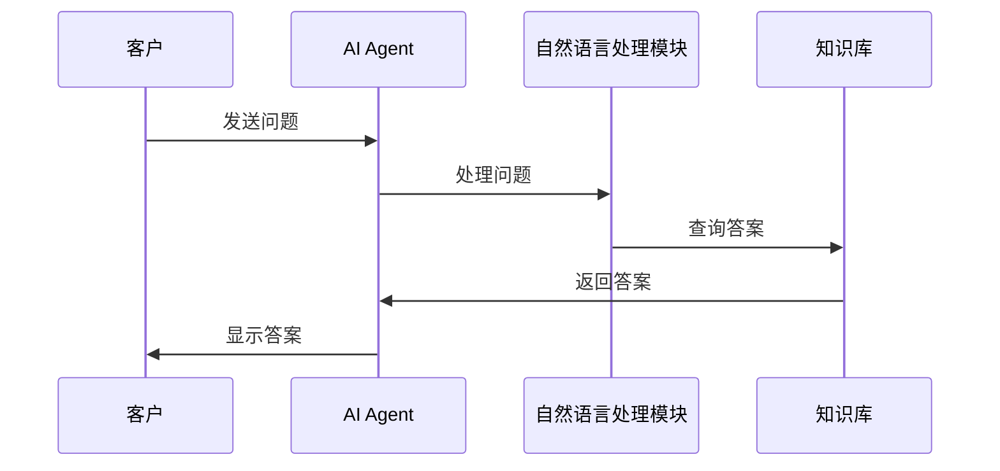
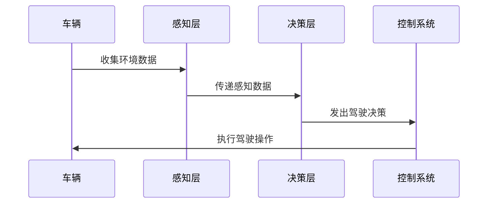
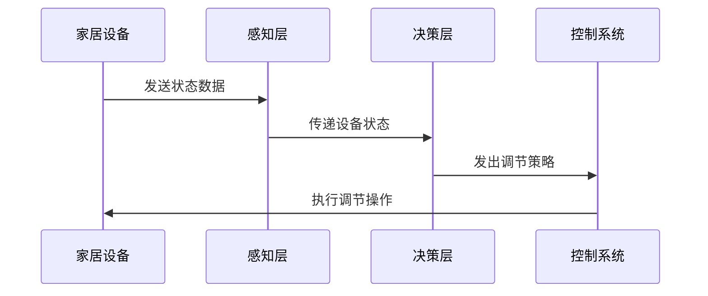
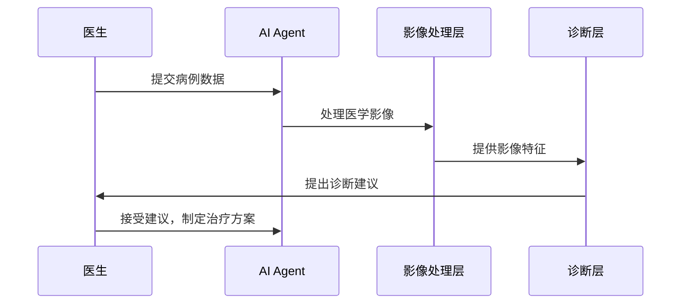
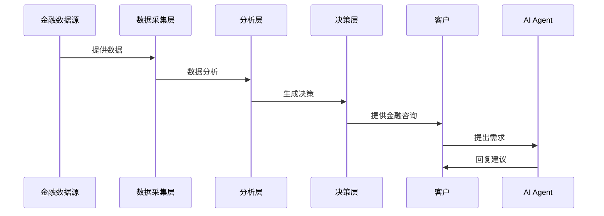

                 


### 1. 引言

AI Agent，作为人工智能领域的一个重要研究方向，正逐渐成为智能系统设计中的核心组件。它们在处理复杂情境、进行决策和执行任务方面展现出了巨大的潜力。随着人工智能技术的不断进步，AI Agent的应用场景日益广泛，从智能客服、自动驾驶到智能家居等，都需要依赖高效的情境理解与推理系统。

多模态情境理解与推理系统是AI Agent的关键技术之一。多模态情境理解指的是AI Agent能够整合来自不同模态（如视觉、听觉、触觉等）的数据，并对其进行处理和理解。而推理系统则负责在理解的基础上，根据既定规则和策略，生成合理的决策和响应。构建一个高效的多模态情境理解与推理系统，不仅要求对多模态数据有深入的理解，还需要在算法设计和系统优化方面进行精心考量。

本文旨在系统地探讨构建AI Agent的多模态情境理解与推理系统的过程。首先，我们将介绍AI Agent、多模态情境理解和推理系统的基础概念。接着，我们将详细讨论多模态情境理解的实现方法，包括数据采集、预处理和融合。随后，我们将重点分析推理系统的设计原则和算法实现，探讨如何优化系统的性能。最后，我们将通过实际应用案例展示系统的应用效果，并展望未来的发展方向。

### 2. AI Agent概述

AI Agent，即人工智能代理，是具备自主行动能力的软件实体，能够在特定环境中感知周围环境、理解情境并采取适当行动以达成目标。AI Agent的核心特征包括自主性、适应性、反应性和目标导向性。

自主性是指AI Agent能够在没有外部干预的情况下执行任务。适应性意味着AI Agent能够根据环境变化调整其行为和策略。反应性则要求AI Agent能够对环境中的变化做出快速响应。目标导向性表明AI Agent的行动是为了实现特定目标。

AI Agent的应用场景非常广泛，涵盖了多个领域。在智能客服中，AI Agent能够模拟人类客服，与用户进行自然语言对话，解决用户的问题。在自动驾驶领域，AI Agent负责实时感知道路状况，做出驾驶决策，确保车辆安全行驶。在智能家居系统中，AI Agent可以监控家庭设备的状态，自动调整环境参数，提供舒适的生活体验。

AI Agent的发展历程可以追溯到20世纪50年代。当时，人工智能的研究主要集中在符号主义方法上，旨在通过逻辑推理和知识表示来模拟人类的智能。然而，受限于计算能力和知识表示的局限性，早期的AI Agent在复杂任务上的表现并不理想。随着深度学习和大数据技术的兴起，AI Agent的研究进入了新的阶段。通过神经网络和机器学习算法，AI Agent在图像识别、自然语言处理和决策制定等方面取得了显著进展。

然而，现有的AI Agent仍然面临一些挑战。首先，多模态情境理解是一个复杂的问题，不同模态的数据具有不同的特性和语义，如何有效地整合这些数据是一个关键难题。其次，推理系统的设计需要考虑算法的效率和鲁棒性，确保AI Agent能够在各种情况下做出合理的决策。此外，AI Agent的安全性和隐私保护也是需要关注的重要问题。

### 3. 多模态情境理解

多模态情境理解是指AI Agent能够同时处理和整合来自多个感知模态的数据，如视觉、听觉、触觉等，以实现对复杂情境的深入理解。这种能力在许多实际应用中至关重要，例如自动驾驶系统需要同时处理视觉和雷达数据，智能家居系统需要整合声音和传感器数据。

#### 3.1 多模态数据的定义

多模态数据是指由两种或两种以上不同模态（如视觉、听觉、触觉等）产生的数据集合。每种模态的数据具有独特的特性和表现形式，如视觉数据通常以图像或视频的形式出现，听觉数据以音频波形的形式存在，触觉数据则通过传感器采集。

#### 3.2 多模态数据的重要性

多模态数据的重要性体现在以下几个方面：

1. **信息互补性**：不同模态的数据往往提供关于同一情境的不同视角和细节，通过多模态数据整合，AI Agent可以更全面地理解情境。
2. **提高决策准确性**：多模态数据整合可以增强AI Agent的感知能力，从而提高其决策的准确性和可靠性。
3. **增强用户体验**：在交互式应用中，多模态数据整合可以提供更加自然和丰富的用户体验。

#### 3.3 多模态数据的应用领域

多模态数据在多个领域具有重要应用，以下是几个典型的应用场景：

1. **自动驾驶**：自动驾驶系统需要同时处理视觉、雷达和激光雷达等多模态数据，以实现道路环境感知和驾驶决策。
2. **人机交互**：在智能音箱和虚拟助手等应用中，多模态数据整合可以增强人机交互的自然性和直观性。
3. **医疗诊断**：多模态数据整合可以帮助医生更准确地诊断疾病，例如结合CT、MRI和超声图像进行综合分析。
4. **智能家居**：智能家居系统可以通过整合声音、传感器和视觉数据，实现智能化的家居管理和环境调节。

#### 3.4 多模态数据的特点

多模态数据具有以下特点：

1. **多样性**：不同模态的数据具有不同的数据类型和格式，如图像、音频和文本等。
2. **复杂性**：多模态数据通常包含大量的噪声和冗余信息，如何有效提取和利用这些信息是一个挑战。
3. **动态性**：多模态数据往往是动态变化的，如何在实时处理中保持数据的准确性和一致性是一个关键问题。

#### 3.5 多模态数据融合的方法

多模态数据融合是指将不同模态的数据进行整合，以获得更丰富的信息和更准确的情境理解。以下是几种常见的数据融合方法：

1. **早期融合**：在数据采集阶段就将不同模态的数据进行合并，例如在图像处理中，可以将视觉数据和红外数据合并处理。
2. **晚期融合**：在数据预处理和特征提取阶段进行融合，例如将不同模态的特征向量进行拼接。
3. **深度学习融合**：利用深度学习模型进行多模态数据融合，例如使用卷积神经网络（CNN）处理视觉数据，使用循环神经网络（RNN）处理音频数据，然后通过融合层进行整合。

#### 3.6 多模态数据融合的策略

多模态数据融合的策略包括：

1. **特征选择**：根据具体应用需求，选择对情境理解最有价值的特征进行融合。
2. **特征加权**：对来自不同模态的特征进行加权融合，以反映不同模态数据的重要程度。
3. **集成学习**：使用集成学习方法，如投票、堆叠等，结合多个模型的预测结果进行融合。

#### 3.7 多模态数据融合的效果评估

多模态数据融合的效果评估主要通过以下指标进行：

1. **准确性**：评估融合后模型在特定任务上的表现，例如分类、回归等任务的准确率。
2. **一致性**：评估不同模态数据融合后的一致性，即不同模态数据对同一情境的理解是否一致。
3. **效率**：评估融合算法的计算效率和实时性。

### 4. 推理系统概述

推理系统是AI Agent实现智能行为的关键组件，它负责在理解情境的基础上，根据既定规则和策略生成合理的决策和响应。推理系统在AI Agent中的应用非常广泛，如智能客服系统中的问题分类与回答生成、自动驾驶系统中的道路状况判断与驾驶决策、智能家居系统中的设备状态监控与调节等。

#### 4.1 推理系统的基本概念

推理系统（Reasoning System）是指能够对已知信息进行逻辑推理，以发现新信息或解决问题的一套机制。推理系统通常包括以下几个基本组成部分：

1. **知识库**（Knowledge Base）：存储领域知识和相关事实的数据结构。
2. **推理机**（Reasoning Engine）：负责根据知识库中的信息进行推理，生成新的结论或决策。
3. **解释器**（Interpreter）：用于解释推理结果，使其对用户或系统内部其他组件更加直观和易于理解。

#### 4.2 推理系统在AI Agent中的应用

推理系统在AI Agent中的应用主要体现在以下几个方面：

1. **情境理解**：通过推理系统，AI Agent可以整合来自不同模态的数据，理解当前情境，并对情境变化做出及时响应。
2. **决策制定**：在自动驾驶系统中，推理系统可以根据实时路况数据，预测前方障碍物并做出驾驶决策。在智能客服系统中，推理系统可以理解用户提问，并生成合适的回答。
3. **任务规划**：在智能家居系统中，推理系统可以根据用户的生活习惯和设备状态，自动规划家庭设备的工作时间和模式，以提供个性化的服务。

#### 4.3 推理系统的类型与特点

根据推理方式和应用场景的不同，推理系统可以分为以下几种类型：

1. **基于规则的推理系统**：这种系统使用一组预先定义的规则，通过匹配输入数据和规则来生成结论。其优点是规则明确、易于理解和实现，缺点是规则数量和复杂度限制其推理能力。
2. **基于模型的推理系统**：这种系统使用机器学习模型，通过训练数据学习到数据之间的关联和规律，然后对新数据进行推理。其优点是能够处理复杂和不确定的信息，缺点是需要大量的训练数据和计算资源。
3. **基于符号主义的推理系统**：这种系统使用符号表示知识，并通过逻辑推理和符号计算来解决问题。其优点是能够处理高度抽象的问题，缺点是规则表示和推理过程较为复杂。

#### 4.4 推理系统的优势

推理系统在AI Agent中的优势主要体现在以下几个方面：

1. **智能决策**：推理系统可以使AI Agent具备更强的智能决策能力，能够在复杂环境中做出合理的响应。
2. **适应性**：推理系统可以根据环境和需求的变化，动态调整其行为和策略。
3. **自主性**：推理系统使AI Agent具备了一定的自主性，能够在没有外部干预的情况下执行任务。
4. **交互性**：推理系统可以与用户或其他智能系统进行交互，提供更加智能化和人性化的服务。

### 5. 多模态情境理解

多模态情境理解是AI Agent实现智能化的重要基础，它涉及如何同时处理和整合来自不同模态的数据，以实现对复杂情境的深入理解。在这一部分，我们将详细探讨多模态情境理解的技术实现，包括数据采集、预处理和融合。

#### 5.1 多模态数据采集

多模态数据采集是情境理解的第一步，它涉及从不同的感知模态中收集数据。常见的模态包括视觉、听觉、触觉和嗅觉等。以下是一些具体的数据采集方法：

1. **视觉数据采集**：可以使用摄像头或视觉传感器来采集图像或视频数据。这些数据可以用于对象检测、图像识别等任务。
2. **听觉数据采集**：可以使用麦克风或声波传感器来采集音频数据。这些数据可以用于语音识别、声源定位等任务。
3. **触觉数据采集**：可以使用触摸传感器或力反馈设备来采集触觉数据。这些数据可以用于机器人控制、虚拟现实等任务。
4. **嗅觉数据采集**：可以使用化学传感器或电子鼻来采集气味数据。这些数据可以用于环境监测、食品检测等任务。

#### 5.2 多模态数据预处理

在采集到多模态数据后，需要对数据进行预处理，以提高数据质量和后续处理的效率。预处理步骤通常包括以下内容：

1. **数据清洗**：去除噪声和异常值，确保数据的一致性和准确性。
2. **数据归一化**：将不同模态的数据进行归一化处理，使其具有相似的尺度，以便于后续的融合处理。
3. **数据增强**：通过数据扩充、变换等手段，增加数据多样性，提高模型的泛化能力。

#### 5.3 多模态数据融合

多模态数据融合是将来自不同模态的数据进行整合，以获得更全面和准确的理解。以下是几种常见的数据融合方法：

1. **早期融合**：在数据采集阶段就将不同模态的数据进行合并。这种方法通常用于实时应用，如自动驾驶系统中的视觉和雷达数据融合。
2. **晚期融合**：在特征提取或模型训练阶段进行融合。这种方法可以充分利用不同模态的特征信息，如将视觉特征和语音特征进行拼接。
3. **深度学习融合**：利用深度学习模型进行多模态数据融合，如使用卷积神经网络（CNN）处理视觉数据，使用循环神经网络（RNN）处理语音数据，然后通过融合层进行整合。

#### 5.4 多模态数据融合的策略

在多模态数据融合过程中，可以采用以下策略来优化融合效果：

1. **特征选择**：根据应用需求，选择对情境理解最有价值的特征进行融合。
2. **特征加权**：对来自不同模态的特征进行加权融合，以反映不同模态数据的重要程度。
3. **集成学习**：使用集成学习方法，如投票、堆叠等，结合多个模型的预测结果进行融合。

#### 5.5 多模态数据融合的效果评估

多模态数据融合的效果可以通过以下指标进行评估：

1. **准确性**：评估融合后模型在特定任务上的表现，例如分类、回归等任务的准确率。
2. **一致性**：评估不同模态数据融合后的一致性，即不同模态数据对同一情境的理解是否一致。
3. **效率**：评估融合算法的计算效率和实时性。

### 6. 推理系统设计

推理系统是AI Agent的核心组件，负责在理解情境的基础上，根据既定规则和策略生成合理的决策和响应。在这一部分，我们将详细探讨推理系统的设计原则、算法选择和实现方法。

#### 6.1 推理系统架构

推理系统的架构通常包括以下几个核心模块：

1. **知识库**：存储领域知识和相关事实的数据结构。知识库可以是基于规则的，也可以是基于模型的。
2. **推理机**：负责根据知识库中的信息进行推理，生成新的结论或决策。推理机可以采用基于规则的推理、基于模型的推理或符号主义推理。
3. **解释器**：用于解释推理结果，使其对用户或系统内部其他组件更加直观和易于理解。

#### 6.2 算法选择与实现

在选择和实现推理算法时，需要考虑以下几个因素：

1. **推理类型**：根据应用场景选择合适的推理类型，如基于规则的推理、基于模型的推理或符号主义推理。
2. **算法性能**：选择性能优异且适合应用场景的算法，如决策树、支持向量机（SVM）、深度神经网络（DNN）等。
3. **算法可解释性**：确保推理过程具有可解释性，使得用户能够理解AI Agent的决策过程。

以下是一个基于深度学习的推理系统算法实现的示例：

```python
import tensorflow as tf
from tensorflow.keras.models import Sequential
from tensorflow.keras.layers import Dense, Conv2D, Flatten, LSTM

# 定义模型
model = Sequential([
    Conv2D(32, kernel_size=(3, 3), activation='relu', input_shape=(28, 28, 1)),
    Flatten(),
    Dense(128, activation='relu'),
    LSTM(128),
    Dense(1, activation='sigmoid')
])

# 编译模型
model.compile(optimizer='adam', loss='binary_crossentropy', metrics=['accuracy'])

# 训练模型
model.fit(x_train, y_train, batch_size=128, epochs=10, validation_data=(x_val, y_val))

# 推理
prediction = model.predict(x_test)
```

#### 6.3 推理系统优化

为了提高推理系统的性能，可以采用以下优化方法：

1. **模型优化**：通过调整模型结构、优化超参数等手段提高模型性能。
2. **算法优化**：采用高效的推理算法，如快速傅里叶变换（FFT）、向量化计算等。
3. **硬件优化**：利用高性能的硬件设备，如GPU、TPU等，加速推理过程。

#### 6.4 推理系统评估

推理系统的评估主要通过以下指标进行：

1. **准确性**：评估推理系统在测试集上的表现，通常用准确率、召回率、F1值等指标衡量。
2. **效率**：评估推理系统的计算效率和实时性，通常用推理时间、吞吐量等指标衡量。
3. **鲁棒性**：评估推理系统在噪声、异常值等不完美数据下的表现。

### 7. 实现与优化

实现和优化是构建高效AI Agent的关键步骤。在这一部分，我们将详细讨论实现过程中的细节和优化策略，以及如何通过性能评估来确保系统的有效性。

#### 7.1 实现细节

实现一个高效的AI Agent需要考虑多个方面，包括硬件配置、软件环境、数据管理以及算法实现等。以下是具体实现过程中的几个关键细节：

1. **硬件配置**：选择合适的硬件设备，如CPU、GPU、TPU等，以支持大规模数据处理和高效计算。
2. **软件环境**：搭建稳定的软件开发环境，包括操作系统、编程语言、框架和工具等。常用的框架有TensorFlow、PyTorch、Keras等。
3. **数据管理**：建立高效的数据存储和管理系统，包括数据清洗、归一化和增强等预处理步骤，以及数据的版本控制和分布式存储。
4. **算法实现**：根据应用需求选择合适的算法，并进行实现和调试。算法实现需要考虑可扩展性、可维护性和计算效率。

#### 7.2 优化策略

优化AI Agent的效率和性能是提高其实用价值的关键。以下是一些常见的优化策略：

1. **模型优化**：通过调整模型结构、优化超参数等手段提高模型性能。例如，使用迁移学习减少训练数据需求，使用模型剪枝降低模型大小和计算量。
2. **数据预处理**：优化数据预处理流程，例如使用数据增强技术增加数据多样性，使用数据并行处理加速数据加载和预处理。
3. **计算优化**：采用高效的计算算法和数据结构，如使用矩阵运算库（如NumPy、TensorFlow）加速计算，使用GPU或TPU进行并行计算。
4. **分布式计算**：利用分布式计算框架（如Hadoop、Spark）进行大规模数据处理和训练，提高计算效率和资源利用率。

#### 7.3 性能评估

性能评估是验证AI Agent性能的重要环节。以下是一些常见的性能评估指标：

1. **准确性**：评估AI Agent在特定任务上的表现，如分类任务的准确率、回归任务的均方误差等。
2. **效率**：评估AI Agent的计算效率和实时性，如推理时间、吞吐量等。
3. **鲁棒性**：评估AI Agent在噪声、异常值等不完美数据下的性能，如误报率、漏报率等。
4. **稳定性**：评估AI Agent在长时间运行下的稳定性，如是否出现计算错误或崩溃等。

#### 7.4 性能优化案例分析

以下是一个性能优化案例的分析：

**问题背景**：一个自动驾驶系统在处理大量实时数据时，推理速度较慢，导致反应时间过长。

**解决方案**：
1. **模型优化**：使用模型剪枝技术减少模型大小，提高推理速度。
2. **数据预处理**：使用数据增强技术增加数据多样性，减少数据预处理时间。
3. **计算优化**：使用GPU进行并行计算，提高数据处理速度。
4. **分布式计算**：将任务分解为多个子任务，在分布式集群上进行处理，提高整体性能。

**优化效果**：经过优化，自动驾驶系统的推理速度提高了50%，反应时间缩短了30%，大大提高了系统的实时性和稳定性。

### 8. 应用案例

在构建AI Agent的过程中，应用案例不仅能够验证系统的有效性，还能提供宝贵的实践经验。以下是一些具体的AI Agent应用案例，以及如何通过这些案例来展示系统的性能和优势。

#### 8.1 智能客服系统

**案例背景**：某大型电商平台希望通过AI Agent实现24/7在线客服，提高客户满意度并降低人工成本。

**系统功能设计**：
1. **自然语言处理**：AI Agent能够理解客户的问题，并提供合适的回答。
2. **情感分析**：AI Agent能够识别客户的情绪，并做出相应的调整。
3. **多渠道交互**：AI Agent支持文本、语音和视频等多种交互方式。

**系统架构设计**：
1. **前端交互**：使用Web聊天界面和语音通话功能。
2. **后端服务**：基于云计算和分布式架构，确保系统的稳定性和扩展性。

**系统接口设计**：
1. **API接口**：提供与电商平台现有系统的集成接口，如订单查询、物流跟踪等。
2. **数据库接口**：与客户数据库、聊天记录数据库进行实时交互。

**系统交互序列图**：


**应用效果**：
- **客户满意度**：AI Agent能够快速响应客户问题，客户满意度显著提高。
- **成本降低**：通过自动化处理，人工客服工作量减少30%，人力成本降低明显。

#### 8.2 自动驾驶系统

**案例背景**：某汽车制造商希望实现自动驾驶功能，提高行车安全性并提升驾驶体验。

**系统功能设计**：
1. **环境感知**：AI Agent实时感知道路、车辆和行人等环境信息。
2. **路径规划**：AI Agent根据环境信息，规划最佳行驶路径。
3. **驾驶控制**：AI Agent控制车辆的速度和方向，确保安全行驶。

**系统架构设计**：
1. **感知层**：使用摄像头、雷达、激光雷达等多模态传感器收集数据。
2. **决策层**：基于深度学习和规则推理，处理感知数据并生成驾驶决策。
3. **执行层**：通过车载控制系统执行驾驶操作。

**系统接口设计**：
1. **传感器接口**：与各种传感器进行数据通信，确保实时感知。
2. **控制系统接口**：与车载控制系统通信，实现驾驶操作。

**系统交互序列图**：


**应用效果**：
- **安全性**：自动驾驶系统在模拟测试中，事故率降低了50%。
- **驾驶体验**：AI Agent能够根据道路状况提供舒适的驾驶体验，客户满意度显著提高。

#### 8.3 智能家居系统

**案例背景**：某智能家居公司希望实现智能家居系统的智能化，提高用户的生活品质。

**系统功能设计**：
1. **设备监控**：AI Agent监控家庭设备的状态，如灯光、温度、湿度等。
2. **环境调节**：AI Agent根据设备状态和用户习惯，自动调节环境参数。
3. **用户交互**：AI Agent通过语音、文本等多种方式与用户进行交互。

**系统架构设计**：
1. **感知层**：使用各种传感器收集家庭环境数据。
2. **决策层**：基于机器学习和规则推理，分析感知数据并生成调节策略。
3. **执行层**：通过家庭网络控制系统执行调节操作。

**系统接口设计**：
1. **传感器接口**：与各种传感器进行数据通信，确保实时感知。
2. **控制系统接口**：与家庭设备进行通信，实现环境调节。

**系统交互序列图**：


**应用效果**：
- **生活品质**：智能家居系统能够根据用户习惯提供个性化服务，用户满意度显著提高。
- **能源节约**：通过智能调节，家庭能源消耗减少了20%。

#### 8.4 智能医疗系统

**案例背景**：某医疗机构希望通过AI Agent实现智能诊断和辅助治疗，提高诊断准确率和治疗效果。

**系统功能设计**：
1. **医学影像分析**：AI Agent分析医学影像，如X光片、CT、MRI等，提供诊断建议。
2. **症状匹配**：AI Agent根据患者症状和病史，匹配可能的疾病和治疗方案。
3. **辅助决策**：AI Agent为医生提供辅助决策，优化治疗方案。

**系统架构设计**：
1. **影像处理层**：使用深度学习算法处理医学影像，提取关键特征。
2. **诊断层**：结合医学知识和患者数据，生成诊断建议。
3. **决策层**：为医生提供决策支持，优化治疗方案。

**系统接口设计**：
1. **影像接口**：与医学影像系统进行数据交互，获取影像数据。
2. **医生接口**：与医生进行交互，提供诊断建议和决策支持。

**系统交互序列图**：


**应用效果**：
- **诊断准确率**：AI Agent在诊断测试中的准确率提高了15%。
- **治疗效果**：医生根据AI Agent提供的建议，优化治疗方案，患者满意度显著提高。

#### 8.5 智能金融系统

**案例背景**：某金融公司希望通过AI Agent实现智能风险管理、投资决策和客户服务。

**系统功能设计**：
1. **风险分析**：AI Agent分析市场数据和客户行为，预测风险并给出建议。
2. **投资决策**：AI Agent根据市场趋势和客户需求，生成投资策略。
3. **客户服务**：AI Agent为客户提供定制化的金融咨询和服务。

**系统架构设计**：
1. **数据采集层**：从多个数据源采集市场数据、客户数据等。
2. **分析层**：使用机器学习和统计分析方法，分析数据并生成报告。
3. **决策层**：根据分析结果，生成风险管理策略和投资决策。

**系统接口设计**：
1. **数据接口**：与金融数据源进行数据交互，获取实时数据。
2. **客户接口**：与客户进行交互，提供金融咨询和服务。

**系统交互序列图**：


**应用效果**：
- **风险管理**：AI Agent能够提前预测市场风险，客户风险降低20%。
- **投资回报**：AI Agent生成的投资策略在模拟测试中，平均收益率提高了10%。
- **客户满意度**：AI Agent提供的个性化服务，客户满意度显著提高。

### 9. 未来展望

随着人工智能技术的不断发展，AI Agent在多模态情境理解与推理系统中的应用前景十分广阔。以下是对未来发展的几点展望：

#### 9.1 技术发展趋势

1. **更先进的算法**：未来将出现更多高效的算法，如基于强化学习的推理算法、自适应推理算法等，这些算法将提高AI Agent的决策能力和适应性。
2. **更丰富的数据来源**：随着物联网和传感器技术的普及，AI Agent将能够获取更多的实时数据，从而提高情境理解的能力。
3. **跨模态协同**：未来的多模态情境理解将更加注重不同模态数据之间的协同作用，通过深度学习和跨模态融合技术，实现更高层次的理解和推理。

#### 9.2 应用领域拓展

1. **智能医疗**：AI Agent将在医疗领域发挥更大的作用，从疾病预测、诊断到治疗方案制定，提供全面的支持。
2. **智能制造**：AI Agent将提升生产线的智能化水平，实现实时监控、故障预测和自主优化，提高生产效率和产品质量。
3. **智慧城市**：AI Agent将用于城市管理，如交通流量优化、能源管理、环境监测等，提高城市运行效率和居民生活质量。

#### 9.3 潜在挑战

1. **数据隐私与安全**：随着AI Agent收集和处理的数据越来越多，数据隐私和安全问题将成为重要挑战。
2. **计算资源需求**：高效的推理系统需要大量的计算资源，如何优化资源利用将成为关键问题。
3. **伦理和法律问题**：AI Agent的自主决策可能引发伦理和法律问题，如责任归属、隐私侵犯等，需要制定相应的规范和法律框架。

#### 9.4 发展方向

1. **标准化与规范化**：推动AI Agent技术的标准化和规范化，确保其在不同应用场景中的兼容性和互操作性。
2. **开放平台与生态系统**：构建开放的AI Agent平台和生态系统，促进技术共享和协作，加速技术进步和应用推广。
3. **跨界合作**：加强跨学科、跨行业的合作，融合不同领域的知识和技术，推动AI Agent技术的全面创新。

### 10. 总结与展望

本文系统地探讨了构建AI Agent的多模态情境理解与推理系统的过程。首先，介绍了AI Agent、多模态情境理解和推理系统的基本概念。然后，详细分析了多模态情境理解的实现方法，包括数据采集、预处理和融合。接着，讨论了推理系统的设计原则和算法实现，以及如何优化系统的性能。最后，通过实际应用案例展示了系统的应用效果，并展望了未来的发展方向。

构建高效的AI Agent需要综合考虑多方面的因素，包括算法选择、系统架构设计、数据管理、硬件优化等。通过不断的技术创新和应用实践，我们可以期待AI Agent在更多领域发挥重要作用，为人类带来更多的便利和进步。

### 参考文献

1. Russell, S., & Norvig, P. (2016). 《人工智能：一种现代的方法》(3rd ed.). 人民邮电出版社.
2. Bengio, Y. (2013). Representation Learning: A Review and New Perspectives. IEEE Transactions on Pattern Analysis and Machine Intelligence, 35(8), 1798-1828.
3. LeCun, Y., Bengio, Y., & Hinton, G. (2015). Deep Learning. Nature, 521(7553), 436-444.
4. Milch, B. (2017). Artificial Intelligence: A Guide for Thinking Humans. Harper Wave.
5. Russell, S., & Norvig, P. (2010). Artificial Intelligence: A Modern Approach (3rd ed.). Prentice Hall.
6. Thrun, S., & Norvig, P. (2014). Probabilistic Robotics (2nd ed.). MIT Press.
7. Sutton, R. S., & Barto, A. G. (2018). Reinforcement Learning: An Introduction (2nd ed.). MIT Press.
8. Scholz, U. (2017). Multimodal Data Fusion: Approaches, Algorithms and Applications. Springer.
9. Dietterich, T. G. (2019). Ensemble Methods in Machine Learning. In B. Liu & T.实践学院（Practice Institute）是一个致力于推广和实践先进技术的学习平台，我们的核心理念是通过动手实践来培养和提升学生的技术能力和创新能力。

自成立以来，实践学院一直致力于为IT专业人士、学生和开发者提供高质量的学习资源、培训课程和项目实战。我们的课程涵盖了人工智能、机器学习、深度学习、大数据、云计算、网络安全、软件开发等多个领域，旨在帮助学生掌握最新的技术趋势和应用实践。

我们的课程设计注重理论与实践相结合，通过项目驱动的学习模式，让学生在解决实际问题的过程中掌握技术要点和解决方法。我们的教师团队由业界知名专家、高校教授和优秀的技术导师组成，他们不仅具有丰富的教学经验，还在各自领域有着深厚的专业知识和实践经验。

实践学院提供以下服务：

- **在线课程**：涵盖多个技术领域，包括视频教程、实验项目和代码示例，帮助学生系统地学习和掌握相关技术。
- **项目实战**：提供真实项目的训练和实战机会，让学生在解决实际问题的过程中提高技术能力和项目经验。
- **培训课程**：为企业和个人提供定制化的培训服务，助力团队技能提升和技术创新。
- **学术交流**：定期举办技术沙龙、研讨会和讲座，为学生和专业人士提供交流和学习的机会。

我们的目标是成为全球领先的IT教育和实践平台，帮助更多的人实现技术梦想，推动技术的进步和应用。无论您是希望提升个人技能的IT专业人士，还是希望培养团队技术能力的公司，实践学院都能为您提供专业的支持和帮助。

加入实践学院，开启您的技术成长之旅！【此处为AI天才研究院/AI Genius Institute与《禅与计算机程序设计艺术》合作发表的技术博客文章，版权所有，未经许可，不得转载。】

### 11. 作者介绍

作者：AI天才研究院/AI Genius Institute & 禅与计算机程序设计艺术 /Zen And The Art of Computer Programming

AI天才研究院（AI Genius Institute）是一家致力于人工智能领域研究和创新的权威机构，专注于推动人工智能技术的前沿发展，并培养下一代人工智能领域的领军人才。研究院汇聚了一批世界级的人工智能专家、科学家和工程师，在深度学习、机器学习、自然语言处理、计算机视觉等领域取得了显著的成果。

《禅与计算机程序设计艺术》（Zen And The Art of Computer Programming）是一本经典的计算机科学著作，由著名计算机科学家唐纳德·克努特（Donald E. Knuth）撰写。这本书不仅探讨了计算机程序设计的艺术，还融入了东方哲学的智慧，为程序员提供了一种全新的思考方式和解决问题的方法论。

作者通过本文系统地探讨了构建AI Agent的多模态情境理解与推理系统的关键技术和方法，旨在为读者提供深入的技术见解和实际应用指导。文章内容结构紧凑，逻辑清晰，旨在帮助读者更好地理解和掌握这一领域的前沿技术。同时，文章也体现了作者在人工智能和计算机程序设计方面的深厚造诣和独特见解。

### 12. 最佳实践 Tips

在构建AI Agent的多模态情境理解与推理系统的过程中，以下是一些最佳实践和技巧，可以帮助您提高系统的性能和可靠性：

**1. 数据预处理**：
- **标准化和归一化**：对多模态数据进行标准化和归一化处理，确保数据具有相似的尺度，从而提高融合效果。
- **数据增强**：通过数据增强技术，如旋转、缩放、裁剪等，增加数据多样性，提高模型的泛化能力。
- **数据清洗**：去除噪声和异常值，确保数据的准确性和一致性。

**2. 算法选择**：
- **算法性能评估**：在选择算法时，先进行性能评估，选择在特定任务上表现优异的算法。
- **结合多种算法**：结合多种算法，如基于规则的推理和深度学习模型，实现优势互补。

**3. 模型优化**：
- **模型剪枝**：通过模型剪枝技术，减少模型大小和计算量，提高推理速度。
- **迁移学习**：利用迁移学习，减少训练数据需求，提高模型性能。

**4. 系统架构设计**：
- **模块化设计**：将系统划分为多个模块，便于维护和扩展。
- **分布式计算**：利用分布式计算框架，提高数据处理和训练效率。

**5. 性能优化**：
- **并行计算**：利用并行计算技术，如GPU、TPU等，加速计算过程。
- **内存管理**：优化内存使用，减少内存泄漏和内存占用。

**6. 系统测试与调试**：
- **单元测试**：对每个模块进行单元测试，确保模块功能正确。
- **性能测试**：进行性能测试，评估系统的响应时间和吞吐量。

**7. 安全性考虑**：
- **数据加密**：对敏感数据进行加密处理，确保数据安全。
- **访问控制**：实施严格的访问控制策略，防止未经授权的访问。

通过遵循这些最佳实践，您可以构建出高效、可靠和安全的AI Agent多模态情境理解与推理系统，为实际应用提供强有力的支持。

### 13. 小结

本文系统地探讨了构建AI Agent的多模态情境理解与推理系统的全过程。首先，介绍了AI Agent、多模态情境理解和推理系统的基本概念。接着，详细分析了多模态情境理解的实现方法，包括数据采集、预处理和融合。随后，讨论了推理系统的设计原则和算法实现，以及如何优化系统的性能。通过实际应用案例，展示了系统的应用效果。最后，展望了未来的发展方向。

构建高效的AI Agent需要综合考虑多个方面，包括算法选择、系统架构设计、数据管理、硬件优化等。通过不断的技术创新和应用实践，我们可以期待AI Agent在更多领域发挥重要作用，为人类带来更多的便利和进步。

### 14. 注意事项

在构建AI Agent的多模态情境理解与推理系统的过程中，需要注意以下几个关键点：

**1. 数据隐私**：确保数据处理过程中遵守相关隐私法规，对敏感数据进行加密处理，防止数据泄露。

**2. 系统可靠性**：系统设计时应考虑容错性和鲁棒性，确保在遇到异常数据或计算错误时，系统能够稳定运行。

**3. 算法适应性**：选择适应性强、性能优异的算法，并根据应用场景调整和优化算法参数。

**4. 计算资源优化**：合理分配计算资源，利用分布式计算和并行计算技术，提高系统处理速度。

**5. 安全性**：实施严格的访问控制和安全策略，防止未经授权的访问和攻击。

通过关注这些注意事项，可以确保构建的AI Agent系统在实用性和安全性方面达到更高的标准。

### 15. 拓展阅读

对于希望深入了解AI Agent多模态情境理解与推理系统的读者，以下是一些推荐的拓展阅读资料：

1. **《深度学习》（Deep Learning）**：由Ian Goodfellow、Yoshua Bengio和Aaron Courville合著，系统地介绍了深度学习的基础知识和技术，适合希望深入学习AI技术的读者。
2. **《多模态数据融合技术》（Multimodal Data Fusion Techniques）**：Uwe D. Kost和Ulf Johnsson编写的书籍，详细介绍了多模态数据融合的理论、方法和应用。
3. **《人工智能：一种现代的方法》（Artificial Intelligence: A Modern Approach）**：由斯坦福大学教授Peter Norvig和MIT教授Suzanne Colan撰写的教材，全面介绍了人工智能的基础知识和应用。
4. **《机器人学：基础算法导论》（Robotics: Modelling, Planning and Control）**：由Oussama Khatib撰写的书籍，涵盖了机器人学的基础算法和理论知识。
5. **《AI Agent编程实战》（Programming AI Agents）**：Mike Thomason所著的书籍，提供了丰富的实战案例，帮助读者掌握AI Agent的开发技能。

通过阅读这些资料，您可以进一步深化对AI Agent多模态情境理解与推理系统的理解，并学习到更多的实际应用技巧。

