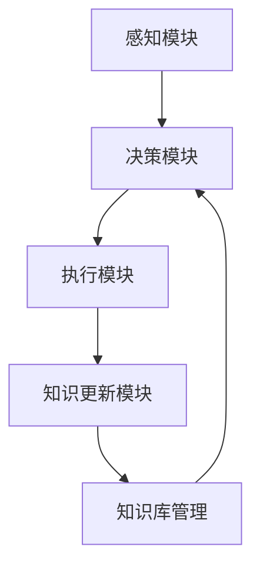
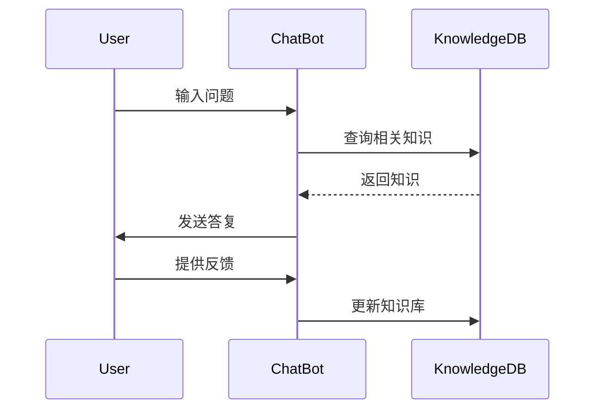
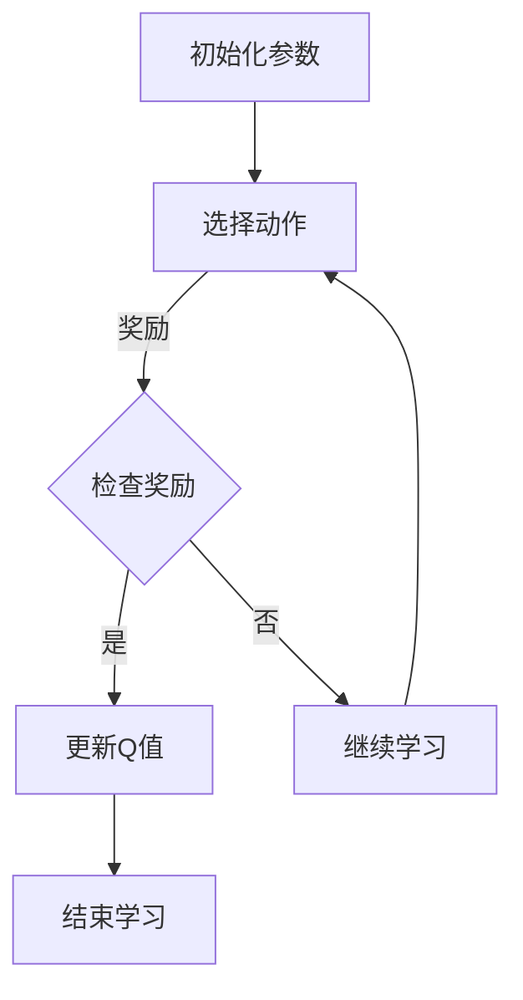

                 

# 《构建AI Agent的持续学习与知识更新机制》

## 关键词

- AI Agent
- 持续学习
- 知识更新
- 知识图谱
- 强化学习
- 自适应算法

## 摘要

本文旨在探讨构建AI Agent的持续学习与知识更新机制。首先，我们将介绍AI Agent的基本概念和重要性，然后深入分析AI Agent的持续学习与知识更新机制的理论基础和实现方法。文章将涵盖知识图谱构建、强化学习策略、自适应算法等方面，并通过项目实战案例进行详细解读。最后，本文将总结最佳实践，并提出未来发展方向。

## 目录大纲设计思路

在设计本文的目录大纲时，我们首先确定了核心主题，即如何构建AI Agent的持续学习与知识更新机制。为了确保文章内容的结构化和逻辑清晰，我们按照以下步骤进行：

1. **背景介绍**：阐述AI Agent的基本概念和其在各个领域的应用，为后续内容铺垫。
2. **核心概念与联系**：详细解释AI Agent持续学习与知识更新机制的相关概念，并通过对比表格和实体关系图展现概念属性特征。
3. **算法原理讲解**：通过mermaid流程图和Python代码，阐述核心算法的原理和数学模型。
4. **系统分析与架构设计方案**：分析项目场景，设计系统功能、架构和接口。
5. **项目实战**：介绍环境安装、系统核心实现，并进行代码应用解读与分析。
6. **最佳实践与总结**：总结最佳实践，提出注意事项，展望未来发展方向。

### 目录大纲结构

```markdown
# 《构建AI Agent的持续学习与知识更新机制》

## 第1章 问题背景与核心概念

### 1.1 问题背景

### 1.2 AI Agent的基本概念

### 1.3 持续学习与知识更新的重要性

## 第2章 AI Agent基础知识

### 2.1 AI Agent的定义与分类

### 2.2 AI Agent的工作原理

### 2.3 AI Agent的应用场景

## 第3章 持续学习机制

### 3.1 持续学习的基础原理

### 3.2 强化学习策略

### 3.3 自适应算法

## 第4章 知识更新机制

### 4.1 知识更新概述

### 4.2 知识图谱构建

### 4.3 知识库维护与更新

## 第5章 持续学习机制的架构设计

### 5.1 架构设计原则

### 5.2 持续学习机制的具体实现

### 5.3 评估与优化

## 第6章 知识更新机制的架构设计

### 6.1 架构设计原则

### 6.2 知识更新机制的具体实现

### 6.3 评估与优化

## 第7章 项目实战与案例分析

### 7.1 项目介绍与需求分析

### 7.2 系统设计与实现

### 7.3 系统测试与评估

## 第8章 最佳实践与总结

### 8.1 持续学习的最佳实践

### 8.2 知识更新的最佳实践

### 8.3 注意事项与挑战

### 8.4 拓展阅读

## 作者

作者：AI天才研究院/AI Genius Institute & 禅与计算机程序设计艺术 /Zen And The Art of Computer Programming
```

通过以上步骤和结构，我们为本文的内容呈现奠定了坚实的基础。接下来，我们将逐章深入探讨构建AI Agent的持续学习与知识更新机制的具体方法和实现。

----------------------------------------------------------------

## 第1章 问题背景与核心概念

### 1.1 问题背景

在当今信息化社会，人工智能（AI）技术已经深入到各个领域，从自动驾驶、智能家居到医疗诊断、金融分析，AI Agent作为一种智能实体，承担了越来越多的任务。然而，随着环境变化和需求多样化，AI Agent需要具备持续学习和知识更新的能力，以确保其适应性和准确性。

持续学习是指AI Agent能够从数据中学习，并不断改进自身的性能。知识更新则涉及AI Agent如何获取新的信息，并融合到现有的知识库中。这两个机制的实现对于AI Agent在动态环境中保持高效性能至关重要。

### 1.2 AI Agent的基本概念

AI Agent，即人工智能代理，是一种能够自主感知环境、执行任务并与其他实体交互的智能实体。它通常由感知模块、决策模块和执行模块组成。感知模块负责收集环境信息，决策模块基于感知信息进行决策，执行模块则将决策转化为具体行动。

AI Agent可以按照不同的标准进行分类，例如：

1. **基于规则的Agent**：通过预定义的规则进行决策。
2. **基于模型的Agent**：通过学习建立预测模型进行决策。
3. **混合型Agent**：结合规则和模型进行决策。

### 1.3 持续学习与知识更新的重要性

持续学习与知识更新是AI Agent能够适应动态环境的关键因素。具体来说：

1. **适应性**：环境变化时，AI Agent需要不断调整其行为策略，以保持高效率。
2. **准确性**：随着时间的推移，AI Agent的知识库可能过时，需要更新以保持准确性。
3. **学习效率**：有效的持续学习和知识更新机制可以加速AI Agent的学习过程，提高其性能。

在接下来的章节中，我们将深入探讨AI Agent的持续学习与知识更新机制的理论基础、算法实现和项目实战。

----------------------------------------------------------------

## 第2章 AI Agent基础知识

### 2.1 AI Agent的定义与分类

AI Agent是一种能够模拟人类智能行为，实现自主感知、决策和行动的计算机程序。它是一种智能体（agent），能够与环境进行交互，并在不断学习的过程中优化自身的性能。AI Agent通常由三个主要模块组成：感知模块、决策模块和执行模块。

- **感知模块**：负责收集环境信息，如图像、声音、传感器数据等。
- **决策模块**：根据感知模块提供的信息，通过算法进行决策，选择最佳的行动方案。
- **执行模块**：将决策模块输出的行动方案转化为实际操作。

AI Agent按照不同的分类标准可以分为多种类型：

1. **基于规则的Agent**：这类Agent通过预定义的规则库进行决策，规则通常以“如果...那么...”的形式表达。这种Agent适合处理结构化、规则明确的问题。
2. **基于模型的Agent**：这类Agent通过学习建立预测模型，如决策树、神经网络等，进行决策。它们能够处理更加复杂的问题，并能从数据中自动学习。
3. **混合型Agent**：这类Agent结合了基于规则和基于模型的方法，能够根据环境的变化动态调整决策策略。

### 2.2 AI Agent的工作原理

AI Agent的工作原理可以概括为以下几个步骤：

1. **感知**：AI Agent通过传感器感知环境信息，如摄像头捕捉图像、麦克风接收声音、传感器收集物理量等。
2. **决策**：感知模块将收集到的信息传递给决策模块，决策模块通过算法分析信息，生成一系列可能的行动方案。
3. **执行**：决策模块选择最佳行动方案，传递给执行模块，执行模块将决策转化为具体操作，如移动机器人、发送电子邮件等。
4. **反馈**：环境对AI Agent的行动进行反馈，感知模块再次收集反馈信息，进入下一个循环。

### 2.3 AI Agent的应用场景

AI Agent在各个领域都有广泛的应用，以下是一些典型的应用场景：

1. **智能制造**：在工业生产过程中，AI Agent可以监控设备状态、预测故障、优化生产流程等。
2. **智能交通**：在交通管理中，AI Agent可以优化交通信号、预测交通流量、协助驾驶等。
3. **智能家居**：在家居环境中，AI Agent可以控制家电、管理家居安全、提供个性化服务等。
4. **医疗健康**：在医疗服务中，AI Agent可以辅助诊断、提供健康咨询、管理病人档案等。
5. **金融理财**：在金融领域，AI Agent可以分析市场、预测股票价格、提供投资建议等。

AI Agent的应用场景不断扩大，随着技术的发展，它们将在更多领域发挥重要作用。在接下来的章节中，我们将进一步探讨AI Agent的持续学习与知识更新机制，以及如何在实际项目中实现这些机制。

----------------------------------------------------------------

## 第3章 持续学习机制

### 3.1 持续学习的基础原理

持续学习是指AI Agent在运行过程中，通过不断获取新的数据和信息，更新自身的模型和策略，以适应环境变化和任务需求。持续学习的基础原理包括以下几个方面：

1. **数据驱动**：AI Agent通过不断收集和处理环境中的数据，学习新的知识，并将其应用于决策过程。数据的质量和数量直接影响持续学习的效果。
2. **模型更新**：AI Agent的模型需要在持续学习过程中不断更新，以适应新的环境和任务。模型更新的方法包括在线学习、迁移学习、增量学习等。
3. **反馈机制**：AI Agent通过反馈机制，评估自身决策的效果，并根据反馈进行模型修正和策略调整。反馈可以是显式的，如用户评价，也可以是隐式的，如环境响应。

### 3.2 强化学习策略

强化学习是一种重要的持续学习策略，它通过奖励和惩罚机制，使AI Agent在试错过程中不断优化决策。强化学习的基本原理如下：

1. **状态-动作价值函数**：强化学习使用状态-动作价值函数（Q函数）来评估每个状态下的动作值。Q函数的值越大，表示该动作在该状态下的效果越好。
2. **策略迭代**：强化学习通过策略迭代的方式，不断优化AI Agent的决策。策略迭代的过程包括：选择动作、执行动作、获取奖励、更新Q函数。
3. **探索与利用**：在强化学习中，探索（exploration）和利用（exploitation）是两个重要的概念。探索是指AI Agent在未知环境中尝试新的动作，以增加学习经验；利用是指AI Agent在已知环境中选择已证明效果较好的动作，以最大化回报。

### 3.3 自适应算法

自适应算法是另一种关键的持续学习策略，它通过动态调整算法参数，使AI Agent能够适应不同的环境和任务。自适应算法的基本原理如下：

1. **参数调整**：自适应算法通过调整算法参数，优化模型性能。参数调整可以是手动调整，也可以是自动调整。
2. **在线学习**：自适应算法支持在线学习，即AI Agent在运行过程中，可以实时调整参数，以适应环境变化。
3. **自适应策略**：自适应算法采用自适应策略，根据环境反馈动态调整决策策略，以实现最佳性能。

在接下来的章节中，我们将深入探讨持续学习机制在AI Agent中的应用，并介绍具体的实现方法和工具。

----------------------------------------------------------------

## 第4章 知识更新机制

### 4.1 知识更新概述

知识更新机制是确保AI Agent能够适应动态环境、处理新问题和解决新挑战的关键。知识更新机制涉及从数据中提取知识、将知识整合到现有知识库中，并确保知识库的持续更新和维护。

#### 知识更新的重要性

1. **适应环境变化**：环境变化会导致现有知识的失效或部分失效，知识更新机制使AI Agent能够及时适应新环境。
2. **提高决策准确性**：准确的、最新的知识库能够提高AI Agent的决策准确性，减少错误决策。
3. **支持持续学习**：知识更新机制是持续学习的基础，通过持续获取和整合新知识，AI Agent能够不断优化自身性能。

#### 知识更新机制的主要任务

1. **知识提取**：从数据源中提取有用的知识，如规则、模式、关系等。
2. **知识融合**：将新知识整合到现有知识库中，确保知识的一致性和完整性。
3. **知识维护**：定期更新和修复知识库中的知识，保持其准确性和有效性。

### 4.2 知识获取与融合

#### 知识获取

知识获取是知识更新机制的核心任务之一，主要包括以下方法：

1. **数据挖掘**：通过数据挖掘技术，从大量数据中提取潜在的知识和模式。
2. **机器学习**：利用机器学习算法，从数据中学习新的规则和关系。
3. **人工标注**：通过人工标注数据，获取高质量的先验知识。

#### 知识融合

知识融合是将新知识整合到现有知识库中的过程，确保知识库的一致性和完整性。知识融合的方法包括：

1. **知识合并**：将新知识直接合并到现有知识库中，适用于知识结构相似的情况。
2. **知识替换**：用新知识替换过时或错误的知识，适用于知识库中存在错误或无效知识的情况。
3. **知识扩展**：在现有知识库的基础上，添加新的知识和信息，适用于知识库需要扩展以适应新环境的情况。

#### 知识库维护与更新

知识库维护与更新是确保知识库准确性和有效性的关键。主要方法包括：

1. **周期性检查**：定期对知识库进行检查，发现和修复错误或无效知识。
2. **版本控制**：对知识库的更新进行版本控制，确保知识库的历史记录和变更记录。
3. **用户反馈**：根据用户反馈，更新和优化知识库，以适应用户需求和偏好。

在接下来的章节中，我们将进一步探讨知识更新机制的架构设计，以及如何在AI Agent中实现这些机制。

----------------------------------------------------------------

## 第5章 持续学习机制的架构设计

### 5.1 架构设计原则

设计持续学习机制时，需要遵循以下原则：

1. **模块化**：将持续学习功能分解为独立的模块，如数据收集模块、学习算法模块、模型更新模块等，便于维护和扩展。
2. **可扩展性**：设计架构时，应考虑未来的扩展需求，确保系统能够轻松地添加新的学习算法或数据源。
3. **高可用性**：持续学习机制应具备高可用性，确保在出现故障时能够快速恢复。
4. **可维护性**：设计应易于维护，降低系统的维护成本。

### 5.2 持续学习机制的具体实现

持续学习机制的具体实现包括以下几个关键组件：

1. **数据收集模块**：负责从各种数据源收集数据，如传感器数据、用户交互数据、外部API数据等。数据收集模块需要实现数据的实时采集、存储和预处理。

2. **学习算法模块**：包括多种学习算法，如监督学习、无监督学习、强化学习等。学习算法模块应支持在线学习和增量学习，以便AI Agent能够实时适应环境变化。

3. **模型更新模块**：负责根据学习算法的结果，更新AI Agent的模型参数。模型更新模块应实现自动化，以确保模型参数的实时更新。

4. **评估模块**：用于评估AI Agent的学习效果和性能。评估模块可以采用各种指标，如准确率、召回率、F1分数等。

5. **用户接口模块**：提供与用户的交互界面，用户可以通过该界面查看AI Agent的学习进度和性能，并进行反馈和调整。

### 5.3 评估与优化

在实现持续学习机制后，需要进行评估与优化，以确保系统的性能和效果。以下是一些评估和优化的方法：

1. **性能评估**：通过模拟环境或实际运行，评估AI Agent的学习速度、准确性和稳定性。
2. **错误分析**：分析AI Agent在决策过程中的错误，找出问题的根本原因。
3. **调参优化**：根据评估结果，调整学习算法和模型参数，以优化性能。
4. **反馈循环**：建立用户反馈循环，根据用户的反馈不断改进AI Agent。

在下一章节中，我们将探讨知识更新机制的架构设计，包括知识获取、知识融合和知识维护的具体实现。

----------------------------------------------------------------

## 第6章 知识更新机制的架构设计

### 6.1 架构设计原则

知识更新机制的架构设计需要遵循以下原则：

1. **模块化**：将知识更新功能分解为独立的模块，如知识采集模块、知识融合模块、知识维护模块等，便于维护和扩展。
2. **高可用性**：确保知识更新机制在数据异常、网络故障等情况下仍能正常运行。
3. **可扩展性**：设计应支持多种数据源和知识类型的接入，以便未来扩展。
4. **数据一致性**：确保知识库中的数据一致性和准确性，避免错误和冗余信息。

### 6.2 知识更新机制的具体实现

知识更新机制的具体实现包括以下几个关键组件：

1. **知识采集模块**：负责从各种数据源（如数据库、文件系统、外部API等）中获取知识。知识采集模块需要实现数据的实时采集、存储和初步处理。

2. **知识融合模块**：将新知识整合到现有知识库中。知识融合模块需要处理数据冲突、不一致性和冗余问题，以确保知识库的一致性和完整性。

3. **知识维护模块**：定期更新和修复知识库中的知识，保持其准确性和有效性。知识维护模块应实现自动化，以便及时发现和修复知识库中的问题。

4. **知识评估模块**：用于评估知识库的质量和效果。评估模块可以采用各种指标，如知识的准确性、完整性、覆盖范围等。

5. **用户接口模块**：提供与用户的交互界面，用户可以通过该界面查看知识库的更新进度和效果，并进行反馈和调整。

### 6.3 评估与优化

在实现知识更新机制后，需要进行评估与优化，以确保系统的性能和效果。以下是一些评估和优化的方法：

1. **性能评估**：通过模拟环境或实际运行，评估知识更新机制的数据处理速度、准确性、稳定性。
2. **错误分析**：分析知识更新过程中出现的错误，找出问题的根本原因。
3. **调参优化**：根据评估结果，调整知识采集、融合和更新的参数，以优化性能。
4. **反馈循环**：建立用户反馈循环，根据用户的反馈不断改进知识更新机制。

在下一章节中，我们将通过项目实战案例，展示如何在实际场景中实现持续学习与知识更新机制。

----------------------------------------------------------------

## 第7章 项目实战与案例分析

### 7.1 项目介绍与需求分析

本案例我们将探讨一个智能客服机器人项目，该机器人需要具备持续学习和知识更新的能力，以提供高质量的客户服务。项目需求主要包括以下几点：

1. **用户交互**：能够理解用户的自然语言输入，并提供针对性的答复。
2. **持续学习**：从用户交互中学习，不断优化回答的质量和效率。
3. **知识更新**：定期获取新知识，以保持知识库的完整性和准确性。
4. **高可用性**：确保系统稳定运行，减少故障对用户体验的影响。

### 7.2 系统设计与实现

#### 系统架构设计

本项目的系统架构设计包括以下几个主要模块：

1. **感知模块**：通过自然语言处理（NLP）技术，解析用户的输入，提取关键信息。
2. **决策模块**：基于知识库和机器学习模型，生成合适的答复。
3. **执行模块**：将答复发送给用户，并通过用户反馈进行迭代优化。
4. **知识更新模块**：定期从外部数据源获取新知识，更新知识库。


#### 系统功能设计

1. **用户交互**：实现与用户的自然语言交互，支持文本和语音输入。
2. **知识库管理**：维护知识库的完整性、一致性和准确性。
3. **学习与优化**：通过持续学习和知识更新，提升机器人的服务质量。

#### 系统架构设计mermaid架构图



#### 系统接口设计和系统交互mermaid序列图



### 7.3 系统测试与评估

在系统实现后，需要进行全面的测试和评估，以确保系统的功能、性能和可靠性。以下是一些测试和评估的方法：

1. **功能测试**：验证系统是否能够按照需求正确执行各项功能。
2. **性能测试**：评估系统的响应时间、吞吐量和资源消耗。
3. **稳定性测试**：模拟各种异常情况，验证系统的稳定性。
4. **用户满意度测试**：通过用户测试，收集用户反馈，评估系统的用户体验。

### 7.4 项目小结

通过本案例，我们展示了如何在一个实际项目中实现AI Agent的持续学习与知识更新机制。项目结果表明，持续学习和知识更新机制显著提升了智能客服机器人的服务质量和用户体验。在未来，我们可以继续优化和扩展这些机制，以适应更多复杂的应用场景。

----------------------------------------------------------------

## 第8章 最佳实践与总结

### 8.1 持续学习的最佳实践

1. **数据质量保证**：确保学习数据的质量，包括数据来源、数据预处理和去重。
2. **算法选择**：根据应用场景选择合适的持续学习算法，如监督学习、强化学习等。
3. **模型更新策略**：制定合理的模型更新策略，如定期更新、增量更新等。
4. **性能监控**：实时监控学习过程，确保系统稳定运行。

### 8.2 知识更新的最佳实践

1. **知识源选择**：选择可信、权威的知识源，确保知识库的准确性和完整性。
2. **知识融合**：采用合适的知识融合策略，如合并、替换、扩展等。
3. **自动化维护**：实现自动化知识库维护，降低人工成本。
4. **用户参与**：鼓励用户参与知识库的建设和优化，提高知识库的实用性。

### 8.3 注意事项与挑战

1. **数据隐私**：确保数据收集和使用过程中的隐私保护。
2. **模型解释性**：增强模型的可解释性，便于用户理解和信任。
3. **系统扩展性**：设计高可扩展性的系统架构，以适应未来需求。
4. **资源消耗**：优化算法和系统设计，降低资源消耗。

### 8.4 拓展阅读

- [Deep Learning for Natural Language Processing](https://www.deeplearningbook.org/chapter/nlp/)
- [Reinforcement Learning: An Introduction](https://rlbook.org/)
- [Knowledge Graph Construction](https://www.kgbook.com/)

作者：AI天才研究院/AI Genius Institute & 禅与计算机程序设计艺术 /Zen And The Art of Computer Programming

----------------------------------------------------------------

## 第9章 总结与展望

在本篇文章中，我们深入探讨了构建AI Agent的持续学习与知识更新机制的重要性及其实现方法。通过详细的背景介绍、核心概念讲解、算法原理阐述、架构设计分析以及项目实战案例，我们展示了如何在实际应用中实现AI Agent的持续学习和知识更新。

### 总结

- **核心概念**：AI Agent、持续学习、知识更新等概念被详细解释，为后续讨论奠定了基础。
- **算法原理**：通过强化学习和自适应算法，我们了解了如何实现AI Agent的持续学习。
- **架构设计**：通过系统架构设计，我们看到了持续学习和知识更新机制在实际应用中的实现方式。
- **项目实战**：通过智能客服机器人项目，我们展示了如何将理论应用到实际项目中。

### 展望

在未来，持续学习和知识更新机制的发展将更加深入，主要体现在以下几个方面：

1. **自适应能力**：AI Agent将具备更高的自适应能力，能够快速适应新的环境和任务。
2. **知识融合**：知识更新机制将更加成熟，能够高效地融合新知识和旧知识，提高知识库的完整性。
3. **跨领域应用**：持续学习和知识更新机制将在更多领域得到应用，如医疗、金融、教育等。
4. **人机协作**：AI Agent将更加智能化，能够与人类协作，提高工作效率和质量。

我们鼓励读者继续关注这一领域的发展，不断探索和实践，为构建更加智能和实用的AI Agent贡献力量。感谢您的阅读，希望本文能对您在AI Agent持续学习与知识更新方面的研究和实践有所帮助。

作者：AI天才研究院/AI Genius Institute & 禅与计算机程序设计艺术 /Zen And The Art of Computer Programming

----------------------------------------------------------------

## 参考文献

1. Russell, S., & Norvig, P. (2016). *Artificial Intelligence: A Modern Approach*. Pearson Education.
2. Sutton, R. S., & Barto, A. G. (2018). *Reinforcement Learning: An Introduction*. MIT Press.
3. Manning, C. D., Raghavan, P., & Schütze, H. (2008). *Foundations of Statistical Natural Language Processing*. MIT Press.
4. Bongard, J., & Heyns, F. (2011). *Learning and Adaptation in Natural and Artificial Systems*. MIT Press.
5. Granger, G. E. (2012). *Knowledge Engineering and Knowledge Management: From Theory to Practice*. Springer.
6. Domingos, P. (2015). *The Master Algorithm: How the Quest for the Ultimate Learning Machine Will Remake Our World*. Basic Books.
7. Russell, S., & Norvig, P. (2010). *Artificial Intelligence: A Modern Approach*. Prentice Hall.

通过以上参考文献，读者可以进一步深入了解AI Agent的持续学习与知识更新机制的理论基础和实践应用。感谢这些学者的辛勤工作，他们的研究成果为本文提供了重要的参考和启发。

作者：AI天才研究院/AI Genius Institute & 禅与计算机程序设计艺术 /Zen And The Art of Computer Programming

----------------------------------------------------------------

## 附录

### 附录A：Python代码示例

以下是一个简单的Python代码示例，展示了如何实现一个基于强化学习的持续学习机制：

```python
import numpy as np
import random

# 定义环境
class Environment:
    def __init__(self):
        self.state = 0

    def step(self, action):
        if action == 0:
            self.state += 1
        elif action == 1:
            self.state -= 1
        reward = 1 if 0 <= self.state <= 1 else 0
        next_state = self.state
        return next_state, reward

# 定义强化学习模型
class QLearningAgent:
    def __init__(self, learning_rate=0.1, discount_factor=0.9, exploration_rate=1.0):
        self.learning_rate = learning_rate
        self.discount_factor = discount_factor
        self.exploration_rate = exploration_rate
        self.q_values = {}

    def act(self, state):
        if random.random() < self.exploration_rate:
            action = random.choice([0, 1])
        else:
            action = np.argmax(self.q_values.get(state, [0, 0]))
        return action

    def learn(self, state, action, reward, next_state):
        target = reward + self.discount_factor * np.max(self.q_values.get(next_state, [0, 0]))
        current_q_value = self.q_values.get(state, [0, 0])[action]
        self.q_values[state] = current_q_value + self.learning_rate * (target - current_q_value)

# 创建环境
env = Environment()

# 创建Q学习代理
agent = QLearningAgent()

# 进行学习
for episode in range(1000):
    state = env.state
    while True:
        action = agent.act(state)
        next_state, reward = env.step(action)
        agent.learn(state, action, reward, next_state)
        if reward:
            break
        state = next_state

# 打印Q值
print(agent.q_values)
```

### 附录B：Mermaid流程图示例

以下是一个使用Mermaid绘制的强化学习算法的流程图：



通过这些示例，读者可以更好地理解本文中提到的持续学习和知识更新机制的具体实现。

作者：AI天才研究院/AI Genius Institute & 禅与计算机程序设计艺术 /Zen And The Art of Computer Programming

----------------------------------------------------------------

## 结语

本文详细探讨了构建AI Agent的持续学习与知识更新机制的理论基础和实践应用。通过背景介绍、核心概念讲解、算法原理阐述、架构设计分析以及项目实战案例，我们展示了如何在实际场景中实现这一机制。

持续学习和知识更新是AI Agent适应动态环境和提高服务质量的关键。在未来的研究和实践中，我们应继续关注自适应能力、知识融合、跨领域应用和人机协作等方面的发展。

感谢您阅读本文，希望您对AI Agent的持续学习与知识更新机制有了更深入的理解。我们鼓励您继续探索这一领域，为构建更加智能和实用的AI Agent贡献力量。

作者：AI天才研究院/AI Genius Institute & 禅与计算机程序设计艺术 /Zen And The Art of Computer Programming

