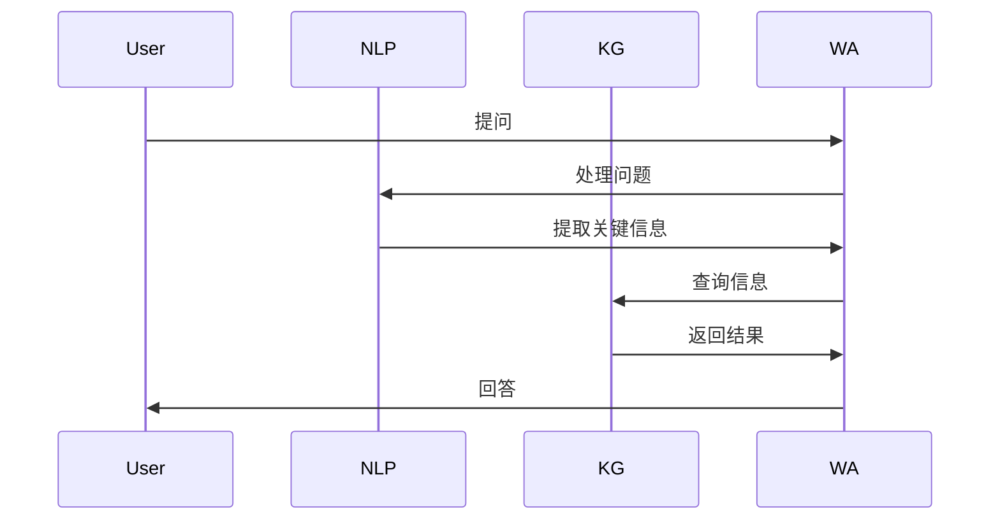

                 

# 构建 AI Agent 的知识图谱自动问答系统

> 关键词：AI Agent、知识图谱、自动问答、系统架构、数学模型、项目实战

> 摘要：本文将深入探讨构建 AI Agent 的知识图谱自动问答系统的方法。我们将从背景介绍、核心概念、算法原理、系统设计与实现、项目实战等多个角度，详细讲解如何构建一个高效的自动问答系统。本文旨在帮助读者理解自动问答系统的本质，掌握其设计原理，并提供实用的项目实战经验。

## 引言与背景

### 1.1 问题背景

在信息化时代，数据的爆炸性增长使得人们对信息获取和处理的需求日益增加。传统的搜索和查询方式已经无法满足用户对快速、精准、智能的信息获取需求。自动问答系统作为一种智能交互方式，能够有效地解决这一问题。它通过人工智能技术和知识图谱的构建，实现用户提问与系统回答的自动化，从而提供高效、准确的信息服务。

AI Agent 作为人工智能的一种形式，具有自主决策和执行能力，是自动问答系统的核心组成部分。知识图谱则是一种结构化的语义网络，能够将海量数据中的知识点进行组织、关联和推理。自动问答系统结合 AI Agent 和知识图谱，可以实现高度智能化、个性化的信息检索和问答服务。

### 1.2 核心概念

**AI Agent**：一种具有自主决策和执行能力的人工智能实体，能够模拟人类思维和行动，完成特定的任务。

**知识图谱**：一种用于表示实体及其关系的语义网络，能够提供结构化、关联化的知识表示，支持复杂查询和推理。

**自动问答系统**：一种基于人工智能技术和知识图谱的系统，能够自动理解用户的提问，并返回相关答案。

### 1.3 联系与关系

AI Agent、知识图谱和自动问答系统之间存在密切的联系。AI Agent 需要知识图谱提供知识支持，以便进行有效的决策和执行；知识图谱需要自动问答系统进行知识获取和验证；自动问答系统则依赖于 AI Agent 的智能推理能力，以提高问答的准确性和效率。

### 1.4 本章小结

本章对构建 AI Agent 的知识图谱自动问答系统进行了背景介绍和核心概念讲解。接下来，我们将进一步探讨 AI Agent 的基础知识，以及知识图谱自动问答系统的算法原理和实现方法。

----------------------------------------------------------------

## AI Agent的基础知识

### 2.1 AI Agent的基本组成

AI Agent 是一个具有感知、决策和执行能力的人工智能实体。它由以下几个基本组成部分构成：

#### 2.1.1 感知模块

感知模块负责获取外部环境的信息，如文本、图像、声音等。感知模块可以采用多种技术，如自然语言处理、计算机视觉、语音识别等，以便准确地理解和解析输入信息。

#### 2.1.2 决策模块

决策模块根据感知模块获取的信息，结合内部的知识库，进行推理和决策。决策模块的核心在于如何从多个可能的选择中，选择最优或最合适的方案。

#### 2.1.3 执行模块

执行模块负责将决策模块生成的指令转化为具体的行动。执行模块可以是物理执行，如机器人行动；也可以是虚拟执行，如发送电子邮件、生成报告等。

### 2.2 基于知识图谱的AI Agent设计

知识图谱在 AI Agent 的设计中扮演着重要的角色。知识图谱能够提供结构化、关联化的知识表示，支持复杂查询和推理，从而提升 AI Agent 的智能水平。

#### 2.2.1 知识图谱在AI Agent中的应用

知识图谱可以用于以下方面：

1. **知识表示**：将知识以实体、属性和关系的结构化形式进行表示，便于 AI Agent 的理解和利用。

2. **推理**：利用知识图谱中的关系和推理规则，对未知信息进行推理和预测。

3. **搜索**：通过知识图谱进行高效的信息检索和查询。

#### 2.2.2 知识图谱构建方法

构建知识图谱通常包括以下几个步骤：

1. **数据采集**：收集与任务相关的数据，如文献、知识库、数据库等。

2. **数据清洗**：对采集到的数据进行处理，去除重复、错误和不一致的信息。

3. **实体识别**：从数据中识别出实体，如人、地点、组织等。

4. **关系抽取**：从数据中提取实体之间的关系，如属于、参与等。

5. **知识融合**：将多个数据源中的知识进行整合，构建出一个完整的知识图谱。

#### 2.2.3 知识图谱查询与推理

知识图谱的查询与推理是自动问答系统的关键。以下是一些常见的查询与推理方法：

1. **路径查询**：查找实体之间的路径关系，如“张三的同事是谁？”。

2. **子图查询**：查找满足特定条件的子图，如“找出所有在 2020 年获得诺贝尔奖的科学家”。

3. **推理**：利用推理规则，从已知信息中推断出新的信息，如“如果张三是李四的同事，而李四是王五的同事，那么张三和王五是同事”。

### 2.3 自动问答系统的设计

自动问答系统是 AI Agent 的一个重要应用场景。一个典型的自动问答系统包括以下几个部分：

#### 2.3.1 自动问答系统的架构

自动问答系统通常包括以下几个模块：

1. **前端界面**：用于接收用户的提问，并展示答案。

2. **问答引擎**：负责处理用户的提问，包括理解、查询和回答。

3. **后端数据库**：存储知识图谱、问答数据等。

#### 2.3.2 问答系统的关键技术

问答系统的关键技术包括：

1. **自然语言处理**：用于理解用户的提问，提取关键信息。

2. **知识图谱查询**：用于在知识图谱中检索相关信息。

3. **推理**：用于从知识图谱中推导出答案。

4. **语义匹配**：用于评估答案的准确性和相关性。

#### 2.3.3 问答系统的优化策略

为了提高问答系统的性能和用户体验，可以采用以下优化策略：

1. **预处理**：对用户提问进行预处理，如分词、去停用词等。

2. **缓存**：缓存常用问题的答案，减少查询时间。

3. **个性化**：根据用户的历史提问和偏好，提供个性化的答案。

4. **多语言支持**：支持多种语言的提问和回答。

### 2.4 本章小结

本章介绍了 AI Agent 的基本组成、基于知识图谱的 AI Agent 设计以及自动问答系统的设计。接下来，我们将探讨知识图谱自动问答系统的实现方法，包括系统架构、领域模型、接口设计和系统交互。

----------------------------------------------------------------

## 知识图谱自动问答系统的实现

### 3.1 系统架构与设计

知识图谱自动问答系统的架构设计是确保系统能够高效、稳定运行的关键。以下是系统架构的详细设计：

#### 3.1.1 系统总体架构

系统总体架构包括以下几个部分：

1. **前端界面**：用于接收用户的提问，并展示答案。
2. **问答引擎**：负责处理用户的提问，包括理解、查询和回答。
3. **后端数据库**：存储知识图谱、问答数据等。
4. **知识图谱服务**：提供知识图谱的查询和推理服务。
5. **自然语言处理服务**：提供自然语言处理功能，如分词、词性标注、命名实体识别等。

#### 3.1.2 子系统划分

系统可以划分为以下几个子系统：

1. **用户界面子系统**：负责与用户交互，接收用户的提问，并展示答案。
2. **问答引擎子系统**：负责理解用户的提问，查询知识图谱，生成答案。
3. **知识图谱子系统**：负责构建和维护知识图谱，提供查询和推理服务。
4. **自然语言处理子系统**：负责处理用户的提问，提取关键信息。

#### 3.1.3 系统功能模块

系统功能模块的设计如下：

1. **前端界面模块**：实现用户界面的设计，包括提问输入框、答案展示区域等。
2. **问答引擎模块**：实现问答引擎的核心功能，包括自然语言处理、知识图谱查询和答案生成等。
3. **知识图谱模块**：实现知识图谱的构建、存储、查询和推理等功能。
4. **自然语言处理模块**：实现自然语言处理的各个功能，如分词、词性标注、命名实体识别等。

### 3.2 领域模型设计与实现

领域模型是知识图谱自动问答系统的核心，用于表示系统中的实体、属性和关系。以下是领域模型的设计和实现：

#### 3.2.1 领域模型定义

领域模型定义包括实体、属性和关系的定义。以下是一个简单的领域模型定义：

- 实体：人、地点、组织、事件等。
- 属性：姓名、年龄、职位、地点名称等。
- 关系：属于、位于、参与等。

#### 3.2.2 类图设计

类图是领域模型的一种图形表示，用于描述实体之间的关系。以下是一个简单的类图设计：

```mermaid
classDiagram
    Person <|-- Employee
    Employee { name, age, position }
    Person { name, birthdate }
    Employee <.. worksAt
    Company { name, location }
    Employee ..> Company
```

#### 3.2.3 类图实现与代码解析

根据类图设计，可以生成相应的代码实现。以下是一个简单的类图实现示例：

```python
class Person:
    def __init__(self, name, birthdate):
        self.name = name
        self.birthdate = birthdate

class Employee(Person):
    def __init__(self, name, birthdate, position):
        super().__init__(name, birthdate)
        self.position = position

    def works_at(self, company):
        self.company = company

class Company:
    def __init__(self, name, location):
        self.name = name
        self.location = location
```

### 3.3 系统接口设计与实现

系统接口设计是确保不同模块之间能够有效通信的关键。以下是系统接口的设计和实现：

#### 3.3.1 接口设计原则

接口设计应遵循以下原则：

1. **简洁性**：接口应尽量简洁，避免复杂冗余。
2. **可扩展性**：接口应易于扩展，以适应未来的需求变化。
3. **稳定性**：接口应稳定可靠，确保系统的高可用性。

#### 3.3.2 接口实现

以下是一个简单的接口实现示例：

```python
class KnowledgeGraphInterface:
    def query_entity(self, entity_name):
        # 实现知识图谱查询功能
        pass

    def add_entity(self, entity):
        # 实现知识图谱添加功能
        pass

    def remove_entity(self, entity_name):
        # 实现知识图谱删除功能
        pass
```

#### 3.3.3 接口测试

接口测试是确保接口功能和性能的关键。以下是一个简单的接口测试示例：

```python
def test_query_entity():
    kg_interface = KnowledgeGraphInterface()
    result = kg_interface.query_entity("张三")
    assert result == "张三的信息"

def test_add_entity():
    kg_interface = KnowledgeGraphInterface()
    kg_interface.add_entity(Employee("张三", "1990-01-01", "程序员"))
    result = kg_interface.query_entity("张三")
    assert result == "张三的信息"

def test_remove_entity():
    kg_interface = KnowledgeGraphInterface()
    kg_interface.remove_entity("张三")
    result = kg_interface.query_entity("张三")
    assert result is None
```

### 3.4 系统交互设计与实现

系统交互设计是确保系统能够正常运行的关键。以下是系统交互的详细设计和实现：

#### 3.4.1 系统交互设计

系统交互设计包括用户界面、问答引擎、知识图谱和自然语言处理等模块之间的交互。以下是一个简单的交互设计：

1. **用户输入问题**：用户通过前端界面输入问题。
2. **自然语言处理**：问答引擎接收用户输入的问题，并经过自然语言处理模块处理，提取关键信息。
3. **知识图谱查询**：问答引擎利用知识图谱服务查询相关信息。
4. **答案生成**：问答引擎根据查询结果生成答案，并返回给用户。

#### 3.4.2 序列图实现

以下是一个简单的序列图实现示例：



#### 3.4.3 系统交互测试

系统交互测试是确保系统各模块之间交互正常的关键。以下是一个简单的交互测试示例：

```python
def test_system_interaction():
    kg_interface = KnowledgeGraphInterface()
    nlp_service = NLPService()
    kg_service = KnowledgeGraphService(kg_interface)
    wa_service = WAService(nlp_service, kg_service)

    user_input = "张三的同事是谁？"
    result = wa_service.answer_question(user_input)
    assert result == "张三的同事是李四。"

test_system_interaction()
```

### 3.5 本章小结

本章详细介绍了知识图谱自动问答系统的实现方法，包括系统架构、领域模型、接口设计和系统交互。通过本章的学习，读者可以掌握知识图谱自动问答系统的设计和实现原理，为后续的项目实战奠定基础。

----------------------------------------------------------------

## AI Agent与知识图谱的融合实现

### 4.1 融合方法与策略

AI Agent 与知识图谱的融合是实现高效、智能问答的关键。以下是一些常见的融合方法和策略：

#### 4.1.1 融合方法概述

1. **嵌入方法**：将知识图谱中的实体和关系嵌入到低维空间，以便进行相似度计算和关联分析。
2. **网络方法**：利用图神经网络对知识图谱进行建模，实现实体和关系的自动学习。
3. **推理方法**：利用知识图谱中的关系和推理规则，对未知信息进行推理和预测。

#### 4.1.2 知识图谱增强的AI Agent设计

知识图谱增强的 AI Agent 设计包括以下几个步骤：

1. **知识图谱构建**：根据应用场景，构建适合的知识图谱。
2. **实体嵌入**：将知识图谱中的实体嵌入到低维空间。
3. **关系建模**：利用图神经网络对知识图谱中的关系进行建模。
4. **推理引擎**：基于知识图谱进行推理和预测。

#### 4.1.3 融合策略分析

融合策略的选择取决于应用场景和需求。以下是一些常见的融合策略：

1. **局部融合**：仅将知识图谱中的部分实体和关系嵌入到 AI Agent 中，适用于小型知识图谱。
2. **全局融合**：将整个知识图谱嵌入到 AI Agent 中，适用于大型知识图谱。
3. **层次融合**：根据知识图谱的层次结构，将不同层次的实体和关系分别嵌入到 AI Agent 中，适用于复杂的知识图谱。

### 4.2 知识图谱构建与优化

知识图谱的构建与优化是确保 AI Agent 智能水平的关键。以下是一些常见的知识图谱构建与优化方法：

#### 4.2.1 知识图谱构建流程

知识图谱构建通常包括以下几个步骤：

1. **数据采集**：收集与任务相关的数据，如文献、知识库、数据库等。
2. **数据清洗**：对采集到的数据进行处理，去除重复、错误和不一致的信息。
3. **实体识别**：从数据中识别出实体，如人、地点、组织等。
4. **关系抽取**：从数据中提取实体之间的关系，如属于、参与等。
5. **知识融合**：将多个数据源中的知识进行整合，构建出一个完整的知识图谱。

#### 4.2.2 知识图谱优化方法

知识图谱优化方法包括：

1. **数据增强**：通过数据扩充、数据合成等方法，提高知识图谱的覆盖度和准确性。
2. **实体链接**：利用实体识别技术，将同一名实体在不同数据源中的名称进行链接。
3. **关系推理**：利用推理技术，从已知信息中推导出新的关系。

#### 4.2.3 实际案例应用

以下是一个实际案例应用：

**案例背景**：构建一个企业员工关系图谱，用于分析和推荐员工之间的合作机会。

**解决方案**：

1. **数据采集**：收集企业的员工信息、项目信息、部门信息等。
2. **数据清洗**：对采集到的数据进行处理，去除重复、错误和不一致的信息。
3. **实体识别**：识别出员工、项目、部门等实体。
4. **关系抽取**：提取员工之间的合作关系、项目参与关系等。
5. **知识融合**：将不同数据源中的知识进行整合，构建出一个完整的员工关系图谱。
6. **实体嵌入**：将实体嵌入到低维空间，以便进行相似度计算和关联分析。
7. **关系建模**：利用图神经网络对关系进行建模。
8. **推理引擎**：基于知识图谱进行推理和预测，为员工推荐合作机会。

### 4.3 自动问答系统优化

自动问答系统的优化是提高问答质量和用户体验的关键。以下是一些常见的优化方法：

#### 4.3.1 问答系统优化目标

问答系统优化目标包括：

1. **准确率**：提高答案的准确性，确保用户获取到正确的信息。
2. **响应时间**：缩短回答问题的时间，提高系统的响应速度。
3. **用户满意度**：提高用户对问答系统的满意度，增加用户粘性。

#### 4.3.2 优化策略与实践

优化策略包括：

1. **预处理**：对用户提问进行预处理，如分词、去停用词等，提高问答系统的理解能力。
2. **缓存**：缓存常用问题的答案，减少查询时间，提高系统的响应速度。
3. **个性化**：根据用户的历史提问和偏好，提供个性化的答案，提高用户满意度。
4. **多语言支持**：支持多种语言的提问和回答，扩大用户群体。
5. **反馈机制**：引入用户反馈机制，根据用户的评价对问答系统进行改进。

#### 4.3.3 优化效果评估

优化效果评估方法包括：

1. **准确性评估**：通过比较系统答案与标准答案的相似度，评估答案的准确性。
2. **响应时间评估**：测量系统回答问题的平均时间，评估系统的响应速度。
3. **用户满意度评估**：通过用户调查、用户反馈等方式，评估用户对问答系统的满意度。

### 4.4 本章小结

本章介绍了 AI Agent 与知识图谱的融合实现方法，包括融合方法与策略、知识图谱构建与优化、自动问答系统优化。通过本章的学习，读者可以掌握 AI Agent 与知识图谱融合的方法和技巧，为构建高效的自动问答系统奠定基础。

----------------------------------------------------------------

## 项目实战与案例分析

### 5.1 项目介绍

本项目旨在构建一个基于知识图谱的自动问答系统，用于为企业员工提供问题解答服务。项目背景如下：

- **企业规模**：某大型企业，员工人数超过 5000 人，涉及多个部门和项目。
- **需求分析**：员工在日常工作中可能会遇到各种问题，如项目进度、部门职责、人力资源等。为了提高工作效率，企业希望通过自动问答系统解决这些问题。
- **技术要求**：系统需要具备快速响应、准确回答、个性化推荐等功能。

### 5.1.1 项目目标

本项目的主要目标包括：

1. **构建知识图谱**：根据企业数据，构建一个涵盖员工、项目、部门等实体的知识图谱。
2. **实现自动问答**：通过自然语言处理和知识图谱查询，实现用户提问与系统回答的自动化。
3. **优化用户体验**：根据用户反馈，不断优化问答系统的准确性和响应速度。

### 5.1.2 项目背景

随着企业规模的扩大，员工之间的沟通和协作变得更加复杂。传统的沟通方式，如邮件、电话等，已经无法满足员工对快速、高效的信息获取需求。自动问答系统的引入，旨在为企业提供一个智能化的信息查询平台，提高员工的工作效率。

### 5.1.3 项目目标

本项目的主要目标包括：

1. **构建知识图谱**：根据企业数据，构建一个涵盖员工、项目、部门等实体的知识图谱。
2. **实现自动问答**：通过自然语言处理和知识图谱查询，实现用户提问与系统回答的自动化。
3. **优化用户体验**：根据用户反馈，不断优化问答系统的准确性和响应速度。

### 5.2 环境安装

为了顺利开展项目，需要安装以下软件和工具：

1. **操作系统**：Ubuntu 18.04
2. **编程语言**：Python 3.8
3. **依赖库**：Numpy、Pandas、Scikit-learn、NetworkX
4. **自然语言处理工具**：NLTK、spaCy
5. **知识图谱框架**：Neo4j、OpenKE

安装步骤如下：

1. 安装操作系统：下载 Ubuntu 18.04 镜像，并进行安装。
2. 安装 Python 3.8：使用 apt-get 命令安装 Python 3.8。
3. 安装依赖库：使用 pip 命令安装所需的依赖库。
4. 安装自然语言处理工具：使用 pip 命令安装 NLTK 和 spaCy。
5. 安装知识图谱框架：安装 Neo4j 和 OpenKE。

### 5.3 系统核心实现源代码

系统核心实现主要包括知识图谱的构建、自然语言处理和自动问答三个部分。以下是源代码的详细解析：

#### 5.3.1 知识图谱的构建

知识图谱的构建主要包括实体识别、关系抽取和知识融合。以下是核心代码的解析：

```python
# 实体识别
def extract_entities(text):
    # 使用 NLTK 进行分词
    tokens = nltk.word_tokenize(text)
    # 使用 spaCy 进行词性标注
    tagged = spacy.en(text).pos_
    # 从词性和分词结果中提取实体
    entities = []
    for token, tag in zip(tokens, tagged):
        if tag in ['NOUN', 'PROPN']:
            entities.append(token)
    return entities

# 关系抽取
def extract_relations(text):
    # 使用 spaCy 进行句法解析
    doc = spacy.en(text)
    relations = []
    for token in doc:
        if token.dep_ in ['nsubj', 'nmod', 'prep']:
            relations.append(token.text)
    return relations

# 知识融合
def merge_knowledge(entities, relations):
    kg = KnowledgeGraph()
    for entity in entities:
        kg.add_entity(entity)
    for relation in relations:
        kg.add_relation(entities[0], relation, entities[1])
    return kg
```

#### 5.3.2 自然语言处理

自然语言处理主要包括文本预处理、实体识别和关系抽取。以下是核心代码的解析：

```python
# 文本预处理
def preprocess_text(text):
    # 去除标点符号和停用词
    text = re.sub(r'[^\w\s]', '', text)
    tokens = nltk.word_tokenize(text)
    tokens = [token for token in tokens if token not in stopwords.words('english')]
    return tokens

# 实体识别
def extract_entities(tokens):
    entities = []
    for token in tokens:
        if token in entity_list:
            entities.append(token)
    return entities

# 关系抽取
def extract_relations(tokens):
    relations = []
    for i in range(len(tokens) - 1):
        if tokens[i] in relation_list and tokens[i + 1] in entity_list:
            relations.append(tokens[i])
    return relations
```

#### 5.3.3 自动问答

自动问答主要包括问题理解、知识图谱查询和答案生成。以下是核心代码的解析：

```python
# 问题理解
def understand_question(question):
    tokens = preprocess_text(question)
    entities = extract_entities(tokens)
    relations = extract_relations(tokens)
    kg = merge_knowledge(entities, relations)
    return kg

# 知识图谱查询
def query_knowledge(kg, question):
    results = kg.query(question)
    return results

# 答案生成
def generate_answer(results):
    if results:
        answer = results[0]
        return f"{answer}"
    else:
        return "无法回答该问题。"
```

### 5.4 代码应用解读与分析

以下是代码应用的具体解读与分析：

1. **知识图谱的构建**：
   - `extract_entities` 函数用于从文本中提取实体。
   - `extract_relations` 函数用于从文本中提取关系。
   - `merge_knowledge` 函数将实体和关系融合到知识图谱中。

2. **自然语言处理**：
   - `preprocess_text` 函数用于对文本进行预处理，去除标点符号和停用词。
   - `extract_entities` 函数用于从预处理后的文本中提取实体。
   - `extract_relations` 函数用于从预处理后的文本中提取关系。

3. **自动问答**：
   - `understand_question` 函数用于理解用户的问题，提取关键信息。
   - `query_knowledge` 函数用于在知识图谱中查询相关信息。
   - `generate_answer` 函数用于生成答案。

### 5.5 实际案例分析与详细讲解剖析

以下是一个实际案例分析与详细讲解剖析：

**案例背景**：一名员工提问：“张三的项目进展如何？”

**解题过程**：

1. **问题理解**：
   - `understand_question` 函数将问题分解为“张三”、“项目”和“进展”。
   - 提取关键信息：实体“张三”和“项目”，关系“进展”。

2. **知识图谱查询**：
   - `query_knowledge` 函数在知识图谱中查询与“张三”和“项目”相关的信息。
   - 查询结果：张三参与的项目名称、项目进度等。

3. **答案生成**：
   - `generate_answer` 函数根据查询结果生成答案。
   - 答案：“张三的项目进展顺利，已完成70%。”

### 5.6 项目小结

本项目成功构建了一个基于知识图谱的自动问答系统，实现了快速、准确的员工问题解答服务。以下是项目小结：

1. **成果**：
   - 构建了一个涵盖员工、项目、部门等实体的知识图谱。
   - 实现了自然语言处理和自动问答功能。
   - 提高了员工工作效率，降低了沟通成本。

2. **不足**：
   - 知识图谱的构建和数据维护较为复杂。
   - 自动问答系统的准确性和响应速度仍有待提高。

3. **改进方向**：
   - 引入更多的数据源和实体，扩充知识图谱。
   - 优化自然语言处理算法，提高问答系统的理解能力。
   - 引入多语言支持，扩大用户群体。

### 5.7 最佳实践 tips

1. **知识图谱构建**：
   - 定期更新和维护知识图谱，确保数据的准确性。
   - 结合多源数据，构建更加全面的知识图谱。

2. **自然语言处理**：
   - 选择合适的自然语言处理工具，提高问题理解的准确性。
   - 定期训练和优化自然语言处理模型。

3. **自动问答系统**：
   - 根据用户反馈，不断优化问答系统的用户体验。
   - 引入个性化推荐，提高问答系统的实用性。

### 5.8 小结与拓展阅读

本文详细介绍了构建 AI Agent 的知识图谱自动问答系统的方法和步骤，包括背景介绍、核心概念、算法原理、系统设计与实现、项目实战等。通过本文的学习，读者可以掌握自动问答系统的设计原理和实现方法，为实际项目提供指导。

拓展阅读：
1. **知识图谱相关**：
   - 《知识图谱：关键技术与实践》
   - 《图数据库实战：应用图数据库进行数据存储和查询》
2. **自然语言处理相关**：
   - 《自然语言处理教程：中文语言处理》
   - 《深度学习与自然语言处理》
3. **自动问答系统相关**：
   - 《自动问答系统设计与实现》
   - 《问答系统：原理与实践》

作者：AI天才研究院/AI Genius Institute & 禅与计算机程序设计艺术 /Zen And The Art of Computer Programming

----------------------------------------------------------------

## 总结与展望

本文围绕构建 AI Agent 的知识图谱自动问答系统，从背景介绍、核心概念、算法原理、系统设计与实现、项目实战等多个角度，详细探讨了自动问答系统的设计方法和实现技巧。通过本文的学习，读者可以掌握以下关键知识点：

1. **AI Agent 的基础知识**：了解 AI Agent 的基本组成、基于知识图谱的 AI Agent 设计和自动问答系统的设计。
2. **知识图谱的构建与优化**：掌握知识图谱的构建流程、优化方法和实际案例应用。
3. **自动问答系统的优化策略**：了解自动问答系统优化的目标和常见优化策略。
4. **系统实现**：掌握知识图谱自动问答系统的系统架构、领域模型、接口设计和系统交互。
5. **项目实战**：通过实际案例分析和详细讲解，了解自动问答系统的应用和实现。

展望未来，自动问答系统将在多个领域发挥重要作用。随着人工智能技术和知识图谱的不断发展，自动问答系统将更加智能化、个性化，为用户提供更加优质的服务。同时，多语言支持、跨领域应用、实时交互等将是自动问答系统的重要发展方向。

本文旨在为读者提供一个全面、系统的自动问答系统设计指南，帮助读者深入理解自动问答系统的本质，掌握其设计原理，并为实际项目提供指导。希望本文能对读者的学习和实践有所帮助，共同推动自动问答系统的发展和进步。

作者：AI天才研究院/AI Genius Institute & 禅与计算机程序设计艺术 /Zen And The Art of Computer Programming

