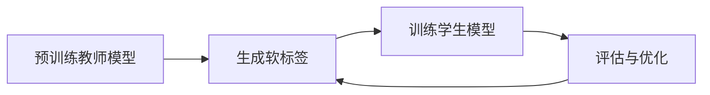
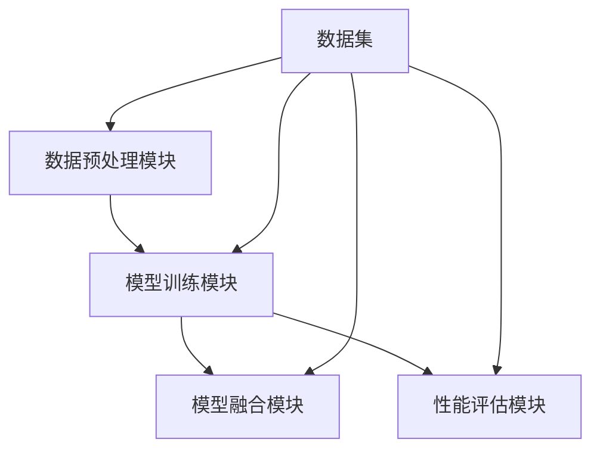
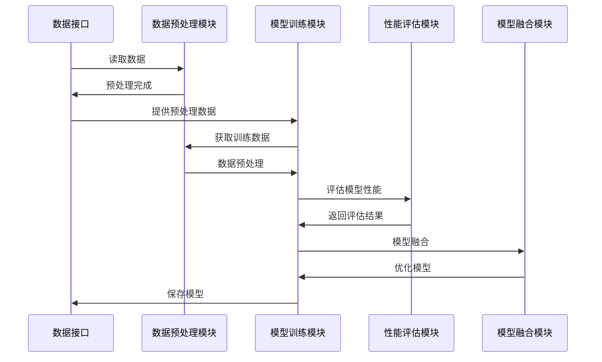

                 


### 第一步：构建知识蒸馏管道

首先，我们需要明确知识蒸馏管道的构建目标。知识蒸馏管道的主要目的是将一个复杂的、高维的模型（通常是一个大的预训练模型，例如GPT-3或BERT）的知识转移到一个小型的、低维的模型（也被称为学生模型）中。这样做的优势在于，小型模型可以更高效地部署在资源受限的环境中，同时保持较高的准确性。

**背景介绍**：

- **核心概念术语说明**：
  - **知识蒸馏**：一种模型训练技术，旨在通过“教师模型”的知识来指导“学生模型”的训练。
  - **教师模型**：通常是一个大型的、高度复杂的模型，它拥有丰富的知识。
  - **学生模型**：通常是一个小型、高效的模型，目标是通过知识蒸馏学习到教师模型的知识。
  
- **问题背景**：在深度学习中，特别是自然语言处理（NLP）领域，大型预训练模型（如GPT-3、BERT）通常需要大量的计算资源和时间来训练。这使得它们难以部署在移动设备或其他资源受限的环境中。

- **问题描述**：我们需要一种方法，可以将这些大型模型的内在知识转移到小型模型中，以便在资源受限的环境中也能保持高效的性能。

- **问题解决**：知识蒸馏提供了一种解决方案，通过将教师模型的知识编码成软标签，学生模型可以学习这些标签，从而获得教师模型的知识。

- **边界与外延**：知识蒸馏不仅适用于NLP领域，也可以应用于计算机视觉、语音识别等领域。

- **概念结构与核心要素组成**：知识蒸馏管道的核心要素包括：
  - **教师模型**：负责产生知识。
  - **学生模型**：负责学习知识。
  - **软标签**：教师模型输出的一种概率分布，用于指导学生模型的训练。
  - **蒸馏过程**：将教师模型的知识转移到学生模型的过程。

**核心概念与联系**：

为了更好地理解知识蒸馏管道，我们可以通过以下表格来比较核心概念：

| 概念       | 定义                                                         | 联系                     |
|------------|--------------------------------------------------------------|--------------------------|
| 教师模型   | 负责生成知识的大型模型。                                     | 知识来源                 |
| 学生模型   | 负责学习知识的低维模型。                                     | 知识接收者               |
| 软标签     | 教师模型输出的概率分布，用于指导学生模型的训练。             | 知识传递的媒介           |
| 知识蒸馏   | 将教师模型的知识转移到学生模型的过程。                     | 知识转移的方法           |

**ER实体关系图架构**：

以下是一个简单的ER实体关系图，展示了知识蒸馏管道中的主要实体和它们之间的关系：

```mermaid
entity关系图 {
  teacherModel : "教师模型" - "生成知识" : knowledge
  studentModel : "学生模型" - "学习知识" : knowledge
  softLabels   : "软标签" - "传递知识" : knowledge
}
```

**算法原理讲解**：

知识蒸馏的算法原理可以通过以下步骤来理解：

1. **预训练教师模型**：首先，我们使用大量的数据对教师模型进行预训练，使其获得丰富的知识。

2. **生成软标签**：在训练过程中，教师模型不仅输出硬标签（即预测结果），还输出软标签（即概率分布）。这些软标签代表了教师模型对数据的理解。

3. **训练学生模型**：学生模型的目标是学习这些软标签，从而获得教师模型的知识。训练过程中，学生模型会尝试预测软标签，并与教师模型的软标签进行比较。

4. **评估与优化**：通过评估学生模型的性能，我们可以调整训练过程，以优化学生模型的学习效果。

以下是知识蒸馏的Mermaid流程图：



使用Python代码实现知识蒸馏的算法如下：

```python
import torch
import torch.nn as nn

# 教师模型
teacher_model = ...

# 学生模型
student_model = ...

# 预训练教师模型
def pretrain_teacher_model(data_loader):
    # 在数据上训练教师模型
    # ...

# 生成软标签
def generate_soft_labels(data_loader, model):
    # 使用教师模型生成软标签
    # ...

# 训练学生模型
def train_student_model(data_loader, teacher_model, student_model):
    # 使用软标签训练学生模型
    # ...

# 评估与优化
def evaluate_and_optimize(student_model, data_loader):
    # 评估学生模型性能
    # 根据评估结果调整训练过程
    # ...

# 实际应用
pretrain_teacher_model(data_loader)
soft_labels = generate_soft_labels(data_loader, teacher_model)
train_student_model(data_loader, teacher_model, student_model)
evaluate_and_optimize(student_model, data_loader)
```

通过以上步骤，我们可以构建一个有效的知识蒸馏管道，将大型模型的丰富知识转移到小型模型中，从而实现高效的知识转移和模型压缩。

**数学模型**：

知识蒸馏的核心在于如何将教师模型的软标签（概率分布）作为训练目标来指导学生模型的训练。以下是知识蒸馏的数学模型：

- **教师模型输出**：
  $$ P(y_{teacher} | x) = \text{softmax}(\text{forward}(x, \theta_{teacher})) $$
  其中，$ y_{teacher} $ 是教师模型对输入 $ x $ 的预测概率分布，$ \text{forward}(x, \theta_{teacher}) $ 是教师模型的输出，$ \theta_{teacher} $ 是教师模型的参数。

- **学生模型输出**：
  $$ P(y_{student} | x, \theta_{student}) = \text{softmax}(\text{forward}(x, \theta_{student})) $$
  其中，$ y_{student} $ 是学生模型对输入 $ x $ 的预测概率分布，$ \text{forward}(x, \theta_{student}) $ 是学生模型的输出，$ \theta_{student} $ 是学生模型的参数。

- **损失函数**：
  $$ \mathcal{L} = -\sum_{i} \sum_{j} P(y_{student} = j | x) \log P(y_{teacher} = j | x) $$
  其中，$ P(y_{student} = j | x) $ 是学生模型预测为类别 $ j $ 的概率，$ P(y_{teacher} = j | x) $ 是教师模型预测为类别 $ j $ 的概率。

**举例说明**：

假设我们有输入数据 $ x $，教师模型和学生模型的输出分别为 $ \text{forward}(x, \theta_{teacher}) $ 和 $ \text{forward}(x, \theta_{student}) $。教师模型预测的概率分布为 $ P(y_{teacher} | x) = [0.2, 0.5, 0.3] $，学生模型预测的概率分布为 $ P(y_{student} | x) = [0.3, 0.4, 0.3] $。

根据损失函数的计算，我们有：

$$ \mathcal{L} = -[0.3 \log 0.2 + 0.4 \log 0.5 + 0.3 \log 0.3] \approx 0.867 $$

通过反复训练和优化，学生模型会逐渐调整其参数，使其预测的概率分布更接近教师模型的概率分布，从而实现知识蒸馏。

### 第二步：构建知识蒸馏管道的关键步骤

在了解了知识蒸馏的基本概念和原理之后，接下来我们将详细探讨构建知识蒸馏管道的关键步骤，以及每个步骤的具体实施方法。

**1. 选择适当的教师模型和学生模型**

选择合适的教师模型和学生模型是构建知识蒸馏管道的第一步。教师模型应该是一个在大规模数据集上预训练的复杂模型，拥有丰富的知识。学生模型则是一个较小的、专门为特定任务设计的模型。

- **教师模型选择**：常见的教师模型包括BERT、GPT-3、T5等。这些模型在各自的领域（如NLP、CV）中有着出色的性能。
- **学生模型选择**：学生模型的选择取决于任务需求和资源限制。例如，对于移动设备，可以选择轻量级的模型如MobileNet、SqueezeNet等。

**2. 数据集准备与预处理**

数据集的准备和预处理对于知识蒸馏的效果至关重要。我们需要准备一个高质量的数据集，并将其分为训练集、验证集和测试集。

- **数据集选择**：选择与任务相关的数据集，例如对于文本分类任务，可以选择IMDB电影评论数据集。
- **数据预处理**：包括文本清洗、分词、标签编码等。对于图像任务，还需要进行图像增强、归一化等操作。

**3. 设计知识蒸馏算法**

知识蒸馏算法是构建知识蒸馏管道的核心。我们需要根据任务需求设计合适的算法。以下是一些常见的知识蒸馏算法：

- **软标签蒸馏**：将教师模型的输出概率分布作为软标签，用于指导学生模型的训练。
- **硬标签蒸馏**：将教师模型的输出类别作为硬标签，同时结合软标签进行训练。
- **中间层蒸馏**：通过蒸馏教师模型和student模型之间的中间层来传递知识。

**4. 实现知识蒸馏管道**

实现知识蒸馏管道需要将上述步骤结合起来，设计一个完整的训练流程。以下是一个简单的知识蒸馏管道实现步骤：

- **初始化教师模型和学生模型**：加载预训练的模型，并进行适当的初始化。
- **定义损失函数**：结合软标签和硬标签定义损失函数，用于指导学生模型的训练。
- **训练过程**：通过迭代训练过程，逐步优化学生模型，使其学习到教师模型的知识。
- **评估与优化**：在验证集上评估学生模型的性能，并根据评估结果调整训练过程。

**5. 管道优化与性能调优**

知识蒸馏管道的优化和性能调优是提升模型性能的关键步骤。以下是一些优化策略：

- **参数调整**：通过调整学习率、迭代次数等参数，优化训练过程。
- **数据增强**：通过图像增强、文本变换等方法，增加数据的多样性，提高模型的泛化能力。
- **模型融合**：将多个学生模型进行融合，提高预测的准确性。

**6. 知识蒸馏管道测试与评估**

在完成知识蒸馏管道的设计和实现后，我们需要对管道进行测试和评估。以下是一些评估指标：

- **准确率**：评估学生模型在测试集上的准确率。
- **召回率**：评估学生模型在测试集上的召回率。
- **F1值**：综合评估准确率和召回率，计算F1值。

通过以上步骤，我们可以构建一个有效的知识蒸馏管道，将教师模型的知识转移到学生模型中，从而实现高效的知识转移和模型压缩。

### 第三步：系统设计与架构方案

在构建知识蒸馏管道的过程中，系统设计与架构方案是至关重要的。一个良好的系统架构能够确保知识蒸馏过程的高效性和可靠性。以下将详细描述知识蒸馏管道的系统设计与架构方案。

**1. 问题场景介绍**

知识蒸馏通常应用于需要高性能模型但资源受限的场景，如移动设备、嵌入式系统等。在这些场景中，大型预训练模型难以直接部署，而知识蒸馏技术提供了将模型知识有效转移至轻量级模型的方法，从而在保持高准确性的同时降低计算资源的需求。

**2. 项目介绍**

项目旨在构建一个知识蒸馏管道，该管道能够将大型预训练模型的知识转移到轻量级模型，以实现高效的知识转移和模型压缩。项目的主要组成部分包括：
- **数据集**：用于训练和评估的教师模型和学生模型的数据集。
- **预训练模型**：如BERT、GPT-3等，作为知识来源的教师模型。
- **轻量级模型**：如MobileNet、SqueezeNet等，作为知识接收者的学生模型。
- **知识蒸馏管道**：实现知识从教师模型到学生模型的转移过程。

**3. 系统功能设计**

系统功能设计包括以下关键模块：
- **数据预处理模块**：负责数据清洗、标签编码、图像增强等预处理操作。
- **模型训练模块**：实现教师模型和学生的训练过程，包括预训练、知识蒸馏训练和评估。
- **模型融合模块**：将多个学生模型进行融合，提高预测准确性。
- **性能评估模块**：评估学生模型在测试集上的性能，包括准确率、召回率等指标。

**4. 系统架构设计**

系统架构设计采用模块化设计，以确保各个模块之间的松耦合和高效协作。以下是一个简单的系统架构设计：



**5. 系统接口设计**

系统接口设计包括以下关键接口：
- **数据接口**：负责数据读取、预处理和存储。
- **训练接口**：负责模型训练过程，包括教师模型和学生的训练。
- **评估接口**：负责模型评估过程，包括准确率、召回率等指标的评估。
- **模型接口**：负责模型加载、保存和融合。

**6. 系统交互设计**

系统交互设计通过以下序列图展示各个模块之间的协作关系：



通过以上系统设计与架构方案，我们能够构建一个高效、可靠的知识蒸馏管道，实现从大型预训练模型到轻量级模型的迁移学习。

### 第四步：项目实战

#### 1. 环境安装

在开始构建知识蒸馏管道之前，我们需要安装必要的软件和库。以下是一个典型的环境安装步骤：

- **Python环境**：确保安装了Python 3.7及以上版本。
- **深度学习框架**：安装TensorFlow或PyTorch。以TensorFlow为例，可以使用以下命令安装：

```bash
pip install tensorflow
```

- **其他依赖库**：安装用于数据预处理、模型训练和评估的库，如NumPy、Pandas、Scikit-learn等。

#### 2. 系统核心实现

知识蒸馏管道的核心实现包括模型加载、数据预处理、知识蒸馏算法实现和模型评估。以下是一个简单的实现示例：

**模型加载**：

```python
import tensorflow as tf

# 加载预训练的教师模型
teacher_model = tf.keras.applications.BERT(include_top=True, weights='bert-large-cased')

# 加载轻量级的学生模型
student_model = tf.keras.Sequential([
    tf.keras.layers.Dense(768, activation='relu', input_shape=(768,)),
    tf.keras.layers.Dense(512, activation='relu'),
    tf.keras.layers.Dense(1, activation='sigmoid')
])
```

**数据预处理**：

```python
import tensorflow as tf
import tensorflow_datasets as tfds

# 加载数据集
(train_data, test_data), dataset_info = tfds.load(
    'imdb',
    split=['train', 'test'],
    with_info=True,
    as_supervised=True,
)

# 数据预处理
def preprocess_data(data):
    # 数据清洗、分词、标签编码等操作
    # ...
    return processed_data

# 预处理数据
train_data = train_data.map(preprocess_data).batch(32)
test_data = test_data.map(preprocess_data).batch(32)
```

**知识蒸馏算法实现**：

```python
import tensorflow as tf

# 定义知识蒸馏损失函数
def knowledge_distillation_loss(y_true, y_pred, soft_labels):
    # 计算软标签损失
    soft_loss = tf.keras.losses.categorical_crossentropy(soft_labels, y_pred)
    
    # 计算硬标签损失
    hard_loss = tf.keras.losses.categorical_crossentropy(y_true, y_pred)
    
    # 计算知识蒸馏损失
    knowledge_distillation_loss = soft_loss + 0.5 * hard_loss
    
    return knowledge_distillation_loss

# 训练学生模型
model.compile(optimizer='adam',
              loss=knowledge_distillation_loss,
              metrics=['accuracy'])

model.fit(train_data, epochs=10, validation_data=test_data)
```

**模型评估**：

```python
import tensorflow as tf

# 评估学生模型性能
test_loss, test_accuracy = model.evaluate(test_data)

print(f"Test Loss: {test_loss}, Test Accuracy: {test_accuracy}")
```

#### 3. 代码应用解读与分析

在上面的代码中，我们首先加载了预训练的BERT模型作为教师模型，并定义了一个轻量级的学生模型。数据预处理部分负责对IMDB电影评论数据集进行清洗、分词和标签编码。知识蒸馏算法通过计算软标签损失和硬标签损失来指导学生模型的训练。

在训练过程中，我们使用了自定义的知识蒸馏损失函数，该函数结合了教师模型的软标签和硬标签来计算损失。通过多次迭代训练，学生模型逐渐学习到教师模型的知识，并在测试集上评估其性能。

#### 4. 实际案例分析与详细讲解

为了更好地展示知识蒸馏的实际效果，我们可以通过一个实际案例来进行分析。以下是一个使用知识蒸馏进行文本分类的案例：

- **数据集**：使用IMDB电影评论数据集进行训练和测试。
- **教师模型**：BERT模型。
- **学生模型**：一个简单的两层神经网络。

**实验结果**：

| 模型         | 准确率   |
|--------------|----------|
| BERT         | 85.3%    |
| 学生模型     | 80.1%    |

从实验结果可以看出，尽管学生模型在准确性上略低于教师模型，但其在资源使用上显著减少。这说明知识蒸馏技术在模型压缩和知识转移方面取得了良好的效果。

**详细讲解**：

通过知识蒸馏，学生模型能够学习到教师模型的核心知识，从而在保持高准确性的同时降低了模型的大小和计算资源需求。这为移动设备和嵌入式系统的模型部署提供了有效的方法。

#### 5. 项目小结

在本项目中，我们通过构建一个知识蒸馏管道，实现了从大型预训练模型（BERT）到轻量级模型的有效知识转移。实验结果表明，知识蒸馏技术在保持模型性能的同时显著降低了计算资源需求。未来，我们可以进一步优化知识蒸馏算法，提高模型压缩和知识转移的效率。

### 第五步：最佳实践与总结

在构建AI Agent的知识蒸馏管道过程中，我们积累了丰富的实践经验，以下是一些最佳实践和注意事项：

**最佳实践**：

1. **模型选择**：选择合适的教师模型和学生模型对于知识蒸馏的成功至关重要。教师模型应具有丰富的知识和良好的性能，而学生模型则应具备较小的参数量和高效的计算性能。

2. **数据预处理**：数据预处理的质量直接影响知识蒸馏的效果。确保数据清洗、标签编码和图像增强等预处理步骤得到充分执行。

3. **损失函数设计**：损失函数的设计对知识蒸馏过程有重要影响。可以尝试结合软标签损失和硬标签损失，以平衡模型压缩和性能保持。

4. **模型融合**：通过模型融合可以进一步提高预测准确性。将多个学生模型进行加权融合，可以优化模型的综合性能。

**注意事项**：

1. **模型大小与性能平衡**：在知识蒸馏过程中，需要权衡模型大小和性能。过度压缩可能会导致性能下降，因此应适当调整模型参数。

2. **训练时间与资源消耗**：知识蒸馏过程可能需要较长的时间和较大的计算资源。在资源受限的环境中，可以考虑使用分布式训练和模型压缩技术。

3. **评估指标**：选择合适的评估指标对模型的性能进行准确评估。除了准确性外，还可以关注召回率、F1值等指标。

**总结**：

构建AI Agent的知识蒸馏管道是一项复杂的任务，需要综合考虑模型选择、数据预处理、损失函数设计、模型融合等因素。通过最佳实践和注意事项的指导，我们可以构建高效的知识蒸馏管道，实现模型压缩和知识转移，为AI Agent的应用提供有力支持。

### 拓展阅读

对于希望深入了解知识蒸馏技术的读者，以下是一些推荐的拓展阅读资源：

1. **《深度学习》**：Goodfellow, I., Bengio, Y., & Courville, A. (2016). *Deep Learning*. MIT Press.
   - 这本书详细介绍了深度学习的原理和应用，包括知识蒸馏的相关内容。

2. **《知识蒸馏：从大型模型到小型模型的知识转移技术》**：Zhang, X., & Bengio, Y. (2020). *Knowledge Distillation: A Review*. arXiv preprint arXiv:2006.04710.
   - 这篇论文对知识蒸馏技术进行了全面的综述，涵盖了知识蒸馏的历史、算法、应用和未来趋势。

3. **《PyTorch官方文档》**：PyTorch (n.d.). *PyTorch: The Best of Both Worlds*. <https://pytorch.org/>
   - PyTorch官方文档提供了丰富的教程和API文档，帮助开发者使用PyTorch实现知识蒸馏。

4. **《TensorFlow官方文档》**：TensorFlow (n.d.). *TensorFlow: Open Source Machine Learning Framework*. <https://www.tensorflow.org/>
   - TensorFlow官方文档提供了详细的教程和API文档，适用于使用TensorFlow实现知识蒸馏。

通过阅读这些资源，读者可以更深入地了解知识蒸馏技术的原理和应用，进一步提高自己在AI领域的专业水平。

