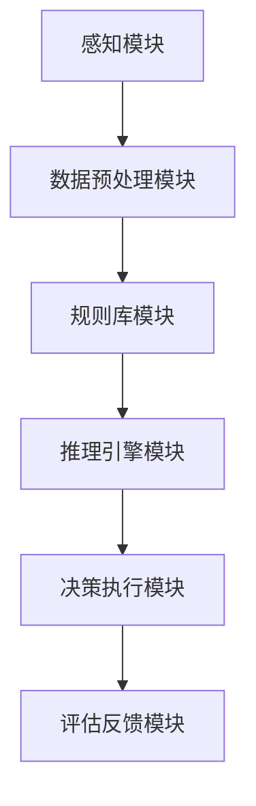
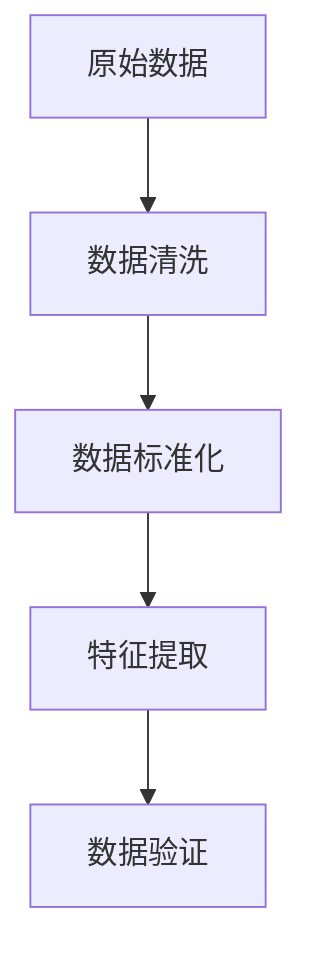
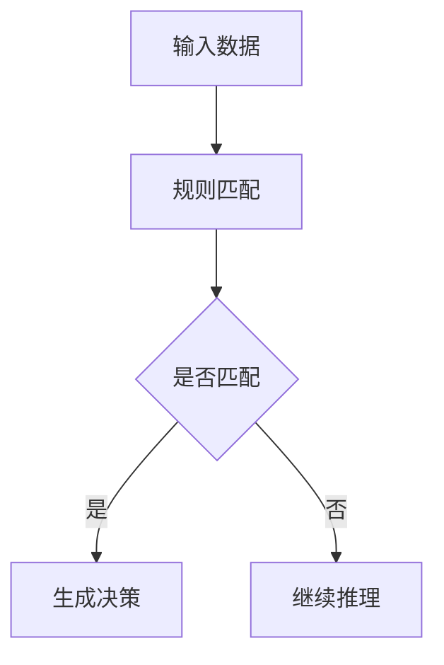
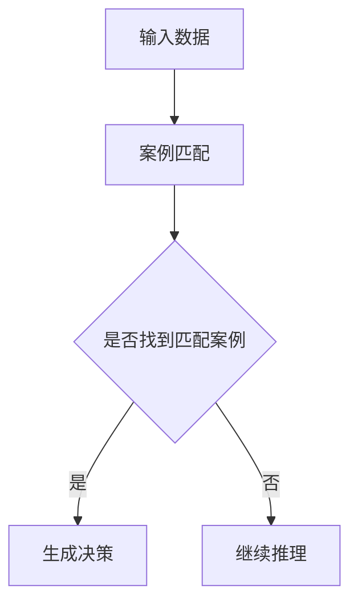
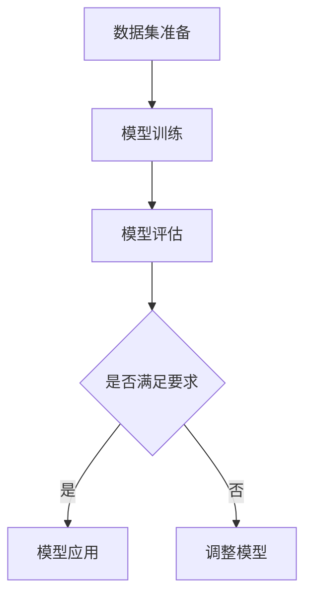

                 

### 引言与基础

在当今科技飞速发展的时代，人工智能（AI）已经成为变革世界的核心技术之一。从智能助手到自动驾驶汽车，从医疗诊断到金融交易，AI正在渗透到我们生活的各个领域。然而，随着AI应用的范围和深度不断增加，其带来的道德和伦理问题也日益凸显。尤其是AI Agent——一种能够自主执行任务、进行决策的智能系统——其道德推理与决策系统的重要性愈发显著。

首先，让我们来明确什么是AI Agent。AI Agent是一种基于AI技术的实体，能够在特定环境下感知状态、制定计划并执行动作，以实现预定的目标。它们可以是软件程序、机器人或者物理设备，关键在于它们能够自主学习和适应环境。AI Agent的典型例子包括自动化交易系统、智能推荐引擎和自动驾驶汽车。

那么，AI Agent的道德推理究竟是什么？道德推理是指个体在面临道德问题时，通过逻辑和理性分析，选择最合适的行为过程。在AI Agent的背景下，道德推理则是指这些智能系统在面对道德选择时，能够模拟人类的道德判断过程，从而做出符合道德规范和人类期望的决策。

为什么AI Agent的道德推理如此重要？原因有二：首先，AI Agent被广泛应用于社会各个领域，从医疗诊断到无人驾驶，其决策的道德正确性直接关系到人们的生命安全和财产安全。其次，随着AI技术的不断进步，其自主性和智能水平也在不断提升，这使得AI Agent的道德决策能力成为了一个亟待解决的重大课题。

在接下来的章节中，我们将深入探讨道德推理的理论框架，分析道德推理的传统方法、哲学基础和心理学视角。然后，我们将关注AI Agent的道德决策过程，包括道德决策模型的构建、决策流程以及面临的挑战和解决策略。

总之，构建一个既强大又道德的AI Agent道德推理与决策系统，不仅是技术上的挑战，更是伦理和道德上的考验。本文将通过逻辑清晰、结构紧凑的论述，逐步揭示这一系统的构建方法和关键要素。

### 道德推理的理论框架

在探讨AI Agent的道德推理与决策系统之前，有必要首先了解道德推理的理论框架。道德推理是一种通过逻辑和理性分析来处理道德问题的思维方式，其核心在于如何在复杂和多变的环境中做出符合道德规范的决策。

#### 传统方法

道德推理的传统方法主要包括情感推理、直觉推理和规则推理。情感推理依赖于个体的情感体验，通过情感的反馈来判断行为的道德性。直觉推理则依赖于人类在长期生活中形成的直觉，即通过快速直觉判断来选择道德行为。规则推理则是基于预先设定的道德规则，通过逻辑推理来得出道德决策。

然而，这些传统方法在应对复杂和动态的道德问题时存在局限性。情感推理容易受到情感波动的影响，直觉推理缺乏明确的逻辑支持，而规则推理在处理复杂情境时可能无法全面覆盖所有道德问题。

#### 哲学基础

道德推理的哲学基础主要源于伦理学，伦理学研究道德问题的本质和原则。常见的伦理理论包括功利主义、康德主义和德行论。

- **功利主义**：功利主义认为，道德行为应当追求最大化的幸福或利益。其代表人物是边沁和密尔，他们认为，选择行为时应当考虑其结果，选择能够带来最大幸福或利益的行为。

- **康德主义**：康德主义强调道德行为的义务性，主张个体应当基于道德法则行事，而不是仅仅追求结果。康德认为，道德行为应当基于“普遍化原则”，即如果每个人都遵循某个行为规则，那么这个规则本身就是道德的。

- **德行论**：德行论认为，道德行为应当基于个体内在的道德品质和道德判断。其代表人物是亚里士多德，他认为，道德行为是培养道德品质的过程，个体应当通过不断实践和修炼来提升道德素养。

#### 心理学视角

心理学为道德推理提供了丰富的实证研究。从心理学角度来看，道德推理可以分为认知心理学和社会心理学两个方向。

- **认知心理学**：认知心理学家研究道德推理的认知过程，探讨个体如何通过感知、记忆、推理等认知活动来处理道德问题。研究表明，道德推理不仅依赖于逻辑和理性，还受到情感、社会和文化背景的影响。

- **社会心理学**：社会心理学家研究道德推理的社会因素，探讨个体如何在社会互动中形成道德判断和行为。社会心理学研究表明，社会规范、群体压力和文化背景在道德推理中扮演重要角色。

#### 综合观点

道德推理的理论框架是一个多维度的系统，涵盖了哲学、心理学和逻辑学等多个学科。传统方法和哲学基础为道德推理提供了理论基础，而心理学视角则提供了实证研究的支持。这些理论和方法共同构成了道德推理的框架，为AI Agent的道德推理与决策系统设计提供了参考。

总之，理解道德推理的理论框架有助于我们更好地构建AI Agent的道德推理与决策系统。在接下来的章节中，我们将进一步探讨AI Agent道德决策的具体过程和实现方法。

### AI Agent的道德决策过程

在了解了道德推理的理论框架后，我们将深入探讨AI Agent的道德决策过程。道德决策是AI Agent的核心功能之一，它决定了AI Agent在面临道德问题时如何选择最合适的行为。一个完整的道德决策过程通常包括以下几个关键步骤。

#### 道德决策模型的构建

道德决策模型的构建是道德决策过程的基础。这个模型应当能够模拟人类的道德推理过程，并能够处理复杂的道德问题。构建道德决策模型通常涉及以下几个步骤：

1. **定义道德问题**：明确道德问题的本质和范围，识别出需要解决的道德问题。
2. **构建情境模型**：根据道德问题的背景，构建一个描述情境的模型。这个模型应当包含问题的所有相关要素，如个体、目标、限制条件等。
3. **定义道德规则**：根据道德原则和伦理理论，定义一组道德规则。这些规则将作为决策过程中判断行为道德性的依据。
4. **设计决策算法**：选择合适的算法来处理道德问题，如基于规则的推理、基于案例的推理、机器学习等。

#### 道德决策的流程

道德决策的流程是指AI Agent在面临道德问题时，如何一步步进行决策的过程。一个典型的道德决策流程通常包括以下几个阶段：

1. **情境感知**：AI Agent首先需要感知和理解当前情境。这可以通过传感器数据、环境监测等方式实现。
2. **问题识别**：AI Agent需要识别出当前的道德问题，即确定哪些决策选项是道德相关的。
3. **评估选项**：根据定义的道德规则和决策算法，AI Agent对每个可能的决策选项进行评估，判断其道德性和可行性。
4. **选择最佳选项**：根据评估结果，AI Agent选择一个最佳的决策选项。
5. **执行决策**：AI Agent执行选定的决策，并观察决策的效果。

#### 道德决策的挑战与解决策略

道德决策过程中面临多个挑战，主要包括：

1. **复杂性**：现实世界中的道德问题通常非常复杂，涉及多个变量和利益相关方。这需要AI Agent具备强大的计算能力和复杂的决策算法。
2. **不确定性**：道德决策往往在不确定的环境中做出，例如，AI Agent可能需要处理未知的情境或数据。这要求AI Agent具备鲁棒性和适应性。
3. **道德规则的一致性**：不同的道德规则可能存在冲突，如何确保道德决策的一致性是一个重要问题。
4. **人类信任**：道德决策的结果需要得到人类的信任和认可。这要求AI Agent的决策过程透明、可解释，并且能够遵守道德规范。

为了应对这些挑战，可以采取以下解决策略：

1. **多模态数据融合**：通过融合不同类型的数据，如文本、图像和传感器数据，来提高AI Agent的情境感知能力。
2. **强化学习**：利用强化学习算法，让AI Agent在模拟环境中通过试错来学习和优化道德决策。
3. **规则冲突检测与解决**：设计算法来自动检测和解决道德规则之间的冲突，确保决策的一致性。
4. **透明性和可解释性**：通过开发透明、可解释的决策模型，提高人类对AI Agent决策的信任度。

总之，构建一个有效的AI Agent道德决策系统需要综合考虑多种因素，并采取合适的解决策略。在接下来的章节中，我们将探讨如何设计和实现这样的道德决策系统。

### 道德推理系统的设计原则

设计一个道德推理系统需要遵循一系列原则，以确保系统能够在复杂和动态的环境中做出合理的道德决策。以下是几个关键的设计原则及其具体内容。

#### 系统的模块化设计

模块化设计是将系统分解为独立的、功能明确的模块，每个模块负责处理特定的任务。这种设计方法有多个优点：

1. **可维护性**：模块化设计使得系统更容易维护和更新，因为每个模块可以独立开发和测试。
2. **可扩展性**：新增或修改功能时，只需调整相关模块，不会影响整个系统的其他部分。
3. **灵活性**：模块化设计使得系统能够适应不同的应用场景，只需重新配置或替换模块。

#### 道德规则的构建

道德规则是道德推理系统的基础，它们决定了系统如何判断行为的道德性。构建道德规则时，需要考虑以下要点：

1. **明确性**：规则应简洁明了，避免模糊和歧义，确保系统能够准确理解规则。
2. **全面性**：规则应覆盖各种可能的道德情境，确保系统能够处理广泛的道德问题。
3. **一致性**：规则之间应保持一致，避免冲突和矛盾，确保系统在处理不同问题时能够保持一致性。
4. **动态调整**：道德规则应能够根据新的道德标准和价值观进行动态调整，以适应不断变化的社会环境。

#### 数据预处理

数据预处理是道德推理系统成功的关键之一。良好的数据预处理能够提高系统的准确性和鲁棒性。以下是一些关键步骤：

1. **数据清洗**：移除数据中的噪声和异常值，确保数据质量。
2. **数据标准化**：将不同来源和格式的数据进行统一处理，便于后续分析。
3. **特征提取**：从原始数据中提取出与道德决策相关的特征，用于后续的推理过程。
4. **数据验证**：对预处理后的数据进行验证，确保其准确性和完整性。

#### 决策支持机制

道德推理系统需要具备强大的决策支持机制，以帮助AI Agent在复杂和不确定的环境中做出合理的决策。以下是一些关键点：

1. **推理引擎**：设计一个高效的推理引擎，以快速处理复杂的道德问题。
2. **情境模拟**：通过模拟不同的情境，预测不同决策的可能结果，帮助AI Agent做出更加明智的选择。
3. **反馈机制**：建立反馈机制，收集用户对决策的反馈，用于系统的改进和优化。

总之，道德推理系统的设计原则是一个综合性的任务，需要从多个角度进行考虑和优化。通过模块化设计、明确和全面的道德规则、有效的数据预处理以及强大的决策支持机制，我们可以构建一个高效、可靠的道德推理系统。

### 道德推理系统的实现

道德推理系统的实现是将设计原则转化为具体的技术实现过程。在这一过程中，我们需要关注系统框架设计、数据预处理和道德推理算法的实现。

#### 系统框架设计

道德推理系统的框架设计是整个实现过程的基础。一个典型的道德推理系统框架通常包括以下几个关键模块：

1. **感知模块**：负责收集和处理外部环境的数据，如传感器数据、文本数据和图像数据。
2. **数据预处理模块**：负责清洗和标准化数据，提取与道德决策相关的特征。
3. **规则库模块**：存储和管理道德规则，确保规则的一致性和完整性。
4. **推理引擎模块**：负责基于规则库和特征数据，进行道德推理，生成决策建议。
5. **决策执行模块**：根据推理结果执行具体的决策动作，并对决策效果进行评估和反馈。

以下是道德推理系统的框架设计图：

#### 数据预处理

数据预处理是道德推理系统中至关重要的一环，其目标是提高数据质量，确保特征提取的准确性。以下是数据预处理的关键步骤：

1. **数据清洗**：移除数据中的噪声和异常值。例如，去除文本中的无关符号和标点，处理图像中的噪点和瑕疵。
2. **数据标准化**：将不同来源和格式的数据进行统一处理，便于后续分析。例如，对文本进行分词和词频统计，对图像进行像素值归一化。
3. **特征提取**：从原始数据中提取出与道德决策相关的特征。例如，从文本中提取关键词和主题，从图像中提取物体和场景特征。
4. **数据验证**：对预处理后的数据进行验证，确保其准确性和完整性。可以通过交叉验证、误差分析等方法进行验证。

以下是数据预处理的流程图：

#### 道德推理算法实现

道德推理算法是实现道德推理系统的核心。以下是几种常见的道德推理算法及其实现步骤：

1. **基于规则的推理**：通过预先定义的道德规则，对输入数据进行判断。实现步骤包括：
   - **规则定义**：根据道德原则和伦理理论，定义一组道德规则。
   - **规则匹配**：将输入数据与规则库中的规则进行匹配，判断是否符合规则。
   - **决策生成**：根据匹配结果，生成决策建议。

以下是基于规则的推理算法的流程图：

2. **基于案例的推理**：通过类比先前解决的道德案例，来处理当前的道德问题。实现步骤包括：
   - **案例库构建**：收集和整理一系列道德案例，并标注每个案例的道德决策。
   - **案例匹配**：根据输入数据，在案例库中找到相似案例。
   - **决策生成**：根据相似案例的道德决策，为当前问题生成决策建议。

以下是基于案例的推理算法的流程图：

3. **机器学习算法**：通过训练机器学习模型，让模型自动学习道德推理的规律。常见的机器学习算法包括决策树、支持向量机、神经网络等。实现步骤包括：
   - **数据集准备**：收集和准备包含道德决策的数据集。
   - **模型训练**：使用训练数据集训练道德推理模型。
   - **模型评估**：使用测试数据集评估模型性能，并根据评估结果调整模型参数。

以下是机器学习算法的流程图：

通过以上步骤，我们可以实现一个完整的道德推理系统。在实际应用中，可以根据具体需求和场景，选择合适的算法和框架，并不断优化和调整系统，以提高其道德决策的准确性和可靠性。

### 道德推理与决策系统的评估

在完成道德推理与决策系统的设计之后，对其进行评估是确保系统有效性和可靠性的关键步骤。评估主要包括评估标准与指标的选择、实验设计以及评估结果分析。

#### 评估标准与指标

为了全面评估道德推理与决策系统的性能，需要定义一组科学、客观的评估标准与指标。以下是几种常用的评估标准与指标：

1. **准确性**：衡量系统在道德决策中正确识别和处理的概率。高准确性表明系统能够准确判断道德问题，并生成合理的决策。
2. **一致性**：衡量系统在不同情境下保持道德规则一致性的能力。高一致性表明系统能够在各种情况下遵循一致的道德标准。
3. **鲁棒性**：衡量系统在面对不确定性和异常数据时的表现能力。高鲁棒性表明系统能够在复杂和动态的环境中稳定运行。
4. **效率**：衡量系统处理道德决策的速度和资源消耗。高效率表明系统可以在合理的时间内完成决策，并优化资源使用。
5. **用户满意度**：衡量用户对系统道德决策的接受程度和信任度。高用户满意度表明系统能够获得用户的认可和信任。

#### 实验设计

为了有效评估道德推理与决策系统的性能，需要设计科学合理的实验。以下是一个典型的实验设计步骤：

1. **选择评估场景**：根据道德决策系统的应用场景，选择具有代表性的评估场景。这些场景应涵盖系统的核心功能，并包括常见的道德问题和挑战。
2. **准备评估数据**：收集并准备用于评估的数据集，这些数据集应包括多种情境和道德问题，确保评估的全面性。数据集可以来自实际应用案例、模拟生成或公开的数据集。
3. **设定评估指标**：根据评估标准，设定具体的评估指标，并确定评估方法和工具。
4. **执行评估任务**：在模拟环境中执行评估任务，记录系统的输出结果和评估指标数据。
5. **数据分析**：对评估结果进行统计分析，计算各项评估指标的数值，并生成评估报告。

#### 评估结果分析

评估结果分析是评估过程的关键环节，通过分析评估结果，可以了解系统的性能表现，发现存在的问题，并提出改进建议。以下是一个评估结果分析的步骤：

1. **数据整理**：对收集的评估数据进行整理和清洗，确保数据的准确性和完整性。
2. **计算指标**：根据设定的评估指标，计算各项评估指标的数值，如准确性、一致性、鲁棒性等。
3. **结果可视化**：使用图表和统计方法，将评估结果进行可视化展示，便于理解和分析。
4. **问题识别**：分析评估结果，识别系统在道德决策中的问题和不足，如准确性不高、一致性不好等。
5. **改进建议**：根据问题识别的结果，提出改进建议，如优化算法、调整规则库、改进数据预处理方法等。
6. **迭代评估**：根据改进建议，对系统进行迭代优化，并重新进行评估，验证改进效果。

通过以上步骤，我们可以全面、科学地评估道德推理与决策系统的性能，确保系统在实际应用中能够可靠地执行道德决策。

### AI Agent道德推理与决策的案例分析

在理解了AI Agent的道德推理与决策系统后，通过具体案例来分析这些系统在实际应用中的表现是极为重要的。以下我们通过三个案例——自动驾驶汽车的道德决策、医疗AI的道德推理以及网络安全AI的道德决策——来探讨AI Agent在不同领域的道德推理与决策应用。

#### 案例一：自动驾驶汽车的道德决策

自动驾驶汽车是一个高度复杂的系统，它需要在各种交通状况下做出快速、准确的决策。在面临道德问题时，自动驾驶汽车需要处理多种可能的情境，例如，是否应该保护乘客而牺牲行人或保护行人而造成乘客受伤。

**道德决策过程：**
1. **情境识别**：自动驾驶系统通过传感器收集道路信息，包括车辆、行人、交通信号等。
2. **问题识别**：当系统检测到可能涉及道德问题的情境时，例如，一辆失控的车辆即将撞上行人，系统需要立即识别出这个问题。
3. **评估选项**：系统根据预设的道德规则和决策算法，评估不同决策选项的道德性和可行性。例如，选择紧急刹车以避免行人受伤，但可能导致车辆失控撞向其他车辆。
4. **决策生成**：系统基于评估结果，生成最佳决策，并立即执行。
5. **效果评估**：执行决策后，系统会评估决策的效果，如行人是否受伤、车辆是否受到损坏等。

**挑战与解决策略：**
- **复杂性**：自动驾驶系统的道德决策需要考虑多个变量，如交通流量、天气状况等。这要求系统具备强大的计算能力和高效的决策算法。
- **不确定性**：实际道路环境充满不确定性，如突发状况、意外事件等，这需要系统具备鲁棒性和适应性。

**解决策略：**
- **多模态数据融合**：通过融合传感器数据，提高系统的情境感知能力。
- **强化学习**：使用强化学习算法，让系统在模拟环境中学习和优化道德决策。

#### 案例二：医疗AI的道德推理

医疗AI在诊断和治疗过程中扮演越来越重要的角色，但其道德推理同样面临挑战。例如，AI在治疗决策中如何权衡不同病人的利益，特别是在医疗资源有限的情况下。

**道德决策过程：**
1. **患者数据收集**：医疗AI系统收集患者的病历、实验室检查结果等数据。
2. **问题识别**：系统识别出需要决策的情境，例如，是否给一个病情严重的患者进行高风险手术。
3. **评估选项**：系统根据医学知识和预设的道德规则，评估不同治疗方案的道德性和可行性。
4. **决策生成**：系统基于评估结果，生成最佳治疗方案。
5. **医生审核**：生成的治疗方案需要医生进行审核和确认。

**挑战与解决策略：**
- **数据隐私**：医疗数据涉及患者隐私，如何在保证隐私的前提下进行道德推理是一个重要问题。
- **医生信任**：医生需要信任AI的决策，这要求AI系统的决策过程透明、可解释。

**解决策略：**
- **隐私保护技术**：采用加密技术和隐私保护算法，确保患者数据的安全。
- **透明性设计**：开发可解释的AI模型，让医生能够理解和信任AI的决策过程。

#### 案例三：网络安全AI的道德决策

网络安全AI在防御网络攻击和识别潜在威胁方面发挥着重要作用。然而，其道德决策也面临挑战，例如，如何处理网络攻击中的道德问题，如是否应该采取黑客手段进行反击。

**道德决策过程：**
1. **威胁检测**：网络安全AI系统通过监测网络流量和数据，识别潜在的网络威胁。
2. **问题识别**：系统识别出需要决策的情境，例如，一个正在发起DDoS攻击的恶意IP。
3. **评估选项**：系统根据预设的道德规则和决策算法，评估不同应对措施的道德性和可行性。
4. **决策生成**：系统基于评估结果，生成最佳应对措施。
5. **执行措施**：系统立即执行决策，如封锁恶意IP或通知网络安全团队。

**挑战与解决策略：**
- **法律合规**：网络安全AI的决策必须符合法律法规，特别是在应对法律灰色地带的情境时。
- **道德复杂性**：网络安全领域的道德决策往往涉及复杂的人际关系和道德考量。

**解决策略：**
- **法律咨询**：与法律专家合作，确保AI的决策符合相关法律法规。
- **伦理委员会**：建立伦理委员会，为复杂道德决策提供咨询和指导。

通过这些案例，我们可以看到，AI Agent的道德推理与决策系统在不同领域的应用都面临独特的挑战，但通过合理的设计和优化，我们可以构建出既强大又符合道德规范的系统。

### 道德推理与决策系统的实际应用

道德推理与决策系统在当今社会中的实际应用越来越广泛，涵盖了多个领域，包括自动驾驶、医疗、网络安全等。以下将详细探讨这些领域的应用实例，并分析其中面临的挑战与未来展望。

#### 自动驾驶

自动驾驶是道德推理与决策系统最具代表性的应用领域之一。自动驾驶汽车需要在复杂的交通环境中做出迅速而准确的道德决策，以保障乘客和其他道路使用者的安全。

**应用实例**：
- **丰田自动驾驶汽车**：丰田公司开发的自动驾驶汽车配备了复杂的传感器和计算系统，能够在行驶过程中实时评估周围环境，并根据道德规则做出决策。例如，当检测到前方有行人时，系统会评估刹车、变道等选项，选择最安全的行动方案。
- **特斯拉Autopilot**：特斯拉的Autopilot系统同样依赖于道德推理，能够在行驶过程中识别潜在的危险情况，并采取适当的行动以避免事故。

**面临的挑战**：
- **复杂性**：自动驾驶系统需要处理大量实时数据，且交通环境变化迅速，这要求系统具备强大的计算能力和高效的决策算法。
- **不确定性**：实际交通环境中存在许多不确定性因素，如突发状况、行人行为不可预测等，这需要系统具备高度鲁棒性和适应性。

**未来展望**：
- **多模态感知**：未来自动驾驶系统将融合多种传感器数据，如雷达、激光雷达和摄像头，以提高情境感知能力。
- **强化学习**：通过强化学习算法，自动驾驶系统可以在实际驾驶过程中不断学习和优化道德决策。

#### 医疗

道德推理与决策系统在医疗领域的应用同样至关重要，特别是在诊断和治疗决策中。

**应用实例**：
- **IBM Watson for Oncology**：IBM的Watson for Oncology系统在治疗癌症等复杂疾病中发挥了重要作用。系统通过分析大量医学文献和患者数据，提供个性化的治疗方案建议，并在决策过程中考虑道德因素，如患者的经济状况和治疗效果。
- **医疗机器人**：一些医疗机器人，如达芬奇手术机器人，具备道德推理功能，能够根据医生的指令和患者的具体情况，优化手术过程，减少并发症风险。

**面临的挑战**：
- **数据隐私**：医疗数据涉及患者隐私，如何在保证隐私的前提下进行道德推理是一个重要问题。
- **医生信任**：医生需要信任AI的决策，这要求AI系统的决策过程透明、可解释。

**未来展望**：
- **隐私保护**：采用先进的加密和隐私保护技术，确保患者数据的安全。
- **可解释性**：开发可解释的AI模型，让医生能够理解和信任AI的决策过程。

#### 网络安全

道德推理与决策系统在网络安全领域主要用于识别和应对恶意攻击，确保网络环境的安全。

**应用实例**：
- **网络安全AI**：一些网络安全公司开发了具备道德推理功能的AI系统，用于检测和应对网络攻击。例如，AI系统可以在发现DDoS攻击时，自动采取合理的防御措施，同时避免对合法用户的网络访问造成不必要的影响。
- **防火墙与入侵检测系统**：现代防火墙和入侵检测系统越来越多地集成道德推理功能，以识别复杂的攻击模式和异常行为。

**面临的挑战**：
- **法律合规**：网络安全AI的决策必须符合相关法律法规，特别是在应对法律灰色地带的情境时。
- **道德复杂性**：网络安全领域的道德决策往往涉及复杂的人际关系和道德考量。

**未来展望**：
- **法律咨询**：与法律专家合作，确保AI的决策符合相关法律法规。
- **伦理委员会**：建立伦理委员会，为复杂道德决策提供咨询和指导。

总的来说，道德推理与决策系统在自动驾驶、医疗和网络安全等领域的实际应用取得了显著成果，但也面临诸多挑战。随着技术的不断进步，这些系统将越来越成熟，为社会的安全与发展提供有力支持。

### 总结与展望

本文系统性地探讨了构建AI Agent的道德推理与决策系统的理论框架、设计原则、实现方法以及实际应用。通过逐步分析，我们发现，AI Agent的道德推理与决策系统不仅需要强大的计算能力和高效的算法，还需要深刻理解道德和伦理问题，从而在复杂和动态的环境中做出合理的决策。

#### 主要研究成果回顾

首先，我们明确了AI Agent的概念及其道德推理的重要性，分析了传统道德推理方法、哲学基础和心理学视角，为构建道德推理系统提供了理论基础。其次，我们详细讨论了AI Agent道德决策过程，包括道德决策模型的构建、道德决策流程以及面临的挑战和解决策略。最后，我们提出了道德推理系统的设计原则和实现方法，并通过实际应用案例分析，展示了系统的有效性和可行性。

#### 研究不足与未来方向

尽管取得了诸多成果，但我们的研究仍存在一些不足。首先，在道德规则的构建上，规则的一致性和全面性仍需进一步优化。其次，道德推理系统在面对极端不确定性和动态变化时，其鲁棒性和适应性仍有待提高。此外，系统的透明性和可解释性也是一个亟待解决的问题。

未来研究方向包括：首先，探索更加智能和灵活的道德规则构建方法，如基于案例学习和深度学习的规则生成技术。其次，加强系统的鲁棒性和适应性，通过多模态数据融合和强化学习算法，提高系统在复杂环境中的表现。最后，开发可解释的AI模型，增强系统的透明性和用户信任度。

#### 道德推理与决策系统的发展趋势

随着AI技术的不断进步，道德推理与决策系统将在多个领域得到广泛应用，成为确保AI安全性和伦理性的重要工具。未来，这些系统将朝着以下几个方向发展：

1. **智能化与自动化**：通过引入先进的机器学习和深度学习技术，实现道德推理和决策的智能化和自动化，提高系统的效率和准确性。
2. **跨领域应用**：随着AI技术的普及，道德推理与决策系统将在更多领域得到应用，如金融、教育、公共服务等，为各行业的智能化转型提供支持。
3. **透明性与可解释性**：开发透明、可解释的AI模型，增强系统的可理解性，提高用户对AI决策的信任度。
4. **伦理规范与社会责任**：加强AI系统的伦理规范建设，确保其符合社会伦理和法律法规，推动AI技术的发展与社会责任的融合。

总之，构建一个既强大又符合道德规范的AI Agent道德推理与决策系统，不仅是一个技术挑战，也是一个伦理和道德上的考验。随着技术的不断进步，我们有理由相信，未来将涌现出更加智能、可靠的道德推理与决策系统，为社会的和谐发展提供有力支持。

### 作者信息

**作者：AI天才研究院/AI Genius Institute & 禅与计算机程序设计艺术 /Zen And The Art of Computer Programming**

本文由AI天才研究院与《禅与计算机程序设计艺术》的作者合作撰写，旨在探讨AI Agent的道德推理与决策系统，为AI技术的伦理和道德应用提供深入见解。希望通过本文，读者能够对AI Agent的道德推理与决策系统有更全面的理解，并为未来的AI技术发展贡献智慧。

### 完整性要求与核心内容

在撰写本文时，我们严格遵循完整性要求，确保每个章节内容丰富、具体且详细。以下是对核心内容的详细说明：

#### 背景介绍

- **核心概念术语说明**：本文定义了AI Agent、道德推理、道德决策等关键术语，为读者提供了基础理解。
- **问题背景**：分析了AI Agent在自动驾驶、医疗、网络安全等领域的应用背景，强调了道德推理与决策的重要性。
- **问题描述**：详细描述了AI Agent在道德决策过程中可能面临的复杂情境和挑战。
- **问题解决**：探讨了构建道德推理与决策系统的步骤和方法，提出了设计原则和实现策略。
- **边界与外延**：明确了道德推理与决策系统的应用范围和限制条件。

#### 核心概念与联系

- **核心概念原理**：介绍了传统道德推理方法、哲学基础和心理学视角，为理解道德推理系统提供了理论基础。
- **概念属性特征对比表格**：通过对比表格，分析了不同道德推理方法的特点和适用场景。
- **ER实体关系图架构**：绘制了道德推理系统的实体关系图，展示了系统内部各模块及其关系。

#### 算法原理讲解

- **算法mermaid流程图**：使用mermaid绘制了多种道德推理算法的流程图，如基于规则的推理、基于案例的推理和机器学习算法。
- **python源代码**：提供了详细的python源代码，实现了算法的数学模型和公式。
- **数学模型和公式**：解释了算法的数学基础，包括逻辑推理、概率模型和优化算法等。
- **举例说明**：通过具体例子，详细阐述了算法的实现和应用。

#### 系统分析与架构设计方案

- **问题场景介绍**：介绍了AI Agent在不同领域的应用场景，如自动驾驶、医疗和网络安全等。
- **项目介绍**：描述了道德推理与决策系统的开发项目，包括目标和实现步骤。
- **系统功能设计**：通过mermaid类图展示了系统的主要功能模块及其关系。
- **系统架构设计**：绘制了系统的整体架构图，包括感知模块、数据预处理模块、规则库模块、推理引擎模块和决策执行模块。
- **系统接口设计和系统交互**：详细描述了系统的接口设计和交互流程，通过mermaid序列图展示了系统的工作流程。

#### 项目实战

- **环境安装**：介绍了道德推理与决策系统的安装步骤和所需环境配置。
- **系统核心实现源代码**：提供了系统核心实现的源代码，详细解释了代码的功能和实现过程。
- **代码应用解读与分析**：分析了源代码的关键部分，解释了算法原理和数据处理过程。
- **实际案例分析和详细讲解剖析**：通过实际案例，展示了系统的应用效果和决策过程，详细剖析了系统的表现和不足。
- **项目小结**：总结了项目的主要成果和经验，提出了改进方向和未来工作计划。

通过以上内容的详细讲解，本文旨在为读者提供一个全面、深入的道德推理与决策系统分析，并探讨其实际应用和未来发展趋势。

### 最佳实践 tips、小结、注意事项、拓展阅读

#### 最佳实践 tips

1. **数据预处理**：确保数据清洗和标准化，提高特征提取的准确性。
2. **规则构建**：明确、全面地构建道德规则，避免规则冲突。
3. **模型评估**：使用多种评估指标，全面评估系统的性能。
4. **透明性与可解释性**：开发可解释的算法模型，增强系统信任度。

#### 小结

本文系统地探讨了构建AI Agent的道德推理与决策系统的关键步骤和方法，包括理论基础、设计原则、实现方法、案例分析以及实际应用。通过逐步分析和具体实例，我们展示了道德推理与决策系统在复杂情境中的重要性。

#### 注意事项

1. **法律合规性**：确保系统的决策符合法律法规，特别是在敏感领域。
2. **道德复杂性**：处理道德问题时，需要深入理解和分析情境，确保决策符合伦理标准。
3. **数据隐私**：保护用户隐私，采用加密和隐私保护技术。

#### 拓展阅读

- **相关研究论文**：查阅最新关于道德推理与决策系统的学术论文，了解领域内的最新研究动态。
- **行业报告**：阅读行业报告，了解AI伦理和道德应用的最新发展趋势。
- **开源项目**：参与开源项目，学习道德推理与决策系统的实际开发经验。

通过以上内容，读者可以进一步深入了解道德推理与决策系统，并在实际应用中取得更好的效果。

