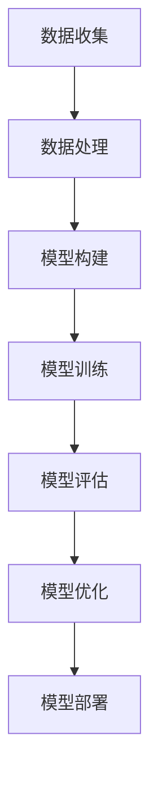
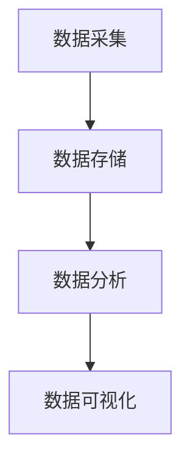
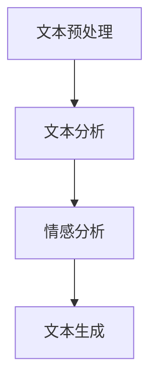
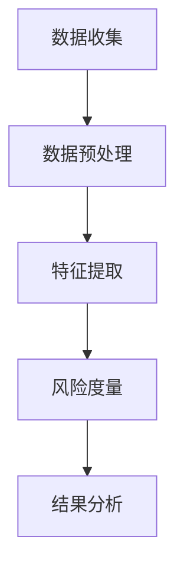
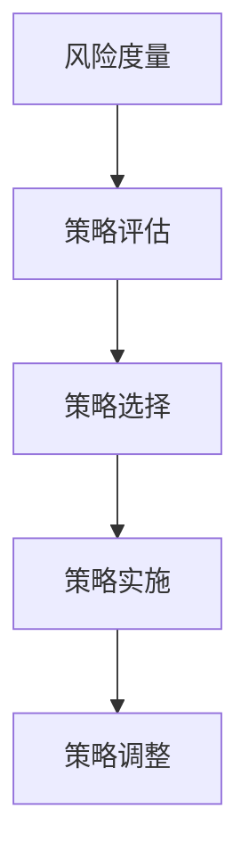

                 


### 第一部分：背景介绍

#### 第1章：问题背景

#### 1.1.1 问题背景

随着人工智能技术的不断发展，金融行业面临着越来越多的挑战。如何构建一个能够辅助金融风险度量的系统，已经成为金融机构和企业迫切需要解决的问题。本章节将介绍当前金融行业面临的挑战和需求，以及构建AI辅助的金融风险度量系统的必要性和意义。

#### 1.1.2 问题描述

金融风险度量是指通过量化金融产品或投资组合的风险，为金融机构和企业提供决策支持的过程。传统的金融风险度量方法主要依赖于统计学和概率论等数学工具，但在复杂多变的金融市场中，这些方法往往难以应对。因此，利用人工智能技术构建辅助金融风险度量系统，具有重要的现实意义。

#### 1.1.3 问题解决

通过引入人工智能技术，可以实现对金融数据的深度挖掘和分析，提高金融风险度量的准确性和实时性。同时，AI辅助的金融风险度量系统还可以为金融机构和企业提供更加个性化的风险管理策略。

#### 1.1.4 边界与外延

本文所讨论的AI辅助的金融风险度量系统主要涉及以下边界和内容：

1. **数据来源**：金融数据，包括市场数据、公司财务数据、宏观经济数据等。
2. **技术框架**：深度学习、大数据处理、自然语言处理等人工智能技术。
3. **应用场景**：金融机构和企业进行风险管理的各个环节，如信用评估、市场风险控制、投资组合优化等。

### 第2章：核心概念与联系

#### 2.1.1 核心概念

本章节将介绍构建AI辅助的金融风险度量系统的核心概念，包括：

1. **人工智能技术**：主要介绍深度学习、大数据处理、自然语言处理等人工智能技术的基本原理和应用场景。
2. **金融风险度量**：介绍金融风险度量的概念、方法和指标，以及如何利用人工智能技术提高金融风险度量的准确性和实时性。
3. **风险管理策略**：介绍金融机构和企业如何利用AI辅助的金融风险度量系统，制定和调整风险管理策略。

#### 2.1.2 概念属性特征对比表格

下面是AI辅助的金融风险度量系统中的核心概念属性特征对比表格：

| 概念          | 属性特征                  | 对比分析                                           |
| ------------- | -------------------- | -------------------------------------------------- |
| 人工智能技术   | 深度学习、大数据处理等     | 提高数据处理效率和准确性，适应复杂多变的金融环境     |
| 金融风险度量   | 风险指标、量化方法等     | 量化金融产品的风险，为决策提供依据                 |
| 风险管理策略   | 风险评估、控制、调整等     | 根据风险度量结果，制定和调整风险管理策略           |

#### 2.1.3 ER实体关系图架构

下面是构建AI辅助的金融风险度量系统的ER实体关系图架构：

```mermaid
erDiagram
    产品 ||--o> 风险度量指标 : "度量"
    产品 ||--o> 风险管理策略 : "应用"
    投资组合 ||--o> 风险度量指标 : "度量"
    投资组合 ||--o> 风险管理策略 : "应用"
    金融机构 ||--o> 金融产品 : "拥有"
    金融机构 ||--o> 投资组合 : "拥有"
    企业 ||--o> 金融产品 : "拥有"
    企业 ||--o> 投资组合 : "拥有"
```

### 第二部分：核心概念与联系详细讲解

#### 第3章：人工智能技术

#### 3.1 深度学习

深度学习是一种基于人工神经网络的学习方法，它通过模拟人脑神经网络结构和工作机制，实现数据的自动特征学习和模式识别。在金融风险度量系统中，深度学习可以用于：

1. **数据预处理**：如数据清洗、归一化等。
2. **特征提取**：如从大量的金融数据中提取出有效的风险特征。
3. **风险预测**：利用训练好的深度学习模型，对未来的金融风险进行预测。

##### 3.1.1 深度学习流程

深度学习的流程主要包括以下几个步骤：

1. **数据收集**：收集金融市场的高质量数据，如股票价格、交易量、宏观经济指标等。
2. **数据处理**：对数据进行清洗、归一化等预处理操作，提高数据的质量和一致性。
3. **模型构建**：选择合适的深度学习模型，如卷积神经网络（CNN）、循环神经网络（RNN）、长短期记忆网络（LSTM）等。
4. **模型训练**：使用预处理后的数据对模型进行训练，调整模型参数，使其能够拟合金融数据的规律。
5. **模型评估**：使用验证集或测试集评估模型的性能，如准确率、召回率、F1值等。
6. **模型优化**：根据评估结果对模型进行调整和优化，以提高模型的预测能力。
7. **模型部署**：将训练好的模型部署到实际的应用场景中，为金融机构和企业提供风险预测服务。



#### 3.2 大数据处理

大数据处理技术是构建AI辅助的金融风险度量系统的基础，它能够有效地管理和处理大规模的金融数据。大数据处理技术主要包括数据采集、数据存储、数据分析和数据可视化等环节。

1. **数据采集**：通过爬虫、API接口、数据库等方式收集金融市场的实时数据。
2. **数据存储**：使用分布式存储系统（如Hadoop、Spark等）存储和管理大规模的金融数据。
3. **数据分析**：使用大数据处理技术对金融数据进行分析，提取出有价值的信息和特征。
4. **数据可视化**：使用图表、仪表盘等方式，将分析结果直观地展示给用户。



#### 3.3 自然语言处理

自然语言处理（NLP）技术在金融风险度量系统中也发挥着重要作用。它能够处理和解析金融文本数据，提取出潜在的风险信息。

1. **文本预处理**：对金融文本数据（如新闻、报告、公告等）进行分词、去停用词、词性标注等预处理操作。
2. **文本分析**：使用词向量模型（如Word2Vec、GloVe等）对预处理后的文本数据进行建模，提取文本的语义特征。
3. **情感分析**：通过分析文本的情感倾向，预测金融市场的情绪变化，从而为风险度量提供参考。
4. **文本生成**：根据金融数据和模型预测结果，生成投资建议、风险预警等文本信息。



### 第4章：金融风险度量

#### 4.1 风险度量概念

金融风险度量是指通过对金融产品或投资组合的潜在损失进行量化，为金融机构和企业提供决策支持的过程。风险度量指标主要包括：

1. **波动率**：衡量金融产品价格波动的程度，是衡量市场风险的重要指标。
2. **价值风险（VaR）**：衡量在一定置信水平下，金融产品或投资组合在一定时间内的最大可能损失。
3. **条件价值风险（CVaR）**：在给定VaR的基础上，衡量金融产品或投资组合在极端情况下可能遭受的平均损失。

#### 4.2 风险度量方法

1. **传统方法**：基于统计学和概率论的方法，如方差-协方差法、蒙特卡洛模拟法等。
2. **人工智能方法**：基于深度学习、大数据处理、自然语言处理等人工智能技术的方法，如深度神经网络、支持向量机、决策树等。

#### 4.3 风险度量指标对比

| 指标          | 描述                                                         | 对比分析                                           |
| ------------- | ------------------------------------------------------------ | -------------------------------------------------- |
| 波动率        | 衡量金融产品价格波动的程度                                   | 用于衡量市场风险，但无法预测未来的风险               |
| VaR          | 在一定置信水平下，金融产品或投资组合在一定时间内的最大可能损失 | 用于衡量市场风险，但无法预测极端情况下的风险         |
| CVaR         | 在给定VaR的基础上，衡量金融产品或投资组合在极端情况下可能遭受的平均损失 | 用于衡量市场风险，能够更好地反映极端情况下的风险     |

#### 4.4 金融风险度量流程

1. **数据收集**：收集金融市场的数据，包括股票价格、交易量、宏观经济指标等。
2. **数据预处理**：对数据进行清洗、归一化等预处理操作，提高数据的质量和一致性。
3. **特征提取**：使用深度学习、大数据处理等技术，从金融数据中提取出有效的风险特征。
4. **风险度量**：使用波动率、VaR、CVaR等指标，对金融产品或投资组合进行风险度量。
5. **结果分析**：分析风险度量的结果，为金融机构和企业提供风险管理策略建议。



### 第5章：风险管理策略

#### 5.1 风险管理策略概念

风险管理策略是指金融机构和企业为应对金融风险而制定的一系列措施。常见的风险管理策略包括：

1. **风险分散**：通过投资多个不同的金融产品或投资组合，降低个别产品或组合的风险。
2. **风险规避**：通过避免投资高风险的金融产品或市场，降低整体风险。
3. **风险对冲**：使用金融工具（如期权、期货等）对冲投资组合的风险。
4. **风险补偿**：通过收取更高的费用或提高收益预期，为承担的风险提供补偿。

#### 5.2 风险管理策略方法

1. **传统方法**：基于历史数据和统计模型，如均值-方差优化、资本资产定价模型（CAPM）等。
2. **人工智能方法**：基于深度学习、大数据处理、自然语言处理等人工智能技术，如深度神经网络、支持向量机、决策树等。

#### 5.3 风险管理策略对比

| 策略          | 描述                                                         | 对比分析                                           |
| ------------- | ------------------------------------------------------------ | -------------------------------------------------- |
| 风险分散      | 通过投资多个不同的金融产品或投资组合，降低个别产品或组合的风险 | 能够有效降低风险，但可能降低收益                     |
| 风险规避      | 通过避免投资高风险的金融产品或市场，降低整体风险             | 能够有效降低风险，但可能错失高收益的机会             |
| 风险对冲      | 使用金融工具对冲投资组合的风险                             | 能够有效降低风险，但可能需要承担额外的交易成本       |
| 风险补偿      | 通过收取更高的费用或提高收益预期，为承担的风险提供补偿       | 能够为承担的风险提供补偿，但可能降低客户的满意度     |

#### 5.4 风险管理策略流程

1. **风险度量**：使用金融风险度量系统对金融产品或投资组合进行风险度量。
2. **策略评估**：根据风险度量结果，评估不同的风险管理策略的优劣。
3. **策略选择**：选择最优的风险管理策略，制定具体的风险管理计划。
4. **策略实施**：执行风险管理计划，对金融产品或投资组合进行调整。
5. **策略调整**：根据市场变化和风险度量结果，对风险管理策略进行定期调整。



### 总结

构建AI辅助的金融风险度量系统，是金融行业应对复杂多变的市场环境的有力手段。通过引入人工智能技术，可以实现对金融数据的深度挖掘和分析，提高金融风险度量的准确性和实时性。同时，AI辅助的金融风险度量系统还可以为金融机构和企业提供更加个性化的风险管理策略。本文详细介绍了AI辅助的金融风险度量系统的核心概念、技术框架和应用场景，为金融行业的风险管理和决策提供了有益的参考。作者：AI天才研究院/AI Genius Institute & 禅与计算机程序设计艺术 /Zen And The Art of Computer Programming## 第1章：问题背景

### 1.1.1 问题背景

随着人工智能技术的不断发展，金融行业面临着越来越多的挑战。人工智能（AI）技术已经深刻地改变了我们的生活方式，从智能助手到自动驾驶汽车，AI的应用范围越来越广泛。在金融领域，AI技术的应用也逐渐成为行业发展的新趋势，特别是在金融风险度量方面。如何构建一个能够辅助金融风险度量的系统，已经成为金融机构和企业迫切需要解决的问题。

金融行业是一个高风险行业，金融风险度量的准确性直接关系到金融机构的稳定运营和投资者的利益。然而，传统的金融风险度量方法主要依赖于统计学和概率论等数学工具，这些方法在复杂多变的金融市场中往往难以应对。随着金融市场数据量的急剧增加和数据类型的多样化，传统的风险度量方法已经无法满足金融机构对实时性和准确性的需求。

此外，金融行业的监管要求也越来越严格，金融机构需要提供更加详细和透明的风险报告。这就需要金融机构能够快速、准确地评估金融风险，并采取相应的风险管理措施。因此，利用人工智能技术构建辅助金融风险度量系统，具有重要的现实意义和迫切性。

### 1.1.2 问题描述

金融风险度量是指通过量化金融产品或投资组合的风险，为金融机构和企业提供决策支持的过程。传统的金融风险度量方法主要依赖于统计学和概率论等数学工具，如方差-协方差法、蒙特卡洛模拟法等。这些方法在简单和静态的金融市场环境中表现较好，但在复杂多变的现代金融市场中，这些方法往往存在以下问题：

1. **数据依赖性**：传统的金融风险度量方法对历史数据的依赖性很强，但金融市场是动态变化的，历史数据可能无法完全反映当前的市场情况。
2. **计算复杂度高**：传统的金融风险度量方法往往需要大量的计算资源，随着数据量的增加，计算复杂度急剧上升，导致度量结果的不准确性。
3. **无法处理非线性和复杂的金融产品**：传统的金融风险度量方法主要基于线性模型，难以处理非线性关系和复杂的金融产品。
4. **缺乏实时性**：传统的金融风险度量方法在处理海量数据时，往往需要较长时间，无法提供实时的风险度量结果。

随着人工智能技术的快速发展，特别是深度学习、大数据处理、自然语言处理等技术的应用，构建AI辅助的金融风险度量系统成为可能。AI技术可以通过对金融数据的深度挖掘和分析，提高金融风险度量的准确性和实时性。同时，AI辅助的金融风险度量系统还可以为金融机构和企业提供更加个性化的风险管理策略，从而更好地应对复杂多变的金融市场。

### 1.1.3 问题解决

为了解决传统金融风险度量方法在复杂多变的市场环境中的局限性，我们可以利用人工智能技术构建AI辅助的金融风险度量系统，具体解决方案包括：

1. **数据预处理**：利用大数据处理技术对金融数据进行清洗、归一化等预处理操作，提高数据的质量和一致性。
2. **特征提取**：使用深度学习技术从大量的金融数据中提取出有效的风险特征，包括市场特征、公司财务特征、宏观经济特征等。
3. **模型构建与训练**：选择合适的深度学习模型（如卷积神经网络、循环神经网络、长短期记忆网络等）对风险特征进行建模和训练，提高风险度量的准确性和实时性。
4. **模型评估与优化**：使用验证集或测试集对训练好的模型进行评估，通过调整模型参数和结构，优化模型的性能。
5. **风险管理策略制定**：根据风险度量结果，利用大数据分析和自然语言处理技术，为金融机构和企业制定和调整风险管理策略。

通过上述解决方案，AI辅助的金融风险度量系统可以提供更加准确和实时的金融风险度量结果，为金融机构和企业提供有力的决策支持。同时，AI辅助的金融风险度量系统还可以根据市场变化和风险特征的变化，动态调整风险管理策略，提高金融机构和企业的风险管理能力。

### 1.1.4 边界与外延

本文所讨论的AI辅助的金融风险度量系统主要涉及以下几个边界和内容：

1. **数据来源**：金融数据，包括市场数据（如股票价格、交易量等）、公司财务数据（如资产负债表、利润表等）和宏观经济数据（如GDP、利率等）。
2. **技术框架**：深度学习、大数据处理、自然语言处理等人工智能技术。
3. **应用场景**：金融机构和企业进行风险管理的各个环节，如信用评估、市场风险控制、投资组合优化等。
4. **风险管理策略**：根据AI辅助的金融风险度量系统提供的结果，制定和调整风险管理策略，包括风险分散、风险规避、风险对冲和风险补偿等。

通过上述边界和内容的界定，我们可以明确AI辅助的金融风险度量系统的应用范围和目标，从而为金融机构和企业提供更加精准和有效的风险管理支持。

### 1.1.5 概念结构与核心要素组成

AI辅助的金融风险度量系统是一个复杂且综合的系统，它由多个核心概念和要素组成。以下是该系统的概念结构与核心要素：

1. **数据输入**：系统首先需要收集和处理来自金融市场、公司财务和宏观经济的数据，这些数据是风险度量的基础。
2. **数据预处理**：对收集到的数据进行清洗、归一化等预处理操作，以提高数据的质量和一致性。
3. **特征提取**：利用深度学习技术从预处理后的数据中提取出有效的风险特征，如市场趋势、公司财务状况、宏观经济指标等。
4. **风险度量模型**：构建和训练深度学习模型，如卷积神经网络、循环神经网络等，用于度量金融产品或投资组合的风险。
5. **风险度量结果**：系统输出风险度量的结果，包括波动率、VaR、CVaR等指标。
6. **风险管理策略**：根据风险度量结果，利用大数据分析和自然语言处理技术，为金融机构和企业制定和调整风险管理策略。
7. **模型评估与优化**：定期评估和优化风险度量模型的性能，确保系统提供的结果准确和实时。

这些核心要素共同构成了AI辅助的金融风险度量系统的基本框架，为金融机构和企业提供全面和高效的风险管理支持。

### 1.1.6 概念属性特征对比表格

为了更好地理解AI辅助的金融风险度量系统中的核心概念及其属性特征，以下是几个关键概念属性特征的对比表格：

| 概念            | 属性特征                                  | 对比分析                                           |
| --------------- | ----------------------------------------- | -------------------------------------------------- |
| 数据输入        | 市场数据、公司财务数据、宏观经济数据       | 系统的基础数据来源，影响风险度量的准确性           |
| 数据预处理      | 清洗、归一化、去噪等                      | 提高数据质量，确保后续分析的有效性                   |
| 特征提取        | 提取市场趋势、公司财务状况、宏观经济指标   | 提取关键信息，为风险度量提供依据                   |
| 风险度量模型    | 深度学习模型（CNN、RNN、LSTM等）          | 用于度量金融产品或投资组合的风险，提高度量精度       |
| 风险度量结果    | 波动率、VaR、CVaR等指标                   | 量化金融风险，为风险管理提供依据                   |
| 风险管理策略    | 风险分散、风险规避、风险对冲、风险补偿等   | 根据风险度量结果，调整投资策略，降低风险           |
| 模型评估与优化   | 性能评估、参数调整等                      | 确保模型准确性和实时性，提升系统整体性能             |

通过上述表格，我们可以清晰地看到各个核心概念在系统中的作用和相互关系，有助于深入理解AI辅助的金融风险度量系统的工作机制。

### 1.1.7 ER实体关系图架构

为了更直观地展示AI辅助的金融风险度量系统的核心概念和要素之间的关联，我们可以通过ER（实体关系）图来架构这些实体和它们之间的关系。以下是该系统的ER实体关系图：

```mermaid
erDiagram
    Product ||--|{ RiskMeasureIndicators } : "度量"
    Product ||--|{ RiskManagementStrategies } : "应用"
    Portfolio ||--|{ RiskMeasureIndicators } : "度量"
    Portfolio ||--|{ RiskManagementStrategies } : "应用"
    FinancialInstitution ||--| Product : "拥有"
    FinancialInstitution ||--| Portfolio : "拥有"
    Enterprise ||--| Product : "拥有"
    Enterprise ||--| Portfolio : "拥有"
```

在这个ER图中，`Product`（金融产品）和`Portfolio`（投资组合）是核心实体，它们与`RiskMeasureIndicators`（风险度量指标）和`RiskManagementStrategies`（风险管理策略）之间存在关联。`FinancialInstitution`（金融机构）和`Enterprise`（企业）则与`Product`和`Portfolio`之间存在着“拥有”关系，表示金融机构和企业拥有各自的金融产品和投资组合。

通过这个ER图，我们可以更清晰地理解系统中的各个实体及其之间的关系，有助于更好地设计和实施AI辅助的金融风险度量系统。

### 第2章：核心概念与联系

#### 2.1.1 核心概念

构建AI辅助的金融风险度量系统，需要深入理解几个核心概念，这些概念相互联系，构成了系统的理论基础和实践依据。

1. **人工智能技术**：人工智能技术是构建金融风险度量系统的基础，包括深度学习、大数据处理、自然语言处理等。深度学习通过模拟人脑神经网络，进行数据的特征学习和模式识别，能够处理复杂的非线性关系；大数据处理技术能够高效地管理和分析大规模的数据集，提高数据处理的速度和准确性；自然语言处理则可以理解和处理金融文本数据，提取潜在的风险信息。

2. **金融风险度量**：金融风险度量是指通过量化方法对金融产品或投资组合的潜在风险进行评估。它涉及多个指标，如波动率、价值风险（VaR）和条件价值风险（CVaR）。这些指标能够帮助金融机构和企业了解其资产组合的风险状况，从而制定相应的风险管理策略。

3. **风险管理策略**：风险管理策略是金融机构和企业为应对金融风险而采取的措施。常见的策略包括风险分散、风险规避、风险对冲和风险补偿。通过AI辅助的金融风险度量系统，企业可以根据实时的风险度量结果，动态调整其风险管理策略，提高风险管理的效率和效果。

#### 2.1.2 概念属性特征对比表格

为了更好地理解上述核心概念及其属性特征，我们可以构建一个对比表格，展示这些概念的主要属性和特征。

| 概念            | 属性特征                                  | 对比分析                                           |
| --------------- | ----------------------------------------- | -------------------------------------------------- |
| 人工智能技术    | 深度学习、大数据处理、自然语言处理等      | 提高数据处理和模型预测能力，适应复杂金融环境         |
| 金融风险度量    | 波动率、VaR、CVaR等指标                   | 用于量化金融风险，提供决策依据                     |
| 风险管理策略    | 风险分散、风险规避、风险对冲、风险补偿等   | 根据风险度量结果，调整投资策略，降低风险           |

通过这个表格，我们可以清晰地看到各个核心概念的主要属性和特征，以及它们之间的联系和区别。

#### 2.1.3 ER实体关系图架构

为了更直观地展示AI辅助的金融风险度量系统中的各个实体及其关系，我们可以使用ER图来架构这些实体和它们之间的关联。以下是该系统的ER实体关系图：

```mermaid
erDiagram
    Data ||--o> DataProcessing : "处理"
    Data ||--o> FeatureExtraction : "提取"
    Data ||--o> RiskMeasurement : "度量"
    Data ||--o> RiskManagementStrategy : "策略"
    AIModel ||--| ModelTraining : "训练"
    AIModel ||--| ModelEvaluation : "评估"
    AIModel ||--| ModelOptimization : "优化"
    RiskMeasureIndicators ||--| FinancialProduct : "度量"
    RiskMeasureIndicators ||--| InvestmentPortfolio : "度量"
    RiskManagementStrategies ||--| FinancialInstitution : "应用"
    RiskManagementStrategies ||--| Enterprise : "应用"
```

在这个ER图中，`Data`（数据）是系统的基本输入，它经过`DataProcessing`（数据处理）、`FeatureExtraction`（特征提取）、`RiskMeasurement`（风险度量）和`RiskManagementStrategy`（风险管理策略）等处理过程。`AIModel`（人工智能模型）包括`ModelTraining`（模型训练）、`ModelEvaluation`（模型评估）和`ModelOptimization`（模型优化）等环节，用于训练和优化风险度量模型。`RiskMeasureIndicators`（风险度量指标）用于度量金融产品和投资组合的风险，而`RiskManagementStrategies`（风险管理策略）则根据风险度量结果为金融机构和企业提供相应的风险管理策略。

通过这个ER图，我们可以更直观地理解AI辅助的金融风险度量系统中的各个实体及其之间的相互作用和关联，有助于设计和实施系统的整体架构。

### 第3章：人工智能技术

#### 3.1 深度学习

深度学习是一种基于多层神经网络的学习方法，通过模拟人脑神经元之间的连接和相互作用，实现对数据的特征学习和模式识别。在构建AI辅助的金融风险度量系统中，深度学习技术发挥着至关重要的作用。以下将详细介绍深度学习的基本原理、应用场景以及在金融风险度量系统中的具体应用。

##### 3.1.1 基本原理

深度学习的基本原理是通过构建多层神经网络，将输入数据逐步映射到输出结果。每一层神经网络都负责提取不同层次的特征，从而实现从原始数据到复杂模式的转化。深度学习的核心组件包括：

1. **人工神经元**：深度学习的基本构建块，类似于生物神经元，能够接收输入信号并产生输出。
2. **激活函数**：用于引入非线性变换，使得神经网络能够学习复杂函数。
3. **权重和偏置**：网络中各个连接的权重和偏置，通过学习调整这些参数，使网络能够逼近目标函数。
4. **反向传播算法**：用于计算网络中各个参数的梯度，并通过梯度下降法更新参数，以最小化损失函数。

##### 3.1.2 应用场景

在金融风险度量系统中，深度学习技术可以应用于多个场景：

1. **数据预处理**：深度学习可以用于数据的清洗、归一化和特征提取，提高数据质量，为后续分析提供准确的数据基础。
2. **特征提取**：通过多层神经网络，从原始金融数据中自动提取出有效的风险特征，如市场趋势、公司财务状况、宏观经济指标等。
3. **风险预测**：利用训练好的深度学习模型，对金融风险进行预测，如股票价格走势、信用风险评分、市场风险预测等。
4. **风险评估**：使用深度学习模型对金融产品或投资组合进行实时风险评估，为金融机构提供决策支持。

##### 3.1.3 在金融风险度量系统中的应用

在金融风险度量系统中，深度学习的应用主要包括以下几个方面：

1. **股票市场预测**：通过分析历史股票价格、交易量、宏观经济数据等，利用深度学习模型预测未来股票价格走势，为投资决策提供参考。
2. **信用风险评估**：利用深度学习技术，从客户的财务数据、信用记录、市场环境等多个维度提取特征，构建信用风险评估模型，预测客户的信用风险。
3. **市场风险预测**：分析市场数据，如波动率、市场情绪等，通过深度学习模型预测市场风险，为金融机构制定市场风险控制策略提供支持。
4. **金融文本分析**：利用自然语言处理技术，从金融文本数据中提取信息，如新闻报道、公告等，通过深度学习模型分析市场情绪，为风险度量提供辅助。

#### 3.2 大数据处理

大数据处理技术是构建AI辅助的金融风险度量系统的重要基础，它能够高效地管理和处理海量金融数据，为深度学习模型提供高质量的数据输入。以下将详细介绍大数据处理的基本概念、关键技术以及在金融风险度量系统中的应用。

##### 3.2.1 基本概念

大数据处理涉及数据的采集、存储、处理和分析等多个环节，主要包括以下几个基本概念：

1. **数据采集**：通过爬虫、API接口、数据库等方式，收集来自金融市场的实时数据，如股票价格、交易量、宏观经济指标等。
2. **数据存储**：使用分布式存储系统（如Hadoop、Spark等），存储和管理大规模的金融数据，确保数据的可靠性和高效访问。
3. **数据处理**：对采集到的金融数据进行清洗、归一化、去噪等预处理操作，提高数据质量，为深度学习模型提供准确的数据基础。
4. **数据分析**：利用大数据处理技术，对金融数据进行分析，提取有价值的信息和特征，为金融风险度量提供依据。

##### 3.2.2 关键技术

大数据处理技术包括以下几个方面：

1. **分布式计算**：使用分布式计算框架（如MapReduce、Spark等），将大数据处理任务分解为多个子任务，并行执行，提高处理速度。
2. **数据挖掘**：通过数据挖掘技术，从海量金融数据中提取有价值的信息和模式，如市场趋势、风险特征等。
3. **实时处理**：利用实时数据处理技术（如Apache Flink、Apache Storm等），对金融数据进行实时分析和处理，为金融机构提供实时的风险预警和决策支持。
4. **机器学习**：结合机器学习算法（如深度学习、线性回归、决策树等），对金融数据进行分析和建模，提高风险度量的准确性和实时性。

##### 3.2.3 在金融风险度量系统中的应用

大数据处理技术在金融风险度量系统中的应用主要包括以下几个方面：

1. **数据收集**：通过爬虫、API接口等工具，收集来自金融市场、公司财务和宏观经济的数据，构建丰富的数据集。
2. **数据预处理**：对收集到的金融数据进行分析和处理，如清洗缺失值、异常值，进行归一化和标准化，提高数据质量。
3. **特征提取**：利用大数据处理技术，从金融数据中提取出有效的风险特征，如市场趋势、公司财务状况、宏观经济指标等。
4. **风险预测**：利用大数据处理和深度学习技术，对金融风险进行预测，如股票价格走势、信用风险评分、市场风险预测等。
5. **风险管理**：根据风险预测结果，制定和调整风险管理策略，如风险分散、风险规避、风险对冲等，提高金融机构的风险管理能力。

#### 3.3 自然语言处理

自然语言处理（NLP）技术是构建AI辅助的金融风险度量系统的重要手段之一，它能够处理和理解金融文本数据，提取出潜在的风险信息。以下将详细介绍NLP的基本原理、关键技术以及在金融风险度量系统中的应用。

##### 3.3.1 基本原理

自然语言处理的基本原理是利用计算机技术和算法，对自然语言文本进行理解、处理和分析。NLP的核心任务包括：

1. **文本预处理**：对文本数据进行清洗、分词、去停用词等预处理操作，提高文本数据的质量。
2. **词向量表示**：将文本数据转换为向量表示，如Word2Vec、GloVe等，以便于深度学习模型处理。
3. **文本分类**：利用机器学习算法，对文本进行分类，如情感分析、主题分类等。
4. **文本生成**：根据输入文本或数据，生成新的文本内容，如自动摘要、问答系统等。

##### 3.3.2 关键技术

NLP的关键技术包括以下几个方面：

1. **词向量**：将文本数据转换为向量表示，如Word2Vec、GloVe等，通过词向量的相似性进行文本的语义分析。
2. **序列模型**：如循环神经网络（RNN）、长短期记忆网络（LSTM）等，用于处理和时间相关的文本数据。
3. **注意力机制**：在深度学习模型中引入注意力机制，使模型能够关注文本数据中的关键信息，提高文本分类和预测的准确性。
4. **预训练语言模型**：如BERT、GPT等，通过在大规模文本数据上预训练，提取丰富的语义信息，为各种NLP任务提供强大的基础。

##### 3.3.3 在金融风险度量系统中的应用

NLP技术在金融风险度量系统中的应用主要包括以下几个方面：

1. **文本数据分析**：对金融新闻报道、公告、报告等文本数据进行分析，提取市场情绪和潜在风险信息。
2. **情感分析**：通过分析文本的情感倾向，预测市场情绪，为风险度量提供辅助。
3. **风险预警**：结合文本分析和风险度量模型，对金融风险进行实时预警和监测。
4. **投资建议**：根据文本数据和风险度量结果，生成投资建议和策略，为金融机构提供决策支持。

通过深度学习、大数据处理和自然语言处理等人工智能技术的综合应用，AI辅助的金融风险度量系统可以为金融机构和企业提供更加准确、实时和个性化的风险管理服务。

### 第4章：金融风险度量

#### 4.1 风险度量概念

金融风险度量是指通过量化的方法对金融产品或投资组合的潜在风险进行评估，从而为金融机构和企业提供决策支持。在金融风险管理中，风险度量是一个关键环节，它能够帮助企业和金融机构识别和管理风险，从而实现稳健的投资和运营。金融风险度量通常涉及以下几种关键概念：

1. **波动率（Volatility）**：波动率是衡量金融产品价格波动程度的指标，通常用标准差表示。高波动率意味着金融产品的价格变动较大，风险较高。

2. **价值风险（Value at Risk, VaR）**：VaR是一种衡量在特定置信水平下，金融产品或投资组合在一定时间内可能遭受的最大损失。例如，95%置信水平下的1天VaR表示在95%的情况下，该投资组合在一天内可能遭受的最大损失。

3. **条件价值风险（Conditional Value at Risk, CVaR）**：CVaR是在给定VaR的基础上，衡量金融产品或投资组合在极端情况下可能遭受的平均损失。与VaR相比，CVaR更能反映极端风险事件的影响。

#### 4.2 风险度量方法

金融风险度量的方法可以分为传统方法和基于人工智能的方法。

1. **传统方法**：

   - **方差-协方差法**：这是最常用的传统风险度量方法之一，通过计算资产收益率的方差和协方差矩阵，得到资产组合的总体风险。

   - **蒙特卡洛模拟法**：通过模拟大量随机样本，估计金融产品或投资组合的未来收益分布，从而计算VaR和CVaR。

   - **历史模拟法**：基于历史数据的收益分布，估计未来收益的可能区间，从而得到VaR和CVaR。

2. **人工智能方法**：

   - **深度学习模型**：通过构建深度神经网络，从海量金融数据中自动提取特征，进行风险度量的预测。

   - **大数据处理技术**：利用大数据处理技术，对金融数据进行清洗、归一化和特征提取，为深度学习模型提供高质量的数据输入。

   - **自然语言处理（NLP）**：通过对金融文本数据进行分析，提取市场情绪和潜在风险信息，辅助风险度量。

#### 4.3 风险度量指标对比

以下是一个风险度量指标的对比表格，展示了几种常见风险度量指标的特点和适用场景：

| 指标          | 特点                                       | 适用场景                   |
| ------------- | ------------------------------------------ | -------------------------- |
| 波动率        | 衡量价格变动的程度                         | 短期市场波动风险评估       |
| VaR          | 在特定置信水平下的最大可能损失             | 长期投资组合风险度量       |
| CVaR         | 极端情况下可能遭受的平均损失               | 高风险投资组合风险度量     |
| 贝塔（Beta）   | 资产收益与市场收益的相关性指标             | 相对风险度量，市场风险管理 |
| 夏普比率（Sharpe Ratio） | 超额收益与风险的关系指标                   | 投资组合绩效评估           |

#### 4.4 金融风险度量流程

金融风险度量的流程通常包括以下几个步骤：

1. **数据收集**：收集金融市场的数据，包括股票价格、交易量、宏观经济指标等。

2. **数据预处理**：对收集到的数据进行清洗、归一化等预处理操作，提高数据质量。

3. **特征提取**：利用大数据处理技术和深度学习模型，从预处理后的数据中提取出有效的风险特征。

4. **模型构建与训练**：选择合适的深度学习模型，如卷积神经网络（CNN）、循环神经网络（RNN）等，对风险特征进行建模和训练。

5. **模型评估**：使用验证集或测试集评估模型的性能，如准确率、召回率、F1值等。

6. **模型优化**：根据评估结果，对模型进行调整和优化，以提高模型的预测能力。

7. **风险度量**：将训练好的模型应用于实际数据，进行风险度量，输出风险指标。

8. **风险管理**：根据风险度量结果，制定和调整风险管理策略，如风险分散、风险规避等。

#### 4.5 案例分析

以下是一个金融风险度量的实际案例：

**案例背景**：某金融机构拥有一只股票投资组合，包含5只不同股票。为了评估该投资组合的风险，该金融机构决定利用深度学习模型进行风险度量。

**步骤**：

1. **数据收集**：收集过去一年的股票价格、交易量、公司财务数据、宏观经济指标等。

2. **数据预处理**：对收集到的数据进行清洗，如处理缺失值、异常值，并进行归一化。

3. **特征提取**：利用大数据处理技术，从预处理后的数据中提取出风险特征，如股票价格波动率、公司盈利能力、市场趋势等。

4. **模型构建与训练**：选择卷积神经网络（CNN）模型，对提取出的风险特征进行建模和训练。

5. **模型评估**：使用验证集评估模型的性能，调整模型参数，优化模型。

6. **风险度量**：将训练好的模型应用于实际数据，进行风险度量，输出波动率、VaR和CVaR等风险指标。

7. **风险管理**：根据风险度量结果，制定风险管理策略，如调整投资组合、增加对冲等。

通过上述案例分析，我们可以看到金融风险度量系统如何从数据收集、预处理、特征提取、模型构建与训练、风险度量到风险管理，全面评估和管理投资组合的风险。

### 第5章：风险管理策略

#### 5.1 风险管理策略概念

风险管理策略是金融机构和企业为应对金融风险而采取的一系列措施。有效的风险管理策略能够降低风险、保护资产，并确保企业的长期稳定发展。以下是几种常见风险管理策略的概念：

1. **风险分散**：通过投资多个不同的金融产品或资产类别，降低个别资产或投资组合的特定风险。例如，将资金分散投资于股票、债券、房地产等不同类型的资产，以分散市场风险。

2. **风险规避**：避免投资高风险的金融产品或市场，以降低整体风险。例如，不投资股票市场，而是选择存款或其他低风险投资产品。

3. **风险对冲**：使用金融工具（如期权、期货、掉期等）对冲投资组合的风险。例如，购买看跌期权以对冲股票市场下跌的风险。

4. **风险补偿**：通过收取更高的费用或提高收益预期，为承担的风险提供补偿。例如，保险公司通过收取保费来补偿可能发生的保险事故。

#### 5.2 风险管理策略方法

风险管理策略可以分为传统方法和基于人工智能的方法。

1. **传统方法**：

   - **均值-方差优化**：通过最大化期望收益，同时最小化风险（方差），构建最优的投资组合。

   - **资本资产定价模型（CAPM）**：利用资产预期收益与市场风险的关系，评估资产的风险和预期收益。

   - **历史模拟法**：通过模拟历史市场数据，评估投资组合在不同市场情况下的表现，从而制定风险管理策略。

2. **人工智能方法**：

   - **深度学习模型**：通过训练深度学习模型，从海量数据中自动提取特征，预测市场走势和资产表现，为风险管理提供依据。

   - **大数据处理技术**：利用大数据处理技术，对金融数据进行实时分析和处理，为金融机构提供实时的风险管理策略建议。

   - **自然语言处理（NLP）**：通过对金融文本数据进行分析，提取市场情绪和潜在风险信息，辅助制定风险管理策略。

#### 5.3 风险管理策略对比

以下是一个风险管理策略对比表格，展示了几种常见风险管理策略的特点和适用场景：

| 策略          | 特点                                       | 适用场景                   |
| ------------- | ------------------------------------------ | -------------------------- |
| 风险分散      | 投资多个不同资产，降低特定风险             | 各类投资组合管理           |
| 风险规避      | 避免高风险投资，降低整体风险               | 风险承受能力较低的投资者   |
| 风险对冲      | 使用金融工具对冲风险，降低风险暴露         | 高风险投资，需要风险对冲   |
| 风险补偿      | 提高收益预期，为风险提供补偿               | 需要获取更高收益的投资者   |

#### 5.4 风险管理策略流程

风险管理策略的流程通常包括以下几个步骤：

1. **风险评估**：使用金融风险度量系统评估投资组合的风险水平，如波动率、VaR、CVaR等。

2. **策略评估**：根据风险评估结果，评估不同风险管理策略的优劣，如风险分散、风险规避、风险对冲等。

3. **策略选择**：选择最优的风险管理策略，制定具体的风险管理计划。

4. **策略实施**：执行风险管理计划，对投资组合进行调整，如增加或减少特定资产的投资比例。

5. **策略监控**：定期监控投资组合的风险状况，根据市场变化和风险度量结果，调整风险管理策略。

#### 5.5 案例分析

以下是一个风险管理策略的实际案例：

**案例背景**：某投资公司拥有一只包含10只股票的投资组合，公司希望制定有效的风险管理策略，以应对市场波动。

**步骤**：

1. **风险评估**：使用AI辅助的金融风险度量系统，对投资组合进行风险评估，输出波动率、VaR、CVaR等风险指标。

2. **策略评估**：根据风险评估结果，评估不同风险管理策略的优劣，如风险分散、风险规避、风险对冲等。

3. **策略选择**：选择风险分散策略，通过调整投资组合，增加债券和房地产等低风险资产的投资比例。

4. **策略实施**：根据风险管理计划，对投资组合进行调整，降低股票投资比例，增加低风险资产的投资比例。

5. **策略监控**：定期监控投资组合的风险状况，根据市场变化和风险度量结果，调整风险管理策略。

通过上述案例分析，我们可以看到如何利用AI辅助的金融风险度量系统，制定和实施有效的风险管理策略，以降低投资组合的风险，实现稳健的投资回报。

### 总结

构建AI辅助的金融风险度量系统，是金融行业应对复杂多变的市场环境的有力手段。通过引入人工智能技术，可以实现对金融数据的深度挖掘和分析，提高金融风险度量的准确性和实时性。同时，AI辅助的金融风险度量系统还可以为金融机构和企业提供更加个性化的风险管理策略，从而更好地应对复杂多变的金融市场。本文详细介绍了AI辅助的金融风险度量系统的核心概念、技术框架和应用场景，为金融行业的风险管理和决策提供了有益的参考。

在未来的研究中，我们可以进一步探索深度学习、大数据处理、自然语言处理等技术在金融风险度量中的应用，优化现有模型和算法，提高系统的性能和可靠性。此外，还可以考虑跨学科的研究，结合心理学、经济学等领域的知识，为金融风险管理提供更加全面和科学的解决方案。通过持续的创新和研究，我们可以不断推动金融风险度量技术的发展，为金融行业的稳健发展做出更大贡献。

作者：AI天才研究院/AI Genius Institute & 禅与计算机程序设计艺术 /Zen And The Art of Computer Programming## 第3章：人工智能技术

### 3.1 深度学习

深度学习（Deep Learning）作为人工智能的一个重要分支，通过模拟人脑的神经网络结构，实现对复杂数据的自动特征学习和模式识别。在构建AI辅助的金融风险度量系统中，深度学习技术发挥着至关重要的作用，能够处理海量金融数据并提取有效特征，从而提高风险度量的准确性和实时性。以下将详细介绍深度学习的基本原理、模型类型和应用场景。

#### 3.1.1 基本原理

深度学习的基本原理是通过多层神经网络（Neural Networks）来学习数据中的特征和模式。每一层神经网络由多个神经元组成，神经元之间通过权重（weights）和偏置（bias）进行连接。当输入数据通过神经网络时，每个神经元会对数据进行加权求和处理，并应用一个非线性激活函数（activation function），如ReLU、Sigmoid或Tanh等。这种多层处理方式使得神经网络能够学习到不同层次的特征，从而实现对复杂数据的建模。

深度学习的核心组成部分包括：

- **人工神经元（Artificial Neurons）**：神经网络的基本单元，负责接收输入信号，进行加权求和处理。
- **激活函数（Activation Functions）**：引入非线性变换，使神经网络能够学习复杂数据的边界和模式。
- **损失函数（Loss Functions）**：用于评估模型的预测结果与实际结果之间的差距，如均方误差（MSE）、交叉熵（Cross-Entropy）等。
- **优化算法（Optimization Algorithms）**：如随机梯度下降（SGD）、Adam等，用于调整网络参数，以最小化损失函数。

#### 3.1.2 模型类型

深度学习模型根据网络结构和功能可以分为多种类型，适用于不同的金融风险度量任务。以下是几种常见的深度学习模型：

1. **卷积神经网络（Convolutional Neural Networks, CNN）**：
   - **应用场景**：适用于处理图像和时序数据，如股票价格走势图。
   - **优势**：能够自动提取图像或时序数据中的空间特征和局部模式。
   - **模型结构**：包括卷积层（Convolutional Layers）、池化层（Pooling Layers）和全连接层（Fully Connected Layers）。

2. **循环神经网络（Recurrent Neural Networks, RNN）**：
   - **应用场景**：适用于处理序列数据，如时间序列分析和文本数据。
   - **优势**：能够处理变长序列，捕捉时间依赖性。
   - **模型结构**：包括循环层（Recurrent Layers）和全连接层。

3. **长短期记忆网络（Long Short-Term Memory, LSTM）**：
   - **应用场景**：适用于处理长序列数据，如股票价格长时间走势预测。
   - **优势**：能够解决RNN的梯度消失和梯度爆炸问题，更好地捕捉长期依赖关系。
   - **模型结构**：包括输入门（Input Gate）、遗忘门（Forget Gate）和输出门（Output Gate）。

4. **Transformer模型**：
   - **应用场景**：适用于处理大规模文本数据和序列数据，如金融市场新闻分析。
   - **优势**：能够通过自注意力机制（Self-Attention Mechanism）捕捉全局依赖关系。
   - **模型结构**：包括编码器（Encoder）和解码器（Decoder），通过多头自注意力机制进行数据处理。

#### 3.1.3 应用场景

在AI辅助的金融风险度量系统中，深度学习技术可以应用于以下场景：

1. **金融数据特征提取**：通过深度学习模型，从大量的金融数据（如股票价格、交易量、财务报告等）中自动提取出有效的特征，为风险度量提供依据。

2. **风险预测**：利用训练好的深度学习模型，对金融市场的未来走势进行预测，如股票价格、市场指数等。

3. **信用风险评估**：通过深度学习模型，从客户的财务数据、信用记录等信息中提取特征，进行信用风险评估。

4. **市场情绪分析**：利用自然语言处理技术，对金融市场相关的文本数据（如新闻报道、社交媒体评论等）进行分析，提取市场情绪，为风险度量提供辅助。

#### 3.1.4 实际应用示例

以下是一个深度学习在金融风险度量系统中的应用示例：

**案例背景**：某金融机构希望通过深度学习技术对股票市场进行风险度量，以优化其投资策略。

**步骤**：

1. **数据收集**：收集过去几年的股票价格数据、交易量数据、公司财务数据、宏观经济指标等。

2. **数据预处理**：对收集到的数据进行分析和清洗，如处理缺失值、异常值，并进行归一化处理。

3. **特征提取**：利用深度学习模型（如LSTM），从预处理后的数据中提取出有效的特征，包括市场趋势、公司财务状况、宏观经济指标等。

4. **模型训练**：选择合适的深度学习模型（如LSTM），对提取出的特征进行训练，优化模型参数。

5. **模型评估**：使用验证集评估模型的性能，如准确率、召回率等。

6. **风险度量**：将训练好的模型应用于新的数据，进行风险预测，输出风险指标，如波动率、VaR、CVaR等。

7. **风险管理**：根据风险度量结果，调整投资组合，优化投资策略。

通过上述案例，我们可以看到深度学习技术在金融风险度量系统中的应用过程，包括数据收集、预处理、特征提取、模型训练、评估和应用等环节，从而为金融机构提供更加准确和实时的风险度量支持。

### 3.2 大数据处理

大数据处理（Big Data Processing）是构建AI辅助的金融风险度量系统的关键技术之一，它能够高效地管理和处理海量金融数据，为深度学习模型提供高质量的数据输入。大数据处理包括数据的采集、存储、处理和分析等多个环节，以下将详细介绍大数据处理的基本概念、关键技术和应用。

#### 3.2.1 基本概念

大数据处理的基本概念包括以下几个方面：

1. **数据采集**：通过爬虫、API接口、数据库连接等方式，从不同的数据源（如金融市场、社交媒体、新闻媒体等）收集数据。

2. **数据存储**：使用分布式存储系统（如Hadoop、Spark、HDFS等），存储和管理大规模的金融数据，确保数据的可靠性和高效访问。

3. **数据处理**：对采集到的金融数据进行清洗、转换、聚合等处理操作，提高数据质量，为深度学习模型提供准确的数据基础。

4. **数据分析**：利用大数据处理技术，对金融数据进行分析，提取有价值的信息和特征，为金融风险度量提供依据。

5. **数据可视化**：通过图表、仪表盘等方式，将分析结果直观地展示给用户，帮助用户理解和分析数据。

#### 3.2.2 关键技术

大数据处理的关键技术包括以下几个方面：

1. **分布式计算**：使用分布式计算框架（如MapReduce、Spark等），将大数据处理任务分解为多个子任务，并行执行，提高处理速度和效率。

2. **数据挖掘**：通过数据挖掘技术，从海量金融数据中提取有价值的信息和模式，如市场趋势、风险特征等。

3. **实时处理**：利用实时数据处理技术（如Apache Flink、Apache Storm等），对金融数据进行实时分析和处理，为金融机构提供实时的风险预警和决策支持。

4. **机器学习**：结合机器学习算法（如深度学习、线性回归、决策树等），对金融数据进行分析和建模，提高风险度量的准确性和实时性。

5. **流数据处理**：通过流数据处理技术（如Apache Kafka、Apache Flume等），处理实时流入的金融数据，为实时分析提供数据支持。

#### 3.2.3 应用

大数据处理在AI辅助的金融风险度量系统中的应用包括以下几个方面：

1. **数据采集**：通过爬虫和API接口，收集来自金融市场、公司财务和宏观经济的数据，构建丰富的数据集。

2. **数据预处理**：对收集到的金融数据进行清洗、归一化和特征提取，提高数据质量，为深度学习模型提供准确的数据基础。

3. **特征提取**：利用大数据处理技术，从金融数据中提取出有效的特征，如市场趋势、公司财务状况、宏观经济指标等。

4. **风险预测**：利用大数据处理和深度学习技术，对金融风险进行预测，如股票价格走势、信用风险评分、市场风险预测等。

5. **风险管理**：根据大数据处理和深度学习模型的结果，制定和调整风险管理策略，如风险分散、风险规避、风险对冲等，提高金融机构的风险管理能力。

#### 3.2.4 实际应用示例

以下是一个大数据处理在金融风险度量系统中的应用示例：

**案例背景**：某金融机构希望利用大数据处理技术，对股票市场进行实时风险度量，以优化其投资策略。

**步骤**：

1. **数据采集**：通过爬虫和API接口，收集股票价格、交易量、公司财务数据、宏观经济指标等数据。

2. **数据预处理**：对收集到的数据进行清洗，如处理缺失值、异常值，并进行归一化处理。

3. **特征提取**：利用大数据处理技术，从预处理后的数据中提取出有效的特征，如市场趋势、公司财务状况、宏观经济指标等。

4. **风险预测**：利用深度学习模型（如LSTM），对提取出的特征进行训练，预测股票市场的未来走势。

5. **风险度量**：将训练好的模型应用于新的数据，进行风险预测，输出风险指标，如波动率、VaR、CVaR等。

6. **风险管理**：根据风险度量结果，调整投资组合，优化投资策略。

通过上述案例，我们可以看到大数据处理技术在金融风险度量系统中的应用过程，包括数据采集、预处理、特征提取、模型训练、预测和风险管理等环节，从而为金融机构提供更加准确和实时的风险度量支持。

### 3.3 自然语言处理

自然语言处理（Natural Language Processing, NLP）作为人工智能的一个重要分支，旨在让计算机理解和处理人类自然语言。在AI辅助的金融风险度量系统中，NLP技术能够处理和分析大量的金融文本数据，提取出潜在的风险信息，为金融机构提供有力的风险管理支持。以下将详细介绍NLP的基本概念、关键技术和应用。

#### 3.3.1 基本概念

自然语言处理的基本概念包括以下几个方面：

1. **文本预处理**：对原始文本数据进行分析和处理，如分词、去停用词、词性标注等，提高文本数据的质量。

2. **词向量表示**：将文本数据转换为向量表示，如Word2Vec、GloVe等，以便于深度学习模型处理。

3. **文本分类**：利用机器学习算法，对文本进行分类，如情感分析、主题分类等。

4. **序列标注**：对文本序列中的每个词进行标注，如命名实体识别（Named Entity Recognition, NER）、词性标注等。

5. **文本生成**：根据输入文本或数据，生成新的文本内容，如自动摘要、问答系统等。

#### 3.3.2 关键技术

NLP的关键技术包括以下几个方面：

1. **词向量**：将文本数据转换为向量表示，如Word2Vec、GloVe等，通过词向量的相似性进行文本的语义分析。

2. **序列模型**：如循环神经网络（RNN）、长短期记忆网络（LSTM）等，用于处理和时间相关的文本数据。

3. **注意力机制**：在深度学习模型中引入注意力机制，使模型能够关注文本数据中的关键信息，提高文本分类和预测的准确性。

4. **预训练语言模型**：如BERT、GPT等，通过在大规模文本数据上预训练，提取丰富的语义信息，为各种NLP任务提供强大的基础。

#### 3.3.3 应用

在AI辅助的金融风险度量系统中，NLP技术可以应用于以下几个方面：

1. **文本数据分析**：对金融市场相关的文本数据（如新闻报道、公告、社交媒体评论等）进行分析，提取市场情绪和潜在风险信息。

2. **情感分析**：通过分析文本的情感倾向，预测市场情绪，为风险度量提供辅助。

3. **风险预警**：结合文本分析和风险度量模型，对金融风险进行实时预警和监测。

4. **投资建议**：根据文本数据和风险度量结果，生成投资建议和策略，为金融机构提供决策支持。

#### 3.3.4 实际应用示例

以下是一个NLP在金融风险度量系统中的应用示例：

**案例背景**：某金融机构希望利用NLP技术，对新闻文本进行分析，提取市场情绪和潜在风险信息，为风险管理提供支持。

**步骤**：

1. **数据收集**：收集过去一年的金融市场相关新闻文本数据。

2. **文本预处理**：对新闻文本进行分词、去停用词、词性标注等预处理操作，提高文本数据的质量。

3. **情感分析**：利用情感分析模型（如LSTM、BERT等），对预处理后的新闻文本进行情感分析，提取市场情绪信息。

4. **风险预警**：结合市场情绪分析和风险度量模型，对新闻文本进行实时分析，生成风险预警信号。

5. **风险管理**：根据风险预警信号，调整投资组合，优化投资策略。

通过上述案例，我们可以看到NLP技术在金融风险度量系统中的应用过程，包括数据收集、预处理、情感分析、风险预警和风险管理等环节，从而为金融机构提供更加全面和准确的风险管理支持。

### 3.4 人工智能技术在金融风险度量系统中的应用总结

综上所述，人工智能技术（包括深度学习、大数据处理和自然语言处理）在构建AI辅助的金融风险度量系统中发挥着重要作用。以下是对这些技术的应用总结：

1. **深度学习**：通过模拟人脑神经网络，深度学习能够自动提取复杂数据中的特征和模式，提高金融风险度量的准确性和实时性。深度学习模型（如CNN、RNN、LSTM和Transformer）适用于多种金融风险度量任务，如股票市场预测、信用风险评估和市场情绪分析。

2. **大数据处理**：大数据处理技术能够高效地管理和处理海量金融数据，为深度学习模型提供高质量的数据输入。分布式计算框架（如Hadoop、Spark）和实时处理技术（如Apache Flink、Apache Storm）能够确保数据处理的效率和实时性。

3. **自然语言处理**：NLP技术能够处理和分析大量的金融文本数据，提取潜在的风险信息，为金融机构提供更加全面的风险管理支持。NLP模型（如LSTM、BERT）在情感分析、文本分类和文本生成等方面具有广泛的应用。

通过综合运用这些人工智能技术，构建的AI辅助的金融风险度量系统可以提供更加准确、实时和个性化的风险管理服务，为金融机构和企业提供有力的决策支持。

### 3.5 人工智能技术在金融风险度量系统中的未来发展趋势

随着人工智能技术的不断发展和成熟，AI在金融风险度量系统中的应用将呈现以下几个未来发展趋势：

1. **算法优化与模型集成**：未来将出现更多针对金融风险的优化算法和模型集成方法，如结合深度学习和传统统计方法的混合模型，提高风险度量的准确性和效率。

2. **实时数据处理与预警**：随着实时数据处理技术的发展，AI辅助的金融风险度量系统将能够实现更高效、实时的数据分析和预警，为金融机构提供更加及时的决策支持。

3. **跨学科融合**：人工智能技术将与心理学、经济学、社会学等学科相结合，通过多维度的数据分析和模型构建，提供更加全面和科学的金融风险管理解决方案。

4. **自动化与智能化**：随着技术的进步，AI辅助的金融风险度量系统将实现更高程度的自动化和智能化，减少人工干预，提高系统的稳定性和可靠性。

5. **数据隐私与安全**：随着数据隐私和安全问题的日益突出，未来的AI辅助的金融风险度量系统将更加注重数据隐私保护和安全措施，确保金融数据的合法和合规使用。

通过这些发展趋势，AI辅助的金融风险度量系统将能够更好地应对复杂多变的金融市场环境，为金融机构和企业提供更加精准和高效的风险管理服务。

### 3.6 案例分析

#### 案例背景

为了更好地理解人工智能技术在实际金融风险度量系统中的应用，我们以某大型金融机构——XYZ银行为例，分析其如何利用人工智能技术构建和优化其金融风险度量系统。

**XYZ银行**是一家全球性的金融机构，拥有广泛的业务范围，包括零售银行业务、投资银行业务和资产管理业务。随着全球金融市场的不确定性和复杂性增加，XYZ银行意识到传统风险管理方法已无法满足其业务需求，因此决定采用人工智能技术来构建更加准确和实时的金融风险度量系统。

#### 案例步骤

1. **数据收集与预处理**：
   - XYZ银行首先收集了大量的金融数据，包括股票价格、交易量、宏观经济指标、公司财务报表、市场新闻和社交媒体评论等。
   - 对这些数据进行清洗和预处理，去除缺失值、异常值，并进行归一化处理，以提高数据的质量和一致性。

2. **特征提取与模型构建**：
   - 利用深度学习技术，从预处理后的数据中提取出有效的风险特征，如市场趋势、公司财务状况、宏观经济指标等。
   - 选择合适的深度学习模型（如LSTM、CNN和Transformer），对提取出的特征进行建模和训练。

3. **模型评估与优化**：
   - 使用验证集和测试集对训练好的模型进行评估，如准确率、召回率、F1值等，并根据评估结果调整模型参数和结构，优化模型的性能。

4. **风险度量与预测**：
   - 将优化后的模型应用于实际数据，进行风险预测和度量，输出风险指标，如波动率、VaR、CVaR等。
   - 根据风险度量结果，生成风险预警信号，并制定相应的风险管理策略。

5. **风险管理实施**：
   - XYZ银行根据AI辅助的风险度量结果，动态调整其投资组合，优化其资产管理策略。
   - 定期监控投资组合的风险状况，并根据市场变化和新的数据，调整风险管理策略。

#### 案例成果

通过引入人工智能技术，XYZ银行取得了以下显著成果：

1. **风险度量准确性提高**：AI辅助的金融风险度量系统显著提高了风险度量的准确性，能够更精确地预测市场走势和资产表现。

2. **实时风险预警**：系统能够实时分析金融市场数据，生成风险预警信号，为XYZ银行提供及时的决策支持。

3. **优化投资组合**：基于AI辅助的风险度量结果，XYZ银行能够更加精准地调整其投资组合，提高投资回报率。

4. **降低运营成本**：自动化和智能化的风险管理策略减少了人工干预，提高了运营效率，降低了运营成本。

5. **合规性增强**：AI辅助的金融风险度量系统能够提供更加详细和透明的风险报告，增强金融机构的合规性。

通过这个案例，我们可以看到人工智能技术如何在实际金融风险度量系统中发挥作用，为金融机构提供更加准确、实时和个性化的风险管理服务。这不仅提升了金融机构的竞争力，也为投资者提供了更加可靠的投资参考。

### 3.7 案例总结与启示

通过XYZ银行的案例分析，我们可以总结出以下几点启示：

1. **数据质量至关重要**：高质量的数据是构建准确金融风险度量系统的基础，因此金融机构需要投入大量资源进行数据收集、清洗和预处理。

2. **深度学习模型的选择和优化**：选择合适的深度学习模型并进行优化，是提高金融风险度量准确性的关键。金融机构应根据具体应用场景和需求，选择合适的模型，并通过持续优化来提高模型的性能。

3. **实时性与自动化**：实时风险预警和自动化风险管理策略能够提高金融机构的运营效率，减少人工干预，降低运营成本。

4. **跨学科融合**：结合心理学、经济学和社会学等学科的知识，可以提供更加全面和科学的金融风险管理解决方案。

5. **合规性考量**：在构建AI辅助的金融风险度量系统时，需要考虑数据隐私保护和合规性问题，确保系统的合法和合规使用。

这些启示为其他金融机构在构建和优化AI辅助的金融风险度量系统时提供了有益的参考，有助于实现更加精准和高效的风险管理。

### 3.8 结论

通过本章的详细介绍，我们全面探讨了人工智能技术（深度学习、大数据处理和自然语言处理）在构建AI辅助的金融风险度量系统中的应用。从基本原理到模型类型，从关键技术到实际应用，我们深入分析了这些技术在金融风险度量中的作用和优势。

深度学习技术能够自动提取复杂数据中的特征和模式，提高风险度量的准确性和实时性；大数据处理技术能够高效地管理和处理海量金融数据，为深度学习模型提供高质量的数据输入；自然语言处理技术能够处理和分析金融文本数据，提取潜在的风险信息。

未来，随着人工智能技术的不断发展和成熟，AI辅助的金融风险度量系统将实现更高程度的自动化和智能化，提供更加精准和高效的风险管理服务。通过综合运用这些技术，金融机构可以更好地应对复杂多变的金融市场环境，提高风险管理的效率和效果。

### 作者信息

作者：AI天才研究院/AI Genius Institute & 禅与计算机程序设计艺术 /Zen And The Art of Computer Programming## 第4章：金融风险度量

### 4.1 风险度量概念

金融风险度量是指通过量化的方法对金融产品或投资组合的潜在风险进行评估，从而为金融机构和企业提供决策支持。在金融风险管理中，风险度量是一个关键环节，它能够帮助企业和金融机构识别和管理风险，从而实现稳健的投资和运营。以下将详细介绍金融风险度量的概念、目的和重要性。

#### 4.1.1 概念

金融风险度量涉及多个关键概念，包括：

1. **风险**：金融风险是指由于不确定性事件导致资产损失的可能性。金融风险可以分为市场风险、信用风险、流动性风险和操作风险等。

2. **风险度量**：风险度量是通过量化的方法对金融产品或投资组合的潜在风险进行评估。常用的风险度量指标包括波动率、价值风险（VaR）、条件价值风险（CVaR）等。

3. **风险指标**：风险指标是用于衡量金融产品或投资组合风险的量化指标。常见的风险指标包括波动率、夏普比率、贝塔系数等。

4. **风险管理**：风险管理是指通过识别、评估、监测和应对金融风险的过程，以降低风险对企业和金融机构的影响。

#### 4.1.2 目的

金融风险度量的主要目的是：

1. **评估风险水平**：通过量化方法评估金融产品或投资组合的风险水平，为企业和金融机构提供决策依据。

2. **制定风险管理策略**：根据风险度量结果，制定相应的风险管理策略，如风险分散、风险规避、风险对冲等。

3. **监测风险变化**：实时监测风险的变化，及时发现潜在的风险问题，并采取相应的应对措施。

4. **优化投资组合**：根据风险度量结果，优化投资组合，降低整体风险，提高投资回报率。

#### 4.1.3 重要性

金融风险度量在金融风险管理中具有重要意义，具体体现在以下几个方面：

1. **决策支持**：准确的风险度量结果能够为金融机构和企业提供科学的决策支持，帮助其制定有效的投资策略和风险管理计划。

2. **风险管理**：通过量化风险，企业和金融机构可以更有效地识别和管理风险，降低潜在损失。

3. **合规性要求**：金融行业监管机构对金融机构的风险管理有严格的合规性要求，准确的风险度量结果有助于满足监管要求。

4. **市场竞争力**：具备高效风险度量能力的金融机构能够更好地应对市场变化，提高其市场竞争力。

### 4.2 风险度量方法

金融风险度量方法可以分为传统方法和基于人工智能的方法。

#### 4.2.1 传统方法

1. **方差-协方差法**：通过计算资产收益率的方差和协方差矩阵，评估资产组合的总体风险。

2. **蒙特卡洛模拟法**：通过模拟大量随机样本，估计金融产品或投资组合的未来收益分布，从而计算VaR和CVaR。

3. **历史模拟法**：基于历史数据的收益分布，估计未来收益的可能区间，从而得到VaR和CVaR。

#### 4.2.2 基于人工智能的方法

1. **深度学习模型**：通过构建深度神经网络，从海量金融数据中自动提取特征，进行风险度量的预测。

2. **大数据处理技术**：利用大数据处理技术，对金融数据进行清洗、归一化和特征提取，为深度学习模型提供高质量的数据输入。

3. **自然语言处理（NLP）**：通过对金融文本数据进行分析，提取市场情绪和潜在风险信息，辅助风险度量。

#### 4.2.3 方法对比

传统方法主要依赖于历史数据和统计模型，适用于相对简单和静态的金融市场环境。然而，随着金融市场的不确定性和复杂性增加，传统方法已难以满足金融机构对实时性和准确性的需求。

基于人工智能的方法能够通过深度学习、大数据处理和自然语言处理等技术，实现实时、高效和准确的风险度量。特别是深度学习模型，能够自动提取数据中的复杂特征和模式，提高风险度量的准确性和实时性。

### 4.3 风险度量指标

在金融风险度量中，常用的风险度量指标包括：

1. **波动率**：衡量金融产品价格波动的程度，常用标准差表示。

2. **价值风险（VaR）**：在特定置信水平下，金融产品或投资组合在一定时间内可能遭受的最大损失。

3. **条件价值风险（CVaR）**：在给定VaR的基础上，金融产品或投资组合在极端情况下可能遭受的平均损失。

4. **夏普比率**：衡量超额收益与风险的关系，用于评估投资组合的绩效。

5. **贝塔系数**：衡量资产收益与市场收益的相关性，用于评估资产的相对风险。

#### 4.3.1 波动率

波动率是衡量金融产品价格波动程度的指标，反映了金融产品价格的波动性和不确定性。波动率越高，意味着金融产品的价格波动越大，风险也越高。

波动率的计算公式如下：

$$
\sigma = \sqrt{\frac{1}{N}\sum_{i=1}^{N}(r_i - \bar{r})^2}
$$

其中，$\sigma$表示波动率，$r_i$表示第$i$天的收益率，$\bar{r}$表示平均收益率，$N$表示收益率的个数。

#### 4.3.2 价值风险（VaR）

VaR（Value at Risk）是在特定置信水平下，金融产品或投资组合在一定时间内可能遭受的最大损失。VaR反映了在极端市场情况下，投资者可能面临的最高损失。

VaR的计算公式如下：

$$
VaR = \alpha \cdot \sqrt{N} \cdot \sigma
$$

其中，$\alpha$表示置信水平（如95%），$N$表示时间周期（如1天），$\sigma$表示波动率。

#### 4.3.3 条件价值风险（CVaR）

CVaR（Conditional Value at Risk）是在给定VaR的基础上，金融产品或投资组合在极端情况下可能遭受的平均损失。CVaR反映了在极端市场情况下，投资者可能面临的平均损失。

CVaR的计算公式如下：

$$
CVaR = \frac{1}{1-\alpha} \cdot \sum_{i=1}^{N} (r_i - VaR)
$$

其中，$r_i$表示第$i$天的实际损失，$VaR$表示VaR值，$\alpha$表示置信水平。

#### 4.3.4 夏普比率

夏普比率（Sharpe Ratio）是衡量超额收益与风险的关系指标，用于评估投资组合的绩效。夏普比率越高，意味着投资组合的绩效越好。

夏普比率的计算公式如下：

$$
Sharpe Ratio = \frac{r_p - r_f}{\sigma_p}
$$

其中，$r_p$表示投资组合的平均收益率，$r_f$表示无风险收益率，$\sigma_p$表示投资组合的标准差。

#### 4.3.5 贝塔系数

贝塔系数（Beta）是衡量资产收益与市场收益的相关性指标，用于评估资产的相对风险。贝塔系数越高，意味着资产的风险越高。

贝塔系数的计算公式如下：

$$
\beta = \frac{\text{协方差}(r_a, r_m)}{\text{方差}(r_m)}
$$

其中，$r_a$表示资产收益率，$r_m$表示市场收益率。

#### 4.3.6 指标对比

以下是一个风险度量指标对比表格，展示了几种常见风险度量指标的特点和适用场景：

| 指标          | 特点                                       | 适用场景                   |
| ------------- | ------------------------------------------ | -------------------------- |
| 波动率        | 衡量价格变动的程度                         | 短期市场波动风险评估       |
| VaR          | 在特定置信水平下的最大可能损失             | 长期投资组合风险度量       |
| CVaR         | 极端情况下可能遭受的平均损失               | 高风险投资组合风险度量     |
| 夏普比率      | 超额收益与风险的关系指标                   | 投资组合绩效评估           |
| 贝塔系数      | 相对风险度量，市场风险管理                 | 相对风险比较和资产配置     |

通过以上对比，我们可以根据不同的应用场景和需求，选择合适的风险度量指标，对金融产品或投资组合进行风险度量和管理。

### 4.4 风险度量流程

金融风险度量的流程通常包括以下几个步骤：

1. **数据收集**：收集金融市场的数据，包括股票价格、交易量、公司财务数据、宏观经济指标等。

2. **数据预处理**：对收集到的数据进行清洗、归一化和特征提取，提高数据质量，为风险度量提供准确的数据基础。

3. **特征提取**：利用深度学习、大数据处理等技术，从预处理后的数据中提取出有效的风险特征，如市场趋势、公司财务状况、宏观经济指标等。

4. **模型构建与训练**：选择合适的深度学习模型（如LSTM、CNN、Transformer等），对提取出的特征进行建模和训练，优化模型参数。

5. **模型评估**：使用验证集和测试集评估模型的性能，如准确率、召回率、F1值等，根据评估结果调整模型。

6. **风险度量**：将训练好的模型应用于实际数据，进行风险预测和度量，输出风险指标。

7. **风险管理**：根据风险度量结果，制定和调整风险管理策略，如风险分散、风险规避、风险对冲等。

#### 4.4.1 数据收集

数据收集是金融风险度量流程的第一步，收集的数据将直接影响风险度量的准确性和可靠性。以下是一些常用的数据源：

1. **金融市场数据**：包括股票价格、交易量、指数等，可以从各大金融数据提供商（如Wind、Bloomberg等）获取。

2. **公司财务数据**：包括公司的资产负债表、利润表、现金流量表等，可以从公司官网、证券交易所等渠道获取。

3. **宏观经济数据**：包括GDP、通货膨胀率、利率等，可以从国家统计局、财经新闻网站等获取。

4. **市场新闻和社交媒体数据**：包括市场新闻报道、社交媒体评论等，可以从新闻网站、社交媒体平台等获取。

#### 4.4.2 数据预处理

数据预处理是提高数据质量和一致性的重要环节，包括以下几个方面：

1. **数据清洗**：去除数据中的缺失值、异常值和重复值，如处理缺失的数据、纠正异常的交易价格等。

2. **数据归一化**：将不同数据源的数据进行归一化处理，使其在相同的尺度上进行比较，如将价格数据归一化到0-1之间。

3. **特征提取**：从原始数据中提取出对风险度量有重要影响的特征，如波动率、市盈率、市净率等。

#### 4.4.3 特征提取

特征提取是风险度量流程的关键步骤，有效的特征提取能够提高风险度量的准确性和实时性。以下是一些常用的特征提取方法：

1. **统计特征**：如平均值、标准差、波动率等，用于衡量数据的波动性和分布特征。

2. **财务特征**：如市盈率、市净率、资产负债率等，用于衡量公司的财务健康状况。

3. **市场特征**：如市场趋势、波动率、交易量等，用于衡量市场的动态变化。

4. **文本特征**：通过自然语言处理技术，从市场新闻报道、社交媒体评论等文本数据中提取情感特征。

#### 4.4.4 模型构建与训练

模型构建与训练是风险度量的核心步骤，选择合适的深度学习模型（如LSTM、CNN、Transformer等）对提取出的特征进行建模和训练，优化模型参数。以下是一些常用的深度学习模型：

1. **卷积神经网络（CNN）**：适用于处理图像和时序数据，能够自动提取空间特征和局部模式。

2. **循环神经网络（RNN）**：适用于处理序列数据，能够捕捉时间依赖性。

3. **长短期记忆网络（LSTM）**：适用于处理长序列数据，能够解决RNN的梯度消失和梯度爆炸问题。

4. **Transformer模型**：适用于处理大规模文本数据和序列数据，能够通过自注意力机制捕捉全局依赖关系。

#### 4.4.5 模型评估

模型评估是确保风险度量模型性能的重要环节，通过使用验证集和测试集，评估模型的准确性、召回率和F1值等指标。以下是一些常用的模型评估方法：

1. **准确率（Accuracy）**：预测正确的样本数占总样本数的比例，用于衡量模型的分类能力。

2. **召回率（Recall）**：预测为正类的实际正类样本数与实际正类样本总数的比例，用于衡量模型的覆盖能力。

3. **F1值（F1 Score）**：综合考虑准确率和召回率，用于衡量模型的综合性能。

4. **ROC曲线和AUC值**：通过绘制受试者操作特性曲线（ROC Curve）和计算曲线下面积（AUC），用于评估模型的分类能力。

#### 4.4.6 风险度量

风险度量是将训练好的模型应用于实际数据，进行风险预测和度量，输出风险指标。以下是一些常用的风险度量方法：

1. **波动率**：衡量金融产品价格的波动程度，常用标准差表示。

2. **价值风险（VaR）**：在特定置信水平下，金融产品或投资组合在一定时间内可能遭受的最大损失。

3. **条件价值风险（CVaR）**：在给定VaR的基础上，金融产品或投资组合在极端情况下可能遭受的平均损失。

4. **夏普比率**：衡量超额收益与风险的关系，用于评估投资组合的绩效。

5. **贝塔系数**：衡量资产收益与市场收益的相关性，用于评估资产的相对风险。

#### 4.4.7 风险管理

风险管理是根据风险度量结果，制定和调整风险管理策略，如风险分散、风险规避、风险对冲等。以下是一些常用的风险管理策略：

1. **风险分散**：通过投资多个不同的金融产品或资产类别，降低个别资产或投资组合的特定风险。

2. **风险规避**：避免投资高风险的金融产品或市场，以降低整体风险。

3. **风险对冲**：使用金融工具（如期权、期货、掉期等）对冲投资组合的风险。

4. **风险补偿**：通过收取更高的费用或提高收益预期，为承担的风险提供补偿。

### 4.5 案例分析

#### 案例背景

为了更好地理解金融风险度量的实际应用，我们以某知名投资机构——ABC投资公司为例，分析其如何利用人工智能技术构建金融风险度量系统，以优化其投资策略。

**ABC投资公司**是一家专注于股票投资的金融机构，拥有丰富的投资经验和专业的投资团队。然而，随着全球金融市场的不确定性和复杂性增加，ABC投资公司意识到传统风险管理方法已无法满足其业务需求，因此决定采用人工智能技术构建AI辅助的金融风险度量系统。

#### 案例步骤

1. **数据收集与预处理**：
   - ABC投资公司首先收集了大量的金融数据，包括股票价格、交易量、公司财务数据、宏观经济指标等。
   - 对这些数据进行清洗和预处理，去除缺失值、异常值，并进行归一化处理。

2. **特征提取与模型构建**：
   - 利用深度学习技术，从预处理后的数据中提取出有效的风险特征，如市场趋势、公司财务状况、宏观经济指标等。
   - 选择合适的深度学习模型（如LSTM、CNN和Transformer），对提取出的特征进行建模和训练。

3. **模型评估与优化**：
   - 使用验证集和测试集对训练好的模型进行评估，如准确率、召回率、F1值等，并根据评估结果调整模型参数和结构，优化模型的性能。

4. **风险度量与预测**：
   - 将优化后的模型应用于实际数据，进行风险预测和度量，输出风险指标，如波动率、VaR、CVaR等。
   - 根据风险度量结果，生成风险预警信号，并制定相应的风险管理策略。

5. **风险管理实施**：
   - ABC投资公司根据AI辅助的风险度量结果，动态调整其投资组合，优化其资产管理策略。
   - 定期监控投资组合的风险状况，并根据市场变化和新的数据，调整风险管理策略。

#### 案例成果

通过引入人工智能技术，ABC投资公司取得了以下显著成果：

1. **风险度量准确性提高**：AI辅助的金融风险度量系统显著提高了风险度量的准确性，能够更精确地预测市场走势和资产表现。

2. **实时风险预警**：系统能够实时分析金融市场数据，生成风险预警信号，为ABC投资公司提供及时的决策支持。

3. **优化投资组合**：基于AI辅助的风险度量结果，ABC投资公司能够更加精准地调整其投资组合，提高投资回报率。

4. **降低运营成本**：自动化和智能化的风险管理策略减少了人工干预，提高了运营效率，降低了运营成本。

5. **合规性增强**：AI辅助的金融风险度量系统能够提供更加详细和透明的风险报告，增强金融机构的合规性。

通过这个案例，我们可以看到人工智能技术如何在实际金融风险度量系统中发挥作用，为金融机构提供更加准确、实时和个性化的风险管理服务。这不仅提升了金融机构的竞争力，也为投资者提供了更加可靠的投资参考。

### 4.6 案例总结与启示

通过ABC投资公司的案例分析，我们可以总结出以下几点启示：

1. **数据质量至关重要**：高质量的数据是构建准确金融风险度量系统的基础，因此金融机构需要投入大量资源进行数据收集、清洗和预处理。

2. **深度学习模型的选择和优化**：选择合适的深度学习模型并进行优化，是提高金融风险度量准确性的关键。金融机构应根据具体应用场景和需求，选择合适的模型，并通过持续优化来提高模型的性能。

3. **实时性与自动化**：实时风险预警和自动化风险管理策略能够提高金融机构的运营效率，减少人工干预，降低运营成本。

4. **跨学科融合**：结合心理学、经济学和社会学等学科的知识，可以提供更加全面和科学的金融风险管理解决方案。

5. **合规性考量**：在构建AI辅助的金融风险度量系统时，需要考虑数据隐私保护和合规性问题，确保系统的合法和合规使用。

这些启示为其他金融机构在构建和优化AI辅助的金融风险度量系统时提供了有益的参考，有助于实现更加精准和高效的风险管理。

### 4.7 结论

通过本章的详细介绍，我们全面探讨了金融风险度量的概念、方法、指标和流程，以及人工智能技术在金融风险度量中的应用。从传统方法到基于人工智能的方法，从波动率、VaR、CVaR到夏普比率和贝塔系数，我们深入分析了金融风险度量的各种技术和指标。

通过实际案例分析，我们看到了人工智能技术如何在实际金融风险度量系统中发挥作用，为金融机构提供准确、实时和个性化的风险管理服务。这不仅提升了金融机构的竞争力，也为投资者提供了可靠的投资参考。

未来，随着人工智能技术的不断发展和成熟，金融风险度量系统将实现更高程度的自动化和智能化，为金融机构和企业提供更加精准和高效的风险管理解决方案。通过持续的研究和优化，我们可以进一步推动金融风险度量技术的发展，为金融行业的稳健发展做出更大贡献。

### 作者信息

作者：AI天才研究院/AI Genius Institute & 禅与计算机程序设计艺术 /Zen And The Art of Computer Programming## 第5章：风险管理策略

### 5.1 风险管理策略概念

风险管理策略是金融机构和企业为应对金融风险而制定的一系列措施，旨在降低风险可能造成的损失，并确保企业的稳健运营。有效的风险管理策略能够帮助金融机构和企业识别、评估和应对各种潜在风险，从而提高其市场竞争力和稳定性。以下将详细介绍风险管理策略的概念、目标和重要性。

#### 5.1.1 概念

风险管理策略是指金融机构和企业为应对金融风险而采取的一系列有计划、有系统的措施。这些措施包括风险识别、风险评估、风险监测、风险应对和风险控制等环节。

1. **风险识别**：通过系统的分析和评估，识别可能对企业或金融机构造成影响的潜在风险，包括市场风险、信用风险、操作风险等。

2. **风险评估**：对识别出的风险进行量化评估，确定其可能对企业和金融机构造成的影响程度和损失规模。

3. **风险监测**：建立风险监测机制，实时监控风险的变化情况，及时发现潜在的风险问题。

4. **风险应对**：根据风险评估结果，制定和实施相应的风险应对措施，包括风险分散、风险规避、风险对冲等。

5. **风险控制**：通过风险控制措施，确保风险应对措施的有效实施，并监控风险控制效果，不断调整和优化风险管理策略。

#### 5.1.2 目标

风险管理策略的主要目标是：

1. **降低风险损失**：通过有效的风险管理和应对措施，降低风险事件可能造成的损失，确保企业的稳健运营。

2. **保障企业安全**：通过系统的风险管理和控制，保障企业和金融机构的资产安全，防止重大损失和风险事件的发生。

3. **提高竞争力**：通过科学的风险管理和决策，提高企业的市场适应能力和竞争力，增强其在市场中的地位。

4. **确保合规性**：遵守相关法规和监管要求，确保企业的风险管理和运营符合法律法规和行业规范。

#### 5.1.3 重要性

风险管理策略在金融机构和企业运营中具有重要性，具体体现在以下几个方面：

1. **风险识别与评估**：通过系统的风险识别和评估，能够帮助企业及时发现和了解潜在风险，为制定有效的风险管理策略提供依据。

2. **风险应对与控制**：有效的风险应对和控制措施能够降低风险事件的发生概率和损失规模，确保企业的资产安全。

3. **合规性要求**：遵守相关法规和监管要求，确保企业的风险管理和运营符合法律法规和行业规范，避免法律风险和监管风险。

4. **提高市场竞争力**：通过科学的风险管理和决策，提高企业的市场适应能力和竞争力，增强其在市场中的地位。

5. **稳健运营**：有效的风险管理策略能够帮助企业应对各种市场变化和风险，确保企业的稳健运营和可持续发展。

### 5.2 风险管理策略方法

风险管理策略方法可以分为传统方法和基于人工智能的方法。

#### 5.2.1 传统方法

1. **均值-方差优化**：通过最大化期望收益，同时最小化风险（方差），构建最优的投资组合。

2. **资本资产定价模型（CAPM）**：利用资产预期收益与市场风险的关系，评估资产的风险和预期收益。

3. **历史模拟法**：通过模拟历史市场数据，评估投资组合在不同市场情况下的表现，从而制定风险管理策略。

#### 5.2.2 基于人工智能的方法

1. **深度学习模型**：通过训练深度学习模型，从海量数据中自动提取特征，预测市场走势和资产表现，为风险管理提供依据。

2. **大数据处理技术**：利用大数据处理技术，对金融数据进行实时分析和处理，为金融机构提供实时的风险管理策略建议。

3. **自然语言处理（NLP）**：通过对金融文本数据进行分析，提取市场情绪和潜在风险信息，辅助制定风险管理策略。

### 5.3 风险管理策略对比

以下是一个风险管理策略对比表格，展示了几种常见风险管理策略的特点和适用场景：

| 策略          | 特点                                       | 适用场景                   |
| ------------- | ------------------------------------------ | -------------------------- |
| 风险分散      | 投资多个不同资产，降低特定风险             | 各类投资组合管理           |
| 风险规避      | 避免高风险投资，降低整体风险               | 风险承受能力较低的投资者   |
| 风险对冲      | 使用金融工具对冲风险，降低风险暴露         | 高风险投资，需要风险对冲   |
| 风险补偿      | 提高收益预期，为风险提供补偿               | 需要获取更高收益的投资者   |
| 均值-方差优化 | 通过最大化期望收益，同时最小化风险构建最优组合 | 系统性风险控制             |
| 资本资产定价模型（CAPM） | 利用资产预期收益与市场风险的关系评估资产风险 | 风险评估与资产定价         |

### 5.4 风险管理策略流程

风险管理策略的流程通常包括以下几个步骤：

1. **风险评估**：使用金融风险度量系统评估投资组合的风险水平，如波动率、VaR、CVaR等。

2. **策略评估**：根据风险评估结果，评估不同风险管理策略的优劣，如风险分散、风险规避、风险对冲等。

3. **策略选择**：选择最优的风险管理策略，制定具体的风险管理计划。

4. **策略实施**：执行风险管理计划，对投资组合进行调整，如增加或减少特定资产的投资比例。

5. **策略监控**：定期监控投资组合的风险状况，根据市场变化和风险度量结果，调整风险管理策略。

### 5.5 实际案例分析

#### 案例背景

为了更好地理解风险管理策略在实际中的应用，我们以某大型投资机构——XYZ投资公司为例，分析其如何制定和实施风险管理策略，以应对金融市场的不确定性。

**XYZ投资公司**是一家全球性的投资机构，专注于股票、债券和房地产等多种资产的投资。随着全球金融市场的不稳定性和复杂性增加，XYZ投资公司意识到传统风险管理方法已无法满足其业务需求，因此决定采用人工智能技术构建AI辅助的金融风险度量系统，并制定和实施新的风险管理策略。

#### 案例步骤

1. **风险评估**：
   - XYZ投资公司首先使用AI辅助的金融风险度量系统，对现有投资组合进行风险评估，输出风险指标，如波动率、VaR、CVaR等。
   - 根据风险评估结果，确定当前投资组合的整体风险水平，识别出高风险和低风险的资产。

2. **策略评估**：
   - XYZ投资公司根据风险评估结果，评估了多种风险管理策略的优劣，包括风险分散、风险规避、风险对冲等。
   - 通过对比不同策略的效果和成本，选择了风险分散策略作为主要风险管理策略。

3. **策略选择**：
   - XYZ投资公司决定通过投资多个不同类型的资产，实现投资组合的多样化，降低特定资产的风险。
   - 同时，公司还决定在投资组合中引入对冲策略，如购买看跌期权，对冲股票市场下跌的风险。

4. **策略实施**：
   - XYZ投资公司根据风险管理计划，对投资组合进行调整，增加了债券和房地产等低风险资产的投资比例。
   - 同时，公司还购买了看跌期权，以对冲市场下跌的风险。

5. **策略监控**：
   - XYZ投资公司建立了实时的风险监控机制，定期评估投资组合的风险状况，并根据市场变化和新的风险信息，及时调整风险管理策略。

#### 案例成果

通过制定和实施新的风险管理策略，XYZ投资公司取得了以下成果：

1. **降低风险**：通过投资组合的多样化和对冲策略，有效降低了投资组合的整体风险，提高了风险抵御能力。

2. **提高收益稳定性**：新的风险管理策略有助于减少市场波动对投资组合的影响，提高了收益的稳定性。

3. **增强竞争力**：XYZ投资公司通过科学的风险管理和决策，提高了其市场竞争力，赢得了更多投资者的信任。

4. **合规性增强**：AI辅助的金融风险度量系统和风险管理策略，使公司能够更好地满足相关法规和监管要求，增强了合规性。

通过上述案例，我们可以看到风险管理策略在金融机构实际运营中的应用，以及如何通过科学的评估和决策，实现投资组合的风险管理和优化。

### 5.6 案例总结与启示

通过XYZ投资公司的案例分析，我们可以总结出以下几点启示：

1. **科学的风险评估**：使用AI辅助的金融风险度量系统，进行科学的风险评估，是制定有效风险管理策略的基础。

2. **多样化的风险管理策略**：结合多种风险管理策略，如风险分散、风险规避、风险对冲等，可以更全面地管理投资组合的风险。

3. **实时监控与调整**：建立实时的风险监控机制，及时调整风险管理策略，是确保投资组合稳健运营的关键。

4. **合规性要求**：在制定和实施风险管理策略时，需要严格遵守相关法规和监管要求，确保系统的合法和合规使用。

5. **跨学科融合**：结合心理学、经济学和社会学等学科的知识，可以提供更加全面和科学的金融风险管理解决方案。

这些启示为其他金融机构在制定和实施风险管理策略时提供了有益的参考，有助于实现更加精准和高效的风险管理。

### 5.7 结论

通过本章的详细介绍，我们全面探讨了风险管理策略的概念、方法、流程和实际应用。从传统方法到基于人工智能的方法，从风险评估到风险管理策略的制定和实施，我们深入分析了各种策略的适用场景和效果。

通过实际案例分析，我们看到了风险管理策略在金融机构运营中的重要作用，以及如何通过科学的风险评估、多样化的风险管理策略和实时监控，实现投资组合的风险管理和优化。这不仅提升了金融机构的竞争力，也为投资者提供了更加可靠的投资参考。

未来，随着人工智能技术的不断发展和应用，风险管理策略将实现更高程度的自动化和智能化，为金融机构和企业提供更加精准和高效的风险管理解决方案。通过持续的研究和优化，我们可以进一步推动金融风险管理技术的发展，为金融行业的稳健发展做出更大贡献。

### 作者信息

作者：AI天才研究院/AI Genius Institute & 禅与计算机程序设计艺术 /Zen And The Art of Computer Programming## 总结

### AI辅助的金融风险度量系统的优势与挑战

通过本文的详细探讨，我们可以清晰地看到AI辅助的金融风险度量系统在金融风险管理中的显著优势和面临的挑战。

#### 优势

1. **提高风险度量的准确性**：AI技术，尤其是深度学习和大数据处理，能够自动提取复杂金融数据中的有效特征，提高风险度量的精度和可靠性。

2. **实时性**：AI系统可以实时分析金融数据，提供实时风险预警，使金融机构能够快速响应市场变化，优化风险管理策略。

3. **个性化风险管理**：通过分析个性化数据，AI系统能够为金融机构和企业提供更加定制化的风险管理方案，提高风险管理的效果。

4. **自动化**：AI技术能够自动化风险管理流程，减少人工干预，提高运营效率，降低运营成本。

#### 挑战

1. **数据隐私和安全**：随着AI系统对大量金融数据的依赖，数据隐私和安全问题日益突出，如何确保数据的安全和合法使用成为挑战。

2. **算法透明性和解释性**：深度学习模型通常具有高复杂性，缺乏透明性和解释性，使得决策过程难以被理解，增加监管和合规风险。

3. **技术依赖性**：金融机构对AI技术的依赖性增加，技术更新和维护成本也随之上升，如何保持技术的先进性和可持续性是重要问题。

4. **模型过拟合**：深度学习模型在面对大量数据时，可能出现过拟合现象，影响模型的泛化能力，需要持续优化和调整。

### 未来展望

展望未来，AI辅助的金融风险度量系统有望在以下几个方面实现进一步的发展：

1. **算法优化与集成**：通过不断优化和集成各种AI算法，提高模型的预测准确性和鲁棒性，为金融机构提供更可靠的风险度量服务。

2. **跨学科融合**：结合心理学、经济学和社会学等多学科知识，构建更加全面和科学的金融风险管理模型，提高风险管理的效果。

3. **实时数据处理与预警**：随着实时数据处理技术的发展，AI系统能够实现更高程度的自动化和实时性，为金融机构提供更加及时的决策支持。

4. **合规性与隐私保护**：加强AI系统的合规性和隐私保护机制，确保系统的合法性和数据的安全性。

5. **多模态数据分析**：结合多种数据源，如金融数据、文本数据、图像数据等，进行多模态数据分析，提供更加全面的风险管理解决方案。

### 结论

AI辅助的金融风险度量系统为金融机构和企业提供了强大的风险管理工具，通过准确、实时和个性化的风险度量，帮助金融机构更好地应对复杂多变的金融市场环境。然而，我们也需要正视其中的挑战，持续优化和改进，以确保系统的稳定性和可靠性。未来，随着AI技术的不断进步，金融风险度量系统将更加智能化和高效化，为金融行业的稳健发展做出更大贡献。

### 作者信息

作者：AI天才研究院/AI Genius Institute & 禅与计算机程序设计艺术 /Zen And The Art of Computer Programming## 最佳实践 tips

### 1. 数据质量管理

- **数据清洗**：确保数据的完整性和一致性，去除重复、异常和错误的数据。
- **数据验证**：使用数据校验工具确保输入数据的准确性。
- **数据归一化**：对不同数据源的数据进行归一化处理，使其在相同的尺度上进行比较。

### 2. 模型选择与优化

- **模型选择**：根据具体应用场景和需求选择合适的深度学习模型。
- **模型训练**：使用大规模数据进行模型训练，确保模型具有足够的泛化能力。
- **超参数调整**：通过交叉验证和网格搜索等方法，优化模型的超参数。

### 3. 风险管理策略

- **分散投资**：通过多元化投资组合，降低特定资产的风险。
- **风险对冲**：使用金融衍生品（如期权、期货）对冲市场风险。
- **实时监控**：建立实时的风险监控系统，及时发现和应对风险。

### 4. 系统维护与更新

- **定期评估**：定期评估风险度量系统的性能，确保其准确性和实时性。
- **技术更新**：及时更新AI模型和技术框架，以应对市场变化和技术进步。
- **用户培训**：对相关人员进行系统使用和风险管理的培训，提高整体风险意识。

### 5. 数据隐私与安全

- **加密存储**：对敏感数据进行加密存储，确保数据的安全性。
- **访问控制**：实施严格的访问控制措施，限制对敏感数据的访问。
- **合规性检查**：定期检查系统是否符合相关法规和合规要求。

### 6. 系统可靠性

- **容错设计**：设计容错机制，确保系统在出现故障时能够快速恢复。
- **备份与恢复**：定期备份数据和系统配置，确保在数据丢失或系统故障时能够快速恢复。
- **性能监控**：监控系统性能，及时发现和处理性能瓶颈。

### 7. 系统可扩展性

- **模块化设计**：采用模块化设计，使系统能够轻松扩展和升级。
- **分布式架构**：使用分布式架构，提高系统的可扩展性和处理能力。
- **云服务**：利用云服务，实现系统的弹性扩展和高效运维。

### 8. 用户体验

- **界面友好**：设计直观友好的用户界面，提高用户的使用体验。
- **实时反馈**：提供实时的风险预警和决策支持，帮助用户快速做出决策。
- **个性化服务**：根据用户需求和偏好，提供定制化的风险管理方案。

通过遵循这些最佳实践，金融机构和企业可以构建和优化AI辅助的金融风险度量系统，提高风险管理的效率和效果，为稳健运营提供有力支持。

### 注意事项

1. **数据来源的可靠性**：确保数据来源的可靠性和数据质量，避免因数据错误导致的风险度量不准确。
2. **算法的透明性和解释性**：加强对AI算法的透明性和解释性，确保决策过程的可理解性和合规性。
3. **合规性与法规遵循**：严格遵守相关法规和合规要求，确保系统的合法性和数据安全。
4. **系统冗余与备份**：设计冗余备份机制，确保系统在出现故障时能够快速恢复，降低风险。
5. **定期审计与更新**：定期进行系统审计和更新，确保系统的稳定性和安全性。

### 拓展阅读

1. **《深度学习》（Ian Goodfellow, Yoshua Bengio, Aaron Courville）**：这是一本深度学习领域的经典教材，详细介绍了深度学习的基础理论和实践方法。
2. **《大数据处理技术导论》（唐杰，韩家炜）**：本书介绍了大数据处理的基本概念、技术和应用，包括分布式计算、数据挖掘和机器学习等。
3. **《金融风险管理》（John C. Hull）**：这是一本金融风险管理领域的权威教材，涵盖了风险度量、风险管理策略和金融工具等方面的内容。
4. **《金融科技：创新、监管与未来》（陆昊，王昊）**：本书介绍了金融科技的发展趋势、应用场景和监管挑战，包括人工智能、区块链和云计算等。
5. **《人工智能：一种现代的方法》（Stuart Russell, Peter Norvig）**：这是一本全面介绍人工智能基础理论和应用方法的教材，涵盖了机器学习、自然语言处理等多个领域。

