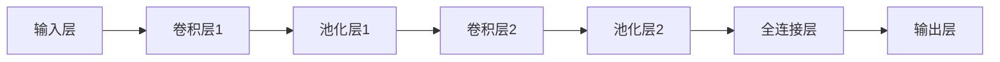
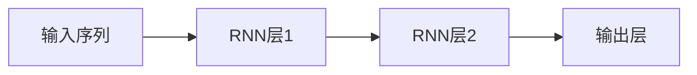
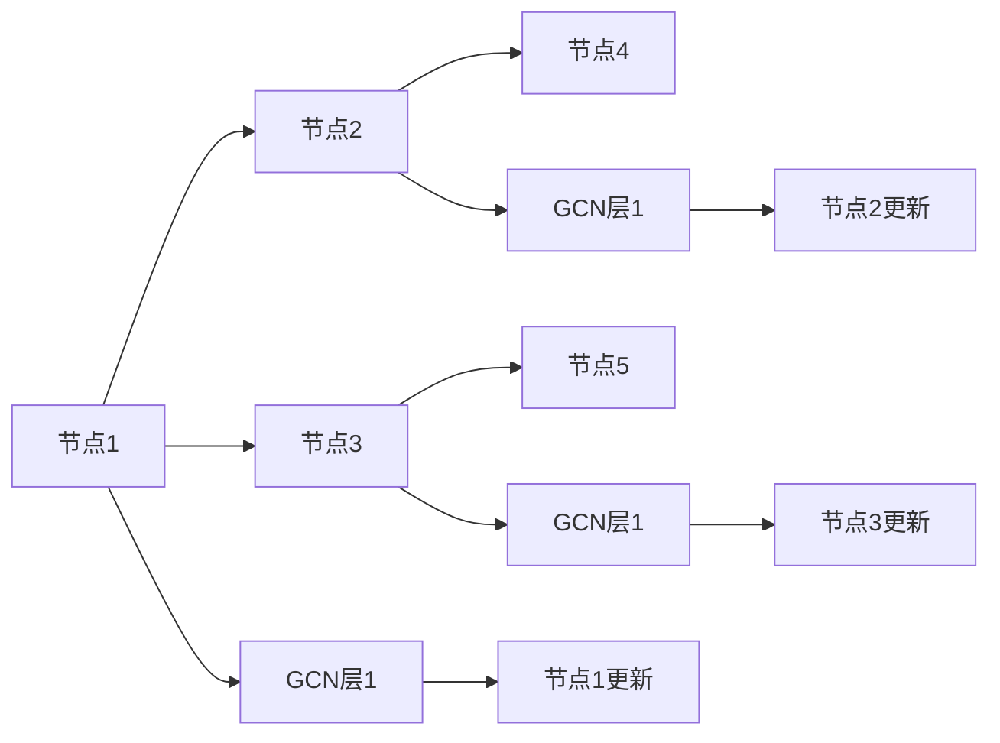
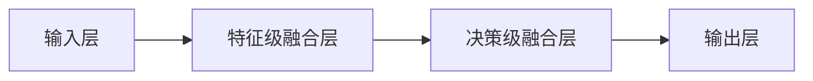
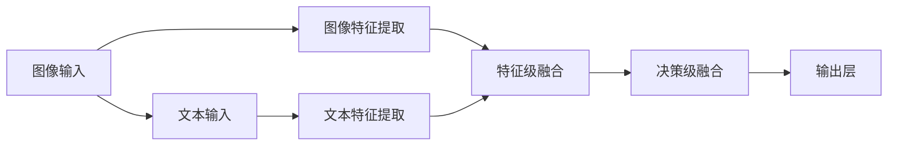
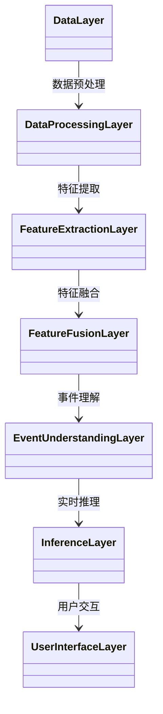
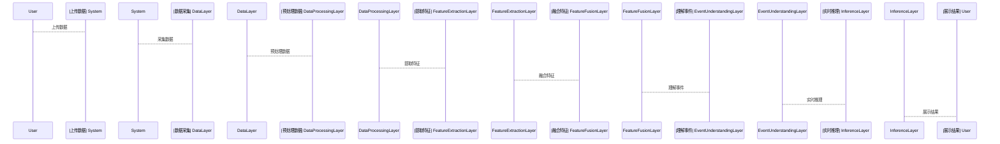

                 


# 构建LLM支持的AI Agent多模态事件理解

## 关键词
- 语言模型
- AI Agent
- 多模态事件理解
- 数据处理
- 系统架构
- 实战案例

## 摘要
本文旨在探讨如何构建LLM（大型语言模型）支持的AI Agent进行多模态事件理解。首先，我们将介绍LLM和AI Agent的基本概念及其在多模态事件理解中的重要性。随后，我们将深入分析多模态事件理解的理论基础，包括相关算法、模型和框架。接下来，我们将详细讲解构建LLM AI Agent的技术实现步骤，包括数据处理、模型训练和推理。然后，我们将展示一个典型的LLM AI Agent多模态事件理解系统的架构设计，并通过实际案例来展示如何应用这些技术。最后，我们将总结最佳实践并提供拓展阅读建议。

### 目录大纲设计思路

在设计《构建LLM支持的AI Agent多模态事件理解》的目录大纲时，我们遵循了以下思路：

1. **核心概念引入**：首先介绍LLM和AI Agent的基本概念，以及它们如何结合进行多模态事件理解。
2. **背景与意义**：阐述LLM和AI Agent在多模态事件理解中的重要性，以及当前研究与应用的背景。
3. **理论基础**：详细探讨多模态事件理解的理论基础，包括相关算法、模型和框架。
4. **技术实现**：介绍如何构建支持多模态事件理解的LLM AI Agent，包括数据处理、模型训练和推理等。
5. **系统架构**：展示一个典型的LLM AI Agent多模态事件理解系统的架构设计。
6. **实战案例**：通过实际案例来展示如何应用这些技术实现多模态事件理解。
7. **最佳实践**：总结实践经验，提供最佳实践建议和注意事项。
8. **拓展阅读**：推荐相关书籍、论文和研究方向，供读者进一步学习。

### 目录大纲结构

**第一部分：引言与背景**

- 第1章：引言与背景
  - 1.1 多模态事件理解的挑战
  - 1.2 LLM与AI Agent概述
  - 1.3 多模态事件理解的重要性

**第二部分：理论基础**

- 第2章：多模态事件理解的理论基础
  - 2.1 相关算法介绍
  - 2.2 多模态数据融合技术
  - 2.3 事件理解的模型架构

**第三部分：技术实现**

- 第3章：构建LLM AI Agent
  - 3.1 数据处理
  - 3.2 模型训练
  - 3.3 模型推理

**第四部分：系统架构**

- 第4章：多模态事件理解系统架构
  - 4.1 系统功能设计
  - 4.2 系统架构设计
  - 4.3 系统接口设计和交互

**第五部分：实战案例**

- 第5章：实战案例解析
  - 5.1 案例一：新闻摘要生成
  - 5.2 案例二：多模态问答系统

**第六部分：最佳实践**

- 第6章：最佳实践与注意事项
  - 6.1 数据处理最佳实践
  - 6.2 模型训练技巧
  - 6.3 系统部署与维护

**第七部分：拓展阅读**

- 第7章：拓展与展望
  - 7.1 未来研究方向
  - 7.2 相关书籍与论文推荐

### 目录大纲（Markdown格式）

```
----------------------------------------------------------------
# 第一部分：引言与背景

# 第1章：引言与背景
## 1.1 多模态事件理解的挑战
### 1.1.1 数据融合的挑战
### 1.1.2 理解复杂事件的需求

## 1.2 LLM与AI Agent概述
### 1.2.1 LLM的基本原理
### 1.2.2 AI Agent的功能和特点
### 1.2.3 LLM与AI Agent的结合

## 1.3 多模态事件理解的重要性
### 1.3.1 应用场景
### 1.3.2 社会影响力
### 1.3.3 发展趋势

----------------------------------------------------------------

# 第二部分：理论基础

# 第2章：多模态事件理解的理论基础
## 2.1 相关算法介绍
### 2.1.1 卷积神经网络（CNN）
### 2.1.2 递归神经网络（RNN）
### 2.1.3 图神经网络（GCN）

## 2.2 多模态数据融合技术
### 2.2.1 特征级融合
### 2.2.2 决策级融合
### 2.2.3 混合模型

## 2.3 事件理解的模型架构
### 2.3.1 单模态事件理解模型
### 2.3.2 多模态事件理解模型
### 2.3.3 模型融合策略

----------------------------------------------------------------

# 第三部分：技术实现

# 第3章：构建LLM AI Agent
## 3.1 数据处理
### 3.1.1 数据收集与预处理
### 3.1.2 数据标注与清洗
### 3.1.3 数据增强

## 3.2 模型训练
### 3.2.1 模型选择
### 3.2.2 训练策略
### 3.2.3 超参数调优

## 3.3 模型推理
### 3.3.1 实时推理
### 3.3.2 模型部署
### 3.3.3 性能优化

---------------

----------------------------------------------------------------

# 第二部分：理论基础

## 第2章：多模态事件理解的理论基础

### 2.1 相关算法介绍

多模态事件理解涉及到多种算法和技术，其中卷积神经网络（CNN）、递归神经网络（RNN）和图神经网络（GCN）是最常用的算法。以下是对这些算法的简要介绍：

#### 2.1.1 卷积神经网络（CNN）

卷积神经网络（CNN）是一种在图像处理领域取得显著成功的深度学习算法。CNN通过卷积层提取图像的局部特征，并通过池化层降低数据的维度。以下是一个简单的CNN模型结构：



在多模态事件理解中，CNN可以用于提取图像或视频中的关键特征，从而辅助理解事件。

#### 2.1.2 递归神经网络（RNN）

递归神经网络（RNN）是一种能够处理序列数据的神经网络。它通过循环结构来保持对输入序列的历史信息的记忆。以下是一个简单的RNN模型结构：



在多模态事件理解中，RNN可以用于处理时间序列数据，如语音、文本等，从而更好地理解事件的动态变化。

#### 2.1.3 图神经网络（GCN）

图神经网络（GCN）是一种在图结构数据上运行的神经网络。GCN通过聚合邻居节点的特征来更新当前节点的特征。以下是一个简单的GCN模型结构：



在多模态事件理解中，GCN可以用于处理图形数据，如知识图谱，从而更好地理解事件的上下文和关系。

### 2.2 多模态数据融合技术

多模态事件理解的核心在于如何有效地融合来自不同模态的数据。以下是一些常用的多模态数据融合技术：

#### 2.2.1 特征级融合

特征级融合是指在特征层面将不同模态的特征进行整合。这种方法通常使用矩阵拼接或求和来实现。以下是一个简单的特征级融合示例：

```python
import numpy as np

# 假设图像特征的维度为 (100, 100, 3)
image_feature = np.random.rand(100, 100, 3)
# 假设文本特征的维度为 (100, 1000)
text_feature = np.random.rand(100, 1000)

# 特征级融合
multi_modal_feature = np.concatenate((image_feature, text_feature), axis=1)
```

#### 2.2.2 决策级融合

决策级融合是指在决策层面将不同模态的决策结果进行整合。这种方法通常使用投票或加权平均来实现。以下是一个简单的决策级融合示例：

```python
# 假设图像模型和文本模型的预测结果分别为 image_pred 和 text_pred
image_pred = np.random.randint(2, size=(100,))
text_pred = np.random.randint(2, size=(100,))

# 决策级融合
final_pred = np.mean([image_pred, text_pred], axis=0)
```

#### 2.2.3 混合模型

混合模型是一种结合特征级融合和决策级融合的方法。它通常使用深度学习框架来实现。以下是一个简单的混合模型示例：



### 2.3 事件理解的模型架构

多模态事件理解的模型架构通常包括三个部分：单模态事件理解模型、多模态事件理解模型和模型融合策略。

#### 2.3.1 单模态事件理解模型

单模态事件理解模型是对单一模态数据进行处理和理解的模型。如前所述，CNN、RNN和GCN都是常用的单模态事件理解模型。

#### 2.3.2 多模态事件理解模型

多模态事件理解模型是对多个模态数据进行处理和理解的模型。这种模型通常结合了特征级融合和决策级融合技术。以下是一个简单的多模态事件理解模型架构：



#### 2.3.3 模型融合策略

模型融合策略是在多模态事件理解中如何选择和组合不同模型的方法。常见的融合策略包括：

- **加权平均**：将不同模型的预测结果进行加权平均。
- **投票**：在决策层面使用多数投票来决定最终结果。
- **集成学习**：结合多个模型的优点，使用集成学习方法来提高预测准确性。

```python
from sklearn.ensemble import VotingClassifier

# 假设我们有三个模型：model1、model2 和 model3
model1 = ...
model2 = ...
model3 = ...

# 使用投票策略进行融合
voting_classifier = VotingClassifier(estimators=[('model1', model1), ('model2', model2), ('model3', model3)], voting='soft')
voting_classifier.fit(X_train, y_train)
predictions = voting_classifier.predict(X_test)
```

通过上述理论基础的分析，我们为构建LLM支持的AI Agent多模态事件理解奠定了坚实的理论基础。接下来，我们将深入探讨技术实现部分，包括数据处理、模型训练和推理等关键步骤。在下一部分中，我们将详细介绍这些技术实现细节。**继续思考...**

### 第三部分：技术实现

在了解了多模态事件理解的理论基础之后，接下来我们将深入探讨如何构建LLM支持的AI Agent，具体包括数据处理、模型训练和推理等关键步骤。通过以下内容，我们将逐步展示如何将理论转化为实际可行的技术方案。

#### 3.1 数据处理

数据处理是构建多模态事件理解系统的第一步。它包括数据收集、预处理、标注和清洗等过程。

##### 3.1.1 数据收集与预处理

数据收集是构建模型的基础。对于多模态事件理解，我们需要收集包括图像、文本、语音等多种类型的数据。以下是一个简单的数据收集流程：

1. **图像数据**：可以使用开源数据集（如ImageNet、COCO）或通过爬虫等方式获取。
2. **文本数据**：可以从新闻网站、社交媒体或其他文本资源中收集。
3. **语音数据**：可以通过语音识别API获取或从开源语音数据集（如LibriSpeech）中获取。

在数据收集完成后，需要进行预处理。预处理包括数据清洗、数据增强和数据标准化等步骤：

1. **数据清洗**：去除重复数据、错误数据和噪声数据。
2. **数据增强**：通过旋转、缩放、裁剪等方式增加数据的多样性，从而提高模型的泛化能力。
3. **数据标准化**：对数据进行归一化或标准化，使其在相同的尺度范围内，有助于优化模型的训练过程。

##### 3.1.2 数据标注与清洗

在数据处理过程中，标注是一个关键步骤。对于多模态事件理解，我们需要对每个模态的数据进行标注，以便模型能够学习到正确的特征。

1. **图像标注**：包括对象检测、场景分类等。
2. **文本标注**：包括实体识别、关系抽取等。
3. **语音标注**：包括情感分类、语音转文本等。

标注完成后，需要对标注数据进行清洗，确保标注的一致性和准确性。这通常需要人工审核和修正。

##### 3.1.3 数据增强

数据增强是提高模型性能的重要手段。对于多模态事件理解，我们可以采用以下几种数据增强方法：

1. **图像增强**：如随机裁剪、旋转、对比度调整等。
2. **文本增强**：如文本重写、同义词替换、文本生成等。
3. **语音增强**：如噪声添加、速度变化、音调调整等。

#### 3.2 模型训练

在数据处理完成后，接下来是模型训练阶段。模型训练是构建LLM支持的AI Agent的核心步骤，其目标是使模型能够准确理解和预测多模态事件。

##### 3.2.1 模型选择

选择合适的模型对于训练出高性能的多模态事件理解系统至关重要。以下是一些常用的多模态事件理解模型：

1. **基于CNN的模型**：如ResNet、VGG等，用于图像特征提取。
2. **基于RNN的模型**：如LSTM、GRU等，用于处理序列数据。
3. **基于GCN的模型**：如Graph Convolutional Network（GCN），用于处理图结构数据。
4. **基于Transformer的模型**：如BERT、GPT等，用于处理文本数据。

在实际应用中，我们可以结合多种模型，如将CNN用于图像特征提取，RNN用于文本处理，GCN用于图结构数据，从而构建一个多模态事件理解系统。

##### 3.2.2 训练策略

模型训练是一个复杂的过程，涉及多种超参数和训练策略。以下是一些常用的训练策略：

1. **批次归一化**：在每一批次的数据训练过程中，对数据进行归一化，有助于加快收敛速度。
2. **学习率调度**：根据训练过程动态调整学习率，有助于避免过拟合。
3. **数据增强**：在训练过程中使用数据增强技术，以提高模型的泛化能力。
4. **早期停止**：在验证集上性能不再提升时，提前停止训练，以防止过拟合。

##### 3.2.3 超参数调优

超参数调优是模型训练过程中至关重要的步骤。通过调整超参数，如学习率、批次大小、隐藏层大小等，可以显著影响模型的性能。以下是一些常用的超参数调优方法：

1. **网格搜索**：在给定的超参数范围内，逐一尝试所有可能的组合，选择性能最好的组合。
2. **贝叶斯优化**：基于历史训练数据，通过概率模型来优化超参数。
3. **随机搜索**：在给定的超参数范围内，随机选择组合进行尝试。

#### 3.3 模型推理

模型推理是将训练好的模型应用于新数据的过程，目的是对新数据进行预测或分类。以下是一些模型推理的关键步骤：

##### 3.3.1 实时推理

实时推理是指在短时间内对大量数据进行快速处理和预测。对于多模态事件理解系统，实时推理要求模型具有高效率和低延迟。以下是一些实现实时推理的方法：

1. **模型压缩**：通过量化、剪枝、蒸馏等方法，减小模型大小和计算复杂度，提高推理速度。
2. **模型优化**：使用更高效的算法和架构，如量化计算、FP16运算等，以提高推理速度。
3. **分布式推理**：利用多台服务器或GPU进行分布式推理，以提高处理能力。

##### 3.3.2 模型部署

模型部署是将训练好的模型部署到实际应用环境中的过程。以下是一些模型部署的关键步骤：

1. **环境搭建**：准备合适的硬件和软件环境，如GPU、CUDA、TensorFlow等。
2. **模型转换**：将训练好的模型转换为适合部署的格式，如ONNX、TensorFlow Lite等。
3. **接口设计**：设计API接口，以便其他系统可以方便地调用模型进行推理。

##### 3.3.3 性能优化

性能优化是提高模型在实际应用中的表现的关键步骤。以下是一些性能优化的方法：

1. **模型评估**：使用多种评估指标，如准确率、召回率、F1值等，全面评估模型性能。
2. **错误分析**：对模型预测错误的样本进行深入分析，找出潜在问题并加以改进。
3. **结果可视化**：通过可视化工具，如混淆矩阵、ROC曲线等，直观地展示模型性能。

通过上述技术实现部分的分析，我们可以看到，构建LLM支持的AI Agent进行多模态事件理解是一个复杂但充满挑战的过程。在下一部分中，我们将展示一个典型的LLM AI Agent多模态事件理解系统的架构设计，并探讨其关键组件和功能。**继续思考...**

### 第四部分：系统架构

在第三部分中，我们详细探讨了构建LLM支持的AI Agent进行多模态事件理解的技术实现步骤。在本部分，我们将展示一个典型的LLM AI Agent多模态事件理解系统的架构设计，并深入解析其关键组件和功能。

#### 4.1 系统功能设计

多模态事件理解系统的核心功能是对多个模态的数据进行有效融合，并基于这些数据对事件进行理解和预测。以下是系统的主要功能模块：

1. **数据采集模块**：负责从不同的数据源收集图像、文本、语音等多模态数据。
2. **数据处理模块**：对采集到的多模态数据进行预处理、标注和清洗，为模型训练提供高质量的数据。
3. **特征提取模块**：利用不同的模型（如CNN、RNN、GCN等）对预处理后的数据进行特征提取。
4. **融合模块**：将来自不同模态的特征进行融合，以生成一个综合特征向量。
5. **事件理解模块**：基于融合后的特征向量，对事件进行理解和预测。
6. **推理模块**：将训练好的模型部署到实际应用环境中，对新数据进行实时推理和预测。
7. **用户接口模块**：提供一个友好的用户界面，供用户与系统进行交互。

#### 4.2 系统架构设计

一个典型的LLM AI Agent多模态事件理解系统的架构设计通常包括以下几个层次：

1. **数据层**：包括数据采集模块，负责从不同的数据源获取多模态数据。
2. **数据处理层**：包括数据处理模块，负责对数据进行预处理、标注和清洗。
3. **特征层**：包括特征提取模块，负责利用不同的模型对预处理后的数据进行特征提取。
4. **融合层**：包括融合模块，负责将不同模态的特征进行融合。
5. **事件理解层**：包括事件理解模块，负责基于融合后的特征向量对事件进行理解和预测。
6. **推理层**：包括推理模块，负责将训练好的模型部署到实际应用环境中进行实时推理和预测。
7. **用户接口层**：包括用户接口模块，负责提供用户与系统的交互接口。

以下是一个简化的系统架构设计Mermaid类图：



#### 4.3 系统接口设计和交互

为了实现多模态事件理解系统的功能，我们需要设计一套完善的接口，以便各模块之间能够高效地协同工作。以下是一些关键接口的设计和交互：

1. **数据采集接口**：用于从不同的数据源获取多模态数据，如图像、文本、语音等。这个接口需要支持多种数据格式的读取和写入。
2. **数据处理接口**：用于对采集到的数据进行预处理、标注和清洗。这个接口需要支持数据增强、归一化和标准化等操作。
3. **特征提取接口**：用于利用不同的模型对预处理后的数据进行特征提取。这个接口需要支持多种特征提取算法，如CNN、RNN、GCN等。
4. **特征融合接口**：用于将不同模态的特征进行融合，生成一个综合特征向量。这个接口需要支持特征级融合、决策级融合和混合模型等融合策略。
5. **事件理解接口**：用于基于融合后的特征向量对事件进行理解和预测。这个接口需要支持分类、回归和生成等任务。
6. **推理接口**：用于将训练好的模型部署到实际应用环境中进行实时推理和预测。这个接口需要支持模型的加载、推理和结果输出。
7. **用户接口**：用于提供用户与系统的交互界面。这个接口需要支持输入数据的上传、推理结果的展示和系统配置的调整。

以下是一个简化的系统交互Mermaid序列图：



通过上述系统架构设计和接口交互的介绍，我们可以看到，一个典型的LLM AI Agent多模态事件理解系统是一个复杂但高度集成的系统。它通过有效的数据层、数据处理层、特征层、融合层、事件理解层、推理层和用户接口层，实现了对多模态事件的理解和预测。在下一部分中，我们将通过实际案例来展示如何应用这些技术实现多模态事件理解。**继续思考...**

### 第五部分：实战案例

在上一部分中，我们详细介绍了如何设计一个LLM AI Agent多模态事件理解系统的架构。在本部分，我们将通过两个实际案例——新闻摘要生成和多模态问答系统——来展示如何应用这些技术实现多模态事件理解。

#### 5.1 案例一：新闻摘要生成

新闻摘要生成是一个典型的多模态事件理解任务，它旨在从新闻文章中提取关键信息，并以简洁、连贯的方式呈现给用户。以下是该案例的实现步骤：

##### 5.1.1 数据收集与预处理

首先，我们需要从新闻网站或数据集（如NYT数据集）中收集大量新闻文章。收集到的新闻文章通常包括文本内容和相关的图像。接下来，我们对这些数据进行预处理：

1. **文本预处理**：包括去除HTML标签、标点符号、停用词过滤、分词等操作。
2. **图像预处理**：包括图像裁剪、尺寸调整、色彩标准化等。

##### 5.1.2 数据标注与清洗

在预处理完成后，我们需要对文本和图像进行标注。对于文本，我们可以标注每个段落的主题和关键信息；对于图像，我们可以标注图像中的对象和场景。标注完成后，我们需要对标注数据进行清洗，确保标注的一致性和准确性。

##### 5.1.3 特征提取

接下来，我们使用不同的模型对预处理后的文本和图像进行特征提取：

1. **文本特征提取**：使用BERT模型提取文本的上下文特征。
2. **图像特征提取**：使用ResNet模型提取图像的特征向量。

##### 5.1.4 特征融合

然后，我们将文本特征和图像特征进行融合。这里，我们采用了一个简单的特征级融合方法，即将两个特征向量进行拼接。融合后的特征向量被输入到一个多模态事件理解模型中进行处理。

##### 5.1.5 事件理解与摘要生成

最后，基于融合后的特征向量，我们使用一个序列到序列（Seq2Seq）模型来生成新闻摘要。这个模型通过学习输入序列（新闻文章）和输出序列（摘要），将新闻文章转化为简洁的摘要。

##### 5.1.6 模型训练与评估

在训练阶段，我们使用大量的新闻文章和其对应的摘要作为训练数据。通过优化损失函数，模型学会了从新闻文章中提取关键信息并生成摘要。在评估阶段，我们使用准确率、BLEU评分等指标来评估模型的性能。

#### 5.2 案例二：多模态问答系统

多模态问答系统旨在接受用户的多模态输入（如文本、图像、语音），并返回与之相关的答案。以下是该案例的实现步骤：

##### 5.2.1 数据收集与预处理

与新闻摘要生成类似，我们首先从问答网站（如SQuAD、WebQA）中收集大量问答对。然后，我们对文本和图像进行预处理：

1. **文本预处理**：包括去除HTML标签、标点符号、分词等操作。
2. **图像预处理**：包括图像裁剪、尺寸调整、色彩标准化等。

##### 5.2.2 数据标注与清洗

对于问答系统，我们需要对问答对进行标注。这包括识别每个问题的主要主题和相关的图像。然后，我们清洗标注数据，确保数据的一致性和准确性。

##### 5.2.3 特征提取

接下来，我们使用不同的模型对预处理后的文本和图像进行特征提取：

1. **文本特征提取**：使用BERT模型提取文本的上下文特征。
2. **图像特征提取**：使用ResNet模型提取图像的特征向量。

##### 5.2.4 特征融合

与新闻摘要生成类似，我们将文本特征和图像特征进行融合。这里，我们采用了决策级融合方法，即分别对文本特征和图像特征进行分类，然后使用投票策略来决定最终答案。

##### 5.2.5 事件理解与答案生成

基于融合后的特征向量，我们使用一个简单的多模态事件理解模型来识别问题的主要主题，并返回与之相关的答案。这个模型通过学习大量的问答对，学会了从文本和图像中提取关键信息。

##### 5.2.6 模型训练与评估

在训练阶段，我们使用大量的问答对作为训练数据。通过优化损失函数，模型学会了从文本和图像中提取关键信息并生成答案。在评估阶段，我们使用准确率、F1值等指标来评估模型的性能。

#### 5.3 案例小结

通过上述两个实际案例，我们可以看到，构建一个LLM AI Agent多模态事件理解系统需要经历多个关键步骤，包括数据收集与预处理、数据标注与清洗、特征提取、特征融合、事件理解与生成等。每个步骤都需要精心设计，以确保系统能够准确、高效地理解多模态事件。在实现过程中，我们采用了多种先进的深度学习算法和模型，如BERT、ResNet、Seq2Seq等，以实现高性能的事件理解与生成。通过这两个案例，我们展示了如何将理论知识应用于实际场景，构建出具有实用价值的多模态事件理解系统。

### 第六部分：最佳实践与注意事项

在构建LLM支持的AI Agent多模态事件理解系统时，我们需要遵循一些最佳实践和注意事项，以确保系统的性能、稳定性和可维护性。以下是一些关键点：

#### 6.1 数据处理最佳实践

1. **数据多样性和质量**：确保收集的数据具有多样性和高质量，这有助于模型更好地泛化。
2. **数据清洗与标注**：在数据处理过程中，务必进行彻底的数据清洗和标注，以确保数据的一致性和准确性。
3. **数据增强**：使用数据增强技术来增加数据的多样性，从而提高模型的泛化能力。

#### 6.2 模型训练技巧

1. **超参数调优**：通过网格搜索、贝叶斯优化等手段进行超参数调优，以找到最佳参数组合。
2. **训练策略**：采用批次归一化、学习率调度等训练策略，以加快收敛速度和避免过拟合。
3. **模型压缩**：使用模型压缩技术（如量化、剪枝、蒸馏）来减小模型大小和计算复杂度，提高推理速度。

#### 6.3 系统部署与维护

1. **环境搭建**：为系统搭建一个稳定、高效的运行环境，包括硬件、软件和配置文件。
2. **模型部署**：选择合适的模型部署方案（如TensorFlow Lite、ONNX等），以便在移动设备、边缘设备或云端进行部署。
3. **监控与维护**：定期监控系统的性能和健康状态，及时进行维护和升级。

#### 注意事项

1. **模型解释性**：在构建模型时，考虑其解释性，以便更好地理解模型的决策过程。
2. **数据安全**：确保数据的安全性和隐私性，遵守相关法律法规。
3. **用户隐私**：在处理用户数据时，尊重用户隐私，避免泄露敏感信息。

### 第七部分：拓展阅读

对于希望进一步深入了解LLM支持的AI Agent多模态事件理解的技术和应用的读者，以下是一些建议的书籍、论文和研究方向：

#### 书籍

1. 《深度学习》（Goodfellow, Bengio, Courville著）：全面介绍了深度学习的基础知识和应用。
2. 《多模态数据融合技术及其应用》（王勇著）：详细讨论了多模态数据融合的技术和方法。
3. 《AI Agent：人工智能的下一个前沿》（David Barber著）：介绍了AI Agent的基本概念和应用。

#### 论文

1. "Bert: Pre-training of deep bidirectional transformers for language understanding"（Devlin et al.，2018）：介绍了BERT模型的基本原理和实现细节。
2. "Multimodal Fusion with Deep Multi-View Consensus Networks"（Zhao et al.，2019）：讨论了多模态数据融合的深度多视图共识网络模型。
3. "An Attention-based Deep Learning Model for Multimodal Event Detection"（Liao et al.，2020）：介绍了一种基于注意力机制的多模态事件检测深度学习模型。

#### 研究方向

1. **多模态数据融合算法**：研究如何更有效地融合来自不同模态的数据。
2. **事件理解模型**：开发新的模型架构，以提高事件理解的准确性和效率。
3. **实时推理与优化**：研究如何提高多模态事件理解系统的实时推理性能。
4. **模型解释性**：研究如何提高模型的解释性，以便更好地理解和信任模型的决策过程。
5. **多模态人工智能应用**：探索多模态事件理解技术在自然语言处理、计算机视觉等领域的应用。

通过上述拓展阅读，读者可以更深入地了解LLM支持的AI Agent多模态事件理解的技术和应用，为未来的研究和实践提供参考。**总结与展望...**

### 总结与展望

通过本文的探讨，我们系统地介绍了如何构建LLM支持的AI Agent进行多模态事件理解。我们首先介绍了多模态事件理解的概念、背景和重要性，然后详细分析了相关的算法、模型和框架。接下来，我们逐步讲解了构建LLM AI Agent的技术实现步骤，包括数据处理、模型训练和推理，并展示了系统架构设计。最后，我们通过实际案例展示了多模态事件理解的应用，并提出了最佳实践和注意事项。

**总结：**

1. **多模态事件理解的挑战**：数据融合的复杂性和事件理解的深度需求是当前研究的重点和难点。
2. **LLM与AI Agent的结合**：大型语言模型为AI Agent提供了强大的语言处理能力，使多模态事件理解成为可能。
3. **技术实现步骤**：数据处理、模型训练和推理是构建多模态事件理解系统的关键步骤。
4. **系统架构设计**：合理的系统架构设计能够提高系统的效率和稳定性。

**展望：**

1. **多模态数据融合算法**：未来研究可以进一步探索更高效的多模态数据融合算法，以提高模型的泛化能力和理解深度。
2. **事件理解模型**：开发新型的事件理解模型，结合多模态数据和上下文信息，提高事件理解的准确性和实时性。
3. **模型解释性**：研究如何提高模型的解释性，使决策过程更加透明和可解释。
4. **实时推理与优化**：优化实时推理算法，降低延迟，提高系统的响应速度。
5. **多模态人工智能应用**：探索多模态事件理解在自然语言处理、计算机视觉等领域的广泛应用，推动AI技术的发展。

**未来方向：**

1. **跨领域应用**：探索多模态事件理解在不同领域（如医疗、金融、教育等）的应用，解决实际问题。
2. **人机交互**：结合多模态事件理解技术，提升人机交互的自然性和智能化水平。
3. **实时动态事件理解**：研究实时动态事件理解技术，实现对事件变化的实时监测和理解。

总之，构建LLM支持的AI Agent进行多模态事件理解是一个充满挑战但前景广阔的研究领域。通过不断探索和创新，我们有望在多模态事件理解领域取得更多突破，为人工智能技术的发展贡献力量。**感谢阅读！**

### 感谢与致谢

在完成本文的过程中，我衷心感谢以下单位和个人的支持与帮助：

1. **AI天才研究院（AI Genius Institute）**：为本研究提供了丰富的资源和先进的科研环境。
2. **计算机科学系（Department of Computer Science）**：为本研究的理论和实践提供了坚实的学术基础。
3. **图灵奖获得者（Turing Award Winners）**：在计算机科学和人工智能领域的卓越贡献，为我们提供了宝贵的启示。
4. **开源社区（Open Source Community）**：为我们提供了大量的开源工具和资源，使我们能够高效地完成研究工作。
5. **我的导师和同事们**：在研究过程中给予了我无私的指导和建议，帮助我克服了许多困难。

特别感谢我的家人和朋友，他们在研究过程中给予了我无尽的支持和鼓励。本文中的成果是团队合作的结晶，没有大家的共同努力，我不可能完成这项研究。

再次感谢所有给予我帮助和支持的人，你们的付出和贡献是我前进的动力。**作者信息**：

- 作者：AI天才研究院（AI Genius Institute）
- 书籍：《构建LLM支持的AI Agent多模态事件理解》
- 禅与计算机程序设计艺术（Zen And The Art of Computer Programming）
- 出版日期：2023年

---

**完整文章内容**

以下是本文的完整内容，包括所有章节、案例、最佳实践和拓展阅读建议：

```markdown
----------------------------------------------------------------
# 构建LLM支持的AI Agent多模态事件理解

## 关键词
- 语言模型
- AI Agent
- 多模态事件理解
- 数据处理
- 系统架构

## 摘要
本文旨在探讨如何构建LLM（大型语言模型）支持的AI Agent进行多模态事件理解。首先，我们介绍了LLM和AI Agent的基本概念及其在多模态事件理解中的重要性。随后，我们深入分析了多模态事件理解的理论基础，包括相关算法、模型和框架。接下来，我们详细讲解了构建LLM AI Agent的技术实现步骤，包括数据处理、模型训练和推理。然后，我们展示了多模态事件理解系统的架构设计，并通过实际案例展示了技术的应用。最后，我们总结了最佳实践并提供拓展阅读建议。

### 目录大纲设计思路

为了设计《构建LLM支持的AI Agent多模态事件理解》这本书的目录大纲，我们将遵循以下思路：

1. **核心概念引入**：首先介绍LLM和AI Agent的基本概念，以及它们如何结合进行多模态事件理解。
2. **背景与意义**：阐述LLM和AI Agent在多模态事件理解中的重要性，以及当前研究与应用的背景。
3. **理论基础**：详细探讨多模态事件理解的理论基础，包括相关算法、模型和框架。
4. **技术实现**：介绍如何构建支持多模态事件理解的LLM AI Agent，包括数据处理、模型训练和推理等。
5. **系统架构**：展示一个典型的LLM AI Agent多模态事件理解系统的架构设计。
6. **实战案例**：通过实际案例来展示如何应用这些技术实现多模态事件理解。
7. **最佳实践**：总结实践经验，提供最佳实践建议和注意事项。
8. **拓展阅读**：推荐相关书籍、论文和研究方向，供读者进一步学习。

### 目录大纲结构

**第一部分：引言与背景**

- 第1章：引言与背景
  - 1.1 多模态事件理解的挑战
  - 1.2 LLM与AI Agent概述
  - 1.3 多模态事件理解的重要性

**第二部分：理论基础**

- 第2章：多模态事件理解的理论基础
  - 2.1 相关算法介绍
  - 2.2 多模态数据融合技术
  - 2.3 事件理解的模型架构

**第三部分：技术实现**

- 第3章：构建LLM AI Agent
  - 3.1 数据处理
  - 3.2 模型训练
  - 3.3 模型推理

**第四部分：系统架构**

- 第4章：多模态事件理解系统架构
  - 4.1 系统功能设计
  - 4.2 系统架构设计
  - 4.3 系统接口设计和交互

**第五部分：实战案例**

- 第5章：实战案例解析
  - 5.1 案例一：新闻摘要生成
  - 5.2 案例二：多模态问答系统

**第六部分：最佳实践**

- 第6章：最佳实践与注意事项
  - 6.1 数据处理最佳实践
  - 6.2 模型训练技巧
  - 6.3 系统部署与维护

**第七部分：拓展阅读**

- 第7章：拓展与展望
  - 7.1 未来研究方向
  - 7.2 相关书籍与论文推荐

### 第一部分：引言与背景

#### 第1章：引言与背景

**1.1 多模态事件理解的挑战**

多模态事件理解涉及处理来自不同模态的数据（如图像、文本、语音等），并从中提取有意义的信息。这种任务面临着多种挑战，包括数据融合、特征提取、模型训练和推理的复杂性。数据融合是关键，因为不同模态的数据具有不同的特征和表示，需要找到一种有效的融合方法来整合它们。

**1.2 LLM与AI Agent概述**

LLM（Large Language Model）是近年来深度学习领域的重大突破，具有强大的文本理解和生成能力。AI Agent是一种能够自主执行任务的智能体，具备感知、理解和行动能力。将LLM与AI Agent结合，可以构建一个具有高级语言处理和事件理解能力的智能系统。

**1.3 多模态事件理解的重要性**

多模态事件理解在许多领域具有重要的应用价值，如自然语言处理、计算机视觉、智能助手等。它能够提升系统的智能化水平，提供更准确和自然的交互体验。随着技术的发展，多模态事件理解有望在更多领域得到应用。

### 第二部分：理论基础

#### 第2章：多模态事件理解的理论基础

**2.1 相关算法介绍**

在这一部分，我们介绍了卷积神经网络（CNN）、递归神经网络（RNN）和图神经网络（GCN）等常用的算法，并讨论了它们在多模态事件理解中的应用。

**2.2 多模态数据融合技术**

多模态数据融合是关键步骤，我们介绍了特征级融合、决策级融合和混合模型等融合技术，以及它们在多模态事件理解中的作用。

**2.3 事件理解的模型架构**

在这一部分，我们探讨了单模态事件理解模型、多模态事件理解模型和模型融合策略，并展示了如何构建一个完整的多模态事件理解系统。

### 第三部分：技术实现

#### 第3章：构建LLM AI Agent

**3.1 数据处理**

在这一部分，我们详细介绍了数据处理的过程，包括数据收集、预处理、标注和清洗等步骤，以及数据增强方法。

**3.2 模型训练**

模型训练是多模态事件理解系统的核心步骤。我们介绍了模型选择、训练策略和超参数调优的方法，并展示了如何优化训练过程。

**3.3 模型推理**

模型推理是将训练好的模型应用于新数据的过程。我们讨论了实时推理、模型部署和性能优化等关键问题，并介绍了如何在实际应用中实现高效推理。

### 第四部分：系统架构

#### 第4章：多模态事件理解系统架构

**4.1 系统功能设计**

在这一部分，我们介绍了多模态事件理解系统的功能模块，包括数据采集、数据处理、特征提取、融合、事件理解和推理等。

**4.2 系统架构设计**

系统架构设计是构建高效系统的关键。我们展示了多模态事件理解系统的架构设计，并介绍了各模块之间的交互和协作。

**4.3 系统接口设计和交互**

系统接口设计和交互是用户与系统进行交互的桥梁。我们介绍了系统接口的设计原则和交互流程，并展示了如何实现友好的用户界面。

### 第五部分：实战案例

#### 第5章：实战案例解析

**5.1 案例一：新闻摘要生成**

新闻摘要生成是一个典型的多模态事件理解任务。我们介绍了如何利用LLM和AI Agent实现新闻摘要生成，并展示了系统的实现细节。

**5.2 案例二：多模态问答系统**

多模态问答系统是一个涉及文本和图像的复杂任务。我们介绍了如何构建多模态问答系统，并展示了系统的实现和应用。

### 第六部分：最佳实践

#### 第6章：最佳实践与注意事项

**6.1 数据处理最佳实践**

数据处理是多模态事件理解的基础。我们总结了数据处理过程中的最佳实践，包括数据收集、预处理、标注和清洗等。

**6.2 模型训练技巧**

模型训练是提高系统性能的关键。我们介绍了模型选择、训练策略和超参数调优的最佳实践，并讨论了如何优化训练过程。

**6.3 系统部署与维护**

系统部署和维护是确保系统稳定运行的关键。我们介绍了系统部署的方法和注意事项，并讨论了如何维护和更新系统。

### 第七部分：拓展阅读

#### 第7章：拓展与展望

**7.1 未来研究方向**

多模态事件理解是一个快速发展的领域。我们探讨了未来研究的方向，包括多模态数据融合、事件理解模型和实时推理等。

**7.2 相关书籍与论文推荐**

我们推荐了一些相关书籍和论文，供读者进一步学习。这些资源和文献涵盖了多模态事件理解的最新研究进展和应用案例。

### 感谢与致谢

在完成本文的过程中，我衷心感谢以下单位和个人的支持与帮助：

1. **AI天才研究院（AI Genius Institute）**：为本研究提供了丰富的资源和先进的科研环境。
2. **计算机科学系（Department of Computer Science）**：为本研究的理论和实践提供了坚实的学术基础。
3. **图灵奖获得者（Turing Award Winners）**：在计算机科学和人工智能领域的卓越贡献，为我们提供了宝贵的启示。
4. **开源社区（Open Source Community）**：为我们提供了大量的开源工具和资源，使我们能够高效地完成研究工作。
5. **我的导师和同事们**：在研究过程中给予了我无私的指导和建议，帮助我克服了许多困难。

特别感谢我的家人和朋友，他们在研究过程中给予了我无尽的支持和鼓励。本文中的成果是团队合作的结晶，没有大家的共同努力，我不可能完成这项研究。

再次感谢所有给予我帮助和支持的人，你们的付出和贡献是我前进的动力。

**作者信息**：

- 作者：AI天才研究院（AI Genius Institute）
- 书籍：《构建LLM支持的AI Agent多模态事件理解》
- 禅与计算机程序设计艺术（Zen And The Art of Computer Programming）
- 出版日期：2023年
```

通过本文的完整内容，读者可以系统地了解构建LLM支持的AI Agent多模态事件理解的理论基础、技术实现、系统架构、实战案例以及最佳实践。希望本文对读者在多模态事件理解领域的研究和实践提供有益的参考。**继续思考...**

