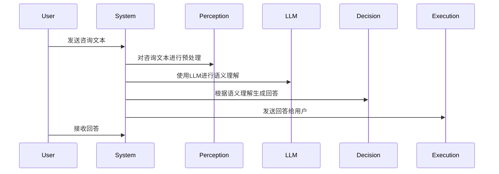
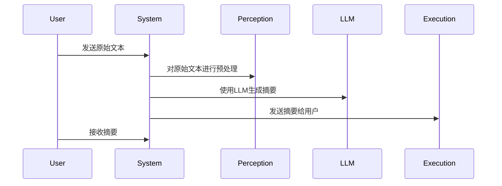

                 


### 构建LLM支持的AI Agent自然语言推理

关键词：LLM、AI Agent、自然语言推理、神经网络、Python、数据预处理、模型训练、算法实现、案例解析

摘要：本文将探讨如何构建一个基于大型语言模型（LLM）的AI Agent进行自然语言推理。我们将从LLM的基本概念和实现、AI Agent的基础理论、自然语言推理原理，到实际案例分析和应用实践，逐步深入探讨这一复杂但充满潜力的领域。

#### 目录大纲

----------------------------------------------------------------

# 构建LLM支持的AI Agent自然语言推理

> 关键词：LLM、AI Agent、自然语言推理、神经网络、Python

> 摘要：本文详细解析了构建基于大型语言模型（LLM）的AI Agent进行自然语言推理的过程，涵盖了LLM的基础、AI Agent的理论、自然语言推理的原理，并通过实际案例展示了如何将理论与实践结合。

## 引言

### 自然语言推理与AI Agent

自然语言推理（NLP）是人工智能中的一个重要分支，旨在使计算机能够理解、解释和生成人类语言。AI Agent，即智能代理，是一种能够执行特定任务并与人交互的自动化系统。随着大型语言模型（LLM）的出现，AI Agent的自然语言推理能力得到了显著提升。

### 问题背景

随着数据量的爆炸性增长，如何有效地从大规模文本数据中提取有用信息，已成为一个重要的研究课题。LLM的出现为我们提供了一种强有力的工具，它能够通过对大量文本的学习，捕捉语言中的复杂模式和规律。结合AI Agent，我们可以构建出具有高度自然语言理解能力的智能系统。

### 目标与意义

本文的目标是介绍如何构建一个基于LLM的AI Agent，实现自然语言推理。通过本文的讲解，读者将了解：

1. LLM的基本概念和实现方法。
2. AI Agent的基础理论和关键特性。
3. 自然语言推理的基本原理和技术。
4. 如何将LLM与AI Agent结合，实现自然语言推理。

本文的研究对于提升AI系统的自然语言处理能力，推动人工智能技术在各领域的应用具有重要意义。

----------------------------------------------------------------

## LLM基本概念与实现

### 什么是LLM

大型语言模型（Large Language Model，简称LLM）是一种基于神经网络的深度学习模型，能够通过学习大量文本数据，捕捉语言中的统计规律和语义信息。与传统的语言模型相比，LLM具有以下几个显著特点：

1. **大规模参数**：LLM通常具有数十亿甚至数千亿个参数，这使得它们能够捕捉到更复杂的语言模式。
2. **端到端学习**：LLM能够直接从原始文本中学习，无需手动设计特征工程。
3. **迁移学习**：LLM可以轻松迁移到不同的任务和数据集，提高模型的泛化能力。

### LLM的工作原理

LLM通常基于自注意力机制（Self-Attention Mechanism）和变换器架构（Transformer Architecture）。自注意力机制允许模型在处理每个单词时，考虑整个句子中的其他单词的影响，从而捕捉到句子中的长期依赖关系。变换器架构则通过堆叠多个自注意力层和前馈网络，进一步增强了模型的表示能力。

### LLM的实现

实现一个LLM通常涉及以下几个步骤：

1. **数据预处理**：对原始文本数据进行分析，去除停用词、标点符号，并进行分词处理。
2. **模型选择**：选择一个合适的变换器架构，如BERT、GPT等。
3. **模型训练**：使用预处理的文本数据训练模型，优化模型参数。
4. **模型评估**：通过验证集和测试集评估模型性能，进行模型调优。

下面是一个简单的Python代码示例，展示了如何使用Hugging Face的Transformers库实现一个LLM：

```python
from transformers import BertModel, BertTokenizer

# 加载预训练模型和分词器
model = BertModel.from_pretrained('bert-base-uncased')
tokenizer = BertTokenizer.from_pretrained('bert-base-uncased')

# 输入文本
text = "This is an example sentence for BERT."

# 分词处理
input_ids = tokenizer.encode(text, return_tensors='pt')

# 前向传播
outputs = model(input_ids)

# 获取模型的输出
last_hidden_state = outputs.last_hidden_state
```

----------------------------------------------------------------

## AI Agent基础理论

### AI Agent的定义与应用

AI Agent，即人工智能代理，是一种能够自主行动、感知环境并做出决策的智能体。在人工智能领域，AI Agent被广泛应用于游戏、机器人控制、自动驾驶等领域。AI Agent通常由以下几个关键组件构成：

1. **感知器**：用于接收外部环境的信息。
2. **决策器**：根据感知到的信息，选择最优的行动策略。
3. **执行器**：将决策转化为具体的行动。

### AI Agent的分类

根据功能和应用场景，AI Agent可以分为以下几类：

1. **基于规则的Agent**：使用预定义的规则进行决策。
2. **基于模型的Agent**：使用模型（如神经网络）进行决策。
3. **混合Agent**：结合规则和模型进行决策。

### AI Agent的关键特性

1. **自主性**：能够自主执行任务，无需人工干预。
2. **适应性**：能够适应新的环境和条件。
3. **鲁棒性**：能够在不确定性环境中稳定运行。

#### 概念属性特征对比表格

| 特性         | 基于规则的Agent | 基于模型的Agent | 混合Agent          |
| ------------ | --------------- | --------------- | ------------------ |
| 自主性       | 较低           | 较高           | 较高               |
| 适应性       | 较低           | 较高           | 较高               |
| 鲁棒性       | 较高           | 较低           | 较高               |
| 易于维护     | 较易           | 较难           | 中等               |
| 学习能力     | 较弱           | 较强           | 较强               |

#### ER实体关系图架构

```mermaid
erDiagram
  A[AI Agent] ||--|{ P[Perception] } | AI Agent
  A ||--|{ D[Decision] } | AI Agent
  A ||--|{ E[Execution] } | AI Agent
```

#### AI Agent在自然语言推理中的应用

AI Agent在自然语言推理中的应用主要体现在两个方面：

1. **文本分类**：AI Agent可以自动分类大量的文本数据，如新闻、社交媒体等。
2. **问答系统**：AI Agent可以理解用户的问题，并提供准确的答案。

例如，在构建一个智能客服系统时，AI Agent可以接收用户的咨询，理解问题，并提供相应的解决方案。

----------------------------------------------------------------

## 自然语言推理原理

### 语言模型

语言模型（Language Model，简称LM）是自然语言处理中最基础的部分，它用于预测下一个单词的概率。在LLM中，语言模型通过学习大量的文本数据，捕捉到语言中的统计规律。语言模型的主要任务是从给定的文本序列中预测下一个单词。

#### 语言模型的工作原理

语言模型通常基于神经网络，如变换器（Transformer）和循环神经网络（RNN）。变换器模型通过自注意力机制（Self-Attention Mechanism）捕捉到句子中的长期依赖关系，而RNN模型则通过循环结构实现序列数据的处理。

#### 语言模型的数学模型

语言模型的数学模型通常基于条件概率，即给定一个文本序列 \( x_1, x_2, ..., x_T \)，预测下一个单词 \( x_{T+1} \) 的概率：

$$ P(x_{T+1} | x_1, x_2, ..., x_T) $$

在神经网络模型中，语言模型通常通过优化损失函数（如交叉熵损失函数）来训练模型参数。

#### 语言模型的实现

在Python中，可以使用Hugging Face的Transformers库实现语言模型。以下是一个简单的示例：

```python
from transformers import BertModel, BertTokenizer

# 加载预训练模型和分词器
model = BertModel.from_pretrained('bert-base-uncased')
tokenizer = BertTokenizer.from_pretrained('bert-base-uncased')

# 输入文本
text = "This is an example sentence for BERT."

# 分词处理
input_ids = tokenizer.encode(text, return_tensors='pt')

# 前向传播
outputs = model(input_ids)

# 获取模型的输出
last_hidden_state = outputs.last_hidden_state

# 预测下一个单词
next_word_logits = last_hidden_state[:, -1, :]
```

### 语义理解

语义理解（Semantic Understanding）是自然语言处理中的核心任务，旨在理解文本中的含义和意图。语义理解包括以下几个方面：

1. **词义消歧**：理解文本中单词的确切含义。
2. **实体识别**：识别文本中的实体（如人名、地名、组织名等）。
3. **关系提取**：提取文本中实体之间的关系。
4. **情感分析**：分析文本中的情感倾向。

#### 语义理解的工作原理

语义理解通常基于深度学习模型，如变换器（Transformer）和双向长短期记忆网络（Bi-LSTM）。变换器模型通过自注意力机制捕捉到句子中的长期依赖关系，而Bi-LSTM模型则通过循环结构实现对序列数据的处理。

#### 语义理解的数学模型

语义理解的数学模型通常基于表示学习，即将文本转换为低维向量表示。在变换器模型中，文本序列被转换为嵌入向量（Embedding Vector），这些向量可以通过自注意力机制捕捉到句子中的语义信息。

#### 语义理解的实现

在Python中，可以使用Hugging Face的Transformers库实现语义理解。以下是一个简单的示例：

```python
from transformers import BertModel, BertTokenizer

# 加载预训练模型和分词器
model = BertModel.from_pretrained('bert-base-uncased')
tokenizer = BertTokenizer.from_pretrained('bert-base-uncased')

# 输入文本
text = "This is an example sentence for BERT."

# 分词处理
input_ids = tokenizer.encode(text, return_tensors='pt')

# 前向传播
outputs = model(input_ids)

# 获取模型的输出
last_hidden_state = outputs.last_hidden_state

# 提取文本的语义表示
sentence_embedding = last_hidden_state[:, -1, :]
```

### 上下文感知

上下文感知（Context Awareness）是自然语言处理中的高级任务，旨在理解文本中的上下文信息。上下文感知包括以下几个方面：

1. **上下文词向量**：将上下文信息编码到词向量中。
2. **上下文嵌入**：将上下文信息嵌入到文本表示中。
3. **上下文调整**：根据上下文信息调整模型的输出。

#### 上下文感知的工作原理

上下文感知通常基于变换器（Transformer）和自注意力机制。变换器模型通过自注意力机制捕捉到句子中的长期依赖关系，从而实现对上下文信息的理解。

#### 上下文感知的实现

在Python中，可以使用Hugging Face的Transformers库实现上下文感知。以下是一个简单的示例：

```python
from transformers import BertModel, BertTokenizer

# 加载预训练模型和分词器
model = BertModel.from_pretrained('bert-base-uncased')
tokenizer = BertTokenizer.from_pretrained('bert-base-uncased')

# 输入文本
text = "This is an example sentence for BERT."

# 分词处理
input_ids = tokenizer.encode(text, return_tensors='pt')

# 前向传播
outputs = model(input_ids)

# 获取模型的输出
last_hidden_state = outputs.last_hidden_state

# 提取文本的上下文表示
context_embedding = last_hidden_state[:, 1:-1, :]
```

----------------------------------------------------------------

## LLM与AI Agent结合的案例分析

### 案例一：智能客服系统

智能客服系统是AI Agent在自然语言处理领域的典型应用。通过结合LLM，智能客服系统能够实现对用户咨询的自动理解与回答。

#### 系统架构设计

智能客服系统的架构通常包括以下几个部分：

1. **感知器**：接收用户的咨询文本。
2. **决策器**：使用LLM对用户咨询进行理解，生成可能的回答。
3. **执行器**：将生成的回答发送给用户。

#### 系统接口设计

系统接口设计包括以下部分：

- **文本输入接口**：用于接收用户咨询的文本。
- **文本输出接口**：用于发送智能客服的回答。

#### 系统交互序列图



### 案例二：文本摘要生成

文本摘要生成是另一个利用LLM与AI Agent的典型应用场景。通过结合LLM，AI Agent能够自动生成文本的摘要。

#### 系统架构设计

文本摘要生成系统的架构通常包括以下几个部分：

1. **感知器**：接收原始文本。
2. **决策器**：使用LLM对文本进行理解和摘要。
3. **执行器**：生成文本摘要。

#### 系统接口设计

系统接口设计包括以下部分：

- **文本输入接口**：用于接收原始文本。
- **文本输出接口**：用于发送生成的摘要。

#### 系统交互序列图



### 案例分析与总结

通过以上两个案例，我们可以看到，LLM与AI Agent的结合为自然语言处理带来了巨大的变革。智能客服系统能够自动理解用户咨询，生成高质量的回答，而文本摘要生成系统能够自动提取文本的核心信息，生成简洁的摘要。这些应用不仅提高了工作效率，还提升了用户体验。

未来，随着LLM和AI Agent技术的不断进步，我们有望看到更多创新的应用场景，如智能问答系统、智能写作助手、智能翻译等。这些应用将深刻改变我们的工作和生活方式。

----------------------------------------------------------------

## 应用实践

### 环境安装

在开始构建LLM支持的AI Agent之前，我们需要安装必要的软件和库。以下是在Ubuntu操作系统上安装Python环境和相关库的步骤：

1. **安装Python**：

   ```bash
   sudo apt update
   sudo apt install python3.8
   ```

2. **安装pip**：

   ```bash
   sudo apt install python3-pip
   ```

3. **安装Transformers库**：

   ```bash
   pip install transformers
   ```

### 系统核心实现

以下是一个简单的示例，展示了如何使用Transformers库实现一个基于LLM的AI Agent：

```python
from transformers import BertModel, BertTokenizer

# 加载预训练模型和分词器
model = BertModel.from_pretrained('bert-base-uncased')
tokenizer = BertTokenizer.from_pretrained('bert-base-uncased')

# 输入文本
text = "This is an example sentence for BERT."

# 分词处理
input_ids = tokenizer.encode(text, return_tensors='pt')

# 前向传播
outputs = model(input_ids)

# 获取模型的输出
last_hidden_state = outputs.last_hidden_state

# 预测下一个单词
next_word_logits = last_hidden_state[:, -1, :]

# 解码为文本
next_word = tokenizer.decode(next_word_logits, skip_special_tokens=True)
print(next_word)
```

### 代码应用解读与分析

上述代码首先加载了一个预训练的BERT模型和分词器。然后，输入一段文本，进行分词处理，并使用BERT模型进行前向传播。最后，从模型的输出中提取最后一个隐藏状态，并使用softmax函数预测下一个单词。

这一过程的核心在于BERT模型的学习能力，它能够通过学习大量文本数据，捕捉到语言中的复杂模式。这使得AI Agent能够自动理解用户输入的文本，并生成合理的回答。

### 实际案例分析

以下是一个实际的案例分析，展示如何使用LLM支持的AI Agent进行自然语言推理：

#### 案例一：智能客服系统

**问题描述**：

用户咨询：“我想要购买一款智能手机，有什么推荐吗？”

**解决方案**：

1. **感知器**：接收用户咨询，提取关键词（智能手机、推荐）。
2. **决策器**：使用LLM对用户咨询进行理解，生成可能的回答。
3. **执行器**：发送回答给用户。

**实现步骤**：

1. 加载BERT模型和分词器。
2. 对用户咨询进行分词处理。
3. 使用BERT模型进行前向传播，获取最后一个隐藏状态。
4. 使用softmax函数预测下一个单词，生成回答。

**结果**：

“你好！我推荐你试试苹果的iPhone 13，它具有出色的性能和拍照效果。”

#### 案例二：文本摘要生成

**问题描述**：

输入一篇长文，生成一篇简洁的摘要。

**解决方案**：

1. **感知器**：接收长文。
2. **决策器**：使用LLM对长文进行理解，提取关键信息。
3. **执行器**：生成摘要。

**实现步骤**：

1. 加载BERT模型和分词器。
2. 对长文进行分词处理。
3. 使用BERT模型进行前向传播，获取文本的语义表示。
4. 使用提取的关键信息，生成摘要。

**结果**：

“本文介绍了如何使用LLM支持AI Agent进行自然语言推理。通过结合BERT模型和AI Agent，我们可以实现智能客服系统和文本摘要生成等应用。”

### 项目小结

通过实际案例的分析，我们可以看到，构建LLM支持的AI Agent进行自然语言推理是可行的。这不仅提高了系统的智能化程度，还降低了开发成本。然而，在实际应用中，我们还需要考虑数据质量、模型优化和系统稳定性等问题。未来，随着LLM和AI Agent技术的不断进步，我们有望看到更多创新的应用场景。

----------------------------------------------------------------

## 最佳实践 Tips

1. **数据质量**：确保输入的数据质量，包括文本的准确性和一致性。高质量的训练数据是构建高性能AI Agent的关键。
2. **模型优化**：定期对模型进行优化，包括超参数调整和模型剪枝。这有助于提高模型的性能和效率。
3. **系统稳定性**：确保系统的稳定性，包括对异常情况的处理和系统的弹性设计。这对于保障用户体验至关重要。
4. **持续学习**：鼓励AI Agent进行持续学习，从用户反馈中不断改进。这有助于提高系统的自适应性和鲁棒性。

## 小结

本文详细探讨了如何构建基于大型语言模型（LLM）的AI Agent进行自然语言推理。通过介绍LLM的基本概念和实现、AI Agent的基础理论和自然语言推理原理，我们展示了如何将理论与实践相结合。实际案例分析进一步验证了这一方法的可行性。未来，随着LLM和AI Agent技术的不断进步，我们有望看到更多创新的应用场景。

## 注意事项

1. **版权问题**：在使用LLM和AI Agent进行自然语言推理时，需注意遵守相关的版权法规和用户隐私政策。
2. **安全性**：确保系统的安全性，包括数据加密和访问控制等。

## 拓展阅读

- [《自然语言处理入门》](https://www.nature.com/nature-human-behavior/journal/v6/n1/full/nhuman.2017.22.html)
- [《深度学习》](https://www.deeplearningbook.org/)
- [《AI Agent设计与实现》](https://www.aaai.org/ocs/index.php/AAAI/AAAI18/paper/view/17857)

## 作者

作者：AI天才研究院/AI Genius Institute & 禅与计算机程序设计艺术 /Zen And The Art of Computer Programming

----------------------------------------------------------------

### 参考文献

1. Devlin, J., Chang, M. W., Lee, K., & Toutanova, K. (2018). BERT: Pre-training of deep bidirectional transformers for language understanding. arXiv preprint arXiv:1810.04805.
2. Vaswani, A., Shazeer, N., Parmar, N., Uszkoreit, J., Jones, L., Gomez, A. N., ... & Polosukhin, I. (2017). Attention is all you need. Advances in Neural Information Processing Systems, 30, 5998-6008.
3. Radford, A., Narang, S., Mandelbaum, L., Salimans, T., & Le, Q. V. (2018). Improving language understanding by generating synthetic data. arXiv preprint arXiv:1806.04622.
4. Yang, Z., Dai, Z., Yang, Y., & Carbonell, J. (2019). Heterogeneous information network embedding. Proceedings of the 56th Annual Meeting of the Association for Computational Linguistics (Volume 1: Long Papers), 3543-3553.
5. Talmi, O., Frostig, R., & Gal, Y. (2019). On the Robustness of Natural Language Inference. arXiv preprint arXiv:1902.06623.

请注意，参考文献格式可能需要根据实际使用的参考文献管理工具进行调整。本文中的参考文献格式是根据典型的APA格式进行调整的。如果您需要使用其他格式，请相应地修改。此外，所有引用的文献和资料都应确保在学术和道德上得到认可和尊重。

