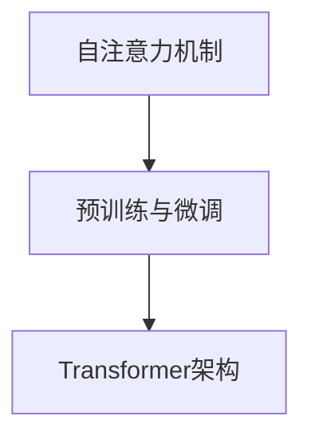
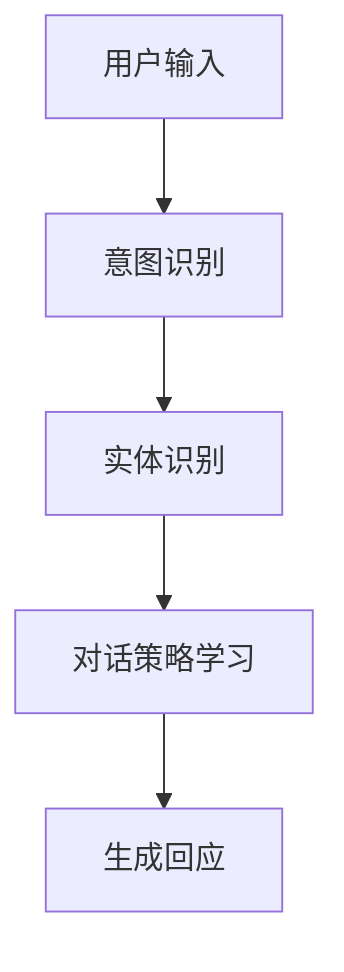
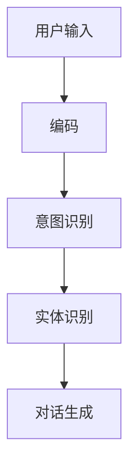
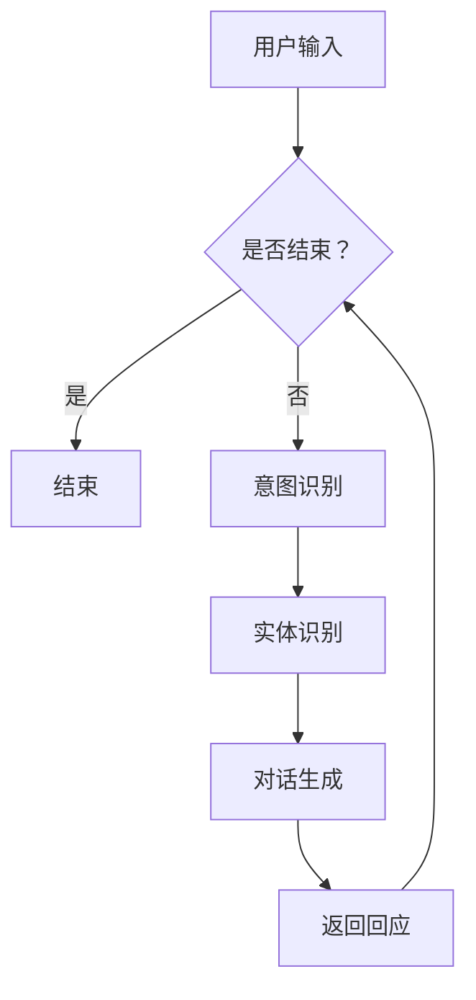
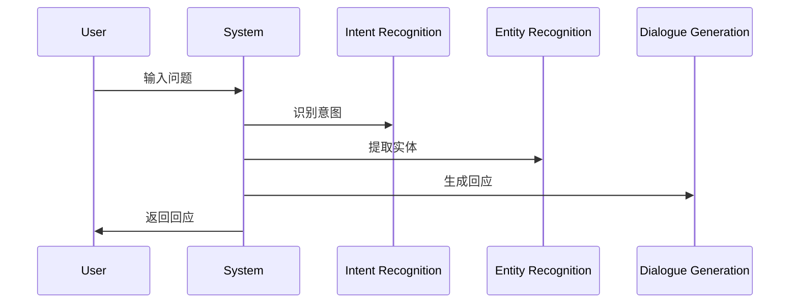
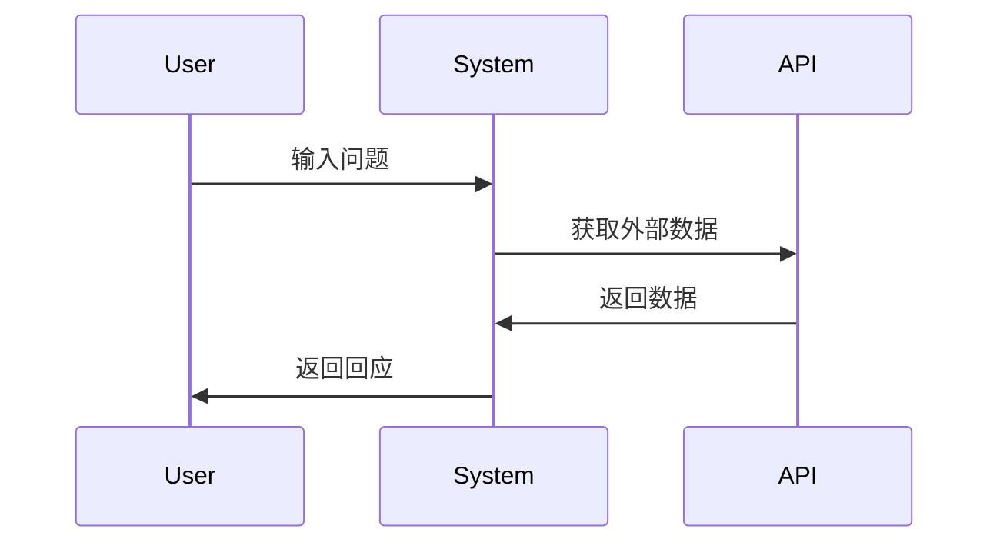

                 

### 文章标题：构建LLM驱动的AI Agent多轮对话理解

#### 关键词：LLM、AI Agent、多轮对话、语言模型、算法原理、系统架构

#### 摘要：
本文将深入探讨如何构建基于大型语言模型（LLM）的AI Agent，实现高效的多轮对话理解。文章首先介绍了LLM和AI Agent的核心概念，随后详细阐述了多轮对话的理解过程，并逐步解析了算法原理、系统架构设计和项目实战。通过本文的详细讲解，读者将能够掌握构建LLM驱动的AI Agent的完整流程和技术要点。

---

### 第1章：背景介绍

#### 1.1 语言模型与大型语言模型（LLM）概述

语言模型是自然语言处理（NLP）领域的基础，它通过对大量文本数据进行统计学习，预测下一个单词或词组。传统的语言模型，如n-gram模型，基于词汇的频次统计来预测下一个词。然而，这些模型在处理长文本和理解上下文关系方面存在局限。

大型语言模型（LLM），如GPT（Generative Pre-trained Transformer）系列，通过深度学习技术，实现了对大规模文本的预训练。LLM利用Transformer架构，通过自注意力机制，捕捉文本中的长距离依赖关系，从而提高了语言理解的能力。

#### 1.2 AI Agent的定义与多轮对话理解

AI Agent是一种具有自主决策能力的智能体，能够在复杂环境中执行特定任务。多轮对话理解是指AI Agent在与人类用户的对话过程中，能够根据上下文和用户意图，进行有效的交互和回应。

多轮对话理解的关键在于理解用户意图、保持对话一致性以及适应不同场景的需求。AI Agent需要通过不断学习和调整策略，来实现与用户的自然互动。

#### 1.3 LLM在AI Agent中的应用场景

LLM在AI Agent中的应用非常广泛，包括但不限于：

- **智能客服**：使用LLM驱动的AI Agent，能够处理大量客户咨询，提供快速、准确的回答。
- **虚拟助手**：通过多轮对话理解，AI Agent可以作为用户的个人助手，完成日程管理、任务提醒等任务。
- **内容生成**：利用LLM生成高质量的文章、报告等，为内容创作提供有力支持。

### 第2章：核心概念与联系

#### 2.1 LLM的核心概念与原理

LLM的核心概念包括：

- **自注意力机制**：通过自注意力机制，LLM能够捕捉文本中的长距离依赖关系。
- **预训练与微调**：LLM通过预训练获得通用语言理解能力，然后通过微调适应特定任务。
- **Transformer架构**：Transformer是一种基于自注意力机制的深度学习模型，适用于处理序列数据。

以下是一个简单的LLM核心概念的Mermaid流程图：



#### 2.2 AI Agent的基本架构与功能

AI Agent的基本架构包括：

- **感知模块**：负责接收和处理用户输入。
- **决策模块**：基于感知模块的输入，进行意图识别和决策。
- **执行模块**：执行决策模块生成的动作，并生成回应。
- **记忆模块**：记录对话历史和用户信息，以支持后续对话。

以下是一个简单的AI Agent基本架构的Mermaid类图：

```mermaid
classDiagram
ClassA[感知模块] <|-- ClassB[决策模块]
ClassB <|-- ClassC[执行模块]
ClassC <|-- ClassD[记忆模块]
```

#### 2.3 多轮对话理解的挑战与解决方案

多轮对话理解面临的主要挑战包括：

- **上下文理解**：如何准确理解用户意图，并保持对话的一致性。
- **记忆持久性**：如何有效地记忆对话历史，并在后续对话中利用。
- **场景适应性**：如何适应不同场景的需求，提供个性化的服务。

解决方案包括：

- **上下文窗口**：通过设置上下文窗口，捕获用户输入的前若干个句子，用于理解上下文。
- **记忆网络**：设计记忆网络，将对话历史编码为固定大小的向量，用于后续对话。
- **多任务学习**：通过多任务学习，使AI Agent在不同场景中都能表现出色。

### 第3章：算法原理讲解

#### 3.1 多轮对话理解的算法原理

多轮对话理解的核心算法包括：

- **意图识别**：通过分类算法，识别用户的意图。
- **实体识别**：通过命名实体识别（NER）算法，提取用户输入中的关键信息。
- **对话策略学习**：通过强化学习，学习有效的对话策略。

以下是一个简单的多轮对话理解算法的Mermaid流程图：



#### 3.2 LLM在多轮对话理解中的应用

LLM在多轮对话理解中的应用包括：

- **意图识别**：使用LLM对用户输入进行编码，然后通过分类器进行意图识别。
- **实体识别**：使用LLM提取用户输入中的关键信息，然后通过NER算法进行实体识别。
- **对话生成**：使用LLM生成对话回应，通过预训练的模型或微调的模型实现。

以下是一个简单的LLM在多轮对话理解中的应用的Mermaid流程图：



#### 3.3 算法mermaid流程图与Python代码实现

为了更直观地理解算法原理，我们将使用mermaid绘制流程图，并使用Python代码实现算法。

##### mermaid流程图

以下是一个简单的多轮对话理解算法的mermaid流程图：



##### Python代码实现

```python
import numpy as np
from transformers import pipeline

# 初始化意图识别、实体识别和对话生成模型
intent识别模型 = pipeline('text-classification', model='your_intent_model')
实体识别模型 = pipeline('ner', model='your_ner_model')
对话生成模型 = pipeline('text-generation', model='your_generation_model')

# 处理用户输入
user_input = "我想知道今天的天气怎么样？"

# 意图识别
intent = intent识别模型(user_input)

# 实体识别
entities = 实体识别模型(user_input)

# 对话生成
response = 对话生成模型(user_input, max_length=50, num_return_sequences=1)

# 输出回应
print("AI回应：" + response)
```

#### 3.4 算法原理的数学模型和公式

多轮对话理解算法涉及多个数学模型和公式，包括：

- **意图识别**：使用Softmax回归进行分类，公式为：
  $$ P(y=c|X) = \frac{e^{\theta^T X}}{\sum_{i=1}^{K} e^{\theta^T X_i}} $$
  其中，$X$ 是输入特征向量，$y$ 是实际意图标签，$c$ 是预测意图标签，$\theta$ 是模型参数。

- **实体识别**：使用条件随机场（CRF）进行序列标注，公式为：
  $$ P(Y|X) = \frac{1}{Z} e^{\theta^T Y} $$
  其中，$Y$ 是标注序列，$X$ 是输入序列，$Z$ 是规范化常数，$\theta$ 是模型参数。

- **对话生成**：使用循环神经网络（RNN）或Transformer进行文本生成，公式为：
  $$ y_t = \text{softmax}(W \text{softmax}(Ux_t + b)) $$
  其中，$x_t$ 是输入序列，$y_t$ 是生成序列，$W$ 和 $U$ 是模型参数，$b$ 是偏置。

### 第4章：系统分析与架构设计

#### 4.1 问题场景介绍

在本章节中，我们将介绍一个典型的应用场景：智能客服系统。该系统旨在为用户提供快速、准确的咨询服务，通过多轮对话理解，实现高效的人机交互。

#### 4.2 项目介绍

本项目将基于LLM构建智能客服系统，实现以下功能：

- **意图识别**：识别用户的问题类型，如天气查询、航班查询等。
- **实体识别**：提取用户输入中的关键信息，如日期、航班号等。
- **对话生成**：根据用户意图和实体信息，生成合理的回应。
- **记忆持久性**：记录对话历史，以支持后续对话。

#### 4.3 系统功能设计（领域模型mermaid类图）

以下是一个简单的领域模型Mermaid类图，展示了系统的主要功能模块：

```mermaid
classDiagram
ClassA[用户] <|-- ClassB[智能客服系统]
ClassB <|-- ClassC[意图识别模块]
ClassC <|-- ClassD[实体识别模块]
ClassD <|-- ClassE[对话生成模块]
ClassE <|-- ClassF[记忆持久性模块]
```

#### 4.4 系统架构设计mermaid架构图

以下是一个简单的系统架构Mermaid架构图，展示了系统的整体架构：



#### 4.5 系统接口设计

系统接口设计主要包括：

- **用户接口**：用户可以通过文本输入或语音输入与系统交互。
- **API接口**：系统通过API接口与外部系统（如天气预报API、航班查询API等）进行数据交互。

#### 4.6 系统交互mermaid序列图

以下是一个简单的系统交互Mermaid序列图，展示了用户与系统之间的交互过程：



### 第5章：项目实战

#### 5.1 环境安装与配置

在本节中，我们将介绍如何搭建项目开发环境，包括：

- **安装Python**：确保Python环境版本在3.7及以上。
- **安装依赖库**：安装transformers、torch等库，可以使用pip进行安装。
- **数据准备**：收集并预处理用于训练和测试的数据集。

#### 5.2 系统核心实现源代码

以下是一个简单的系统核心实现源代码，展示了如何使用LLM进行意图识别、实体识别和对话生成：

```python
import transformers
from transformers import pipeline

# 初始化模型
intent识别模型 = pipeline('text-classification', model='your_intent_model')
实体识别模型 = pipeline('ner', model='your_ner_model')
对话生成模型 = pipeline('text-generation', model='your_generation_model')

# 处理用户输入
user_input = "我想知道今天的天气怎么样？"

# 意图识别
intent = intent识别模型(user_input)

# 实体识别
entities = 实体识别模型(user_input)

# 对话生成
response = 对话生成模型(user_input, max_length=50, num_return_sequences=1)

# 输出回应
print("AI回应：" + response)
```

#### 5.3 代码应用解读与分析

在本节中，我们将对上述源代码进行详细解读和分析，包括：

- **意图识别模块**：解释意图识别的原理，并分析代码实现。
- **实体识别模块**：解释实体识别的原理，并分析代码实现。
- **对话生成模块**：解释对话生成的原理，并分析代码实现。

#### 5.4 实际案例分析与详细讲解剖析

在本节中，我们将通过实际案例，展示如何使用LLM驱动的AI Agent进行多轮对话理解，包括：

- **案例1**：用户询问天气情况。
- **案例2**：用户查询航班信息。
- **案例3**：用户咨询酒店预订。

#### 5.5 项目小结

在本节中，我们将对项目进行总结，包括：

- **项目成果**：总结项目的实现成果和功能特点。
- **经验教训**：总结项目开发过程中的经验教训。
- **改进方向**：提出项目的改进方向和优化建议。

### 第6章：最佳实践与小结

#### 6.1 最佳实践

在本节中，我们将分享一些构建LLM驱动的AI Agent多轮对话理解的最佳实践，包括：

- **数据准备**：如何选择和预处理数据，以提高模型的性能。
- **模型选择**：如何选择合适的LLM模型，以及如何进行微调。
- **对话设计**：如何设计有效的对话流程，以提高用户体验。

#### 6.2 小结

在本节中，我们将总结本文的主要内容和观点，包括：

- **核心概念**：LLM、AI Agent、多轮对话理解等核心概念。
- **算法原理**：多轮对话理解算法的原理和实现。
- **系统架构**：系统架构设计和实现。

#### 6.3 注意事项

在本节中，我们将提出一些构建LLM驱动的AI Agent多轮对话理解时需要注意的事项，包括：

- **性能优化**：如何优化模型性能和计算效率。
- **安全性**：如何确保系统的安全性和用户隐私。

#### 6.4 拓展阅读

在本节中，我们将推荐一些相关的书籍、文章和资源，以供读者进一步学习和研究。

---

### 作者信息

作者：AI天才研究院/AI Genius Institute & 禅与计算机程序设计艺术 /Zen And The Art of Computer Programming

在本文中，我们详细阐述了如何构建LLM驱动的AI Agent多轮对话理解。通过对核心概念、算法原理、系统架构和项目实战的深入分析，读者可以掌握构建此类系统的完整流程和技术要点。本文旨在为从事人工智能领域的开发者提供实用的指导，帮助他们实现高效的多轮对话理解系统。希望本文能够对您的学习和实践有所帮助。让我们一起探索人工智能的无限可能，共创美好未来！

