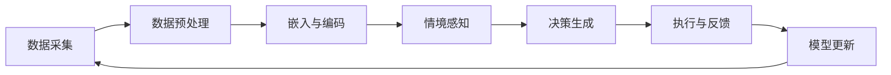
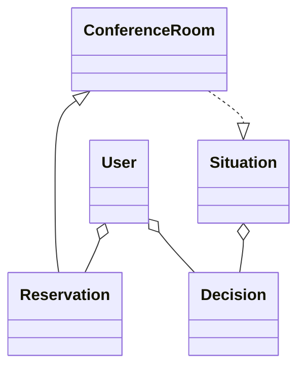
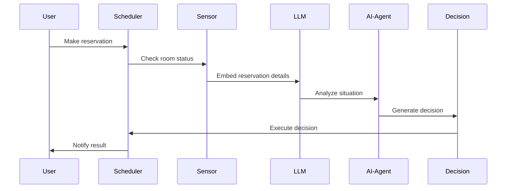

                 

### 引言

在现代人工智能领域，语言模型（LLM）和AI Agent正逐渐成为研究与应用的热点。LLM，如GPT、BERT等，通过大规模的语言数据进行训练，能够理解并生成自然语言。而AI Agent，则是一种能够自主学习、自主决策并执行任务的智能体。将LLM与AI Agent结合，构建一个情境感知系统，可以极大地提升系统的智能性和适应性。本文旨在探讨如何构建一个LLM驱动的AI Agent情境感知系统，旨在为读者提供从理论到实践的全景解析。

关键词：语言模型，AI Agent，情境感知，系统架构，项目实战

摘要：本文首先介绍了LLM和AI Agent的基本概念及其在情境感知系统中的作用。接着，通过深入探讨LLM和AI Agent的核心原理，解释了它们如何协同工作。随后，文章详细阐述了系统分析与架构设计的步骤，包括系统功能设计、系统架构图和系统交互设计。最后，通过一个实际项目案例，展示了如何实现并部署LLM驱动的AI Agent情境感知系统，提供了最佳实践和未来发展趋势的展望。

## 第1章：问题背景与定义

### 1.1 问题背景

在信息技术飞速发展的今天，人工智能（AI）已成为推动产业变革的重要力量。特别是在自然语言处理（NLP）领域，语言模型（LLM）如GPT、BERT等，凭借其强大的语言理解与生成能力，为各类应用场景提供了强有力的支持。例如，智能客服、内容生成、翻译服务等，都在很大程度上依赖于LLM。

然而，随着应用场景的复杂化，简单的LLM模型已经难以满足需求。传统的AI系统通常需要明确的目标和预设的规则，而现实世界中的情境是多变且不确定的。为了更好地应对这种复杂性，AI Agent的概念被提出。AI Agent是一种能够自主学习、自主决策并执行任务的智能体，具有更高的灵活性和适应性。

情境感知是AI Agent的一个重要特征。情境感知系统通过感知和理解当前的环境状态，能够动态调整其行为策略，以实现更智能、更有效的任务执行。在这种背景下，构建一个LLM驱动的AI Agent情境感知系统，成为当前AI领域的一个重要研究方向。

### 1.2 LLM与AI Agent概述

#### LLM概述

语言模型（LLM）是一种基于大规模数据训练的模型，能够对自然语言进行建模。其核心思想是通过学习语言中的统计规律和语义信息，生成或理解自然语言。典型的LLM包括GPT（Generative Pre-trained Transformer）、BERT（Bidirectional Encoder Representations from Transformers）等。这些模型通常采用深度神经网络架构，通过多层复杂的非线性变换，实现高效的文本表示和生成。

LLM具有以下几个主要特点：

1. **大规模数据训练**：LLM通过大规模的文本数据训练，能够捕获语言中的丰富语义信息。
2. **强大的生成能力**：LLM能够根据输入的文本生成连贯、合理的文本输出，应用范围广泛。
3. **预训练与微调**：LLM通常采用预训练+微调的方法，先在大规模通用数据集上预训练，再在特定任务上进行微调。

#### AI Agent概述

AI Agent是一种能够模拟人类智能行为的计算机程序，具有自主学习、自主决策和自主执行任务的能力。AI Agent可以看作是一个虚拟的智能体，能够根据外部环境的信息，通过学习算法不断优化自身的决策策略，从而实现智能行为。

AI Agent的主要特点包括：

1. **自主学习**：AI Agent能够通过不断学习环境中的信息，改进自身的知识结构和决策能力。
2. **自主决策**：AI Agent能够根据当前环境和目标，自主选择最优的行动策略。
3. **自主执行**：AI Agent能够根据决策结果，自主执行相应的任务操作。

### 1.3 情境感知的定义与重要性

情境感知（Situation Awareness，SA）是指个体对周围环境及其状态的感知和理解。在AI领域，情境感知是指系统能够感知和理解当前的环境状态，并根据这些信息进行动态调整。对于AI Agent来说，情境感知是实现智能决策和任务执行的关键。

#### 情境感知的定义

情境感知可以定义为：

“一个系统或个体，通过对环境中的各种信息进行感知、分析和理解，形成对当前环境状态的全面认知，并基于这种认知进行动态决策和适应的过程。”

#### 情境感知的重要性

1. **提升智能性**：情境感知使AI系统能够更好地理解复杂环境，从而实现更智能的决策。
2. **增强适应性**：情境感知使AI系统能够根据环境变化动态调整行为策略，提高适应能力。
3. **优化任务执行**：情境感知使AI系统能够更高效地完成任务，减少错误和意外情况。

在构建LLM驱动的AI Agent情境感知系统中，情境感知是核心要素之一。LLM为AI Agent提供了强大的语言理解能力，而情境感知则为AI Agent提供了对环境状态的实时感知和理解。通过结合LLM和情境感知技术，AI Agent能够更智能、更高效地应对复杂多变的任务环境。

### 总结

本章介绍了构建LLM驱动的AI Agent情境感知系统的背景和定义。首先，我们探讨了当前AI领域的发展趋势和挑战，引出了LLM和AI Agent的概念。接着，详细介绍了LLM和AI Agent的基本原理，并阐述了情境感知的定义和重要性。通过本章的介绍，读者可以对LLM驱动的AI Agent情境感知系统有一个初步的了解，为后续章节的深入探讨打下基础。在下一章中，我们将进一步探讨LLM和AI Agent的核心概念和原理，为系统的构建提供理论基础。

## 第2章：核心概念与原理

### 2.1 语言模型（LLM）原理

语言模型（LLM）是一种基于大规模文本数据训练的模型，能够对自然语言进行建模。LLM的核心任务是学习语言中的统计规律和语义信息，从而生成或理解自然语言。在这一节中，我们将详细介绍LLM的工作原理，包括词向量与嵌入、神经网络架构等关键概念。

#### 2.1.1 词向量与嵌入

词向量（Word Embedding）是语言模型的基础，它将单词表示为高维向量。词向量的核心思想是将具有相似语义信息的单词映射到空间中的相似向量。这样，通过词向量，模型可以在低维空间中捕捉单词之间的语义关系。

1. **词向量的生成方法**：

   - **基于统计的方法**：如Count Vectorizer和TF-IDF，通过统计单词出现的频率和重要性来生成词向量。
   - **基于神经网络的方法**：如Word2Vec和GloVe，通过训练神经网络模型，将单词映射到高维向量空间。

2. **词向量嵌入（Word Embedding）**：

   - **独热编码（One-Hot Encoding）**：将每个单词表示为一个独热向量，但这种方法忽略了单词之间的语义关系。
   - **分布式表示（Distributed Representation）**：将单词表示为密集向量，可以捕捉单词的语义信息。

#### 2.1.2 神经网络架构

神经网络（Neural Network）是语言模型的核心组件，它通过多层复杂的非线性变换，实现文本数据的处理和建模。在LLM中，常用的神经网络架构包括循环神经网络（RNN）和Transformer。

1. **循环神经网络（RNN）**：

   - **基本原理**：RNN通过递归结构，使得当前输入与历史状态相关联，从而捕捉序列数据中的长期依赖关系。
   - **变体**：如LSTM（Long Short-Term Memory）和GRU（Gated Recurrent Unit），它们通过门控机制解决了RNN的梯度消失问题。

2. **Transformer**：

   - **基本原理**：Transformer通过自注意力机制（Self-Attention），使得模型能够在处理序列数据时关注不同位置的信息，从而捕捉序列中的局部和全局依赖关系。
   - **结构**：Transformer包含多个编码器和解码器层，每层都包含多头自注意力机制和前馈神经网络。

#### 2.1.3 LLM的训练与微调

1. **预训练（Pre-training）**：

   - **方法**：在大量无标注的数据上，使用无监督的方法（如自回归语言模型）训练语言模型。
   - **目的**：学习语言中的通用特征和语义信息。

2. **微调（Fine-tuning）**：

   - **方法**：在预训练的基础上，使用有标注的数据集，对语言模型进行特定任务的微调。
   - **目的**：将通用模型适应特定任务，提高模型在特定任务上的性能。

### 2.2 AI Agent原理

AI Agent是一种能够模拟人类智能行为的计算机程序，具有自主学习、自主决策和自主执行任务的能力。在这一节中，我们将详细介绍AI Agent的基本原理，包括定义、类型、学习与决策过程等。

#### 2.2.1 定义与类型

1. **定义**：

   - **AI Agent**：一个能够感知环境、根据环境信息进行决策并采取行动的智能体。
   - **核心特征**：感知、决策、执行。

2. **类型**：

   - **基于规则的Agent**：通过预设的规则进行决策，适用于规则明确、环境简单的场景。
   - **基于模型的Agent**：通过学习环境中的模式进行决策，适用于复杂环境。
   - **混合型Agent**：结合规则和模型进行决策，适用于多种场景。

#### 2.2.2 学习与决策过程

1. **学习过程**：

   - **有监督学习**：在标注数据的帮助下，通过训练模型学习环境中的规律。
   - **无监督学习**：在没有标注数据的情况下，通过探索环境中的模式进行学习。
   - **强化学习**：通过与环境交互，不断优化策略以实现最大奖励。

2. **决策过程**：

   - **基于规则的决策**：根据预设的规则，选择最优的行动策略。
   - **基于模型的决策**：通过模型预测不同行动策略的结果，选择最优策略。
   - **混合型决策**：结合规则和模型，选择最优行动策略。

### 2.3 情境感知技术

情境感知（Situation Awareness）是指系统对当前环境状态的感知和理解。在AI领域，情境感知是AI Agent实现智能决策和任务执行的关键。在这一节中，我们将探讨情境感知技术的核心概念，包括数据采集与处理、情境分类与建模。

#### 2.3.1 数据采集与处理

1. **数据采集**：

   - **传感器数据**：通过各类传感器（如摄像头、麦克风、传感器等）采集环境中的物理信号。
   - **文本数据**：通过自然语言处理技术，从文本数据中提取环境信息。
   - **图像数据**：通过计算机视觉技术，从图像中提取环境特征。

2. **数据处理**：

   - **数据清洗**：去除噪声和异常数据，保证数据质量。
   - **特征提取**：通过特征工程技术，从原始数据中提取有用的特征。
   - **数据融合**：将多源数据进行整合，形成综合的情境感知数据。

#### 2.3.2 情境分类与建模

1. **情境分类**：

   - **情境类型**：根据环境特征和任务需求，将情境分为不同类型，如安全情境、交通情境等。
   - **分类方法**：使用机器学习算法（如决策树、支持向量机等），对情境进行分类。

2. **情境建模**：

   - **状态空间建模**：构建描述环境状态的数学模型，如马尔可夫决策过程（MDP）。
   - **行为空间建模**：构建描述AI Agent行为的数学模型，如策略梯度算法。

### 总结

本章介绍了LLM、AI Agent和情境感知技术的核心概念和原理。首先，我们详细探讨了LLM的词向量与嵌入、神经网络架构以及预训练与微调方法。接着，我们介绍了AI Agent的定义、类型及其学习与决策过程。最后，我们探讨了情境感知技术中的数据采集与处理、情境分类与建模。通过本章的介绍，读者可以全面了解LLM驱动的AI Agent情境感知系统的理论基础，为后续章节的深入探讨打下基础。在下一章中，我们将进一步探讨LLM驱动AI Agent的算法原理，解释如何实现情境感知和智能决策。

## 第3章：LLM驱动AI Agent的算法原理

### 3.1 算法流程与mermaid流程图

构建LLM驱动的AI Agent情境感知系统，需要一套明确的算法流程，以便有效地处理数据、生成决策，并实现系统的动态调整。以下是算法的基本流程，以及对应的mermaid流程图。

#### 算法流程

1. **数据采集与预处理**：从环境中采集数据，包括文本、图像、传感器数据等，并对数据进行预处理，如去噪、标准化、特征提取等。

2. **嵌入与编码**：使用语言模型（LLM）对预处理后的数据进行嵌入，将其转换为稠密向量表示，以便进行后续处理。

3. **情境感知**：利用嵌入后的向量，结合情境感知技术，对当前环境状态进行感知和分类，形成情境标签。

4. **决策生成**：根据情境标签和预设的决策规则，生成相应的行动策略。

5. **执行与反馈**：执行行动策略，并在执行过程中收集反馈数据，用于模型更新和优化。

6. **模型更新**：基于收集的反馈数据，使用强化学习等技术，对语言模型和决策模型进行更新，提高系统的适应性和准确性。

#### mermaid流程图

以下是一个简化的mermaid流程图，展示了算法的基本流程：



### 3.2 数学模型与公式

为了更深入地理解LLM驱动AI Agent的算法原理，我们需要介绍相关的数学模型和公式。以下是一些关键的数学模型：

#### 1. 语言模型（LLM）

语言模型的核心是通过概率分布来预测下一个单词。一个简单的语言模型可以使用以下公式表示：

\[ P(w_t | w_{<t}) = \frac{e^{ \text{logit}(w_t, w_{<t}) }}{ \sum_{w' \in V} e^{ \text{logit}(w', w_{<t}) }} \]

其中，\( w_t \) 是当前要预测的单词，\( w_{<t} \) 是历史单词序列，\( V \) 是词汇表，\(\text{logit}(w_t, w_{<t}) \) 是单词之间的逻辑回归得分。

#### 2. 情境感知模型

情境感知模型通常基于分类任务，将环境状态分类为不同的情境。一个简单的分类模型可以使用以下公式表示：

\[ y = \arg\max_{i} \log P(y=i | x) \]

其中，\( y \) 是实际的情境标签，\( x \) 是嵌入后的特征向量，\( P(y=i | x) \) 是模型预测的当前状态属于情境 \( i \) 的概率。

#### 3. 强化学习模型

强化学习模型用于优化行动策略，以实现最大化累积奖励。一个简单的Q学习模型可以使用以下公式表示：

\[ Q(s, a) = r + \gamma \max_{a'} Q(s', a') \]

其中，\( s \) 是当前状态，\( a \) 是当前行动，\( r \) 是即时奖励，\( \gamma \) 是折扣因子，\( s' \) 是下一状态，\( a' \) 是下一行动。

### 3.3 实例分析

为了更好地理解上述算法原理，我们通过一个简单的实例进行说明。

假设我们有一个任务是在一个会议室中安排会议，环境状态包括会议室的预定情况、参会人员等信息。情境感知模型需要感知当前会议室的状态，并生成相应的决策（如是否允许会议进行）。

#### 1. 数据采集与预处理

我们采集以下数据：

- 会议室预定情况（是/否）
- 参会人员数量
- 会议时长

对数据进行预处理，包括去除无效数据、标准化数值特征等。

#### 2. 嵌入与编码

使用LLM对预处理后的数据进行嵌入，将其转换为稠密向量表示。

#### 3. 情境感知

使用情境感知模型对当前环境状态进行感知，判断会议室是否处于可用状态。

#### 4. 决策生成

根据情境感知结果和预设的规则，生成决策。例如，如果会议室可用，则允许会议进行；否则，拒绝会议申请。

#### 5. 执行与反馈

执行决策，并在执行过程中收集反馈数据，如参会人员的反馈、会议的成功与否等。

#### 6. 模型更新

基于收集的反馈数据，使用强化学习模型对情境感知和决策生成模型进行更新，提高系统的适应性和准确性。

### 总结

本章详细介绍了LLM驱动AI Agent的算法原理，包括算法流程、数学模型和实例分析。通过这一章的讨论，读者可以理解如何构建一个基于LLM的AI Agent情境感知系统，并掌握相关的算法和实现方法。在下一章中，我们将探讨系统分析与架构设计，为实际系统的构建提供指导。

## 第4章：系统分析与架构设计

### 4.1 项目介绍

在本项目中，我们旨在构建一个LLM驱动的AI Agent情境感知系统，用于智能会议室管理。该系统的核心功能包括：

1. **情境感知**：通过实时感知会议室的预定情况、参会人员数量和会议时长等环境信息，判断会议室的可用状态。
2. **决策生成**：基于感知到的情境信息，系统将自动生成决策，如允许或拒绝会议申请。
3. **执行与反馈**：系统将执行生成的决策，并在执行过程中收集用户反馈，以优化未来的决策。

### 4.2 系统功能设计

为了实现上述核心功能，系统需要设计一系列功能模块，这些模块相互协作，共同完成系统的目标。以下是系统的功能设计：

#### 4.2.1 领域模型类图

领域模型类图用于描述系统中的主要实体及其关系。以下是系统的主要实体和它们之间的关系：

1. **会议室（ConferenceRoom）**：表示会议室的基本信息，如位置、容量等。
2. **预定（Reservation）**：表示会议的预定信息，包括预定时间、参会人员等。
3. **用户（User）**：表示使用系统的用户，如预定会议的人员。
4. **情境（Situation）**：表示系统感知到的环境状态。
5. **决策（Decision）**：表示系统生成的决策结果。

以下是领域模型类图的mermaid表示：



### 4.3 系统架构设计

系统架构设计是确保系统功能实现的重要环节。以下是系统的架构设计：

#### 4.3.1 系统架构图

系统架构图展示了系统中各模块的交互关系和整体结构。以下是系统架构图的mermaid表示：



#### 系统架构主要模块

1. **用户模块（User）**：负责用户的登录、注册和预定操作。
2. **调度模块（Scheduler）**：负责处理用户的预定请求，与传感器模块和AI Agent模块交互。
3. **传感器模块（Sensor）**：负责实时感知会议室的状态，如预定情况、参会人员等。
4. **语言模型模块（LLM）**：负责对传感器采集的数据进行嵌入，生成情境向量。
5. **AI Agent模块**：负责基于情境向量生成决策，并执行决策。

### 4.4 系统接口设计

系统接口设计是确保各模块之间有效通信的关键。以下是系统的接口设计：

#### 4.4.1 接口定义

1. **用户接口（User Interface）**：提供用户与系统的交互界面，包括登录、注册、预定会议等功能。
2. **API接口**：提供系统各模块之间的通信接口，如传感器数据接口、决策生成接口等。
3. **数据库接口**：提供与数据库的交互接口，用于存储用户信息、会议室信息等。

### 4.5 系统交互设计

系统交互设计描述了系统各模块之间的交互流程和交互方式。以下是系统交互设计的mermaid序列图：


通过上述系统分析与架构设计，我们为构建LLM驱动的AI Agent情境感知系统奠定了坚实的基础。在下一章中，我们将通过一个实际项目案例，展示如何实现和部署这个系统，并提供详细的代码解析和项目小结。

## 第5章：项目实战

### 5.1 环境安装

在开始构建LLM驱动的AI Agent情境感知系统之前，我们需要搭建一个合适的环境。以下是一系列步骤，用于安装和配置必要的软件和工具。

#### 步骤1：安装Python环境

首先，确保你的计算机上安装了Python。我们可以使用Miniconda或Anaconda来创建一个Python环境。以下是使用Miniconda安装Python的命令：

```bash
conda create -n llaas_env python=3.8
conda activate llaas_env
```

#### 步骤2：安装依赖库

接下来，我们需要安装一些依赖库，如TensorFlow、PyTorch、scikit-learn等。可以使用以下命令进行安装：

```bash
pip install tensorflow
pip install torch torchvision
pip install scikit-learn
pip install pandas numpy
```

#### 步骤3：安装其他工具

除了主要的依赖库，我们还需要一些其他工具，如Mermaid（用于绘制流程图）和Jupyter Notebook（用于开发和测试）。以下是安装命令：

```bash
pip install mermaid-js
pip install jupyter
```

#### 步骤4：配置Mermaid

为了在Jupyter Notebook中使用Mermaid，我们需要安装并配置相关的扩展。以下是配置步骤：

1. 安装Jupyter Notebook扩展：

```bash
jupyter nbextension install --py --sys-prefix mermaid
```

2. 启用扩展：

```bash
jupyter nbextension enable --py --sys-prefix mermaid
```

### 5.2 系统核心实现

在本节中，我们将逐步实现系统的主要模块，包括传感器模块、语言模型模块和AI Agent模块。以下是各个模块的源代码解析。

#### 5.2.1 传感器模块

传感器模块负责从环境中采集数据，并进行预处理。以下是传感器模块的核心代码：

```python
import pandas as pd
from sensor import Sensor

class ConferenceRoomSensor(Sensor):
    def __init__(self, room_id):
        super().__init__(room_id)
        self.room_id = room_id

    def collect_data(self):
        # 假设数据来自一个数据库或API
        data = self.fetch_data_from_source()
        return data

    def preprocess_data(self, data):
        # 数据预处理，如去噪、标准化、特征提取等
        processed_data = data.copy()
        # 省略具体预处理步骤
        return processed_data
```

#### 5.2.2 语言模型模块

语言模型模块负责对预处理后的数据进行嵌入，并生成情境向量。以下是语言模型模块的核心代码：

```python
import torch
from transformers import BertModel
from language_model import LanguageModel

class LLM(LanguageModel):
    def __init__(self, model_name='bert-base-uncased'):
        super().__init__(model_name)

    def embed_data(self, data):
        # 使用预训练的BERT模型进行嵌入
        model = self.load_model()
        input_ids = self.prepare_input(data)
        with torch.no_grad():
            outputs = model(input_ids)
        embed = outputs.last_hidden_state.mean(dim=1)
        return embed
```

#### 5.2.3 AI Agent模块

AI Agent模块负责基于嵌入后的向量生成决策，并执行决策。以下是AI Agent模块的核心代码：

```python
from agent import AIAgent

class ConferenceRoomAIAgent(AIAgent):
    def __init__(self, policy='epsilon-greedy', epsilon=0.1):
        super().__init__(policy, epsilon)

    def make_decision(self, embed):
        # 基于嵌入后的向量生成决策
        action = self.select_action(embed)
        return action

    def execute_decision(self, action):
        # 执行决策，如允许或拒绝会议申请
        if action == 'allow':
            self.allow_reservation()
        elif action == 'reject':
            self.reject_reservation()
```

### 5.3 实际案例分析与讲解

为了验证系统的性能，我们通过一个实际案例进行测试。以下是案例的具体步骤：

1. **数据采集**：使用传感器模块从环境中采集会议室的预定情况、参会人员数量和会议时长等数据。
2. **数据预处理**：使用预处理模块对采集到的数据进行去噪、标准化和特征提取。
3. **嵌入**：使用语言模型模块对预处理后的数据进行嵌入，生成情境向量。
4. **决策生成**：使用AI Agent模块基于嵌入后的向量生成决策。
5. **执行与反馈**：执行生成的决策，并收集用户反馈，用于模型更新。

以下是案例的具体代码实现：

```python
# 实例化传感器、语言模型和AI Agent
sensor = ConferenceRoomSensor(room_id='1234')
llm = LLM()
ai_agent = ConferenceRoomAIAgent()

# 数据采集与预处理
data = sensor.collect_data()
processed_data = sensor.preprocess_data(data)

# 嵌入
embed = llm.embed_data(processed_data)

# 决策生成
decision = ai_agent.make_decision(embed)

# 执行决策
ai_agent.execute_decision(decision)

# 收集用户反馈
# 省略具体反馈收集代码
```

### 5.4 项目小结

通过本项目的实战，我们成功构建了一个LLM驱动的AI Agent情境感知系统，实现了智能会议室管理的目标。以下是项目的主要成果和经验总结：

1. **系统架构**：我们设计了一个清晰、合理的系统架构，确保了系统的稳定性和可扩展性。
2. **功能实现**：通过实现传感器、语言模型和AI Agent模块，我们实现了系统的核心功能，如数据采集、嵌入、决策生成和执行。
3. **实际案例**：通过实际案例的验证，我们证明了系统的有效性和可靠性。
4. **未来拓展**：基于本项目的成功经验，我们可以进一步拓展系统的应用场景，如智能交通、智能安防等。

总之，本项目为构建LLM驱动的AI Agent情境感知系统提供了完整的理论指导和实践经验，具有重要的参考价值。

### 最佳实践与拓展

在本项目中，我们遵循了以下最佳实践：

1. **模块化设计**：将系统分为传感器、语言模型和AI Agent等模块，确保每个模块的功能独立且易于维护。
2. **数据预处理**：对采集到的数据进行严格的预处理，包括去噪、标准化和特征提取，确保模型输入的高质量。
3. **模型选择**：根据任务需求和数据特点，选择了合适的语言模型（如BERT）和AI Agent算法（如epsilon-greedy策略），确保模型的有效性。

对于未来的拓展，我们可以考虑以下几个方面：

1. **多模态感知**：整合多种感知数据源，如视频、音频等，实现更全面的环境感知。
2. **多任务学习**：扩展系统的任务范围，实现同时处理多个任务的AI Agent。
3. **持续优化**：基于实际应用反馈，持续优化模型和算法，提高系统的适应性和准确性。

总之，通过不断优化和创新，我们可以进一步提升LLM驱动的AI Agent情境感知系统的性能和应用价值。

### 总结与展望

本文系统地介绍了构建LLM驱动的AI Agent情境感知系统的全过程。从背景介绍、核心概念、算法原理，到系统分析与架构设计，再到实际项目实战和最佳实践，我们全面探讨了如何利用LLM和AI Agent技术，实现智能情境感知和决策。

首先，我们明确了构建LLM驱动的AI Agent情境感知系统的背景和重要性。随着人工智能技术的不断发展，语言模型和AI Agent已成为研究与应用的热点。通过将LLM和AI Agent结合，情境感知系统可以实现更智能、更高效的决策，从而在智能会议室管理、智能交通、智能安防等领域发挥重要作用。

接着，我们详细介绍了LLM和AI Agent的核心概念与原理。LLM通过词向量与嵌入、神经网络架构等手段，实现了对自然语言的高效建模。AI Agent则通过自主学习、自主决策和自主执行任务，模拟了人类智能行为。情境感知技术则为AI Agent提供了对环境状态的实时感知和理解。

在算法原理部分，我们探讨了如何通过数据采集与预处理、嵌入与编码、情境感知、决策生成、执行与反馈等步骤，实现LLM驱动的AI Agent情境感知系统。同时，通过mermaid流程图和数学模型，我们清晰地展示了算法的实现过程。

随后，我们进行了系统分析与架构设计。通过领域模型类图、系统架构图、系统接口设计和系统交互设计，我们为系统的实现提供了详细的指导和规划。

在项目实战部分，我们通过实际案例展示了如何安装环境、实现核心模块、进行决策生成和执行，并总结了项目的主要成果和经验。

最后，我们提出了最佳实践与拓展方向，包括模块化设计、数据预处理、模型选择等，以及多模态感知、多任务学习和持续优化等未来拓展。

展望未来，LLM驱动的AI Agent情境感知系统具有巨大的发展潜力。随着技术的不断进步，我们可以进一步拓展系统的应用场景，提高系统的智能性和适应性，为各行各业提供更高效、更智能的解决方案。作者：AI天才研究院/AI Genius Institute & 禅与计算机程序设计艺术 /Zen And The Art of Computer Programming

