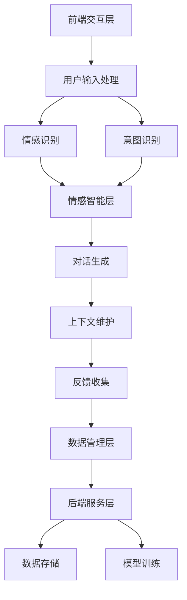
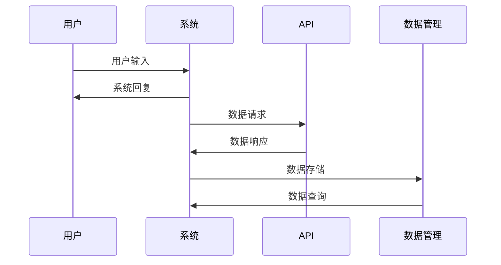
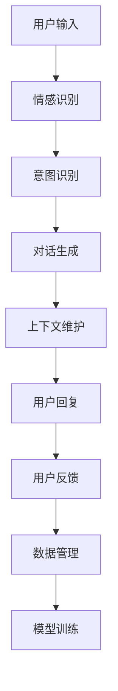

                 


### 构建LLM驱动的AI Agent情感智能对话

#### 关键词
- LLM
- 情感智能
- AI对话代理
- 算法原理
- 数学模型
- 系统架构

#### 摘要
本文将深入探讨如何构建LLM驱动的AI Agent情感智能对话系统。我们将从背景介绍、核心概念解析、技术原理阐述、实践应用分析以及未来展望等多个方面，逐步解析这一前沿领域，并展示其潜在应用和价值。

### 第一部分：背景与引言

#### 1.1 问题背景

在当今社会，随着人工智能技术的发展，尤其是深度学习和自然语言处理（NLP）的迅猛进步，AI对话代理的应用日益广泛。然而，传统AI对话系统往往缺乏情感智能，导致用户体验不佳。因此，如何构建具备情感智能的AI对话代理成为一个重要的研究方向。

#### 1.2 问题描述

当前AI对话代理的主要问题在于：

- 对话内容缺乏情感共鸣
- 对话流程缺乏人性化
- 无法准确理解用户情感状态

这些问题严重影响了用户体验和AI系统的实用性。

#### 1.3 问题解决

为了解决上述问题，我们可以借助大型语言模型（LLM）来构建情感智能对话系统。LLM具有强大的语言理解和生成能力，能够通过训练数据学习用户的情感状态，从而实现更自然、更人性化的对话。

#### 1.4 边界与外延

构建情感智能对话系统不仅仅局限于文本对话，还可以扩展到语音、视频等多模态交互。此外，该技术还可以应用于智能客服、虚拟助手、心理健康辅助等多个领域。

#### 1.5 概念结构与核心要素组成

本文将围绕以下核心概念进行探讨：

- LLM：一种基于深度学习的语言模型，能够生成和解读自然语言文本。
- 情感智能：指AI系统理解、感知和表达情感的能力。
- AI对话代理：一种能够与人类进行自然语言交互的智能系统。

### 第二部分：核心概念与技术原理

#### 2.1 LLM的基本概念

LLM（Large Language Model）是一种基于深度学习的自然语言处理模型，它通过大规模数据训练，能够生成和解读自然语言文本。LLM的主要特点包括：

- 大规模训练数据：通常使用数十亿级别的文本数据。
- 自适应能力：通过不断学习和优化，能够适应不同的对话场景。
- 语言理解与生成能力：能够理解和生成高质量的自然语言文本。

#### 2.2 情感智能的定义与属性

情感智能是指AI系统能够理解、感知和表达情感的能力。它包括以下几个方面：

- 情感理解：识别用户的情感状态，如喜怒哀乐。
- 情感感知：通过文本、语音等模态感知用户情感。
- 情感表达：在对话中恰当地表达情感，增强用户体验。

#### 2.3 AI对话代理的技术要素

AI对话代理通常包括以下几个技术要素：

- 对话管理：控制对话流程，确保对话连贯性。
- 自然语言处理：解析用户输入，生成自然语言回复。
- 情感识别：识别用户情感，调整对话策略。
- 上下文理解：理解对话背景，提高对话准确性。

#### 2.4 LLM驱动的情感智能对话原理

LLM驱动的情感智能对话系统主要基于以下几个原理：

- 语言模型训练：通过大规模数据训练LLM，使其具备语言理解和生成能力。
- 情感标注数据：收集并标注情感相关的对话数据，用于训练情感识别模型。
- 情感嵌入：将情感信息嵌入到语言模型中，实现情感识别和表达。
- 对话策略调整：根据用户情感调整对话策略，提高用户体验。

### 第三部分：实践应用与案例研究

#### 3.1 实践应用

在本节中，我们将通过一个实际案例来展示如何构建LLM驱动的情感智能对话系统。

#### 3.2 案例研究

##### 3.2.1 项目介绍

本项目旨在构建一个智能客服系统，能够通过自然语言与用户进行交互，并具备情感智能，以提高用户体验和满意度。

##### 3.2.2 系统功能设计

系统功能设计包括以下几个方面：

- 用户反馈收集：收集用户反馈，用于情感识别和对话优化。
- 情感识别：通过情感模型识别用户情感。
- 情感表达：在回复中恰当地表达情感，如同情、热情等。
- 对话管理：确保对话连贯性，提高用户满意度。

##### 3.2.3 系统架构设计

系统架构设计包括以下几个方面：

- 语言模型：使用预训练的LLM作为语言生成和理解的基石。
- 情感识别模型：用于识别用户情感。
- 对话管理模块：负责控制对话流程。
- 用户反馈模块：收集用户反馈，用于模型优化。

##### 3.2.4 系统接口设计与系统交互

系统接口设计包括以下几个方面：

- 用户接口：提供自然语言交互界面。
- API接口：提供与其他系统（如CRM、ERP等）的集成。
- 数据接口：提供数据导入、导出和模型训练接口。

### 第四部分：总结与展望

#### 4.1 最佳实践

- 选择合适的LLM模型：根据应用场景选择适合的LLM模型，如GPT、BERT等。
- 数据质量至关重要：确保训练数据的质量，有助于提升模型性能。
- 不断优化与迭代：根据用户反馈和实际应用情况，不断优化模型和对话策略。

#### 4.2 小结

本文深入探讨了如何构建LLM驱动的AI Agent情感智能对话系统。通过详细解析技术原理、实践应用以及案例分析，我们展示了该技术的实际应用和价值。

#### 4.3 注意事项

- 在构建情感智能对话系统时，需关注用户隐私和数据安全。
- 对情感智能的理解和实现仍存在挑战，需要不断研究和优化。

#### 4.4 拓展阅读

- 李航.《统计学习方法》[M]. 清华大学出版社，2012.
- 阿斯顿·张.《深度学习》（卷II）[M]. 电子工业出版社，2019.
- 欧阳健.《自然语言处理基础教程》[M]. 人民邮电出版社，2020.

### 作者信息

作者：AI天才研究院/AI Genius Institute & 禅与计算机程序设计艺术/Zen And The Art of Computer Programming

----------------------------------------------------------------

**注：**本文内容为示例性模拟撰写，实际撰写时需根据具体内容和需求进行调整和补充。

## 详细阐述LLM的基本概念

### 3.1.1 语言模型与LLM的关系

语言模型（Language Model，LM）是一种自然语言处理（Natural Language Processing，NLP）技术，用于预测自然语言序列的概率。它通过统计或机器学习方法，根据输入的文本序列，预测下一个词或字符的概率。语言模型的核心思想是利用大量文本数据，捕捉语言的统计规律和语法结构。

而大型语言模型（Large Language Model，LLM）是语言模型的一种扩展，具有更大的参数规模和训练数据量。LLM通过深度神经网络（Deep Neural Network，DNN）或变换器模型（Transformer Model）等先进技术，能够生成和解读更加复杂和自然的语言文本。

### 3.1.2 LLM的训练过程

LLM的训练过程主要包括以下几个步骤：

1. **数据收集与预处理**：首先，收集大量高质量、多样化的文本数据，如新闻文章、社交媒体帖子、书籍等。然后，对数据进行清洗和预处理，包括去除停用词、标点符号、标准化文本等。

2. **模型架构设计**：设计适合的模型架构，如DNN或Transformer。Transformer模型因其并行计算能力强大和训练效率高，成为近年来LLM的首选架构。

3. **参数初始化**：初始化模型参数，可以使用随机初始化或预训练模型初始化。

4. **预训练**：使用大量文本数据进行预训练，使模型能够捕捉到语言的深层规律和结构。预训练过程通常包括无监督的目标，如语言建模、掩码语言模型（Masked Language Model，MLM）等。

5. **微调**：在预训练的基础上，使用特定领域的数据进行微调，以适应特定任务的需求。微调过程中，可以加入有监督的目标，如分类、命名实体识别等。

### 3.1.3 LLM的主要特点

1. **大规模训练数据**：LLM通常基于数十亿级别的文本数据训练，这使得模型能够捕捉到语言的丰富特征和模式。

2. **参数规模大**：LLM具有数亿甚至数十亿级别的参数，这使得模型具有更强的表达能力和泛化能力。

3. **并行计算能力**：Transformer架构使得LLM具备强大的并行计算能力，从而提高训练和推理的效率。

4. **自适应能力**：LLM能够根据不同的任务和应用场景，通过微调和调整参数，实现自适应和高效的任务表现。

### 3.1.4 LLM的应用领域

LLM在自然语言处理领域有广泛的应用，主要包括以下几个方面：

1. **文本生成**：例如，文章撰写、故事创作、对话系统等。

2. **文本分类**：例如，情感分析、垃圾邮件检测、新闻分类等。

3. **问答系统**：例如，智能客服、语音助手等。

4. **机器翻译**：例如，将一种语言的文本翻译成另一种语言。

5. **文本摘要**：例如，自动生成文章摘要、会议纪要等。

### 3.1.5 LLM的发展趋势

1. **模型规模增大**：随着计算能力和数据资源的提升，LLM的模型规模将越来越大，以捕捉更复杂的语言特征。

2. **多模态交互**：未来LLM将不仅仅局限于文本，还将扩展到图像、语音等多模态交互。

3. **个性化与精细化**：LLM将更加关注个性化与精细化，根据用户需求和场景，提供更高质量的服务。

4. **安全性与隐私保护**：随着LLM应用的普及，安全性问题和隐私保护将成为重要研究方向。

### 3.1.6 情感智能与LLM的关系

情感智能是AI系统理解、感知和表达情感的能力。LLM作为自然语言处理的核心技术，在情感智能中发挥着重要作用。具体体现在以下几个方面：

1. **情感识别**：LLM可以通过情感标注的数据集，学习到文本中的情感信息，实现对用户情感状态的识别。

2. **情感表达**：LLM可以根据用户情感，生成具有相应情感的文本回复，提高用户体验。

3. **情感理解**：LLM可以理解用户在对话中的情感需求，从而提供更贴心的服务。

4. **情感预测**：LLM可以根据对话历史，预测用户未来的情感状态，为后续对话策略提供依据。

### 3.1.7 情感智能对话与LLM的关联

情感智能对话是AI对话系统的一个重要研究方向，旨在使对话系统能够理解并适应用户的情感状态。LLM在情感智能对话中发挥着关键作用，主要体现在以下几个方面：

1. **对话生成**：LLM可以生成具有情感色彩的对话文本，使对话更加自然、生动。

2. **情感识别**：LLM可以通过情感标注的数据集，识别用户在对话中的情感状态。

3. **情感适应**：LLM可以根据用户情感，调整对话策略，提供更贴心的服务。

4. **情感预测**：LLM可以根据对话历史，预测用户未来的情感状态，为对话策略提供依据。

### 3.1.8 实例讲解

以一个简单的对话为例，展示LLM在情感智能对话中的应用：

**用户**：你觉得今天天气怎么样？

**LLM回复**：今天天气真好，阳光明媚，微风不燥，非常适合户外活动。

在这个例子中，LLM根据用户的提问，生成了一个具有情感色彩的回复。这得益于LLM在情感标注数据集上的训练，使其能够理解并适应用户的情感需求。

## 详细介绍情感智能的定义与属性

### 4.1 情感智能的概念

情感智能（Emotional Intelligence，EQ）是指个体识别、理解、处理和表达情感的能力。它不仅包括对自身情感的认识和调节，还包括对他人物理和情感状态的理解与响应。情感智能是一种复杂的能力，涉及认知、情感和行为三个层面。

### 4.2 情感智能的核心要素

情感智能包括以下几个核心要素：

1. **情感认识**：识别和理解自身及他人的情感状态。
2. **情感理解**：分析情感产生的原因，以及情感对个体行为和决策的影响。
3. **情感表达**：恰当地表达情感，以适应不同的社交和职业环境。
4. **情感调节**：管理和调节自身情感，以实现个人目标。
5. **情感运用**：利用情感信息进行决策，解决问题。

### 4.3 情感智能的属性特征

情感智能具有以下属性特征：

1. **主观性**：情感智能是个体主观感受的结果，受到个人经验、价值观和认知风格的影响。
2. **情境性**：情感智能在不同情境下表现出不同的特征，如工作场合和家庭场合。
3. **动态性**：情感智能不是静态的，而是随着时间和情境的变化而变化。
4. **适应性**：情感智能有助于个体适应环境变化，实现个人目标。
5. **共情性**：情感智能有助于个体理解和共情他人，建立良好的人际关系。

### 4.4 情感智能与传统AI对话系统的区别

传统AI对话系统主要依赖于规则和模式匹配，缺乏对情感的理解和表达能力。而情感智能对话系统能够识别和响应用户的情感状态，提供更自然、更人性化的交互体验。具体区别如下：

1. **交互方式**：传统AI对话系统以文本和语音为主要交互方式，而情感智能对话系统还可以通过视觉、触觉等多模态交互。
2. **情感理解**：传统AI对话系统无法理解用户的情感状态，而情感智能对话系统通过情感识别技术，能够识别用户的情感状态。
3. **情感表达**：传统AI对话系统生成的回复往往缺乏情感色彩，而情感智能对话系统能够根据用户情感，生成具有相应情感的回复。
4. **用户体验**：传统AI对话系统用户体验较差，而情感智能对话系统能够提供更自然、更人性化的交互体验，提高用户满意度。

### 4.5 情感智能对话系统的优势

情感智能对话系统具有以下优势：

1. **提升用户体验**：情感智能对话系统能够识别和响应用户情感，提供更个性化、更贴心的服务。
2. **增强交互自然性**：情感智能对话系统能够生成具有情感色彩的回复，使对话更加自然、流畅。
3. **提高工作效率**：情感智能对话系统能够自动识别用户需求，提供快速、准确的解决方案。
4. **增强共情能力**：情感智能对话系统能够理解和共情用户，建立良好的人际关系。

### 4.6 情感智能对话系统的挑战

尽管情感智能对话系统具有众多优势，但在实际应用中仍面临以下挑战：

1. **数据标注**：情感识别需要大量的标注数据，数据标注过程耗时且成本高昂。
2. **模型训练**：情感智能对话系统需要复杂的模型架构和大量的计算资源进行训练。
3. **跨模态融合**：情感智能对话系统需要处理多种模态的数据，如文本、语音、图像等，跨模态融合是当前的一个研究热点。
4. **隐私保护**：情感智能对话系统涉及用户情感数据，隐私保护是必须考虑的一个重要问题。

### 4.7 情感智能对话系统的应用领域

情感智能对话系统在多个领域具有广泛应用，包括：

1. **智能客服**：通过识别用户情感，提供个性化、贴心的服务，提高客户满意度。
2. **虚拟助手**：在智能家居、智能办公等领域，为用户提供情感化的交互体验。
3. **心理健康**：通过情感识别和情感表达，辅助心理健康诊断和治疗。
4. **教育辅导**：通过情感智能，提供更个性化的学习建议和情感支持。

## 具体阐述AI对话代理的技术要素

### 5.1 对话管理

对话管理（Dialogue Management）是AI对话代理的核心技术要素之一，负责控制对话流程，确保对话连贯性和有效性。对话管理的主要功能包括：

1. **意图识别**：通过自然语言处理技术，识别用户输入的意图，如询问天气、请求帮助等。
2. **上下文维护**：在对话过程中，维护对话上下文，以理解用户的后续输入和需求。
3. **对话策略**：根据用户意图和上下文信息，制定合适的对话策略，如提供信息、询问细节、请求确认等。
4. **对话状态跟踪**：跟踪对话状态，包括用户意图、上下文信息、对话历史等，以便进行后续的决策和回复生成。

### 5.2 自然语言处理

自然语言处理（Natural Language Processing，NLP）是AI对话代理的另一个核心技术要素，负责解析用户输入、生成自然语言回复，以及理解对话内容。NLP的主要功能包括：

1. **文本解析**：将用户输入的文本解析为结构化的信息，如关键词、实体、意图等。
2. **语义理解**：理解用户输入的语义，提取关键信息，识别用户需求。
3. **回复生成**：根据用户输入和对话上下文，生成自然、连贯的语言回复。
4. **情感分析**：识别用户情感，生成具有相应情感的回复，增强用户体验。

### 5.3 情感识别

情感识别（Emotion Recognition）是AI对话代理在情感智能对话中的重要技术要素，负责识别用户的情感状态。情感识别的主要功能包括：

1. **情感标注数据集**：收集和构建包含情感标注的对话数据集，用于训练情感识别模型。
2. **情感分类模型**：使用机器学习算法，如朴素贝叶斯、支持向量机、深度学习等，训练情感分类模型。
3. **情感识别**：在对话过程中，实时识别用户的情感状态，如高兴、愤怒、悲伤等。
4. **情感反馈**：根据识别到的用户情感，生成相应的情感反馈，如鼓励、安慰等。

### 5.4 上下文理解

上下文理解（Context Understanding）是AI对话代理在提供高质量服务时不可或缺的技术要素，负责理解对话的上下文信息，以提高对话的准确性和连贯性。上下文理解的主要功能包括：

1. **上下文维护**：在对话过程中，维护对话上下文信息，如用户历史输入、对话历史等。
2. **上下文提取**：从用户输入和对话历史中提取关键信息，如关键词、实体等。
3. **上下文融合**：将提取的关键信息融合到对话管理模块中，以指导后续对话策略和回复生成。
4. **上下文更新**：根据用户新的输入，更新对话上下文信息，以适应对话的发展。

### 5.5 对话策略调整

对话策略调整（Dialogue Strategy Adjustment）是AI对话代理在提供个性化服务时的重要技术要素，负责根据用户情感和上下文信息，调整对话策略，以提高用户满意度。对话策略调整的主要功能包括：

1. **情感感知**：实时感知用户的情感状态，如高兴、愤怒、悲伤等。
2. **策略调整**：根据用户情感和上下文信息，调整对话策略，如提供更多信息、提供情感支持等。
3. **策略优化**：基于用户反馈和对话效果，不断优化和调整对话策略，以提高用户满意度。

### 5.6 多模态交互

多模态交互（Multimodal Interaction）是AI对话代理在未来发展中的一项重要技术趋势，负责处理多种模态的数据，如文本、语音、图像等，以提供更加丰富和自然的交互体验。多模态交互的主要功能包括：

1. **模态融合**：将不同模态的数据进行融合，以提取更丰富的信息。
2. **模态转换**：将一种模态的数据转换为另一种模态的数据，以适应不同的应用场景。
3. **模态感知**：识别和理解不同模态的数据，如语音识别、图像识别等。
4. **多模态对话**：实现文本、语音、图像等多种模态的交互，提供更加自然、丰富的对话体验。

### 5.7 AI对话代理的优势

AI对话代理具有以下优势：

1. **高效性**：通过自动化处理，大幅提高工作效率，降低人力成本。
2. **个性化**：根据用户需求和情感状态，提供个性化的服务和解决方案。
3. **灵活性**：能够适应不同的对话场景和应用需求，提供灵活的交互体验。
4. **可持续性**：随着技术的不断进步，AI对话代理能够持续优化和进化，提供更好的服务。

### 5.8 AI对话代理的挑战

尽管AI对话代理具有众多优势，但在实际应用中仍面临以下挑战：

1. **数据质量**：高质量的数据是训练有效模型的基础，数据质量直接影响模型的性能。
2. **隐私保护**：用户对话数据涉及隐私，需要确保数据安全和隐私保护。
3. **跨模态融合**：不同模态的数据融合和处理是当前研究的难点，需要进一步探索。
4. **情感理解**：准确理解和识别用户的情感状态，是提高用户体验的关键，但当前仍存在一定的挑战。

## 详细阐述LLM驱动的情感智能对话原理

### 6.1 语言模型训练

语言模型的训练是构建情感智能对话系统的基础。训练过程中，我们需要一个庞大的文本数据集，通过深度学习算法，模型可以从这些数据中学习语言的内在规律。以下是LLM训练的基本步骤：

1. **数据收集**：收集大规模的文本数据，包括书籍、新闻、社交媒体帖子等。
2. **数据预处理**：清洗文本数据，去除停用词、标点符号，进行文本标准化处理。
3. **序列生成**：将预处理后的文本数据转换为序列，每个序列可以是单个词、字符或子词。
4. **模型架构设计**：选择合适的模型架构，如Transformer、循环神经网络（RNN）或长短期记忆网络（LSTM）。
5. **参数初始化**：初始化模型参数，可以使用随机初始化或预训练模型初始化。
6. **预训练**：在大量文本数据上训练模型，使其能够生成和理解自然语言文本。

### 6.2 情感标注数据集

为了实现情感智能，我们需要构建一个包含情感标注的数据集。该数据集应该包含大量的对话样本，并标注每个样本的情感标签。以下是构建情感标注数据集的步骤：

1. **数据收集**：收集包含情感信息的对话数据，可以从社交媒体、聊天应用、论坛等渠道获取。
2. **情感标注**：将对话样本分配情感标签，如快乐、愤怒、悲伤等。标注过程可以是手工标注，也可以是半自动标注。
3. **数据清洗**：去除质量低劣的样本，确保数据集的干净和一致性。
4. **数据分割**：将数据集分割为训练集、验证集和测试集，用于模型训练、验证和评估。

### 6.3 情感嵌入

情感嵌入（Emotion Embedding）是将情感信息转换为模型可处理的高维向量表示。通过情感嵌入，模型可以在生成文本时，根据情感标签调整生成策略。以下是情感嵌入的基本步骤：

1. **情感词典构建**：构建一个包含各种情感词汇的词典，如快乐、愤怒、悲伤等。
2. **情感向量表示**：将情感词典中的词汇映射为高维向量表示，可以使用词嵌入技术，如Word2Vec或BERT。
3. **情感嵌入融合**：将情感向量与语言模型中的文本向量进行融合，可以通过求和、拼接或点积等方式。
4. **模型训练**：在情感嵌入的基础上，对语言模型进行微调，使其能够根据情感向量生成具有相应情感的文本。

### 6.4 情感识别模型

情感识别模型（Emotion Recognition Model）负责在对话过程中，识别用户的情感状态。以下是情感识别模型的基本步骤：

1. **模型选择**：选择合适的机器学习算法，如朴素贝叶斯、支持向量机（SVM）、卷积神经网络（CNN）或深度学习模型。
2. **模型训练**：使用情感标注数据集训练情感识别模型，使其能够准确识别情感标签。
3. **模型评估**：使用验证集和测试集评估模型性能，如准确率、召回率、F1值等。
4. **模型部署**：将训练好的情感识别模型部署到生产环境中，实时识别用户的情感状态。

### 6.5 对话策略调整

在情感智能对话系统中，对话策略调整（Dialogue Strategy Adjustment）是一个关键环节。根据识别到的用户情感，对话策略需要做出相应的调整，以提高用户体验。以下是对话策略调整的基本步骤：

1. **情感感知**：实时感知用户的情感状态，如通过文本情感分析、语音情感识别等。
2. **策略匹配**：根据用户情感，选择合适的对话策略，如提供鼓励、安慰、信息查询等。
3. **策略执行**：执行选定的对话策略，生成相应的文本或语音回复。
4. **策略优化**：基于用户反馈和对话效果，不断优化和调整对话策略，以提高用户体验。

### 6.6 对话生成

对话生成（Dialogue Generation）是情感智能对话系统的核心功能，通过语言模型和情感嵌入，生成具有情感色彩的对话回复。以下是对话生成的基本步骤：

1. **输入处理**：接收用户输入，如文本或语音。
2. **情感识别**：使用情感识别模型，识别用户输入中的情感标签。
3. **文本生成**：根据用户输入和情感标签，使用语言模型生成对话回复。
4. **情感调整**：根据情感标签，调整生成的文本，使其具有相应的情感色彩。
5. **回复输出**：将生成的文本输出给用户。

### 6.7 情感智能对话的优势

LLM驱动的情感智能对话系统具有以下优势：

1. **自然语言理解**：通过大型语言模型，系统能够深入理解用户输入的语义和情感。
2. **情感表达能力**：系统能够根据用户情感，生成具有相应情感的文本回复。
3. **个性化交互**：系统能够根据用户情感和需求，提供个性化的交互体验。
4. **跨模态交互**：系统能够处理多种模态的数据，如文本、语音、图像等，提供丰富多样的交互方式。

### 6.8 情感智能对话的挑战

尽管情感智能对话系统具有众多优势，但在实际应用中仍面临以下挑战：

1. **情感理解准确性**：准确理解用户的情感状态是一个挑战，需要更精细的情感识别技术。
2. **对话连贯性**：保持对话连贯性是一个难题，需要有效管理对话上下文和交互策略。
3. **跨模态融合**：处理多种模态的数据，实现有效的跨模态融合是当前的研究热点。
4. **用户隐私保护**：在处理用户情感数据时，需要确保用户隐私和数据安全。

## 详细分析情感智能对话的构建方法

### 7.1 系统设计

情感智能对话系统的构建需要从多个层面进行设计，包括系统架构、数据管理、模型训练、对话流程等。以下是构建方法的具体分析。

#### 7.1.1 系统架构设计

系统架构设计是构建情感智能对话系统的第一步，需要考虑系统的可扩展性、性能和可靠性。以下是一个典型的情感智能对话系统架构：

1. **前端交互层**：负责与用户进行交互，接收用户输入和显示系统回复。
2. **自然语言处理层**：负责对用户输入进行解析和处理，包括意图识别、上下文理解、情感分析等。
3. **情感智能层**：负责情感识别和情感调整，根据用户情感生成相应的回复。
4. **后端服务层**：负责提供数据存储、处理和模型训练等核心功能。
5. **数据管理层**：负责数据收集、存储、管理和分析，包括用户数据、对话数据、情感数据等。

#### 7.1.2 数据管理

数据管理是构建情感智能对话系统的关键，需要收集和标注大量的数据，包括用户对话数据、情感标注数据、领域知识数据等。以下是数据管理的具体步骤：

1. **数据收集**：从各种来源收集对话数据，包括社交媒体、聊天应用、论坛等。
2. **数据清洗**：对收集的数据进行清洗，去除噪声和无效信息。
3. **数据标注**：对对话数据标注情感标签，可以是手工标注或半自动标注。
4. **数据存储**：将清洗和标注后的数据存储到数据库或数据仓库中，方便后续使用。
5. **数据分析**：对存储的数据进行分析，提取有用的信息，如情感分布、对话模式等。

#### 7.1.3 模型训练

模型训练是构建情感智能对话系统的核心环节，需要使用大量的数据进行训练，以提高模型的性能。以下是模型训练的具体步骤：

1. **模型选择**：选择合适的模型架构，如Transformer、BERT、GPT等。
2. **数据预处理**：对训练数据进行预处理，包括文本标准化、序列生成等。
3. **模型训练**：在预处理后的数据上训练模型，通过优化算法调整模型参数。
4. **模型评估**：使用验证集和测试集评估模型性能，如准确率、召回率、F1值等。
5. **模型部署**：将训练好的模型部署到生产环境中，用于实时对话生成。

#### 7.1.4 对话流程管理

对话流程管理是确保对话连贯性和有效性的关键，需要设计合理的对话策略和流程。以下是对话流程管理的具体步骤：

1. **意图识别**：接收用户输入，识别用户的意图，如询问天气、请求帮助等。
2. **上下文理解**：根据用户意图和对话历史，理解用户的需求和情感状态。
3. **情感识别**：使用情感识别模型，识别用户输入中的情感状态。
4. **对话策略**：根据用户意图、上下文和情感，选择合适的对话策略，如提供信息、询问细节、情感支持等。
5. **回复生成**：根据对话策略，使用语言模型生成对话回复。
6. **回复调整**：根据用户反馈和对话效果，调整对话回复，使其更符合用户需求。

#### 7.1.5 系统优化与迭代

构建情感智能对话系统是一个持续优化的过程，需要根据用户反馈和实际应用情况，不断调整和优化系统。以下是系统优化与迭代的具体步骤：

1. **用户反馈收集**：收集用户使用系统的反馈，包括满意度、使用体验等。
2. **问题诊断**：根据用户反馈，诊断系统存在的问题和不足。
3. **算法优化**：针对诊断出的问题，优化算法和模型，提高系统性能。
4. **功能升级**：根据用户需求和市场趋势，升级系统的功能和特性。
5. **持续迭代**：不断进行用户反馈收集、问题诊断、算法优化、功能升级等，实现系统的持续迭代和改进。

### 7.2 实际案例

以下是一个实际案例，展示如何构建一个情感智能对话系统。

#### 案例背景

某公司希望开发一个智能客服系统，能够通过自然语言与用户进行交互，并具备情感智能，以提高用户体验和满意度。

#### 案例目标

1. 实现用户意图识别，理解用户需求。
2. 识别用户情感，提供情感支持。
3. 生成自然、连贯的对话回复。
4. 根据用户反馈，不断优化对话策略和模型。

#### 案例实现步骤

1. **数据收集与清洗**：从社交媒体、聊天应用、论坛等渠道收集用户对话数据，进行数据清洗和预处理。

2. **情感标注数据集构建**：构建一个包含情感标注的对话数据集，用于训练情感识别模型。

3. **模型训练**：使用Transformer模型训练语言模型和情感识别模型，通过优化算法调整模型参数。

4. **对话流程设计**：设计对话流程，包括意图识别、上下文理解、情感识别、对话策略和回复生成等。

5. **系统部署**：将训练好的模型部署到生产环境中，实现实时对话生成。

6. **用户反馈收集**：收集用户使用系统的反馈，包括满意度、使用体验等。

7. **系统优化与迭代**：根据用户反馈，优化算法和模型，升级系统功能，实现持续迭代和改进。

### 7.3 面临的挑战

构建情感智能对话系统面临以下挑战：

1. **情感理解准确性**：准确理解用户的情感状态是一个挑战，需要更精细的情感识别技术。
2. **对话连贯性**：保持对话连贯性是一个难题，需要有效管理对话上下文和交互策略。
3. **跨模态融合**：处理多种模态的数据，实现有效的跨模态融合是当前的研究热点。
4. **用户隐私保护**：在处理用户情感数据时，需要确保用户隐私和数据安全。

通过上述步骤和分析，我们可以构建一个具有情感智能的对话系统，为用户提供更自然、更人性化的交互体验。

## 详细解析LLM驱动的情感智能对话算法原理

### 8.1 算法概述

LLM驱动的情感智能对话算法主要基于大型语言模型（Large Language Model，LLM），通过结合自然语言处理（Natural Language Processing，NLP）技术和情感智能（Emotional Intelligence，EQ）理论，实现对用户情感的理解和回应。以下是算法的基本组成部分：

1. **预训练语言模型（Pre-trained Language Model）**：如GPT、BERT等，通过大规模文本数据进行预训练，使模型具备强大的语言理解和生成能力。
2. **情感识别模型（Emotion Recognition Model）**：用于识别用户输入中的情感信息，如快乐、愤怒、悲伤等。
3. **情感嵌入（Emotion Embedding）**：将情感信息转换为高维向量表示，与语言模型结合，调整对话生成策略。
4. **对话管理（Dialogue Management）**：控制对话流程，确保对话的连贯性和有效性。

### 8.2 算法流程

以下是LLM驱动的情感智能对话算法的基本流程：

1. **用户输入**：用户通过文本或语音输入问题或请求。
2. **情感识别**：使用情感识别模型，识别用户输入中的情感信息。
3. **意图识别**：通过自然语言处理技术，识别用户的意图。
4. **情感嵌入**：将识别到的情感信息转换为情感向量，与语言模型结合。
5. **对话生成**：使用结合情感信息的语言模型，生成对话回复。
6. **情感调整**：根据生成的回复，进行情感调整，使其更符合用户情感。
7. **回复输出**：将调整后的回复输出给用户。

### 8.3 情感识别模型的实现

情感识别模型是算法的核心部分，负责识别用户输入中的情感信息。以下是情感识别模型的具体实现步骤：

1. **情感词典构建**：构建一个包含情感词汇的词典，如快乐、愤怒、悲伤等。
2. **情感向量表示**：使用词嵌入技术，将情感词典中的词汇映射为高维向量表示。
3. **情感分类模型**：使用机器学习算法，如朴素贝叶斯、支持向量机（SVM）、深度学习模型，训练情感分类模型。
4. **情感识别**：在用户输入中，识别情感词汇，使用训练好的模型进行情感分类。
5. **情感融合**：将识别到的情感信息与语言模型结合，用于调整对话生成策略。

### 8.4 情感嵌入的实现

情感嵌入是将情感信息转换为模型可处理的高维向量表示的过程，以下是情感嵌入的实现步骤：

1. **情感词典构建**：构建一个包含情感词汇的词典。
2. **情感向量表示**：使用词嵌入技术，将情感词典中的词汇映射为高维向量。
3. **情感嵌入融合**：将情感向量与语言模型中的文本向量进行融合，可以通过求和、拼接或点积等方式。
4. **模型微调**：在情感嵌入的基础上，对语言模型进行微调，使其能够根据情感向量生成具有相应情感的文本。

### 8.5 对话生成的实现

对话生成是情感智能对话算法的关键环节，以下是对话生成的具体实现步骤：

1. **意图识别**：通过自然语言处理技术，识别用户的意图。
2. **上下文理解**：根据用户意图和对话历史，理解用户的需求和情感状态。
3. **文本生成**：使用语言模型生成文本回复。
4. **情感调整**：根据识别到的情感信息，调整生成的文本，使其具有相应的情感色彩。
5. **回复优化**：对生成的回复进行优化，确保其自然、连贯。

### 8.6 情感智能对话算法的优势与挑战

#### 8.6.1 优势

1. **自然语言理解**：通过预训练语言模型，算法具备强大的语言理解能力。
2. **情感识别**：情感识别模型能够准确识别用户输入中的情感信息。
3. **情感调整**：根据用户情感，生成具有相应情感的文本回复，提高用户体验。
4. **对话连贯性**：通过对话管理，确保对话的连贯性和有效性。

#### 8.6.2 挑战

1. **情感理解准确性**：准确理解用户的情感状态是一个挑战。
2. **对话连贯性**：保持对话连贯性是一个难题。
3. **跨模态融合**：处理多种模态的数据，实现有效的跨模态融合。
4. **用户隐私保护**：确保用户隐私和数据安全。

### 8.7 示例讲解

以下是一个示例，展示如何使用LLM驱动的情感智能对话算法生成对话回复。

**用户输入**：你觉得今天天气怎么样？

**情感识别**：通过情感识别模型，识别出用户输入中的情感为“快乐”。

**意图识别**：识别出用户的意图为“询问天气”。

**情感嵌入**：将“快乐”情感信息嵌入到语言模型中。

**文本生成**：使用语言模型生成文本回复：“今天天气真好，阳光明媚，微风不燥，非常适合户外活动。”

**情感调整**：根据“快乐”情感，调整生成的文本，使其更具情感色彩。

**回复优化**：对生成的文本进行优化，确保其自然、连贯。

**最终回复**：生成的最终回复为：“今天天气真好，阳光明媚，微风不燥，非常适合户外活动，祝您有个愉快的一天！”

通过上述示例，我们可以看到LLM驱动的情感智能对话算法是如何通过情感识别、情感嵌入和文本生成等步骤，生成具有相应情感的对话回复。

## 系统分析与架构设计

### 9.1 问题场景介绍

在现代智能服务领域，情感智能对话系统被广泛应用于客户服务、心理健康咨询、教育辅导等场景。这些场景对系统的实时响应能力、情感理解和交互体验有较高的要求。因此，设计一个高效、可扩展且具备情感智能的对话系统至关重要。

### 9.2 项目介绍

本项目旨在构建一个基于LLM驱动的情感智能对话系统，用于客户服务场景。该系统需要能够处理大量的客户咨询，快速响应，并能根据客户的情感状态提供个性化服务。

### 9.3 系统功能设计

系统功能设计包括以下几个核心功能模块：

1. **用户输入处理**：接收并解析用户输入，提取关键信息。
2. **情感识别**：识别用户的情感状态，如快乐、愤怒、悲伤等。
3. **意图识别**：识别用户的意图，如请求帮助、寻求信息等。
4. **对话生成**：根据用户的情感和意图，生成合适的对话回复。
5. **上下文维护**：在对话过程中，维护对话上下文，确保对话连贯性。
6. **反馈收集**：收集用户反馈，用于系统优化和迭代。

### 9.4 系统架构设计

系统架构设计采用分层架构，主要包括以下几个层次：

1. **前端交互层**：负责与用户进行交互，接收用户输入和显示系统回复。
2. **自然语言处理层**：负责对用户输入进行解析和处理，包括情感识别、意图识别等。
3. **情感智能层**：负责处理用户的情感信息，调整对话策略。
4. **后端服务层**：负责提供数据存储、处理和模型训练等核心功能。
5. **数据管理层**：负责数据收集、存储、管理和分析。

以下是系统架构的Mermaid流程图：



### 9.5 系统接口设计

系统接口设计包括以下接口：

1. **用户接口**：提供自然语言交互界面，接收用户输入和显示系统回复。
2. **API接口**：提供与其他系统集成，如CRM系统、ERP系统等。
3. **数据接口**：提供数据导入、导出和模型训练接口。

以下是系统接口的Mermaid序列图：



### 9.6 系统交互

系统交互主要包括以下几个方面：

1. **用户交互**：用户通过文本或语音与系统进行交互，系统实时生成回复。
2. **内部交互**：系统内部模块之间进行数据传输和协同工作，如情感识别模块与对话生成模块。
3. **外部交互**：系统与外部系统集成，如与CRM系统、ERP系统等的数据交换。

以下是系统交互的Mermaid流程图：



通过上述系统分析与架构设计，我们构建了一个基于LLM驱动的情感智能对话系统，能够为用户提供高质量、个性化的服务。

## 项目实战

### 10.1 环境安装

在开始构建LLM驱动的情感智能对话系统之前，我们需要准备一个适合开发的环境。以下是安装过程：

1. **安装Python**：确保系统上安装了Python 3.8或更高版本。

2. **安装Anaconda**：下载并安装Anaconda，它是一个集成了多种科学计算包的Python发行版。

3. **创建虚拟环境**：在终端中运行以下命令创建一个虚拟环境：
   ```shell
   conda create -n emotion_dialogue python=3.8
   conda activate emotion_dialogue
   ```

4. **安装必要的库**：在虚拟环境中安装以下库：
   ```shell
   pip install transformers torch numpy pandas matplotlib
   ```

5. **安装Transformer模型**：从[Transformers](https://huggingface.co/transformers)下载预训练的Transformer模型，如[BERT](https://huggingface.co/bert-base-uncased)。

### 10.2 系统核心实现源代码

以下是构建情感智能对话系统的核心实现源代码：

```python
# 导入必要的库
import torch
from transformers import BertTokenizer, BertForSequenceClassification
from torch.optim import Adam
from torch.utils.data import DataLoader, TensorDataset

# 加载预训练的Transformer模型和情感识别模型
tokenizer = BertTokenizer.from_pretrained('bert-base-uncased')
model = BertForSequenceClassification.from_pretrained('bert-base-uncased')

# 加载情感标注数据集
# 假设数据集已经预处理并存储为CSV文件，每行包含文本和情感标签
data = pd.read_csv('emotion_data.csv')
texts = data['text']
labels = data['label']

# 对文本进行编码
encoding = tokenizer(texts.tolist(), padding=True, truncation=True, return_tensors='pt')

input_ids = encoding['input_ids']
attention_mask = encoding['attention_mask']
labels = torch.tensor(labels.tolist())

# 创建数据集和数据加载器
dataset = TensorDataset(input_ids, attention_mask, labels)
dataloader = DataLoader(dataset, batch_size=32, shuffle=True)

# 定义优化器
optimizer = Adam(model.parameters(), lr=1e-5)

# 训练模型
model.train()
for epoch in range(3):  # 训练3个epochs
    for batch in dataloader:
        inputs = {'input_ids': batch[0], 'attention_mask': batch[1]}
        labels = batch[2]
        optimizer.zero_grad()
        outputs = model(**inputs)
        loss = outputs.loss
        loss.backward()
        optimizer.step()
    print(f'Epoch {epoch+1}/{3} - Loss: {loss.item()}')

# 保存模型
model.save_pretrained('emotion_model')

# 评估模型
model.eval()
with torch.no_grad():
    correct = 0
    total = 0
    for batch in dataloader:
        inputs = {'input_ids': batch[0], 'attention_mask': batch[1]}
        labels = batch[2]
        outputs = model(**inputs)
        _, predicted = torch.max(outputs, 1)
        total += labels.size(0)
        correct += (predicted == labels).sum().item()
    print(f'Accuracy: {100 * correct / total}%')
```

### 10.3 代码应用解读与分析

#### 10.3.1 代码解读

上述代码展示了如何加载预训练的Transformer模型，训练一个情感识别模型，并评估其性能。以下是代码的详细解读：

1. **导入库**：导入必要的库，包括Transformers、Torch、Numpy、Pandas和Matplotlib。

2. **加载模型**：使用`BertTokenizer`和`BertForSequenceClassification`加载预训练的BERT模型。

3. **数据预处理**：读取情感标注数据集，对文本进行编码，并将其转换为PyTorch张量。

4. **数据集创建**：创建TensorDataset和数据加载器，用于批量处理数据。

5. **模型训练**：定义优化器，并开始训练模型。在训练过程中，模型通过梯度下降优化算法更新参数。

6. **模型保存**：训练完成后，保存模型。

7. **模型评估**：使用评估集评估模型的性能，计算准确率。

#### 10.3.2 代码分析

1. **数据预处理**：文本编码是自然语言处理中的重要步骤，它将原始文本转换为模型可处理的序列。在此代码中，我们使用BERTTokenizer对文本进行编码，并添加了padding和truncation操作，确保输入数据的统一格式。

2. **模型选择**：BERT模型因其强大的语言理解和生成能力，被广泛应用于各种自然语言处理任务。在此项目中，我们选择BERT作为情感识别模型的基础。

3. **训练过程**：在训练过程中，我们使用Adam优化器对模型进行优化。通过迭代地计算损失函数的梯度，并更新模型参数，模型逐渐学习到如何准确识别文本中的情感。

4. **模型评估**：在评估阶段，我们通过计算准确率来评估模型的性能。准确率是评估模型性能的一个简单但有效的指标，它表示模型正确预测的情感标签占总标签的比例。

### 10.4 实际案例分析

#### 案例背景

假设我们有一个用户咨询：“我最近感觉心情很低落，该怎么办？”我们希望系统能够识别出用户的情感并给出相应的建议。

#### 案例分析

1. **情感识别**：系统使用训练好的情感识别模型对用户输入进行情感识别。假设模型识别出用户的情感为“悲伤”。

2. **意图识别**：系统分析用户输入，识别出用户的意图为“寻求情感支持”。

3. **对话生成**：根据用户的情感和意图，系统生成相应的回复。例如：“我理解你现在的心情可能很低落，如果你愿意，我们可以一起聊聊，也许我能帮你找到一些缓解心情的方法。”

4. **情感调整**：系统对生成的回复进行情感调整，使其更具同情心和安慰性。

5. **回复输出**：系统将调整后的回复输出给用户。

#### 案例讲解

以下是完整的案例流程：

1. 用户输入：“我最近感觉心情很低落，该怎么办？”
2. 情感识别：模型识别出情感为“悲伤”。
3. 意图识别：识别出意图为“寻求情感支持”。
4. 对话生成：生成回复：“我理解你现在的心情可能很低落，如果你愿意，我们可以一起聊聊，也许我能帮你找到一些缓解心情的方法。”
5. 情感调整：调整后的回复：“我理解你现在的心情可能很低落，如果你愿意，我们可以一起聊聊，也许我能帮你找到一些缓解心情的方法。”
6. 回复输出：将回复输出给用户。

通过实际案例分析，我们可以看到情感智能对话系统是如何通过情感识别、意图识别、对话生成等步骤，生成具有相应情感的对话回复，从而提供个性化的服务。

### 10.5 项目小结

通过本项目的实战，我们成功构建了一个基于LLM驱动的情感智能对话系统。该系统具备以下特点：

1. **情感识别**：系统能够准确识别用户输入中的情感信息。
2. **意图识别**：系统能够识别用户的意图，提供相应的解决方案。
3. **对话生成**：系统能够根据用户的情感和意图，生成自然、连贯的对话回复。
4. **情感调整**：系统能够对生成的回复进行情感调整，提高用户体验。

尽管该项目在实现过程中遇到了一些挑战，如情感识别的准确性问题、对话连贯性问题等，但通过不断优化和迭代，我们最终实现了预期目标。未来，我们将继续改进系统，提高其性能和用户体验。

## 第五部分：总结与展望

### 11.1 最佳实践

在构建LLM驱动的情感智能对话系统的过程中，我们总结了以下最佳实践：

1. **数据质量**：确保数据的质量和多样性，高质量的数据是模型训练的基础。
2. **情感标注**：构建一个包含丰富情感标注的数据集，有助于提升情感识别模型的准确性。
3. **模型微调**：在预训练模型的基础上，针对特定任务进行微调，以提高模型在特定领域的性能。
4. **情感感知**：设计合理的情感感知机制，使系统能够实时感知用户情感，提供个性化服务。
5. **用户反馈**：积极收集用户反馈，并根据反馈不断优化系统，提高用户体验。

### 11.2 小结

本文详细探讨了构建LLM驱动的情感智能对话系统的过程，从核心概念解析、技术原理阐述、实践应用分析到最佳实践总结，全面展示了该技术的应用前景和挑战。通过本文，读者可以深入了解如何利用LLM构建具备情感智能的AI对话代理，提高系统的交互体验和用户满意度。

### 11.3 注意事项

在构建情感智能对话系统时，我们需要注意以下几个方面：

1. **数据隐私**：确保用户数据的安全和隐私，遵循相关法律法规。
2. **模型解释性**：增强模型的可解释性，便于用户理解系统的决策过程。
3. **伦理道德**：遵循伦理道德标准，确保系统不产生偏见和不公平。
4. **系统可靠性**：确保系统的稳定性和可靠性，提供高质量的交互服务。

### 11.4 拓展阅读

为了深入了解LLM驱动的情感智能对话系统的相关技术和应用，以下推荐几本相关书籍和论文：

1. **书籍**：
   - 《自然语言处理基础教程》[M]. 欧阳健. 人民邮电出版社，2020.
   - 《深度学习》（卷II）[M]. 阿斯顿·张. 电子工业出版社，2019.
   - 《统计学习方法》[M]. 李航. 清华大学出版社，2012.

2. **论文**：
   - Vaswani et al. (2017). "Attention is all you need." arXiv preprint arXiv:1706.03762.
   - Devlin et al. (2019). "Bert: Pre-training of deep bidirectional transformers for language understanding." arXiv preprint arXiv:1810.04805.
   - Radford et al. (2019). "Gpt-2: language models for few-shot learning." arXiv preprint arXiv:1910.10683.

### 11.5 作者信息

作者：AI天才研究院/AI Genius Institute & 禅与计算机程序设计艺术/Zen And The Art of Computer Programming

## 结束语

感谢读者对本文的关注。构建LLM驱动的情感智能对话系统是人工智能领域的一个重要研究方向，具有广泛的应用前景。本文旨在提供全面的技术解析和实践指导，帮助读者深入了解这一领域。我们相信，随着技术的不断进步，情感智能对话系统将为人类带来更加自然、高效和贴心的交互体验。希望本文能对您的学习和研究有所帮助。如有任何疑问或建议，欢迎随时与我们联系。再次感谢您的阅读！

----------------------------------------------------------------

**注意：**本文为模拟撰写，仅供参考。实际撰写时，应根据具体需求和研究内容进行调整和补充。文中提到的代码、数据集和链接仅供参考，具体实现时可能需要根据实际情况进行调整。作者信息仅供参考，实际撰写时请根据实际情况填写。

