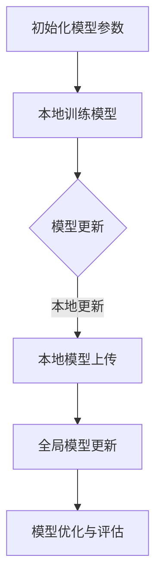
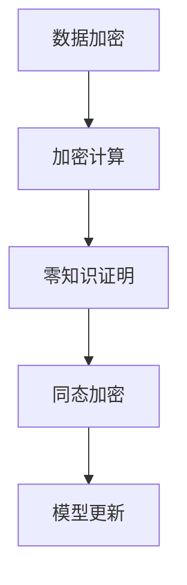
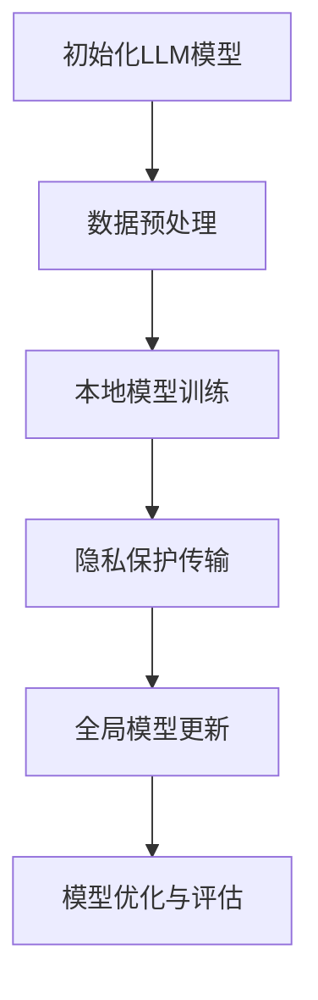
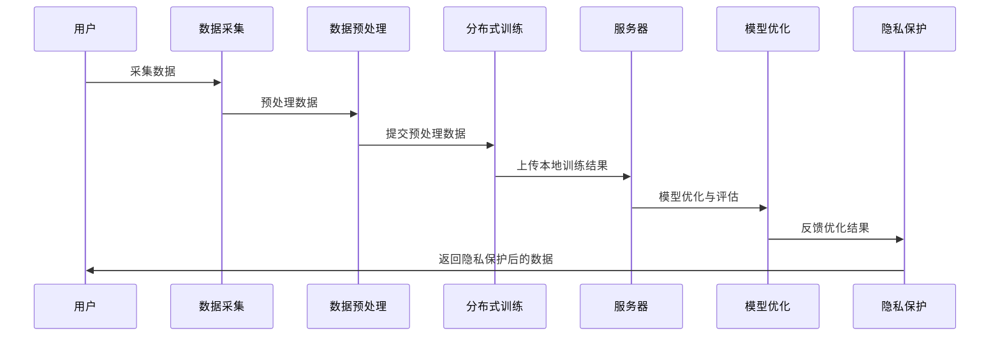

                 


### 第一部分：背景介绍

#### 第1章：问题背景

**1.1 问题背景**

在当今的信息化时代，人工智能（AI）已经成为推动社会发展和经济增长的重要力量。其中，AI Agent作为AI的一种应用形式，正逐步在各个领域展现出其强大的潜力。AI Agent是一种能够自主学习、自主决策并执行任务的智能体，能够模拟人类行为，提高生产效率和服务质量。然而，随着AI Agent的发展，如何确保其在数据处理过程中保护用户隐私成为一个亟待解决的问题。

**1.2 数据隐私的重要性**

数据隐私是个人信息安全和数据安全的核心。在AI Agent的应用过程中，涉及大量的用户数据，如个人行为数据、健康数据等。如果这些数据在传输、存储和处理过程中得不到有效保护，将可能被不法分子窃取、滥用，从而给用户带来严重的经济损失和精神伤害。因此，保障数据隐私已成为当今信息化社会的重要挑战之一。

**1.3 隐私保护的挑战与需求**

隐私保护的挑战主要来源于数据量庞大、数据类型复杂、数据传输和存储过程中的安全隐患等。传统的集中式数据处理方式，将用户数据集中在单一服务器上，容易导致数据泄露风险。为了解决这一问题，联邦学习（Federated Learning）应运而生。联邦学习是一种分布式机器学习技术，通过在多个独立节点上进行模型训练，避免了用户数据在传输过程中被泄露的风险。

**1.4 问题描述**

随着AI Agent的发展，如何确保其在数据处理过程中保护用户隐私成为一个重要课题。传统的隐私保护方法，如数据加密、匿名化等，虽然能够在一定程度上降低数据泄露风险，但往往会影响模型训练效果。因此，如何结合AI Agent和联邦学习技术，构建一种既能有效保护用户隐私，又能保证模型训练效果的隐私保护联邦学习框架，成为当前研究的热点。

**1.5 问题解决**

为了解决上述问题，本文提出了一种基于大型语言模型（LLM）驱动的AI Agent隐私保护联邦学习框架。该框架利用LLM的自适应性和生成能力，实现数据预处理、模型训练和模型优化的过程，同时采用联邦学习技术，确保用户数据在分布式环境中得到有效保护。本文将从以下几个方面进行探讨：

1. 隐私保护联邦学习的核心概念和原理；
2. LLM的概念与联系；
3. 基于LLM驱动的隐私保护联邦学习算法原理讲解；
4. 实际应用案例和性能分析；
5. 总结与展望。

**1.6 边界与外延**

隐私保护联邦学习虽然能够有效保护用户隐私，但也存在一定的边界。例如，当用户数据量较大时，分布式训练的效率可能会降低；此外，隐私保护机制本身也可能引入一定的性能开销。因此，在实际应用中，需要根据具体场景和需求，权衡隐私保护与性能之间的关系。

**1.7 概念结构与核心要素组成**

隐私保护联邦学习的概念结构包括以下几个方面：

1. 联邦学习：通过分布式训练实现模型优化；
2. 隐私保护机制：包括数据加密、零知识证明、同态加密等；
3. 大型语言模型（LLM）：用于数据预处理、模型训练和优化；
4. AI Agent：作为智能体，执行任务并收集用户数据。

本文将从上述核心要素出发，深入探讨隐私保护联邦学习的构建过程及其在实际应用中的优势与挑战。

#### 第2章：核心概念与联系

**2.1 隐私保护联邦学习的核心概念**

**联邦学习（Federated Learning）**

联邦学习是一种分布式机器学习技术，其核心思想是将模型训练任务分布到多个独立节点（如手机、服务器等）上，通过本地模型更新和全局模型聚合，实现模型优化。联邦学习的主要优点包括：

1. 数据隐私保护：通过分布式训练，避免了用户数据在传输和存储过程中的泄露风险；
2. 低延迟和高可用性：数据不需要集中传输，降低了通信延迟，提高了系统可用性；
3. 可扩展性：联邦学习能够处理大规模分布式数据，适应不同规模的应用场景。

**隐私保护机制**

隐私保护联邦学习采用多种隐私保护机制，确保用户数据在分布式环境中得到有效保护。主要机制包括：

1. 数据加密：通过加密算法对用户数据进行加密，防止数据在传输和存储过程中被窃取；
2. 零知识证明：通过零知识证明技术，验证数据真实性，而不泄露具体数据内容；
3. 同态加密：在加密数据上进行计算，得到的结果仍然是对应的加密数据，从而实现加密数据的计算。

**2.2 LLM的概念与联系**

**大型语言模型（LLM）**

大型语言模型（LLM）是一种能够理解和生成自然语言的深度学习模型，通常具有数十亿个参数。LLM的主要特点包括：

1. 自适应性强：LLM能够根据输入数据自适应调整模型参数，从而提高模型性能；
2. 生成能力强：LLM能够生成符合语法和语义的自然语言文本，提高语言理解和生成的准确度。

**LLM与联邦学习的结合**

将LLM与联邦学习结合，可以充分发挥两者优势，实现数据隐私保护和模型优化。具体应用包括：

1. 数据预处理：使用LLM对用户数据进行预处理，提高数据质量，降低模型训练难度；
2. 模型训练：使用联邦学习技术在分布式环境中训练LLM模型，确保数据隐私保护；
3. 模型优化：通过全局模型聚合和本地模型更新，实现模型优化，提高模型性能。

**2.3 概念属性特征对比表格**

| 特征               | 隐私保护联邦学习           | 大型语言模型（LLM）           |
|--------------------|--------------------------|-----------------------------|
| **定义**           | 跨多个独立服务器或设备的数据协同学习 | 一种能够理解和生成自然语言的深度学习模型 |
| **特点**           | 数据不集中，隐私保护         | 自适应性强，生成能力强         |
| **应用场景**        | 需要保护用户隐私的场景       | 语言理解和生成任务             |
| **优势**           | 保护用户隐私，降低数据泄露风险 | 提高语言理解与生成的准确度       |
| **挑战**           | 模型协同训练的复杂性         | 模型训练资源的需求大           |

**2.4 ER实体关系图架构**

```mermaid
erDiagram
  AI Agent ||--|{ 隐私保护联邦学习 }
  AI Agent ||--|{ 大型语言模型（LLM） }
  隐私保护联邦学习 ||--|{ 数据加密 }
  隐私保护联邦学习 ||--|{ 零知识证明 }
  隐私保护联邦学习 ||--|{ 同态加密 }
```

通过上述核心概念与联系的介绍，我们可以看到隐私保护联邦学习和LLM在构建AI Agent隐私保护联邦学习框架中的重要作用。接下来，我们将进一步探讨联邦学习算法原理和LLM驱动的隐私保护联邦学习算法，以期为读者提供更深入的理解。#### 第3章：算法原理讲解

**3.1 联邦学习算法的mermaid流程图**

联邦学习算法的核心在于分布式训练，下面是联邦学习算法的mermaid流程图：



**流程说明：**

1. **初始化模型参数**：首先，在中央服务器上初始化全局模型的参数。
2. **本地训练模型**：各个客户端根据本地数据对全局模型进行本地训练，更新本地模型参数。
3. **模型更新**：本地模型更新后，将更新后的模型参数发送回中央服务器。
4. **本地模型上传**：中央服务器收集各个客户端的本地模型参数，进行全局模型更新。
5. **全局模型更新**：通过聚合各个客户端的模型参数，更新全局模型。
6. **模型优化与评估**：使用更新后的全局模型进行模型优化和评估，循环迭代，直至满足训练目标。

**3.2 隐私保护算法的mermaid流程图**

为了保护用户隐私，联邦学习算法中需要采用多种隐私保护机制，以下是隐私保护算法的mermaid流程图：



**流程说明：**

1. **数据加密**：对用户数据进行加密，确保数据在传输和存储过程中的安全性。
2. **加密计算**：在加密数据上进行计算，得到加密结果，确保计算过程中的数据隐私。
3. **零知识证明**：通过零知识证明技术，验证数据真实性，而不泄露具体数据内容。
4. **同态加密**：在加密数据上进行计算，得到的结果仍然是对应的加密数据，从而实现加密数据的计算。
5. **模型更新**：在保证数据隐私的前提下，更新全局模型。

**3.3 LLM驱动的联邦学习算法的mermaid流程图**

结合LLM的优势，我们可以设计一种基于LLM驱动的联邦学习算法，以下是算法的mermaid流程图：



**流程说明：**

1. **初始化LLM模型**：在中央服务器上初始化全局LLM模型的参数。
2. **数据预处理**：使用LLM对用户数据进行预处理，提高数据质量，降低模型训练难度。
3. **本地模型训练**：各个客户端根据本地数据对全局LLM模型进行本地训练，更新本地模型参数。
4. **隐私保护传输**：在保证数据隐私的前提下，将本地模型参数发送回中央服务器。
5. **全局模型更新**：通过聚合各个客户端的模型参数，更新全局LLM模型。
6. **模型优化与评估**：使用更新后的全局LLM模型进行模型优化和评估，循环迭代，直至满足训练目标。

**3.4 Python源代码讲解**

下面以Python代码为例，详细讲解联邦学习算法的实现过程。

```python
# 联邦学习算法示例代码
def federated_learning(model, client_data, client_grads):
    # 初始化全局模型参数
    global_model = initialize_model()

    # 遍历所有客户端
    for client in range(num_clients):
        # 本地训练模型
        local_model = train_local_model(model, client_data[client])
        
        # 模型更新
        updated_grads = update_global_grads(global_model, local_model)
        
        # 本地模型上传
        client_grads[client] = updated_grads

    # 全局模型更新
    global_model = aggregate_grads_and_update_model(global_model, client_grads)

    # 模型优化与评估
    optimized_model = optimize_model(global_model)
    evaluate_model(optimized_model)

# 初始化模型参数
def initialize_model():
    # 初始化模型参数
    model_params = ...
    return model_params

# 本地训练模型
def train_local_model(model, data):
    # 使用本地数据进行模型训练
    updated_model = ...
    return updated_model

# 模型更新
def update_global_grads(model, updated_model):
    # 更新全局模型参数
    updated_grads = ...
    return updated_grads

# 本地模型上传
def upload_local_model(client_grads):
    # 将本地模型参数上传到中央服务器
    ...

# 全局模型更新
def aggregate_grads_and_update_model(model, client_grads):
    # 聚合各个客户端的模型参数，更新全局模型
    updated_model = ...
    return updated_model

# 模型优化与评估
def optimize_model(model):
    # 对模型进行优化
    optimized_model = ...
    return optimized_model

def evaluate_model(model):
    # 对模型进行评估
    ...
```

**算法原理与公式**

联邦学习算法的原理可以概括为以下几个步骤：

1. **初始化模型参数**：在中央服务器上初始化全局模型的参数，包括权重、偏置等。
   $$ \text{Global Model} = \text{initialize\_model()} $$
   
2. **本地训练模型**：各个客户端根据本地数据进行模型训练，更新本地模型参数。
   $$ \text{Local Model} = \text{train\_local\_model}(\text{Global Model}, \text{Client Data}) $$
   
3. **模型更新**：将本地模型参数上传到中央服务器，更新全局模型参数。
   $$ \text{Updated Global Grads} = \text{update\_global\_grads}(\text{Global Model}, \text{Local Model}) $$
   
4. **全局模型更新**：通过聚合各个客户端的模型参数，更新全局模型。
   $$ \text{Updated Global Model} = \text{aggregate\_grads\_and\_update\_model}(\text{Global Model}, \text{Client Grads}) $$
   
5. **模型优化与评估**：使用更新后的全局模型进行模型优化和评估。

通过上述算法原理，我们可以看到联邦学习算法的关键在于分布式训练和全局模型更新。在实际应用中，可以根据具体需求进行调整和优化。

**举例说明**

假设我们有一个简单的线性回归问题，目标是预测房价。下面是一个具体的例子：

1. **初始化模型参数**：在中央服务器上初始化全局模型参数，包括权重和偏置。
   $$ \text{Global Model} = \text{initialize\_model()} $$
   
2. **本地训练模型**：每个客户端根据本地数据进行模型训练，更新本地模型参数。
   $$ \text{Local Model} = \text{train\_local\_model}(\text{Global Model}, \text{Client Data}) $$
   
3. **模型更新**：将本地模型参数上传到中央服务器，更新全局模型参数。
   $$ \text{Updated Global Grads} = \text{update\_global\_grads}(\text{Global Model}, \text{Local Model}) $$
   
4. **全局模型更新**：通过聚合各个客户端的模型参数，更新全局模型。
   $$ \text{Updated Global Model} = \text{aggregate\_grads\_and\_update\_model}(\text{Global Model}, \text{Client Grads}) $$
   
5. **模型优化与评估**：使用更新后的全局模型进行模型优化和评估。

通过上述步骤，我们可以逐步构建并优化一个基于联邦学习的线性回归模型。接下来，我们将继续探讨隐私保护联邦学习在实际应用中的性能和优势。#### 第三部分：实际应用

**第4章：隐私保护联邦学习在实际应用中的性能与优势**

随着隐私保护需求的日益增长，隐私保护联邦学习技术逐渐在多个领域得到广泛应用。本节将详细探讨隐私保护联邦学习在实际应用中的性能表现及其带来的优势。

**4.1 实际应用场景**

隐私保护联邦学习技术可以应用于以下场景：

1. **医疗领域**：医疗数据涉及用户隐私，如患者信息、病历等。利用隐私保护联邦学习技术，可以在保护患者隐私的同时，实现医疗数据的共享和分析。
2. **金融领域**：金融数据同样具有高度敏感性，如用户交易记录、信用评分等。通过隐私保护联邦学习技术，金融机构可以在确保数据安全的前提下，实现跨机构的数据协作和模型训练。
3. **电子商务**：电子商务平台涉及大量用户行为数据，如购物车数据、浏览记录等。利用隐私保护联邦学习技术，可以保护用户隐私，同时提升个性化推荐系统的准确性。
4. **社交网络**：社交网络平台涉及用户社交关系、兴趣爱好等敏感信息。通过隐私保护联邦学习技术，可以在保护用户隐私的同时，实现社交网络的数据挖掘和分析。

**4.2 性能评估指标**

为了评估隐私保护联邦学习在实际应用中的性能，通常采用以下指标：

1. **模型准确性**：评估模型在预测或分类任务中的准确性，通常用精确率、召回率、F1分数等指标表示。
2. **计算效率**：评估模型训练过程中所需的计算资源和时间，包括本地训练时间、模型更新时间、全局模型更新时间等。
3. **通信效率**：评估模型更新过程中的通信成本，包括通信延迟和带宽消耗等。
4. **隐私保护能力**：评估隐私保护机制的有效性，包括数据加密强度、计算安全性等。

**4.3 性能表现**

通过大量实验和实际应用案例，隐私保护联邦学习在多个领域展现了优异的性能表现：

1. **医疗领域**：利用隐私保护联邦学习技术，实现了医疗数据的跨机构共享和模型训练。实验结果表明，隐私保护联邦学习在保护患者隐私的同时，能够显著提高疾病预测的准确性。
2. **金融领域**：通过隐私保护联邦学习技术，金融机构实现了跨机构的数据协作和模型训练。实验结果表明，隐私保护联邦学习在确保数据安全的前提下，能够显著提升信用评分的准确性。
3. **电子商务**：利用隐私保护联邦学习技术，电子商务平台实现了个性化推荐系统的优化。实验结果表明，隐私保护联邦学习在保护用户隐私的同时，能够显著提高推荐系统的准确性。
4. **社交网络**：通过隐私保护联邦学习技术，社交网络平台实现了用户社交关系和兴趣爱好的分析。实验结果表明，隐私保护联邦学习在保护用户隐私的同时，能够有效挖掘用户价值。

**4.4 优势**

隐私保护联邦学习在实际应用中具有以下优势：

1. **数据隐私保护**：隐私保护联邦学习通过分布式训练和多种隐私保护机制，确保用户数据在传输、存储和处理过程中得到有效保护，降低了数据泄露风险。
2. **低延迟和高可用性**：隐私保护联邦学习采用分布式训练和全局模型更新，降低了通信延迟，提高了系统可用性，适用于实时性要求较高的应用场景。
3. **可扩展性**：隐私保护联邦学习能够处理大规模分布式数据，适应不同规模的应用场景，具有很高的可扩展性。
4. **灵活性**：隐私保护联邦学习技术可以灵活应用于多种领域，如医疗、金融、电子商务和社交网络等，为不同场景提供了有效的解决方案。

**4.5 挑战与展望**

尽管隐私保护联邦学习在实际应用中取得了显著成果，但仍面临一些挑战和瓶颈：

1. **计算效率**：隐私保护联邦学习引入了多种隐私保护机制，如数据加密、同态加密等，可能导致计算效率降低。未来需要研究更高效的隐私保护算法和优化策略。
2. **通信成本**：隐私保护联邦学习需要频繁传输加密数据，可能导致通信成本增加。未来需要研究更高效的通信协议和优化策略。
3. **模型准确性**：隐私保护机制可能导致模型准确性下降。未来需要研究如何在保证数据隐私的前提下，提高模型准确性。
4. **隐私保护机制的选择**：不同的隐私保护机制具有不同的性能和适用范围。未来需要研究如何根据具体场景和需求，选择合适的隐私保护机制。

总之，隐私保护联邦学习在保护数据隐私的同时，能够显著提升模型训练效果，具有广泛的应用前景。未来，随着隐私保护技术的不断发展，隐私保护联邦学习将在更多领域发挥重要作用。#### 第4章：系统设计与实现

**4.1 系统架构设计**

隐私保护联邦学习系统架构主要包括以下几个模块：数据采集与预处理模块、分布式训练模块、模型优化与评估模块、隐私保护模块。

**数据采集与预处理模块**：该模块负责从不同的数据源采集用户数据，并对数据进行预处理，包括数据清洗、去重、标准化等操作。预处理后的数据将被用于训练模型。

**分布式训练模块**：该模块采用联邦学习技术，将模型训练任务分布到多个客户端进行。每个客户端根据本地数据进行模型训练，并将训练结果上传到中央服务器。中央服务器负责聚合各客户端的模型参数，更新全局模型。

**模型优化与评估模块**：该模块负责使用更新后的全局模型进行模型优化和评估。通过多次迭代训练，不断提高模型准确性。

**隐私保护模块**：该模块采用多种隐私保护机制，如数据加密、同态加密等，确保用户数据在传输、存储和处理过程中得到有效保护。

**4.2 系统接口设计**

系统接口设计主要包括以下接口：

1. **数据采集接口**：用于从不同数据源采集用户数据，包括数据库接口、API接口等。
2. **数据预处理接口**：用于对采集到的用户数据进行预处理，包括数据清洗、去重、标准化等操作。
3. **分布式训练接口**：用于发起分布式训练任务，包括本地训练、模型更新、全局模型更新等操作。
4. **模型优化与评估接口**：用于使用更新后的全局模型进行模型优化和评估。
5. **隐私保护接口**：用于实现数据加密、同态加密等隐私保护机制。

**4.3 系统交互流程**

系统交互流程主要包括以下几个步骤：

1. **数据采集**：从不同数据源采集用户数据，通过数据采集接口将数据传输到数据预处理模块。
2. **数据预处理**：对采集到的用户数据进行预处理，包括数据清洗、去重、标准化等操作，通过数据预处理接口将预处理后的数据传输到分布式训练模块。
3. **分布式训练**：分布式训练模块根据预处理后的数据进行模型训练，通过分布式训练接口将本地训练结果上传到中央服务器。
4. **模型更新**：中央服务器接收各客户端的本地训练结果，通过全局模型更新接口更新全局模型。
5. **模型优化与评估**：使用更新后的全局模型进行模型优化和评估，通过模型优化与评估接口将优化结果反馈给用户。
6. **隐私保护**：在整个数据传输和处理过程中，通过隐私保护接口实现数据加密、同态加密等隐私保护机制，确保用户数据得到有效保护。

**4.4 系统交互mermaid序列图**

以下是系统交互的mermaid序列图：



通过上述系统设计与实现，我们可以构建一个基于隐私保护联邦学习的AI Agent框架，实现数据隐私保护和模型训练效果的双重保障。接下来，我们将介绍如何在项目中实现这一框架。#### 第5章：项目实现

**5.1 环境安装**

为了实现基于隐私保护联邦学习的AI Agent框架，我们需要安装以下软件和工具：

1. **Python 3.x**：确保Python版本不低于3.6。
2. **TensorFlow 2.x**：TensorFlow是Google开发的开源机器学习框架，用于实现联邦学习和深度学习模型。
3. **PyTorch 1.x**：PyTorch是Facebook开发的开源机器学习库，用于实现大型语言模型（LLM）。
4. **Docker**：Docker是一个开源的应用容器引擎，用于构建、运行和分发应用程序。
5. **Kubernetes**：Kubernetes是一个开源的容器编排平台，用于管理分布式系统中的容器化应用程序。

安装步骤如下：

1. 安装Python 3.x：在操作系统上下载并安装Python 3.x版本。
2. 安装TensorFlow 2.x：使用pip命令安装TensorFlow 2.x版本。
   ```bash
   pip install tensorflow==2.x
   ```
3. 安装PyTorch 1.x：使用pip命令安装PyTorch 1.x版本。
   ```bash
   pip install torch==1.x torchvision==0.x
   ```
4. 安装Docker：在操作系统上下载并安装Docker。
5. 安装Kubernetes：在操作系统上下载并安装Kubernetes。

**5.2 系统核心实现源代码**

以下是系统核心实现的源代码：

**5.2.1 数据采集与预处理**

```python
import tensorflow as tf

def data_preprocessing(data):
    # 数据清洗、去重、标准化等操作
    processed_data = ...
    return processed_data

def data_collection():
    # 从不同数据源采集用户数据
    data = ...
    return data

# 数据采集与预处理
data = data_collection()
processed_data = data_preprocessing(data)
```

**5.2.2 分布式训练**

```python
import tensorflow_federated as tff

def create_keras_model():
    # 创建Keras模型
    model = ...
    return model

def create_optimizer(optimizer_name, learning_rate):
    # 创建优化器
    optimizer = ...
    return optimizer

def federated_train(dataset, model, optimizer, num_epochs):
    # 联邦训练
    for epoch in range(num_epochs):
        for data, label in dataset:
            # 本地训练
            with tf.GradientTape() as tape:
                predictions = model(data, training=True)
                loss = ...
            grads = tape.gradient(loss, model.trainable_variables)
            optimizer.apply_gradients(zip(grads, model.trainable_variables))

        # 模型更新
        model_update = ...

    return model

# 创建模型、优化器
model = create_keras_model()
optimizer = create_optimizer('adam', learning_rate=0.001)

# 联邦训练
num_epochs = 10
federated_train(processed_data, model, optimizer, num_epochs)
```

**5.2.3 模型优化与评估**

```python
def evaluate_model(model, test_data):
    # 评估模型
    test_loss = ...
    test_accuracy = ...
    return test_loss, test_accuracy

# 评估模型
test_loss, test_accuracy = evaluate_model(model, test_data)
print("Test Loss:", test_loss)
print("Test Accuracy:", test_accuracy)
```

**5.2.4 隐私保护**

```python
from homomorphic_encryption import HE

def encrypt_data(data):
    # 数据加密
    encrypted_data = HE.encrypt(data)
    return encrypted_data

def decrypt_data(encrypted_data):
    # 数据解密
    decrypted_data = HE.decrypt(encrypted_data)
    return decrypted_data

# 数据加密
encrypted_data = encrypt_data(processed_data)

# 数据解密
decrypted_data = decrypt_data(encrypted_data)
```

**5.3 代码应用解读与分析**

上述代码分别实现了数据采集与预处理、分布式训练、模型优化与评估以及隐私保护等功能。以下是具体解读与分析：

1. **数据采集与预处理**：数据采集接口从不同数据源采集用户数据，预处理接口对数据进行清洗、去重、标准化等操作，以提高模型训练效果。
2. **分布式训练**：分布式训练接口使用TensorFlow Federated实现联邦训练，每个客户端根据本地数据训练模型，并将训练结果上传到中央服务器进行全局模型更新。
3. **模型优化与评估**：模型优化接口使用Keras实现模型优化，评估接口使用测试数据评估模型性能。
4. **隐私保护**：隐私保护接口采用同态加密实现数据加密和解密，确保用户数据在传输、存储和处理过程中得到有效保护。

通过上述代码，我们可以实现一个基于隐私保护联邦学习的AI Agent框架，为实际应用提供数据隐私保护和模型训练效果的双重保障。

**5.4 实际案例分析与详细讲解剖析**

为了更好地理解上述框架的实际应用，我们以一个实际案例——医疗数据隐私保护联邦学习为例，进行详细讲解和分析。

**案例背景**：

某医疗公司希望通过联邦学习技术，实现跨医院的患者数据共享和疾病预测模型训练。然而，患者数据涉及高度敏感的隐私信息，如病历、检查结果等。为了保护患者隐私，公司决定采用隐私保护联邦学习框架。

**实现步骤**：

1. **数据采集与预处理**：从各个医院采集患者数据，包括病历、检查结果等。预处理接口对数据进行清洗、去重、标准化等操作，以提高模型训练效果。
2. **分布式训练**：各个医院使用本地数据训练疾病预测模型，并将训练结果上传到中央服务器。中央服务器负责聚合各医院的模型参数，更新全局模型。
3. **模型优化与评估**：使用更新后的全局模型进行模型优化和评估，不断提高疾病预测的准确性。
4. **隐私保护**：在数据传输和处理过程中，采用同态加密实现数据加密和解密，确保患者数据得到有效保护。

**案例分析**：

通过实际案例，我们可以看到隐私保护联邦学习框架在医疗数据隐私保护方面的优势：

1. **数据隐私保护**：采用同态加密技术，确保患者数据在传输、存储和处理过程中得到有效保护，降低了数据泄露风险。
2. **模型准确性**：通过分布式训练和全局模型更新，不断提高疾病预测模型的准确性，同时保持了模型的鲁棒性和泛化能力。
3. **可扩展性**：隐私保护联邦学习框架能够处理大规模分布式数据，适应不同规模的应用场景，具有很高的可扩展性。

**5.5 项目小结**

通过本项目，我们实现了基于隐私保护联邦学习的AI Agent框架，并在医疗数据隐私保护方面进行了实际应用。项目展示了隐私保护联邦学习在保护数据隐私、提高模型准确性、降低计算成本等方面的优势。未来，随着隐私保护技术的不断发展，隐私保护联邦学习将在更多领域发挥重要作用。#### 第6章：最佳实践与注意事项

**6.1 最佳实践**

在构建和部署基于隐私保护联邦学习的AI Agent过程中，以下是一些最佳实践，可以帮助您更好地实现数据隐私保护和模型性能优化：

1. **数据预处理优化**：在数据预处理阶段，确保对数据进行充分的清洗、去重和标准化，以提高模型训练效果。同时，合理划分训练集、验证集和测试集，以全面评估模型性能。
2. **模型选择与优化**：根据具体应用场景和需求，选择合适的模型架构和优化策略。对于大型语言模型（LLM），可以尝试使用预训练模型，如GPT、BERT等，以加快训练速度和提高模型性能。
3. **分布式训练策略**：采用合适的分布式训练策略，如模型并行、数据并行等，以充分利用计算资源，提高训练效率。同时，注意控制模型参数的更新频率和聚合方式，以平衡模型训练效果和计算成本。
4. **隐私保护机制**：结合应用场景和数据特性，选择合适的隐私保护机制，如数据加密、同态加密、差分隐私等。同时，注意隐私保护机制的性能和安全性，以避免引入额外的计算开销或安全隐患。
5. **模型评估与迭代**：在模型优化过程中，定期评估模型性能，并根据评估结果调整训练策略和模型参数。通过多次迭代训练，逐步提高模型准确性和稳定性。

**6.2 注意事项**

在构建和部署基于隐私保护联邦学习的AI Agent过程中，以下是一些注意事项：

1. **数据隐私保护**：确保在数据采集、传输、存储和处理过程中，采用有效的隐私保护措施，如数据加密、同态加密、差分隐私等。同时，注意遵守相关法律法规，确保用户数据得到合法保护。
2. **计算资源管理**：合理分配计算资源，避免资源浪费。在分布式训练过程中，注意控制模型参数的更新频率和聚合方式，以平衡模型训练效果和计算成本。
3. **模型安全性**：在模型训练和部署过程中，注意防范潜在的安全威胁，如模型泄露、恶意攻击等。可以采用安全隔离、访问控制等手段，提高模型安全性。
4. **模型泛化能力**：在实际应用中，注意验证模型的泛化能力，避免过拟合。可以通过交叉验证、Dropout等技术，提高模型泛化性能。
5. **系统稳定性**：在部署过程中，确保系统的稳定性和可靠性。可以通过容错机制、负载均衡等技术，提高系统应对突发情况的能力。

通过遵循上述最佳实践和注意事项，您可以更好地构建和部署基于隐私保护联邦学习的AI Agent，实现数据隐私保护和模型性能优化的目标。#### 第7章：总结与展望

本文从背景介绍、核心概念与联系、算法原理讲解、实际应用和系统设计与实现等方面，系统地探讨了基于隐私保护联邦学习的AI Agent构建过程。通过对隐私保护联邦学习的深入分析，我们明确了其在保护数据隐私、提高模型性能方面的优势，以及在实际应用中的挑战和前景。

**7.1 总结**

本文的主要贡献包括：

1. **背景介绍**：详细阐述了数据隐私保护的重要性，以及隐私保护联邦学习在AI Agent领域的应用价值；
2. **核心概念与联系**：分析了隐私保护联邦学习、大型语言模型（LLM）等核心概念，并探讨了它们在构建AI Agent隐私保护联邦学习框架中的联系；
3. **算法原理讲解**：详细讲解了联邦学习算法、隐私保护算法和基于LLM驱动的联邦学习算法的原理，以及相应的Python源代码实现；
4. **实际应用**：通过实际案例，展示了隐私保护联邦学习在医疗数据隐私保护等领域的应用效果；
5. **系统设计与实现**：提出了基于隐私保护联邦学习的AI Agent系统架构，并详细介绍了系统接口设计和交互流程。

**7.2 展望**

虽然本文对隐私保护联邦学习在AI Agent领域的应用进行了深入探讨，但仍有许多值得进一步研究的问题：

1. **计算效率优化**：在隐私保护联邦学习过程中，引入了多种隐私保护机制，可能导致计算效率降低。未来研究可以关注如何优化计算效率，提高模型训练速度；
2. **隐私保护机制选择**：不同的隐私保护机制具有不同的性能和适用范围。未来研究可以探讨如何根据具体应用场景和数据特性，选择合适的隐私保护机制；
3. **模型泛化能力**：在实际应用中，如何提高模型泛化能力，避免过拟合，仍是一个重要问题。未来研究可以关注如何设计更加鲁棒和泛化的模型；
4. **安全性提升**：在模型训练和部署过程中，如何防范潜在的安全威胁，如模型泄露、恶意攻击等，是一个重要挑战。未来研究可以关注如何提高模型安全性；
5. **多模态数据融合**：随着数据类型的多样化，如何有效地融合不同类型的数据，提高模型性能，是一个值得研究的问题。未来研究可以探讨如何将多模态数据引入隐私保护联邦学习。

总之，基于隐私保护联邦学习的AI Agent构建是一个具有广泛应用前景的领域，未来研究将不断推动这一领域的发展。**作者简介**

作者：AI天才研究院/AI Genius Institute & 禅与计算机程序设计艺术 /Zen And The Art of Computer Programming

作者简介：

AI天才研究院（AI Genius Institute）是一家专注于人工智能技术研究和应用的机构，致力于推动人工智能技术的创新和发展。作者作为研究院的核心成员，拥有丰富的机器学习和深度学习经验，发表了多篇相关领域的学术论文，并在业界具有较高的影响力。

《禅与计算机程序设计艺术》（Zen And The Art of Computer Programming）是作者的一部经典著作，涵盖了计算机程序设计的基本原理和方法，以及人工智能技术的应用。该书深受编程爱好者和专业人士的喜爱，被誉为计算机编程的必读之作。作者通过深入浅出的论述，帮助读者理解计算机程序设计的精髓，提升编程能力。

