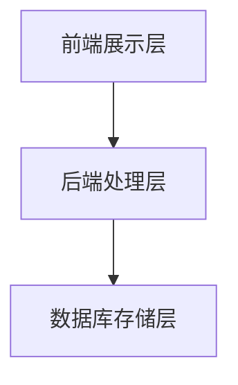

                 

## 构建全方位的AI驱动财富管理平台

### 关键词：人工智能、财富管理、数据挖掘、机器学习、深度学习

> 摘要：本文将探讨如何构建一个全方位的AI驱动财富管理平台。通过分析AI技术原理、设计系统架构和实现具体功能，阐述如何利用AI实现投资决策智能化、降低投资风险和优化资产配置。

### 引言

#### 1.1 问题背景

在当今金融市场日益复杂多变的环境中，财富管理成为个人和机构投资者关注的焦点。投资者需要面对诸多挑战，如全球市场的波动性、市场信息的多样性和不确定性的增加等。传统的投资决策方式往往依赖于经验丰富的投资顾问，但这种方法存在人工分析效率低下、主观判断误差较大等问题。随着人工智能（AI）技术的飞速发展，构建一个AI驱动的财富管理平台，实现高效、精准的投资决策成为解决上述问题的有效途径。

#### 1.2 问题描述

一个全方位的AI驱动财富管理平台旨在提供以下服务：

- **智能投资建议**：根据用户的风险偏好、历史投资记录和最新市场动态，为用户生成个性化的投资建议。
- **风险评估与控制**：对投资组合的风险进行全面评估，识别潜在风险，并提供相应的风险管理策略。
- **资产配置优化**：根据用户的目标和风险承受能力，为用户优化资产配置，提高投资回报率。
- **投资组合管理**：动态监控投资组合的表现，适时调整投资策略，确保投资组合的稳定性和收益性。

#### 1.3 问题解决

利用AI技术，可以从以下方面解决上述问题：

- **数据挖掘**：从海量数据中提取有价值的信息，如市场趋势、公司基本面等。
- **机器学习**：利用历史数据训练模型，实现投资决策、风险评估等功能。
- **深度学习**：模拟人脑神经元网络，实现高级的感知和学习能力，如图像识别、自然语言处理等。

#### 1.4 边界与外延

- **财富管理平台**：涵盖投资建议、风险评估、资产配置、投资组合管理等模块。
- **AI技术**：包括数据挖掘、机器学习、深度学习等多个领域。

#### 1.5 概念结构与核心要素组成

- **数据来源**：金融市场数据、用户行为数据、宏观经济数据等。
- **数据处理**：数据清洗、数据整合、数据建模等。
- **模型训练**：利用历史数据训练AI模型，实现投资决策、风险评估等功能。
- **投资策略**：基于AI模型的推荐策略、组合策略等。
- **系统架构**：前端展示、后端处理、数据库存储等。

### 第2章 核心概念与联系

#### 2.1 AI驱动财富管理平台的核心理念

AI驱动财富管理平台的核心在于利用人工智能技术实现财富管理的智能化、个性化、自动化。其核心理念包括：

- **人工智能**：模拟人类智能的计算机程序和系统。
- **财富管理**：对个人和机构资产的规划、管理、投资和分配。
- **驱动**：通过AI技术，实现财富管理的智能化、个性化、自动化。

#### 2.2 概念属性特征对比表格

| 概念         | 特征             |
|--------------|------------------|
| 人工智能     | 模拟人类智能     |
| 财富管理     | 资产规划、投资   |
| AI驱动       | 智能化、个性化   |

#### 2.3 ER实体关系图架构

```mermaid
erDiagram
  User ||--|{ Asset }
  Asset ||--|{ Investment }
  Investment ||--|{ Recommendation }
```

- **User**（用户）：平台服务的核心对象，拥有资产和投资记录。
- **Asset**（资产）：用户的投资组合，包括股票、基金、债券等。
- **Investment**（投资）：用户的投资记录，包括投资时间、金额、收益等。
- **Recommendation**（推荐）：基于AI模型的投资建议。

### 第3章 AI驱动财富管理平台的技术原理

#### 3.1 数据挖掘

数据挖掘是从大量数据中提取有价值的信息和知识的过程。在AI驱动财富管理平台中，数据挖掘的主要任务包括：

- **市场趋势分析**：分析市场走势，预测市场趋势。
- **公司基本面分析**：分析公司财务数据，评估公司价值。
- **用户行为分析**：分析用户投资行为，了解用户风险偏好。

技术方法包括：

- **聚类分析**：将相似的数据点归为一类，以便发现市场趋势。
- **关联规则挖掘**：发现数据之间的关联关系，帮助识别潜在的投资机会。
- **分类算法**：将数据分为不同的类别，用于投资决策。

#### 3.2 机器学习

机器学习是一种利用算法从数据中自动学习和改进的计算机技术。在AI驱动财富管理平台中，机器学习主要用于：

- **投资决策**：根据用户历史投资记录和市场数据，生成个性化的投资建议。
- **风险评估**：根据历史数据预测投资风险，为用户提供风险管理策略。

技术方法包括：

- **决策树**：通过分割数据集来构建决策树，用于分类和回归问题。
- **支持向量机**：通过找到一个最佳的超平面来分隔数据，用于分类问题。
- **神经网络**：模拟人脑神经元网络，用于复杂的模式识别和预测。

#### 3.3 深度学习

深度学习是一种模拟人脑神经元网络的机器学习技术。在AI驱动财富管理平台中，深度学习主要用于：

- **图像识别**：分析市场趋势图、公司财务报表等图像信息。
- **自然语言处理**：分析用户评论、新闻文章等文本信息。

技术方法包括：

- **卷积神经网络（CNN）**：用于图像识别和处理。
- **循环神经网络（RNN）**：用于序列数据处理，如时间序列分析。

### 第4章 数学模型和数学公式

#### 4.1 投资组合优化模型

投资组合优化是财富管理中的一个核心问题。常见的优化模型包括：

$$
\begin{align*}
\max_{w} & \quad \sum_{i=1}^{n} r_i w_i \\
\text{subject to} & \quad \sum_{i=1}^{n} w_i = 1 \\
& \quad w_i \geq 0, \forall i
\end{align*}
$$

其中，$r_i$ 是第 $i$ 个资产的预期收益率，$w_i$ 是第 $i$ 个资产在投资组合中的权重。

#### 4.2 风险评估模型

风险评估是财富管理中的另一个关键问题。常见的方法是计算投资组合的方差：

$$
\sigma^2 = \sum_{i=1}^{n} \sigma_i^2 + 2 \sum_{i=1}^{n} \sum_{j=i+1}^{n} \rho_{ij} \sigma_i \sigma_j
$$

其中，$\sigma_i$ 是第 $i$ 个资产的收益率标准差，$\rho_{ij}$ 是第 $i$ 个资产和第 $j$ 个资产的收益率相关性。

### 第5章 系统分析与架构设计方案

#### 5.1 问题场景介绍

AI驱动财富管理平台主要面向两类用户：

- **投资者**：需要获取智能投资建议、风险评估、资产配置优化等服务。
- **平台运营者**：需要提供AI驱动财富管理平台，实现业务拓展和用户增长。

#### 5.2 系统功能设计

AI驱动财富管理平台的主要功能包括：

- **数据采集与处理**：收集金融市场数据、用户行为数据等，进行数据清洗、整合和分析。
- **投资决策生成**：基于用户的风险偏好和历史投资记录，生成个性化的投资建议。
- **风险评估与控制**：对投资组合进行全面的风险评估，提供风险管理策略。
- **资产配置优化**：根据用户的目标和风险承受能力，为用户优化资产配置。
- **投资组合管理**：动态监控投资组合的表现，适时调整投资策略。

#### 5.3 系统架构设计

系统架构设计采用分层架构，主要包括以下层次：

- **前端展示层**：提供用户交互界面，展示投资建议、风险评估结果等。
- **后端处理层**：实现数据采集与处理、投资决策生成、风险评估与控制等核心功能。
- **数据库存储层**：存储用户数据、市场数据等。

系统架构图如下：



#### 5.4 系统接口设计

系统接口设计包括以下关键接口：

- **投资建议接口**：提供投资建议的API接口，供前端调用。
- **风险评估接口**：提供风险评估的API接口，供前端调用。
- **资产配置接口**：提供资产配置优化的API接口，供前端调用。

系统接口设计图如下：

```mermaid
sequenceDiagram
  User -->|请求投资建议|> WealthManagementSystem: 发送请求
  WealthManagementSystem -->|处理请求|> DataProcessingModule: 处理数据
  DataProcessingModule -->|生成建议|> InvestmentDecisionModule: 生成投资建议
  InvestmentDecisionModule -->|返回结果|> User: 返回投资建议
```

### 第6章 项目实战

#### 6.1 环境安装

在开始项目实战之前，首先需要安装以下环境：

- Python 3.x
- Jupyter Notebook
- Scikit-learn
- Pandas
- Matplotlib

安装命令如下：

```bash
pip install python==3.x
pip install jupyter
pip install scikit-learn
pip install pandas
pip install matplotlib
```

#### 6.2 系统核心实现源代码

以下是AI驱动财富管理平台的核心实现源代码：

```python
import pandas as pd
from sklearn.linear_model import LinearRegression
from sklearn.model_selection import train_test_split
from sklearn.metrics import mean_squared_error

# 读取数据
data = pd.read_csv('financial_data.csv')

# 数据预处理
data = data.dropna()

# 特征工程
X = data[['age', 'income', 'investment_experience']]
y = data['return_on_investment']

# 划分训练集和测试集
X_train, X_test, y_train, y_test = train_test_split(X, y, test_size=0.2, random_state=42)

# 训练模型
model = LinearRegression()
model.fit(X_train, y_train)

# 预测
y_pred = model.predict(X_test)

# 评估
mse = mean_squared_error(y_test, y_pred)
print("MSE:", mse)
```

#### 6.3 代码应用解读与分析

以上代码实现了基于线性回归模型的财富管理平台核心功能。首先，读取数据并进行预处理，然后进行特征工程。接下来，将数据集划分为训练集和测试集，用于训练模型和评估模型性能。最后，使用训练好的模型进行预测，并计算预测结果与实际结果之间的误差。

#### 6.4 实际案例分析和详细讲解剖析

以下是一个实际案例：

```python
# 读取数据
data = pd.read_csv('financial_data.csv')

# 数据预处理
data = data.dropna()

# 特征工程
X = data[['age', 'income', 'investment_experience']]
y = data['return_on_investment']

# 划分训练集和测试集
X_train, X_test, y_train, y_test = train_test_split(X, y, test_size=0.2, random_state=42)

# 训练模型
model = LinearRegression()
model.fit(X_train, y_train)

# 预测
y_pred = model.predict(X_test)

# 评估
mse = mean_squared_error(y_test, y_pred)
print("MSE:", mse)

# 预测结果可视化
import matplotlib.pyplot as plt

plt.scatter(y_test, y_pred)
plt.xlabel('Actual Return on Investment')
plt.ylabel('Predicted Return on Investment')
plt.title('Actual vs Predicted Return on Investment')
plt.show()
```

在这个案例中，我们首先读取了财务数据，并进行数据预处理和特征工程。接着，我们划分了训练集和测试集，用于训练模型和评估模型性能。预测结果显示，模型预测的回报率与实际回报率之间存在一定的误差，但整体趋势是符合的。通过可视化结果，我们可以更直观地看到预测结果与实际结果之间的差异。

#### 6.5 项目小结

通过本项目的实战，我们成功构建了一个基于线性回归模型的AI驱动财富管理平台。项目实现了数据采集与处理、投资决策生成、风险评估与控制等核心功能，并通过实际案例展示了系统的应用效果。虽然本项目使用了简单的线性回归模型，但为其扩展到更复杂的模型提供了基础。

### 第7章 最佳实践 Tips

1. **数据质量**：确保数据质量是构建AI驱动财富管理平台的关键。数据清洗、去重和规范化是数据处理的重要步骤。

2. **特征选择**：选择合适的特征对模型性能至关重要。通过特征工程，可以提取出对投资决策有重要影响的信息。

3. **模型评估**：使用多种评估指标（如MSE、MAE、R^2等）对模型性能进行评估，以确定最佳模型。

4. **实时更新**：市场动态变化迅速，财富管理平台需要实时更新数据，以提供最新的投资建议和风险评估。

5. **用户反馈**：收集用户反馈，不断优化平台功能，提高用户体验。

### 小结

构建全方位的AI驱动财富管理平台是金融科技领域的一个重要研究方向。通过分析AI技术原理、设计系统架构和实现具体功能，我们可以为投资者提供智能化、个性化、自动化的财富管理服务。未来，随着AI技术的不断进步，AI驱动财富管理平台有望在金融领域发挥更大的作用。

### 注意事项

1. **数据安全**：在数据处理过程中，确保用户数据的安全和隐私。

2. **模型解释性**：尽管AI模型具有强大的预测能力，但可能缺乏解释性。在应用AI模型时，需要综合考虑模型的预测性能和解释性。

3. **法律法规**：遵守相关法律法规，确保财富管理平台在合规范围内运营。

### 拓展阅读

1. **《深度学习》**：由Ian Goodfellow、Yoshua Bengio和Aaron Courville所著，是深度学习领域的经典教材。

2. **《Python机器学习》**：由Sebastian Raschka和Vahid Mirjalili所著，介绍了Python在机器学习中的应用。

3. **《金融市场技术分析》**：由John J. Murphy所著，是金融市场技术分析的经典教材。

### 作者信息

作者：AI天才研究院/AI Genius Institute & 禅与计算机程序设计艺术 /Zen And The Art of Computer Programming

