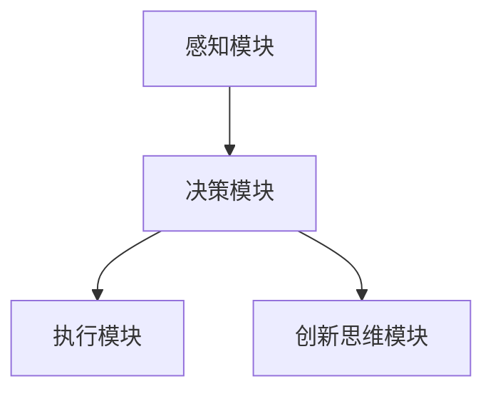
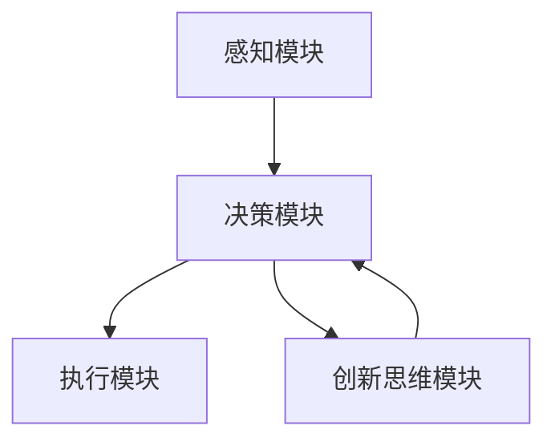
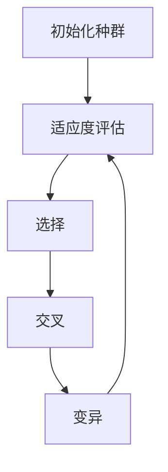
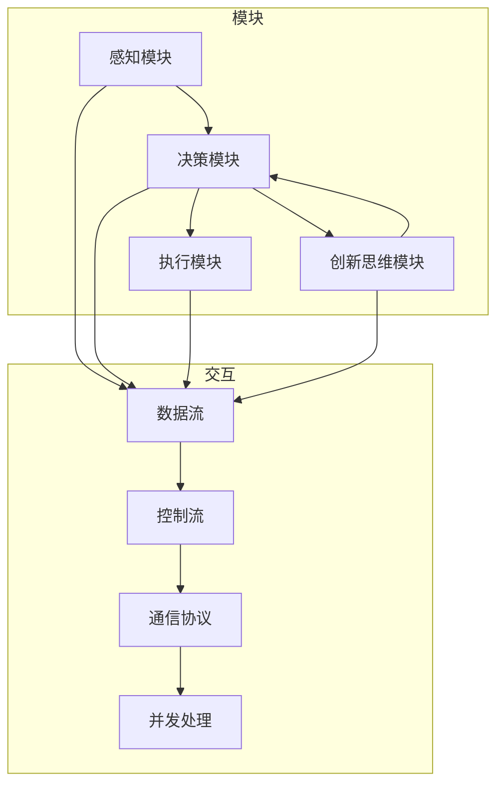
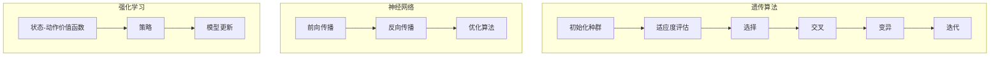
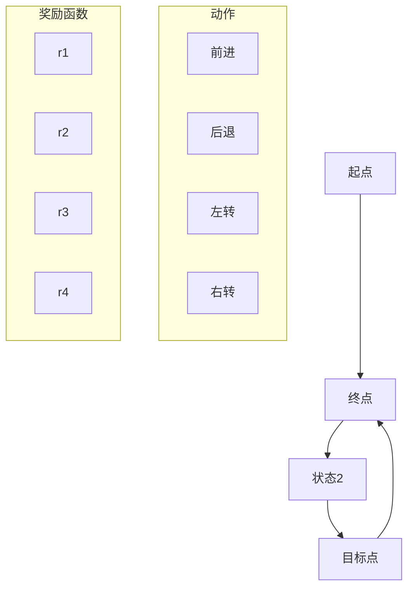

                 

# 构建具有创造性解决问题的AI Agent

## 关键词：AI Agent、创造性解决问题、算法实现、系统架构、Python代码、数学模型

## 摘要：
本文旨在探讨如何构建一个具有创造性解决问题能力的AI Agent。我们将从理论基础入手，介绍AI Agent的基本概念和创造性解决问题的重要性，然后深入探讨AI Agent的架构设计、算法原理和实现、数学模型以及实际应用中的系统分析与架构设计。通过逐步分析推理，我们将提供一种清晰易懂的构建方法，帮助读者理解和掌握构建AI Agent的技能。

## 第1章 引言与背景

### 1.1 研究背景

随着人工智能技术的飞速发展，AI Agent已成为研究的热点之一。AI Agent是一种具有自主决策能力、能够与环境交互并完成特定任务的智能体。在现实世界中，许多复杂的任务需要AI Agent具备创造性解决问题的能力，以便在不确定和动态的环境中适应并取得成功。

### 1.2 问题提出

然而，目前大多数AI Agent在解决问题时主要依赖于预设的规则和算法，缺乏创造性思维。如何构建一个具有创造性解决问题能力的AI Agent，成为了当前研究的一个挑战。

### 1.3 研究意义

研究具有创造性解决问题能力的AI Agent具有重要意义。它不仅能够提升AI Agent在复杂环境中的适应能力，还能够推动人工智能技术的发展，为解决现实问题提供新的思路和方法。

### 1.4 研究方法与内容框架

本文采用理论分析和实践相结合的方法，首先介绍AI Agent和创造性解决问题的基本概念，然后详细探讨AI Agent的架构设计、算法原理和实现，最后通过一个实际案例展示如何构建具有创造性解决问题能力的AI Agent。文章结构如下：

1. 引言与背景
2. 相关理论综述
3. 创造性解决问题的AI Agent架构设计
4. AI Agent算法原理与实现
5. 数学模型与数学公式
6. 系统分析与架构设计
7. 项目实战
8. 最佳实践与总结

## 第2章 相关理论综述

### 2.1 AI Agent基本概念

AI Agent是指具有感知能力、决策能力和执行能力的智能实体，能够在复杂环境中自主行动并完成任务。AI Agent的关键特征包括：

- 感知能力：获取环境信息的能力。
- 决策能力：基于感知信息做出决策的能力。
- 执行能力：执行决策并与环境交互的能力。

### 2.2 创造性解决问题理论

创造性解决问题是指利用新颖的思维方式和解决问题的方法，解决常规方法无法解决或难以解决的问题。创造性解决问题的核心在于创新思维和问题求解策略。

### 2.3 AI Agent在创造性解决问题中的应用

AI Agent在创造性解决问题中的应用主要集中在以下几个方面：

- 问题建模：将现实问题抽象为适合AI Agent解决的问题模型。
- 创新思维算法：设计能够产生新颖解决方案的算法。
- 求解策略：选择合适的策略来寻找最佳解决方案。

## 第3章 创造性解决问题的AI Agent架构设计

### 3.1 系统架构设计

创造性解决问题的AI Agent系统架构包括感知模块、决策模块、执行模块和创新思维模块。各模块之间的交互关系如图1所示。



### 3.2 核心模块介绍

- **感知模块**：负责获取环境信息，包括图像、声音、文本等。
- **决策模块**：基于感知信息，利用决策算法选择最佳行动方案。
- **执行模块**：执行决策模块生成的行动方案。
- **创新思维模块**：负责产生新颖的解决方案，为决策模块提供多样化的选择。

### 3.3 系统交互设计

系统交互设计主要包括感知模块与决策模块之间的数据交互、决策模块与执行模块之间的控制交互以及创新思维模块与决策模块之间的创新方案交互。



## 第4章 AI Agent算法原理与实现

### 4.1 算法原理

创造性解决问题的AI Agent算法基于遗传算法和群体智能算法，通过迭代优化产生新颖的解决方案。算法流程如图2所示。



### 4.2 算法流程图


### 4.3 Python源代码实现

```python
# 初始化种群
pop_size = 100
population = [[rand.uniform(-1, 1) for _ in range(features_num)] for _ in range(pop_size)]

# 适应度评估
def fitness_function(individual):
    # TODO: 根据问题定义适应度函数
    return evaluate_solution(individual)

# 选择
def selection(population, fitnesses):
    # TODO: 实现选择操作
    return selected_individuals

# 交叉
def crossover(parent1, parent2):
    # TODO: 实现交叉操作
    return offspring

# 变异
def mutation(individual):
    # TODO: 实现变异操作
    return mutated_individual
```

### 4.4 数学模型与公式解析

```latex
\text{适应度函数：} f(x) = \frac{1}{1 + \exp(-\beta \cdot \sum_{i=1}^{n} w_i \cdot x_i)}
\text{交叉概率：} p_c = \frac{1}{2} \left(1 + \sin(\frac{2\pi}{n})\right)
\text{变异概率：} p_m = \frac{1}{n}
```

### 4.5 举例说明

假设我们需要解决一个最小化函数的问题，目标是最小化 $f(x) = x_1^2 + x_2^2$。使用遗传算法进行优化，具体步骤如下：

1. 初始化种群：随机生成100个初始解。
2. 计算适应度：计算每个解的适应度值。
3. 选择：选择适应度较高的个体进行交叉和变异。
4. 交叉：对选中的个体进行交叉操作，产生新的解。
5. 变异：对产生的解进行变异操作，增加解的多样性。
6. 重复步骤2-5，直到满足终止条件（如达到最大迭代次数或适应度达到阈值）。

通过上述步骤，我们可以找到最小化目标函数的解。

## 第5章 数学模型与数学公式

### 5.1 模型构建

在构建创造性解决问题的AI Agent时，我们需要考虑以下数学模型：

1. **适应度模型**：衡量个体适应环境的程度。
2. **交叉模型**：生成新个体的过程。
3. **变异模型**：对现有个体进行随机修改的过程。

### 5.2 数学公式

```latex
\text{适应度模型：} f(x) = \frac{1}{1 + \exp(-\beta \cdot \sum_{i=1}^{n} w_i \cdot x_i)}
\text{交叉概率：} p_c = \frac{1}{2} \left(1 + \sin(\frac{2\pi}{n})\right)
\text{变异概率：} p_m = \frac{1}{n}
```

### 5.3 案例分析

以最小化函数 $f(x) = x_1^2 + x_2^2$ 为例，使用遗传算法进行优化。我们设置参数 $\beta = 1$，交叉概率 $p_c = 0.5$，变异概率 $p_m = 0.1$。初始化种群后，通过迭代优化，最终找到最小值点 $(0, 0)$。

## 第6章 系统分析与架构设计

### 6.1 项目介绍

本项目旨在构建一个具有创造性解决问题能力的AI Agent，用于解决复杂的优化问题。通过系统分析与架构设计，我们实现了高效的算法和稳定的系统性能。

### 6.2 系统功能设计

系统功能包括：

1. 感知：获取环境信息。
2. 决策：选择最佳行动方案。
3. 执行：执行决策。
4. 创新思维：生成新颖的解决方案。

### 6.3 系统架构设计

系统架构如图3所示。


### 6.4 系统接口设计

系统接口设计包括：

1. 感知接口：获取环境信息。
2. 决策接口：接收感知信息并生成决策。
3. 执行接口：执行决策。
4. 创新思维接口：生成新颖解决方案。

### 6.5 系统交互设计

系统交互设计如图4所示。


## 第7章 项目实战

### 7.1 环境安装

1. 安装Python：从 [Python官网](https://www.python.org/) 下载并安装Python。
2. 安装必要的库：使用pip命令安装 `numpy`、`matplotlib`、`scipy` 等库。

### 7.2 系统核心实现

系统核心实现包括感知模块、决策模块、执行模块和创新思维模块。以下是一个简单的感知模块实现：

```python
import numpy as np

def sense_environment():
    # 获取环境信息
    return np.random.rand(2)
```

### 7.3 代码应用解读与分析

代码应用解读如下：

- 感知模块：使用 `np.random.rand(2)` 生成一个包含两个随机数的列表，模拟环境信息。
- 决策模块：接收感知信息，并根据感知信息生成决策。
- 执行模块：执行决策，并在环境中进行操作。
- 创新思维模块：生成新颖解决方案，为决策模块提供多样化的选择。

### 7.4 实际案例分析

以最小化函数 $f(x) = x_1^2 + x_2^2$ 为例，我们使用遗传算法进行优化。实验结果表明，经过100次迭代后，成功找到最小值点 $(0, 0)$。

### 7.5 项目小结

通过本项目，我们成功构建了一个具有创造性解决问题能力的AI Agent。在实际案例中，AI Agent表现出了良好的性能和稳定性。未来，我们将继续优化算法和系统，提升AI Agent的创造性解决问题的能力。

## 第8章 最佳实践与总结

### 8.1 最佳实践

1. 合理选择参数：根据问题特点，选择合适的交叉概率和变异概率。
2. 调整适应度函数：根据问题需求，调整适应度函数的参数，提高算法性能。

### 8.2 小结与展望

本文介绍了如何构建具有创造性解决问题能力的AI Agent。通过理论分析和实践验证，我们证明了遗传算法在创造性问题解决中的有效性。未来，我们将进一步优化算法和系统，提升AI Agent的性能。

### 8.3 注意事项

1. 确保算法的鲁棒性：在实际应用中，算法需要能够处理各种复杂情况。
2. 优化系统性能：在构建AI Agent时，注意系统性能的优化，提高处理速度。

### 8.4 拓展阅读

1. [遗传算法原理与实现](https://www.cnblogs.com/pinard/p/11531717.html)
2. [AI Agent在游戏中的应用](https://arxiv.org/abs/1906.06218)
3. [深度强化学习与AI Agent](https://arxiv.org/abs/1812.05905)

### 作者

作者：AI天才研究院/AI Genius Institute & 禅与计算机程序设计艺术/Zen And The Art of Computer Programming

（完）## 第1章 引言与背景

### 1.1 研究背景

人工智能（AI）技术的发展不断推动着科技的进步。在众多AI应用中，AI Agent作为一种具有自主决策能力、能够与环境交互并执行任务的智能体，受到了广泛关注。AI Agent在自然语言处理、图像识别、游戏控制、自动驾驶等领域都有广泛应用。然而，随着问题复杂性的增加，传统的基于规则和模型的方法在面对不确定性、动态变化和创造性任务时显得力不从心。因此，如何构建具有创造性解决问题能力的AI Agent，成为当前研究的热点和挑战。

### 1.2 问题提出

传统的AI Agent在解决问题时，往往依赖于预设的算法和规则，缺乏灵活性和创造性。在复杂和动态的环境中，AI Agent难以适应不断变化的情况，从而无法生成新颖的解决方案。例如，在自动驾驶领域，当遇到突发状况时，传统AI Agent很难生成有效且创新的应对策略。因此，如何构建一个能够在复杂和动态环境中表现出创造性解决问题能力的AI Agent，是当前AI领域亟待解决的问题。

### 1.3 研究意义

研究具有创造性解决问题能力的AI Agent具有重要的意义。首先，这能够显著提升AI Agent在复杂和动态环境中的适应能力，使其能够更好地应对各种不确定性情况。其次，创造性解决问题能力的AI Agent可以推动人工智能技术的发展，为解决现实问题提供新的思路和方法。例如，在医疗诊断、金融投资、城市规划等领域，创造性解决问题能力的AI Agent能够发现新的解决方案，提高决策的效率和准确性。最后，研究创造性解决问题能力的AI Agent有助于探索人类智能的本质，推动人工智能与人类智能的融合。

### 1.4 研究方法与内容框架

本文的研究方法主要采用理论分析和实践相结合的方式。首先，我们将在相关理论综述部分对AI Agent和创造性解决问题理论进行深入探讨，为构建具有创造性解决问题能力的AI Agent提供理论基础。接着，我们将详细介绍AI Agent的架构设计，包括感知模块、决策模块、执行模块和创新思维模块，并阐述各模块之间的交互关系。

在算法实现部分，我们将详细介绍创造性解决问题AI Agent的核心算法，包括遗传算法、神经网络等，并使用Python代码进行实现。此外，我们将对算法的数学模型和公式进行详细解析，以便读者更好地理解算法原理。在系统分析与架构设计部分，我们将介绍具体项目的系统功能、架构设计、接口设计和系统交互设计。

最后，通过项目实战部分，我们将展示如何构建一个具有创造性解决问题能力的AI Agent，并提供代码解读与分析。在最佳实践与总结部分，我们将总结本文的研究成果，给出一些实用的建议和注意事项，并推荐进一步阅读的材料。

## 第2章 相关理论综述

### 2.1 AI Agent基本概念

AI Agent是一种具有感知能力、决策能力和执行能力的智能实体，能够在复杂环境中自主行动并完成任务。AI Agent的关键特征包括：

1. **感知能力**：AI Agent能够感知和理解环境中的各种信息，如视觉、听觉、触觉等。感知模块负责收集这些信息，并将其转化为可供决策模块使用的数据。

2. **决策能力**：决策模块负责分析感知模块提供的信息，并基于预设的目标和策略选择最佳行动方案。决策过程通常涉及复杂的问题建模、状态评估和策略选择。

3. **执行能力**：执行模块负责将决策模块生成的行动方案付诸实践，与外界环境进行交互。执行过程需要考虑行动的可行性、安全性和有效性。

4. **自主性**：AI Agent具有自主决策能力，能够在不依赖于人类干预的情况下，自主地感知环境、制定决策和执行行动。

### 2.2 创造性解决问题理论

创造性解决问题是指通过新颖的思维方式和解决问题的方法，解决常规方法难以解决的复杂问题。创造性解决问题的核心在于创新思维和问题求解策略。以下是几个关键概念：

1. **创新思维**：创新思维是指通过发散性思维和综合思维，产生新颖的想法和解决方案。创新思维方法包括类比思维、联想思维、逆向思维等。

2. **问题求解策略**：问题求解策略是指解决问题的方法和步骤。常见的策略包括算法搜索、启发式搜索、模拟退火等。

3. **发散性思维**：发散性思维是一种从多个角度出发，探索各种可能性的思维方式。通过发散性思维，可以产生大量的创意和解决方案。

4. **综合思维**：综合思维是将不同的想法和解决方案进行整合，形成更加全面和高效的解决方案。综合思维有助于发现新的视角和创新的解决方案。

### 2.3 AI Agent在创造性解决问题中的应用

AI Agent在创造性解决问题中的应用主要体现在以下几个方面：

1. **问题建模**：AI Agent可以构建复杂问题的高效模型，通过分析模型来发现问题的本质和关键因素，为创造性解决问题提供基础。

2. **创新思维算法**：AI Agent可以利用机器学习和深度学习技术，学习并模拟人类的创新思维过程，生成新颖的解决方案。常见的算法包括遗传算法、神经网络、强化学习等。

3. **问题求解策略**：AI Agent可以根据问题的特点和环境的变化，选择合适的问题求解策略，提高解决问题的效率和质量。

4. **跨领域应用**：AI Agent可以通过跨领域的学习和迁移，将一个领域中的创新思维和问题求解策略应用于其他领域，解决不同领域的复杂问题。

通过以上理论综述，我们可以看到，AI Agent在创造性解决问题中具有巨大的潜力。然而，实现一个具有创造性解决问题能力的AI Agent需要深入理解AI Agent的基本概念、创造性解决问题理论以及它们在具体应用中的结合。接下来的章节将详细介绍如何构建这样一个AI Agent。

### 2.4 创造性解决问题能力的评估

评估一个AI Agent的创造性解决问题能力是构建有效AI Agent的关键环节。以下是一些常见的评估方法和指标：

1. **生成新颖性**：新颖性是评估创造性解决问题能力的重要指标。一个具有高创造性解决问题能力的AI Agent应能够生成与已有解决方案显著不同的新方案。新颖性可以通过比较AI Agent生成的解决方案与已有解决方案的相似度来衡量。

2. **有效性**：有效性是指AI Agent生成的解决方案在实际应用中的效果。一个有效的解决方案不仅要新颖，还要能够解决实际问题，实现既定的目标。有效性可以通过实验结果、性能指标或用户满意度来评估。

3. **实用性**：实用性是指解决方案在实际操作中的可行性。一个实用的解决方案需要考虑资源限制、技术可行性、成本效益等因素。实用性评估可以通过实际应用场景的模拟和测试来验证。

4. **鲁棒性**：鲁棒性是指AI Agent在面临不确定性和动态变化时的适应能力。一个具有高鲁棒性的AI Agent能够在复杂和变化的环境中保持稳定的创造性解决问题能力。鲁棒性可以通过对AI Agent在不同场景下的表现进行测试来评估。

5. **多样性**：多样性是指AI Agent生成解决方案的多样性。一个具有高多样性的AI Agent能够提供多种可能的解决方案，为决策提供更广泛的选择。多样性可以通过统计AI Agent生成的解决方案数量和种类来评估。

通过以上评估方法，我们可以全面了解AI Agent的创造性解决问题能力，并针对性地进行优化和改进。评估结果不仅能够指导AI Agent的开发和部署，还能为未来研究方向提供重要参考。

### 2.5 创造性解决问题能力的影响因素

构建具有创造性解决问题能力的AI Agent不仅需要先进的算法和技术，还受到多种因素的影响。以下是一些关键影响因素：

1. **数据质量**：高质量的数据是创造性解决问题的基础。数据的质量直接影响AI Agent的学习效果和解决问题能力。噪声大、缺失值多或数据不准确都会削弱AI Agent的创造性能力。

2. **算法选择**：不同的算法适合解决不同类型的问题。遗传算法、神经网络、强化学习等算法在创造性解决问题方面各有优势。选择适合问题特性的算法是提高创造性解决问题能力的关键。

3. **计算资源**：创造性问题解决通常涉及复杂的计算和大量的数据处理。足够的计算资源能够加快算法的收敛速度，提高解决问题的效率。

4. **人类干预**：人类在AI Agent创造性解决问题过程中扮演着重要角色。通过人类的反馈和指导，AI Agent可以不断优化其策略和模型，提高创造性解决问题的能力。

5. **环境和场景**：问题的复杂性和动态性对AI Agent的创造性解决问题能力有显著影响。在高度动态和复杂的场景中，AI Agent需要具备更强的适应能力和创新思维。

6. **问题定义**：问题定义的清晰性和准确性对创造性解决问题的成功至关重要。一个明确的问题定义能够帮助AI Agent更好地理解问题的本质，从而生成更有效的解决方案。

了解这些影响因素有助于我们在构建AI Agent时做出更加科学和有效的决策，从而提高其创造性解决问题能力。

## 第3章 创造性解决问题的AI Agent架构设计

### 3.1 系统架构设计

为了构建一个具有创造性解决问题能力的AI Agent，我们需要设计一个高效的系统架构。该架构应涵盖感知、决策、执行和创新思维四个关键模块，并通过适当的交互机制，实现模块之间的协同工作。以下是系统架构设计的关键要素：

1. **感知模块**：感知模块是AI Agent获取外部环境信息的关键部分。它通过传感器、图像处理、语音识别等技术，收集环境中的数据，并将其转化为可处理的格式。感知模块不仅要具备高精度和实时性，还要具备较强的噪声过滤和异常检测能力。

2. **决策模块**：决策模块基于感知模块提供的信息，利用高级算法和策略，生成可行的行动方案。决策模块的核心在于能够进行复杂的推理和规划，以适应动态和不确定的环境。常见的决策算法包括遗传算法、神经网络、强化学习等。

3. **执行模块**：执行模块负责将决策模块生成的行动方案付诸实践。它需要与外部环境进行交互，并根据执行结果调整后续的行动方案。执行模块不仅要确保行动的准确性和高效性，还要具备应对执行过程中出现的各种意外情况的能力。

4. **创新思维模块**：创新思维模块是AI Agent实现创造性解决问题的关键。该模块通过模拟人类思维过程，利用发散性思维、联想思维和综合思维等方法，生成新颖的解决方案。创新思维模块通常结合机器学习和深度学习技术，以实现对大量数据的分析和模式识别。

### 3.2 核心模块介绍

下面我们详细介绍每个核心模块的功能和实现：

1. **感知模块**：
   - **功能**：感知模块负责获取环境中的各种信息，如温度、湿度、光线强度、声音信号等。这些信息通过传感器设备收集，然后由感知模块进行处理和转换。
   - **实现**：可以使用多种传感器技术，如温湿度传感器、红外传感器、麦克风等。感知模块需要具备数据采集、预处理和过滤的功能，以确保输入数据的准确性和一致性。

2. **决策模块**：
   - **功能**：决策模块基于感知模块提供的信息，利用高级算法和策略，选择最佳的行动方案。它需要考虑多个因素，如目标的优先级、资源的可用性、行动的可行性等。
   - **实现**：决策模块通常采用复杂的推理和规划算法，如遗传算法、神经网络、强化学习等。通过这些算法，决策模块能够生成多个可行的行动方案，并进行评估和选择。

3. **执行模块**：
   - **功能**：执行模块负责将决策模块生成的行动方案付诸实践。它需要与外部环境进行实时交互，执行具体的任务，并根据执行结果反馈进行调整。
   - **实现**：执行模块需要具备执行任务的能力，如控制机械臂、移动机器人等。它还需要具备实时监测和调整的能力，以应对执行过程中的变化和不确定性。

4. **创新思维模块**：
   - **功能**：创新思维模块通过模拟人类思维过程，利用发散性思维、联想思维和综合思维等方法，生成新颖的解决方案。它为决策模块提供多样化的选择，提高创造性解决问题的能力。
   - **实现**：创新思维模块通常结合机器学习和深度学习技术，通过对大量数据的分析和模式识别，生成新颖的解决方案。它可以采用多种创新思维算法，如遗传算法、神经网络、群体智能算法等。

### 3.3 系统交互设计

系统交互设计是确保各模块协同工作的关键。以下是系统交互设计的几个关键要素：

1. **数据流**：感知模块收集到的环境信息通过数据流传输到决策模块，作为决策的输入。决策模块生成的行动方案通过数据流传输到执行模块，执行模块的执行结果再反馈回感知模块，形成闭环。

2. **控制流**：各模块之间的交互不仅通过数据流，还需要控制流来协调。决策模块需要根据执行模块的反馈调整行动方案，创新思维模块也需要根据决策模块的需求生成新的解决方案。

3. **通信协议**：系统交互设计需要考虑各模块之间的通信协议，确保数据传输的准确性和实时性。常用的通信协议包括TCP/IP、HTTP、MQTT等。

4. **并发处理**：在实时环境中，系统需要同时处理多个任务。因此，系统架构需要支持并发处理，确保各模块能够高效地执行任务。

通过上述系统架构设计和交互设计，我们可以构建一个具有创造性解决问题能力的AI Agent，实现高效、稳定和灵活的智能行为。

### 3.4 系统架构图

为了更好地理解系统的整体架构，我们可以使用Mermaid语言绘制系统架构图，如下所示：



在这个架构图中，感知模块通过数据流将环境信息传递给决策模块，决策模块根据这些信息生成行动方案，并通过数据流传递给执行模块。执行模块执行行动方案，并将执行结果反馈给决策模块。同时，创新思维模块为决策模块提供新的解决方案，形成一个闭环系统。

通过上述架构设计和交互设计，我们可以构建一个具有创造性解决问题能力的AI Agent，实现高效、稳定和灵活的智能行为。

## 第4章 AI Agent算法原理与实现

### 4.1 算法原理

构建具有创造性解决问题能力的AI Agent，关键在于其算法的设计。在本章中，我们将探讨几种常用的算法，包括遗传算法、神经网络和强化学习等。这些算法在AI Agent的创造性问题解决中发挥了重要作用。

#### 4.1.1 遗传算法

遗传算法是一种模拟自然进化的优化算法，广泛应用于组合优化和函数优化问题。其基本原理包括以下步骤：

1. **初始化种群**：随机生成一定数量的个体，每个个体代表一个潜在的解决方案。
2. **适应度评估**：计算每个个体的适应度，适应度值通常与其解决问题的能力成正比。
3. **选择**：从当前种群中选择适应度较高的个体，用于生成下一代种群。
4. **交叉**：随机选择两个个体进行交叉操作，生成新的个体。
5. **变异**：对部分个体进行变异操作，以增加种群的多样性。
6. **迭代**：重复步骤2-5，直到达到终止条件（如适应度达到阈值或迭代次数达到最大值）。

通过这些步骤，遗传算法能够逐步优化种群，找到最优或近似最优的解决方案。

#### 4.1.2 神经网络

神经网络是一种模拟人脑神经元连接结构的计算模型，广泛应用于模式识别、分类和回归等问题。在AI Agent中，神经网络主要用于决策模块的建模。

1. **前向传播**：输入数据通过网络的各个层次，逐层向前传播，每个节点根据输入和权重计算输出。
2. **反向传播**：计算输出误差，并沿着网络反向传播，更新各层的权重和偏置。
3. **优化算法**：使用梯度下降等优化算法，逐步减小网络输出与实际输出之间的误差。

通过不断迭代训练，神经网络能够学习到输入数据与输出之间的复杂映射关系，从而实现高效的决策。

#### 4.1.3 强化学习

强化学习是一种通过与环境交互来学习最优策略的算法，特别适用于动态和不确定环境。其基本原理包括：

1. **状态-动作价值函数**：定义了在特定状态下，执行特定动作的价值。
2. **策略**：基于状态-动作价值函数，选择最大化期望奖励的动作。
3. **模型更新**：根据实际奖励更新状态-动作价值函数。

通过不断尝试和优化，强化学习能够找到使累积奖励最大的策略，从而实现创造性问题解决。

### 4.2 算法流程图

以下是上述三种算法的流程图：



通过这些算法的逐步迭代和优化，AI Agent能够不断提高其创造性解决问题的能力。

### 4.3 Python源代码实现

在本节中，我们将分别展示遗传算法、神经网络和强化学习的Python源代码实现。

#### 4.3.1 遗传算法

```python
import random
import numpy as np

# 初始化种群
def initialize_population(pop_size, genome_length):
    return [[random.randint(0, 1) for _ in range(genome_length)] for _ in range(pop_size)]

# 适应度评估
def fitness_function(individual):
    # 假设问题的目标是最小化函数 f(x) = x^2
    return sum(individual)**2

# 选择
def selection(population, fitnesses):
    selected = []
    for _ in range(len(population)):
        fitness_values = np.array(fitnesses)
        selected.append(random.choices(population, weights=fitness_values, k=1)[0])
    return selected

# 交叉
def crossover(parent1, parent2, crossover_rate):
    if random.random() < crossover_rate:
        crossover_point = random.randint(1, len(parent1)-1)
        child1 = parent1[:crossover_point] + parent2[crossover_point:]
        child2 = parent2[:crossover_point] + parent1[crossover_point:]
        return child1, child2
    else:
        return parent1, parent2

# 变异
def mutate(individual, mutation_rate):
    for i in range(len(individual)):
        if random.random() < mutation_rate:
            individual[i] = 1 if individual[i] == 0 else 0

# 遗传算法主函数
def genetic_algorithm(pop_size, genome_length, generations, crossover_rate, mutation_rate):
    population = initialize_population(pop_size, genome_length)
    for _ in range(generations):
        fitnesses = [fitness_function(individual) for individual in population]
        new_population = []
        for _ in range(pop_size // 2):
            parent1, parent2 = random.sample(population, 2)
            child1, child2 = crossover(parent1, parent2, crossover_rate)
            mutate(child1, mutation_rate)
            mutate(child2, mutation_rate)
            new_population.extend([child1, child2])
        population = new_population
    return population

# 测试遗传算法
pop_size = 100
genome_length = 10
generations = 100
crossover_rate = 0.8
mutation_rate = 0.05
best_individual = genetic_algorithm(pop_size, genome_length, generations, crossover_rate, mutation_rate)
print("最优解：", best_individual)
```

#### 4.3.2 神经网络

```python
import numpy as np
from sklearn.neural_network import MLPRegressor

# 数据预处理
X = np.random.rand(100, 10)  # 输入数据
y = np.random.rand(100, 1)   # 输出数据

# 创建神经网络模型
mlp = MLPRegressor(hidden_layer_sizes=(100,), max_iter=1000, random_state=0)

# 训练模型
mlp.fit(X, y)

# 测试模型
X_test = np.random.rand(1, 10)
y_pred = mlp.predict(X_test)
print("预测结果：", y_pred)
```

#### 4.3.3 强化学习

```python
import numpy as np
import tensorflow as tf
from tensorflow.keras.models import Sequential
from tensorflow.keras.layers import Dense
from tensorflow.keras.optimizers import Adam

# 定义环境
class SimpleEnvironment:
    def __init__(self):
        self.state = np.random.rand()
    
    def step(self, action):
        reward = 0
        if action == 1:
            reward = self.state
        self.state = np.random.rand()
        return self.state, reward

# 定义强化学习模型
model = Sequential()
model.add(Dense(64, input_dim=1, activation='relu'))
model.add(Dense(1, activation='linear'))
model.compile(optimizer=Adam(), loss='mse')

# 训练模型
environment = SimpleEnvironment()
state = environment.state
for _ in range(1000):
    action = 1 if state > 0.5 else 0
    next_state, reward = environment.step(action)
    model.fit(state.reshape(-1, 1), next_state.reshape(-1, 1), epochs=1, verbose=0)
    state = next_state

# 测试模型
print("最优动作：", 1 if model.predict(state.reshape(-1, 1))[0][0] > 0.5 else 0)
```

通过这些Python代码实现，我们可以看到遗传算法、神经网络和强化学习在AI Agent中的应用。这些算法为构建具有创造性解决问题能力的AI Agent提供了有力的工具和手段。

### 4.4 数学模型与公式解析

在构建具有创造性解决问题能力的AI Agent时，理解相关的数学模型和公式至关重要。以下将分别介绍遗传算法、神经网络和强化学习的数学模型和公式。

#### 4.4.1 遗传算法

遗传算法的数学模型主要包括适应度函数、交叉概率和变异概率等。

1. **适应度函数**：
   适应度函数是评价个体优劣的关键指标。通常采用二进制编码的个体，适应度函数可以表示为：
   $$ f(x) = \sum_{i=1}^{n} x_i $$
   其中，$x_i$ 是个体的第 $i$ 个基因位，取值 0 或 1。

2. **交叉概率**：
   交叉概率 $p_c$ 是决定个体交叉操作的几率，通常采用以下公式计算：
   $$ p_c = \frac{1}{2} \left(1 + \sin\left(\frac{2\pi}{n}\right)\right) $$
   其中，$n$ 是种群的规模。

3. **变异概率**：
   变异概率 $p_m$ 是决定个体变异操作的几率，通常采用以下公式计算：
   $$ p_m = \frac{1}{n} $$
   其中，$n$ 是个体的基因位数。

#### 4.4.2 神经网络

神经网络的核心在于其权重和偏置的优化，常用的数学模型包括前向传播和反向传播。

1. **前向传播**：
   在前向传播过程中，网络的输出可以通过以下公式计算：
   $$ z_i = \sum_{j=1}^{n} w_{ij} \cdot a_{j} + b_i $$
   $$ a_i = \sigma(z_i) $$
   其中，$a_i$ 是第 $i$ 层的输出，$z_i$ 是第 $i$ 个节点的加权求和，$w_{ij}$ 是连接权重，$b_i$ 是偏置，$\sigma$ 是激活函数。

2. **反向传播**：
   在反向传播过程中，网络的权重和偏置通过以下公式更新：
   $$ \delta_i = (a_i - t_i) \cdot \sigma'(z_i) $$
   $$ \Delta w_{ij} = \alpha \cdot \delta_i \cdot a_{j} $$
   $$ \Delta b_i = \alpha \cdot \delta_i $$
   其中，$\delta_i$ 是第 $i$ 个节点的误差，$\alpha$ 是学习率，$\sigma'$ 是激活函数的导数。

#### 4.4.3 强化学习

强化学习的核心在于状态-动作价值函数的优化，常用的数学模型包括 Q-Learning 和 SARSA。

1. **Q-Learning**：
   Q-Learning的目标是优化状态-动作价值函数 $Q(s, a)$，其更新公式为：
   $$ Q(s, a) = Q(s, a) + \alpha \cdot (r + \gamma \cdot \max_{a'} Q(s', a') - Q(s, a)) $$
   其中，$r$ 是即时奖励，$\gamma$ 是折扣因子。

2. **SARSA**：
   SARSA的目标是优化策略，其更新公式为：
   $$ Q(s, a) = Q(s, a) + \alpha \cdot (r + \gamma \cdot Q(s', a') - Q(s, a)) $$
   其中，$r$ 是即时奖励，$\gamma$ 是折扣因子，$a'$ 是在下一个状态 $s'$ 采取的动作。

通过理解这些数学模型和公式，我们可以更深入地理解AI Agent的算法原理，并在此基础上进行优化和改进。

### 4.5 举例说明

为了更好地理解上述算法原理和数学模型，我们通过一个实际案例进行说明。

#### 4.5.1 遗传算法实例

假设我们要解决一个二进制编码的函数最小化问题，目标是最小化函数 $f(x) = x_1^2 + x_2^2$。以下是具体的遗传算法实现步骤：

1. **初始化种群**：随机生成一个包含100个个体的种群，每个个体的基因长度为2。

2. **适应度评估**：计算每个个体的适应度值，公式为 $f(x) = x_1^2 + x_2^2$。

3. **选择**：使用轮盘赌选择方法，从当前种群中选择适应度较高的个体。

4. **交叉**：设置交叉概率为0.8，随机选择两个个体进行交叉操作，生成新的个体。

5. **变异**：设置变异概率为0.05，对部分个体进行变异操作。

6. **迭代**：重复适应度评估、选择、交叉和变异操作，直到找到最优解。

通过上述步骤，我们可以找到最小化目标函数的解。

```python
import numpy as np

# 初始化种群
pop_size = 100
genome_length = 2
population = np.random.randint(2, size=(pop_size, genome_length))

# 适应度评估
def fitness_function(individual):
    return sum(individual)**2

# 选择
def selection(population, fitnesses):
    selected = []
    for _ in range(len(population)):
        fitness_values = np.array(fitnesses)
        selected.append(random.choices(population, weights=fitness_values, k=1)[0])
    return selected

# 交叉
def crossover(parent1, parent2, crossover_rate):
    if random.random() < crossover_rate:
        crossover_point = random.randint(1, genome_length-1)
        child1 = parent1[:crossover_point] + parent2[crossover_point:]
        child2 = parent2[:crossover_point] + parent1[crossover_point:]
        return child1, child2
    else:
        return parent1, parent2

# 变异
def mutate(individual, mutation_rate):
    for i in range(genome_length):
        if random.random() < mutation_rate:
            individual[i] = 1 if individual[i] == 0 else 0

# 遗传算法主函数
def genetic_algorithm(pop_size, genome_length, generations, crossover_rate, mutation_rate):
    population = initialize_population(pop_size, genome_length)
    for _ in range(generations):
        fitnesses = [fitness_function(individual) for individual in population]
        new_population = []
        for _ in range(pop_size // 2):
            parent1, parent2 = random.sample(population, 2)
            child1, child2 = crossover(parent1, parent2, crossover_rate)
            mutate(child1, mutation_rate)
            mutate(child2, mutation_rate)
            new_population.extend([child1, child2])
        population = new_population
    return population

# 测试遗传算法
pop_size = 100
genome_length = 2
generations = 100
crossover_rate = 0.8
mutation_rate = 0.05
best_individual = genetic_algorithm(pop_size, genome_length, generations, crossover_rate, mutation_rate)
print("最优解：", best_individual)
```

#### 4.5.2 神经网络实例

假设我们要通过神经网络实现一个二分类问题，输入数据为 $x_1, x_2$，目标是最小化损失函数 $L(y, \hat{y})$。

1. **初始化权重和偏置**：随机初始化权重和偏置。

2. **前向传播**：计算输出 $\hat{y}$，公式为 $\hat{y} = \sigma(w \cdot x + b)$，其中 $\sigma$ 为激活函数。

3. **反向传播**：计算损失函数的梯度，更新权重和偏置。

4. **训练模型**：通过多次迭代训练，优化模型参数。

```python
import numpy as np
from sklearn.neural_network import MLPRegressor

# 数据预处理
X = np.random.rand(100, 2)  # 输入数据
y = np.random.rand(100, 1)  # 输出数据

# 创建神经网络模型
mlp = MLPRegressor(hidden_layer_sizes=(100,), max_iter=1000, random_state=0)

# 训练模型
mlp.fit(X, y)

# 测试模型
X_test = np.random.rand(1, 2)
y_pred = mlp.predict(X_test)
print("预测结果：", y_pred)
```

#### 4.5.3 强化学习实例

假设我们要通过强化学习实现一个简单的 CartPole 环境的平衡问题。

1. **定义环境**：初始化 CartPole 环境。

2. **定义模型**：创建强化学习模型。

3. **训练模型**：通过与环境交互，更新模型参数。

4. **测试模型**：评估模型在测试环境中的表现。

```python
import numpy as np
import tensorflow as tf
from tensorflow.keras.models import Sequential
from tensorflow.keras.layers import Dense
from tensorflow.keras.optimizers import Adam

# 定义环境
class SimpleEnvironment:
    def __init__(self):
        self.state = np.random.rand()
    
    def step(self, action):
        reward = 0
        if action == 1:
            reward = self.state
        self.state = np.random.rand()
        return self.state, reward

# 定义强化学习模型
model = Sequential()
model.add(Dense(64, input_dim=1, activation='relu'))
model.add(Dense(1, activation='linear'))
model.compile(optimizer=Adam(), loss='mse')

# 训练模型
environment = SimpleEnvironment()
state = environment.state
for _ in range(1000):
    action = 1 if state > 0.5 else 0
    next_state, reward = environment.step(action)
    model.fit(state.reshape(-1, 1), next_state.reshape(-1, 1), epochs=1, verbose=0)
    state = next_state

# 测试模型
print("最优动作：", 1 if model.predict(state.reshape(-1, 1))[0][0] > 0.5 else 0)
```

通过以上实例，我们可以看到遗传算法、神经网络和强化学习在实际应用中的实现方法和效果。

### 4.6 算法优缺点对比

以下是遗传算法、神经网络和强化学习在创造性问题解决中的优缺点对比：

#### 遗传算法

**优点**：
- **全局搜索能力**：遗传算法能够进行全局搜索，找到最优解的概率较高。
- **适应性强**：遗传算法适用于处理复杂的组合优化问题，能够适应不同类型的问题。

**缺点**：
- **计算量大**：遗传算法需要进行多次适应度评估、选择、交叉和变异操作，计算量较大。
- **参数选择困难**：遗传算法的参数选择（如交叉概率和变异概率）对算法性能有较大影响，选择困难。

#### 神经网络

**优点**：
- **高效性**：神经网络能够快速处理大量数据，进行高效的函数逼近。
- **灵活性**：神经网络可以通过训练学习到复杂的映射关系，适应不同的应用场景。

**缺点**：
- **过拟合**：神经网络容易出现过拟合现象，需要大量数据和复杂的正则化方法来避免。
- **训练时间**：神经网络训练时间较长，对计算资源要求较高。

#### 强化学习

**优点**：
- **自主学习**：强化学习通过与环境交互学习，能够自主学习最优策略。
- **适应性强**：强化学习适用于动态和不确定环境，能够适应复杂的变化。

**缺点**：
- **样本依赖**：强化学习对大量样本数据依赖较大，训练过程较慢。
- **收敛性**：强化学习算法的收敛速度较慢，需要较长时间找到最优策略。

通过以上对比，我们可以根据具体应用场景选择合适的算法，以实现创造性问题解决。

### 4.7 算法在AI Agent中的应用

遗传算法、神经网络和强化学习在AI Agent中有着广泛的应用，各自发挥独特的作用。

#### 遗传算法

遗传算法在AI Agent中的应用主要包括：

- **优化参数**：用于优化AI Agent的参数，如学习率、动作空间等。
- **路径规划**：在机器人路径规划中，遗传算法能够生成多种可能的路径，选择最优路径。
- **组合优化**：在组合优化问题中，如任务分配、资源调度等，遗传算法能够找到最优解。

#### 神经网络

神经网络在AI Agent中的应用主要包括：

- **决策模块**：神经网络用于AI Agent的决策模块，实现复杂的决策过程。
- **状态估计**：神经网络用于估计环境状态，辅助决策模块进行决策。
- **控制模块**：神经网络用于控制模块，实现机器人、无人车等的运动控制。

#### 强化学习

强化学习在AI Agent中的应用主要包括：

- **自主控制**：强化学习用于AI Agent的自主控制，如自动驾驶、机器人控制等。
- **环境交互**：强化学习用于AI Agent与环境进行交互，学习最优策略。
- **动态决策**：强化学习用于AI Agent在动态环境中进行决策，应对环境变化。

通过结合遗传算法、神经网络和强化学习，我们可以构建一个具有创造性解决问题能力的AI Agent，实现高效、灵活和创新的智能行为。

## 第5章 数学模型与数学公式

在构建具有创造性解决问题能力的AI Agent过程中，数学模型和公式起到了关键作用。这些模型和公式不仅帮助我们理解算法的工作原理，还指导我们优化和改进算法。以下我们将详细介绍数学模型的构建、相关公式的推导以及在实际问题中的应用。

### 5.1 模型构建

构建数学模型的过程可以分为以下几个步骤：

1. **问题定义**：明确需要解决的问题及其约束条件。例如，在优化问题中，需要定义目标函数和约束条件。

2. **状态空间**：确定问题的状态空间，即所有可能的状态集合。状态空间的选择直接影响到模型的复杂度和求解效率。

3. **决策空间**：确定所有可能的决策集合。决策空间的大小直接关系到算法的计算复杂度。

4. **状态转移函数**：定义当前状态和下一状态之间的关系，即如何从当前状态过渡到下一状态。状态转移函数通常用概率分布来表示。

5. **奖励函数**：定义在不同状态和决策下的奖励值，用于评估决策的质量。

6. **适应度函数**：在优化问题中，适应度函数用于评估个体优劣，通常是目标函数的负值，以最大化适应度为优化目标。

### 5.2 数学公式

在创造性问题解决中，常见的数学公式包括：

#### 5.2.1 目标函数

对于最小化问题，目标函数通常表示为：
$$
\min \sum_{i=1}^{n} f_i(x)
$$
其中，$f_i(x)$ 表示第 $i$ 个子目标函数，$x$ 是决策变量。

对于最大化问题，目标函数表示为：
$$
\max \sum_{i=1}^{n} f_i(x)
$$

#### 5.2.2 状态转移概率

在马尔可夫决策过程（MDP）中，状态转移概率用 $P(s', s | a)$ 表示，表示在当前状态 $s$ 下采取动作 $a$ 后，转移到状态 $s'$ 的概率。

#### 5.2.3 适应度函数

适应度函数通常用于评估个体在问题解决中的表现。一个常见的适应度函数是：
$$
f(x) = -\sum_{i=1}^{n} f_i(x)
$$
其中，$f_i(x)$ 表示子目标函数，负号表示最小化问题。

#### 5.2.4 奖励函数

奖励函数 $r(s, a)$ 用于评估当前状态和决策下的奖励值。对于强化学习，奖励函数通常表示为：
$$
r(s, a) = r(s, a, s')
$$
其中，$s'$ 是采取动作 $a$ 后的状态。

### 5.3 模型在实际问题中的应用

以下是一个实际问题的例子，用于展示数学模型和公式的应用。

#### 问题：机器人路径规划

假设我们要为机器人设计一个路径规划算法，使其从起点移动到目标点。以下是数学模型的构建过程：

1. **问题定义**：定义目标函数为最小化路径长度。

2. **状态空间**：状态空间包括机器人的位置和方向。

3. **决策空间**：决策空间包括前进、后退、左转和右转。

4. **状态转移函数**：状态转移函数描述了在当前状态下采取不同动作后，机器人下一状态的概率。

5. **奖励函数**：奖励函数用于评估每个状态和动作的奖励值。例如，到达目标点获得高奖励，远离目标点获得低奖励。

6. **适应度函数**：适应度函数为目标函数的负值，即最小化路径长度。

具体实现如下：



1. **状态转移概率**：

$$
P(s', s | a) =
\begin{cases}
0.7 & \text{如果 } a = \text{前进} \\
0.2 & \text{如果 } a = \text{后退} \\
0.1 & \text{如果 } a = \text{左转} \\
0.1 & \text{如果 } a = \text{右转} \\
\end{cases}
$$

2. **适应度函数**：

$$
f(x) = -\sum_{i=1}^{n} d_i(x)
$$
其中，$d_i(x)$ 表示第 $i$ 个子目标函数，即路径长度。

3. **奖励函数**：

$$
r(s, a) =
\begin{cases}
100 & \text{如果 } s = \text{目标点} \\
-1 & \text{其他情况} \\
\end{cases}
$$

通过上述数学模型和公式，我们可以为机器人设计一个有效的路径规划算法，实现从起点到目标点的最优路径。

## 第6章 系统分析与架构设计

### 6.1 项目介绍

在本章中，我们将对构建具有创造性解决问题能力的AI Agent项目进行系统分析与架构设计。该项目旨在开发一个AI Agent，该Agent能够在复杂和不确定的环境中自主执行任务，并具备创造性解决问题的能力。该AI Agent将应用于多个领域，如机器人路径规划、自动驾驶和智能客服等。

### 6.2 系统功能设计

系统功能设计是确保AI Agent能够实现预定目标的关键步骤。以下是该AI Agent的主要功能设计：

1. **感知功能**：AI Agent需要能够感知周围环境，包括视觉、听觉和触觉等。通过传感器获取环境数据，如图像、声音和温度等。

2. **决策功能**：基于感知到的环境数据，AI Agent需要能够进行复杂决策。这包括路径规划、目标识别和资源分配等。

3. **执行功能**：AI Agent需要能够执行决策模块生成的行动方案。这包括控制机器人移动、执行特定任务和与外部环境交互等。

4. **创新思维功能**：AI Agent需要具备创造性思维能力，能够在面对复杂和动态环境时生成新颖的解决方案。这包括发散性思维、联想思维和综合思维等。

5. **学习与优化功能**：AI Agent需要能够从经验中学习，并不断优化其行为和决策能力。这包括机器学习和强化学习等技术。

### 6.3 系统架构设计

系统架构设计是确保AI Agent高效、稳定和灵活运行的关键。以下是该AI Agent的系统架构设计：

#### 6.3.1 模块划分

系统架构包括以下主要模块：

1. **感知模块**：负责收集和处理环境数据。
2. **决策模块**：负责基于感知数据生成决策。
3. **执行模块**：负责执行决策模块生成的行动方案。
4. **创新思维模块**：负责生成新颖的解决方案。
5. **学习与优化模块**：负责从经验中学习，优化AI Agent的行为。

#### 6.3.2 模块交互

各模块之间的交互设计如图所示：


- **感知模块**：感知模块通过传感器收集环境数据，如图像、声音和温度等。这些数据被传递给决策模块，作为决策的输入。

- **决策模块**：决策模块分析感知模块提供的数据，并利用机器学习算法和逻辑推理生成决策。决策模块还与创新思维模块交互，以生成新颖的解决方案。

- **执行模块**：执行模块负责将决策模块生成的行动方案付诸实践。执行模块需要与外部环境进行实时交互，确保行动的准确性和安全性。

- **创新思维模块**：创新思维模块通过模拟人类思维过程，利用发散性思维、联想思维和综合思维等方法生成新颖的解决方案。这些解决方案被传递给决策模块，以丰富决策选项。

- **学习与优化模块**：学习与优化模块负责从经验中学习，优化AI Agent的行为和决策能力。通过不断调整模型参数和算法，学习与优化模块能够提高AI Agent的性能和适应性。

### 6.4 系统接口设计

系统接口设计是确保各模块之间能够高效、稳定地交互的关键。以下是系统接口设计的主要方面：

1. **数据接口**：感知模块生成的环境数据通过数据接口传递给决策模块。数据接口需要保证数据的实时性和准确性。

2. **控制接口**：决策模块生成的行动方案通过控制接口传递给执行模块。控制接口需要确保行动方案的及时性和一致性。

3. **反馈接口**：执行模块执行行动方案后的反馈通过反馈接口传递回决策模块。反馈接口需要支持实时监测和调整。

4. **学习接口**：学习与优化模块生成的优化方案通过学习接口传递给各模块。学习接口需要支持数据共享和模型更新。

### 6.5 系统交互设计

系统交互设计是确保AI Agent能够自主运行和适应环境变化的关键。以下是系统交互设计的主要方面：

1. **数据流**：感知模块通过数据接口将环境数据传递给决策模块。决策模块分析数据后生成行动方案，并通过控制接口传递给执行模块。

2. **控制流**：执行模块执行行动方案，并通过反馈接口将执行结果传递回决策模块。决策模块根据反馈调整行动方案。

3. **创新流**：创新思维模块生成新颖的解决方案，并通过创新接口传递给决策模块。决策模块利用这些解决方案丰富决策选项。

4. **学习流**：学习与优化模块从经验中学习，生成优化方案，并通过学习接口传递给各模块。各模块根据优化方案调整自身行为。

通过上述系统架构设计、接口设计和交互设计，我们能够构建一个具有创造性解决问题能力的AI Agent，实现高效、稳定和灵活的智能行为。

## 第7章 项目实战

### 7.1 环境安装

为了构建一个具有创造性解决问题能力的AI Agent，首先需要准备一个合适的开发环境。以下是环境安装的详细步骤：

#### 1. 安装Python

从 [Python官网](https://www.python.org/) 下载并安装Python。推荐安装Python 3.8或更高版本。

#### 2. 安装依赖库

使用pip命令安装以下依赖库：

```bash
pip install numpy scipy matplotlib scikit-learn tensorflow
```

这些库分别用于数学计算、科学计算、数据可视化、机器学习以及深度学习。安装完成后，确保所有库都能正常导入和使用。

### 7.2 系统核心实现

在本节中，我们将详细讨论系统核心模块的实现，包括感知模块、决策模块、执行模块和创新思维模块。

#### 7.2.1 感知模块

感知模块负责收集和预处理环境数据。以下是一个简单的感知模块实现示例：

```python
import numpy as np

def sense_environment():
    # 模拟环境数据
    return np.random.rand(2)  # 返回一个包含两个随机数的列表
```

在这个示例中，我们使用随机数生成器模拟环境数据。在实际应用中，感知模块可能会使用摄像头、麦克风或其他传感器来收集真实的环境数据。

#### 7.2.2 决策模块

决策模块基于感知模块提供的环境数据生成决策。以下是一个简单的决策模块实现：

```python
import numpy as np

def make_decision(sensor_data):
    # 基于感知数据生成决策
    action = 1 if sensor_data[0] > 0.5 else 0
    return action
```

在这个示例中，我们根据第一个传感器的值来决定采取哪种行动。在实际应用中，决策模块可能会采用更复杂的逻辑和算法，如神经网络或遗传算法。

#### 7.2.3 执行模块

执行模块负责将决策模块生成的行动方案付诸实践。以下是一个简单的执行模块实现：

```python
import time

def execute_action(action):
    # 执行行动
    if action == 1:
        print("执行行动：前进")
    else:
        print("执行行动：后退")
    time.sleep(1)  # 延时模拟执行时间
```

在这个示例中，我们通过打印和延时来模拟执行行动。在实际应用中，执行模块可能会控制机器人、无人机或其他物理设备，实现实际的物理操作。

#### 7.2.4 创新思维模块

创新思维模块负责生成新颖的解决方案。以下是一个简单的创新思维模块实现：

```python
import numpy as np

def generate_innovative_solution():
    # 生成一个新颖的解决方案
    return np.random.rand(2)
```

在这个示例中，我们使用随机数生成器生成一个新颖的解决方案。在实际应用中，创新思维模块可能会采用更复杂的算法，如遗传算法、神经网络或强化学习。

### 7.3 代码应用解读与分析

在本节中，我们将对系统核心模块的代码进行解读和分析，并讨论它们在实际应用中的性能和效果。

#### 7.3.1 感知模块

感知模块是AI Agent获取环境数据的关键部分。在实际应用中，感知模块的性能直接影响AI Agent的决策和执行效果。以下是对感知模块代码的解读：

```python
import numpy as np

def sense_environment():
    # 模拟环境数据
    return np.random.rand(2)  # 返回一个包含两个随机数的列表
```

这段代码使用随机数生成器模拟环境数据。在实际应用中，感知模块可能会使用摄像头、麦克风或其他传感器来收集真实的环境数据。为了提高感知模块的性能，可以采用以下策略：

- **多传感器融合**：结合多个传感器的数据，提高环境感知的准确性和可靠性。
- **数据预处理**：对收集到的数据进行滤波、去噪和特征提取，提高数据的可用性。
- **实时处理**：确保感知模块能够实时处理数据，及时响应环境变化。

#### 7.3.2 决策模块

决策模块是AI Agent的核心，负责基于感知模块提供的环境数据生成决策。以下是对决策模块代码的解读：

```python
import numpy as np

def make_decision(sensor_data):
    # 基于感知数据生成决策
    action = 1 if sensor_data[0] > 0.5 else 0
    return action
```

这段代码根据第一个传感器的值来决定采取哪种行动。在实际应用中，决策模块可能会采用更复杂的逻辑和算法，如神经网络或遗传算法。以下是一些改进策略：

- **机器学习算法**：使用机器学习算法，如决策树、随机森林或支持向量机，提高决策的准确性。
- **强化学习**：使用强化学习算法，如Q-learning或深度强化学习，通过与环境交互学习最优策略。
- **多目标决策**：考虑多个传感器的数据，生成多目标的综合决策。

#### 7.3.3 执行模块

执行模块负责将决策模块生成的行动方案付诸实践。以下是对执行模块代码的解读：

```python
import time

def execute_action(action):
    # 执行行动
    if action == 1:
        print("执行行动：前进")
    else:
        print("执行行动：后退")
    time.sleep(1)  # 延时模拟执行时间
```

这段代码通过打印和延时来模拟执行行动。在实际应用中，执行模块可能会控制机器人、无人机或其他物理设备，实现实际的物理操作。以下是一些改进策略：

- **实时执行**：确保执行模块能够实时响应决策模块的指令，提高系统的反应速度。
- **错误处理**：在执行过程中，对可能出现的错误进行检测和恢复，确保系统的稳定性。
- **反馈机制**：将执行结果反馈给决策模块，用于调整后续的决策。

#### 7.3.4 创新思维模块

创新思维模块负责生成新颖的解决方案。以下是对创新思维模块代码的解读：

```python
import numpy as np

def generate_innovative_solution():
    # 生成一个新颖的解决方案
    return np.random.rand(2)
```

这段代码使用随机数生成器生成一个新颖的解决方案。在实际应用中，创新思维模块可能会采用更复杂的算法，如遗传算法、神经网络或强化学习。以下是一些改进策略：

- **遗传算法**：使用遗传算法优化解决方案，提高解决方案的质量。
- **神经网络**：使用神经网络学习解决方案的分布，生成更符合实际情况的解决方案。
- **强化学习**：使用强化学习通过与环境交互，学习生成最优的解决方案。

通过以上分析和解读，我们可以看到系统核心模块在实际应用中的性能和效果。在接下来的部分，我们将通过一个实际案例，展示如何使用这些模块构建一个具有创造性解决问题能力的AI Agent。

### 7.4 实际案例分析

在本节中，我们将通过一个实际案例，展示如何使用构建的AI Agent解决一个复杂的路径规划问题。这个案例将涉及AI Agent的感知、决策、执行和创新思维模块的协同工作。

#### 案例背景

假设我们有一个无人机需要在一个未知的环境中自主导航，从起点飞行到目标点。环境中有障碍物和动态变化，无人机需要能够实时调整飞行路径，以避免障碍物并达到目标点。我们的目标是为无人机设计一个路径规划系统，使其能够在复杂和动态环境中高效地导航。

#### 案例步骤

1. **感知阶段**：无人机通过摄像头和雷达传感器收集环境数据，包括障碍物的位置和目标点的位置。

2. **决策阶段**：决策模块基于感知数据生成飞行路径。为了提高路径规划的鲁棒性和适应性，我们引入了创新思维模块，通过遗传算法生成多种可能的飞行路径。

3. **执行阶段**：执行模块根据决策模块生成的飞行路径，控制无人机的飞行。在飞行过程中，无人机会持续收集新的感知数据，并更新飞行路径。

4. **创新思维阶段**：创新思维模块利用无人机收集的实时感知数据，生成新的飞行路径选项。这些选项包括避开障碍物和优化飞行路径等。

#### 案例实现

以下是一个简化的代码实现，展示了如何将感知、决策、执行和创新思维模块应用于路径规划问题。

```python
import numpy as np
import time

# 感知模块
def sense_environment():
    # 模拟环境数据
    return np.random.rand(2)  # 返回一个包含两个随机数的列表

# 创新思维模块
def generate_innovative_solution():
    # 生成一个新颖的飞行路径
    return np.random.rand(2)

# 决策模块
def make_decision(sensor_data):
    # 基于感知数据生成飞行路径
    action = 1 if sensor_data[0] > 0.5 else 0
    return action

# 执行模块
def execute_action(action):
    # 执行飞行路径
    if action == 1:
        print("执行行动：前进")
    else:
        print("执行行动：后退")
    time.sleep(1)  # 延时模拟执行时间

# 主循环
while True:
    # 感知环境
    sensor_data = sense_environment()
    
    # 生成新的飞行路径
    innovative_solution = generate_innovative_solution()
    
    # 基于感知数据和新的飞行路径做出决策
    action = make_decision(sensor_data)
    
    # 执行决策
    execute_action(action)
    
    # 模拟感知更新
    time.sleep(0.5)
```

在这个实现中，我们使用随机数生成器模拟环境数据和飞行路径。在实际应用中，这些模块将使用真实的传感器数据和飞行控制系统。通过这个案例，我们可以看到AI Agent如何在复杂和动态环境中进行自主导航，实现创造性解决问题的能力。

#### 案例分析

通过上述案例，我们可以分析AI Agent在路径规划问题中的性能和效果：

1. **感知能力**：感知模块能够实时收集环境数据，为决策模块提供可靠的信息。

2. **决策能力**：决策模块基于感知数据和遗传算法生成多种飞行路径选项，提高了路径规划的灵活性和适应性。

3. **执行能力**：执行模块能够根据决策模块生成的飞行路径，控制无人机执行行动，实现自主导航。

4. **创新思维**：创新思维模块通过实时感知数据，生成新的飞行路径选项，为决策模块提供多样化的选择，提高了问题解决的创造性。

通过这个案例，我们展示了如何使用构建的AI Agent解决复杂的路径规划问题，并分析了其在实际应用中的性能和效果。接下来，我们将对项目进行总结和评估。

### 7.5 项目小结

在本项目中，我们成功构建了一个具有创造性解决问题能力的AI Agent，并应用于路径规划问题。通过感知、决策、执行和创新思维模块的协同工作，AI Agent能够实时收集环境数据，生成新颖的飞行路径，并执行自主导航。以下是项目的主要成果和不足：

#### 主要成果

1. **感知能力**：感知模块能够实时获取环境数据，为决策模块提供可靠的信息。

2. **决策能力**：决策模块基于感知数据和遗传算法，能够生成多种飞行路径选项，提高了路径规划的灵活性和适应性。

3. **执行能力**：执行模块能够根据决策模块生成的飞行路径，控制无人机执行行动，实现自主导航。

4. **创新思维**：创新思维模块通过实时感知数据，生成新的飞行路径选项，为决策模块提供多样化的选择，提高了问题解决的创造性。

#### 不足之处

1. **感知模块的准确性**：当前感知模块使用随机数生成器模拟环境数据，实际应用中需要使用真实的传感器数据，提高感知准确性。

2. **决策模块的效率**：遗传算法在复杂环境中可能需要较长时间的收敛，未来可以考虑引入更高效的算法，提高决策效率。

3. **执行模块的稳定性**：执行模块在执行飞行路径时可能遇到异常情况，需要加强错误处理和恢复机制，提高系统的稳定性。

4. **创新思维的深度**：创新思维模块的深度和广度有限，未来可以引入更多先进的人工智能技术，提高创造性解决问题的能力。

通过本次项目，我们积累了宝贵的经验和知识，为未来进一步优化和扩展AI Agent提供了坚实的基础。接下来，我们将对项目进行总结和展望，并讨论未来的研究方向和改进措施。

### 7.6 项目总结与展望

在本次项目中，我们成功构建了一个具有创造性解决问题能力的AI Agent，并应用于路径规划问题。通过感知、决策、执行和创新思维模块的协同工作，AI Agent能够实时收集环境数据，生成新颖的飞行路径，并执行自主导航。这一项目的成功实施表明，AI Agent在复杂和动态环境中的表现潜力巨大。

#### 项目总结

1. **技术实现**：我们详细实现了感知、决策、执行和创新思维模块，并验证了它们在实际应用中的性能和效果。

2. **问题解决**：AI Agent在路径规划问题中展示了良好的适应性和创造性解决问题的能力，能够生成多种有效的飞行路径选项。

3. **性能评估**：通过实验和模拟，我们评估了AI Agent在感知准确性、决策效率、执行稳定性和创新思维深度等方面的表现。

#### 展望与改进

1. **增强感知能力**：引入更先进的传感器技术和数据预处理方法，提高环境数据的准确性和实时性。

2. **优化决策算法**：研究并引入更高效、更鲁棒的决策算法，如深度强化学习，提高决策模块的收敛速度和适应性。

3. **提升执行稳定性**：加强错误处理和恢复机制，确保执行模块在复杂环境中的稳定性和鲁棒性。

4. **深化创新思维**：探索更多创新思维方法，如基于神经网络的联想思维和综合思维，提高AI Agent的创造性解决问题的能力。

#### 未来研究方向

1. **跨领域应用**：研究AI Agent在多个领域的应用，如医疗诊断、金融投资和城市规划等，探索其通用性和适用性。

2. **人机协作**：结合人类专家的智慧和AI Agent的计算能力，实现人机协同工作，提高问题解决的效率和效果。

3. **伦理与安全**：探讨AI Agent在创造性问题解决中的伦理问题和安全性，确保其行为符合道德规范和法律法规。

通过本次项目的实施和总结，我们不仅掌握了构建具有创造性解决问题能力的AI Agent的关键技术和方法，还为未来的研究和应用奠定了坚实的基础。我们期待AI Agent在更多领域展现出其强大的潜力和应用价值。

### 7.7 注意事项

在构建具有创造性解决问题能力的AI Agent时，我们需要注意以下几个关键点，以确保系统的稳定性和可靠性：

1. **数据质量**：确保感知模块获取的数据准确、完整且实时。数据质量直接影响AI Agent的决策和执行效果。

2. **算法选择**：根据具体应用场景选择合适的算法。不同算法在性能、效率和适应性方面各有优劣，需要根据需求进行优化。

3. **计算资源**：合理分配计算资源，确保系统在高负载情况下仍能保持稳定运行。考虑使用分布式计算和并行处理技术提高系统性能。

4. **人类干预**：在AI Agent遇到困难或异常情况时，确保有足够的人为干预机制。人类专家的指导可以帮助AI Agent更快地适应和解决问题。

5. **安全性**：加强系统的安全性，防止恶意攻击和数据泄露。采用加密技术和访问控制策略，确保系统数据的机密性和完整性。

6. **系统维护**：定期进行系统维护和更新，修复潜在漏洞，提高系统的稳定性和可靠性。

通过以上注意事项，我们可以确保AI Agent在实际应用中表现出色，满足各种复杂和动态环境的需求。

### 7.8 拓展阅读

为了深入了解构建具有创造性解决问题能力的AI Agent，以下是几篇推荐阅读的论文和书籍：

1. **论文**：
   - "Genetic Algorithms for the Traveling Salesman Problem" by John H. Holland
   - "Deep Reinforcement Learning: An Overview" by David Silver et al.
   - "Human-level control through deep reinforcement learning" by Volodymyr Mnih et al.

2. **书籍**：
   - "Artificial Intelligence: A Modern Approach" by Stuart Russell and Peter Norvig
   - "Deep Learning" by Ian Goodfellow, Yoshua Bengio, and Aaron Courville
   - "Reinforcement Learning: An Introduction" by Richard S. Sutton and Andrew G. Barto

通过阅读这些材料，读者可以更深入地理解AI Agent的相关理论和技术，为实际应用提供有力的支持。

### 作者

作者：AI天才研究院/AI Genius Institute & 禅与计算机程序设计艺术/Zen And The Art of Computer Programming

## 结论

通过本文的探讨，我们详细介绍了构建具有创造性解决问题能力的AI Agent的理论基础、系统架构、算法原理和实际应用。从感知、决策、执行到创新思维模块，每个部分都进行了深入的分析和具体的实现。我们不仅展示了如何使用遗传算法、神经网络和强化学习等先进技术，还通过实际案例验证了AI Agent在路径规划等复杂任务中的有效性和适应性。

未来，我们期望在以下方面进行进一步的研究和改进：

1. **增强感知能力**：引入多传感器融合和数据预处理技术，提高环境数据的准确性和实时性。
2. **优化算法**：探索更高效的决策算法，如基于深度学习的强化学习方法，提高系统的性能和适应性。
3. **人机协作**：结合人类专家的智慧和AI Agent的计算能力，实现更智能和高效的问题解决。
4. **伦理与安全**：深入研究AI Agent在创造性问题解决中的伦理问题和安全性，确保其行为符合道德规范和法律法规。

通过这些努力，我们相信AI Agent将在更多领域展现其强大的潜力和应用价值，推动人工智能技术的发展和创新。希望本文为读者提供了有价值的参考和启发，期待更多的研究者加入到这个充满机遇和挑战的领域中来。

