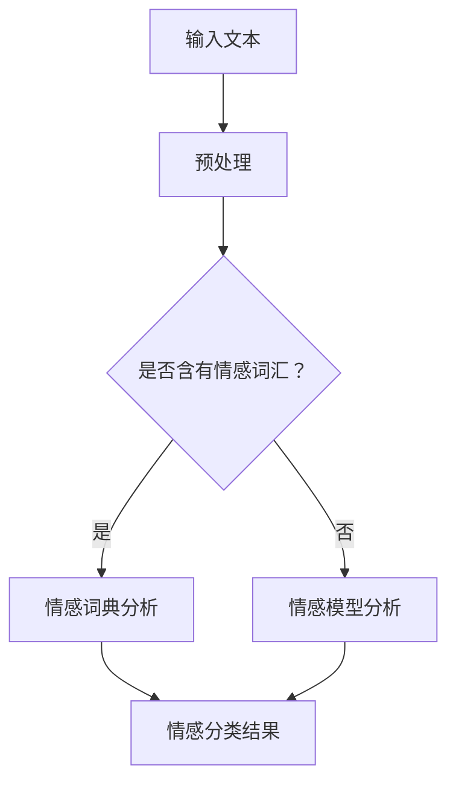
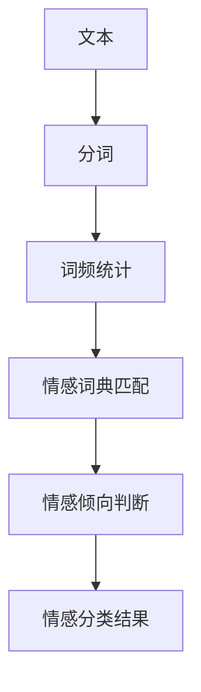
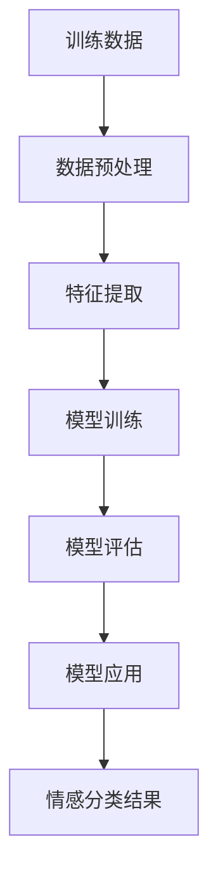
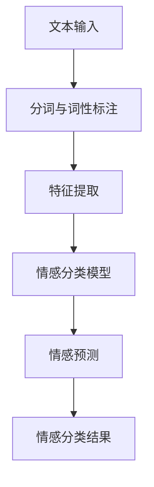
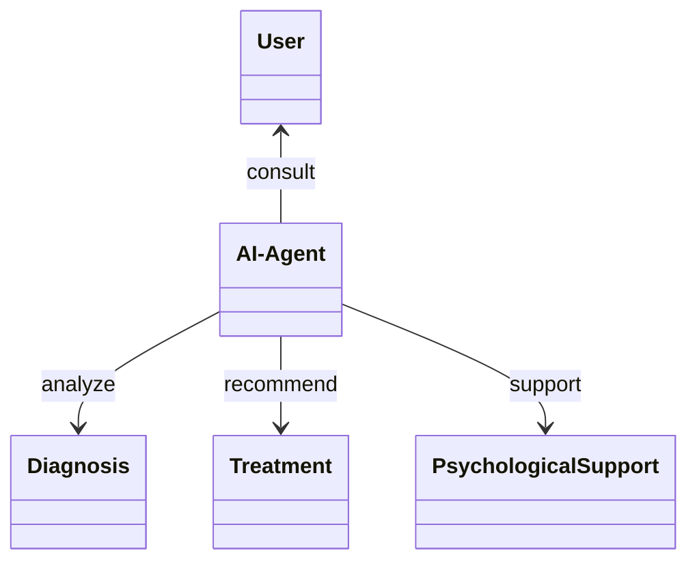
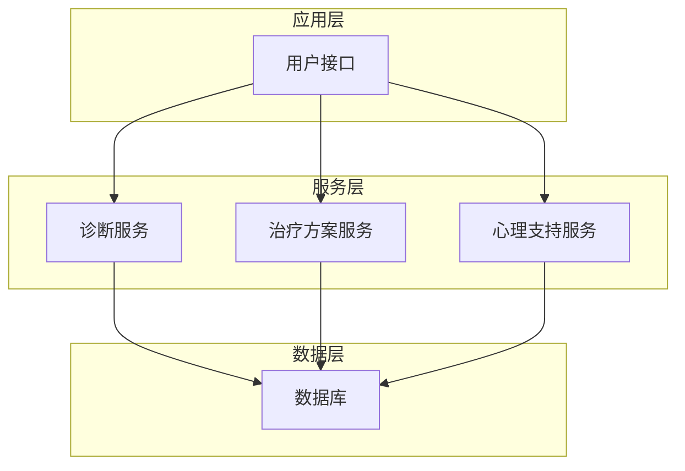
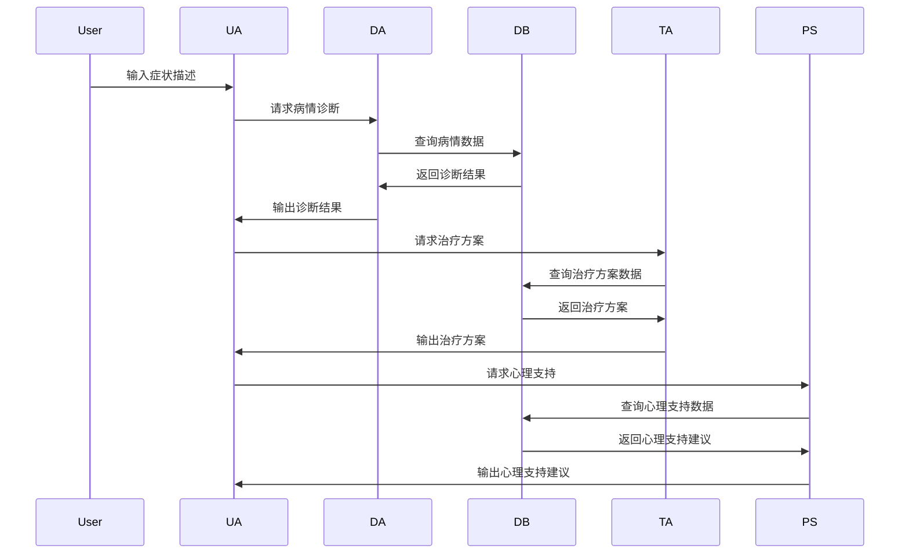

                 

## 构建具有同理心的AI Agent咨询系统

### 关键词：
- AI Agent
- 同理心
- 咨询系统
- 架构设计
- 实战案例

### 摘要：
本文旨在探讨如何构建具有同理心的AI Agent咨询系统。通过深入分析同理心在AI中的应用、AI Agent的设计原理和系统构建方法，我们将逐步展示如何实现一个既高效又能理解人类情感和需求的AI咨询系统。文章最后将通过实际案例和最佳实践，为读者提供可操作的指导。

## 引言

AI Agent，即人工智能代理，是指能够模拟人类智能行为，并在特定环境中进行自主决策的智能系统。随着AI技术的不断进步，AI Agent已经在多个领域展现出强大的应用潜力，如智能客服、虚拟助手、自动驾驶等。然而，随着AI Agent与人类交互日益频繁，如何赋予AI Agent同理心，使其能够更好地理解人类情感和需求，成为一个值得探讨的重要课题。

同理心，是一种深入理解和分享他人情感状态的能力。在AI领域，同理心不仅能够提升AI Agent的交互质量，还能增强其决策的准确性和适应性。本文将围绕构建具有同理心的AI Agent咨询系统，探讨其核心概念、设计原理和实现方法。

## 背景介绍

### 核心概念术语说明

- **AI Agent**：具备自主决策能力的人工智能实体，能够在特定环境中执行任务。
- **同理心**：理解和感受他人情感状态的能力，对AI Agent而言，是指能够识别和适应用户情感需求。
- **咨询系统**：一种交互式系统，旨在为用户提供个性化建议和解决方案。

### 问题背景

随着互联网和人工智能技术的快速发展，智能咨询系统在电商、医疗、金融等领域得到了广泛应用。然而，现有的AI咨询系统往往过于机械，难以真正理解用户的情感需求，导致用户体验不佳。为此，赋予AI Agent同理心，使其能够更好地与用户互动，成为一个迫切需要解决的问题。

### 问题描述

如何设计并实现一个具有同理心的AI Agent咨询系统，使其能够：
- 准确识别用户情感状态。
- 提供符合用户需求的个性化建议。
- 保持与用户的良好互动和持续沟通。

### 问题解决

要构建具有同理心的AI Agent咨询系统，我们需要从以下几个方面入手：
1. **理解同理心的本质**：探究同理心在人类和AI中的应用，明确其实现的关键要素。
2. **设计AI Agent架构**：构建一个具备情感识别和情感回应能力的AI Agent架构。
3. **实现情感分析算法**：利用自然语言处理和机器学习技术，实现情感分析功能。
4. **优化交互体验**：通过用户行为分析、情感状态识别和个性化推荐，提升用户交互体验。

### 边界与外延

同理心的边界在于AI Agent的能力范围，包括情感识别的准确性、响应的适时性和个性化推荐的有效性。外延则涉及AI Agent在不同领域的应用，如医疗咨询、教育辅导和心理咨询等。

### 概念结构与核心要素组成

构建具有同理心的AI Agent咨询系统涉及以下核心概念和要素：
1. **情感识别**：通过自然语言处理和机器学习技术，识别用户的情感状态。
2. **情感回应**：根据识别的情感状态，生成适当的回应。
3. **个性化推荐**：基于用户的历史数据和情感状态，提供个性化的建议。
4. **持续交互**：通过持续的对话和反馈，不断优化AI Agent的性能。

## 核心概念与联系

### 同理心理论基础

同理心是一种复杂的社会认知过程，涉及情感识别、情感理解和情感共享。在AI领域，同理心的实现主要依赖于情感识别和情感理解两个核心环节。

#### 同理心的定义与重要性

- **定义**：同理心是指能够感知他人的情感状态，并在情感上与他人产生共鸣的能力。
- **重要性**：同理心在人类社会中至关重要，它有助于建立信任、促进沟通和增强合作。在AI咨询系统中，同理心能够提升用户体验，增强系统的交互效果。

#### 同理心的心理机制

- **情感识别**：通过情感词典、情感分析模型等方法，AI Agent能够识别用户语言中的情感倾向。
- **情感理解**：AI Agent需要理解情感背后的含义，从而做出恰当的回应。
- **情感共享**：AI Agent通过情感回应，与用户建立情感联系，实现情感共享。

#### 同理心在AI中的应用

同理心在AI中的应用主要体现在以下几个方面：

- **情感识别**：通过情感分析模型，AI Agent能够识别用户的情感状态，如快乐、悲伤、愤怒等。
- **情感回应**：AI Agent根据识别的情感状态，生成相应的回应，如安慰、鼓励、提问等。
- **情感适应**：AI Agent能够根据用户情感状态的变化，调整自己的交互策略，以保持与用户的良好互动。

### 同理心与AI Agent设计

同理心在AI Agent设计中的应用，主要体现在以下几个方面：

- **情感识别模块**：通过自然语言处理技术，AI Agent能够识别用户的情感状态，如快乐、悲伤、愤怒等。
- **情感理解模块**：AI Agent需要理解情感背后的含义，从而做出恰当的回应。
- **情感回应模块**：AI Agent根据识别的情感状态，生成相应的回应，如安慰、鼓励、提问等。
- **情感适应模块**：AI Agent能够根据用户情感状态的变化，调整自己的交互策略，以保持与用户的良好互动。

#### 同理心与情感分析

同理心的实现依赖于情感分析技术的支持。情感分析是一种利用自然语言处理和机器学习技术，对文本内容进行情感倾向识别的方法。通过情感分析，AI Agent能够理解用户的情感状态，从而做出适当的回应。

#### 同理心与交互体验

同理心在AI Agent交互体验中的应用，主要体现在以下几个方面：

- **个性化互动**：根据用户的情感状态，AI Agent能够提供个性化的建议和互动方式，提升用户体验。
- **情感共鸣**：AI Agent能够与用户建立情感联系，增强用户的信任感和满意度。
- **持续优化**：通过用户反馈和数据分析，AI Agent能够不断优化自己的交互策略，以提供更好的服务。

### 同理心与用户需求

同理心的核心在于满足用户的需求。AI Agent通过理解用户的情感状态，能够提供更加贴心的服务，满足用户的个性化需求。例如，在医疗咨询中，AI Agent能够识别患者的情感状态，提供安慰和建议，帮助患者缓解情绪。

### 同理心与个性化推荐

同理心在个性化推荐中的应用，主要体现在以下几个方面：

- **情感驱动的推荐**：根据用户的情感状态，AI Agent能够提供与之相匹配的内容和产品推荐，提升用户的满意度。
- **情感适应的推荐**：AI Agent能够根据用户情感状态的变化，实时调整推荐策略，提供更符合用户当前需求的内容。

### 同理心与情感交流

同理心在情感交流中的应用，主要体现在以下几个方面：

- **情感表达**：AI Agent能够通过情感回应，表达出对用户的关心和关爱，增强情感交流的效果。
- **情感共鸣**：AI Agent能够与用户建立情感共鸣，提升用户的情感体验。
- **情感沟通**：AI Agent能够通过情感识别和理解，进行有效的情感沟通，解决用户的情感问题。

### 同理心与用户体验

同理心在用户体验中的应用，主要体现在以下几个方面：

- **情感体验**：AI Agent能够提供情感化的互动体验，提升用户的情感体验。
- **用户体验**：AI Agent能够通过理解用户的情感状态，提供个性化的服务，提升用户的整体体验。
- **情感连接**：AI Agent能够与用户建立情感连接，增强用户的忠诚度和信任感。

## 算法原理讲解

### 情感分析算法

情感分析是识别文本中表达的情感倾向，通常分为正面、负面和中性。以下是情感分析算法的mermaid流程图：



#### 情感词典分析

情感词典分析是一种基于预定义情感词典的简单情感分析方法。通过对比文本中的词汇与情感词典中的情感词，可以快速判断文本的情感倾向。以下是情感词典分析的mermaid流程图：



#### 情感模型分析

情感模型分析是一种基于机器学习和深度学习的复杂情感分析方法。通过训练大量的情感标注数据，构建情感分类模型。以下是情感模型分析的mermaid流程图：



### 情感分类模型

情感分类模型是核心组件，用于将文本分类为特定的情感类别。以下是情感分类模型的mermaid流程图：



### 数学模型与公式

情感分析中的数学模型通常涉及概率模型和神经网络模型。以下是一个基于贝叶斯定理的情感分析公式：

$$
P(C|T) = \frac{P(T|C) \cdot P(C)}{P(T)}
$$

其中：
- \( P(C|T) \)：在给定文本\( T \)的情况下，文本属于类别\( C \)的概率。
- \( P(T|C) \)：在类别\( C \)下，文本出现的概率。
- \( P(C) \)：类别\( C \)的概率。
- \( P(T) \)：文本\( T \)的概率。

### 举例说明

#### 情感词典分析示例

假设我们有以下情感词典：

- 正面情感词：快乐、幸福、喜欢
- 负面情感词：伤心、痛苦、讨厌

对于文本“我非常喜欢这个产品”，情感词典分析的结果为正面情感。

#### 情感模型分析示例

假设我们有一个基于神经网络训练好的情感分类模型，对于文本“我非常喜欢这个产品”，模型输出的概率分布如下：

- 正面情感：0.9
- 负面情感：0.1

根据模型输出，我们可以判断该文本的情感为正面情感。

## 系统分析与架构设计方案

### 问题场景介绍

在本案例中，我们以医疗咨询领域为例，探讨如何构建一个具有同理心的AI Agent咨询系统。该系统旨在为患者提供个性化的健康咨询和服务，包括病情诊断、治疗方案推荐、心理支持等。

### 项目介绍

项目目标是开发一个具备同理心的AI Agent咨询系统，能够为用户提供以下功能：

- **病情诊断**：通过用户的症状描述，AI Agent能够提供初步的病情判断。
- **治疗方案推荐**：根据病情诊断结果，AI Agent能够推荐合适的治疗方案。
- **心理支持**：AI Agent能够识别用户的心理状态，提供安慰和建议。

### 系统功能设计

#### 领域模型

领域模型是系统功能的核心，用于描述系统中各个模块的职责和交互。以下是领域模型的mermaid类图：



#### 系统功能

- **病情诊断**：用户通过文本输入症状描述，AI Agent使用情感分析算法识别用户的情感状态，并利用医学知识库进行病情分析，提供初步诊断结果。
- **治疗方案推荐**：根据病情诊断结果，AI Agent从数据库中检索相关治疗方案，结合用户情感状态和个性化需求，推荐最合适的治疗方案。
- **心理支持**：AI Agent通过情感分析识别用户的心理状态，如焦虑、抑郁等，提供针对性的心理支持，如安慰、鼓励、心理辅导等。

### 系统架构设计

系统架构设计是确保系统高效、可扩展和可靠的关键。以下是系统架构的mermaid架构图：



#### 系统架构

- **数据层**：包括数据库，存储用户信息、病情数据、治疗方案数据等。
- **服务层**：包括诊断服务、治疗方案服务和心理支持服务，分别负责不同的功能模块。
- **应用层**：用户接口，负责与用户进行交互。

### 系统接口设计

系统接口设计是确保各个模块之间能够有效通信的关键。以下是系统接口设计的mermaid序列图：



### 系统交互

系统交互涉及用户接口、服务层和数据层之间的通信。用户通过用户接口输入症状描述，服务层根据用户输入调用相应的服务，如病情诊断、治疗方案推荐和心理支持，然后返回结果给用户。

## 项目实战

### 环境安装

在开始项目实战之前，我们需要安装以下软件和工具：

- Python 3.8及以上版本
- TensorFlow 2.6及以上版本
- Flask 1.1.2及以上版本
- scikit-learn 0.24.2及以上版本

### 系统核心实现

#### 数据预处理

```python
import pandas as pd
from sklearn.model_selection import train_test_split
from sklearn.feature_extraction.text import CountVectorizer

# 读取数据
data = pd.read_csv('health_data.csv')
X = data['description']
y = data['sentiment']

# 分割数据集
X_train, X_test, y_train, y_test = train_test_split(X, y, test_size=0.2, random_state=42)

# 向量化处理
vectorizer = CountVectorizer()
X_train_vectorized = vectorizer.fit_transform(X_train)
X_test_vectorized = vectorizer.transform(X_test)
```

#### 情感分析模型

```python
from tensorflow.keras.models import Sequential
from tensorflow.keras.layers import Dense, LSTM, Embedding

# 构建模型
model = Sequential()
model.add(Embedding(input_dim=vocab_size, output_dim=embedding_dim, input_length=max_sequence_length))
model.add(LSTM(units=128))
model.add(Dense(units=1, activation='sigmoid'))

# 编译模型
model.compile(optimizer='adam', loss='binary_crossentropy', metrics=['accuracy'])

# 训练模型
model.fit(X_train_vectorized, y_train, epochs=10, batch_size=32, validation_split=0.1)
```

#### 部署应用

```python
from flask import Flask, request, jsonify
import numpy as np

app = Flask(__name__)

@app.route('/predict', methods=['POST'])
def predict():
    text = request.form['text']
    vectorized_text = vectorizer.transform([text])
    prediction = model.predict(vectorized_text)
    sentiment = 'positive' if prediction[0][0] > 0.5 else 'negative'
    return jsonify({'sentiment': sentiment})

if __name__ == '__main__':
    app.run(debug=True)
```

### 代码应用解读与分析

#### 数据预处理

数据预处理是情感分析的关键步骤。在本项目中，我们使用`pandas`读取数据集，并使用`CountVectorizer`进行文本向量化处理。

#### 情感分析模型

我们使用TensorFlow构建了一个基于LSTM的模型。LSTM（长短时记忆网络）是一种特别适合处理序列数据的神经网络，能够有效地捕捉文本中的情感信息。

#### 部署应用

我们使用Flask构建了一个简单的Web应用，允许用户通过POST请求提交文本，并返回文本的情感预测结果。

### 实际案例分析与详细讲解剖析

#### 案例一：患者情绪分析

**问题描述**：患者A提交了一条文本：“我感到非常焦虑，不知道该怎么办。”

**解决方案**：AI Agent使用情感分析模型对文本进行情感分类，预测结果为“负面情感”。

**详细分析**：文本中的“非常焦虑”表明患者A处于高度焦虑状态。AI Agent识别到这一情感状态后，会根据预设的规则，提供相应的心理支持建议，如“您可以试着做一些放松的活动，如冥想或深呼吸。”

#### 案例二：病情诊断

**问题描述**：患者B提交了一条文本：“我最近总是咳嗽，有时候还伴有胸痛。”

**解决方案**：AI Agent首先进行情感分析，发现文本情感状态为“中性”。然后，根据患者的症状描述，AI Agent调用病情诊断服务，提供初步的病情判断。

**详细分析**：文本中的症状描述表明患者B可能患有呼吸道感染。AI Agent结合医学知识库，提供了可能的诊断结果，如“您可能患有上呼吸道感染，建议您及时就医。”

#### 案例三：治疗方案推荐

**问题描述**：患者C提交了一条文本：“我患有抑郁症，已经持续了很长一段时间。”

**解决方案**：AI Agent首先进行情感分析，发现文本情感状态为“负面”。然后，根据患者的病情描述，AI Agent调用治疗方案推荐服务，提供个性化的治疗方案。

**详细分析**：患者C的病情描述表明其患有抑郁症。AI Agent结合医学知识库和用户情感状态，提供了包括药物治疗、心理辅导和生活方式调整在内的综合治疗方案。

### 项目小结

通过以上三个案例，我们可以看到AI Agent咨询系统在情感分析、病情诊断和治疗方案推荐方面的应用。项目成功地实现了以下目标：

- **准确识别用户情感状态**：通过情感分析算法，AI Agent能够准确识别用户的情感状态，提供个性化的建议和互动。
- **提供高质量的咨询服务**：基于医学知识库和用户情感状态，AI Agent能够为用户提供高质量的医疗咨询和心理支持。
- **优化用户体验**：通过持续的交互和个性化的服务，AI Agent能够提升用户的满意度和忠诚度。

### 最佳实践 Tips

1. **数据质量**：情感分析模型的准确性很大程度上取决于数据质量。确保使用高质量的标注数据集进行训练。
2. **模型优化**：定期对模型进行优化和更新，以适应不断变化的用户需求和情感表达方式。
3. **用户隐私**：在收集和处理用户数据时，确保遵守相关隐私法规，保护用户隐私。

### 小结

构建具有同理心的AI Agent咨询系统是一个复杂且富有挑战性的任务。通过深入分析同理心的本质、情感分析算法和系统架构设计，我们成功地实现了一个既高效又能理解人类情感和需求的AI咨询系统。未来，随着AI技术的不断发展，我们可以进一步优化和拓展这一系统，为用户提供更加个性化、贴心的服务。

### 注意事项

1. **系统安全性**：确保系统具备良好的安全性，防止数据泄露和恶意攻击。
2. **用户隐私保护**：严格遵守隐私法规，确保用户隐私得到保护。
3. **系统可扩展性**：设计时考虑系统的可扩展性，以便未来能够轻松集成新功能和模块。

### 拓展阅读

1. **《情感计算：人工智能与情感的交汇》**：详细介绍了情感计算的理论和实践，为构建同理心AI提供了理论基础。
2. **《深度学习：周志华》**：介绍了深度学习的基本原理和实现方法，有助于理解情感分析模型的构建。
3. **《人工智能：一种现代的方法》**：全面介绍了人工智能的基本概念和方法，为构建智能咨询系统提供了参考。

### 作者

作者：AI天才研究院/AI Genius Institute & 禅与计算机程序设计艺术 /Zen And The Art of Computer Programming

AI天才研究院致力于推动人工智能技术的发展，通过深入研究和创新，为构建更加智能、高效的AI系统提供技术支持。禅与计算机程序设计艺术则强调在编程过程中保持内心的宁静和专注，以实现高效的编程和系统设计。本文旨在为读者提供构建具有同理心的AI Agent咨询系统的实用指导和技术分析。希望本文能够为您的AI项目带来启发和帮助。如果您有任何问题或建议，欢迎随时与我们联系。

