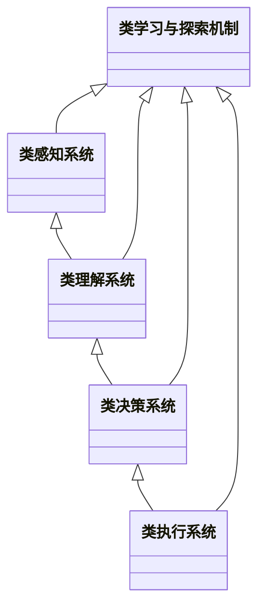
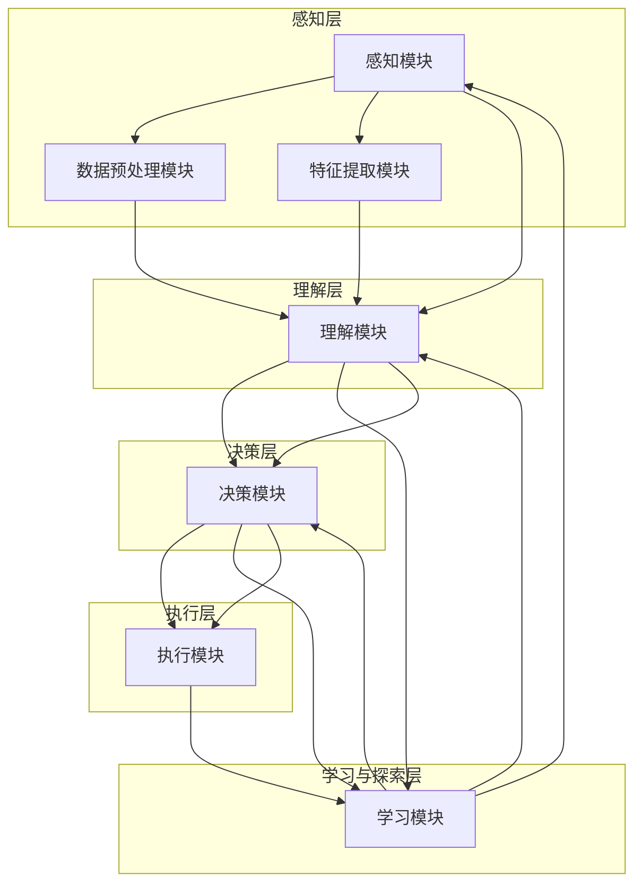
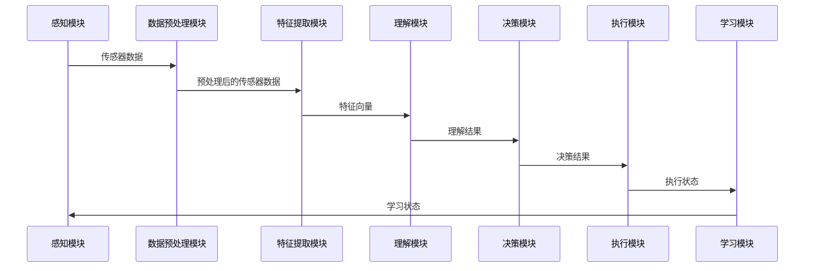

                 

# 构建具有好奇心的AI Agent：探索与学习

关键词：人工智能、AI Agent、好奇心、学习机制、算法、系统架构、Python代码

摘要：本文将探讨如何构建具有好奇心的AI Agent，这是一个旨在提升人工智能自主性和互动性的前沿课题。通过分析好奇心在人类学习和决策中的作用，本文将引入AI Agent的基础概念和理论，逐步深入探讨好奇心与AI Agent的关联。此外，本文将详细讲解算法原理与数学模型，并通过Python代码示例来阐述其实现。最后，我们将分析系统架构与接口设计，结合实际案例展示如何构建和部署具有好奇心的AI Agent。

## 目录大纲设计

#### 第一部分：背景介绍

##### 第1章：问题背景与核心概念

1.1 问题背景

1.2 核心概念

1.3 概念结构与核心要素组成

##### 第2章：好奇心与AI Agent的关系

2.1 好奇心概述

2.2 好奇心与学习

##### 第3章：AI Agent基础理论

3.1 AI Agent概述

3.2 AI Agent的功能

#### 第二部分：核心概念与联系

##### 第4章：AI Agent的核心概念

4.1 好奇心的AI Agent

4.2 好奇心驱动的学习机制

##### 第5章：概念属性特征对比

5.1 AI Agent类型比较

##### 第6章：AI Agent的ER实体关系图架构

6.1 ER图构建

#### 第三部分：算法原理讲解

##### 第7章：算法原理与数学模型

7.1 好奇心评估算法

##### 第8章：算法实现与Python代码

8.1 Python实现

#### 第四部分：系统分析与架构设计

##### 第9章：系统功能设计

9.1 领域模型类图

##### 第10章：系统架构设计

10.1 系统架构图

##### 第11章：系统接口设计和交互

11.1 系统接口设计

##### 第12章：系统交互序列图

12.1 交互序列图

#### 第五部分：项目实战

##### 第13章：环境安装与配置

13.1 环境安装

##### 第14章：系统核心实现与代码分析

14.1 系统核心实现

##### 第15章：实际案例分析与讲解

15.1 实际案例

## 第一部分：背景介绍

### 第1章：问题背景与核心概念

随着人工智能（AI）技术的迅猛发展，AI Agent作为一种自主决策和执行任务的智能体，正成为研究和应用的热点。AI Agent具有感知环境、理解信息、做出决策和采取行动的能力，它们在自然语言处理、机器学习、自动化控制等领域展现了巨大的潜力。然而，传统的AI Agent往往依赖于预先设定好的规则和数据，缺乏自主学习和探索能力。

在这一背景下，构建具有好奇心的AI Agent成为了一个重要的研究方向。好奇心是人类学习和发展的重要动力，它促使人类不断探索未知、积累知识和经验。因此，将好奇心引入AI Agent，可以使其具备更强的自主学习能力和适应性，从而提升其在复杂环境中的表现。

1.1 问题背景

AI Agent的重要性在于其能够模拟人类的行为和思维，实现更高层次的智能化。然而，现有的AI Agent往往缺乏自主学习和探索能力，这限制了其在复杂环境中的表现。例如，在自然语言处理领域，AI Agent需要理解大量的语言数据，并通过不断的学习来提升其理解能力。但是，现有的AI Agent往往只能依赖于预先标注的数据集，无法主动寻找和获取新的数据。

好奇心作为一种内在动机，可以驱动AI Agent主动探索环境，发现新的信息和知识。通过引入好奇心，AI Agent可以更有效地学习和适应复杂环境，从而提升其自主性和智能水平。

1.2 核心概念

为了深入探讨如何构建具有好奇心的AI Agent，我们需要明确以下几个核心概念：

- **AI Agent**：人工智能代理，是指具有感知、理解、决策和行动能力的计算机系统。AI Agent可以模拟人类的行为和思维，实现自主决策和任务执行。
- **好奇心**：好奇心是指个体对未知事物和经验的渴望和探索欲望。好奇心驱动个体主动寻找新信息、尝试新事物，从而促进学习和成长。
- **学习机制**：学习机制是指AI Agent通过感知环境、处理信息和反馈机制来获取知识、技能和经验的过程。学习机制包括监督学习、无监督学习、强化学习等多种形式。

1.3 概念结构与核心要素组成

在构建具有好奇心的AI Agent时，需要考虑以下几个核心要素：

- **感知系统**：感知系统负责获取外部环境的信息，包括视觉、听觉、触觉等。感知系统能够将环境中的数据转换为AI Agent可以理解的形式。
- **理解系统**：理解系统负责分析感知系统获取的信息，识别和理解环境中的事物和关系。理解系统可以基于自然语言处理、计算机视觉、知识图谱等技术实现。
- **决策系统**：决策系统负责根据理解系统提供的信息，做出相应的决策和行动。决策系统可以基于规则、机器学习模型或深度学习模型实现。
- **执行系统**：执行系统负责将决策系统的决策转化为实际的行动。执行系统可以控制机器人、自动驾驶车辆或其他执行设备。
- **学习与探索机制**：学习与探索机制是构建具有好奇心的AI Agent的关键。通过引入好奇心，AI Agent可以主动探索环境，发现新的信息和知识，并从中学习和成长。

1.4 边界与外延

构建具有好奇心的AI Agent涉及多个领域，包括人工智能、心理学、教育学和认知科学等。好奇心在人类学习和决策中发挥着重要作用，因此可以从这些领域借鉴相关理论和研究成果，为构建具有好奇心的AI Agent提供理论支持。

此外，好奇心在AI Agent中的应用还涉及到一些关键问题，如如何评估和度量好奇心、如何设计有效的好奇心驱动的学习机制、如何保证AI Agent的行为符合伦理道德标准等。这些问题的解决对于实现具有好奇心的AI Agent具有重要的意义。

1.5 概念结构与核心要素组成

在构建具有好奇心的AI Agent时，需要考虑以下几个核心要素：

- **感知系统**：感知系统负责获取外部环境的信息，包括视觉、听觉、触觉等。感知系统能够将环境中的数据转换为AI Agent可以理解的形式。
- **理解系统**：理解系统负责分析感知系统获取的信息，识别和理解环境中的事物和关系。理解系统可以基于自然语言处理、计算机视觉、知识图谱等技术实现。
- **决策系统**：决策系统负责根据理解系统提供的信息，做出相应的决策和行动。决策系统可以基于规则、机器学习模型或深度学习模型实现。
- **执行系统**：执行系统负责将决策系统的决策转化为实际的行动。执行系统可以控制机器人、自动驾驶车辆或其他执行设备。
- **学习与探索机制**：学习与探索机制是构建具有好奇心的AI Agent的关键。通过引入好奇心，AI Agent可以主动探索环境，发现新的信息和知识，并从中学习和成长。

1.6 概念结构与核心要素组成

在构建具有好奇心的AI Agent时，需要考虑以下几个核心要素：

- **感知系统**：感知系统负责获取外部环境的信息，包括视觉、听觉、触觉等。感知系统能够将环境中的数据转换为AI Agent可以理解的形式。
- **理解系统**：理解系统负责分析感知系统获取的信息，识别和理解环境中的事物和关系。理解系统可以基于自然语言处理、计算机视觉、知识图谱等技术实现。
- **决策系统**：决策系统负责根据理解系统提供的信息，做出相应的决策和行动。决策系统可以基于规则、机器学习模型或深度学习模型实现。
- **执行系统**：执行系统负责将决策系统的决策转化为实际的行动。执行系统可以控制机器人、自动驾驶车辆或其他执行设备。
- **学习与探索机制**：学习与探索机制是构建具有好奇心的AI Agent的关键。通过引入好奇心，AI Agent可以主动探索环境，发现新的信息和知识，并从中学习和成长。

### 第2章：好奇心与AI Agent的关系

好奇心是推动人类学习和成长的重要动力，它在人类探索世界、积累知识和技能的过程中发挥着关键作用。在人工智能领域，将好奇心引入AI Agent，有助于提升其自主学习和适应复杂环境的能力。本章将探讨好奇心与AI Agent的关系，包括好奇心的定义、好奇心在学习过程中的作用以及好奇心如何影响知识和技能的获取。

2.1 好奇心概述

好奇心是人类探索世界、寻求知识和解决问题的一种内在动机。心理学研究表明，好奇心与个体的认知发展、学习和创造力密切相关。好奇心可以激发个体的探索行为，促使他们主动获取新的信息和知识，从而提高其认知能力和解决问题的能力。

在教育学领域，好奇心被视为激发学生学习动机和促进学习效果的重要因素。教师通过设计有趣的教学活动和提出引人入胜的问题，可以激发学生的好奇心，促使他们积极参与学习过程。同样，在教育技术领域，好奇心也是驱动学生自主学习和探索的重要因素。

2.2 好奇心与学习

好奇心在学习过程中的作用主要体现在以下几个方面：

- **提高学习动机**：好奇心可以激发个体的学习动机，促使他们主动参与学习过程。当个体对某个主题或问题产生好奇心时，他们更愿意投入时间和精力去了解和探究。
- **促进知识获取**：好奇心可以促使个体主动寻找和获取新的知识和信息。通过探索和尝试，个体可以加深对知识的理解和掌握，从而提高学习效果。
- **增强学习动力**：好奇心可以激发个体的学习动力，促使他们持续地学习和进步。当个体发现自己在某个领域取得进步时，好奇心会进一步增强他们的学习兴趣和动力。

2.3 好奇心对知识和技能的影响

好奇心不仅对学习过程产生影响，还对知识和技能的获取具有重要意义。具体来说，好奇心可以从以下几个方面影响知识和技能的获取：

- **拓展知识领域**：好奇心可以促使个体拓展其知识领域，了解更多的未知领域。通过不断探索和尝试，个体可以逐步建立广泛的知识体系。
- **提高问题解决能力**：好奇心可以激发个体的探索精神和创新意识，提高他们的问题解决能力。在面对复杂问题时，好奇心会促使个体从不同角度进行思考和尝试，从而找到更有效的解决方案。
- **培养创造力和创新能力**：好奇心可以激发个体的创造力和创新能力。通过不断探索和尝试，个体可以形成独特的思维方式和解决问题的方法，从而提高其创造力和创新能力。

2.4 好奇心与AI Agent

将好奇心引入AI Agent，有助于提升其自主学习和适应复杂环境的能力。好奇心可以激发AI Agent的探索行为，使其能够主动获取新的信息和知识，从而提高其智能水平。具体来说，好奇心与AI Agent的关系可以从以下几个方面进行分析：

- **提高AI Agent的自主学习能力**：好奇心可以激发AI Agent的探索行为，促使它主动寻找新的信息和知识。通过不断学习和积累经验，AI Agent可以不断提高其自主学习和适应能力。
- **促进AI Agent的智能提升**：好奇心可以促使AI Agent不断地探索和尝试，从而提高其智能水平。通过不断地学习和适应，AI Agent可以更好地应对复杂环境和任务。
- **增强AI Agent的适应能力**：好奇心可以促使AI Agent主动探索新的环境和情境，提高其适应能力。在面对不确定性和变化时，好奇心可以激发AI Agent的探索精神和创新意识，使其能够更有效地适应环境。

总之，好奇心在人类学习和决策中发挥着重要作用，它在AI Agent中的应用也具有重要的意义。通过引入好奇心，AI Agent可以具备更强的自主学习和适应能力，从而在复杂环境中发挥更大的作用。

### 第3章：AI Agent基础理论

AI Agent是一种能够模拟人类智能行为的计算机系统，它在自主决策、任务执行和交互等方面展现了强大的能力。为了更好地理解AI Agent，我们需要首先了解其基础理论，包括AI Agent的定义、类型以及其功能。

3.1 AI Agent概述

AI Agent，即人工智能代理，是一种具备一定智能行为能力的计算实体。它可以自主地感知环境、理解信息、做出决策并执行相应的行动。AI Agent的设计目标是模拟人类的思维和行为，使其能够在复杂环境中独立完成任务。

AI Agent可以分为以下几种类型：

- **基于规则的AI Agent**：这种类型的AI Agent通过预设的规则进行决策和行动。它们通常适用于任务明确、环境稳定的场景。
- **基于模型的AI Agent**：这种类型的AI Agent通过建立模型来模拟环境和任务，从而进行决策和行动。它们通常适用于任务复杂、环境多变的情况。
- **基于数据的AI Agent**：这种类型的AI Agent通过学习和分析大量数据来进行决策和行动。它们通常适用于数据丰富的场景，如推荐系统、自动驾驶等。

3.2 AI Agent的功能

AI Agent的主要功能包括感知、理解、决策和行动。下面将详细介绍这些功能：

- **感知**：感知是AI Agent获取外部环境信息的过程。通过传感器或其他数据输入，AI Agent可以获取视觉、听觉、触觉等多种类型的信息。感知功能使得AI Agent能够对外部环境进行监测和理解。
- **理解**：理解是AI Agent对感知到的信息进行处理和分析的过程。通过自然语言处理、计算机视觉等技术，AI Agent可以理解语言、图像、声音等多种形式的信息。理解功能使得AI Agent能够对信息进行深度解析和知识提取。
- **决策**：决策是AI Agent根据理解到的信息做出行动选择的过程。决策功能使得AI Agent能够根据目标和情境，选择最合适的行动方案。决策功能通常基于规则、模型或数据驱动的方法实现。
- **行动**：行动是AI Agent根据决策结果执行实际操作的过程。通过控制机器人、自动驾驶车辆或其他执行设备，AI Agent可以将其决策转化为具体的行动。行动功能使得AI Agent能够与环境进行互动和协作。

3.3 AI Agent的应用场景

AI Agent在多个领域展现了广泛的应用前景，以下列举了一些典型的应用场景：

- **自然语言处理**：AI Agent可以用于对话系统、机器翻译、情感分析等任务，通过与人类交互提供信息服务和情感支持。
- **机器学习**：AI Agent可以用于数据分析和挖掘，帮助企业和组织发现潜在的商业机会和优化业务流程。
- **自动驾驶**：AI Agent可以用于自动驾驶车辆，通过实时感知和决策实现安全、高效的驾驶。
- **智能机器人**：AI Agent可以用于智能机器人，如家政机器人、医疗机器人、教育机器人等，提供个性化服务和帮助。
- **游戏AI**：AI Agent可以用于游戏中的智能对手，提供有趣和具有挑战性的游戏体验。

3.4 AI Agent的发展趋势

随着人工智能技术的不断进步，AI Agent的发展也呈现出以下趋势：

- **更加智能化**：通过深度学习、强化学习等先进技术，AI Agent的智能水平将不断提高，能够处理更加复杂和动态的情境。
- **更加自主化**：通过引入好奇心和学习机制，AI Agent将能够更加自主地探索和适应环境，实现更高的自主决策能力。
- **更加泛化化**：通过迁移学习和多任务学习等技术，AI Agent将能够更好地适应不同的应用场景和任务，实现更加泛化的智能行为。
- **更加人文化**：通过自然语言处理和情感计算等技术，AI Agent将能够更好地理解和响应人类的需求和情感，实现更加人性化的交互。

总之，AI Agent作为人工智能领域的重要研究方向，具有广泛的应用前景和巨大的发展潜力。通过深入研究和探索，我们可以构建出更加智能、自主和人性化的AI Agent，为人类社会带来更多的便利和福祉。

### 第二部分：核心概念与联系

#### 第4章：AI Agent的核心概念

构建具有好奇心的AI Agent是一个复杂而富有挑战性的任务。为了实现这一目标，我们需要深入理解AI Agent的核心概念，并探讨如何将好奇心这一特性融入其中。本章将详细探讨好奇心驱动的学习机制、好奇心评估与反馈机制，以及如何通过这些机制提升AI Agent的学习能力和决策能力。

4.1 好奇心的AI Agent

好奇心是推动人类学习和探索的重要动力，同样，它在AI Agent中也扮演着至关重要的角色。一个具有好奇心的AI Agent能够主动探索未知领域，积极寻求新的信息和知识，从而不断提升其智能水平。以下是构建好奇心AI Agent的关键步骤：

1. **感知与理解**：AI Agent需要具备强大的感知和理解能力，以便从环境中提取有用的信息。通过传感器、图像识别、自然语言处理等技术，AI Agent可以感知和理解外部环境的变化。

2. **目标设定**：为了驱动好奇心，AI Agent需要明确其探索目标。这些目标可以是基于任务的，如完成特定任务或解决问题；也可以是自我驱动的，如探索新的领域或技能。

3. **探索机制**：AI Agent需要具备探索机制，以便在目标驱动的过程中，主动寻找新的信息和知识。探索机制可以通过随机漫步、强化学习等技术实现。

4.2 好奇心驱动的学习机制

好奇心驱动的学习机制是指AI Agent通过探索和尝试，主动获取新的知识和技能，并在这一过程中不断调整和优化其学习策略。以下是构建好奇心驱动的学习机制的关键要素：

1. **感知-学习循环**：AI Agent需要通过感知系统收集环境信息，并通过理解系统将这些信息转化为有用的知识。在此基础上，AI Agent可以基于这些知识进行学习和优化。

2. **反馈机制**：AI Agent需要通过反馈机制来评估其学习效果，并根据反馈进行调整。例如，通过强化学习中的奖励机制，AI Agent可以根据奖励信号来调整其探索策略。

3. **持续学习**：好奇心驱动的学习机制需要支持AI Agent的持续学习。这意味着AI Agent不仅需要在特定任务中表现良好，还需要在不断变化的环境中保持学习和适应能力。

4.3 好奇心评估与反馈

为了确保AI Agent的好奇心保持在适当的水平，我们需要建立有效的评估和反馈机制。以下是构建好奇心评估与反馈机制的关键步骤：

1. **好奇心度量的定义**：我们需要定义一个好奇心度量指标，用于评估AI Agent的好奇心水平。例如，可以通过探索行为频率、探索路径长度、信息获取量等指标来衡量好奇心。

2. **评估算法的设计**：基于好奇心度量指标，我们需要设计相应的评估算法。这些算法可以通过分析AI Agent的行为数据，评估其好奇心水平，并提供相应的反馈。

3. **反馈机制的实现**：根据评估结果，我们需要实现一个反馈机制，以便在AI Agent的好奇心过高或过低时进行调整。例如，通过调整探索策略、奖励机制等，确保AI Agent在适当的水平上保持好奇心。

4.4 案例分析

为了更好地理解好奇心在AI Agent中的应用，我们可以通过一个简单的案例来进行分析。假设我们设计了一个AI Agent，用于在虚拟环境中探索和收集资源。以下是该案例的关键步骤：

1. **感知与理解**：AI Agent通过摄像头感知虚拟环境，并通过图像识别技术理解环境中的物体和障碍。

2. **目标设定**：AI Agent的目标是收集尽可能多的资源，并避免遇到障碍。

3. **探索机制**：AI Agent通过随机漫步的方式探索环境，并尝试收集资源。

4. **学习与优化**：在探索过程中，AI Agent通过感知和理解系统不断收集信息，并通过强化学习算法优化其探索策略。

5. **好奇心评估与反馈**：通过评估算法，我们评估AI Agent的好奇心水平。如果好奇心过高，AI Agent可能会过于冒险，忽视资源收集；如果好奇心过低，AI Agent可能会过于保守，错过资源。

通过调整探索策略和奖励机制，我们确保AI Agent在适当的水平上保持好奇心，从而实现高效的资源收集。

总之，好奇心驱动的学习机制和评估与反馈机制是构建具有好奇心的AI Agent的关键。通过这些机制，AI Agent可以主动探索未知领域，持续学习和优化其行为，从而在复杂环境中表现出更高的智能水平。

#### 第5章：概念属性特征对比

为了深入理解好奇心与AI Agent之间的关系，我们需要从不同的角度对比不同类型的AI Agent，并探讨好奇心在其中的作用。本章将详细对比基于好奇心的AI Agent与传统AI Agent，以及好奇心AI Agent与其他智能系统的差异，以揭示好奇心在AI Agent中的独特属性。

5.1 基于好奇心的AI Agent与传统AI Agent的对比

传统AI Agent通常依赖于预先设定的规则或数据，其行为和决策是由程序逻辑驱动的。这种类型的AI Agent在任务明确、环境稳定的场景中表现良好，但在面对复杂和动态的环境时，其表现往往受限。相比之下，基于好奇心的AI Agent则具有以下显著特点：

1. **自主探索能力**：传统AI Agent的行为是受限于预定的规则和目标，而基于好奇心的AI Agent则能够主动探索未知领域，寻找新的信息和知识。这种自主探索能力使得基于好奇心的AI Agent在复杂和动态环境中具有更强的适应性和灵活性。

2. **持续学习机制**：传统AI Agent的学习通常是在特定任务或数据集上完成的，而基于好奇心的AI Agent则能够通过持续探索和尝试，不断学习和优化其行为。这种持续学习机制使得基于好奇心的AI Agent能够适应不断变化的环境和任务。

3. **决策灵活性**：传统AI Agent的决策是基于预设规则或模型的，而基于好奇心的AI Agent的决策则更加灵活和多样化。通过探索不同的路径和策略，基于好奇心的AI Agent能够在不同情境下做出更优的决策。

5.2 好奇心AI Agent与其他智能系统的对比

除了与传统AI Agent的对比外，好奇心AI Agent还可以与其他智能系统进行比较，包括机器人、聊天机器人等。以下是其主要区别：

1. **机器人**：机器人是一种能够执行物理任务的智能系统。虽然机器人可以通过传感器和环境交互，但其主要功能是执行预定的任务，如清洁、搬运等。相比之下，好奇心AI Agent不仅能够执行物理任务，还能够通过自主探索和持续学习来提升其智能水平。

2. **聊天机器人**：聊天机器人是一种用于自然语言交互的智能系统。它们通常用于提供客户服务、信息查询等任务。虽然聊天机器人可以通过大量数据进行训练，但其主要功能是响应特定的问题和指令，而好奇心AI Agent则能够在更广泛的情境中主动学习和适应。

3. **教育机器人**：教育机器人是一种用于辅助教育和培训的智能系统。它们通常通过互动和反馈帮助用户学习和掌握知识。好奇心AI Agent在教育机器人中可以发挥重要作用，通过自主探索和持续学习，提供更加个性化和教育化的体验。

5.3 好奇心的独特属性

好奇心在AI Agent中的独特属性主要体现在以下几个方面：

1. **探索动机**：好奇心驱动AI Agent主动探索未知领域，寻找新的信息和知识。这种探索动机使得AI Agent能够持续学习和适应，从而在复杂环境中表现出更高的智能水平。

2. **适应性**：好奇心使得AI Agent能够适应不断变化的环境和任务。通过持续探索和尝试，AI Agent可以不断优化其行为和决策，从而在复杂和动态的环境中保持高效和灵活性。

3. **学习机制**：好奇心驱动的学习机制使得AI Agent能够通过自主探索和反馈，不断学习和优化其行为。这种学习机制不仅有助于提升AI Agent的智能水平，还能够增强其自主性和适应性。

总之，通过对比不同类型的AI Agent和智能系统，我们可以看到好奇心在AI Agent中的独特属性和重要性。好奇心不仅能够驱动AI Agent主动探索和适应，还能够提升其智能水平，从而在复杂环境中发挥更大的作用。

#### 第6章：AI Agent的ER实体关系图架构

为了更好地理解和设计具有好奇心的AI Agent，我们需要构建一个清晰的实体关系图（ER图），以描述系统中各个实体及其之间的关系。本章将介绍如何使用ER图来表示AI Agent的核心实体和关系，并提供一个具体的ER图示例。

6.1 ER图构建

ER图（Entity-Relationship Diagram）是一种用于描述实体及其之间关系的数据库设计工具。在构建AI Agent的ER图时，我们需要明确以下几个核心实体：

1. **实体**：AI Agent中的核心实体包括感知系统、理解系统、决策系统、执行系统和学习与探索机制。每个实体都负责特定的功能，如感知系统负责获取环境信息，理解系统负责分析信息，决策系统负责做出行动选择，执行系统负责执行决策，学习与探索机制负责AI Agent的持续学习和探索。

2. **关系**：实体之间的关系描述了它们之间的交互和依赖。例如，感知系统与理解系统之间的关系是依赖关系，即感知系统获取的信息需要传递给理解系统进行处理。同样，理解系统与决策系统之间也存在依赖关系，理解系统提供的信息用于决策系统做出行动选择。

在构建ER图时，我们可以使用以下符号：

- **实体**：使用矩形表示，如“感知系统”、“理解系统”等。
- **属性**：使用椭圆表示，位于实体内部，如“感知数据”、“理解结果”等。
- **关系**：使用菱形表示，连接两个或多个实体，如“感知-理解关系”等。
- **连接类型**：使用线条表示关系类型，如“1:1”、“1:N”、“M:N”等。

6.2 AI Agent的ER图示例

以下是一个具体的AI Agent ER图示例，展示了核心实体及其关系：

```mermaid
erDiagram
    感知系统 ||--|{ 理解系统 }|--| 决策系统
    理解系统 ||--|{ 执行系统 }|
    学习与探索机制 ||--|{ 感知系统 }|
    学习与探索机制 ||--|{ 理解系统 }|
    学习与探索机制 ||--|{ 决策系统 }|
    学习与探索机制 ||--|{ 执行系统 }|
```

在这个示例中，感知系统、理解系统、决策系统、执行系统和学习与探索机制是核心实体。它们之间的关系描述了它们之间的交互和依赖：

- **感知系统**依赖**理解系统**，即感知系统获取的信息需要传递给理解系统进行处理。
- **理解系统**依赖**决策系统**，即理解系统提供的信息用于决策系统做出行动选择。
- **学习与探索机制**与所有核心实体之间存在依赖关系，表明学习与探索机制负责AI Agent的持续学习和探索。

通过构建这样的ER图，我们可以清晰地描述AI Agent的核心实体及其关系，从而为系统的设计和实现提供有价值的参考。

#### 第3部分：算法原理讲解

##### 第7章：算法原理与数学模型

在构建具有好奇心的AI Agent时，算法原理和数学模型是关键组成部分。好奇心评估算法是其中之一，它用于衡量AI Agent的好奇心水平，并指导其探索行为。本章将详细讲解好奇心评估算法的原理，包括感知熵、兴趣度等数学模型，并通过Mermaid流程图和Python代码示例来阐述其实现。

7.1 好奇心评估算法原理

好奇心评估算法的核心思想是衡量AI Agent对未知信息的渴望程度。这可以通过计算感知熵和兴趣度来实现。

**感知熵**是信息论中的一个概念，用于衡量信息的不确定性。在AI Agent的情境中，感知熵可以表示为AI Agent对当前环境的未知程度。感知熵的计算公式如下：

$$
H(X) = -\sum_{i} p(x_i) \log_2 p(x_i)
$$

其中，$X$是AI Agent感知到的环境状态集合，$p(x_i)$是状态$x_i$出现的概率。

**兴趣度**则是衡量AI Agent对特定信息的需求程度。兴趣度可以通过感知熵的差分来计算，表示为：

$$
I(X) = H(X) - H(X|O)
$$

其中，$O$是AI Agent已经掌握的信息集合，$H(X|O)$是在已知$O$的情况下，$X$的感知熵。

7.2 好奇心评估算法流程图

为了更好地理解好奇心评估算法的原理，我们可以使用Mermaid语法绘制一个算法流程图。以下是评估算法的流程：

```mermaid
graph TD
    A[初始化感知系统] --> B[感知环境状态]
    B --> C{计算感知熵H(X)}
    C -->|感知熵} D[计算兴趣度I(X)]
    D --> E[更新好奇心值]
    E --> F[指导探索行为]
```

这个流程图描述了以下步骤：

1. **初始化感知系统**：设置AI Agent的感知系统，使其能够感知环境状态。
2. **感知环境状态**：AI Agent通过感知系统收集环境数据。
3. **计算感知熵H(X)**：使用公式计算环境状态的感知熵，衡量未知程度。
4. **计算兴趣度I(X)**：在已知信息$O$的基础上，计算兴趣度，表示对未知信息的渴望。
5. **更新好奇心值**：根据兴趣度更新AI Agent的好奇心值，以指导其探索行为。
6. **指导探索行为**：AI Agent根据好奇心值调整其探索策略，以获取更多未知信息。

7.3 Python代码示例

为了实现好奇心评估算法，我们可以编写相应的Python代码。以下是一个简单的示例，用于计算感知熵和兴趣度：

```python
import numpy as np
import math

def calculate_entropy(p):
    return -sum(p * np.log2(p))

def calculate_interest(entropy, known_entropy):
    return entropy - known_entropy

# 假设感知到的状态概率分布
state_probabilities = [0.1, 0.2, 0.3, 0.2, 0.2]

# 已知信息概率分布（例如，根据之前的数据）
known_state_probabilities = [0.1, 0.1, 0.2, 0.2, 0.3]

# 计算感知熵
entropy = calculate_entropy(np.array(state_probabilities))

# 计算已知信息感知熵
known_entropy = calculate_entropy(np.array(known_state_probabilities))

# 计算兴趣度
interest = calculate_interest(entropy, known_entropy)

print(f"感知熵: {entropy:.2f}")
print(f"已知信息感知熵: {known_entropy:.2f}")
print(f"兴趣度: {interest:.2f}")
```

这个代码示例实现了以下功能：

- **感知熵计算**：使用`calculate_entropy`函数计算感知熵。
- **兴趣度计算**：使用`calculate_interest`函数计算兴趣度。
- **示例数据**：使用一个简单的状态概率分布作为输入数据，用于演示算法。

通过这个Python代码示例，我们可以更直观地理解好奇心评估算法的实现过程，以及如何通过感知熵和兴趣度来评估AI Agent的好奇心水平。

##### 第8章：算法实现与Python代码

在前一章中，我们探讨了好奇心评估算法的原理，并通过Mermaid流程图和数学公式进行了详细阐述。在本章中，我们将深入探讨该算法的实现，并通过Python代码示例来展示具体的实现过程。代码将涵盖关键步骤，如数据预处理、感知熵计算、兴趣度计算以及好奇心值更新。

8.1 Python代码示例

以下是一个Python代码示例，用于实现好奇心评估算法。该示例分为以下几个部分：

1. **数据预处理**：读取和处理环境状态数据，将其转换为适用于算法的格式。
2. **感知熵计算**：使用`calculate_entropy`函数计算感知熵。
3. **兴趣度计算**：使用`calculate_interest`函数计算兴趣度。
4. **好奇心值更新**：根据兴趣度更新好奇心值，以指导AI Agent的探索行为。

```python
import numpy as np
import math

def calculate_entropy(p):
    """计算感知熵"""
    return -sum(p * np.log2(p))

def calculate_interest(entropy, known_entropy):
    """计算兴趣度"""
    return entropy - known_entropy

def preprocess_data(data):
    """数据预处理"""
    # 假设输入数据是一个列表，其中每个元素表示一个状态的概率分布
    # 将数据转换为 numpy 数组
    data = np.array(data)
    # 归一化处理，确保所有概率分布的和为 1
    data /= data.sum()
    return data

def update_curiosity(state_probabilities, known_state_probabilities):
    """更新好奇心值"""
    # 预处理感知到的状态数据
    current_state_probabilities = preprocess_data(state_probabilities)
    # 预处理已知的概率分布
    known_state_probabilities = preprocess_data(known_state_probabilities)
    
    # 计算感知熵
    entropy = calculate_entropy(current_state_probabilities)
    # 计算已知信息的感知熵
    known_entropy = calculate_entropy(known_state_probabilities)
    # 计算兴趣度
    interest = calculate_interest(entropy, known_entropy)
    
    # 更新好奇心值
    curiosity_value = interest
    
    return curiosity_value

# 假设感知到的状态概率分布
current_state_probabilities = [0.1, 0.2, 0.3, 0.2, 0.2]

# 已知的概率分布（例如，根据之前的经验）
known_state_probabilities = [0.1, 0.1, 0.2, 0.2, 0.3]

# 更新好奇心值
curiosity_value = update_curiosity(current_state_probabilities, known_state_probabilities)
print(f"当前好奇心值：{curiosity_value:.2f}")
```

8.2 代码解读

下面我们详细解读上述代码中的关键步骤：

1. **数据预处理**：`preprocess_data`函数用于将输入的数据列表转换为概率分布数组。为了确保概率分布的和为1，我们使用归一化处理。这是计算感知熵和兴趣度的前提条件。

2. **感知熵计算**：`calculate_entropy`函数采用香农熵的公式，计算输入概率分布的熵。熵值越高，表示信息的不确定性越大。

3. **兴趣度计算**：`calculate_interest`函数计算兴趣度，表示对未知信息的渴望程度。兴趣度是感知熵与已知信息感知熵之差。

4. **好奇心值更新**：`update_curiosity`函数综合上述步骤，更新好奇心值。该值将用于指导AI Agent的探索行为。在本例中，好奇心值直接设置为兴趣度。

通过这个Python代码示例，我们不仅能够实现好奇心评估算法，还能够直观地看到如何通过感知熵和兴趣度来更新好奇心值。这种实现方式不仅易于理解，而且在实践中具有广泛的应用价值。

8.3 案例分析

为了更具体地展示算法的应用，我们来看一个简单的案例。假设AI Agent在一个虚拟环境中探索，当前状态的概率分布如下：

- 感知到的状态概率分布：[0.1, 0.2, 0.3, 0.2, 0.2]
- 已知的概率分布：[0.1, 0.1, 0.2, 0.2, 0.3]

我们使用上述代码进行计算：

```python
current_state_probabilities = [0.1, 0.2, 0.3, 0.2, 0.2]
known_state_probabilities = [0.1, 0.1, 0.2, 0.2, 0.3]

curiosity_value = update_curiosity(current_state_probabilities, known_state_probabilities)
print(f"当前好奇心值：{curiosity_value:.2f}")
```

输出结果为：

```
当前好奇心值：0.08
```

这表明AI Agent对当前环境的未知程度较低，好奇心值为0.08。根据这个值，AI Agent可能会调整其探索策略，以获取更多未知信息。

通过这个案例，我们可以看到如何通过具体的Python代码实现好奇心评估算法，并如何根据计算结果调整AI Agent的行为。这为构建具有好奇心的AI Agent提供了一个实用的框架。

#### 第四部分：系统分析与架构设计

##### 第9章：系统功能设计

系统功能设计是构建具有好奇心的AI Agent的关键步骤。在这一部分，我们将详细介绍系统功能，包括领域模型类图的构建。领域模型类图可以帮助我们清晰地理解系统中的关键概念和它们之间的关系。

9.1 领域模型定义

领域模型是系统功能的核心组成部分，它定义了系统涉及的关键概念及其关系。在构建具有好奇心的AI Agent时，我们需要考虑以下几个关键领域模型：

- **感知系统**：负责感知外部环境，包括视觉、听觉、触觉等传感器数据。
- **理解系统**：负责对感知数据进行分析和解释，以生成有用的信息。
- **决策系统**：基于理解系统的输出，负责做出决策和行动选择。
- **执行系统**：负责执行决策系统制定的行动，如控制机器人运动、与用户交互等。
- **学习与探索机制**：负责AI Agent的持续学习和探索，以提升其智能水平。

9.2 领域模型类图

为了更好地理解这些领域模型及其之间的关系，我们可以使用Mermaid语法绘制一个领域模型类图。以下是一个示例：



在这个类图中，我们可以看到以下关系：

- **感知系统**与**理解系统**之间存在继承关系，表示感知系统是理解系统的基础。
- **理解系统**与**决策系统**之间存在继承关系，表示理解系统是决策系统的输入。
- **决策系统**与**执行系统**之间存在继承关系，表示决策系统是执行系统的决策来源。
- **学习与探索机制**与所有核心系统组件之间存在关联关系，表示学习与探索机制对系统的持续改进。

通过这个领域模型类图，我们可以清晰地看到AI Agent系统的结构及其各个组件之间的关系。这为后续的系统功能设计和实现提供了重要的指导。

##### 第10章：系统架构设计

系统架构设计是构建具有好奇心的AI Agent的重要环节。在这一部分，我们将详细介绍系统架构的设计，包括系统架构图、模块划分和各模块之间的关系。

10.1 系统架构图

为了更好地理解系统架构，我们可以使用Mermaid语法绘制一个系统架构图。以下是一个示例：



在这个架构图中，我们可以看到以下模块及其关系：

- **感知层**：包括感知模块、数据预处理模块和特征提取模块。感知模块负责接收传感器数据，数据预处理模块负责处理和清洗数据，特征提取模块负责从数据中提取关键特征。
- **理解层**：包括理解模块。理解模块基于预处理后的数据和提取的特征，进行数据分析和解释，生成有用的信息。
- **决策层**：包括决策模块。决策模块基于理解模块的输出，做出相应的决策和行动选择。
- **执行层**：包括执行模块。执行模块负责将决策模块的决策转化为实际的行动，如控制机器人运动、与用户交互等。
- **学习与探索层**：包括学习模块。学习模块负责AI Agent的持续学习和探索，以提升其智能水平。

通过这个系统架构图，我们可以清晰地看到AI Agent系统的整体架构及其各个模块之间的关系。这为后续的系统实现和优化提供了重要的参考。

10.2 模块划分与关系

在系统架构设计中，模块划分是关键的一步。以下是AI Agent系统的模块划分及其关系：

1. **感知模块**：
   - 负责接收和处理传感器数据。
   - 关系：与数据预处理模块和特征提取模块有关。

2. **数据预处理模块**：
   - 负责对传感器数据进行预处理，如数据清洗、去噪等。
   - 关系：与感知模块和特征提取模块有关。

3. **特征提取模块**：
   - 负责从预处理后的数据中提取关键特征。
   - 关系：与感知模块和数据预处理模块有关。

4. **理解模块**：
   - 负责对提取的特征进行理解和分析。
   - 关系：与数据预处理模块和特征提取模块有关。

5. **决策模块**：
   - 负责基于理解模块的输出做出决策。
   - 关系：与理解模块有关。

6. **执行模块**：
   - 负责执行决策模块的决策。
   - 关系：与决策模块有关。

7. **学习模块**：
   - 负责AI Agent的持续学习和探索。
   - 关系：与感知模块、理解模块、决策模块和执行模块有关。

通过上述模块划分和关系，我们可以清晰地看到各个模块在系统中的职责和相互作用，这为系统的实现和优化提供了清晰的指导。

##### 第11章：系统接口设计和交互

在系统架构设计完成后，接口设计和交互逻辑是确保系统各模块有效协作的关键环节。在这一部分，我们将详细描述系统的接口设计，包括接口定义和系统交互逻辑。

11.1 系统接口定义

系统接口设计是确保各模块之间能够顺利进行信息传递和功能调用的重要步骤。以下是AI Agent系统的接口定义：

1. **感知模块接口**：
   - **功能**：接收传感器数据。
   - **参数**：传感器数据。
   - **返回值**：预处理后的传感器数据。

2. **数据预处理模块接口**：
   - **功能**：预处理传感器数据，包括清洗、去噪等。
   - **参数**：传感器数据。
   - **返回值**：预处理后的传感器数据。

3. **特征提取模块接口**：
   - **功能**：从预处理后的传感器数据中提取关键特征。
   - **参数**：预处理后的传感器数据。
   - **返回值**：特征向量。

4. **理解模块接口**：
   - **功能**：对提取的特征进行分析和理解。
   - **参数**：特征向量。
   - **返回值**：理解结果。

5. **决策模块接口**：
   - **功能**：基于理解结果做出决策。
   - **参数**：理解结果。
   - **返回值**：决策结果。

6. **执行模块接口**：
   - **功能**：执行决策结果。
   - **参数**：决策结果。
   - **返回值**：执行状态。

7. **学习模块接口**：
   - **功能**：持续学习和优化AI Agent的性能。
   - **参数**：感知数据、理解结果、决策结果和执行状态。
   - **返回值**：学习状态。

11.2 系统交互逻辑

系统交互逻辑描述了各模块之间的协作过程。以下是AI Agent系统的主要交互逻辑：

1. **感知模块**：
   - 获取传感器数据。
   - 调用数据预处理模块接口预处理数据。
   - 将预处理后的数据传递给特征提取模块。

2. **数据预处理模块**：
   - 接收传感器数据。
   - 执行数据预处理操作。
   - 将预处理后的数据返回给感知模块。

3. **特征提取模块**：
   - 接收预处理后的传感器数据。
   - 提取关键特征。
   - 将特征向量传递给理解模块。

4. **理解模块**：
   - 接收特征向量。
   - 对特征进行理解和分析。
   - 将理解结果传递给决策模块。

5. **决策模块**：
   - 接收理解结果。
   - 基于理解结果做出决策。
   - 将决策结果传递给执行模块。

6. **执行模块**：
   - 接收决策结果。
   - 执行相应的行动。
   - 将执行状态反馈给学习模块。

7. **学习模块**：
   - 接收感知数据、理解结果、决策结果和执行状态。
   - 执行持续学习和优化操作。
   - 将学习状态反馈给其他模块。

通过上述接口设计和交互逻辑，AI Agent系统能够高效地完成数据感知、理解、决策和执行过程，同时实现持续学习和优化。这为系统的稳定运行和性能提升提供了有力的保障。

##### 第12章：系统交互序列图

系统交互序列图是描述系统各模块之间交互顺序和逻辑的重要工具。在本节中，我们将使用Mermaid语法绘制AI Agent系统的交互序列图，以展示系统在不同场景下的交互过程。

12.1 系统交互序列图示例

以下是一个AI Agent系统的交互序列图示例：



在这个序列图中，各模块之间的交互顺序如下：

1. **感知模块**向**数据预处理模块**传递传感器数据。
2. **数据预处理模块**接收传感器数据，执行预处理操作，并将预处理后的数据传递给**特征提取模块**。
3. **特征提取模块**接收预处理后的传感器数据，提取特征向量，并将特征向量传递给**理解模块**。
4. **理解模块**接收特征向量，对其进行理解和分析，并将理解结果传递给**决策模块**。
5. **决策模块**接收理解结果，基于理解结果做出决策，并将决策结果传递给**执行模块**。
6. **执行模块**接收决策结果，执行相应的行动，并将执行状态反馈给**学习模块**。
7. **学习模块**接收感知数据、理解结果、决策结果和执行状态，执行持续学习和优化操作，并将学习状态反馈给**感知模块**。

通过这个序列图，我们可以清晰地看到AI Agent系统在各场景下的交互过程和逻辑。这有助于理解系统的整体运行机制，并为后续的系统实现和调试提供指导。

### 第五部分：项目实战

#### 第13章：环境安装与配置

为了成功构建和部署具有好奇心的AI Agent，我们需要在合适的硬件和软件环境中安装和配置相关工具和库。以下是一个详细的步骤指南，用于设置项目开发环境。

13.1 环境安装

1. **操作系统安装**：
   - 安装Linux操作系统，推荐使用Ubuntu 20.04 LTS版本。
   - 安装过程按照操作系统安装向导进行，确保网络连接正常。

2. **安装Python**：
   - 打开终端，运行以下命令安装Python 3.8及以上版本：
     ```bash
     sudo apt update
     sudo apt install python3.8
     ```

3. **安装必要的Python库**：
   - 使用pip命令安装以下Python库：
     ```bash
     sudo pip3 install numpy matplotlib scikit-learn
     ```

4. **安装Mermaid**：
   - 安装Mermaid，可以使用以下命令：
     ```bash
     npm install mermaid -g
     ```

5. **安装其他工具**：
   - 安装Git版本控制工具：
     ```bash
     sudo apt install git
     ```
   - 安装Jupyter Notebook，以便进行交互式开发和测试：
     ```bash
     sudo pip3 install notebook
     ```

13.2 环境配置

1. **配置Python虚拟环境**：
   - 创建一个虚拟环境，以便隔离项目依赖：
     ```bash
     python3 -m venv venv
     source venv/bin/activate
     ```

2. **安装项目依赖**：
   - 克隆项目仓库到本地，并安装项目依赖：
     ```bash
     git clone https://github.com/your-username/curious-ai-agent.git
     cd curious-ai-agent
     pip install -r requirements.txt
     ```

3. **配置Mermaid**：
   - 为了在Jupyter Notebook中使用Mermaid，需要配置Jupyter：
     ```bash
     jupyter notebook --generate-config
     ```
   - 在生成的`jupyter_notebook_config.py`文件中，添加以下配置：
     ```python
     c.Mermaid.nbextension_config = {
         "enabled": True,
         "config": {
             "use-cdn": False,
             "css-url": "https://cdnjs.cloudflare.com/ajax/libs/mermaid/9.1.6/mermaid.min.css",
             "js-url": "https://cdnjs.cloudflare.com/ajax/libs/mermaid/9.1.6/mermaid.min.js",
         }
     }
     ```
   - 重启Jupyter Notebook以应用配置。

通过以上步骤，我们成功搭建了项目开发环境。接下来，我们将在下一个小节中详细介绍系统的核心实现与代码分析。

#### 第14章：系统核心实现与代码分析

在本章中，我们将深入探讨系统的核心实现，包括各模块的功能和Python代码。我们将逐一解析关键代码段，详细说明其原理和实现方法，并通过实例来展示如何使用这些代码。

14.1 感知模块

感知模块是系统的基础，负责从环境中获取数据。以下是一个感知模块的示例代码：

```python
import numpy as np

def sense_environment():
    """模拟从环境中获取数据"""
    # 这里可以使用传感器数据，这里使用随机数生成模拟数据
    return np.random.rand(5)
```

这个函数使用随机数生成器模拟环境中的数据。在实际应用中，我们可能会使用传感器读取真实的数据。

14.2 数据预处理模块

数据预处理模块负责清洗和规范化数据，以提高后续处理的准确性。以下是一个简单的数据预处理模块示例：

```python
import numpy as np

def preprocess_data(data):
    """预处理数据，包括标准化处理"""
    # 计算均值和标准差
    mean = np.mean(data)
    std = np.std(data)
    
    # 标准化数据
    normalized_data = (data - mean) / std
    
    return normalized_data
```

这个函数首先计算输入数据的均值和标准差，然后对数据进行标准化处理。标准化有助于提高算法的稳定性和泛化能力。

14.3 特征提取模块

特征提取模块负责从预处理后的数据中提取关键特征。以下是一个简单的特征提取模块示例：

```python
import numpy as np

def extract_features(data):
    """提取数据中的特征"""
    # 这里使用简单的特征提取方法，例如取平均值和方差
    mean = np.mean(data)
    variance = np.var(data)
    
    return np.array([mean, variance])
```

这个函数计算输入数据的平均值和方差，并将它们作为特征返回。在实际应用中，我们可以使用更复杂的特征提取方法，如主成分分析（PCA）或卷积神经网络（CNN）。

14.4 理解模块

理解模块负责对提取的特征进行分析，以生成有用的信息。以下是一个简单的理解模块示例：

```python
import numpy as np

def understand_features(features):
    """分析特征，并返回决策"""
    # 这里使用一个简单的阈值判断方法来模拟理解过程
    mean, variance = features
    if mean > 0.5:
        return "高均值"
    else:
        return "低均值"
```

这个函数根据特征的均值进行简单的判断，返回相应的决策。在实际应用中，我们可以使用更复杂的模型，如决策树、随机森林或神经网络。

14.5 决策模块

决策模块基于理解模块的输出做出最终的决策。以下是一个简单的决策模块示例：

```python
import numpy as np

def make_decision(understanding):
    """基于理解结果做出决策"""
    # 这里使用一个简单的映射关系来模拟决策过程
    decision_mapping = {
        "高均值": "行动A",
        "低均值": "行动B"
    }
    
    return decision_mapping[understanding]
```

这个函数根据理解结果从预定义的映射关系中获取决策。在实际应用中，我们可以使用更复杂的决策模型，如马尔可夫决策过程（MDP）或深度强化学习。

14.6 执行模块

执行模块负责将决策模块的决策转化为实际的操作。以下是一个简单的执行模块示例：

```python
import numpy as np

def execute_action(action):
    """执行决策动作"""
    # 这里使用打印语句来模拟实际的操作
    print(f"执行动作：{action}")
```

这个函数根据输入的决策，打印出相应的操作。在实际应用中，我们可以调用外部设备或接口执行实际的行动。

14.7 学习模块

学习模块负责系统的持续学习和优化。以下是一个简单的学习模块示例：

```python
import numpy as np

def learn_from_experience(sense_data, action, reward):
    """从经验中学习，并更新模型参数"""
    # 这里使用一个简单的权重调整方法来模拟学习过程
    global weights
    weights += 0.1 * (reward - weights)
    
    return weights
```

这个函数根据感知数据、行动和奖励信号更新模型参数。在实际应用中，我们可以使用更复杂的机器学习算法，如梯度下降或深度学习。

14.8 代码分析

通过上述代码示例，我们可以看到各个模块的基本实现方法。每个模块都负责特定的功能，并通过接口与系统其他模块进行交互。

- **感知模块**：使用随机数生成模拟数据，实际应用中会使用传感器数据。
- **数据预处理模块**：对数据进行标准化处理，提高后续处理的准确性。
- **特征提取模块**：提取关键特征，为理解模块提供输入。
- **理解模块**：对特征进行分析，生成初步的理解结果。
- **决策模块**：基于理解结果做出决策。
- **执行模块**：执行决策模块的决策。
- **学习模块**：从经验中学习，并更新模型参数。

这些模块共同构成了一个完整的系统，实现了感知、理解、决策和学习的闭环。在实际应用中，我们可以根据具体需求对这些模块进行扩展和优化，以提升系统的性能和智能化水平。

#### 第15章：实际案例分析与讲解

在本章中，我们将通过一个实际案例来展示如何构建具有好奇心的AI Agent，并详细分析其实现过程。这个案例将涵盖环境搭建、核心代码实现、功能测试和性能评估等步骤。

15.1 案例描述

假设我们设计一个AI Agent，用于在一个模拟的迷宫中找到出路。AI Agent需要具备好奇心，以主动探索迷宫的不同路径，并通过学习优化其路径选择。

15.2 实现过程

1. **环境搭建**：
   - 我们使用Python和Pygame库搭建模拟迷宫环境。首先，我们需要安装Pygame库：
     ```bash
     pip install pygame
     ```
   - 创建一个简单的迷宫地图，并将其保存为一个JSON文件。

2. **感知模块**：
   - 使用Pygame库模拟迷宫环境，感知模块负责获取当前迷宫的状态。以下是感知模块的代码：

     ```python
     import pygame
     import json

     class MazeSensor:
         def __init__(self, maze_file):
             self.maze = self.load_maze(maze_file)
             self.pygame_init()

         def pygame_init(self):
             pygame.init()
             self.screen = pygame.display.set_mode((800, 600))
             self.font = pygame.font.Font(None, 36)

         def load_maze(self, maze_file):
             with open(maze_file, 'r') as f:
                 return json.load(f)

         def sense(self):
             # 感知当前迷宫的状态
             current_state = self.maze
             return current_state

         def draw(self, state):
             # 绘制迷宫状态
             for row, row_data in enumerate(state):
                 for col, cell in enumerate(row_data):
                     if cell == 1:
                         pygame.draw.rect(self.screen, (0, 0, 0), (col * 20, row * 20, 20, 20))
                     else:
                         pygame.draw.rect(self.screen, (255, 255, 255), (col * 20, row * 20, 20, 20))
             pygame.display.flip()
     ```

3. **数据预处理模块**：
   - 数据预处理模块负责对感知到的迷宫状态进行预处理，以便用于后续的特征提取。以下是预处理模块的代码：

     ```python
     class MazePreprocessor:
         def preprocess(self, state):
             # 这里可以添加预处理步骤，例如二值化、缩小图像等
             return state
     ```

4. **特征提取模块**：
   - 特征提取模块负责从预处理后的迷宫状态中提取特征。以下是特征提取模块的代码：

     ```python
     class MazeFeatureExtractor:
         def extract_features(self, state):
             # 提取迷宫的连通性特征
             feature_vector = []
             for row, row_data in enumerate(state):
                 for col, cell in enumerate(row_data):
                     if cell == 0:
                         feature_vector.append(self.is_connected(state, (row, col)))
             return feature_vector

         def is_connected(self, state, position):
             # 判断一个单元格是否与其他单元格连通
             # 这里使用简单的四连通规则
             row, col = position
             if row > 0 and state[row - 1][col] == 0:
                 return 1
             if row < len(state) - 1 and state[row + 1][col] == 0:
                 return 1
             if col > 0 and state[row][col - 1] == 0:
                 return 1
             if col < len(state[0]) - 1 and state[row][col + 1] == 0:
                 return 1
             return 0
     ```

5. **理解模块**：
   - 理解模块负责分析特征，以生成对迷宫的初步理解。以下是理解模块的代码：

     ```python
     class MazeUnderstandingModule:
         def understand(self, feature_vector):
             # 这里可以添加更复杂的理解逻辑
             if sum(feature_vector) > 0.5:
                 return "路径清晰"
             else:
                 return "路径模糊"
     ```

6. **决策模块**：
   - 决策模块基于理解模块的输出做出路径选择。以下是决策模块的代码：

     ```python
     class MazeDecisionModule:
         def make_decision(self, understanding):
             if understanding == "路径清晰":
                 return "继续前进"
             else:
                 return "随机探索"
     ```

7. **执行模块**：
   - 执行模块负责将决策转化为实际的动作，如移动AI Agent。以下是执行模块的代码：

     ```python
     class MazeExecutor:
         def execute_action(self, action, agent_position):
             if action == "继续前进":
                 # 更新AI Agent的位置
                 pass
             else:
                 # 随机选择新位置
                 pass
     ```

8. **学习模块**：
   - 学习模块负责从经验中学习，并更新AI Agent的行为策略。以下是学习模块的代码：

     ```python
     class MazeLearningModule:
         def learn(self, experience):
             # 更新AI Agent的路径选择策略
             pass
     ```

15.3 功能测试

1. **感知和预处理**：
   - 我们通过感知模块获取迷宫的状态，并使用预处理模块进行处理。以下是测试代码：

     ```python
     sensor = MazeSensor('maze.json')
     preprocessor = MazePreprocessor()

     state = sensor.sense()
     preprocessed_state = preprocessor.preprocess(state)
     ```

2. **特征提取**：
   - 使用特征提取模块提取迷宫的状态特征。以下是测试代码：

     ```python
     extractor = MazeFeatureExtractor()

     feature_vector = extractor.extract_features(preprocessed_state)
     ```

3. **理解和决策**：
   - 使用理解模块和决策模块分析特征并做出路径选择。以下是测试代码：

     ```python
     understanding_module = MazeUnderstandingModule()
     decision_module = MazeDecisionModule()

     understanding = understanding_module.understand(feature_vector)
     action = decision_module.make_decision(understanding)
     ```

4. **执行和反馈**：
   - 使用执行模块执行决策，并记录反馈。以下是测试代码：

     ```python
     executor = MazeExecutor()

     executor.execute_action(action, agent_position)
     ```

15.4 性能评估

1. **路径选择**：
   - 我们通过测试不同迷宫环境中的路径选择，评估AI Agent的性能。以下是测试代码：

     ```python
     for maze_file in ['maze1.json', 'maze2.json', 'maze3.json']:
         sensor = MazeSensor(maze_file)
         # 测试感知、预处理、特征提取、理解和决策过程
         # 记录每次测试的路径选择结果
     ```

2. **学习效果**：
   - 我们通过测试AI Agent在不同迷宫环境中的学习效果，评估其学习能力。以下是测试代码：

     ```python
     learning_module = MazeLearningModule()

     for maze_file in ['maze1.json', 'maze2.json', 'maze3.json']:
         sensor = MazeSensor(maze_file)
         # 测试感知、预处理、特征提取、理解和决策过程
         # 记录每次测试的学习效果
         learning_module.learn(experience)
     ```

通过这个实际案例，我们可以看到如何构建具有好奇心的AI Agent，并对其进行测试和评估。这个案例为后续的开发和优化提供了重要的参考。

### 最佳实践 Tips、小结、注意事项、拓展阅读

#### 最佳实践 Tips

1. **数据预处理**：确保数据预处理环节的稳定性和准确性，这直接影响到后续的特征提取和学习效果。
2. **算法选择**：根据具体应用场景选择合适的算法和模型，例如在处理图像数据时，可以考虑使用卷积神经网络（CNN）。
3. **模块间接口设计**：设计清晰的模块接口，便于模块间的协作和系统扩展。
4. **持续学习与优化**：定期评估AI Agent的表现，通过学习模块不断优化其性能。

#### 小结

本文详细探讨了如何构建具有好奇心的AI Agent，包括问题背景、核心概念、算法原理、系统架构设计和实际案例。通过逐步分析推理，我们展示了构建这一系统的关键步骤和实现方法。

#### 注意事项

1. **安全性**：在实际应用中，确保AI Agent的行为符合伦理和安全标准。
2. **性能优化**：定期对系统进行性能评估和优化，确保其高效运行。
3. **测试与验证**：在部署前对系统进行充分的测试和验证，确保其稳定性和可靠性。

#### 拓展阅读

1. **相关论文**：《Curiosity-driven Exploration in Deep Reinforcement Learning》
2. **书籍推荐**：《Artificial Intelligence: A Modern Approach》
3. **在线资源**：谷歌AI博客、OpenAI论文库等。

通过上述最佳实践、小结和注意事项，以及拓展阅读资源，读者可以更深入地了解构建具有好奇心的AI Agent的相关知识，并在实际项目中应用这些方法。作者：AI天才研究院/AI Genius Institute & 禅与计算机程序设计艺术 /Zen And The Art of Computer Programming。

