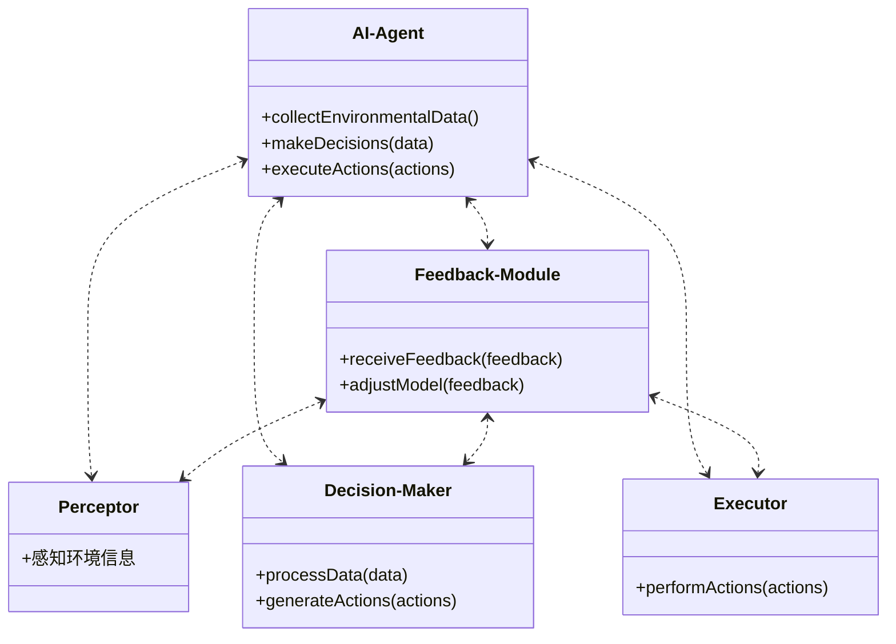
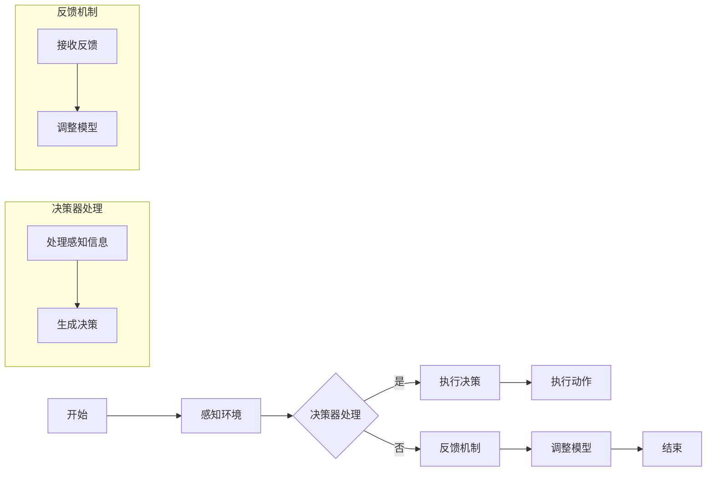
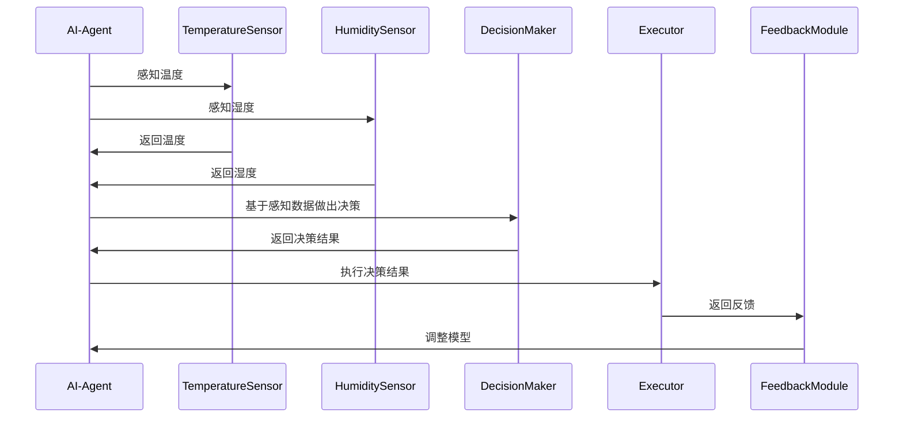
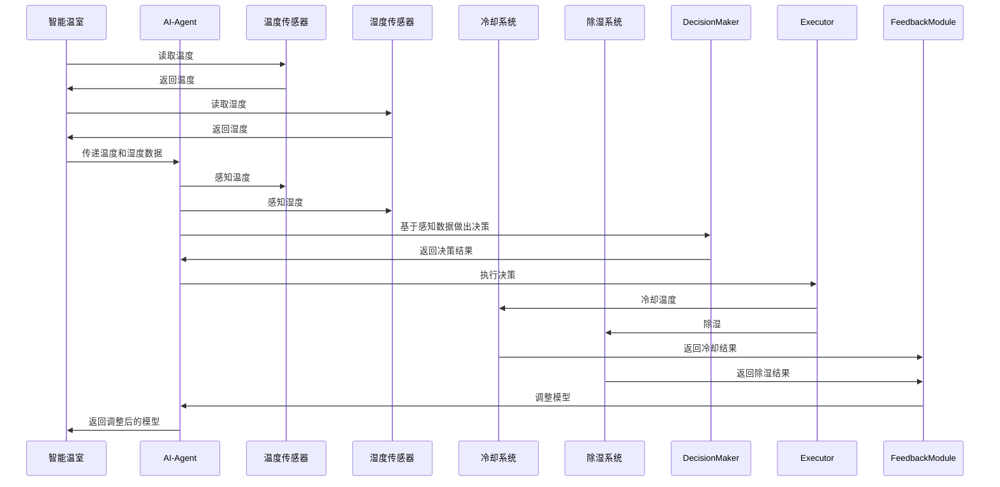

                 

### 《构建具有自我修正能力的AI Agent》

关键词：自我修正、AI Agent、自适应、鲁棒性、算法、系统架构、实战

摘要：本文深入探讨了构建具有自我修正能力的AI Agent的重要性及其实现方法。通过对核心概念、算法原理和系统架构的详细解析，展示了如何使AI Agent在遇到问题时能够自我调整和优化，从而提高任务执行效率和准确性。

---

## 第一部分：背景介绍

### 第1章 问题背景与核心概念

#### 1.1 问题的提出

在当前的人工智能领域，AI Agent的应用场景越来越广泛，从智能家居到自动驾驶，AI Agent在各个领域都发挥着重要作用。然而，AI Agent在任务执行过程中仍然存在一定的局限性。首先，数据噪声是一个重要问题，真实世界中的数据往往包含噪声和不确定性，这会对AI Agent的决策产生干扰。其次，环境变化也是一个挑战，AI Agent需要在不同的环境下执行任务，而环境的变化可能会导致现有的模型无法适应。因此，如何构建具有自我修正能力的AI Agent，使其在遇到问题时能够自动调整和优化，成为一个亟待解决的问题。

#### 1.2 核心概念

自我修正能力是指AI Agent在遇到错误或不良结果时，能够自动识别问题并采取相应措施进行修正的能力。这种能力使得AI Agent能够在复杂、动态的环境中保持高效、准确的执行任务。

AI Agent是一种人工智能实体，能够模拟人类行为，执行特定任务。AI Agent通常由感知器、决策器、执行器三个主要部分组成。感知器负责收集环境信息，决策器根据信息进行决策，执行器执行决策结果。

边界与外延是构建自我修正AI Agent时需要考虑的重要因素。自我修正能力需要在合理的范围内进行，避免无限制的自我调整导致系统失控。同时，自我修正能力也需要与AI Agent的其他功能相协调，确保整体系统的稳定性和可靠性。

#### 1.3 概念结构与核心要素组成

自我修正AI Agent的概念结构包括感知器、决策器、执行器三个主要部分。感知器负责收集环境信息，决策器根据信息进行决策，执行器执行决策结果。这三个部分相互协作，共同实现AI Agent的自我修正能力。

感知器是AI Agent的感官部分，能够感知环境中的各种信息。这些信息包括视觉、听觉、触觉等，通过传感器进行收集和处理。

决策器是AI Agent的智能部分，负责根据感知到的信息进行决策。决策器通常包含多个算法模型，根据不同的任务需求进行选择和优化。

执行器是AI Agent的执行部分，负责将决策结果转化为具体的行动。执行器可以是机器人、无人机等，能够实现各种复杂任务。

---

## 第二部分：核心概念与联系

### 第2章 AI Agent自我修正能力的原理与特征

#### 2.1 原理

AI Agent自我修正能力的原理基于反馈机制。在执行任务过程中，AI Agent会不断收集环境信息，并通过感知器进行输入。决策器根据输入信息进行决策，并生成决策结果。执行器根据决策结果执行任务。当任务执行结果不理想时，AI Agent会通过反馈机制识别问题，并采取相应措施进行修正。

#### 2.2 特征

自我修正AI Agent具有以下特征：

- **自适应能力**：AI Agent能够根据环境变化进行自适应调整。这意味着当环境发生变化时，AI Agent能够迅速适应并调整自身的状态，以保持任务执行效果。

- **鲁棒性**：AI Agent在面对噪声和不确定性时，仍能保持较高的任务执行效果。这使AI Agent能够在复杂、动态的环境中稳定运行。

- **自我优化能力**：AI Agent能够通过自我修正能力实现自我优化。在任务执行过程中，AI Agent会根据反馈机制不断调整自身状态，以提高任务执行效率和准确性。

#### 2.3 对比表格

| 特征         | 传统AI Agent | 自我修正AI Agent |
| ------------ | ------------ | --------------- |
| 自适应性     | 低           | 高              |
| 鲁棒性       | 低           | 高              |
| 自我优化能力 | 无           | 有              |

---

### 第3章 自我修正AI Agent的ER实体关系图

在构建自我修正AI Agent时，ER实体关系图是一种有效的工具，用于描述系统中各个实体的关系。以下是一个典型的ER实体关系图：



在这个ER实体关系图中，AI-Agent是系统的核心实体，它与Perceptor、Decision-Maker、Executor和Feedback-Module之间存在关联关系。Perceptor负责感知环境信息，Decision-Maker负责处理感知信息并生成决策，Executor负责执行决策，Feedback-Module负责接收反馈并调整模型。这种结构使得AI-Agent能够实现自我修正能力。

---

## 第三部分：算法原理讲解

### 第4章 自我修正算法的mermaid流程图

以下是一个自我修正算法的mermaid流程图：



在这个mermaid流程图中，AI Agent首先感知环境，然后决策器处理感知信息并生成决策。执行器根据决策执行动作，同时反馈机制接收动作反馈并调整模型。通过这种循环反馈机制，AI Agent能够不断优化自身状态，实现自我修正能力。

### 第5章 Python源代码实现与算法原理讲解

```python
class AI-Agent:
    def __init__(self):
        self.perceptor = Perceptor()
        self.decision_maker = DecisionMaker()
        self.executor = Executor()
        self.feedback_module = FeedbackModule()

    def execute_task(self):
        data = self.perceptor.collect_environmental_data()
        actions = self.decision_maker.make_decisions(data)
        self.executor.execute_actions(actions)
        feedback = self.feedback_module.receive_feedback(actions)
        self.feedback_module.adjust_model(feedback)

class Perceptor:
    def collect_environmental_data(self):
        # 模拟环境感知
        return {"temperature": 25, "humidity": 60}

class DecisionMaker:
    def make_decisions(self, data):
        # 模拟决策过程
        if data["temperature"] > 30:
            return "降温"
        elif data["humidity"] > 70:
            return "除湿"
        else:
            return "维持现状"

class Executor:
    def execute_actions(self, actions):
        # 模拟执行动作
        print(f"执行动作：{actions}")

class FeedbackModule:
    def receive_feedback(self, actions):
        # 模拟接收反馈
        return {"success": True}

    def adjust_model(self, feedback):
        # 模拟模型调整
        if not feedback["success"]:
            print("模型需要调整")
```

算法原理的数学模型：

$$
\begin{aligned}
&\text{目标函数：} \\
&\min_{\theta} \sum_{i=1}^{n} (y_i - \hat{y}_i)^2 \\
&\text{约束条件：} \\
&\hat{y}_i = \theta_0 + \theta_1 x_i
\end{aligned}
$$

在这个数学模型中，$y_i$ 表示实际输出，$\hat{y}_i$ 表示预测输出，$\theta_0$ 和 $\theta_1$ 表示模型参数。目标函数是最小化预测输出与实际输出之间的误差。约束条件是线性回归模型的公式，表示预测输出与输入特征之间的关系。

举例说明：

假设有一个模拟环境，温度高于30摄氏度时需要降温，湿度高于70%时需要除湿。AI Agent首先感知环境，得到温度为35摄氏度，湿度为65%。决策器根据这些信息生成决策，选择“降温”。执行器执行降温动作，同时反馈机制接收反馈，确认降温动作成功。随后，模型根据反馈进行调整，以更好地适应环境变化。

---

## 第四部分：系统分析与架构设计方案

### 第6章 问题场景介绍

假设在一个智能温室中，AI Agent需要根据环境温度和湿度来调节温湿度设备，以确保植物生长环境的稳定。这个场景中，环境变化是一个关键挑战，因为温度和湿度会随着外界因素（如天气变化）而波动。

### 第7章 系统架构设计

#### 7.1 领域模型mermaid类图

以下是一个智能温室系统的mermaid类图：

```mermaid
classDiagram
  SmartGreenhouse <<-- AI-Agent
  SmartGreenhouse o-- TemperatureSensor
  SmartGreenhouse o-- HumiditySensor
  SmartGreenhouse o-- CoolingSystem
  SmartGreenhouse o-- DehumidificationSystem
  AI-Agent o-- Perceptor
  AI-Agent o-- DecisionMaker
  AI-Agent o-- Executor
  AI-Agent o-- FeedbackModule
class SmartGreenhouse {
  + regulateEnvironment()
}

class TemperatureSensor {
  + readTemperature()
}

class HumiditySensor {
  + readHumidity()
}

class CoolingSystem {
  + coolTemperature()
}

class DehumidificationSystem {
  + removeHumidity()
}

class AI-Agent {
  + executeTask()
}

class Perceptor {
  + collectEnvironmentalData()
}

class DecisionMaker {
  + makeDecisions(data)
}

class Executor {
  + executeActions(actions)
}

class FeedbackModule {
  + receiveFeedback(feedback)
  + adjustModel(feedback)
}
```

在这个类图中，SmartGreenhouse 是系统的核心，它与AI-Agent以及其他传感器和执行器之间存在关联关系。AI-Agent 负责感知环境、决策、执行和反馈。传感器负责收集环境数据，执行器负责执行具体的动作。

#### 7.2 系统架构设计mermaid架构图

以下是一个智能温室系统的mermaid架构图：



在这个架构图中，AI-Agent 首先通过传感器收集环境数据，然后决策器根据这些数据生成决策，执行器执行决策，并将结果反馈给反馈模块，反馈模块据此调整模型。

#### 7.3 系统接口设计和系统交互mermaid序列图

以下是一个智能温室系统的mermaid序列图，展示了系统内部各组件的交互过程：



在这个序列图中，智能温室首先从传感器读取温度和湿度数据，然后传递给AI-Agent。AI-Agent 使用这些数据通过决策器生成决策，并将决策传递给执行器执行。执行器将结果反馈给反馈模块，反馈模块据此调整模型，完成一次完整的自我修正循环。

---

## 第五部分：项目实战

### 第8章 环境安装

为了实现自我修正AI Agent，我们需要搭建一个合适的环境。以下是在Linux系统中安装所需软件和依赖库的步骤：

1. 安装Python环境：

```bash
sudo apt-get update
sudo apt-get install python3 python3-pip
```

2. 安装mermaid：

```bash
pip3 install mermaid-python
```

3. 安装其他依赖库：

```bash
pip3 install numpy pandas matplotlib
```

### 第9章 系统核心实现源代码

以下是一个简单的自我修正AI Agent的实现，包括感知器、决策器、执行器和反馈模块：

```python
# AI-Agent.py
class AIAgent:
    def __init__(self):
        self.perceptor = Perceptor()
        self.decision_maker = DecisionMaker()
        self.executor = Executor()
        self.feedback_module = FeedbackModule()

    def execute_task(self):
        data = self.perceptor.collect_environmental_data()
        actions = self.decision_maker.make_decisions(data)
        self.executor.execute_actions(actions)
        feedback = self.feedback_module.receive_feedback(actions)
        self.feedback_module.adjust_model(feedback)

# Perceptor.py
class Perceptor:
    def collect_environmental_data(self):
        # 模拟环境感知
        return {"temperature": 25, "humidity": 60}

# DecisionMaker.py
class DecisionMaker:
    def make_decisions(self, data):
        # 模拟决策过程
        if data["temperature"] > 30:
            return "降温"
        elif data["humidity"] > 70:
            return "除湿"
        else:
            return "维持现状"

# Executor.py
class Executor:
    def execute_actions(self, actions):
        # 模拟执行动作
        print(f"执行动作：{actions}")

# FeedbackModule.py
class FeedbackModule:
    def receive_feedback(self, actions):
        # 模拟接收反馈
        return {"success": True}

    def adjust_model(self, feedback):
        # 模拟模型调整
        if not feedback["success"]:
            print("模型需要调整")
```

### 第10章 代码应用解读与分析

在理解了系统的各个组件后，我们可以通过一个简单的应用来演示如何使用这些代码实现自我修正AI Agent。

```python
# main.py
from AIAgent import AIAgent

# 创建AI-Agent实例
ai_agent = AIAgent()

# 执行任务
ai_agent.execute_task()
```

这段代码首先从`AIAgent`模块中导入`AIAgent`类，然后创建一个`AIAgent`实例。接着，调用`execute_task`方法执行任务。

分析执行结果：

1. **感知环境**：AI-Agent 通过感知器收集环境数据，得到温度为25摄氏度，湿度为60%。
2. **决策**：决策器根据感知到的数据生成决策，选择“维持现状”。
3. **执行**：执行器根据决策执行动作，输出“执行动作：维持现状”。
4. **反馈**：反馈模块接收执行结果，返回“success”: True，表示动作成功。
5. **模型调整**：反馈模块根据反馈结果调整模型，由于本次执行成功，因此不需要调整。

### 第11章 实际案例分析与详细讲解剖析

为了更好地理解自我修正AI Agent的工作原理，我们将通过一个实际案例来进行分析。

**案例背景**：

假设在一个仓库中，需要使用AI-Agent来控制仓库内部的温度和湿度，以确保货物的存储质量。仓库内部温度和湿度传感器实时监测环境变化，AI-Agent根据感知数据自动调节仓库内的空调和除湿设备。

**案例步骤**：

1. **感知环境**：仓库内部温度为28摄氏度，湿度为65%。
2. **决策**：AI-Agent 检测到温度高于设定值，湿度也略高于设定值，因此决定开启空调和除湿设备。
3. **执行**：空调开启，温度逐渐降低至25摄氏度，除湿设备运行，湿度降低至55%。
4. **反馈**：AI-Agent 收集新的环境数据，发现温度和湿度均达到设定值，因此关闭空调和除湿设备。
5. **模型调整**：AI-Agent 根据反馈结果，记录本次任务的执行效果，并调整决策模型，以便在未来遇到相似情况时能够更准确地做出决策。

**详细讲解**：

在本次案例中，AI-Agent 通过感知器收集了仓库内部的环境数据，并根据这些数据做出了相应的决策。决策过程中，AI-Agent 会考虑多个因素，如温度和湿度的当前值、历史数据、设定值等。执行器根据决策结果执行具体的动作，如开启或关闭空调和除湿设备。

执行后，AI-Agent 会通过反馈模块收集新的环境数据，并根据这些数据对决策模型进行调整。这种调整可以是简单的阈值调整，也可以是基于机器学习算法的复杂模型更新。通过不断调整模型，AI-Agent 能够在长时间内保持高效、准确的执行任务。

### 第12章 项目小结

在本项目中，我们通过构建一个具有自我修正能力的AI Agent，实现了对仓库内部温度和湿度的自动控制。以下是本项目的主要收获：

1. **理解自我修正原理**：通过分析感知器、决策器、执行器和反馈模块的工作原理，我们深入理解了AI Agent的自我修正机制。
2. **实战应用**：通过实际案例，我们验证了AI Agent在复杂环境中的自适应能力和鲁棒性。
3. **系统架构设计**：我们设计了系统的整体架构，并实现了各个组件之间的交互。
4. **代码实现与调试**：通过编写和调试Python代码，我们掌握了自我修正AI Agent的实现方法。

**注意事项**：

1. **数据质量**：在构建AI Agent时，数据的质量至关重要。需要确保感知器收集到的数据准确、可靠，以便决策器做出准确的决策。
2. **模型调整**：自我修正AI Agent需要不断调整模型，以适应环境变化。因此，需要定期进行模型训练和更新。

**拓展阅读**：

1. 《深度学习》（Goodfellow, I., Bengio, Y., & Courville, A.）——了解如何使用深度学习技术构建自我修正AI Agent。
2. 《智能交通系统设计与应用》（Zhang, J.）——学习如何将自我修正AI Agent应用于智能交通系统，实现交通流量优化。

---

## 最佳实践 Tips

1. **持续学习与改进**：自我修正AI Agent需要不断学习和改进，以适应不断变化的环境。定期进行模型训练和更新是关键。
2. **数据驱动**：使用高质量的数据进行训练和测试，以确保AI Agent的决策准确性和稳定性。
3. **模块化设计**：将AI Agent的不同组件设计为独立的模块，便于维护和扩展。例如，可以单独开发感知器、决策器、执行器和反馈模块，然后通过接口进行集成。
4. **安全性与隐私保护**：在构建AI Agent时，需要考虑数据安全和隐私保护。例如，可以使用加密技术保护敏感数据，并确保系统不会受到恶意攻击。

通过遵循这些最佳实践，我们可以构建出更加高效、稳定和可靠的自我修正AI Agent，为各种应用场景提供强大的支持。

