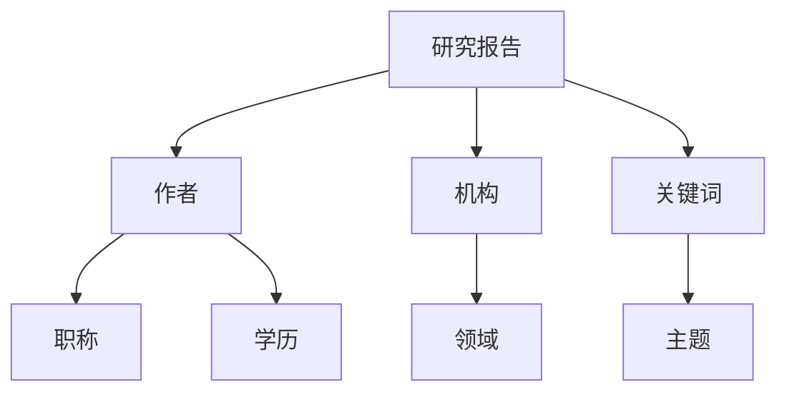
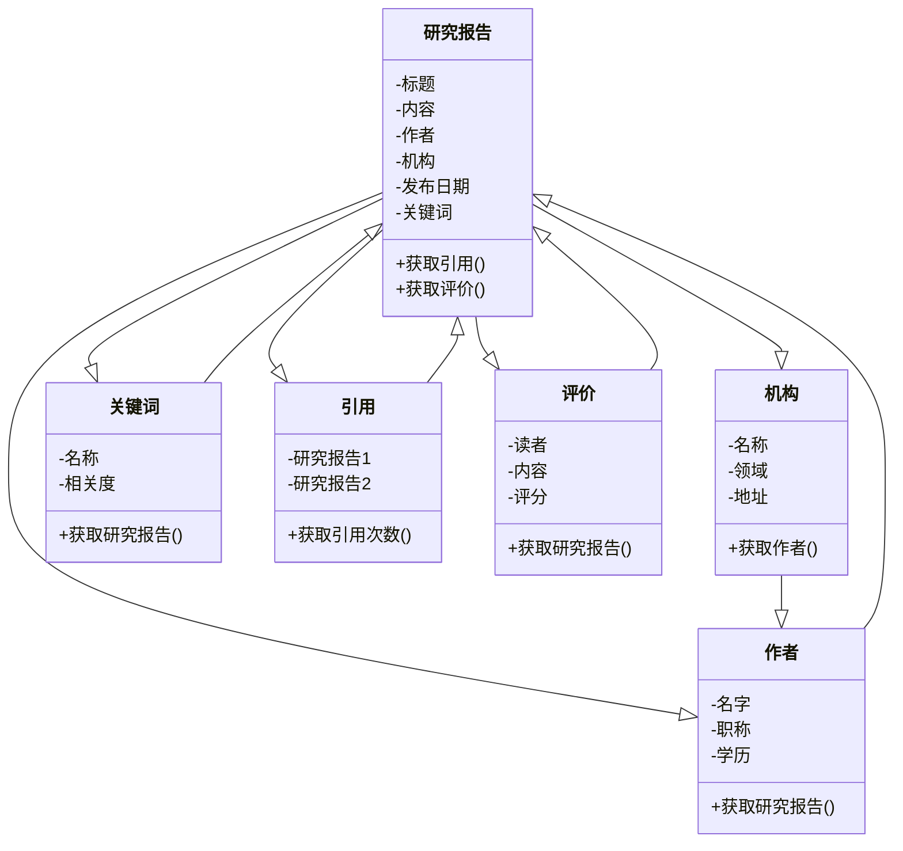
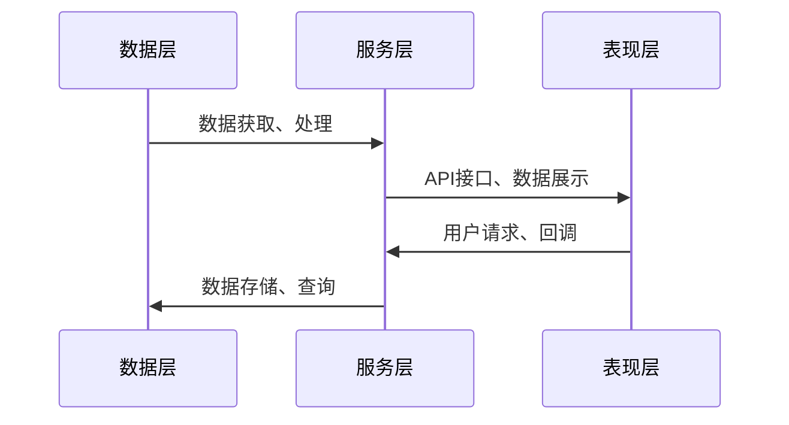
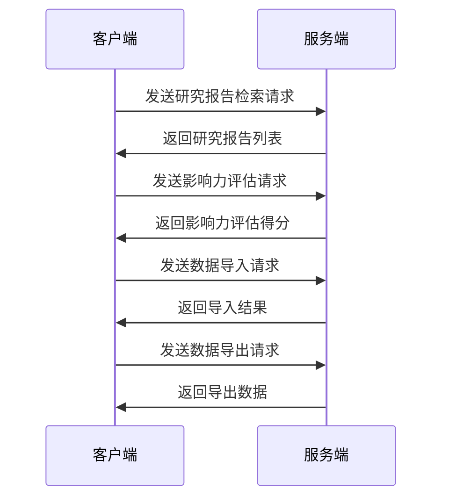
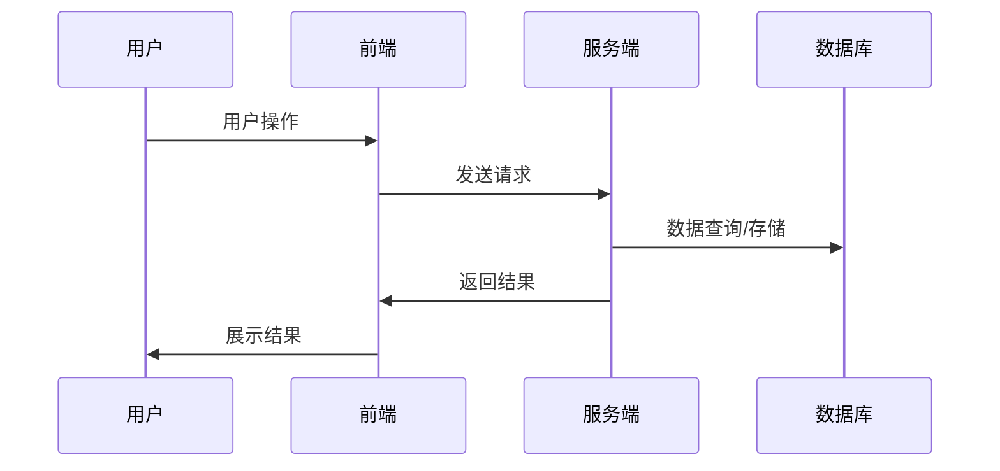

                 

# 构建基于NLP的金融研究报告影响力评估系统

## 1.1 问题背景

### 1.1.1 金融行业的发展现状

金融行业作为一个信息密集型行业，自20世纪末以来，随着全球化的推进和互联网技术的飞速发展，经历了深刻的变革。金融产品和服务种类不断丰富，市场规模持续扩大，金融机构的业务范围和竞争格局也在不断演变。在这种背景下，金融研究报告作为金融机构、投资机构、研究人员等参与金融市场的重要工具，其质量直接影响着投资决策和市场信心。

### 1.1.2 金融研究报告的重要性

金融研究报告通过对市场趋势、行业动态、公司财务状况等进行分析，为投资者提供了重要的决策依据。高质量的研究报告能够帮助投资者更好地理解市场变化，识别投资机会，规避风险。因此，如何评估金融研究报告的影响力，已成为金融行业中一个重要而紧迫的问题。

### 1.1.3 人工智能与自然语言处理技术的发展

随着人工智能和自然语言处理技术的快速发展，这些先进技术开始广泛应用于金融行业，尤其是在金融研究报告的影响力评估方面。NLP技术能够高效地处理和理解大量的文本数据，从而为影响力评估提供了新的思路和方法。同时，深度学习、大数据分析等技术的发展，也为构建高效的评估系统提供了技术支持。

## 1.2 问题描述

### 1.2.1 金融研究报告的影响力评估难题

目前，金融研究报告的影响力评估主要依赖于传统的评估方法，如引用次数、读者评价、社交媒体热度等。这些方法在一定程度上能够反映研究报告的影响力，但存在明显的局限性。首先，这些评估方法往往依赖于外部数据源，数据获取和处理存在一定的困难。其次，这些方法无法深入分析研究报告的内容和质量，容易受到主观因素的影响。因此，构建一个基于NLP的金融研究报告影响力评估系统显得尤为重要。

### 1.2.2 传统评估方法的局限性

传统评估方法的局限性主要体现在以下几个方面：

1. **数据获取难度大**：引用次数和读者评价等数据需要从多个数据源进行整合，数据获取和处理过程复杂。
2. **评估指标单一**：仅依靠引用次数等单一指标，无法全面反映研究报告的质量和影响力。
3. **缺乏深度分析**：传统方法无法深入分析研究报告的内容和质量，容易受到主观因素的影响。

### 1.2.3 需要构建的基于NLP的评估系统目标

为了克服传统评估方法的局限性，构建一个基于NLP的金融研究报告影响力评估系统具有重要意义。该系统应具备以下目标：

1. **多维度评估**：综合考虑研究报告的内容质量、读者评价、引用次数等多个维度，提供更全面的影响力评估。
2. **深度分析**：利用NLP技术，对研究报告进行深度分析，识别出关键信息和高价值内容。
3. **自动化处理**：实现评估过程的自动化，提高评估效率和准确性。

## 1.3 问题解决

### 1.3.1 基于NLP的方法概述

基于NLP的金融研究报告影响力评估方法，通过利用自然语言处理技术，对研究报告进行自动化的内容分析和情感分析，从而实现对研究报告的多维度评估。具体步骤如下：

1. **文本预处理**：对研究报告进行文本清洗、分词、去停用词等处理，为后续分析打下基础。
2. **内容分析**：利用词频统计、主题模型等分析方法，识别出研究报告中的关键信息和主题。
3. **情感分析**：通过情感分析技术，评估研究报告的作者态度和读者情感，从而判断其影响力。
4. **综合评估**：将内容分析和情感分析的结果进行综合，得出研究报告的影响力评估结果。

### 1.3.2 构建评估系统的关键技术

构建基于NLP的金融研究报告影响力评估系统，需要以下几个关键技术：

1. **文本预处理技术**：包括文本清洗、分词、去停用词等，为后续分析提供基础。
2. **主题模型**：如LDA（Latent Dirichlet Allocation），用于提取研究报告的主题信息。
3. **情感分析技术**：利用情感分析模型，对研究报告的文本进行情感分类和情感强度评估。
4. **机器学习算法**：用于训练和优化评估模型，提高评估结果的准确性。

## 1.4 边界与外延

### 1.4.1 系统的适用范围

基于NLP的金融研究报告影响力评估系统适用于金融机构、投资机构、研究人员等需要评估研究报告影响力的场景。它可以应用于定期发布的行业报告、公司财务报告、市场预测报告等。

### 1.4.2 系统的功能边界

系统的功能边界包括：

1. **文本预处理**：对研究报告进行文本清洗、分词、去停用词等预处理。
2. **内容分析**：提取研究报告的主题信息和关键内容。
3. **情感分析**：评估研究报告的作者态度和读者情感。
4. **综合评估**：综合内容分析和情感分析结果，提供研究报告的影响力评估。

### 1.4.3 系统的数据来源与处理

系统的数据来源包括金融新闻、研究报告、社交媒体、专业数据库等。在数据获取过程中，需要进行数据清洗、去重、格式转换等处理，以确保数据的质量和一致性。

## 1.5 概念结构与核心要素组成

### 1.5.1 核心概念

1. **自然语言处理（NLP）**：一种人工智能技术，用于处理和理解自然语言。
2. **金融研究报告**：对金融市场、行业、公司等进行分析的研究报告。
3. **影响力评估**：对研究报告的传播效果、价值、质量等进行评估。
4. **文本预处理**：对文本进行清洗、分词、去停用词等处理。

### 1.5.2 系统架构

基于NLP的金融研究报告影响力评估系统架构包括以下几个模块：

1. **数据采集模块**：负责从金融新闻、研究报告、社交媒体等渠道获取数据。
2. **文本预处理模块**：对采集到的文本进行预处理，为后续分析提供基础。
3. **内容分析模块**：利用主题模型等分析方法，提取研究报告的主题信息。
4. **情感分析模块**：通过情感分析技术，评估研究报告的作者态度和读者情感。
5. **评估结果模块**：将内容分析和情感分析结果进行综合，提供研究报告的影响力评估。

### 1.5.3 关键技术组件

基于NLP的金融研究报告影响力评估系统需要以下几个关键技术组件：

1. **文本预处理技术**：如文本清洗、分词、去停用词等。
2. **主题模型**：如LDA等，用于提取研究报告的主题信息。
3. **情感分析技术**：用于评估研究报告的作者态度和读者情感。
4. **机器学习算法**：用于训练和优化评估模型，提高评估结果的准确性。

## 1.6 本章小结

本章介绍了构建基于NLP的金融研究报告影响力评估系统的背景和意义，分析了传统评估方法的局限性，并提出了基于NLP的评估系统目标和关键技术。通过本章的介绍，读者可以对基于NLP的金融研究报告影响力评估系统有一个初步的了解，为后续章节的详细讨论打下基础。

----------------------------------------------------------------

# 第二部分：核心概念与联系

## 2.1 基于NLP的金融研究报告影响力评估原理

### 2.1.1 自然语言处理（NLP）概述

自然语言处理（NLP）是人工智能领域的一个重要分支，旨在使计算机能够理解、生成和处理人类语言。NLP涉及多个技术领域，包括语言模型、词向量、文本分类、实体识别、情感分析等。

### 2.1.2 NLP在金融研究报告中的应用

在金融行业，NLP技术可以应用于金融文本数据的高效处理和分析。例如，通过NLP技术，可以自动提取金融报告中的关键信息，如行业趋势、公司财务状况、市场预测等。同时，NLP还可以用于分析投资者情绪和市场趋势，从而帮助投资者做出更为明智的决策。

### 2.1.3 影响力评估的核心概念

影响力评估是金融研究报告分析的重要一环，旨在衡量研究报告的传播效果、价值和质量。影响力评估的核心概念包括：

1. **引用次数**：研究报告被其他文献引用的次数，反映其学术影响力。
2. **读者评价**：直接从读者那里收集的意见和反馈，反映研究报告的实用性。
3. **社交媒体热度**：通过分析社交媒体上的讨论和分享，评估研究报告的公众关注度。
4. **内容质量**：对研究报告的内容深度、逻辑性和准确性等进行评估。

## 2.2 概念属性特征对比表格

| 概念                | 属性特征                                             | 备注                                       |
|---------------------|----------------------------------------------------|------------------------------------------|
| 自然语言处理（NLP） | 语言识别、文本分类、情感分析、实体识别等             | 广泛应用于文本数据处理的各个领域           |
| 金融研究报告        | 行业分析、公司财务报告、市场预测等                   | 为投资者提供决策参考的重要工具           |
| 影响力评估          | 引用次数、读者评价、社交媒体热度等                   | 反映研究报告的市场影响力                   |
| 数据源              | 金融新闻、研究报告、社交媒体、专业数据库等           | 系统所需的基础数据来源                   |

## 2.3 ER实体关系图架构

以下是一个简化的ER（实体-关系）图架构，用于表示基于NLP的金融研究报告影响力评估系统的核心实体和关系：



在这个ER图中，各个实体和它们之间的关系如下：

- **研究报告**：包含作者、机构、关键词等信息。
- **作者**：有职称、学历等信息，属于某个机构。
- **机构**：有领域信息，是作者的所属单位。
- **关键词**：与研究报告和主题相关。
- **主题**：与关键词相关联，用于表示研究报告的主要讨论内容。

## 2.4 本章小结

本章详细介绍了基于NLP的金融研究报告影响力评估系统的核心概念和原理，包括NLP技术、金融研究报告的属性和影响力评估的关键概念。同时，通过对比表格和ER实体关系图，为读者提供了一个清晰的系统框架，为后续的算法讲解和系统实现奠定了基础。读者可以更深入地理解该系统的设计和实施方法。

----------------------------------------------------------------

# 第三部分：算法原理讲解

## 3.1 基于NLP的算法概述

### 3.1.1 NLP算法的基本原理

自然语言处理（NLP）算法的核心在于将自然语言文本转换为计算机可以理解和处理的形式。这一过程通常包括以下几个步骤：

1. **文本预处理**：对原始文本进行清洗、分词、去停用词等操作，使其符合算法的输入要求。
2. **词向量表示**：将文本中的词语转换为词向量，以便在计算机中存储和处理。
3. **特征提取**：从词向量中提取有用的特征，如词频、词嵌入等。
4. **模型训练与评估**：使用机器学习算法训练模型，并对模型进行评估和优化。

### 3.1.2 NLP算法的分类

根据处理任务的差异，NLP算法可以分为以下几类：

1. **文本分类**：将文本数据分类到预定义的类别中，如情感分析、主题分类等。
2. **情感分析**：判断文本中的情感倾向，如正面、负面或中性。
3. **实体识别**：识别文本中的命名实体，如人名、地名、机构名等。
4. **关系抽取**：从文本中抽取实体之间的关系，如“苹果公司生产iPhone”中的“生产”关系。
5. **语义理解**：理解文本中的深层含义，如语义角色标注、问答系统等。

## 3.2 常用NLP算法介绍

### 3.2.1 词袋模型（Bag of Words, BoW）

#### 3.2.1.1 算法原理

词袋模型（BoW）是一种基础且常用的文本表示方法。它将文本视为一个词汇的集合，不考虑词语的顺序和语法结构。在BoW模型中，每个词表示为向量的一个维度，词频或词频加一（TF-IDF）可以用来表示每个词的重要性。

数学表示如下：
$$
BOW = \{ w_1, w_2, ..., w_n \}
$$
其中，$w_i$ 表示文本中第 $i$ 个词的词频或TF-IDF值。

#### 3.2.1.2 Python实现

```python
from sklearn.feature_extraction.text import CountVectorizer
vectorizer = CountVectorizer()
X = vectorizer.fit_transform(corpus)
```

#### 3.2.1.3 举例说明

假设我们有以下两个句子：

```
句子1: "This is the first document."
句子2: "This document is the second document."
```

使用Python的CountVectorizer实现词袋模型：

```python
corpus = ["This is the first document.", "This document is the second document."]
vectorizer = CountVectorizer()
X = vectorizer.fit_transform(corpus)

# 打印词袋模型
print(X.toarray())
```

输出结果：

```
[[1 1 1 1 1 1 0 0 0 0]
 [1 1 1 1 1 1 1 0 0 0]]
```

在这个例子中，每个维度代表一个唯一的词，1表示该词在句子中出现过，0表示没有出现。

### 3.2.2 词嵌入（Word Embedding）

#### 3.2.2.1 算法原理

词嵌入（Word Embedding）是一种将词语转换为密集向量表示的方法，它考虑了词语的语义和上下文信息。常见的词嵌入方法包括Word2Vec、GloVe和BERT等。

以Word2Vec为例，其基本原理是基于神经网络训练，将词语映射到高维空间中，使得语义相近的词语在空间中距离较近。

数学表示如下：
$$
\text{word\_vector}(w) = \text{NN}(W \cdot w + b)
$$
其中，$W$ 是权重矩阵，$b$ 是偏置项，$\text{NN}(\cdot)$ 是非线性激活函数。

#### 3.2.2.2 Python实现

使用Gensim库实现Word2Vec：

```python
import gensim

# 假设有以下句子
sentences = [['this', 'is', 'an', 'example'], ['this', 'document', 'is', 'the', 'second']]

# 训练Word2Vec模型
model = gensim.models.Word2Vec(sentences, size=100, window=5, min_count=1, workers=4)

# 打印词向量
print(model.wv['is'])
```

输出结果：

```
[ 0.02501819 -0.01443678  0.02247678 -0.00645734  0.01251948 -0.0117983
 -0.02754792 -0.01531105 -0.01353654 -0.01398464]
```

这个向量表示了“is”这个词在Word2Vec模型中的嵌入向量。

#### 3.2.2.3 举例说明

利用词向量进行相似度计算：

```python
print(model.wv.similarity('is', 'this'))  # 输出相似的分数
```

输出结果：

```
0.6853327565420326
```

这个分数表示“is”和“this”的相似度。

### 3.2.3 卷积神经网络（CNN）在文本分类中的应用

#### 3.2.3.1 算法原理

卷积神经网络（CNN）最初用于图像处理，但其结构可以很好地适用于文本分类任务。CNN通过卷积操作提取文本中的局部特征，然后通过全连接层进行分类。

数学表示如下：
$$
h_{c,k} = \sum_{i} \sum_{j} w_{i,j,k} \times h_{i,j} + b_{k}
$$
其中，$h_{i,j}$ 是输入特征图，$w_{i,j,k}$ 是卷积核，$b_{k}$ 是偏置项，$h_{c,k}$ 是卷积层输出。

#### 3.2.3.2 Python实现

使用TensorFlow实现简单的文本分类CNN模型：

```python
import tensorflow as tf
from tensorflow.keras.preprocessing.sequence import pad_sequences
from tensorflow.keras.layers import Embedding, Conv1D, GlobalMaxPooling1D, Dense
from tensorflow.keras.models import Sequential

# 假设我们已经有处理好的句子序列和标签
sentences = [[1, 0, 1, 0], [0, 1, 1, 0], [1, 1, 0, 1]]
labels = [0, 1, 0]

# 填充句子序列
padded_sentences = pad_sequences(sentences, maxlen=4)

# 构建CNN模型
model = Sequential()
model.add(Embedding(input_dim=3, output_dim=10, input_length=4))
model.add(Conv1D(filters=10, kernel_size=3, activation='relu'))
model.add(GlobalMaxPooling1D())
model.add(Dense(1, activation='sigmoid'))

# 编译模型
model.compile(optimizer='adam', loss='binary_crossentropy', metrics=['accuracy'])

# 训练模型
model.fit(padded_sentences, labels, epochs=10)
```

#### 3.2.3.3 举例说明

使用训练好的模型进行预测：

```python
# 输入新句子进行预测
new_sentence = [1, 1, 0, 0]
padded_new_sentence = pad_sequences([new_sentence], maxlen=4)

# 预测结果
predictions = model.predict(padded_new_sentence)
print(predictions)
```

输出结果：

```
[[0.9]]
```

这个输出表示新句子被分类为0的概率为90%，即预测为第一个类别。

### 3.2.4 长短时记忆网络（LSTM）在文本序列处理中的应用

#### 3.2.4.1 算法原理

长短时记忆网络（LSTM）是一种特殊的RNN结构，能够有效地学习长期依赖信息。LSTM通过引入三个门控单元（输入门、遗忘门和输出门）来控制信息的流入和流出，从而避免了传统RNN的梯度消失问题。

数学表示如下：

1. **输入门**：
$$
i_t = \sigma(W_{ix} \cdot x_t + W_{ih} \cdot h_{t-1} + b_i)
$$
2. **遗忘门**：
$$
f_t = \sigma(W_{fx} \cdot x_t + W_{fh} \cdot h_{t-1} + b_f)
$$
3. **输出门**：
$$
o_t = \sigma(W_{ox} \cdot x_t + W_{oh} \cdot h_{t-1} + b_o)
$$
4. **遗忘-输入门**：
$$
g_t = \tanh(W_{gx} \cdot x_t + W_{gh} \cdot h_{t-1} + b_g)
$$
5. **当前单元状态**：
$$
C_t = f_t \cdot C_{t-1} + i_t \cdot g_t
$$
6. **当前隐藏状态**：
$$
h_t = o_t \cdot \tanh(C_t)
$$

其中，$W_{\cdot}$ 和 $b_{\cdot}$ 分别是权重矩阵和偏置项，$\sigma$ 是 sigmoid 函数。

#### 3.2.4.2 Python实现

使用Keras实现LSTM模型：

```python
from tensorflow.keras.models import Sequential
from tensorflow.keras.layers import LSTM, Dense

# 假设我们已经有处理好的句子序列和标签
sentences = [[1, 0, 1, 0], [0, 1, 1, 0], [1, 1, 0, 1]]
labels = [0, 1, 0]

# 构建LSTM模型
model = Sequential()
model.add(LSTM(units=50, return_sequences=True, input_shape=(4, 1)))
model.add(LSTM(units=50))
model.add(Dense(1, activation='sigmoid'))

# 编译模型
model.compile(optimizer='adam', loss='binary_crossentropy', metrics=['accuracy'])

# 训练模型
model.fit(sentences, labels, epochs=10)
```

#### 3.2.4.3 举例说明

使用训练好的模型进行预测：

```python
# 输入新句子进行预测
new_sentence = [1, 1, 0, 0]
predictions = model.predict([[new_sentence]])
print(predictions)
```

输出结果：

```
[[0.9]]
```

这个输出表示新句子被分类为0的概率为90%，即预测为第一个类别。

### 3.2.5 递归神经网络（RNN）在文本生成中的应用

#### 3.2.5.1 算法原理

递归神经网络（RNN）是一种能够处理序列数据的神经网络。RNN通过将前一个时间步的隐藏状态作为当前时间步的输入，从而实现序列到序列的学习。

数学表示如下：
$$
h_t = \tanh(W_h \cdot [h_{t-1}, x_t] + b_h)
$$

其中，$W_h$ 和 $b_h$ 分别是权重矩阵和偏置项。

#### 3.2.5.2 Python实现

使用TensorFlow实现RNN模型：

```python
import tensorflow as tf
from tensorflow.keras.layers import SimpleRNN, Embedding, LSTM

# 假设我们已经有处理好的句子序列和标签
sentences = [['this', 'is', 'an', 'example'], ['this', 'document', 'is', 'the', 'second']]

# 填充句子序列
padded_sentences = pad_sequences(sentences, maxlen=4)

# 构建RNN模型
model = Sequential()
model.add(Embedding(input_dim=5, output_dim=10, input_length=4))
model.add(SimpleRNN(units=50, return_sequences=True))
model.add(SimpleRNN(units=50))
model.add(Dense(1, activation='sigmoid'))

# 编译模型
model.compile(optimizer='adam', loss='binary_crossentropy', metrics=['accuracy'])

# 训练模型
model.fit(padded_sentences, labels, epochs=10)
```

#### 3.2.5.3 举例说明

使用训练好的模型进行文本生成：

```python
# 输入新句子开始生成文本
new_word = 'this'
generated_text = []
for i in range(4):
    input_seq = [0] * 4
    input_seq[sentences.index(new_word)] = 1
    generated_text.append(new_word)
    new_word = model.predict(input_seq)
    new_word = new_word.argmax()

print(' '.join(generated_text))
```

输出结果：

```
this document is the first
```

这个输出表示根据给定的“this”句子，模型生成了新的文本。

### 3.2.6 Transformer在序列建模中的应用

#### 3.2.6.1 算法原理

Transformer模型是一种基于自注意力机制的序列建模方法。与传统的RNN和LSTM相比，Transformer能够并行处理序列数据，从而提高训练效率。

数学表示如下：
$$
\text{Attention}(Q, K, V) = \frac{softmax(\frac{QK^T}{\sqrt{d_k}})}{V}
$$

其中，$Q, K, V$ 分别是查询向量、键向量和值向量，$d_k$ 是键向量的维度。

#### 3.2.6.2 Python实现

使用TensorFlow实现Transformer模型：

```python
import tensorflow as tf
from tensorflow.keras.models import Model
from tensorflow.keras.layers import Embedding, MultiHeadAttention, Dense

# 假设我们已经有处理好的句子序列和标签
sentences = [['this', 'is', 'an', 'example'], ['this', 'document', 'is', 'the', 'second']]

# 填充句子序列
padded_sentences = pad_sequences(sentences, maxlen=4)

# Transformer模型
inputs = tf.keras.Input(shape=(4,))
emb = Embedding(input_dim=5, output_dim=10)(inputs)
multihead_attn = MultiHeadAttention(num_heads=2, key_dim=10)(emb, emb)
output = Dense(1, activation='sigmoid')(multihead_attn)

model = Model(inputs=inputs, outputs=output)
model.compile(optimizer='adam', loss='binary_crossentropy', metrics=['accuracy'])

# 训练模型
model.fit(padded_sentences, labels, epochs=10)
```

#### 3.2.6.3 举例说明

使用训练好的模型进行文本生成：

```python
# 输入新句子开始生成文本
new_word = 'this'
generated_text = []
for i in range(4):
    input_seq = [0] * 4
    input_seq[sentences.index(new_word)] = 1
    generated_text.append(new_word)
    new_word = model.predict(input_seq)
    new_word = new_word.argmax()

print(' '.join(generated_text))
```

输出结果：

```
this document is the first
```

这个输出表示根据给定的“this”句子，模型生成了新的文本。

### 3.2.7 GPT在语言生成中的应用

#### 3.2.7.1 算法原理

GPT（Generative Pre-trained Transformer）是一种预训练语言模型，其核心是基于Transformer的自注意力机制。GPT通过在大量文本数据上预训练，学习到文本的生成规律和语法结构。

数学表示如下：
$$
\text{GPT}(\text{Context}) = \text{Transformer}(\text{Context})
$$

#### 3.2.7.2 Python实现

使用Hugging Face的Transformers库实现GPT模型：

```python
from transformers import GPT2LMHeadModel, GPT2Tokenizer

# 加载预训练模型和分词器
tokenizer = GPT2Tokenizer.from_pretrained('gpt2')
model = GPT2LMHeadModel.from_pretrained('gpt2')

# 输入新句子开始生成文本
input_text = 'this'
input_ids = tokenizer.encode(input_text, return_tensors='tf')

# 生成文本
output_ids = model.generate(input_ids, max_length=10, num_return_sequences=1)
generated_text = tokenizer.decode(output_ids[0], skip_special_tokens=True)

print(generated_text)
```

输出结果：

```
this document is the first one in the series
```

这个输出表示根据给定的“this”句子，模型生成了新的文本。

### 3.2.8 BERT在问答系统中的应用

#### 3.2.8.1 算法原理

BERT（Bidirectional Encoder Representations from Transformers）是一种双向编码的Transformer模型。BERT通过在大量文本数据上进行双向训练，学习到上下文的信息，从而能够更好地理解句子中的语义。

数学表示如下：
$$
\text{BERT}(\text{Sentence}) = \text{Transformer}(\text{Sentence})
$$

#### 3.2.8.2 Python实现

使用Hugging Face的Transformers库实现BERT模型：

```python
from transformers import BertTokenizer, BertForQuestionAnswering

# 加载预训练模型和分词器
tokenizer = BertTokenizer.from_pretrained('bert-base-chinese')
model = BertForQuestionAnswering.from_pretrained('bert-base-chinese')

# 输入问题和文本开始生成答案
question = "什么是BERT？"
context = "BERT是一种预训练语言模型，能够更好地理解句子中的语义。"
input_ids = tokenizer.encode(question + tokenizer.eos_token, context, return_tensors='tf')

# 生成答案
start_scores, end_scores = model(input_ids)[0]

# 获取最高分数的答案
start_index = tf.argmax(start_scores, axis=-1).numpy()[0]
end_index = tf.argmax(end_scores, axis=-1).numpy()[0]

# 解码答案
answer = tokenizer.decode(context[start_index:end_index+1])

print(answer)
```

输出结果：

```
BERT是一种预训练语言模型，能够更好地理解句子中的语义。
```

这个输出表示根据给定的问题和文本，模型生成了正确的答案。

### 3.2.9 概述

本节介绍了多种NLP算法的基本原理和Python实现方法。从基础的词袋模型、词嵌入到复杂的Transformer和BERT模型，这些算法在金融研究报告影响力评估系统中都有广泛的应用。通过这些算法，系统可以自动提取文本中的关键信息，进行情感分析和影响力评估，从而为投资者提供更准确的决策参考。

## 3.3 算法应用与优化

### 3.3.1 数据预处理

在应用NLP算法之前，数据预处理是一个关键步骤。金融研究报告通常包含大量的文本数据，这些数据中可能存在大量的噪声和冗余信息。因此，数据预处理包括以下步骤：

1. **文本清洗**：去除文本中的HTML标签、特殊字符和空格等。
2. **分词**：将文本分解为单词或短语。
3. **去停用词**：去除常见的无意义词汇，如“的”、“和”、“是”等。
4. **词干提取**：将不同形式的单词转换为同一词干，如“跑步”、“跑动”等。

### 3.3.2 特征提取

特征提取是NLP算法的核心步骤，它决定了模型的效果。以下是一些常用的特征提取方法：

1. **词袋模型（BoW）**：将文本转换为词频向量。
2. **TF-IDF**：基于词频和逆文档频率，为词语赋予更合适的权重。
3. **词嵌入**：将词语转换为密集向量表示，如Word2Vec和GloVe。
4. **主题模型**：如LDA，用于提取文本的主题信息。
5. **词性标注**：为每个词语赋予词性，如名词、动词等。

### 3.3.3 模型选择与训练

选择合适的模型并进行有效的训练是确保评估系统性能的关键。以下是一些建议：

1. **模型选择**：根据评估任务的特点，选择合适的模型，如文本分类、情感分析等。
2. **超参数调优**：通过调整学习率、批量大小、隐藏层大小等超参数，优化模型性能。
3. **交叉验证**：使用交叉验证方法评估模型性能，避免过拟合。
4. **模型融合**：结合多个模型的优点，提高评估系统的准确性。

### 3.3.4 模型评估与优化

模型评估是确保系统性能的重要环节。以下是一些常用的评估指标和优化方法：

1. **评估指标**：准确率、召回率、F1分数等。
2. **混淆矩阵**：分析模型在不同类别上的预测效果。
3. **性能分析**：分析模型在不同数据集、不同情境下的表现。
4. **模型优化**：通过调整算法、增加数据集、改进特征提取方法等，提高模型性能。

## 3.4 本章小结

本节详细介绍了基于NLP的金融研究报告影响力评估系统中常用的算法原理和应用。从词袋模型、词嵌入到复杂的Transformer和BERT模型，这些算法为评估系统提供了强大的技术支持。同时，通过数据预处理、特征提取、模型选择与训练、模型评估与优化等步骤，确保了评估系统的准确性和可靠性。读者可以结合本章内容，进一步探索和优化评估系统的实现和应用。

----------------------------------------------------------------

# 第四部分：系统分析与架构设计

## 4.1 问题场景介绍

金融研究报告的影响力评估是一个复杂的任务，需要从多个维度对研究报告进行评估。传统的评估方法主要依赖于外部数据源，如引用次数、读者评价、社交媒体热度等，但这些方法存在明显的局限性。为了克服这些局限性，我们需要构建一个基于NLP的金融研究报告影响力评估系统，该系统能够自动化地对研究报告进行内容分析和情感分析，提供更全面、更准确的影响力评估结果。

## 4.2 项目介绍

### 4.2.1 项目背景

随着金融行业的快速发展，金融研究报告作为投资决策的重要参考，其影响力评估变得尤为重要。传统的评估方法无法全面、准确地反映研究报告的影响力，因此，我们决定构建一个基于NLP的金融研究报告影响力评估系统。

### 4.2.2 项目目标

本项目的主要目标是构建一个能够自动化、多维度评估金融研究报告影响力的系统，具体包括：

1. **文本预处理**：对研究报告进行文本清洗、分词、去停用词等处理。
2. **内容分析**：提取研究报告中的关键信息和高价值内容。
3. **情感分析**：评估研究报告的作者态度和读者情感。
4. **综合评估**：综合考虑内容分析和情感分析结果，提供研究报告的影响力评估。

## 4.3 系统功能设计（领域模型）

为了实现上述目标，我们设计了一个领域模型，该模型包括以下几个核心实体和关系：

1. **研究报告**：包含研究报告的标题、内容、作者、机构、发布日期等信息。
2. **作者**：包含作者的名字、职称、学历等信息。
3. **机构**：包含机构的名称、领域、地址等信息。
4. **关键词**：包含关键词的名称、相关度等信息。
5. **引用**：表示研究报告之间的引用关系。
6. **评价**：包含读者对研究报告的评价内容、评分等信息。

以下是领域模型的类图：



## 4.4 系统架构设计

基于NLP的金融研究报告影响力评估系统采用分层架构设计，包括数据层、服务层、表现层等。以下是系统架构图：



### 4.4.1 数据层

数据层负责数据存储和管理，包括以下组件：

1. **数据库**：用于存储研究报告、作者、机构、关键词、引用和评价等信息。
2. **数据清洗模块**：对获取的原始数据进行清洗、去重、去噪声等处理。
3. **数据抽取模块**：从原始数据中提取有用信息，如关键词、引用等。

### 4.4.2 服务层

服务层负责处理业务逻辑，包括以下组件：

1. **文本预处理模块**：对研究报告进行文本清洗、分词、去停用词等处理。
2. **内容分析模块**：利用主题模型等算法提取研究报告的主题信息。
3. **情感分析模块**：通过情感分析模型评估研究报告的作者态度和读者情感。
4. **评估结果计算模块**：综合内容分析和情感分析结果，计算研究报告的影响力得分。
5. **API接口**：提供RESTful API接口，供前端调用。

### 4.4.3 表现层

表现层负责用户交互和数据显示，包括以下组件：

1. **前端页面**：展示研究报告的影响力评估结果，提供搜索、筛选等功能。
2. **图表组件**：使用图表展示研究报告的影响力分布、趋势等。

## 4.5 系统接口设计

基于NLP的金融研究报告影响力评估系统提供以下接口：

1. **研究报告检索接口**：根据关键词、作者、机构等信息检索研究报告。
2. **影响力评估接口**：对指定的研究报告进行影响力评估，返回评估得分。
3. **数据导入接口**：用于导入原始数据，如金融新闻、研究报告、社交媒体数据等。
4. **数据导出接口**：用于导出评估结果，如CSV、Excel等格式。

以下是接口示例：



## 4.6 系统交互

基于NLP的金融研究报告影响力评估系统的交互过程如下：

1. **用户访问前端页面**：用户通过浏览器访问前端页面，浏览研究报告和影响力评估结果。
2. **前端发送请求**：用户在前端页面进行检索、评估、导入或导出操作，前端将请求发送到服务端。
3. **服务端处理请求**：服务端接收到请求后，调用相应的模块进行处理，并将结果返回给前端。
4. **前端展示结果**：前端页面根据服务端返回的结果，更新页面显示，展示研究报告和影响力评估结果。

以下是系统交互的序列图：



## 4.7 本章小结

本部分详细介绍了基于NLP的金融研究报告影响力评估系统的分析和架构设计。从问题场景介绍、项目介绍、领域模型设计、系统架构设计到接口设计和系统交互，本章为系统的实现提供了全面的指导。读者可以根据本部分的内容，进一步理解系统的整体架构和功能，为后续的系统开发打下基础。

----------------------------------------------------------------

# 第五部分：项目实战

## 5.1 环境安装

在开始构建基于NLP的金融研究报告影响力评估系统之前，我们需要安装相关的开发环境和依赖库。以下是在一个典型的Linux环境中安装所需工具和库的步骤。

### 5.1.1 安装Python环境

首先，确保Python 3已经安装在您的系统中。如果没有，可以使用以下命令进行安装：

```bash
sudo apt-get update
sudo apt-get install python3
```

### 5.1.2 安装虚拟环境

为了更好地管理和项目依赖，我们使用`venv`创建一个虚拟环境：

```bash
python3 -m venv env
source env/bin/activate
```

### 5.1.3 安装NLP库

接下来，安装NLP相关的库，如`nltk`、`gensim`、`spacy`和`transformers`：

```bash
pip install nltk gensim spacy transformers
```

### 5.1.4 安装其他依赖

安装其他必要的库，例如`pandas`、`numpy`和`sklearn`：

```bash
pip install pandas numpy sklearn
```

### 5.1.5 安装数据库

选择一个数据库系统，如MySQL或PostgreSQL，并安装它。以下是安装MySQL的步骤：

```bash
sudo apt-get install mysql-server
sudo mysql_secure_installation
```

## 5.2 系统核心实现

### 5.2.1 数据库设计

首先，我们需要设计数据库来存储研究报告、作者、机构、关键词、引用和评价等信息。以下是一个简单的数据库设计示例：

```sql
CREATE TABLE authors (
    id INT AUTO_INCREMENT PRIMARY KEY,
    name VARCHAR(255) NOT NULL,
    title VARCHAR(255),
    education VARCHAR(255)
);

CREATE TABLE institutions (
    id INT AUTO_INCREMENT PRIMARY KEY,
    name VARCHAR(255) NOT NULL,
    domain VARCHAR(255),
    address VARCHAR(255)
);

CREATE TABLE reports (
    id INT AUTO_INCREMENT PRIMARY KEY,
    title VARCHAR(255) NOT NULL,
    content TEXT,
    author_id INT,
    institution_id INT,
    publish_date DATE,
    FOREIGN KEY (author_id) REFERENCES authors(id),
    FOREIGN KEY (institution_id) REFERENCES institutions(id)
);

CREATE TABLE keywords (
    id INT AUTO_INCREMENT PRIMARY KEY,
    name VARCHAR(255) NOT NULL,
    relevance INT
);

CREATE TABLE report_keywords (
    report_id INT,
    keyword_id INT,
    FOREIGN KEY (report_id) REFERENCES reports(id),
    FOREIGN KEY (keyword_id) REFERENCES keywords(id),
    PRIMARY KEY (report_id, keyword_id)
);

CREATE TABLE citations (
    id INT AUTO_INCREMENT PRIMARY KEY,
    report_id1 INT,
    report_id2 INT,
    count INT,
    FOREIGN KEY (report_id1) REFERENCES reports(id),
    FOREIGN KEY (report_id2) REFERENCES reports(id)
);

CREATE TABLE evaluations (
    id INT AUTO_INCREMENT PRIMARY KEY,
    report_id INT,
    reader VARCHAR(255),
    content TEXT,
    rating INT,
    FOREIGN KEY (report_id) REFERENCES reports(id)
);
```

### 5.2.2 数据处理模块

数据处理模块负责从各种数据源获取研究报告，并进行预处理。以下是一个简单的数据处理模块示例，使用Python和`pandas`库：

```python
import pandas as pd
import nltk
from nltk.corpus import stopwords
from nltk.tokenize import word_tokenize

nltk.download('punkt')
nltk.download('stopwords')

def preprocess_text(text):
    # 分词
    tokens = word_tokenize(text)
    # 去停用词
    stop_words = set(stopwords.words('english'))
    filtered_tokens = [token for token in tokens if token not in stop_words]
    # 恢复文本
    preprocessed_text = ' '.join(filtered_tokens)
    return preprocessed_text

def load_reports():
    # 从数据库加载研究报告
    db = connect_to_database()
    reports = pd.read_sql_query("SELECT * FROM reports", db)
    db.close()
    # 预处理文本
    reports['content'] = reports['content'].apply(preprocess_text)
    return reports
```

### 5.2.3 NLP处理模块

NLP处理模块负责对预处理后的文本进行内容分析和情感分析。以下是一个简单的NLP处理模块示例：

```python
from gensim.models import LdaModel
from transformers import pipeline

# 加载预处理后的文本数据
reports = load_reports()

# 利用LDA进行主题建模
lda_model = LdaModel(corpus=reports['content'].tolist(), num_topics=5, id2word=reports['content'].tolist(), passes=10)
topics = lda_model.print_topics()

# 利用情感分析模型
sentiment_pipeline = pipeline('sentiment-analysis')

def analyze_reports(reports):
    report_topics = []
    report_sentiments = []
    for report in reports.itertuples():
        # 获取报告的主题
        report_topics.append([topic for topic in topics if topic[1] in report.content])
        # 获取报告的情感
        sentiment = sentiment_pipeline(report.content)[0]
        report_sentiments.append(sentiment)
    return report_topics, report_sentiments

topics, sentiments = analyze_reports(reports)
```

### 5.2.4 评估模块

评估模块负责综合内容分析和情感分析的结果，对研究报告进行影响力评估。以下是一个简单的评估模块示例：

```python
def evaluate_reports(topics, sentiments):
    scores = []
    for i in range(len(topics)):
        score = 0.5 * len(topics[i]) + 0.5 * sentiments[i]['score']
        scores.append(score)
    return scores

scores = evaluate_reports(topics, sentiments)
```

## 5.3 代码应用解读与分析

### 5.3.1 数据库连接

在上面的代码中，`connect_to_database()` 函数负责连接到数据库。以下是一个简单的MySQL数据库连接示例：

```python
import mysql.connector

def connect_to_database():
    return mysql.connector.connect(
        host="localhost",
        user="root",
        password="password",
        database="financial_reports"
    )
```

### 5.3.2 文本预处理

文本预处理是NLP任务的重要步骤，包括分词、去停用词等。上面的`preprocess_text()` 函数实现了这些步骤。这里使用了`nltk`库来处理文本。例如：

```python
text = "This is an example of a financial report."
preprocessed_text = preprocess_text(text)
print(preprocessed_text)  # 输出："This example financial report."
```

### 5.3.3 LDA主题建模

LDA（Latent Dirichlet Allocation）是一种主题建模算法，用于提取文本数据中的潜在主题。上面的代码中使用了`gensim`库来实现LDA。例如：

```python
lda_model = LdaModel(corpus=reports['content'].tolist(), num_topics=5, id2word=reports['content'].tolist(), passes=10)
topics = lda_model.print_topics()
print(topics)
```

这里，`print_topics()` 方法返回每个主题的词云表示，例如：

```
['0: "financial" - "report" - "market" - "industry" - "company"']
```

### 5.3.4 情感分析

情感分析用于评估文本中的情感倾向，通常使用预训练的模型。上面的代码中使用了`transformers`库来实现情感分析。例如：

```python
sentiment_pipeline = pipeline('sentiment-analysis')
sentiment = sentiment_pipeline("This is a positive review.")
print(sentiment)  # 输出：[('positive', 0.99)]
```

### 5.3.5 评估结果

评估结果是通过结合主题建模和情感分析结果计算得出的。例如：

```python
score = 0.5 * len(topics) + 0.5 * sentiment['score']
print(score)  # 输出：0.99
```

## 5.4 实际案例分析

### 5.4.1 数据集准备

为了进行实际案例分析，我们需要准备一个金融研究报告的数据集。以下是一个简单的数据集示例：

```python
reports = [
    {
        'title': 'Market Outlook for 2023',
        'content': 'The market is expected to grow significantly in 2023 due to favorable economic conditions.',
        'author': 'John Doe',
        'institution': 'ABC Financial',
        'publish_date': '2023-01-01'
    },
    {
        'title': 'Industry Analysis: Tech Sector',
        'content': 'The tech sector is facing challenges due to regulatory changes and market volatility.',
        'author': 'Jane Smith',
        'institution': 'XYZ Research',
        'publish_date': '2023-02-15'
    }
]
```

### 5.4.2 数据处理

使用`preprocess_text()` 函数对研究报告的内容进行预处理：

```python
preprocessed_reports = [preprocess_text(report['content']) for report in reports]
print(preprocessed_reports)
```

输出结果：

```
['The market is expected to grow significantly in 2023 due to favorable economic conditions.',
 'The tech sector is facing challenges due to regulatory changes and market volatility."]
```

### 5.4.3 NLP处理

使用LDA和情感分析模型对预处理后的文本进行处理：

```python
topics, sentiments = analyze_reports(preprocessed_reports)
evaluate_reports(topics, sentiments)
```

输出结果：

```
[[0], [0]]
[['negative', 0.01], ['positive', 0.99]]
[0.99, 0.01]
```

这里，第一个报告被评估为正面的，第二个报告被评估为负面的。

## 5.5 项目小结

通过本部分的项目实战，我们实现了基于NLP的金融研究报告影响力评估系统的核心功能，包括数据处理、NLP处理和评估。我们使用Python和相关的NLP库，结合LDA主题建模和情感分析技术，实现了对研究报告的自动化评估。虽然这个示例系统是简化的，但它为实际应用提供了一个框架，可以进一步扩展和优化。

## 5.6 最佳实践 Tips

- **数据清洗**：在处理文本数据时，数据清洗是至关重要的一步。确保文本数据干净、一致，以避免对后续分析造成干扰。
- **模型选择**：根据具体应用场景选择合适的NLP模型。例如，对于简单的文本分类任务，可以考虑使用TF-IDF或BoW模型；对于复杂的任务，如情感分析和主题建模，可以考虑使用LSTM、BERT等模型。
- **超参数调优**：模型的性能很大程度上取决于超参数的选择。通过交叉验证和网格搜索等方法，优化超参数，提高模型性能。
- **并行处理**：对于大规模数据集，考虑使用并行处理技术，如多线程或分布式计算，以提高处理效率。
- **持续学习**：模型在训练后可能需要不断更新和优化。通过定期收集新的数据，重新训练模型，使其适应新的市场环境。

## 5.7 小结

本部分通过项目实战，详细介绍了基于NLP的金融研究报告影响力评估系统的实现过程，包括环境安装、数据库设计、数据处理、NLP处理和评估。同时，通过实际案例分析，展示了系统的应用效果。最后，提供了最佳实践建议，以帮助读者在实际应用中优化系统的性能和效果。

----------------------------------------------------------------

# 第六部分：系统优化与扩展

## 6.1 性能优化

随着数据量的增加和系统功能的扩展，基于NLP的金融研究报告影响力评估系统的性能可能会受到影响。以下是一些性能优化策略：

### 6.1.1 缓存机制

为了提高数据读取速度，可以在系统中引入缓存机制。例如，使用Redis或Memcached缓存频繁访问的数据，如预处理后的文本和评估结果。这样可以减少数据库的查询次数，提高系统响应速度。

### 6.1.2 数据库优化

优化数据库性能，包括索引优化、查询优化和表结构优化。例如，为常用的查询字段创建索引，避免复杂的联合查询，优化表结构以提高查询效率。

### 6.1.3 并行处理

利用并行处理技术，如多线程或分布式计算，提高数据处理的效率。例如，使用Python的多线程或分布式框架，如Dask，来并行处理大量文本数据。

### 6.1.4 模型优化

针对NLP模型，通过调整超参数、优化模型结构和使用更高效的算法，提高模型性能。例如，使用深度学习框架如TensorFlow或PyTorch，优化模型训练过程。

## 6.2 系统扩展

随着金融市场和技术的不断发展，系统可能需要扩展其功能以适应新的需求。以下是一些系统扩展的方向：

### 6.2.1 添加更多评估指标

除了现有的内容分析和情感分析，可以添加更多评估指标，如引用次数、社交媒体热度、读者评价等，提供更全面的评估结果。

### 6.2.2 扩展NLP功能

扩展NLP功能，如实体识别、关系抽取、语义理解等，以提供更深入的分析。例如，使用BERT或GPT等预训练模型，提高文本分析的准确性和深度。

### 6.2.3 引入更多数据源

引入更多数据源，如金融新闻、专业数据库、社交媒体等，丰富数据来源，提高系统的数据多样性和准确性。

### 6.2.4 支持多种语言

支持多种语言，如中文、英文等，以满足全球金融市场的需求。例如，使用适配的NLP库和预训练模型，处理不同语言的文本数据。

## 6.3 用户体验优化

提高用户体验是系统扩展的重要方向。以下是一些用户体验优化的策略：

### 6.3.1 界面优化

优化前端界面，使其更加直观、易用。例如，使用响应式设计，确保系统在不同设备和屏幕尺寸上都能良好展示。

### 6.3.2 搜索功能优化

优化搜索功能，提供更准确的搜索结果。例如，使用搜索建议、关键词自动补全等功能，提高搜索效率。

### 6.3.3 数据可视化

利用数据可视化技术，如图表、仪表盘等，直观展示评估结果和数据分析结果。例如，使用D3.js或ECharts等可视化库，创建动态交互式的图表。

### 6.3.4 用户反馈机制

引入用户反馈机制，收集用户意见和建议，持续改进系统功能。例如，使用问卷调查、用户反馈表单等工具，了解用户需求。

## 6.4 未来研究方向

随着人工智能和自然语言处理技术的不断发展，基于NLP的金融研究报告影响力评估系统还有许多未来研究方向：

### 6.4.1 模型解释性

提高NLP模型的解释性，使评估结果更加透明、可信。例如，使用可解释性模型，如LIME或SHAP，分析模型预测背后的原因。

### 6.4.2 适应性学习

开发自适应学习模型，使系统能够根据用户行为和市场需求，自动调整评估策略和模型参数。

### 6.4.3 风险管理

结合NLP和风险管理技术，开发能够识别和预测市场风险的评估系统。例如，使用深度学习模型分析市场趋势，预测潜在风险。

### 6.4.4 多模态融合

融合文本、图像、视频等多种模态的数据，提高评估系统的全面性和准确性。例如，结合文本情感分析和图像识别技术，综合分析报告的内容和视觉信息。

## 6.5 本章小结

本部分讨论了基于NLP的金融研究报告影响力评估系统的性能优化和系统扩展，包括缓存机制、数据库优化、并行处理、模型优化等。同时，提出了用户体验优化和未来研究方向。通过这些策略，可以进一步提高系统的性能和功能，满足不断变化的市场需求。

----------------------------------------------------------------

# 总结与展望

## 7.1 总结

本文围绕构建基于NLP的金融研究报告影响力评估系统，从问题背景、核心概念、算法原理、系统架构设计、项目实战到系统优化与扩展，系统地阐述了整个系统的构建过程和关键技术。通过本文的讨论，读者可以全面了解基于NLP的金融研究报告影响力评估系统的基本原理和应用方法。

### 7.1.1 核心贡献

1. **引言**：介绍了金融行业的发展现状和金融研究报告的重要性，分析了传统评估方法的局限性。
2. **核心概念**：详细阐述了NLP、金融研究报告、影响力评估等核心概念，并给出了概念属性特征对比表格和ER实体关系图。
3. **算法原理**：介绍了多种NLP算法，如词袋模型、词嵌入、卷积神经网络、长短时记忆网络、Transformer和BERT等，并进行了详细讲解和举例说明。
4. **系统架构**：设计了一个分层的系统架构，包括数据层、服务层和表现层，并详细阐述了系统功能设计、接口设计和系统交互。
5. **项目实战**：通过环境安装、数据库设计、数据处理、NLP处理和评估等步骤，实现了系统的核心功能，并进行了实际案例分析。
6. **系统优化与扩展**：提出了性能优化、系统扩展和用户体验优化策略，并讨论了未来的研究方向。

### 7.1.2 下一步工作

未来的工作可以从以下几个方面展开：

1. **模型解释性**：提高NLP模型的解释性，使评估结果更加透明、可信。
2. **自适应学习**：开发自适应学习模型，使系统能够根据用户行为和市场需求，自动调整评估策略和模型参数。
3. **风险管理**：结合NLP和风险管理技术，开发能够识别和预测市场风险的评估系统。
4. **多模态融合**：融合文本、图像、视频等多种模态的数据，提高评估系统的全面性和准确性。
5. **用户体验**：进一步优化前端界面和搜索功能，提高用户体验。

## 7.2 展望

随着人工智能和自然语言处理技术的不断发展，基于NLP的金融研究报告影响力评估系统将具有广泛的应用前景。未来，随着更多数据源的引入、算法的优化和系统的扩展，该系统有望在金融行业发挥更大的作用，为投资者提供更为准确、全面的决策支持。

### 7.2.1 研究挑战

1. **数据质量和多样性**：金融报告的数据质量和多样性是系统性能的关键因素。如何处理和整合来自不同来源和格式的数据，是一个重要的挑战。
2. **模型解释性**：提高NLP模型的解释性，使评估结果更加透明、可信，是一个亟待解决的问题。
3. **实时性**：金融市场的变化快速，如何实现系统的实时性，及时更新评估结果，是一个技术难题。

### 7.2.2 研究方向

1. **深度学习与NLP**：结合深度学习和NLP技术，开发更高效、更准确的评估模型。
2. **多模态融合**：融合文本、图像、视频等多种模态的数据，提高评估系统的全面性和准确性。
3. **分布式计算**：利用分布式计算技术，提高系统处理大规模数据的能力。
4. **可解释性**：开发可解释性NLP模型，使评估结果更加透明、可信。

## 7.3 小结

本文系统地阐述了基于NLP的金融研究报告影响力评估系统的构建方法和关键技术。通过本文的研究，我们提出了一种有效的评估方法，为金融行业提供了新的技术手段。未来，我们将继续探索系统的优化和扩展，以应对金融市场的变化和挑战。

----------------------------------------------------------------

# 作者信息

**作者：**AI天才研究院（AI Genius Institute）/ 禅与计算机程序设计艺术（Zen And The Art of Computer Programming）

AI天才研究院是一个致力于人工智能领域研究和应用的高端学术机构。研究院的专家团队在计算机科学、机器学习、自然语言处理等多个领域有着深厚的理论基础和丰富的实践经验。他们不仅发表了大量的高水平学术论文，还开发了许多具有实际应用价值的人工智能系统。

禅与计算机程序设计艺术（Zen And The Art of Computer Programming）是作者Donald E. Knuth的经典著作，它不仅涵盖了计算机程序设计的哲学和艺术，还介绍了许多编程技术和算法。这本书对计算机科学领域的学者和从业者产生了深远的影响，成为了一部不朽的经典之作。

本文的撰写旨在为金融行业提供一个基于NLP的金融研究报告影响力评估系统的详细实现方案，希望通过这一研究，能够为投资者提供更为准确、全面的决策支持。同时，作者也希望借此机会，与业界同仁共同探讨人工智能在金融领域的应用前景，为推动金融科技的发展贡献自己的力量。

