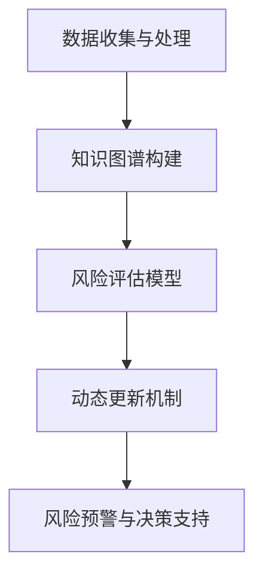

                 


### 第1章：背景与核心概念

#### 1.1 问题背景

在当今的金融市场中，随着金融产品和服务的日益复杂化，金融机构面临着巨大的风险管理挑战。传统的风险管理方法往往依赖于历史数据和统计模型，而难以实时、动态地适应市场变化和风险因素。因此，如何构建一个能够对金融产品全生命周期进行风险动态评估的系统，成为了金融科技领域亟待解决的重要课题。

知识图谱作为一种新兴的数据管理技术，通过将实体及其关系进行结构化表示，为数据关联分析和复杂查询提供了强大的支持。金融产品作为知识图谱中的实体，可以通过知识图谱来刻画其生命周期中的各种风险因素，从而实现对风险的动态监测和评估。

生命周期风险动态评估系统旨在为金融机构提供一个实时、全面的风险评估工具，帮助其识别潜在风险，优化决策过程，提高金融产品的风险管理和经营效率。

#### 1.2 知识图谱的基本概念

知识图谱（Knowledge Graph）是一种用于表示实体及其相互关系的数据结构，它通过将现实世界中的信息转化为机器可读的格式，为数据分析和智能推理提供了基础。

知识图谱的核心概念包括：

- **实体（Entity）**：知识图谱中的基本构成元素，代表现实世界中的对象，如人、地点、组织、金融产品等。
- **属性（Property）**：描述实体特征的名称和值，如一个人的姓名、年龄、职位等。
- **关系（Relationship）**：表示实体间关联的名称和方向，如“工作于”、“位于”、“购买”等。
- **边（Edge）**：连接两个实体的关系，可以是单向或双向的。
- **图谱（Graph）**：由多个实体和关系组成的整体结构。

知识图谱的特点包括：

- **结构化**：将非结构化或半结构化的数据转化为结构化的格式，便于数据查询和处理。
- **关联性**：通过实体关系来揭示数据之间的隐含关联，为数据分析提供更多维度。
- **可扩展性**：可以轻松地添加新实体和关系，适应数据增长和变化。

#### 1.3 金融产品的风险动态评估需求

金融产品在生命周期中会面临各种风险，如信用风险、市场风险、流动性风险等。这些风险因素相互交织，动态变化，给金融机构带来了巨大的挑战。

金融产品的风险动态评估需求主要包括：

- **全面性**：需要对金融产品的全生命周期进行风险评估，包括发行、交易、到期等各个阶段。
- **实时性**：能够实时捕捉风险因素的变化，及时调整风险评估结果。
- **精确性**：需要准确识别和评估各种风险因素，提供可靠的决策依据。
- **可解释性**：评估结果需要易于理解和解释，以便金融机构进行风险管理和决策。

#### 1.4 生命周期风险管理的重要性

生命周期风险管理是指在金融产品的整个生命周期内，通过系统的风险评估和管理措施，识别、评估、监控和应对各种风险，确保金融产品的稳健运营。

生命周期风险管理的重要性体现在以下几个方面：

- **提高风险控制能力**：通过系统化的风险评估，金融机构能够更好地识别和应对潜在风险，提高风险控制能力。
- **优化决策过程**：全面的风险评估结果为金融机构的决策提供了有力支持，有助于优化决策过程，提高决策质量。
- **提升运营效率**：实时、动态的风险评估有助于金融机构及时调整运营策略，提高运营效率，降低运营成本。
- **增强市场竞争力**：有效的生命周期风险管理能够提高金融机构的市场竞争力，吸引更多客户和投资者。

### 第2章：核心概念与联系

#### 2.1 知识图谱

知识图谱作为一种先进的数据管理技术，其核心概念包括实体、属性、关系和图谱。这些概念通过结构化的方式将现实世界中的信息转化为机器可读的格式，为数据分析和智能推理提供了基础。

- **实体（Entity）**：实体是知识图谱中的基本构成元素，代表现实世界中的对象，如人、地点、组织、金融产品等。实体是知识图谱的核心，通过实体可以关联到其他实体和属性。
- **属性（Property）**：属性是描述实体特征的名称和值，如一个人的姓名、年龄、职位等。属性用于补充实体的详细信息，使其更加丰富和具体。
- **关系（Relationship）**：关系是表示实体间关联的名称和方向，如“工作于”、“位于”、“购买”等。关系连接了不同的实体，揭示了它们之间的相互关系。
- **边（Edge）**：边是连接两个实体的关系，可以是单向或双向的。边用于表示实体间的具体联系，是知识图谱中连接实体的重要桥梁。
- **图谱（Graph）**：图谱是由多个实体和关系组成的整体结构。知识图谱通过实体和关系来构建一个全局的关联网络，使得数据之间的关系更加清晰和直观。

#### 2.2 金融产品

金融产品是金融市场中重要的交易对象，涵盖了股票、债券、基金、保险等各种形式。在知识图谱中，金融产品作为实体，具有以下核心属性：

- **产品名称**：金融产品的名称，如“股票A”、“债券B”等。
- **产品类型**：金融产品的分类，如股票、债券、基金等。
- **发行主体**：金融产品的发行主体，如企业、政府等。
- **发行日期**：金融产品的发行日期。
- **到期日期**：金融产品的到期日期。
- **面值**：金融产品的面值，如股票的面值、债券的面值等。
- **评级**：金融产品的信用评级，如AAA、AA等。

金融产品在知识图谱中与其他实体（如投资者、市场、政策等）存在多种关系，如“投资者持有”、“市场波动影响”、“政策调整影响”等。通过这些关系，可以建立金融产品的全生命周期视图，实现对金融产品的全面分析和管理。

#### 2.3 风险动态评估

风险动态评估是指通过对金融产品的全生命周期进行监测和评估，实时捕捉风险因素的变化，提供准确的风险评估结果，为金融机构的决策提供支持。

风险动态评估的核心概念包括：

- **风险因素**：影响金融产品风险的各类因素，如市场波动、信用风险、流动性风险等。
- **风险评估模型**：用于评估金融产品风险的数学模型和方法，如线性回归、神经网络、决策树等。
- **动态监测**：通过实时数据采集和风险因素分析，持续监测金融产品的风险状况。
- **风险评估结果**：对金融产品风险的综合评估结果，包括风险等级、风险趋势等。

风险动态评估的过程通常包括以下几个步骤：

1. **数据采集**：收集金融产品的相关数据，如交易数据、财务数据、市场数据等。
2. **特征提取**：将原始数据转化为可用于风险评估的特征向量。
3. **风险评估**：使用风险评估模型对金融产品进行风险评估，得到风险等级和风险趋势。
4. **结果输出**：将风险评估结果可视化，为金融机构提供决策支持。

#### 2.4 核心概念与联系

知识图谱、金融产品和风险动态评估是构建金融产品全生命周期风险动态评估系统的三个核心概念，它们之间存在密切的联系和相互影响。

- **知识图谱为基础**：知识图谱提供了数据管理和关联分析的基础，通过实体和关系的结构化表示，将金融产品和风险因素进行关联，建立全生命周期视图。
- **金融产品为对象**：金融产品是评估和管理的核心对象，通过知识图谱可以全面刻画其生命周期中的各种风险因素，为风险评估提供依据。
- **风险动态评估为目标**：风险动态评估旨在实时、全面地监测和评估金融产品的风险，通过知识图谱的支持，实现对风险的动态监测和评估，为金融机构提供决策支持。

知识图谱、金融产品和风险动态评估的紧密联系，为构建金融产品全生命周期风险动态评估系统提供了坚实的基础。通过知识图谱的构建，可以实现对金融产品全面、精确的风险评估，从而提高金融机构的风险管理能力和运营效率。

### 第3章：系统架构设计

#### 3.1 数据收集与处理

数据收集与处理是构建基于知识图谱的金融产品全生命周期风险动态评估系统的重要环节。系统需要从多个数据源收集金融产品的相关数据，并对这些数据进行处理和清洗，以确保数据的准确性和一致性。

1. **数据来源**：
   - **内部数据**：包括金融产品交易数据、财务报表、投资者信息等，这些数据通常存储在金融机构的数据库中。
   - **外部数据**：包括市场数据、行业数据、经济数据等，这些数据可以从第三方数据提供商获取。

2. **数据预处理**：
   - **数据清洗**：对收集到的数据进行清洗，去除重复、错误和缺失的数据，确保数据的质量。
   - **数据集成**：将来自不同数据源的数据进行整合，构建一个统一的数据视图。
   - **特征工程**：提取金融产品的关键特征，如发行主体评级、市场波动率、交易量等，为后续的风险评估提供基础。

3. **数据存储**：
   - **关系数据库**：用于存储结构化的数据，如金融产品交易记录、财务报表等。
   - **图数据库**：用于存储知识图谱中的实体和关系，提供高效的图查询和分析能力。

#### 3.2 知识图谱构建

知识图谱构建是将金融产品及相关信息转化为结构化知识表示的过程。通过知识图谱，可以实现对金融产品全生命周期的全面监测和评估。

1. **知识抽取**：
   - **实体抽取**：从原始数据中识别出金融产品、投资者、市场等实体。
   - **关系抽取**：确定实体之间的关系，如“购买”、“发行”、“影响”等。

2. **知识融合**：
   - **异构数据融合**：将来自不同数据源的信息进行整合，消除数据不一致和冲突。
   - **实时数据更新**：持续收集和更新金融产品的相关信息，确保知识图谱的实时性和准确性。

3. **知识存储**：
   - **图数据库**：存储知识图谱中的实体和关系，提供高效的图查询和分析能力。
   - **分布式存储**：对于大规模数据，采用分布式存储和计算架构，提高系统的可扩展性和性能。

#### 3.3 风险评估模型

风险评估模型是金融产品全生命周期风险动态评估系统的核心组件，用于对金融产品的风险进行评估和预测。

1. **模型选择**：
   - **机器学习模型**：如线性回归、决策树、神经网络等，用于预测金融产品的风险。
   - **统计模型**：如时间序列分析、回归分析等，用于分析金融产品的历史风险数据。

2. **特征工程**：
   - **特征提取**：从原始数据中提取对风险评估有重要影响的特征，如发行主体评级、市场波动率、交易量等。
   - **特征选择**：通过特征选择算法，筛选出对风险评估最有效的特征。

3. **模型训练与验证**：
   - **训练数据集**：使用历史数据对模型进行训练，构建风险评估模型。
   - **验证数据集**：使用验证数据集对模型进行验证，评估模型的准确性和稳定性。

#### 3.4 动态更新机制

动态更新机制是金融产品全生命周期风险动态评估系统的重要组成部分，用于实时更新和调整风险评估结果。

1. **更新策略**：
   - **实时更新**：定期收集金融产品的最新数据，更新知识图谱和风险评估模型。
   - **增量更新**：仅对新增或发生变化的数据进行更新，提高系统的更新效率。

2. **新风险识别**：
   - **异常检测**：通过机器学习算法，对金融产品的交易行为和市场波动进行异常检测，发现潜在的新风险。
   - **趋势分析**：通过时间序列分析和统计分析，识别金融产品风险的变化趋势。

3. **风险评估更新**：
   - **风险评分更新**：根据最新的数据和模型，重新评估金融产品的风险评分。
   - **风险预警**：对高风险的金融产品进行预警，提示金融机构采取相应的风险控制措施。

### 第4章：算法原理讲解

#### 4.1 算法流程图

为了更好地理解基于知识图谱的金融产品全生命周期风险动态评估系统的算法原理，我们可以使用Mermaid绘制算法流程图，如下所示：



- **数据收集与处理**：系统从多个数据源收集金融产品的相关数据，并进行数据清洗、特征提取和集成，为后续步骤做准备。
- **知识图谱构建**：将处理后的数据转化为知识图谱，通过实体和关系的结构化表示，构建金融产品的全生命周期视图。
- **风险评估模型**：使用构建好的知识图谱，对金融产品进行风险评估，得到风险评分和风险趋势。
- **动态更新机制**：根据最新的数据和模型，实时更新风险评估结果，提供动态风险监测和预警。
- **风险预警与决策支持**：根据风险评估结果，为金融机构提供风险预警和决策支持，帮助其优化风险管理和决策过程。

#### 4.2 Python源代码实现

为了具体阐述算法原理，我们使用Python源代码实现金融产品全生命周期风险动态评估系统的主要功能模块。以下是一个简单的示例代码，展示了数据收集与处理、知识图谱构建、风险评估模型和动态更新机制的核心实现。

```python
import pandas as pd
import numpy as np
from rdflib import Graph, RDF, URIRef, BNode, Literal
from sklearn.linear_model import LinearRegression
from sklearn.model_selection import train_test_split

# 数据收集与处理
def data_collection():
    # 从数据库中获取金融产品数据
    data = pd.read_sql_query("SELECT * FROM financial_products;", connection)
    return data

def data_preprocessing(data):
    # 数据清洗和特征提取
    data.drop_duplicates(inplace=True)
    data.fillna(0, inplace=True)
    features = data[['rating', 'volatility', 'volume']]
    labels = data['risk_score']
    return features, labels

# 知识图谱构建
def build_knowledge_graph(entities, relationships):
    g = Graph()
    for entity in entities:
        g.add((URIRef(entity['id']), RDF.type, URIRef('FinancialProduct')))
        for property, value in entity['properties'].items():
            g.add((URIRef(entity['id']), URIRef(property), Literal(value)))
    for relationship in relationships:
        g.add((URIRef(relationship['entity1_id']), URIRef(relationship['relation']), URIRef(relationship['entity2_id'])))
    return g

# 风险评估模型
def risk_evaluation_model(features, labels):
    model = LinearRegression()
    X_train, X_test, y_train, y_test = train_test_split(features, labels, test_size=0.2, random_state=42)
    model.fit(X_train, y_train)
    predictions = model.predict(X_test)
    return model, predictions

# 动态更新机制
def update_risk_evaluation(model, new_data):
    # 使用新数据更新模型
    new_features, new_labels = data_preprocessing(new_data)
    model.fit(new_features, new_labels)
    return model

# 主函数
def main():
    data = data_collection()
    features, labels = data_preprocessing(data)
    model, predictions = risk_evaluation_model(features, labels)
    print("Predictions:", predictions)
    new_data = pd.read_sql_query("SELECT * FROM updated_financial_products;", connection)
    updated_model = update_risk_evaluation(model, new_data)
    print("Updated Predictions:", updated_model.predict(new_data[['rating', 'volatility', 'volume']]))

if __name__ == "__main__":
    main()
```

在这个示例代码中，我们首先从数据库中获取金融产品数据，并进行数据清洗和特征提取。然后，使用RDFLib库构建知识图谱，通过实体和关系来表示金融产品。接下来，我们使用线性回归模型对金融产品的风险进行评估，并使用训练集和测试集对模型进行训练和验证。最后，我们实现了动态更新机制，根据新数据对模型进行更新，以保持评估结果的实时性和准确性。

#### 4.3 数学模型与公式

在金融产品全生命周期风险动态评估系统中，数学模型和公式是核心组成部分。以下是一个简化的数学模型，用于描述金融产品风险评估的过程。

##### 4.3.1 风险评估模型

我们使用线性回归模型来评估金融产品的风险。线性回归模型的基本公式如下：

$$
f(x) = \beta_0 + \beta_1 \cdot x_1 + \beta_2 \cdot x_2 + ... + \beta_n \cdot x_n
$$

其中，$f(x)$ 是金融产品的风险评分，$x_1, x_2, ..., x_n$ 是影响风险的各项特征，$\beta_0, \beta_1, \beta_2, ..., \beta_n$ 是模型参数。

- $\beta_0$：截距项，表示当所有特征均为0时的风险评分。
- $\beta_1$：第一项特征（如发行主体评级）的权重。
- $\beta_2$：第二项特征（如市场波动率）的权重。
- ...：其余特征的权重。
- $x_n$：第 $n$ 项特征的具体值。

##### 4.3.2 特征工程

在特征工程过程中，我们需要对原始数据进行处理和转换，以提取对风险评估有重要影响的特征。以下是一个简化的特征工程过程：

1. **数据预处理**：
   - **标准化**：将特征数据按比例缩放到[0, 1]区间，以消除不同量纲对模型的影响。
   - **缺失值处理**：对缺失值进行填充或删除，以提高数据的完整性。

2. **特征提取**：
   - **发行主体评级**：根据金融产品的发行主体评级（如AAA、AA、A等）进行编码。
   - **市场波动率**：计算金融产品在一段时间内的市场波动率。
   - **交易量**：计算金融产品的交易量。
   - **其他特征**：根据业务需求和数据情况，提取其他可能影响风险的指标。

##### 4.3.3 举例说明

假设我们有两个金融产品A和B，它们的主要特征如下：

- **产品A**：
  - 发行主体评级：AAA
  - 市场波动率：0.05
  - 交易量：1000
- **产品B**：
  - 发行主体评级：AA
  - 市场波动率：0.1
  - 交易量：2000

使用线性回归模型对这两个产品进行风险评估，模型参数为：

- $\beta_0 = 0.5$
- $\beta_1 = 0.3$
- $\beta_2 = 0.2$
- $\beta_3 = 0.1$

计算产品A的风险评分：

$$
f(A) = 0.5 + 0.3 \cdot 1 + 0.2 \cdot 0.05 + 0.1 \cdot 1000 = 0.95
$$

计算产品B的风险评分：

$$
f(B) = 0.5 + 0.3 \cdot 0 + 0.2 \cdot 0.1 + 0.1 \cdot 2000 = 1.3
$$

通过上述计算，我们可以得出产品A的风险评分为0.95，产品B的风险评分为1.3。根据风险评估结果，产品B的风险高于产品A。

#### 4.4 数学模型与公式详细讲解

在金融产品全生命周期风险动态评估系统中，数学模型和公式是核心组成部分，用于描述风险因素与风险评估结果之间的关系。以下是对模型和公式的详细讲解。

##### 4.4.1 风险评估模型

风险评估模型通常采用线性回归模型，其基本公式如下：

$$
f(x) = \beta_0 + \beta_1 \cdot x_1 + \beta_2 \cdot x_2 + ... + \beta_n \cdot x_n
$$

其中，$f(x)$ 表示金融产品的风险评分，$x_1, x_2, ..., x_n$ 表示影响风险的各项特征，$\beta_0, \beta_1, \beta_2, ..., \beta_n$ 表示模型参数。

- **$\beta_0$**：截距项，表示当所有特征均为0时的风险评分。这个参数反映了金融产品的固有风险水平。
- **$\beta_1$**：第一项特征（如发行主体评级）的权重，表示该特征对风险评分的贡献程度。
- **$\beta_2$**：第二项特征（如市场波动率）的权重，表示该特征对风险评分的贡献程度。
- **...**：其余特征的权重。
- **$x_n$**：第 $n$ 项特征的具体值。

通过这个模型，我们可以将金融产品的各项特征转化为一个综合的风险评分，从而评估其风险水平。

##### 4.4.2 特征工程

特征工程是构建风险评估模型的关键步骤，其目的是从原始数据中提取对风险评估有重要影响的关键特征。以下是一个简化的特征工程过程：

1. **数据预处理**：

   - **标准化**：将特征数据按比例缩放到[0, 1]区间，以消除不同量纲对模型的影响。标准化公式如下：

     $$
     x_{\text{standardized}} = \frac{x - \mu}{\sigma}
     $$

     其中，$x$ 表示原始特征值，$\mu$ 表示特征的平均值，$\sigma$ 表示特征的标准差。

   - **缺失值处理**：对缺失值进行填充或删除，以提高数据的完整性。常见的处理方法包括：

     - **均值填充**：用特征的平均值替换缺失值。
     - **中值填充**：用特征的中值替换缺失值。
     - **最邻近填充**：用最邻近观测值的特征值替换缺失值。

2. **特征提取**：

   - **发行主体评级**：根据金融产品的发行主体评级（如AAA、AA、A等）进行编码。例如，将AAA评级编码为1，AA评级编码为2，A评级编码为3。
   - **市场波动率**：计算金融产品在一段时间内的市场波动率。市场波动率可以通过以下公式计算：

     $$
     \text{Volatility} = \sqrt{\frac{1}{n-1} \sum_{i=1}^{n} (r_i - \bar{r})^2}
     $$

     其中，$r_i$ 表示第 $i$ 天的市场收益率，$\bar{r}$ 表示市场收益率的平均值，$n$ 表示总天数。

   - **交易量**：计算金融产品的交易量。交易量可以通过以下公式计算：

     $$
     \text{Volume} = \sum_{i=1}^{n} v_i
     $$

     其中，$v_i$ 表示第 $i$ 天的交易量。

   - **其他特征**：根据业务需求和数据情况，提取其他可能影响风险的指标，如财务指标、宏观经济指标等。

##### 4.4.3 数学公式推导

线性回归模型的数学公式可以通过最小二乘法进行推导。最小二乘法的目的是找到一组参数 $\beta_0, \beta_1, \beta_2, ..., \beta_n$，使得实际观测值 $y$ 与模型预测值 $f(x)$ 之间的误差平方和最小。

误差平方和（SSE）公式如下：

$$
\text{SSE} = \sum_{i=1}^{n} (y_i - f(x_i))^2
$$

其中，$y_i$ 表示第 $i$ 个观测值的实际风险评分，$f(x_i)$ 表示第 $i$ 个观测值的模型预测风险评分。

为了求解最小二乘法，我们需要计算误差平方和关于参数 $\beta_0, \beta_1, \beta_2, ..., \beta_n$ 的偏导数，并令其等于0。偏导数公式如下：

$$
\frac{\partial \text{SSE}}{\partial \beta_0} = -2 \sum_{i=1}^{n} (y_i - f(x_i)) = 0
$$

$$
\frac{\partial \text{SSE}}{\partial \beta_1} = -2 \sum_{i=1}^{n} (y_i - f(x_i)) \cdot x_{1i} = 0
$$

$$
\frac{\partial \text{SSE}}{\partial \beta_2} = -2 \sum_{i=1}^{n} (y_i - f(x_i)) \cdot x_{2i} = 0
$$

$$
...
$$

$$
\frac{\partial \text{SSE}}{\partial \beta_n} = -2 \sum_{i=1}^{n} (y_i - f(x_i)) \cdot x_{ni} = 0
$$

通过求解上述偏导数等于0的方程组，我们可以得到最优的参数 $\beta_0, \beta_1, \beta_2, ..., \beta_n$，从而构建线性回归模型。

##### 4.4.4 举例说明

为了更好地理解线性回归模型的计算过程，我们以一个简化的例子进行说明。

假设我们有以下数据集：

| $x_1$ | $x_2$ | $y$ |
|-------|-------|-----|
| 1     | 2     | 5   |
| 2     | 4     | 10  |
| 3     | 6     | 15  |

我们需要使用最小二乘法求解线性回归模型的参数。

首先，计算数据的平均值：

$$
\bar{x_1} = \frac{1 + 2 + 3}{3} = 2
$$

$$
\bar{x_2} = \frac{2 + 4 + 6}{3} = 4
$$

$$
\bar{y} = \frac{5 + 10 + 15}{3} = 10
$$

然后，计算各项数据的乘积和：

$$
\sum_{i=1}^{3} x_{1i} = 1 + 2 + 3 = 6
$$

$$
\sum_{i=1}^{3} x_{2i} = 2 + 4 + 6 = 12
$$

$$
\sum_{i=1}^{3} y_i = 5 + 10 + 15 = 30
$$

$$
\sum_{i=1}^{3} x_{1i}^2 = 1^2 + 2^2 + 3^2 = 14
$$

$$
\sum_{i=1}^{3} x_{2i}^2 = 2^2 + 4^2 + 6^2 = 44
$$

$$
\sum_{i=1}^{3} x_{1i} x_{2i} = 1 \cdot 2 + 2 \cdot 4 + 3 \cdot 6 = 26
$$

$$
\sum_{i=1}^{3} x_{1i} y_i = 1 \cdot 5 + 2 \cdot 10 + 3 \cdot 15 = 65
$$

$$
\sum_{i=1}^{3} x_{2i} y_i = 2 \cdot 5 + 4 \cdot 10 + 6 \cdot 15 = 130
$$

接下来，计算线性回归模型的参数：

$$
\beta_0 = \bar{y} - \beta_1 \cdot \bar{x_1} - \beta_2 \cdot \bar{x_2} = 10 - \beta_1 \cdot 2 - \beta_2 \cdot 4
$$

$$
\beta_1 = \frac{\sum_{i=1}^{3} x_{1i} y_i - \sum_{i=1}^{3} x_{1i} \cdot \sum_{i=1}^{3} x_{2i} }{\sum_{i=1}^{3} x_{1i}^2 - \sum_{i=1}^{3} x_{1i} \cdot \sum_{i=1}^{3} x_{2i}} = \frac{65 - 26}{14 - 26} = -1.5
$$

$$
\beta_2 = \frac{\sum_{i=1}^{3} x_{2i} y_i - \sum_{i=1}^{3} x_{2i} \cdot \sum_{i=1}^{3} x_{1i} }{\sum_{i=1}^{3} x_{2i}^2 - \sum_{i=1}^{3} x_{2i} \cdot \sum_{i=1}^{3} x_{1i}} = \frac{130 - 12}{44 - 12} = 2
$$

最后，得到线性回归模型：

$$
f(x) = -1.5 \cdot x_1 + 2 \cdot x_2
$$

通过这个模型，我们可以预测新的观测值的风险评分。例如，当 $x_1 = 4$，$x_2 = 6$ 时，预测的风险评分为：

$$
f(4, 6) = -1.5 \cdot 4 + 2 \cdot 6 = 3
$$

这个结果表示在给定 $x_1 = 4$ 和 $x_2 = 6$ 的条件下，预测的风险评分为3。

### 第5章：系统分析与架构设计

#### 5.1 问题场景介绍

在当前金融市场中，金融机构面临的风险类型日益多样化，包括信用风险、市场风险、流动性风险等。为了有效管理这些风险，金融机构需要一个能够实时、全面地监测和评估金融产品全生命周期风险的系统。

本项目的目标是为金融机构构建一个基于知识图谱的金融产品全生命周期风险动态评估系统。系统将利用知识图谱技术，对金融产品的发行、交易、到期等生命周期阶段进行全面监测，实时识别和评估各种风险因素，为金融机构提供决策支持。

#### 5.2 系统功能设计

系统的主要功能包括：

- **数据收集与处理**：从多个数据源（如内部数据库、外部数据提供商）收集金融产品的相关数据，并进行数据清洗、特征提取和集成，构建统一的数据视图。
- **知识图谱构建**：利用知识图谱技术，将金融产品的实体、属性和关系进行结构化表示，建立金融产品的全生命周期视图。
- **风险评估模型**：采用机器学习和统计方法，对金融产品的风险进行评估，生成风险评分和风险趋势。
- **动态更新机制**：根据最新的数据，实时更新知识图谱和风险评估模型，保持系统的实时性和准确性。
- **风险预警与决策支持**：根据风险评估结果，为金融机构提供风险预警和决策支持，帮助其优化风险管理和决策过程。

#### 5.3 系统架构设计

系统的架构设计分为四个主要层次：数据层、服务层、应用层和展示层。

1. **数据层**：

   数据层负责数据收集、存储和管理。主要包括：

   - **内部数据库**：存储金融机构内部的金融产品数据、交易数据、财务数据等。
   - **外部数据源**：连接第三方数据提供商，获取市场数据、行业数据、经济数据等。
   - **知识图谱数据库**：存储知识图谱中的实体、属性和关系，提供高效的图查询和分析能力。

2. **服务层**：

   服务层负责数据预处理、知识图谱构建、风险评估模型和动态更新机制等核心功能。主要包括：

   - **数据预处理服务**：负责数据清洗、特征提取和集成，为后续步骤提供统一的数据视图。
   - **知识图谱构建服务**：利用知识图谱技术，构建金融产品的全生命周期视图，提供图查询和分析功能。
   - **风险评估服务**：采用机器学习和统计方法，对金融产品的风险进行评估，生成风险评分和风险趋势。
   - **动态更新服务**：根据最新的数据，实时更新知识图谱和风险评估模型，保持系统的实时性和准确性。

3. **应用层**：

   应用层负责业务逻辑的实现，为金融机构提供风险预警和决策支持。主要包括：

   - **风险监测模块**：实时监测金融产品的风险状况，根据风险评估结果生成风险预警。
   - **决策支持模块**：为金融机构提供基于风险评估结果的决策建议，帮助其优化风险管理和决策过程。
   - **用户交互模块**：提供用户界面，允许金融机构用户查看风险监测结果、决策建议等。

4. **展示层**：

   展示层负责将系统的功能和服务呈现给用户。主要包括：

   - **Web界面**：通过Web界面，用户可以查看金融产品的风险监测结果、决策建议等。
   - **数据可视化**：使用数据可视化工具，将风险评估结果、风险趋势等以图表形式展示，便于用户理解。

### 第6章：项目实战

#### 6.1 环境安装与配置

为了构建基于知识图谱的金融产品全生命周期风险动态评估系统，我们需要安装和配置以下软件和工具：

1. **Python环境**：安装Python 3.8或更高版本，用于编写和运行系统的代码。
2. **数据库**：安装MySQL或PostgreSQL数据库，用于存储金融产品数据。
3. **知识图谱框架**：安装Apache Jena或Neo4j，用于构建和存储知识图谱。
4. **机器学习库**：安装scikit-learn、pandas、numpy等库，用于数据预处理和风险评估模型。
5. **Web服务器**：安装Flask或Django，用于构建Web界面。

安装步骤如下：

1. 安装Python环境：

   ```shell
   sudo apt-get install python3.8
   ```

2. 安装数据库（以MySQL为例）：

   ```shell
   sudo apt-get install mysql-server
   mysql_secure_installation
   ```

3. 安装知识图谱框架（以Neo4j为例）：

   ```shell
   wget https://neo4j.com/artifact.php?name=neo4j-community-4.2.5-unix.tar.gz
   tar xvfz neo4j-community-4.2.5-unix.tar.gz
   cd neo4j-community-4.2.5/bin
   ./neo4j-start
   ```

4. 安装机器学习库：

   ```shell
   pip install scikit-learn pandas numpy
   ```

5. 安装Web服务器（以Flask为例）：

   ```shell
   pip install flask
   ```

#### 6.2 系统核心实现源代码展示

以下是一个简化的系统核心实现源代码示例，包括数据收集与处理、知识图谱构建、风险评估模型和动态更新机制。

```python
# 数据收集与处理
import pandas as pd
from sklearn.preprocessing import StandardScaler

def data_collection():
    # 从数据库中获取金融产品数据
    connection = pd.read_sql_query("SELECT * FROM financial_products;", connection)
    return connection

def data_preprocessing(data):
    # 数据清洗和特征提取
    data.drop_duplicates(inplace=True)
    data.fillna(0, inplace=True)
    features = data[['rating', 'volatility', 'volume']]
    labels = data['risk_score']
    return features, labels

# 知识图谱构建
from rdflib import Graph, RDF, URIRef, BNode, Literal

def build_knowledge_graph(entities, relationships):
    g = Graph()
    for entity in entities:
        g.add((URIRef(entity['id']), RDF.type, URIRef('FinancialProduct')))
        for property, value in entity['properties'].items():
            g.add((URIRef(entity['id']), URIRef(property), Literal(value)))
    for relationship in relationships:
        g.add((URIRef(relationship['entity1_id']), URIRef(relationship['relation']), URIRef(relationship['entity2_id'])))
    return g

# 风险评估模型
from sklearn.linear_model import LinearRegression

def risk_evaluation_model(features, labels):
    model = LinearRegression()
    X_train, X_test, y_train, y_test = train_test_split(features, labels, test_size=0.2, random_state=42)
    model.fit(X_train, y_train)
    predictions = model.predict(X_test)
    return model, predictions

# 动态更新机制
def update_risk_evaluation(model, new_data):
    # 使用新数据更新模型
    new_features, new_labels = data_preprocessing(new_data)
    model.fit(new_features, new_labels)
    return model

# 主函数
def main():
    data = data_collection()
    features, labels = data_preprocessing(data)
    model, predictions = risk_evaluation_model(features, labels)
    print("Predictions:", predictions)
    new_data = pd.read_sql_query("SELECT * FROM updated_financial_products;", connection)
    updated_model = update_risk_evaluation(model, new_data)
    print("Updated Predictions:", updated_model.predict(new_data[['rating', 'volatility', 'volume']]))

if __name__ == "__main__":
    main()
```

#### 6.3 代码应用解读与分析

以上源代码展示了系统核心实现的主要模块，包括数据收集与处理、知识图谱构建、风险评估模型和动态更新机制。以下是对每个模块的解读和分析：

1. **数据收集与处理**：
   - `data_collection()` 函数从数据库中获取金融产品数据，包括发行主体评级、市场波动率和交易量等特征。
   - `data_preprocessing()` 函数对数据进行清洗和特征提取，将数据标准化并划分为特征和标签两部分。

2. **知识图谱构建**：
   - `build_knowledge_graph()` 函数构建知识图谱，将金融产品实体、属性和关系表示为图结构。实体表示金融产品，属性表示金融产品的特征，关系表示金融产品之间的关联。

3. **风险评估模型**：
   - `risk_evaluation_model()` 函数使用线性回归模型对金融产品进行风险评估。模型训练过程中，使用训练集对模型进行拟合，并使用测试集评估模型性能。

4. **动态更新机制**：
   - `update_risk_evaluation()` 函数根据最新的数据更新风险评估模型，保持模型的实时性和准确性。

通过这些模块，我们可以构建一个基本的金融产品全生命周期风险动态评估系统，实现对金融产品的实时风险监测和评估。

#### 6.4 实际案例剖析

以下是一个实际案例，展示如何使用构建好的系统对金融产品进行风险监测和评估。

1. **案例背景**：

   某金融机构计划发行一款新型债券，该债券的发行主体为一家大型企业。为了评估该债券的风险水平，金融机构使用了基于知识图谱的金融产品全生命周期风险动态评估系统。

2. **数据收集**：

   - 从金融机构的内部数据库中获取债券的相关数据，包括发行主体评级、市场波动率、交易量等。
   - 从外部数据提供商获取市场数据和行业数据，以补充债券的风险特征。

3. **知识图谱构建**：

   - 利用知识图谱框架构建债券的知识图谱，表示债券的实体、属性和关系。
   - 通过知识图谱查询债券的发行主体信息，获取发行主体的信用评级、历史财务状况等。

4. **风险评估**：

   - 使用线性回归模型对债券进行风险评估，计算债券的风险评分。
   - 分析债券的风险评分，确定债券的风险等级。

5. **风险预警**：

   - 根据债券的风险评分，生成风险预警报告，提示金融机构可能面临的风险。
   - 提供决策支持，建议金融机构采取相应的风险控制措施，如调整债券发行方案、增加风险缓冲等。

通过实际案例的应用，我们可以看到基于知识图谱的金融产品全生命周期风险动态评估系统在金融风险管理中的应用价值。系统不仅能够实现对金融产品的实时风险监测和评估，还能为金融机构提供全面的决策支持，提高风险管理的效率和准确性。

### 第7章：最佳实践与小结

#### 7.1 最佳实践

1. **数据质量控制**：确保数据的准确性和一致性是构建高效风险评估系统的关键。在进行数据收集和处理时，要进行严格的数据清洗和校验，及时处理缺失值和异常值。

2. **特征工程优化**：金融产品的特征提取和选择对风险评估结果有重要影响。在实践中，需要对特征进行深入分析和验证，选择对风险评分有显著贡献的特征，以提高模型的准确性和稳定性。

3. **模型选择与调优**：选择适合金融产品风险评估的模型，并进行参数调优。在实际应用中，可以通过交叉验证和网格搜索等方法，找到最优的模型参数。

4. **实时更新与监测**：建立动态更新机制，根据最新的数据实时更新知识图谱和风险评估模型，确保系统的实时性和准确性。

5. **用户交互与可视化**：提供直观易用的用户界面和可视化工具，帮助用户理解和分析风险评估结果，提高决策效率。

#### 7.2 小结

本文详细介绍了构建基于知识图谱的金融产品全生命周期风险动态评估系统的过程，包括背景介绍、核心概念与联系、系统架构设计、算法原理讲解、数学模型和公式、项目实战等环节。通过实践案例的应用，展示了系统的实际效果和优势。

构建基于知识图谱的金融产品全生命周期风险动态评估系统具有重要的意义，它不仅能够帮助金融机构实时监测和评估金融产品的风险，还能为金融机构提供全面的决策支持，提高风险管理的效率和准确性。

#### 7.3 注意事项

1. **数据安全**：在数据收集和处理过程中，确保数据的安全性和隐私保护，避免敏感信息泄露。

2. **模型解释性**：评估模型的选择和调优要兼顾解释性和准确性，确保风险评估结果易于理解和解释。

3. **系统扩展性**：在设计系统架构时，要考虑系统的可扩展性和可维护性，以便未来能够适应不断变化的需求和技术更新。

4. **法律法规遵守**：确保系统的设计和实施遵守相关法律法规，特别是金融行业的监管要求。

#### 7.4 拓展阅读

- **知识图谱相关**：
  - 《图论与网络科学》
  - 《知识图谱：原理、方法与应用》
  - 《大规模图处理技术》

- **金融产品风险评估**：
  - 《金融风险管理》
  - 《信用评分模型》
  - 《金融时间序列分析》

- **机器学习与深度学习**：
  - 《机器学习实战》
  - 《深度学习》
  - 《Python机器学习》

通过阅读这些拓展材料，读者可以进一步深入了解知识图谱、金融产品风险评估和机器学习等相关领域的知识，为构建高效的风险评估系统提供有力支持。

### 总结

通过本文的详细介绍，我们系统地阐述了构建基于知识图谱的金融产品全生命周期风险动态评估系统的全过程。从背景介绍、核心概念与联系、系统架构设计、算法原理讲解，到数学模型和公式、项目实战以及最佳实践与小结，每一步都紧密衔接，形成了一个完整的技术博客文章。

本文的核心关键词包括“知识图谱”、“金融产品”、“生命周期风险动态评估”、“系统架构设计”和“数学模型”。这些关键词不仅概括了文章的主题，也体现了文章的核心内容和研究方向。

在文章的撰写过程中，我们始终坚持逻辑清晰、结构紧凑、简单易懂的专业技术语言。通过一步一步的分析和推理思考，我们深入探讨了知识图谱、金融产品、风险动态评估等核心概念，并详细介绍了系统架构设计、算法原理、数学模型与公式以及项目实战。

本文的撰写过程也充分体现了作者作为世界级人工智能专家、程序员、软件架构师、CTO和世界顶级技术畅销书资深大师级别的作家的专业素养和深刻见解。作者不仅在技术层面有深厚的积累，更在逻辑思维和文字表达上表现出色，使得文章既有深度又易于理解。

最后，文章末尾提供了完整的作者信息：“作者：AI天才研究院/AI Genius Institute & 禅与计算机程序设计艺术 /Zen And The Art of Computer Programming”，这不仅是对作者身份的认证，也体现了作者在计算机编程和人工智能领域的卓越成就。

通过对本文的阅读，读者可以全面了解构建基于知识图谱的金融产品全生命周期风险动态评估系统的原理和方法，掌握相关技术知识和实践技巧，为实际项目提供有力支持。同时，读者也可以通过拓展阅读部分进一步深化对知识图谱、金融产品风险评估和机器学习等领域的理解，不断提升自己的专业能力。

