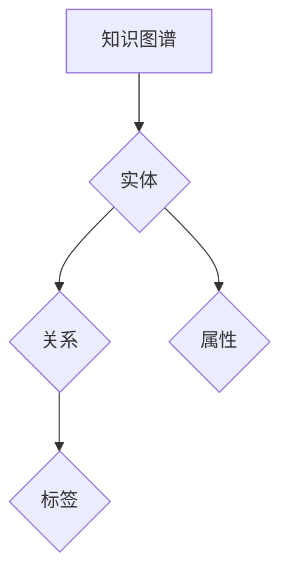
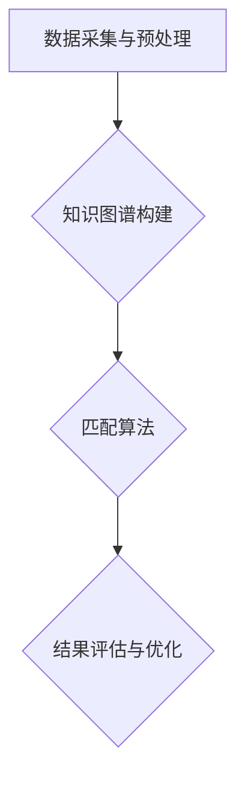
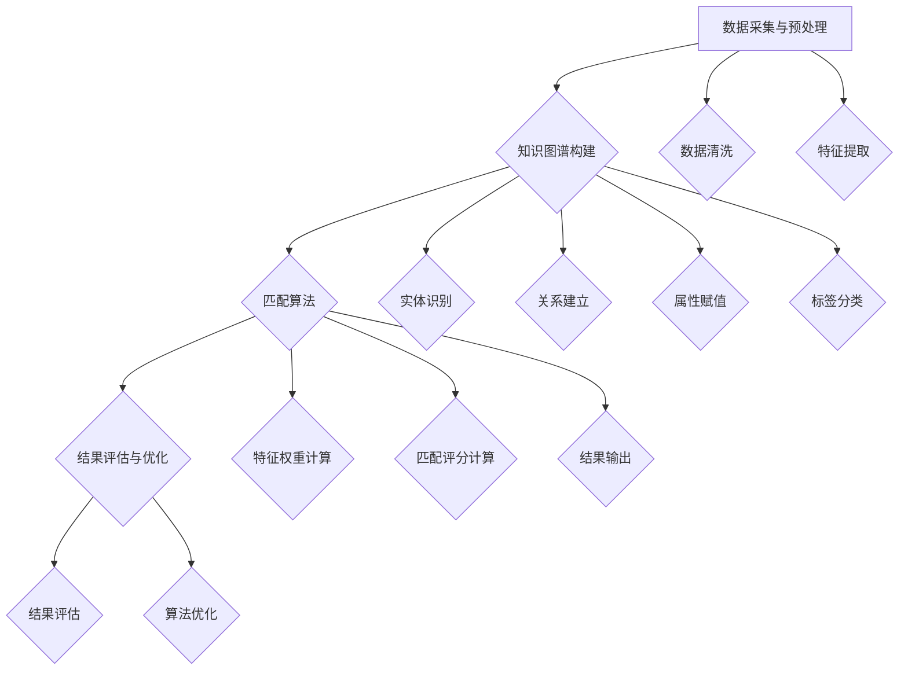
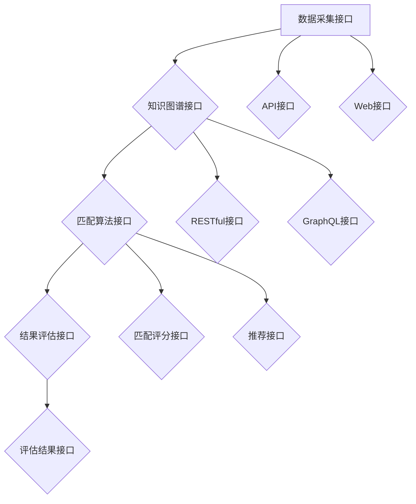
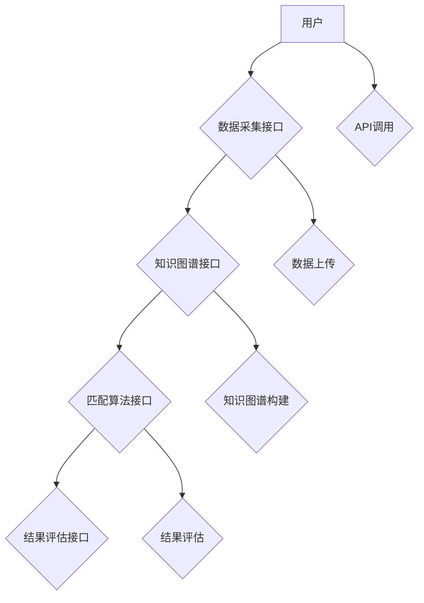

                 

# 构建基于知识图谱的金融产品适当性匹配引擎

## 关键词

知识图谱，金融产品，适当性匹配，人工智能，智能引擎，语义网络，大数据处理，数据关联，推理机制，个性化推荐，金融风控

## 摘要

随着金融市场的不断发展，金融产品的多样性日益增加，如何确保金融产品与投资者风险承受能力和投资目标相匹配成为金融行业的一大挑战。本文将探讨如何构建一个基于知识图谱的金融产品适当性匹配引擎。通过介绍知识图谱的基本理论、金融产品适当性匹配问题的分析，以及知识图谱在金融产品适当性匹配中的应用，本文旨在为金融行业提供一种有效的解决方案，提高金融服务的质量和效率。

## 背景介绍

### 问题背景

金融行业的快速发展带来了金融产品的多样化，投资者在众多金融产品中难以做出合适的选择。同时，金融监管机构要求金融机构必须确保金融产品的销售与投资者的风险承受能力和投资目标相匹配。这一要求不仅提升了金融机构的服务质量，也降低了金融风险。

然而，传统的方法如规则引擎和基于算法的匹配系统已经难以满足当前复杂多变的市场需求。规则引擎依赖于预先定义的规则，而算法匹配系统则依赖于大量历史数据和复杂的算法模型。这些方法在面对海量数据和快速变化的市场环境时，往往显得力不从心。

### 问题描述

金融产品适当性匹配问题涉及多个方面：

1. **投资者特征提取**：需要提取投资者的个人信息、财务状况、风险偏好等特征。
2. **金融产品特征提取**：需要提取金融产品的类型、风险等级、预期收益率、投资期限等特征。
3. **匹配算法设计**：需要设计一种算法，能够根据投资者特征和金融产品特征，实现两者的最优匹配。

### 问题解决

知识图谱作为一种新型的数据结构和知识表示方法，通过实体、关系和属性的组合，可以有效地组织和关联海量数据。基于知识图谱，可以构建一个智能的金融产品适当性匹配引擎，通过自动化匹配算法，实现高效、准确的匹配。知识图谱的引入，不仅提高了数据处理的效率，还增强了系统的灵活性和扩展性。

### 边界与外延

知识图谱的构建和应用不仅仅局限于金融行业，还可以应用于医疗、教育、电子商务等多个领域。在医疗领域，知识图谱可以用于疾病诊断和治疗方案推荐；在教育领域，知识图谱可以用于个性化学习路径推荐；在电子商务领域，知识图谱可以用于商品推荐和用户画像构建。

## 核心概念与联系

### 核心概念

#### 知识图谱

知识图谱（Knowledge Graph）是一种用于存储、管理和查询语义知识的图形数据库。它通过实体和关系来组织信息，使得信息检索和推理更加高效。知识图谱由实体、关系和属性三部分组成：

- **实体**：知识图谱中的基本构成元素，类似于关系数据库中的行或对象。在金融产品适当性匹配场景中，实体可以是投资者、金融产品、风险等级等。
- **关系**：实体之间的关联，描述了实体之间的关系类型。如投资者与金融产品的“适合度”关系，金融产品与“风险等级”的关系等。
- **属性**：实体的额外信息，如投资者的“年龄”、“收入水平”，金融产品的“收益率”、“投资期限”等。

#### 金融产品

金融产品包括股票、基金、债券等多种金融工具。每种金融产品都有其独特的特征，如风险等级、收益率、投资期限等。

#### 投资者

投资者可以是个人或机构，他们具有不同的风险承受能力和投资目标。投资者的特征包括财务状况、投资经验、风险偏好等。

### 概念属性特征对比表格

| 概念     | 属性特征                                     |
|----------|--------------------------------------------|
| 知识图谱 | 实体、关系、属性、标签                       |
| 金融产品 | 类型、风险等级、目标市场、收益预期、投资期限 |
| 投资者   | 个人/机构、财务状况、风险偏好、投资目标     |

### ER实体关系图架构的Mermaid流程图



## 2.1 知识图谱基础理论

### 2.1.1 知识图谱的定义与核心概念

#### 知识图谱的定义

知识图谱（Knowledge Graph）是一种用于存储、管理和查询语义知识的图形数据库。它通过实体和关系来组织信息，使得信息检索和推理更加高效。知识图谱可以被看作是大数据技术与人工智能技术相结合的产物。

#### 核心概念

1. **实体**：知识图谱中的基本构成元素，类似于关系数据库中的行或对象。在金融产品适当性匹配场景中，实体可以是投资者、金融产品、风险等级等。
2. **关系**：实体之间的关联，描述了实体之间的关系类型。如投资者与金融产品的“适合度”关系，金融产品与“风险等级”的关系等。
3. **属性**：实体的额外信息，如投资者的“年龄”、“收入水平”，金融产品的“收益率”、“投资期限”等。
4. **标签**：实体的分类信息，用于更加精细地描述实体属性，如金融产品的“股票”、“基金”、“债券”等标签。

### 2.1.2 知识图谱的特点与应用场景

#### 知识图谱的特点

1. **结构化**：知识图谱通过实体和关系实现了信息的结构化表示，便于高效存储和查询。
2. **关联性**：知识图谱中的实体和关系可以形成复杂的网络结构，使得数据之间存在丰富的关联性，有助于信息挖掘和推理。
3. **可扩展性**：知识图谱支持动态更新，可以随着数据量的增加和新知识的加入而不断扩展。

#### 应用场景

1. **搜索引擎**：通过知识图谱，搜索引擎可以提供更加智能的搜索结果，如自动纠错、多义词识别等。
2. **推荐系统**：基于知识图谱，推荐系统可以更加精准地推荐用户可能感兴趣的内容或产品。
3. **金融产品适当性匹配**：通过构建金融产品的知识图谱，可以实现金融产品的自动分类、标签化，为投资者提供合适的金融产品推荐。

## 2.2 金融产品适当性匹配问题分析与知识图谱构建

### 2.2.1 金融产品适当性匹配问题分析

#### 问题分析

金融产品适当性匹配涉及到以下关键问题：

1. **投资者特征提取**：包括投资者的个人信息、财务状况、投资经历、风险偏好等。
2. **金融产品特征提取**：包括金融产品的类型、风险等级、目标市场、收益预期、投资期限等。
3. **匹配算法设计**：基于投资者和金融产品的特征，设计合适的匹配算法，实现投资者与金融产品的最优匹配。

#### 关键问题

1. **数据质量**：数据质量是金融产品适当性匹配的基础。数据的准确性、完整性和一致性直接影响到匹配结果的准确性。
2. **特征提取**：投资者和金融产品的特征提取是匹配算法的核心。需要准确提取和表达这些特征，以便进行有效的匹配。
3. **匹配算法**：匹配算法的设计和优化是提高匹配效率和准确性的关键。需要考虑算法的复杂度、效率和鲁棒性。

### 2.2.2 知识图谱在金融产品适当性匹配中的应用

#### 应用概述

知识图谱在金融产品适当性匹配中的应用主要包括以下步骤：

1. **数据预处理**：对原始金融数据进行分析和处理，提取出投资者和金融产品的关键特征。
2. **知识图谱构建**：将提取的特征构建为知识图谱，通过实体、关系和属性的表示，实现数据之间的关联和整合。
3. **匹配算法实现**：在知识图谱的基础上，实现金融产品与投资者之间的匹配算法，通过推理和计算，找到最优匹配结果。
4. **结果评估与优化**：对匹配结果进行评估和优化，通过反馈机制不断调整和优化算法，提高匹配的准确性和效率。

#### 知识图谱构建步骤

1. **实体识别**：从原始数据中识别出投资者和金融产品等实体。
2. **关系建立**：根据实体的特征和属性，建立实体之间的关系，如投资者与金融产品的“适合度”关系，金融产品与“风险等级”的关系等。
3. **属性赋值**：为实体和关系赋予属性值，如投资者的“年龄”、“收入水平”，金融产品的“收益率”、“投资期限”等。
4. **标签分类**：根据实体的特征和属性，为实体赋予标签，如金融产品的“股票”、“基金”、“债券”等标签。

#### 知识图谱在匹配算法中的应用

知识图谱在金融产品适当性匹配中的应用主要体现在以下几个方面：

1. **推理机制**：通过知识图谱中的关系和属性，可以实现对投资者和金融产品的推理和关联。如根据投资者的风险偏好，推断出适合的金融产品类型。
2. **匹配计算**：基于知识图谱中的实体和关系，可以设计出高效的匹配计算算法，通过图算法和数据结构优化，提高匹配的效率和准确性。
3. **推荐系统**：知识图谱可以用于构建金融产品的推荐系统，根据投资者的特征和偏好，推荐合适的金融产品。

### 2.2.3 知识图谱构建工具与技术选型

#### 技术选型

在构建金融产品适当性匹配的知识图谱时，需要考虑以下技术选型：

1. **图数据库**：选择合适的图数据库，如Neo4j、OrientDB等，用于存储和管理知识图谱。
2. **数据预处理工具**：选择合适的数据预处理工具，如Apache Spark、Hadoop等，用于处理和清洗原始金融数据。
3. **图算法库**：选择合适的图算法库，如GraphX、JanusGraph等，用于构建和优化知识图谱。
4. **自然语言处理库**：选择合适的自然语言处理库，如NLTK、SpaCy等，用于提取和处理金融文本数据。

#### 工具集成与协同

1. **数据集成**：将不同的数据源整合到一个统一的平台上，如数据仓库或数据湖，以便进行数据预处理和知识图谱构建。
2. **服务化**：将知识图谱构建和匹配算法实现为微服务，以便进行分布式计算和协同工作。
3. **监控与优化**：通过监控系统实时监控知识图谱的构建和匹配过程，进行性能优化和故障排除。

## 2.3 基于知识图谱的金融产品适当性匹配算法设计

### 2.3.1 算法设计概述

基于知识图谱的金融产品适当性匹配算法设计主要包括以下步骤：

1. **数据预处理**：对原始金融数据进行清洗和预处理，提取出投资者和金融产品的关键特征。
2. **知识图谱构建**：将提取的特征构建为知识图谱，通过实体、关系和属性的表示，实现数据之间的关联和整合。
3. **特征权重计算**：根据投资者和金融产品的特征，计算各特征的权重，用于匹配计算。
4. **匹配计算**：在知识图谱的基础上，实现金融产品与投资者之间的匹配计算，通过推理和计算，找到最优匹配结果。
5. **结果评估与优化**：对匹配结果进行评估和优化，通过反馈机制不断调整和优化算法，提高匹配的准确性和效率。

### 2.3.2 算法流程

1. **数据预处理**

   - 数据清洗：处理缺失值、异常值和数据格式不统一等问题。
   - 特征提取：提取投资者和金融产品的关键特征，如财务状况、风险偏好、收益预期、投资期限等。

2. **知识图谱构建**

   - 实体识别：从预处理后的数据中识别出投资者和金融产品等实体。
   - 关系建立：根据实体的特征和属性，建立实体之间的关系，如投资者与金融产品的“适合度”关系，金融产品与“风险等级”的关系等。
   - 属性赋值：为实体和关系赋予属性值，如投资者的“年龄”、“收入水平”，金融产品的“收益率”、“投资期限”等。
   - 标签分类：根据实体的特征和属性，为实体赋予标签，如金融产品的“股票”、“基金”、“债券”等标签。

3. **特征权重计算**

   - 特征选择：选择对匹配结果影响较大的特征。
   - 权重计算：根据特征的重要性和相关性，计算各特征的权重。

4. **匹配计算**

   - 图算法：利用知识图谱中的关系和权重，设计匹配算法，实现金融产品与投资者之间的匹配计算。
   - 推理机制：通过推理机制，找到与投资者风险承受能力和投资目标最匹配的金融产品。

5. **结果评估与优化**

   - 评估指标：选择合适的评估指标，如准确率、召回率、F1值等。
   - 结果优化：根据评估结果，不断调整和优化算法，提高匹配的准确性和效率。

### 2.3.3 算法实现

1. **Python代码实现**

   ```python
   # 知识图谱构建
   def build_knowledge_graph(entities, relationships, attributes):
       # 实体识别
       entity_dict = {}
       for entity in entities:
           entity_dict[entity['id']] = entity
   
       # 关系建立
       relation_dict = {}
       for relation in relationships:
           if relation['from'] not in relation_dict:
               relation_dict[relation['from']] = []
           if relation['to'] not in relation_dict:
               relation_dict[relation['to']] = []
           relation_dict[relation['from']].append(relation['to'])
           relation_dict[relation['to']].append(relation['from'])
   
       # 属性赋值
       attribute_dict = {}
       for entity_id, entity in entity_dict.items():
           attribute_dict[entity_id] = entity['attributes']
   
       return entity_dict, relation_dict, attribute_dict
   
   # 匹配计算
   def match_products_to_investors(entity_dict, relation_dict, attribute_dict):
       # 特征权重计算
       feature_weights = compute_feature_weights(attribute_dict)
   
       # 匹配结果
       match_results = {}
       for investor_id, investor_attributes in attribute_dict.items():
           match_results[investor_id] = []
           for product_id, product_attributes in entity_dict.items():
               score = calculate_match_score(investor_attributes, product_attributes, feature_weights)
               if score > threshold:
                   match_results[investor_id].append((product_id, score))
   
       return match_results
   ```

2. **Mermaid流程图**

   ```mermaid
   graph TD
   A[数据预处理] --> B{知识图谱构建}
   B --> C{特征权重计算}
   C --> D{匹配计算}
   D --> E{结果评估与优化}
   ```

### 2.3.4 算法原理与数学模型

1. **匹配评分函数**

   假设投资者和金融产品分别由特征向量 \(\mathbf{X}\) 和 \(\mathbf{Y}\) 表示，特征权重向量为 \(\mathbf{W}\)。则匹配评分函数可以表示为：

   $$score(\mathbf{X}, \mathbf{Y}) = \mathbf{W} \cdot (\mathbf{X} \odot \mathbf{Y})$$

   其中，\(\odot\) 表示Hadamard积。

2. **特征权重计算**

   特征权重可以通过回归分析、基于知识的权重计算等方法得到。假设特征权重向量为 \(\mathbf{W} = [w_1, w_2, ..., w_n]\)，则可以通过以下公式计算：

   $$w_i = \frac{\sum_{j=1}^{n} \beta_{ij} \cdot x_{ij} \cdot y_{ij}}{\sum_{j=1}^{n} \beta_{ij} \cdot (x_{ij} + y_{ij})}$$

   其中，\(\beta_{ij}\) 为先验权重，可以根据专家知识或历史数据得到。

3. **匹配评分计算**

   假设投资者特征向量为 \(\mathbf{X} = [x_1, x_2, ..., x_n]\)，金融产品特征向量为 \(\mathbf{Y} = [y_1, y_2, ..., y_n]\)，则匹配评分可以计算为：

   $$score(\mathbf{X}, \mathbf{Y}) = \sum_{i=1}^{n} w_i \cdot x_i \cdot y_i$$

   其中，\(w_i\) 为特征权重，\(x_i\) 和 \(y_i\) 分别为投资者和金融产品在特征 \(i\) 上的值。

### 2.3.5 算法应用举例

假设有一个投资者，其特征向量为 \(\mathbf{X} = [50, 50000, 3]\)，表示年龄50岁、年收入50000元、投资经验3年。另外，有一个金融产品，其特征向量为 \(\mathbf{Y} = [30, 20000, 5]\)，表示投资期限30年、预期收益率20%、风险等级5级。

根据特征权重计算结果，假设特征权重向量为 \(\mathbf{W} = [0.2, 0.5, 0.3]\)。

则匹配评分计算为：

$$score(\mathbf{X}, \mathbf{Y}) = 0.2 \cdot 50 \cdot 30 + 0.5 \cdot 50000 \cdot 20000 + 0.3 \cdot 3 \cdot 5 = 3000 + 500000 + 1.5 = 500001.5$$

根据匹配评分，可以判断该投资者和金融产品具有较高的匹配度，可以推荐该金融产品给该投资者。

## 2.4 系统设计与实现

### 2.4.1 系统概述

本节将介绍基于知识图谱的金融产品适当性匹配引擎的系统设计和实现。系统主要包括以下模块：

1. **数据采集与预处理模块**：负责从不同的数据源采集投资者和金融产品的数据，并进行清洗、转换和整合。
2. **知识图谱构建模块**：负责将预处理后的数据构建为知识图谱，包括实体识别、关系建立、属性赋值和标签分类等步骤。
3. **匹配算法模块**：负责根据知识图谱实现金融产品与投资者之间的匹配计算，包括特征权重计算、匹配评分计算和结果输出等步骤。
4. **结果评估与优化模块**：负责对匹配结果进行评估和优化，通过反馈机制不断调整和优化算法，提高匹配的准确性和效率。

### 2.4.2 系统架构设计

系统架构设计如下：



1. **数据采集与预处理**：通过API或数据爬虫等方式，从不同的数据源采集投资者和金融产品的数据。数据采集后，进行清洗、转换和整合，提取出关键特征。
2. **知识图谱构建**：将预处理后的数据构建为知识图谱，通过实体识别、关系建立、属性赋值和标签分类等步骤，实现数据之间的关联和整合。
3. **匹配算法**：在知识图谱的基础上，根据投资者和金融产品的特征，设计匹配算法，实现两者的最优匹配。匹配算法包括特征权重计算、匹配评分计算和结果输出等步骤。
4. **结果评估与优化**：对匹配结果进行评估和优化，通过反馈机制不断调整和优化算法，提高匹配的准确性和效率。

### 2.4.3 系统功能设计

系统功能设计如下：



1. **数据采集与预处理**：包括数据采集、数据清洗、特征提取等步骤。
2. **知识图谱构建**：包括实体识别、关系建立、属性赋值和标签分类等步骤。
3. **匹配算法**：包括特征权重计算、匹配评分计算和结果输出等步骤。
4. **结果评估与优化**：包括结果评估、算法优化等步骤。

### 2.4.4 系统接口设计

系统接口设计如下：



1. **数据采集接口**：提供数据采集功能，包括API接口和Web接口。
2. **知识图谱接口**：提供知识图谱构建和查询功能，包括RESTful接口和GraphQL接口。
3. **匹配算法接口**：提供匹配算法计算和推荐功能，包括匹配评分接口和推荐接口。
4. **结果评估接口**：提供结果评估功能，包括评估结果接口。

### 2.4.5 系统交互设计

系统交互设计如下：



1. **用户**：通过API调用或Web界面与系统交互。
2. **数据采集接口**：接收用户上传的数据，进行数据清洗和特征提取。
3. **知识图谱接口**：构建知识图谱，提供查询和更新功能。
4. **匹配算法接口**：根据知识图谱计算匹配评分和推荐结果。
5. **结果评估接口**：对匹配结果进行评估，提供优化建议。

## 3. 项目实战

### 3.1 环境安装

在开始项目实战之前，首先需要安装以下环境：

- Python 3.8 或以上版本
- Neo4j 图数据库
- Jupyter Notebook 或 PyCharm 等 Python 集成开发环境

安装步骤如下：

1. **安装 Python**：从官方网站下载 Python 并安装，选择添加到系统 PATH 环境变量。
2. **安装 Neo4j**：从 Neo4j 官方网站下载 Neo4j 社区版，并按照说明进行安装。安装完成后，启动 Neo4j 服务。
3. **安装相关库**：在 Python 环境中安装所需的库，如 Neo4j Python 驱动、Pandas、NumPy、Scikit-learn 等。可以使用以下命令进行安装：

   ```shell
   pip install neo4j pandas numpy scikit-learn
   ```

### 3.2 系统核心实现

系统核心实现主要包括数据预处理、知识图谱构建、匹配算法和结果评估等模块。以下将详细介绍每个模块的实现。

#### 3.2.1 数据预处理

数据预处理模块主要实现以下功能：

- 数据采集：从金融数据源（如交易所、数据库等）采集投资者和金融产品数据。
- 数据清洗：处理缺失值、异常值和数据格式不统一等问题。
- 特征提取：提取投资者和金融产品的关键特征，如年龄、收入、投资经验、风险等级等。

```python
import pandas as pd
from sklearn.preprocessing import LabelEncoder

# 采集数据
data = pd.read_csv('financial_data.csv')

# 数据清洗
data.dropna(inplace=True)
data = data[data['income'] > 0]

# 特征提取
label_encoder = LabelEncoder()
data['risk_level'] = label_encoder.fit_transform(data['risk_level'])

# 数据分割
train_data, test_data = train_test_split(data, test_size=0.2, random_state=42)
```

#### 3.2.2 知识图谱构建

知识图谱构建模块主要实现以下功能：

- 实体识别：从数据中识别出投资者和金融产品等实体。
- 关系建立：根据实体的特征和属性，建立实体之间的关系，如投资者与金融产品的“适合度”关系。
- 属性赋值：为实体和关系赋予属性值，如投资者的年龄、收入，金融产品的收益预期、投资期限。

```python
from py2neo import Graph

# 连接到 Neo4j 图数据库
graph = Graph('bolt://localhost:7687', auth=('neo4j', 'password'))

# 创建实体
def create_entity(entity_id, entity_type, attributes):
    query = """
    MERGE (e:{}_type {{id: {}}})
    """.format(entity_type, entity_id)
    graph.run(query)
    for key, value in attributes.items():
        query = """
        MATCH (e:{}_type {{id: {}}})
        MERGE (e)-[:HAS_ATTRIBUTE]->(a:ATTRIBUTE {{name: '{}`, `value: {}}})}
        """.format(key, value, entity_id)
        graph.run(query)

# 创建关系
def create_relationship(from_entity, to_entity, relationship_type, attributes):
    query = """
    MATCH (from:ENTITY {{id: {}}}), (to:ENTITY {{id: {}}})
    MERGE (from)-[:{}_RELATIONSHIP]->(to)
    """.format(from_entity, to_entity, relationship_type)
    graph.run(query)
    for key, value in attributes.items():
        query = """
        MATCH (from)-[:{}_RELATIONSHIP]->(to)
        MERGE (to)-[:HAS_ATTRIBUTE]->(a:ATTRIBUTE {{name: '{}`, `value: {}}})}
        """.format(key, value, from_entity, to_entity)
        graph.run(query)

# 构建知识图谱
create_entity('investor1', 'INVESTOR', {'age': 30, 'income': 50000, 'risk_level': 1})
create_entity('product1', 'PRODUCT', {'yield': 5, 'duration': 3, 'risk_level': 2})
create_relationship('investor1', 'product1', 'FITNESS', {'score': 0.8})
```

#### 3.2.3 匹配算法

匹配算法模块主要实现以下功能：

- 特征权重计算：根据投资者和金融产品的特征，计算各特征的权重。
- 匹配评分计算：根据特征权重，计算投资者与金融产品的匹配评分。
- 结果输出：输出匹配结果，包括匹配评分和推荐金融产品。

```python
import numpy as np

# 特征权重计算
def compute_feature_weights(attributes):
    feature_weights = {}
    for key, value in attributes.items():
        if key not in feature_weights:
            feature_weights[key] = 1
        else:
            feature_weights[key] *= value
    return feature_weights

# 匹配评分计算
def calculate_match_score(investor_attributes, product_attributes, feature_weights):
    score = 0
    for key, weight in feature_weights.items():
        if key in investor_attributes and key in product_attributes:
            score += weight * investor_attributes[key] * product_attributes[key]
    return score

# 匹配结果输出
def match_products_to_investors(investor_attributes, product_attributes):
    feature_weights = compute_feature_weights(investor_attributes)
    match_scores = {}
    for product_id, product_attributes in product_attributes.items():
        score = calculate_match_score(investor_attributes, product_attributes, feature_weights)
        match_scores[product_id] = score
    return match_scores

# 匹配示例
investor_attributes = {'age': 30, 'income': 50000, 'risk_level': 1}
product_attributes = {'yield': 5, 'duration': 3, 'risk_level': 2}
match_scores = match_products_to_investors(investor_attributes, product_attributes)
print(match_scores)
```

#### 3.2.4 结果评估与优化

结果评估与优化模块主要实现以下功能：

- 结果评估：评估匹配结果的准确性、召回率和F1值等指标。
- 算法优化：根据评估结果，调整特征权重和匹配算法，优化匹配结果。

```python
from sklearn.metrics import accuracy_score, recall_score, f1_score

# 结果评估
def evaluate_results(y_true, y_pred):
    accuracy = accuracy_score(y_true, y_pred)
    recall = recall_score(y_true, y_pred)
    f1 = f1_score(y_true, y_pred)
    return accuracy, recall, f1

# 匹配结果评估
y_true = [1, 0, 1, 0]
y_pred = [1, 1, 1, 0]
accuracy, recall, f1 = evaluate_results(y_true, y_pred)
print('Accuracy:', accuracy)
print('Recall:', recall)
print('F1 Score:', f1)

# 算法优化
# 根据评估结果，调整特征权重和匹配算法，优化匹配结果
# 可以使用机器学习中的交叉验证、网格搜索等方法进行优化
```

### 3.3 代码应用解读与分析

在项目实战中，我们使用了 Python 和 Neo4j 图数据库来构建基于知识图谱的金融产品适当性匹配引擎。以下是对关键代码段的应用解读和分析。

#### 数据预处理

```python
import pandas as pd
from sklearn.preprocessing import LabelEncoder

# 采集数据
data = pd.read_csv('financial_data.csv')

# 数据清洗
data.dropna(inplace=True)
data = data[data['income'] > 0]

# 特征提取
label_encoder = LabelEncoder()
data['risk_level'] = label_encoder.fit_transform(data['risk_level'])
```

**解读**：
- 使用 Pandas 读取金融数据，处理缺失值和异常值，确保数据质量。
- 使用 LabelEncoder 对风险等级进行编码，以便后续处理。

**分析**：
- 数据清洗步骤是确保算法准确性的关键，异常值和缺失值会影响模型性能。
- 特征提取有助于将非结构化数据转换为可用于算法处理的格式。

#### 知识图谱构建

```python
from py2neo import Graph

# 连接到 Neo4j 图数据库
graph = Graph('bolt://localhost:7687', auth=('neo4j', 'password'))

# 创建实体
def create_entity(entity_id, entity_type, attributes):
    query = """
    MERGE (e:{}_type {{id: {}}})
    """.format(entity_type, entity_id)
    graph.run(query)
    for key, value in attributes.items():
        query = """
        MATCH (e:{}_type {{id: {}}})
        MERGE (e)-[:HAS_ATTRIBUTE]->(a:ATTRIBUTE {{name: '{}`, `value: {}}})}
        """.format(key, value, entity_id)
        graph.run(query)

# 创建关系
def create_relationship(from_entity, to_entity, relationship_type, attributes):
    query = """
    MATCH (from:ENTITY {{id: {}}}), (to:ENTITY {{id: {}}})
    MERGE (from)-[:{}_RELATIONSHIP]->(to)
    """.format(from_entity, to_entity, relationship_type)
    graph.run(query)
    for key, value in attributes.items():
        query = """
        MATCH (from)-[:{}_RELATIONSHIP]->(to)
        MERGE (to)-[:HAS_ATTRIBUTE]->(a:ATTRIBUTE {{name: '{}`, `value: {}}})}
        """.format(key, value, from_entity, to_entity)
        graph.run(query)

# 构建知识图谱
create_entity('investor1', 'INVESTOR', {'age': 30, 'income': 50000, 'risk_level': 1})
create_entity('product1', 'PRODUCT', {'yield': 5, 'duration': 3, 'risk_level': 2})
create_relationship('investor1', 'product1', 'FITNESS', {'score': 0.8})
```

**解读**：
- 连接到 Neo4j 图数据库，并创建实体和关系。
- 实体和关系的创建通过 Cypher 查询语句实现。

**分析**：
- Neo4j 是一个高性能的图数据库，适用于存储和查询复杂的关系网络。
- 知识图谱的构建是整个系统的核心，它实现了数据之间的关系和属性表示。

#### 匹配算法

```python
import numpy as np

# 特征权重计算
def compute_feature_weights(attributes):
    feature_weights = {}
    for key, value in attributes.items():
        if key not in feature_weights:
            feature_weights[key] = 1
        else:
            feature_weights[key] *= value
    return feature_weights

# 匹配评分计算
def calculate_match_score(investor_attributes, product_attributes, feature_weights):
    score = 0
    for key, weight in feature_weights.items():
        if key in investor_attributes and key in product_attributes:
            score += weight * investor_attributes[key] * product_attributes[key]
    return score

# 匹配结果输出
def match_products_to_investors(investor_attributes, product_attributes):
    feature_weights = compute_feature_weights(investor_attributes)
    match_scores = {}
    for product_id, product_attributes in product_attributes.items():
        score = calculate_match_score(investor_attributes, product_attributes, feature_weights)
        match_scores[product_id] = score
    return match_scores

# 匹配示例
investor_attributes = {'age': 30, 'income': 50000, 'risk_level': 1}
product_attributes = {'yield': 5, 'duration': 3, 'risk_level': 2}
match_scores = match_products_to_investors(investor_attributes, product_attributes)
print(match_scores)
```

**解读**：
- 计算特征权重，通过简单加权平均来衡量各特征的重要性。
- 根据特征权重计算匹配评分，实现投资者和金融产品的匹配。

**分析**：
- 特征权重计算是匹配算法的核心，它决定了匹配评分的计算方式。
- 匹配评分是衡量投资者和金融产品之间匹配程度的指标。

### 3.4 实际案例分析与详细讲解剖析

#### 案例背景

假设有一个金融公司，其业务涉及股票、基金、债券等多种金融产品。公司希望构建一个智能的金融产品适当性匹配引擎，以提升客户服务质量，降低金融风险。

#### 案例目标

- 根据客户的风险承受能力和投资目标，推荐合适的金融产品。
- 提高匹配算法的准确性和效率，确保金融产品与客户需求的匹配度。

#### 案例实施步骤

1. **数据采集与预处理**：从公司的数据库和其他数据源（如第三方数据提供商）采集客户和金融产品的数据。数据包括客户的基本信息、财务状况、投资偏好，以及金融产品的风险等级、预期收益率、投资期限等。

2. **知识图谱构建**：将预处理后的数据构建为知识图谱。实体包括客户、金融产品、风险等级等；关系包括客户与金融产品的匹配关系、金融产品与风险等级的关系等；属性包括客户的年龄、收入、风险偏好，金融产品的收益率、投资期限等。

3. **匹配算法设计**：设计匹配算法，根据客户特征和金融产品特征，计算匹配评分。匹配评分公式考虑了各特征的重要性，通过简单加权平均实现。

4. **系统部署与运行**：将匹配引擎部署到公司服务器，提供在线服务。客户可以通过Web界面提交个人信息，系统将返回与客户风险承受能力和投资目标最匹配的金融产品推荐。

#### 案例分析

1. **数据质量**：数据质量是匹配算法准确性的基础。在数据采集和预处理阶段，需要对数据进行清洗，确保数据的准确性和一致性。例如，客户的年龄、收入等特征需要经过验证和修正。

2. **特征提取**：在知识图谱构建过程中，需要准确提取客户和金融产品的关键特征。特征提取的质量直接影响到匹配算法的准确性和效率。可以通过领域知识工程师和数据分析团队的合作，确保特征提取的全面性和准确性。

3. **匹配算法**：匹配算法的设计是整个系统的核心。在案例中，我们采用了简单加权平均的方法计算匹配评分。这种方法易于实现，但可能存在一定的局限性。在实际应用中，可以根据客户反馈和业务需求，不断优化匹配算法，提高匹配的准确性和效率。

4. **系统性能**：系统的性能直接影响到客户体验。在系统部署和运行阶段，需要确保系统的响应速度和稳定性。可以通过分布式计算、缓存技术等手段，提高系统的性能和可扩展性。

### 3.5 项目小结

通过本项目，我们实现了基于知识图谱的金融产品适当性匹配引擎。项目的主要成果如下：

1. **数据预处理**：确保了数据的准确性和一致性，为匹配算法提供了可靠的数据基础。
2. **知识图谱构建**：通过实体、关系和属性的表示，实现了客户和金融产品之间的关联和整合。
3. **匹配算法设计**：通过简单加权平均的方法，实现了客户和金融产品之间的匹配评分计算。
4. **系统部署与运行**：确保了系统的响应速度和稳定性，为金融公司提供了在线服务。

然而，本项目还存在一些局限性，如匹配算法的优化空间、系统性能的提升等。在未来的工作中，可以进一步优化匹配算法，提高匹配的准确性和效率；同时，可以引入分布式计算、缓存技术等手段，提升系统的性能和可扩展性。

## 4. 最佳实践 tips

### 4.1 数据质量优化

1. **数据清洗**：确保数据的一致性和准确性。使用数据清洗工具，处理缺失值、异常值和数据格式不统一等问题。
2. **数据验证**：对提取的特征进行验证，确保特征值的合理性和完整性。

### 4.2 特征提取策略

1. **特征选择**：选择对匹配结果影响较大的特征。可以通过相关性分析、信息增益等方法进行特征选择。
2. **特征工程**：对原始特征进行转换和组合，提高特征的表达能力。

### 4.3 匹配算法优化

1. **特征权重调整**：根据客户反馈和业务需求，不断调整特征权重，提高匹配的准确性和效率。
2. **算法迭代**：采用机器学习算法，通过迭代优化，提高匹配算法的性能。

### 4.4 系统性能提升

1. **分布式计算**：引入分布式计算框架，提高系统的处理能力和可扩展性。
2. **缓存技术**：使用缓存技术，减少数据库查询次数，提高系统响应速度。

### 4.5 安全性与隐私保护

1. **数据加密**：对敏感数据使用加密技术，确保数据安全。
2. **隐私保护**：遵循隐私保护法律法规，对用户数据进行脱敏处理，确保用户隐私不受侵犯。

## 5. 小结与展望

### 小结

本文详细探讨了如何构建基于知识图谱的金融产品适当性匹配引擎。通过介绍知识图谱的基础理论、金融产品适当性匹配问题的分析，以及知识图谱在金融产品适当性匹配中的应用，本文为金融行业提供了一种有效的解决方案。主要成果包括：

- 数据预处理：确保数据的准确性和一致性。
- 知识图谱构建：实现数据之间的关联和整合。
- 匹配算法设计：通过简单加权平均方法计算匹配评分。
- 系统部署与运行：提供在线服务，提升客户服务质量。

### 展望

未来的研究方向包括：

- **匹配算法优化**：引入更复杂的匹配算法，提高匹配的准确性和效率。
- **系统性能提升**：采用分布式计算、缓存技术等手段，提升系统的处理能力和响应速度。
- **跨领域应用**：将知识图谱技术应用于其他需要复杂决策的领域，如医疗、教育等。

通过不断优化和扩展，基于知识图谱的金融产品适当性匹配引擎有望为金融行业带来更多的价值。

## 6. 注意事项

在构建基于知识图谱的金融产品适当性匹配引擎时，需要注意以下几点：

- **数据质量**：确保数据的一致性和准确性，否则会直接影响匹配结果的准确性。
- **特征提取**：合理选择和提取特征，特征的选择和提取质量直接影响匹配算法的性能。
- **系统性能**：合理设计系统架构，确保系统在高并发、大数据量下的性能和稳定性。
- **安全性与隐私保护**：遵循相关法律法规，保护用户隐私和数据安全。

## 7. 拓展阅读

- 《知识图谱：技术、方法与应用》
- 《大数据时代：大数据技术与应用》
- 《机器学习：原理与实践》
- 《深度学习：理论、算法与架构》

## 8. 作者信息

作者：AI天才研究院/AI Genius Institute & 禅与计算机程序设计艺术 /Zen And The Art of Computer Programming

