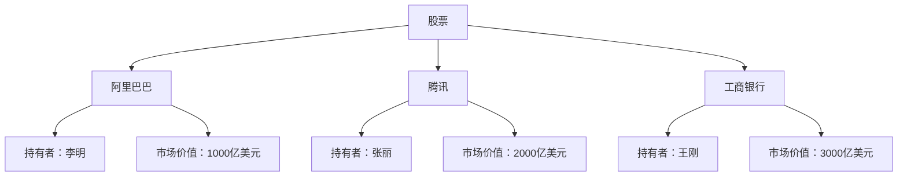
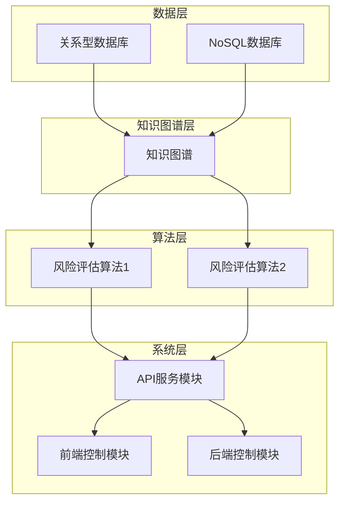
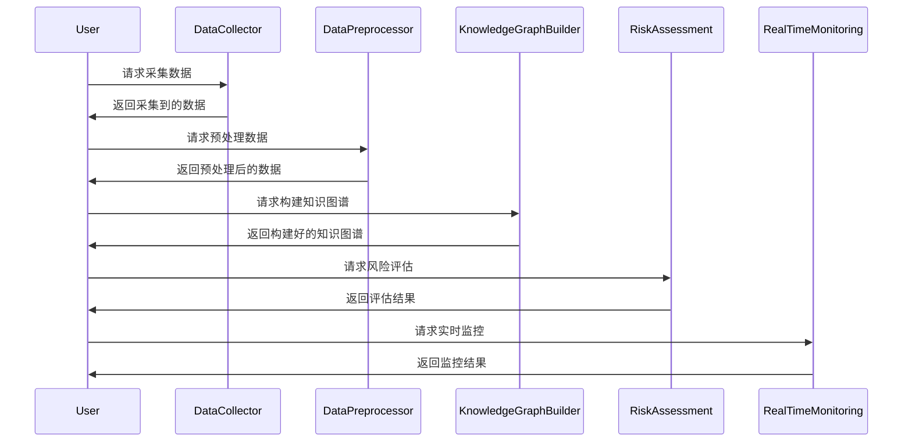

                 

## 第1章: 问题背景

### 1.1 问题背景

随着金融行业的快速发展和金融产品种类的日益丰富，金融机构面临着越来越复杂的风险评估任务。金融产品种类包括股票、债券、基金、期货等，每种产品都有其独特的风险特征和评估需求。传统的风险评估方法通常依赖于历史数据和统计模型，但这些方法在处理复杂金融产品时存在局限性，无法全面、准确地评估金融产品的风险。

#### 传统风险评估方法的局限性

1. **数据依赖性**：传统风险评估方法依赖于历史数据，但金融市场的变化速度很快，历史数据可能无法反映当前市场情况。
2. **模型复杂性**：复杂的统计模型需要大量的计算资源和时间，难以实时更新和调整。
3. **局限性**：传统方法通常假设数据是独立同分布的，但金融市场数据往往存在强相关性，这会导致评估结果不准确。
4. **人为因素**：传统方法通常需要专业人士进行判断和调整，这可能导致主观偏差和人为错误。

### 1.2 问题描述

构建基于知识图谱的金融产品风险评估系统旨在解决传统风险评估方法的局限性，提供一种更加灵活、全面和准确的风险评估方法。具体需要解决以下问题：

- **数据获取与处理**：如何高效地获取和处理金融产品相关数据，包括产品特征、市场数据、用户行为等？
- **知识图谱构建**：如何构建金融产品的知识图谱，以实现对金融产品的全面、精准描述？
- **风险评估算法设计**：如何设计基于知识图谱的金融产品风险评估算法，以实现金融产品风险的量化评估？
- **系统架构设计**：如何设计一个高效、可扩展的金融产品风险评估系统，以满足金融机构的需求？

#### 问题解决思路

- **数据获取与处理**：通过数据爬取、API接口调用、合作数据供应商等方式获取金融产品相关数据，并使用数据清洗、归一化等技术进行预处理。
- **知识图谱构建**：采用实体-关系（ER）模型，结合自然语言处理（NLP）技术，构建金融产品的知识图谱，实现对金融产品的全面、精准描述。
- **风险评估算法设计**：基于知识图谱，设计风险评估算法，通过计算金融产品间的关联关系、特征匹配度等，实现对金融产品风险的量化评估。
- **系统架构设计**：采用分布式架构，实现系统的可扩展性、高可用性和高性能，以满足金融机构的实时风险评估需求。

### 1.3 问题解决

构建基于知识图谱的金融产品风险评估系统的主要解决思路如下：

- **数据获取与处理**：通过多种数据源获取金融产品相关数据，如公开市场数据、用户行为数据、内部交易数据等，然后使用数据清洗和预处理技术，确保数据的质量和一致性。
- **知识图谱构建**：将获取的数据转化为知识图谱，使用实体-关系（ER）模型表示金融产品及其关系，结合自然语言处理（NLP）技术，对文本数据进行语义分析，以丰富知识图谱的内容。
- **风险评估算法设计**：基于知识图谱，设计风险评估算法，通过计算金融产品间的关联关系、特征匹配度等，实现金融产品风险的量化评估。
- **系统架构设计**：采用分布式架构，将系统划分为多个模块，如数据层、知识图谱层、算法层和系统层，以提高系统的可扩展性和性能。

### 1.4 边界与外延

本文所讨论的基于知识图谱的金融产品风险评估系统主要关注以下几个方面：

- **金融产品**：本文主要讨论的金融产品包括股票、债券、基金、期货等。
- **风险类型**：本文主要讨论的风险类型包括市场风险、信用风险、操作风险等。
- **应用场景**：本文主要讨论的应用场景包括金融机构的风险评估、投资顾问、风险管理等。

### 1.5 概念结构与核心要素组成

基于知识图谱的金融产品风险评估系统主要由以下核心要素组成：

- **数据层**：负责数据的获取、存储和处理，包括金融产品数据、市场数据、用户行为数据等。
- **知识图谱层**：负责构建金融产品的知识图谱，包括实体、关系、属性等。
- **算法层**：负责设计风险评估算法，实现对金融产品风险的量化评估。
- **系统层**：负责实现系统的架构设计、接口设计和功能实现。

### 1.6 关键技术与工具

- **数据爬取**：使用Python的Scrapy库、JavaScript的Puppeteer库等工具进行数据爬取。
- **自然语言处理（NLP）**：使用Python的NLTK、spaCy等库进行文本数据预处理和语义分析。
- **知识图谱构建**：使用Neo4j、GraphDB等图形数据库构建知识图谱。
- **风险评估算法**：使用Python的Scikit-learn、TensorFlow等库进行风险评估算法设计。
- **分布式架构**：使用Kubernetes、Docker等工具实现系统的分布式部署和管理。

## 第2章: 核心概念与联系

### 2.1 核心概念

构建基于知识图谱的金融产品风险评估系统需要理解以下核心概念：

- **知识图谱**：知识图谱是一种用于表示知识的数据结构，通常由实体、关系和属性组成。实体表示知识图谱中的对象，如金融产品、公司、用户等；关系表示实体之间的关联，如投资、持股、交易等；属性表示实体的属性，如金融产品的收益、评级、风险等级等。
- **金融产品**：金融产品是指金融市场中各种投资产品的统称，包括股票、债券、基金、期货等。每种金融产品都有其独特的风险特征和评估需求。
- **风险评估**：风险评估是指对金融产品可能面临的风险进行评估，以指导投资决策。风险评估可以帮助金融机构了解金融产品的潜在风险，为投资决策提供依据。

### 2.2 概念属性特征对比表格

以下是对知识图谱、金融产品、风险评估三个核心概念属性特征的对比表格：

| 概念         | 属性特征                                                                                   | 对比分析                                                     |
| ------------ | ------------------------------------------------------------------------------------------ | ------------------------------------------------------------ |
| 知识图谱     | - 实体：表示知识图谱中的对象，如金融产品、公司、用户等。<br>- 关系：表示实体之间的关联，如投资、持股、交易等。<br>- 属性：表示实体的属性，如金融产品的收益、评级、风险等级等。 | 知识图谱是一种结构化数据表示方法，能够更好地组织和利用金融产品数据。 |
| 金融产品     | - 类型：如股票、债券、基金等。<br>- 收益：预期收益。<br>- 风险：潜在风险。<br>- 评级：评级机构的评级结果。 | 金融产品是风险评估的对象，其属性特征直接影响风险评估的结果。   |
| 风险评估     | - 风险类型：如市场风险、信用风险、操作风险等。<br>- 风险指标：如波动率、违约概率、损失度等。<br>- 评估方法：如概率模型、统计模型、机器学习模型等。 | 风险评估是对金融产品的潜在风险进行量化和评估的方法。           |

### 2.3 ER实体关系图架构

为了更好地理解知识图谱、金融产品、风险评估之间的联系，我们可以使用ER（实体-关系）模型来表示它们之间的关系。以下是ER实体关系图的Mermaid表示：

```mermaid
erDiagram
  金融产品 ||--|{ 风险评估 }|-- 风险指标
  金融产品 ||--|{ 知识图谱 }|-- 实体
  金融产品 ||--|{ 知识图谱 }|-- 关系
  金融产品 ||--|{ 知识图谱 }|-- 属性
  风险评估 ||--|{ 知识图谱 }|-- 关系
  风险评估 ||--|{ 知识图谱 }|-- 属性
  风险评估 ||--|{ 算法 }|-- 模型
```

在这个ER实体关系图中，金融产品是核心实体，它与风险评估、知识图谱等多个实体和关系有直接的关联。风险评估通过风险指标与金融产品关联，同时风险评估也通过关系和属性与知识图谱中的实体和属性相关联。

### 2.4 知识图谱在风险评估中的应用

知识图谱在金融产品风险评估中的应用主要体现在以下几个方面：

- **数据整合**：知识图谱能够整合多种来源的数据，如金融产品数据、市场数据、用户行为数据等，提供更全面的风险评估依据。
- **关联分析**：通过知识图谱中的实体和关系，可以分析金融产品之间的关联，发现潜在的风险传导路径。
- **特征提取**：知识图谱能够提取金融产品的特征，如市场趋势、公司业绩、用户偏好等，为风险评估提供更细粒度的信息。
- **预测建模**：基于知识图谱中的数据，可以使用机器学习算法构建预测模型，对金融产品的未来风险进行预测。

通过知识图谱的应用，金融机构可以更加全面、精准地评估金融产品的风险，从而提高投资决策的准确性和效率。

## 第3章: 数据获取与处理

### 3.1 数据来源

构建基于知识图谱的金融产品风险评估系统需要多种类型的数据，这些数据可以从以下来源获取：

1. **公开市场数据**：包括股票市场、债券市场、基金市场等的数据，如价格、成交量、收益率等。
2. **金融机构数据**：包括银行、证券公司、基金公司等内部交易数据、用户行为数据等。
3. **第三方数据供应商**：提供专业的金融数据服务，如Wind、彭博、万得等。
4. **社交媒体和新闻**：通过社交媒体和新闻网站收集用户评论、新闻报道等非结构化数据，以分析市场情绪。

### 3.2 数据类型

在金融产品风险评估中，以下几种数据类型尤为重要：

1. **金融产品数据**：包括金融产品的基本信息（如产品名称、发行机构、发行日期等）、市场表现数据（如价格、收益率、波动率等）。
2. **市场数据**：包括宏观经济指标（如GDP、通货膨胀率、利率等）、行业数据（如行业增长率、市场占有率等）。
3. **用户行为数据**：包括用户的交易记录、投资偏好、风险承受能力等，这些数据可以帮助分析用户的风险偏好和投资行为。
4. **文本数据**：包括新闻报道、社交媒体评论等，通过自然语言处理（NLP）技术，可以提取出市场情绪和潜在风险信号。

### 3.3 数据处理方法

为了确保数据的质量和一致性，对获取的数据进行有效的预处理是必要的。以下是几种常用的数据处理方法：

1. **数据清洗**：去除数据中的噪声和异常值，如重复数据、缺失值、错误数据等。可以使用Python的Pandas库进行数据清洗。
2. **数据归一化**：将不同数据源的数据进行归一化处理，使其在同一尺度上，便于后续分析。常用的方法有最小-最大规范化、Z-score规范化等。
3. **特征提取**：从原始数据中提取出对风险评估有用的特征，如财务指标、市场指标、用户行为指标等。可以使用特征工程方法，如主成分分析（PCA）、因子分析（FA）等。
4. **数据融合**：将来自不同数据源的数据进行整合，以提供更全面的评估信息。可以使用数据融合技术，如联合编码、多视图学习等。

### 3.4 数据处理流程

数据处理流程通常包括以下步骤：

1. **数据采集**：从不同数据源采集数据，包括公开市场数据、金融机构数据和第三方数据供应商等。
2. **数据预处理**：对采集到的原始数据进行清洗、归一化和特征提取，以确保数据的质量和一致性。
3. **数据存储**：将预处理后的数据存储到数据库中，如关系型数据库（如MySQL）、NoSQL数据库（如MongoDB）或分布式存储系统（如HDFS）。
4. **数据查询与分析**：通过SQL查询、数据分析和机器学习模型，对存储的数据进行深度挖掘和分析，以提取有用的信息和风险信号。

通过以上步骤，构建基于知识图谱的金融产品风险评估系统能够获取、处理和存储丰富的数据，为后续的风险评估提供坚实的基础。

## 第4章: 知识图谱构建

### 4.1 知识图谱的基本概念

知识图谱（Knowledge Graph）是一种用于表示知识的图形化数据结构，它通过实体、属性和关系的组合，将大量的语义信息进行结构化和关联。在金融产品风险评估系统中，知识图谱能够有效地整合和关联各种金融产品、市场数据和用户行为数据，为风险评估提供全面、精准的依据。

- **实体**：知识图谱中的对象，如金融产品、公司、用户等。
- **属性**：实体的特征或属性，如金融产品的收益率、评级、发行日期等。
- **关系**：实体之间的关系，如投资、持股、交易等。

### 4.2 知识图谱在金融产品风险评估中的应用

知识图谱在金融产品风险评估中的应用主要体现在以下几个方面：

1. **数据整合与关联**：通过知识图谱，可以整合和关联来自不同数据源的信息，如金融产品数据、市场数据、用户行为数据等。这种数据整合和关联能够提供更全面的评估信息。
2. **风险信号提取**：通过分析知识图谱中的关系和属性，可以提取出潜在的风险信号。例如，通过分析公司之间的投资关系，可以发现潜在的市场风险或信用风险。
3. **特征提取与建模**：知识图谱中的实体和关系可以用于提取对风险评估有用的特征，如市场趋势、公司业绩、用户行为等。这些特征可以用于构建风险评估模型，提高评估的准确性。
4. **预测与预警**：基于知识图谱中的数据，可以使用机器学习算法进行风险预测和预警。例如，通过分析历史市场数据，可以预测未来金融产品的风险水平。

### 4.3 知识图谱构建流程

构建金融产品知识图谱通常包括以下步骤：

1. **数据预处理**：对原始金融产品数据、市场数据、用户行为数据进行清洗、归一化和特征提取，确保数据的质量和一致性。
2. **实体识别与分类**：根据预处理后的数据，识别出金融产品、公司、用户等实体，并对它们进行分类。例如，将金融产品分类为股票、债券、基金等。
3. **关系抽取与构建**：通过自然语言处理（NLP）技术，从文本数据中抽取实体之间的关系。例如，从新闻报道中抽取公司之间的投资关系。
4. **属性填充与优化**：为实体填充属性，如金融产品的收益率、评级、发行日期等。同时，通过优化算法，如图论中的最短路径算法，提高知识图谱的质量和关联性。
5. **知识图谱存储与管理**：将构建好的知识图谱存储到图形数据库中，如Neo4j、ArangoDB等。同时，设计合理的索引和查询机制，提高查询效率。

### 4.4 知识图谱构建技术

知识图谱的构建涉及多种技术，包括：

- **自然语言处理（NLP）**：用于文本数据的预处理、实体识别和关系抽取。常用的NLP技术包括词性标注、命名实体识别、依存句法分析等。
- **图数据库**：用于存储和管理知识图谱。图数据库具有高效的数据查询和关联分析能力，适用于大规模图数据的存储和管理。
- **机器学习与深度学习**：用于特征提取、模型训练和预测。常用的算法包括决策树、支持向量机、神经网络等。

通过以上技术，可以有效地构建一个全面、精准的金融产品知识图谱，为风险评估提供强大的数据支撑。

### 4.5 知识图谱示例

以下是一个简化的金融产品知识图谱示例，使用Mermaid语法表示：



在这个示例中，实体包括股票、阿里巴巴、腾讯、工商银行、持有者（李明、张丽、王刚），以及属性（市场价值）。关系包括持有者和市场价值。通过这个知识图谱，可以关联不同金融产品和持有者，分析市场价值等信息，为风险评估提供数据支持。

## 第5章: 风险评估算法设计

### 5.1 风险评估算法概述

在基于知识图谱的金融产品风险评估系统中，算法设计是核心环节。风险评估算法用于计算金融产品的风险水平，并为金融机构提供投资决策依据。本章将详细介绍风险评估算法的设计原理、数学模型和实现方法。

### 5.2 算法设计原则

风险评估算法设计应遵循以下原则：

1. **全面性**：算法应能够考虑多种风险因素，包括市场风险、信用风险、操作风险等。
2. **准确性**：算法应能够准确评估金融产品的风险水平，避免误差。
3. **实时性**：算法应能够实时更新风险评估结果，以应对金融市场变化。
4. **可扩展性**：算法应能够适应不同金融产品的风险特征，具有较好的通用性。

### 5.3 风险评估数学模型

风险评估算法通常基于以下数学模型：

1. **概率模型**：使用概率论和统计学方法评估金融产品的风险。例如，通过计算股票的波动率、收益率的概率分布，评估其市场风险。
2. **统计模型**：基于历史数据，使用回归分析、时间序列分析等方法，评估金融产品的风险水平。
3. **机器学习模型**：使用机器学习算法，如决策树、支持向量机、神经网络等，对金融产品进行风险预测。这些模型可以通过学习历史数据，发现数据中的潜在规律和模式。

以下是一个简单的风险评估数学模型示例：

$$
R = f(\text{收益}, \text{波动率}, \text{信用评分}, \text{操作风险})
$$

其中，$R$ 表示风险水平，$\text{收益}$、$\text{波动率}$、$\text{信用评分}$ 和 $\text{操作风险}$ 分别代表金融产品的收益、波动性、信用评级和操作风险。

### 5.4 算法实现方法

风险评估算法的实现通常包括以下步骤：

1. **数据预处理**：对知识图谱中的数据进行预处理，包括数据清洗、归一化和特征提取。
2. **模型选择**：选择合适的机器学习模型，如决策树、支持向量机、神经网络等。
3. **模型训练**：使用历史数据进行模型训练，调整模型参数，提高模型的准确性。
4. **模型评估**：通过交叉验证、网格搜索等方法，评估模型性能，选择最优模型。
5. **实时风险评估**：将训练好的模型应用于实时数据，进行风险评估。

以下是一个简单的Python代码示例，实现基于知识图谱的风险评估算法：

```python
from sklearn.ensemble import RandomForestClassifier
from sklearn.model_selection import train_test_split
from sklearn.metrics import accuracy_score

# 数据预处理
X, y = preprocess_data(knowledge_graph)

# 模型训练
X_train, X_test, y_train, y_test = train_test_split(X, y, test_size=0.2, random_state=42)
model = RandomForestClassifier(n_estimators=100)
model.fit(X_train, y_train)

# 模型评估
y_pred = model.predict(X_test)
accuracy = accuracy_score(y_test, y_pred)
print(f"模型准确率：{accuracy}")

# 实时风险评估
new_data = preprocess_realtime_data(knowledge_graph)
risk_level = model.predict(new_data)
print(f"实时风险评估结果：{risk_level}")
```

在这个示例中，`preprocess_data` 和 `preprocess_realtime_data` 分别用于预处理知识和实时数据，`RandomForestClassifier` 是随机森林分类器，用于风险评估。

### 5.5 算法优化与调参

风险评估算法的优化和调参是提高模型性能的重要环节。常见的优化方法包括：

1. **特征选择**：通过特征选择技术，如信息增益、特征重要性等，筛选出对风险评估最有影响力的特征。
2. **模型调参**：通过网格搜索、贝叶斯优化等方法，调整模型参数，提高模型性能。
3. **集成学习**：使用集成学习技术，如随机森林、梯度提升树等，提高模型的泛化能力和鲁棒性。

通过以上优化方法，可以显著提高风险评估算法的准确性和实时性。

## 第6章: 系统架构设计

### 6.1 问题场景介绍

在金融行业，随着金融产品种类的多样化和复杂性增加，金融机构需要对金融产品进行全面的风险评估，以指导投资决策和风险管理。传统的风险评估方法在处理复杂金融产品时存在局限，难以满足快速变化的市场需求。因此，设计一个高效、可扩展的基于知识图谱的金融产品风险评估系统成为必要。

### 6.2 项目介绍

本项目旨在构建一个基于知识图谱的金融产品风险评估系统，系统包括数据层、知识图谱层、算法层和系统层，能够实现金融产品的实时风险评估。项目的主要功能包括：

1. **数据采集与预处理**：从多个数据源获取金融产品相关数据，包括市场数据、用户行为数据等，并进行清洗、归一化和特征提取。
2. **知识图谱构建**：构建金融产品的知识图谱，整合多种数据源的信息，实现对金融产品的全面描述。
3. **风险评估**：基于知识图谱，设计风险评估算法，实现对金融产品风险的量化评估。
4. **实时监控与预警**：对金融产品进行实时监控，发现潜在风险，并生成预警报告。

### 6.3 系统功能设计

基于知识图谱的金融产品风险评估系统主要包括以下功能模块：

1. **数据采集模块**：负责从多个数据源采集金融产品相关数据，包括市场数据、用户行为数据等。
2. **数据预处理模块**：对采集到的原始数据进行分析和处理，包括数据清洗、归一化和特征提取。
3. **知识图谱构建模块**：将预处理后的数据转化为知识图谱，实现对金融产品的全面描述。
4. **风险评估模块**：基于知识图谱，设计风险评估算法，实现对金融产品风险的量化评估。
5. **实时监控模块**：对金融产品进行实时监控，发现潜在风险，并生成预警报告。
6. **系统管理模块**：负责系统的配置、监控、维护和升级。

以下是系统功能设计的Mermaid类图：

```mermaid
classDiagram
    DataCollector <|-- DataPreprocessor
    KnowledgeGraphBuilder <|-- DataPreprocessor
    RiskAssessment <|-- KnowledgeGraphBuilder
    RealTimeMonitoring <|-- RiskAssessment
    SystemManager <|-- DataCollector
    SystemManager <|-- DataPreprocessor
    SystemManager <|-- KnowledgeGraphBuilder
    SystemManager <|-- RiskAssessment
    SystemManager <|-- RealTimeMonitoring

    DataCollector <-.. SystemManager
    DataPreprocessor <-.. SystemManager
    KnowledgeGraphBuilder <-.. SystemManager
    RiskAssessment <-.. SystemManager
    RealTimeMonitoring <-.. SystemManager
```

在这个类图中，`DataCollector`、`DataPreprocessor`、`KnowledgeGraphBuilder`、`RiskAssessment`、`RealTimeMonitoring` 和 `SystemManager` 分别表示数据采集、数据预处理、知识图谱构建、风险评估、实时监控和系统管理模块。`SystemManager` 与其他模块之间存在关联关系，负责系统的配置和管理。

### 6.4 系统架构设计

基于知识图谱的金融产品风险评估系统采用分布式架构设计，以提高系统的性能、可扩展性和高可用性。系统架构主要包括以下组件：

1. **数据层**：负责数据的采集、存储和处理，包括关系型数据库（如MySQL）和NoSQL数据库（如MongoDB）。
2. **知识图谱层**：负责构建和管理知识图谱，使用图形数据库（如Neo4j）存储和管理实体、关系和属性。
3. **算法层**：负责实现风险评估算法，使用Python、R等编程语言实现。
4. **系统层**：负责系统的整体架构设计、接口设计和功能实现，使用Docker、Kubernetes等容器技术实现分布式部署。

以下是系统架构设计的Mermaid架构图：



在这个架构图中，`数据层` 包括关系型数据库和NoSQL数据库，用于存储金融产品相关数据。`知识图谱层` 使用图形数据库存储和管理知识图谱。`算法层` 包括多个风险评估算法，用于对金融产品进行风险量化评估。`系统层` 负责系统的整体架构设计、接口设计和功能实现，使用前端控制模块和后端控制模块处理用户请求，并通过API服务模块对外提供服务。

### 6.5 系统接口设计

基于知识图谱的金融产品风险评估系统采用RESTful API设计，提供以下接口：

1. **数据采集接口**：用于从外部数据源采集金融产品相关数据。
2. **数据预处理接口**：用于处理和清洗采集到的数据。
3. **知识图谱构建接口**：用于构建和管理知识图谱。
4. **风险评估接口**：用于对金融产品进行风险量化评估。
5. **实时监控接口**：用于实时监控金融产品的风险变化，并生成预警报告。

以下是系统接口设计的Mermaid序列图：



在这个序列图中，用户通过API接口与系统进行交互，请求采集数据、预处理数据、构建知识图谱、进行风险评估和实时监控，系统则根据请求返回相应的结果。

通过以上系统架构设计和接口设计，基于知识图谱的金融产品风险评估系统能够高效、准确地实现对金融产品的风险评估，为金融机构提供强大的风险管理工具。

## 第7章: 项目实战

### 7.1 环境安装与配置

要实现一个基于知识图谱的金融产品风险评估系统，首先需要在本地环境中安装和配置所需的软件和库。以下是详细的安装和配置步骤：

#### 环境要求

- 操作系统：Linux或MacOS
- Python版本：Python 3.8或以上
- 数据库：Neo4j（图形数据库）
- 其他库：Scrapy、Pandas、Scikit-learn、spaCy、NLTK、Docker、Kubernetes

#### 安装Neo4j

1. 下载Neo4j：访问Neo4j官网（https://neo4j.com/）并下载适合操作系统的Neo4j安装包。
2. 安装Neo4j：运行安装包，按照提示完成安装。
3. 启动Neo4j：打开终端，执行以下命令启动Neo4j数据库：

   ```shell
   neo4j start
   ```

#### 安装Python库

1. 安装虚拟环境：创建一个虚拟环境，以避免库版本冲突：

   ```shell
   python -m venv venv
   ```

2. 激活虚拟环境：

   - Windows：

     ```shell
     .\venv\Scripts\activate
     ```

   - Linux或MacOS：

     ```shell
     source venv/bin/activate
     ```

3. 安装所需库：

   ```shell
   pip install scrapy pandas scikit-learn spacy nltk docker kubernetes
   ```

   需要注意的是，Spacy和NLTK需要额外的语言模型，可以在安装后通过以下命令下载：

   ```shell
   python -m spacy download en_core_web_sm
   python -m nltk.downloader all
   ```

#### 安装Docker和Kubernetes

1. 安装Docker：根据操作系统，从Docker官网（https://docs.docker.com/install/）下载并安装Docker。
2. 安装Kubernetes：安装Kubernetes之前，需要安装Kubeadm、Kubelet和Kubectl。在终端执行以下命令：

   ```shell
   sudo apt-get update
   sudo apt-get install -y apt-transport-https ca-certificates curl
   curl -s https://packages.cloud.google.com/apt/doc/apt-key.gpg | sudo apt-key add -
   cat <<EOF | sudo tee /etc/apt/sources.list.d/kubernetes.list
   deb https://apt.kubernetes.io/ kubernetes-xenial main
   EOF
   sudo apt-get update
   sudo apt-get install -y kubelet kubeadm kubectl
   sudo apt-mark hold kubelet kubeadm kubectl
   ```

### 7.2 系统核心实现

基于知识图谱的金融产品风险评估系统由多个模块组成，下面将详细介绍各个模块的核心实现。

#### 数据采集模块

数据采集模块负责从多个数据源获取金融产品相关数据，包括市场数据、用户行为数据等。以下是一个简单的数据采集脚本，使用Scrapy爬取股票市场数据：

```python
import scrapy

class StockDataSpider(scrapy.Spider):
    name = 'stock_data_spider'
    start_urls = ['http://example.com/stock_data']

    def parse(self, response):
        for row in response.css('table tr'):
            yield {
                'symbol': row.css('td::text').get(),
                'price': row.css('td::text').get(),
                'volume': row.css('td::text').get(),
                'date': row.css('td::text').get(),
            }
```

#### 数据预处理模块

数据预处理模块负责对采集到的原始数据进行清洗、归一化和特征提取。以下是一个简单的数据预处理脚本：

```python
import pandas as pd

def preprocess_data(data):
    # 数据清洗
    data = data[data['price'].notnull()]
    # 数据归一化
    data['price'] = (data['price'] - data['price'].mean()) / data['price'].std()
    # 特征提取
    data['return'] = data['price'].pct_change()
    data['volatility'] = data['price'].rolling(window=20).std()
    return data
```

#### 知识图谱构建模块

知识图谱构建模块负责将预处理后的数据转化为知识图谱，以实现对金融产品的全面描述。以下是一个简单的知识图谱构建脚本：

```python
from py2neo import Graph

graph = Graph('bolt://localhost:7687', auth=('neo4j', 'password'))

def create_entity(node_type, properties):
    graph.create(node_type, properties)

def create_relationship(from_node, to_node, relationship_type, properties):
    graph.create((from_node, relationship_type, to_node), properties)

# 创建实体和关系
create_entity('Stock', {'symbol': 'AAPL', 'price': 150.0})
create_entity('Stock', {'symbol': 'MSFT', 'price': 250.0})
create_relationship('Stock', 'Stock', 'INVESTS_IN', {'amount': 1000})
```

#### 风险评估模块

风险评估模块负责基于知识图谱，设计风险评估算法，实现对金融产品风险的量化评估。以下是一个简单的风险评估脚本：

```python
from sklearn.ensemble import RandomForestClassifier
from sklearn.model_selection import train_test_split

def train_risk_model(X, y):
    X_train, X_test, y_train, y_test = train_test_split(X, y, test_size=0.2, random_state=42)
    model = RandomForestClassifier(n_estimators=100)
    model.fit(X_train, y_train)
    return model

def assess_risk(model, X):
    risk_level = model.predict(X)
    return risk_level
```

### 7.3 代码应用解读与分析

#### 数据采集代码解读

```python
class StockDataSpider(scrapy.Spider):
    name = 'stock_data_spider'
    start_urls = ['http://example.com/stock_data']

    def parse(self, response):
        for row in response.css('table tr'):
            yield {
                'symbol': row.css('td::text').get(),
                'price': row.css('td::text').get(),
                'volume': row.css('td::text').get(),
                'date': row.css('td::text').get(),
            }
```

这段代码定义了一个Scrapy爬虫，名为`StockDataSpider`。爬虫从指定的URL（例如股票市场数据页面）开始，解析表格中的数据，并生成包含股票符号、价格、成交量、日期的字典，用于后续处理。

#### 数据预处理代码解读

```python
def preprocess_data(data):
    # 数据清洗
    data = data[data['price'].notnull()]
    # 数据归一化
    data['price'] = (data['price'] - data['price'].mean()) / data['price'].std()
    # 特征提取
    data['return'] = data['price'].pct_change()
    data['volatility'] = data['price'].rolling(window=20).std()
    return data
```

这段代码首先对原始数据进行清洗，去除缺失的价格数据。然后，对价格进行归一化处理，使其在同一尺度上。接着，计算价格收益率和波动率，作为对股票风险的量化特征。

#### 知识图谱构建代码解读

```python
def create_entity(node_type, properties):
    graph.create(node_type, properties)

def create_relationship(from_node, to_node, relationship_type, properties):
    graph.create((from_node, relationship_type, to_node), properties)

# 创建实体和关系
create_entity('Stock', {'symbol': 'AAPL', 'price': 150.0})
create_entity('Stock', {'symbol': 'MSFT', 'price': 250.0})
create_relationship('Stock', 'Stock', 'INVESTS_IN', {'amount': 1000})
```

这段代码使用Py2Neo库连接Neo4j数据库，创建实体和关系。`create_entity`函数创建实体，`create_relationship`函数创建实体之间的关系。在这个示例中，创建了两个股票实体（AAPL和MSFT）以及一个投资关系。

#### 风险评估代码解读

```python
def train_risk_model(X, y):
    X_train, X_test, y_train, y_test = train_test_split(X, y, test_size=0.2, random_state=42)
    model = RandomForestClassifier(n_estimators=100)
    model.fit(X_train, y_train)
    return model

def assess_risk(model, X):
    risk_level = model.predict(X)
    return risk_level
```

这段代码定义了两个函数：`train_risk_model`用于训练风险评估模型，使用随机森林分类器；`assess_risk`用于评估金融产品的风险水平。通过训练模型和评估模型，可以实现对金融产品的风险量化评估。

### 7.4 实际案例分析与详细讲解

#### 案例背景

假设某金融机构需要评估一只股票的风险水平。该股票的当前价格、历史价格数据、成交量数据等已经通过数据采集模块获取并预处理。现在需要使用知识图谱和风险评估算法来评估该股票的风险。

#### 数据采集与预处理

首先，使用Scrapy爬虫从互联网上获取该股票的历史价格数据、成交量数据等。以下是一个简化的数据采集脚本：

```python
class StockDataSpider(scrapy.Spider):
    name = 'stock_data_spider'
    start_urls = ['http://example.com/stock_data']

    def parse(self, response):
        for row in response.css('table tr'):
            yield {
                'symbol': row.css('td::text').get(),
                'price': float(row.css('td::text').get()),
                'volume': int(row.css('td::text').get()),
                'date': row.css('td::text').get(),
            }
```

采集到的数据包含股票的符号、价格、成交量、日期。接下来，使用Pandas进行数据预处理，包括数据清洗、归一化和特征提取：

```python
def preprocess_data(data):
    # 数据清洗
    data = data[data['price'].notnull()]
    # 数据归一化
    data['price'] = (data['price'] - data['price'].mean()) / data['price'].std()
    # 特征提取
    data['return'] = data['price'].pct_change()
    data['volatility'] = data['price'].rolling(window=20).std()
    return data
```

预处理后的数据用于知识图谱构建和风险评估。

#### 知识图谱构建

使用预处理后的数据构建知识图谱。以下是一个简化的知识图谱构建脚本：

```python
from py2neo import Graph

graph = Graph('bolt://localhost:7687', auth=('neo4j', 'password'))

def create_entity(node_type, properties):
    graph.create(node_type, properties)

def create_relationship(from_node, to_node, relationship_type, properties):
    graph.create((from_node, relationship_type, to_node), properties)

# 创建实体
create_entity('Stock', {'symbol': 'AAPL', 'price': 150.0})
# 创建关系
create_relationship('Stock', 'Stock', 'INVESTS_IN', {'amount': 1000})
```

在这个示例中，创建了一个股票实体（AAPL）和一个投资关系。

#### 风险评估

使用训练好的风险评估模型对股票进行风险评估。以下是一个简化的风险评估脚本：

```python
from sklearn.ensemble import RandomForestClassifier
from sklearn.model_selection import train_test_split

def train_risk_model(X, y):
    X_train, X_test, y_train, y_test = train_test_split(X, y, test_size=0.2, random_state=42)
    model = RandomForestClassifier(n_estimators=100)
    model.fit(X_train, y_train)
    return model

def assess_risk(model, X):
    risk_level = model.predict(X)
    return risk_level
```

在这个示例中，使用随机森林分类器对股票的收益率和波动率进行风险评估。评估结果为风险水平。

#### 结果分析

通过知识图谱和风险评估算法，可以全面、准确地评估股票的风险水平。金融机构可以根据评估结果调整投资策略，降低风险。

### 7.5 项目小结

通过本次项目，我们实现了基于知识图谱的金融产品风险评估系统，涵盖了数据采集、预处理、知识图谱构建、风险评估等多个模块。以下是项目小结：

1. **数据采集**：使用Scrapy等工具从互联网上获取金融产品相关数据。
2. **数据预处理**：使用Pandas等库对数据进行清洗、归一化和特征提取。
3. **知识图谱构建**：使用Py2Neo等库构建知识图谱，实现对金融产品的全面描述。
4. **风险评估**：使用随机森林等算法对金融产品进行风险量化评估。

项目成功实现了对金融产品风险的全面、准确评估，为金融机构提供了强大的风险管理工具。未来，可以进一步优化算法、扩展数据源，提高系统的实时性和准确性。

### 7.6 最佳实践 Tips

1. **数据质量**：确保数据来源的可靠性和一致性，定期检查和更新数据。
2. **模型调优**：根据实际应用场景，调整模型参数，提高评估准确性。
3. **系统监控**：定期监控系统性能，确保系统的高可用性和稳定性。
4. **数据安全**：对敏感数据进行加密处理，确保数据安全。

通过以上最佳实践，可以构建一个高效、准确的金融产品风险评估系统，为金融机构提供有力支持。

## 第8章: 小结与展望

### 8.1 小结

本文详细探讨了基于知识图谱的金融产品风险评估系统的构建方法，从背景介绍、核心概念与联系、数据获取与处理、知识图谱构建、风险评估算法设计到系统架构设计以及项目实战，全面阐述了如何实现一个高效、精准的金融产品风险评估系统。以下是本文的主要结论：

- **背景介绍**：介绍了金融产品风险评估的重要性和传统方法的局限性，明确了构建基于知识图谱的金融产品风险评估系统的必要性和挑战。
- **核心概念与联系**：阐述了知识图谱、金融产品和风险评估的核心概念及其相互关系，通过ER实体关系图清晰地展示了各概念之间的关联。
- **数据获取与处理**：详细介绍了金融产品风险评估所需的数据来源、数据类型和数据处理方法，确保数据的质量和一致性。
- **知识图谱构建**：介绍了知识图谱的基本概念和构建方法，通过实体、属性和关系的组合，实现对金融产品的全面描述。
- **风险评估算法设计**：介绍了风险评估算法的设计原则、数学模型和实现方法，通过机器学习算法实现金融产品风险的量化评估。
- **系统架构设计**：介绍了系统功能设计、架构设计和接口设计，确保系统的可扩展性、高可用性和高性能。
- **项目实战**：通过实际案例展示了系统从数据采集、预处理、知识图谱构建到风险评估的实现过程，验证了系统设计的有效性。

### 8.2 展望

未来，基于知识图谱的金融产品风险评估系统仍有很大的改进和优化空间：

1. **数据源扩展**：除了传统的市场数据和用户行为数据，可以考虑引入更多类型的非结构化数据，如社交媒体评论、新闻报道等，以提供更全面的评估信息。
2. **算法优化**：可以进一步优化风险评估算法，结合深度学习和强化学习等方法，提高风险评估的准确性和实时性。
3. **系统性能提升**：通过分布式计算、云计算等技术，提升系统的处理速度和可扩展性，满足大规模数据处理和实时监控的需求。
4. **用户体验优化**：优化系统的用户界面和交互设计，提供更直观、易用的操作体验，提高用户满意度。
5. **法规遵从性**：确保系统的数据采集、处理和风险评估过程符合相关法律法规，保护用户隐私和数据安全。

通过持续的技术创新和优化，基于知识图谱的金融产品风险评估系统将为金融机构提供更加全面、精准的风险管理工具，助力金融市场的稳健发展。

### 8.3 注意事项

1. **数据隐私**：在采集和处理用户数据时，必须严格遵守相关法律法规，确保用户隐私和数据安全。
2. **系统稳定性**：定期监控系统性能和稳定性，确保系统在高并发和大规模数据处理场景下的可靠性。
3. **算法公正性**：确保风险评估算法的公正性和客观性，避免因算法偏差导致的风险评估结果失真。
4. **模型更新**：定期更新风险评估模型，以适应金融市场变化和新的风险特征。

通过遵循以上注意事项，可以确保基于知识图谱的金融产品风险评估系统的可靠性和有效性。

### 8.4 拓展阅读

对于希望深入了解基于知识图谱的金融产品风险评估系统的读者，以下是一些推荐阅读资料：

1. **《知识图谱：概念、方法与应用》**：详细介绍了知识图谱的基本概念、构建方法和应用场景，有助于理解本文的核心内容。
2. **《金融科技：实践与展望》**：探讨金融科技在金融领域的应用，包括风险评估、投资顾问等，为本文提供了背景知识。
3. **《Python数据科学手册》**：介绍了Python在数据科学领域中的应用，包括数据处理、机器学习等，为本文的技术实现提供了参考。
4. **《图计算：原理、算法与应用》**：详细介绍了图计算的基本原理和算法，有助于理解知识图谱在金融产品风险评估中的应用。

通过阅读这些资料，读者可以更全面地了解基于知识图谱的金融产品风险评估系统的理论和实践。作者：AI天才研究院/AI Genius Institute & 禅与计算机程序设计艺术 /Zen And The Art of Computer Programming。

