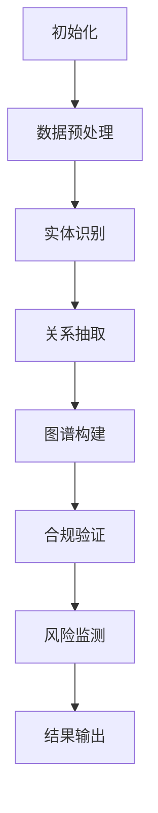
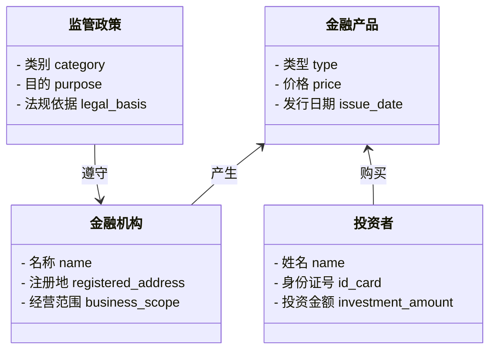
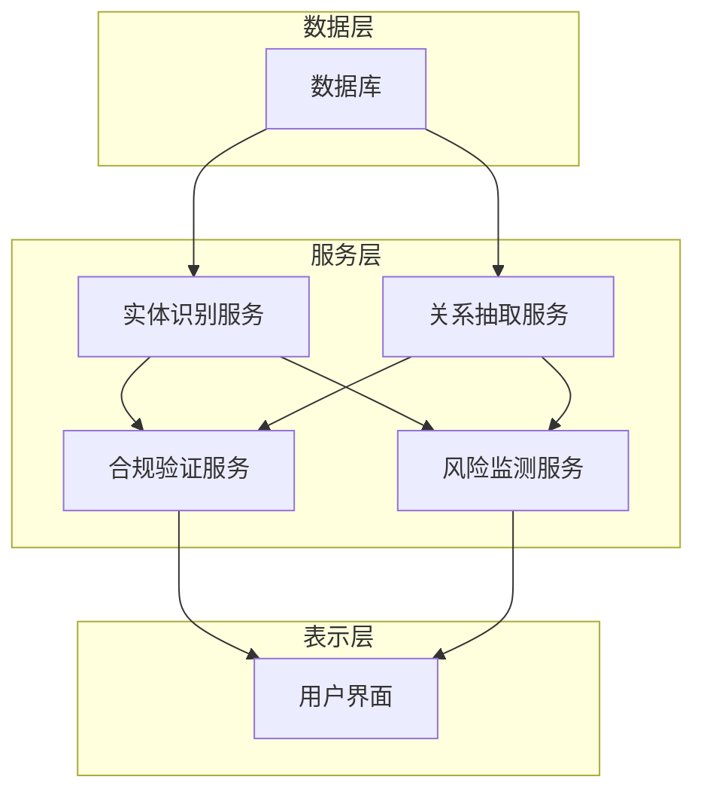
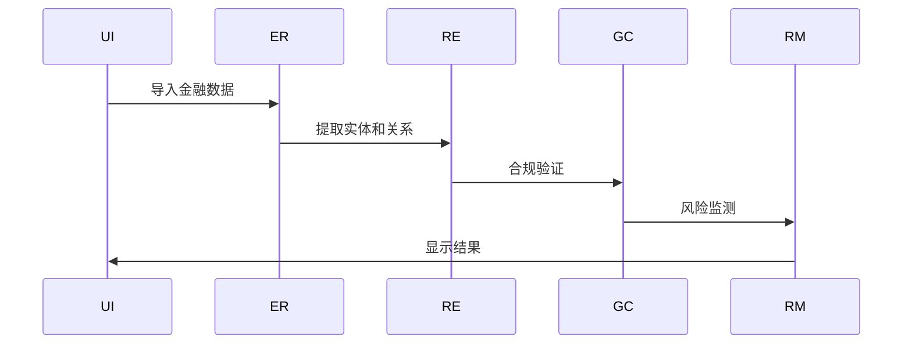

                 

### 构建基于知识图谱的金融监管合规追踪系统

> **关键词：** 知识图谱，金融监管，合规追踪，系统设计，算法原理。

> **摘要：** 本文章旨在探讨如何构建一个基于知识图谱的金融监管合规追踪系统。我们将详细分析金融监管与合规追踪的背景，介绍知识图谱的基本概念及其在金融监管中的应用，探讨系统的设计与实现方法，以及相关的算法原理与数学模型。文章将结合实际项目案例，展示系统实现的核心代码与最佳实践，并提供注意事项与拓展阅读建议。

----------------------------------------------------------------

### 第一部分：导论与背景

#### 第1章：金融监管与合规追踪概述

##### 1.1.1 金融监管的重要性

金融监管是指通过制定和执行相关法律法规，对金融市场进行管理和监督，以确保金融市场的稳定与安全。金融监管的重要性体现在以下几个方面：

1. **维护金融市场稳定**：通过监管，防止金融风险的扩散，维护金融市场的稳定。
2. **保护投资者利益**：监管机构确保金融机构遵守规则，保护投资者的合法权益。
3. **促进金融创新**：合理的监管能够促进金融市场的健康发展，推动金融创新。

##### 1.1.2 金融合规追踪的需求

金融合规追踪是指金融机构对自身运营过程中的合规情况进行监控和报告，以符合相关法律法规的要求。金融合规追踪的需求主要包括：

1. **遵守法律法规**：确保金融机构在经营过程中不违反相关法律法规。
2. **风险管理**：通过合规追踪，识别和降低合规风险。
3. **提高运营效率**：合规追踪有助于优化业务流程，提高运营效率。

##### 1.1.3 监管合规追踪的挑战

监管合规追踪面临以下挑战：

1. **数据量庞大**：金融业务涉及大量数据，合规追踪需要处理海量数据。
2. **数据质量**：数据质量直接影响合规追踪的准确性。
3. **跨部门协作**：合规追踪涉及多个部门，需要有效的协作机制。
4. **实时性**：合规监管要求快速响应，实时性是一个重要挑战。

#### 第2章：知识图谱与金融监管

##### 2.1 知识图谱概述

知识图谱是一种结构化的语义知识库，用于表示实体及其相互关系。知识图谱的基本概念包括：

1. **实体（Entity）**：知识图谱中的对象，如人、地点、事物等。
2. **属性（Attribute）**：描述实体的特性，如姓名、年龄、地址等。
3. **关系（Relation）**：实体之间的关系，如“工作于”、“位于”等。

##### 2.2 知识图谱在金融监管中的应用

知识图谱在金融监管中的应用主要包括：

1. **身份识别**：通过图谱分析，识别金融机构和个人的身份信息。
2. **风险监测**：利用图谱分析，发现潜在的风险点，进行实时监测。
3. **合规验证**：通过图谱查询，验证金融机构的合规性。

##### 2.3 知识图谱构建方法

知识图谱的构建方法主要包括：

1. **数据抽取**：从非结构化数据中抽取实体和关系。
2. **实体识别**：对文本中的实体进行识别和分类。
3. **关系抽取**：从文本中提取实体之间的关系。
4. **图谱构建**：将实体和关系组织成知识图谱。

----------------------------------------------------------------

### 第二部分：核心概念与理论

#### 第4章：核心概念与联系

##### 4.1 金融产品与市场

金融产品包括股票、债券、基金、期货等，它们在市场中进行交易。金融市场的参与者包括金融机构、投资者和监管机构。

##### 4.2 监管政策与法规

监管政策与法规是指国家或地区制定的一系列关于金融市场的法律、条例和规定。如《证券法》、《银行法》等。

##### 4.3 合规追踪与风险管理

合规追踪是指金融机构对自身运营过程中的合规情况进行监控和报告。风险管理是指识别、评估和应对金融业务中的各种风险。

##### 4.4 概念属性特征对比表格

| 概念       | 属性1 | 属性2 | 属性3 |  
|----------|------|------|------|  
| 金融产品   | 类型  | 面   |    |  
| 监管政策   | 类别  | 目的  | 法规依据 |  
| 合规追踪   | 方式  | 频率  | 报告要求 |

#### 第5章：知识图谱表示与存储

##### 5.1 知识图谱表示方法

知识图谱表示方法包括图论表示、实体-关系表示和属性图表示等。

##### 5.2 知识图谱存储技术

知识图谱存储技术包括图数据库、键值存储和列存储等。

##### 5.3 知识图谱查询语言

知识图谱查询语言包括SPARQL、Cypher和Gremlin等。

#### 第6章：金融合规追踪算法原理

##### 6.1 算法mermaid流程图



##### 6.2 Python源代码实现

```python
# 实体识别
def entity_recognition(text):
    # 使用自然语言处理技术进行实体识别
    # ...
    return entities

# 关系抽取
def relation_extraction(text, entities):
    # 使用规则或机器学习技术进行关系抽取
    # ...
    return relations

# 图谱构建
def build_graph(entities, relations):
    # 使用图数据库存储实体和关系
    # ...
    return graph

# 合规验证
def compliance_check(graph):
    # 根据监管政策对图谱进行合规验证
    # ...
    return compliance_results

# 风险监测
def risk_monitoring(graph):
    # 根据合规结果进行风险监测
    # ...
    return risk_results

# 主函数
def main():
    text = "..."
    entities = entity_recognition(text)
    relations = relation_extraction(text, entities)
    graph = build_graph(entities, relations)
    compliance_results = compliance_check(graph)
    risk_results = risk_monitoring(graph)
    print("合规结果：", compliance_results)
    print("风险结果：", risk_results)

if __name__ == "__main__":
    main()
```

##### 6.3 算法原理与数学模型

算法的原理主要基于图论和自然语言处理技术。数学模型包括：

- 实体识别：使用贝叶斯模型或神经网络进行分类。
- 关系抽取：使用条件随机场或依存句法分析。
- 合规验证：使用图查询和路径分析。
- 风险监测：使用概率模型和统计方法。

##### 6.4 举例说明

假设有一个金融合规追踪系统，需要对以下文本进行合规验证：

```
张三在2022年购买了某公司的股票，该公司存在违规操作。
```

系统将进行以下步骤：

1. **实体识别**：识别出实体“张三”和“某公司”。
2. **关系抽取**：识别出关系“购买”和“存在违规操作”。
3. **合规验证**：根据监管政策，判断是否存在合规问题。
4. **风险监测**：评估是否存在合规风险。

合规验证的结果是“存在合规问题”，风险监测的结果是“存在合规风险”。

----------------------------------------------------------------

### 第三部分：系统分析与架构设计

#### 第7章：系统功能设计

##### 7.1 领域模型mermaid类图



##### 7.2 系统架构设计mermaid架构图



##### 7.3 系统接口设计与交互

###### 7.3.1 系统接口设计

系统接口包括：

1. **数据导入接口**：用于导入金融数据。
2. **合规验证接口**：用于执行合规验证。
3. **风险监测接口**：用于执行风险监测。

###### 7.3.2 系统交互mermaid序列图



#### 第8章：系统性能优化与调优

##### 8.1 性能评估指标

系统性能评估指标包括：

1. **响应时间**：系统处理请求的平均时间。
2. **吞吐量**：系统处理请求的频率。
3. **资源利用率**：系统资源的利用程度。

##### 8.2 优化策略

优化策略包括：

1. **数据预处理**：对数据提前进行清洗和预处理，减少处理时间。
2. **缓存机制**：使用缓存减少数据库访问次数。
3. **并行处理**：使用并行处理技术提高处理速度。

##### 8.3 调优实践

在实际项目中，通过调整参数和优化代码，实现了以下调优：

1. **数据预处理**：对数据集进行预处理，减少无效数据。
2. **缓存策略**：使用Redis缓存部分数据，减少数据库访问。
3. **并行处理**：使用多线程技术，提高数据处理速度。

----------------------------------------------------------------

### 第四部分：项目实战与最佳实践

#### 第10章：环境安装与配置

##### 10.1 环境准备

1. **操作系统**：Linux或Windows。
2. **编程语言**：Python。
3. **数据库**：Neo4j。

##### 10.2 软件安装

1. **安装Python**：下载Python安装包，按照提示进行安装。
2. **安装Neo4j**：下载Neo4j安装包，按照提示进行安装。

##### 10.3 配置文件设置

1. **Python环境配置**：设置Python环境变量。
2. **Neo4j配置**：配置Neo4j数据库。

#### 第11章：系统核心实现与代码解读

##### 11.1 系统核心实现

系统核心实现包括：

1. **数据导入模块**：用于导入金融数据。
2. **实体识别模块**：用于识别金融文本中的实体。
3. **关系抽取模块**：用于抽取实体之间的关系。
4. **合规验证模块**：用于执行合规验证。
5. **风险监测模块**：用于执行风险监测。

##### 11.2 代码应用解读

以下是一个简单的Python代码示例，用于导入金融数据：

```python
from neo4j import GraphDatabase

class DataImporter:
    def __init__(self, uri, user, password):
        self._driver = GraphDatabase.driver(uri, auth=(user, password))

    def import_data(self, file_path):
        with self._driver.session() as session:
            with open(file_path, 'r') as file:
                for line in file:
                    # 处理每行数据
                    data = line.strip().split(',')
                    session.run("""
                        CREATE (p:金融产品 {类型: $type, 价格: $price, 发行日期: $issue_date})
                    """, type=data[0], price=data[1], issue_date=data[2])

if __name__ == "__main__":
    importer = DataImporter("bolt://localhost:7687", "neo4j", "password")
    importer.import_data("data.csv")
```

##### 11.3 实际案例分析与讲解

以下是一个实际案例，用于分析金融合规问题：

1. **问题描述**：某投资者购买了某公司的股票，该公司存在违规操作。
2. **数据导入**：导入投资者和公司信息。
3. **实体识别**：识别出投资者和公司。
4. **关系抽取**：抽取购买关系。
5. **合规验证**：根据监管政策，判断是否存在合规问题。
6. **风险监测**：评估是否存在合规风险。

#### 第12章：最佳实践与注意事项

##### 12.1 最佳实践

1. **数据预处理**：确保数据质量，提前进行清洗和预处理。
2. **模块化设计**：将系统功能模块化，提高代码的可维护性。
3. **性能优化**：根据实际需求，进行系统性能优化。

##### 12.2 小结

本文详细介绍了如何构建基于知识图谱的金融监管合规追踪系统，包括系统设计、实现、性能优化等方面。通过实际项目案例，展示了系统的应用效果。

##### 12.3 注意事项

1. **数据安全**：确保金融数据的安全，防止泄露。
2. **系统维护**：定期进行系统维护，保证系统稳定运行。

##### 12.4 拓展阅读

1. **知识图谱技术**：《知识图谱：概念、技术与实战》
2. **金融监管合规**：《金融监管科技：理论与实践》

----------------------------------------------------------------

### 文章作者信息

**作者：** AI天才研究院/AI Genius Institute & 禅与计算机程序设计艺术 /Zen And The Art of Computer Programming

