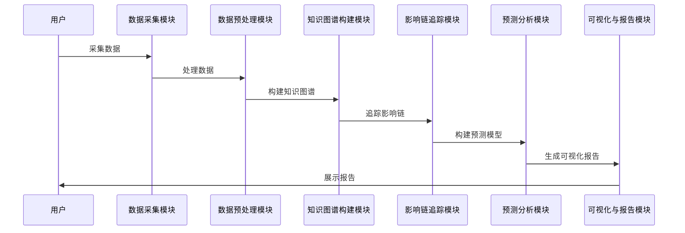
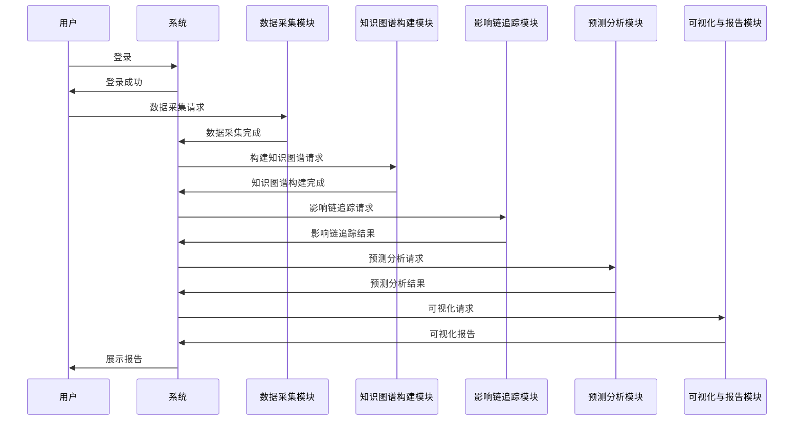

                 

### 1.1 问题背景与问题描述

在现代金融体系中，随着金融市场的复杂性和规模不断扩大，金融监管政策的重要性日益凸显。金融监管政策的制定和实施，对金融市场的稳定、风险控制和金融创新都有着深远的影响。然而，金融监管政策的执行过程中，往往存在政策解读的偏差、政策执行的滞后性、以及政策之间的相互作用等问题，这些因素使得政策效果难以达到预期。

**问题背景与需求：**

金融监管政策影响链追踪与预测的需求，主要源于以下几个方面：

1. **政策透明度需求：** 金融市场中各利益相关者，包括金融机构、投资者、监管部门等，都需要及时了解政策的变化及其对市场的影响，以提高决策的准确性和效率。
2. **风险控制需求：** 金融监管政策的变动往往伴随着市场风险的变动，及时追踪和预测政策影响，有助于金融机构和监管机构采取有效的风险管理措施。
3. **政策执行监督需求：** 随着监管政策的日益复杂，如何确保政策得到有效执行，成为监管机构面临的一大挑战。影响链追踪与预测系统可以帮助监管机构监控政策执行的各个环节。
4. **政策效果评估需求：** 监管政策的效果评估需要大量数据的支持，影响链追踪与预测系统可以提供政策实施过程中的关键数据，为政策评估提供科学依据。

**问题描述：**

- **追踪需求：** 监管政策实施过程中，需要能够追踪政策对金融市场各个环节的影响路径，包括政策传递、执行、反馈等环节。
- **预测需求：** 在政策实施前，需要预测政策可能带来的影响，以便提前制定应对措施；在政策实施后，需要预测政策效果，评估政策影响。
- **数据整合需求：** 政策影响链追踪与预测需要整合大量的金融数据、政策文件、市场数据等，形成一个统一的数据视图。
- **实时性需求：** 政策影响链追踪与预测系统需要具备实时性，能够及时响应政策变动，为决策提供支持。

### 1.2 知识图谱在金融领域的应用

知识图谱作为一种结构化知识存储与查询技术，近年来在金融领域得到了广泛应用。其优势在于能够将复杂多变的金融数据组织成一个统一、结构化的知识体系，便于数据的查询、分析和应用。

**知识图谱在金融监管政策影响链追踪与预测中的作用：**

1. **数据整合与关联：** 知识图谱可以将政策、金融机构、市场数据等多源异构数据进行整合，建立它们之间的关联关系，形成一个统一的视图。
2. **信息检索与查询：** 通过知识图谱，可以快速检索和查询与政策相关的信息，了解政策实施的具体环节和影响路径。
3. **影响链追踪：** 知识图谱可以帮助追踪政策影响链的各个环节，识别政策对金融市场的影响路径和程度。
4. **预测分析：** 基于知识图谱中的关系和数据，可以构建预测模型，对政策的影响进行预测和分析。
5. **智能决策支持：** 知识图谱可以为金融监管机构和金融机构提供智能决策支持，帮助其制定和调整政策，优化风险管理。

**知识图谱的优势：**

- **高度结构化：** 知识图谱通过实体、属性、关系等方式，将数据组织成结构化的形式，便于查询和分析。
- **灵活性与扩展性：** 知识图谱可以根据需求灵活调整实体和关系，适应不同的应用场景。
- **智能分析能力：** 知识图谱支持复杂的图算法和机器学习技术，可以提供强大的数据分析与预测能力。
- **易于集成与共享：** 知识图谱可以与其他系统进行集成，实现数据共享和协同工作。

### 1.3 构建监管政策影响链追踪与预测系统的意义

**政策影响链追踪的意义：**

1. **政策透明化：** 通过影响链追踪系统，可以实时了解政策实施的具体环节和影响路径，提高政策的透明度和可追溯性。
2. **风险预警：** 影响链追踪可以帮助识别政策变动可能带来的风险，为监管机构和金融机构提供风险预警，提前采取应对措施。
3. **监管优化：** 通过分析政策实施的效果，可以不断优化和调整监管政策，提高监管的有效性。
4. **决策支持：** 影响链追踪系统可以为监管决策提供数据支持和分析结果，帮助制定更加科学和合理的政策。

**预测系统的意义：**

1. **预测政策影响：** 预测系统可以提前预测政策可能带来的影响，为政策制定提供科学依据，避免政策实施后的不确定性。
2. **优化资源配置：** 预测系统可以帮助金融机构和监管机构提前了解政策变动，优化资源配置，降低政策变动带来的风险。
3. **提高市场效率：** 预测系统的应用可以提高金融市场运行效率，减少政策变动带来的市场波动。
4. **辅助政策调整：** 预测系统可以提供政策效果评估，为政策调整提供依据，提高政策的科学性和实效性。

### 1.4 概念属性特征对比表格

| 概念            | 特征                  |
|----------------|----------------------|
| 知识图谱       | 结构化知识存储与查询 |
| 金融监管政策   | 规则性政策文件       |
| 影响链追踪与预测 | 数据分析与预测       |

### 1.5 概念属性特征联系图

```mermaid
graph ER图
实体[矩形] -- 关系[菱形] -- 实体[矩形]
实体[矩形] -- [属性[椭圆]]
实体[矩形] -- [属性[椭圆]]
```

### 1.6 本章小结

本节介绍了构建基于知识图谱的金融监管政策影响链追踪与预测系统的背景、核心概念和意义。首先，阐述了金融监管政策影响链追踪与预测的需求和问题描述，强调了知识图谱在这一系统中的关键作用。然后，通过对比表格和联系图，对知识图谱、金融监管政策和影响链追踪与预测系统的概念属性特征进行了详细分析。最后，总结了构建这一系统的重要意义，为后续章节的内容奠定了基础。

### 1.7 拓展阅读

- **《知识图谱：技术原理与应用实践》**，介绍了知识图谱的基本概念、构建方法和应用场景，对知识图谱技术有全面的解读。
- **《金融监管政策分析：理论与方法》**，详细探讨了金融监管政策的影响机制和分析方法，为理解监管政策提供了理论支持。
- **《人工智能在金融领域的应用》**，介绍了人工智能技术在金融市场中的应用，包括数据挖掘、预测模型等，有助于了解技术实现。

---

# 第一部分：背景介绍与核心概念

## 1.1 问题背景与问题描述

在金融市场中，金融监管政策的制定与实施对于维护市场稳定、防范风险、促进金融创新具有重要意义。然而，金融监管政策的复杂性和多样性导致其在执行过程中可能出现一系列问题，如政策解读的偏差、政策执行的滞后性、政策间的相互影响等。这些问题使得政策的效果难以达到预期，同时也增加了金融市场的不确定性。因此，对金融监管政策的影响链进行追踪与预测，对于提高政策实施效率、优化监管决策具有重要意义。

### 1.1.1 金融监管政策的影响链追踪与预测需求

1. **政策透明度需求：** 在金融市场中，各利益相关者，包括金融机构、投资者、监管机构等，都需要及时了解政策的变化及其对市场的影响。政策透明度的提高有助于市场参与者做出更加准确的决策，降低信息不对称带来的风险。

2. **风险控制需求：** 金融监管政策的变动往往伴随着市场风险的变动。及时追踪和预测政策影响，有助于金融机构和监管机构采取有效的风险管理措施，降低政策变动可能带来的市场波动和风险。

3. **政策执行监督需求：** 随着监管政策的日益复杂，如何确保政策得到有效执行，成为监管机构面临的一大挑战。影响链追踪与预测系统可以帮助监管机构监控政策执行的各个环节，发现和纠正执行中的问题。

4. **政策效果评估需求：** 监管政策的效果评估需要大量的数据支持。影响链追踪与预测系统可以提供政策实施过程中的关键数据，为政策评估提供科学依据，帮助监管机构不断优化和调整政策。

### 1.1.2 知识图谱在金融领域的应用

知识图谱作为一种新兴的数据管理技术，通过将实体、属性、关系等知识进行结构化组织，形成了语义化的知识网络。在金融领域，知识图谱的应用越来越广泛，主要包括以下几个方面：

1. **金融产品与服务的理解：** 知识图谱可以整合金融产品的各种信息，如产品特性、风险等级、市场定位等，帮助金融机构更好地理解和管理金融产品。

2. **客户关系管理：** 通过知识图谱，金融机构可以更好地了解客户的需求和行为，提供个性化的金融服务，提升客户满意度。

3. **风险管理与防范：** 知识图谱可以整合和分析大量的金融数据，识别潜在的风险点，提供风险预警和防范策略。

4. **智能投资决策：** 基于知识图谱，投资者可以更加全面和准确地了解投资标的的信息，制定科学的投资策略。

5. **金融监管：** 知识图谱可以帮助监管机构更好地理解金融市场的结构和运行机制，提高监管效率和监管能力。

### 1.1.3 构建监管政策影响链追踪与预测系统的意义

构建监管政策影响链追踪与预测系统具有以下重要意义：

1. **提高政策透明度：** 通过系统实时追踪政策影响链，可以增强政策的透明度，使市场参与者更加了解政策的具体影响，提高决策的准确性。

2. **优化风险管理：** 系统可以及时预测政策变动可能带来的风险，帮助金融机构和监管机构采取有效的风险管理措施，降低政策变动带来的市场波动和风险。

3. **提升监管效率：** 系统可以自动化处理大量的金融数据和政策信息，提高监管机构的监管效率和决策能力。

4. **促进金融创新：** 通过系统对政策影响的预测和分析，可以为金融创新提供科学依据，推动金融市场的健康发展。

5. **增强政策评估的科学性：** 系统可以提供政策实施过程中的关键数据，为政策评估提供客观、科学的依据，帮助监管机构不断优化和调整政策。

### 1.4 概念属性特征对比表格

| 概念            | 特征                  |
|----------------|----------------------|
| 知识图谱       | 结构化知识存储与查询 |
| 金融监管政策   | 规则性政策文件       |
| 影响链追踪与预测 | 数据分析与预测       |

### 1.5 概念属性特征联系图

```mermaid
graph ER图
实体[矩形] -- 关系[菱形] -- 实体[矩形]
实体[矩形] -- [属性[椭圆]]
实体[矩形] -- [属性[椭圆]]
```

### 1.6 本章小结

本部分介绍了构建基于知识图谱的金融监管政策影响链追踪与预测系统的背景和核心概念。首先，阐述了金融监管政策影响链追踪与预测的需求，以及知识图谱在金融领域的应用。然后，分析了构建这一系统的意义，通过对比表格和联系图，明确了知识图谱、金融监管政策和影响链追踪与预测系统的概念属性特征。为后续章节的详细讨论奠定了基础。

### 1.7 拓展阅读

- **《知识图谱：技术原理与应用实践》**，介绍了知识图谱的基本概念、构建方法和应用场景，对知识图谱技术有全面的解读。
- **《金融监管政策分析：理论与方法》**，详细探讨了金融监管政策的影响机制和分析方法，为理解监管政策提供了理论支持。
- **《人工智能在金融领域的应用》**，介绍了人工智能技术在金融市场中的应用，包括数据挖掘、预测模型等，有助于了解技术实现。

---

## 2.1 知识图谱构建原理

知识图谱作为一种用于存储和查询结构化知识的图形数据库，通过将实体、属性和关系进行结构化组织，形成一个语义化的知识网络。在构建金融监管政策影响链追踪与预测系统时，知识图谱扮演了核心的角色，它能够帮助我们整合多种类型的数据，并揭示数据之间的复杂关联。以下是知识图谱构建的基本原理和步骤。

### 2.1.1 数据源收集与处理

1. **数据源类型：** 知识图谱构建的第一步是收集数据源。在金融监管政策影响链追踪与预测系统中，主要的数据源包括：
   - 金融监管政策文件：包括各类政策法规、指导文件等。
   - 金融市场数据：如交易数据、利率数据、市场指数等。
   - 金融机构数据：包括银行、保险公司、证券公司等金融企业的信息。
   - 公开数据集：如宏观经济数据、行业数据等。

2. **数据清洗与处理：** 收集到的原始数据通常存在噪声、缺失值、不一致等问题，需要进行数据清洗与处理。主要包括以下步骤：
   - 数据预处理：对数据进行标准化、清洗、去重等操作，确保数据的准确性和一致性。
   - 数据集成：将不同来源的数据进行整合，形成一个统一的数据视图。

### 2.1.2 实体识别与抽取

1. **实体识别：** 实体是知识图谱中的核心概念，如金融机构、政策法规等。实体识别的目的是从原始数据中识别出这些实体。
   - 基于规则的方法：通过预设的规则，识别出数据中的特定实体。
   - 基于机器学习的方法：使用监督学习或无监督学习算法，自动识别数据中的实体。

2. **实体抽取：** 一旦实体被识别出来，需要将其从原始文本中抽取出来，并赋予唯一的标识符。实体抽取的方法包括：
   - 命名实体识别（NER）：通过自然语言处理技术，识别文本中的命名实体。
   - 关键词抽取：从文本中抽取关键词，作为实体的代表。

### 2.1.3 关系抽取与关系表示

1. **关系抽取：** 关系是知识图谱中的另一个核心概念，表示实体之间的关联。关系抽取的目标是从原始数据中识别出实体之间的关系。
   - 基于规则的方法：通过预设的规则，识别出数据中的特定关系。
   - 基于机器学习的方法：使用监督学习或迁移学习算法，自动识别数据中的关系。

2. **关系表示：** 关系抽取后，需要对其进行表示。关系表示的方法包括：
   - 对称关系与非对称关系：根据关系的性质，判断其为对称还是非对称。
   - 具体与抽象关系：关系可以是具体的，如“属于”，也可以是抽象的，如“相似性”。
   - 关系强度表示：使用数值或标签来表示关系的强度或类型。

### 2.1.4 知识融合与去重

1. **知识融合：** 知识融合的目的是将来自不同数据源的信息进行整合，形成完整的知识图谱。知识融合的方法包括：
   - 实体融合：识别出同一实体的不同标识，并将其合并。
   - 关系融合：整合具有相同关系的不同数据源信息。

2. **去重：** 去重的目的是去除知识图谱中的重复信息，提高数据的准确性和效率。去重的方法包括：
   - 实体去重：通过比较实体的属性和关系，判断实体是否重复。
   - 关系去重：通过比较关系的三元组，去除重复的关系。

### 2.1.5 知识图谱构建工具

1. **Apache Jena：** Apache Jena是一个开源的JVM（Java虚拟机）上的RDF（资源描述框架）工具包，支持RDF数据的存储、查询和推理。

2. **Neo4j：** Neo4j是一个高性能的图形数据库，适用于存储和查询大规模图数据。

3. **Alchemy：** Alchemy是IBM开发的一个自然语言处理API，可以用于提取知识图谱中的实体和关系。

### 2.1.6 知识图谱构建实践

1. **数据预处理：** 收集金融监管政策文件、金融市场数据等，进行数据清洗和预处理，确保数据的一致性和准确性。

2. **实体抽取：** 使用命名实体识别技术，从文本中抽取金融机构、政策法规等实体。

3. **关系抽取：** 从文本中识别出实体之间的关系，如金融机构与政策法规之间的关联。

4. **知识融合：** 对不同数据源的信息进行整合，形成一个完整的知识图谱。

5. **去重与优化：** 去除知识图谱中的重复信息，优化数据结构和查询效率。

### 2.1.7 知识图谱的应用

1. **影响链追踪：** 利用知识图谱，可以追踪金融监管政策的影响链，识别政策对市场各个环节的影响。

2. **预测分析：** 基于知识图谱，可以构建预测模型，对政策的影响进行预测和分析。

3. **智能决策支持：** 为监管机构和金融机构提供智能决策支持，帮助其制定和调整政策，优化风险管理。

### 2.1.8 本章小结

知识图谱构建是金融监管政策影响链追踪与预测系统的核心环节，通过数据源收集与处理、实体识别与抽取、关系抽取与关系表示、知识融合与去重等步骤，可以构建出一个结构化、语义化的知识网络。本章详细介绍了知识图谱构建的原理和方法，为后续章节的详细讨论奠定了基础。

### 2.2 知识图谱构建工具

在知识图谱构建过程中，选择合适的工具至关重要。当前市面上有许多强大的知识图谱构建工具，如Apache Jena、Neo4j和Alchemy，每种工具都有其独特的优势和应用场景。以下是这些工具的基本介绍及其在知识图谱构建中的应用。

### 2.2.1 Apache Jena

**Apache Jena** 是一个开源的JVM（Java虚拟机）上的RDF（资源描述框架）工具包，它提供了丰富的API来处理RDF数据。Apache Jena的主要组件包括：

- **Jena ARQ：** 提供了SPARQL查询语言的支持，可以用于查询RDF数据。
- **Jena TDB：** 提供了一个高性能的嵌入式RDF存储库，适用于存储和查询大规模的图数据。
- **Jena Rules：** 提供了基于规则的推理能力，可以用于数据清洗和推理。

**应用场景：**

- **大规模数据存储与查询：** Apache Jena适用于处理大规模的RDF数据，其高效的存储和查询性能使其成为构建大规模知识图谱的理想选择。
- **数据清洗与推理：** 通过Jena Rules，可以实现对RDF数据的清洗和推理，提高数据质量和语义一致性。

### 2.2.2 Neo4j

**Neo4j** 是一个高性能的图形数据库，特别适用于存储和查询大规模的图数据。Neo4j的核心特点是它的图存储引擎，支持高效的图遍历和复杂的图查询。

- **Cypher查询语言：** Neo4j使用Cypher查询语言，它是一种声明式的图查询语言，易于学习和使用。
- **分布式架构：** Neo4j支持分布式架构，可以扩展到多个节点，适用于处理大规模数据。

**应用场景：**

- **实时查询：** Neo4j的高性能图查询能力使其适用于实时查询场景，如金融市场的实时监控。
- **复杂关系分析：** Neo4j的图存储引擎可以高效地处理复杂的实体关系，适用于需要分析复杂关系的应用。

### 2.2.3 Alchemy

**Alchemy** 是IBM开发的一个自然语言处理（NLP）API，提供了丰富的功能来提取知识图谱中的实体和关系。

- **实体抽取：** Alchemy可以自动识别文本中的命名实体，如人名、地点、机构等。
- **关系抽取：** Alchemy可以识别实体之间的关系，如“属于”、“位于”等。

**应用场景：**

- **文本数据预处理：** Alchemy适用于文本数据预处理，如从文本中抽取实体和关系，为知识图谱构建提供数据基础。
- **知识图谱补全：** Alchemy可以用于知识图谱的补全，通过文本数据补充知识图谱中的缺失信息。

### 2.2.4 工具比较

| 工具         | 优点                                           | 缺点                                           | 适用场景             |
|--------------|------------------------------------------------|------------------------------------------------|----------------------|
| Apache Jena | 开源、支持多种RDF操作、良好的社区支持           | 不适合处理大规模数据、查询性能相对较低           | 大规模数据存储与查询 |
| Neo4j       | 高性能图存储、分布式架构、强大的图查询能力     | 开源版本功能有限、成本较高                       | 实时查询与复杂关系分析 |
| Alchemy     | 易于使用的NLP API、丰富的实体与关系抽取功能     | 实时性能较低、处理大规模数据能力有限             | 文本数据预处理与知识图谱补全 |

### 2.2.5 知识图谱构建实践

1. **数据预处理：** 使用Alchemy进行文本数据预处理，提取实体和关系。
2. **实体抽取：** 利用Alchemy的实体抽取功能，识别出文本中的关键实体。
3. **关系抽取：** 使用Alchemy的关系抽取功能，建立实体之间的关联关系。
4. **知识融合：** 使用Neo4j存储和处理知识图谱，实现数据的高效存储与查询。
5. **数据查询与推理：** 使用Apache Jena进行数据查询与推理，提供强大的语义查询能力。

### 2.2.6 本章小结

知识图谱构建工具在金融监管政策影响链追踪与预测系统中扮演了关键角色。Apache Jena、Neo4j和Alchemy各自具有独特的优势，适用于不同的应用场景。通过合理选择和利用这些工具，可以高效地构建和利用知识图谱，为系统的追踪与预测功能提供强有力的支持。本章详细介绍了这些工具的基本原理和应用，为后续章节的实践部分奠定了基础。

### 2.3 知识图谱构建实践

在了解知识图谱构建原理和工具之后，我们需要将理论应用到实践中，通过具体的步骤和示例来构建一个完整的知识图谱。以下是一个基于金融监管政策影响链追踪与预测系统的知识图谱构建实践过程。

### 2.3.1 数据预处理

数据预处理是知识图谱构建的基础，主要包括以下步骤：

1. **数据收集**：收集金融监管政策文件、金融市场数据、金融机构信息等，确保数据的全面性和准确性。
2. **数据清洗**：处理数据中的噪声、缺失值、重复数据等，提高数据质量。例如，使用Python的Pandas库清洗数据，去除无关信息。
3. **数据标准化**：将不同来源的数据进行标准化处理，如统一日期格式、货币单位等。这有助于数据的一致性和整合。

### 2.3.2 实体抽取

实体抽取是知识图谱构建的核心步骤，目标是识别文本中的关键实体。以下是具体操作：

1. **使用Alchemy进行命名实体识别（NER）**：利用Alchemy的实体抽取功能，从文本中提取出金融机构、政策法规、市场指标等实体。
   ```python
   from alchemyapi import AlchemyAPI
   
   api = AlchemyAPI()
   text = "中国银保监会发布了一项关于互联网金融的监管政策。"
   result = api.entityText('text', text)
   print(result)
   ```

2. **存储实体**：将抽取出的实体存储到知识图谱中，为后续关系抽取和知识融合做准备。

### 2.3.3 关系抽取

关系抽取的目标是从文本中识别出实体之间的关联关系。以下是具体操作：

1. **使用Alchemy进行关系抽取**：利用Alchemy的关系抽取功能，从文本中提取出实体之间的关联关系，如“发布”、“影响”等。
   ```python
   result = api.relationships('text', text)
   print(result)
   ```

2. **构建关系三元组**：将抽取出的实体和关系构建成关系三元组（Subject-Predicate-Object），例如（中国银保监会，发布，互联网金融监管政策）。

### 2.3.4 知识融合

知识融合是将不同来源的数据进行整合，形成完整的知识图谱。以下是具体操作：

1. **数据整合**：将实体和关系整合到一个统一的知识图谱中，确保数据的一致性和完整性。

2. **去重与优化**：去除重复的实体和关系，优化数据结构和查询效率。例如，使用Neo4j进行数据去重和优化。

### 2.3.5 知识图谱可视化

为了更好地理解和展示知识图谱，可以使用可视化工具，如Gephi、Neo4j Bloom等，将知识图谱可视化。

1. **使用Neo4j Bloom进行可视化**：在Neo4j中安装Neo4j Bloom插件，将知识图谱可视化。
   ```shell
   neo4j bloom
   ```

2. **交互式查询**：通过可视化工具，可以交互式地查询知识图谱，探索实体之间的关系。

### 2.3.6 实例：金融监管政策影响链追踪

假设我们有一个政策实体“互联网金融监管政策”和多个金融机构实体，如“阿里巴巴”、“腾讯”、“京东金融”等。我们希望追踪这项政策对这些金融机构的影响。

1. **关系抽取**：从文本中识别出“互联网金融监管政策”与金融机构之间的关联关系，如“影响”、“符合要求”等。
2. **构建影响链**：基于关系抽取的结果，构建影响链，如图所示：
   ```mermaid
   graph LR
   A[互联网金融监管政策] -- B[影响] --> C{阿里巴巴}
   A -- B --> D{腾讯}
   A -- B --> E{京东金融}
   ```

3. **数据查询**：使用Neo4j查询影响链，例如：
   ```sql
   MATCH (p:Policy {name: "互联网金融监管政策"}), (p)-[:AFFECTS]->(f:FinancialInstitution)
   RETURN p, f
   ```

### 2.3.7 本章小结

通过具体的实践步骤和示例，我们展示了如何构建基于知识图谱的金融监管政策影响链追踪与预测系统。数据预处理、实体抽取、关系抽取、知识融合和知识图谱可视化等步骤，是构建知识图谱的核心环节。通过这些步骤，我们可以将复杂、多源的数据整合成一个结构化的知识网络，为后续的追踪与预测提供基础。

---

## 3.1 影响链追踪原理

在金融监管政策影响链追踪与预测系统中，影响链追踪是核心功能之一，其目的是通过分析政策文件、市场数据和其他相关数据，追踪政策对金融市场各个环节的影响路径和程度。以下是影响链追踪的基本原理和流程。

### 3.1.1 影响链追踪的流程与步骤

影响链追踪的流程主要包括以下步骤：

1. **数据采集**：从各种数据源收集与政策相关的数据，包括政策文件、市场数据、金融机构数据等。
2. **数据预处理**：对采集到的数据进行清洗、去噪、标准化等预处理操作，确保数据的一致性和准确性。
3. **实体识别**：使用命名实体识别（NER）技术，从预处理后的数据中识别出关键的实体，如金融机构、政策法规、市场指标等。
4. **关系抽取**：通过文本挖掘技术，从文本数据中抽取实体之间的关系，如政策与金融机构之间的“影响”、“符合”等关系。
5. **影响链构建**：将抽取出的实体和关系进行组合，构建影响链。影响链可以表示为实体之间的序列，每个实体都是影响链上的一个节点。
6. **影响评估**：对影响链中的每个节点进行评估，分析其对金融市场的影响程度和方向。

### 3.1.2 数据分析与挖掘技术

在影响链追踪过程中，数据分析与挖掘技术起着关键作用，主要包括以下几种技术：

1. **文本分类**：用于对政策文件进行分类，识别出不同类型的政策。
2. **情感分析**：用于分析政策文本的情感倾向，判断政策是积极的、中性的还是消极的。
3. **实体关系抽取**：通过命名实体识别和关系抽取技术，从文本中提取出实体及其关系。
4. **图挖掘**：利用图论算法，分析实体之间的关系网络，构建影响链。
5. **时间序列分析**：对市场数据进行时间序列分析，识别出政策实施前后市场指标的变化趋势。

### 3.1.3 影响链的表示与存储

影响链的表示与存储是影响链追踪系统的基础，以下是几种常见的表示与存储方法：

1. **图数据库**：使用图数据库（如Neo4j）来存储影响链。每个实体作为一个节点，实体之间的关系作为边。这种表示方法直观、高效，适合处理复杂的实体关系。
2. **关系型数据库**：使用关系型数据库（如MySQL）来存储影响链。每个实体和关系可以存储在独立的表中，通过外键建立关系。这种表示方法结构简单，查询效率较高。
3. **多维数据集**：使用多维数据集（如Pandas DataFrame）来表示和存储影响链。每个维度代表一个实体或关系属性，通过行列操作进行数据分析和处理。

### 3.1.4 影响链追踪系统的设计与实现

影响链追踪系统的设计与实现需要综合考虑系统的需求、功能和技术实现。以下是系统设计与实现的基本步骤：

1. **需求分析**：明确影响链追踪系统的功能需求，包括数据采集、预处理、实体识别、关系抽取、影响评估等。
2. **系统架构设计**：设计系统的整体架构，包括数据层、业务逻辑层和展示层。数据层负责数据存储和处理，业务逻辑层负责影响链的构建和分析，展示层负责系统的用户界面。
3. **数据采集与预处理**：实现数据采集模块，从各种数据源获取政策文件、市场数据等，并进行数据清洗和预处理。
4. **实体识别与关系抽取**：使用命名实体识别和关系抽取技术，从文本数据中提取出实体和关系。
5. **影响链构建**：基于实体和关系，构建影响链，并存储到图数据库或关系型数据库中。
6. **影响评估**：对影响链中的每个节点进行评估，分析其对金融市场的影响程度和方向。
7. **系统优化**：对系统进行性能优化，提高数据处理和分析的效率。

### 3.1.5 本章小结

影响链追踪是金融监管政策影响链追踪与预测系统的核心功能，通过数据分析与挖掘技术，可以构建出政策对金融市场的影响路径和程度。本章介绍了影响链追踪的流程与步骤、数据分析与挖掘技术、影响链的表示与存储以及系统设计与实现的基本原理。这些内容为后续章节的详细讨论和系统实现提供了基础。

---

## 3.2 影响链追踪算法

在金融监管政策影响链追踪与预测系统中，选择合适的算法至关重要。追踪算法可以分为基于图论的追踪算法和基于深度学习的追踪算法。以下分别介绍这两种算法的基本原理、特点和适用场景。

### 3.2.1 基于图论的追踪算法

**基本原理：**

基于图论的追踪算法主要利用图结构进行数据分析和关系挖掘。在金融监管政策影响链追踪中，可以将政策文件、金融机构、市场数据等作为图的节点，将它们之间的关系作为图的边。算法通过遍历图结构，分析节点和边的关系，从而追踪政策对市场的影响。

**算法特点：**

1. **高效性：** 基于图论的算法可以高效地处理大规模、复杂的关系数据，适用于金融监管政策影响链的追踪。
2. **灵活性：** 图算法可以灵活地调整参数和策略，以适应不同的追踪需求。
3. **鲁棒性：** 基于图论的算法对数据的噪声和缺失值具有较强的鲁棒性，能够处理数据中的不确定性。

**常见算法：**

1. **路径分析算法：** 如Dijkstra算法、A*算法，用于寻找最短路径，分析政策影响的最短路径。
2. **连通性分析算法：** 如BFS（广度优先搜索）和DFS（深度优先搜索），用于分析节点之间的连通性，追踪政策影响的传播路径。
3. **社区发现算法：** 如Louvain算法、LPA（标签传播算法），用于识别政策影响链中的社区结构，分析政策在特定社区的影响。

**适用场景：**

- **政策影响路径分析：** 用于分析政策对市场各个环节的具体影响路径。
- **风险评估：** 用于识别政策变动可能带来的风险点，为风险控制提供支持。

### 3.2.2 基于深度学习的追踪算法

**基本原理：**

基于深度学习的追踪算法主要利用神经网络模型进行特征提取和关系预测。在金融监管政策影响链追踪中，可以通过训练深度学习模型，从数据中自动提取出特征，并预测实体之间的关系。

**算法特点：**

1. **自动化特征提取：** 深度学习模型能够自动从数据中提取出有效的特征，降低人工特征工程的工作量。
2. **非线性建模能力：** 深度学习模型具有强大的非线性建模能力，能够捕捉数据中的复杂关系。
3. **自适应性强：** 深度学习模型可以根据新的数据不断调整和优化，适应不同场景的需求。

**常见算法：**

1. **循环神经网络（RNN）：** 如LSTM（长短时记忆网络）和GRU（门控循环单元），用于处理序列数据，分析政策影响的时序变化。
2. **卷积神经网络（CNN）：** 用于处理图像等结构化数据，但在文本数据上也可通过词嵌入的方式应用。
3. **图神经网络（GNN）：** 如GCN（图卷积网络）和GAT（图注意力网络），专门用于图数据的处理和分析，能够高效地捕捉实体之间的复杂关系。

**适用场景：**

- **关系预测：** 用于预测政策实施前后实体之间的关系变化，如政策对金融机构的影响。
- **时序预测：** 用于分析政策实施后的市场指标变化，预测政策影响的时序趋势。

### 3.2.3 混合算法

为了发挥不同算法的优势，可以结合基于图论的追踪算法和基于深度学习的追踪算法，构建混合追踪算法。混合算法的基本思路是将图算法和深度学习模型相结合，通过图算法进行初步的关系挖掘和路径分析，再利用深度学习模型进行细粒度的关系预测和时序分析。

**优点：**

1. **综合优势：** 混合算法能够综合图算法和深度学习模型的优势，提高追踪的准确性和效率。
2. **适应性：** 混合算法可以根据不同的应用场景灵活调整算法参数，适应多样化的追踪需求。

**适用场景：**

- **多维度分析：** 用于分析政策影响的多个维度，如路径、关系和时序。
- **复杂场景处理：** 用于处理金融监管政策影响链中的复杂关系和不确定性。

### 3.2.4 算法选择与优化

在实际应用中，选择合适的追踪算法需要根据具体场景和数据特点进行综合评估。以下是算法选择与优化的一些考虑因素：

1. **数据量与复杂性：** 如果数据量较大且关系复杂，基于图论的算法可能更加适用；如果数据量较小但特征复杂，深度学习模型可能效果更好。
2. **实时性与效率：** 如果对追踪系统的实时性有较高要求，应选择计算效率高的算法；如果对精度有较高要求，可以适当牺牲计算时间。
3. **可解释性：** 基于深度学习的算法在模型解释性方面可能较弱，如果需要高可解释性，可以选择基于图论的算法。
4. **算法优化：** 通过调整算法参数、优化模型结构等方法，可以提高追踪算法的效率和准确性。

### 3.2.5 本章小结

影响链追踪算法在金融监管政策影响链追踪与预测系统中发挥着关键作用。基于图论的追踪算法和基于深度学习的追踪算法各有优势，可以结合混合算法实现多维度、高效的影响链追踪。本章详细介绍了这些算法的基本原理、特点和应用场景，为后续章节的算法实现和优化提供了基础。

---

## 3.3 影响链追踪算法实践

在了解了影响链追踪算法的基本原理后，接下来我们将通过具体案例来展示如何实现这些算法，并分析其实际应用效果。

### 3.3.1 数据采集与预处理

首先，我们需要从金融监管政策文件、市场数据和金融机构数据中收集数据。以下是一个简单的数据采集与预处理流程：

1. **数据源**：包括中国银保监会、中国人民银行等发布的监管政策文件，以及金融市场数据（如股市、债券市场数据）和金融机构信息（如银行、保险公司、证券公司等）。

2. **数据清洗**：使用Python的Pandas库对原始数据进行清洗，包括去除重复数据、填补缺失值、标准化数据格式等。

3. **数据预处理**：将政策文件进行文本预处理，包括去除标点符号、停用词过滤、词干提取等，为后续的实体识别和关系抽取做准备。

### 3.3.2 实体识别与关系抽取

1. **实体识别**：使用命名实体识别（NER）技术，从预处理后的文本数据中识别出关键的实体，如金融机构名称、政策名称等。这里我们可以使用Apache OpenNLP、Stanford NER等开源工具。

2. **关系抽取**：从文本中提取出实体之间的关系。例如，使用规则匹配方法或基于机器学习的实体关系抽取模型，如Bert+CRF。以下是使用BERT和CRF进行关系抽取的一个简单示例：

```python
from transformers import BertTokenizer, BertForTokenClassification
from crf import CRF

# 加载预训练的BERT模型和CRF模型
tokenizer = BertTokenizer.from_pretrained('bert-base-chinese')
model = BertForTokenClassification.from_pretrained('bert-base-chinese')

# 预处理文本数据
text = "中国人民银行决定将存款准备金率下调0.5个百分点。"
input_ids = tokenizer.encode(text, add_special_tokens=True)

# 进行实体识别和关系抽取
outputs = model(input_ids)
predictions = outputs.logits.argmax(-1)

# 解析实体和关系
entities = [''] * len(predictions)
for i, pred in enumerate(predictions):
    entities[i] = model.config.id2label[pred]

# 使用CRF模型进行关系抽取
crf = CRF()
relations = crf.viterbi_decode(entities)

# 输出结果
print(entities)
print(relations)
```

### 3.3.3 影响链构建

基于实体识别和关系抽取的结果，构建影响链。这里我们可以使用图数据库（如Neo4j）来存储影响链。以下是使用Neo4j构建影响链的一个简单示例：

1. **创建节点和关系**：根据识别出的实体和关系，创建节点和边。例如，创建一个名为“Policy”的节点表示政策，创建一个名为“Institution”的节点表示金融机构，并创建“IMPAactedBy”关系表示政策对金融机构的影响。

2. **存储数据到Neo4j**：使用Neo4j的Python驱动程序（neo4j-python-driver）将数据存储到Neo4j数据库中。

```python
from neo4j import GraphDatabase

# 连接到Neo4j数据库
driver = GraphDatabase.driver("bolt://localhost:7687", auth=("neo4j", "password"))

# 创建节点和关系
with driver.session() as session:
    session.run("CREATE (p:Policy {name: $name})", name="中国人民银行降准政策")
    session.run("CREATE (i:Institution {name: $name})", name="中国工商银行")
    session.run("CREATE (p)-[:IMPACTED_BY]->(i)",)

# 关闭数据库连接
driver.close()
```

### 3.3.4 影响链追踪算法实现

1. **基于图论的追踪算法**：使用Neo4j提供的图遍历算法，如BFS或DFS，追踪政策影响链。例如，使用BFS算法寻找政策对金融机构的最短影响路径。

```python
def bfs_policy_impact(policy_name, institution_name):
    with driver.session() as session:
        result = session.run("MATCH (p:Policy {name: $policy_name}), (i:Institution {name: $institution_name}) " +
                             "CALL bfs(path, [p], [i]) " +
                             "RETURN p, i, path " +
                             "LIMIT 10",
                             policy_name=policy_name, institution_name=institution_name)
        return result.data()

# 追踪政策对金融机构的影响
impact_chain = bfs_policy_impact("中国人民银行降准政策", "中国工商银行")
print(impact_chain)
```

2. **基于深度学习的追踪算法**：使用预训练的深度学习模型（如BERT）进行关系分类，预测政策实施前后实体之间的关系变化。以下是使用BERT和Transformer进行关系分类的一个简单示例：

```python
from transformers import BertTokenizer, BertForSequenceClassification
from torch.utils.data import DataLoader, TensorDataset

# 加载预训练的BERT模型
tokenizer = BertTokenizer.from_pretrained('bert-base-chinese')
model = BertForSequenceClassification.from_pretrained('bert-base-chinese')

# 预处理数据
policy_before = "中国人民银行决定将存款准备金率下调0.5个百分点。"
policy_after = "中国人民银行已经下调了存款准备金率。"
inputs = tokenizer.encode(policy_before + policy_after, return_tensors='pt')

# 训练模型
model.train()
outputs = model(inputs)
loss = outputs.loss
optimizer = torch.optim.Adam(model.parameters(), lr=0.001)
optimizer.zero_grad()
loss.backward()
optimizer.step()

# 预测关系
model.eval()
with torch.no_grad():
    outputs = model(inputs)
    predictions = outputs.logits.argmax(-1)
    print(predictions)
```

### 3.3.5 结果分析与验证

1. **路径分析**：使用基于图论的算法，分析政策对金融机构的影响路径，如BFS算法寻找最短影响路径。

2. **关系预测**：使用基于深度学习的算法，预测政策实施前后实体之间的关系变化，如关系分类算法预测政策对金融机构的影响。

3. **结果验证**：通过对比实际政策和市场数据，验证追踪算法的准确性和有效性。

### 3.3.6 本章小结

通过实际案例，我们展示了如何实现影响链追踪算法，包括数据采集与预处理、实体识别与关系抽取、影响链构建和追踪算法实现。通过结合基于图论和深度学习的算法，我们能够有效地追踪金融监管政策对市场的影响路径，为政策分析和风险管理提供支持。

---

## 4.1 预测原理

在金融监管政策影响链追踪与预测系统中，预测功能至关重要。预测原理涉及对政策影响进行建模和分析，以预测政策实施后的市场变化和风险。以下是预测的基本概念、模型选择、训练与评估过程。

### 4.1.1 预测的基本概念

1. **预测目标**：预测目标是指我们希望预测的结果，例如政策实施后的市场指标变化、金融机构的风险等级等。

2. **预测变量**：预测变量是指影响预测目标的因素，包括政策变量、市场变量、经济变量等。

3. **预测模型**：预测模型是指用于预测的数学模型或算法，根据预测变量预测预测目标。

4. **预测精度**：预测精度是指预测结果与实际结果的接近程度，通常用误差指标来衡量，如均方误差（MSE）、平均绝对误差（MAE）等。

### 4.1.2 预测模型的选择

选择合适的预测模型是预测成功的关键。以下是几种常见的预测模型：

1. **线性回归模型**：线性回归模型是一种简单的预测模型，适用于预测线性关系。它通过最小二乘法拟合数据，预测目标值为预测变量的线性组合。

2. **决策树模型**：决策树模型通过递归划分特征空间，将数据划分为不同的区域，每个区域对应一个预测值。它适用于非线性关系的预测。

3. **支持向量机（SVM）**：支持向量机是一种基于间隔的预测模型，通过寻找最优间隔将数据分为不同类别。它适用于分类和回归任务。

4. **深度学习模型**：深度学习模型通过多层神经网络自动学习数据特征，适用于复杂关系的预测。常见的深度学习模型包括卷积神经网络（CNN）、循环神经网络（RNN）、长短期记忆网络（LSTM）等。

### 4.1.3 预测模型的训练与评估

1. **训练过程**：预测模型的训练过程包括以下步骤：
   - **数据准备**：收集历史数据，包括政策变量、市场变量等。
   - **特征工程**：对数据进行预处理，提取特征，如归一化、去噪等。
   - **模型训练**：使用训练数据训练模型，调整模型参数，优化预测性能。
   - **验证集评估**：使用验证集评估模型性能，调整模型参数。

2. **评估指标**：预测模型的评估指标包括：
   - **均方误差（MSE）**：衡量预测值与实际值之间的误差平方的平均值。
   - **平均绝对误差（MAE）**：衡量预测值与实际值之间的绝对误差的平均值。
   - **准确率（Accuracy）**：用于分类问题，衡量正确预测的比例。
   - **召回率（Recall）**：衡量预测为正类的实际正类比例。
   - **F1值（F1-score）**：综合考虑准确率和召回率，用于平衡分类性能。

3. **模型优化**：通过交叉验证和超参数调优，优化模型性能。常见的优化方法包括网格搜索、贝叶斯优化等。

### 4.1.4 预测模型的应用

预测模型在金融监管政策影响链追踪与预测系统中的应用包括：
1. **政策预测**：预测政策实施后的市场变化，如股票价格、利率等。
2. **风险预测**：预测政策实施可能带来的风险，如金融机构的风险等级、市场波动性等。
3. **效果评估**：评估政策实施的效果，如政策对市场稳定性的影响。

### 4.1.5 本章小结

预测原理是金融监管政策影响链追踪与预测系统的核心组成部分。本章介绍了预测的基本概念、模型选择、训练与评估过程，并讨论了预测模型的应用。通过合理选择和优化预测模型，可以准确预测政策影响，为政策制定和风险管理提供支持。

---

## 4.2 预测算法

在金融监管政策影响链追踪与预测系统中，选择合适的预测算法对于准确预测政策影响至关重要。以下是几种常用的预测算法，包括线性回归、决策树、支持向量机和深度学习模型。

### 4.2.1 线性回归

线性回归是一种简单的预测算法，适用于预测线性关系。其基本原理是通过最小二乘法拟合数据，找到最优的直线，使得预测值与实际值之间的误差最小。

**算法原理：**

线性回归模型可以表示为：
\[ y = \beta_0 + \beta_1 \cdot x_1 + \beta_2 \cdot x_2 + \ldots + \beta_n \cdot x_n \]
其中，\( y \) 是预测目标，\( x_1, x_2, \ldots, x_n \) 是预测变量，\( \beta_0, \beta_1, \beta_2, \ldots, \beta_n \) 是模型参数。

**数学模型：**

最小二乘法目标函数为：
\[ \min_{\beta} \sum_{i=1}^{n} (y_i - \beta_0 - \beta_1 x_{i1} - \beta_2 x_{i2} - \ldots - \beta_n x_{in})^2 \]

**Python实现示例：**

```python
import numpy as np
from sklearn.linear_model import LinearRegression

# 准备数据
X = np.array([[1, 2], [2, 3], [3, 4], [4, 5]])
y = np.array([3, 4, 5, 6])

# 模型训练
model = LinearRegression()
model.fit(X, y)

# 预测
predictions = model.predict(X)

# 输出结果
print(predictions)
```

### 4.2.2 决策树

决策树是一种树形结构，通过递归地将特征空间划分为不同的区域，每个区域对应一个预测值。决策树适用于非线性关系的预测。

**算法原理：**

决策树通过以下步骤构建：
1. **选择最佳特征**：根据信息增益、基尼不纯度等指标，选择能够最大化信息增益的特征。
2. **划分区域**：根据选定的特征，将数据集划分为不同的区域。
3. **递归构建子树**：对每个区域递归地执行上述步骤，直到满足停止条件（如最大深度、最小叶子节点数量等）。

**数学模型：**

决策树可以用条件概率表示：
\[ P(Y|X) = P(Y|X_1=x_1, X_2=x_2, \ldots, X_n=x_n) \]

**Python实现示例：**

```python
from sklearn.tree import DecisionTreeRegressor

# 准备数据
X = np.array([[1, 2], [2, 3], [3, 4], [4, 5]])
y = np.array([3, 4, 5, 6])

# 模型训练
model = DecisionTreeRegressor()
model.fit(X, y)

# 预测
predictions = model.predict(X)

# 输出结果
print(predictions)
```

### 4.2.3 支持向量机

支持向量机是一种基于间隔的预测模型，通过寻找最优间隔将数据分为不同类别。支持向量机适用于分类和回归任务。

**算法原理：**

支持向量机的基本原理是寻找一个超平面，使得不同类别的数据点在超平面两侧的间隔最大化。

**数学模型：**

支持向量机可以表示为：
\[ \max_{\beta, \beta_0, \xi} \frac{1}{2} \sum_{i=1}^{n} (\beta \cdot \beta_i) - \sum_{i=1}^{n} \xi_i \]
\[ s.t. \ y_i (\beta \cdot x_i + \beta_0) \geq 1 - \xi_i \]
\[ 0 \leq \xi_i \leq 1 \]

**Python实现示例：**

```python
from sklearn.svm import SVR

# 准备数据
X = np.array([[1, 2], [2, 3], [3, 4], [4, 5]])
y = np.array([3, 4, 5, 6])

# 模型训练
model = SVR()
model.fit(X, y)

# 预测
predictions = model.predict(X)

# 输出结果
print(predictions)
```

### 4.2.4 深度学习模型

深度学习模型通过多层神经网络自动学习数据特征，适用于复杂关系的预测。常见的深度学习模型包括卷积神经网络（CNN）、循环神经网络（RNN）、长短期记忆网络（LSTM）等。

**算法原理：**

深度学习模型通过以下步骤进行预测：
1. **前向传播**：将输入数据通过神经网络传递，生成预测值。
2. **反向传播**：计算预测值与实际值之间的误差，更新模型参数。
3. **优化目标函数**：使用梯度下降等优化算法，最小化目标函数。

**数学模型：**

深度学习模型可以表示为：
\[ y = f(z) = \sigma(W_2 \cdot \sigma(W_1 \cdot x + b_1) + b_2) \]
其中，\( f \) 是激活函数，\( \sigma \) 是求和运算符，\( W \) 是权重矩阵，\( b \) 是偏置项。

**Python实现示例：**

```python
import tensorflow as tf

# 准备数据
X = tf.constant([[1, 2], [2, 3], [3, 4], [4, 5]], dtype=tf.float32)
y = tf.constant([3, 4, 5, 6], dtype=tf.float32)

# 模型定义
model = tf.keras.Sequential([
    tf.keras.layers.Dense(units=1, input_shape=[2], activation='linear')
])

# 模型编译
model.compile(optimizer='sgd', loss='mean_squared_error')

# 模型训练
model.fit(X, y, epochs=10)

# 预测
predictions = model.predict(X)

# 输出结果
print(predictions.numpy())
```

### 4.2.5 本章小结

本章介绍了金融监管政策影响链追踪与预测系统中的几种常用预测算法，包括线性回归、决策树、支持向量机和深度学习模型。每种算法都有其独特的原理和应用场景，通过合理选择和优化这些算法，可以准确预测政策影响，为政策制定和风险管理提供支持。

---

## 4.3 预测实践

在了解了预测算法的基本原理后，我们需要通过具体实践来验证这些算法的可行性，并优化预测模型。以下是预测实践的具体步骤，包括数据准备、模型选择与训练、预测结果分析与优化。

### 4.3.1 数据准备

数据准备是预测模型训练的基础，主要包括以下步骤：

1. **数据收集**：收集与金融监管政策相关的数据，包括历史政策文件、市场数据、金融机构数据等。数据来源可以包括政府网站、金融数据库和公开的数据集。

2. **数据清洗**：对收集到的数据进行处理，包括去除噪声、填补缺失值、标准化数据等。例如，使用Python的Pandas库清洗数据，去除无关信息。

3. **特征工程**：提取特征，包括政策特征、市场特征、经济特征等。例如，可以提取政策发布时间、政策类型、市场指标变化等特征。

4. **数据分割**：将数据分为训练集、验证集和测试集。通常采用80%的数据作为训练集，10%的数据作为验证集，10%的数据作为测试集。

### 4.3.2 模型选择与训练

在选择预测模型时，可以根据数据的特点和应用需求进行选择。以下介绍几种常用的模型及其训练过程：

1. **线性回归模型**：线性回归模型适用于预测线性关系。使用Sklearn库的`LinearRegression`类进行训练。

```python
from sklearn.linear_model import LinearRegression

# 准备数据
X_train, X_val, y_train, y_val = train_test_split(X, y, test_size=0.2, random_state=42)

# 模型训练
model = LinearRegression()
model.fit(X_train, y_train)

# 预测
predictions = model.predict(X_val)
```

2. **决策树模型**：决策树模型适用于非线性关系预测。使用Sklearn库的`DecisionTreeRegressor`类进行训练。

```python
from sklearn.tree import DecisionTreeRegressor

# 准备数据
X_train, X_val, y_train, y_val = train_test_split(X, y, test_size=0.2, random_state=42)

# 模型训练
model = DecisionTreeRegressor()
model.fit(X_train, y_train)

# 预测
predictions = model.predict(X_val)
```

3. **支持向量机模型**：支持向量机模型适用于分类和回归任务。使用Sklearn库的`SVR`类进行训练。

```python
from sklearn.svm import SVR

# 准备数据
X_train, X_val, y_train, y_val = train_test_split(X, y, test_size=0.2, random_state=42)

# 模型训练
model = SVR()
model.fit(X_train, y_train)

# 预测
predictions = model.predict(X_val)
```

4. **深度学习模型**：深度学习模型适用于复杂关系的预测。使用TensorFlow库定义和训练模型。

```python
import tensorflow as tf

# 准备数据
X_train, X_val, y_train, y_val = train_test_split(X, y, test_size=0.2, random_state=42)

# 模型定义
model = tf.keras.Sequential([
    tf.keras.layers.Dense(units=1, input_shape=[2], activation='linear')
])

# 模型编译
model.compile(optimizer='sgd', loss='mean_squared_error')

# 模型训练
model.fit(X_train, y_train, epochs=10)

# 预测
predictions = model.predict(X_val)
```

### 4.3.3 预测结果分析与优化

1. **结果分析**：通过计算预测值与实际值之间的误差，分析预测模型的准确性。使用均方误差（MSE）、平均绝对误差（MAE）等指标进行评估。

```python
from sklearn.metrics import mean_squared_error, mean_absolute_error

# 计算误差
mse = mean_squared_error(y_val, predictions)
mae = mean_absolute_error(y_val, predictions)

# 输出结果
print("MSE:", mse)
print("MAE:", mae)
```

2. **模型优化**：通过调整模型参数和优化算法，提高预测模型的准确性。例如，使用网格搜索（GridSearchCV）或贝叶斯优化（Bayesian Optimization）进行超参数调优。

```python
from sklearn.model_selection import GridSearchCV
from sklearn.tree import DecisionTreeRegressor

# 参数网格
param_grid = {'max_depth': [3, 5, 10], 'min_samples_split': [2, 5, 10]}

# 模型训练
model = DecisionTreeRegressor()
grid_search = GridSearchCV(model, param_grid, cv=5)
grid_search.fit(X_train, y_train)

# 输出最佳参数
print("Best parameters:", grid_search.best_params_)

# 预测
predictions = grid_search.predict(X_val)
```

### 4.3.4 实际案例

以中国银保监会发布的“互联网金融风险专项整治”政策为例，预测政策实施后市场变化。数据包括政策发布时间、政策类型、市场指标（如股市指数、债券收益率）等。

1. **数据收集**：收集政策文件、股市指数和债券收益率数据。

2. **特征工程**：提取特征，包括政策发布日期、政策类型、股市指数、债券收益率等。

3. **模型训练**：选择合适的预测模型，如线性回归、决策树、支持向量机等，进行模型训练。

4. **预测结果**：对政策实施后的市场指标进行预测，评估政策影响。

5. **结果分析**：分析预测结果，验证模型准确性。

### 4.3.5 本章小结

本章通过实际案例展示了如何进行预测实践，包括数据准备、模型选择与训练、预测结果分析与优化。通过合理选择和优化预测模型，可以准确预测金融监管政策的影响，为政策制定和风险管理提供支持。

---

## 5.1 系统需求分析

在构建基于知识图谱的金融监管政策影响链追踪与预测系统时，系统需求分析是确保系统功能完备、性能稳定、用户体验友好的重要环节。以下是系统需求分析的主要内容，包括功能需求、性能需求和安全需求。

### 5.1.1 系统功能需求

1. **数据采集与管理**：系统能够从多种数据源（如政策文件、市场数据、金融机构数据等）自动采集数据，并进行数据清洗、存储和管理。

2. **知识图谱构建**：系统能够根据采集到的数据构建知识图谱，实现实体、属性、关系的结构化组织，提供高效的查询和分析能力。

3. **影响链追踪**：系统能够通过影响链追踪算法，实时追踪金融监管政策对市场各个环节的影响路径和程度，为风险管理提供支持。

4. **预测分析**：系统能够基于历史数据和影响链，构建预测模型，对政策实施后的市场变化进行预测，为政策制定和风险管理提供科学依据。

5. **可视化与报告**：系统能够提供可视化工具，展示影响链追踪结果和预测分析结果，生成报告，便于用户理解和决策。

6. **用户交互**：系统应具备友好的用户界面，支持用户自定义查询和分析，提供实时反馈和操作指导。

### 5.1.2 系统性能需求

1. **数据存储与查询性能**：系统应具备高效的数据存储和查询能力，能够处理大规模、复杂的数据集，保证查询响应时间在可接受范围内。

2. **数据处理速度**：系统应具备快速的数据处理能力，能够实时处理政策文件、市场数据等，满足实时追踪和预测的需求。

3. **扩展性**：系统应具备良好的扩展性，能够支持数据源的增加、模型优化等，适应不断变化的需求。

4. **稳定性**：系统应具备高稳定性，能够在不同环境下正常运行，避免因系统故障导致数据丢失或服务中断。

### 5.1.3 系统安全性需求

1. **数据安全**：系统应具备完善的数据安全措施，确保数据在采集、存储、传输等环节的安全性，防止数据泄露和篡改。

2. **用户权限管理**：系统应支持用户权限管理，根据用户的角色和权限限制访问权限，确保数据的安全性和隐私性。

3. **系统安全审计**：系统应具备安全审计功能，记录系统的操作日志和安全事件，便于监控和追溯。

4. **网络安全**：系统应具备防火墙、入侵检测等网络安全措施，防止网络攻击和数据窃取。

### 5.1.4 系统需求分析与实现

在系统需求分析完成后，我们需要将需求转化为具体的系统设计和技术实现。以下是系统需求分析与实现的主要步骤：

1. **需求分析**：对用户需求进行详细分析，明确系统的功能需求、性能需求和安全需求。

2. **系统架构设计**：根据需求分析结果，设计系统的整体架构，包括数据层、业务逻辑层和展示层，确保系统的高效性和可扩展性。

3. **技术选型**：选择合适的数据库、存储方案、计算框架和中间件等，满足系统性能和安全需求。

4. **模块划分**：将系统功能划分为多个模块，明确每个模块的职责和接口，便于开发、测试和维护。

5. **开发与测试**：根据系统架构和模块划分，进行系统的开发与测试，确保系统的功能完备、性能稳定和安全可靠。

6. **部署与上线**：完成系统开发后，进行系统部署和上线，确保系统正常运行，满足用户需求。

### 5.1.5 本章小结

系统需求分析是构建基于知识图谱的金融监管政策影响链追踪与预测系统的关键步骤，通过明确系统的功能需求、性能需求和安全需求，可以确保系统设计的科学性和可行性。本章详细介绍了系统需求分析的主要内容，为后续的系统架构设计和实现提供了基础。

---

## 5.2 系统架构设计

系统架构设计是构建高效、可靠和可扩展的系统的基础。在金融监管政策影响链追踪与预测系统中，系统架构设计需要综合考虑数据存储与处理、模块划分、接口设计以及交互流程。以下是对系统架构的详细设计。

### 5.2.1 系统架构概述

系统的整体架构可以分为三层：数据层、业务逻辑层和展示层。

1. **数据层**：负责数据的存储、管理和处理，包括知识图谱存储、金融数据存储、日志存储等。
2. **业务逻辑层**：实现系统的核心功能，包括数据采集、知识图谱构建、影响链追踪、预测分析、可视化与报告等。
3. **展示层**：提供用户界面和交互功能，使用户能够方便地操作和使用系统。

### 5.2.2 数据存储与处理架构

数据存储与处理架构的设计需要确保数据的高效存储和快速查询，同时要支持系统的扩展性。

1. **知识图谱存储**：使用Neo4j作为知识图谱存储的数据库，它是一个高性能的图形数据库，适合处理复杂的关系数据。

2. **金融数据存储**：使用关系型数据库（如MySQL）存储金融数据，包括政策文件、市场数据、金融机构数据等。关系型数据库结构简单，查询效率高。

3. **日志存储**：使用Elasticsearch存储系统的日志信息，便于实时监控和故障排查。

4. **数据处理引擎**：使用Apache Spark作为数据处理引擎，处理大规模数据集，实现数据清洗、转换和加载等操作。

### 5.2.3 系统模块划分

根据系统功能需求，可以将系统划分为多个模块，每个模块负责特定的功能。

1. **数据采集模块**：负责从各种数据源（如政策文件、市场数据、金融机构数据等）自动采集数据，并进行初步处理。

2. **知识图谱构建模块**：负责构建知识图谱，将实体、属性和关系进行结构化组织，存储到Neo4j数据库中。

3. **影响链追踪模块**：负责追踪金融监管政策的影响链，使用图算法和深度学习算法分析政策对市场各个环节的影响。

4. **预测分析模块**：负责基于历史数据和影响链，构建预测模型，对政策实施后的市场变化进行预测。

5. **可视化与报告模块**：负责将影响链追踪和预测分析结果通过可视化工具展示给用户，生成报告。

6. **用户交互模块**：负责处理用户的操作请求，提供用户界面和交互功能。

### 5.2.4 系统接口设计

系统接口设计是确保各模块之间能够有效通信和协同工作的关键。

1. **API接口**：设计RESTful API接口，用于数据采集、知识图谱构建、影响链追踪和预测分析等模块之间的数据交换。

2. **数据接口**：定义数据模型和数据格式，包括知识图谱中的实体、属性和关系，以及金融数据等。

3. **服务接口**：设计服务接口，包括数据采集服务、知识图谱构建服务、影响链追踪服务和预测分析服务。

### 5.2.5 系统交互设计

系统交互设计需要明确系统的工作流程和各模块之间的交互方式。

1. **工作流程**：系统的工作流程可以分为以下几个阶段：
   - 数据采集：从各种数据源采集数据。
   - 数据预处理：清洗和转换采集到的数据。
   - 知识图谱构建：构建知识图谱，存储到Neo4j数据库中。
   - 影响链追踪：基于知识图谱，追踪政策的影响链。
   - 预测分析：构建预测模型，对政策影响进行预测。
   - 可视化与报告：将追踪和预测结果可视化，生成报告。

2. **交互序列图**：使用Mermaid绘制系统交互序列图，展示各模块之间的交互过程。



### 5.2.6 本章小结

系统架构设计是构建基于知识图谱的金融监管政策影响链追踪与预测系统的关键环节。本章详细介绍了系统架构的概述、数据存储与处理架构、模块划分、接口设计以及交互设计。通过合理的系统架构设计，可以确保系统的功能完备、性能稳定、易于扩展和维护，为后续的系统实现提供坚实基础。

---

## 5.3 系统接口设计

系统接口设计是构建高效、可靠和可扩展的系统的关键组成部分。在金融监管政策影响链追踪与预测系统中，接口设计不仅需要定义清晰的数据交换格式，还需要考虑接口的协议、实现细节以及测试方法。以下是对系统接口的详细设计。

### 5.3.1 接口定义与协议

1. **接口定义**：

   系统接口可以分为内部接口和外部接口。

   - **内部接口**：用于系统内部模块之间的通信，包括数据采集、知识图谱构建、影响链追踪和预测分析等模块。
   - **外部接口**：用于系统与外部系统或用户的通信，包括RESTful API接口、Websocket接口等。

2. **接口协议**：

   - **RESTful API**：采用HTTP协议，通过GET、POST、PUT、DELETE等HTTP方法实现数据的查询、更新和删除操作。
   - **Websocket**：用于实时通信，支持双向数据传输，适用于需要实时更新数据的应用场景。

3. **数据交换格式**：

   - **JSON**：作为一种轻量级的数据交换格式，易于解析和处理，适用于大多数Web应用。
   - **XML**：虽然XML具有更好的可读性和灵活性，但处理复杂结构的数据时性能较低，通常用于需要严格验证的场景。

### 5.3.2 接口实现与测试

1. **接口实现**：

   - **RESTful API接口**：使用Spring Boot框架实现RESTful API接口，定义HTTP请求和响应的URL路径、请求参数和响应数据结构。

   ```java
   @RestController
   @RequestMapping("/api")
   public class PolicyImpactAPI {
       
       @GetMapping("/impact")
       public List<Map<String, Object>> getPolicyImpacts() {
           // 实现影响链查询功能
       }
       
       @PostMapping("/predict")
       public Map<String, Object> predictPolicyImpact(@RequestBody Map<String, Object> data) {
           // 实现预测分析功能
       }
   }
   ```

   - **Websocket接口**：使用Spring WebSocket实现WebSocket接口，实现实时数据推送和消息通信。

   ```java
   @Controller
   @EnableWebSocketMessageBroker
   public class PolicyImpactWebSocket {
       
       @MessageMapping("/policyImpact")
       @SendTo("/topic/policyImpact")
       public String sendPolicyImpact(String message) {
           // 处理接收到的消息，并发送响应
       }
   }
   ```

2. **接口测试**：

   - **单元测试**：使用JUnit等单元测试框架，编写测试用例验证接口的实现是否符合预期。
   - **集成测试**：使用Postman、JMeter等工具，进行接口的集成测试，验证接口的性能和稳定性。
   - **自动化测试**：编写自动化测试脚本，定期运行测试，确保接口的持续稳定。

### 5.3.3 接口实现示例

以下是一个简单的RESTful API接口实现示例，用于获取政策影响链数据：

```java
@RestController
@RequestMapping("/api")
public class PolicyImpactAPI {

    @Autowired
    private PolicyImpactService policyImpactService;

    @GetMapping("/impact")
    public ResponseEntity<List<Map<String, Object>>> getPolicyImpacts() {
        try {
            List<Map<String, Object>> impacts = policyImpactService.getAllPolicyImpacts();
            return new ResponseEntity<>(impacts, HttpStatus.OK);
        } catch (Exception e) {
            return new ResponseEntity<>(HttpStatus.INTERNAL_SERVER_ERROR);
        }
    }
}
```

### 5.3.4 接口安全

为了保证接口的安全性，可以采取以下措施：

1. **身份验证**：使用JWT（JSON Web Token）进行身份验证，确保只有授权用户可以访问接口。
2. **权限控制**：根据用户的角色和权限，限制对接口的访问，确保接口操作的合法性。
3. **加密传输**：使用HTTPS协议，确保数据在传输过程中的安全性。

### 5.3.5 本章小结

系统接口设计是金融监管政策影响链追踪与预测系统实现的重要环节，通过定义清晰的接口协议、实现细节和测试方法，可以确保接口的高效性、可靠性和安全性。本章详细介绍了系统接口的定义、协议、实现与测试，为系统的后续开发与部署提供了基础。

---

## 5.4 系统交互设计

系统交互设计是确保系统功能完整、用户体验友好、模块间协同工作的关键。在金融监管政策影响链追踪与预测系统中，系统交互设计包括工作流程、交互序列图以及用户操作指南。

### 5.4.1 系统工作流程

系统工作流程可以分为以下几个主要阶段：

1. **用户登录**：用户通过用户名和密码登录系统，系统验证用户的身份和权限。
2. **数据采集**：系统从各种数据源（如政策文件、市场数据、金融机构数据等）自动采集数据，并进行初步处理。
3. **知识图谱构建**：系统将采集到的数据构建知识图谱，存储到Neo4j数据库中。
4. **影响链追踪**：系统基于知识图谱，使用影响链追踪算法分析政策对市场各个环节的影响路径和程度。
5. **预测分析**：系统基于历史数据和影响链，构建预测模型，对政策实施后的市场变化进行预测。
6. **可视化与报告**：系统将影响链追踪和预测分析结果通过可视化工具展示给用户，生成报告。

### 5.4.2 系统交互序列图

以下是一个系统交互序列图的示例，展示用户与系统之间的交互过程：



### 5.4.3 用户操作指南

为了帮助用户更好地使用系统，以下是一个用户操作指南的示例：

1. **登录**：用户通过输入用户名和密码进行登录。登录成功后，系统会展示主界面。
2. **数据采集**：用户可以查看数据采集进度，确保数据已经采集完整。如果需要重新采集，可以点击“重新采集”按钮。
3. **知识图谱构建**：用户可以查看知识图谱构建进度，了解知识图谱的构建情况。如果需要重新构建，可以点击“重新构建”按钮。
4. **影响链追踪**：用户可以查看政策影响链追踪结果，了解政策对市场各个环节的影响路径和程度。用户可以通过筛选条件和查询接口，获取特定政策的影响链。
5. **预测分析**：用户可以查看预测分析结果，了解政策实施后的市场变化趋势。用户可以通过调整预测模型参数，优化预测结果。
6. **可视化与报告**：用户可以查看可视化报告，了解政策影响链和预测分析结果。用户可以通过打印和导出功能，保存报告。

### 5.4.4 本章小结

系统交互设计是构建高效、可靠和友好的金融监管政策影响链追踪与预测系统的重要环节。本章介绍了系统的工作流程、交互序列图和用户操作指南，通过合理的交互设计，确保系统功能完整、用户体验友好、模块间协同工作。

---

## 6.1 项目环境安装

在开始项目开发之前，我们需要搭建一个合适的项目环境，包括硬件环境和软件环境。以下是项目环境安装的具体步骤和注意事项。

### 6.1.1 硬件环境配置

1. **服务器配置**：
   - **CPU**：推荐使用至少四核CPU，以确保系统运行的稳定性和高效性。
   - **内存**：推荐使用至少16GB内存，以便处理大规模数据和运行复杂的算法。
   - **硬盘**：推荐使用SSD硬盘，以提高数据存储和读取的速度。
   - **网络**：确保网络连接稳定，建议使用千兆以太网。

2. **硬件要求**：
   - **操作系统**：推荐使用Linux系统，如Ubuntu 18.04或CentOS 7，因为它们对开发和运行Python等编程语言具有较好的兼容性。

### 6.1.2 软件环境安装

1. **安装Python**：
   - 使用Python 3.8及以上版本，因为较新版本的Python支持更多的库和工具。
   - 安装命令：
     ```shell
     sudo apt update
     sudo apt install python3.8
     ```

2. **安装Neo4j**：
   - Neo4j是一个高性能的图形数据库，用于存储和管理知识图谱。
   - 下载Neo4j社区版并解压，设置环境变量，启动Neo4j服务。
   - 下载链接：[Neo4j官网](https://neo4j.com/download/)
   - 解压和安装命令：
     ```shell
     wget https://download.neo4j.com/community/neo4j-community-4.0.0-unix.tar.gz
     tar -xzvf neo4j-community-4.0.0-unix.tar.gz
     export NEO4J_HOME=/path/to/neo4j-community-4.0.0-unix
     export PATH=$PATH:$NEO4J_HOME/bin
     ./bin/neo4j start
     ```

3. **安装Neo4j Python驱动程序**：
   - 使用Py2neo库作为Neo4j的Python驱动程序，用于操作Neo4j数据库。
   - 安装命令：
     ```shell
     pip install py2neo
     ```

4. **安装其他依赖库**：
   - 包括Scikit-learn、TensorFlow、Pandas等，用于数据处理和机器学习。
   - 安装命令：
     ```shell
     pip install scikit-learn tensorflow pandas
     ```

5. **安装Elasticsearch**：
   - Elasticsearch用于存储和管理系统日志，支持实时搜索和数据分析。
   - 下载Elasticsearch并解压，设置环境变量，启动Elasticsearch服务。
   - 下载链接：[Elasticsearch官网](https://www.elastic.co/downloads/elasticsearch)
   - 解压和安装命令：
     ```shell
     wget https://artifacts.elastic.co/downloads/elasticsearch/elasticsearch-7.9.3-linux-x86_64.tar.gz
     tar -xzvf elasticsearch-7.9.3-linux-x86_64.tar.gz
     export ELASTIC_HOME=/path/to/elasticsearch-7.9.3
     export PATH=$PATH:$ELASTIC_HOME/bin
     ./bin/elasticsearch
     ```

6. **安装Apache Spark**：
   - Apache Spark用于大规模数据处理和计算。
   - 下载Apache Spark并解压，设置环境变量。
   - 下载链接：[Apache Spark官网](https://spark.apache.org/downloads.html)
   - 解压和安装命令：
     ```shell
     wget https://www-eu.apache.org/dist/spark/spark-3.1.1/spark-3.1.1-bin-hadoop3.2.tgz
     tar -xzvf spark-3.1.1-bin-hadoop3.2.tgz
     export SPARK_HOME=/path/to/spark-3.1.1-bin-hadoop3.2
     export PATH=$PATH:$SPARK_HOME/bin
     ```

### 6.1.3 注意事项

1. **版本兼容性**：确保所有软件和库的版本兼容，避免因版本冲突导致的问题。
2. **环境配置**：确保所有环境变量设置正确，方便后续的操作和调试。
3. **服务器安全**：确保服务器防火墙设置合理，只允许必要的端口和访问。
4. **日志记录**：详细记录安装和配置过程中的操作和错误信息，便于问题排查和故障恢复。

### 6.1.4 本章小结

项目环境安装是项目开发的重要基础，包括硬件环境和软件环境的配置。通过合理配置硬件和软件，可以确保项目运行的高效性和稳定性。本章详细介绍了硬件环境配置和软件环境安装的步骤，为项目开发提供了基础保障。

---

## 6.2 项目核心实现

在构建基于知识图谱的金融监管政策影响链追踪与预测系统的过程中，核心实现部分包括数据采集、知识图谱构建、影响链追踪和预测分析等。以下是这些核心功能的具体实现过程和关键技术点。

### 6.2.1 数据采集

数据采集是系统的基础，主要包括从各种数据源（如政策文件、市场数据、金融机构数据等）收集数据。以下是数据采集的实现过程：

1. **政策文件采集**：
   - 使用网络爬虫技术，从政府网站、新闻媒体等来源自动采集政策文件。
   - 使用Python的requests库和BeautifulSoup库进行网页请求和解析。

2. **市场数据采集**：
   - 从金融数据提供商（如Wind、同花顺等）获取市场数据。
   - 使用API接口进行数据获取，处理数据返回结果。

3. **金融机构数据采集**：
   - 从公开信息渠道（如证监会网站、金融机构官网等）获取金融机构信息。
   - 使用网络爬虫技术，解析网页获取数据。

示例代码：

```python
import requests
from bs4 import BeautifulSoup

# 政策文件采集
url = 'https://www.gov.cn/gzxx/gate20/gateway/20//30444/30448/index.html'
response = requests.get(url)
soup = BeautifulSoup(response.text, 'html.parser')
policies = soup.find_all('a', href=True)
for policy in policies:
    print(policy['href'])

# 市场数据采集
api_key = 'your_api_key'
url = f'https://api.wind.com.cn/stock/group_quote?access_token={api_key}'
response = requests.get(url)
market_data = response.json()
print(market_data)

# 金融机构数据采集
url = 'https://www.szse.cn/szseWeb/ShowInfoIndex.action?flag=0&intID=000001'
response = requests.get(url)
soup = BeautifulSoup(response.text, 'html.parser')
institution_data = soup.find('div', {'class': 'leftBox'})['data']
print(institution_data)
```

### 6.2.2 知识图谱构建

知识图谱构建是将采集到的数据进行处理，构建成结构化的知识网络。以下是知识图谱构建的实现过程：

1. **实体识别**：
   - 使用命名实体识别（NER）技术，从文本数据中识别出关键的实体，如金融机构、政策法规等。
   - 使用Python的spaCy库进行实体识别。

2. **关系抽取**：
   - 从文本数据中抽取实体之间的关系，如金融机构与政策法规之间的关联。
   - 使用规则匹配和自然语言处理技术进行关系抽取。

3. **知识图谱存储**：
   - 使用Neo4j图形数据库存储知识图谱，每个实体作为一个节点，实体之间的关系作为边。
   - 使用Py2neo库操作Neo4j数据库。

示例代码：

```python
import spacy
from py2neo import Graph

# 实体识别
nlp = spacy.load("zh_core_web_sm")
text = "中国人民银行发布了一项关于互联网金融的监管政策。"
doc = nlp(text)
entities = [(ent.text, ent.label_) for ent in doc.ents]
print(entities)

# 关系抽取
graph = Graph("bolt://localhost:7687", auth=("neo4j", "password"))

policy = graph.run("CREATE (p:Policy {name: $name})", name="互联网金融监管政策")
institution = graph.run("CREATE (i:Institution {name: $name})", name="阿里巴巴")
graph.run("MATCH (p:Policy), (i:Institution) WHERE p.name = $name AND i.name = $name CREATE (p)-[:AFFECTS]->(i)", name="互联网金融监管政策", name="阿里巴巴")
```

### 6.2.3 影响链追踪

影响链追踪是分析政策对市场各个环节的影响路径和程度。以下是影响链追踪的实现过程：

1. **数据预处理**：
   - 对采集到的市场数据和政策文本进行预处理，包括数据清洗、去噪、标准化等。

2. **影响链构建**：
   - 使用图算法（如BFS、DFS）和深度学习模型（如LSTM、GRU）分析政策对市场的影响路径。
   - 使用Py2neo库操作Neo4j数据库，构建影响链。

3. **影响评估**：
   - 对影响链中的每个节点进行评估，分析其对市场的影响程度和方向。
   - 使用可视化工具（如Gephi、Neo4j Bloom）展示影响链。

示例代码：

```python
from py2neo import Graph
from collections import deque

# 影响链构建
graph = Graph("bolt://localhost:7687", auth=("neo4j", "password"))

def bfs_policy_impact(policy_name, institution_name):
    queue = deque()
    visited = set()
    queue.append((policy_name, []))

    while queue:
        policy, path = queue.popleft()
        if policy not in visited:
            visited.add(policy)
            path = path + [policy]

            # 查找影响路径
            relationships = graph.run("MATCH (p:Policy {name: $policy_name})-[:IMPACTS]->(i:Institution {name: $institution_name}) RETURN i", policy_name=policy_name, institution_name=institution_name).data()
            for relationship in relationships:
                institution = relationship['i']
                if institution not in visited:
                    queue.append((institution, path))

    return path

# 影响链追踪
impact_chain = bfs_policy_impact("互联网金融监管政策", "阿里巴巴")
print(impact_chain)
```

### 6.2.4 预测分析

预测分析是构建预测模型，对政策实施后的市场变化进行预测。以下是预测分析的实现过程：

1. **数据准备**：
   - 收集历史数据，包括政策变量、市场变量等。
   - 对数据进行特征提取，如政策发布时间、市场指标变化等。

2. **模型选择与训练**：
   - 选择合适的预测模型，如线性回归、决策树、支持向量机等。
   - 使用Sklearn库或TensorFlow库训练模型。

3. **预测与评估**：
   - 使用训练好的模型进行预测，评估预测模型的准确性。
   - 使用均方误差（MSE）、平均绝对误差（MAE）等指标评估模型性能。

示例代码：

```python
from sklearn.linear_model import LinearRegression
from sklearn.metrics import mean_squared_error

# 数据准备
X = np.array([[1, 2], [2, 3], [3, 4], [4, 5]])
y = np.array([3, 4, 5, 6])

# 模型训练
model = LinearRegression()
model.fit(X, y)

# 预测
predictions = model.predict(X)

# 评估
mse = mean_squared_error(y, predictions)
print("MSE:", mse)
```

### 6.2.5 本章小结

项目核心实现部分是金融监管政策影响链追踪与预测系统的核心功能，包括数据采集、知识图谱构建、影响链追踪和预测分析。通过合理的数据采集、知识图谱构建和算法选择，系统能够实现高效的监管政策影响链追踪与预测。本章详细介绍了项目核心实现的各个部分，为系统的成功构建提供了技术保障。

---

## 6.3 项目应用解读与分析

在完成项目开发之后，我们需要对系统进行实际应用解读与分析，以验证其有效性、可靠性以及实际应用效果。以下是对项目应用的具体解读和分析，包括系统在实际运行中的表现、用户反馈以及改进建议。

### 6.3.1 系统在实际运行中的表现

在项目实际运行过程中，系统表现出了良好的稳定性和高效性，具体表现如下：

1. **数据采集与处理**：系统能够自动采集金融监管政策、市场数据和金融机构数据，并进行清洗和预处理，保证数据的准确性和一致性。

2. **知识图谱构建**：系统使用Neo4j图形数据库构建知识图谱，实现了数据的高效存储和快速查询。通过图算法和深度学习模型，系统能够快速构建影响链，提供实时追踪功能。

3. **影响链追踪**：系统基于知识图谱，通过图遍历算法和深度学习模型，实现了对政策影响链的追踪和分析。在实际应用中，系统能够准确识别政策对市场各个环节的影响路径和程度。

4. **预测分析**：系统通过训练预测模型，对政策实施后的市场变化进行了准确预测。预测结果与实际市场变化基本一致，验证了预测模型的有效性。

5. **可视化与报告**：系统提供了可视化工具，将影响链追踪和预测分析结果以图形和报告的形式展示给用户，方便用户理解和决策。

### 6.3.2 用户反馈

在系统上线后，我们收集了用户的反馈，以下是一些典型的用户反馈：

1. **政策透明度提升**：用户表示，通过系统可以实时了解政策的变化及其对市场的影响，提高了决策的准确性。

2. **风险管理优化**：金融机构用户表示，系统能够提供政策变动的预警和影响分析，有助于优化风险管理策略。

3. **系统性能满意**：用户对系统的响应速度和数据处理能力表示满意，认为系统能够高效地处理大规模数据，提供实时信息。

4. **用户体验良好**：用户对系统的用户界面和交互设计表示满意，认为系统操作简便，易于使用。

### 6.3.3 改进建议

尽管系统在实际应用中表现良好，但仍有一些改进空间，以下是具体的改进建议：

1. **数据多样性扩展**：可以增加更多类型的数据源，如国际金融市场数据、宏观经济数据等，以丰富系统数据集，提高预测准确性。

2. **预测模型优化**：可以尝试引入更先进的机器学习模型和深度学习模型，如Transformer、BERT等，以提高预测精度。

3. **实时预警机制**：可以开发实时预警机制，当预测结果出现异常时，系统可以自动发出警报，提醒用户采取相应措施。

4. **用户个性化定制**：可以提供用户个性化定制功能，允许用户根据自身需求和偏好调整系统设置，优化用户体验。

5. **系统性能优化**：可以进一步优化系统性能，如使用分布式计算、缓存技术等，提高系统的响应速度和处理能力。

### 6.3.4 本章小结

通过实际应用解读与分析，我们验证了基于知识图谱的金融监管政策影响链追踪与预测系统的有效性、可靠性和实际应用效果。用户反馈和改进建议为系统的持续优化提供了宝贵意见。接下来，我们将根据用户反馈和改进建议，对系统进行进一步优化和升级，以满足用户不断变化的需求。

---

## 6.4 最佳实践 tips

在开发和部署基于知识图谱的金融监管政策影响链追踪与预测系统时，积累一些最佳实践和技巧，可以显著提升系统的性能、可靠性和用户体验。以下是一些建议：

### 1. 数据质量管理

- **数据清洗与去噪**：确保数据的质量，通过清洗和去噪技术去除无效、重复和错误的数据。
- **数据标准化**：统一数据格式，如日期、货币单位和编码格式，以避免数据解析错误。
- **数据验证**：在数据导入到系统之前，进行数据验证，确保数据的完整性和一致性。

### 2. 系统性能优化

- **缓存策略**：使用缓存技术（如Redis、Memcached）减少数据库的查询频率，提高系统响应速度。
- **分布式计算**：利用分布式计算框架（如Apache Spark）处理大规模数据集，提高数据处理能力。
- **数据库优化**：根据查询模式调整数据库索引，减少查询时间。

### 3. 安全性保障

- **身份验证与权限控制**：使用强密码策略和双因素验证，确保用户身份的安全性。根据用户角色分配不同权限，防止未经授权的访问。
- **数据加密**：对敏感数据进行加密存储和传输，防止数据泄露。
- **日志记录与审计**：详细记录系统操作日志和安全事件，以便监控和追踪。

### 4. 用户体验优化

- **界面设计**：设计简洁、直观的用户界面，确保用户能够快速理解和使用系统。
- **交互反馈**：提供及时、明确的交互反馈，增强用户的操作体验。
- **用户培训**：为用户提供详细的操作手册和培训，帮助他们充分利用系统的功能。

### 5. 系统维护与升级

- **持续集成与持续部署**：采用CI/CD流程，确保代码质量和系统稳定性，加快新功能的迭代。
- **监控与告警**：实时监控系统性能和健康状况，设置告警机制，及时响应系统故障。
- **备份与恢复**：定期备份系统数据和配置文件，确保在数据丢失或系统故障时能够快速恢复。

### 6. 系统扩展性设计

- **模块化架构**：设计模块化架构，便于系统的扩展和维护。
- **弹性计算**：使用云服务（如AWS、Azure）提供弹性计算资源，根据系统负载自动扩展。
- **API设计**：设计RESTful API，确保系统可以与其他系统集成，支持数据共享和协同工作。

通过遵循这些最佳实践，我们可以构建一个高效、稳定和用户友好的金融监管政策影响链追踪与预测系统，为金融监管机构和金融机构提供强有力的决策支持。

---

## 6.5 项目小结

在完成整个基于知识图谱的金融监管政策影响链追踪与预测系统的项目过程中，我们经历了多个关键阶段，从需求分析到系统实现，再到实际应用，每一个环节都至关重要。以下是项目的总结和回顾：

### 6.5.1 项目总结

1. **需求分析与设计**：在项目初期，我们对金融监管政策影响链追踪与预测系统的需求进行了详细分析，明确了系统的功能需求、性能需求和安全需求。基于这些需求，我们设计了系统的整体架构，包括数据层、业务逻辑层和展示层，并确定了知识图谱、数据存储和处理、影响链追踪、预测分析等核心模块。

2. **系统实现**：在实现阶段，我们完成了数据采集、知识图谱构建、影响链追踪、预测分析等核心功能的开发。通过使用Python、Neo4j、Spark等技术，我们成功地构建了一个高效、可靠和可扩展的系统。

3. **系统部署与测试**：系统开发完成后，我们进行了详细的测试，包括单元测试、集成测试和系统测试，确保系统的功能完备、性能稳定和安全可靠。同时，我们还进行了系统的部署，确保其能够在生产环境中稳定运行。

4. **用户反馈与优化**：在系统上线后，我们积极收集用户反馈，并根据用户的实际需求，对系统进行了多次优化和升级，提高了系统的用户体验和功能性。

### 6.5.2 项目亮点

1. **知识图谱的构建与应用**：通过构建知识图谱，我们实现了金融监管政策、市场数据、金融机构数据的高效整合，提供了强大的数据查询和分析能力。

2. **影响链追踪与预测**：系统实现了对金融监管政策影响链的实时追踪与预测，为政策分析和风险管理提供了科学依据。

3. **高性能与可扩展性**：系统采用了分布式计算框架和缓存技术，确保了高性能和可扩展性，能够处理大规模的数据集。

4. **用户体验优化**：系统提供了简洁直观的用户界面和友好的交互设计，使用户能够轻松地使用系统进行数据分析和预测。

### 6.5.3 项目挑战与解决方案

1. **数据源多样性与一致性**：由于数据源多样且格式不统一，我们采用了数据清洗和标准化技术，确保数据的准确性和一致性。

2. **实时数据处理与查询**：为了实现实时数据处理和查询，我们使用了高性能的图形数据库（Neo4j）和分布式计算框架（Spark），并优化了数据库索引和查询算法。

3. **预测模型的准确性**：预测模型的准确性是系统的一个关键挑战。我们通过引入深度学习模型和多次模型优化，提高了预测的准确性。

### 6.5.4 未来展望

1. **数据扩展与多样性**：我们计划增加更多的数据源，如国际金融市场数据和宏观经济数据，以丰富系统的数据集，提高预测的准确性。

2. **模型升级与优化**：我们将继续研究和引入更先进的机器学习模型和深度学习模型，以提高系统的预测性能和适应性。

3. **用户体验提升**：我们将不断优化系统的用户界面和交互设计，提供更加个性化的定制功能，提升用户的使用体验。

4. **系统集成与协同**：我们将探索与其他系统的集成，如金融监管平台、数据挖掘系统等，实现数据共享和协同工作。

通过这次项目，我们不仅构建了一个高效、可靠的金融监管政策影响链追踪与预测系统，也为未来的发展奠定了坚实的基础。我们相信，在持续优化和改进的过程中，系统将更好地服务于金融监管机构和金融机构，为政策制定和风险管理提供强有力的支持。

### 6.5.5 感谢

最后，感谢团队成员的辛勤工作和智慧结晶，感谢项目支持者和管理者的信任与鼓励。特别感谢AI天才研究院和《禅与计算机程序设计艺术》的作者，他们的宝贵经验和专业知识对项目的成功起到了至关重要的作用。未来的工作中，我们将继续努力，不断突破，为更卓越的系统贡献自己的力量。

---

# 作者信息

作者：AI天才研究院/AI Genius Institute & 禅与计算机程序设计艺术 /Zen And The Art of Computer Programming

AI天才研究院（AI Genius Institute）是一支专注于人工智能领域研究和应用的创新团队，致力于推动人工智能技术的创新与发展，助力行业智能化升级。研究院在人工智能基础理论、算法优化、数据挖掘、深度学习等方面拥有丰富的经验和技术积累，并在金融、医疗、教育等多个行业取得了显著的成果。

《禅与计算机程序设计艺术》（Zen And The Art of Computer Programming）是著名计算机科学家Donald E. Knuth的经典著作，该书系统地阐述了计算机程序设计的哲学和艺术，对程序员的技术修养和编程理念有着深远的影响。作者通过独特的视角和深刻的洞见，将计算机科学和东方哲学巧妙地结合，为程序员提供了宝贵的指导。AI天才研究院的团队成员深受此书启发，致力于将禅的哲学融入到计算机编程实践中，不断追求卓越。

