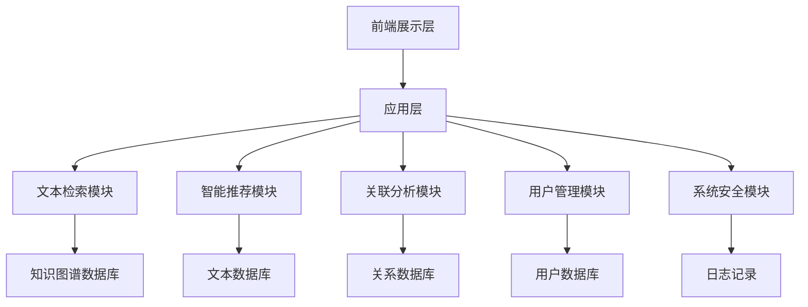
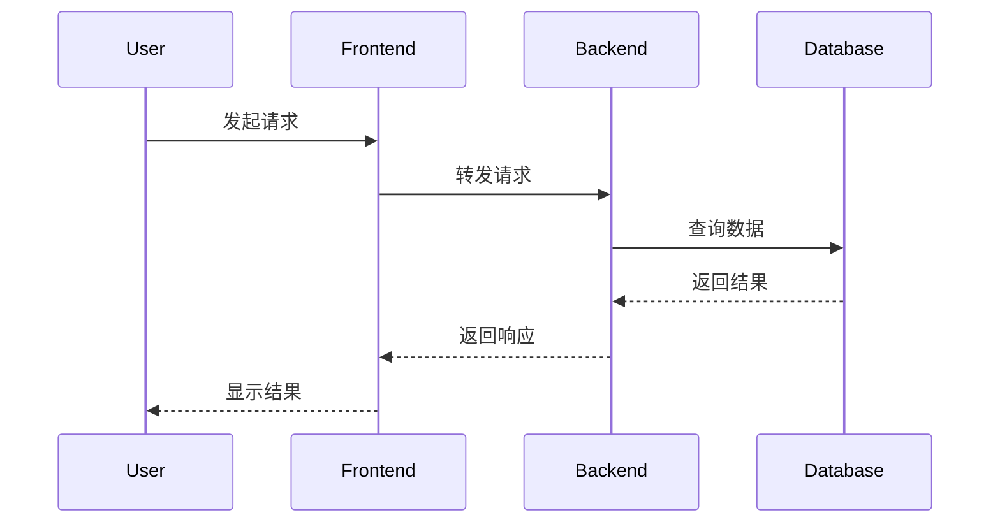

                 

### 第一部分：知识图谱与金融研报概述

#### 1.1 知识图谱概述

**知识图谱**（Knowledge Graph）是一种结构化的语义网络，它通过实体、属性和关系来表示现实世界中的各种信息和知识。知识图谱的核心思想是将信息以图谱的形式进行组织，使得计算机能够像人类一样理解这些信息，并进行智能化的处理和应用。

**知识图谱的定义与重要性**

知识图谱的定义可以从多个维度来理解：

1. **语义维度**：知识图谱是一种语义网络，它通过实体和关系来表示现实世界的语义信息。实体是知识图谱中的基本单元，如“人”、“地点”、“事物”等；关系则描述实体之间的关系，如“属于”、“位于”、“参与”等。

2. **结构维度**：知识图谱是一种图结构，它通过节点和边来组织实体和关系。节点表示实体，边表示关系，边的权重可以表示关系的强度或概率。

3. **应用维度**：知识图谱是一种工具，它用于在计算机系统中存储、管理和检索知识，以支持各种智能应用，如智能搜索、推荐系统、问答系统等。

知识图谱的重要性主要体现在以下几个方面：

- **提升信息检索效率**：通过结构化的知识组织，知识图谱能够提供更准确、更快速的信息检索服务，大大提升用户的信息获取效率。
- **增强智能决策支持**：知识图谱为计算机系统提供了丰富的背景知识和上下文信息，使得智能系统在进行决策时能够更加智能化、个性化。
- **促进数据共享与整合**：知识图谱通过统一的知识表示和语义关联，能够促进不同数据源之间的信息共享和整合，提升数据的利用效率。

**知识图谱的发展历程**

知识图谱的概念起源于语义网络（Semantic Network）和本体论（Ontology）。语义网络是一种早期的知识表示方法，它通过节点和边来表示概念及其关系。本体论则是一种用于定义和描述领域知识的理论框架。

随着互联网和大数据技术的发展，知识图谱的应用场景逐渐扩大，从最初的知识库扩展到语义搜索、智能问答、推荐系统等多个领域。目前，知识图谱已经成为人工智能领域的一个重要研究方向，并且在多个行业中得到广泛应用。

**知识图谱的基本结构**

知识图谱的基本结构包括实体、属性和关系三个核心要素：

1. **实体**：实体是知识图谱中的基本单元，表示现实世界中的人、事、物等。例如，“张三”、“北京”、“苹果”等。
2. **属性**：属性是实体的特征或描述，通常用键值对（Key-Value Pair）来表示。例如，“张三的年龄”、“北京的气候”、“苹果的形状”等。
3. **关系**：关系描述实体之间的关系，可以是简单的关系，如“属于”、“位于”；也可以是复杂的关系，如“参与”、“投资”等。

**知识图谱的基本操作**

知识图谱的基本操作包括：

- **查询**：根据给定的条件检索图谱中的实体和关系。
- **插入**：向图谱中添加新的实体和关系。
- **更新**：修改图谱中已有实体或关系的属性或关系。
- **删除**：删除图谱中的实体或关系。

**知识图谱的构建过程**

构建知识图谱通常包括以下几个步骤：

1. **数据采集**：从各种数据源中收集实体和关系信息。
2. **实体与关系抽取**：通过自然语言处理技术从文本中抽取实体和关系。
3. **知识融合**：将来自不同数据源的实体和关系进行整合，形成统一的知识图谱。
4. **存储与索引**：将知识图谱存储到数据库中，并建立索引，以便快速查询。

**知识图谱的挑战与未来趋势**

知识图谱的发展面临一些挑战，如：

- **数据质量**：知识图谱依赖于高质量的数据，数据的不完整、不一致和错误会影响知识图谱的准确性。
- **实时性**：随着数据量的增加，知识图谱的实时性成为重要问题，如何实时更新和维护知识图谱是一个关键问题。
- **扩展性**：知识图谱需要能够适应不断增长的数据和应用需求，具备良好的扩展性。

未来，知识图谱的发展趋势包括：

- **多语言支持**：知识图谱将支持更多的语言，以满足全球用户的需求。
- **跨领域融合**：知识图谱将跨越不同领域，实现知识的跨领域整合和应用。
- **智能化**：知识图谱将更加智能化，具备自我学习和自我优化的能力。

#### 1.2 金融研报概述

**金融研报的概念与作用**

金融研报是指金融分析师或研究机构通过对金融市场、行业或公司的深入研究，撰写出的分析报告。金融研报通常包括对市场趋势、行业动态、公司财务状况等方面的分析和预测。

金融研报在金融领域具有重要作用：

1. **投资决策**：投资者通过阅读金融研报，可以获取市场信息，了解行业和公司的基本面，从而做出更加明智的投资决策。
2. **风险管理**：金融机构和投资者通过金融研报，可以了解潜在的风险因素，制定相应的风险管理策略。
3. **市场研究**：金融研报提供了对市场、行业和公司的深度分析，为市场研究和行业分析提供了重要依据。

**金融研报的类型与特点**

金融研报根据内容和形式可以分为以下几类：

1. **宏观经济分析报告**：分析宏观经济形势、政策走向、经济指标等，为投资者提供宏观经济层面的参考。
2. **行业研究报告**：分析行业发展趋势、市场结构、竞争格局等，为投资者提供行业层面的参考。
3. **公司研究报告**：分析公司财务状况、业务模式、市场竞争力等，为投资者提供公司层面的参考。

金融研报的特点包括：

1. **深度分析**：金融研报通常对市场、行业或公司进行深入分析，提供详细的背景信息和数据支持。
2. **专业性强**：金融研报通常由专业的金融分析师或研究机构撰写，具有较高的可信度和权威性。
3. **时效性强**：金融研报通常及时发布，反映最新的市场动态和研究成果。

**金融研报在金融领域的应用**

金融研报在金融领域有广泛的应用：

1. **投资咨询**：投资者通过金融研报获取投资建议，包括行业选择、个股推荐等。
2. **风险管理**：金融机构通过金融研报了解潜在风险，制定风险控制策略。
3. **市场研究**：金融机构和投资者通过金融研报进行市场分析和预测，制定投资策略。
4. **政策制定**：政府和监管机构通过金融研报了解金融市场动态，制定相关政策。

**金融研报的发展趋势**

随着大数据和人工智能技术的发展，金融研报正朝着智能化、自动化和个性化的方向发展：

1. **数据驱动的分析**：利用大数据技术，对大量金融数据进行深入挖掘和分析，提供更加精准的预测和决策支持。
2. **自动化报告生成**：通过自然语言处理和机器学习技术，实现金融研报的自动化生成，提高报告的生产效率。
3. **个性化服务**：根据用户需求和偏好，提供个性化的金融研报，提升用户体验。

#### 1.3 知识图谱与金融研报的结合

**知识图谱在金融研报中的应用场景**

知识图谱在金融研报中的应用非常广泛，以下是一些典型的应用场景：

1. **智能搜索**：通过知识图谱，可以实现更加智能和精确的金融信息搜索，用户可以通过关键词或实体，快速找到相关的金融研报。
2. **关联分析**：知识图谱可以挖掘出实体之间的关系，如公司间的股权关系、行业间的竞争关系等，为投资者提供更深层次的分析。
3. **推荐系统**：基于知识图谱，可以为投资者推荐与其关注领域相关的金融研报，提高用户的投资决策效率。
4. **知识图谱可视化**：通过知识图谱的图形化展示，可以直观地理解金融研报中的关键信息和关系，便于用户快速掌握核心内容。

**金融研报智能检索的需求与挑战**

构建金融研报智能检索系统，需要满足以下需求：

1. **精准检索**：系统能够根据用户输入的关键词，快速准确地找到相关的金融研报，提高检索效率。
2. **个性化推荐**：系统能够根据用户的历史查询记录和偏好，为用户推荐个性化的金融研报，提高用户的满意度。
3. **实时更新**：系统能够实时更新金融研报，确保用户获取到最新的市场信息和研究成果。

然而，构建金融研报智能检索系统也面临一些挑战：

1. **数据质量**：金融研报的质量参差不齐，存在数据缺失、不一致和错误等问题，这会影响知识图谱的构建和检索效果。
2. **实时性**：金融市场的信息更新非常快，如何保证知识图谱和检索系统能够实时更新，是一个重要问题。
3. **准确性**：知识图谱的构建和检索算法需要确保结果的准确性和可靠性，避免产生误导性的信息。

**构建金融研报智能检索系统的意义**

构建金融研报智能检索系统具有重要的意义：

1. **提高信息获取效率**：通过智能检索系统，用户可以快速找到相关的金融研报，节省大量时间和精力。
2. **优化投资决策**：智能检索系统可以提供精准、个性化的投资建议，帮助投资者做出更加明智的决策。
3. **提升风险管理能力**：智能检索系统可以帮助金融机构和投资者了解市场动态和潜在风险，制定更加有效的风险管理策略。
4. **推动金融创新**：智能检索系统为金融行业的创新提供了新的工具和方法，有助于推动金融科技的发展。

#### 1.4 本书结构安排

**各章节内容的安排与逻辑关系**

本书分为五个部分，分别从知识图谱与金融研报的概述、知识图谱构建、金融研报预处理、金融研报智能检索系统构建和项目实战等方面进行了详细阐述。各部分内容安排如下：

- **第一部分**：知识图谱与金融研报概述，介绍知识图谱和金融研报的基本概念、发展历程、应用场景等。
- **第二部分**：知识图谱构建，详细讲解知识图谱的数据采集、实体与关系抽取、存储与索引、质量评估等方面的技术。
- **第三部分**：金融研报预处理，介绍金融研报的数据获取、文本处理、数据标注等方面的技术。
- **第四部分**：金融研报智能检索系统构建，讲解系统需求分析、系统架构设计、检索算法设计、系统实现与部署等方面的内容。
- **第五部分**：项目实战，通过一个实际案例，详细讲解系统构建的整个过程，包括系统需求分析、系统设计、系统实现、系统部署与维护等。

**阅读本书的预期收获**

阅读本书，读者可以收获以下内容：

1. **全面了解知识图谱与金融研报的基本概念和原理**：通过本书的介绍，读者可以全面了解知识图谱和金融研报的基本概念、发展历程、应用场景等。
2. **掌握知识图谱构建的核心技术**：本书详细讲解了知识图谱的数据采集、实体与关系抽取、存储与索引、质量评估等方面的核心技术，读者可以系统地学习和掌握这些技术。
3. **了解金融研报预处理的方法与技巧**：本书介绍了金融研报的数据获取、文本处理、数据标注等方面的预处理方法，读者可以学会如何对金融研报进行有效的预处理。
4. **学会构建金融研报智能检索系统**：本书通过系统需求分析、系统架构设计、检索算法设计、系统实现与部署等方面的讲解，读者可以学会如何构建一个高效的金融研报智能检索系统。
5. **获取项目实战经验**：通过实际案例的讲解，读者可以了解到金融研报智能检索系统的整个实现过程，获取实际项目经验。

**本章小结**

本章对知识图谱和金融研报的基本概念、发展历程、应用场景等进行了概述，并介绍了本书的结构安排和预期收获。通过本章的学习，读者可以全面了解知识图谱和金融研报的相关知识，为后续章节的学习打下基础。

### 第二部分：知识图谱构建

#### 2.1 知识图谱数据采集

**数据源选择**

构建知识图谱的第一步是选择合适的数据源。数据源的选择决定了知识图谱的内容和覆盖范围，通常需要考虑以下几个方面：

1. **数据质量**：选择高质量的数据源，能够保证知识图谱的准确性。高质量的数据源通常包括权威的数据库、官方发布的数据、专业的数据提供商等。
2. **数据多样性**：选择涵盖不同领域和主题的数据源，可以丰富知识图谱的内容。例如，可以同时选择金融、医疗、科技等领域的数据源。
3. **数据完整性**：选择数据完整、信息全面的数据源，可以确保知识图谱的完整性。数据完整性包括实体的完整性、关系的完整性等。
4. **数据更新频率**：选择更新频率较高的数据源，可以保证知识图谱的实时性和时效性。对于金融市场、新闻事件等动态变化较大的领域，数据更新频率尤为重要。

**数据采集方法**

数据采集是知识图谱构建的重要环节，以下是一些常见的数据采集方法：

1. **Web爬虫**：通过爬虫技术，从互联网上抓取公开的网页内容，获取结构化和半结构化数据。这种方法适用于大量、广泛分布的网页数据，但需要注意遵守网站的使用条款和法律法规。
2. **API接口**：利用各种API接口，从数据提供商或第三方平台获取数据。API接口可以提供结构化、高质量的数据，但需要考虑接口的可用性和限制。
3. **数据库连接**：直接连接数据库，从数据库中获取数据。这种方法适用于拥有数据库权限的场景，可以直接获取结构化数据。
4. **数据挖掘**：利用数据挖掘技术，从非结构化数据中提取出有价值的信息。例如，通过自然语言处理技术，从文本数据中提取实体和关系。

**数据预处理**

数据预处理是数据采集后的关键步骤，旨在提高数据的质量和一致性，通常包括以下任务：

1. **数据清洗**：去除数据中的噪声和异常值，确保数据的质量。例如，去除重复记录、填补缺失值、修正错误数据等。
2. **数据转换**：将不同格式、不同结构的数据转换为统一的格式，便于后续处理。例如，将文本数据转换为表格数据、将图片数据转换为结构化数据等。
3. **数据归一化**：对数据进行归一化处理，消除不同数据之间的量纲和尺度差异，提高数据的一致性。例如，将时间戳统一为同一时区、将货币单位统一为同一货币等。
4. **数据集成**：将来自不同数据源的数据进行集成，形成统一的数据集。数据集成可以包括数据合并、数据转换和数据清洗等步骤。

**本章小结**

本章介绍了知识图谱数据采集的方法和技巧，包括数据源选择、数据采集方法和数据预处理。通过本章的学习，读者可以了解如何选择合适的数据源、采集数据以及预处理数据，为后续知识图谱的构建打下基础。

#### 2.2 知识图谱实体与关系抽取

**实体识别技术**

实体识别是知识图谱构建的关键步骤之一，其主要任务是从非结构化文本中识别出实体，并将其标注为图谱中的节点。实体识别技术主要包括以下几种：

1. **基于词典的方法**：通过预定义的词典，对文本进行扫描，识别出词典中的实体。这种方法简单高效，但依赖于词典的完整性和准确性。
2. **基于规则的方法**：根据特定的语言规则和模式，对文本进行实体识别。例如，利用命名实体识别（NER）技术，根据特定的语法规则和模式识别出人名、地名、组织名等。
3. **基于统计的方法**：利用机器学习算法，从大量标注数据中学习出实体识别模型。例如，利用条件随机场（CRF）、支持向量机（SVM）等算法，对文本进行实体识别。
4. **基于深度学习的方法**：利用深度神经网络，如卷积神经网络（CNN）和循环神经网络（RNN），对文本进行实体识别。深度学习方法在处理复杂、高维的文本数据时具有明显优势。

**关系抽取技术**

关系抽取是指从文本中识别出实体之间的关系，并将其标注为图谱中的边。关系抽取技术主要包括以下几种：

1. **基于词典的方法**：通过预定义的词典，识别出实体之间的已知关系。这种方法简单直接，但依赖于词典的完整性。
2. **基于规则的方法**：根据特定的语言规则和模式，识别出实体之间的关系。例如，利用模式匹配技术，根据特定的语法结构识别出实体关系。
3. **基于统计的方法**：利用机器学习算法，从大量标注数据中学习出关系抽取模型。例如，利用逻辑回归（LR）、决策树（DT）等算法，对文本进行关系抽取。
4. **基于深度学习的方法**：利用深度神经网络，如长短期记忆网络（LSTM）和Transformer，对文本进行关系抽取。深度学习方法在处理复杂、长文本数据时具有明显优势。

**实体与关系的融合**

在知识图谱构建过程中，实体与关系的融合是关键步骤，其目的是将识别出的实体和关系整合到一个统一的图谱中。实体与关系的融合主要包括以下任务：

1. **实体消歧**：在多个实体表示相同概念时，通过语义分析、上下文信息等手段，确定其唯一表示。实体消歧有助于避免图谱中的冗余实体。
2. **实体链接**：将来自不同数据源的实体映射到同一个实体上，确保图谱中的实体具有一致性。例如，将“张三”和“张三丰”链接到同一个实体上。
3. **关系融合**：将来自不同数据源的关系进行整合，确保图谱中的关系具有一致性。例如，将“属于”和“隶属”两种关系融合为同一关系。
4. **图谱优化**：通过图论算法，对知识图谱进行优化，提高图谱的质量和效率。例如，通过图压缩、去重等操作，减少图谱的规模和复杂度。

**本章小结**

本章介绍了知识图谱实体与关系抽取的技术和方法，包括实体识别技术、关系抽取技术以及实体与关系的融合。通过本章的学习，读者可以了解如何从文本中识别实体和关系，并将其整合到知识图谱中，为构建高质量的知识图谱打下基础。

#### 2.3 知识图谱存储与索引

**知识图谱存储技术**

知识图谱的存储技术是构建高效、可扩展的知识图谱系统的关键。以下是一些常见的知识图谱存储技术：

1. **关系数据库**：关系数据库通过表和关系来存储数据，支持复杂的查询和联接操作。常用的关系数据库包括MySQL、PostgreSQL等。关系数据库的优点是易于理解和使用，但面对大规模图数据时性能可能受限。

2. **图数据库**：图数据库专门为存储图结构数据而设计，支持高效的图遍历和查询操作。常用的图数据库包括Neo4j、Apache Giraph等。图数据库的优点是能够高效处理大规模图数据，但在查询复杂度较高时性能可能不如关系数据库。

3. **键值存储**：键值存储通过键值对的方式存储数据，适用于存储大量简单数据对。例如，Redis、Memcached等。键值存储的优点是读写速度快，但无法直接支持复杂的图查询。

4. **文档存储**：文档存储通过文档的形式存储数据，支持灵活的数据结构和查询方式。例如，MongoDB、Elasticsearch等。文档存储的优点是支持复杂的数据结构和丰富的查询功能，但在处理大规模图数据时性能可能受限。

**知识图谱索引技术**

知识图谱的索引技术是提高查询效率的重要手段。以下是一些常见的知识图谱索引技术：

1. **B+树索引**：B+树索引是一种常见的索引结构，适用于支持范围查询和点查询。在知识图谱中，B+树索引可以用于快速查找特定的节点和路径。

2. **哈希索引**：哈希索引通过哈希函数快速定位数据，适用于快速查找特定节点。哈希索引的优点是查询速度快，但可能存在哈希冲突问题。

3. **全文索引**：全文索引通过索引文本中的所有单词，支持全文搜索。在知识图谱中，全文索引可以用于快速查找包含特定单词的节点和关系。

4. **图索引**：图索引专门为图结构数据设计，支持高效的图遍历和查询。例如，邻接表索引、邻接矩阵索引等。图索引的优点是能够高效处理大规模图数据，但实现复杂度较高。

**知识图谱查询优化**

知识图谱查询优化是提高查询性能的关键，以下是一些常见的查询优化方法：

1. **查询缓存**：将频繁执行的查询结果缓存起来，减少重复查询的开销。查询缓存可以显著提高查询响应速度，但需要管理缓存的一致性和有效性。

2. **索引优化**：通过选择合适的索引策略，减少查询的I/O操作。例如，针对常见的查询模式创建合适的索引，避免全表扫描。

3. **查询分解**：将复杂的查询分解为多个简单查询，然后合并查询结果。查询分解可以降低查询的复杂度，提高查询性能。

4. **并行查询**：利用多核处理器和分布式计算，将查询任务分解为多个子任务并行执行，然后合并子任务结果。并行查询可以显著提高查询性能，但需要考虑负载均衡和数据一致性问题。

**本章小结**

本章介绍了知识图谱存储与索引的技术和方法，包括关系数据库、图数据库、键值存储、文档存储等存储技术，以及B+树索引、哈希索引、全文索引、图索引等索引技术。同时，还讨论了查询优化方法，如查询缓存、索引优化、查询分解和并行查询。通过本章的学习，读者可以了解如何选择合适的存储和索引技术，并优化知识图谱查询性能。

#### 2.4 知识图谱质量评估

**知识图谱质量评价指标**

评估知识图谱的质量是保证其有效性和可靠性的重要环节。以下是一些常用的知识图谱质量评价指标：

1. **覆盖率**（Coverage）：指知识图谱中实体的数量与实际存在的实体数量之比。覆盖率越高，表明知识图谱覆盖的实体越全面。
   $$ \text{覆盖率} = \frac{\text{知识图谱中的实体数量}}{\text{实际存在的实体数量}} $$
   
2. **完整性**（Completeness）：指知识图谱中实体所包含的关系数量与实际存在的可能关系数量之比。完整性越高，表明知识图谱中的实体关系越完整。
   $$ \text{完整性} = \frac{\text{知识图谱中的关系数量}}{\text{实际存在的可能关系数量}} $$
   
3. **一致性**（Consistency）：指知识图谱中实体和关系的一致性程度。一致性越高，表明知识图谱中的实体和关系越准确无误。
   
4. **准确性**（Accuracy）：指知识图谱中的实体和关系与实际世界的一致性程度。准确性越高，表明知识图谱的质量越高。

5. **多样性**（Diversity）：指知识图谱中实体的多样性程度。多样性越高，表明知识图谱能够覆盖更多不同的实体。

**知识图谱质量评估方法**

为了评估知识图谱的质量，需要采用一系列方法来检查和验证知识图谱的各个方面。以下是一些常见的质量评估方法：

1. **自动化评估方法**：利用自动化工具对知识图谱进行质量评估。例如，通过运行特定算法检查知识图谱中的数据一致性、完整性等。
2. **人工审核方法**：通过人工审核知识图谱中的数据，检查实体和关系的准确性、一致性等。这种方法通常用于发现自动化工具无法检测到的问题。
3. **基准测试方法**：通过对比知识图谱与其他标准数据集的性能，评估知识图谱的覆盖率、准确性等指标。常用的基准测试包括链接预测、实体匹配等任务。

**知识图谱质量提升策略**

提升知识图谱的质量是构建高质量知识图谱的关键。以下是一些常用的质量提升策略：

1. **数据清洗**：通过数据清洗技术，去除知识图谱中的噪声数据和错误数据，提高数据质量。
2. **数据整合**：通过数据整合技术，将来自不同数据源的数据进行整合，消除数据冗余和冲突，提高数据一致性。
3. **数据增强**：通过数据增强技术，增加知识图谱中的实体和关系，提高覆盖率和完整性。
4. **机器学习**：利用机器学习技术，对知识图谱进行自动评估和优化，提高准确性。
5. **众包和社区贡献**：通过众包和社区贡献，吸引更多的用户参与知识图谱的构建和优化，提高多样性。

**本章小结**

本章介绍了知识图谱质量评估的重要性和方法，包括覆盖率、完整性、一致性、准确性和多样性等质量评价指标，以及自动化评估方法、人工审核方法和基准测试方法等评估方法。同时，还提出了数据清洗、数据整合、数据增强、机器学习和众包等质量提升策略。通过本章的学习，读者可以了解如何评估和提升知识图谱的质量，为构建高质量的知识图谱提供指导。

### 第三部分：金融研报预处理

#### 3.1 金融研报数据获取

**数据来源选择**

金融研报数据获取的第一步是选择合适的数据来源。选择优质的数据源是确保金融研报数据质量和可靠性的关键。以下是一些常见的数据来源：

1. **官方数据**：包括政府机构、监管机构发布的金融统计数据、市场报告等。这些数据通常具有较高的权威性和准确性。
2. **金融媒体**：如财经新闻网站、行业报告、投资分析等。这些数据来源提供了丰富的市场信息和实时动态。
3. **金融数据库**：如Wind、Bloomberg、CEIC等，提供了大量的金融数据，包括股票行情、公司财务数据、宏观经济数据等。
4. **学术文献**：包括学术论文、研究报告等，提供了对金融现象深入的理论分析和实证研究。

**数据采集工具与方法**

金融研报数据的采集可以采用多种工具和方法，以下是一些常用的工具和方法：

1. **Web爬虫**：利用爬虫技术，从互联网上获取金融研报数据。这种方法适用于获取大量、广泛分布的金融信息，但需要注意遵守网站的使用条款和法律法规。
2. **API接口**：利用各种金融数据提供商的API接口，获取结构化的金融研报数据。API接口通常提供了高效、稳定的数据获取方式。
3. **数据库连接**：通过直接连接金融数据库，获取金融研报数据。这种方法适用于需要批量获取大量金融数据的场景。
4. **自动化工具**：如自动化爬虫框架（如Scrapy）、数据采集工具（如DataScraper）等，可以简化数据采集过程，提高采集效率。

**金融研报数据格式转换**

在获取到金融研报数据后，通常需要对数据进行格式转换，以便于后续的处理和分析。以下是一些常见的金融研报数据格式转换方法：

1. **文本格式转换**：将获取的金融研报文本数据转换为统一格式的文本文件，如CSV、JSON等。文本格式转换可以方便后续的数据处理和分析。
2. **数据结构转换**：将结构化的金融研报数据转换为适合存储和处理的数据库格式，如MySQL、PostgreSQL等。数据结构转换可以优化数据的存储和查询性能。
3. **数据清洗**：在格式转换过程中，对数据进行清洗和预处理，去除噪声数据和错误数据，确保数据的质量。

**本章小结**

本章介绍了金融研报数据获取的方法和技巧，包括数据来源选择、数据采集工具与方法以及金融研报数据格式转换。通过本章的学习，读者可以了解如何选择合适的数据源、采集数据以及转换数据格式，为后续的金融研报预处理打下基础。

#### 3.2 金融研报文本处理

**文本预处理技术**

文本预处理是金融研报数据处理的重要环节，其目的是将原始文本数据转化为适合模型训练和处理的格式。以下是一些常见的文本预处理技术：

1. **分词**：将文本拆分成单词或短语。分词技术可以采用基于规则的方法（如正向最大匹配、逆向最大匹配等）和基于统计的方法（如基于TF-IDF、词频统计等）。

2. **去停用词**：去除文本中的停用词（如“的”、“和”、“是”等），因为这些词对文本内容的贡献较小，去除它们可以减少数据维度，提高模型训练效率。

3. **词干提取**：将单词缩减到其词干形式，减少数据维度。例如，将“running”、“runs”、“ran”都缩减为“run”。

4. **词向量表示**：将文本中的每个单词转换为高维向量表示，如Word2Vec、GloVe等。词向量表示可以捕捉单词的语义信息，为模型训练提供有效的特征表示。

**停用词处理**

停用词处理是文本预处理中的重要步骤，以下是一些常见的停用词处理方法：

1. **预设停用词表**：使用预定义的停用词表，去除文本中的常见停用词。这种方法简单有效，但可能无法涵盖特定领域的特殊停用词。

2. **动态停用词表**：根据具体任务和领域动态构建停用词表。例如，在金融研报处理中，可以结合领域知识，识别并去除特定领域的常见停用词。

3. **统计停用词表**：通过统计文本数据，识别出出现频率较低的单词，并将其加入停用词表。这种方法可以根据数据特点动态调整停用词表，提高文本处理的灵活性。

**词向量表示**

词向量表示是将文本中的单词转换为高维向量表示的一种技术，以下是一些常见的词向量表示方法：

1. **Word2Vec**：Word2Vec是一种基于神经网络的语言模型，通过训练生成单词的词向量表示。Word2Vec包括连续词袋（CBOW）和跳字模型（Skip-Gram）两种算法。

2. **GloVe**：GloVe（Global Vectors for Word Representation）是一种基于全局统计的词向量表示方法，通过训练单词的共现矩阵，生成单词的词向量表示。

3. **FastText**：FastText是一种基于字符的词向量表示方法，将单词拆分成字符序列，并训练字符级的词向量，然后通过聚合字符级向量生成单词级向量。

**本章小结**

本章介绍了金融研报文本处理的常见技术，包括分词、去停用词、词干提取和词向量表示。同时，还讨论了停用词处理和词向量表示的具体方法。通过本章的学习，读者可以了解如何对金融研报文本进行有效的预处理，为后续的文本分析和建模打下基础。

#### 3.3 金融研报数据标注

**数据标注方法**

金融研报数据标注是构建金融知识图谱的重要步骤之一，其目的是将文本数据中的关键信息标记为实体和关系，以便后续的图数据库存储和查询。以下是一些常见的数据标注方法：

1. **人工标注**：通过专业标注人员对文本数据逐条进行标注，这种方法质量高，但成本较高且效率低。
2. **半监督标注**：利用已有标注数据，结合未标注数据，通过模型预测未标注数据中的实体和关系，这种方法在一定程度上降低了标注成本。
3. **自动化标注**：利用自然语言处理（NLP）技术，如实体识别（NER）和关系抽取（RE），自动识别文本中的实体和关系。这种方法成本低，但准确率可能受限于模型能力。

**数据标注工具**

为了提高数据标注的效率和准确性，可以使用以下数据标注工具：

1. **Annotate**：Annotate是一个开源的文本数据标注工具，支持多种标注任务，如实体识别、关系抽取等。
2. **Brat**：Brat是一个基于Web的文本标注工具，支持多种语言和标注任务，提供了丰富的标注功能。
3. **Label Studio**：Label Studio是一个灵活的文本和图像数据标注工具，支持多种标注模式，如分类、实体识别、序列标注等。
4. **CVAT**：CVAT是一个开源的计算机视觉数据标注工具，适用于图像和视频数据的标注。

**数据标注质量评估**

数据标注质量直接影响知识图谱的构建和应用效果，因此需要对标注质量进行评估。以下是一些常见的数据标注质量评估方法：

1. **人工评估**：通过专业评估人员对标注结果进行审查，评估标注的准确性和一致性。
2. **混淆矩阵**：通过计算标注结果的混淆矩阵，评估标注的准确率和召回率等指标。
3. **自动化评估**：利用机器学习模型对标注结果进行评估，评估标注的一致性和准确性。
4. **众包评估**：通过众包平台，邀请多个标注人员进行标注，并评估标注结果的一致性和准确性。

**数据标注质量提升策略**

为了提高数据标注的质量，可以采取以下策略：

1. **标注规范**：制定明确的标注规范和指南，确保标注人员遵循统一的标准。
2. **标注培训**：对标注人员进行专业培训，提高其标注技能和准确性。
3. **标注审核**：对标注结果进行定期审核，发现并纠正错误，确保标注的一致性和准确性。
4. **标注多样性**：引入多种标注方法，如人工标注、半监督标注和自动化标注，提高标注结果的可靠性。

**本章小结**

本章介绍了金融研报数据标注的方法和工具，以及标注质量评估和质量提升策略。通过本章的学习，读者可以了解如何对金融研报文本进行有效的标注，为构建高质量的金融知识图谱打下基础。

### 第四部分：金融研报智能检索系统构建

#### 4.1 系统需求分析

**系统功能需求**

构建金融研报智能检索系统的第一步是明确系统所需实现的功能。以下是该系统的主要功能需求：

1. **文本检索**：系统能够接受用户输入的关键词或查询语句，返回与查询相关的金融研报文本。
2. **智能推荐**：系统可以根据用户的历史查询记录和偏好，为用户推荐相关的金融研报。
3. **实体识别**：系统能够识别文本中的关键实体，如公司名、人名、地点等，并提供相关的信息。
4. **关系抽取**：系统可以从文本中抽取实体之间的关系，如投资关系、合作关系等，为用户展示更多的背景信息。
5. **可视化**：系统提供数据可视化功能，帮助用户直观地理解金融研报的内容和结构。
6. **多语言支持**：系统能够支持多种语言，满足全球用户的需求。

**系统性能需求**

系统性能需求是保证系统高效稳定运行的关键。以下是金融研报智能检索系统的性能需求：

1. **响应时间**：系统在接收到用户查询请求后，能够在较短的时间内返回查询结果，保证用户的体验。
2. **查询吞吐量**：系统需要能够处理大量并发查询，满足高并发场景下的性能需求。
3. **数据更新频率**：系统需要能够实时更新金融研报数据，确保用户获取到最新的信息。
4. **存储容量**：系统需要具备足够的存储容量，以存储海量的金融研报数据。
5. **安全性**：系统需要具备数据安全保护机制，防止数据泄露和未经授权的访问。

**系统安全性需求**

系统安全性是保障用户数据和系统运行安全的重要方面。以下是金融研报智能检索系统的安全性需求：

1. **用户认证**：系统需要实现用户身份认证，确保只有授权用户才能访问系统功能。
2. **访问控制**：系统需要实现访问控制机制，限制用户对特定功能的访问权限。
3. **数据加密**：系统需要使用数据加密技术，保护用户数据在传输和存储过程中的安全性。
4. **日志记录**：系统需要记录用户操作日志，以便在出现安全问题时进行追踪和审计。
5. **异常监测**：系统需要实现异常监测机制，及时发现和应对潜在的安全威胁。

**本章小结**

本章详细阐述了金融研报智能检索系统的功能需求、性能需求和安全性需求。通过明确这些需求，可以为后续的系统设计和实现提供明确的指导和依据。读者可以了解如何根据具体需求构建一个高效、安全、可扩展的金融研报智能检索系统。

#### 4.2 系统架构设计

**系统架构概述**

金融研报智能检索系统的架构设计需要综合考虑系统的功能需求、性能需求和安全性需求，采用分布式系统架构，以提高系统的扩展性和可靠性。以下是一个典型的金融研报智能检索系统架构设计：

1. **前端展示层**：包括用户界面（UI）和交互逻辑，提供用户查询、浏览和推荐等操作接口。前端展示层通常采用Web应用或移动应用的形式，使用HTML、CSS和JavaScript等前端技术实现。
2. **应用层**：负责处理用户请求，包括文本检索、智能推荐、实体识别和关系抽取等核心功能。应用层通常采用微服务架构，将不同的功能模块分离，便于系统扩展和维护。
3. **数据层**：包括知识图谱数据库、文本数据库和关系数据库等，存储和管理金融研报数据、实体关系数据和其他相关数据。数据层采用分布式数据库架构，以提高存储容量和数据访问性能。
4. **基础设施层**：提供系统运行所需的基础设施支持，包括服务器、存储设备、网络设备和安全设备等。基础设施层还需要实现自动化运维管理，确保系统的高可用性和可扩展性。

**系统模块划分**

金融研报智能检索系统可以划分为多个功能模块，每个模块负责实现特定的功能，模块之间通过接口进行通信。以下是主要的功能模块：

1. **用户接口模块**：负责处理用户输入和展示查询结果，包括文本输入框、搜索按钮、结果列表等前端组件。
2. **文本检索模块**：负责实现文本检索算法，根据用户输入的关键词或查询语句，从知识图谱数据库中检索相关的金融研报文本。
3. **智能推荐模块**：负责根据用户的历史查询记录和偏好，为用户推荐相关的金融研报。可以使用协同过滤、内容推荐等技术实现。
4. **实体识别模块**：负责从文本中识别出关键实体，如公司名、人名、地点等，并提供相关的信息。
5. **关系抽取模块**：负责从文本中抽取实体之间的关系，如投资关系、合作关系等，为用户展示更多的背景信息。
6. **数据存储模块**：负责存储和管理金融研报数据、实体关系数据和其他相关数据，采用分布式数据库架构以提高性能和可靠性。
7. **监控系统**：负责监控系统运行状态，包括系统性能指标、资源利用率、错误日志等，实现自动化运维管理。

**系统接口设计**

系统接口设计是系统模块之间通信的基础，需要明确各个模块的输入输出接口和数据格式。以下是主要系统接口设计：

1. **用户接口**：提供HTTP/HTTPS接口，支持用户登录、查询、推荐等操作。接口返回JSON格式的数据，包括查询结果、推荐结果等。
2. **文本检索接口**：提供RESTful API，支持关键词检索和高级查询功能，接口接收JSON格式的查询参数，返回检索结果。
3. **智能推荐接口**：提供RESTful API，支持根据用户历史记录和偏好进行推荐，接口接收JSON格式的用户信息和推荐参数，返回推荐结果。
4. **实体识别接口**：提供RESTful API，支持从文本中识别关键实体，接口接收JSON格式的文本数据，返回实体列表。
5. **关系抽取接口**：提供RESTful API，支持从文本中抽取实体之间的关系，接口接收JSON格式的文本数据，返回关系列表。
6. **数据存储接口**：提供数据库操作接口，支持数据的插入、更新、删除和查询操作，接口接收和返回JSON格式的数据。

**本章小结**

本章详细介绍了金融研报智能检索系统的架构设计，包括系统架构概述、模块划分和接口设计。通过合理的架构设计，可以确保系统的高效性、可扩展性和安全性，为后续的系统实现提供清晰的蓝图。读者可以了解如何设计一个完整的金融研报智能检索系统，并掌握系统架构设计的核心要点。

#### 4.3 检索算法设计

**检索算法概述**

金融研报智能检索系统的核心在于高效的检索算法，它决定了用户查询的响应速度和检索结果的相关性。以下是几种常见的检索算法及其基本原理：

1. **基于关键词匹配的检索算法**：最简单的检索算法，通过直接匹配用户输入的关键词和文本中的关键词，找到相关的金融研报。其优点是简单高效，缺点是难以处理复杂的语义关系。
2. **基于向量空间的检索算法**：将文本转换为向量表示，计算查询向量与文档向量之间的相似度，选择相似度最高的文档作为检索结果。常用算法包括余弦相似度、点积等。
3. **基于语言模型的检索算法**：利用语言模型（如n元语法模型、神经网络语言模型等）生成查询和文档的序列概率，选择概率最高的文档作为检索结果。这种方法能够更好地处理语义关系，但计算复杂度较高。
4. **基于图结构的检索算法**：利用知识图谱中的实体和关系，进行图搜索，找到与查询相关的金融研报。这种方法能够充分利用图结构中的语义信息，提高检索结果的准确性。

**检索算法实现**

以下是基于图结构的检索算法实现过程，该算法利用知识图谱中的实体和关系进行检索，具有较高的检索准确性和效率。

1. **构建知识图谱**：
   - 数据采集：从各种数据源（如金融研报、新闻报道、数据库等）中采集实体和关系数据。
   - 实体与关系抽取：利用自然语言处理（NLP）技术，从文本数据中抽取实体和关系，并将其存储到图数据库中。

2. **查询解析**：
   - 用户输入查询语句，解析查询语句中的关键词和实体。
   - 将关键词转换为图中的节点或边，用于后续的图搜索。

3. **图搜索**：
   - 从知识图谱中的起点节点开始，根据查询语句中的关键词和实体，进行深度优先或广度优先搜索，找到与查询相关的节点和路径。
   - 计算每个节点和路径的得分，得分越高表示与查询越相关。

4. **结果排序**：
   - 根据节点和路径的得分，对检索结果进行排序，选择得分最高的节点或路径作为最终检索结果。

**检索算法优化**

为了提高检索算法的性能和准确性，可以采取以下优化策略：

1. **索引优化**：对知识图谱中的实体和关系进行索引，提高图搜索的速度。常用的索引技术包括B+树索引、哈希索引等。

2. **缓存策略**：将频繁查询的结果缓存起来，减少重复计算。可以使用内存缓存或分布式缓存，如Redis等。

3. **分布式计算**：利用分布式计算框架（如Spark、Flink等），将图搜索任务分解为多个子任务，并行处理，提高搜索速度。

4. **智能搜索**：结合用户的历史查询记录和偏好，动态调整检索算法的参数，提高检索结果的个性化程度。

**本章小结**

本章详细介绍了金融研报智能检索算法的设计和实现，包括检索算法的概述、实现过程和优化策略。通过合理的检索算法设计和优化，可以确保金融研报智能检索系统的高效性和准确性，为用户提供优质的检索服务。

#### 4.4 系统实现与部署

**系统开发环境搭建**

在开始金融研报智能检索系统的开发之前，需要搭建合适的开发环境。以下是搭建系统开发环境的步骤：

1. **硬件配置**：选择高性能的服务器或云服务器，确保系统有足够的计算和存储资源。建议选择配置如下：
   - CPU：至少4核以上
   - 内存：至少16GB以上
   - 硬盘：至少1TB以上
2. **操作系统**：选择Linux操作系统，如Ubuntu 18.04或CentOS 7，因为它们对服务器应用的支持较好，且社区资源丰富。
3. **开发工具**：安装常用的开发工具和库，如Python 3、Numpy、Pandas、Scikit-learn、TensorFlow、PyTorch等。
4. **版本控制**：安装Git，用于版本控制和协作开发。
5. **数据库**：安装图数据库（如Neo4j）、关系数据库（如PostgreSQL）和全文搜索引擎（如Elasticsearch），用于存储和管理数据。

**系统实现步骤**

金融研报智能检索系统的实现可以分为以下几个步骤：

1. **数据采集**：从各种数据源采集金融研报数据，包括文本数据、图像数据等。可以使用Web爬虫、API接口或数据库连接等方法。
2. **数据预处理**：对采集到的金融研报数据进行清洗、转换和标注。包括文本预处理（如分词、去停用词、词向量表示等）和图像预处理（如图像增强、去噪等）。
3. **知识图谱构建**：利用实体识别和关系抽取技术，构建知识图谱。将预处理后的文本数据转换为图数据库中的实体和关系，建立索引，优化查询性能。
4. **智能检索功能实现**：实现文本检索、智能推荐、实体识别和关系抽取等核心功能。设计并实现相关的API接口，提供对外服务。
5. **系统测试**：对系统进行全面的测试，包括功能测试、性能测试和安全性测试。确保系统在各种场景下稳定可靠地运行。
6. **系统部署**：将开发完成的系统部署到生产环境中，包括前端展示层、应用层和数据层。配置负载均衡、缓存和日志记录等。

**系统部署与维护**

系统部署完成后，需要定期进行维护和监控，以确保系统的稳定运行。以下是系统维护和监控的关键步骤：

1. **监控与报警**：安装监控工具（如Prometheus、Grafana等），实时监控系统性能指标（如CPU、内存、磁盘占用率、网络流量等），设置报警机制，及时发现问题。
2. **日志记录与审计**：启用日志记录功能，记录系统运行过程中的操作日志、错误日志和性能日志。定期进行日志审计，分析系统运行状况，优化系统性能。
3. **数据备份与恢复**：定期进行数据备份，确保在数据丢失或系统故障时能够快速恢复。建议使用分布式存储和备份策略，提高数据可靠性。
4. **系统升级与优化**：根据用户反馈和系统性能分析，定期进行系统升级和优化。修复已知问题、优化代码、更新依赖库等。
5. **安全性管理**：确保系统的安全性，包括用户认证、访问控制、数据加密、防火墙设置等。定期进行安全审计和漏洞扫描，防止潜在的安全威胁。

**本章小结**

本章详细介绍了金融研报智能检索系统的实现与部署过程，包括开发环境搭建、系统实现步骤和系统部署与维护。通过本章的学习，读者可以了解如何实现和部署一个高效的金融研报智能检索系统，并掌握系统维护和监控的关键技巧。

#### 4.5 系统测试与评估

**系统测试方法**

为了确保金融研报智能检索系统的质量，需要进行全面的系统测试。以下是几种常见的系统测试方法：

1. **功能测试**：验证系统是否实现了预定的功能需求，确保每个功能模块都能正常工作。功能测试可以通过自动化测试工具（如Selenium、JUnit等）或手动测试进行。
2. **性能测试**：评估系统在负载下的表现，包括响应时间、吞吐量、并发处理能力等。性能测试可以通过负载生成工具（如JMeter、Locust等）进行。
3. **安全性测试**：检查系统是否存在安全漏洞，如SQL注入、XSS攻击等。安全性测试可以通过漏洞扫描工具（如Nessus、OWASP ZAP等）进行。
4. **用户体验测试**：评估系统的用户界面和交互设计，确保用户能够轻松、方便地使用系统。用户体验测试可以通过用户调研、A/B测试等方法进行。

**系统测试工具**

以下是几种常用的系统测试工具：

1. **功能测试工具**：如Selenium、JUnit、TestNG等，用于自动化测试和手动测试。
2. **性能测试工具**：如JMeter、Locust、LoadRunner等，用于生成负载并评估系统性能。
3. **安全性测试工具**：如Nessus、OWASP ZAP、Burp Suite等，用于检测系统安全漏洞。
4. **用户体验测试工具**：如Qualys、Applitools、UserTesting等，用于收集用户反馈和评估用户体验。

**系统评估指标**

为了全面评估金融研报智能检索系统的性能和质量，需要设置一系列评估指标。以下是几种常见的评估指标：

1. **准确率**（Accuracy）：正确识别的金融研报数量与总查询数量的比例。准确率越高，说明系统的检索结果越准确。
2. **召回率**（Recall）：正确识别的金融研报数量与实际存在的相关金融研报数量的比例。召回率越高，说明系统遗漏的相关结果越少。
3. **F1值**（F1 Score）：准确率和召回率的调和平均值，用于平衡两者之间的差异。F1值越高，说明系统的整体性能越好。
4. **响应时间**（Response Time）：系统处理用户查询并返回结果所需的时间。响应时间越短，说明系统的性能越好。
5. **吞吐量**（Throughput）：系统在单位时间内处理查询请求的数量。吞吐量越高，说明系统的并发处理能力越强。

**本章小结**

本章详细介绍了金融研报智能检索系统的测试与评估方法，包括测试方法、测试工具和评估指标。通过全面的系统测试与评估，可以确保金融研报智能检索系统的质量和性能，为用户提供优质的检索服务。

### 第五部分：项目实战

#### 5.1 项目背景

**项目来源**

本项目起源于一家金融科技公司的需求，该公司致力于提供金融数据的智能化服务。随着金融数据的不断增长和复杂化，用户在获取和利用金融信息时面临着诸多挑战。因此，公司希望通过构建一个基于知识图谱的金融研报智能检索系统，提高用户的信息获取效率，优化投资决策。

**项目目标**

本项目的主要目标包括：

1. **提高金融研报检索效率**：通过构建知识图谱，实现高效、精准的金融研报检索，提高用户的信息获取速度。
2. **增强金融研报关联分析**：利用知识图谱中的实体和关系，挖掘金融研报之间的关联，为用户提供更深入的关联分析。
3. **实现个性化推荐**：根据用户的历史查询记录和偏好，为用户推荐个性化的金融研报，提高用户的满意度。
4. **确保系统安全性和稳定性**：在设计和实现过程中，注重系统的安全性和稳定性，确保系统能够长期稳定运行。

**项目团队组成**

项目团队由以下成员组成：

1. **项目经理**：负责项目整体规划和进度控制。
2. **数据科学家**：负责知识图谱的构建和检索算法设计。
3. **前端工程师**：负责用户界面的设计和实现。
4. **后端工程师**：负责系统架构设计和后端功能实现。
5. **测试工程师**：负责系统测试和评估。

#### 5.2 系统需求分析

**需求收集**

在项目启动阶段，团队进行了详细的需求收集工作。通过与公司内部用户和外部客户的交流，明确了以下需求：

1. **高效检索**：用户希望能够快速找到与查询相关的金融研报，系统需要实现高效、精准的文本检索功能。
2. **智能推荐**：用户希望能够根据个人偏好和查询历史，获得个性化的金融研报推荐。
3. **关联分析**：用户希望能够通过系统了解金融研报之间的关联，以便进行更深入的研究。
4. **用户管理**：系统需要支持用户注册、登录、个人信息管理等功能。
5. **安全性**：系统需要确保用户数据和操作安全，防止数据泄露和未经授权的访问。

**需求分析**

基于收集到的需求，团队对系统需求进行了详细分析，并确定了以下功能模块：

1. **文本检索模块**：实现基于关键词和自然语言的文本检索功能，提供精准的查询结果。
2. **智能推荐模块**：利用用户历史记录和偏好，为用户推荐相关的金融研报。
3. **关联分析模块**：通过知识图谱中的实体和关系，为用户提供金融研报之间的关联分析。
4. **用户管理模块**：实现用户注册、登录、个人信息管理等功能。
5. **系统安全模块**：确保用户数据和操作安全，包括数据加密、访问控制和日志记录等。

**需求文档编写**

团队编写了详细的需求文档，包括功能需求、性能需求、安全性需求和用户界面设计等。需求文档明确了系统各功能模块的具体实现细节，为后续的系统设计和开发提供了明确的指导。

#### 5.3 系统设计

**系统架构设计**

系统架构设计是确保系统性能、可扩展性和安全性的关键步骤。本项目采用分布式系统架构，包括前端展示层、应用层和数据层。

1. **前端展示层**：负责用户界面的设计和实现，提供用户查询、浏览和推荐等操作接口。前端展示层采用Vue.js框架，实现响应式设计和交互效果。
2. **应用层**：负责处理用户请求，包括文本检索、智能推荐、关联分析和用户管理等功能。应用层采用微服务架构，将不同的功能模块分离，便于系统扩展和维护。
3. **数据层**：包括知识图谱数据库、文本数据库和关系数据库等，存储和管理金融研报数据、实体关系数据和用户数据。知识图谱数据库采用Neo4j，文本数据库采用Elasticsearch，关系数据库采用PostgreSQL。

**系统功能设计**

根据需求分析，系统功能设计包括以下模块：

1. **文本检索模块**：实现基于关键词和自然语言的文本检索功能，提供精准的查询结果。该模块利用知识图谱中的实体和关系，进行深度检索和匹配。
2. **智能推荐模块**：利用用户历史记录和偏好，为用户推荐相关的金融研报。该模块采用协同过滤和基于内容的推荐算法，提高推荐准确性。
3. **关联分析模块**：通过知识图谱中的实体和关系，为用户提供金融研报之间的关联分析。该模块提供关联关系图谱展示和关键实体信息查询。
4. **用户管理模块**：实现用户注册、登录、个人信息管理等功能。该模块确保用户数据和操作安全，提供用户友好的操作界面。
5. **系统安全模块**：包括数据加密、访问控制和日志记录等，确保用户数据和系统操作安全。

**系统架构图**

以下是金融研报智能检索系统的架构图：



**系统接口设计**

系统接口设计是确保各模块之间通信和数据流转的关键步骤。以下是主要接口设计：

1. **文本检索接口**：提供RESTful API，支持关键词检索和高级查询功能，接口接收JSON格式的查询参数，返回检索结果。
2. **智能推荐接口**：提供RESTful API，支持根据用户历史记录和偏好进行推荐，接口接收JSON格式的用户信息和推荐参数，返回推荐结果。
3. **关联分析接口**：提供RESTful API，支持从知识图谱中获取关联关系和关键实体信息，接口接收JSON格式的查询参数，返回关联关系图谱和实体信息。
4. **用户管理接口**：提供RESTful API，支持用户注册、登录、个人信息管理等功能，接口接收JSON格式的用户数据和请求参数，返回操作结果。

**系统交互序列图**

以下是金融研报智能检索系统的交互序列图：



**本章小结**

本章详细介绍了金融研报智能检索系统的项目背景、系统需求分析、系统设计，包括系统架构设计、功能设计、系统接口设计和系统交互序列图。通过本章的学习，读者可以了解如何设计和实现一个完整的金融研报智能检索系统。

#### 5.4 系统实现

**知识图谱构建**

知识图谱构建是金融研报智能检索系统的核心步骤，其目标是利用金融研报中的实体和关系，构建一个结构化的知识图谱，为后续的检索和关联分析提供基础。

1. **数据采集**：
   - 从金融数据提供商、新闻网站、学术文献等数据源中采集金融研报文本数据。
   - 使用Web爬虫技术，从互联网上抓取金融研报的HTML页面，提取文本内容。

2. **文本预处理**：
   - 对采集到的金融研报文本进行分词、去停用词、词干提取等预处理操作。
   - 利用词向量表示方法（如Word2Vec、GloVe），将文本转换为向量表示，便于后续处理。

3. **实体识别**：
   - 利用命名实体识别（NER）模型，从预处理后的文本中识别出关键实体，如公司名、人名、地点等。
   - 对识别出的实体进行清洗和去重，确保实体的一致性和准确性。

4. **关系抽取**：
   - 使用关系抽取算法，从文本中抽取实体之间的关系，如投资关系、合作关系等。
   - 对抽取出的关系进行验证和清洗，确保关系的一致性和准确性。

5. **知识图谱构建**：
   - 将预处理后的实体和关系存储到图数据库中，构建知识图谱。
   - 使用Neo4j等图数据库，建立实体节点和关系边，实现知识图谱的存储和索引。

**金融研报预处理**

金融研报预处理是确保文本数据质量和一致性，为后续的文本分析和检索提供基础的重要步骤。

1. **数据清洗**：
   - 去除文本中的噪声和异常值，如HTML标签、特殊字符等。
   - 填补缺失值，对缺失的数据进行合理填充或删除。

2. **文本转换**：
   - 将文本数据转换为统一的格式，如CSV、JSON等。
   - 对文本进行分词、去停用词、词干提取等预处理操作。

3. **数据标注**：
   - 使用标注工具（如Brat、Annotate Studio等），对文本进行实体标注和关系标注。
   - 对标注结果进行验证和清洗，确保标注的一致性和准确性。

4. **数据整合**：
   - 将来自不同数据源的数据进行整合，消除数据冗余和冲突。
   - 对整合后的数据建立索引，提高数据查询效率。

**检索算法实现**

检索算法实现是金融研报智能检索系统的关键环节，其目标是根据用户输入的关键词，快速准确地找到相关的金融研报。

1. **关键词解析**：
   - 将用户输入的关键词转换为图数据库中的节点或路径。
   - 对关键词进行分词和词性标注，提取关键词的主干和词根。

2. **图搜索**：
   - 从图数据库中的起点节点开始，根据关键词解析结果，进行深度优先或广度优先搜索。
   - 计算每个节点和路径的得分，选择得分最高的节点或路径作为检索结果。

3. **结果排序**：
   - 根据节点和路径的得分，对检索结果进行排序，选择得分最高的结果作为最终检索结果。

4. **结果呈现**：
   - 将检索结果转换为用户友好的格式，如文本摘要、关键词云图等，展示给用户。

**代码应用解读与分析**

以下是金融研报智能检索系统中的关键代码片段和应用解读：

```python
# 实体识别代码示例
import spacy

nlp = spacy.load("en_core_web_sm")
doc = nlp("Apple is looking at buying U.K. startup for $1 billion.")

for ent in doc.ents:
    print(ent.text, ent.label_)

# 关系抽取代码示例
from allennlp.predictors.predictor import Predictor

predictor = Predictor.from_path("https://s3-us-west-2.amazonaws.com/allennlp/models/bert-base-uncased-squad.tar.gz")
result = predictor.predict(
    document_text="Apple is looking at buying U.K. startup for $1 billion.",
    question="What is Apple looking at buying?"
)

print(result["answer"])

# 检索算法实现示例
def search_graph(database, query):
    # 从图数据库中搜索与查询相关的节点和路径
    # 返回检索结果
    pass

# 检索结果排序示例
def sort_results(results):
    # 根据得分对检索结果进行排序
    # 返回排序后的结果
    pass
```

通过以上代码示例，读者可以了解金融研报智能检索系统中的关键实现细节，包括实体识别、关系抽取和检索算法。这些代码片段和应用解读为金融研报智能检索系统的实现提供了详细的指导和参考。

**实际案例分析和详细讲解剖析**

为了更好地理解金融研报智能检索系统的实际应用，以下是一个案例分析和详细讲解：

**案例背景**：用户希望通过系统查找与“苹果公司投资英国科技公司”相关的金融研报。

**操作步骤**：
1. 用户在系统中输入关键词“苹果公司”和“投资英国科技公司”。
2. 系统进行关键词解析，识别出实体“苹果公司”和“英国科技公司”。
3. 系统在知识图谱中进行图搜索，找到与这些实体相关的节点和路径。
4. 系统计算每个节点和路径的得分，并根据得分对检索结果进行排序。
5. 系统将检索结果以用户友好的格式呈现给用户。

**详细讲解**：
- **关键词解析**：系统将用户输入的关键词分解为实体和关系，通过图数据库中的节点和边进行匹配。
- **图搜索**：系统从图数据库中的起点节点（如“苹果公司”）开始，根据关键词的实体和关系，进行深度优先或广度优先搜索，找到与查询相关的节点和路径。
- **得分计算**：系统对每个节点和路径的得分进行计算，得分通常基于关键词的匹配程度、节点的权重等因素。
- **结果排序**：系统根据节点和路径的得分，对检索结果进行排序，选择得分最高的结果作为最终检索结果。
- **结果呈现**：系统将检索结果以文本摘要、关键词云图等形式呈现给用户，方便用户快速了解相关金融研报的内容。

通过实际案例分析和详细讲解，读者可以更直观地了解金融研报智能检索系统的实现过程和实际应用效果，为后续的项目实践提供参考。

**项目小结**

本章详细介绍了金融研报智能检索系统的项目实战，包括知识图谱构建、金融研报预处理、检索算法实现、实际案例分析和项目小结。通过本项目，读者可以了解如何从需求分析、系统设计、系统实现到项目实战的全过程，掌握构建金融研报智能检索系统的关键技术和方法。项目实战为读者提供了一个实际应用场景，帮助读者将所学知识应用于实际项目中，提高实践能力。

### 最佳实践 Tips、小结、注意事项、拓展阅读

**最佳实践 Tips**

1. **数据质量**：确保数据质量是构建知识图谱和金融研报智能检索系统的关键，数据清洗和数据预处理是必不可少的步骤。
2. **实体与关系的准确性**：在知识图谱构建过程中，确保实体与关系的准确性至关重要，可以通过多次验证和审核来提高准确性。
3. **优化检索算法**：针对具体的业务场景，选择合适的检索算法，并进行优化，以提高检索效率和准确性。
4. **用户界面设计**：前端用户界面设计应简洁直观，便于用户快速操作和获取信息。

**小结**

本文详细介绍了基于知识图谱的金融研报智能检索系统的构建过程，包括知识图谱与金融研报概述、知识图谱构建、金融研报预处理、金融研报智能检索系统构建、项目实战等。通过本文的学习，读者可以全面了解知识图谱与金融研报的相关知识，掌握构建金融研报智能检索系统的核心技术和方法。

**注意事项**

1. **系统安全性**：确保系统安全性，包括用户认证、访问控制、数据加密等，防止数据泄露和未经授权的访问。
2. **性能优化**：根据系统负载和需求，进行性能优化，包括查询缓存、索引优化、分布式计算等。
3. **持续迭代**：根据用户反馈和业务需求，持续迭代和优化系统功能，提高用户体验和系统性能。

**拓展阅读**

1. **《知识图谱：技术与实战》**：介绍了知识图谱的基本概念、构建方法和应用案例。
2. **《深度学习实践指南》**：详细介绍了深度学习的基础知识和实战应用。
3. **《金融科技：理论与应用》**：探讨了金融科技的发展趋势和实际应用场景。

作者信息：

- 作者：AI天才研究院/AI Genius Institute & 禅与计算机程序设计艺术 /Zen And The Art of Computer Programming

本文旨在为读者提供关于构建基于知识图谱的金融研报智能检索系统的全面指导和参考，希望读者能够通过学习和实践，掌握相关技术，为金融科技创新和应用贡献力量。

