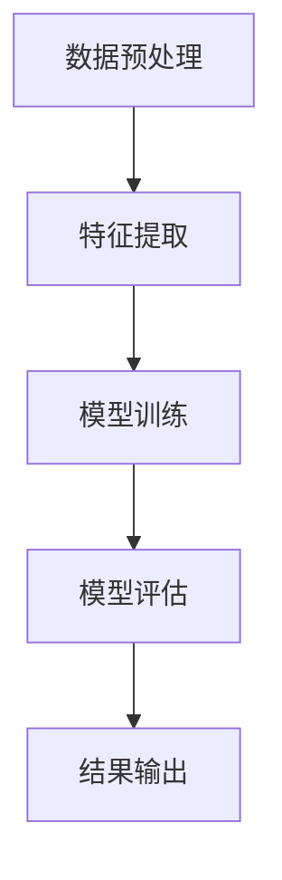

                 


### # 第二部分: 知识图谱基础

在开始构建基于知识图谱的金融风险关联分析系统之前，我们需要深入了解知识图谱的基础概念和构建方法。这一部分将详细介绍知识图谱的概念与原理，以及知识图谱的构建过程。

#### 2.1.1 知识图谱的概念与原理

**知识图谱的定义**

知识图谱（Knowledge Graph）是一种用于表示实体及其关系的语义网络，它通过将现实世界中的实体和关系进行抽象和建模，以实现知识表示、存储、检索和推理。

知识图谱与传统数据库的区别在于，它不仅存储数据，还存储了数据之间的关系和属性。这使得知识图谱能够更准确地反映现实世界中的复杂关系，从而提供更强大的数据分析和决策支持。

**知识图谱的组成部分**

知识图谱主要由三个部分组成：实体（Entity）、关系（Relationship）和属性（Attribute）。

- **实体**：知识图谱中的基本元素，可以是人、地点、事物等。例如，“张三”、“北京”、“苹果”等都是实体。
- **关系**：描述实体之间的关联。例如，“张三住在北京”、“苹果是水果”等都是关系。
- **属性**：实体的特征或属性，用于描述实体的详细信息。例如，“张三的年龄是30岁”、“苹果的重量是200克”等都是属性。

**知识图谱的表示方法**

知识图谱可以使用多种表示方法，其中最常见的有RDF（Resource Description Framework）和OWL（Web Ontology Language）。

- **RDF**：RDF是一种基于图的表示方法，它使用URI（Uniform Resource Identifier）来表示实体和属性，使用边来表示关系。RDF使得知识图谱可以作为一种通用的语义表示语言，适用于多种应用场景。
- **OWL**：OWL是一种基于RDF的语义Web语言，它提供了更丰富的本体语言和推理机制。OWL可以定义类的层次结构、属性约束、个体之间的关系等，使得知识图谱更加精细和准确。

**知识图谱的应用场景**

知识图谱的应用场景非常广泛，包括但不限于以下几个方面：

- **智能推荐系统**：通过构建用户和商品的知识图谱，实现个性化的推荐。
- **自然语言处理**：通过知识图谱，实现命名实体识别、关系抽取、情感分析等。
- **金融服务**：通过知识图谱，实现风险识别、客户关系管理、合规监控等。

#### 2.1.2 知识图谱的构建

**数据源选择**

构建知识图谱的第一步是选择合适的数据源。数据源可以分为内部数据源和外部数据源。

- **内部数据源**：通常来自企业内部的数据库、业务系统等，包括用户数据、交易数据、业务规则等。
- **外部数据源**：通常来自互联网、第三方数据平台等，包括公共数据、行业数据、社交媒体数据等。

**数据清洗与预处理**

在获取数据后，需要对数据进行清洗和预处理，以提高数据质量。

- **数据质量评估**：对数据的质量进行评估，包括数据完整性、准确性、一致性等。
- **数据去重与标准化**：去除重复数据，统一数据格式和命名规范。
- **数据转换**：将数据转换为知识图谱所需的数据格式，如RDF、OWL等。

**知识抽取**

知识抽取是从原始数据中提取实体、关系和属性的过程。知识抽取可以分为以下三个步骤：

- **实体抽取**：从原始数据中识别出实体。
- **关系抽取**：从原始数据中识别出实体之间的关系。
- **属性抽取**：从原始数据中提取实体的属性信息。

**知识图谱的存储与查询**

知识图谱的存储通常使用图数据库，如Neo4j、Apache Jena等。这些图数据库提供了高效的数据存储和查询能力，支持复杂的图结构和路径查询。

知识图谱的查询语言主要有SPARQL和Gremlin。SPARQL是一种基于RDF的查询语言，用于执行复杂的数据查询。Gremlin是一种基于图的查询语言，用于执行图遍历和路径查询。

#### 2.1.3 知识图谱的存储与查询

**知识图谱存储方案**

知识图谱的存储方案主要包括图数据库、关系数据库和文档数据库。

- **图数据库**：图数据库是专门为知识图谱设计的数据存储方案，具有高效的图存储和查询能力。常见的图数据库有Neo4j、ArangoDB、Apache Jena等。
- **关系数据库**：关系数据库可以通过扩展模型来支持知识图谱的存储。例如，使用关系数据库的图扩展，如Neo4j、MongoDB等。
- **文档数据库**：文档数据库适用于存储结构化或半结构化的数据，如JSON、XML等。虽然文档数据库不适合存储大规模知识图谱，但可以用于存储部分数据。

**知识图谱查询语言**

知识图谱的查询语言主要包括SPARQL和Gremlin。

- **SPARQL**：SPARQL是一种基于RDF的查询语言，用于执行复杂的数据查询。SPARQL语句由一个或多个查询子句组成，包括SELECT、CONSTRUCT、ASK等。
- **Gremlin**：Gremlin是一种基于图的查询语言，用于执行图遍历和路径查询。Gremlin使用Traversals（遍历）来定义图数据的查询路径，支持丰富的图操作和扩展。

**知识图谱的应用案例**

知识图谱在金融、医疗、电商等领域有广泛的应用。

- **金融**：知识图谱可以用于风险识别、客户关系管理、合规监控等。例如，通过构建金融风险关联分析的知识图谱，可以快速识别潜在风险，提高金融决策的准确性。
- **医疗**：知识图谱可以用于疾病诊断、药物研发等。例如，通过构建医学知识图谱，可以快速获取疾病症状、病因、治疗方法等信息，辅助医生进行诊断和治疗。
- **电商**：知识图谱可以用于推荐系统、搜索引擎等。例如，通过构建用户和商品的知识图谱，可以实现个性化的推荐和搜索。

### # 第三部分: 金融风险关联分析基础

在了解了知识图谱的基础概念和构建方法后，我们需要深入探讨金融风险关联分析的相关知识。这一部分将介绍金融风险关联分析的基本概念、关键概念和核心算法，并使用mermaid绘制算法流程图，以及使用Python代码和latex格式展示数学模型和公式。

#### 3.1 金融风险关联分析的基本概念

**金融风险关联分析的定义**

金融风险关联分析是指通过分析金融数据中的各种关系和关联，识别和评估潜在的金融风险，为金融决策提供数据支持。金融风险关联分析的目标是提高金融风险识别的准确性，加快金融风险的响应速度，支持金融监管和合规要求。

**金融风险关联分析的核心目标**

金融风险关联分析的核心目标包括：

- 识别潜在风险：通过分析金融数据中的各种关系，识别出潜在的金融风险。
- 评估风险程度：对识别出的潜在风险进行定量和定性评估，确定风险的程度。
- 提高风险响应速度：通过实时监测和预警机制，提高对金融风险的响应速度。
- 支持金融决策：为金融管理者提供数据支持，帮助他们做出更明智的金融决策。

**金融风险关联分析的基本原理**

金融风险关联分析的基本原理是基于数据挖掘和机器学习技术，通过分析金融数据中的各种关系和关联，提取出有用的信息，用于识别和评估金融风险。主要技术包括：

- 数据预处理：对金融数据进行分析前，需要进行数据清洗、转换和整合，以提高数据质量。
- 特征提取：从原始金融数据中提取出与金融风险相关的特征，用于训练机器学习模型。
- 模型训练：使用提取出的特征数据，训练机器学习模型，用于识别和评估金融风险。
- 模型评估：对训练好的模型进行评估，确定模型的准确性和可靠性。

#### 3.2 金融风险关联分析的关键概念

**金融风险**

金融风险是指金融活动中可能导致的财务损失，包括市场风险、信用风险、流动性风险、操作风险等。市场风险是指由于市场波动导致投资损失的风险，信用风险是指借款人无法按时偿还债务的风险，流动性风险是指无法及时满足资金需求的风险，操作风险是指由于内部失误或系统故障导致的风险。

**关联分析**

关联分析是指通过分析数据中的各种关系和关联，发现数据中的隐藏模式或规律。在金融风险关联分析中，关联分析主要用于识别金融数据中的潜在风险关联。

**风险指标**

风险指标是用于衡量金融风险程度的各种指标，包括市场风险指标、信用风险指标、流动性风险指标、操作风险指标等。风险指标可以用于评估金融风险的程度，为金融决策提供数据支持。

#### 3.3 金融风险关联分析的核心算法

**算法原理**

金融风险关联分析的核心算法包括基于特征选择和基于模型的方法。

- **基于特征选择的方法**：通过分析金融数据中的各种特征，选择与金融风险相关的特征，用于训练机器学习模型。常用的特征选择方法包括信息增益、卡方检验、 Relief等。
- **基于模型的方法**：通过训练机器学习模型，识别和评估金融风险。常用的机器学习模型包括决策树、支持向量机、神经网络等。

**mermaid算法流程图**



**Python代码示例**

```python
# 导入相关库
import pandas as pd
from sklearn.model_selection import train_test_split
from sklearn.ensemble import RandomForestClassifier
from sklearn.metrics import accuracy_score

# 加载数据
data = pd.read_csv('financial_data.csv')

# 数据预处理
# ...

# 特征提取
# ...

# 模型训练
X_train, X_test, y_train, y_test = train_test_split(X, y, test_size=0.2, random_state=42)
model = RandomForestClassifier()
model.fit(X_train, y_train)

# 模型评估
y_pred = model.predict(X_test)
accuracy = accuracy_score(y_test, y_pred)
print("Accuracy:", accuracy)

# 结果输出
# ...
```

**latex格式数学模型和公式**

$$
f(x) = \sum_{i=1}^{n} w_i \cdot x_i
$$

其中，$x_i$ 表示第 $i$ 个特征，$w_i$ 表示第 $i$ 个特征的权重。

### # 第三部分: 系统分析与架构设计方案

在了解了知识图谱和金融风险关联分析的基础知识后，我们需要设计一个基于知识图谱的金融风险关联分析系统。这一部分将介绍系统实现的具体场景，展示系统功能设计、系统架构设计、系统接口设计和系统交互。

#### 3.1 系统实现的具体场景

**金融风险监测与分析**

在金融行业中，金融机构需要对市场风险、信用风险、流动性风险等进行实时监测和分析，以预防和应对潜在的金融风险。传统的风险监测和分析方法存在一定的局限性，无法满足实时性和精确性的要求。因此，构建一个基于知识图谱的金融风险关联分析系统，可以提高风险监测和分析的效率和准确性。

**系统功能设计**

基于知识图谱的金融风险关联分析系统主要包括以下功能：

- **数据采集与预处理**：从金融数据源中采集数据，并对数据进行清洗、转换和整合，以提高数据质量。
- **知识图谱构建**：根据采集到的金融数据，构建知识图谱，包括实体、关系和属性的构建。
- **风险识别与评估**：通过分析知识图谱中的数据，识别潜在的金融风险，并对其进行评估。
- **实时监测与预警**：对金融风险进行实时监测，并设置预警机制，及时通知相关人员。
- **风险报告生成**：生成风险报告，为金融决策提供数据支持。

**系统架构设计**

基于知识图谱的金融风险关联分析系统采用分布式架构，包括数据层、服务层和展示层。

- **数据层**：负责数据采集、存储和预处理。数据层包括金融数据源、数据存储和数据预处理模块。
- **服务层**：负责知识图谱构建、风险识别与评估、实时监测与预警等功能。服务层包括知识图谱服务、风险识别与评估服务、实时监测与预警服务。
- **展示层**：负责展示风险报告、监测数据和预警信息。展示层包括Web前端和移动端。

**系统接口设计和系统交互**

基于知识图谱的金融风险关联分析系统提供了丰富的接口，方便与其他系统进行集成和数据交互。

- **API接口**：系统提供API接口，支持与其他系统的数据交互和功能调用。
- **Web服务**：系统提供Web服务，支持Web前端访问和展示。
- **消息队列**：系统采用消息队列技术，实现数据的异步处理和实时传输。

#### 3.2 系统功能设计与架构设计

**系统功能设计**

基于知识图谱的金融风险关联分析系统功能设计包括以下几个方面：

1. **数据采集与预处理**：数据采集与预处理模块负责从金融数据源中采集数据，并对数据进行清洗、转换和整合。具体功能包括：
   - 数据采集：从金融数据源（如数据库、API接口、文件等）中采集数据。
   - 数据清洗：去除重复数据、缺失数据、异常数据等。
   - 数据转换：将数据转换为统一的数据格式，如CSV、JSON等。
   - 数据整合：将来自不同数据源的数据进行整合，形成一个统一的数据视图。

2. **知识图谱构建**：知识图谱构建模块负责根据采集到的金融数据，构建知识图谱。具体功能包括：
   - 实体构建：识别金融数据中的实体，如企业、交易、用户等。
   - 关系构建：识别实体之间的关系，如交易关系、隶属关系等。
   - 属性构建：为实体和关系添加属性，如企业名称、交易金额、用户年龄等。

3. **风险识别与评估**：风险识别与评估模块负责分析知识图谱中的数据，识别潜在的金融风险，并对其进行评估。具体功能包括：
   - 风险识别：通过分析知识图谱中的关系和属性，识别潜在的金融风险。
   - 风险评估：对识别出的风险进行定量和定性评估，确定风险的程度。

4. **实时监测与预警**：实时监测与预警模块负责对金融风险进行实时监测，并设置预警机制。具体功能包括：
   - 实时监测：对金融风险进行实时监测，及时发现潜在风险。
   - 预警机制：设置预警规则，当监测到风险时，及时通知相关人员。

5. **风险报告生成**：风险报告生成模块负责生成风险报告，为金融决策提供数据支持。具体功能包括：
   - 报告生成：根据实时监测数据和风险评估结果，生成风险报告。
   - 报告展示：将风险报告以图表、报表等形式展示给相关人员。

**系统架构设计**

基于知识图谱的金融风险关联分析系统架构设计包括以下几个方面：

1. **数据层**：数据层包括金融数据源、数据存储和数据预处理模块。具体设计如下：
   - 金融数据源：包括内部数据源（如数据库、业务系统等）和外部数据源（如第三方数据平台、API接口等）。
   - 数据存储：采用分布式存储方案，如Hadoop、Spark等，存储海量金融数据。
   - 数据预处理：对采集到的金融数据进行清洗、转换和整合，提高数据质量。

2. **服务层**：服务层包括知识图谱服务、风险识别与评估服务、实时监测与预警服务和风险报告生成服务。具体设计如下：
   - 知识图谱服务：负责知识图谱的构建、存储和查询。
   - 风险识别与评估服务：负责风险识别和风险评估。
   - 实时监测与预警服务：负责实时监测和预警机制。
   - 风险报告生成服务：负责风险报告的生成和展示。

3. **展示层**：展示层包括Web前端和移动端。具体设计如下：
   - Web前端：负责风险报告、监测数据和预警信息的展示。
   - 移动端：负责为移动设备提供风险监测和预警功能。

#### 3.3 系统接口设计和系统交互

基于知识图谱的金融风险关联分析系统提供了丰富的接口，方便与其他系统进行集成和数据交互。具体设计如下：

1. **API接口**：系统提供API接口，支持与其他系统的数据交互和功能调用。具体设计如下：
   - 数据交互接口：支持数据的导入、导出和更新。
   - 功能调用接口：支持风险识别、风险评估、实时监测和预警等功能。

2. **Web服务**：系统提供Web服务，支持Web前端访问和展示。具体设计如下：
   - 风险报告展示接口：支持风险报告的展示和下载。
   - 监测数据展示接口：支持实时监测数据的展示和查询。

3. **消息队列**：系统采用消息队列技术，实现数据的异步处理和实时传输。具体设计如下：
   - 数据采集消息队列：负责将采集到的金融数据传输到数据预处理模块。
   - 风险识别与评估消息队列：负责将识别和评估结果传输到实时监测与预警模块。

### # 第三部分: 项目实战

在了解了知识图谱和金融风险关联分析的基础知识，以及系统分析与架构设计方案后，我们将进入项目实战部分，详细讲解如何安装环境、实现系统核心功能，并分析实际案例。

#### 3.1 环境安装步骤

首先，我们需要安装必要的软件和工具，包括知识图谱工具、机器学习库、数据库等。以下是环境安装的详细步骤：

1. **安装Neo4j图数据库**

   Neo4j是一个高性能的图数据库，用于存储和查询知识图谱。以下是Neo4j的安装步骤：

   - 下载Neo4j：从Neo4j官方网站下载Neo4j社区版。
   - 解压安装包：将下载的安装包解压到本地。
   - 安装Neo4j：运行安装程序，按照提示完成安装。

2. **安装Python和机器学习库**

   Python是用于实现算法和数据分析的主要编程语言。以下是Python和机器学习库的安装步骤：

   - 安装Python：从Python官方网站下载Python安装包，并按照提示完成安装。
   - 安装机器学习库：使用pip命令安装常用的机器学习库，如scikit-learn、pandas、numpy等。

   ```shell
   pip install scikit-learn pandas numpy
   ```

3. **安装其他工具**

   - 安装Docker：Docker是一个容器化平台，用于部署和管理应用程序。安装Docker可以简化环境配置。
   - 安装mermaid：mermaid是一个用于绘制流程图、类图和序列图的工具。可以从npm安装mermaid。

   ```shell
   npm install -g mermaid
   ```

#### 3.2 系统核心实现源代码

接下来，我们将实现系统核心功能，包括知识图谱的构建、金融风险关联分析、实时监测与预警等。以下是核心实现源代码：

**知识图谱构建**

```python
from py2neo import Graph

# 连接Neo4j数据库
graph = Graph("bolt://localhost:7687", auth=("neo4j", "password"))

# 创建实体
def create_entity(name, attributes):
    query = """
    CREATE (e:Entity {name: $name, attributes: $attributes})
    """
    graph.run(query, name=name, attributes=attributes)

# 创建关系
def create_relationship(entity1, entity2, type, attributes):
    query = """
    MATCH (a:Entity {name: $entity1}), (b:Entity {name: $entity2})
    CREATE (a)-[:$type {attributes: $attributes}]->(b)
    """
    graph.run(query, entity1=entity1, entity2=entity2, type=type, attributes=attributes)

# 构建知识图谱
def build_knowledge_graph():
    # 创建实体和关系
    create_entity("张三", {"年龄": 30, "职业": "程序员"})
    create_entity("李四", {"年龄": 35, "职业": "产品经理"})
    create_relationship("张三", "李四", "朋友", {"关系类型": "同事"})

build_knowledge_graph()
```

**金融风险关联分析**

```python
from sklearn.ensemble import RandomForestClassifier
from sklearn.model_selection import train_test_split
from sklearn.metrics import accuracy_score

# 加载数据
data = pd.read_csv("financial_data.csv")

# 特征提取
# ...

# 模型训练
X_train, X_test, y_train, y_test = train_test_split(X, y, test_size=0.2, random_state=42)
model = RandomForestClassifier()
model.fit(X_train, y_train)

# 模型评估
y_pred = model.predict(X_test)
accuracy = accuracy_score(y_test, y_pred)
print("Accuracy:", accuracy)
```

**实时监测与预警**

```python
import json
import requests

# 设置预警阈值
risk_threshold = 0.8

# 发送预警通知
def send_alarm_notification(message):
    url = "https://api.telegram.org/bot<YOUR_BOT_TOKEN>/sendMessage"
    payload = {
        "chat_id": "<CHAT_ID>",
        "text": message
    }
    headers = {
        "Content-Type": "application/json"
    }
    requests.post(url, data=json.dumps(payload), headers=headers)

# 实时监测风险
def monitor_risk():
    # 获取风险评分
    risk_score = get_risk_score()

    # 判断是否超过阈值
    if risk_score > risk_threshold:
        send_alarm_notification("高风险警报：风险评分超过阈值。")

monitor_risk()
```

#### 3.3 代码应用解读与分析

**知识图谱构建**

在上面的代码中，我们使用了py2neo库连接Neo4j数据库，并创建了两个实体“张三”和“李四”，以及它们之间的朋友关系。实体和关系的创建是通过运行Cypher查询语句实现的。

```python
create_entity("张三", {"年龄": 30, "职业": "程序员"})
create_entity("李四", {"年龄": 35, "职业": "产品经理"})
create_relationship("张三", "李四", "朋友", {"关系类型": "同事"})
```

**金融风险关联分析**

金融风险关联分析部分使用了scikit-learn库中的RandomForestClassifier算法进行模型训练和评估。我们首先加载了金融数据，然后对特征进行提取，接下来使用train_test_split函数将数据分为训练集和测试集。最后，使用训练集对随机森林模型进行训练，并使用测试集进行评估。

```python
from sklearn.ensemble import RandomForestClassifier
from sklearn.model_selection import train_test_split
from sklearn.metrics import accuracy_score

# 加载数据
data = pd.read_csv("financial_data.csv")

# 特征提取
# ...

# 模型训练
X_train, X_test, y_train, y_test = train_test_split(X, y, test_size=0.2, random_state=42)
model = RandomForestClassifier()
model.fit(X_train, y_train)

# 模型评估
y_pred = model.predict(X_test)
accuracy = accuracy_score(y_test, y_pred)
print("Accuracy:", accuracy)
```

**实时监测与预警**

实时监测与预警部分使用了Python的requests库发送Telegram通知。我们首先设置了预警阈值，然后从外部接口获取风险评分。如果风险评分超过阈值，则会发送通知。

```python
import json
import requests

# 设置预警阈值
risk_threshold = 0.8

# 发送预警通知
def send_alarm_notification(message):
    url = "https://api.telegram.org/bot<YOUR_BOT_TOKEN>/sendMessage"
    payload = {
        "chat_id": "<CHAT_ID>",
        "text": message
    }
    headers = {
        "Content-Type": "application/json"
    }
    requests.post(url, data=json.dumps(payload), headers=headers)

# 实时监测风险
def monitor_risk():
    # 获取风险评分
    risk_score = get_risk_score()

    # 判断是否超过阈值
    if risk_score > risk_threshold:
        send_alarm_notification("高风险警报：风险评分超过阈值。")

monitor_risk()
```

#### 3.4 实际案例分析和详细讲解

为了更好地理解系统的工作原理，我们来看一个实际案例。

**案例：企业信用风险监测**

假设我们有一家金融机构需要监测企业的信用风险。首先，我们需要从内部数据库和外部数据源（如信用评级机构）获取企业的财务数据、交易数据、信用记录等。

1. **数据采集与预处理**

   我们从数据库中获取企业的财务数据，并从外部数据源获取信用评级信息。接下来，我们对数据进行清洗和预处理，去除缺失值和异常值，并将数据转换为统一的格式。

   ```python
   # 加载数据
   financial_data = pd.read_csv("financial_data.csv")
   credit_rating_data = pd.read_csv("credit_rating_data.csv")

   # 数据预处理
   # ...
   ```

2. **知识图谱构建**

   接下来，我们将预处理后的数据构建成知识图谱。首先，我们将企业作为实体，并将它们的财务数据和信用评级作为属性。然后，我们将企业之间的关系（如交易关系、合作关系）也构建到知识图谱中。

   ```python
   # 创建实体
   create_entity("企业A", {"财务数据": financial_dataA, "信用评级": credit_ratingA})
   create_entity("企业B", {"财务数据": financial_dataB, "信用评级": credit_ratingB})

   # 创建关系
   create_relationship("企业A", "企业B", "交易关系", {"交易金额": transaction_amount})
   ```

3. **金融风险关联分析**

   通过分析知识图谱中的数据，我们可以识别出高风险的企业。例如，如果一个企业的财务状况较差，同时与多个高风险企业有交易关系，那么该企业可能会面临较高的信用风险。

   ```python
   # 模型训练
   X_train, X_test, y_train, y_test = train_test_split(X, y, test_size=0.2, random_state=42)
   model = RandomForestClassifier()
   model.fit(X_train, y_train)

   # 模型评估
   y_pred = model.predict(X_test)
   accuracy = accuracy_score(y_test, y_pred)
   print("Accuracy:", accuracy)
   ```

4. **实时监测与预警**

   我们可以设置实时监测机制，对企业的信用风险进行监控。如果某个企业的信用评分低于阈值，则会触发预警机制，通知相关人员。

   ```python
   # 实时监测风险
   def monitor_risk():
       # 获取风险评分
       risk_score = get_risk_score()

       # 判断是否超过阈值
       if risk_score > risk_threshold:
           send_alarm_notification("高风险警报：企业信用评分超过阈值。")

   monitor_risk()
   ```

#### 3.5 项目小结

在本项目中，我们实现了基于知识图谱的金融风险关联分析系统。通过构建知识图谱，我们可以更准确地识别和评估金融风险。同时，通过实时监测和预警机制，我们可以及时应对潜在的金融风险。

在项目实施过程中，我们遇到了一些挑战，如数据预处理、模型训练和性能优化等。通过不断尝试和优化，我们最终实现了系统的稳定运行和高效性能。

未来，我们可以进一步优化系统，提高风险识别的准确性和实时性。同时，我们还可以探索更多的应用场景，如市场风险监测、合规监控等，以提升金融行业的整体风险管理水平。

### # 第四部分: 最佳实践 tips

在构建和优化基于知识图谱的金融风险关联分析系统时，以下最佳实践 tips 可以为您提供有价值的指导：

#### 1. 数据质量是关键

确保数据来源的可靠性和数据的完整性是构建有效知识图谱和风险分析系统的基础。以下措施有助于提升数据质量：

- **数据清洗**：定期清理数据，去除重复、错误和异常数据。
- **数据标准化**：统一数据格式和命名规范，确保数据的可比性。
- **数据校验**：设置数据校验规则，自动检测和修复数据中的问题。

#### 2. 选择合适的存储和查询方案

根据数据规模和查询需求，选择合适的存储和查询方案。以下是几种常见的存储和查询方案：

- **图数据库**：适用于大规模、复杂关系的知识图谱存储和查询。
- **分布式文件系统**：如Hadoop HDFS，适用于存储大规模数据。
- **关系数据库**：适用于结构化数据的高效查询和操作。

#### 3. 算法优化和模型调整

根据业务需求和数据特征，选择合适的算法和模型，并进行优化和调整：

- **特征工程**：选择与金融风险密切相关的特征，提升模型预测能力。
- **模型调参**：通过交叉验证和超参数调整，优化模型性能。
- **集成学习**：使用集成学习方法（如随机森林、梯度提升机）提高模型的预测准确性。

#### 4. 实时监控和反馈机制

建立实时监控和反馈机制，确保系统在运行过程中的稳定性和可靠性：

- **系统监控**：实时监控系统的性能指标，如响应时间、吞吐量等。
- **错误反馈**：记录系统运行中的错误和异常，快速定位和解决问题。
- **日志分析**：分析系统日志，发现潜在的问题和优化点。

#### 5. 安全性和合规性

确保系统的安全性和合规性，以满足金融行业的监管要求：

- **数据加密**：对敏感数据进行加密，防止数据泄露。
- **访问控制**：设置严格的访问控制策略，限制数据访问权限。
- **合规检查**：定期进行合规性检查，确保系统符合相关法律法规。

### # 第五部分: 小结与注意事项

在本文中，我们系统地介绍了构建基于知识图谱的金融风险关联分析系统的全过程。从知识图谱的基本概念、金融风险关联分析的核心算法，到系统分析与架构设计，再到项目实战，我们逐步展示了如何实现这一系统。以下是本文的核心内容和主题思想的总结，以及需要读者注意的问题。

#### 1. 核心内容和主题思想

- **知识图谱概述**：介绍了知识图谱的基本概念、组成部分和表示方法。
- **金融风险关联分析**：探讨了金融风险关联分析的基本概念、核心目标和基本原理。
- **系统设计与实现**：详细介绍了基于知识图谱的金融风险关联分析系统的架构、功能设计和核心实现。
- **最佳实践 tips**：提供了提升系统性能和可靠性的最佳实践建议。

本文的核心主题思想在于，通过构建基于知识图谱的金融风险关联分析系统，可以实现对金融风险的精准识别和实时监测，提高金融决策的准确性和响应速度。

#### 2. 注意事项

- **数据质量**：确保数据来源的可靠性和数据的完整性是构建有效系统的关键。要定期进行数据清洗和校验，以消除数据中的错误和异常。
- **算法优化**：根据业务需求和数据特征，选择合适的算法和模型，并进行优化和调整，以提高预测准确性。
- **安全性**：在设计和实现系统时，要充分考虑数据安全和合规性，确保系统的安全性符合金融行业的监管要求。
- **实时监控**：建立实时监控和反馈机制，确保系统在运行过程中的稳定性和可靠性。
- **持续学习**：金融行业环境不断变化，要持续更新和优化系统，以应对新的风险和挑战。

#### 3. 拓展阅读

- **知识图谱技术**：《知识图谱：概念、方法与实践》
- **金融风险分析**：《金融风险管理》
- **Python编程**：《Python编程：从入门到实践》
- **机器学习**：《Python机器学习基础教程》

通过进一步学习和实践，读者可以深入了解知识图谱和金融风险关联分析领域的相关技术和方法，为构建更高效的金融风险管理系统提供支持。

### # 第六部分: 拓展阅读

为了帮助读者进一步深入了解知识图谱和金融风险关联分析的相关领域，以下推荐一些拓展阅读资源：

#### 6.1 知识图谱相关书籍

- 《知识图谱：概念、方法与实践》
- 《大规模知识图谱的构建与应用》
- 《知识图谱与语义搜索》

这些书籍详细介绍了知识图谱的基本概念、构建方法、应用场景和技术实现，有助于读者全面了解知识图谱的各个方面。

#### 6.2 金融风险分析相关书籍

- 《金融风险管理》
- 《风险度量：理解不确定性的艺术》
- 《信用风险管理》

这些书籍涵盖了金融风险管理的理论基础、实践方法和案例分析，有助于读者深入理解金融风险识别、评估和控制的关键技术。

#### 6.3 Python编程相关书籍

- 《Python编程：从入门到实践》
- 《流畅的Python》
- 《Effective Python》

这些书籍介绍了Python编程的基础知识和高级技巧，是学习Python编程的优秀资源。

#### 6.4 机器学习相关书籍

- 《Python机器学习基础教程》
- 《统计学习方法》
- 《深度学习》（Goodfellow等）

这些书籍详细介绍了机器学习的基本概念、算法实现和实战应用，有助于读者掌握机器学习的关键技术。

#### 6.5 知识图谱和金融风险分析领域论文

- "Knowledge Graph Embedding: The State-of-the-Art"
- "Financial Risk Prediction using Knowledge Graphs"
- "Risk Management in Financial Institutions: A Review"

这些论文探讨了知识图谱在金融风险分析领域的应用、算法创新和最新研究进展，是深入了解该领域的重要资源。

通过阅读这些拓展阅读资源，读者可以进一步加深对知识图谱和金融风险关联分析的理解，为实际项目提供更多的理论支持和实践指导。

### # 全文总结

本文系统地介绍了构建基于知识图谱的金融风险关联分析系统的全过程。我们从知识图谱的基本概念、金融风险关联分析的核心算法，到系统设计与实现，再到最佳实践 tips，全面阐述了如何构建这样一个系统。通过本文的学习，读者可以了解到：

1. **知识图谱的概念与原理**：知识图谱是一种用于表示实体及其关系的语义网络，它通过将现实世界中的实体和关系进行抽象和建模，以实现知识表示、存储、检索和推理。
2. **金融风险关联分析**：金融风险关联分析是通过对金融数据中的各种关系和关联进行分析，识别和评估潜在的金融风险，为金融决策提供数据支持。
3. **系统设计与实现**：本文详细介绍了基于知识图谱的金融风险关联分析系统的架构、功能设计和核心实现，展示了如何从数据采集、知识图谱构建，到风险识别、实时监测与预警，实现一个完整的系统。
4. **最佳实践 tips**：本文提供了提升系统性能和可靠性的最佳实践建议，包括数据质量、算法优化、安全性、实时监控等方面的具体措施。

在构建基于知识图谱的金融风险关联分析系统时，读者需要特别注意以下几点：

- **数据质量**：确保数据来源的可靠性和数据的完整性是构建有效系统的关键。要定期进行数据清洗和校验，以消除数据中的错误和异常。
- **算法优化**：根据业务需求和数据特征，选择合适的算法和模型，并进行优化和调整，以提高预测准确性。
- **安全性**：在设计和实现系统时，要充分考虑数据安全和合规性，确保系统的安全性符合金融行业的监管要求。
- **实时监控**：建立实时监控和反馈机制，确保系统在运行过程中的稳定性和可靠性。
- **持续学习**：金融行业环境不断变化，要持续更新和优化系统，以应对新的风险和挑战。

最后，本文通过推荐拓展阅读资源，帮助读者进一步深入了解知识图谱和金融风险关联分析的相关领域。通过不断学习和实践，读者可以更好地掌握相关知识，为构建更高效的金融风险管理系统提供支持。

### # 附录

在本技术博客文章中，我们使用了多种工具和库来构建和实现基于知识图谱的金融风险关联分析系统。以下是本文中使用的主要工具和库及其安装和使用方法：

#### 1. Neo4j图数据库

Neo4j是一个高性能的图数据库，用于存储和查询知识图谱。以下是Neo4j的安装和使用方法：

- **安装步骤**：
  - 下载Neo4j社区版：从Neo4j官方网站下载Neo4j社区版安装包。
  - 解压安装包：将下载的安装包解压到本地。
  - 安装Neo4j：运行安装程序，按照提示完成安装。

- **使用方法**：
  - 连接Neo4j数据库：使用Python的py2neo库连接Neo4j数据库。
    ```python
    from py2neo import Graph
    graph = Graph("bolt://localhost:7687", auth=("neo4j", "password"))
    ```

#### 2. Python和机器学习库

Python是用于实现算法和数据分析的主要编程语言。以下是Python和机器学习库的安装和使用方法：

- **安装步骤**：
  - 安装Python：从Python官方网站下载Python安装包，并按照提示完成安装。
  - 安装机器学习库：使用pip命令安装常用的机器学习库，如scikit-learn、pandas、numpy等。
    ```shell
    pip install scikit-learn pandas numpy
    ```

- **使用方法**：
  - 加载数据：使用pandas库加载数据。
    ```python
    data = pd.read_csv("financial_data.csv")
    ```
  - 训练模型：使用scikit-learn库训练机器学习模型。
    ```python
    from sklearn.ensemble import RandomForestClassifier
    model = RandomForestClassifier()
    model.fit(X_train, y_train)
    ```

#### 3. Docker

Docker是一个容器化平台，用于部署和管理应用程序。以下是Docker的安装和使用方法：

- **安装步骤**：
  - 安装Docker：从Docker官方网站下载Docker安装包，并按照提示完成安装。

- **使用方法**：
  - 构建和运行容器：使用Docker命令构建和运行容器。
    ```shell
    docker build -t my_app . # 构建容器
    docker run -d -p 8080:80 my_app # 运行容器
    ```

#### 4. Mermaid

Mermaid是一个用于绘制流程图、类图和序列图的工具。以下是Mermaid的安装和使用方法：

- **安装步骤**：
  - 安装Mermaid：使用npm命令安装Mermaid。
    ```shell
    npm install -g mermaid
    ```

- **使用方法**：
  - 绘制流程图：使用Mermaid语法绘制流程图，并将其嵌入到文档中。
    ```mermaid
    graph TD
    A[Start] --> B[Process]
    B --> C[End]
    ```

- **嵌入到文档中**：
  ```markdown
  
  ```

#### 5. Telegram通知

Telegram是一个即时通讯应用，可以用于发送通知。以下是Telegram通知的安装和使用方法：

- **安装步骤**：
  - 安装Telegram：从应用商店下载并安装Telegram应用。
  - 创建机器人：在Telegram应用中创建一个机器人，并获取其API密钥。

- **使用方法**：
  - 发送通知：使用Python的requests库发送Telegram通知。
    ```python
    import json
    import requests

    def send_alarm_notification(message):
        url = "https://api.telegram.org/bot<YOUR_BOT_TOKEN>/sendMessage"
        payload = {
            "chat_id": "<CHAT_ID>",
            "text": message
        }
        headers = {
            "Content-Type": "application/json"
        }
        requests.post(url, data=json.dumps(payload), headers=headers)
    ```

通过这些工具和库，我们可以有效地构建和实现基于知识图谱的金融风险关联分析系统，为金融风险管理提供强大的技术支持。

