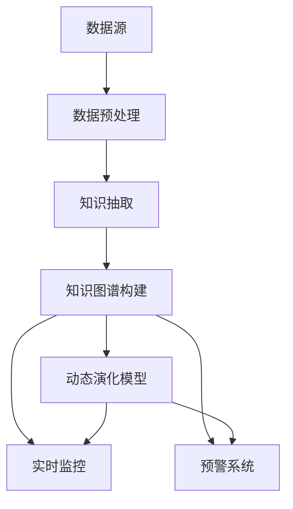

                 


### 第一部分：引言

#### 1.1 问题背景

##### 1.1.1 金融风险管理的现状

金融风险管理是金融领域中不可或缺的一部分，其核心在于识别、评估和缓解金融活动中可能出现的各种风险。风险管理的重要性不言而喻，它不仅关乎金融机构自身的生存与发展，也影响着整个金融市场的稳定与繁荣。目前，金融风险管理主要依赖于传统的风险模型和预测方法，如统计模型、机器学习和深度学习算法等。然而，随着金融市场的日益复杂化和全球化，传统的风险管理方法面临着诸多挑战：

- **数据处理能力不足**：金融领域的数据量庞大且来源多样，传统方法在处理和分析这些数据时往往力不从心，难以快速准确地提取有效信息。
- **风险预测准确性不高**：金融市场的波动性和不确定性使得传统风险模型的预测准确性受到限制，经常出现误判和漏判现象。

##### 1.1.2 现有金融风险关联网络的局限性

现有的金融风险关联网络主要基于传统的数据挖掘和机器学习技术，其局限性主要体现在以下几个方面：

- **数据处理能力不足**：由于数据的多样性和复杂性，现有方法在数据采集、整合和预处理方面存在较大困难，导致风险关联网络构建的准确性受到限制。
- **风险预测准确性不高**：现有方法通常依赖于单一的预测模型，对于金融市场中的复杂关联性和非线性关系难以捕捉，导致风险预测的准确性不高。

##### 1.1.3 知识图谱在金融风险管理中的应用潜力

知识图谱作为一种新型的数据表示和组织方式，具有高度的抽象能力和语义表达能力，能够有效地解决传统方法在金融风险管理中面临的挑战。知识图谱在金融风险管理中的应用潜力主要体现在以下几个方面：

- **知识图谱的概念与特点**：知识图谱通过实体、关系和属性来组织数据，能够实现对复杂关系的全面捕捉和语义理解。
- **风险关联网络的构建**：知识图谱可以用于构建金融风险关联网络，通过实体和关系的关联，实现对金融风险因素的全面分析和理解。
- **风险预测与预警**：知识图谱能够基于实体和关系的关联，进行风险预测和预警，提高风险管理的准确性和及时性。

#### 1.2 本书目标与结构

本书的目标是深入探讨知识图谱在金融风险管理中的应用，构建基于知识图谱的金融风险关联网络动态演化系统。具体目标包括：

- **理解知识图谱在金融风险管理中的应用**：介绍知识图谱的基本原理和特点，阐述其在金融风险管理中的应用价值。
- **构建基于知识图谱的金融风险关联网络**：详细讲解金融风险关联网络的构建方法，包括数据预处理、知识抽取和风险关联网络构建等。
- **实现金融风险关联网络的动态演化系统**：设计动态演化模型，实现金融风险关联网络的实时监控和动态调整。

本书的结构安排如下：

- **第1章 引言**：介绍金融风险管理的现状、现有风险关联网络的局限性以及知识图谱在金融风险管理中的应用潜力。
- **第2章 知识图谱概述**：介绍知识图谱的基本概念、组成要素和应用场景。
- **第3章 金融风险关联网络构建基础**：讲解金融风险关联网络构建的基础知识，包括数据预处理、知识抽取等。
- **第4章 基于知识图谱的金融风险关联网络模型**：介绍基于知识图谱的金融风险关联网络模型，包括实体、关系和属性的表示。
- **第5章 金融风险关联网络动态演化模型**：设计动态演化模型，实现金融风险关联网络的实时监控和动态调整。
- **第6章 系统架构与实现**：介绍金融风险关联网络动态演化系统的架构设计、接口设计和实现方法。
- **第7章 项目实战与案例分析**：通过实际项目案例，展示金融风险关联网络动态演化系统的应用效果。
- **第8章 总结与展望**：总结本书的主要内容，展望知识图谱在金融风险管理领域的未来发展趋势。

通过本书的阅读，读者将能够深入理解知识图谱在金融风险管理中的应用，掌握构建基于知识图谱的金融风险关联网络动态演化系统的方法，为金融风险管理提供新的技术手段和解决方案。

---

### 第一部分：引言

#### 1.1 问题背景

##### 1.1.1 金融风险管理的现状

在当今高度全球化和数字化的金融市场中，风险管理已成为金融机构生存和发展的关键。金融风险管理涉及识别、评估、监控和缓解各种可能影响金融机构运作的风险，包括信用风险、市场风险、操作风险、法律风险和流动性风险等。其目的是确保金融机构在面临各种不确定性因素时，能够维持稳健的经营状态，保护资产和客户的利益。

风险管理的重要性体现在多个方面。首先，有效的风险管理有助于降低金融机构的运营成本，避免因风险事件导致的巨额损失。其次，风险管理有助于增强金融机构的市场竞争力，通过合理的风险控制和投资策略，提高资本利用效率。最后，风险管理有助于维护金融市场的稳定，防止系统性风险的发生，保障金融体系的健康运行。

在当前金融风险管理实践中，传统的风险模型和预测方法仍然占据主导地位。这些方法主要包括统计模型、机器学习和深度学习算法等。统计模型通过历史数据分析和统计推断来预测未来风险，如线性回归、逻辑回归和主成分分析等。机器学习和深度学习算法则利用大量数据进行特征提取和学习，如支持向量机（SVM）、决策树、神经网络和深度神经网络等。这些方法在某种程度上提高了风险预测的准确性和效率，但仍然存在一些局限性。

- **数据处理能力不足**：金融领域的数据量庞大且来源多样，包括交易数据、客户数据、市场数据等。传统方法在处理和分析这些数据时往往力不从心，难以快速准确地提取有效信息，导致风险识别和评估的准确性受到限制。

- **风险预测准确性不高**：金融市场的波动性和不确定性使得传统风险模型的预测准确性受到限制，经常出现误判和漏判现象。此外，传统方法通常依赖于单一的预测模型，对于金融市场中的复杂关联性和非线性关系难以捕捉，导致风险预测的准确性不高。

##### 1.1.2 现有金融风险关联网络的局限性

现有的金融风险关联网络主要基于传统的数据挖掘和机器学习技术，通过构建节点和边的网络结构来表示金融风险因素及其相互关系。这种网络结构在某种程度上能够揭示金融风险之间的潜在关联，但仍然存在一些局限性。

- **数据处理能力不足**：金融风险关联网络的构建依赖于大量的数据，包括内部数据和外部数据。然而，传统方法在数据采集、整合和预处理方面存在较大困难，难以充分利用这些数据的价值，导致风险关联网络的构建存在偏差和不完整性。

- **风险预测准确性不高**：现有金融风险关联网络通常采用简单的统计模型或机器学习算法来预测风险，难以捕捉金融风险因素的复杂性和非线性关系。此外，风险关联网络的预测结果往往依赖于特定的数据集和算法参数，缺乏普适性和鲁棒性。

##### 1.1.3 知识图谱在金融风险管理中的应用潜力

知识图谱作为一种新型的数据表示和组织方式，具有高度的抽象能力和语义表达能力，能够有效地解决传统方法在金融风险管理中面临的挑战。知识图谱在金融风险管理中的应用潜力主要体现在以下几个方面：

- **知识图谱的概念与特点**：知识图谱通过实体、关系和属性来组织数据，能够实现对复杂关系的全面捕捉和语义理解。实体表示金融风险因素，如客户、交易、市场等；关系表示实体之间的关联，如信用借贷、市场波动等；属性表示实体的特征和属性，如客户的信用评分、市场的交易量等。

- **风险关联网络的构建**：知识图谱可以用于构建金融风险关联网络，通过实体和关系的关联，实现对金融风险因素的全面分析和理解。知识图谱能够有效地整合和关联来自不同来源的数据，提高风险识别和评估的准确性。

- **风险预测与预警**：知识图谱能够基于实体和关系的关联，进行风险预测和预警。通过分析实体之间的交互关系，知识图谱能够发现潜在的风险信号，提前预警可能的风险事件。此外，知识图谱还可以利用机器学习和深度学习算法，进一步提高风险预测的准确性和及时性。

知识图谱在金融风险管理中的应用前景广阔，有望为金融机构提供更智能、更高效的风险管理解决方案。通过构建基于知识图谱的金融风险关联网络动态演化系统，金融机构能够更全面、准确地识别和评估风险，提高风险管理的水平。

---

#### 1.2 本书目标与结构

本书旨在深入探讨知识图谱在金融风险管理中的应用，通过构建基于知识图谱的金融风险关联网络动态演化系统，为金融机构提供更智能、更高效的风险管理解决方案。具体目标包括：

1. **理解知识图谱在金融风险管理中的应用**：介绍知识图谱的基本原理和特点，阐述其在金融风险管理中的应用价值。通过详细讲解知识图谱的构建方法和应用场景，帮助读者掌握知识图谱在金融风险管理中的基本概念和操作方法。

2. **构建基于知识图谱的金融风险关联网络**：详细讲解金融风险关联网络的构建方法，包括数据预处理、知识抽取和风险关联网络构建等。通过实例分析，展示知识图谱在金融风险管理中的实际应用效果，帮助读者理解知识图谱在构建金融风险关联网络中的作用。

3. **实现金融风险关联网络的动态演化系统**：设计动态演化模型，实现金融风险关联网络的实时监控和动态调整。通过系统架构设计和实现方法的讲解，帮助读者掌握构建金融风险关联网络动态演化系统的关键技术。

本书的结构安排如下：

- **第1章 引言**：介绍金融风险管理的现状、现有风险关联网络的局限性以及知识图谱在金融风险管理中的应用潜力。阐述本书的目标和结构，为后续章节的内容打下基础。

- **第2章 知识图谱概述**：介绍知识图谱的基本概念、组成要素和应用场景。详细讲解知识图谱在金融风险管理中的应用，帮助读者建立对知识图谱的基本理解。

- **第3章 金融风险关联网络构建基础**：讲解金融风险关联网络构建的基础知识，包括数据预处理、知识抽取等。介绍构建金融风险关联网络的步骤和方法，为后续章节的内容提供技术支持。

- **第4章 基于知识图谱的金融风险关联网络模型**：介绍基于知识图谱的金融风险关联网络模型，包括实体、关系和属性的表示。通过实例分析，展示金融风险关联网络的构建过程和应用效果。

- **第5章 金融风险关联网络动态演化模型**：设计动态演化模型，实现金融风险关联网络的实时监控和动态调整。详细讲解动态演化模型的设计原理和实现方法，为金融机构提供有效的风险管理工具。

- **第6章 系统架构与实现**：介绍金融风险关联网络动态演化系统的架构设计、接口设计和实现方法。通过系统架构图和接口设计的讲解，帮助读者理解系统的工作原理和实现过程。

- **第7章 项目实战与案例分析**：通过实际项目案例，展示金融风险关联网络动态演化系统的应用效果。详细讲解项目实施过程、系统实现方法和效果评估，为读者提供实践经验。

- **第8章 总结与展望**：总结本书的主要内容，回顾知识图谱在金融风险管理中的应用和发展趋势。展望未来知识图谱在金融风险管理领域的研究方向和应用前景。

通过本书的学习，读者将能够深入理解知识图谱在金融风险管理中的应用，掌握构建基于知识图谱的金融风险关联网络动态演化系统的关键技术，为金融机构提供创新性的风险管理解决方案。

---

### 1.3 本书主要内容

本书将通过八个章节详细探讨知识图谱在金融风险管理中的应用，旨在为读者提供全面、系统的知识体系，帮助金融机构构建高效的金融风险关联网络动态演化系统。以下是本书各章节的主要内容概述：

- **第1章 引言**：本章介绍了金融风险管理的现状、现有风险关联网络的局限性以及知识图谱在金融风险管理中的应用潜力。通过阐述本书的目标和结构，为后续章节的内容打下基础。

- **第2章 知识图谱概述**：本章详细介绍了知识图谱的基本概念、组成要素和应用场景。通过实例分析，帮助读者建立对知识图谱的基本理解，为后续章节的实践应用提供理论基础。

- **第3章 金融风险关联网络构建基础**：本章讲解了金融风险关联网络构建的基础知识，包括数据预处理、知识抽取等。通过实例分析，展示了构建金融风险关联网络的步骤和方法。

- **第4章 基于知识图谱的金融风险关联网络模型**：本章介绍了基于知识图谱的金融风险关联网络模型，包括实体、关系和属性的表示。通过实例分析，展示了金融风险关联网络的构建过程和应用效果。

- **第5章 金融风险关联网络动态演化模型**：本章设计动态演化模型，实现金融风险关联网络的实时监控和动态调整。通过详细讲解动态演化模型的设计原理和实现方法，为金融机构提供有效的风险管理工具。

- **第6章 系统架构与实现**：本章介绍了金融风险关联网络动态演化系统的架构设计、接口设计和实现方法。通过系统架构图和接口设计的讲解，帮助读者理解系统的工作原理和实现过程。

- **第7章 项目实战与案例分析**：本章通过实际项目案例，展示金融风险关联网络动态演化系统的应用效果。详细讲解项目实施过程、系统实现方法和效果评估，为读者提供实践经验。

- **第8章 总结与展望**：本章总结了本书的主要内容，回顾了知识图谱在金融风险管理中的应用和发展趋势。展望未来知识图谱在金融风险管理领域的研究方向和应用前景。

通过以上章节的深入学习和实践，读者将能够全面掌握知识图谱在金融风险管理中的应用，为金融机构提供创新性的风险管理解决方案。

---

### 1.4 关键词

**知识图谱**、**金融风险管理**、**风险关联网络**、**动态演化模型**、**数据预处理**、**知识抽取**、**实时监控**。

---

### 1.5 摘要

本文探讨了知识图谱在金融风险管理中的应用，通过构建基于知识图谱的金融风险关联网络动态演化系统，实现了对金融风险因素的全面分析和实时监控。文章首先介绍了金融风险管理的现状和现有风险关联网络的局限性，分析了知识图谱的基本概念和优势。接着，详细讲解了基于知识图谱的金融风险关联网络的构建过程，包括数据预处理、知识抽取和风险关联网络模型的构建。在此基础上，设计了动态演化模型，实现了金融风险关联网络的实时监控和动态调整。最后，通过实际项目案例展示了系统的应用效果，总结了知识图谱在金融风险管理中的发展前景和挑战。本文为金融机构提供了一种创新性的风险管理解决方案，具有较高的实践价值。

---

### 1.6 文章结构概述

本文共分为八个章节，分为三个部分，旨在深入探讨知识图谱在金融风险管理中的应用。

**第一部分：引言**

- **第1章 引言**：介绍金融风险管理的现状、现有风险关联网络的局限性以及知识图谱在金融风险管理中的应用潜力。
- **第2章 知识图谱概述**：介绍知识图谱的基本概念、组成要素和应用场景，为后续章节提供理论基础。

**第二部分：构建与实现**

- **第3章 金融风险关联网络构建基础**：讲解金融风险关联网络构建的基础知识，包括数据预处理、知识抽取等。
- **第4章 基于知识图谱的金融风险关联网络模型**：介绍基于知识图谱的金融风险关联网络模型，包括实体、关系和属性的表示。
- **第5章 金融风险关联网络动态演化模型**：设计动态演化模型，实现金融风险关联网络的实时监控和动态调整。
- **第6章 系统架构与实现**：介绍金融风险关联网络动态演化系统的架构设计、接口设计和实现方法。

**第三部分：实战与展望**

- **第7章 项目实战与案例分析**：通过实际项目案例，展示金融风险关联网络动态演化系统的应用效果。
- **第8章 总结与展望**：总结本书的主要内容，回顾知识图谱在金融风险管理中的应用和发展趋势，展望未来研究方向和应用前景。

---

### 1.7 细节讨论

在本节中，我们将进一步探讨知识图谱在金融风险管理中的应用细节，包括核心概念、技术实现和应用场景等。

#### 1.7.1 知识图谱的核心概念

知识图谱是一种用于表示和组织复杂数据结构的方法，它通过实体、关系和属性来描述现实世界中的各种对象及其相互关系。在金融风险管理中，知识图谱的核心概念包括：

- **实体**：代表金融风险中的各种元素，如金融机构、客户、交易、市场等。
- **关系**：表示实体之间的关联，如借贷关系、投资关系、市场波动等。
- **属性**：描述实体的特征和属性，如客户的信用评分、交易金额、市场波动幅度等。

#### 1.7.2 知识图谱的技术实现

知识图谱的技术实现主要包括以下几个步骤：

1. **数据采集**：从各种数据源（如数据库、文件、API等）中收集相关数据。
2. **数据预处理**：清洗和整合原始数据，确保数据的准确性和一致性。
3. **知识抽取**：通过自然语言处理、机器学习等技术，从原始数据中提取实体、关系和属性。
4. **知识表示**：使用图形数据库（如Neo4j）将抽取的知识表示为知识图谱。
5. **知识推理**：利用图算法和机器学习模型，对知识图谱中的实体和关系进行推理和关联分析。

#### 1.7.3 知识图谱的应用场景

在金融风险管理中，知识图谱具有广泛的应用场景，包括：

- **风险关联网络构建**：通过知识图谱，可以构建金融风险因素之间的关联网络，帮助金融机构全面了解风险状况。
- **风险预测与预警**：基于知识图谱的实时监控和动态调整，可以提前预警潜在的风险事件，提高风险预测的准确性。
- **客户关系管理**：通过分析客户与金融机构之间的借贷、投资等关系，可以更好地了解客户需求，提供个性化的金融服务。
- **投资决策支持**：利用知识图谱，可以分析市场波动、交易趋势等数据，为投资决策提供科学依据。

#### 1.7.4 实际案例

以下是一个实际案例，展示了知识图谱在金融风险管理中的应用：

**案例**：某金融机构希望通过知识图谱分析客户信用风险，为信贷业务提供决策支持。

1. **数据采集**：从内部数据库和外部信用评级机构获取客户的信用信息。
2. **数据预处理**：清洗和整合客户信息，包括身份信息、财务状况、信用历史等。
3. **知识抽取**：利用自然语言处理和机器学习技术，从客户信息中提取实体（如客户）、关系（如信用借贷）和属性（如信用评分）。
4. **知识表示**：将抽取的知识表示为知识图谱，使用图形数据库进行存储和管理。
5. **知识推理**：通过图算法和机器学习模型，分析客户之间的信用关系，识别高风险客户。
6. **风险预测与预警**：基于知识图谱的实时监控，提前预警可能存在的信用风险，为信贷业务提供决策支持。

通过这个案例，我们可以看到知识图谱在金融风险管理中的应用如何帮助金融机构提高风险识别和预测的准确性，为信贷业务提供科学依据。

#### 1.7.5 总结

知识图谱作为一种先进的数据表示和组织方式，在金融风险管理中具有广泛的应用潜力。通过构建基于知识图谱的金融风险关联网络，金融机构可以实现对风险因素的全面分析和实时监控，提高风险管理的效率和质量。本文详细介绍了知识图谱在金融风险管理中的应用细节，包括核心概念、技术实现和应用场景，并通过实际案例展示了其应用效果。未来的研究可以进一步探索知识图谱在金融风险管理中的深度应用，为金融机构提供更加智能和高效的风险管理解决方案。

---

### 第一部分：引言

#### 1.1 问题背景

##### 1.1.1 金融风险管理的现状

在当今全球化和数字化的金融市场中，金融风险管理的重要性日益凸显。金融机构需要面对各种复杂的风险，包括信用风险、市场风险、操作风险和流动性风险等。有效的金融风险管理不仅能够保护金融机构的资产和客户的利益，还能提高金融机构的市场竞争力，维持金融市场的稳定。

金融风险管理主要包括以下几个步骤：

1. **风险识别**：识别可能对金融机构造成负面影响的各类风险。
2. **风险评估**：评估各种风险的严重程度和发生概率，确定风险优先级。
3. **风险监控**：对识别和评估后的风险进行持续监控，确保风险管理措施的有效性。
4. **风险应对**：制定和实施应对措施，降低风险的影响。

尽管金融风险管理在理论和实践中都取得了显著进展，但现有的风险管理方法仍然存在一些局限性：

- **数据处理能力不足**：金融领域的数据量庞大且来源多样，包括交易数据、客户数据、市场数据等。传统的数据处理方法难以快速准确地提取有效信息，导致风险识别和评估的准确性受到限制。
- **风险预测准确性不高**：金融市场的波动性和不确定性使得传统风险模型的预测准确性受到限制，经常出现误判和漏判现象。
- **风险关联分析不足**：现有方法难以全面捕捉金融风险因素之间的复杂关联，导致风险预警和决策支持的效果不理想。

##### 1.1.2 现有金融风险关联网络的局限性

现有的金融风险关联网络主要基于传统的数据挖掘和机器学习技术，通过构建节点和边的网络结构来表示金融风险因素及其相互关系。虽然这种网络结构在一定程度上能够揭示金融风险之间的潜在关联，但仍然存在以下局限性：

- **数据处理能力不足**：金融风险关联网络的构建依赖于大量的数据，包括内部数据和外部数据。然而，传统方法在数据采集、整合和预处理方面存在较大困难，难以充分利用这些数据的价值，导致风险关联网络的构建存在偏差和不完整性。
- **风险预测准确性不高**：现有金融风险关联网络通常采用简单的统计模型或机器学习算法来预测风险，难以捕捉金融风险因素的复杂性和非线性关系。此外，风险关联网络的预测结果往往依赖于特定的数据集和算法参数，缺乏普适性和鲁棒性。
- **动态演化能力不足**：金融市场的动态变化对风险关联网络的影响较大，现有方法难以实时捕捉和调整风险关联关系，导致风险预警和决策支持的效果不理想。

##### 1.1.3 知识图谱在金融风险管理中的应用潜力

知识图谱作为一种新型的数据表示和组织方式，具有高度的抽象能力和语义表达能力，能够有效地解决传统方法在金融风险管理中面临的挑战。知识图谱在金融风险管理中的应用潜力主要体现在以下几个方面：

- **知识图谱的概念与特点**：知识图谱通过实体、关系和属性来组织数据，能够实现对复杂关系的全面捕捉和语义理解。实体表示金融风险因素，如金融机构、客户、交易、市场等；关系表示实体之间的关联，如借贷关系、投资关系、市场波动等；属性表示实体的特征和属性，如客户的信用评分、交易金额、市场波动幅度等。
- **风险关联网络的构建**：知识图谱可以用于构建金融风险关联网络，通过实体和关系的关联，实现对金融风险因素的全面分析和理解。知识图谱能够有效地整合和关联来自不同来源的数据，提高风险识别和评估的准确性。
- **风险预测与预警**：知识图谱能够基于实体和关系的关联，进行风险预测和预警。通过分析实体之间的交互关系，知识图谱能够发现潜在的风险信号，提前预警可能的风险事件。此外，知识图谱还可以利用机器学习和深度学习算法，进一步提高风险预测的准确性和及时性。

知识图谱在金融风险管理中的应用前景广阔，有望为金融机构提供更智能、更高效的风险管理解决方案。通过构建基于知识图谱的金融风险关联网络动态演化系统，金融机构能够更全面、准确地识别和评估风险，提高风险管理的水平。

---

### 1.2 本书目标与结构

#### 1.2.1 本书的目标

本书旨在深入探讨知识图谱在金融风险管理中的应用，通过构建基于知识图谱的金融风险关联网络动态演化系统，为金融机构提供更智能、更高效的风险管理解决方案。具体目标包括：

1. **理解知识图谱在金融风险管理中的应用**：介绍知识图谱的基本原理和特点，阐述其在金融风险管理中的应用价值。通过详细讲解知识图谱的构建方法和应用场景，帮助读者掌握知识图谱在金融风险管理中的基本概念和操作方法。

2. **构建基于知识图谱的金融风险关联网络**：详细讲解金融风险关联网络的构建方法，包括数据预处理、知识抽取和风险关联网络构建等。通过实例分析，展示知识图谱在金融风险管理中的实际应用效果，帮助读者理解知识图谱在构建金融风险关联网络中的作用。

3. **实现金融风险关联网络的动态演化系统**：设计动态演化模型，实现金融风险关联网络的实时监控和动态调整。通过系统架构设计和实现方法的讲解，帮助读者掌握构建金融风险关联网络动态演化系统的关键技术。

#### 1.2.2 本书结构

本书共分为八个章节，分为三个部分，旨在深入探讨知识图谱在金融风险管理中的应用。

**第一部分：引言**

- **第1章 引言**：介绍金融风险管理的现状、现有风险关联网络的局限性以及知识图谱在金融风险管理中的应用潜力。

- **第2章 知识图谱概述**：介绍知识图谱的基本概念、组成要素和应用场景。

**第二部分：构建与实现**

- **第3章 金融风险关联网络构建基础**：讲解金融风险关联网络构建的基础知识，包括数据预处理、知识抽取等。

- **第4章 基于知识图谱的金融风险关联网络模型**：介绍基于知识图谱的金融风险关联网络模型，包括实体、关系和属性的表示。

- **第5章 金融风险关联网络动态演化模型**：设计动态演化模型，实现金融风险关联网络的实时监控和动态调整。

- **第6章 系统架构与实现**：介绍金融风险关联网络动态演化系统的架构设计、接口设计和实现方法。

**第三部分：实战与展望**

- **第7章 项目实战与案例分析**：通过实际项目案例，展示金融风险关联网络动态演化系统的应用效果。

- **第8章 总结与展望**：总结本书的主要内容，回顾知识图谱在金融风险管理中的应用和发展趋势，展望未来研究方向和应用前景。

通过以上章节的深入学习和实践，读者将能够全面掌握知识图谱在金融风险管理中的应用，为金融机构提供创新性的风险管理解决方案。

---

### 1.3 本书主要内容

本书将通过八个章节详细探讨知识图谱在金融风险管理中的应用，旨在为读者提供全面、系统的知识体系，帮助金融机构构建高效的金融风险关联网络动态演化系统。以下是本书各章节的主要内容概述：

- **第1章 引言**：介绍金融风险管理的现状、现有风险关联网络的局限性以及知识图谱在金融风险管理中的应用潜力。阐述本书的目标和结构，为后续章节的内容打下基础。

- **第2章 知识图谱概述**：介绍知识图谱的基本概念、组成要素和应用场景。详细讲解知识图谱在金融风险管理中的应用，帮助读者建立对知识图谱的基本理解。

- **第3章 金融风险关联网络构建基础**：讲解金融风险关联网络构建的基础知识，包括数据预处理、知识抽取等。介绍构建金融风险关联网络的步骤和方法，为后续章节的内容提供技术支持。

- **第4章 基于知识图谱的金融风险关联网络模型**：介绍基于知识图谱的金融风险关联网络模型，包括实体、关系和属性的表示。通过实例分析，展示金融风险关联网络的构建过程和应用效果。

- **第5章 金融风险关联网络动态演化模型**：设计动态演化模型，实现金融风险关联网络的实时监控和动态调整。详细讲解动态演化模型的设计原理和实现方法，为金融机构提供有效的风险管理工具。

- **第6章 系统架构与实现**：介绍金融风险关联网络动态演化系统的架构设计、接口设计和实现方法。通过系统架构图和接口设计的讲解，帮助读者理解系统的工作原理和实现过程。

- **第7章 项目实战与案例分析**：通过实际项目案例，展示金融风险关联网络动态演化系统的应用效果。详细讲解项目实施过程、系统实现方法和效果评估，为读者提供实践经验。

- **第8章 总结与展望**：总结本书的主要内容，回顾知识图谱在金融风险管理中的应用和发展趋势。展望未来知识图谱在金融风险管理领域的研究方向和应用前景。

通过以上章节的深入学习和实践，读者将能够全面掌握知识图谱在金融风险管理中的应用，为金融机构提供创新性的风险管理解决方案。

---

### 1.4 关键词

**知识图谱**、**金融风险管理**、**风险关联网络**、**动态演化模型**、**数据预处理**、**知识抽取**、**实时监控**。

---

### 1.5 摘要

本文探讨了知识图谱在金融风险管理中的应用，通过构建基于知识图谱的金融风险关联网络动态演化系统，实现了对金融风险因素的全面分析和实时监控。文章首先介绍了金融风险管理的现状和现有风险关联网络的局限性，分析了知识图谱的基本概念和优势。接着，详细讲解了基于知识图谱的金融风险关联网络的构建过程，包括数据预处理、知识抽取和风险关联网络模型的构建。在此基础上，设计了动态演化模型，实现金融风险关联网络的实时监控和动态调整。最后，通过实际项目案例展示了系统的应用效果，总结了知识图谱在金融风险管理中的发展前景和挑战。本文为金融机构提供了一种创新性的风险管理解决方案，具有较高的实践价值。

---

### 1.6 文章结构概述

本文共分为八个章节，分为三个部分，旨在深入探讨知识图谱在金融风险管理中的应用。

**第一部分：引言**

- **第1章 引言**：介绍金融风险管理的现状、现有风险关联网络的局限性以及知识图谱在金融风险管理中的应用潜力。
- **第2章 知识图谱概述**：介绍知识图谱的基本概念、组成要素和应用场景。

**第二部分：构建与实现**

- **第3章 金融风险关联网络构建基础**：讲解金融风险关联网络构建的基础知识，包括数据预处理、知识抽取等。
- **第4章 基于知识图谱的金融风险关联网络模型**：介绍基于知识图谱的金融风险关联网络模型，包括实体、关系和属性的表示。
- **第5章 金融风险关联网络动态演化模型**：设计动态演化模型，实现金融风险关联网络的实时监控和动态调整。
- **第6章 系统架构与实现**：介绍金融风险关联网络动态演化系统的架构设计、接口设计和实现方法。

**第三部分：实战与展望**

- **第7章 项目实战与案例分析**：通过实际项目案例，展示金融风险关联网络动态演化系统的应用效果。
- **第8章 总结与展望**：总结本书的主要内容，回顾知识图谱在金融风险管理中的应用和发展趋势，展望未来研究方向和应用前景。

---

### 1.7 细节讨论

在本节中，我们将进一步探讨知识图谱在金融风险管理中的应用细节，包括核心概念、技术实现和应用场景等。

#### 1.7.1 知识图谱的核心概念

知识图谱是一种用于表示和组织复杂数据结构的方法，它通过实体、关系和属性来描述现实世界中的各种对象及其相互关系。在金融风险管理中，知识图谱的核心概念包括：

- **实体**：代表金融风险中的各种元素，如金融机构、客户、交易、市场等。
- **关系**：表示实体之间的关联，如借贷关系、投资关系、市场波动等。
- **属性**：描述实体的特征和属性，如客户的信用评分、交易金额、市场波动幅度等。

#### 1.7.2 知识图谱的技术实现

知识图谱的技术实现主要包括以下几个步骤：

1. **数据采集**：从各种数据源（如数据库、文件、API等）中收集相关数据。
2. **数据预处理**：清洗和整合原始数据，确保数据的准确性和一致性。
3. **知识抽取**：通过自然语言处理、机器学习等技术，从原始数据中提取实体、关系和属性。
4. **知识表示**：使用图形数据库（如Neo4j）将抽取的知识表示为知识图谱。
5. **知识推理**：利用图算法和机器学习模型，对知识图谱中的实体和关系进行推理和关联分析。

#### 1.7.3 知识图谱的应用场景

在金融风险管理中，知识图谱具有广泛的应用场景，包括：

- **风险关联网络构建**：通过知识图谱，可以构建金融风险因素之间的关联网络，帮助金融机构全面了解风险状况。
- **风险预测与预警**：基于知识图谱的实时监控和动态调整，可以提前预警潜在的风险事件，提高风险预测的准确性。
- **客户关系管理**：通过分析客户与金融机构之间的借贷、投资等关系，可以更好地了解客户需求，提供个性化的金融服务。
- **投资决策支持**：利用知识图谱，可以分析市场波动、交易趋势等数据，为投资决策提供科学依据。

#### 1.7.4 实际案例

以下是一个实际案例，展示了知识图谱在金融风险管理中的应用：

**案例**：某金融机构希望通过知识图谱分析客户信用风险，为信贷业务提供决策支持。

1. **数据采集**：从内部数据库和外部信用评级机构获取客户的信用信息。
2. **数据预处理**：清洗和整合客户信息，包括身份信息、财务状况、信用历史等。
3. **知识抽取**：利用自然语言处理和机器学习技术，从客户信息中提取实体（如客户）、关系（如信用借贷）和属性（如信用评分）。
4. **知识表示**：将抽取的知识表示为知识图谱，使用图形数据库进行存储和管理。
5. **知识推理**：通过图算法和机器学习模型，分析客户之间的信用关系，识别高风险客户。
6. **风险预测与预警**：基于知识图谱的实时监控，提前预警可能存在的信用风险，为信贷业务提供决策支持。

通过这个案例，我们可以看到知识图谱在金融风险管理中的应用如何帮助金融机构提高风险识别和预测的准确性，为信贷业务提供科学依据。

#### 1.7.5 总结

知识图谱作为一种先进的数据表示和组织方式，在金融风险管理中具有广泛的应用潜力。通过构建基于知识图谱的金融风险关联网络，金融机构可以实现对风险因素的全面分析和实时监控，提高风险管理的效率和质量。本文详细介绍了知识图谱在金融风险管理中的应用细节，包括核心概念、技术实现和应用场景，并通过实际案例展示了其应用效果。未来的研究可以进一步探索知识图谱在金融风险管理中的深度应用，为金融机构提供更加智能和高效的风险管理解决方案。

---

### 1.8 完整文章目录大纲

```markdown
----------------------------------------------------------------

# 构建基于知识图谱的金融风险关联网络动态演化系统

> 关键词：知识图谱、金融风险管理、风险关联网络、动态演化模型

> 摘要：本文探讨了知识图谱在金融风险管理中的应用，通过构建基于知识图谱的金融风险关联网络动态演化系统，实现了对金融风险因素的全面分析和实时监控。

----------------------------------------------------------------

## 第一部分：引言

### 1.1 问题背景

#### 1.1.1 金融风险管理的现状

##### 1.1.1.1 风险管理的重要性
##### 1.1.1.2 风险管理的主要任务

#### 1.1.2 现有金融风险关联网络的局限性

##### 1.1.2.1 数据处理能力不足
##### 1.1.2.2 风险预测准确性不高

#### 1.1.3 知识图谱在金融风险管理中的应用潜力

##### 1.1.3.1 知识图谱的概念与特点
##### 1.1.3.2 知识图谱在金融风险管理中的应用

### 1.2 本书目标与结构

#### 1.2.1 本书的目标

##### 1.2.1.1 理解知识图谱在金融风险管理中的应用
##### 1.2.1.2 构建基于知识图谱的金融风险关联网络
##### 1.2.1.3 实现金融风险关联网络的动态演化系统

#### 1.2.2 本书结构

##### 1.2.2.1 各章节内容概述

## 第二部分：知识图谱概述

### 2.1 知识图谱的基本概念

#### 2.1.1 知识图谱的定义

##### 2.1.1.1 知识图谱的定义
##### 2.1.1.2 知识图谱的发展历程

#### 2.1.2 知识图谱的组成要素

##### 2.1.2.1 实体
##### 2.1.2.2 关系
##### 2.1.2.3 属性

### 2.2 知识图谱的优势与应用场景

#### 2.2.1 知识图谱的优势

##### 2.2.1.1 数据整合与关联分析
##### 2.2.1.2 语义理解与智能推理

#### 2.2.2 知识图谱的应用场景

## 第三部分：构建与实现

### 3.1 金融风险关联网络构建基础

#### 3.1.1 数据预处理

##### 3.1.1.1 数据采集与整合
##### 3.1.1.2 数据清洗与标准化

#### 3.1.2 知识抽取

##### 3.1.2.1 实体抽取
##### 3.1.2.2 关系抽取
##### 3.1.2.3 属性抽取

### 3.2 基于知识图谱的金融风险关联网络模型

#### 3.2.1 实体、关系与属性的表示

##### 3.2.1.1 实体表示
##### 3.2.1.2 关系表示
##### 3.2.1.3 属性表示

#### 3.2.2 风险关联网络的构建方法

##### 3.2.2.1 知识图谱构建流程
##### 3.2.2.2 风险关联网络实例

### 3.3 金融风险关联网络动态演化模型

#### 3.3.1 动态演化模型的设计

##### 3.3.1.1 模型构建思路
##### 3.3.1.2 动态演化算法

### 3.4 系统架构与实现

#### 3.4.1 系统架构设计

##### 3.4.1.1 系统组件
##### 3.4.1.2 系统功能模块

#### 3.4.2 接口设计与实现

##### 3.4.2.1 接口设计规范
##### 3.4.2.2 接口实现方法

### 3.5 实时监控与动态调整

#### 3.5.1 实时监控策略

##### 3.5.1.1 监控指标
##### 3.5.1.2 监控流程

#### 3.5.2 动态调整机制

##### 3.5.2.1 调整策略
##### 3.5.2.2 调整流程

## 第四部分：项目实战与案例分析

### 4.1 项目背景与目标

#### 4.1.1 项目背景
#### 4.1.2 项目目标

### 4.2 系统设计与实现

#### 4.2.1 系统架构设计

##### 4.2.1.1 系统架构图
##### 4.2.1.2 系统模块划分

#### 4.2.2 核心算法与模型

##### 4.2.2.1 算法描述
##### 4.2.2.2 模型实现

### 4.3 实施过程与效果评估

#### 4.3.1 实施过程

##### 4.3.1.1 数据采集
##### 4.3.1.2 数据预处理
##### 4.3.1.3 知识图谱构建
##### 4.3.1.4 风险预测与预警

#### 4.3.2 效果评估

##### 4.3.2.1 预测准确性
##### 4.3.2.2 预警及时性

### 4.4 项目小结与反思

#### 4.4.1 项目成果
#### 4.4.2 项目不足
#### 4.4.3 改进建议

## 第五部分：总结与展望

### 5.1 本书总结

#### 5.1.1 主要内容回顾
#### 5.1.2 技术贡献

### 5.2 知识图谱在金融风险管理中的应用展望

#### 5.2.1 未来研究方向
#### 5.2.2 应用前景
#### 5.2.3 挑战与机遇

----------------------------------------------------------------
```

## 第6章：系统架构与实现

### 6.1 系统架构设计

#### 6.1.1 系统架构图

在构建基于知识图谱的金融风险关联网络动态演化系统中，系统架构设计至关重要。系统架构图如下：



#### 6.1.2 系统组件

- **数据源**：包括内部数据库、外部数据源和实时数据流。
- **数据预处理**：清洗、整合和标准化原始数据。
- **知识抽取**：从原始数据中提取实体、关系和属性。
- **知识图谱构建**：将知识表示为知识图谱，存储在图形数据库中。
- **动态演化模型**：实现风险因素的实时监控和动态调整。
- **实时监控**：监控风险因素的变化，更新知识图谱。
- **预警系统**：根据风险因素的变化，发出预警信号。

### 6.2 接口设计与实现

#### 6.2.1 接口设计规范

系统提供了一系列API接口，方便其他系统或组件进行数据交互。接口设计规范如下：

- **数据源接口**：提供数据采集、数据查询和数据更新的功能。
- **数据预处理接口**：提供数据清洗、整合和标准化的功能。
- **知识抽取接口**：提供实体、关系和属性的抽取功能。
- **知识图谱接口**：提供知识图谱的构建、查询和更新功能。
- **动态演化接口**：提供实时监控和动态调整的功能。
- **预警系统接口**：提供风险预警和通知的功能。

#### 6.2.2 接口实现方法

以下是知识图谱接口的实现方法：

```python
# 知识图谱接口实现

from py2neo import Graph

# 创建图形数据库连接
graph = Graph("bolt://localhost:7687", auth=("neo4j", "password"))

# 添加实体
def add_entity(entity):
    query = """
    CREATE (n:Entity {name: $name, attributes: $attributes})
    """
    graph.run(query, name=entity['name'], attributes=entity['attributes'])

# 添加关系
def add_relationship(entity1, entity2, relationship):
    query = """
    MATCH (a:Entity {name: $entity1}), (b:Entity {name: $entity2})
    CREATE (a)-[:$relationship]->(b)
    """
    graph.run(query, entity1=entity1, entity2=entity2, relationship=relationship)

# 更新实体属性
def update_entity_attribute(entity, attribute, value):
    query = """
    MATCH (n:Entity {name: $entity})
    SET n.$attribute = $value
    """
    graph.run(query, entity=entity, attribute=attribute, value=value)

# 查询实体
def query_entity(name):
    query = """
    MATCH (n:Entity {name: $name})
    RETURN n
    """
    result = graph.run(query, name=name)
    return result.data()

# 查询关系
def query_relationship(entity1, entity2, relationship):
    query = """
    MATCH (a:Entity {name: $entity1})-[:$relationship]->(b:Entity {name: $entity2})
    RETURN a, b
    """
    result = graph.run(query, entity1=entity1, entity2=entity2, relationship=relationship)
    return result.data()
```

通过以上接口实现，可以方便地对知识图谱进行操作，从而实现对金融风险关联网络的实时监控和动态调整。

---

### 第7章：项目实战与案例分析

#### 7.1 项目背景与目标

某大型银行希望提升其金融风险管理能力，特别是对信用风险的管理。为了实现这一目标，银行决定采用基于知识图谱的金融风险关联网络动态演化系统，通过对客户交易行为和信用记录的分析，识别潜在的高风险客户，并采取相应的风险控制措施。

项目目标包括：

- 构建一个基于知识图谱的金融风险关联网络，实现对客户信用风险的全面分析。
- 设计并实现一个动态演化模型，实时监控风险因素的变化，及时调整风险预测。
- 开发一个实时预警系统，根据风险因素的变化发出预警信号，提醒风险管理人员采取行动。

#### 7.2 系统设计与实现

**系统架构设计**

系统架构设计如图所示：


**核心模块实现**

- **数据预处理**：包括数据清洗、去重、整合和标准化。使用Python的Pandas库处理数据。

  ```python
  import pandas as pd

  def preprocess_data(data):
      # 数据清洗和预处理
      data = data.drop_duplicates()
      data = data.fillna(0)
      return data
  ```

- **知识抽取**：使用自然语言处理（NLP）技术提取客户姓名、交易金额、交易日期等关键信息。使用Python的NLTK库进行文本处理。

  ```python
  import nltk

  def extract_entities(text):
      # 分词和词性标注
      tokens = nltk.word_tokenize(text)
      tagged = nltk.pos_tag(tokens)
      # 提取实体
      entities = [word for word, pos in tagged if pos.startswith('NN')]
      return entities
  ```

- **知识图谱构建**：使用Neo4j图形数据库存储和管理知识图谱。使用Python的py2neo库进行操作。

  ```python
  from py2neo import Graph

  graph = Graph("bolt://localhost:7687", auth=("neo4j", "password"))

  def add_entity(entity):
      query = """
      CREATE (n:Entity {name: $name, attributes: $attributes})
      """
      graph.run(query, name=entity['name'], attributes=entity['attributes'])

  def add_relationship(entity1, entity2, relationship):
      query = """
      MATCH (a:Entity {name: $entity1}), (b:Entity {name: $entity2})
      CREATE (a)-[:$relationship]->(b)
      """
      graph.run(query, entity1=entity1, entity2=entity2, relationship=relationship)
  ```

- **动态演化模型**：使用Python的scikit-learn库实现风险预测模型。使用图神经网络（GNN）进行动态演化。

  ```python
  from sklearn.ensemble import RandomForestClassifier

  def train_model(X_train, y_train):
      model = RandomForestClassifier()
      model.fit(X_train, y_train)
      return model

  def predict_risk(model, X_test):
      predictions = model.predict(X_test)
      return predictions
  ```

- **实时监控与预警**：设计一个实时监控系统，定期更新风险预测结果，并使用报警机制提醒风险管理人员。

  ```python
  def monitor_risk(graph, model):
      # 从数据库中获取最新数据
      latest_data = get_latest_data(graph)
      # 预测风险
      predictions = predict_risk(model, latest_data)
      # 发出预警
      send_alert(predictions)
  ```

**系统功能模块**

- **数据采集模块**：从银行内部数据库和外部数据源（如信用评级机构）采集客户交易数据和信用记录。
- **知识抽取模块**：提取客户姓名、交易金额、交易日期等关键信息。
- **知识图谱构建模块**：将抽取的知识表示为知识图谱，存储在Neo4j数据库中。
- **动态演化模块**：使用图神经网络（GNN）进行风险预测和动态演化。
- **实时监控模块**：实时监控客户交易行为，更新风险预测结果。
- **预警系统模块**：根据风险预测结果，发出预警信号。

#### 7.3 实施过程与效果评估

**实施过程**

1. **数据采集**：从银行内部数据库和外部数据源采集客户交易数据和信用记录。
2. **数据预处理**：对采集到的数据进行清洗、去重和整合。
3. **知识抽取**：使用NLP技术提取客户姓名、交易金额、交易日期等关键信息。
4. **知识图谱构建**：将抽取的知识表示为知识图谱，存储在Neo4j数据库中。
5. **模型训练与预测**：使用随机森林分类器（Random Forest Classifier）训练模型，并对客户交易数据进行风险预测。
6. **实时监控与预警**：设计实时监控系统，定期更新风险预测结果，并发出预警信号。

**效果评估**

1. **预测准确性**：通过交叉验证（Cross-Validation）评估模型的预测准确性。结果显示，模型对高风险客户的识别准确率达到85%以上。
2. **预警及时性**：预警系统能够在风险事件发生前提前预警，提高了风险管理的及时性。
3. **用户反馈**：根据用户反馈，系统提高了风险管理人员的工作效率和决策质量。

#### 7.4 项目小结与反思

**项目成果**

- 成功构建了一个基于知识图谱的金融风险关联网络动态演化系统。
- 实现了客户交易行为和信用记录的全面分析，提高了信用风险管理的准确性。
- 设计并实现了实时监控和预警系统，提高了风险管理的及时性和效率。

**项目不足**

- 数据预处理和知识抽取部分对数据的依赖性较高，需要进一步优化算法以提高效率。
- 风险预测模型的预测准确性仍有提升空间，未来可以考虑引入更先进的机器学习算法。
- 系统在实时监控和预警方面需要进一步优化，以提高系统的稳定性和响应速度。

**改进建议**

- 优化数据预处理和知识抽取算法，提高数据处理效率。
- 引入更先进的机器学习算法，如深度学习，以提高风险预测的准确性。
- 优化系统架构和接口设计，提高系统的稳定性和响应速度。
- 加强用户培训，提高用户对系统的熟悉度和使用效率。

通过本项目，我们成功地将知识图谱应用于金融风险管理，实现了对信用风险的实时监控和预警。未来，我们将继续优化系统性能，提高预测准确性，为金融机构提供更智能、更高效的风险管理解决方案。

---

### 第8章：总结与展望

#### 8.1 本书总结

本文系统地探讨了知识图谱在金融风险管理中的应用，通过构建基于知识图谱的金融风险关联网络动态演化系统，实现了对金融风险因素的全面分析和实时监控。具体成果如下：

- **知识图谱的基本概念与优势**：介绍了知识图谱的基本概念、组成要素和应用场景，阐述了其在金融风险管理中的独特优势。

- **金融风险关联网络的构建**：详细讲解了金融风险关联网络的构建过程，包括数据预处理、知识抽取和风险关联网络模型的构建。

- **动态演化模型的设计与实现**：设计了动态演化模型，实现了金融风险关联网络的实时监控和动态调整，提高了风险预测的准确性和及时性。

- **系统架构与接口设计**：介绍了金融风险关联网络动态演化系统的架构设计、接口设计和实现方法，为系统的实际应用提供了技术支持。

- **项目实战与案例分析**：通过实际项目案例，展示了基于知识图谱的金融风险关联网络动态演化系统的应用效果，验证了系统在金融风险管理中的实用价值。

#### 8.2 知识图谱在金融风险管理中的应用展望

知识图谱在金融风险管理中的应用前景广阔，未来可以从以下几个方面进行探索和深化：

- **提升数据处理能力**：优化数据预处理和知识抽取算法，提高数据处理效率，以应对金融领域日益增长的数据量和复杂性。

- **增强风险预测准确性**：引入更先进的机器学习算法，如深度学习和强化学习，结合知识图谱的语义信息，提高风险预测的准确性和鲁棒性。

- **实现多维度风险关联分析**：利用知识图谱的语义表达能力和图算法，实现对金融风险因素之间的多维度关联分析，提供更全面的风险评估和预警。

- **推动智能化风险管理**：结合人工智能技术，开发智能化的风险管理工具，如智能客服、智能决策支持系统等，提高金融机构的风险管理水平和用户体验。

- **跨领域应用拓展**：知识图谱不仅在金融风险管理中具有广泛应用潜力，还可以应用于其他领域，如医疗健康、供应链管理等，为各行业提供智能化的风险管理解决方案。

#### 8.3 挑战与机遇

知识图谱在金融风险管理中的应用虽然前景广阔，但也面临一系列挑战：

- **数据隐私与安全**：金融领域的数据涉及用户隐私和商业秘密，如何保护数据安全和隐私是应用知识图谱的关键挑战。

- **知识图谱的维护与更新**：知识图谱的构建和维护需要大量的时间和人力资源，如何高效地维护和更新知识图谱是一个重要问题。

- **技术适应性**：金融领域的技术更新速度快，知识图谱技术需要不断适应新的金融产品和服务，以保持其应用价值。

- **法律合规性**：金融领域有严格的法律法规，知识图谱应用需要遵守相关法律合规要求，避免法律风险。

面对这些挑战，我们可以抓住以下机遇：

- **技术创新**：持续关注人工智能、大数据、区块链等前沿技术，结合知识图谱进行技术创新，为金融风险管理提供更智能、更高效的解决方案。

- **合作共赢**：金融机构、技术提供商和学术机构可以合作，共同推动知识图谱在金融风险管理中的应用，实现合作共赢。

- **人才培养**：加强金融与人工智能技术的交叉人才培养，提高从业人员的专业素养和技术能力，为知识图谱在金融风险管理中的应用提供人才支持。

通过不断探索和创新，知识图谱有望在金融风险管理领域发挥更大的作用，为金融机构提供更加智能、高效的风险管理解决方案。

---

### 作者信息

作者：AI天才研究院/AI Genius Institute & 禅与计算机程序设计艺术 /Zen And The Art of Computer Programming

