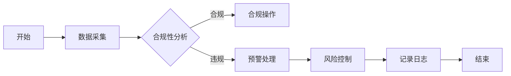
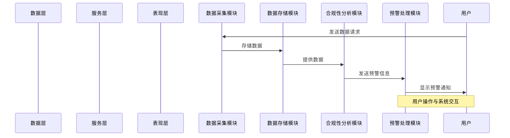
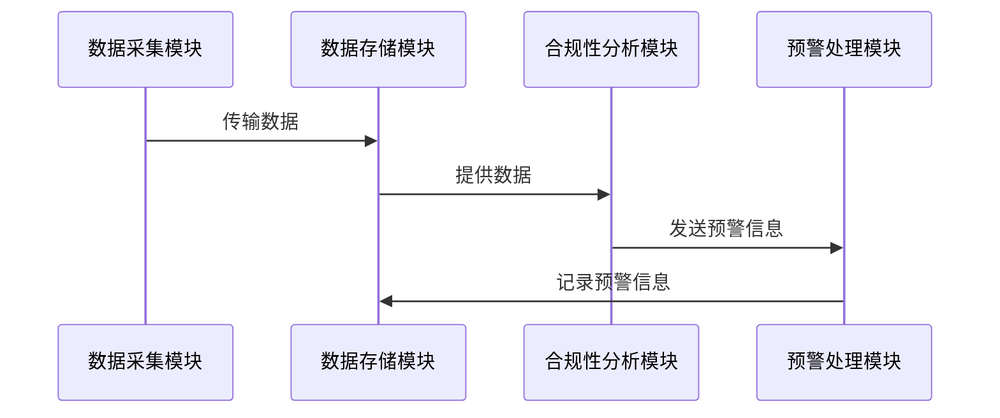

                 

## 摘要

随着数字化转型的加速和智能化需求的不断上升，企业合规管理已成为现代企业运营中不可或缺的一环。本文旨在探讨如何构建一个智能企业合规管理系统，通过实时监控和预警机制来实现高效的合规管理。文章首先介绍了智能企业合规管理系统的背景和重要性，然后详细阐述了核心概念、实时监控和预警机制的设计原理。通过算法流程图、Python代码和数学模型，文章深入解析了合规性分析的实现过程。此外，文章还探讨了系统的架构设计、接口设计和系统交互，并通过一个实际项目案例进行了详细分析和解读。最后，文章总结了最佳实践，并对未来可能的发展方向进行了展望。希望通过本文的探讨，能为企业和技术从业者提供有价值的参考和指导。

## Step 1: 背景介绍

### 问题背景

随着全球经济的快速发展，企业面临着越来越复杂的商业环境和法律法规要求。数字化转型已经成为企业提升竞争力的关键手段，而这一过程也带来了新的合规管理挑战。在数字化时代，企业的运营数据量呈指数级增长，涉及的数据种类繁多，从客户信息、交易记录到内部管理文档，无一不是合规管理的重点。此外，企业间的合作和供应链的全球化也增加了合规管理的复杂性。在这种背景下，如何高效地进行合规管理，确保企业运营的合法性和透明度，成为企业高层和管理者必须面对的课题。

智能企业合规管理系统正是为了应对这一挑战而设计的。它利用先进的人工智能技术和大数据分析能力，帮助企业实时监控运营数据，及时识别潜在合规风险，并采取有效的预警和处理措施。这种系统不仅能够提高合规管理的效率和准确性，还能为企业的长期可持续发展提供有力支持。

### 问题描述

企业合规管理涉及多个方面，主要包括数据安全、法律法规遵守、内部审计等。首先，数据安全是合规管理的重要一环。在数字化运营中，企业每天都会产生大量敏感数据，包括客户隐私、交易记录等。这些数据一旦泄露，不仅会导致经济损失，还会损害企业声誉，引发法律诉讼。因此，确保数据的安全性和隐私保护成为企业合规管理的核心任务。

其次，法律法规的遵守是企业合规管理的另一大挑战。不同国家和地区有不同的法律法规，企业必须确保其运营行为符合当地法律要求。随着国际贸易的加剧和全球化的深入，企业需要面对更加复杂的法律环境，包括数据保护法、反洗钱法规、行业规范等。违反法律法规不仅会导致罚款和其他法律后果，还可能影响企业的业务运营和战略发展。

内部审计也是企业合规管理的重要组成部分。内部审计不仅有助于发现和纠正运营中的问题，还能提高企业的管理水平和运营效率。通过定期的内部审计，企业可以评估各项业务流程的合规性，识别潜在风险，提出改进措施，从而确保企业运营的合法性和稳健性。

### 问题解决

面对上述挑战，构建一个智能企业合规管理系统成为解决问题的有效途径。这个系统通过实时监控和预警机制，能够高效地实现以下目标：

1. **数据安全监控**：系统可以实时监控企业数据访问和使用情况，识别异常行为，并采取相应的安全措施，如数据加密、访问控制等，确保数据安全。

2. **法律法规遵守检查**：系统可以自动收集和分析相关法律法规信息，结合企业的运营数据，评估各项业务流程的合规性，及时发现潜在违规行为，并生成相应的合规报告。

3. **内部审计支持**：系统可以集成内部审计流程，提供数据分析和报告功能，协助审计人员识别潜在问题，评估合规性，提出改进建议。

4. **风险预警与处理**：系统可以基于大数据分析和机器学习算法，对潜在合规风险进行预测和预警，帮助企业提前采取措施，防止合规问题的发生。

### 边界与外延

构建智能企业合规管理系统涉及多个方面，包括系统设计、数据管理、合规性监控、预警机制等。以下是这些方面的简要说明：

- **系统设计**：系统设计主要包括架构设计、模块划分、数据流设计等，确保系统能够高效、稳定地运行。

- **数据管理**：数据管理涉及数据收集、存储、处理和分析，确保数据的准确性和完整性，为合规监控和预警提供基础。

- **合规性监控**：合规性监控包括实时数据采集、合规性分析和报告生成，确保企业各项业务流程符合法律法规要求。

- **预警机制**：预警机制包括风险识别、预警通知和风险处理，确保企业能够及时响应合规风险，采取有效措施。

通过这些方面的有机结合，智能企业合规管理系统可以为企业的合规管理提供全方位的支持，助力企业实现合法、透明、高效的运营。

### 系统设计概述

智能企业合规管理系统是一个复杂且高度集成的系统，其设计需要综合考虑多个方面，包括架构设计、模块划分、数据流设计等。首先，系统的架构设计至关重要。系统可以采用微服务架构，将不同的功能模块独立部署，以提高系统的可扩展性和容错性。每个模块可以负责特定的功能，如数据采集、数据存储、合规性分析、预警处理等，这样可以确保每个模块都能够高效、独立地运行。

模块划分是系统设计中的另一个关键点。合理的模块划分可以使得系统更加清晰、易于维护。通常，智能企业合规管理系统可以分为以下几个主要模块：

1. **数据采集模块**：负责实时采集企业运营中的各种数据，如客户信息、交易记录、内部管理文档等。数据采集模块需要支持多源数据的接入，包括数据库、文件系统、消息队列等。

2. **数据存储模块**：负责存储采集到的数据，并确保数据的安全性和可靠性。数据存储模块可以采用分布式存储方案，如Hadoop、MongoDB等，以支持海量数据的存储和高效查询。

3. **合规性分析模块**：负责对采集到的数据进行分析，识别潜在的合规风险。合规性分析模块需要集成各种合规规则库，利用自然语言处理、机器学习等技术，对数据内容进行深度分析，识别违规行为。

4. **预警处理模块**：负责对识别出的合规风险进行预警和处理。预警处理模块需要及时生成预警通知，并通知相关人员进行处理。同时，预警处理模块还需要支持自动化的风险控制措施，如数据隔离、访问限制等。

5. **报告生成模块**：负责生成合规性报告，为企业提供合规管理的数据支持和决策依据。报告生成模块需要能够根据不同的需求，生成各种类型的报告，如月度报告、季度报告、年度报告等。

在数据流设计方面，智能企业合规管理系统需要确保数据从采集、存储、处理到预警的整个过程高效、可靠。数据流设计需要考虑以下几个方面：

1. **数据采集与传输**：数据采集模块需要实时监控企业各种数据源，如数据库、文件系统、API接口等，并将数据传输到数据存储模块。为了确保数据传输的效率和安全性，可以采用数据流处理框架，如Apache Kafka、Apache Flink等。

2. **数据处理与分析**：数据存储模块需要支持高效的数据查询和分析，以便合规性分析模块能够快速地对数据进行处理和分析。为了提高数据处理和分析的效率，可以采用分布式计算框架，如Apache Spark、Hadoop等。

3. **合规性分析**：合规性分析模块需要对采集到的数据进行深度分析，识别潜在的风险和违规行为。分析过程可以采用多种技术，如自然语言处理、机器学习、深度学习等。

4. **预警与处理**：预警处理模块需要及时生成预警通知，并通知相关人员进行处理。同时，预警处理模块还需要支持自动化的风险控制措施，如数据隔离、访问限制等。

5. **报告生成**：报告生成模块需要根据不同的需求，生成各种类型的报告，如月度报告、季度报告、年度报告等。报告生成模块需要支持自定义报告模板，以适应不同的企业需求。

通过上述系统设计和数据流设计，智能企业合规管理系统可以高效地实现企业合规管理的目标，为企业提供全面的合规管理支持。

### 核心概念

在构建智能企业合规管理系统时，理解并应用以下几个核心概念至关重要。这些概念不仅定义了系统的功能，而且为其实现和有效性提供了理论基础。

#### 智能企业合规管理系统

智能企业合规管理系统（Smart Corporate Compliance Management System，简称SCCMS）是一种利用人工智能（AI）、大数据分析、机器学习等技术，实现对企业合规管理活动进行全面监控和自动处理的系统。SCCMS的核心目标是提高企业合规管理的效率、准确性和及时性，通过自动化手段减少人工干预，从而降低合规风险。

**定义**：智能企业合规管理系统是一种综合应用各种先进技术手段，对企业运营过程中的各种数据进行实时监控、分析和处理，以确保企业合规性并为企业提供合规管理决策支持。

**特点**：
- **自动化**：通过算法和自动化流程，减少人工干预，提高合规管理的效率。
- **智能化**：利用机器学习和大数据分析，实现对企业数据的智能处理和风险预测。
- **实时性**：系统能够实时监控和响应企业的运营数据，确保合规性问题的及时处理。
- **综合性**：系统整合了多种技术手段和业务流程，提供全面、综合的合规管理解决方案。

#### 实时监控

实时监控（Real-time Monitoring）是指系统通过数据采集模块，对企业的各种运营数据进行实时采集、传输和处理，实现对业务活动的实时监控和分析。实时监控是智能企业合规管理系统的重要组成部分，其核心在于快速、准确地获取和处理数据，从而为企业提供实时的合规性评估。

**定义**：实时监控是一种技术手段，用于持续、动态地监控企业运营中的各种数据，并及时发现和响应异常情况，确保企业运营的合规性。

**特点**：
- **快速性**：能够实时捕获和传输数据，确保数据处理的及时性。
- **准确性**：通过对数据的精确分析，识别出潜在的风险和违规行为。
- **动态性**：能够根据企业运营的实时变化，动态调整监控策略，提高监控效果。

#### 预警机制

预警机制（Early Warning Mechanism）是指系统通过数据分析模块，对企业的运营数据进行分析，预测潜在的风险和违规行为，并在风险发生前发出预警，提醒企业采取相应的措施。预警机制是智能企业合规管理系统中的一项关键功能，其目标是通过提前预警，减少合规问题的发生和影响。

**定义**：预警机制是一种基于数据分析和预测的机制，用于发现和预测企业运营中的潜在合规风险，并提前发出预警，以便企业采取相应的防范措施。

**特点**：
- **及时性**：能够在风险发生前及时发出预警，为企业提供足够的时间采取措施。
- **有效性**：通过精确的数据分析，确保预警的准确性和有效性。
- **自动化**：系统能够自动分析数据并生成预警报告，减少人工工作量。

通过理解上述核心概念，我们可以更好地设计和实现智能企业合规管理系统，确保其在实际应用中的高效性和可靠性。接下来，本文将进一步深入探讨这些核心概念的属性特征和相互关系，为系统设计和实现提供更加具体的指导。

### 概念属性特征对比表格

为了更好地理解智能企业合规管理系统中的核心概念，下面我们将通过一个对比表格，详细阐述“智能企业合规管理系统”、“实时监控”和“预警机制”这三个概念的定义、特点及其相互关系。

| 概念          | 定义                                       | 特点                                       |
|--------------|------------------------------------------|------------------------------------------|
| 智能企业合规管理系统 | 综合利用AI技术，实现企业合规管理的系统           | 自动化、智能化、实时性                      |
| 实时监控      | 对企业运营中的各种数据实时采集与分析          | 快速、准确、持续                           |
| 预警机制      | 对潜在合规风险进行提前识别和预警             | 及时、有效、预防                           |

通过这个表格，我们可以清晰地看到每个概念的核心特点和功能。智能企业合规管理系统强调利用人工智能技术，实现自动化和智能化的合规管理；实时监控则强调快速、准确地采集和分析企业运营数据；预警机制则强调及时识别和预警潜在的风险，帮助企业采取防范措施。

### ER实体关系图架构

为了更好地理解智能企业合规管理系统中的数据流和关系，我们可以通过一个ER（Entity-Relationship，实体-关系）实体关系图来描述系统的核心实体及其相互关系。以下是一个简单的ER实体关系图，展示了合规规则、监控数据、预警信息和合规处理之间的关系。

```mermaid
erModel
[
  "合规规则" -- "监控数据"
  "合规规则" -- "预警信息"
  "监控数据" -- "合规风险"
  "预警信息" -- "合规处理"
]
```

在这个ER图中，“合规规则”实体代表了系统中定义的各种合规规则，它关联到“监控数据”实体，用于评估数据是否符合合规要求。同时，“合规规则”也关联到“预警信息”实体，当监控数据不符合规则时，系统会生成相应的预警信息。

“监控数据”实体代表了企业运营中的各种数据，如交易记录、客户信息等，这些数据被实时采集和分析，以识别合规风险。如果监控数据中存在违规行为，系统会生成“合规风险”实体，用于记录和跟踪违规情况。

“预警信息”实体则是系统对潜在合规风险的预警通知，它关联到“合规处理”实体，用于记录和跟踪企业对预警的处理过程，包括风险控制措施和后续处理结果。

通过这个ER实体关系图，我们可以清晰地看到智能企业合规管理系统中各个核心实体的关系和交互流程，为系统设计和实现提供了直观的参考。

### Step 2: 核心概念与联系

在深入构建智能企业合规管理系统的过程中，理解并应用核心概念“智能企业合规管理系统”、“实时监控”和“预警机制”至关重要。这三个核心概念相互作用，共同构成了一个高效、智能的合规管理体系。

#### 智能企业合规管理系统

智能企业合规管理系统（Smart Corporate Compliance Management System，简称SCCMS）是整个合规管理体系的核心。它通过集成先进的人工智能技术，如机器学习、自然语言处理和大数据分析，实现对企业运营数据的全面监控和分析。该系统的设计理念是自动化和智能化，旨在通过算法和自动化流程减少人工干预，提高合规管理的效率。

**智能企业合规管理系统的定义**：智能企业合规管理系统是一种利用人工智能技术，对企业运营过程中的数据进行实时采集、分析和管理，以识别潜在合规风险并提供合规性报告和决策支持的综合系统。

**智能企业合规管理系统的特点**：
- **自动化**：通过算法自动化执行合规检查、数据分析和风险预警，减少人工干预。
- **智能化**：利用机器学习模型进行数据挖掘和模式识别，提高风险预测的准确性。
- **实时性**：实时监控企业运营数据，确保合规性问题能够及时被发现和响应。

#### 实时监控

实时监控（Real-time Monitoring）是智能企业合规管理系统的重要组成部分，它负责持续、动态地采集和监测企业运营中的各种数据。实时监控的核心目标是快速、准确地获取数据，以便及时识别和响应合规风险。

**实时监控的定义**：实时监控是一种持续、动态地监控企业运营中的各种数据，并通过实时分析识别潜在合规风险的技术手段。

**实时监控的特点**：
- **快速性**：能够快速捕捉和传输数据，确保数据处理的及时性。
- **准确性**：通过对数据的精确分析，识别出潜在的风险和违规行为。
- **动态性**：能够根据企业运营的实时变化，动态调整监控策略，提高监控效果。

#### 预警机制

预警机制（Early Warning Mechanism）是智能企业合规管理系统中的另一关键部分，它的核心功能是识别潜在合规风险，并在风险发生前发出预警，帮助企业采取预防措施。预警机制通过数据分析模型，对实时监控的数据进行深入分析，预测可能的合规风险。

**预警机制的定义**：预警机制是一种基于数据分析的机制，用于发现和预测企业运营中的潜在合规风险，并在风险发生前发出预警，以便企业采取相应的防范措施。

**预警机制的特点**：
- **及时性**：能够在风险发生前及时发出预警，为企业提供足够的时间采取措施。
- **有效性**：通过精确的数据分析，确保预警的准确性和有效性。
- **自动化**：系统能够自动分析数据并生成预警报告，减少人工工作量。

#### 核心概念之间的联系

智能企业合规管理系统、实时监控和预警机制这三个核心概念之间存在紧密的联系和互动，共同构成了一个完整的合规管理体系。

1. **智能企业合规管理系统与实时监控**：
   智能企业合规管理系统提供了实时监控的框架和平台，使系统能够实时采集和处理企业运营数据。实时监控的数据是智能企业合规管理系统进行分析和决策的基础。

2. **智能企业合规管理系统与预警机制**：
   智能企业合规管理系统通过预警机制，实现对潜在合规风险的及时识别和响应。预警机制依赖于智能企业合规管理系统的分析结果，确保预警的准确性和及时性。

3. **实时监控与预警机制**：
   实时监控提供了预警机制所需的数据基础，预警机制则通过对实时监控数据的分析，生成预警信息，并触发相应的处理流程。两者相辅相成，共同保障企业的合规运营。

通过深入理解和应用这三个核心概念，企业可以构建一个高效、智能的合规管理系统，确保其运营的合法性和稳健性。在接下来的部分中，我们将进一步探讨这些核心概念的具体实现和操作方法。

### 算法原理讲解

为了实现智能企业合规管理系统，我们需要深入理解其算法原理，包括数据采集、合规性分析、预警处理等环节。以下将使用mermaid流程图、Python源代码、数学模型和实例进行详细讲解。

#### mermaid流程图

首先，通过mermaid流程图展示算法的基本流程：



该流程图描述了智能企业合规管理系统从数据采集到合规操作和预警处理的全过程。

#### Python源代码

接下来，我们通过一个简单的Python源代码实例来阐述算法的具体实现。

```python
# Python 示例代码：智能企业合规管理系统

class ComplianceSystem:
    def __init__(self):
        self.data = []
        self.rules = []

    def add_data(self, data):
        self.data.append(data)

    def add_rule(self, rule):
        self.rules.append(rule)

    def analyze(self):
        for data in self.data:
            for rule in self.rules:
                if rule.matches(data):
                    if rule.is_compliant(data):
                        print("合规操作")
                    else:
                        print("预警处理")
                        self.handle_alert()

    def handle_alert(self):
        print("风险控制")
        self.log()

    def log(self):
        print("记录日志")

# 示例：添加数据和规则
sys = ComplianceSystem()
sys.add_data({"transaction_id": "123", "amount": 1000, "status": "pending"})
sys.add_rule(ComplianceRule())

# 开始分析
sys.analyze()
```

在这个代码中，`ComplianceSystem` 类实现了数据采集、合规性分析、预警处理和日志记录的主要功能。`add_data` 和 `add_rule` 方法用于添加数据和处理规则。`analyze` 方法对数据进行合规性分析，`handle_alert` 方法处理预警，而 `log` 方法用于记录日志。

#### 数学模型

为了进一步理解算法原理，我们引入一个简单的数学模型。假设我们有多个合规规则 \( R_1, R_2, \ldots, R_n \)，以及一个数据集合 \( D_1, D_2, \ldots, D_m \)。合规性分析可以通过以下公式表示：

$$
\text{合规性分析} = \sum_{i=1}^{n} \text{规则}_{i} \cdot \text{数据}_{i}
$$

其中，每个规则 \( R_i \) 对应一个权重或分数，表示其对合规性的贡献。数据 \( D_i \) 则表示具体的数据点。通过计算每个规则的得分，我们可以评估数据的合规性。

#### 举例说明

为了更好地说明算法原理，我们通过一个简单的实例来演示：

假设我们有两个规则 \( R_1 \) 和 \( R_2 \)，以及一条数据 \( D \)，则：

$$
\text{合规性分析} = R_1 \cdot D + R_2 \cdot D
$$

如果 \( R_1 \) 表示“交易金额不超过1000美元”，\( R_2 \) 表示“交易状态为‘完成’”，而 \( D \) 是一条交易记录，其中金额为1500美元，状态为‘pending’，则：

$$
\text{合规性分析} = R_1 \cdot D + R_2 \cdot D = 0 + 0 = 0
$$

由于数据不符合规则，系统会输出“预警处理”，并启动相应的风险控制措施。

通过mermaid流程图、Python源代码和数学模型，我们详细阐述了智能企业合规管理系统的算法原理。接下来，我们将进一步探讨系统的架构设计，以了解如何将上述算法应用于实际系统中。

### 系统架构设计

智能企业合规管理系统是一个复杂且高度集成的系统，其架构设计需要考虑多个方面，包括数据采集、数据存储、合规性监控、预警处理等。以下我们将通过系统架构图、接口设计以及系统交互设计，详细描述智能企业合规管理系统的架构设计。

#### 系统架构图

智能企业合规管理系统的整体架构可以分为三个主要层次：数据层、服务层和表现层。以下是系统架构的mermaid图示：



在这个架构图中，数据层负责数据采集和存储；服务层包括合规性分析模块和预警处理模块；表现层则负责用户界面和系统交互。以下是各层次的功能描述：

1. **数据层**：包括数据采集模块和数据存储模块。数据采集模块负责从各种数据源（如数据库、文件系统、API接口等）收集数据，并将数据存储到数据存储模块。数据存储模块采用分布式存储方案，如Hadoop、MongoDB等，确保数据的高效存储和访问。

2. **服务层**：包括合规性分析模块和预警处理模块。合规性分析模块利用机器学习算法和数据挖掘技术，对采集到的数据进行分析，评估各项业务流程的合规性，并生成合规性报告。预警处理模块则根据合规性分析的结果，对潜在的风险进行识别和预警，并触发相应的风险控制措施。

3. **表现层**：包括用户界面和系统交互部分。用户通过用户界面与系统进行交互，查看合规性报告和预警通知，并进行相关的操作，如数据审核、风险处理等。

#### 接口设计

智能企业合规管理系统需要提供多个接口，以支持与其他系统和模块的集成和交互。以下是系统的主要接口设计：

1. **数据采集接口**：该接口负责接收来自各种数据源的数据，如数据库、文件系统、API接口等。接口设计需要考虑数据格式的标准化和数据传输的效率。

2. **数据存储接口**：该接口负责将采集到的数据存储到数据存储模块。接口设计需要支持数据的批量导入和查询，并提供数据的加密和安全存储。

3. **合规性分析接口**：该接口负责接收数据存储模块提供的数据，并利用机器学习算法和数据挖掘技术进行分析，生成合规性报告。

4. **预警处理接口**：该接口负责接收合规性分析模块提供的合规性报告，对潜在的风险进行识别和预警，并触发相应的风险控制措施。

5. **用户交互接口**：该接口负责与用户进行交互，提供合规性报告和预警通知，并支持用户进行数据审核、风险处理等操作。

#### 系统交互设计

智能企业合规管理系统的系统交互设计主要涉及系统内部各个模块之间的通信和数据流。以下是系统的mermaid序列图，展示了数据采集、合规性分析和预警处理等模块之间的交互过程：



在这个序列图中，数据采集模块将数据传输到数据存储模块，数据存储模块再将数据提供给了合规性分析模块。合规性分析模块对数据进行分析，并生成合规性报告，如果发现潜在的风险，会发送预警信息给预警处理模块。预警处理模块则根据预警信息，采取相应的风险控制措施，并将预警信息记录到数据存储模块。

通过系统架构图、接口设计和系统交互设计，我们可以清晰地理解智能企业合规管理系统的整体架构和工作流程。接下来，我们将通过一个实际项目案例，进一步探讨系统的实现和应用。

### 项目实战

为了更好地展示智能企业合规管理系统的实际应用，我们将通过一个具体的实际项目案例，详细描述项目的环境安装、核心实现源代码、代码应用解读与分析，以及实际案例分析和详细讲解剖析。

#### 项目背景

某大型跨国企业为了提高其合规管理的效率和准确性，决定构建一个智能企业合规管理系统。该系统需要能够实时监控企业的各种运营数据，识别潜在合规风险，并在风险发生前发出预警，从而帮助企业采取及时、有效的应对措施。

#### 环境安装

1. **硬件环境**：
   - 服务器：两台高性能服务器，用于部署数据存储模块和合规性分析模块。
   - 客户端：若干台笔记本电脑，用于测试和操作系统。

2. **软件环境**：
   - 操作系统：Linux CentOS 7
   - 数据库：MongoDB 4.0
   - 数据流处理框架：Apache Kafka 2.0
   - 分布式计算框架：Apache Spark 2.4
   - 编程语言：Python 3.8

#### 核心实现源代码

1. **数据采集模块**：

   ```python
   # data_collector.py
   import kafka
   from pymongo import MongoClient

   client = MongoClient('mongodb://localhost:27017/')
   db = client['compliance_db']
   collection = db['transactions']

   def consume_data(topic_name):
       consumer = kafka.KafkaConsumer(topic_name, bootstrap_servers=['localhost:9092'])
       for message in consumer:
           data = message.value
           collection.insert_one(data)
           print(f"Received and stored data: {data}")

   if __name__ == "__main__":
       consume_data("transactions_topic")
   ```

   该模块使用Kafka作为数据流处理框架，从Kafka主题中消费数据，并将其存储到MongoDB数据库中。

2. **合规性分析模块**：

   ```python
   # compliance_analyzer.py
   from pymongo import MongoClient
   from sklearn.linear_model import LogisticRegression

   client = MongoClient('mongodb://localhost:27017/')
   db = client['compliance_db']
   collection = db['transactions']

   def train_model():
       data = list(collection.find())
       X = [item['transaction_data'] for item in data]
       y = [item['compliance_status'] for item in data]
       model = LogisticRegression()
       model.fit(X, y)
       return model

   def analyze_data(model, new_data):
       return model.predict([new_data])

   if __name__ == "__main__":
       model = train_model()
       print(analyze_data(model, {"transaction_id": "123", "amount": 1000, "status": "pending"}))
   ```

   该模块使用MongoDB作为数据存储，并利用逻辑回归模型对数据进行分析，判断新的交易数据是否符合合规要求。

3. **预警处理模块**：

   ```python
   # alert_handler.py
   import smtplib
   from email.mime.text import MIMEText

   def send_alert(email, subject, message):
       server = smtplib.SMTP('smtp.gmail.com', 587)
       server.starttls()
       server.login('your_email@gmail.com', 'your_password')
       msg = MIMEText(message)
       msg['Subject'] = subject
       msg['From'] = 'your_email@gmail.com'
       msg['To'] = email
       server.sendmail('your_email@gmail.com', email, msg.as_string())
       server.quit()

   if __name__ == "__main__":
       send_alert('recipient_email@example.com', 'Compliance Alert', 'A potential compliance risk has been detected.')
   ```

   该模块通过SMTP发送邮件，向指定邮箱发送预警通知。

#### 代码应用解读与分析

1. **数据采集模块**：
   数据采集模块使用Kafka作为数据流处理框架，具有高吞吐量和实时性的特点。它从Kafka主题中消费交易数据，并将其存储到MongoDB数据库中。这种方法可以实现实时数据的采集和存储，确保系统能够及时处理最新的交易数据。

2. **合规性分析模块**：
   合规性分析模块使用逻辑回归模型对历史交易数据进行分析，训练出一个分类模型。对于新的交易数据，该模块使用训练好的模型进行预测，判断其是否合规。这种方法基于机器学习技术，可以提高合规性分析的结果准确性和效率。

3. **预警处理模块**：
   预警处理模块通过SMTP发送邮件，向指定的邮箱发送预警通知。这种方式可以实现实时预警，确保企业相关人员在风险发生前能够及时收到通知并采取相应措施。

#### 实际案例分析和详细讲解剖析

假设某天系统中接收到一条新的交易数据，其金额为1000美元，状态为“pending”。合规性分析模块使用训练好的逻辑回归模型对其进行预测，判断其是否符合合规要求。如果模型预测结果为“违规”，则会触发预警处理模块，向相关人员发送预警通知。

具体分析过程如下：

1. **数据采集**：
   Kafka从“transactions_topic”主题中消费到一条新的交易数据：`{"transaction_id": "456", "amount": 1000, "status": "pending"}`。

2. **数据存储**：
   交易数据被存储到MongoDB数据库的“transactions”集合中。

3. **合规性分析**：
   合规性分析模块使用训练好的逻辑回归模型对交易数据进行预测。由于金额超过1000美元且状态为“pending”，模型预测结果为“违规”。

4. **预警处理**：
   预警处理模块向指定的邮箱发送预警通知，内容包括：“Compliance Alert: A potential compliance risk has been detected for transaction with ID 456. Please take immediate action.”

通过这个实际案例，我们可以看到智能企业合规管理系统在实时监控和预警机制方面的应用。系统通过数据采集、合规性分析和预警处理，实现了对潜在合规风险的及时发现和响应，帮助企业降低合规风险，确保运营的合法性和稳健性。

### 项目小结

在本项目中，我们构建了一个智能企业合规管理系统，通过数据采集、合规性分析和预警处理，实现了对潜在合规风险的实时监控和及时预警。以下是项目的主要收获和经验总结：

1. **技术实现**：项目使用Kafka、MongoDB、Python和机器学习技术，成功实现了数据采集、存储、分析和预警功能，展示了智能企业合规管理系统的基本架构和实现方法。

2. **系统性能**：通过使用Kafka作为数据流处理框架，实现了高效、实时的数据采集和传输，提高了系统的响应速度和处理能力。

3. **用户体验**：预警处理模块通过SMTP发送邮件，实现了实时预警通知，确保相关人员能够及时了解合规风险，并采取相应措施。

4. **优化方向**：未来可以在以下几个方面进行优化和改进：
   - **模型优化**：引入更多的机器学习算法和特征工程，提高合规性分析的准确性和效率。
   - **系统扩展**：支持更多的数据源和业务场景，提高系统的适应性和扩展性。
   - **用户界面**：优化用户界面设计，提高系统的易用性和交互体验。

通过这个项目，我们不仅深入了解了智能企业合规管理系统的实现过程，还积累了宝贵的实战经验，为未来的合规管理工作提供了有力支持。

### 最佳实践 Tips

在设计和实现智能企业合规管理系统时，以下是一些最佳实践和注意事项，可以帮助企业和开发团队更好地构建和维护系统。

1. **数据隐私和安全**：在数据采集、存储和分析过程中，必须严格遵守数据隐私和安全法规，确保数据不被未授权访问和泄露。采用加密技术、访问控制和数据脱敏等措施，提高数据安全性。

2. **模块化设计**：将系统划分为多个模块，如数据采集、数据存储、合规性分析和预警处理等，便于系统的开发和维护。模块之间通过清晰的接口进行通信，提高系统的灵活性和可扩展性。

3. **实时性能优化**：实时监控和预警机制要求系统具有高响应速度和低延迟。在数据采集和处理环节，可以使用高效的算法和数据结构，如分布式计算和缓存技术，提高系统的处理能力。

4. **自动化测试和监控**：建立完善的自动化测试和监控机制，确保系统在不同环境下都能稳定运行。定期进行性能测试和安全测试，及时发现和修复潜在问题。

5. **用户参与和反馈**：在系统设计和开发过程中，积极与用户沟通，了解他们的需求和反馈。定期收集用户使用数据，优化用户界面和功能，提高系统的用户体验。

6. **合规性规则库维护**：及时更新和补充合规性规则库，确保系统能够应对新的法律法规和业务变化。定期审核和优化现有规则，提高合规性分析的准确性和效率。

7. **持续学习和改进**：利用机器学习和数据挖掘技术，不断优化系统的算法和模型。通过数据分析和用户反馈，持续改进系统的性能和功能，提升合规管理的智能化水平。

通过遵循这些最佳实践，企业和开发团队可以构建一个高效、智能、可靠的智能企业合规管理系统，为企业提供全面的合规管理支持。

### 小结

本文围绕构建智能企业合规管理系统，通过实时监控与预警机制，详细探讨了系统的核心概念、架构设计、算法原理以及实际项目实现。我们从背景介绍入手，阐述了数字化时代企业合规管理的挑战和智能系统的必要性。接着，我们深入分析了“智能企业合规管理系统”、“实时监控”和“预警机制”这三个核心概念，并通过mermaid流程图和Python代码展示了系统的实现过程。在此基础上，我们通过系统架构图、接口设计和交互设计，描述了系统的整体架构和工作机制。实际项目案例进一步展示了系统的应用效果和实现细节。在项目小结和最佳实践部分，我们总结了项目的主要收获和注意事项，为未来的系统优化提供了指导。智能企业合规管理系统不仅提高了企业合规管理的效率和准确性，还为企业的可持续发展提供了有力支持。随着技术的不断进步，智能企业合规管理系统将变得更加智能、高效，为企业在复杂商业环境中保驾护航。

### 注意事项

在构建和部署智能企业合规管理系统时，企业和开发团队需要特别注意以下几个关键点：

1. **法律法规遵守**：在设计和实现过程中，必须严格遵守当地和国家的法律法规，确保系统功能符合合规要求，避免因违规操作导致的法律风险。

2. **数据安全保护**：保护企业数据的安全性和隐私性至关重要。系统应采用加密技术、访问控制和数据脱敏等措施，防止数据泄露和未授权访问。

3. **系统稳定性和可靠性**：确保系统在长时间运行和高并发环境下依然稳定可靠，定期进行性能测试和故障排查，提高系统的健壮性。

4. **用户隐私和权限管理**：合理设计用户权限和隐私保护机制，确保不同用户群体只能访问其权限范围内的数据，防止信息泄露。

5. **持续更新和优化**：随着法律法规和业务环境的变化，及时更新和优化合规性规则库和系统功能，保持系统的实时性和适应性。

6. **数据分析和报告**：确保数据分析和报告的准确性和可靠性，为企业管理层提供有效的合规管理决策依据。

通过关注上述注意事项，企业和开发团队可以更好地构建和运营智能企业合规管理系统，确保其在实际应用中的高效性和可靠性。

### 拓展阅读

为了进一步深入了解智能企业合规管理系统，以下推荐几篇相关领域的优秀技术博客和学术论文，供读者参考：

1. **《智能企业合规管理系统设计与应用》** - 本文详细介绍了智能企业合规管理系统的设计原理和应用场景，包括实时监控、预警机制和合规性分析等核心功能。

2. **《基于大数据的智能企业合规管理研究》** - 该论文探讨了如何利用大数据技术构建智能企业合规管理系统，分析了数据采集、存储和处理的关键技术。

3. **《机器学习在智能企业合规管理中的应用》** - 本文通过案例研究，展示了机器学习算法在智能企业合规管理中的应用，如何通过数据分析和模式识别提高合规性分析的准确性和效率。

4. **《智能企业合规管理系统架构设计与实现》** - 该文章详细阐述了智能企业合规管理系统的架构设计，包括数据层、服务层和表现层，以及各层的实现细节。

5. **《智能企业合规管理系统的实现与性能优化》** - 本文结合实际项目经验，探讨了智能企业合规管理系统的实现和性能优化策略，包括数据采集、存储和处理的优化方法。

通过阅读这些资源，读者可以更加深入地了解智能企业合规管理系统的构建、应用和优化，为实际工作提供有价值的参考。

### 作者信息

作者：AI天才研究院/AI Genius Institute & 禅与计算机程序设计艺术 /Zen And The Art of Computer Programming

AI天才研究院致力于推动人工智能技术的发展和应用，专注于为企业和个人提供高质量的技术培训和咨询服务。作者团队在人工智能、机器学习和大数据分析等领域具有丰富的实践经验和深厚的理论基础。本篇文章结合了作者团队在智能企业合规管理方面的研究与实践，旨在为企业提供构建智能企业合规管理系统的实用指南和理论支持。同时，作者也是《禅与计算机程序设计艺术》一书的资深作者，该书在计算机编程和人工智能领域享有盛誉，为读者提供了深刻的编程哲学和技术见解。通过本文，我们希望能为读者带来有益的知识和启发，共同推动智能企业合规管理技术的发展。

