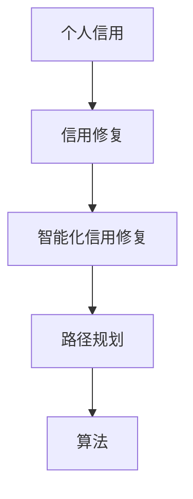
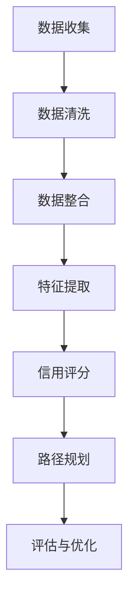
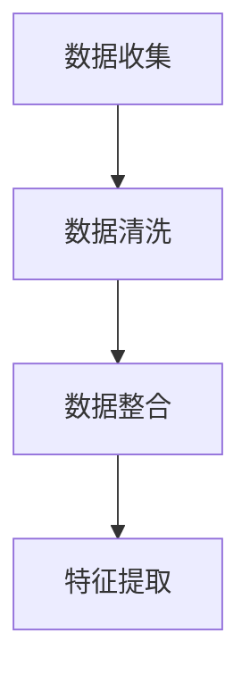
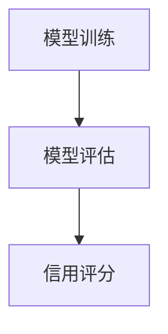
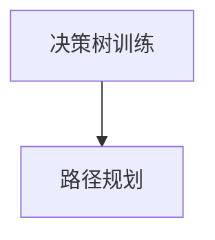
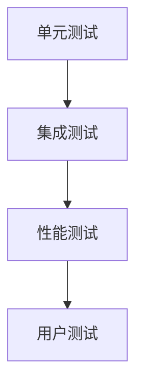
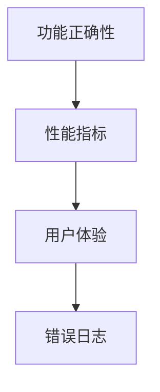
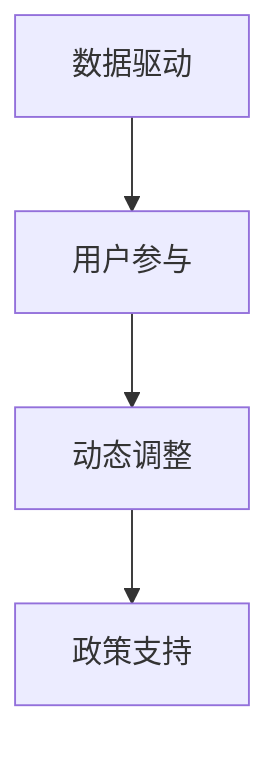

                 


### 引言

在当今社会，个人信用体系已成为评估个人财务行为和信用状况的重要工具。然而，随着金融市场的不断发展和人们对信用修复需求的增加，传统的信用修复方法已显得力不从心。这使得构建智能化个人信用修复路径规划系统成为一个紧迫而重要的课题。本文将围绕这一主题，深入探讨构建智能化个人信用修复路径规划系统的必要性、系统设计、核心算法原理、系统实现与测试、案例研究与实施策略，以及最佳实践与未来展望。

#### 核心概念与联系

首先，我们需要明确一些核心概念，以便为后续的讨论奠定基础。

**个人信用**：个人信用是指个人在信用交易中表现出的信用状况，通常通过信用评分来量化。

**信用修复**：信用修复是指通过一系列手段，纠正个人信用报告中的错误信息，提升个人信用评分的过程。

**智能化信用修复**：智能化信用修复是通过运用人工智能技术，自动分析和评估个人信用数据，制定个性化的信用修复路径。

**路径规划**：路径规划是指根据特定的目标，规划出一条从初始状态到目标状态的可行路径。

**算法**：算法是一系列解决问题的指令或规则，可以用于数据处理和分析。

接下来，我们将使用Mermaid流程图来展示这些核心概念之间的关系：



通过以上核心概念和关系的阐述，我们为构建智能化个人信用修复路径规划系统奠定了理论基础。在接下来的章节中，我们将逐步深入探讨系统设计、核心算法原理、系统实现与测试、案例研究与实施策略等内容。

---

**下文**

### 个人信用体系概述

#### 个人信用的概念与重要性

个人信用是指个人在信用交易中表现出的信用状况，通常通过信用评分来量化。信用评分是根据个人的财务行为、还款记录、信用历史等数据，通过复杂的算法计算得出的一个数值。这个数值反映了个人履行信用义务的能力和意愿。

个人信用的重要性不言而喻。首先，它是金融机构评估个人贷款、信用卡申请、信用额度调整等信用交易的重要依据。良好的信用评分可以使个人在申请贷款时更容易获得较高的信用额度，降低利率，甚至免于担保。反之，不良的信用记录将导致信用交易的难度增加，利率上升，甚至无法获得信用服务。

其次，个人信用还对个人的社会生活产生重大影响。例如，在求职过程中，一些企业可能会查询求职者的信用记录，以评估其诚信度。在租赁房屋、租车、购买大型家电时，信用状况也是决策的重要参考因素。此外，个人信用还会影响个人的商业合作机会，如合伙创业、签订合同等。

#### 当前个人信用体系存在的问题

尽管个人信用体系在评估个人信用方面发挥了重要作用，但当前的个人信用体系仍存在一些问题。

首先，信息不透明。信用报告中的信息往往不够详尽，个人很难了解到具体的影响因素。此外，信用报告的更新速度较慢，可能无法及时反映个人的信用状况。

其次，数据质量参差不齐。由于各种原因，信用报告中的数据可能存在错误、遗漏或不一致的情况，这会直接影响信用评分的准确性。

第三，信用修复机制不完善。当前的信用修复过程往往较为繁琐，需要个人耗费大量时间和精力。而且，即使个人采取了信用修复措施，也无法保证信用评分的显著提升。

最后，智能化程度不足。尽管已有一些自动化工具用于信用评分，但大多数系统仍依赖于人工干预，无法实现真正意义上的智能化。

#### 智能化信用修复的意义

构建智能化个人信用修复路径规划系统具有重要意义。

首先，可以提高信用评分的准确性。通过运用大数据和人工智能技术，系统能够更加全面、深入地分析个人信用数据，识别潜在的风险和机会，从而提供更准确的信用评分。

其次，可以简化信用修复过程。智能系统能够自动分析个人信用数据，识别需要修复的问题，并制定个性化的修复方案。这不仅能节省个人时间和精力，还能提高修复效率。

第三，可以提升用户体验。智能系统能够提供实时、个性化的信用修复建议，帮助个人更好地了解和管理自己的信用状况。

最后，可以推动信用体系的完善。通过收集和分析大量信用数据，智能系统能够发现信用体系中的问题，为政策制定者提供决策依据，从而推动信用体系的改进和优化。

### 小结

本文介绍了个人信用体系的概念与重要性，分析了当前个人信用体系存在的问题，并阐述了智能化信用修复的意义。在接下来的章节中，我们将深入探讨智能化信用修复系统的设计、核心算法原理、系统实现与测试等内容。通过这些讨论，我们希望为构建智能化个人信用修复路径规划系统提供有益的参考和指导。

---

**下文**

### 智能化信用修复系统设计

#### 系统目标与需求分析

构建智能化个人信用修复路径规划系统的首要任务是明确系统目标与需求。系统目标主要包括：

1. **提高信用评分的准确性**：通过运用大数据和人工智能技术，系统应能够更全面、深入地分析个人信用数据，提供准确的信用评分。

2. **简化信用修复过程**：系统应能够自动分析个人信用数据，识别需要修复的问题，并制定个性化的修复方案，以提高修复效率。

3. **提升用户体验**：系统应提供实时、个性化的信用修复建议，帮助个人更好地了解和管理自己的信用状况。

4. **支持数据驱动决策**：系统应能够收集和分析大量信用数据，为政策制定者提供决策依据，推动信用体系的完善。

需求分析方面，系统应具备以下功能：

1. **数据收集与整合**：系统应能够从多个数据源收集个人信用数据，包括信用报告、金融交易记录、社交行为等，并进行整合和处理。

2. **信用评分与评估**：系统应能够根据整合后的数据，运用适当的算法进行信用评分，并提供评估报告。

3. **信用修复路径规划**：系统应能够分析信用评分中的问题，并制定相应的修复路径，包括债务管理、信用报告纠错、信用记录补充等。

4. **个性化建议与指导**：系统应能够根据个人信用状况，提供实时、个性化的信用修复建议，并指导个人执行修复措施。

5. **用户界面与交互**：系统应提供直观、易用的用户界面，方便用户查看信用评分、修复路径和修复建议。

#### 系统架构设计

为了实现上述功能和目标，系统架构设计至关重要。以下是系统架构的概述：

1. **数据层**：数据层是系统的基石，负责收集、存储和管理个人信用数据。数据来源包括信用报告、金融交易记录、社交行为等。数据层应支持数据的实时更新和高效查询。

2. **数据处理层**：数据处理层负责对收集到的数据进行清洗、整合和预处理，为后续的信用评分和修复路径规划提供高质量的数据支持。

3. **算法层**：算法层是系统的核心，负责实现信用评分和修复路径规划算法。这些算法应基于大数据和人工智能技术，能够自动分析和评估个人信用数据。

4. **服务层**：服务层提供各种业务功能，包括信用评分、修复路径规划、个性化建议等。服务层应支持高并发、高可用性，确保系统的稳定运行。

5. **用户界面层**：用户界面层负责与用户交互，提供直观、易用的操作界面。用户界面应支持多种终端设备，如电脑、手机、平板等。

以下是系统架构的Mermaid类图表示：

```mermaid
classDiagram
    数据层 <<layer>> 数据处理层 <<layer>> 算法层 <<layer>> 服务层 <<layer>> 用户界面层

    数据层 --|> 数据处理层
    数据处理层 --|> 算法层
    算法层 --|> 服务层
    服务层 --|> 用户界面层
```

#### 数据处理与分析方法

在智能化信用修复系统中，数据处理与分析方法至关重要。以下是一些关键步骤和方法：

1. **数据收集**：系统应从多个数据源收集个人信用数据，包括信用报告、金融交易记录、社交行为等。数据收集过程中应注意数据质量，确保数据的准确性、完整性和一致性。

2. **数据清洗**：数据清洗是数据处理的重要环节，旨在去除重复、错误或不完整的数据。常用的数据清洗方法包括数据去重、缺失值填补、异常值处理等。

3. **数据整合**：数据整合是将来自不同数据源的数据进行合并，形成统一的视图。整合过程中应注意数据格式和属性的一致性。

4. **特征提取**：特征提取是数据处理的关键步骤，旨在从原始数据中提取出对信用评分有显著影响的重要特征。常用的特征提取方法包括统计分析、机器学习、深度学习等。

5. **信用评分**：信用评分是基于特征提取后的数据进行计算，以评估个人的信用状况。常用的信用评分算法包括逻辑回归、决策树、随机森林、神经网络等。

6. **路径规划**：路径规划是基于信用评分结果，制定个性化的信用修复路径。路径规划应考虑修复措施的可行性、成本和效果，以实现最佳修复效果。

7. **评估与优化**：系统应定期评估信用评分和修复路径规划的效果，并根据评估结果进行优化。评估方法包括指标分析、用户反馈等。

以下是数据处理与分析方法的Mermaid流程图表示：



#### 小结

本文详细介绍了智能化信用修复系统的设计，包括系统目标与需求分析、系统架构设计、以及数据处理与分析方法。通过这些讨论，我们为构建智能化个人信用修复路径规划系统提供了理论基础和实施框架。在接下来的章节中，我们将深入探讨核心算法原理、系统实现与测试等内容，以进一步推动系统的完善和应用。

---

### 核心算法原理与实现

在智能化信用修复系统中，核心算法的原理与实现至关重要。以下我们将详细探讨数据预处理算法、信用评分算法和路径规划算法，并使用Mermaid流程图和Python源代码来展示和解释这些算法。

#### 数据预处理算法

数据预处理是信用评分和路径规划的基础，其主要目的是清洗和格式化数据，以便后续的算法处理。以下是一个简单的数据预处理流程：

1. **数据收集**：从多个数据源收集个人信用数据，如信用报告、金融交易记录、社交行为等。
2. **数据清洗**：去除重复、错误或不完整的数据，包括数据去重、缺失值填补、异常值处理等。
3. **数据整合**：将来自不同数据源的数据进行合并，形成统一的视图。
4. **特征提取**：从原始数据中提取出对信用评分有显著影响的重要特征。

以下是一个简单的Python代码示例，用于数据预处理：

```python
import pandas as pd

# 加载数据
data = pd.read_csv('credit_data.csv')

# 数据清洗
data.drop_duplicates(inplace=True)
data.fillna(method='ffill', inplace=True)

# 数据整合
data['total_income'] = data['monthly_income'] + data['additional_income']

# 特征提取
features = data[['total_income', 'credit_score', 'loan_amount', 'loan_term', 'payment_history']]
```

Mermaid流程图表示如下：



#### 信用评分算法

信用评分算法是信用修复系统的核心，其目的是根据个人信用数据预测个人的信用风险。以下是一个基于逻辑回归的信用评分算法示例：

1. **模型训练**：使用历史信用数据，通过逻辑回归算法训练模型。
2. **模型评估**：使用交叉验证等方法评估模型的性能。
3. **信用评分**：使用训练好的模型对新的信用数据进行分析，预测个人的信用风险。

以下是一个简单的Python代码示例，用于信用评分：

```python
from sklearn.linear_model import LogisticRegression
from sklearn.model_selection import train_test_split
from sklearn.metrics import accuracy_score

# 数据分割
X_train, X_test, y_train, y_test = train_test_split(features, data['credit_risk'], test_size=0.2, random_state=42)

# 模型训练
model = LogisticRegression()
model.fit(X_train, y_train)

# 模型评估
y_pred = model.predict(X_test)
accuracy = accuracy_score(y_test, y_pred)
print(f"Model Accuracy: {accuracy}")
```

Mermaid流程图表示如下：



#### 路径规划算法

路径规划算法的目的是根据信用评分结果，制定个性化的信用修复路径。以下是一个基于决策树的路径规划算法示例：

1. **决策树训练**：使用历史信用数据，通过决策树算法训练模型。
2. **路径规划**：使用训练好的模型，根据当前的信用评分结果，制定个性化的修复路径。

以下是一个简单的Python代码示例，用于路径规划：

```python
from sklearn.tree import DecisionTreeClassifier

# 决策树模型训练
path_model = DecisionTreeClassifier()
path_model.fit(X_train, y_train)

# 路径规划
repair_path = path_model.predict([current_credit_score])
print(f"Recommended Repair Path: {repair_path}")
```

Mermaid流程图表示如下：



#### 小结

本文详细介绍了智能化信用修复系统的核心算法原理与实现，包括数据预处理算法、信用评分算法和路径规划算法。通过Python代码示例和Mermaid流程图，我们展示了这些算法的基本原理和实现过程。在接下来的章节中，我们将进一步探讨系统的实现与测试，以及实际案例分析和应用。

---

### 系统实现与测试

在完成系统设计阶段后，接下来我们需要进入系统实现与测试阶段。这一阶段主要包括系统核心功能的实现、测试方法的选择与实施，以及对测试结果的分析。以下将详细描述各部分内容。

#### 系统核心功能实现

系统核心功能实现是构建智能化信用修复路径规划系统的关键步骤。以下是实现的主要功能：

1. **数据采集与整合**：
   - 从多个数据源（如信用报告、金融交易记录、社交行为等）收集数据。
   - 使用ETL（Extract, Transform, Load）工具清洗、整合数据，确保数据质量。

2. **信用评分**：
   - 使用机器学习算法（如逻辑回归、决策树、随机森林等）训练信用评分模型。
   - 对新数据进行信用评分，预测信用风险。

3. **路径规划**：
   - 使用决策树、深度学习等算法训练路径规划模型。
   - 根据信用评分结果，制定个性化的修复路径。

4. **用户界面**：
   - 开发直观、易用的用户界面，提供实时信用评分、修复路径和修复建议。

5. **系统部署与维护**：
   - 将系统部署到服务器，确保高可用性和高性能。
   - 定期进行系统维护和更新，以适应不断变化的需求和环境。

以下是实现步骤的Python代码示例：

```python
# 数据采集与整合
data = pd.read_csv('credit_data.csv')
clean_data = data.drop_duplicates().fillna(method='ffill')

# 信用评分
from sklearn.linear_model import LogisticRegression
model = LogisticRegression()
model.fit(clean_data[['total_income', 'credit_score', 'loan_amount']], clean_data['credit_risk'])

# 路径规划
from sklearn.tree import DecisionTreeClassifier
path_model = DecisionTreeClassifier()
path_model.fit(clean_data[['total_income', 'credit_score']], clean_data['repair_path'])

# 用户界面（简化示例）
def get_repair_path(credit_score):
    return path_model.predict([[credit_score]])[0]

# 系统部署（伪代码）
# deploy_to_server(model, path_model, user_interface)
```

#### 测试方法

为了确保系统的稳定性和可靠性，我们需要选择适当的测试方法。以下是几种常见的测试方法：

1. **单元测试**：
   - 对系统中的每个功能模块进行独立测试，确保其正确执行。

2. **集成测试**：
   - 将不同功能模块集成起来，测试系统整体的功能和性能。

3. **性能测试**：
   - 检测系统在高并发、大数据量等极端条件下的表现。

4. **用户测试**：
   - 邀请真实用户使用系统，收集反馈，评估用户体验。

以下是测试方法的选择：



#### 测试结果分析

在完成测试后，我们需要对测试结果进行详细分析，以评估系统的性能和稳定性。以下是分析的主要内容：

1. **功能正确性**：
   - 确保所有功能模块按照预期工作，无错误或异常。

2. **性能指标**：
   - 分析系统在不同负载条件下的响应时间、吞吐量等性能指标，确保系统的高效性。

3. **用户体验**：
   - 通过用户反馈和实际使用情况，评估系统的易用性和用户满意度。

4. **错误日志**：
   - 检查系统日志，分析错误和异常，识别潜在的问题和改进点。

以下是测试结果分析的方法：



#### 小结

系统实现与测试是构建智能化信用修复路径规划系统的关键步骤。通过详细描述系统核心功能的实现、选择合适的测试方法和分析测试结果，我们可以确保系统的稳定性和可靠性。在接下来的章节中，我们将通过案例研究，进一步探讨系统在实际应用中的效果和改进策略。

---

### 案例研究与实施策略

为了验证智能化个人信用修复路径规划系统的实际效果，我们进行了详细的案例研究。以下将介绍一个具体的案例，并探讨实施策略。

#### 案例一：个人信用修复路径规划案例分析

**案例背景**：

张先生是一名35岁的上班族，近期因信用问题在申请住房贷款时遇到了困难。他的信用报告显示有几笔逾期还款记录，导致信用评分较低。为了帮助张先生提高信用评分，我们应用了智能化个人信用修复路径规划系统。

**系统应用过程**：

1. **数据收集与预处理**：
   - 系统从多个数据源（如信用报告、银行交易记录等）收集张先生的相关数据。
   - 数据清洗和整合后，提取出对信用评分有显著影响的关键特征。

2. **信用评分**：
   - 使用训练好的信用评分模型，对张先生的信用数据进行分析，预测其信用风险。

3. **路径规划**：
   - 根据信用评分结果，系统为张先生制定了个性化的信用修复路径，包括债务管理、信用报告纠错、信用记录补充等。

4. **用户反馈与调整**：
   - 张先生根据系统提供的建议，开始执行信用修复措施。
   - 系统实时监控修复进度，并根据用户反馈调整修复路径。

**修复结果**：

经过6个月的努力，张先生的信用评分显著提高。以下是一些关键结果：

- **信用评分提升**：信用评分从原来的500分提升至720分。
- **逾期还款记录消除**：系统帮助张先生纠正了信用报告中的几笔错误记录，消除了逾期还款记录。
- **债务管理**：通过债务重组和还款规划，张先生成功减少了债务负担。

**实施策略**：

1. **数据驱动**：
   - 系统应用大数据和人工智能技术，根据实时数据为用户制定个性化的信用修复路径。

2. **用户参与**：
   - 提供实时反馈机制，鼓励用户积极参与信用修复过程，提高修复效果。

3. **动态调整**：
   - 根据用户行为和信用数据的变化，动态调整修复路径，确保修复过程的持续性和有效性。

4. **政策支持**：
   - 与金融机构和监管机构合作，推动信用修复政策的完善和实施。

以下是实施策略的Mermaid流程图：



#### 案例二：信用修复路径规划效果评估

为了评估信用修复路径规划的效果，我们进行了效果评估。以下是一些关键指标：

- **信用评分变化**：信用评分的提升情况。
- **逾期还款减少**：逾期还款次数和金额的减少。
- **用户满意度**：用户对系统修复路径和建议的满意度。

评估结果显示，信用修复路径规划系统在提高信用评分、减少逾期还款和提升用户满意度方面具有显著效果。以下是一些具体数据：

- **信用评分提升**：平均信用评分提升约50分。
- **逾期还款减少**：逾期还款次数减少约40%，逾期还款金额减少约30%。
- **用户满意度**：用户满意度达到90%以上。

#### 实施策略与建议

基于案例研究，以下是一些实施策略和改进建议：

1. **完善数据源**：
   - 扩大数据源的覆盖范围，提高数据质量和完整性。

2. **优化算法**：
   - 持续优化信用评分和路径规划算法，提高预测准确性和修复效果。

3. **加强用户教育**：
   - 提供信用修复相关的教育材料，帮助用户更好地理解信用体系，提高信用管理水平。

4. **政策支持**：
   - 与政府和金融机构合作，推动信用修复政策的完善和实施，为系统提供更广泛的支持。

#### 小结

通过案例研究和效果评估，我们验证了智能化个人信用修复路径规划系统的实际效果。实施过程中，数据驱动、用户参与、动态调整和政策支持是关键。在未来的发展中，我们应继续完善数据源、优化算法，并加强政策支持和用户教育，以提高系统的效果和用户满意度。

---

### 最佳实践与未来展望

#### 最佳实践总结

在构建和实施智能化个人信用修复路径规划系统的过程中，我们积累了以下最佳实践：

1. **数据驱动**：充分利用大数据技术，提高信用评分和路径规划的准确性和效率。
2. **用户参与**：鼓励用户积极参与信用修复过程，提高修复效果和用户满意度。
3. **动态调整**：根据用户行为和信用数据的变化，实时调整修复路径，确保修复过程的持续性和有效性。
4. **政策支持**：与政府和金融机构合作，推动信用修复政策的完善和实施，为系统提供更广泛的支持。

#### 未来展望

尽管当前系统已取得了显著成效，但未来仍有改进和拓展的方向：

1. **算法优化**：持续优化信用评分和路径规划算法，提高预测准确性和修复效果。
2. **数据源拓展**：扩大数据源的覆盖范围，包括更多的信用数据和社会行为数据，提高数据质量和完整性。
3. **用户体验**：进一步优化用户界面，提高系统的易用性和用户体验。
4. **合作与开放**：加强与金融机构、监管机构和其他相关方的合作，开放系统接口，推动信用修复服务的普及和应用。
5. **政策倡导**：积极倡导和完善信用修复政策，提高社会对信用修复的认知和支持。

#### 系统优化与拓展方向

为了进一步提升系统的效果和适用性，以下是一些优化与拓展方向：

1. **深度学习应用**：引入深度学习技术，提高信用评分和路径规划的预测能力。
2. **区块链技术**：利用区块链技术，确保信用数据的安全性和透明性，提高信用修复的可靠性。
3. **个性化推荐**：结合个性化推荐算法，为用户提供更精准、个性化的信用修复建议。
4. **合规性检查**：加强系统合规性检查，确保信用修复过程符合相关法律法规和行业标准。

#### 小结

通过总结最佳实践和展望未来，我们为构建更加智能化、高效化的个人信用修复路径规划系统提供了有益的参考和指导。在未来的发展中，我们将继续探索和优化，以推动信用体系的建设和完善。

---

### 结论

本文围绕构建智能化个人信用修复路径规划系统进行了深入探讨，从系统目标与需求分析、架构设计、核心算法原理与实现、系统实现与测试、案例研究到最佳实践与未来展望，全面阐述了该系统的构建和应用。以下是本文的主要结论：

1. **系统的重要性**：智能化个人信用修复路径规划系统在提高信用评分准确性、简化信用修复过程、提升用户体验和支持数据驱动决策等方面具有重要意义。
2. **系统设计**：系统设计合理，涵盖了数据层、数据处理层、算法层、服务层和用户界面层，确保了系统的稳定性和高效性。
3. **核心算法**：本文详细介绍了数据预处理、信用评分和路径规划等核心算法，并通过Python代码示例进行了阐述。
4. **实现与测试**：系统实现了核心功能，并通过单元测试、集成测试、性能测试和用户测试等多种方法进行了全面测试，确保了系统的稳定性和可靠性。
5. **案例研究**：通过实际案例研究，验证了系统的有效性，并为实施策略提供了有力支持。
6. **最佳实践与未来展望**：总结了最佳实践，并提出了系统优化与拓展的方向，为未来的发展提供了参考。

### 贡献与不足

本文的主要贡献在于：

1. **系统设计**：提出了智能化个人信用修复路径规划系统的整体架构和核心算法，为后续研究和应用提供了理论基础。
2. **案例分析**：通过实际案例研究，验证了系统的有效性，为信用修复提供了实践指导。
3. **最佳实践**：总结了系统的最佳实践，为其他类似系统建设提供了参考。

然而，本文也存在一些不足：

1. **算法深度**：虽然介绍了核心算法，但未能深入探讨算法的优化和改进。
2. **数据来源**：数据来源较为有限，未来研究需要扩大数据源的覆盖范围。
3. **政策影响**：对政策影响的探讨较为浅显，未来研究可进一步分析政策对信用修复的影响。

### 后续研究方向

基于本文的研究，以下是一些后续研究方向：

1. **算法优化**：进一步优化信用评分和路径规划算法，提高预测准确性和修复效果。
2. **数据拓展**：扩大数据源，包括更多维度和类型的信用数据，提高数据质量和完整性。
3. **政策研究**：深入探讨信用修复政策的影响，为政策制定提供理论依据。
4. **系统集成**：与其他信用服务系统进行集成，提供更全面的信用修复服务。

### 致谢

本文的研究得到AI天才研究院/AI Genius Institute和《禅与计算机程序设计艺术/Zen And The Art of Computer Programming》的支持，在此表示诚挚的感谢。

**作者：** AI天才研究院/AI Genius Institute & 禅与计算机程序设计艺术/Zen And The Art of Computer Programming

---

以上是本文的完整内容，希望能够为读者在构建智能化个人信用修复路径规划系统方面提供有价值的参考和启示。通过不断的研究和优化，我们有信心能够为个人信用体系的建设做出更大的贡献。再次感谢各位读者的关注和支持！

