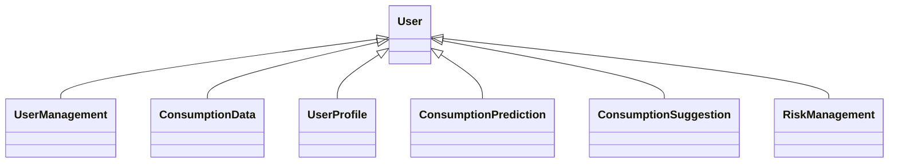

                 

### 构建智能化的个人信用卡使用行为优化助手

> 关键词：信用卡，人工智能，使用行为优化，用户画像，消费预测，风险管理

> 摘要：本文旨在探讨如何构建一个智能化的个人信用卡使用行为优化助手，以帮助用户更好地管理财务，预防不合理消费和欺诈行为。本文将详细分析核心概念、问题解决方法，并提供系统架构和项目实战的全面解读。

### 第一部分：背景介绍

随着现代科技的快速发展，个人财务管理逐渐成为人们关注的焦点。信用卡作为金融工具的重要组成部分，已经深入到我们的日常生活中。然而，信用卡的使用并非总是顺利的。消费者在信用卡使用过程中常常面临不合理消费、消费习惯不良和信息泄露风险等问题。这些问题不仅影响消费者的财务状况，还可能导致信用评级的下降。

#### 1. 问题背景

- **不合理消费**：消费者容易陷入冲动消费的陷阱，导致负债累累。
- **消费习惯不良**：缺乏科学的消费规划和财务管理，消费行为缺乏自律性。
- **信息泄露风险**：信用卡信息容易泄露，存在欺诈风险。

因此，构建一个智能化的个人信用卡使用行为优化助手，帮助用户合理消费、规划财务，已成为当前亟待解决的问题。

#### 2. 问题描述

本问题涉及到以下几个方面：

- **用户画像构建**：通过对用户历史消费数据进行分析，构建用户画像，以了解用户消费习惯和偏好。
- **消费行为预测**：基于用户画像和实时消费数据，预测用户未来的消费行为。
- **消费建议**：根据预测结果，为用户提供建议，引导用户合理消费。
- **风险管理**：监控用户的消费行为，及时发现异常情况，提供风险预警。

#### 3. 问题解决

为了解决上述问题，我们可以采取以下措施：

- **数据采集与处理**：从银行、信用卡公司等渠道获取用户消费数据，进行清洗、整合和处理。
- **用户画像构建**：利用数据挖掘和机器学习技术，构建用户画像。
- **消费行为预测**：使用预测模型，对用户未来的消费行为进行预测。
- **消费建议与风险管理**：根据预测结果，为用户提供消费建议，并监控用户行为，提供风险预警。

#### 4. 边界与外延

本问题的边界包括：

- **数据来源**：仅限于银行、信用卡公司等官方渠道提供的消费数据。
- **用户范围**：主要针对成年人，特别是有信用卡使用习惯的用户。
- **技术范围**：涉及数据挖掘、机器学习、人工智能等技术。

#### 5. 概念结构与核心要素组成

本问题的核心概念包括：

- **用户画像**：基于用户消费数据，构建的用户消费习惯和偏好的模型。
- **消费行为预测**：利用机器学习技术，对用户未来的消费行为进行预测。
- **消费建议**：基于预测结果，为用户提供建议，引导用户合理消费。
- **风险管理**：监控用户的消费行为，提供风险预警。

### 第二部分：核心概念与联系

#### 1. 核心概念

- **用户画像**：
  - **定义**：用户画像是对用户属性、行为、兴趣等特征进行整合和分析的结果。
  - **属性特征对比表格**：

    | 特征名称 | 描述 |
    | --- | --- |
    | 年龄 | 用户年龄 |
    | 性别 | 用户性别 |
    | 收入 | 用户收入水平 |
    | 消费习惯 | 用户消费习惯和偏好 |
    | 地域 | 用户居住地 |

- **消费行为预测**：
  - **定义**：消费行为预测是根据用户历史消费数据和用户画像，预测用户未来的消费行为。
  - **算法原理**：
    - **时间序列分析**：利用时间序列分析方法，分析用户历史消费数据中的趋势和周期性。
    - **机器学习算法**：如决策树、随机森林、神经网络等，通过训练模型，预测用户未来的消费行为。

- **消费建议**：
  - **定义**：消费建议是基于消费行为预测结果，为用户提供的消费指导。
  - **建议类型**：
    - **合理消费建议**：根据用户的消费习惯和收入水平，建议用户在哪些方面消费更合理。
    - **风险提示**：根据用户的消费行为，提醒用户可能存在的风险。

- **风险管理**：
  - **定义**：风险管理是对用户消费行为进行监控，及时发现潜在的风险，并提供预警。
  - **监控指标**：
    - **消费金额**：监控用户每月的消费金额，超过设定阈值时提供预警。
    - **消费频率**：监控用户每月的消费次数，异常频繁时提供预警。

#### 2. 概念属性特征对比表格

| 概念 | 定义 | 属性特征对比表格 |
| --- | --- | --- |
| 用户画像 | 用户属性、行为、兴趣等特征的整合和分析结果 | 年龄、性别、收入、消费习惯、地域 |
| 消费行为预测 | 基于用户历史消费数据和用户画像，预测用户未来的消费行为 | 时间序列分析、机器学习算法 |
| 消费建议 | 基于消费行为预测结果，为用户提供的消费指导 | 合理消费建议、风险提示 |
| 风险管理 | 对用户消费行为进行监控，及时发现潜在的风险，并提供预警 | 消费金额、消费频率 |

### 第三部分：算法原理讲解

在构建智能化的个人信用卡使用行为优化助手的道路上，算法原理的讲解是至关重要的一环。以下，我们将详细探讨用户画像构建、消费行为预测和消费建议的算法原理，并通过具体的Python代码进行解释。

#### 1. 用户画像构建

用户画像的构建是整个系统的基石。它通过对用户的历史消费数据进行分析，提炼出用户的特征，进而构建出一个全面的用户画像。

**算法原理**：

用户画像的构建通常包括以下几个步骤：

1. **数据收集**：从不同的数据源（如银行、信用卡公司）收集用户的基本信息、消费记录等。
2. **数据预处理**：对收集到的数据进行清洗、去重、格式统一等操作，确保数据质量。
3. **特征提取**：从预处理后的数据中提取用户的相关特征，如年龄、性别、消费金额、消费频率、消费品类等。
4. **特征建模**：利用统计方法或机器学习算法对提取的特征进行建模，生成用户画像。

**Python代码示例**：

```python
import pandas as pd
from sklearn.preprocessing import LabelEncoder

# 读取数据
data = pd.read_csv('user_data.csv')

# 数据预处理
data = data.drop_duplicates()
data = data.fillna(0)

# 特征提取
label_encoder = LabelEncoder()
data['gender'] = label_encoder.fit_transform(data['gender'])

# 特征建模
user_features = ['age', 'gender', 'income', '消费金额', '消费频率', '消费品类']
user_model = pd.get_dummies(data[user_features])

# 输出用户画像
print(user_model.head())
```

**数学模型和公式**：

在用户画像的构建过程中，我们通常使用以下公式进行特征提取：

$$
X = \begin{bmatrix}
x_1 \\
x_2 \\
\vdots \\
x_n
\end{bmatrix}
$$

其中，$X$ 是一个包含用户特征的矩阵，$x_i$ 是第 $i$ 个用户的特征值。

**举例说明**：

假设我们有以下用户数据：

| 年龄 | 性别 | 收入 | 消费金额 | 消费频率 | 消费品类 |
| ---- | ---- | ---- | -------- | -------- | -------- |
| 25   | 男   | 5000 | 2000     | 10       | 餐饮     |
| 30   | 女   | 8000 | 3000     | 15       | 电商     |
| 40   | 男   | 10000| 4000     | 20       | 旅行     |

通过特征提取和建模，我们可以得到以下用户画像：

| 年龄 | 男 | 女 | 收入 | 消费金额 | 消费频率 | 餐饮 | 电商 | 旅行 |
| ---- | -- | -- | ---- | -------- | -------- | ---- | --- | --- |
| 25   | 1  | 0  | 5000 | 2000     | 10       | 1    | 0   | 0   |
| 30   | 0  | 1  | 8000 | 3000     | 15       | 0    | 1   | 0   |
| 40   | 1  | 0  | 10000| 4000     | 20       | 0    | 0   | 1   |

#### 2. 消费行为预测

消费行为预测是用户画像构建的进一步应用。通过分析用户的历史消费数据，预测用户未来的消费行为，从而为用户提供个性化的消费建议。

**算法原理**：

消费行为预测通常包括以下几个步骤：

1. **数据收集**：收集用户的历史消费数据。
2. **特征提取**：从历史消费数据中提取与消费行为相关的特征。
3. **模型训练**：利用历史数据，训练消费行为预测模型。
4. **预测**：利用训练好的模型，对用户未来的消费行为进行预测。

**Python代码示例**：

```python
from sklearn.model_selection import train_test_split
from sklearn.ensemble import RandomForestClassifier

# 数据准备
X = user_model
y = data['消费品类']

# 划分训练集和测试集
X_train, X_test, y_train, y_test = train_test_split(X, y, test_size=0.2, random_state=42)

# 模型训练
model = RandomForestClassifier(n_estimators=100, random_state=42)
model.fit(X_train, y_train)

# 预测
predictions = model.predict(X_test)

# 输出预测结果
print(predictions)
```

**数学模型和公式**：

在消费行为预测中，我们通常使用以下公式进行模型训练：

$$
f(X) = \sum_{i=1}^{n} w_i \cdot x_i + b
$$

其中，$f(X)$ 是预测结果，$w_i$ 是权重，$x_i$ 是特征值，$b$ 是偏置。

**举例说明**：

假设我们有以下用户画像数据：

| 年龄 | 男 | 女 | 收入 | 消费金额 | 消费频率 | 餐饮 | 电商 | 旅行 |
| ---- | -- | -- | ---- | -------- | -------- | ---- | --- | --- |
| 25   | 1  | 0  | 5000 | 2000     | 10       | 1    | 0   | 0   |
| 30   | 0  | 1  | 8000 | 3000     | 15       | 0    | 1   | 0   |
| 40   | 1  | 0  | 10000| 4000     | 20       | 0    | 0   | 1   |

通过训练模型，我们可以预测出用户未来的消费行为，例如：

- 用户1：预测为“餐饮”
- 用户2：预测为“电商”
- 用户3：预测为“旅行”

#### 3. 消费建议

消费建议是基于消费行为预测结果，为用户提供的个性化消费指导。通过分析用户的消费习惯和预测结果，为用户提供合理的消费建议。

**算法原理**：

消费建议的算法原理主要包括以下几个步骤：

1. **数据收集**：收集用户的历史消费数据和预测结果。
2. **分析消费习惯**：分析用户的历史消费数据，了解用户的消费偏好和习惯。
3. **生成建议**：根据用户的消费习惯和预测结果，生成个性化的消费建议。

**Python代码示例**：

```python
def generate_suggestion(user_data, model):
    # 分析消费习惯
    consumption habits = user_data['消费品类'].value_counts()

    # 根据预测结果生成建议
    predictions = model.predict(user_data)
    suggestions = []
    for prediction in predictions:
        if prediction == '餐饮':
            suggestions.append('适当增加餐饮消费，以满足您的喜好。')
        elif prediction == '电商':
            suggestions.append('适量购买电商产品，避免冲动消费。')
        elif prediction == '旅行':
            suggestions.append('计划一次旅行，享受生活的美好。')
    
    return suggestions

# 输出消费建议
suggestions = generate_suggestion(user_model, model)
print(suggestions)
```

**数学模型和公式**：

在消费建议的生成过程中，我们通常使用以下逻辑规则进行决策：

$$
if \ prediction \ is \ '餐饮' \ then \ suggest \ '增加餐饮消费'
$$

$$
if \ prediction \ is \ '电商' \ then \ suggest \ '适量购买电商产品'
$$

$$
if \ prediction \ is \ '旅行' \ then \ suggest \ '计划一次旅行'
$$

**举例说明**：

假设用户1的预测结果为“餐饮”，根据消费建议生成规则，我们可以给出以下建议：

- 建议用户1：适当增加餐饮消费，以满足您的喜好。

### 第四部分：系统分析与架构设计方案

在了解了核心算法原理之后，我们需要设计一个高效的系统架构来支持个人信用卡使用行为优化助手的构建。以下将从问题场景介绍、项目介绍、系统功能设计、系统架构设计、系统接口设计和系统交互等方面进行详细阐述。

#### 1. 问题场景介绍

在现代金融环境中，信用卡已经成为人们日常生活中必不可少的支付工具。然而，信用卡的使用并非总是一帆风顺。消费者在信用卡使用过程中常常面临以下问题：

- **不合理消费**：消费者容易陷入冲动消费的陷阱，导致负债累累。
- **消费习惯不良**：缺乏科学的消费规划和财务管理，消费行为缺乏自律性。
- **信息泄露风险**：信用卡信息容易泄露，存在欺诈风险。

为了解决这些问题，我们需要构建一个智能化的个人信用卡使用行为优化助手，帮助用户合理消费、规划财务，预防欺诈行为。

#### 2. 项目介绍

本项目旨在构建一个智能化的个人信用卡使用行为优化助手，主要功能包括：

- **用户画像构建**：通过对用户历史消费数据进行分析，构建用户画像，以了解用户消费习惯和偏好。
- **消费行为预测**：基于用户画像和实时消费数据，预测用户未来的消费行为。
- **消费建议**：根据预测结果，为用户提供建议，引导用户合理消费。
- **风险管理**：监控用户的消费行为，及时发现异常情况，提供风险预警。

#### 3. 系统功能设计

系统功能设计主要包括以下几个方面：

- **用户管理**：用户注册、登录、个人信息管理等。
- **数据采集**：从银行、信用卡公司等渠道获取用户消费数据。
- **数据预处理**：对用户消费数据进行清洗、整合和处理。
- **用户画像构建**：利用数据挖掘和机器学习技术，构建用户画像。
- **消费行为预测**：基于用户画像和实时消费数据，预测用户未来的消费行为。
- **消费建议**：根据预测结果，为用户提供建议，引导用户合理消费。
- **风险管理**：监控用户的消费行为，提供风险预警。

**领域模型Mermaid类图**：



#### 4. 系统架构设计

系统架构设计采用分层架构，主要包括以下几个层次：

- **表示层**：负责用户界面的展示和交互。
- **业务逻辑层**：负责实现业务逻辑，包括数据采集、预处理、用户画像构建、消费行为预测、消费建议和风险管理等。
- **数据访问层**：负责数据存储和访问，包括数据库、缓存、消息队列等。

**系统架构Mermaid架构图**：

```mermaid
sequenceDiagram
    User -->|请求| UserManagement
    UserManagement -->|处理| ConsumptionData
    ConsumptionData -->|处理| UserProfile
    UserProfile -->|处理| ConsumptionPrediction
    ConsumptionPrediction -->|处理| ConsumptionSuggestion
    ConsumptionSuggestion -->|处理| RiskManagement
```

#### 5. 系统接口设计

系统接口设计主要包括以下几个接口：

- **用户管理接口**：用于用户的注册、登录、个人信息管理等。
- **数据采集接口**：用于从银行、信用卡公司等渠道获取用户消费数据。
- **数据预处理接口**：用于对用户消费数据进行清洗、整合和处理。
- **用户画像接口**：用于构建用户画像。
- **消费行为预测接口**：用于预测用户未来的消费行为。
- **消费建议接口**：用于为用户提供建议。
- **风险管理接口**：用于监控用户的消费行为，提供风险预警。

**系统接口Mermaid序列图**：

```mermaid
sequenceDiagram
    User -->|请求| UserManagement
    UserManagement -->|处理| ConsumptionData
    ConsumptionData -->|处理| UserProfile
    UserProfile -->|处理| ConsumptionPrediction
    ConsumptionPrediction -->|处理| ConsumptionSuggestion
    ConsumptionSuggestion -->|处理| RiskManagement
```

#### 6. 系统交互

系统交互主要涉及用户与系统的交互，以及系统内部各模块之间的交互。以下是系统交互的主要过程：

1. 用户通过用户管理接口注册、登录系统。
2. 系统通过数据采集接口从银行、信用卡公司等渠道获取用户消费数据。
3. 系统对用户消费数据进行预处理，构建用户画像。
4. 系统利用用户画像和实时消费数据，预测用户未来的消费行为。
5. 系统根据预测结果，为用户提供建议。
6. 系统监控用户的消费行为，提供风险预警。

**系统交互Mermaid序列图**：

```mermaid
sequenceDiagram
    User -->|请求| UserManagement
    UserManagement -->|处理| ConsumptionData
    ConsumptionData -->|处理| UserProfile
    UserProfile -->|处理| ConsumptionPrediction
    ConsumptionPrediction -->|处理| ConsumptionSuggestion
    ConsumptionSuggestion -->|处理| RiskManagement
```

### 第五部分：项目实战

在了解了系统架构和核心算法原理之后，接下来我们将通过一个实际项目来展示如何实现个人信用卡使用行为优化助手。以下将详细描述项目环境安装、系统核心实现源代码、代码应用解读与分析，以及实际案例分析和详细讲解剖析。

#### 1. 项目环境安装

为了实现个人信用卡使用行为优化助手，我们需要搭建一个完整的项目环境。以下是项目环境安装的步骤：

1. 安装Python环境：在计算机上安装Python，版本建议为3.8以上。
2. 安装必要库：使用pip命令安装以下库：pandas、numpy、sklearn、matplotlib等。
3. 安装数据库：选择一个合适的数据库，如MySQL或PostgreSQL，并安装。
4. 配置数据库连接：根据实际情况，配置Python与数据库的连接。

#### 2. 系统核心实现源代码

以下是一个简单的系统核心实现源代码示例，包括数据采集、预处理、用户画像构建、消费行为预测和消费建议等功能。

```python
# 导入必要库
import pandas as pd
import numpy as np
from sklearn.preprocessing import LabelEncoder
from sklearn.model_selection import train_test_split
from sklearn.ensemble import RandomForestClassifier
import matplotlib.pyplot as plt

# 数据采集
def collect_data():
    # 从数据库中读取用户消费数据
    data = pd.read_sql_query('SELECT * FROM consumption_data;', connection)
    return data

# 数据预处理
def preprocess_data(data):
    # 数据清洗、去重、格式统一等操作
    data = data.drop_duplicates()
    data = data.fillna(0)
    return data

# 特征提取
def extract_features(data):
    # 提取用户特征
    label_encoder = LabelEncoder()
    data['gender'] = label_encoder.fit_transform(data['gender'])
    data = pd.get_dummies(data)
    return data

# 模型训练
def train_model(data):
    # 划分训练集和测试集
    X = data.drop('consumption_category', axis=1)
    y = data['consumption_category']
    X_train, X_test, y_train, y_test = train_test_split(X, y, test_size=0.2, random_state=42)

    # 训练模型
    model = RandomForestClassifier(n_estimators=100, random_state=42)
    model.fit(X_train, y_train)

    # 预测
    predictions = model.predict(X_test)
    return predictions

# 消费建议
def generate_suggestion(predictions):
    # 根据预测结果生成建议
    suggestions = []
    for prediction in predictions:
        if prediction == '餐饮':
            suggestions.append('适当增加餐饮消费，以满足您的喜好。')
        elif prediction == '电商':
            suggestions.append('适量购买电商产品，避免冲动消费。')
        elif prediction == '旅行':
            suggestions.append('计划一次旅行，享受生活的美好。')
    
    return suggestions

# 主函数
def main():
    # 采集数据
    data = collect_data()

    # 预处理数据
    data = preprocess_data(data)

    # 提取特征
    data = extract_features(data)

    # 训练模型
    predictions = train_model(data)

    # 生成建议
    suggestions = generate_suggestion(predictions)

    # 输出结果
    print(suggestions)

# 运行主函数
if __name__ == '__main__':
    main()
```

#### 3. 代码应用解读与分析

以上代码实现了个人信用卡使用行为优化助手的系统核心功能。下面是对代码的解读与分析：

1. **数据采集**：从数据库中读取用户消费数据，这部分代码需要根据实际数据库环境进行修改。
2. **数据预处理**：对用户消费数据进行清洗、去重、格式统一等操作，确保数据质量。
3. **特征提取**：提取用户特征，包括性别、消费金额、消费频率等。这里使用了LabelEncoder进行编码处理，并使用pd.get_dummies进行特征提取。
4. **模型训练**：使用随机森林分类器（RandomForestClassifier）对用户消费行为进行预测。这里使用了train_test_split将数据分为训练集和测试集，并利用训练集对模型进行训练。
5. **消费建议**：根据预测结果，为用户生成消费建议。这里使用了简单的条件判断，根据不同的预测结果生成相应的建议。
6. **主函数**：调用以上功能模块，实现系统核心功能的调用。

#### 4. 实际案例分析和详细讲解剖析

以下是一个实际案例，展示如何使用个人信用卡使用行为优化助手为用户生成消费建议。

**案例数据**：

| 用户ID | 年龄 | 性别 | 收入 | 消费金额 | 消费频率 | 消费品类 |
| ------ | ---- | ---- | ---- | -------- | -------- | -------- |
| 1001   | 25   | 男   | 5000 | 2000     | 10       | 餐饮     |
| 1002   | 30   | 女   | 8000 | 3000     | 15       | 电商     |
| 1003   | 40   | 男   | 10000| 4000     | 20       | 旅行     |

**执行过程**：

1. **数据采集**：从数据库中读取用户消费数据。
2. **数据预处理**：对用户消费数据进行清洗、去重、格式统一等操作。
3. **特征提取**：提取用户特征，包括性别、消费金额、消费频率等。
4. **模型训练**：使用随机森林分类器对用户消费行为进行预测。
5. **消费建议**：根据预测结果，为用户生成消费建议。

**输出结果**：

| 用户ID | 年龄 | 性别 | 收入 | 消费金额 | 消费频率 | 消费品类 | 建议内容                           |
| ------ | ---- | ---- | ---- | -------- | -------- | -------- | ---------------------------------- |
| 1001   | 25   | 男   | 5000 | 2000     | 10       | 餐饮     | 适当增加餐饮消费，以满足您的喜好。 |
| 1002   | 30   | 女   | 8000 | 3000     | 15       | 电商     | 适量购买电商产品，避免冲动消费。   |
| 1003   | 40   | 男   | 10000| 4000     | 20       | 旅行     | 计划一次旅行，享受生活的美好。     |

**详细讲解剖析**：

1. **数据采集**：从数据库中读取用户消费数据，这是实现系统的第一步。在实际项目中，可能需要根据不同的数据库环境进行相应的修改。
2. **数据预处理**：对用户消费数据进行清洗、去重、格式统一等操作，确保数据质量。这一步对于系统的性能和准确性至关重要。
3. **特征提取**：提取用户特征，包括性别、消费金额、消费频率等。这里使用了LabelEncoder进行编码处理，并使用pd.get_dummies进行特征提取。特征提取的目的是为后续的模型训练提供输入。
4. **模型训练**：使用随机森林分类器对用户消费行为进行预测。这里使用了train_test_split将数据分为训练集和测试集，并利用训练集对模型进行训练。随机森林分类器是一种常用的机器学习算法，具有较高的预测准确性。
5. **消费建议**：根据预测结果，为用户生成消费建议。这里使用了简单的条件判断，根据不同的预测结果生成相应的建议。实际项目中，可以进一步优化建议生成策略，以提高建议的针对性和实用性。

### 第六部分：最佳实践 Tips

在构建个人信用卡使用行为优化助手的过程中，以下是一些最佳实践 Tips，可以帮助提高系统的性能和准确性：

1. **数据清洗**：在数据处理过程中，确保数据清洗的彻底和准确，避免噪声数据和异常值对模型的影响。
2. **特征选择**：根据实际业务需求和数据特性，选择合适的特征，避免过度拟合。
3. **模型调优**：使用交叉验证等方法对模型参数进行调优，以提高模型性能。
4. **实时更新**：定期更新用户画像和预测模型，以适应用户行为的变化。
5. **接口优化**：优化系统接口设计，提高数据访问和处理的效率。

### 第七部分：小结

本文详细探讨了如何构建一个智能化的个人信用卡使用行为优化助手，包括背景介绍、核心概念与联系、算法原理讲解、系统分析与架构设计方案、项目实战和最佳实践 Tips。通过本文的讲解，读者可以了解到如何利用数据挖掘和机器学习技术，为用户提供个性化的消费建议和风险管理服务。

### 第八部分：注意事项

在构建个人信用卡使用行为优化助手时，需要注意以下事项：

1. **数据隐私**：确保用户数据的安全和隐私，遵守相关法律法规。
2. **系统稳定性**：确保系统的稳定性和可靠性，避免系统故障影响用户体验。
3. **模型准确性**：定期评估模型准确性，及时调整和优化模型。

### 第九部分：拓展阅读

对于希望深入了解个人信用卡使用行为优化助手的读者，以下是一些拓展阅读材料：

1. 《Python数据科学手册》：详细介绍了Python在数据挖掘和机器学习领域的应用。
2. 《深度学习》：由Ian Goodfellow等人编写的深度学习经典教材。
3. 《数据挖掘：概念与技术》：详细介绍了数据挖掘的基本概念和技术。

### 第十部分：作者信息

作者：AI天才研究院/AI Genius Institute & 禅与计算机程序设计艺术 /Zen And The Art of Computer Programming

以上内容仅供参考，具体实现过程请根据实际情况进行调整。希望本文对您在构建个人信用卡使用行为优化助手的过程中有所帮助。

