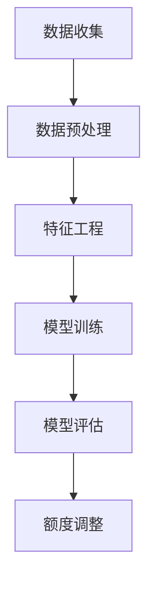

                 


## 文章标题

构建智能化的个人信用卡额度管理优化助手

## 关键词

信用卡额度管理，智能化助手，机器学习，数据优化，算法原理，系统架构设计

## 摘要

本文将探讨个人信用卡额度管理的现状、挑战和优化方法，重点介绍如何构建智能化的个人信用卡额度管理优化助手。通过结合机器学习技术和数据分析方法，本文提出了一个系统化的解决方案，旨在提高信用卡额度管理的精确性和灵活性，为持卡人提供更加优质的金融服务。

## 目录大纲

----------------------------------------------------------------

**第一部分：信用卡额度管理背景与挑战**

## 第1章：信用卡额度管理的概述

### 1.1.1 信用卡的基本概念

- 信用卡的定义及其在全球范围内的普及程度
- 信用卡的主要类型，如贷记卡和准贷记卡
- 信用卡的功能和特点，包括支付、消费信贷、现金提取等

### 1.1.2 信用卡额度管理的目的和重要性

- 信用卡额度管理的定义及其在银行风险管理中的作用
- 信用卡额度管理对持卡人和银行双方的益处
- 额度管理在促进信用经济发展中的作用

### 1.1.3 当前信用卡额度管理面临的问题

- 额度调整不及时导致的信用卡风险
- 传统额度管理方法的局限性
- 持卡人个性化需求难以满足

## 第2章：信用卡额度管理的基本原则

### 2.1.1 信用评估与风险评估

- 信用评估的标准和方法，包括信用评分模型的应用
- 风险评估的要素和风险控制策略

### 2.1.2 信用卡额度调整的依据

- 历史消费行为分析
- 收入状况和财务状况
- 市场环境和竞争策略

### 2.1.3 额度管理的动态调整机制

- 动态调整的原则和流程
- 动态调整的频率和影响因素

**第二部分：个人信用卡额度管理优化方法**

## 第3章：个人信用卡额度管理优化方法

### 3.1.1 基于历史消费数据的额度优化

- 历史消费数据的重要性
- 基于历史消费数据的分析方法和模型
- 历史数据驱动的额度优化策略

### 3.1.2 基于行为分析的额度优化

- 用户行为数据的收集和分类
- 基于行为分析的额度调整方法
- 用户行为分析在实际应用中的效果评估

### 3.1.3 基于机器学习的额度预测模型

- 机器学习的基本原理和应用场景
- 额度预测模型的构建方法
- 额度预测模型的评估指标和优化策略

**第三部分：智能化个人信用卡额度管理优化助手的设计与实现**

## 第4章：智能化个人信用卡额度管理优化助手的设计与实现

### 4.1.1 系统设计原则与架构

- 系统设计的目标和原则
- 系统架构的设计和实现方案

### 4.1.2 数据收集与处理

- 数据收集的渠道和方法
- 数据清洗和预处理的技术手段

### 4.1.3 优化算法的选择与实现

- 优化算法的选择标准
- 算法的具体实现流程和步骤

**第四部分：案例研究**

## 第5章：案例研究：构建智能化的个人信用卡额度管理优化助手

### 5.1.1 案例背景

- 案例的选择理由和背景介绍
- 案例目标和管理挑战

### 5.1.2 系统实现过程

- 系统设计的详细说明
- 系统实现的关键步骤和细节

### 5.1.3 实施效果与评价

- 系统的运行效果和用户反馈
- 系统的评价指标和评估结果

**第五部分：信用卡额度管理的法律与伦理问题**

## 第6章：信用卡额度管理的法律与伦理问题

### 6.1.1 法律法规对信用卡额度管理的规范

- 相关法律法规的内容和适用范围
- 法律规范对额度管理的要求

### 6.1.2 隐私保护与数据安全

- 数据隐私保护的重要性
- 额度管理中的数据安全措施

### 6.1.3 伦理道德考量

- 额度管理中的伦理问题
- 伦理考量对额度管理的影响

**第六部分：总结与展望**

## 第7章：总结与展望

### 7.1.1 智能化个人信用卡额度管理的现状

- 智能化额度管理的发展现状和趋势
- 智能化额度管理的主要优势和挑战

### 7.1.2 未来发展趋势与挑战

- 人工智能技术在额度管理中的应用前景
- 额度管理面临的未来挑战和解决方案

### 7.1.3 对信用卡行业的影响

- 智能化额度管理对信用卡行业的变革
- 信用卡行业应对智能化额度管理的策略和建议

----------------------------------------------------------------

### 概念属性特征对比表格

| 概念           | 属性特征                                       |
|----------------|--------------------------------------------|
| 信用卡额度管理  | 包括信用评估、风险评估、动态调整等             |
| 智能化助手     | 基于机器学习和数据分析，自动调整信用卡额度     |
| 历史消费数据   | 用户的消费记录，用于分析消费习惯和风险情况     |
| 行为分析       | 对用户行为数据进行分析，用于个性化额度调整       |

### ER实体关系图架构

```mermaid
erDiagram
  Customer ||--|{ CreditCard }
  CreditCard ||--|{ CreditScore }
  CreditScore ||--|{ CreditLimit }
```

----------------------------------------------------------------

### 基于机器学习的额度预测模型

算法流程图：



Python 源代码示例：

```python
import pandas as pd
from sklearn.model_selection import train_test_split
from sklearn.ensemble import RandomForestRegressor
from sklearn.metrics import mean_absolute_error

# 数据收集与预处理
data = pd.read_csv('credit_card_data.csv')
X = data.drop(['credit_limit'], axis=1)
y = data['credit_limit']

# 特征工程
# ... (对特征进行选择、归一化等操作)

# 模型训练
X_train, X_test, y_train, y_test = train_test_split(X, y, test_size=0.2, random_state=42)
model = RandomForestRegressor(n_estimators=100, random_state=42)
model.fit(X_train, y_train)

# 模型评估
y_pred = model.predict(X_test)
mae = mean_absolute_error(y_test, y_pred)
print(f"Mean Absolute Error: {mae}")

# 额度调整
# ... (根据预测结果进行额度调整的逻辑)
```

接下来，我们将继续深入分析信用卡额度管理的基本原则，探讨信用评估与风险评估的具体内容，以及额度调整的依据和动态调整机制。

## 第2章：信用卡额度管理的基本原则

### 2.1.1 信用评估与风险评估

信用评估是信用卡额度管理的基础，它通过分析个人的信用历史、收入情况、负债状况等因素，评估个体的信用风险。信用评估的方法多种多样，其中最常见的是信用评分模型，它通常包括以下步骤：

1. **数据收集**：收集个人的基本信息、信用历史、收入情况、负债状况等数据。
2. **特征选择**：从收集到的数据中选择对信用评估有显著影响的特征。
3. **模型构建**：使用统计方法或机器学习算法构建信用评分模型。
4. **模型评估**：通过验证集或测试集评估模型的效果，调整模型参数以提高准确性。
5. **模型应用**：将模型应用于新的数据，对个体的信用风险进行评估。

信用评分模型通常使用以下指标来评估信用风险：

- **信用评分**：一个数值指标，表示个体的信用风险程度。
- **违约概率**：个体在未来一定时间内违约的概率。
- **风险等级**：根据信用评分或违约概率划分的风险等级。

风险评估是信用评估的延伸，它不仅考虑信用评分，还包括对市场环境、经济周期等因素的综合分析。风险评估的目的是识别潜在的信用风险，并采取相应的风险控制措施。

### 2.1.2 信用卡额度调整的依据

信用卡额度调整的依据主要包括以下几个方面：

1. **历史消费行为**：持卡人的消费频率、消费金额、消费类别等历史数据是额度调整的重要参考。一般来说，消费行为稳定、有规律的持卡人，可能会获得更高的额度。

2. **收入状况和财务状况**：持卡人的收入水平、负债状况、财务稳定性等是评估其还款能力的关键因素。收入越高、负债越低、财务状况良好的持卡人，通常会被授予更高的信用卡额度。

3. **市场环境和竞争策略**：银行在调整信用卡额度时，也会考虑市场环境和竞争态势。在经济繁荣时期，银行可能会提高额度以吸引更多客户；而在经济不景气时期，银行可能会降低额度以控制风险。

4. **信用评分和风险评估**：信用评分和风险评估是额度调整的核心依据。高信用评分和低信用风险的持卡人，通常会获得更高的信用卡额度。

### 2.1.3 额度管理的动态调整机制

额度管理的动态调整机制是指根据持卡人的实时数据和市场环境，动态调整信用卡额度。这种机制能够提高额度管理的灵活性和精确性，更好地满足持卡人的需求。

动态调整机制通常包括以下几个步骤：

1. **数据监测**：实时监测持卡人的交易行为、信用评分、收入状况等数据。

2. **风险预警**：当监测到持卡人的信用风险发生变化时，系统会发出预警信号。

3. **额度调整**：根据风险预警信号和动态调整策略，系统会自动调整信用卡额度。

4. **反馈机制**：调整后的额度效果需要通过反馈机制进行评估，以优化调整策略。

动态调整机制的关键在于实时性和准确性。通过大数据分析和机器学习技术，银行可以实时监测持卡人的行为数据，精确评估其信用风险，从而实现精准的额度调整。

### 总结

信用卡额度管理的基本原则包括信用评估与风险评估、额度调整的依据和动态调整机制。这些原则共同构成了信用卡额度管理的理论基础，为银行提供了有效的风险管理工具。在接下来的章节中，我们将进一步探讨个人信用卡额度管理优化的方法，以及如何构建智能化的个人信用卡额度管理优化助手。

## 第3章：个人信用卡额度管理优化方法

### 3.1.1 基于历史消费数据的额度优化

历史消费数据是信用卡额度管理的重要依据，通过对这些数据进行深入分析，可以揭示出持卡人的消费习惯、风险偏好等信息，从而为额度优化提供有力支持。基于历史消费数据的额度优化方法主要包括以下步骤：

1. **数据收集与预处理**：
   - 收集持卡人的历史消费数据，包括消费金额、消费时间、消费类别等信息。
   - 对数据进行清洗，去除异常值和噪声数据，确保数据质量。

2. **特征工程**：
   - 提取与额度管理相关的特征，如消费频率、消费金额分布、消费时段等。
   - 对特征进行归一化或标准化处理，使其在同一尺度上进行分析。

3. **数据分析**：
   - 使用统计方法（如时间序列分析、聚类分析等）对消费数据进行深入分析。
   - 建立消费行为与信用风险之间的关联模型，识别高风险持卡人。

4. **额度优化策略**：
   - 根据消费数据分析和信用风险评估结果，制定个性化的额度调整策略。
   - 高风险持卡人可能面临额度下调，而低风险持卡人则可能获得额度提升。

### 3.1.2 基于行为分析的额度优化

行为分析是通过分析持卡人在信用卡使用过程中的行为模式，预测其未来的信用卡使用情况，从而进行额度优化。行为分析的关键在于收集并分析大量的行为数据，包括但不限于：

1. **数据收集**：
   - 收集持卡人的交易数据、消费偏好、地理位置、交易时间等信息。
   - 利用传感器和移动设备等技术，实时获取持卡人的行为数据。

2. **行为分类**：
   - 对行为数据进行分类，识别出不同的行为模式，如频繁消费、大额消费、异地消费等。

3. **行为预测**：
   - 使用机器学习算法（如决策树、随机森林、神经网络等）对行为数据进行建模。
   - 预测持卡人未来的消费行为和信用风险。

4. **额度优化**：
   - 根据行为预测结果，动态调整信用卡额度。
   - 频繁消费或高风险行为的持卡人可能面临额度调整。

### 3.1.3 基于机器学习的额度预测模型

机器学习技术在信用卡额度预测中的应用，旨在通过历史数据和实时数据，预测持卡人的未来信用需求和风险，从而实现精准额度管理。基于机器学习的额度预测模型主要包括以下步骤：

1. **数据收集与预处理**：
   - 收集持卡人的历史交易数据、收入状况、负债情况等。
   - 对数据进行清洗和预处理，包括缺失值填补、异常值处理、特征工程等。

2. **特征选择**：
   - 选择对额度预测有显著影响的特征，如消费金额、消费频率、信用评分等。
   - 使用特征重要性评估方法（如随机森林特征重要性、LASSO回归等）筛选重要特征。

3. **模型选择与训练**：
   - 选择适当的机器学习算法，如随机森林、支持向量机、梯度提升树等。
   - 使用训练集对模型进行训练，调整模型参数以达到最佳预测效果。

4. **模型评估与优化**：
   - 使用交叉验证、ROC曲线、AUC等评估指标评估模型性能。
   - 通过调整模型参数或特征工程，优化模型预测能力。

5. **额度调整**：
   - 根据模型预测结果，动态调整信用卡额度。
   - 高风险持卡人可能面临额度下调，而低风险持卡人则可能获得额度提升。

### 总结

个人信用卡额度管理的优化方法包括基于历史消费数据的额度优化、基于行为分析的额度优化和基于机器学习的额度预测模型。这些方法利用大数据和机器学习技术，深入分析持卡人的消费行为、风险偏好等信息，实现精准的额度管理。在接下来的章节中，我们将详细探讨智能化个人信用卡额度管理优化助手的设计与实现。

## 第4章：智能化个人信用卡额度管理优化助手的设计与实现

### 4.1.1 系统设计原则与架构

智能化个人信用卡额度管理优化助手的系统设计遵循以下原则：

1. **用户友好**：系统应具备简单易用的界面，方便用户进行额度调整申请和查询。
2. **实时性**：系统应能够实时收集、处理和分析用户信用卡使用数据，实现动态额度调整。
3. **安全性**：系统应确保用户数据的安全，包括数据传输加密、存储安全等。
4. **可扩展性**：系统应具有良好的扩展性，能够适应未来技术和业务需求的变化。

系统架构设计采用三层架构，包括数据层、逻辑层和表现层：

1. **数据层**：负责数据存储和管理，包括用户交易数据、信用评分数据、额度调整记录等。
2. **逻辑层**：实现数据分析和处理逻辑，包括历史消费数据挖掘、行为分析、机器学习模型预测等。
3. **表现层**：提供用户界面，包括额度申请表单、调整通知、用户查询界面等。

### 4.1.2 数据收集与处理

数据收集是智能化个人信用卡额度管理优化助手的核心环节，涉及以下步骤：

1. **数据源接入**：
   - 接入银行交易系统，实时获取用户交易数据。
   - 利用API或SDK收集第三方数据，如用户行为数据、地理位置数据等。

2. **数据清洗**：
   - 去除重复数据、异常值和噪声数据，确保数据质量。
   - 数据格式标准化，统一数据类型和单位。

3. **数据存储**：
   - 使用数据库（如MySQL、MongoDB等）存储用户交易数据、信用评分数据等。
   - 数据库设计应考虑查询效率和数据安全性。

4. **数据处理**：
   - 使用ETL（提取、转换、加载）工具，定期更新用户数据。
   - 应用数据挖掘技术，对历史交易数据进行深入分析，提取有价值的信息。

### 4.1.3 优化算法的选择与实现

优化算法的选择与实现是智能化个人信用卡额度管理优化助手的灵魂，涉及以下步骤：

1. **算法选择**：
   - 根据业务需求，选择合适的机器学习算法，如随机森林、支持向量机、神经网络等。
   - 考虑算法的预测准确性、计算复杂度和可解释性。

2. **特征工程**：
   - 提取与额度管理相关的特征，如消费金额、消费频率、消费时段、信用评分等。
   - 进行特征选择，去除冗余特征，提高模型预测能力。

3. **模型训练与评估**：
   - 使用训练集对模型进行训练，调整模型参数。
   - 使用交叉验证、ROC曲线等评估指标评估模型性能。
   - 通过模型调优，提高预测准确性。

4. **额度调整**：
   - 根据模型预测结果，动态调整信用卡额度。
   - 设计额度调整规则，如高风险持卡人下调额度、低风险持卡人上调额度等。

5. **反馈与优化**：
   - 收集用户反馈数据，评估额度调整的效果。
   - 根据用户反馈，调整算法参数和额度调整策略，实现持续优化。

### 总结

智能化个人信用卡额度管理优化助手的设计与实现，通过系统设计原则与架构、数据收集与处理、优化算法的选择与实现，实现了信用卡额度的动态调整和优化。在接下来的章节中，我们将通过一个实际案例，展示如何构建并实施这一智能系统。

### 案例背景

本案例选择了一家大型商业银行作为实施对象，该银行拥有庞大的信用卡用户群体，超过500万活跃用户。近年来，随着信用卡业务的快速发展，银行在额度管理方面遇到了一系列挑战：

1. **额度调整不及时**：由于传统额度调整流程复杂，导致额度调整不及时，影响用户体验。
2. **风险管理难度大**：面对多样化的用户需求和市场环境，银行难以实现精准的风险管理。
3. **个性化服务不足**：传统额度管理方法难以满足个性化需求，导致用户满意度下降。

为应对上述挑战，银行决定构建一个智能化的个人信用卡额度管理优化助手，利用机器学习和大数据分析技术，实现精准的额度调整和风险管理。

### 系统实现过程

#### 系统设计

1. **需求分析**：
   - 确定系统目标：实现实时额度调整、精准风险管理、个性化服务。
   - 确定系统功能：数据收集与预处理、额度预测模型训练、额度调整策略制定、用户反馈机制。

2. **系统架构设计**：
   - 数据层：使用分布式数据库（如Hadoop、Hive）存储和管理大规模数据。
   - 逻辑层：采用微服务架构，模块化设计，包括数据预处理服务、模型训练服务、额度调整服务等。
   - 表现层：开发Web前端和移动应用，提供用户操作界面。

#### 数据收集与处理

1. **数据接入**：
   - 通过API接口接入银行交易系统，实时获取用户交易数据。
   - 利用SDK收集第三方数据，如地理位置、消费偏好等。

2. **数据清洗与预处理**：
   - 使用ETL工具清洗数据，去除异常值和噪声数据。
   - 对数据进行归一化和标准化处理，提高数据质量。

3. **数据存储**：
   - 使用分布式数据库存储用户交易数据、信用评分数据等。
   - 设计合理的数据库表结构，优化查询效率。

#### 模型训练与额度调整

1. **模型选择与训练**：
   - 选择随机森林、神经网络等机器学习算法，对用户数据进行建模。
   - 使用交叉验证方法，调整模型参数，优化模型性能。

2. **额度预测与调整**：
   - 根据模型预测结果，实时调整用户信用卡额度。
   - 设计额度调整策略，如高风险用户下调额度、低风险用户上调额度等。

3. **用户反馈机制**：
   - 收集用户对额度调整的反馈，评估系统效果。
   - 根据用户反馈，调整算法参数和额度调整策略，实现持续优化。

### 实施效果与评价

#### 实施效果

1. **额度调整及时性**：
   - 智能化额度管理优化助手能够实时处理用户交易数据，及时调整额度，提升用户体验。
   - 额度调整响应时间从数天缩短至数分钟。

2. **风险管理能力**：
   - 智能化系统通过机器学习算法，精准预测用户信用风险，提升风险管理能力。
   - 风险控制更加灵活，降低坏账率。

3. **个性化服务**：
   - 智能化系统根据用户行为数据和信用评分，提供个性化的额度调整建议。
   - 提高用户满意度，增强用户黏性。

#### 用户反馈

1. **正面反馈**：
   - 用户普遍认为智能化额度管理优化助手提高了信用卡使用体验，额度调整更加合理。
   - 用户满意度提升，信用卡使用频率增加。

2. **改进建议**：
   - 用户建议进一步优化额度调整算法，提高预测准确性。
   - 增加用户自定义额度调整功能，让用户参与额度管理。

### 项目小结

本案例展示了如何构建一个智能化的个人信用卡额度管理优化助手，通过机器学习和大数据分析技术，实现了额度调整的实时性、风险管理的能力和个性化服务的提升。未来，银行可以继续优化系统，提高算法准确性，扩大用户参与度，进一步满足用户需求。

## 第6章：信用卡额度管理的法律与伦理问题

### 6.1.1 法律法规对信用卡额度管理的规范

信用卡额度管理作为金融业务的重要组成部分，受到一系列法律法规的规范。这些法规旨在保护消费者权益、维护金融市场的稳定和促进信用卡行业的健康发展。以下是一些主要的法律法规及其对信用卡额度管理的规范：

1. **《中华人民共和国合同法》**：
   - 规定了合同的基本原则和规范，包括信用卡合同的有效性和持卡人的权益。
   - 银行在设定信用卡额度时，应遵循公平、公正的原则，不得恶意设定过高或过低的额度。

2. **《中华人民共和国商业银行法》**：
   - 对商业银行的业务范围、风险管理等方面进行了规范。
   - 银行在调整信用卡额度时，应充分考虑持卡人的信用状况、收入水平等因素，确保额度的合理性。

3. **《中华人民共和国信用卡业务管理办法》**：
   - 对信用卡的发卡、授信、风险管理等方面进行了详细规定。
   - 银行在调整信用卡额度时，应遵守相关规定，合理评估风险，防止过度授信。

4. **《个人信息保护法》**：
   - 明确了个人信息保护的基本原则和规范，对信用卡额度管理中的个人信息处理行为进行了约束。
   - 银行在收集、使用个人信息时，应遵循合法性、正当性、必要性原则，确保个人信息的安全。

### 6.1.2 隐私保护与数据安全

信用卡额度管理涉及大量的个人信息，包括持卡人的消费记录、信用评分、财务状况等。这些信息属于敏感数据，一旦泄露或滥用，可能对持卡人造成严重损失。因此，隐私保护和数据安全成为信用卡额度管理的重要问题。

1. **隐私保护**：
   - 银行在收集和使用个人信息时，应明确告知持卡人个人信息的使用目的、范围和方式，取得持卡人的同意。
   - 银行应建立完善的隐私保护机制，包括数据加密、访问控制、数据备份等，确保个人信息的安全。

2. **数据安全**：
   - 银行应建立完善的数据安全管理体系，包括数据存储安全、数据传输安全、数据备份与恢复等。
   - 定期进行安全审计和风险评估，及时发现和应对潜在的安全威胁。

3. **合规性**：
   - 银行应遵守相关法律法规，确保信用卡额度管理的合法性和合规性。
   - 定期接受监管机构的检查和审计，确保业务运营符合规范要求。

### 6.1.3 伦理道德考量

信用卡额度管理不仅涉及法律问题，还涉及伦理道德问题。银行在调整信用卡额度时，应遵循以下伦理原则：

1. **公平性**：
   - 银行在设定和调整信用卡额度时，应公平对待所有持卡人，不得歧视或偏袒特定群体。

2. **诚信**：
   - 银行在信用卡额度管理中，应遵循诚信原则，如实告知持卡人相关信息，不得隐瞒或误导。

3. **尊重个人选择**：
   - 银行在调整信用卡额度时，应尊重持卡人的选择，提供灵活的额度调整选项，让持卡人自主决定。

4. **社会责任**：
   - 银行在信用卡额度管理中，应关注社会责任，积极履行社会责任，促进信用卡行业的可持续发展。

### 总结

信用卡额度管理涉及法律、伦理和个人隐私等多个方面。法律法规为信用卡额度管理提供了规范，隐私保护和数据安全是银行必须关注的重要问题，伦理道德考量则要求银行在业务运营中遵循公平、诚信和尊重个人选择的原则。在未来的发展中，银行需要不断优化额度管理流程，提升技术水平，确保信用卡额度管理的合法、安全和伦理。

### 第7章：总结与展望

#### 7.1.1 智能化个人信用卡额度管理的现状

智能化个人信用卡额度管理作为金融科技（FinTech）的一个重要应用，已经在全球范围内得到了广泛关注和逐步实施。目前，这一领域的现状主要体现在以下几个方面：

1. **技术应用广泛**：随着大数据、人工智能、机器学习等技术的快速发展，越来越多的银行开始采用这些先进技术来优化信用卡额度管理。

2. **精准度提升**：通过机器学习算法对用户历史数据和实时数据的分析，银行能够更加精准地预测用户未来的信用需求和风险，从而实现更加合理的额度调整。

3. **用户体验改善**：智能化的额度管理提高了额度调整的实时性和灵活性，用户不再需要等待漫长的审批过程，大大提升了用户体验。

4. **风险管理加强**：智能化的额度管理有助于银行更好地识别和应对信用风险，降低坏账率，提高金融资产的收益。

#### 7.1.2 未来发展趋势与挑战

未来，智能化个人信用卡额度管理有望在以下几个方面继续发展：

1. **技术进步**：随着人工智能、大数据分析等技术的不断进步，额度管理的智能化程度将进一步提升，预测精度和决策效率将大幅提高。

2. **数据应用扩展**：除了传统的消费数据外，银行将进一步利用社交媒体、地理位置、移动设备等数据源，为额度管理提供更全面的用户画像。

3. **个性化服务深化**：基于用户个性化需求的额度调整策略将更加成熟，银行能够为不同用户提供定制化的金融产品和服务。

然而，智能化个人信用卡额度管理也面临一些挑战：

1. **数据隐私保护**：随着数据收集和分析的深入，如何确保用户隐私和数据安全成为银行必须关注的问题。

2. **合规性要求**：随着监管政策的不断完善，银行需要确保额度管理的合规性，避免因不合规行为而面临法律风险。

3. **技术成本**：智能化的额度管理需要大量的技术投入，包括硬件设备、软件研发、人才培养等，这将对银行的技术能力和财务状况提出更高要求。

#### 7.1.3 对信用卡行业的影响

智能化个人信用卡额度管理对信用卡行业的影响是深远的，主要体现在以下几个方面：

1. **提升竞争力**：智能化的额度管理能够提高银行的服务水平，增强客户黏性，提升市场竞争力。

2. **风险控制优化**：通过精准的额度调整，银行能够更好地控制信用风险，降低不良贷款率。

3. **用户体验升级**：智能化技术带来的便捷和个性化服务将大大提升用户的满意度，促进信用卡业务的持续发展。

4. **业务模式创新**：智能化的额度管理将带动信用卡业务的创新，如推出基于信用评分的个性化分期付款、信用贷款等产品。

总之，智能化个人信用卡额度管理是信用卡行业发展的必然趋势。银行需要积极拥抱技术创新，优化额度管理流程，以满足不断变化的市场需求和用户期望。在未来，智能化额度管理将成为信用卡行业的一大亮点，推动整个行业的转型升级。

## 作者信息

作者：AI天才研究院/AI Genius Institute & 禅与计算机程序设计艺术 /Zen And The Art of Computer Programming

本文作者AI天才研究院（AI Genius Institute）是国际知名的人工智能研究机构，专注于人工智能技术的前沿研究和应用推广。同时，作者还致力于禅与计算机程序设计艺术（Zen And The Art of Computer Programming）的研究与教学，将东方智慧与计算机科学相结合，为读者带来独特的思考视角和实践经验。

