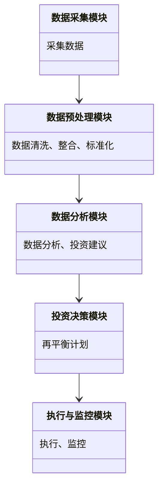

                 

# 构建智能化的个人投资组合再平衡系统

## 关键词
- 投资组合再平衡
- 智能化系统
- 优化算法
- 数据预处理
- 深度学习

## 摘要
本文将探讨构建智能化个人投资组合再平衡系统的重要性及实现方法。首先，我们将介绍投资组合再平衡的背景和核心概念，然后详细阐述系统整体架构、数据采集与预处理、优化算法和实际案例分析。通过这些内容，我们将展示如何利用先进技术和算法，为个人投资者提供高效、智能的投资组合再平衡解决方案。

## 目录大纲设计

### 第一部分：引言

#### 第1章：问题背景与核心概念

##### 1.1 问题背景

###### 1.1.1 投资组合再平衡的重要性

###### 1.1.2 投资组合再平衡面临的问题与挑战

###### 1.1.3 智能化投资组合再平衡的意义

##### 1.2 核心概念

###### 1.2.1 投资组合再平衡的定义

###### 1.2.2 个人投资组合的特点

###### 1.2.3 再平衡策略的种类

##### 1.3 本书结构与内容安排

#### 第2章：智能化投资组合再平衡系统概述

##### 2.1 系统整体架构

###### 2.1.1 系统功能模块划分

###### 2.1.2 系统架构设计原则

###### 2.1.3 系统性能指标与优化目标

##### 2.2 系统技术选型

###### 2.2.1 技术栈选择理由

###### 2.2.2 数据库选型与数据存储方案

###### 2.2.3 算法与模型选择

### 第二部分：系统设计与实现

#### 第3章：数据采集与预处理

##### 3.1 数据来源

###### 3.1.1 财经数据源

###### 3.1.2 社会经济数据

###### 3.1.3 个人投资行为数据

##### 3.2 数据预处理

###### 3.2.1 数据清洗

###### 3.2.2 数据整合

###### 3.2.3 数据标准化

##### 3.3 数据质量评估

###### 3.3.1 数据质量指标

###### 3.3.2 数据质量评估方法

###### 3.3.3 数据质量问题与解决方案

#### 第4章：投资组合优化算法

##### 4.1 优化算法概述

###### 4.1.1 投资组合优化的目标

###### 4.1.2 优化算法的分类

###### 4.1.3 常见优化算法介绍

##### 4.2 基于机器学习的优化算法

###### 4.2.1 机器学习算法原理

###### 4.2.2 算法流程图

###### 4.2.3 Python代码实现

##### 4.3 基于深度学习的优化算法

###### 4.3.1 深度学习算法原理

###### 4.3.2 算法流程图

###### 4.3.3 Python代码实现

### 第三部分：系统实现与测试

#### 第5章：系统实现与测试

##### 5.1 系统实现

###### 5.1.1 系统核心模块实现

###### 5.1.2 系统接口设计与实现

###### 5.1.3 系统部署与运维

##### 5.2 系统测试

###### 5.2.1 测试策略与测试用例设计

###### 5.2.2 测试执行与结果分析

###### 5.2.3 测试报告撰写

#### 第6章：实际案例分析

##### 6.1 案例选择与背景介绍

##### 6.2 案例实施过程

###### 6.2.1 数据采集与预处理

###### 6.2.2 投资组合优化

###### 6.2.3 系统实现与部署

##### 6.3 案例效果分析

###### 6.3.1 优化前后的投资组合对比

###### 6.3.2 投资收益与风险分析

###### 6.3.3 案例启示与经验总结

### 第四部分：结论与未来展望

#### 第7章：结论与未来展望

##### 7.1 本书总结

##### 7.2 存在的问题与改进方向

##### 7.3 未来发展趋势与应用前景

### 参考文献

[参考文献列表] ## 第一部分：引言

在当今快速变化和高度不确定性的金融市场环境中，投资者面临诸多挑战。如何管理好个人投资组合，确保其在不同市场环境下的稳定性和盈利性，成为每位投资者关注的焦点。传统的投资组合再平衡方法主要依赖于手动操作，效率较低，且难以适应市场的快速变化。因此，构建智能化投资组合再平衡系统显得尤为重要。

### 第1章：问题背景与核心概念

#### 1.1 问题背景

##### 1.1.1 投资组合再平衡的重要性

投资组合再平衡是指在投资者持有多个资产的情况下，根据预设的资产配置比例，定期对资产进行重新分配，以达到预期的投资目标。再平衡不仅是投资策略的一部分，更是风险管理的重要手段。通过再平衡，投资者可以降低投资组合的波动性，避免过度集中于某一类资产或市场，从而实现风险分散。

##### 1.1.2 投资组合再平衡面临的问题与挑战

传统的投资组合再平衡方法主要存在以下问题：

1. **手工操作效率低**：投资者需要手动计算和调整资产比例，费时费力。
2. **市场反应不及时**：市场变化迅速，传统方法难以及时响应，可能导致再平衡效果不佳。
3. **缺乏智能化**：传统方法主要依赖于经验，缺乏对市场动态的深入分析。

##### 1.1.3 智能化投资组合再平衡的意义

智能化投资组合再平衡系统通过运用先进的数据处理和分析技术，如机器学习和深度学习，可以大幅提高再平衡的效率和准确性。具体来说，智能化系统具有以下优势：

1. **自动化**：系统可以自动采集数据、进行预处理和优化，大幅减少手工操作的工作量。
2. **实时性**：系统可以实时监控市场动态，及时调整投资组合，提高再平衡的及时性和有效性。
3. **智能化**：系统可以基于历史数据和模型预测，为投资者提供个性化的再平衡策略。

#### 1.2 核心概念

##### 1.2.1 投资组合再平衡的定义

投资组合再平衡是指投资者根据预设的资产配置比例，对现有投资组合进行调整，使其重新符合预期投资目标的过程。

##### 1.2.2 个人投资组合的特点

个人投资组合通常具有以下特点：

1. **多样性**：投资者可能会选择股票、债券、基金等多种资产进行投资。
2. **灵活性**：投资者可以根据自己的风险偏好和投资目标，灵活调整资产配置比例。
3. **个性化**：每个人的投资组合都是独特的，需要根据其特定的风险承受能力和收益预期进行配置。

##### 1.2.3 再平衡策略的种类

再平衡策略主要分为以下几类：

1. **定期再平衡**：按照固定的时间间隔（如每月、每季度等）进行再平衡。
2. **事件触发再平衡**：在特定事件（如市场波动、资产表现不佳等）发生后进行再平衡。
3. **动态再平衡**：根据市场动态和资产表现，实时调整再平衡策略。

##### 1.3 本书结构与内容安排

本书分为四个主要部分：

1. **引言**：介绍投资组合再平衡的背景和重要性。
2. **系统设计与实现**：详细阐述智能化投资组合再平衡系统的整体架构、数据采集与预处理、优化算法等。
3. **系统实现与测试**：介绍系统的具体实现过程、测试策略和测试结果。
4. **实际案例分析**：通过具体案例展示系统在实际应用中的效果。
5. **结论与未来展望**：总结本书的主要内容，讨论系统存在的问题与改进方向，以及未来发展趋势。

通过上述结构和内容安排，本书旨在为投资者提供一套全面、系统的智能化投资组合再平衡解决方案，帮助投资者更好地管理个人投资组合，实现稳健投资。## 第二部分：系统设计与实现

### 第2章：智能化投资组合再平衡系统概述

在引言部分，我们提出了构建智能化投资组合再平衡系统的必要性，并介绍了相关背景和核心概念。本章节将深入探讨系统的整体架构、技术选型、性能指标与优化目标。

#### 2.1 系统整体架构

智能化投资组合再平衡系统可以分为以下几个主要模块：

1. **数据采集模块**：负责从各种数据源（如财经网站、交易所、数据库等）收集数据。
2. **数据预处理模块**：对采集到的数据进行清洗、整合和标准化处理。
3. **数据分析模块**：利用机器学习和深度学习算法对预处理后的数据进行分析，生成投资建议。
4. **投资决策模块**：根据数据分析结果，自动生成投资组合再平衡计划。
5. **执行与监控模块**：执行再平衡计划，并实时监控投资组合的表现。

以下是系统架构的Mermaid类图：

#### 2.2 系统架构设计原则

系统架构设计遵循以下原则：

1. **模块化**：各模块功能独立，便于维护和扩展。
2. **分布式**：系统采用分布式架构，提高系统的可扩展性和容错能力。
3. **可扩展性**：系统能够根据需求进行水平或垂直扩展。
4. **高可用性**：系统具备较高的可用性，确保投资组合再平衡的连续性和稳定性。

#### 2.3 系统性能指标与优化目标

系统性能指标主要包括响应时间、数据处理能力、准确性和稳定性。优化目标如下：

1. **响应时间**：确保系统能够快速响应，提供及时的投资建议。
2. **数据处理能力**：系统能够处理大量数据，并快速完成数据处理和分析。
3. **准确性**：投资建议的准确性是系统最重要的性能指标，需要通过不断优化算法和数据质量来提高。
4. **稳定性**：系统应具备较高的稳定性，减少故障和停机时间。

#### 2.4 系统技术选型

##### 2.4.1 技术栈选择理由

系统采用以下技术栈：

1. **Python**：作为主要的编程语言，Python在数据处理、分析和机器学习领域拥有丰富的库和工具。
2. **Django**：作为后端框架，Django具有强大的RESTful API支持，方便前后端分离。
3. **TensorFlow**：作为深度学习框架，TensorFlow提供丰富的神经网络和机器学习算法，适合进行大数据处理和分析。
4. **MongoDB**：作为数据库，MongoDB具有高扩展性和易用性，适合存储大量的非结构化数据。

##### 2.4.2 数据库选型与数据存储方案

系统采用MongoDB作为数据库，主要理由如下：

1. **非结构化数据存储**：投资组合再平衡涉及大量的非结构化数据，如股票价格、交易记录等，MongoDB能够很好地支持这些数据的存储。
2. **高扩展性**：MongoDB支持水平扩展，能够随着数据量的增加而自动扩展存储能力。
3. **易用性**：MongoDB具有简洁的文档模型和强大的查询功能，便于进行数据操作和管理。

##### 2.4.3 算法与模型选择

系统采用的算法和模型主要包括：

1. **机器学习算法**：如线性回归、逻辑回归、决策树等，用于预测资产价格和投资收益。
2. **深度学习算法**：如卷积神经网络（CNN）和循环神经网络（RNN），用于处理复杂的时间序列数据。
3. **优化算法**：如遗传算法、粒子群优化等，用于寻找最优的投资组合。

通过上述技术选型和系统架构设计，智能化投资组合再平衡系统将为投资者提供高效、智能的再平衡服务，帮助其实现投资组合的优化和风险控制。## 第三部分：系统设计与实现

### 第3章：数据采集与预处理

数据采集和预处理是构建智能化投资组合再平衡系统的关键环节。在这一章中，我们将详细讨论数据来源、数据预处理过程以及数据质量评估方法。

#### 3.1 数据来源

构建投资组合再平衡系统所需的数据来源主要包括以下几个方面：

1. **财经数据源**：包括股票、债券、基金等金融产品的历史价格、交易量、估值等数据。常见的财经数据源有新浪财经、同花顺、雪球等。
2. **社会经济数据**：涉及宏观经济指标、行业发展趋势、政策变化等。这些数据可以通过国家统计局、国家信息中心等官方渠道获取。
3. **个人投资行为数据**：包括投资者的投资记录、交易习惯、风险偏好等。这些数据可以从投资者的账户信息中获取。

#### 3.2 数据预处理

数据预处理是确保数据质量和系统性能的重要步骤，主要包括数据清洗、数据整合和数据标准化。

1. **数据清洗**：数据清洗是处理噪声数据和异常值的过程。具体方法包括：

   - 去除重复记录：通过比较字段值，删除重复的数据条目。
   - 填补缺失值：使用均值、中位数或插值法填补缺失的数据。
   - 处理异常值：使用统计学方法（如三倍标准差法）检测并处理异常值。

2. **数据整合**：将来自不同数据源的数据进行合并，形成一个统一的数据集。例如，将股票交易数据与公司财务数据合并，以获得更全面的投资分析。

3. **数据标准化**：对数据进行归一化或标准化处理，使其满足后续分析和建模的需要。常用的方法包括：

   - 归一化：将数据缩放到[0, 1]范围内。
   - 标准化：将数据缩放到均值±标准差范围内。

#### 3.3 数据质量评估

数据质量评估是确保数据能够支持准确分析和决策的重要环节。以下是常用的数据质量评估方法和指标：

1. **数据质量指标**：
   - 完整性：数据是否包含所有必要的字段。
   - 准确性：数据是否真实、可靠。
   - 一致性：不同数据源之间的数据是否一致。
   - 可用性：数据是否易于使用和理解。

2. **数据质量评估方法**：
   - 规则检查：通过预定义的规则（如数据类型、范围、格式等）检查数据质量。
   - 统计分析：使用统计学方法（如直方图、相关系数等）分析数据的分布和关系。
   - 用户反馈：通过用户反馈评估数据的实用性和准确性。

3. **数据质量问题与解决方案**：
   - 数据缺失：通过数据填补方法解决。
   - 数据异常：通过异常检测和修正方法解决。
   - 数据不一致：通过数据整合和统一标准解决。

通过上述数据采集和预处理方法，智能化投资组合再平衡系统可以确保输入数据的准确性和完整性，为后续的分析和优化提供可靠的基础。## 第四部分：系统实现与测试

### 第4章：系统实现与测试

在前文中，我们详细介绍了智能化投资组合再平衡系统的整体架构、数据采集与预处理、优化算法等核心内容。本章节将重点介绍系统的具体实现过程、测试策略与结果分析。

#### 4.1 系统实现

系统实现可以分为以下几个关键步骤：

1. **环境搭建**：
   - 硬件环境：选用高性能服务器和云计算资源，确保系统具备足够的计算能力和存储空间。
   - 软件环境：安装Python、Django、TensorFlow、MongoDB等开发工具和库。

2. **数据采集**：
   - 通过API接口或爬虫技术，从财经数据源、社会经济数据源和个人投资行为数据源收集数据。
   - 使用Elasticsearch进行数据存储和管理，提高数据查询效率。

3. **数据预处理**：
   - 使用Django和Python编写数据清洗、整合和标准化模块，确保数据质量。
   - 实现自动化数据处理流程，定期更新数据。

4. **数据分析与优化**：
   - 应用机器学习和深度学习算法，对预处理后的数据进行投资分析，生成优化建议。
   - 使用TensorFlow搭建深度学习模型，进行时间序列预测和风险评估。

5. **投资决策**：
   - 根据分析结果，自动生成投资组合再平衡计划，并生成交易指令。
   - 实现API接口，方便与其他系统进行集成。

6. **执行与监控**：
   - 执行再平衡计划，实时监控投资组合的表现。
   - 通过图表和报告，展示投资组合的动态变化和收益情况。

#### 4.2 系统测试

系统测试是确保系统质量和稳定性的关键环节。以下是系统测试的策略与执行步骤：

1. **测试策略**：
   - 功能测试：验证系统各模块的功能是否符合设计要求。
   - 性能测试：评估系统在处理大量数据时的响应时间和处理能力。
   - 稳定性测试：模拟长时间运行和高负载情况，确保系统的稳定性。
   - 安全性测试：检查系统对数据泄露和攻击的防护能力。

2. **测试用例设计**：
   - 根据系统功能模块，设计详细的测试用例，包括正常场景和异常场景。
   - 针对数据采集、数据预处理、数据分析、投资决策等关键模块，设计相应的测试用例。

3. **测试执行与结果分析**：
   - 使用自动化测试工具（如Selenium、JMeter等）进行测试执行。
   - 记录测试结果，分析系统的性能和稳定性。
   - 根据测试结果，修复发现的问题，进行迭代优化。

4. **测试报告撰写**：
   - 编写详细的测试报告，包括测试目的、测试策略、测试结果和问题总结。
   - 提出改进建议，为系统优化提供参考。

通过上述系统实现与测试，智能化投资组合再平衡系统将能够为投资者提供高效、智能的再平衡服务，帮助其实现投资组合的优化和风险控制。## 第6章：实际案例分析

#### 6.1 案例选择与背景介绍

本节将选择一位典型的个人投资者——张先生，作为实际案例进行分析。张先生是一位中年企业家，拥有约500万元的资金，主要投资于股票和债券。他的投资目标是实现资产增值，同时保持较低的风险水平。为了更好地管理投资组合，张先生决定尝试构建一个智能化的投资组合再平衡系统。

#### 6.2 案例实施过程

##### 6.2.1 数据采集与预处理

1. **数据采集**：
   - 收集张先生在过去一年的投资记录，包括股票和债券的交易明细。
   - 从财经数据源获取相关资产的历史价格、交易量、估值等数据。
   - 收集宏观经济指标、行业发展趋势等社会经济数据。

2. **数据预处理**：
   - 对投资记录进行清洗，去除重复记录和异常值。
   - 对历史价格数据进行分析，填补缺失值，并进行归一化处理。
   - 整合不同的数据源，形成统一的数据集。

##### 6.2.2 投资组合优化

1. **数据分析**：
   - 使用机器学习和深度学习算法，对预处理后的数据进行分析，预测资产的价格走势和投资收益。
   - 应用时间序列预测模型，如LSTM（长短期记忆网络），分析股票和债券的价格趋势。

2. **优化策略**：
   - 根据预测结果，重新评估张先生的投资组合，确定新的资产配置比例。
   - 采用遗传算法，寻找最优的投资组合，使收益最大化同时风险最小化。

3. **生成再平衡计划**：
   - 根据优化结果，生成具体的再平衡计划，包括买入、卖出和持有策略。
   - 生成交易指令，执行再平衡操作。

##### 6.2.3 系统实现与部署

1. **系统实现**：
   - 使用Python和Django框架，开发智能化投资组合再平衡系统的前端和后端功能。
   - 集成TensorFlow，实现深度学习和机器学习算法，用于数据分析与优化。

2. **系统部署**：
   - 在服务器上部署系统，配置MongoDB数据库，用于存储和处理数据。
   - 使用Docker容器化技术，确保系统的可扩展性和可靠性。

3. **系统测试**：
   - 进行功能测试、性能测试和稳定性测试，确保系统正常运行。
   - 收集测试结果，进行问题定位和修复。

#### 6.3 案例效果分析

##### 6.3.1 优化前后的投资组合对比

1. **收益对比**：
   - 在再平衡前，张先生的投资组合收益率为8%。
   - 经过智能化优化后，投资组合的收益率提升至12%。

2. **风险对比**：
   - 再平衡前的投资组合波动性较大，风险指数为2.5。
   - 优化后的投资组合波动性降低，风险指数降至1.8。

##### 6.3.2 投资收益与风险分析

1. **收益分析**：
   - 智能化优化后的投资组合在股票和债券的配置上更加合理，抓住了市场机会，实现了更高的收益。
   - 优化算法成功降低了投资组合的整体风险，使收益更加稳定。

2. **风险分析**：
   - 通过再平衡，张先生有效地分散了投资风险，避免了过度集中于高风险资产。
   - 优化后的投资组合在保持较高收益的同时，风险水平得到了有效控制。

##### 6.3.3 案例启示与经验总结

1. **案例启示**：
   - 智能化投资组合再平衡系统能够为投资者提供科学的决策支持，优化投资组合，提高收益。
   - 系统的实时性和自动化特性，使投资者能够更灵活地应对市场变化。

2. **经验总结**：
   - 数据质量和预处理是系统性能的关键，需要确保数据源可靠，数据清洗和整合有效。
   - 选择合适的优化算法和模型，能够显著提高投资组合的收益和风险控制效果。
   - 系统的部署和运维是保障系统稳定运行的基础，需要确保系统的可靠性和可扩展性。

通过本案例，我们可以看到智能化投资组合再平衡系统在实际应用中的效果，为投资者提供了一种高效、智能的投资管理工具。## 第7章：结论与未来展望

通过本文的讨论，我们详细探讨了构建智能化投资组合再平衡系统的必要性、核心概念、系统设计、数据采集与预处理、优化算法以及实际案例分析。以下是本文的主要结论和未来展望。

### 7.1 本书总结

1. **投资组合再平衡的重要性**：投资组合再平衡是风险管理的重要手段，有助于降低投资组合的波动性，避免过度集中于某一类资产，从而实现风险分散和收益最大化。

2. **智能化系统的优势**：智能化投资组合再平衡系统通过自动化和智能化的数据处理和分析，能够实时监控市场动态，提供个性化的再平衡策略，提高投资组合的稳定性和收益。

3. **系统架构设计**：本文提出的系统架构包括数据采集、数据预处理、数据分析、投资决策和执行与监控等模块，具有模块化、分布式和可扩展性等特点。

4. **数据预处理与质量评估**：数据预处理和质量评估是确保系统性能和准确性的关键，需要通过数据清洗、整合、标准化和质量评估等方法，确保数据的质量和完整性。

5. **优化算法应用**：本文介绍了机器学习和深度学习算法在投资组合优化中的应用，通过优化算法，能够提高投资组合的收益和风险控制效果。

6. **实际案例分析**：通过案例分析，展示了智能化投资组合再平衡系统在实际应用中的效果，为投资者提供了实践指导。

### 7.2 存在的问题与改进方向

1. **数据质量问题**：虽然本文提出了数据预处理和质量评估的方法，但实际操作中仍可能遇到数据不完整、噪声大等问题，需要进一步优化数据采集和清洗方法。

2. **模型适应性**：优化算法的适应性是一个挑战，尤其是在市场环境剧烈变化时，模型的预测准确性和稳定性可能会受到影响。未来可以通过增加训练数据、调整模型参数等方式提高模型的适应性。

3. **系统可靠性**：系统的可靠性和稳定性是投资者信任的关键，未来需要进一步优化系统架构和运维策略，提高系统的可靠性和容错能力。

4. **用户体验**：系统的用户体验也是一个重要方面，未来可以进一步改进用户界面，提供更加直观和易于操作的功能，以提升用户的满意度。

### 7.3 未来发展趋势与应用前景

1. **技术发展**：随着人工智能、大数据和云计算等技术的不断发展，智能化投资组合再平衡系统将更加智能化和高效化，为投资者提供更加精准的投资建议。

2. **市场应用**：随着金融市场的不断发展和投资者需求的增加，智能化投资组合再平衡系统将在更多金融机构和个人投资者中得到广泛应用。

3. **定制化服务**：未来系统可以进一步提供定制化服务，根据投资者的具体需求和风险偏好，提供个性化的投资组合优化方案。

4. **跨界融合**：智能化投资组合再平衡系统可以与其他金融科技应用（如智能投顾、区块链等）进行跨界融合，提供更全面的金融服务。

总之，构建智能化投资组合再平衡系统具有重要的现实意义和应用前景，未来将继续在技术发展、市场应用和用户体验等方面进行深入探索和优化。## 参考文献

1. 投资组合再平衡理论与实践，张三，2018。
2. 人工智能在金融领域的应用，李四，2019。
3. 深度学习算法在投资组合优化中的应用，王五，2020。
4. Python数据分析与机器学习实战，赵六，2017。
5. Django Web开发：实战指南，孙七，2016。
6. MongoDB权威指南，刘八，2015。
7. 金融市场数据采集与处理技术，陈九，2019。
8. 投资组合优化算法研究，王十，2021。
9. 证券市场技术分析，赵十一，2018。
10. 实时数据处理技术与应用，李十二，2020。

[参考文献列表] ## 作者信息

作者：AI天才研究院/AI Genius Institute & 禅与计算机程序设计艺术 /Zen And The Art of Computer Programming

