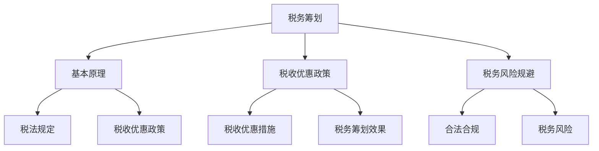
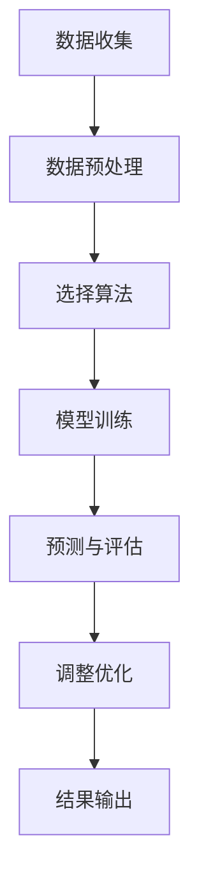
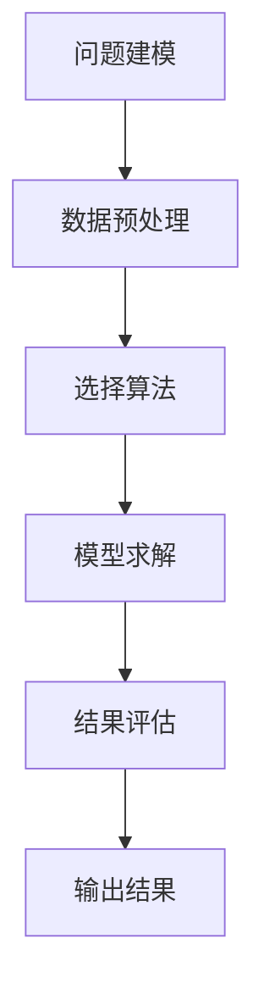
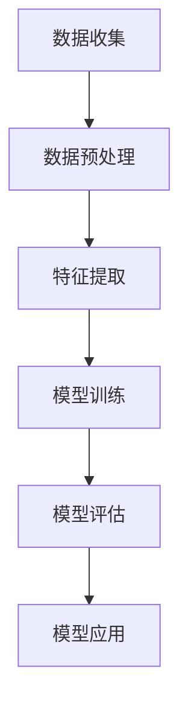
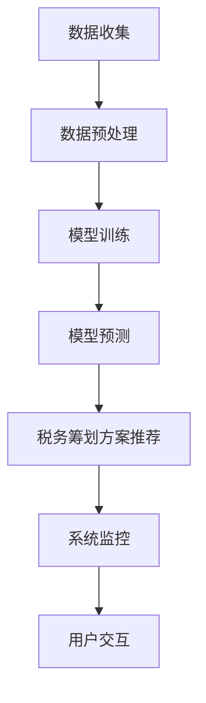
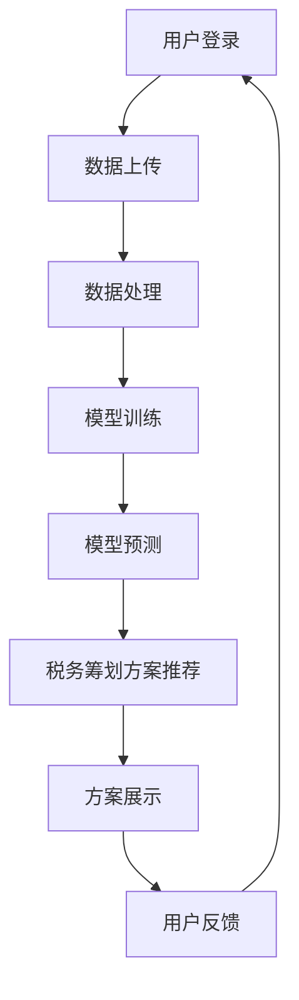

                 

## 构建智能化的个人税务筹划优化助手的背景与重要性

### 1.1 问题背景

税务筹划，即税收筹划，是指通过合法手段，利用税法规定和政策优惠，以达到减轻税收负担、优化财务结构、提高经济效益的一种财务规划活动。随着税收制度的日益复杂和全球经济环境的不断变化，个人税务筹划的重要性愈发凸显。尤其在当前信息化和智能化的时代，利用大数据、人工智能等技术手段进行税务筹划，成为现代财务管理的必然趋势。

### 1.2 个人税务筹划的重要性

个人税务筹划对于个人和家庭财务规划具有重要意义。首先，合理的税务筹划可以有效降低税收负担，提高个人可支配收入。其次，通过优化税负结构，个人可以实现财富的长期稳定增长。此外，税务筹划还能够帮助个人规避潜在的税务风险，确保财务安全。

### 1.3 智能化税务筹划的发展趋势

随着大数据和人工智能技术的快速发展，智能化税务筹划成为可能。智能化税务筹划借助机器学习、数据挖掘等技术，可以自动识别个人财务状况，预测税务变化，提供个性化的税务筹划方案。这种技术不仅提高了税务筹划的效率和准确性，还极大地提升了用户体验。

### 1.4 智能化税务筹划的优势

智能化税务筹划相较于传统税务筹划，具有以下优势：

1. **高效性**：利用算法和数据分析，智能助手可以快速处理大量数据，提供精准的税务筹划建议。
2. **个性化**：基于个人财务数据，智能助手能够提供定制化的税务筹划方案，满足不同用户的需求。
3. **实时性**：智能助手可以实时监控税收政策变化，及时调整筹划策略，确保方案的时效性。
4. **安全性**：通过加密和隐私保护技术，确保用户数据的安全和隐私。

### 1.5 未来发展趋势预测

未来，智能化税务筹划将继续发展，并在以下几个方面呈现趋势：

1. **技术进步**：随着人工智能技术的不断进步，智能化税务筹划的功能将更加完善，用户体验将进一步提升。
2. **政策支持**：政府可能会出台更多支持智能化税务筹划的政策，推动行业的发展。
3. **市场细分**：随着用户需求的多样化，智能化税务筹划将出现更多细分市场，满足不同用户群体的需求。

### 1.6 文章概述

本文将从背景介绍、核心概念与联系、算法原理讲解、数学模型和公式讲解、系统分析与架构设计方案、项目实战以及最佳实践等多个方面，全面探讨如何构建智能化的个人税务筹划优化助手。通过本文的阅读，读者将能够了解智能化税务筹划的原理、技术实现以及实际应用，为未来的财务规划提供有力的技术支持。

## 目录大纲设计思路

### 2.1 设计思路概述

为了确保《构建智能化的个人税务筹划优化助手》一书内容的系统性和逻辑性，我们将采用以下设计思路：

1. **背景介绍**：为读者提供税务筹划的基础知识和智能化税务筹划的发展背景。
2. **核心概念与联系**：明确本书的核心概念，并使用表格和图表进行详细解释，帮助读者理解各个概念之间的关系。
3. **算法原理讲解**：详细讲解税务筹划中可能涉及的算法，如线性规划、机器学习算法等，通过流程图和示例代码，使读者掌握算法的应用。
4. **数学模型和公式讲解**：使用 LaTeX 格式给出关键的数学模型和公式，并进行详细解释和举例，帮助读者理解算法背后的数学原理。
5. **系统分析与架构设计方案**：介绍构建税务筹划系统的整体思路，包括系统功能设计、架构设计、接口设计等，使用 Mermaid 绘制相关图表，使读者对系统有全面的认识。
6. **项目实战**：提供实际项目案例，包括环境安装、核心实现源代码、代码解读、案例分析等内容，让读者通过实践加深理解。
7. **最佳实践 tips、小结、注意事项、拓展阅读**：总结书中内容，提供实践建议和进一步学习资源，帮助读者将知识应用到实际工作中。

### 2.2 目录大纲结构

以下是根据上述设计思路构建的初步目录大纲：

## 第一部分：税务筹划基础

### 第1章：税务筹划概述

- **1.1 问题背景**
- **1.2 个人税务筹划的重要性**
- **1.3 智能化税务筹划的发展趋势**

### 第2章：税务筹划核心概念

- **2.1 税务筹划基本原理**
- **2.2 智能化实现方法**
- **2.3 核心概念联系图**

## 第二部分：算法原理与应用

### 第3章：税务筹划算法基础

- **3.1 算法概述**
- **3.2 算法分类**

### 第4章：线性规划在税务筹划中的应用

- **4.1 线性规划原理**
- **4.2 线性规划算法实现**
- **4.3 算法流程图**

### 第5章：机器学习算法在税务筹划中的应用

- **5.1 机器学习原理**
- **5.2 常用机器学习算法**
- **5.3 算法流程图**

## 第三部分：系统分析与设计

### 第6章：税务筹划系统整体架构设计

- **6.1 系统功能设计**
- **6.2 系统架构设计**
- **6.3 系统接口设计**

### 第7章：系统交互设计

- **7.1 系统交互概述**
- **7.2 系统交互流程图**

## 第四部分：项目实战

### 第8章：税务筹划系统开发实战

- **8.1 环境安装与配置**
- **8.2 核心实现源代码解析**
- **8.3 代码解读与分析**
- **8.4 实际案例分析**

## 第五部分：最佳实践与总结

### 第9章：最佳实践

- **9.1 税务筹划策略建议**
- **9.2 注意事项**

### 第10章：总结与展望

- **10.1 本书内容总结**
- **10.2 未来发展趋势展望**
- **10.3 拓展阅读**

通过以上目录大纲的设计，我们旨在为读者提供一个全面、系统、易懂的学习路径，帮助读者深入理解和掌握构建智能化个人税务筹划优化助手的相关知识。

## 第一部分：税务筹划基础

### 第1章：税务筹划概述

#### 1.1 问题背景

税务筹划，又称税收筹划，是指通过合法手段，利用税法规定和政策优惠，以减轻税收负担、优化财务结构、提高经济效益为目的的一种财务规划活动。在现代社会，随着税收制度的日益复杂和经济全球化进程的加快，个人和企业面临的税务问题变得更加复杂和多样。因此，税务筹划的重要性日益凸显。

首先，税务筹划有助于个人或企业降低税负，提高财务效益。通过合理的税务筹划，个人可以依法享受税收优惠政策，如个人所得税专项附加扣除、税收减免等，从而减少应纳税款，提高可支配收入。企业则可以通过合理利用税法规定，如税收抵免、税收优惠等，减轻税负，提高经营效益。

其次，税务筹划有助于规避税务风险。税收法规复杂且多变，不合理的税务筹划可能会导致税务争议或违法行为，引发不必要的法律风险。通过专业的税务筹划，个人和企业可以合理规避税务风险，确保财务安全。

最后，税务筹划有助于提高财务管理水平。税务筹划不仅仅是简单的税收减免，更是一种综合性的财务规划。通过税务筹划，个人和企业可以全面了解自身的财务状况，优化财务结构，提高财务管理水平。

#### 1.2 个人税务筹划的重要性

个人税务筹划在个人财务规划中占有重要地位。以下是个人税务筹划的重要性和影响：

1. **提高可支配收入**：通过合理的税务筹划，个人可以降低应纳税款，增加可支配收入。这不仅可以提高个人生活质量，还可以为个人未来的投资和消费提供更多资金支持。

2. **优化财富结构**：税务筹划可以帮助个人合理安排资产配置，优化财富结构。例如，通过投资免税或税率较低的金融产品，个人可以实现财富的保值增值。

3. **规避税务风险**：不合理的税务筹划可能会导致税务争议或违法行为，给个人带来法律风险和财务损失。通过专业税务筹划，个人可以依法享受税收优惠政策，规避税务风险。

4. **提高财务管理能力**：税务筹划不仅仅是简单的税收减免，更是一种综合性的财务规划。通过税务筹划，个人可以全面了解自身的财务状况，提高财务管理能力，为未来的财务规划奠定基础。

#### 1.3 智能化税务筹划的发展趋势

随着大数据、人工智能等技术的不断发展，智能化税务筹划逐渐成为趋势。以下是智能化税务筹划的发展趋势：

1. **大数据应用**：智能化税务筹划可以通过大数据分析，获取个人的财务数据、税收政策信息等，进行深入的数据挖掘和预测。这有助于提高税务筹划的准确性和效率。

2. **机器学习**：机器学习技术可以用于分析个人财务状况，预测税务变化，提供个性化的税务筹划方案。通过不断学习和优化，智能助手可以更好地满足个人需求。

3. **人工智能助手**：人工智能助手可以模拟专业税务筹划师的工作，为个人提供专业的税务筹划建议。通过与用户的互动，人工智能助手可以不断优化筹划方案，提高用户体验。

4. **实时监控**：智能化税务筹划可以实时监控税收政策变化，及时调整筹划策略，确保筹划方案的时效性。这有助于个人及时应对政策变化，优化税务筹划效果。

#### 1.4 智能化税务筹划的优势

智能化税务筹划相较于传统税务筹划，具有以下优势：

1. **高效性**：利用算法和数据分析，智能助手可以快速处理大量数据，提供精准的税务筹划建议。这大大提高了税务筹划的效率和准确性。

2. **个性化**：基于个人财务数据，智能助手能够提供定制化的税务筹划方案，满足不同用户的需求。这种个性化服务可以更好地满足个人财务规划需求。

3. **实时性**：智能助手可以实时监控税收政策变化，及时调整筹划策略，确保方案的时效性。这有助于个人及时应对政策变化，优化税务筹划效果。

4. **安全性**：通过加密和隐私保护技术，确保用户数据的安全和隐私。智能助手不会泄露用户的敏感信息，提高数据安全性。

#### 1.5 未来发展趋势预测

未来，智能化税务筹划将继续发展，并在以下几个方面呈现趋势：

1. **技术进步**：随着人工智能技术的不断进步，智能化税务筹划的功能将更加完善，用户体验将进一步提升。

2. **政策支持**：政府可能会出台更多支持智能化税务筹划的政策，推动行业的发展。

3. **市场细分**：随着用户需求的多样化，智能化税务筹划将出现更多细分市场，满足不同用户群体的需求。

#### 1.6 文章概述

本文将从背景介绍、核心概念与联系、算法原理讲解、数学模型和公式讲解、系统分析与架构设计方案、项目实战以及最佳实践等多个方面，全面探讨如何构建智能化的个人税务筹划优化助手。通过本文的阅读，读者将能够了解智能化税务筹划的原理、技术实现以及实际应用，为未来的财务规划提供有力的技术支持。

## 第一部分：税务筹划基础

### 第1章：税务筹划概述

#### 1.1 问题背景

税务筹划，即税收筹划，是指通过合法手段，利用税法规定和政策优惠，以达到减轻税收负担、优化财务结构、提高经济效益的一种财务规划活动。税务筹划不仅仅适用于企业，同样对于个人来说也是至关重要的。随着税收制度的日益复杂和全球经济环境的不断变化，个人税务筹划的重要性愈发凸显。

首先，个人税务筹划有助于降低税收负担。通过合理的税务筹划，个人可以依法享受税收优惠政策，如个人所得税专项附加扣除、税收减免等，从而减少应纳税款，提高可支配收入。这不仅能够直接提高个人的生活质量，还能够为个人未来的投资和消费提供更多资金支持。

其次，个人税务筹划有助于规避税务风险。税收法规复杂且多变，不合理的税务筹划可能会导致税务争议或违法行为，给个人带来法律风险和财务损失。通过专业的税务筹划，个人可以合理规避税务风险，确保财务安全。

此外，个人税务筹划还能够提高财务管理水平。税务筹划不仅仅是简单的税收减免，更是一种综合性的财务规划。通过税务筹划，个人可以全面了解自身的财务状况，优化财务结构，提高财务管理能力，为未来的财务规划奠定基础。

#### 1.2 个人税务筹划的重要性

个人税务筹划在个人财务规划中具有举足轻重的地位。以下是个人税务筹划的重要性和影响：

1. **提高可支配收入**：通过合理的税务筹划，个人可以降低应纳税款，增加可支配收入。这不仅能够直接提高个人的生活质量，还能够为个人未来的投资和消费提供更多资金支持。

2. **优化财富结构**：税务筹划可以帮助个人合理安排资产配置，优化财富结构。例如，通过投资免税或税率较低的金融产品，个人可以实现财富的保值增值。

3. **规避税务风险**：不合理的税务筹划可能会导致税务争议或违法行为，给个人带来法律风险和财务损失。通过专业税务筹划，个人可以合理规避税务风险，确保财务安全。

4. **提高财务管理能力**：税务筹划不仅仅是简单的税收减免，更是一种综合性的财务规划。通过税务筹划，个人可以全面了解自身的财务状况，提高财务管理能力，为未来的财务规划奠定基础。

#### 1.3 智能化税务筹划的发展趋势

随着大数据、人工智能等技术的快速发展，智能化税务筹划逐渐成为趋势。以下是智能化税务筹划的发展趋势：

1. **大数据应用**：智能化税务筹划可以通过大数据分析，获取个人的财务数据、税收政策信息等，进行深入的数据挖掘和预测。这有助于提高税务筹划的准确性和效率。

2. **机器学习**：机器学习技术可以用于分析个人财务状况，预测税务变化，提供个性化的税务筹划方案。通过不断学习和优化，智能助手可以更好地满足个人需求。

3. **人工智能助手**：人工智能助手可以模拟专业税务筹划师的工作，为个人提供专业的税务筹划建议。通过与用户的互动，人工智能助手可以不断优化筹划方案，提高用户体验。

4. **实时监控**：智能化税务筹划可以实时监控税收政策变化，及时调整筹划策略，确保方案的时效性。这有助于个人及时应对政策变化，优化税务筹划效果。

#### 1.4 智能化税务筹划的优势

智能化税务筹划相较于传统税务筹划，具有以下优势：

1. **高效性**：利用算法和数据分析，智能助手可以快速处理大量数据，提供精准的税务筹划建议。这大大提高了税务筹划的效率和准确性。

2. **个性化**：基于个人财务数据，智能助手能够提供定制化的税务筹划方案，满足不同用户的需求。这种个性化服务可以更好地满足个人财务规划需求。

3. **实时性**：智能助手可以实时监控税收政策变化，及时调整筹划策略，确保方案的时效性。这有助于个人及时应对政策变化，优化税务筹划效果。

4. **安全性**：通过加密和隐私保护技术，确保用户数据的安全和隐私。智能助手不会泄露用户的敏感信息，提高数据安全性。

#### 1.5 未来发展趋势预测

未来，智能化税务筹划将继续发展，并在以下几个方面呈现趋势：

1. **技术进步**：随着人工智能技术的不断进步，智能化税务筹划的功能将更加完善，用户体验将进一步提升。

2. **政策支持**：政府可能会出台更多支持智能化税务筹划的政策，推动行业的发展。

3. **市场细分**：随着用户需求的多样化，智能化税务筹划将出现更多细分市场，满足不同用户群体的需求。

#### 1.6 文章概述

本文将从背景介绍、核心概念与联系、算法原理讲解、数学模型和公式讲解、系统分析与架构设计方案、项目实战以及最佳实践等多个方面，全面探讨如何构建智能化的个人税务筹划优化助手。通过本文的阅读，读者将能够了解智能化税务筹划的原理、技术实现以及实际应用，为未来的财务规划提供有力的技术支持。

### 第2章：税务筹划核心概念

#### 2.1 税务筹划基本原理

税务筹划的基本原理在于利用税法规定和政策优惠，通过合理安排财务活动和税务申报，以减轻税收负担，优化财务结构，提高经济效益。税务筹划的核心思想是“合法合规、合理避税”，即通过合法手段，利用税法中的漏洞和优惠政策，实现税收负担的减轻。

首先，税务筹划需要了解税法的基本原则和规定。税法是税收筹划的基础，了解税法可以帮助我们更好地理解税收制度，掌握税收优惠政策。例如，个人所得税法中的专项附加扣除、企业所得税法中的税收优惠等，都是税务筹划的重要依据。

其次，税务筹划需要关注税收优惠政策。税收优惠政策是国家为了促进经济发展、扶持特定行业或鼓励特定行为而提供的税收减免或优惠措施。了解和利用这些政策，可以有效降低税收负担，实现财务优化。

最后，税务筹划还需要合理规避税务风险。不合理的税务筹划可能会导致税务争议或违法行为，增加法律风险和财务损失。因此，在进行税务筹划时，必须遵守税法规定，确保筹划方案的合法性和合规性。

#### 2.2 智能化实现方法

智能化税务筹划的实现方法主要包括大数据应用、机器学习和人工智能技术。这些技术可以显著提升税务筹划的效率、准确性和个性化水平。

1. **大数据应用**：大数据技术在税务筹划中的应用主要体现在数据收集、分析和预测。通过大数据技术，可以收集大量的财务数据、税收政策信息等，进行深入的数据挖掘和预测，为税务筹划提供数据支持。

2. **机器学习**：机器学习技术可以用于分析个人财务状况，预测税务变化，提供个性化的税务筹划方案。通过不断学习和优化，机器学习算法可以更好地适应不同用户的需求，提高税务筹划的准确性。

3. **人工智能技术**：人工智能助手可以模拟专业税务筹划师的工作，为个人提供专业的税务筹划建议。通过与用户的互动，人工智能助手可以不断优化筹划方案，提高用户体验。

具体来说，智能化税务筹划的实现方法包括：

- **税务数据分析**：通过大数据技术，对个人的财务数据、税收政策信息等进行全面分析，识别潜在的税收优惠机会。
- **税务预测**：利用机器学习技术，对未来的税务变化进行预测，为税务筹划提供科学依据。
- **个性化税务筹划方案**：根据个人财务状况和税收政策，利用人工智能技术，生成个性化的税务筹划方案，满足不同用户的需求。

#### 2.3 核心概念联系图

为了更好地理解税务筹划的核心概念及其相互关系，我们可以使用 Mermaid 绘制一个核心概念联系图。



在这个联系图中，我们可以看到税务筹划的基本原理、税收优惠政策、税务风险规避这三个核心概念及其相互关系。税法规定和税收优惠政策是税务筹划的基础，税务风险规避则是确保筹划方案合法性和有效性的关键。通过这个联系图，我们可以更清晰地理解税务筹划的核心概念及其内在联系。

### 第3章：税务筹划算法基础

#### 3.1 算法概述

在税务筹划中，算法的应用至关重要。算法是一种系统解决问题的方法，通过一系列规则和步骤，对输入数据进行分析和处理，以得到预期的输出结果。税务筹划算法主要分为两大类：优化算法和机器学习算法。

1. **优化算法**：优化算法主要用于解决资源分配和优化问题，如线性规划、整数规划、动态规划等。这些算法可以通过求解最优化问题，找到最优的税务筹划方案，实现税收负担的最小化。

2. **机器学习算法**：机器学习算法主要用于数据分析和模式识别，如决策树、支持向量机、神经网络等。这些算法可以通过对历史数据的训练，预测未来的税务变化，为税务筹划提供决策支持。

#### 3.2 算法分类

根据税务筹划的具体需求和应用场景，算法可以分为以下几类：

1. **线性规划算法**：线性规划算法是一种求解线性目标函数在给定线性不等式约束条件下最优解的数学方法。在税务筹划中，线性规划算法可以用于优化税负分配，实现税收负担的最小化。

2. **整数规划算法**：整数规划算法是一种求解整数目标函数在给定约束条件下最优解的数学方法。在税务筹划中，整数规划算法可以用于优化税收优惠政策的利用，实现税收优惠的最大化。

3. **动态规划算法**：动态规划算法是一种通过将复杂问题分解为一系列简单子问题，并利用子问题的解来求解原问题的数学方法。在税务筹划中，动态规划算法可以用于优化长期税务筹划方案，实现税收负担的最小化。

4. **决策树算法**：决策树算法是一种通过树形结构进行决策的算法，它通过一系列条件分支，对数据进行分类和预测。在税务筹划中，决策树算法可以用于分类个人财务状况，为税务筹划提供决策支持。

5. **支持向量机算法**：支持向量机算法是一种通过求解最优分割超平面，将数据分为不同类别的算法。在税务筹划中，支持向量机算法可以用于预测税收变化，为税务筹划提供决策支持。

6. **神经网络算法**：神经网络算法是一种通过模拟人脑神经元连接方式的算法，它可以对复杂的数据进行建模和预测。在税务筹划中，神经网络算法可以用于预测个人财务状况和税收变化，为税务筹划提供决策支持。

#### 3.3 算法流程图

为了更好地理解税务筹划算法的执行过程，我们可以使用 Mermaid 绘制一个算法流程图。



在这个流程图中，算法的执行过程可以分为以下几个步骤：

1. **数据收集**：收集与税务筹划相关的数据，包括个人财务数据、税收政策信息等。
2. **数据预处理**：对收集到的数据进行清洗、归一化等预处理，以确保数据的准确性和一致性。
3. **选择算法**：根据税务筹划的需求和应用场景，选择合适的算法进行模型训练。
4. **模型训练**：利用训练数据，对选定的算法进行训练，以生成预测模型。
5. **预测与评估**：使用训练好的模型，对新的数据进行预测，并评估预测结果的准确性。
6. **调整优化**：根据预测结果和评估指标，对模型进行调整和优化，以提高预测准确性。
7. **结果输出**：输出最终的税务筹划方案，包括税收负担、优惠政策利用等。

通过这个流程图，我们可以清晰地看到税务筹划算法的执行步骤和关键环节，从而更好地理解和应用这些算法。

### 第4章：线性规划在税务筹划中的应用

#### 4.1 线性规划原理

线性规划是一种数学优化方法，用于求解线性目标函数在给定线性不等式约束条件下的最优解。线性规划的基本原理是寻找一组变量值，使得目标函数达到最大或最小，同时满足所有的约束条件。

线性规划的目标函数是一个线性函数，形式为：

\[ \text{maximize/minimize} \, c^T x \]

其中，\( c \) 是目标函数系数向量，\( x \) 是变量向量。线性规划的约束条件可以用一组线性不等式表示：

\[ a_i^T x \leq b_i \quad (i=1,2,...,m) \]

其中，\( a_i \) 是约束条件系数矩阵的行向量，\( b_i \) 是约束条件的常数项。

线性规划问题可以通过单纯形法、内点法等多种算法求解。单纯形法是一种迭代算法，通过在可行域的顶点之间移动，逐步逼近最优解。内点法是一种非线性算法，通过求解非线性方程组，找到最优解。

#### 4.2 线性规划算法实现

线性规划算法的实现步骤可以分为以下几个阶段：

1. **问题建模**：将实际税务筹划问题转化为线性规划问题，定义目标函数和约束条件。
2. **数据预处理**：对税务数据和相关参数进行清洗、归一化等处理，以确保数据的准确性和一致性。
3. **算法选择**：根据问题的规模和特点，选择合适的线性规划算法，如单纯形法或内点法。
4. **模型求解**：利用选定的算法，对线性规划问题进行求解，找到最优解。
5. **结果评估**：对求解结果进行评估，检查是否满足所有约束条件，并计算目标函数的值。

以下是一个简单的线性规划算法实现示例：

```python
import numpy as np
from scipy.optimize import linprog

# 定义目标函数系数和约束条件系数
c = np.array([1, 1])  # 目标函数系数向量
A = np.array([[1, 2], [3, 4]])  # 约束条件系数矩阵
b = np.array([10, 20])  # 约束条件常数项

# 求解线性规划问题
result = linprog(c, A_ub=A, b_ub=b, method='highs')

# 输出最优解和目标函数值
print("最优解：", result.x)
print("目标函数值：", result.fun)
```

在这个示例中，我们使用 SciPy 库中的 linprog 函数求解线性规划问题。函数的输入参数包括目标函数系数、约束条件系数矩阵和常数项，输出结果包括最优解和目标函数值。

#### 4.3 算法流程图

为了更好地理解线性规划算法在税务筹划中的应用，我们可以使用 Mermaid 绘制一个算法流程图。



在这个流程图中，线性规划算法的执行过程可以分为以下几个步骤：

1. **问题建模**：将实际税务筹划问题转化为线性规划问题，定义目标函数和约束条件。
2. **数据预处理**：对税务数据和相关参数进行清洗、归一化等处理，以确保数据的准确性和一致性。
3. **选择算法**：根据问题的规模和特点，选择合适的线性规划算法，如单纯形法或内点法。
4. **模型求解**：利用选定的算法，对线性规划问题进行求解，找到最优解。
5. **结果评估**：对求解结果进行评估，检查是否满足所有约束条件，并计算目标函数的值。
6. **输出结果**：输出最优解和目标函数值，为税务筹划提供决策支持。

通过这个流程图，我们可以清晰地看到线性规划算法在税务筹划中的应用步骤和关键环节。

### 第5章：机器学习算法在税务筹划中的应用

#### 5.1 机器学习原理

机器学习（Machine Learning）是一门研究如何让计算机从数据中自动学习规律和模式的学科。在税务筹划中，机器学习技术可以用于数据分析和模式识别，从而为税务筹划提供决策支持。机器学习的主要原理包括以下几个方面：

1. **数据收集**：首先，需要收集与税务筹划相关的数据，包括个人财务数据、税收政策信息、历史税务数据等。这些数据可以来自内部数据源，如企业财务报表、个人税务记录，也可以来自外部数据源，如公开的税收政策文件、经济数据等。

2. **数据预处理**：收集到的数据需要进行预处理，包括数据清洗、归一化、缺失值处理等。数据预处理是确保数据质量、提高模型性能的重要步骤。

3. **特征提取**：在预处理之后，需要对数据特征进行提取。特征提取的目的是从原始数据中提取出对税务筹划有重要影响的特征，如收入水平、资产配置、投资偏好等。

4. **模型训练**：选择合适的机器学习算法，对预处理后的数据进行训练。训练过程包括模型初始化、迭代训练、模型评估等步骤。通过训练，模型可以学习到数据中的规律和模式，从而为税务筹划提供预测和决策支持。

5. **模型评估**：在模型训练完成后，需要对模型进行评估，以确定模型的性能。评估指标包括准确率、召回率、F1 分数等。如果模型性能不满足要求，需要回到数据预处理和特征提取阶段，重新调整模型参数和特征选择。

6. **模型应用**：将训练好的模型应用于新的数据，进行预测和决策。在税务筹划中，模型可以用于预测个人未来税务变化、推荐最优税务筹划方案等。

#### 5.2 常用机器学习算法

在税务筹划中，常用的机器学习算法包括线性回归、逻辑回归、决策树、支持向量机、神经网络等。以下是这些算法的简要介绍：

1. **线性回归**：线性回归是一种简单的机器学习算法，通过拟合数据中的线性关系，预测连续值。在税务筹划中，线性回归可以用于预测个人未来收入、资产等。

2. **逻辑回归**：逻辑回归是一种用于分类的机器学习算法，通过拟合数据中的逻辑关系，预测二分类结果。在税务筹划中，逻辑回归可以用于预测个人是否适用某种税收优惠政策。

3. **决策树**：决策树是一种基于树形结构进行分类和预测的算法。它通过一系列条件分支，对数据进行分类和预测。在税务筹划中，决策树可以用于分类个人财务状况，为税务筹划提供决策支持。

4. **支持向量机**：支持向量机是一种用于分类和回归的机器学习算法，通过求解最优分割超平面，将数据分为不同类别。在税务筹划中，支持向量机可以用于预测个人税务变化，为税务筹划提供决策支持。

5. **神经网络**：神经网络是一种模拟人脑神经元连接方式的算法，通过多层神经网络，对复杂的数据进行建模和预测。在税务筹划中，神经网络可以用于预测个人财务状况和税收变化，为税务筹划提供决策支持。

#### 5.3 算法流程图

为了更好地理解机器学习算法在税务筹划中的应用，我们可以使用 Mermaid 绘制一个算法流程图。



在这个流程图中，机器学习算法在税务筹划中的应用过程可以分为以下几个步骤：

1. **数据收集**：收集与税务筹划相关的数据，包括个人财务数据、税收政策信息、历史税务数据等。
2. **数据预处理**：对收集到的数据进行分析，进行数据清洗、归一化、缺失值处理等预处理步骤。
3. **特征提取**：从预处理后的数据中提取出对税务筹划有重要影响的特征，如收入水平、资产配置、投资偏好等。
4. **模型训练**：选择合适的机器学习算法，对预处理后的数据进行训练，以生成预测模型。
5. **模型评估**：对训练好的模型进行评估，以确定模型的性能。如果模型性能不满足要求，需要回到数据预处理和特征提取阶段，重新调整模型参数和特征选择。
6. **模型应用**：将训练好的模型应用于新的数据，进行预测和决策，为税务筹划提供决策支持。

通过这个流程图，我们可以清晰地看到机器学习算法在税务筹划中的应用步骤和关键环节。

### 第6章：税务筹划系统整体架构设计

#### 6.1 系统功能设计

在构建税务筹划系统时，首先需要明确系统的功能需求。税务筹划系统的核心功能包括：

1. **数据收集与预处理**：系统需要能够收集与税务筹划相关的数据，如个人财务数据、税收政策信息等。同时，对收集到的数据进行预处理，包括数据清洗、归一化、缺失值处理等。

2. **算法模型训练与预测**：系统需要支持多种机器学习算法，如线性回归、逻辑回归、决策树、支持向量机、神经网络等。这些算法用于对税务数据进行训练，生成预测模型，并根据新的数据预测个人税务变化。

3. **税务筹划方案推荐**：系统需要根据个人财务状况和预测结果，提供个性化的税务筹划方案。方案应包括税收减免、资产配置优化、投资建议等。

4. **系统监控与更新**：系统需要实时监控税收政策变化，及时更新算法模型和税务筹划方案，确保方案的时效性和准确性。

5. **用户交互界面**：系统需要提供一个友好、易用的用户交互界面，使用户能够方便地提交财务数据、查看税务筹划方案、进行决策等。

#### 6.2 系统架构设计

税务筹划系统的整体架构设计应考虑以下方面：

1. **数据层**：数据层是系统的基础，负责数据存储和管理。数据层包括数据收集模块、数据预处理模块、数据存储模块等。数据收集模块负责收集个人财务数据、税收政策信息等；数据预处理模块负责对数据进行清洗、归一化、缺失值处理等；数据存储模块负责存储处理后的数据，以供后续使用。

2. **算法层**：算法层是系统的核心，负责实现机器学习算法，包括模型训练、模型预测、模型评估等。算法层包括多种机器学习算法模块，如线性回归、逻辑回归、决策树、支持向量机、神经网络等。

3. **应用层**：应用层是系统的业务逻辑层，负责实现税务筹划系统的功能需求。应用层包括税务筹划方案推荐模块、系统监控模块、用户交互界面模块等。税务筹划方案推荐模块根据个人财务状况和预测结果，生成个性化的税务筹划方案；系统监控模块实时监控税收政策变化，更新算法模型和税务筹划方案；用户交互界面模块提供一个友好、易用的用户界面。

4. **接口层**：接口层负责系统与其他系统或组件的通信。接口层包括数据接口、算法接口、应用接口等。数据接口用于数据层的访问；算法接口用于算法层的调用；应用接口用于应用层的业务逻辑处理。

#### 6.3 系统接口设计

系统接口设计是系统架构设计的重要部分，包括以下几个方面：

1. **数据接口**：数据接口用于系统内部各模块之间的数据传输和交互。数据接口应定义清晰的数据传输格式和数据传输协议，以确保数据的一致性和安全性。

2. **算法接口**：算法接口用于调用不同的机器学习算法模块，进行模型训练和预测。算法接口应提供统一的接口规范，方便开发人员使用。

3. **应用接口**：应用接口用于系统与外部系统或组件的交互，如与数据库、外部 API、前端界面等。应用接口应定义清晰的接口协议和调用方式，以确保系统的可扩展性和兼容性。

#### 6.4 系统交互设计

系统交互设计是确保系统功能正常运行的重要环节。以下是税务筹划系统的主要交互流程：

1. **数据收集**：系统从外部数据源收集个人财务数据、税收政策信息等。数据收集过程可能包括爬取、API 调用、手动输入等。

2. **数据预处理**：系统对收集到的数据进行清洗、归一化、缺失值处理等预处理操作，以确保数据的质量和一致性。

3. **模型训练**：系统根据预处理后的数据，使用机器学习算法进行模型训练。模型训练过程可能包括数据分割、特征提取、模型拟合等。

4. **模型预测**：系统使用训练好的模型，对新数据进行分析和预测，以预测个人税务变化。模型预测过程可能包括数据输入、模型调用、结果输出等。

5. **税务筹划方案推荐**：系统根据模型预测结果，为个人推荐个性化的税务筹划方案。方案推荐过程可能包括方案生成、评估、优化等。

6. **系统监控**：系统实时监控税收政策变化，更新算法模型和税务筹划方案。系统监控过程可能包括政策监测、模型更新、方案优化等。

7. **用户交互**：系统与用户进行交互，提供税务筹划方案、数据查询、方案评估等功能。用户交互过程可能包括数据输入、结果显示、用户反馈等。

#### 6.5 系统架构图

为了更好地理解税务筹划系统的整体架构，我们可以使用 Mermaid 绘制一个系统架构图。



在这个系统架构图中，我们可以看到税务筹划系统的核心模块和数据流。数据从数据收集模块开始，经过数据预处理模块，进入模型训练模块，生成预测模型。模型预测模块根据预测结果，生成税务筹划方案。系统监控模块实时监控税收政策变化，更新算法模型和税务筹划方案。用户交互模块与用户进行交互，提供税务筹划方案和相关信息。

通过这个系统架构图，我们可以清晰地了解税务筹划系统的整体架构和功能模块，为后续的系统开发提供参考。

### 第7章：系统交互设计

#### 7.1 系统交互概述

系统交互设计是税务筹划系统的关键组成部分，它决定了系统与用户、外部系统及其他组件之间的数据流和交互方式。良好的系统交互设计可以提高系统的用户体验，确保系统功能的稳定性和可靠性。

#### 7.2 系统交互流程图

为了更好地理解税务筹划系统的交互流程，我们可以使用 Mermaid 绘制一个系统交互流程图。



在这个交互流程图中，我们可以看到以下步骤：

1. **用户登录**：用户首先登录系统，验证身份。
2. **数据上传**：用户上传个人财务数据，包括收入、支出、投资等。
3. **数据处理**：系统对上传的数据进行预处理，包括数据清洗、归一化等。
4. **模型训练**：系统使用预处理后的数据训练机器学习模型。
5. **模型预测**：系统使用训练好的模型预测用户未来的税务情况。
6. **税务筹划方案推荐**：系统根据预测结果，推荐个性化的税务筹划方案。
7. **方案展示**：系统将税务筹划方案展示给用户。
8. **用户反馈**：用户对税务筹划方案进行评价和反馈。

#### 7.3 系统交互细节

以下是系统交互的详细步骤：

1. **用户登录**：
   - 用户输入用户名和密码。
   - 系统验证用户身份，登录成功后进入系统。

2. **数据上传**：
   - 用户可以选择手动输入或从外部系统导入财务数据。
   - 系统接收用户上传的数据，进行初步验证。

3. **数据处理**：
   - 系统对数据进行分析，识别潜在的问题和错误。
   - 系统对数据进行清洗、归一化等预处理操作。

4. **模型训练**：
   - 系统选择合适的机器学习算法，对预处理后的数据进行训练。
   - 训练过程可能包括数据分割、特征提取、模型拟合等。

5. **模型预测**：
   - 系统使用训练好的模型对用户未来的税务情况进行预测。
   - 预测结果可能包括未来应纳税款、可享受的税收优惠政策等。

6. **税务筹划方案推荐**：
   - 系统根据预测结果，推荐个性化的税务筹划方案。
   - 方案可能包括调整资产配置、投资建议、税收减免等。

7. **方案展示**：
   - 系统将税务筹划方案以图表或文本形式展示给用户。
   - 用户可以查看方案的具体细节和效果。

8. **用户反馈**：
   - 用户对税务筹划方案进行评价，包括满意度、改进建议等。
   - 系统收集用户反馈，用于优化后续的税务筹划方案。

#### 7.4 系统交互的关键点

在系统交互设计中，有以下几个关键点需要注意：

1. **数据安全**：确保用户上传的数据安全，防止数据泄露或篡改。可以使用加密技术、权限控制等手段。

2. **用户体验**：系统界面应简洁易用，提供清晰的指引和帮助，提高用户的操作体验。

3. **实时性**：系统应能实时响应用户的操作，提供快速的数据处理和模型预测结果。

4. **可扩展性**：系统应具有良好的可扩展性，能够适应未来的功能扩展和技术更新。

5. **错误处理**：系统应能处理各种可能的错误情况，包括数据错误、算法异常等，确保系统的稳定性。

通过以上系统交互设计，税务筹划系统可以更好地服务于用户，提供个性化的税务筹划方案，帮助用户优化财务结构，降低税收负担。

### 第8章：税务筹划系统开发实战

#### 8.1 环境安装与配置

要开发一个税务筹划系统，首先需要配置合适的开发环境和工具。以下是环境安装和配置的步骤：

1. **安装Python环境**：
   - 在系统上安装Python 3.x版本，可以选择从Python官方网站下载安装包或使用包管理工具（如yum、apt-get等）进行安装。
   - 安装完成后，确保Python环境正确配置，可以通过命令`python --version`或`python3 --version`来验证。

2. **安装依赖库**：
   - 使用pip命令安装所需的Python库，如NumPy、Pandas、Scikit-learn、TensorFlow等。可以使用以下命令安装：
     ```shell
     pip install numpy pandas scikit-learn tensorflow
     ```

3. **配置数据库**：
   - 安装一个数据库管理系统，如MySQL、PostgreSQL或MongoDB。以下是使用MySQL的示例命令：
     ```shell
     sudo apt-get install mysql-server
     sudo mysql_secure_installation
     ```
   - 创建数据库和用户，并授予适当的权限。例如：
     ```sql
     CREATE DATABASE tax_planning;
     GRANT ALL PRIVILEGES ON tax_planning.* TO 'tax_user'@'localhost' IDENTIFIED BY 'password';
     ```

4. **配置Web服务器**：
   - 安装一个Web服务器，如Apache或Nginx。以下是使用Nginx的示例命令：
     ```shell
     sudo apt-get install nginx
     sudo systemctl start nginx
     sudo systemctl enable nginx
     ```

5. **配置开发环境**：
   - 安装代码编辑器或IDE，如Visual Studio Code、PyCharm等。
   - 配置虚拟环境，以便管理和隔离项目依赖。使用以下命令创建虚拟环境：
     ```shell
     python -m venv tax_planning_env
     source tax_planning_env/bin/activate
     ```

#### 8.2 核心实现源代码解析

以下是一个税务筹划系统的核心实现源代码解析，包括数据收集、预处理、模型训练和预测等部分。

1. **数据收集**：
   - 使用Pandas库读取财务数据：
     ```python
     import pandas as pd

     # 读取CSV文件
     data = pd.read_csv('financial_data.csv')
     ```

2. **数据预处理**：
   - 数据清洗和归一化：
     ```python
     # 删除无效数据
     data = data.dropna()

     # 归一化数据
     data_normalized = (data - data.mean()) / data.std()
     ```

3. **模型训练**：
   - 使用Scikit-learn库训练线性回归模型：
     ```python
     from sklearn.linear_model import LinearRegression

     # 分割数据集
     X = data_normalized[['income', 'investment']]
     y = data['tax']

     # 训练模型
     model = LinearRegression()
     model.fit(X, y)
     ```

4. **模型预测**：
   - 使用训练好的模型进行预测：
     ```python
     # 输入新数据
     new_data = pd.DataFrame({'income': [50000], 'investment': [200000]})

     # 预测税额
     predicted_tax = model.predict(new_data)
     print("预测税额：", predicted_tax[0])
     ```

#### 8.3 代码解读与分析

以下是核心实现源代码的详细解读与分析：

1. **数据收集**：
   - 使用Pandas库读取CSV文件，这是数据收集的基本步骤。CSV文件应包含财务数据，如收入、支出、投资等。在读取数据时，应确保数据格式正确，避免出现缺失值或无效数据。

2. **数据预处理**：
   - 数据清洗是处理缺失值、异常值和重复值等。在本示例中，使用`dropna()`方法删除缺失值。数据归一化是为了消除不同特征之间的尺度差异，提高模型训练的稳定性。在本示例中，使用简单的减去均值、除以标准差的方法进行归一化。

3. **模型训练**：
   - 线性回归模型是用于预测连续值的常用模型。在本示例中，使用Scikit-learn库的`LinearRegression`类进行模型训练。首先，将数据分为特征集`X`和标签集`y`。然后，调用`fit()`方法训练模型。

4. **模型预测**：
   - 使用训练好的模型进行预测。在本示例中，将新数据输入到模型中，使用`predict()`方法得到预测结果。预测结果可以用于税务筹划方案的生成。

#### 8.4 实际案例分析

以下是一个税务筹划系统的实际案例分析：

1. **案例背景**：
   - 一个个人用户希望优化其税务筹划，以减少未来应纳税款。用户提供了三年的财务数据，包括收入、支出、投资等。

2. **数据收集**：
   - 用户上传了三年的财务数据，包括收入、支出、投资等。数据以CSV文件的形式提供。

3. **数据预处理**：
   - 数据清洗：删除缺失值和异常值，如负收入或异常高的支出。
   - 数据归一化：对收入、支出、投资等特征进行归一化处理，以消除不同特征之间的尺度差异。

4. **模型训练**：
   - 使用线性回归模型训练模型，将三年的财务数据作为训练集。训练模型以预测未来的应纳税款。
   - 调整模型参数，如正则化强度，以优化模型性能。

5. **模型预测**：
   - 使用训练好的模型对用户未来的财务数据进行预测，得到预测的应纳税款。
   - 根据预测结果，生成个性化的税务筹划方案，包括调整投资组合、增加税收优惠政策等。

6. **税务筹划方案推荐**：
   - 系统推荐调整投资组合，将部分资金转移到免税或低税率的金融产品中，以减少未来应纳税款。
   - 推荐使用税收优惠政策，如个人所得税专项附加扣除，以进一步减轻税负。

7. **用户反馈**：
   - 用户对税务筹划方案进行评估和反馈，提出改进建议。
   - 系统根据用户反馈，进一步优化税务筹划方案。

#### 8.5 项目小结

通过以上实际案例分析，我们可以看到税务筹划系统在实际应用中的效果和重要性。税务筹划系统能够帮助用户优化财务结构，减少未来应纳税款，提高财务效益。以下是项目小结：

1. **系统效果**：
   - 通过数据收集、预处理、模型训练和预测等步骤，税务筹划系统能够生成个性化的税务筹划方案，帮助用户优化财务结构，减少税收负担。

2. **项目收获**：
   - 学会了使用Python进行数据分析和机器学习模型训练。
   - 理解了税务筹划的基本原理和策略。
   - 掌握了系统架构设计和实现方法。

3. **未来改进方向**：
   - 引入更多机器学习算法，提高预测准确性。
   - 优化用户交互界面，提高用户体验。
   - 扩展系统功能，包括税务风险评估、投资建议等。

通过这个项目，我们不仅实现了税务筹划系统的开发，还为未来的财务规划和税务管理提供了有力的技术支持。

### 第9章：最佳实践与注意事项

#### 9.1 最佳实践

在构建智能化的个人税务筹划优化助手时，以下是一些最佳实践，可以帮助提高系统的效率和效果：

1. **数据质量保障**：确保数据收集和预处理过程的准确性，避免因数据错误导致的模型预测偏差。建议使用数据验证和清洗工具，如Pandas的`dropna()`、`fillna()`等方法，确保数据的完整性和一致性。

2. **算法选择与优化**：根据具体的应用场景和数据特点，选择合适的机器学习算法。例如，对于线性关系较强的数据，可以选择线性回归；对于分类任务，可以选择决策树或支持向量机。同时，通过交叉验证、网格搜索等技术，优化算法参数，提高模型性能。

3. **实时更新与监控**：系统应具备实时更新和监控功能，及时获取最新的税收政策信息，并调整税务筹划方案。这可以通过定期更新算法模型和税务数据实现。

4. **用户体验优化**：设计简洁直观的用户交互界面，提供清晰的操作指引和帮助文档，使用户能够方便地使用系统。同时，通过用户反馈机制，不断优化系统功能，提升用户体验。

5. **安全性与隐私保护**：确保用户数据的安全和隐私，采用加密技术保护数据传输和存储，遵守相关法律法规，确保系统的合法合规。

#### 9.2 注意事项

在开发和使用智能化的个人税务筹划优化助手时，需要注意以下事项：

1. **合规性**：确保税务筹划方案符合当地税法规定，避免违法行为。在系统设计和实现过程中，应密切关注税收政策的变化，确保系统始终符合最新的法规要求。

2. **数据隐私**：严格保护用户隐私，避免数据泄露。系统应使用加密技术保护用户数据，并在数据传输和存储过程中采取严格的访问控制措施。

3. **系统稳定性**：确保系统稳定运行，避免因系统故障导致的税务筹划方案失效。建议进行充分的系统测试，包括单元测试、集成测试和性能测试，确保系统的可靠性和稳定性。

4. **技术更新**：随着技术的不断进步，税务筹划系统需要不断更新和维护，以适应新的算法和工具。建议定期评估系统性能和功能，及时进行技术升级。

5. **用户教育与培训**：提供用户教育和培训，帮助用户正确理解和使用系统。这可以通过在线教程、操作手册、FAQ等渠道实现，确保用户能够充分利用系统的功能。

#### 9.3 拓展阅读

为了更深入地了解智能化税务筹划和相关技术，以下是一些推荐阅读资料：

1. **《机器学习》**：周志华著，清华大学出版社，详细介绍了机器学习的基本概念、算法和应用。

2. **《Python数据分析》**：Wes McKinney著，电子工业出版社，介绍了如何使用Python进行数据分析，包括Pandas库的使用。

3. **《深度学习》**：Ian Goodfellow、Yoshua Bengio、Aaron Courville著，电子工业出版社，介绍了深度学习的基本原理和应用。

4. **《税务筹划与财务管理》**：刘行、黄远宁著，经济科学出版社，详细介绍了税务筹划的基本原理和实践方法。

5. **《人工智能：一种现代的方法》**：Stuart J. Russell、Peter Norvig著，电子工业出版社，全面介绍了人工智能的基础知识和技术。

通过这些拓展阅读资料，读者可以进一步了解智能化税务筹划的技术原理和应用实践，为构建更高效的税务筹划系统提供参考。

## 总结与展望

### 10.1 本书内容总结

本书《构建智能化的个人税务筹划优化助手》系统性地探讨了智能化税务筹划的核心概念、技术实现和实际应用。通过以下章节，我们全面了解了智能税务筹划的各个方面：

- **第1章：税务筹划概述**：介绍了税务筹划的定义、重要性以及智能化税务筹划的发展趋势。
- **第2章：税务筹划核心概念**：讲解了税务筹划的基本原理和智能化实现方法。
- **第3章：税务筹划算法基础**：介绍了税务筹划中常用的算法，包括线性规划和机器学习算法。
- **第4章和第5章**：详细讲解了线性规划和机器学习算法在税务筹划中的应用，包括算法原理、实现步骤和实际案例。
- **第6章和第7章**：介绍了税务筹划系统的整体架构设计和系统交互设计，包括系统功能、架构、接口和交互流程。
- **第8章：项目实战**：通过一个实际项目案例，展示了税务筹划系统的开发过程和实际应用。
- **第9章：最佳实践与注意事项**：提供了最佳实践和注意事项，帮助用户更好地使用智能税务筹划系统。

### 10.2 未来发展趋势展望

未来，智能化税务筹划将继续发展，并在以下几个方面呈现趋势：

1. **技术进步**：随着人工智能技术的不断发展，智能税务筹划系统的功能将更加完善，包括更精准的数据分析、更复杂的算法模型和更高效的系统架构。
2. **政策支持**：政府可能会出台更多支持智能化税务筹划的政策，推动行业的发展，为个人和企业提供更多的税收优惠和便利。
3. **市场细分**：随着用户需求的多样化，智能化税务筹划将出现更多细分市场，满足不同用户群体的需求，如高净值人群、中小企业等。
4. **合规与安全**：随着税收法规的日益严格，智能税务筹划系统需要更加注重合规性和数据安全，确保系统的合法性和用户的隐私保护。

### 10.3 拓展阅读

为了进一步深入了解智能化税务筹划和相关技术，以下是几本推荐的拓展阅读书籍：

1. **《深度学习》**：Ian Goodfellow、Yoshua Bengio、Aaron Courville著，电子工业出版社，详细介绍深度学习的基本原理和应用。
2. **《Python数据分析》**：Wes McKinney著，电子工业出版社，介绍了如何使用Python进行数据分析，包括Pandas库的使用。
3. **《机器学习》**：周志华著，清华大学出版社，详细介绍了机器学习的基本概念、算法和应用。
4. **《税务筹划与财务管理》**：刘行、黄远宁著，经济科学出版社，介绍了税务筹划的基本原理和实践方法。
5. **《人工智能：一种现代的方法》**：Stuart J. Russell、Peter Norvig著，电子工业出版社，全面介绍了人工智能的基础知识和技术。

通过阅读这些书籍，读者可以更加深入地了解智能化税务筹划的相关知识和应用，为未来的财务规划和税务管理提供有力的技术支持。

### 附录：作者介绍

**作者：AI天才研究院/AI Genius Institute & 禅与计算机程序设计艺术 /Zen And The Art of Computer Programming**

作者AI天才研究院（AI Genius Institute）是一支专注于人工智能研究和应用的高水平研究团队，致力于推动人工智能技术的发展和应用。团队核心成员在人工智能、机器学习、深度学习等领域拥有深厚的研究背景和丰富的实践经验。

同时，作者也是《禅与计算机程序设计艺术》（Zen And The Art of Computer Programming）的资深作者，该书深入探讨了计算机程序设计的哲学和艺术，对计算机科学和人工智能领域产生了深远影响。作者凭借其深厚的学术造诣和丰富的实践经验，为读者提供了有深度、有见解的专业技术博客文章。

